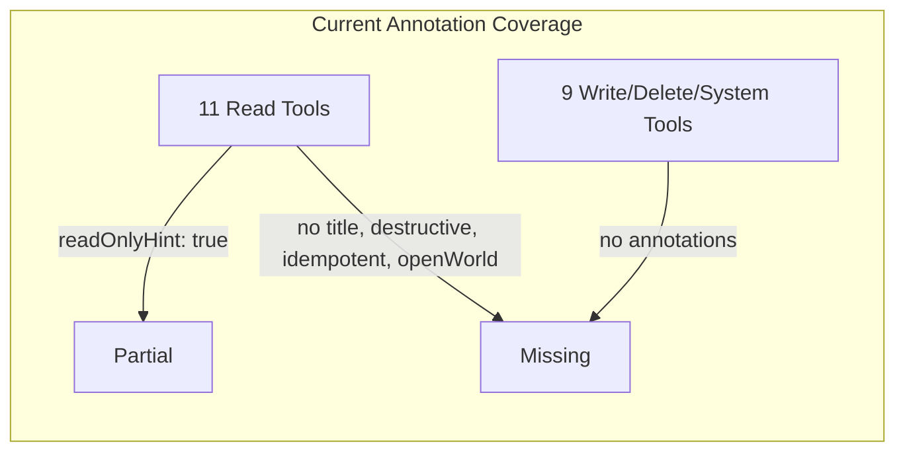
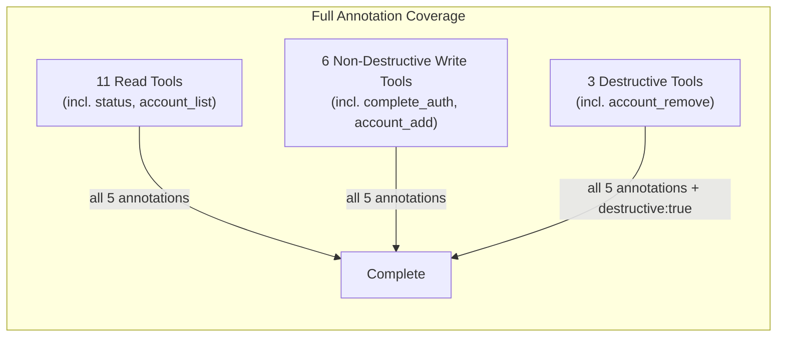
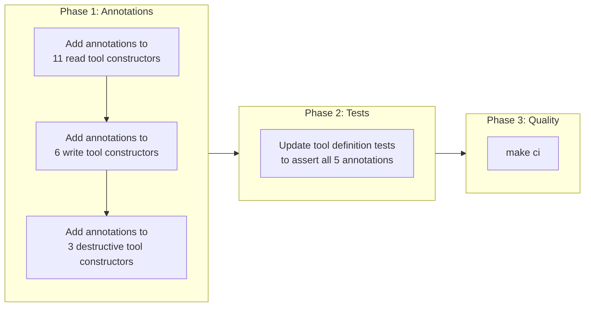

# MCP Tool Annotations for Directory Compliance

## Change Summary

Add complete MCP tool annotations (`title`, `readOnlyHint`, `destructiveHint`, `idempotentHint`, `openWorldHint`) to all 20 tool definitions. Currently only 11 read tools have `readOnlyHint: true`; no tools have `title`, `destructiveHint`, `idempotentHint`, or `openWorldHint`. This change brings the server into compliance with the Anthropic Software Directory Policy requirement that MCP servers provide all applicable annotations.

## Motivation and Background

The project is preparing for submission to the Anthropic MCP/Software Directory. The [Anthropic Software Directory Policy](https://support.claude.com/en/articles/13145358-anthropic-software-directory-policy) Section 5 (MCP Server-Specific Requirements) states:

> MCP servers must provide all applicable annotations, particularly *readOnlyHint*, *destructiveHint*, and *title*.

Tool annotations are part of the MCP specification and serve as hints to clients about tool behavior. They allow clients to present confirmation dialogs for destructive operations, auto-approve read-only tools, and display human-readable titles in tool pickers. Without these annotations, directory submission will be rejected.

## Change Drivers

* **Directory compliance:** Anthropic Software Directory Policy mandates tool annotations for listing.
* **Client UX:** Annotations enable Claude Desktop and other MCP clients to make informed decisions about tool invocation (e.g., confirming destructive actions, auto-approving reads).
* **Safety signaling:** `destructiveHint` marks tools that permanently delete data or send irreversible notifications, allowing clients to add confirmation steps.

## Current State

The mcp-go SDK (`github.com/mark3labs/mcp-go` v0.45.0) provides five annotation functions:

- `mcp.WithTitleAnnotation(string)`
- `mcp.WithReadOnlyHintAnnotation(bool)`
- `mcp.WithDestructiveHintAnnotation(bool)`
- `mcp.WithIdempotentHintAnnotation(bool)`
- `mcp.WithOpenWorldHintAnnotation(bool)`

Current annotation coverage across 20 tools:

| Annotation | Tools with it | Tools missing it |
|---|---|---|
| `title` | 0 | 20 |
| `readOnlyHint` | 11 (read tools only) | 9 (all write/delete/system tools) |
| `destructiveHint` | 0 | 20 |
| `idempotentHint` | 0 | 20 |
| `openWorldHint` | 0 | 20 |

### Current State Diagram



## Proposed Change

Add all five annotations to every tool constructor function (`New*Tool()`) in `internal/tools/`. Each tool receives the complete set of annotations as determined by the annotation matrix below. Annotations are added as arguments to `mcp.NewTool()` alongside existing `mcp.WithDescription()` and parameter definitions.

### MCP Annotation Semantics

The MCP spec defines five tool annotations. All are hints, not guarantees:

| Annotation | Type | Default | Semantics |
|---|---|---|---|
| `title` | string | — | Human-readable display name for UI tool pickers |
| `readOnlyHint` | bool | `false` | Tool does not modify any state; safe to auto-approve |
| `destructiveHint` | bool | `true` | Tool may irreversibly delete or damage data; clients should confirm |
| `idempotentHint` | bool | `false` | Calling multiple times with same args has no additional effect |
| `openWorldHint` | bool | `true` | Tool interacts with external entities beyond its defined inputs |

### Annotation Matrix

| Tool | Title | readOnly | destructive | idempotent | openWorld |
|---|---|---|---|---|---|
| `calendar_list` | List Calendars | `true` | `false` | `true` | `true` |
| `calendar_list_events` | List Calendar Events | `true` | `false` | `true` | `true` |
| `calendar_get_event` | Get Calendar Event | `true` | `false` | `true` | `true` |
| `calendar_search_events` | Search Calendar Events | `true` | `false` | `true` | `true` |
| `calendar_get_free_busy` | Get Free/Busy Schedule | `true` | `false` | `true` | `true` |
| `calendar_create_event` | Create Calendar Event | `false` | `false` | `false` | `true` |
| `calendar_update_event` | Update Calendar Event | `false` | `false` | `true` | `true` |
| `calendar_delete_event` | Delete Calendar Event | `false` | `true` | `true` | `true` |
| `calendar_cancel_event` | Cancel Calendar Event | `false` | `true` | `true` | `true` |
| `calendar_respond_event` | Respond to Event | `false` | `false` | `true` | `true` |
| `calendar_reschedule_event` | Reschedule Event | `false` | `false` | `true` | `true` |
| `mail_list_folders` | List Mail Folders | `true` | `false` | `true` | `true` |
| `mail_list_messages` | List Email Messages | `true` | `false` | `true` | `true` |
| `mail_search_messages` | Search Email Messages | `true` | `false` | `true` | `true` |
| `mail_get_message` | Get Email Message | `true` | `false` | `true` | `true` |
| `account_add` | Add Account | `false` | `false` | `false` | `true` |
| `account_list` | List Accounts | `true` | `false` | `true` | `false` |
| `account_remove` | Remove Account | `false` | `true` | `true` | `false` |
| `status` | Server Status | `true` | `false` | `true` | `false` |
| `complete_auth` | Complete Authentication | `false` | `false` | `false` | `true` |

### Rationale for Key Decisions

- **`destructiveHint: true`** on `calendar_delete_event`, `calendar_cancel_event`, `account_remove`: these permanently remove data or send irreversible cancellation notices to attendees.
- **`destructiveHint: false`** on `calendar_create_event`, `calendar_update_event`, `calendar_reschedule_event`, `calendar_respond_event`: these create or modify data but are reversible (events can be updated or deleted after creation).
- **`idempotentHint: true`** on `calendar_update_event`, `calendar_delete_event`, `calendar_cancel_event`, `calendar_respond_event`, `calendar_reschedule_event`, `account_remove`: calling with the same arguments produces the same result (Graph API PATCH/DELETE are idempotent).
- **`idempotentHint: false`** on `calendar_create_event`, `account_add`, `complete_auth`: each call creates a new resource or changes auth state.
- **`openWorldHint: false`** on `account_list`, `account_remove`, `status`: these operate only on local state (account registry file, server config). No external API calls are made.
- **`openWorldHint: true`** on all Microsoft Graph API tools: they call an external service.

### Proposed State Diagram



## Requirements

### Functional Requirements

1. Every tool registered via `server.go` **MUST** have all five annotations: `title`, `readOnlyHint`, `destructiveHint`, `idempotentHint`, `openWorldHint`.
2. Annotation values **MUST** match the annotation matrix defined in this CR.
3. Read tools (`calendar_list`, `calendar_list_events`, `calendar_get_event`, `calendar_search_events`, `calendar_get_free_busy`, `mail_list_folders`, `mail_list_messages`, `mail_search_messages`, `mail_get_message`, `account_list`, `status`) **MUST** set `readOnlyHint: true` and `destructiveHint: false`.
4. Destructive tools (`calendar_delete_event`, `calendar_cancel_event`, `account_remove`) **MUST** set `destructiveHint: true` and `readOnlyHint: false`.
5. Non-destructive write tools (`calendar_create_event`, `calendar_update_event`, `calendar_respond_event`, `calendar_reschedule_event`, `account_add`, `complete_auth`) **MUST** set `readOnlyHint: false` and `destructiveHint: false`.
6. Every tool **MUST** have a `title` annotation with a concise, human-readable display name.

### Non-Functional Requirements

1. Annotations **MUST** be set using the mcp-go SDK functions (`mcp.WithTitleAnnotation`, `mcp.WithReadOnlyHintAnnotation`, `mcp.WithDestructiveHintAnnotation`, `mcp.WithIdempotentHintAnnotation`, `mcp.WithOpenWorldHintAnnotation`) — not by direct struct manipulation.
2. Annotation values **MUST** be explicitly set even when they match the MCP spec defaults, to make intent clear and prevent silent breakage if defaults change.

## Affected Components

* `internal/tools/*.go` — 20 tool constructor functions
* `internal/tools/*_test.go` — tool definition tests

## Scope Boundaries

### In Scope

* Adding all five MCP annotations to every tool constructor in `internal/tools/`
* Updating tool definition tests to assert annotation correctness

### Out of Scope ("Here, But Not Further")

* Tool descriptions — already compliant with directory policy
* Tool parameter changes — no functional behavior changes
* Handler logic changes — annotations are metadata only
* `extension/manifest.json` tool entries — manifest does not carry annotation data; annotations are served at runtime via the MCP protocol

## Impact Assessment

### User Impact

No user-facing behavior changes. MCP clients that support annotations (e.g., Claude Desktop) will be able to display human-readable tool titles and present confirmation dialogs for destructive operations.

### Technical Impact

- **No breaking changes.** Annotations are additive metadata on the `mcp.Tool` struct.
- **No dependency changes.** The mcp-go SDK v0.45.0 already provides all required annotation functions.
- **No performance impact.** Annotations are static metadata set at tool registration time.

### Business Impact

Completing this CR unblocks submission to the Anthropic Software Directory, which is the primary distribution channel for MCP servers to Claude Desktop users.

## Implementation Approach

Single-phase implementation: add annotations to all 20 tool constructors, update tests, run quality checks.

### Implementation Flow



### Files Changed

| File | Change |
|---|---|
| `internal/tools/list_calendars.go` | Add title, destructive, idempotent, openWorld |
| `internal/tools/list_events.go` | Add title, destructive, idempotent, openWorld |
| `internal/tools/get_event.go` | Add title, destructive, idempotent, openWorld |
| `internal/tools/search_events.go` | Add title, destructive, idempotent, openWorld |
| `internal/tools/get_free_busy.go` | Add title, destructive, idempotent, openWorld |
| `internal/tools/create_event.go` | Add all 5 annotations |
| `internal/tools/update_event.go` | Add all 5 annotations |
| `internal/tools/delete_event.go` | Add all 5 annotations |
| `internal/tools/cancel_event.go` | Add all 5 annotations |
| `internal/tools/respond_event.go` | Add all 5 annotations |
| `internal/tools/reschedule_event.go` | Add all 5 annotations |
| `internal/tools/list_mail_folders.go` | Add title, destructive, idempotent, openWorld |
| `internal/tools/list_messages.go` | Add title, destructive, idempotent, openWorld |
| `internal/tools/search_messages.go` | Add title, destructive, idempotent, openWorld |
| `internal/tools/get_message.go` | Add title, destructive, idempotent, openWorld |
| `internal/tools/add_account.go` | Add all 5 annotations |
| `internal/tools/list_accounts.go` | Add title, destructive, idempotent, openWorld |
| `internal/tools/remove_account.go` | Add all 5 annotations |
| `internal/tools/status.go` | Add title, destructive, idempotent, openWorld |
| `internal/tools/complete_auth.go` | Add all 5 annotations |
| `internal/tools/*_test.go` | Add annotation assertions |

## Test Strategy

### Tests to Add

| Test File | Test Name | Description | Inputs | Expected Output |
|---|---|---|---|---|
| `internal/tools/list_calendars_test.go` | `TestListCalendarsToolAnnotations` | Verify all 5 annotations on calendar_list | Tool struct | title="List Calendars", readOnly=true, destructive=false, idempotent=true, openWorld=true |
| `internal/tools/create_event_test.go` | `TestCreateEventToolAnnotations` | Verify all 5 annotations on calendar_create_event | Tool struct | title="Create Calendar Event", readOnly=false, destructive=false, idempotent=false, openWorld=true |
| `internal/tools/delete_event_test.go` | `TestDeleteEventToolAnnotations` | Verify all 5 annotations on calendar_delete_event | Tool struct | title="Delete Calendar Event", readOnly=false, destructive=true, idempotent=true, openWorld=true |
| `internal/tools/cancel_event_test.go` | `TestCancelEventToolAnnotations` | Verify all 5 annotations on calendar_cancel_event | Tool struct | title="Cancel Calendar Event", readOnly=false, destructive=true, idempotent=true, openWorld=true |
| `internal/tools/remove_account_test.go` | `TestRemoveAccountToolAnnotations` | Verify all 5 annotations on account_remove | Tool struct | title="Remove Account", readOnly=false, destructive=true, idempotent=true, openWorld=false |
| `internal/tools/status_test.go` | `TestStatusToolAnnotations` | Verify all 5 annotations on status | Tool struct | title="Server Status", readOnly=true, destructive=false, idempotent=true, openWorld=false |
| `internal/tools/complete_auth_test.go` | `TestCompleteAuthToolAnnotations` | Verify all 5 annotations on complete_auth | Tool struct | title="Complete Authentication", readOnly=false, destructive=false, idempotent=false, openWorld=true |

One annotation test per tool (20 total). The table above shows representative examples; all 20 tools **MUST** have a corresponding annotation test.

### Tests to Modify

| Test File | Test Name | Current Behavior | New Behavior | Reason for Change |
|---|---|---|---|---|
| `internal/tools/*_test.go` | Existing `TestNew*Tool` tests (if they check tool struct) | May not assert on Annotations field | Assert Annotations field is non-nil and contains correct values | Annotations are now a required part of tool definition |

### Tests to Remove

Not applicable. No existing tests become obsolete from this change.

## Acceptance Criteria

### AC-1: All read tools have correct annotations

```gherkin
Given any of the 11 read tools (calendar_list, calendar_list_events, calendar_get_event,
      calendar_search_events, calendar_get_free_busy, mail_list_folders, mail_list_messages,
      mail_search_messages, mail_get_message, account_list, status)
When the tool is constructed via its New*Tool() function
Then the tool's Annotations field is non-nil
  And readOnlyHint is true
  And destructiveHint is false
  And idempotentHint is true
  And title is a non-empty human-readable string
```

### AC-2: All destructive tools have correct annotations

```gherkin
Given any of the 3 destructive tools (calendar_delete_event, calendar_cancel_event, account_remove)
When the tool is constructed via its New*Tool() function
Then the tool's Annotations field is non-nil
  And readOnlyHint is false
  And destructiveHint is true
  And idempotentHint is true
  And title is a non-empty human-readable string
```

### AC-3: All non-destructive write tools have correct annotations

```gherkin
Given any of the 6 non-destructive write tools (calendar_create_event, calendar_update_event,
      calendar_respond_event, calendar_reschedule_event, account_add, complete_auth)
When the tool is constructed via its New*Tool() function
Then the tool's Annotations field is non-nil
  And readOnlyHint is false
  And destructiveHint is false
  And title is a non-empty human-readable string
```

### AC-4: openWorldHint reflects external API usage

```gherkin
Given a tool that calls Microsoft Graph API (all tools except account_list, account_remove, status)
When the tool is constructed via its New*Tool() function
Then openWorldHint is true

Given a tool that operates on local state only (account_list, account_remove, status)
When the tool is constructed via its New*Tool() function
Then openWorldHint is false
```

### AC-5: Annotation values match the annotation matrix

```gherkin
Given the annotation matrix defined in this CR
When each of the 20 tools is constructed
Then every annotation value matches the corresponding cell in the matrix
  And no annotation is omitted
```

### AC-6: All quality checks pass

```gherkin
Given all annotation changes are applied
When make ci is executed
Then the build succeeds
  And all linter checks pass
  And all tests pass including new annotation tests
```

## Quality Standards Compliance

### Build & Compilation

- [ ] Code compiles/builds without errors
- [ ] No new compiler warnings introduced

### Linting & Code Style

- [ ] All linter checks pass with zero warnings/errors
- [ ] Code follows project coding conventions and style guides
- [ ] Any linter exceptions are documented with justification

### Test Execution

- [ ] All existing tests pass after implementation
- [ ] All new annotation tests pass
- [ ] Test coverage meets project requirements for changed code

### Documentation

- [ ] Go doc comments on tool constructors updated to mention annotations where relevant
- [ ] No API documentation changes needed (annotations are protocol-level metadata)
- [ ] No user-facing documentation changes needed

### Code Review

- [ ] Changes submitted via pull request
- [ ] PR title follows Conventional Commits format
- [ ] Code review completed and approved
- [ ] Changes squash-merged to maintain linear history

### Verification Commands

```bash
# Build verification
make build

# Lint verification
make lint

# Test execution
make test

# Full CI pipeline
make ci
```

## Dependencies

* mcp-go SDK v0.45.0 — already in `go.mod`; provides `WithTitleAnnotation`, `WithReadOnlyHintAnnotation`, `WithDestructiveHintAnnotation`, `WithIdempotentHintAnnotation`, `WithOpenWorldHintAnnotation`

## Decision Outcome

Chosen approach: "Explicit annotation on every tool using mcp-go SDK functions", because it satisfies the directory policy requirement, makes tool behavior self-documenting, and uses the existing SDK without additional dependencies.

## Related Items

* Policy: [Anthropic Software Directory Policy](https://support.claude.com/en/articles/13145358-anthropic-software-directory-policy)
* SDK: `github.com/mark3labs/mcp-go` v0.45.0 — annotation functions in `mcp/tools.go`
* Related CR: CR-0050 (Tool Naming & Manifest Sync) — established tool registration patterns
* Related CR: CR-0051 (Token-Efficient Response Defaults) — established output tiering

<!--
## CR Review Summary (2026-03-22)

**Findings: 1 | Fixes applied: 1 | Unresolvable items: 0**

### Finding 1 — Proposed State Diagram double-counted system tools (Contradiction, FIXED)
The Proposed State Diagram had four categories: "11 Read Tools", "6 Write Tools",
"3 Destructive Tools", and "System Tools (status, complete_auth)". Since `status`
is already counted in the 11 Read Tools and `complete_auth` in the 6 Write Tools,
the "System Tools" node caused a double-count exceeding 20 tools total. Fixed by
removing the "System Tools" node and adding parenthetical notes to the three
correct categories clarifying which tools they include.

### Verified (no issues found)
- **Internal contradictions**: All AC assertions are consistent with Functional
  Requirements and the Annotation Matrix. The varying `openWorldHint` and
  `idempotentHint` values within tool groups are correctly handled by splitting
  coverage across AC-1/AC-2/AC-3 (group-uniform properties) and AC-4/AC-5
  (per-tool values).
- **Ambiguity**: All requirements use "MUST" or "MUST NOT". The only "should" and
  "may" occurrences are in MCP spec semantics descriptions and current-state
  descriptions, not in project requirements.
- **Requirement-AC coverage**: Every FR (1-6) has at least one AC exercising it.
  NFRs (1-2) are implementation constraints verified implicitly by AC-5.
- **AC-test coverage**: Every AC (1-6) has corresponding test entries in the Test
  Strategy table. The 7 representative tests plus the "all 20 tools MUST have a
  corresponding annotation test" mandate cover all ACs.
- **Scope consistency**: Affected Components (`internal/tools/*.go`,
  `internal/tools/*_test.go`) match the Files Changed table (20 tool files +
  test wildcard) and the Implementation Approach phases.
- **Current State Diagram**: Accurately reflects codebase (11 tools with
  readOnlyHint only, 9 tools with no annotations).
- **Implementation Flow Diagram**: Phase sequence (Annotations -> Tests -> Quality)
  and sub-steps are consistent with described approach.
- **Tool count**: 20 tools confirmed against `server.go` registrations and
  `internal/tools/*.go` file listing.
- **Annotation matrix values**: Verified against source code for `complete_auth`
  (calls MSAL externally, openWorld=true correct), `account_add` (calls auth
  endpoints externally, openWorld=true correct), `account_remove` (local only,
  openWorld=false correct), `status` (local only, openWorld=false correct).
-->
