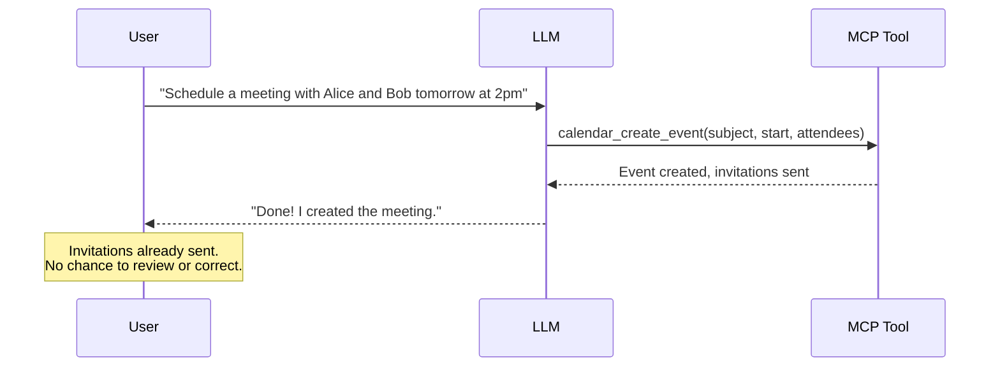
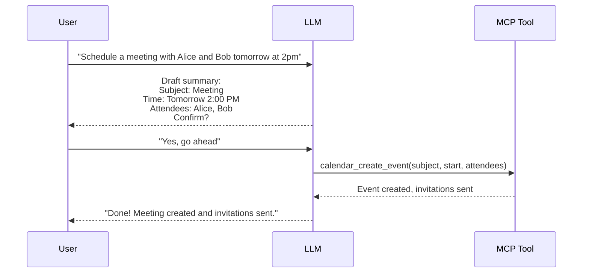
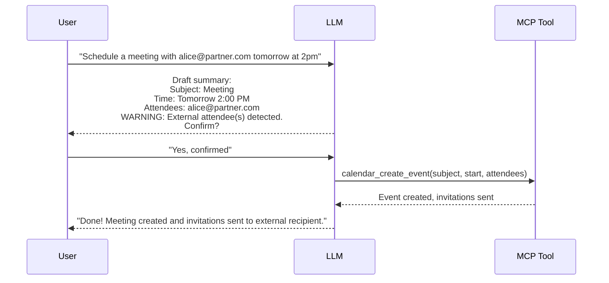
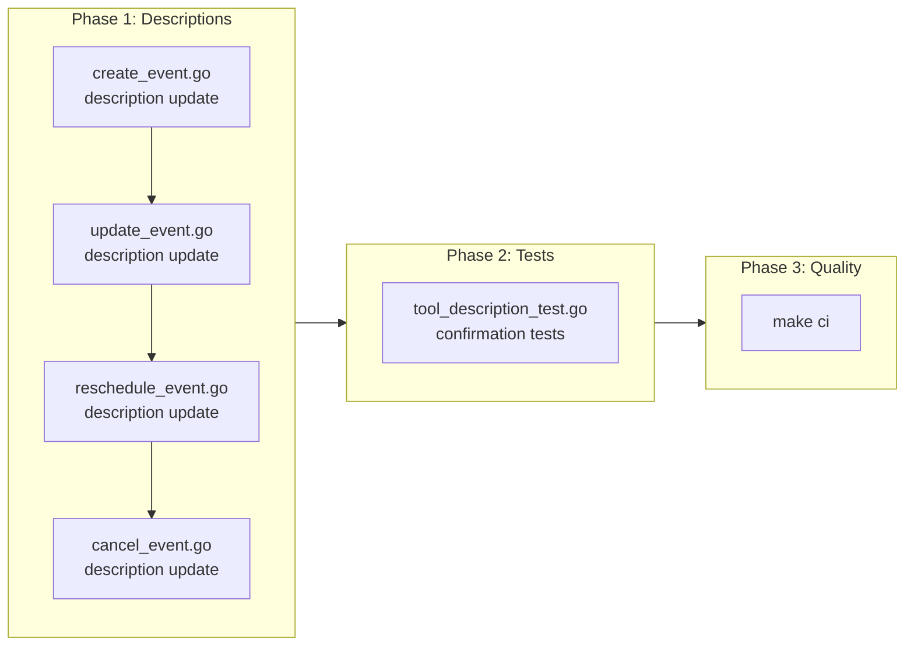

# User Confirmation for Attendee-Affecting Actions

## Change Summary

Update the tool descriptions of four calendar tools (`calendar_create_event`, `calendar_update_event`, `calendar_reschedule_event`, `calendar_cancel_event`) to instruct the LLM to present a draft summary to the user for explicit confirmation before calling the tool when attendees are involved. Add an extra warning when any attendee email domain is external to the organizer's domain. This is a description-only change -- no server-side enforcement, no new Go logic files, and no handler modifications.

## Motivation and Background

Creating a calendar event with attendees via `calendar_create_event` immediately sends invitation emails to every attendee listed. There is no confirmation step between the LLM deciding to call the tool and the invitations going out. This creates three problems:

1. **Wrong recipients**: If the LLM misinterprets the user's request and invites the wrong people, the invitations are already sent before the user can correct the mistake.
2. **Unfinished details**: The user may still be refining the event (time, agenda, location) but the LLM calls the tool prematurely, sending incomplete invitations.
3. **External attendees**: When attendees are outside the organizer's organization, invitations cross organizational boundaries. Sending a premature or incorrect invitation to an external contact is more embarrassing and harder to retract than an internal one.

The same risk applies to `calendar_update_event` (when adding new attendees triggers update notifications), `calendar_reschedule_event` (sends time-change notifications to all attendees), and `calendar_cancel_event` (sends cancellation notices to all attendees).

MCP tool descriptions are the primary mechanism for steering LLM behavior (established in CR-0039). Adding confirmation instructions to the tool descriptions is the most effective, least invasive, and universally compatible solution -- it works with all MCP clients regardless of elicitation support.

## Change Drivers

* **Irreversible notifications**: Calendar invitations, reschedule notifications, and cancellation notices are sent immediately and cannot be unsent.
* **LLM default behavior**: Without explicit instructions, LLMs call tools as soon as they have sufficient parameters, skipping user confirmation.
* **External attendee risk**: Cross-organization invitations have higher stakes (professional reputation, data exposure) than internal ones.
* **Existing pattern**: CR-0039 established that tool descriptions are the correct place for LLM behavioral guidance regarding attendee events.

## Current State

### Tool Descriptions (Attendee-Related Guidance)

The current `calendar_create_event` description includes CR-0039 guidance about providing body and location when attendees are present, but contains **no instruction** to confirm with the user before calling the tool:

> Create a new calendar event. Supports attendees (sends invitations automatically), Teams online meetings, recurrence, and all standard event properties.
>
> IMPORTANT: When attendees are included, always provide a body (agenda or description) and location so recipients understand the purpose and place of the meeting. Ask the user for these details or suggest appropriate values before creating the event.

The `calendar_update_event` description has equivalent body/location guidance but no confirmation instruction.

The `calendar_reschedule_event` and `calendar_cancel_event` descriptions have no attendee-related behavioral guidance at all.

### Current LLM-to-Tool Flow



## Proposed Change

### 1. Confirmation Instruction in Tool Descriptions

Add a new paragraph to each of the four affected tool descriptions that instructs the LLM to:
- Present a draft summary of the action to the user before calling the tool.
- Wait for explicit user confirmation before proceeding.
- Include an extra warning when any attendee email domain differs from the organizer's domain (external attendees).

The confirmation instruction is added as an `IMPORTANT` paragraph in the tool description, following the existing pattern established by CR-0039.

### 2. Proposed Description Changes

**`calendar_create_event`** -- append after the existing CR-0039 paragraph:

```
IMPORTANT: When the event includes attendees, you MUST present a draft
summary to the user and wait for explicit confirmation before calling
this tool. The summary MUST include: subject, date/time, attendee list,
location, and body preview. If any attendee email domain differs from the
user's own domain, add an explicit warning that external recipients will
receive the invitation. Only call this tool after the user confirms.
```

**`calendar_update_event`** -- append after the existing CR-0039 paragraph:

```
IMPORTANT: When the update adds or modifies attendees, you MUST present a
draft summary of the changes to the user and wait for explicit confirmation
before calling this tool. The summary MUST include the fields being changed
and the affected attendees. If any new attendee email domain differs from
the user's own domain, add an explicit warning that external recipients
will receive update notifications. Only call this tool after the user
confirms.
```

**`calendar_reschedule_event`** -- append to existing description:

```
IMPORTANT: When the event has attendees, rescheduling sends update
notifications to all attendees. You MUST present a draft summary to the
user showing the event subject, current time, proposed new time, and
attendee list, then wait for explicit confirmation before calling this
tool.
```

**`calendar_cancel_event`** -- append to existing description:

```
IMPORTANT: Cancelling sends a cancellation notice to ALL attendees
immediately. You MUST present a summary to the user showing the event
subject, time, and full attendee list, then wait for explicit confirmation
before calling this tool. If any attendee is external to the user's
organization, add an explicit warning about external cancellation notices.
```

### Proposed LLM-to-Tool Flow



### External Attendee Warning Flow



## Requirements

### Functional Requirements

1. The `calendar_create_event` tool description **MUST** instruct the LLM to present a draft summary to the user and wait for explicit confirmation before calling the tool when attendees are included.
2. The `calendar_create_event` tool description **MUST** specify that the draft summary includes: subject, date/time, attendee list, location, and body preview.
3. The `calendar_create_event` tool description **MUST** instruct the LLM to add an explicit warning when any attendee email domain differs from the user's own domain.
4. The `calendar_update_event` tool description **MUST** instruct the LLM to present a draft summary of changes and wait for explicit confirmation before calling the tool when attendees are added or modified.
5. The `calendar_update_event` tool description **MUST** instruct the LLM to add an explicit warning when any new attendee email domain differs from the user's own domain.
6. The `calendar_reschedule_event` tool description **MUST** instruct the LLM to present a draft summary (event subject, current time, proposed new time, attendee list) and wait for explicit confirmation before calling the tool when the event has attendees.
7. The `calendar_cancel_event` tool description **MUST** instruct the LLM to present a summary (event subject, time, attendee list) and wait for explicit confirmation before calling the tool.
8. The `calendar_cancel_event` tool description **MUST** instruct the LLM to add an explicit warning when any attendee is external to the user's organization.
9. All confirmation instructions **MUST** use the keyword "MUST" (not "should" or "consider") to maximize LLM compliance.
10. Events without attendees **MUST NOT** require user confirmation -- the confirmation instruction **MUST** be scoped to attendee-present scenarios only.

### Non-Functional Requirements

1. All description changes **MUST** be string-only modifications to the `mcp.WithDescription()` call in the corresponding `New*Tool()` function -- no handler logic changes, no new files, no new functions.
2. All new and modified code **MUST** include Go doc comments per project documentation standards.
3. All existing tests **MUST** continue to pass after the changes.
4. Tool description tests **MUST** be added to verify the presence of confirmation guidance text.

## Affected Components

| Component | Change |
|-----------|--------|
| `internal/tools/create_event.go` | Updated `NewCreateEventTool()` description string |
| `internal/tools/update_event.go` | Updated `NewUpdateEventTool()` description string |
| `internal/tools/reschedule_event.go` | Updated `NewRescheduleEventTool()` description string |
| `internal/tools/cancel_event.go` | Updated `NewCancelEventTool()` description string |
| `internal/tools/tool_description_test.go` | New tests asserting confirmation guidance in descriptions |

## Scope Boundaries

### In Scope

* Adding user confirmation instructions to the `calendar_create_event` tool description
* Adding user confirmation instructions to the `calendar_update_event` tool description
* Adding user confirmation instructions to the `calendar_reschedule_event` tool description
* Adding user confirmation instructions to the `calendar_cancel_event` tool description
* Adding external attendee warning instructions to `calendar_create_event`, `calendar_update_event`, and `calendar_cancel_event` descriptions
* Adding description tests to verify the presence of confirmation guidance text
* Updating the file-level package doc comment on `reschedule_event.go` and `cancel_event.go` if the description change warrants it

### Out of Scope ("Here, But Not Further")

* Server-side enforcement of confirmation -- the server **MUST NOT** reject tool calls that lack a confirmation token or flag. The confirmation is purely LLM behavioral guidance.
* New Go source files -- no new `.go` files are created by this CR.
* Handler logic changes -- no modifications to `HandleCreateEvent`, `HandleUpdateEvent`, `HandleRescheduleEvent`, or `HandleCancelEvent` functions.
* New parameters -- no new MCP tool parameters (e.g., `confirmed` boolean) are added.
* MCP elicitation-based confirmation -- would require client support not universally available.
* Read-only tools (`calendar_list_events`, `calendar_get_event`, etc.) -- read operations do not send notifications.
* `calendar_delete_event` -- delete already has `destructiveHint: true` annotation and sends cancellation notices automatically via Graph API; `calendar_cancel_event` is the recommended tool for attendee notification, so confirmation guidance is added there instead.
* `calendar_respond_event` -- responding to an invitation is a single-user action that does not send notifications to other attendees.

## Impact Assessment

### User Impact

Users will see the LLM present a draft summary before creating, updating, rescheduling, or cancelling events that involve attendees. This adds one confirmation turn to the conversation but prevents accidental invitations. Users creating events without attendees will see no change.

### Technical Impact

- **No breaking changes.** The changes are limited to string constants in tool descriptions.
- **No dependency changes.** No new packages or SDK features required.
- **No performance impact.** Tool descriptions are static metadata set at registration time.
- **No API changes.** Tool parameters and response formats are unchanged.

### Business Impact

Reduces the risk of accidental or premature calendar invitations, which directly affects user trust in the tool. External attendee warnings prevent professional embarrassment from sending incorrect invitations to people outside the organization.

## Implementation Approach

Single-phase implementation: update four tool description strings, add corresponding tests, run quality checks.

### Phase 1: Tool Description Updates

Update `NewCreateEventTool()` in `internal/tools/create_event.go`:
- Append confirmation instruction paragraph after the existing CR-0039 attendee guidance paragraph.

Update `NewUpdateEventTool()` in `internal/tools/update_event.go`:
- Append confirmation instruction paragraph after the existing CR-0039 attendee guidance paragraph.

Update `NewRescheduleEventTool()` in `internal/tools/reschedule_event.go`:
- Append confirmation instruction paragraph to the existing description.

Update `NewCancelEventTool()` in `internal/tools/cancel_event.go`:
- Append confirmation instruction paragraph to the existing description.

### Phase 2: Description Tests

Add tests in `internal/tools/tool_description_test.go`:
- Verify `calendar_create_event` description contains "confirmation" and "external" keywords.
- Verify `calendar_update_event` description contains "confirmation" and "external" keywords.
- Verify `calendar_reschedule_event` description contains "confirmation" keyword.
- Verify `calendar_cancel_event` description contains "confirmation" and "external" keywords.

### Phase 3: Quality Checks

Run `make ci` to verify build, lint, vet, fmt, and all tests pass.

### Implementation Flow



## Test Strategy

### Tests to Add

| Test File | Test Name | Description | Inputs | Expected Output |
|-----------|-----------|-------------|--------|-----------------|
| `tool_description_test.go` | `TestCreateEvent_DescriptionContainsConfirmationGuidance` | Verify create_event description contains user confirmation instruction | `NewCreateEventTool()` struct | Description contains "confirmation" and "MUST present" |
| `tool_description_test.go` | `TestCreateEvent_DescriptionContainsExternalWarningGuidance` | Verify create_event description contains external attendee warning | `NewCreateEventTool()` struct | Description contains "external" and "domain" |
| `tool_description_test.go` | `TestUpdateEvent_DescriptionContainsConfirmationGuidance` | Verify update_event description contains user confirmation instruction | `NewUpdateEventTool()` struct | Description contains "confirmation" and "MUST present" |
| `tool_description_test.go` | `TestUpdateEvent_DescriptionContainsExternalWarningGuidance` | Verify update_event description contains external attendee warning | `NewUpdateEventTool()` struct | Description contains "external" and "domain" |
| `tool_description_test.go` | `TestRescheduleEvent_DescriptionContainsConfirmationGuidance` | Verify reschedule_event description contains user confirmation instruction | `NewRescheduleEventTool()` struct | Description contains "confirmation" and "MUST present" |
| `tool_description_test.go` | `TestCancelEvent_DescriptionContainsConfirmationGuidance` | Verify cancel_event description contains user confirmation instruction | `NewCancelEventTool()` struct | Description contains "confirmation" and "MUST present" |
| `tool_description_test.go` | `TestCancelEvent_DescriptionContainsExternalWarningGuidance` | Verify cancel_event description contains external attendee warning | `NewCancelEventTool()` struct | Description contains "external" |

### Tests to Modify

Not applicable. Existing description tests (CR-0039) check for "attendees" and "recommended" keywords which remain present in the updated descriptions.

### Tests to Remove

Not applicable. No existing tests become obsolete from this change.

## Acceptance Criteria

### AC-1: create_event description contains confirmation instruction

```gherkin
Given the MCP server is running
When the client discovers the calendar_create_event tool
Then the tool description MUST contain an instruction to present a draft summary to the user
  And the tool description MUST contain an instruction to wait for explicit confirmation
  And the tool description MUST scope the confirmation requirement to events with attendees
```

### AC-2: create_event description contains external attendee warning

```gherkin
Given the MCP server is running
When the client discovers the calendar_create_event tool
Then the tool description MUST contain an instruction to warn when attendee email domains differ from the user's domain
```

### AC-3: update_event description contains confirmation instruction

```gherkin
Given the MCP server is running
When the client discovers the calendar_update_event tool
Then the tool description MUST contain an instruction to present a draft summary when attendees are added or modified
  And the tool description MUST contain an instruction to wait for explicit confirmation
```

### AC-4: update_event description contains external attendee warning

```gherkin
Given the MCP server is running
When the client discovers the calendar_update_event tool
Then the tool description MUST contain an instruction to warn when new attendee email domains differ from the user's domain
```

### AC-5: reschedule_event description contains confirmation instruction

```gherkin
Given the MCP server is running
When the client discovers the calendar_reschedule_event tool
Then the tool description MUST contain an instruction to present a draft summary with event subject, current time, proposed new time, and attendee list
  And the tool description MUST contain an instruction to wait for explicit confirmation
```

### AC-6: cancel_event description contains confirmation instruction

```gherkin
Given the MCP server is running
When the client discovers the calendar_cancel_event tool
Then the tool description MUST contain an instruction to present a summary to the user
  And the tool description MUST contain an instruction to wait for explicit confirmation
  And the tool description MUST contain an instruction to warn about external attendees
```

### AC-7: Events without attendees are unaffected

```gherkin
Given a user asks the LLM to create an event without any attendees
When the LLM reads the calendar_create_event tool description
Then the confirmation instruction is scoped to attendee-present scenarios only
  And the LLM is not instructed to seek confirmation for attendee-free events
```

### AC-8: Existing CR-0039 guidance preserved

```gherkin
Given the updated tool descriptions for calendar_create_event and calendar_update_event
When the existing CR-0039 description tests are executed
Then all existing tests MUST continue to pass
  And the descriptions MUST still contain attendee quality guidance about body and location
```

### AC-9: All quality checks pass

```gherkin
Given all description changes and new tests are applied
When make ci is executed
Then the build succeeds
  And all linter checks pass
  And all tests pass including new confirmation description tests
```

## Quality Standards Compliance

### Build & Compilation

- [ ] Code compiles/builds without errors
- [ ] No new compiler warnings introduced

### Linting & Code Style

- [ ] All linter checks pass with zero warnings/errors
- [ ] Code follows project coding conventions and style guides
- [ ] Any linter exceptions are documented with justification

### Test Execution

- [ ] All existing tests pass after implementation
- [ ] All new confirmation description tests pass
- [ ] Test coverage meets project requirements for changed code

### Documentation

- [ ] Go doc comments on tool constructors updated where the description change warrants it
- [ ] No API documentation changes needed (descriptions are protocol-level metadata)
- [ ] No user-facing documentation changes needed

### Code Review

- [ ] Changes submitted via pull request
- [ ] PR title follows Conventional Commits format
- [ ] Code review completed and approved
- [ ] Changes squash-merged to maintain linear history

### Verification Commands

```bash
# Build verification
make build

# Lint verification
make lint

# Test execution
make test

# Full CI pipeline
make ci
```

## Risks and Mitigation

### Risk 1: LLM ignores the confirmation instruction

**Likelihood:** medium
**Impact:** medium
**Mitigation:** The instruction uses "MUST" language and is placed in an "IMPORTANT:" block, which is the strongest steering mechanism available in tool descriptions. Different LLMs may comply at different rates, but the existing CR-0039 pattern has shown good compliance. The server-side advisory (from CR-0039) still fires as a secondary safety net after the tool call completes.

### Risk 2: Confirmation step degrades user experience for power users

**Likelihood:** medium
**Impact:** low
**Mitigation:** The confirmation only triggers for events with attendees. Solo events (personal reminders, time blocks) are not affected. Users who find the confirmation step unwanted can instruct the LLM to skip it in their conversation, which is the standard LLM override pattern.

### Risk 3: External domain detection is unreliable

**Likelihood:** low
**Impact:** low
**Mitigation:** The instruction asks the LLM to compare attendee email domains with the user's own domain. The LLM may not always know the user's domain, in which case it will skip the external warning. This is acceptable -- the warning is best-effort guidance, not a security boundary. The primary confirmation (which does not depend on domain detection) still applies.

### Risk 4: Tool descriptions become too long

**Likelihood:** low
**Impact:** low
**Mitigation:** Each tool receives approximately 40-60 additional words. The total description length remains well within MCP tool description norms. The text is structured with clear paragraphs and the "IMPORTANT:" prefix for easy LLM parsing.

## Dependencies

* CR-0039 (Event Quality Guardrails) -- established the tool description guidance pattern for attendee events and the "IMPORTANT:" block convention. This CR extends that pattern.
* CR-0052 (MCP Tool Annotations) -- established the current annotation values. Annotation values are not changed by this CR.

## Decision Outcome

Chosen approach: "Tool description confirmation instructions", because MCP tool descriptions are the primary mechanism for steering LLM behavior and require zero client-side changes. This approach is non-breaking (the server does not enforce confirmation), works with all MCP clients regardless of elicitation support, and follows the established pattern from CR-0039.

Alternatives considered:
- **Server-side confirmation parameter**: Adding a `confirmed: true` parameter that the tool requires would enforce confirmation at the server level. Rejected because it changes the tool API contract, requires client-side changes, and would break existing integrations.
- **MCP elicitation for confirmation**: Using the MCP elicitation protocol to prompt the user. Rejected because elicitation support is not universally available across MCP clients (CR-0031 established this constraint).
- **Separate confirmation tool**: A `calendar_confirm_draft` tool that the LLM must call before the actual tool. Rejected because it doubles the tool count, adds complexity, and relies on the LLM following a two-step protocol which is less reliable than a single description instruction.

## Related Items

* CR-0039 -- Event Quality Guardrails (established tool description guidance pattern for attendee events)
* CR-0052 -- MCP Tool Annotations (current annotation values; not modified by this CR)
* CR-0031 -- Elicitation Fallback (established that elicitation is not universally available)
