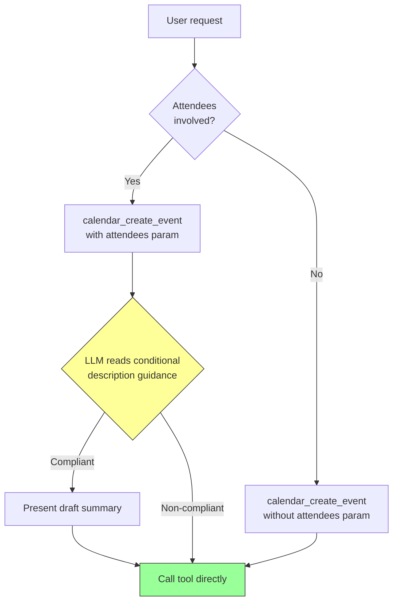
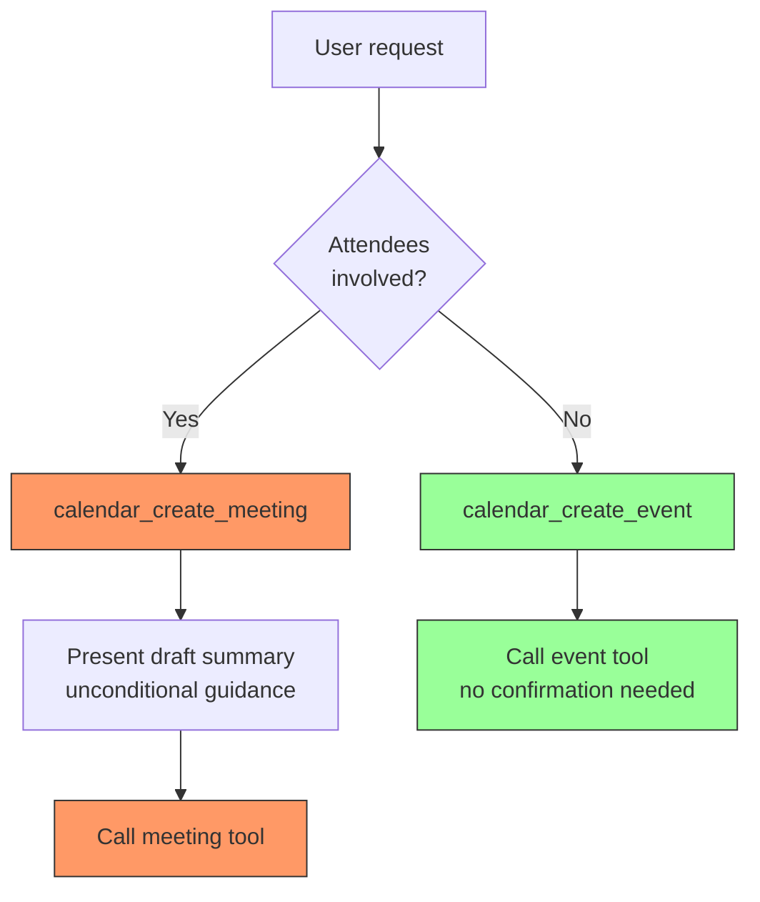
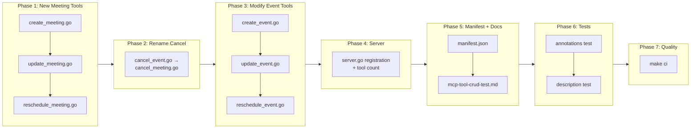

# Split Calendar Write Tools into Event and Meeting Variants

## Change Summary

Refactor the four calendar write tools affected by CR-0053 (`calendar_create_event`, `calendar_update_event`, `calendar_reschedule_event`, `calendar_cancel_event`) into separate "event" and "meeting" tool variants. Event tools handle operations without attendees and require no user confirmation. Meeting tools handle operations with attendees, carry confirmation guidance, and present a distinct tool identity that MCP clients can target with human-in-the-loop policies. `calendar_cancel_event` is renamed to `calendar_cancel_meeting` for naming consistency -- `calendar_delete_event` already serves as the no-attendee counterpart.

## Motivation and Background

CR-0053 added description-based confirmation instructions to four calendar write tools, scoped conditionally to "when attendees are present." While this approach works, it has two limitations:

1. **MCP clients cannot enforce confirmation per-tool.** The confirmation is embedded in a conditional paragraph inside the tool description. MCP clients that support human-in-the-loop policies (e.g., Claude Desktop's tool approval settings) operate at the tool level -- they can require approval for `calendar_create_event` or not, but they cannot distinguish "create event without attendees" from "create event with attendees" within the same tool. This means either all creates require approval (degraded UX for solo events) or none do (no safety net for meetings).

2. **Conditional description steering is fragile.** The LLM must parse conditional language ("When the event includes attendees...") and decide whether the condition applies. Splitting into two tools eliminates this ambiguity -- the LLM selects the correct tool based on whether attendees are involved, and the entire description of each tool is unconditionally applicable.

By splitting into separate tools, MCP clients gain a clean control surface: mark all `*_meeting` tools as requiring human approval while leaving `*_event` tools unrestricted.

## Change Drivers

* **Client-level human-in-the-loop control**: MCP clients enforce policies at the tool level, not at the parameter level. Separate tools enable per-tool approval policies.
* **Description clarity**: Each tool's description becomes shorter and unconditional, improving LLM compliance.
* **Semantic precision**: Microsoft Outlook distinguishes between events (personal calendar entries) and meetings (events with attendees). Aligning tool names with this terminology improves discoverability.
* **Tool selection signal**: An LLM choosing `calendar_create_meeting` is an explicit signal that attendees are involved, making the intent auditable and traceable.

## Current State

### Tool Landscape (Calendar Write Operations)

| Tool | Attendees | Confirmation Guidance | Notes |
|------|-----------|----------------------|-------|
| `calendar_create_event` | Optional parameter | Conditional (CR-0053) | Single tool handles both solo events and meetings |
| `calendar_update_event` | Optional parameter | Conditional (CR-0053) | Single tool handles both cases |
| `calendar_reschedule_event` | N/A (event may have attendees) | Conditional (CR-0053) | Same tool regardless of attendee presence |
| `calendar_cancel_event` | Inherently has attendees | Always (CR-0053) | Only meaningful for meetings; `delete_event` handles solo events |
| `calendar_delete_event` | N/A | None | Destructive hint already set |
| `calendar_respond_event` | N/A (single-user action) | None | Out of scope |

### Current LLM Tool Selection Flow



The yellow decision node is where the current approach is fragile -- the LLM must correctly evaluate a conditional instruction inside the description.

## Proposed Change

### 1. New Meeting Tools

Create three new meeting-specific tools that require or expect attendees:

| New Tool | Based On | Key Difference |
|----------|----------|----------------|
| `calendar_create_meeting` | `calendar_create_event` | `attendees` parameter is **required**; description includes unconditional confirmation guidance |
| `calendar_update_meeting` | `calendar_update_event` | `attendees` parameter is available; description includes unconditional confirmation guidance |
| `calendar_reschedule_meeting` | `calendar_reschedule_event` | Description includes unconditional confirmation guidance for attendee notifications |

### 2. Rename `calendar_cancel_event` to `calendar_cancel_meeting`

`calendar_cancel_event` is already inherently attendee-focused (its purpose is to send cancellation notices). Renaming it to `calendar_cancel_meeting` aligns with the new naming convention and makes the event/meeting distinction consistent. `calendar_delete_event` already serves as the no-attendee counterpart.

### 3. Modify Existing Event Tools

Remove attendee-related concerns from the event tools:

| Existing Tool | Changes |
|---------------|---------|
| `calendar_create_event` | Remove `attendees` parameter; remove CR-0053 confirmation guidance; remove CR-0039 attendee advisory guidance; add description note directing to `calendar_create_meeting` for events with attendees |
| `calendar_update_event` | Remove `attendees` parameter; remove CR-0053 confirmation guidance; remove CR-0039 attendee advisory guidance; add description note directing to `calendar_update_meeting` for attendee changes |
| `calendar_reschedule_event` | Remove CR-0053 confirmation guidance; add description note directing to `calendar_reschedule_meeting` for events with attendees |

### 4. Shared Handler Logic

Meeting tool handlers **MUST** reuse existing handler logic to avoid code duplication:

* `calendar_create_meeting` reuses `HandleCreateEvent` -- the handler already supports the `attendees` parameter. The difference is only in the tool definition (parameters and description).
* `calendar_update_meeting` reuses `HandleUpdateEvent` -- same handler, different tool definition.
* `calendar_reschedule_meeting` reuses `HandleRescheduleEvent` -- same handler, different tool definition.
* `calendar_cancel_meeting` reuses `HandleCancelEvent` -- same handler, renamed tool definition.

### Proposed LLM Tool Selection Flow



No conditional logic in descriptions. The LLM selects the right tool; the client enforces the right policy.

### Tool Landscape After Change

| Tool | Purpose | Attendees | Confirmation | HiTL Target |
|------|---------|-----------|-------------|-------------|
| `calendar_create_event` | Create personal event | Not accepted | None | No |
| `calendar_create_meeting` | Create event with attendees | **Required** | Unconditional | **Yes** |
| `calendar_update_event` | Update event fields | Not accepted | None | No |
| `calendar_update_meeting` | Update event including attendees | Available | Unconditional | **Yes** |
| `calendar_reschedule_event` | Reschedule personal event | N/A | None | No |
| `calendar_reschedule_meeting` | Reschedule event with attendees | N/A | Unconditional | **Yes** |
| `calendar_delete_event` | Delete event | N/A | None (destructive hint) | No |
| `calendar_cancel_meeting` | Cancel meeting with message | Inherent | Unconditional | **Yes** |
| `calendar_respond_event` | Respond to invitation | N/A | None | No |

## Requirements

### Functional Requirements

#### New Tool Definitions

1. A `calendar_create_meeting` tool **MUST** be created with the `attendees` parameter marked as required.
2. The `calendar_create_meeting` description **MUST** include unconditional confirmation guidance (no "when attendees are present" conditional).
3. The `calendar_create_meeting` description **MUST** include external attendee domain warning guidance.
4. The `calendar_create_meeting` description **MUST** include `AskUserQuestion` tool reference for collecting confirmation.
5. The `calendar_create_meeting` description **MUST** specify that the draft summary includes: subject, date/time, attendee list, location, and body preview.
6. A `calendar_update_meeting` tool **MUST** be created with the `attendees` parameter present as optional (updates may modify other fields while attendees exist on the event).
7. The `calendar_update_meeting` description **MUST** include unconditional confirmation guidance.
8. The `calendar_update_meeting` description **MUST** include external attendee domain warning guidance.
9. The `calendar_update_meeting` description **MUST** include `AskUserQuestion` tool reference for collecting confirmation.
10. A `calendar_reschedule_meeting` tool **MUST** be created with the same parameters as `calendar_reschedule_event`.
11. The `calendar_reschedule_meeting` description **MUST** include unconditional confirmation guidance referencing attendee notifications.
12. The `calendar_reschedule_meeting` description **MUST** include `AskUserQuestion` tool reference for collecting confirmation.

#### Renamed Tool

13. `calendar_cancel_event` **MUST** be renamed to `calendar_cancel_meeting` in tool name, annotations, description, server registration, middleware calls, audit operations, observability instrumentation, manifest entry, and all tests.
14. The `calendar_cancel_meeting` description **MUST** retain the existing unconditional confirmation guidance from CR-0053.

#### Modified Existing Tools

15. `calendar_create_event` **MUST** have the `attendees` parameter removed from its tool definition.
16. `calendar_create_event` **MUST** have all CR-0053 confirmation guidance removed from its description.
17. `calendar_create_event` **MUST** have the CR-0039 attendee advisory guidance removed from its description (the guidance moves to `calendar_create_meeting`).
18. `calendar_create_event` description **MUST** include a note directing the LLM to use `calendar_create_meeting` when attendees are needed.
19. `calendar_update_event` **MUST** have the `attendees` parameter removed from its tool definition.
20. `calendar_update_event` **MUST** have all CR-0053 confirmation guidance removed from its description.
21. `calendar_update_event` **MUST** have the CR-0039 attendee advisory guidance removed from its description (the guidance moves to `calendar_update_meeting`).
22. `calendar_update_event` description **MUST** include a note directing the LLM to use `calendar_update_meeting` when attendee changes are needed.
23. `calendar_reschedule_event` **MUST** have all CR-0053 confirmation guidance removed from its description.
24. `calendar_reschedule_event` description **MUST** include a note directing the LLM to use `calendar_reschedule_meeting` when the event has attendees.

#### Handler Reuse

25. `calendar_create_meeting` **MUST** reuse the existing `HandleCreateEvent` handler function.
26. `calendar_update_meeting` **MUST** reuse the existing `HandleUpdateEvent` handler function.
27. `calendar_reschedule_meeting` **MUST** reuse the existing `HandleRescheduleEvent` handler function.
28. `calendar_cancel_meeting` **MUST** reuse the existing `HandleCancelEvent` handler function.

#### Annotations

29. All new meeting tools **MUST** include the full set of five MCP annotations per CR-0052.
30. `calendar_create_meeting` annotations **MUST** be: ReadOnly=false, Destructive=false, Idempotent=false, OpenWorld=true.
31. `calendar_update_meeting` annotations **MUST** be: ReadOnly=false, Destructive=false, Idempotent=true, OpenWorld=true.
32. `calendar_reschedule_meeting` annotations **MUST** be: ReadOnly=false, Destructive=false, Idempotent=true, OpenWorld=true.
33. `calendar_cancel_meeting` annotations **MUST** retain: ReadOnly=false, Destructive=true, Idempotent=true, OpenWorld=true.

#### Description Quality

34. All confirmation instructions in meeting tool descriptions **MUST** use the keyword "MUST" (not "should" or "consider").
35. The `calendar_create_meeting` and `calendar_update_meeting` descriptions **MUST** include the CR-0039 attendee advisory guidance (body and location recommendations).

### Non-Functional Requirements

1. Each new meeting tool **MUST** be defined in its own file following the project's single-purpose file structure: `create_meeting.go`, `update_meeting.go`, `reschedule_meeting.go`.
2. The `calendar_cancel_meeting` tool definition **MUST** remain in `cancel_event.go` (renamed to `cancel_meeting.go`).
3. All new and modified code **MUST** include Go doc comments per project documentation standards.
4. All existing tests **MUST** continue to pass after the changes (with expected modifications to tests that reference renamed or modified tools).
5. The extension manifest (`extension/manifest.json`) **MUST** be updated to include the new meeting tools and reflect the `cancel_event` → `cancel_meeting` rename.
6. The CRUD test document (`docs/prompts/mcp-tool-crud-test.md`) **MUST** be updated to exercise the new meeting tools and the renamed cancel tool.
7. The tool count in `server.go` **MUST** be updated to reflect the three additional tools.

## Affected Components

| Component | Change |
|-----------|--------|
| `internal/tools/create_event.go` | Remove `attendees` parameter, remove CR-0053/CR-0039 attendee guidance, add meeting tool redirect note |
| `internal/tools/update_event.go` | Remove `attendees` parameter, remove CR-0053/CR-0039 attendee guidance, add meeting tool redirect note |
| `internal/tools/reschedule_event.go` | Remove CR-0053 confirmation guidance, add meeting tool redirect note |
| `internal/tools/cancel_event.go` | Rename to `cancel_meeting.go`; rename tool to `calendar_cancel_meeting` |
| `internal/tools/create_meeting.go` | **New file**: `NewCreateMeetingTool()` with attendees required, unconditional confirmation guidance |
| `internal/tools/update_meeting.go` | **New file**: `NewUpdateMeetingTool()` with attendees available, unconditional confirmation guidance |
| `internal/tools/reschedule_meeting.go` | **New file**: `NewRescheduleMeetingTool()` with unconditional confirmation guidance |
| `internal/server/server.go` | Register three new meeting tools, update cancel registration (name/audit changes), update tool count |
| `internal/tools/tool_annotations_test.go` | Add annotation tests for three new meeting tools, update cancel tool test |
| `internal/tools/tool_description_test.go` | Add description tests for meeting tools, update/remove CR-0053 event tests, update cancel tool references |
| `extension/manifest.json` | Add three new meeting tools, rename `calendar_cancel_event` → `calendar_cancel_meeting` |
| `docs/prompts/mcp-tool-crud-test.md` | Update CRUD test steps for new meeting tools and renamed cancel tool |

## Scope Boundaries

### In Scope

* Creating `calendar_create_meeting`, `calendar_update_meeting`, and `calendar_reschedule_meeting` tool definitions
* Renaming `calendar_cancel_event` to `calendar_cancel_meeting` (tool name, file name, all references)
* Removing the `attendees` parameter from `calendar_create_event` and `calendar_update_event`
* Removing CR-0053 conditional confirmation guidance from all three event tools
* Moving CR-0039 attendee advisory guidance from event tools to their meeting counterparts
* Adding redirect notes in event tool descriptions pointing to the meeting variant
* Reusing existing handlers for meeting tools (no handler logic changes)
* Updating server registration, manifest, annotations tests, description tests, CRUD test document

### Out of Scope ("Here, But Not Further")

* Handler logic changes -- no modifications to `HandleCreateEvent`, `HandleUpdateEvent`, `HandleRescheduleEvent`, or `HandleCancelEvent` functions. The handlers already support the required parameters; only tool definitions change.
* New validation logic -- no server-side enforcement of "event tools reject attendees" or "meeting tools require attendees." Parameter presence/absence is controlled by the tool definition, not handler guards.
* `calendar_delete_event` -- already serves as the no-attendee deletion tool. No changes needed.
* `calendar_respond_event` -- single-user action with no attendee notification risk. No changes needed.
* Read-only tools -- no changes to any calendar read tools.
* Mail tools -- no changes to any mail tools.
* Account tools -- no changes to any account management tools.
* MCP annotation value changes beyond what is specified -- annotation values for existing tools remain unchanged except for the cancel tool rename.
* Advisory logic changes -- `buildAdvisory()` and `advisory.go` remain unchanged. The advisory fires at handler level based on parameters, which is unaffected by tool definition changes.

## Impact Assessment

### User Impact

LLM consumers will see a clearer tool selection:
- Creating a personal event → LLM uses `calendar_create_event` (no approval prompt in clients with HiTL policies)
- Scheduling a meeting with attendees → LLM uses `calendar_create_meeting` (client may prompt for approval)
- The same pattern applies to update and reschedule operations

Users who configured MCP client policies for `calendar_cancel_event` will need to update those policies to reference `calendar_cancel_meeting`.

### Technical Impact

- **Breaking change for `calendar_cancel_event`**: Clients referencing this tool name by string (e.g., in tool allowlists or automation scripts) will need to update to `calendar_cancel_meeting`. This is acceptable at 0.x version.
- **Tool count increase**: 3 new tools added (15 → 18 base, 22 with mail, 23 with mail+auth_code).
- **No API changes**: Graph API calls remain identical. Parameters and response formats are unchanged.
- **No dependency changes**: No new packages or SDK features required.
- **No performance impact**: Tool definitions are static metadata set at registration time.

### Business Impact

Enables MCP clients to enforce human-in-the-loop policies for attendee-affecting operations at the tool level, which is more reliable than description-based LLM steering. This directly addresses the user trust concern that motivated CR-0053 with a structurally stronger solution.

## Implementation Approach

### Phase 1: New Meeting Tool Definitions

Create three new files with meeting-specific tool definitions:

**`internal/tools/create_meeting.go`**:
- `NewCreateMeetingTool()` returning `mcp.Tool` with name `calendar_create_meeting`
- Same parameters as `NewCreateEventTool()` except `attendees` is **required** (add `mcp.Required()`)
- Description: meeting creation with unconditional confirmation guidance, CR-0039 body/location advisory, external domain warning, AskUserQuestion reference
- Title annotation: "Create Calendar Meeting"
- Same annotations as `calendar_create_event` (ReadOnly=false, Destructive=false, Idempotent=false, OpenWorld=true)

**`internal/tools/update_meeting.go`**:
- `NewUpdateMeetingTool()` returning `mcp.Tool` with name `calendar_update_meeting`
- Same parameters as `NewUpdateEventTool()` (attendees remains optional -- updates may change other fields while attendees exist)
- Description: meeting update with unconditional confirmation guidance, CR-0039 body/location advisory, external domain warning, AskUserQuestion reference
- Title annotation: "Update Calendar Meeting"
- Same annotations as `calendar_update_event`

**`internal/tools/reschedule_meeting.go`**:
- `NewRescheduleMeetingTool()` returning `mcp.Tool` with name `calendar_reschedule_meeting`
- Same parameters as `NewRescheduleEventTool()`
- Description: meeting reschedule with unconditional confirmation guidance, attendee notification warning, AskUserQuestion reference
- Title annotation: "Reschedule Meeting"
- Same annotations as `calendar_reschedule_event`

### Phase 2: Rename Cancel Tool

Rename `internal/tools/cancel_event.go` to `internal/tools/cancel_meeting.go`:
- Rename `NewCancelEventTool()` to `NewCancelMeetingTool()`
- Change tool name from `calendar_cancel_event` to `calendar_cancel_meeting`
- Change title annotation to "Cancel Calendar Meeting"
- Update Go doc comments to reference "meeting" instead of "event"
- Update `HandleCancelEvent` references (logger tool name string)

Update `internal/server/server.go`:
- Change `tools.NewCancelEventTool()` to `tools.NewCancelMeetingTool()`
- Change `wrapWrite("calendar_cancel_event", ...)` to `wrapWrite("calendar_cancel_meeting", ...)`

### Phase 3: Modify Existing Event Tools

**`internal/tools/create_event.go`**:
- Remove the `attendees` parameter from `NewCreateEventTool()`
- Remove both IMPORTANT paragraphs (CR-0039 attendee advisory + CR-0053 confirmation)
- Add: "To create an event with attendees, use calendar_create_meeting instead."
- Remove attendee-related body/location description enhancements from parameter descriptions (optional -- they reference "when attendees are invited")

**`internal/tools/update_event.go`**:
- Remove the `attendees` parameter from `NewUpdateEventTool()`
- Remove both IMPORTANT paragraphs (CR-0039 attendee advisory + CR-0053 confirmation)
- Add: "To update attendees on an event, use calendar_update_meeting instead."
- Remove attendee-related body/location description enhancements from parameter descriptions

**`internal/tools/reschedule_event.go`**:
- Remove the IMPORTANT paragraph (CR-0053 confirmation)
- Add: "To reschedule an event that has attendees (sends update notifications), use calendar_reschedule_meeting instead."

### Phase 4: Server Registration

Update `internal/server/server.go`:
- Register `calendar_create_meeting` with `wrapWrite("calendar_create_meeting", "write", tools.HandleCreateEvent(...))`
- Register `calendar_update_meeting` with `wrapWrite("calendar_update_meeting", "write", tools.HandleUpdateEvent(...))`
- Register `calendar_reschedule_meeting` with `wrapWrite("calendar_reschedule_meeting", "write", tools.HandleRescheduleEvent(...))`
- Update tool count from 15 to 18 (base), adjust mail/auth_code conditionals accordingly

### Phase 5: Manifest and CRUD Test Updates

Update `extension/manifest.json`:
- Add entries for `calendar_create_meeting`, `calendar_update_meeting`, `calendar_reschedule_meeting`
- Rename `calendar_cancel_event` to `calendar_cancel_meeting`

Update `docs/prompts/mcp-tool-crud-test.md`:
- Add test steps exercising the new meeting tools
- Update cancel tool references from `calendar_cancel_event` to `calendar_cancel_meeting`

### Phase 6: Tests

Update/add tests in two test files:

**`internal/tools/tool_annotations_test.go`**:
- Add annotation tests for `calendar_create_meeting`, `calendar_update_meeting`, `calendar_reschedule_meeting`
- Update `calendar_cancel_event` annotation test to `calendar_cancel_meeting`

**`internal/tools/tool_description_test.go`**:
- Add description tests for meeting tools (confirmation guidance, external warning, AskUserQuestion, summary fields)
- Remove/update CR-0053 tests that asserted confirmation guidance in event tools
- Remove/update CR-0039 tests that asserted attendee guidance in event tools
- Update cancel tool test references
- Add tests verifying event tools contain redirect notes to meeting variants

### Phase 7: Quality Checks

Run `make ci` to verify build, lint, vet, fmt, and all tests pass.

### Implementation Flow



## Test Strategy

### Tests to Add

| Test File | Test Name | Description | Inputs | Expected Output |
|-----------|-----------|-------------|--------|-----------------|
| `tool_annotations_test.go` | `TestCreateMeeting_Annotations` | Verify create_meeting has correct 5-annotation set | `NewCreateMeetingTool()` | ReadOnly=false, Destructive=false, Idempotent=false, OpenWorld=true |
| `tool_annotations_test.go` | `TestUpdateMeeting_Annotations` | Verify update_meeting has correct 5-annotation set | `NewUpdateMeetingTool()` | ReadOnly=false, Destructive=false, Idempotent=true, OpenWorld=true |
| `tool_annotations_test.go` | `TestRescheduleMeeting_Annotations` | Verify reschedule_meeting has correct 5-annotation set | `NewRescheduleMeetingTool()` | ReadOnly=false, Destructive=false, Idempotent=true, OpenWorld=true |
| `tool_description_test.go` | `TestCreateMeeting_DescriptionContainsConfirmationGuidance` | Verify create_meeting description contains unconditional confirmation | `NewCreateMeetingTool()` | Description contains "MUST present" and "confirmation" |
| `tool_description_test.go` | `TestCreateMeeting_DescriptionContainsExternalWarningGuidance` | Verify create_meeting description contains external attendee warning | `NewCreateMeetingTool()` | Description contains "external" and "domain" |
| `tool_description_test.go` | `TestCreateMeeting_DescriptionContainsSummaryFields` | Verify create_meeting description specifies required summary fields | `NewCreateMeetingTool()` | Description contains "subject", "date/time", "attendee list", "location", "body preview" |
| `tool_description_test.go` | `TestCreateMeeting_DescriptionContainsAttendeeAdvisory` | Verify create_meeting description contains CR-0039 body/location guidance | `NewCreateMeetingTool()` | Description contains "body" and "location" recommendation |
| `tool_description_test.go` | `TestUpdateMeeting_DescriptionContainsConfirmationGuidance` | Verify update_meeting description contains unconditional confirmation | `NewUpdateMeetingTool()` | Description contains "MUST present" and "confirmation" |
| `tool_description_test.go` | `TestUpdateMeeting_DescriptionContainsExternalWarningGuidance` | Verify update_meeting description contains external attendee warning | `NewUpdateMeetingTool()` | Description contains "external" and "domain" |
| `tool_description_test.go` | `TestUpdateMeeting_DescriptionContainsAttendeeAdvisory` | Verify update_meeting description contains CR-0039 body/location guidance | `NewUpdateMeetingTool()` | Description contains "body" and "location" recommendation |
| `tool_description_test.go` | `TestRescheduleMeeting_DescriptionContainsConfirmationGuidance` | Verify reschedule_meeting description contains unconditional confirmation | `NewRescheduleMeetingTool()` | Description contains "MUST present" and "confirmation" |
| `tool_description_test.go` | `TestMeetingConfirmationInstructions_UseMUSTKeyword` | Verify all meeting tool confirmation instructions use "MUST" | All `New*MeetingTool()` | Each description contains "MUST" |
| `tool_description_test.go` | `TestMeetingConfirmationInstructions_AskUserQuestionGuidance` | Verify all meeting tools reference AskUserQuestion | All `New*MeetingTool()` | Each description contains "AskUserQuestion" |
| `tool_description_test.go` | `TestCreateEvent_DescriptionContainsMeetingRedirect` | Verify create_event directs to create_meeting for attendees | `NewCreateEventTool()` | Description contains "calendar_create_meeting" |
| `tool_description_test.go` | `TestUpdateEvent_DescriptionContainsMeetingRedirect` | Verify update_event directs to update_meeting for attendees | `NewUpdateEventTool()` | Description contains "calendar_update_meeting" |
| `tool_description_test.go` | `TestRescheduleEvent_DescriptionContainsMeetingRedirect` | Verify reschedule_event directs to reschedule_meeting for attendees | `NewRescheduleEventTool()` | Description contains "calendar_reschedule_meeting" |
| `tool_description_test.go` | `TestCreateEvent_NoAttendeesParameter` | Verify create_event has no attendees parameter after split | `NewCreateEventTool()` | InputSchema.Properties does not contain "attendees" key |
| `tool_description_test.go` | `TestCreateEvent_NoConfirmationGuidance` | Verify create_event has no CR-0053 confirmation guidance after split | `NewCreateEventTool()` | Description does not contain "MUST present" or "confirmation" |
| `tool_description_test.go` | `TestCreateEvent_NoCR0039AttendeeAdvisory` | Verify create_event has no CR-0039 attendee advisory after split | `NewCreateEventTool()` | Description does not contain "attendees are included" advisory text |
| `tool_description_test.go` | `TestUpdateEvent_NoAttendeesParameter` | Verify update_event has no attendees parameter after split | `NewUpdateEventTool()` | InputSchema.Properties does not contain "attendees" key |
| `tool_description_test.go` | `TestUpdateEvent_NoConfirmationGuidance` | Verify update_event has no CR-0053 confirmation guidance after split | `NewUpdateEventTool()` | Description does not contain "MUST present" or "confirmation" |
| `tool_description_test.go` | `TestUpdateEvent_NoCR0039AttendeeAdvisory` | Verify update_event has no CR-0039 attendee advisory after split | `NewUpdateEventTool()` | Description does not contain "attendees are included" advisory text |
| `tool_description_test.go` | `TestRescheduleEvent_NoConfirmationGuidance` | Verify reschedule_event has no CR-0053 confirmation guidance after split | `NewRescheduleEventTool()` | Description does not contain "MUST present" or "confirmation" |

### Tests to Modify

| Test File | Test Name | Current Behavior | New Behavior | Reason for Change |
|-----------|-----------|------------------|--------------|-------------------|
| `tool_annotations_test.go` | `TestCancelEvent_Annotations` | Tests `calendar_cancel_event` annotations | Tests `calendar_cancel_meeting` annotations | Tool renamed |
| `tool_description_test.go` | `TestCancelEvent_DescriptionContainsConfirmationGuidance` | Tests `calendar_cancel_event` description | Tests `calendar_cancel_meeting` description | Tool renamed |
| `tool_description_test.go` | `TestCancelEvent_DescriptionContainsExternalWarningGuidance` | Tests `calendar_cancel_event` description | Tests `calendar_cancel_meeting` description | Tool renamed |
| `tool_description_test.go` | `TestConfirmationInstructions_ScopedToAttendees` | Verifies conditional scoping on all four event tools | Updated to verify unconditional guidance on meeting tools only | Confirmation moved from event to meeting tools |
| `tool_description_test.go` | `TestConfirmationInstructions_UseMUSTKeyword` | Checks MUST keyword on four event tools | Updated to check MUST keyword on four meeting tools | Confirmation moved from event to meeting tools |
| `tool_description_test.go` | `TestConfirmationInstructions_AskUserQuestionGuidance` | Checks AskUserQuestion on four event tools | Updated to check AskUserQuestion on four meeting tools | Confirmation moved from event to meeting tools |

### Tests to Remove

| Test File | Test Name | Reason for Removal |
|-----------|-----------|-------------------|
| `tool_description_test.go` | `TestCreateEvent_DescriptionContainsConfirmationGuidance` | Confirmation guidance moved to `calendar_create_meeting` |
| `tool_description_test.go` | `TestCreateEvent_DescriptionContainsExternalWarningGuidance` | External warning moved to `calendar_create_meeting` |
| `tool_description_test.go` | `TestCreateEvent_DescriptionContainsSummaryFields` | Summary fields requirement moved to `calendar_create_meeting` |
| `tool_description_test.go` | `TestCreateEvent_DescriptionContainsAttendeeGuidance` | CR-0039 attendee guidance moved to `calendar_create_meeting` |
| `tool_description_test.go` | `TestUpdateEvent_DescriptionContainsConfirmationGuidance` | Confirmation guidance moved to `calendar_update_meeting` |
| `tool_description_test.go` | `TestUpdateEvent_DescriptionContainsExternalWarningGuidance` | External warning moved to `calendar_update_meeting` |
| `tool_description_test.go` | `TestUpdateEvent_DescriptionContainsAttendeeGuidance` | CR-0039 attendee guidance moved to `calendar_update_meeting` |
| `tool_description_test.go` | `TestRescheduleEvent_DescriptionContainsConfirmationGuidance` | Confirmation guidance moved to `calendar_reschedule_meeting` |

## Acceptance Criteria

### AC-1: calendar_create_meeting tool exists with required attendees

```gherkin
Given the MCP server is running
When the client discovers available tools
Then a tool named "calendar_create_meeting" MUST be present
  And it MUST have the "attendees" parameter marked as required
  And it MUST have all five MCP annotations set
```

### AC-2: calendar_create_meeting has unconditional confirmation guidance

```gherkin
Given the MCP server is running
When the client discovers the calendar_create_meeting tool
Then the tool description MUST contain confirmation guidance without conditional attendee scoping
  And the description MUST contain "MUST present"
  And the description MUST contain external domain warning guidance
  And the description MUST contain "AskUserQuestion"
  And the description MUST specify summary fields: subject, date/time, attendee list, location, body preview
```

### AC-3: calendar_update_meeting tool exists

```gherkin
Given the MCP server is running
When the client discovers available tools
Then a tool named "calendar_update_meeting" MUST be present
  And its description MUST contain unconditional confirmation guidance
  And its description MUST contain external domain warning guidance
  And its description MUST contain "AskUserQuestion"
```

### AC-4: calendar_reschedule_meeting tool exists

```gherkin
Given the MCP server is running
When the client discovers available tools
Then a tool named "calendar_reschedule_meeting" MUST be present
  And its description MUST contain unconditional confirmation guidance for attendee notifications
  And its description MUST contain "AskUserQuestion"
```

### AC-5: calendar_cancel_event renamed to calendar_cancel_meeting

```gherkin
Given the MCP server is running
When the client discovers available tools
Then a tool named "calendar_cancel_meeting" MUST be present
  And a tool named "calendar_cancel_event" MUST NOT exist
  And the cancel_meeting tool MUST retain its existing confirmation guidance
  And the cancel_meeting tool MUST retain destructiveHint=true
```

### AC-6: calendar_create_event has no attendees parameter and no attendee guidance

```gherkin
Given the MCP server is running
When the client discovers the calendar_create_event tool
Then the tool MUST NOT have an "attendees" parameter
  And the description MUST NOT contain CR-0053 confirmation guidance
  And the description MUST NOT contain CR-0039 attendee advisory guidance
  And the description MUST contain a reference to "calendar_create_meeting"
```

### AC-7: calendar_update_event has no attendees parameter and no attendee guidance

```gherkin
Given the MCP server is running
When the client discovers the calendar_update_event tool
Then the tool MUST NOT have an "attendees" parameter
  And the description MUST NOT contain CR-0053 confirmation guidance
  And the description MUST NOT contain CR-0039 attendee advisory guidance
  And the description MUST contain a reference to "calendar_update_meeting"
```

### AC-8: calendar_reschedule_event has no confirmation guidance

```gherkin
Given the MCP server is running
When the client discovers the calendar_reschedule_event tool
Then the description MUST NOT contain confirmation guidance
  And the description MUST contain a reference to "calendar_reschedule_meeting"
```

### AC-9: Meeting tools reuse existing handlers

```gherkin
Given the implementation of calendar_create_meeting, calendar_update_meeting, and calendar_reschedule_meeting
When the server.go registration is inspected
Then each meeting tool MUST call the same handler function as its event counterpart
  And new handler functions MUST NOT be created for meeting tools
```

### AC-10: Extension manifest updated

```gherkin
Given the extension manifest at extension/manifest.json
When the tools array is inspected
Then it MUST contain entries for calendar_create_meeting, calendar_update_meeting, and calendar_reschedule_meeting
  And it MUST contain calendar_cancel_meeting (not calendar_cancel_event)
  And the total tool count MUST reflect the additions
```

### AC-11: All quality checks pass

```gherkin
Given all code changes are applied
When make ci is executed
Then the build succeeds
  And all linter checks pass
  And all tests pass including new and modified tests
```

### AC-12: Meeting tool descriptions use MUST keyword

```gherkin
Given the descriptions of all four meeting tools
When the confirmation instruction text is inspected
Then every confirmation instruction MUST use the keyword "MUST" for the confirmation directive
```

### AC-13: CR-0039 guidance preserved in meeting tools

```gherkin
Given the calendar_create_meeting and calendar_update_meeting descriptions
When the description text is inspected
Then each MUST contain guidance about providing body and location when attendees are included
```

## Quality Standards Compliance

### Build & Compilation

- [ ] Code compiles/builds without errors
- [ ] No new compiler warnings introduced

### Linting & Code Style

- [ ] All linter checks pass with zero warnings/errors
- [ ] Code follows project coding conventions and style guides
- [ ] Any linter exceptions are documented with justification

### Test Execution

- [ ] All existing tests pass after implementation (with expected modifications)
- [ ] All new meeting tool tests pass
- [ ] Test coverage meets project requirements for changed code

### Documentation

- [ ] Go doc comments on all new tool constructors
- [ ] Go doc comments updated on modified tool constructors
- [ ] File-level package doc comments on new files
- [ ] CRUD test document updated

### Code Review

- [ ] Changes submitted via pull request
- [ ] PR title follows Conventional Commits format
- [ ] Code review completed and approved
- [ ] Changes squash-merged to maintain linear history

### Verification Commands

```bash
# Build verification
make build

# Lint verification
make lint

# Test execution
make test

# Full CI pipeline
make ci
```

## Risks and Mitigation

### Risk 1: LLM selects the wrong tool variant

**Likelihood:** medium
**Impact:** medium
**Mitigation:** Event tool descriptions include explicit redirect notes ("use calendar_create_meeting when attendees are needed"). If the LLM selects `calendar_create_event` and tries to pass attendees, the parameter will not be recognized (not in the tool definition), forcing the LLM to reconsider. The meeting tool descriptions clearly state their purpose. Additionally, MCP clients with tool approval policies provide a secondary safety net.

### Risk 2: Breaking change for calendar_cancel_event consumers

**Likelihood:** medium
**Impact:** low
**Mitigation:** The project is at version 0.x, where breaking changes are acceptable. The rename is documented in release notes. The tool's behavior is unchanged -- only the name changes. MCP clients that reference tool names in allowlists or scripts will need a one-line update.

### Risk 3: Tool count increase adds discovery overhead

**Likelihood:** low
**Impact:** low
**Mitigation:** Three additional tools (15 → 18 base, or 22 with mail, 23 with mail+auth_code) is within normal MCP server range. The event/meeting naming convention makes the relationship obvious. Tools are grouped by domain prefix (`calendar_`) for easy scanning.

### Risk 4: Handler reuse creates implicit coupling

**Likelihood:** low
**Impact:** low
**Mitigation:** Meeting tools call the same handlers as event tools. If a handler's behavior needs to diverge in the future (e.g., meeting-specific validation), the handler can be wrapped or replaced at that time. The current approach avoids premature abstraction while keeping the door open for future specialization.

## Dependencies

* CR-0053 (User Confirmation for Attendee-Affecting Actions) -- this CR supersedes CR-0053's description-only approach by moving confirmation guidance from conditional paragraphs in event tools to unconditional guidance in dedicated meeting tools.
* CR-0052 (MCP Tool Annotations) -- all new tools must comply with the annotation matrix.
* CR-0039 (Event Quality Guardrails) -- attendee advisory guidance moves from event tools to meeting tools.

## Decision Outcome

Chosen approach: "Split calendar write tools into event and meeting variants", because it provides MCP clients with a clean per-tool control surface for human-in-the-loop enforcement, eliminates conditional description steering, aligns tool naming with Microsoft Outlook's event/meeting terminology, and makes the LLM's intent (solo event vs. attendee meeting) explicit and auditable through tool selection.

Alternatives considered:
- **Keep CR-0053 description-only approach**: Works but MCP clients cannot enforce confirmation at the tool level. The conditional scoping adds fragility.
- **Add a `confirmed` boolean parameter**: Would require handler changes and shifts enforcement to the server. Rejected because it changes the API contract and provides a worse developer experience.
- **Use MCP annotation overloading (e.g., set destructiveHint=true on meeting tools)**: Semantically incorrect -- creating a meeting is not destructive. Annotations should reflect the tool's actual behavior, not encode policy preferences.

## Related Items

* CR-0053 -- User Confirmation for Attendee-Affecting Actions (superseded by this CR for the implementation approach; the confirmation requirements remain valid)
* CR-0052 -- MCP Tool Annotations (annotation matrix for new tools)
* CR-0039 -- Event Quality Guardrails (attendee body/location advisory moves to meeting tools)
* CR-0008 -- Create and Update Event Tools (original tool implementation)
* CR-0009 -- Delete and Cancel Event Tools (cancel tool rename)
* CR-0042 -- Reschedule Event (original reschedule implementation)

<!--
## CR Review Summary

Reviewer: Claude (automated)
Date: 2026-04-01

### Findings: 7 total, 7 fixed, 0 unresolvable

1. **[Contradiction] Tool count arithmetic in Risk 3** -- "18 → 21 including mail" was incorrect.
   Current base=15, +3=18; +mail=22; +auth_code=23. Fixed Risk 3 and Technical Impact to use
   consistent arithmetic: "15 → 18 base, 22 with mail, 23 with mail+auth_code."

2. **[Ambiguity] AC-5 awkward negation** -- "no tool named 'calendar_cancel_event' MUST exist"
   reads as "not required to exist" rather than "must not exist." Fixed to
   "a tool named 'calendar_cancel_event' MUST NOT exist."

3. **[Ambiguity] FR-6 vague "available"** -- "attendees parameter available" is imprecise.
   Fixed to "attendees parameter present as optional."

4. **[Ambiguity] FR-35 "where applicable"** -- Vague scoping. Replaced with explicit tool
   names: "The calendar_create_meeting and calendar_update_meeting descriptions MUST include..."

5. **[Coverage gap] FR-17/FR-21 missing AC coverage** -- CR-0039 attendee advisory removal
   from create_event (FR-17) and update_event (FR-21) had no AC verification. Added
   "MUST NOT contain CR-0039 attendee advisory guidance" clauses to AC-6 and AC-7.

6. **[Coverage gap] Negative assertion tests missing** -- AC-6, AC-7, AC-8 assert that
   event tools MUST NOT have attendee parameters or confirmation guidance, but no test
   entries verified these negative assertions. Added 8 negative-assertion test entries
   to the Test Strategy "Tests to Add" table.

7. **[Coverage gap] AC-5 title updated** -- AC-6 and AC-7 titles updated to reflect
   expanded scope ("no attendees parameter and no attendee guidance").

### Items noted but not changed (require human decision)

- README.md is not listed in Affected Components. Tool reference sections in the README
  will become stale after this CR (tool descriptions, tool count). If README updates are
  intentionally deferred to a separate pass, no action needed. Otherwise, add README.md
  to the Affected Components table and add a documentation phase to the Implementation
  Approach.
-->
