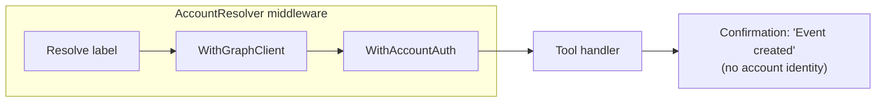
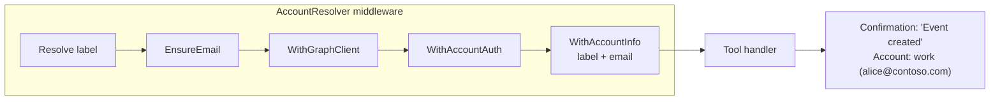
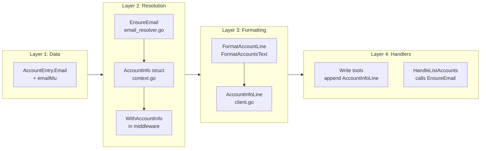

# Email-Based Account Identity Display

## Change Summary

Tool confirmation responses and account listings currently identify accounts by their internal label (e.g., `"default"`, `"work"`). This change introduces email address resolution from the Microsoft Graph `/me` endpoint and surfaces that address wherever an account is referenced, so users always see a human-identifiable email (e.g., `alice@contoso.com`) alongside—or instead of—the opaque label.

## Motivation and Background

Multi-account support (CR-0025) lets users register several Microsoft accounts, each identified by a short label they chose at registration. Labels like `"default"` or `"work"` carry no intrinsic identity; a user who has forgotten which label maps to which mailbox must run `account_list` and still cannot confirm the mapping without seeing an email address. This disconnect causes user confusion, especially in LLM-mediated workflows where the model relays tool results verbatim.

The fix is to lazily resolve each account's email address from the Graph API once, cache it for the server lifetime, and include it in every account-related output surface: write-tool confirmations, `account_list` results, and elicitation prompts.

## Change Drivers

* User confusion: label-only output does not communicate which mailbox an action affects.
* LLM relay gap: without an email address the model cannot ground account references for the user.
* Low-friction design: lazy resolution avoids an extra API call at startup while keeping the information available when needed.

## Current State

The account resolution pipeline (`AccountResolver` middleware) resolves a label to an `AccountEntry` and injects the Graph client and `AccountAuth` into the request context. Tool handlers call `GraphClient(ctx)` to obtain the client. Write-tool confirmations (create, update, reschedule, respond, delete, cancel) return text that identifies the acting account by label only via a static header, or omit account identity entirely. `account_list` returns label and authentication state but no email.

### Current State Diagram



## Proposed Change

1. **`AccountEntry.Email` field** (registry) — a `string` field that stores the lazily fetched email address. Protected from concurrent fetch by an `emailMu sync.Mutex`.
2. **`EnsureEmail` helper** (`internal/auth/email_resolver.go`) — calls `GET /me`, populates `entry.Email` from `mail` or `userPrincipalName`, caches the result, and silently ignores failures so callers degrade gracefully.
3. **`AccountInfo` context value** (`internal/auth/context.go`) — a new `AccountInfo{Label, Email}` struct injected by the `AccountResolver` middleware into the request context alongside `AccountAuth`.
4. **`WithAccountInfo` / `AccountInfoFromContext`** — context helpers following the same pattern as `WithGraphClient` / `WithAccountAuth`.
5. **`AccountInfoLine` helper** (`internal/tools/client.go`) — reads `AccountInfo` from context and delegates to `FormatAccountLine` to produce an `"Account: label (email)"` line.
6. **`FormatAccountLine` formatter** (`internal/tools/text_format.go`) — produces `"Account: label (email)"` or `"Account: label"` when email is empty.
7. **`FormatAccountsText` formatter** (`internal/tools/text_format.go`) — updated to include email in the per-entry line when available: `"1. work (authenticated) — alice@contoso.com"`.
8. **Write-tool handlers** — append `AccountInfoLine(ctx)` to the confirmation text so every mutating tool response discloses the acting account with its email.
9. **`HandleListAccounts`** — calls `EnsureEmail` for each authenticated entry before serializing, so the first call to `account_list` populates and caches the email for all subsequent requests.
10. **`account_list` tool description** — updated to explicitly instruct the LLM to surface email addresses alongside labels when reporting results.

### Proposed State Diagram



## Requirements

### Functional Requirements

1. The system **MUST** store an `Email` field on `AccountEntry` in `internal/auth/registry.go`.
2. The system **MUST** provide an `EnsureEmail(ctx, entry)` function in `internal/auth/email_resolver.go` that lazily fetches the email from `GET /me` and caches it on the entry.
3. The system **MUST** use `entry.emailMu sync.Mutex` to prevent concurrent fetches for the same entry.
4. The system **MUST** fall back to `userPrincipalName` when `mail` is absent or empty in the `/me` response.
5. The system **MUST** silently ignore errors from `EnsureEmail`; callers **MUST** tolerate an empty `Email` field.
6. The system **MUST** define an `AccountInfo` struct with `Label` and `Email` fields in `internal/auth/context.go`.
7. The system **MUST** provide `WithAccountInfo` and `AccountInfoFromContext` context helpers following the existing pattern.
8. The system **MUST** inject `AccountInfo` into the request context in the `AccountResolver` middleware after resolving the account entry.
9. The system **MUST** provide `AccountInfoLine(ctx context.Context) string` in `internal/tools/client.go` that reads `AccountInfo` from context and returns a formatted account line.
10. The system **MUST** provide `FormatAccountLine(label, email string) string` in `internal/tools/text_format.go` that returns `"Account: label (email)"` when email is non-empty, and `"Account: label"` otherwise.
11. The system **MUST** append the result of `AccountInfoLine(ctx)` to the confirmation text of all write-tool handlers (create, update, reschedule, respond, delete, cancel) when the result is non-empty.
12. The system **MUST** include the email address in the per-account line of `FormatAccountsText` output when the email is non-empty.
13. The system **MUST** call `EnsureEmail` for each authenticated account in `HandleListAccounts` before serializing the account list.
14. The system **MUST** update the `account_list` tool description to instruct the LLM to always present email addresses alongside account labels.

### Non-Functional Requirements

1. The system **MUST** not introduce any additional blocking Graph API calls in the hot path of write tools; email resolution **MUST** happen only in `HandleListAccounts` and during initial `AccountResolver` middleware resolution after the email is known to be absent.
2. The system **MUST** protect `entry.Email` reads and writes with `entry.emailMu` to be safe under concurrent tool calls.
3. The system **MUST** not change any existing public interface signatures in `internal/auth` or `internal/tools`.

## Affected Components

* `internal/auth/registry.go` — `AccountEntry` gains `Email string` and `emailMu sync.Mutex` fields.
* `internal/auth/email_resolver.go` — new file, `EnsureEmail` function.
* `internal/auth/email_resolver_test.go` — new test file.
* `internal/auth/context.go` — `AccountInfo` struct, `WithAccountInfo`, `AccountInfoFromContext`.
* `internal/auth/context_test.go` — new tests for `AccountInfo` context helpers.
* `internal/auth/account_resolver.go` — middleware injects `WithAccountInfo` after resolving entry.
* `internal/tools/client.go` — `AccountInfoLine` helper.
* `internal/tools/client_test.go` — tests for `AccountInfoLine`.
* `internal/tools/text_format.go` — `FormatAccountLine`, updated `FormatAccountsText`.
* `internal/tools/text_format_test.go` — tests for new formatters.
* `internal/tools/create_event.go` — appends `AccountInfoLine` to confirmation.
* `internal/tools/update_event.go` — appends `AccountInfoLine` to confirmation.
* `internal/tools/reschedule_event.go` — appends `AccountInfoLine` to confirmation.
* `internal/tools/respond_event.go` — appends `AccountInfoLine` to confirmation.
* `internal/tools/delete_event.go` — appends `AccountInfoLine` to confirmation.
* `internal/tools/cancel_meeting.go` — appends `AccountInfoLine` to confirmation.
* `internal/tools/list_accounts.go` — calls `EnsureEmail`, updates description.

## Scope Boundaries

### In Scope

* Lazy email resolution from `GET /me` for authenticated accounts.
* Per-request `AccountInfo` context injection in `AccountResolver`.
* `FormatAccountLine` and `FormatAccountsText` text formatter additions.
* `AccountInfoLine` convenience helper in `internal/tools/client.go`.
* Appending account identity to all write-tool confirmation responses.
* Updated `account_list` description to guide the LLM.

### Out of Scope ("Here, But Not Further")

* Elicitation prompt content: the existing label-based elicitation schema is unchanged; showing emails in elicitation is deferred.
* Email validation or normalization beyond what `/me` returns.
* Persistent storage of the resolved email address across server restarts.
* Any changes to the `status` tool or `FormatStatusText`.
* Mail tools — mail tool confirmations are not write operations that require account disambiguation in the same way.

## Alternative Approaches Considered

* **Eager resolution at account registration** — fetches email during `account_add`. Rejected: adds latency to the add flow and re-fetches on every restart; lazy is simpler.
* **Storing email in the auth record on disk** — ensures availability after restart. Deferred: out of scope; the lazy cache is sufficient for session lifetime.
* **Showing email in elicitation schema** — replaces labels with `"label (email)"` strings in the elicitation `enum`. Deferred: requires elicitation schema changes and is a follow-up improvement.

## Impact Assessment

### User Impact

Users interacting via an LLM agent will see write-tool confirmations that include both the account label and email address (e.g., `Account: work (alice@contoso.com)`). This makes it unambiguous which mailbox was affected by a mutating operation, directly addressing the confusion reported with multi-account setups.

### Technical Impact

* One additional Graph API call (`GET /me`) is made per account, per server lifetime, on first use. The call is idempotent and cached; subsequent tool calls for the same account incur no extra API traffic.
* The `accountResolverState.middleware` function is extended to call `WithAccountInfo` — a pure in-memory context injection that adds no measurable latency.
* Write-tool handlers each add one conditional string append at the end of their success path; no logic changes.
* No breaking changes to public interfaces.

### Business Impact

Directly improves the clarity and trustworthiness of LLM-driven calendar management in multi-account scenarios, reducing the risk of accidental mutations to the wrong account.

## Implementation Approach

The implementation is already reflected in the staged changes. The approach follows four layers applied in order:

1. **Data layer** — `AccountEntry.Email` + `emailMu` in `registry.go`.
2. **Resolution layer** — `EnsureEmail` in `email_resolver.go`; `AccountInfo` + context helpers in `context.go`; `WithAccountInfo` injection in `account_resolver.go`.
3. **Formatting layer** — `FormatAccountLine`, `FormatAccountsText` in `text_format.go`; `AccountInfoLine` in `client.go`.
4. **Handler layer** — `AccountInfoLine` appended in all write-tool confirmation strings; `EnsureEmail` called in `HandleListAccounts`.

### Implementation Flow



## Test Strategy

### Tests to Add

| Test File | Test Name | Description | Inputs | Expected Output |
|-----------|-----------|-------------|--------|-----------------|
| `internal/auth/email_resolver_test.go` | `TestEnsureEmail_NilClient` | EnsureEmail exits immediately when Client is nil | `AccountEntry{Client: nil}` | `entry.Email == ""` |
| `internal/auth/email_resolver_test.go` | `TestEnsureEmail_AlreadySet` | EnsureEmail skips fetch when email is already populated | `AccountEntry{Email: "existing@example.com", Client: non-nil}` | `entry.Email` unchanged |
| `internal/auth/context_test.go` | `TestWithAccountInfo_RoundTrip` | `AccountInfo` is stored and retrieved correctly from context | `AccountInfo{Label: "work", Email: "work@example.com"}` | retrieved value matches |
| `internal/auth/context_test.go` | `TestAccountInfoFromContext_MissingKey` | Missing key returns zero-value | empty context | `ok=false`, zero `AccountInfo` |
| `internal/auth/context_test.go` | `TestAccountInfoFromContext_NilContext` | Nil context returns zero-value | `nil` | `ok=false`, zero `AccountInfo` |
| `internal/tools/text_format_test.go` | `TestFormatAccountLine_WithEmail` | Label and email both present | `"work"`, `"alice@contoso.com"` | `"Account: work (alice@contoso.com)"` |
| `internal/tools/text_format_test.go` | `TestFormatAccountLine_NoEmail` | Email empty, only label | `"work"`, `""` | `"Account: work"` |
| `internal/tools/text_format_test.go` | `TestFormatAccountLine_EmptyLabel` | Empty label returns empty string | `""`, `"alice@contoso.com"` | `""` |
| `internal/tools/text_format_test.go` | `TestFormatAccountsText_WithEmail` | Email shown when available | accounts with email set | line contains email after em-dash |
| `internal/tools/client_test.go` | `TestAccountInfoLine_WithEmailInContext` | Returns formatted line when AccountInfo in context | context with `AccountInfo{Label: "work", Email: "w@x.com"}` | `"Account: work (w@x.com)"` |
| `internal/tools/client_test.go` | `TestAccountInfoLine_NoContext` | Returns empty string when no AccountInfo in context | background context | `""` |

### Tests to Modify

| Test File | Test Name | Current Behavior | New Behavior | Reason for Change |
|-----------|-----------|------------------|--------------|-------------------|
| `internal/auth/context_test.go` | `TestWithAccountAuth_RoundTrip` | Tests `AccountAuth` round-trip | Unchanged; file gains new `AccountInfo` tests | New tests added to same file |
| `internal/tools/text_format_test.go` | `TestFormatAccountsText` | Tests label + authenticated state only | Updated to also verify email line when email field is set | `FormatAccountsText` output format changed |

### Tests to Remove

Not applicable — no tests become obsolete by this change.

## Acceptance Criteria

### AC-1: Write-tool confirmation includes acting account with email

```gherkin
Given two authenticated accounts are registered ("default" with email "alice@a.com" and "work" with email "bob@b.com")
  And the request context was resolved for the "work" account
  And EnsureEmail has already populated entry.Email for "work"
When any write tool (create, update, reschedule, respond, delete, cancel) completes successfully
Then the confirmation text contains the line "Account: work (bob@b.com)"
```

### AC-2: Write-tool confirmation omits account line when no AccountInfo in context

```gherkin
Given the request context does not contain an AccountInfo value
When AccountInfoLine is called
Then an empty string is returned
  And the confirmation text does not contain an "Account:" line
```

### AC-3: account_list returns email for authenticated accounts

```gherkin
Given one authenticated account is registered with label "default"
  And the account has a valid Graph client
  And EnsureEmail has not yet run for this account
When account_list is called
Then EnsureEmail is invoked for the account
  And the text output contains the email address on the account line
```

### AC-4: EnsureEmail is idempotent — /me is called at most once per account

```gherkin
Given an authenticated account entry with Client set and Email empty
When EnsureEmail is called concurrently from multiple goroutines
Then the Graph /me endpoint is called exactly once for that entry
  And entry.Email is set after all calls complete
```

### AC-5: EnsureEmail degrades gracefully on API failure

```gherkin
Given an authenticated account entry with Client set
  And the Graph /me endpoint returns an error
When EnsureEmail is called
Then no error is propagated to the caller
  And entry.Email remains empty
  And a warning is logged
```

### AC-6: account_list text output format shows email on the same line as the label

```gherkin
Given an account with label "work" and email "bob@b.com" is registered and authenticated
When account_list is called with output=text
Then the output line for the account matches "N. work (authenticated) — bob@b.com"
```

### AC-7: FormatAccountLine returns correct strings for all input combinations

```gherkin
Given FormatAccountLine is called with label="work" and email="alice@contoso.com"
When the function returns
Then the result is "Account: work (alice@contoso.com)"

Given FormatAccountLine is called with label="work" and email=""
When the function returns
Then the result is "Account: work"

Given FormatAccountLine is called with label="" and email="alice@contoso.com"
When the function returns
Then the result is ""
```

## Quality Standards Compliance

### Build & Compilation

- [ ] Code compiles/builds without errors
- [ ] No new compiler warnings introduced

### Linting & Code Style

- [ ] All linter checks pass with zero warnings/errors
- [ ] Code follows project coding conventions and style guides
- [ ] Any linter exceptions are documented with justification

### Test Execution

- [ ] All existing tests pass after implementation
- [ ] All new tests pass
- [ ] Test coverage meets project requirements for changed code

### Documentation

- [ ] Inline code documentation updated where applicable
- [ ] API documentation updated for any API changes
- [ ] User-facing documentation updated if behavior changes

### Code Review

- [ ] Changes submitted via pull request
- [ ] PR title follows Conventional Commits format
- [ ] Code review completed and approved
- [ ] Changes squash-merged to maintain linear history

### Verification Commands

```bash
# Build verification
make build

# Lint verification
make lint

# Test execution
make test

# Full CI suite
make ci
```

## Risks and Mitigation

### Risk 1: /me call fails for a valid account

**Likelihood:** low
**Impact:** low
**Mitigation:** `EnsureEmail` silently logs and returns on error. All callers tolerate an empty `Email`. The account line falls back to label-only (`"Account: work"`), which is the current behavior.

### Risk 2: Concurrent EnsureEmail calls double-fetch before lock is acquired

**Likelihood:** low
**Impact:** low
**Mitigation:** `emailMu sync.Mutex` serializes concurrent calls. The inner guard `if entry.Email != ""` after lock acquisition ensures the fetch runs at most once even under races.

### Risk 3: userPrincipalName contains a non-email UPN suffix

**Likelihood:** very low
**Impact:** low
**Mitigation:** The field is displayed as-is; it is the canonical identifier returned by Microsoft Graph and is always meaningful to the account owner.

## Dependencies

* No external dependencies beyond what is already in `go.mod`.
* Requires the `GET /me` Microsoft Graph endpoint to be accessible; this is already relied upon by other tools in the server.

## Estimated Effort

Approximately 4–6 hours (already substantially implemented on the current branch).

## Decision Outcome

Chosen approach: "lazy /me resolution with per-entry mutex and context injection", because it adds no startup overhead, integrates cleanly with the existing `AccountResolver` middleware, and keeps the email close to where it is used without requiring schema or persistence changes.

## Implementation Status

* **Started:** 2026-04-06
* **Completed:** 2026-04-06
* **Deployed to Production:** —
* **Notes:** Implemented on branch `dev/user-confirmation` at commit `441382e`. All CI checks pass.

## Related Items

* CR-0025: Multi-account elicitation (introduced multi-account support)
* CR-0054: Split event/meeting tools (introduced `account_list` and the `account` parameter on tools)
