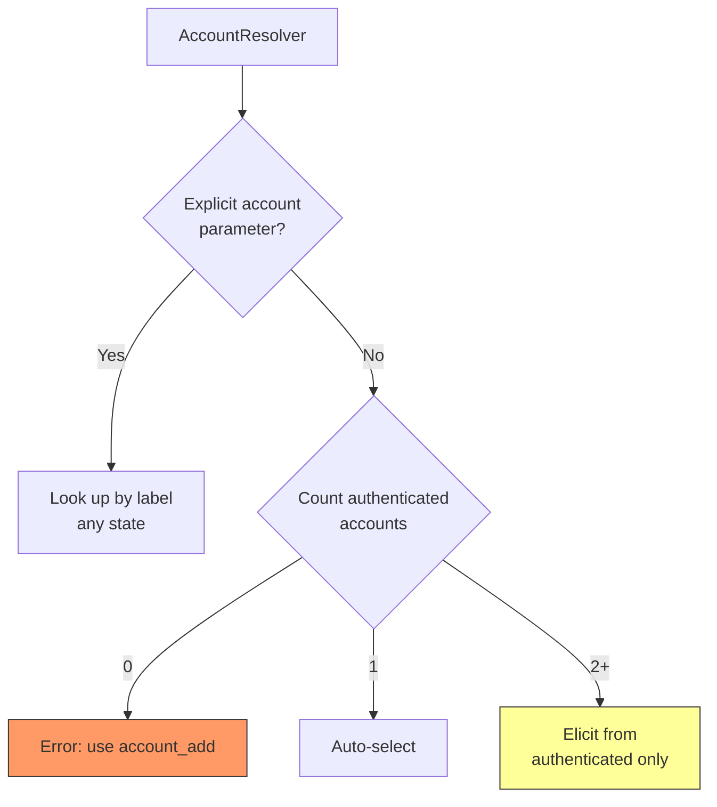
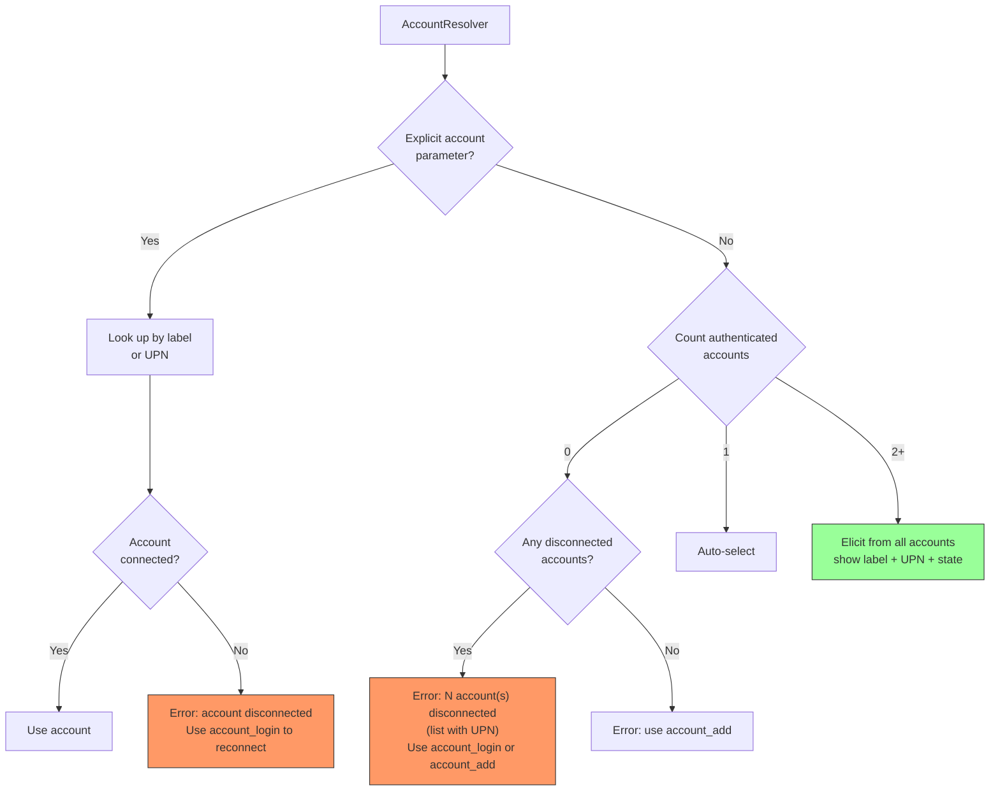
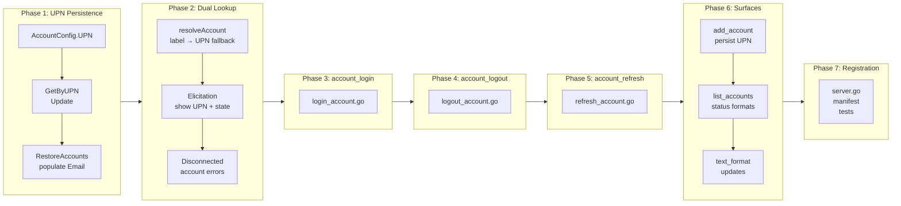

# UPN-Based Account Identity and Full Account Lifecycle Management

## Change Summary

Refactor account identity to use the User Principal Name (UPN) as the canonical account identifier instead of the user-chosen label. Add three new account management tools (`account_login`, `account_logout`, `account_refresh`) that allow explicit control over each account's authentication state. Enrich all account surfaces (`account_list`, `status`, elicitation prompts, confirmation lines) to always expose the full state of every registered account — including disconnected ones — so the LLM and user can make informed decisions rather than silently falling back to a connected account.

## Motivation and Background

The current account model has three structural issues:

1. **Opaque identifiers.** Accounts are keyed by an arbitrary label the user chose during `account_add` (e.g., `"default"`, `"work"`). The UPN (e.g., `alice@contoso.com`) is lazily fetched from `/me` and used only for display — it is never persisted across restarts and is absent from elicitation prompts. This means users and LLMs must memorize the label↔mailbox mapping, which breaks down in multi-account scenarios.

2. **No account lifecycle control.** There is no way to log out of an account without removing it (`account_remove`), no way to refresh a stale token explicitly, and no way to re-authenticate an existing account without removing and re-adding it. The auth middleware handles re-auth transparently, but only when a tool call happens to hit a 401. The user has no agency over when or whether re-authentication occurs.

3. **Invisible disconnected accounts.** The `AccountResolver` middleware considers only `Authenticated == true` accounts for auto-selection and elicitation. Disconnected accounts are invisible to the LLM — it silently uses a connected account instead of informing the user that one of their accounts requires attention. The `status` tool and `account_list` show the state, but nothing prompts the LLM to surface this to the user proactively.

This CR addresses all three issues: UPN becomes the persistent identity, explicit lifecycle tools give users control, and all account surfaces expose the full picture including disconnected accounts.

## Change Drivers

* **User confusion in multi-account setups**: Labels carry no intrinsic identity. Users with 3+ accounts cannot reliably correlate labels to mailboxes without calling `account_list` and interpreting the output.
* **CR-0055 deferred items**: CR-0055 explicitly deferred persisting email across restarts, showing email in elicitation, and updating `FormatStatusText` with email.
* **No logout capability**: Users who want to disconnect an account (e.g., leaving a shared machine) must remove and re-add the account, losing the label and configuration.
* **Silent account degradation**: When a token expires for one account, the LLM silently uses another account rather than informing the user that Account X is disconnected.

## Current State

### Account Identity

| Surface | Current Identifier | UPN/Email |
|---------|-------------------|-----------|
| `accounts.json` (persistence) | `label` (key field) | Not stored |
| `AccountEntry` (registry) | `label` (key field) | `Email` field, lazily fetched, in-memory only |
| `AccountResolver` elicitation | Label enum only | Not shown |
| `account_list` text output | `"1. work (authenticated) — alice@contoso.com"` | Shown after first `account_list` call only |
| `FormatStatusText` | `"  work: authenticated"` | Not shown |
| Write-tool confirmations | `"Account: work (alice@contoso.com)"` | Shown only if previously fetched |
| `account` parameter on tools | Accepts label string | Does not accept UPN |

### Account Lifecycle Tools

| Operation | Available | How |
|-----------|-----------|-----|
| Add/authenticate | Yes | `account_add` |
| List | Yes | `account_list` |
| Remove | Yes | `account_remove` |
| Log out (disconnect) | **No** | Must remove + re-add |
| Log in (re-authenticate) | **No** | Auth middleware does it automatically on 401, or user must remove + re-add |
| Refresh token | **No** | Automatic via SDK, no explicit trigger |

### Account Visibility in Resolution



Disconnected accounts are excluded from elicitation (yellow) and from the "no accounts" error (red), making them invisible to the LLM's decision flow.

## Proposed Change

### 1. UPN as Persistent Account Identity

* **Persist UPN in `accounts.json`**: Add a `upn` field to `AccountConfig`. After successful authentication in `account_add`, resolve the UPN from `/me` and store it. On server restart, the UPN is available without a Graph API call.
* **UPN as the account lookup key**: The `account` parameter on all tools, the registry lookup, and elicitation prompts accept and display UPN (e.g., `alice@contoso.com`) as the primary identifier. Labels remain as user-chosen aliases.
* **Dual lookup in `AccountResolver`**: The `account` parameter resolves by trying label first, then UPN. This preserves backward compatibility while enabling `account=alice@contoso.com`.
* **Elicitation shows UPN**: The account picker enum shows `"label (upn)"` for each account, making identity unambiguous.

### 2. Account Lifecycle Tools

#### `account_login`

Re-authenticate an existing disconnected account. Uses the same authentication flow as `account_add` (browser, device_code, or auth_code) but targets an existing registry entry instead of creating a new one. After successful authentication, the account's `Authenticated` flag is set to `true`, a new Graph client is created, and the UPN is refreshed.

#### `account_logout`

Disconnect an account without removing it from the registry or `accounts.json`. Clears the Graph client and sets `Authenticated = false`. The account remains visible in `account_list` and `status` with state "disconnected". Token cache is cleared for the account's keychain partition.

#### `account_refresh`

Force a token refresh for an authenticated account. Calls `GetToken` with `ForceRefresh: true` to obtain a new access token. Useful when a user suspects token staleness or after a permission change in Entra ID. Returns the new token expiry time on success.

### 3. Full Account Visibility

#### `account_list` Changes

* Show all accounts (authenticated and disconnected) with UPN always visible.
* Add an `auth_method` field to the output.
* Text format: `"1. work — alice@contoso.com (authenticated, browser)"` / `"2. personal — bob@outlook.com (disconnected, device_code)"`.

#### `status` Tool Changes

* Show UPN alongside label in the accounts section.
* Show auth method per account.
* Text format: `"  work: authenticated — alice@contoso.com (browser)"`.

#### `AccountResolver` Changes

* Elicitation shows `"label (upn)"` or just UPN when label matches UPN.
* When disconnected accounts exist, the resolution error message explicitly lists them with a hint to use `account_login`: `"Account 'personal' (bob@outlook.com) is disconnected. Use account_login to re-authenticate, or specify a connected account."`.
* When a user explicitly selects a disconnected account via the `account` parameter, return an actionable error: `"Account 'personal' is disconnected. Use account_login with label 'personal' to re-authenticate."`.

#### Write-Tool Confirmations

* `FormatAccountLine` now always includes UPN: `"Account: work (alice@contoso.com)"` (unchanged format, but UPN is now always available from persistence rather than requiring a prior `/me` fetch).

### Proposed Account Visibility in Resolution



## Requirements

### Functional Requirements

#### UPN Persistence

1. `AccountConfig` **MUST** include a `upn` field (`json:"upn"`) storing the User Principal Name.
2. `account_add` **MUST** resolve the UPN from the Graph `/me` endpoint after successful authentication and persist it in `accounts.json`.
3. `account_add` **MUST** set `AccountEntry.Email` from the resolved UPN immediately after authentication, so it is available without a subsequent `account_list` call.
4. On server restart, `RestoreAccounts` **MUST** populate `AccountEntry.Email` from the persisted `upn` field without making a Graph API call.
5. `EnsureEmail` **MUST** persist a newly resolved UPN to `accounts.json` if the persisted `upn` field is empty (migration path for accounts created before this CR).

#### Dual Lookup

6. The `account` parameter on all tools **MUST** resolve by label first, then by UPN if no label match is found.
7. `AccountRegistry` **MUST** provide a `GetByUPN(upn string) (*AccountEntry, bool)` method that performs case-insensitive UPN matching.
8. `AccountResolver.resolveAccount` **MUST** call `Get(label)` first; on miss, call `GetByUPN(label)` as fallback.

#### account_login Tool

9. The system **MUST** provide an `account_login` tool that re-authenticates an existing disconnected account.
10. `account_login` **MUST** accept a required `label` parameter identifying the account to re-authenticate.
11. `account_login` **MUST** return an error if the account is already authenticated: `"Account 'X' is already connected."`.
12. `account_login` **MUST** use the account's persisted `auth_method`, `client_id`, and `tenant_id` to construct the credential.
13. `account_login` **MUST** perform the same inline authentication flow as `account_add` (browser, device_code, or auth_code with elicitation).
14. On successful authentication, `account_login` **MUST** create a new Graph client, set `Authenticated = true`, and refresh the UPN from `/me`.
15. `account_login` **MUST** include the full set of five MCP annotations per CR-0052.

#### account_logout Tool

16. The system **MUST** provide an `account_logout` tool that disconnects an account without removing it.
17. `account_logout` **MUST** accept a required `label` parameter.
18. `account_logout` **MUST** set `Authenticated = false`, clear the `Client` field, clear the `Credential` field, and clear the `Authenticator` field on the registry entry.
19. `account_logout` **MUST** clear the cached token from the account's keychain partition.
20. `account_logout` **MUST** return an error if the account is already disconnected.
21. `account_logout` **MUST NOT** remove the account from the registry or `accounts.json`.
22. `account_logout` **MUST** include the full set of five MCP annotations per CR-0052.

#### account_refresh Tool

23. The system **MUST** provide an `account_refresh` tool that forces a token refresh for an authenticated account.
24. `account_refresh` **MUST** accept a required `label` parameter.
25. `account_refresh` **MUST** return an error if the account is disconnected.
26. `account_refresh` **MUST** call `GetToken` with forced refresh on the account's credential.
27. `account_refresh` **MUST** return the new token expiry time on success.
28. `account_refresh` **MUST** include the full set of five MCP annotations per CR-0052.

#### Account Visibility

29. `account_list` **MUST** show all accounts (authenticated and disconnected) with UPN, label, auth_method, and authentication state.
30. `account_list` text format **MUST** follow: `"N. label — upn (state, auth_method)"`.
31. `FormatStatusText` **MUST** include UPN alongside label and auth method: `"  label: state — upn (auth_method)"`.
32. `statusAccount` **MUST** include `UPN` and `AuthMethod` fields.
33. `FormatAccountLine` **MUST** always include UPN when available (from persistence, no API call needed).

#### Elicitation

34. `AccountResolver` elicitation **MUST** show `"label (upn)"` in the enum for each account.
35. `AccountResolver` elicitation **MUST** include all registered accounts (both authenticated and disconnected) with state indication.
36. When a disconnected account is selected via elicitation, the middleware **MUST** return an actionable error directing the user to `account_login`.
37. When no authenticated accounts exist but disconnected accounts do, the error message **MUST** list disconnected accounts with UPNs and suggest `account_login`.
38. When an explicit `account` parameter targets a disconnected account, the middleware **MUST** return: `"Account 'X' (upn) is disconnected. Use account_login with label 'X' to re-authenticate."`.

#### Tool Description Updates

39. `account_add` description **MUST** be updated to mention that UPN is resolved and persisted.
40. `account_list` description **MUST** be updated to mention UPN, auth_method, and disconnected account visibility.
41. `account_remove` description **MUST** be updated to mention that `account_logout` is available for disconnecting without removing.
42. The `account` parameter description on all tools that have it **MUST** be updated to note that both label and UPN are accepted.

#### account_remove Parity

43. `account_remove` **MUST** clear the cached token from the account's keychain partition (parity with `account_logout`), so removal leaves no residual credentials on disk or in the keychain.
44. `account_remove` **MUST** succeed regardless of the account's `Authenticated` state (connected or disconnected accounts can both be removed).
45. When `account_remove` removes the last registered account, the server **MUST** leave a valid empty `accounts.json` (or absent file) and continue running; subsequent tool calls **MUST** surface the standard "no accounts configured" error path.

#### Zero-Account State

46. When zero accounts are registered (none in the registry, none in `accounts.json`), the `AccountResolver` **MUST** return an error directing the user to `account_add`, without mentioning `account_login` (since there is nothing to log in to).
47. `account_list` **MUST** succeed with an empty result when zero accounts are registered (not an error).
48. `status` **MUST** report zero accounts cleanly with no errors when none are registered.

#### LLM Guidance on Account Selection

The current tool descriptions implicitly encourage the LLM to "just use the default account" when multiple accounts exist but no `account` parameter is supplied. This has led to incidents where the LLM silently operated on the wrong mailbox instead of asking the user. Disconnected accounts compound the problem: they are invisible today and the LLM never surfaces them.

49. Every tool that accepts an `account` parameter **MUST** include explicit guidance in its description instructing the LLM to:
    * Never assume a "default" account.
    * Always inspect the current account landscape (via `account_list` or prior context) before acting.
    * Consider **all** registered accounts, including disconnected ones, when deciding which mailbox the user intends.
    * Prefer elicitation or a clarifying question when intent is ambiguous rather than silently picking a connected account.
50. The `account` parameter description **MUST** state that omitting it yields silent auto-selection **only** when exactly one account is authenticated and zero other accounts (connected or disconnected) are registered; when exactly one account is authenticated but additional disconnected accounts also exist, the resolver **MUST** still auto-select the single authenticated account but **MUST** attach the disconnected-account advisory described in requirement 52; in all other cases the LLM **MUST** determine the account explicitly.
51. `account_list` and `status` tool descriptions **MUST** state that their output is the authoritative source for account selection decisions and that disconnected accounts are first-class entries that **MUST NOT** be ignored.
52. When `AccountResolver` auto-selects (exactly one authenticated account) **while disconnected accounts also exist**, the resolution result **MUST** include a human-readable advisory in the tool's confirmation / account line indicating that other (disconnected) accounts exist and naming them by UPN — so the LLM is prompted to raise them to the user instead of silently using the one connected account.
53. Tool descriptions for `account_login`, `account_logout`, `account_refresh`, and `account_remove` **MUST** direct the LLM to proactively suggest these operations to the user when account-state conditions warrant (e.g., a disconnected account surfaced in `account_list`).

### Non-Functional Requirements

1. Each new tool **MUST** be defined in its own file: `login_account.go`, `logout_account.go`, `refresh_account.go`.
2. All new and modified code **MUST** include Go doc comments per project documentation standards.
3. All existing tests **MUST** continue to pass after the changes.
4. The extension manifest (`extension/manifest.json`) **MUST** be updated with the three new tools.
5. The CRUD test document (`docs/prompts/mcp-tool-crud-test.md`) **MUST** be updated to exercise the new tools.
6. The tool count in `server.go` **MUST** be updated to reflect the three additional tools.

## Affected Components

| Component | Change |
|-----------|--------|
| `internal/auth/accounts.go` | Add `UPN` field to `AccountConfig`; add `UpdateAccountUPN` function |
| `internal/auth/registry.go` | Add `GetByUPN` method; add `Update` method for modifying existing entries |
| `internal/auth/account_resolver.go` | Dual lookup (label then UPN); show UPN in elicitation; include disconnected accounts in elicitation; actionable errors for disconnected accounts |
| `internal/auth/email_resolver.go` | Persist newly resolved UPN to `accounts.json` when config UPN is empty |
| `internal/auth/restore.go` | Populate `AccountEntry.Email` from persisted `upn` field |
| `internal/auth/context.go` | No structural changes (AccountInfo already has Email) |
| `internal/tools/login_account.go` | **New file**: `NewLoginAccountTool()` + `HandleLoginAccount()` |
| `internal/tools/logout_account.go` | **New file**: `NewLogoutAccountTool()` + `HandleLogoutAccount()` |
| `internal/tools/refresh_account.go` | **New file**: `NewRefreshAccountTool()` + `HandleRefreshAccount()` |
| `internal/tools/add_account.go` | Resolve and persist UPN after authentication; set `entry.Email` |
| `internal/tools/list_accounts.go` | Include auth_method in output; update text format |
| `internal/tools/remove_account.go` | Update description to mention `account_logout`; clear keychain token cache on remove; allow remove of disconnected accounts |
| `internal/tools/status.go` | Add UPN and auth_method to `statusAccount` |
| `internal/tools/text_format.go` | Update `FormatAccountsText` format; update `FormatStatusText` |
| `internal/tools/client.go` | Update `account` parameter descriptions across tools |
| `internal/server/server.go` | Register three new tools; update tool count |
| `extension/manifest.json` | Add three new tool entries |
| `docs/prompts/mcp-tool-crud-test.md` | Add test steps for new tools |
| `internal/tools/tool_annotations_test.go` | Add annotation tests for three new tools |
| `internal/tools/login_account_test.go` | **New file**: handler unit tests for `account_login` |
| `internal/tools/logout_account_test.go` | **New file**: handler unit tests for `account_logout` including keychain clearing |
| `internal/tools/refresh_account_test.go` | **New file**: handler unit tests for `account_refresh` |
| `internal/tools/remove_account_test.go` | Add tests for keychain clearing, disconnected removal, and last-account clean state |
| `internal/tools/list_accounts_test.go` | Add zero-account test; update for auth_method/UPN format |
| `internal/tools/status_test.go` | Add zero-account test; add UPN/auth_method assertions |
| `internal/tools/tool_descriptions_test.go` | **New file**: verify account-parameter description forbids default assumption and lifecycle tools describe proactive suggestions |
| `internal/auth/registry_test.go` | Add `GetByUPN` and `Update` tests |
| `internal/auth/accounts_test.go` | Add `UpdateAccountUPN` tests |
| `internal/auth/restore_test.go` | Add UPN-to-Email population test |
| `extension/manifest_test.go` | **New file**: verify manifest contains new tool entries |

## Scope Boundaries

### In Scope

* Persisting UPN in `accounts.json` and populating it at startup.
* Dual lookup (label + UPN) in AccountResolver and tool `account` parameter.
* `account_login`, `account_logout`, `account_refresh` tool definitions and handlers.
* UPN in elicitation prompts, `account_list`, `status`, and confirmation lines.
* Disconnected account visibility in AccountResolver error messages.
* Elicitation showing all accounts with state indication.

### Out of Scope ("Here, But Not Further")

* **Renaming the `label` field or removing it** — labels remain as user-chosen aliases. Dual lookup preserves backward compatibility. Deprecating labels entirely is a future consideration.
* **Auto-login on server startup for disconnected accounts** — the current behavior (register with `Authenticated=false`, defer to middleware) is preserved. `account_login` is the explicit user-triggered alternative.
* **Token cache encryption changes** — `account_logout` clears the cached token but does not change the underlying keychain/file-cache mechanism.
* **UPN validation or normalization** — the UPN is stored as returned by Microsoft Graph `/me`. No case normalization or format validation is applied beyond what the Graph API returns. `GetByUPN` uses case-insensitive matching.
* **account parameter on account management tools** — `account_login`, `account_logout`, `account_refresh`, and `account_remove` continue to use the `label` parameter. UPN-based lookup for these tools is deferred.
* **Batch operations** — no "login all" or "logout all" operations.
* **Account rename** — changing a label after creation is deferred.

## Alternative Approaches Considered

* **Replace labels entirely with UPN as the primary key.** Rejected: UPN is not known until after authentication completes, so `account_add` needs a user-provided identifier (label) to create the credential. Labels serve as stable identifiers during the authentication flow.
* **Use email instead of UPN.** Rejected: the `mail` property on the Graph user object is nullable for accounts without Exchange licensing. UPN is always present and is the canonical Entra ID identifier.
* **Automatic silent token refresh instead of explicit `account_refresh` tool.** The SDK already handles silent refresh transparently. `account_refresh` exists for cases where the user wants to force-refresh after a permission change or suspects staleness — it gives the user explicit control and confirmation.
* **Show only authenticated accounts in elicitation, surface disconnected accounts via a separate notification.** Rejected: this splits the decision surface. The user should see all accounts in one place and decide whether to proceed with a connected account or reconnect a disconnected one.

## Impact Assessment

### User Impact

* Users will see their email/UPN on all account surfaces immediately (no more label-only display until `account_list` is called).
* Users can specify `account=alice@contoso.com` instead of remembering labels.
* Users can disconnect an account (logout) without losing its configuration.
* Users can explicitly trigger re-authentication (login) when needed.
* The LLM will always see the full account landscape, including disconnected accounts, and can proactively inform the user.

### Technical Impact

* **Breaking change to `accounts.json` format**: New `upn` field. Existing files without `upn` are handled gracefully — the UPN is resolved on first use and backfilled.
* **Tool count increase**: 3 new tools (18 → 21 base, 25 with mail, 26 with mail+auth_code).
* **Registry API change**: New `GetByUPN` and `Update` methods on `AccountRegistry`.
* **Elicitation schema change**: Enum values change from `["default", "work"]` to `["default (alice@contoso.com)", "work (bob@contoso.com)"]` (or equivalent).

### Business Impact

Directly addresses multi-account UX confusion and gives users explicit control over account lifecycle — critical for trust in an LLM-mediated tool that accesses email and calendar.

## Implementation Approach

### Phase 1: UPN Persistence and Registry Enhancements

**`internal/auth/accounts.go`**:
- Add `UPN string` field to `AccountConfig` (`json:"upn"`).
- Add `UpdateAccountUPN(path, label, upn string) error` function that loads, finds the account by label, updates the UPN, and saves.

**`internal/auth/registry.go`**:
- Add `GetByUPN(upn string) (*AccountEntry, bool)` — iterates accounts, case-insensitive comparison.
- Add `Update(label string, fn func(*AccountEntry)) error` — calls `fn` with the entry while holding the write lock.

**`internal/auth/restore.go`**:
- In `restoreOne`, populate `entry.Email` from `acct.UPN` if non-empty.

**`internal/auth/email_resolver.go`**:
- After successfully resolving email, if the persisted UPN is empty, call `UpdateAccountUPN` to backfill. Accept `accountsPath` as a parameter (or via a closure).

### Phase 2: Dual Lookup in AccountResolver

**`internal/auth/account_resolver.go`**:
- In `resolveAccount`, after `registry.Get(label)` returns not-found, try `registry.GetByUPN(label)`.
- When a resolved account has `Authenticated == false`, return actionable error with UPN and `account_login` hint.
- Update `elicitAccountSelection` to build enum values as `"label (upn)"` and include all registered accounts (not just authenticated).
- Parse the selected value to extract the label.
- When a disconnected account is selected, return an error directing to `account_login`.
- When zero authenticated + nonzero disconnected, return a specific error listing disconnected accounts with UPNs.

### Phase 3: account_login Tool

**`internal/tools/login_account.go`** (new file):
- `NewLoginAccountTool()` — tool name `account_login`, required `label` parameter, annotations: ReadOnly=false, Destructive=false, Idempotent=false, OpenWorld=true.
- `HandleLoginAccount(registry, cfg)` — looks up the account, verifies `Authenticated == false`, creates credential using persisted config, runs inline authentication (reuse `addAccountState.authenticateInline` logic), creates Graph client, updates registry entry, refreshes UPN.

### Phase 4: account_logout Tool

**`internal/tools/logout_account.go`** (new file):
- `NewLogoutAccountTool()` — tool name `account_logout`, required `label` parameter, annotations: ReadOnly=false, Destructive=false, Idempotent=true, OpenWorld=false.
- `HandleLogoutAccount(registry)` — looks up account, verifies `Authenticated == true`, clears `Client`, `Credential`, `Authenticator`, sets `Authenticated = false`. Clears keychain token cache for the account's `CacheName`.

### Phase 5: account_refresh Tool

**`internal/tools/refresh_account.go`** (new file):
- `NewRefreshAccountTool()` — tool name `account_refresh`, required `label` parameter, annotations: ReadOnly=false, Destructive=false, Idempotent=true, OpenWorld=true.
- `HandleRefreshAccount(registry, cfg)` — looks up account, verifies `Authenticated == true`, calls `cred.GetToken` with force-refresh, returns expiry.

### Phase 6: Update Existing Tools and Surfaces

**`internal/tools/add_account.go`**:
- After successful authentication, call `EnsureEmail` (or inline `/me` fetch) and persist UPN to `accounts.json`.
- Set `entry.Email` immediately.

**`internal/tools/list_accounts.go`**:
- Add `auth_method` to result maps.
- Update text format to new layout.

**`internal/tools/status.go`**:
- Add `UPN` and `AuthMethod` fields to `statusAccount`.
- Populate from registry entries.

**`internal/tools/text_format.go`**:
- Update `FormatAccountsText` to new format: `"N. label — upn (state, auth_method)"`.
- Update `FormatStatusText` accounts section.
- Update `FormatAccountLine` to always include UPN.

**`internal/tools/remove_account.go`**:
- Update description to mention `account_logout`.

### Phase 7: Server Registration, Manifest, and Tests

**`internal/server/server.go`**:
- Register `account_login`, `account_logout`, `account_refresh` with `authMW → WithObservability → AuditWrap` chain (same pattern as other account tools).
- Update tool count.

**`extension/manifest.json`**:
- Add entries for the three new tools.

**Tests**:
- Add annotation tests for three new tools.
- Add handler unit tests for login, logout, refresh.
- Add `GetByUPN` unit test.
- Update `account_list` and `status` text format tests.
- Update `AccountResolver` tests for dual lookup and disconnected account handling.
- Update `FormatAccountsText` and `FormatStatusText` tests.

**`docs/prompts/mcp-tool-crud-test.md`**:
- Add test steps for login, logout, refresh lifecycle.

### Implementation Flow



## Test Strategy

### Tests to Add

| Test File | Test Name | Description | Inputs | Expected Output |
|-----------|-----------|-------------|--------|-----------------|
| `registry_test.go` | `TestGetByUPN_Found` | Case-insensitive UPN lookup | Registry with entry Email="Alice@Contoso.com", query "alice@contoso.com" | Entry returned, ok=true |
| `registry_test.go` | `TestGetByUPN_NotFound` | UPN lookup miss | Registry with entries, query "nobody@example.com" | nil, ok=false |
| `registry_test.go` | `TestUpdate_ModifiesEntry` | Update function modifies entry in place | Registry with entry, fn sets Authenticated=false | Entry.Authenticated == false after |
| `registry_test.go` | `TestUpdate_NotFound` | Update on missing label | Empty registry, label "x" | Error returned |
| `accounts_test.go` | `TestUpdateAccountUPN_Success` | Persist UPN to accounts.json | File with 1 account, update UPN | File contains updated UPN field |
| `accounts_test.go` | `TestUpdateAccountUPN_NotFound` | Label not in file | File with 1 account, wrong label | No change to file |
| `account_resolver_test.go` | `TestResolveAccount_ByUPN` | UPN fallback when label not found | account="alice@contoso.com", entry with that Email | Entry resolved |
| `account_resolver_test.go` | `TestResolveAccount_DisconnectedExplicit` | Explicit disconnected account | account="work", entry Authenticated=false | Error with account_login hint |
| `account_resolver_test.go` | `TestResolveAccount_AllDisconnected` | All accounts disconnected, no account param | 2 entries both Authenticated=false | Error listing disconnected accounts |
| `account_resolver_test.go` | `TestElicitation_ShowsUPN` | Elicitation enum includes UPN | 2 authenticated entries with Email | Enum contains "label (upn)" format |
| `login_account_test.go` | `TestLoginAccount_Success` | Re-authenticate disconnected account | Entry with Authenticated=false | Entry.Authenticated=true, Graph client set |
| `login_account_test.go` | `TestLoginAccount_AlreadyConnected` | Login on connected account | Entry with Authenticated=true | Error: already connected |
| `login_account_test.go` | `TestLoginAccount_NotFound` | Login on nonexistent account | Label "nonexistent" | Error: account not found |
| `logout_account_test.go` | `TestLogoutAccount_Success` | Disconnect authenticated account | Entry with Authenticated=true | Entry.Authenticated=false, Client=nil |
| `logout_account_test.go` | `TestLogoutAccount_AlreadyDisconnected` | Logout on disconnected account | Entry with Authenticated=false | Error: already disconnected |
| `logout_account_test.go` | `TestLogoutAccount_PreservesConfig` | Config not removed after logout | Entry after logout | accounts.json still contains the entry |
| `refresh_account_test.go` | `TestRefreshAccount_Success` | Force token refresh | Entry with mock credential | Success with expiry time |
| `refresh_account_test.go` | `TestRefreshAccount_Disconnected` | Refresh on disconnected account | Entry with Authenticated=false | Error: account disconnected |
| `tool_annotations_test.go` | `TestLoginAccount_Annotations` | Verify annotation set | `NewLoginAccountTool()` | ReadOnly=false, Destructive=false, Idempotent=false, OpenWorld=true |
| `tool_annotations_test.go` | `TestLogoutAccount_Annotations` | Verify annotation set | `NewLogoutAccountTool()` | ReadOnly=false, Destructive=false, Idempotent=true, OpenWorld=false |
| `tool_annotations_test.go` | `TestRefreshAccount_Annotations` | Verify annotation set | `NewRefreshAccountTool()` | ReadOnly=false, Destructive=false, Idempotent=true, OpenWorld=true |
| `text_format_test.go` | `TestFormatAccountsText_WithUPNAndMethod` | New format with UPN and auth_method | Account with all fields | Line matches "N. label — upn (state, auth_method)" |
| `text_format_test.go` | `TestFormatStatusText_WithUPN` | Status accounts show UPN | Status with UPN | Line contains UPN |
| `add_account_test.go` | `TestAddAccount_PersistsUPN` | UPN persisted to accounts.json after add (AC-1) | account_add with successful auth, mock /me returns "alice@contoso.com" | accounts.json contains `upn: "alice@contoso.com"` |
| `restore_test.go` | `TestRestoreAccounts_PopulatesEmailFromUPN` | Restore populates Email from persisted UPN (AC-2) | accounts.json with upn field, restore server | Registry entry has Email == persisted UPN, no /me call made |
| `logout_account_test.go` | `TestLogoutAccount_ClearsKeychain` | Keychain token cache cleared on logout (FR-19) | Entry with Authenticated=true, cached token in keychain | Keychain entry for CacheName removed |
| `refresh_account_test.go` | `TestRefreshAccount_ReturnsExpiry` | Response includes new token expiry (FR-27) | Entry with mock credential returning ExpiresOn=T | Response text/summary includes expiry T |
| `remove_account_test.go` | `TestRemoveAccount_ClearsKeychain` | Keychain token cache cleared on remove (AC-13) | Entry with cached token | Keychain entry removed, registry entry removed |
| `remove_account_test.go` | `TestRemoveAccount_Disconnected` | Remove works on disconnected account (AC-13) | Entry with Authenticated=false | Entry removed, accounts.json updated |
| `remove_account_test.go` | `TestRemoveAccount_LastAccountCleanState` | Last account removal leaves clean zero-state (AC-14) | Registry with exactly one entry, remove it | accounts.json empty or absent, server still running, subsequent resolver error mentions account_add and not account_login |
| `list_accounts_test.go` | `TestListAccounts_ZeroAccounts` | account_list succeeds with zero accounts (AC-15) | Empty registry | Call succeeds, empty result, no error |
| `status_test.go` | `TestStatus_ZeroAccounts` | status succeeds with zero accounts (AC-15) | Empty registry | Call succeeds, accounts section empty, no error |
| `manifest_test.go` | `TestManifest_NewTools` | Manifest contains new tool entries (AC-16) | Parse `extension/manifest.json` | tools array includes `account_login`, `account_logout`, `account_refresh` |
| `account_resolver_test.go` | `TestAutoSelect_AdvisoryForDisconnectedSiblings` | Auto-select advises about disconnected siblings (AC-17, FR-52) | One authenticated + one disconnected entry, no account param | Resolution succeeds against authenticated account, resolver result includes advisory naming disconnected account by UPN |
| `tool_descriptions_test.go` | `TestAccountParamDescription_ForbidsDefaultAssumption` | account parameter description forbids default assumption (AC-18, FR-49, FR-50) | Every tool with account parameter | Description explicitly forbids default-account assumption and mentions disconnected accounts |
| `tool_descriptions_test.go` | `TestAccountLifecycleTools_DescribeProactiveSuggestion` | Descriptions direct LLM to proactively suggest lifecycle tools (FR-53) | Tool descriptions for login/logout/refresh/remove | Descriptions contain proactive-suggestion guidance |
| `account_resolver_test.go` | `TestResolveAccount_ZeroAccounts_NoLoginHint` | Zero-account error mentions account_add, not account_login (FR-46, AC-14) | Empty registry | Error string contains `account_add`, does not contain `account_login` |

### Tests to Modify

| Test File | Test Name | Current Behavior | New Behavior | Reason for Change |
|-----------|-----------|------------------|--------------|-------------------|
| `text_format_test.go` | `TestFormatAccountsText` | Tests label + state + email format | Tests label + UPN + state + auth_method format | Output format changed |
| `text_format_test.go` | `TestFormatStatusText` | Tests label + state only | Tests label + state + UPN + auth_method | Status format changed |
| `account_resolver_test.go` | `TestElicitAccountSelection` | Enum contains labels only | Enum contains "label (upn)" | Elicitation format changed |
| `list_accounts_test.go` | Existing tests | No auth_method in output | auth_method included | Output structure changed |

### Tests to Remove

Not applicable — no tests become obsolete.

## Acceptance Criteria

### AC-1: UPN persisted in accounts.json after account_add

```gherkin
Given a new account is added via account_add with label "work"
  And authentication completes successfully
When accounts.json is read
Then the account entry for "work" contains a non-empty "upn" field
  And the UPN matches the value returned by GET /me
```

### AC-2: UPN available at startup without API call

```gherkin
Given accounts.json contains an account with upn "alice@contoso.com"
When the server starts and RestoreAccounts runs
Then the account entry in the registry has Email == "alice@contoso.com"
  And no Graph API call was made to resolve the email
```

### AC-3: Dual lookup resolves by UPN

```gherkin
Given an account registered with label "work" and Email "alice@contoso.com"
When a tool call includes account="alice@contoso.com"
Then the account is resolved to the "work" entry
```

### AC-4: account_login re-authenticates a disconnected account

```gherkin
Given an account "work" with Authenticated=false
When account_login is called with label="work"
  And the user completes authentication
Then the account entry has Authenticated=true
  And a Graph client is available
  And the UPN is refreshed from /me
```

### AC-5: account_login rejects already-connected accounts

```gherkin
Given an account "work" with Authenticated=true
When account_login is called with label="work"
Then the tool returns an error: "Account 'work' is already connected."
```

### AC-6: account_logout disconnects without removing

```gherkin
Given an account "work" with Authenticated=true
When account_logout is called with label="work"
Then the account entry has Authenticated=false and Client=nil
  And accounts.json still contains the "work" entry
  And account_list shows "work" as "disconnected"
```

### AC-7: account_refresh forces token renewal

```gherkin
Given an account "work" with Authenticated=true
When account_refresh is called with label="work"
Then a new token is obtained via forced refresh
  And the response includes the new token expiry time
```

### AC-8: Elicitation shows UPN and state

```gherkin
Given two accounts: "default" (authenticated, alice@a.com) and "work" (disconnected, bob@b.com)
When the AccountResolver triggers elicitation
Then the enum contains ["default (alice@a.com)", "work (bob@b.com) — disconnected"]
```

### AC-9: Disconnected account selection returns actionable error

```gherkin
Given an account "work" with Authenticated=false and UPN "bob@b.com"
When a tool call includes account="work"
Then the tool returns an error containing "disconnected" and "account_login"
```

### AC-10: account_list shows full state for all accounts

```gherkin
Given two accounts: "default" (authenticated, alice@a.com, browser) and "work" (disconnected, bob@b.com, device_code)
When account_list is called with output=text
Then the output contains:
  "1. default — alice@a.com (authenticated, browser)"
  "2. work — bob@b.com (disconnected, device_code)"
```

### AC-11: status tool shows UPN and auth_method

```gherkin
Given two accounts: "default" (authenticated, alice@a.com, browser) and "work" (disconnected, bob@b.com, device_code)
When status is called with output=text
Then the accounts section contains:
  "  default: authenticated — alice@a.com (browser)"
  "  work: disconnected — bob@b.com (device_code)"
```

### AC-12: Zero authenticated + disconnected accounts shows correct error

```gherkin
Given one account "work" with Authenticated=false and UPN "bob@b.com"
  And no other accounts are registered
When a calendar tool is called without an account parameter
Then the error message lists the disconnected account with UPN
  And suggests using account_login or account_add
```

### AC-13: account_remove clears token cache and works on disconnected accounts

```gherkin
Given an account "work" with Authenticated=false
When account_remove is called with label="work"
Then the account is removed from the registry and accounts.json
  And the keychain token cache for the account's CacheName is cleared
```

### AC-14: Removing the last account leaves a clean zero-account state

```gherkin
Given exactly one account "work" is registered
When account_remove is called with label="work"
Then accounts.json contains no account entries (or the file is absent)
  And the server continues running
  And a subsequent calendar tool call returns an error directing the user to account_add
  And the error does not mention account_login
```

### AC-15: account_list and status succeed with zero accounts

```gherkin
Given zero accounts are registered
When account_list is called
Then the call succeeds with an empty result (no error)
And when status is called
Then the accounts section is empty and no error is raised
```

### AC-16: Extension manifest includes new tools

```gherkin
Given the extension manifest at extension/manifest.json
When the tools array is inspected
Then it contains entries for account_login, account_logout, and account_refresh
```

### AC-17: Auto-selection with one connected account surfaces disconnected siblings

```gherkin
Given one account "work" is authenticated (alice@contoso.com)
  And one account "personal" is disconnected (bob@outlook.com)
When a calendar tool is called without an account parameter
Then the tool executes against "work"
  And the response's account advisory line names "personal (bob@outlook.com)" as disconnected
  And the advisory instructs the LLM/user to consider account_login if "personal" was intended
```

### AC-18: Tool descriptions forbid silent default-account assumption

```gherkin
Given any tool that accepts an account parameter
When its description is inspected
Then it explicitly states that the LLM must not assume a default account
  And it instructs the LLM to consider all registered accounts, including disconnected ones
  And it states that omitting account silently auto-selects only when exactly one account is authenticated and no other accounts (connected or disconnected) are registered
  And it states that when disconnected accounts coexist with a single authenticated account, auto-selection still occurs but an advisory naming disconnected accounts is surfaced
```

### AC-19: All quality checks pass

```gherkin
Given all code changes are applied
When make ci is executed
Then the build succeeds
  And all linter checks pass
  And all tests pass including new and modified tests
```

## Quality Standards Compliance

### Build & Compilation

- [x] Code compiles/builds without errors
- [x] No new compiler warnings introduced

### Linting & Code Style

- [x] All linter checks pass with zero warnings/errors
- [x] Code follows project coding conventions and style guides
- [x] Any linter exceptions are documented with justification

### Test Execution

- [x] All existing tests pass after implementation
- [x] All new tests pass
- [x] Test coverage meets project requirements for changed code

### Documentation

- [x] Inline code documentation updated where applicable
- [x] API documentation updated for any API changes
- [x] User-facing documentation updated if behavior changes

### Code Review

- [ ] Changes submitted via pull request
- [ ] PR title follows Conventional Commits format
- [ ] Code review completed and approved
- [ ] Changes squash-merged to maintain linear history

### Verification Commands

```bash
# Build verification
make build

# Lint verification
make lint

# Test execution
make test

# Full CI suite
make ci
```

## Risks and Mitigation

### Risk 1: UPN changes when user's domain changes in Entra ID

**Likelihood:** low
**Impact:** medium
**Mitigation:** UPN is refreshed on every `account_login` and can be updated via `EnsureEmail` migration path. The label remains stable as the primary key in the registry. Stale UPN in `accounts.json` is cosmetic — the account still functions, and the next `EnsureEmail` or `account_login` updates it.

### Risk 2: Elicitation schema change breaks clients that parse enum values

**Likelihood:** low
**Impact:** low
**Mitigation:** Elicitation enum values are opaque to the client; the client presents them as choices and returns the selected value. The AccountResolver parses the returned value to extract the label. Clients that stored previous enum values in history will not break — they simply see different labels on the next invocation.

### Risk 3: Token cache clearing in account_logout may fail on keychain-locked systems

**Likelihood:** low
**Impact:** low
**Mitigation:** Token cache clearing is best-effort. If the keychain operation fails, the account is still marked as disconnected in the registry. On next `account_login`, a new token is obtained which overwrites the stale cache entry.

### Risk 4: Dual lookup creates ambiguity when a label matches another account's UPN

**Likelihood:** very low
**Impact:** medium
**Mitigation:** Label lookup takes precedence. A user would have to deliberately create a label that matches another account's UPN for this to occur. The `account_add` tool could warn if a label matches an existing UPN, but this is a low-priority edge case deferred to future work.

### Risk 5: accounts.json migration for existing installations

**Likelihood:** high
**Impact:** low
**Mitigation:** The `upn` field is added as optional. Existing `accounts.json` files without `upn` are loaded without error. The migration path backfills the UPN on first `EnsureEmail` call or `account_login`. No manual user action required.

## Dependencies

* No new external dependencies. All changes use existing Go standard library, Azure SDK, and Microsoft Graph SDK features.
* `GetToken` with force-refresh uses `policy.TokenRequestOptions` from `azcore`, already in `go.mod`.
* Token cache clearing for `account_logout` uses the existing keychain/file-cache infrastructure from CR-0037/CR-0038.

## Estimated Effort

12–18 person-hours, distributed as:

| Phase | Effort |
|-------|--------|
| Phase 1: UPN persistence + registry | 2–3 hours |
| Phase 2: Dual lookup + elicitation | 2–3 hours |
| Phase 3: account_login | 2–3 hours |
| Phase 4: account_logout | 1–2 hours |
| Phase 5: account_refresh | 1 hour |
| Phase 6: Surface updates | 2–3 hours |
| Phase 7: Registration + manifest + tests | 2–3 hours |

## Decision Outcome

Chosen approach: "UPN as persistent identity with explicit lifecycle tools and full visibility", because it resolves the three structural issues (opaque identifiers, no lifecycle control, invisible disconnected accounts) in a single cohesive change while maintaining backward compatibility through dual lookup and label preservation.

## Related Items

* CR-0025: Multi-Account Support with MCP Elicitation API — introduced the account registry and elicitation-based resolution.
* CR-0032: Per-Account Identity Configuration — introduced `accounts.json` persistence with `client_id`, `tenant_id`, `auth_method`.
* CR-0055: Email-Based Account Identity Display — introduced lazy email resolution and display; this CR fulfills its deferred items (persistent email, elicitation, status).
* CR-0037: Claude Desktop UX Improvements — introduced the status tool and file-based token cache.
* CR-0038: CGO-Enabled Builds with Runtime Keychain Fallback — established the token cache infrastructure that `account_logout` clears.

<!--
## Review Summary (CR Reviewer Pass, 2026-04-19)

Findings: 6
Fixes applied: 6
Unresolved items needing human decision: 0

### Findings and Fixes

1. **Contradiction — FR-50 vs FR-52 / AC-17 (auto-selection semantics).**
   FR-50 previously required that omitting `account` "yields auto-selection only when exactly one account is authenticated and no disconnected accounts are registered," which directly contradicted FR-52 and AC-17, both of which require auto-selection to proceed (with an advisory) when a single authenticated account coexists with disconnected siblings.
   **Fix:** Rewrote FR-50 to distinguish silent auto-selection (single authenticated, no other accounts) from advisory-accompanied auto-selection (single authenticated + disconnected siblings). AC-18 text updated to match. Resolution favors the Implementation Approach (Phase 2) and FR-52/AC-17.

2. **Gap — FR-18 missing `Authenticator` field clearing.**
   Implementation Approach Phase 4 clears `Client`, `Credential`, and `Authenticator`; FR-18 only listed the first two.
   **Fix:** Added `Authenticator` to FR-18.

3. **AC-coverage gaps (ACs with no mapped Test Strategy entry):** AC-1, AC-2, AC-13, AC-14, AC-15, AC-16, AC-17, AC-18 were not backed by a named test.
   **Fix:** Added explicit Test Strategy rows: `TestAddAccount_PersistsUPN`, `TestRestoreAccounts_PopulatesEmailFromUPN`, `TestRemoveAccount_ClearsKeychain`, `TestRemoveAccount_Disconnected`, `TestRemoveAccount_LastAccountCleanState`, `TestListAccounts_ZeroAccounts`, `TestStatus_ZeroAccounts`, `TestManifest_NewTools`, `TestAutoSelect_AdvisoryForDisconnectedSiblings`, `TestAccountParamDescription_ForbidsDefaultAssumption`, `TestAccountLifecycleTools_DescribeProactiveSuggestion`, `TestResolveAccount_ZeroAccounts_NoLoginHint`.

4. **Requirement-coverage gaps for FR-19 (keychain clear on logout) and FR-27 (refresh returns expiry).**
   **Fix:** Added `TestLogoutAccount_ClearsKeychain` and `TestRefreshAccount_ReturnsExpiry`.

5. **Requirement-coverage gap for FR-46 (zero-account error mentions `account_add`, not `account_login`).**
   **Fix:** Added `TestResolveAccount_ZeroAccounts_NoLoginHint`.

6. **Scope consistency — Affected Components omitted new/modified test files referenced in the Test Strategy.**
   **Fix:** Added `login_account_test.go`, `logout_account_test.go`, `refresh_account_test.go`, `remove_account_test.go`, `list_accounts_test.go`, `status_test.go`, `tool_descriptions_test.go`, `registry_test.go`, `accounts_test.go`, `restore_test.go`, and `extension/manifest_test.go` to Affected Components.

### Not Flagged

- Requirements use MUST/MUST NOT uniformly. The only occurrences of `should`/`may` are in non-normative Alternative Approaches and Risks prose, which is acceptable.
- Mermaid diagrams (Current and Proposed resolution flows, Implementation Flow) are consistent with the Implementation Approach after the FR-50 correction.
- FR-39/FR-40/FR-41 (description updates for existing account tools) are behaviorally covered by AC-18 plus the new `tool_descriptions_test.go` tests; no further AC is needed.
-->

