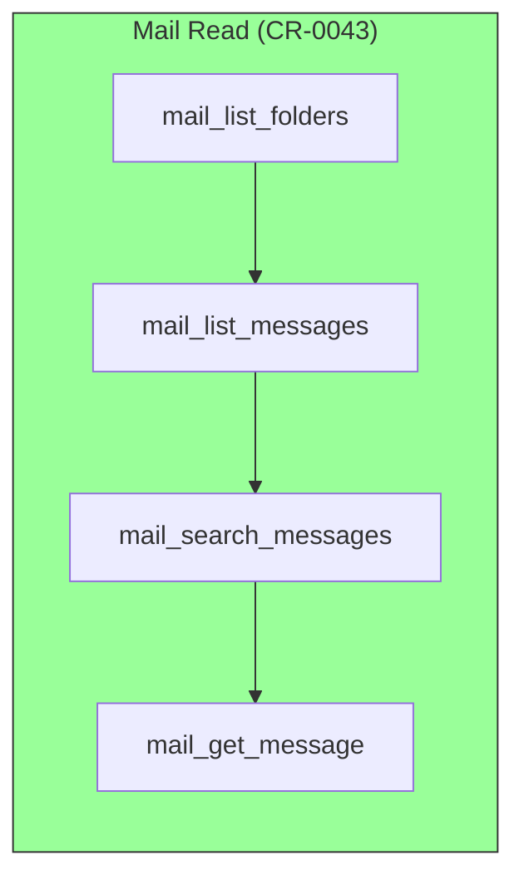
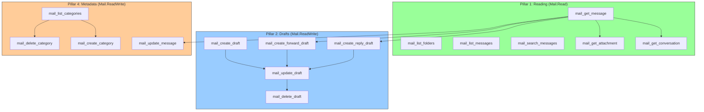
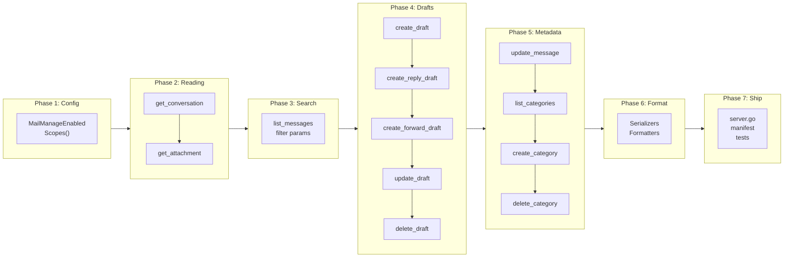

# Mail Intelligence: Reading, Drafts, Search, and Metadata Management

## Change Summary

Extend the mail subsystem from passive reading to intelligent mail assistance across four pillars: (1) deep email reading with conversation threading and attachment access for historical context, (2) draft creation and lifecycle management as a compose-without-send workflow where the user retains full control of the send action, (3) enhanced multi-approach search combining OData filtering and KQL full-text search, and (4) metadata management — categories with colors, flags, and importance — enabling the model to signal which emails it has processed, drafted responses for, or flagged for attention. The model never sends email; it reads, prepares, organizes, and flags.

## Motivation and Background

CR-0043 introduced four read-only mail tools (`mail_list_folders`, `mail_list_messages`, `mail_search_messages`, `mail_get_message`) gated behind `OUTLOOK_MCP_MAIL_ENABLED=true`. These tools provide basic mailbox visibility but leave the model unable to act on what it reads — it cannot draft a response, track which emails it has reviewed, or organize messages by priority.

The original CR-0058 proposed full lifecycle management including send/reply/forward. However, email sending is an irreversible action with high blast radius: a misworded reply sent to the wrong recipient cannot be unsent. This refactored design adopts a **draft-centric workflow** where the model prepares responses as drafts that appear in the user's Outlook Drafts folder for review, editing, and manual send. This preserves the model's productivity value (reading, analyzing, composing) while keeping the human in the loop for the highest-risk action (sending).

### Use Case: Model-Assisted Email Triage

1. Model reads an email thread via `mail_get_conversation` — understands full context.
2. Model marks the original message with a "Model Read" category via `mail_update_message` — visible in Outlook as a colored label.
3. Model drafts a reply via `mail_create_reply_draft` — appears in Drafts with correct threading.
4. Model marks the original with "Draft Prepared" category — user sees at a glance which emails have responses ready.
5. Model flags urgent emails via `mail_update_message` with `importance=high` or `flag=flagged`.
6. User opens Outlook, sees color-coded categories, reviews drafts, edits if needed, and sends.

This workflow makes the model a powerful email assistant without granting it the ability to send on the user's behalf.

## Change Drivers

* **CR-0043 deferred items**: Addresses attachment download, search enhancement, message flag/category modification, and partially addresses draft management.
* **Safety-first design**: The model should never send email. Drafts preserve human oversight for irreversible external actions.
* **Organizational signal**: Categories and flags create a shared visual language between the model and the user within Outlook's native UI.
* **Context depth**: Conversation threading and attachment download give the model complete historical context for accurate responses.

## Current State

### Mail Tools (4 read-only)

| Tool | Operation | Graph API | Scope |
|------|-----------|-----------|-------|
| `mail_list_folders` | List folders | `GET /me/mailFolders` | `Mail.Read` |
| `mail_list_messages` | List/filter messages | `GET /me/messages` | `Mail.Read` |
| `mail_search_messages` | Full-text search (KQL) | `GET /me/messages?$search=` | `Mail.Read` |
| `mail_get_message` | Get single message | `GET /me/messages/{id}` | `Mail.Read` |

### Limitations

* **No conversation threading** — retrieving a full email thread requires the model to manually chain `mail_get_message` → extract `conversationId` → `mail_list_messages` with `conversation_id`.
* **No attachment content** — only metadata (name, size, content type) is visible; the model cannot read attached documents.
* **No draft creation** — the model cannot compose responses for the user to review.
* **No metadata management** — the model cannot mark messages as read, flag them, or assign categories.
* **Limited filtering** — `mail_list_messages` lacks filters for read status, draft status, attachments, importance, and flag state.
* **No category management** — the model cannot create or list Outlook categories for organizational labeling.

### Current State Diagram



## Proposed Change

### New OAuth Scopes

| Scope | Enables | When |
|-------|---------|------|
| `Mail.ReadWrite` | Create drafts, modify message metadata (isRead, flag, categories, importance), delete drafts | When manage features are enabled |
| `MailboxSettings.ReadWrite` | List, create, delete master categories | When manage features are enabled |

The scope set is tiered:
- **`MailEnabled=true` (current)**: `Mail.Read` — no change for read-only users.
- **`MailManageEnabled=true` (new)**: `Mail.ReadWrite` + `MailboxSettings.ReadWrite` — enables draft management and metadata operations. Implies `MailEnabled`.

**`Mail.Send` is explicitly NOT requested.** The model cannot send email under any configuration. Users send drafts themselves from Outlook.

### New Tools (11)

#### Pillar 1: Reading for Context (2 tools)

| Tool | Operation | Graph API | Scope |
|------|-----------|-----------|-------|
| `mail_get_conversation` | Get full conversation thread | `GET /me/messages?$filter=conversationId eq '...'` | `Mail.Read` |
| `mail_get_attachment` | Download attachment content | `GET /me/messages/{id}/attachments/{id}` | `Mail.Read` |

#### Pillar 2: Draft Management (5 tools)

| Tool | Operation | Graph API | Scope |
|------|-----------|-----------|-------|
| `mail_create_draft` | Create new draft message | `POST /me/messages` | `Mail.ReadWrite` |
| `mail_create_reply_draft` | Create reply draft (no send) | `POST /me/messages/{id}/createReply` | `Mail.ReadWrite` |
| `mail_create_forward_draft` | Create forward draft (no send) | `POST /me/messages/{id}/createForward` | `Mail.ReadWrite` |
| `mail_update_draft` | Update draft content/recipients | `PATCH /me/messages/{id}` | `Mail.ReadWrite` |
| `mail_delete_draft` | Delete a draft message | `DELETE /me/messages/{id}` | `Mail.ReadWrite` |

#### Pillar 4: Metadata Management (4 tools)

| Tool | Operation | Graph API | Scope |
|------|-----------|-----------|-------|
| `mail_update_message` | Modify metadata: isRead, flag, categories, importance | `PATCH /me/messages/{id}` | `Mail.ReadWrite` |
| `mail_list_categories` | List master category definitions | `GET /me/outlook/masterCategories` | `MailboxSettings.ReadWrite` |
| `mail_create_category` | Create category with name and color | `POST /me/outlook/masterCategories` | `MailboxSettings.ReadWrite` |
| `mail_delete_category` | Delete a category definition | `DELETE /me/outlook/masterCategories/{id}` | `MailboxSettings.ReadWrite` |

#### Pillar 3: Enhanced Search (no new tools — parameter enhancements)

`mail_list_messages` gains five additional OData `$filter` parameters:

| Parameter | Type | Filter |
|-----------|------|--------|
| `is_read` | bool | `isRead eq true/false` |
| `is_draft` | bool | `isDraft eq true/false` |
| `has_attachments` | bool | `hasAttachments eq true/false` |
| `importance` | enum | `importance eq 'high'/'normal'/'low'` |
| `flag_status` | enum | `flag/flagStatus eq 'flagged'/'complete'/'notFlagged'` |

These parameters compose with the existing `start_datetime`, `end_datetime`, `from`, and `conversation_id` filters using `and`.

### Metadata Terminology Mapping

Outlook's Graph API uses specific terminology that maps to common email concepts:

| User Concept | Outlook Concept | Graph API Property | Notes |
|--------------|-----------------|-------------------|-------|
| Labels | Categories | `categories` (string array) | User-defined, up to 250 |
| Colors | Category presets | `color` on outlookCategory | 25 preset colors (preset0–preset24) |
| Pin/Unpin | Flag | `flag.flagStatus` | `flagged`/`notFlagged`/`complete` with optional due dates |
| Importance | Importance | `importance` | `low`/`normal`/`high` |

**Note:** The Graph API does not support native message pinning. The `flag` feature (follow-up flag with optional start/due dates) serves as the functional equivalent, providing visual prominence in Outlook clients. Alternatively, a dedicated category (e.g., "Pinned" with a distinctive color) can serve as a pin marker.

### Category Color Presets

| Preset | Color | Preset | Color |
|--------|-------|--------|-------|
| `preset0` | Red | `preset13` | DarkGray |
| `preset1` | Orange | `preset14` | Black |
| `preset2` | Brown | `preset15` | DarkRed |
| `preset3` | Yellow | `preset16` | DarkOrange |
| `preset4` | Green | `preset17` | DarkBrown |
| `preset5` | Teal | `preset18` | DarkYellow |
| `preset6` | Olive | `preset19` | DarkGreen |
| `preset7` | Blue | `preset20` | DarkTeal |
| `preset8` | Purple | `preset21` | DarkOlive |
| `preset9` | Cranberry | `preset22` | DarkBlue |
| `preset10` | Steel | `preset23` | DarkPurple |
| `preset11` | DarkSteel | `preset24` | DarkCranberry |
| `preset12` | Gray | `none` | No color |

### Proposed State Diagram



## Requirements

### Functional Requirements

#### Configuration

1. The system **MUST** add a `MailManageEnabled` config field (`OUTLOOK_MCP_MAIL_MANAGE_ENABLED`, default `false`).
2. When `MailManageEnabled` is `true`, `MailEnabled` **MUST** be implicitly set to `true` regardless of its explicit value.
3. The system **MUST NOT** request the `Mail.Send` scope under any configuration.

#### OAuth Scopes

4. When `MailEnabled` is `true` and `MailManageEnabled` is `false`, the OAuth scope **MUST** be `Mail.Read` (current behavior, unchanged).
5. When `MailManageEnabled` is `true`, the OAuth scopes **MUST** include `Mail.ReadWrite` and `MailboxSettings.ReadWrite` instead of `Mail.Read`.

#### Pillar 1: Reading for Context

##### mail_get_conversation

6. The system **MUST** provide a `mail_get_conversation` tool that retrieves all messages in a conversation thread.
7. `mail_get_conversation` **MUST** accept a required `message_id` parameter and resolve the `conversationId` by first fetching the message.
8. `mail_get_conversation` **MUST** also accept an optional `conversation_id` parameter; when provided, skip the message fetch and query directly.
9. `mail_get_conversation` **MUST** call `GET /me/messages?$filter=conversationId eq '{id}'&$orderby=receivedDateTime asc` to return messages in chronological order.
10. `mail_get_conversation` **MUST** accept optional `max_results` (default 50) and `output` (text/summary/raw) parameters.
11. `mail_get_conversation` **MUST** include MCP annotations: ReadOnly=true, Destructive=false, Idempotent=true, OpenWorld=true.

##### mail_get_attachment

12. The system **MUST** provide a `mail_get_attachment` tool that downloads attachment content.
13. `mail_get_attachment` **MUST** accept required `message_id` and `attachment_id` parameters.
14. `mail_get_attachment` **MUST** call `GET /me/messages/{id}/attachments/{id}`.
15. `mail_get_attachment` **MUST** return attachment metadata (name, content type, size) and base64-encoded content bytes.
16. `mail_get_attachment` **MUST** enforce a configurable maximum attachment size (default 10 MB) and return an error for larger attachments.
17. `mail_get_attachment` **MUST** include MCP annotations: ReadOnly=true, Destructive=false, Idempotent=true, OpenWorld=true.

#### Pillar 2: Draft Management

##### mail_create_draft

18. The system **MUST** provide a `mail_create_draft` tool that creates a new message in the Drafts folder without sending.
19. `mail_create_draft` **MUST** accept optional `to_recipients` (comma-separated emails), `cc_recipients`, `bcc_recipients`, `subject`, `body`, `content_type` (text/html, default text), and `importance` (low/normal/high) parameters.
20. `mail_create_draft` **MUST** call `POST /me/messages` to create the draft.
21. `mail_create_draft` **MUST** return the draft message ID, subject, and a confirmation that the draft is available in the Drafts folder.
22. `mail_create_draft` description **MUST** state that the draft will appear in the user's Outlook Drafts folder for review and manual send.
23. `mail_create_draft` **MUST** include MCP annotations: ReadOnly=false, Destructive=false, Idempotent=false, OpenWorld=true.

##### mail_create_reply_draft

24. The system **MUST** provide a `mail_create_reply_draft` tool that creates a reply draft without sending.
25. `mail_create_reply_draft` **MUST** accept a required `message_id` parameter and an optional `comment` (reply body text prepended to the quoted original) parameter.
26. `mail_create_reply_draft` **MUST** accept an optional `reply_all` boolean parameter (default false).
27. `mail_create_reply_draft` **MUST** call `POST /me/messages/{id}/createReply` or `POST /me/messages/{id}/createReplyAll` based on the `reply_all` parameter.
28. `mail_create_reply_draft` **MUST** return the draft message ID and confirm the draft is in the Drafts folder with correct threading headers.
29. `mail_create_reply_draft` **MUST** include MCP annotations: ReadOnly=false, Destructive=false, Idempotent=false, OpenWorld=true.

##### mail_create_forward_draft

30. The system **MUST** provide a `mail_create_forward_draft` tool that creates a forward draft without sending.
31. `mail_create_forward_draft` **MUST** accept a required `message_id` parameter and optional `to_recipients` (comma-separated emails) and `comment` (forward body text) parameters.
32. `mail_create_forward_draft` **MUST** call `POST /me/messages/{id}/createForward`.
33. `mail_create_forward_draft` **MUST** return the draft message ID and confirm the draft is in the Drafts folder.
34. `mail_create_forward_draft` **MUST** include MCP annotations: ReadOnly=false, Destructive=false, Idempotent=false, OpenWorld=true.

##### mail_update_draft

35. The system **MUST** provide a `mail_update_draft` tool that updates an existing draft message.
36. `mail_update_draft` **MUST** accept a required `message_id` parameter and optional `to_recipients`, `cc_recipients`, `bcc_recipients`, `subject`, `body`, `content_type`, and `importance` parameters.
37. `mail_update_draft` **MUST** validate that the target message is a draft (`isDraft=true`) before applying the update. If the message is not a draft, **MUST** return an error.
38. `mail_update_draft` **MUST** use PATCH semantics: only explicitly provided fields are set on the request body.
39. `mail_update_draft` **MUST** call `PATCH /me/messages/{id}`.
40. `mail_update_draft` **MUST** include MCP annotations: ReadOnly=false, Destructive=false, Idempotent=true, OpenWorld=true.

##### mail_delete_draft

41. The system **MUST** provide a `mail_delete_draft` tool that permanently deletes a draft message.
42. `mail_delete_draft` **MUST** accept a required `message_id` parameter.
43. `mail_delete_draft` **MUST** validate that the target message is a draft (`isDraft=true`) before deleting. If the message is not a draft, **MUST** return an error.
44. `mail_delete_draft` **MUST** call `DELETE /me/messages/{id}`.
45. `mail_delete_draft` **MUST** include MCP annotations: ReadOnly=false, Destructive=true, Idempotent=true, OpenWorld=true.

#### Pillar 3: Enhanced Search

##### mail_list_messages enhancements

46. `mail_list_messages` **MUST** accept an optional `is_read` boolean parameter that adds `isRead eq true/false` to the OData `$filter`.
47. `mail_list_messages` **MUST** accept an optional `is_draft` boolean parameter that adds `isDraft eq true/false` to the OData `$filter`.
48. `mail_list_messages` **MUST** accept an optional `has_attachments` boolean parameter that adds `hasAttachments eq true/false` to the OData `$filter`.
49. `mail_list_messages` **MUST** accept an optional `importance` enum parameter (low/normal/high) that adds `importance eq '{value}'` to the OData `$filter`.
50. `mail_list_messages` **MUST** accept an optional `flag_status` enum parameter (notFlagged/flagged/complete) that adds `flag/flagStatus eq '{value}'` to the OData `$filter`.
51. New filter parameters **MUST** compose with existing filters (`start_datetime`, `end_datetime`, `from`, `conversation_id`) using `and`.

##### mail_search_messages enhancements

52. `mail_search_messages` tool description **MUST** be updated to include comprehensive KQL syntax guidance: property keywords (`from:`, `to:`, `cc:`, `subject:`, `body:`, `participants:`, `hasAttachments:`, `received>=`), boolean operators (`AND`, `OR`), phrase matching (`"exact phrase"`), and limitations (no `isRead` or `flag` filtering — direct the model to use `mail_list_messages` for those).

#### Pillar 4: Metadata Management

##### mail_update_message

53. The system **MUST** provide a `mail_update_message` tool that modifies message metadata properties.
54. `mail_update_message` **MUST** accept a required `message_id` and optional parameters: `is_read` (bool), `flag_status` (enum: notFlagged/flagged/complete), `flag_start_date` (ISO 8601, optional, requires `flag_status=flagged`), `flag_due_date` (ISO 8601, optional, requires `flag_status=flagged`), `categories` (comma-separated category names), and `importance` (low/normal/high).
55. `mail_update_message` **MUST** use PATCH semantics: only explicitly provided fields are set on the request body.
56. When `flag_due_date` is provided, `flag_start_date` **MUST** also be provided (Graph API requirement). If `flag_due_date` is set without `flag_start_date`, **MUST** return a validation error.
57. `mail_update_message` **MUST** call `PATCH /me/messages/{id}`.
58. `mail_update_message` **MUST** return a text confirmation listing which properties were updated.
59. `mail_update_message` **MUST** include MCP annotations: ReadOnly=false, Destructive=false, Idempotent=true, OpenWorld=true.

##### mail_list_categories

60. The system **MUST** provide a `mail_list_categories` tool that lists the user's master category definitions.
61. `mail_list_categories` **MUST** call `GET /me/outlook/masterCategories`.
62. `mail_list_categories` **MUST** return each category's `id`, `displayName`, and `color` preset name.
63. `mail_list_categories` **MUST** support the three-tier output model (text/summary/raw).
64. `mail_list_categories` **MUST** include MCP annotations: ReadOnly=true, Destructive=false, Idempotent=true, OpenWorld=true.

##### mail_create_category

65. The system **MUST** provide a `mail_create_category` tool.
66. `mail_create_category` **MUST** accept a required `display_name` parameter and an optional `color` parameter (one of the 25 preset names: preset0–preset24, or "none").
67. `mail_create_category` **MUST** call `POST /me/outlook/masterCategories`.
68. `mail_create_category` **MUST** return the new category ID, display name, and color.
69. `mail_create_category` description **MUST** note that category `displayName` is immutable after creation — to rename, delete and recreate.
70. `mail_create_category` **MUST** include MCP annotations: ReadOnly=false, Destructive=false, Idempotent=false, OpenWorld=true.

##### mail_delete_category

71. The system **MUST** provide a `mail_delete_category` tool.
72. `mail_delete_category` **MUST** accept a required `category_id` parameter.
73. `mail_delete_category` **MUST** call `DELETE /me/outlook/masterCategories/{id}`.
74. `mail_delete_category` description **MUST** warn that deleting a category removes it from all messages that reference it.
75. `mail_delete_category` **MUST** include MCP annotations: ReadOnly=false, Destructive=true, Idempotent=true, OpenWorld=true.

#### Tool Descriptions

76. `mail_get_conversation` description **MUST** explain that it retrieves a full email thread in chronological order and is useful for understanding historical context before drafting a response.
77. `mail_get_attachment` description **MUST** note the maximum attachment size limit.
78. All draft tools descriptions **MUST** state that drafts appear in the user's Outlook Drafts folder and are not sent automatically.
79. `mail_update_message` description **MUST** include guidance on using categories as organizational labels (e.g., "Model Read", "Draft Prepared") and flags as pin equivalents.
80. `mail_list_categories` description **MUST** recommend listing existing categories before creating new ones to avoid duplicates.

### Non-Functional Requirements

1. Each new tool **MUST** be defined in its own file following the project's single-purpose file structure.
2. All new and modified code **MUST** include Go doc comments per project documentation standards.
3. All existing tests **MUST** continue to pass after the changes.
4. The extension manifest (`extension/manifest.json`) **MUST** be updated with all new tools.
5. The CRUD test document (`docs/prompts/mcp-tool-crud-test.md`) **MUST** be updated to exercise all new tools.
6. The tool count in `server.go` **MUST** be updated.
7. Draft and metadata tools **MUST** use `wrapWrite` (includes ReadOnlyGuard) for registration. Read-only tools (conversation, attachment) **MUST** use `wrap`.
8. All new handlers **MUST** use `RetryGraphCall` for transient errors and `WithTimeout` for request timeouts.
9. All new read tools **MUST** follow the three-tier output model (text/summary/raw). Write tools return text confirmations.
10. PII in message bodies and recipient lists **MUST** be sanitized in log output by the existing `SanitizingHandler`.

## Affected Components

| Component | Change |
|-----------|--------|
| `internal/config/config.go` | Add `MailManageEnabled` field; `MailManageEnabled` implies `MailEnabled` |
| `internal/auth/auth.go` | Update `Scopes()` for `Mail.ReadWrite` + `MailboxSettings.ReadWrite` when manage enabled |
| `internal/tools/get_conversation.go` | **New**: `mail_get_conversation` tool + handler |
| `internal/tools/get_attachment.go` | **New**: `mail_get_attachment` tool + handler |
| `internal/tools/create_draft.go` | **New**: `mail_create_draft` tool + handler |
| `internal/tools/create_reply_draft.go` | **New**: `mail_create_reply_draft` tool + handler |
| `internal/tools/create_forward_draft.go` | **New**: `mail_create_forward_draft` tool + handler |
| `internal/tools/update_draft.go` | **New**: `mail_update_draft` tool + handler |
| `internal/tools/delete_draft.go` | **New**: `mail_delete_draft` tool + handler |
| `internal/tools/update_message.go` | **New**: `mail_update_message` tool + handler |
| `internal/tools/list_categories.go` | **New**: `mail_list_categories` tool + handler |
| `internal/tools/create_category.go` | **New**: `mail_create_category` tool + handler |
| `internal/tools/delete_category.go` | **New**: `mail_delete_category` tool + handler |
| `internal/tools/list_messages.go` | Add `is_read`, `is_draft`, `has_attachments`, `importance`, `flag_status` filter params |
| `internal/tools/search_messages.go` | Enhanced KQL guidance in tool description |
| `internal/graph/mail_serialize.go` | Add attachment content serialization; add category serialization |
| `internal/graph/category_serialize.go` | **New**: category serialization helpers |
| `internal/tools/text_format.go` | Add formatters: conversation thread, attachment detail, categories list |
| `internal/validate/validate.go` | Add `ValidateRecipients`, `ValidateContentType`, `ValidateCategoryColor` |
| `internal/server/server.go` | Register new tools; update tool count |
| `extension/manifest.json` | Add 11 new tool entries; update description |
| `docs/prompts/mcp-tool-crud-test.md` | Add mail management test steps |
| `internal/tools/tool_annotations_test.go` | Add annotation tests for all new tools |

## Scope Boundaries

### In Scope

* Configuration field for mail manage enablement.
* OAuth scope escalation from `Mail.Read` to `Mail.ReadWrite` + `MailboxSettings.ReadWrite`.
* 2 new read tools (conversation, attachment) available with `MailEnabled`.
* 5 new draft management tools available with `MailManageEnabled`.
* 4 new metadata management tools (update message, category CRUD) available with `MailManageEnabled`.
* 5 new filter parameters on `mail_list_messages`.
* Enhanced KQL guidance on `mail_search_messages`.
* Text formatters for new tool outputs.
* Annotation and handler unit tests.

### Out of Scope ("Here, But Not Further")

* **Send operations** — `mail_send_message`, `mail_reply_message`, `mail_forward_message`, `mail_send_draft`. By design, the model prepares drafts; the user sends from Outlook. The `Mail.Send` scope is never requested.
* **Folder CRUD** — creating, renaming, deleting mail folders (`/me/mailFolders`). Deferred.
* **Message move** — moving messages between folders (`/me/messages/{id}/move`). Deferred.
* **Delta sync** — incremental message retrieval (`/me/mailFolders/{id}/messages/delta`). Deferred.
* **Shared/delegated mailbox access** — the `shared_mailbox` parameter and `Mail.ReadWrite.Shared` scope. Deferred.
* **Mail provenance tagging** — MAPI extended properties for MCP-origin tracking. The category system serves this role instead.
* **Attachment upload** — attaching files to drafts. The Graph API supports this but requires multipart upload handling. Deferred.
* **Rich text (HTML) editor experience** — the `body` parameter accepts plain text or HTML strings. No WYSIWYG editing.
* **Mail rules / inbox automation** — server-side rules (`/me/mailFolders/inbox/messageRules`). Deferred.
* **S/MIME and encryption** — encrypted message handling. Deferred.
* **Large attachment download (>10 MB)** — the configurable size limit prevents memory exhaustion. Deferred.

## Alternative Approaches Considered

* **Full send/reply/forward operations (original CR-0058).** Rejected: email sending is irreversible with high blast radius. The draft-centric approach preserves productivity while keeping human oversight for the send action. This can be revisited as a future opt-in tier if there is demand.

* **Use extended properties (provenance) instead of categories for tracking.** Rejected: extended properties are invisible in Outlook's UI. Categories appear as colored labels in all Outlook clients (desktop, web, mobile), making model activity visible at a glance without additional tooling.

* **Single `mail_manage_message` tool for all metadata operations.** Rejected: overloaded tool with unrelated parameters (read status vs flag vs categories vs importance) creates ambiguity for the model. A single `mail_update_message` with optional fields is appropriate since all use PATCH on the same endpoint.

* **Separate `mail_flag_message`, `mail_categorize_message`, `mail_mark_read` tools.** Rejected: excessive tool proliferation. All four metadata operations use `PATCH /me/messages/{id}` — a single `mail_update_message` with optional fields is cleaner and more consistent with Graph API semantics.

* **Category color as a separate `mail_update_category` tool.** Not needed: the Graph API does not support updating category `displayName` (immutable). The only mutable field is `color`, but since categories are lightweight to recreate, delete-and-recreate is sufficient.

## Impact Assessment

### User Impact

Users who enable mail management (`OUTLOOK_MCP_MAIL_MANAGE_ENABLED=true`) gain:
- **Draft workflow**: The model reads email threads, drafts responses that appear in Outlook's Drafts folder. Users review, edit if needed, and send manually.
- **Email triage**: The model categorizes emails with colored labels (e.g., "Urgent", "Model Read", "Draft Prepared"), flags important messages, and marks processed messages as read.
- **Full context**: Conversation threading retrieves complete email history. Attachment download lets the model read attached documents.
- **Enhanced filtering**: Find unread emails, flagged items, drafts, or messages by importance without full-text search.

Users who only want read access keep `MailEnabled=true` with no scope change. They additionally gain `mail_get_conversation` and `mail_get_attachment` as read-only enhancements.

### Technical Impact

* **OAuth scope change**: Users enabling mail manage will need to re-consent for `Mail.ReadWrite` + `MailboxSettings.ReadWrite`. This is a one-time re-authentication.
* **Tool count increase**: 11 new tools. Base: 18. With mail read: +6 = 24 (adding conversation + attachment). With mail manage: +9 = 33. With auth_code: +1 = 34.
* **No new dependencies**: All Graph API endpoints are available through `msgraph-sdk-go`.
* **File count**: 11 new tool handler files + 1 serialization file, following single-purpose convention.

### Security Impact

* **No `Mail.Send` scope** — the model cannot send email under any configuration. This is the primary security differentiator from the original CR-0058.
* **`Mail.ReadWrite`** allows creating drafts and modifying message metadata. Mitigated by:
  - Opt-in configuration (`MailManageEnabled` defaults to false).
  - ReadOnlyGuard blocks write tools when `read_only=true`.
  - Audit logging of all write operations.
  - Drafts are visible in Outlook and can be reviewed/deleted by the user.
* **`MailboxSettings.ReadWrite`** allows modifying mailbox settings beyond categories. Mitigated by: the tool surface only exposes category CRUD; other mailbox settings endpoints are not implemented. This is the minimum scope required by the Graph API for category management.
* **`mail_delete_draft`** permanently deletes a draft. Mitigated by: the tool validates `isDraft=true` before deleting, preventing deletion of non-draft messages.
* **Attachment download** exposes file content. The configurable size limit (default 10 MB) prevents memory exhaustion. Content is base64-encoded in the response, not written to disk.

### Business Impact

The draft-centric workflow makes the MCP server a practical email assistant: the model handles the time-consuming work (reading threads, composing responses, organizing messages) while the user retains control of the consequential action (sending). This addresses the primary productivity gap without the liability of automated email sending.

## Implementation Approach

### Phase 1: Configuration and Scope Escalation

**`internal/config/config.go`:**
- Add `MailManageEnabled bool` field, loaded from `OUTLOOK_MCP_MAIL_MANAGE_ENABLED` (default false).
- In `LoadConfig`, when `MailManageEnabled` is true, force `MailEnabled = true`.

**`internal/auth/auth.go`:**
- Add `mailReadWriteScope = "Mail.ReadWrite"`, `mailboxSettingsScope = "MailboxSettings.ReadWrite"`.
- Update `Scopes()`:
  - If `MailManageEnabled`: append `mailReadWriteScope` + `mailboxSettingsScope` (not `mailScope`).
  - Else if `MailEnabled`: append `mailScope` (current behavior).

### Phase 2: Reading Enhancements

**`internal/tools/get_conversation.go`:**
- `NewGetConversationTool()` + `HandleGetConversation(retryCfg, timeout)`.
- Accepts `message_id` (required) or `conversation_id` (optional override).
- When only `message_id` provided: GET the message to extract `conversationId`.
- Queries `GET /me/messages?$filter=conversationId eq '...'&$orderby=receivedDateTime asc`.
- Returns chronologically ordered thread with text/summary/raw output modes.

**`internal/tools/get_attachment.go`:**
- `NewGetAttachmentTool()` + `HandleGetAttachment(retryCfg, timeout, maxSize)`.
- Calls `GET /me/messages/{id}/attachments/{id}`.
- Returns metadata (name, contentType, size) + base64 content.
- Enforces configurable size limit.

### Phase 3: Enhanced Search Filters

**`internal/tools/list_messages.go`:**
- Add five new optional parameters: `is_read`, `is_draft`, `has_attachments`, `importance`, `flag_status`.
- Update OData `$filter` builder to compose new filters with existing ones using `and`.

**`internal/tools/search_messages.go`:**
- Update tool description with comprehensive KQL syntax guidance.
- No handler changes needed.

### Phase 4: Draft Management

**`internal/tools/create_draft.go`:**
- `NewCreateDraftTool()` + `HandleCreateDraft(retryCfg, timeout)`.
- Builds `models.Message` with recipients, subject, body, importance.
- Calls `POST /me/messages`.
- Returns draft ID and confirmation.

**`internal/tools/create_reply_draft.go`:**
- `NewCreateReplyDraftTool()` + `HandleCreateReplyDraft(retryCfg, timeout)`.
- Calls `POST /me/messages/{id}/createReply` or `createReplyAll`.
- Returns draft ID with threading confirmation.

**`internal/tools/create_forward_draft.go`:**
- `NewCreateForwardDraftTool()` + `HandleCreateForwardDraft(retryCfg, timeout)`.
- Calls `POST /me/messages/{id}/createForward` with optional recipients and comment.
- Returns draft ID.

**`internal/tools/update_draft.go`:**
- `NewUpdateDraftTool()` + `HandleUpdateDraft(retryCfg, timeout)`.
- Validates target is a draft before PATCH.
- Updates subject, body, recipients, importance.

**`internal/tools/delete_draft.go`:**
- `NewDeleteDraftTool()` + `HandleDeleteDraft(retryCfg, timeout)`.
- Validates target is a draft before DELETE.

### Phase 5: Metadata Management

**`internal/tools/update_message.go`:**
- `NewUpdateMessageTool()` + `HandleUpdateMessage(retryCfg, timeout)`.
- PATCH with optional `isRead`, `flag` (status + optional dates), `categories`, `importance`.
- Validates flag date dependencies.

**`internal/tools/list_categories.go`:**
- `NewListCategoriesTool()` + `HandleListCategories(retryCfg, timeout)`.
- Calls `GET /me/outlook/masterCategories`.
- Three-tier output: text (numbered list), summary (JSON array), raw.

**`internal/tools/create_category.go`:**
- `NewCreateCategoryTool()` + `HandleCreateCategory(retryCfg, timeout)`.
- Validates color preset.
- Calls `POST /me/outlook/masterCategories`.

**`internal/tools/delete_category.go`:**
- `NewDeleteCategoryTool()` + `HandleDeleteCategory(retryCfg, timeout)`.
- Calls `DELETE /me/outlook/masterCategories/{id}`.

### Phase 6: Serialization and Formatting

**`internal/graph/category_serialize.go`** (new):
- `SerializeCategory(cat)`, `SerializeSummaryCategory(cat)`.

**`internal/tools/text_format.go`:**
- `FormatConversationText()` — chronological thread with message numbers and quoted excerpts.
- `FormatAttachmentText()` — attachment metadata with size.
- `FormatCategoriesText()` — numbered category list with color names.

### Phase 7: Server Registration, Manifest, and Tests

**`internal/server/server.go`:**
- Register read tools (`mail_get_conversation`, `mail_get_attachment`) with `wrap` under `MailEnabled`.
- Register manage tools (5 draft + 4 metadata) with `wrapWrite` under `MailManageEnabled`.
- Update tool count.

**`extension/manifest.json`:**
- Add all 11 new tool entries.

**Tests:**
- Annotation tests for all 11 new tools.
- Handler unit tests with mock Graph client for each new tool.
- Scope tests for new configuration combinations.
- Filter composition tests for enhanced `mail_list_messages`.
- Draft validation tests (isDraft check).
- Category color validation tests.
- Flag date dependency validation tests.

**`docs/prompts/mcp-tool-crud-test.md`:**
- Add mail management lifecycle test steps.

### Implementation Flow



## Test Strategy

### Tests to Add

| Test File | Test Name | Description |
|-----------|-----------|-------------|
| `auth_test.go` | `TestScopes_MailManage` | `MailManageEnabled` returns `Mail.ReadWrite` + `MailboxSettings.ReadWrite` |
| `auth_test.go` | `TestScopes_MailManageImpliesRead` | `MailManageEnabled` forces `MailEnabled` |
| `auth_test.go` | `TestScopes_NoMailSend` | No configuration produces `Mail.Send` scope |
| `config_test.go` | `TestMailManageImpliesMailEnabled` | `MailManageEnabled=true` + `MailEnabled=false` → `MailEnabled=true` |
| `get_conversation_test.go` | `TestGetConversation_ByMessageID` | Resolves conversationId from message, returns thread |
| `get_conversation_test.go` | `TestGetConversation_ByConversationID` | Skips message fetch, queries directly |
| `get_conversation_test.go` | `TestGetConversation_ChronologicalOrder` | Messages returned oldest-first |
| `get_attachment_test.go` | `TestGetAttachment_Success` | Attachment content returned base64 |
| `get_attachment_test.go` | `TestGetAttachment_TooLarge` | Error on oversized attachment |
| `create_draft_test.go` | `TestCreateDraft_Success` | Draft created, ID returned |
| `create_draft_test.go` | `TestCreateDraft_AllFields` | Recipients, subject, body, importance set |
| `create_reply_draft_test.go` | `TestCreateReplyDraft_Reply` | Reply draft created via createReply |
| `create_reply_draft_test.go` | `TestCreateReplyDraft_ReplyAll` | Reply-all draft created via createReplyAll |
| `create_forward_draft_test.go` | `TestCreateForwardDraft_Success` | Forward draft created with recipients |
| `update_draft_test.go` | `TestUpdateDraft_Success` | Draft body and recipients updated |
| `update_draft_test.go` | `TestUpdateDraft_NotDraft` | Error when target is not a draft |
| `delete_draft_test.go` | `TestDeleteDraft_Success` | Draft deleted |
| `delete_draft_test.go` | `TestDeleteDraft_NotDraft` | Error when target is not a draft |
| `update_message_test.go` | `TestUpdateMessage_MarkRead` | isRead set to true |
| `update_message_test.go` | `TestUpdateMessage_Flag` | Flag set to "flagged" |
| `update_message_test.go` | `TestUpdateMessage_FlagWithDates` | Flag with start and due dates |
| `update_message_test.go` | `TestUpdateMessage_FlagDueDateWithoutStart` | Validation error |
| `update_message_test.go` | `TestUpdateMessage_Categories` | Categories set on message |
| `update_message_test.go` | `TestUpdateMessage_Importance` | Importance changed |
| `list_categories_test.go` | `TestListCategories_Success` | Categories returned with colors |
| `create_category_test.go` | `TestCreateCategory_Success` | Category created with color |
| `create_category_test.go` | `TestCreateCategory_InvalidColor` | Validation error on bad preset |
| `delete_category_test.go` | `TestDeleteCategory_Success` | Category deleted |
| `list_messages_test.go` | `TestListMessages_IsReadFilter` | isRead filter applied |
| `list_messages_test.go` | `TestListMessages_IsDraftFilter` | isDraft filter applied |
| `list_messages_test.go` | `TestListMessages_CombinedFilters` | Multiple filters composed with 'and' |
| `tool_annotations_test.go` | 11 tests | Annotation sets for all new tools |

### Tests to Modify

| Test File | Test Name | Change |
|-----------|-----------|--------|
| `list_messages_test.go` | Existing tests | Add new filter parameter coverage |

## Acceptance Criteria

### AC-1: Conversation thread retrieval

```gherkin
Given a message that is part of a multi-message conversation
When mail_get_conversation is called with message_id
Then all messages in the conversation are returned in chronological order
  And the response includes the conversationId for reference
```

### AC-2: Attachment download

```gherkin
Given a message with file attachments
When mail_get_attachment is called with message_id and attachment_id
Then the response contains attachment name, content type, size, and base64 content
```

### AC-3: New draft creation

```gherkin
Given MailManageEnabled is true
When mail_create_draft is called with to_recipients, subject, and body
Then a draft is created in the Drafts folder and the draft ID is returned
  And the draft is visible in Outlook's Drafts folder
```

### AC-4: Reply draft creation

```gherkin
Given a received message
When mail_create_reply_draft is called with message_id and comment
Then a reply draft is created with correct threading headers (In-Reply-To, References)
  And the draft appears in the Drafts folder
  And the message is NOT sent
```

### AC-5: Draft update and delete lifecycle

```gherkin
Given a draft created by mail_create_draft
When mail_update_draft is called with new subject and body
Then the draft content is updated

Given a draft message
When mail_delete_draft is called with the draft message_id
Then the draft is permanently deleted

Given a non-draft message
When mail_update_draft or mail_delete_draft is called with its message_id
Then a validation error is returned
```

### AC-6: Enhanced message filtering

```gherkin
Given an inbox with read, unread, flagged, and draft messages
When mail_list_messages is called with is_read=false and flag_status=flagged
Then only unread, flagged messages are returned
  And existing filters (date range, sender) still compose correctly
```

### AC-7: Message metadata update

```gherkin
Given a message in the inbox
When mail_update_message is called with categories=["Model Read","Urgent"] and is_read=true
Then the message is marked as read and both categories are applied
  And the categories appear as colored labels in Outlook
```

### AC-8: Category lifecycle

```gherkin
Given MailManageEnabled is true
When mail_create_category is called with display_name="Model Read" and color="preset4"
Then a green category named "Model Read" is created

When mail_list_categories is called
Then "Model Read" appears in the list with color "preset4"

When mail_delete_category is called with the category_id
Then the category is removed from the master list
```

### AC-9: Scope escalation matches configuration

```gherkin
Given MailEnabled=true and MailManageEnabled=false
Then OAuth scopes include Mail.Read only

Given MailManageEnabled=true
Then OAuth scopes include Mail.ReadWrite and MailboxSettings.ReadWrite
  And OAuth scopes do NOT include Mail.Send
  And OAuth scopes do NOT include Mail.Read (superseded by Mail.ReadWrite)
```

### AC-10: No send capability

```gherkin
Given any server configuration (MailEnabled, MailManageEnabled, ReadOnly)
Then no tool exists that calls POST /me/sendMail, /me/messages/{id}/send,
     /me/messages/{id}/reply, or /me/messages/{id}/forward
  And the Mail.Send OAuth scope is never requested
```

### AC-11: All quality checks pass

```gherkin
Given all code changes are applied
When make ci is executed
Then the build succeeds, all linter checks pass, and all tests pass
```

## Quality Standards Compliance

### Build & Compilation

- [ ] Code compiles/builds without errors
- [ ] No new compiler warnings introduced

### Linting & Code Style

- [ ] All linter checks pass with zero warnings/errors
- [ ] Code follows project coding conventions and style guides

### Test Execution

- [ ] All existing tests pass after implementation
- [ ] All new tests pass
- [ ] Test coverage meets project requirements for changed code

### Documentation

- [ ] Go doc comments on all new tool constructors and handlers
- [ ] CRUD test document updated with mail management test steps

### Code Review

- [ ] Changes submitted via pull request
- [ ] PR title follows Conventional Commits format
- [ ] Code review completed and approved
- [ ] Changes squash-merged to maintain linear history

### Verification Commands

```bash
make build
make lint
make test
make ci
```

## Risks and Mitigation

### Risk 1: Mail.ReadWrite scope allows modifying any message

**Likelihood:** high (by design)
**Impact:** medium
**Mitigation:** Three-layer defense: (1) Opt-in config `MailManageEnabled` defaults to false, (2) ReadOnlyGuard blocks write tools in read-only mode, (3) Audit logging records all modifications. The scope does not include `Mail.Send`, so the blast radius is limited to metadata and draft changes — all visible and reversible in Outlook.

### Risk 2: MailboxSettings.ReadWrite scope is broader than needed

**Likelihood:** low (scope is stable)
**Impact:** low
**Mitigation:** The `MailboxSettings.ReadWrite` scope is the minimum required by the Graph API for master category management. The tool surface only exposes category CRUD — no other mailbox settings endpoints are implemented. The scope is well-documented in the consent prompt, and users can inspect what it allows before granting.

### Risk 3: Re-consent required when upgrading from Mail.Read to Mail.ReadWrite

**Likelihood:** high
**Impact:** low
**Mitigation:** Users enabling `MailManageEnabled` will be prompted to re-authenticate with the new scopes. The auth middleware handles this transparently on the next tool call. The `account_login` tool (CR-0056) provides explicit control.

### Risk 4: Draft validation race condition

**Likelihood:** low
**Impact:** low
**Mitigation:** `mail_update_draft` and `mail_delete_draft` validate `isDraft=true` by fetching the message before operating. A race condition where the draft is sent between the check and the operation is theoretically possible but practically negligible — the Graph API will return an appropriate error if the state changed.

### Risk 5: Large attachment download causes memory pressure

**Likelihood:** medium
**Impact:** medium
**Mitigation:** Configurable maximum attachment size (default 10 MB) prevents unbounded memory allocation. A 10 MB file results in ~13 MB of base64 text, within acceptable limits for a single tool response.

### Risk 6: Category display name immutability surprises users

**Likelihood:** medium
**Impact:** low
**Mitigation:** The `mail_create_category` tool description explicitly states that display names are immutable after creation. To "rename" a category, delete and recreate it. This is a Graph API limitation, not a design choice.

## Dependencies

* No new Go module dependencies. The `msgraph-sdk-go` already provides all required models and API clients.
* Requires Microsoft Graph API permissions: `Mail.ReadWrite` and `MailboxSettings.ReadWrite` (delegated).
* Users must have Exchange Online licensing (included in Microsoft 365).

## Estimated Effort

18–26 person-hours, distributed as:

| Phase | Effort |
|-------|--------|
| Phase 1: Config + scopes | 1–2 hours |
| Phase 2: Reading (conversation, attachment) | 3–4 hours |
| Phase 3: Search filter enhancements | 1–2 hours |
| Phase 4: Draft management (5 tools) | 4–6 hours |
| Phase 5: Metadata management (4 tools) | 3–4 hours |
| Phase 6: Serialization + formatting | 2–3 hours |
| Phase 7: Registration + manifest + tests | 4–5 hours |

## Decision Outcome

Chosen approach: "Draft-centric workflow with metadata signaling", because it provides the model with full email assistance capability (read, compose, organize) while maintaining human oversight for the highest-risk action (sending). Categories replace provenance tagging with a user-visible mechanism. The `Mail.Send` scope is never requested, eliminating the risk of automated email dispatch. This design can be extended with an opt-in send tier in a future CR if there is demand.

## Related Items

* CR-0043: Mail Read & Event-Email Correlation — introduced the 4 read-only tools and deferred all features addressed here.
* CR-0052: MCP Tool Annotations — annotation matrix for all new tools.
* CR-0051: Token-Efficient Response Defaults — three-tier output model for new read tools.
* CR-0056: UPN-Based Account Identity — `account_login` tool for explicit re-authentication after scope changes.
