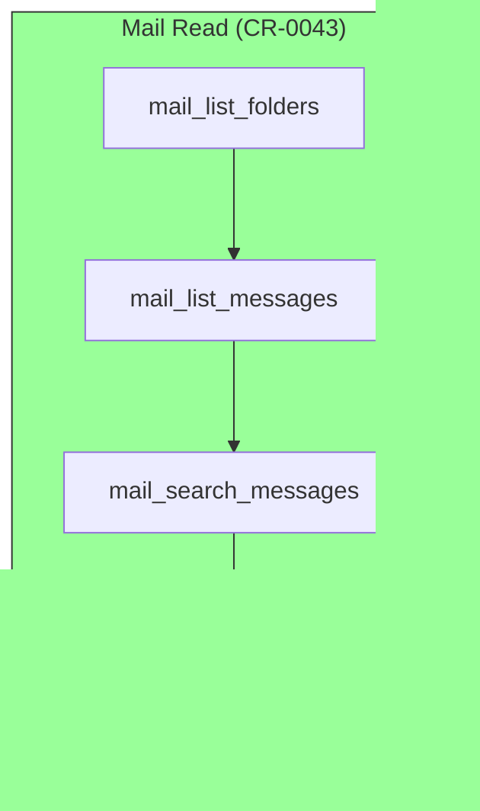
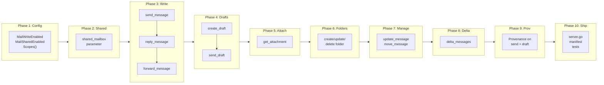

# Complete Mail Management: Write Operations, Attachments, and Extended Features

## Change Summary

Extend the mail subsystem from read-only to full lifecycle management. Add write operations (send, reply, forward, draft management), attachment download, folder CRUD, message flag/category modification, delta sync for incremental retrieval, shared/delegated mailbox access, and mail provenance tagging. This transforms the mail integration from a passive reader into a complete email management surface, enabling the LLM to compose and send mail, manage folders, organize messages, and operate across shared mailboxes — all with the same middleware, observability, and audit patterns as the existing calendar tools.

## Motivation and Background

CR-0043 introduced four read-only mail tools (`mail_list_folders`, `mail_list_messages`, `mail_search_messages`, `mail_get_message`) gated behind `OUTLOOK_MCP_MAIL_ENABLED=true`. These tools request only the `Mail.Read` OAuth scope and explicitly deferred eight categories of functionality as out of scope. Since then, users have expressed the need to:

1. **Compose and send email** directly from the LLM conversation — the most requested missing feature.
2. **Download attachments** referenced in messages — currently only metadata (name, size, content type) is visible.
3. **Organize their inbox** by modifying read/unread status, flags, and categories.
4. **Manage folders** (create project-specific folders, rename, delete).
5. **Access shared mailboxes** for team-managed inboxes.
6. **Detect new mail efficiently** without re-fetching entire folder contents.
7. **Tag messages** created through the MCP server for traceability.

This CR addresses all eight deferred items from CR-0043 in a single cohesive design, organized into independent implementation phases that can be delivered incrementally.

## Change Drivers

* **CR-0043 deferred items**: All eight out-of-scope categories are addressed.
* **User request**: Send/reply/forward is the #1 feature request for the mail subsystem.
* **Workflow completeness**: An LLM that can read but not act on email is limited — users must context-switch to Outlook for every action.
* **Parity with calendar**: The calendar subsystem has full CRUD (create, read, update, delete). Mail should have equivalent coverage.

## Current State

### Mail Tools (4 read-only)

| Tool | Operation | Graph API | Scope |
|------|-----------|-----------|-------|
| `mail_list_folders` | List folders | `GET /me/mailFolders` | `Mail.Read` |
| `mail_list_messages` | List/filter messages | `GET /me/messages` | `Mail.Read` |
| `mail_search_messages` | Full-text search (KQL) | `GET /me/messages?$search=` | `Mail.Read` |
| `mail_get_message` | Get single message | `GET /me/messages/{id}` | `Mail.Read` |

### OAuth Scopes

```go
const calendarScope = "Calendars.ReadWrite"
const mailScope = "Mail.Read"
```

`Mail.Read` is the only mail scope requested. No write scope (`Mail.Send`, `Mail.ReadWrite`) is present.

### Current State Diagram



## Proposed Change

### New OAuth Scopes

| Scope | Enables | When |
|-------|---------|------|
| `Mail.ReadWrite` | Read, create, update, delete messages and folders | Replaces `Mail.Read` when write operations are enabled |
| `Mail.Send` | Send messages (including reply/forward) | Required for send, reply, forward |
| `Mail.ReadWrite.Shared` | Access shared/delegated mailboxes | When shared mailbox features are enabled |

The scope set is tiered:
- **`MailEnabled=true` (current)**: `Mail.Read` — no change for read-only users.
- **`MailWriteEnabled=true` (new)**: `Mail.ReadWrite` + `Mail.Send` — enables write operations. Implies `MailEnabled`.
- **`MailSharedEnabled=true` (new)**: Adds `Mail.ReadWrite.Shared` — enables shared mailbox access.

### New Tools (13)

#### Write Operations (5 tools)

| Tool | Operation | Graph API | Notes |
|------|-----------|-----------|-------|
| `mail_send_message` | Compose and send | `POST /me/sendMail` | Inline compose + send |
| `mail_reply_message` | Reply to message | `POST /me/messages/{id}/reply` | Reply to sender or reply-all |
| `mail_forward_message` | Forward message | `POST /me/messages/{id}/forward` | Forward to new recipients |
| `mail_create_draft` | Create draft | `POST /me/messages` | Save to Drafts without sending |
| `mail_send_draft` | Send existing draft | `POST /me/messages/{id}/send` | Send a previously created draft |

#### Attachment Operations (1 tool)

| Tool | Operation | Graph API | Notes |
|------|-----------|-----------|-------|
| `mail_get_attachment` | Download attachment | `GET /me/messages/{id}/attachments/{id}` | Returns base64-encoded content |

#### Folder Management (3 tools)

| Tool | Operation | Graph API | Notes |
|------|-----------|-----------|-------|
| `mail_create_folder` | Create folder | `POST /me/mailFolders` | Top-level or nested |
| `mail_update_folder` | Rename folder | `PATCH /me/mailFolders/{id}` | Update display name |
| `mail_delete_folder` | Delete folder | `DELETE /me/mailFolders/{id}` | Deletes folder and contents |

#### Message Management (2 tools)

| Tool | Operation | Graph API | Notes |
|------|-----------|-----------|-------|
| `mail_update_message` | Modify message properties | `PATCH /me/messages/{id}` | isRead, flag, categories, importance |
| `mail_move_message` | Move message to folder | `POST /me/messages/{id}/move` | Move between folders |

#### Delta Sync (1 tool)

| Tool | Operation | Graph API | Notes |
|------|-----------|-----------|-------|
| `mail_delta_messages` | Incremental changes | `GET /me/mailFolders/{id}/messages/delta` | Returns new/changed/deleted messages since last sync |

#### Shared Mailbox (1 tool — modifies existing)

Not a new tool, but a parameter addition: all mail tools gain an optional `shared_mailbox` parameter that switches the API path from `/me/messages` to `/users/{shared_mailbox}/messages`.

### Proposed State Diagram

```mermaid
flowchart TB
    subgraph Read["Mail Read (CR-0043)"]
        LF[mail_list_folders]
        LM[mail_list_messages]
        SM[mail_search_messages]
        GM[mail_get_message]
    end
    subgraph Write["Mail Write (this CR)"]
        SEND[mail_send_message]
        REPLY[mail_reply_message]
        FWD[mail_forward_message]
        DRAFT[mail_create_draft]
        SDRAFT[mail_send_draft]
    end
    subgraph Attach["Attachments"]
        GA[mail_get_attachment]
    end
    subgraph Folder["Folder CRUD"]
        CF[mail_create_folder]
        UF[mail_update_folder]
        DF[mail_delete_folder]
    end
    subgraph Manage["Message Management"]
        UM[mail_update_message]
        MM[mail_move_message]
    end
    subgraph Delta["Delta Sync"]
        DM[mail_delta_messages]
    end

    GM --> GA
    GM --> REPLY
    GM --> FWD
    DRAFT --> SDRAFT
    LF --> CF
    LM --> UM
    LM --> MM

    style Read fill:#9f9,stroke:#333
    style Write fill:#f96,stroke:#333
    style Attach fill:#9cf,stroke:#333
    style Folder fill:#fc9,stroke:#333
    style Manage fill:#c9f,stroke:#333
    style Delta fill:#ff9,stroke:#333
```



## Requirements

### Functional Requirements

#### Configuration

1. The system **MUST** add a `MailWriteEnabled` config field (`OUTLOOK_MCP_MAIL_WRITE_ENABLED`, default `false`).
2. When `MailWriteEnabled` is `true`, `MailEnabled` **MUST** be implicitly set to `true` regardless of its explicit value.
3. The system **MUST** add a `MailSharedEnabled` config field (`OUTLOOK_MCP_MAIL_SHARED_ENABLED`, default `false`).

#### OAuth Scopes

4. When `MailEnabled` is `true` and `MailWriteEnabled` is `false`, the OAuth scope **MUST** be `Mail.Read` (current behavior, unchanged).
5. When `MailWriteEnabled` is `true`, the OAuth scopes **MUST** include `Mail.ReadWrite` and `Mail.Send` instead of `Mail.Read`.
6. When `MailSharedEnabled` is `true`, the OAuth scopes **MUST** additionally include `Mail.ReadWrite.Shared`.

#### mail_send_message

7. The system **MUST** provide a `mail_send_message` tool that composes and sends a new email.
8. `mail_send_message` **MUST** accept required `to_recipients` (comma-separated emails) and `body` parameters.
9. `mail_send_message` **MUST** accept optional `subject`, `cc_recipients`, `bcc_recipients`, `importance` (low/normal/high), `content_type` (text/html, default text), and `save_to_sent_items` (default true) parameters.
10. `mail_send_message` **MUST** call `POST /me/sendMail` with the composed message.
11. `mail_send_message` **MUST** include confirmation guidance in its description, requiring the LLM to present a draft summary (recipients, subject, body preview) before sending. This follows the CR-0054 meeting tool pattern.
12. `mail_send_message` **MUST** include the full set of five MCP annotations: ReadOnly=false, Destructive=false, Idempotent=false, OpenWorld=true.

#### mail_reply_message

13. The system **MUST** provide a `mail_reply_message` tool.
14. `mail_reply_message` **MUST** accept required `message_id` and `comment` (reply body) parameters.
15. `mail_reply_message` **MUST** accept an optional `reply_all` boolean parameter (default false).
16. `mail_reply_message` **MUST** call `POST /me/messages/{id}/reply` or `POST /me/messages/{id}/replyAll` based on the `reply_all` parameter.
17. `mail_reply_message` **MUST** include confirmation guidance requiring the LLM to show the original message subject and the reply body before sending.
18. `mail_reply_message` **MUST** include MCP annotations: ReadOnly=false, Destructive=false, Idempotent=false, OpenWorld=true.

#### mail_forward_message

19. The system **MUST** provide a `mail_forward_message` tool.
20. `mail_forward_message` **MUST** accept required `message_id`, `to_recipients`, and `comment` (forward body) parameters.
21. `mail_forward_message` **MUST** call `POST /me/messages/{id}/forward`.
22. `mail_forward_message` **MUST** include confirmation guidance requiring the LLM to show the original message subject, forward recipients, and the comment before sending.
23. `mail_forward_message` **MUST** include MCP annotations: ReadOnly=false, Destructive=false, Idempotent=false, OpenWorld=true.

#### mail_create_draft

24. The system **MUST** provide a `mail_create_draft` tool that creates a message in the Drafts folder without sending.
25. `mail_create_draft` **MUST** accept the same parameters as `mail_send_message` except `save_to_sent_items`.
26. `mail_create_draft` **MUST** call `POST /me/messages` to create the draft.
27. `mail_create_draft` **MUST** return the draft message ID so it can be sent later via `mail_send_draft`.
28. `mail_create_draft` **MUST** include MCP annotations: ReadOnly=false, Destructive=false, Idempotent=false, OpenWorld=true.

#### mail_send_draft

29. The system **MUST** provide a `mail_send_draft` tool that sends a previously created draft.
30. `mail_send_draft` **MUST** accept a required `message_id` parameter pointing to the draft.
31. `mail_send_draft` **MUST** call `POST /me/messages/{id}/send`.
32. `mail_send_draft` **MUST** include confirmation guidance requiring the LLM to retrieve and display the draft content before sending.
33. `mail_send_draft` **MUST** include MCP annotations: ReadOnly=false, Destructive=false, Idempotent=false, OpenWorld=true.

#### mail_get_attachment

34. The system **MUST** provide a `mail_get_attachment` tool that downloads an attachment's content.
35. `mail_get_attachment` **MUST** accept required `message_id` and `attachment_id` parameters.
36. `mail_get_attachment` **MUST** call `GET /me/messages/{id}/attachments/{id}`.
37. `mail_get_attachment` **MUST** return attachment metadata (name, content type, size) and base64-encoded content bytes.
38. `mail_get_attachment` **MUST** enforce a configurable maximum attachment size (default 10 MB) and return an error for larger attachments.
39. `mail_get_attachment` **MUST** include MCP annotations: ReadOnly=true, Destructive=false, Idempotent=true, OpenWorld=true.

#### mail_create_folder

40. The system **MUST** provide a `mail_create_folder` tool.
41. `mail_create_folder` **MUST** accept a required `display_name` parameter and an optional `parent_folder_id` parameter.
42. `mail_create_folder` **MUST** call `POST /me/mailFolders` (top-level) or `POST /me/mailFolders/{id}/childFolders` (nested).
43. `mail_create_folder` **MUST** return the new folder ID and display name.
44. `mail_create_folder` **MUST** include MCP annotations: ReadOnly=false, Destructive=false, Idempotent=false, OpenWorld=true.

#### mail_update_folder

45. The system **MUST** provide a `mail_update_folder` tool.
46. `mail_update_folder` **MUST** accept required `folder_id` and `display_name` parameters.
47. `mail_update_folder` **MUST** call `PATCH /me/mailFolders/{id}`.
48. `mail_update_folder` **MUST** include MCP annotations: ReadOnly=false, Destructive=false, Idempotent=true, OpenWorld=true.

#### mail_delete_folder

49. The system **MUST** provide a `mail_delete_folder` tool.
50. `mail_delete_folder` **MUST** accept a required `folder_id` parameter.
51. `mail_delete_folder` **MUST** call `DELETE /me/mailFolders/{id}`.
52. `mail_delete_folder` description **MUST** warn that deleting a folder permanently removes all contained messages.
53. `mail_delete_folder` **MUST** include MCP annotations: ReadOnly=false, Destructive=true, Idempotent=true, OpenWorld=true.

#### mail_update_message

54. The system **MUST** provide a `mail_update_message` tool that modifies message properties.
55. `mail_update_message` **MUST** accept a required `message_id` and optional parameters: `is_read` (bool), `flag` (enum: notFlagged/flagged/complete), `categories` (string array), `importance` (low/normal/high).
56. `mail_update_message` **MUST** use PATCH semantics: only explicitly provided fields are set on the request body.
57. `mail_update_message` **MUST** call `PATCH /me/messages/{id}`.
58. `mail_update_message` **MUST** include MCP annotations: ReadOnly=false, Destructive=false, Idempotent=true, OpenWorld=true.

#### mail_move_message

59. The system **MUST** provide a `mail_move_message` tool.
60. `mail_move_message` **MUST** accept required `message_id` and `destination_folder_id` parameters.
61. `mail_move_message` **MUST** call `POST /me/messages/{id}/move`.
62. `mail_move_message` **MUST** return the new message ID (the ID changes after a move in the Graph API).
63. `mail_move_message` **MUST** include MCP annotations: ReadOnly=false, Destructive=false, Idempotent=false, OpenWorld=true.

#### mail_delta_messages

64. The system **MUST** provide a `mail_delta_messages` tool for incremental message retrieval.
65. `mail_delta_messages` **MUST** accept a required `folder_id` and an optional `delta_token` parameter.
66. `mail_delta_messages` **MUST** call `GET /me/mailFolders/{id}/messages/delta`.
67. When `delta_token` is provided, the tool **MUST** pass it as `$deltatoken` to retrieve only changes since the last sync.
68. When `delta_token` is omitted, the tool **MUST** perform a full initial sync and return a `delta_token` for subsequent calls.
69. The response **MUST** include the new `delta_token` for the next call, added/modified messages, and IDs of deleted messages.
70. `mail_delta_messages` **MUST** include MCP annotations: ReadOnly=true, Destructive=false, Idempotent=true, OpenWorld=true.

#### Shared Mailbox Access

71. All mail tools **MUST** accept an optional `shared_mailbox` parameter (email address of the shared mailbox).
72. When `shared_mailbox` is provided, the API path **MUST** change from `/me/...` to `/users/{shared_mailbox}/...`.
73. The `shared_mailbox` parameter **MUST** only be accepted when `MailSharedEnabled` is `true`. When disabled, providing the parameter **MUST** return an error explaining the feature is disabled.
74. `shared_mailbox` values **MUST** be validated using `ValidateEmail`.

#### Mail Provenance Tagging

75. When `MailWriteEnabled` is `true` and the server's `ProvenanceTag` is configured, `mail_send_message` and `mail_create_draft` **MUST** set a single-value extended property on the message with the provenance tag, using the same GUID namespace as calendar provenance (`ProvenanceGUID`).
76. `mail_get_message` **MUST** include a `provenance` field in the response when the provenance extended property is present on the message.
77. The provenance property ID **MUST** follow the same format as calendar events: `String {ProvenanceGUID} Name <tagName>`.

#### Confirmation Guidance for Send Operations

78. `mail_send_message`, `mail_reply_message`, `mail_forward_message`, and `mail_send_draft` descriptions **MUST** include unconditional confirmation guidance using the keyword "MUST", following the CR-0054 meeting tool pattern.
79. Confirmation instructions **MUST** direct the LLM to present a draft summary and request user approval before executing the send operation.
80. Confirmation instructions **MUST** reference the `AskUserQuestion` tool for collecting user approval.

#### Tool Descriptions

81. All send/reply/forward tools **MUST** include external recipient domain warning guidance (same pattern as calendar meeting tools).
82. `mail_get_attachment` description **MUST** note the maximum attachment size limit.
83. `mail_delta_messages` description **MUST** explain the delta token workflow (initial sync → save token → subsequent calls with token).

### Non-Functional Requirements

1. Each new tool **MUST** be defined in its own file following the project's single-purpose file structure.
2. All new and modified code **MUST** include Go doc comments per project documentation standards.
3. All existing tests **MUST** continue to pass after the changes.
4. The extension manifest (`extension/manifest.json`) **MUST** be updated with all new tools.
5. The CRUD test document (`docs/prompts/mcp-tool-crud-test.md`) **MUST** be updated to exercise all new tools.
6. The tool count in `server.go` **MUST** be updated.
7. Write tools **MUST** use `wrapWrite` (includes ReadOnlyGuard) for registration. Read-only tools **MUST** use `wrap`.
8. All new handlers **MUST** use `RetryGraphCall` for transient errors and `WithTimeout` for request timeouts.
9. All new tools **MUST** follow the three-tier output model (text/summary/raw) for tools that return data. Write tools return text confirmations.
10. PII in message bodies and recipient lists **MUST** be sanitized in log output by the existing `SanitizingHandler`.

## Affected Components

| Component | Change |
|-----------|--------|
| `internal/config/config.go` | Add `MailWriteEnabled`, `MailSharedEnabled` fields; `MailWriteEnabled` implies `MailEnabled` |
| `internal/auth/auth.go` | Update `Scopes()` for `Mail.ReadWrite`, `Mail.Send`, `Mail.ReadWrite.Shared` |
| `internal/tools/send_message.go` | **New**: `mail_send_message` tool + handler |
| `internal/tools/reply_message.go` | **New**: `mail_reply_message` tool + handler |
| `internal/tools/forward_message.go` | **New**: `mail_forward_message` tool + handler |
| `internal/tools/create_draft.go` | **New**: `mail_create_draft` tool + handler |
| `internal/tools/send_draft.go` | **New**: `mail_send_draft` tool + handler |
| `internal/tools/get_attachment.go` | **New**: `mail_get_attachment` tool + handler |
| `internal/tools/create_mail_folder.go` | **New**: `mail_create_folder` tool + handler |
| `internal/tools/update_mail_folder.go` | **New**: `mail_update_folder` tool + handler |
| `internal/tools/delete_mail_folder.go` | **New**: `mail_delete_folder` tool + handler |
| `internal/tools/update_message.go` | **New**: `mail_update_message` tool + handler |
| `internal/tools/move_message.go` | **New**: `mail_move_message` tool + handler |
| `internal/tools/delta_messages.go` | **New**: `mail_delta_messages` tool + handler |
| `internal/tools/list_messages.go` | Add `shared_mailbox` parameter |
| `internal/tools/search_messages.go` | Add `shared_mailbox` parameter |
| `internal/tools/get_message.go` | Add `shared_mailbox` parameter; add provenance field to output |
| `internal/tools/list_mail_folders.go` | Add `shared_mailbox` parameter |
| `internal/graph/mail_serialize.go` | Add attachment content serialization; add provenance field |
| `internal/graph/provenance.go` | Reuse existing functions for mail (no changes needed) |
| `internal/tools/text_format.go` | Add formatters for new tool outputs |
| `internal/validate/validate.go` | Add `ValidateRecipients`, `ValidateContentType` |
| `internal/server/server.go` | Register new tools; update tool count |
| `extension/manifest.json` | Add 12 new tool entries; update description |
| `docs/prompts/mcp-tool-crud-test.md` | Add mail CRUD test steps |
| `internal/tools/tool_annotations_test.go` | Add annotation tests for all new tools |

## Scope Boundaries

### In Scope

* Configuration fields for mail write and shared mailbox enablement.
* OAuth scope escalation from `Mail.Read` to `Mail.ReadWrite` + `Mail.Send`.
* 12 new mail tools (5 write, 1 attachment, 3 folder, 2 message management, 1 delta).
* `shared_mailbox` parameter on all mail tools.
* Mail provenance tagging using existing provenance GUID.
* Confirmation guidance on send/reply/forward operations.
* Text formatters for new tool outputs.
* Annotation and handler unit tests.

### Out of Scope ("Here, But Not Further")

* **Rich text (HTML) editor experience** — the `body` parameter accepts plain text or HTML strings. No WYSIWYG editing; the LLM generates the content.
* **Attachment upload** — attaching files to new messages or drafts. The Graph API supports this but it requires multipart upload handling. Deferred.
* **Calendar event-to-email correlation tool** — the LLM composes mail + calendar tools naturally (per CR-0043 design decision).
* **Mail rules / inbox automation** — creating server-side rules is a separate Graph API surface (`/me/mailFolders/inbox/messageRules`). Deferred.
* **Focused inbox management** — the `GET /me/inferenceClassification` API is separate. Deferred.
* **S/MIME and encryption** — encrypted message handling requires additional SDK work. Deferred.
* **Batching** — sending multiple messages in a single `$batch` call. Deferred.
* **Subscription/webhook for real-time notifications** — Graph API change notifications require a publicly accessible endpoint. Not applicable to a local MCP server.
* **Large attachment upload (>4MB)** — requires the `createUploadSession` API for resumable uploads. Deferred.

## Alternative Approaches Considered

* **Single `mail_compose` tool for send, reply, forward, and draft.** Rejected: overloaded tool with mutually exclusive parameter sets creates ambiguity for the LLM. Separate tools with focused parameters produce better tool selection.

* **`Mail.ReadWrite` without `Mail.Send`.** This allows creating drafts and modifying messages but not sending. Considered as a middle ground but rejected: the primary user request is to send email, and `Mail.Send` is the minimum viable addition.

* **Shared mailbox via separate tool set (`shared_mail_list_messages`, etc.).** Rejected: duplicates every tool. A single `shared_mailbox` parameter on existing tools is cleaner and follows Microsoft's own API pattern (`/users/{id}/messages` vs `/me/messages`).

* **Delta sync via server-side state management (persist delta tokens).** Rejected: delta tokens should be managed by the LLM/caller, not the server. Persisting tokens would require per-folder, per-account state management. Instead, the tool returns the delta token and the caller passes it back on the next call.

## Impact Assessment

### User Impact

Users who enable mail write (`OUTLOOK_MCP_MAIL_WRITE_ENABLED=true`) gain full email management:
- Compose, reply, forward, and draft emails through conversation.
- Download attachments referenced in messages.
- Organize messages: mark read/unread, flag, categorize, move between folders.
- Manage folders: create project folders, rename, delete.
- Access shared team mailboxes.
- Detect new mail efficiently with delta sync.

The feature is tiered and opt-in. Users who only want read access keep `MailEnabled=true` with no scope change.

### Technical Impact

* **OAuth scope change**: Users enabling mail write will need to re-consent for the new `Mail.ReadWrite` + `Mail.Send` scopes. This is a one-time re-authentication.
* **Tool count increase**: 12 new tools. Base: 18 → 18. With mail read: +4 = 22. With mail write: +12 = 34. With auth_code: +1 = 35.
* **No new dependencies**: All Graph API endpoints used are available through the existing `msgraph-sdk-go` package.
* **File count**: 12 new tool handler files, following the single-purpose file convention.

### Security Impact

* **`Mail.Send` is a high-privilege scope** — it allows the server to send email as the user. Mitigated by:
  - Opt-in configuration (`MailWriteEnabled` default false).
  - Confirmation guidance in tool descriptions requiring user approval before send.
  - Audit logging of all send operations.
  - ReadOnlyGuard blocks send tools when `read_only=true`.
* **Shared mailbox access** requires explicit opt-in (`MailSharedEnabled`) and the `Mail.ReadWrite.Shared` scope.
* **Attachment download** exposes file content. The 10 MB size limit prevents memory exhaustion. Attachment content is base64-encoded in the response, not written to disk.

### Business Impact

Completes the mail management surface, making the MCP server a viable alternative to switching to the Outlook client for routine email operations. This significantly expands the project's utility for daily workflow automation.

## Implementation Approach

### Phase 1: Configuration and Scope Escalation

**`internal/config/config.go`:**
- Add `MailWriteEnabled bool` field, loaded from `OUTLOOK_MCP_MAIL_WRITE_ENABLED` (default false).
- Add `MailSharedEnabled bool` field, loaded from `OUTLOOK_MCP_MAIL_SHARED_ENABLED` (default false).
- In `LoadConfig`, when `MailWriteEnabled` is true, force `MailEnabled = true`.

**`internal/auth/auth.go`:**
- Add `mailReadWriteScope = "Mail.ReadWrite"`, `mailSendScope = "Mail.Send"`, `mailSharedScope = "Mail.ReadWrite.Shared"`.
- Update `Scopes()`:
  - If `MailWriteEnabled`: append `mailReadWriteScope` + `mailSendScope` (not `mailScope`).
  - Else if `MailEnabled`: append `mailScope` (current behavior).
  - If `MailSharedEnabled`: append `mailSharedScope`.

### Phase 2: Shared Mailbox Parameter

Add `shared_mailbox` parameter to all 4 existing mail tools. Create a helper:

**`internal/tools/mail_helpers.go`** (new file):
- `resolveMailboxPath(sharedMailbox string) string` — returns `/me` or `/users/{email}`.
- `validateSharedMailbox(request, cfg) (string, error)` — validates parameter, checks `MailSharedEnabled`.

Update each handler to use `resolveMailboxPath` instead of hardcoded `/me`.

### Phase 3: Write Operations — Send, Reply, Forward

**`internal/tools/send_message.go`:**
- `NewSendMessageTool()` + `HandleSendMessage(retryCfg, timeout, provenancePropertyID)`.
- Validates recipients, builds `models.Message`, calls `/me/sendMail`.
- Includes provenance extended property when configured.
- Returns text confirmation with recipients, subject.

**`internal/tools/reply_message.go`:**
- `NewReplyMessageTool()` + `HandleReplyMessage(retryCfg, timeout)`.
- Calls `/me/messages/{id}/reply` or `/me/messages/{id}/replyAll`.
- Returns text confirmation.

**`internal/tools/forward_message.go`:**
- `NewForwardMessageTool()` + `HandleForwardMessage(retryCfg, timeout)`.
- Calls `/me/messages/{id}/forward` with recipients and comment.
- Returns text confirmation.

### Phase 4: Draft Management

**`internal/tools/create_draft.go`:**
- `NewCreateDraftTool()` + `HandleCreateDraft(retryCfg, timeout, provenancePropertyID)`.
- Creates draft via `POST /me/messages`.
- Returns draft ID for later send.

**`internal/tools/send_draft.go`:**
- `NewSendDraftTool()` + `HandleSendDraft(retryCfg, timeout)`.
- Sends draft via `POST /me/messages/{id}/send`.

### Phase 5: Attachment Download

**`internal/tools/get_attachment.go`:**
- `NewGetAttachmentTool()` + `HandleGetAttachment(retryCfg, timeout, maxSize)`.
- Calls `GET /me/messages/{id}/attachments/{id}`.
- Returns metadata + base64 content.
- Enforces size limit.

### Phase 6: Folder Management

**`internal/tools/create_mail_folder.go`:**
- `NewCreateMailFolderTool()` + `HandleCreateMailFolder(retryCfg, timeout)`.

**`internal/tools/update_mail_folder.go`:**
- `NewUpdateMailFolderTool()` + `HandleUpdateMailFolder(retryCfg, timeout)`.

**`internal/tools/delete_mail_folder.go`:**
- `NewDeleteMailFolderTool()` + `HandleDeleteMailFolder(retryCfg, timeout)`.

### Phase 7: Message Management

**`internal/tools/update_message.go`:**
- `NewUpdateMessageTool()` + `HandleUpdateMessage(retryCfg, timeout)`.
- PATCH with optional `isRead`, `flag`, `categories`, `importance`.

**`internal/tools/move_message.go`:**
- `NewMoveMessageTool()` + `HandleMoveMessage(retryCfg, timeout)`.
- Returns new message ID after move.

### Phase 8: Delta Sync

**`internal/tools/delta_messages.go`:**
- `NewDeltaMessagesTool()` + `HandleDeltaMessages(retryCfg, timeout)`.
- Handles initial sync (no token) and incremental sync (with token).
- Returns messages + nextDeltaToken.

### Phase 9: Mail Provenance Tagging

**`internal/tools/send_message.go` and `create_draft.go`:**
- When `provenancePropertyID` is non-empty, set `SingleValueExtendedProperties` on the message.

**`internal/tools/get_message.go`:**
- When `provenancePropertyID` is non-empty, add `$expand` clause and include `provenance` field in response.

### Phase 10: Server Registration, Manifest, and Tests

**`internal/server/server.go`:**
- Register new read-only tools (`mail_get_attachment`, `mail_delta_messages`) with `wrap`.
- Register new write tools with `wrapWrite`.
- Conditional registration: read tools when `MailEnabled`, write tools when `MailWriteEnabled`.
- Update tool count.

**`extension/manifest.json`:**
- Add all new tool entries.

**Tests:**
- Annotation tests for all 12 new tools.
- Handler unit tests with mock Graph client for each new tool.
- Scope tests for new configuration combinations.
- Shared mailbox path resolution tests.
- Validation tests for new validators.

**`docs/prompts/mcp-tool-crud-test.md`:**
- Add comprehensive mail CRUD lifecycle test steps.

### Implementation Flow



## Test Strategy

### Tests to Add

| Test File | Test Name | Description |
|-----------|-----------|-------------|
| `auth_test.go` | `TestScopes_MailWrite` | `MailWriteEnabled` returns `Mail.ReadWrite` + `Mail.Send` |
| `auth_test.go` | `TestScopes_MailShared` | `MailSharedEnabled` adds `Mail.ReadWrite.Shared` |
| `auth_test.go` | `TestScopes_MailWriteImpliesRead` | `MailWriteEnabled` forces `MailEnabled` |
| `config_test.go` | `TestMailWriteImpliesMailEnabled` | `MailWriteEnabled=true` + `MailEnabled=false` → `MailEnabled=true` |
| `send_message_test.go` | `TestSendMessage_Success` | Compose and send with all parameters |
| `send_message_test.go` | `TestSendMessage_MissingRecipients` | Error on empty to_recipients |
| `send_message_test.go` | `TestSendMessage_InvalidEmail` | Error on malformed recipient |
| `send_message_test.go` | `TestSendMessage_WithProvenance` | Provenance property set when configured |
| `reply_message_test.go` | `TestReplyMessage_Success` | Reply to sender |
| `reply_message_test.go` | `TestReplyMessage_ReplyAll` | Reply to all recipients |
| `forward_message_test.go` | `TestForwardMessage_Success` | Forward with recipients and comment |
| `create_draft_test.go` | `TestCreateDraft_Success` | Draft created, ID returned |
| `send_draft_test.go` | `TestSendDraft_Success` | Draft sent successfully |
| `get_attachment_test.go` | `TestGetAttachment_Success` | Attachment content returned base64 |
| `get_attachment_test.go` | `TestGetAttachment_TooLarge` | Error on oversized attachment |
| `create_mail_folder_test.go` | `TestCreateMailFolder_TopLevel` | Top-level folder created |
| `create_mail_folder_test.go` | `TestCreateMailFolder_Nested` | Nested folder created |
| `update_mail_folder_test.go` | `TestUpdateMailFolder_Rename` | Folder renamed |
| `delete_mail_folder_test.go` | `TestDeleteMailFolder_Success` | Folder deleted |
| `update_message_test.go` | `TestUpdateMessage_MarkRead` | isRead set to true |
| `update_message_test.go` | `TestUpdateMessage_Flag` | Flag set to "flagged" |
| `update_message_test.go` | `TestUpdateMessage_Categories` | Categories set |
| `move_message_test.go` | `TestMoveMessage_Success` | Message moved, new ID returned |
| `delta_messages_test.go` | `TestDeltaMessages_InitialSync` | Full sync, delta token returned |
| `delta_messages_test.go` | `TestDeltaMessages_IncrementalSync` | Changes since last token |
| `mail_helpers_test.go` | `TestResolveMailboxPath_Me` | Empty shared_mailbox returns "/me" |
| `mail_helpers_test.go` | `TestResolveMailboxPath_Shared` | Returns "/users/{email}" |
| `mail_helpers_test.go` | `TestValidateSharedMailbox_Disabled` | Error when feature disabled |
| `tool_annotations_test.go` | 12 tests | Annotation sets for all new tools |
| `tool_description_test.go` | 4 tests | Confirmation guidance on send/reply/forward/send_draft |

### Tests to Modify

| Test File | Test Name | Change |
|-----------|-----------|--------|
| `list_messages_test.go` | Existing tests | Add shared_mailbox parameter coverage |
| `search_messages_test.go` | Existing tests | Add shared_mailbox parameter coverage |
| `get_message_test.go` | Existing tests | Add provenance field coverage |

## Acceptance Criteria

### AC-1: mail_send_message composes and sends

```gherkin
Given MailWriteEnabled is true and the user is authenticated with Mail.Send scope
When mail_send_message is called with to_recipients, subject, and body
Then the message is sent via POST /me/sendMail
  And a text confirmation is returned with recipients and subject
```

### AC-2: mail_reply_message replies to a message

```gherkin
Given a message ID from a received email
When mail_reply_message is called with message_id and comment
Then a reply is sent via POST /me/messages/{id}/reply
  And a text confirmation is returned
```

### AC-3: mail_forward_message forwards to new recipients

```gherkin
Given a message ID and new recipient addresses
When mail_forward_message is called with message_id, to_recipients, and comment
Then the message is forwarded via POST /me/messages/{id}/forward
```

### AC-4: Draft lifecycle works end-to-end

```gherkin
Given MailWriteEnabled is true
When mail_create_draft is called with recipients, subject, and body
Then a draft is created in the Drafts folder and the draft ID is returned
When mail_send_draft is called with the returned draft message_id
Then the draft is sent
```

### AC-5: mail_get_attachment returns content

```gherkin
Given a message with attachments
When mail_get_attachment is called with message_id and attachment_id
Then the response contains attachment name, content type, size, and base64 content
```

### AC-6: Folder CRUD lifecycle

```gherkin
Given MailWriteEnabled is true
When mail_create_folder is called with display_name "Project X"
Then a new folder is created and the folder ID is returned
When mail_update_folder is called with the folder_id and display_name "Project X - Archive"
Then the folder is renamed
When mail_delete_folder is called with the folder_id
Then the folder and its contents are deleted
```

### AC-7: Message management operations

```gherkin
Given a message in the Inbox
When mail_update_message is called with message_id and is_read=true
Then the message is marked as read
When mail_move_message is called with message_id and destination_folder_id
Then the message is moved and the new message ID is returned
```

### AC-8: Delta sync returns incremental changes

```gherkin
Given an Inbox folder
When mail_delta_messages is called without a delta_token
Then all messages are returned with a delta_token
When mail_delta_messages is called with the returned delta_token
Then only new/changed/deleted messages since the last call are returned
  And a new delta_token is provided for the next call
```

### AC-9: Shared mailbox access

```gherkin
Given MailSharedEnabled is true and the user has access to shared@company.com
When mail_list_messages is called with shared_mailbox="shared@company.com"
Then messages from the shared mailbox are returned (not /me)
```

### AC-10: Mail provenance tagging

```gherkin
Given ProvenanceTag is configured and MailWriteEnabled is true
When mail_send_message is called
Then the sent message has the provenance extended property set
When mail_get_message is called for that message
Then the response includes provenance=true
```

### AC-11: Scope escalation matches configuration

```gherkin
Given MailEnabled=true and MailWriteEnabled=false
Then OAuth scopes include Mail.Read (unchanged)

Given MailWriteEnabled=true
Then OAuth scopes include Mail.ReadWrite and Mail.Send (not Mail.Read)

Given MailSharedEnabled=true
Then OAuth scopes additionally include Mail.ReadWrite.Shared
```

### AC-12: Confirmation guidance on send operations

```gherkin
Given the tool descriptions for mail_send_message, mail_reply_message, mail_forward_message, and mail_send_draft
When the description text is inspected
Then each contains "MUST" confirmation guidance and "AskUserQuestion" reference
```

### AC-13: All quality checks pass

```gherkin
Given all code changes are applied
When make ci is executed
Then the build succeeds, all linter checks pass, and all tests pass
```

## Quality Standards Compliance

### Build & Compilation

- [ ] Code compiles/builds without errors
- [ ] No new compiler warnings introduced

### Linting & Code Style

- [ ] All linter checks pass with zero warnings/errors
- [ ] Code follows project coding conventions and style guides

### Test Execution

- [ ] All existing tests pass after implementation
- [ ] All new tests pass
- [ ] Test coverage meets project requirements for changed code

### Documentation

- [ ] Go doc comments on all new tool constructors and handlers
- [ ] CRUD test document updated with mail test steps

### Code Review

- [ ] Changes submitted via pull request
- [ ] PR title follows Conventional Commits format
- [ ] Code review completed and approved
- [ ] Changes squash-merged to maintain linear history

### Verification Commands

```bash
make build
make lint
make test
make ci
```

## Risks and Mitigation

### Risk 1: Mail.Send scope enables the LLM to send email as the user

**Likelihood:** high (by design)
**Impact:** high
**Mitigation:** Five-layer defense: (1) Opt-in config `MailWriteEnabled` defaults to false, (2) Confirmation guidance in tool descriptions requires user approval, (3) Audit logging records every send, (4) ReadOnlyGuard blocks sends in read-only mode, (5) MCP clients can enforce human-in-the-loop approval per tool.

### Risk 2: Re-consent required when upgrading from Mail.Read to Mail.ReadWrite

**Likelihood:** high
**Impact:** low
**Mitigation:** Users enabling `MailWriteEnabled` will be prompted to re-authenticate with the new scopes. The auth middleware handles this transparently on the next tool call. The `account_login` tool (CR-0056) provides explicit control.

### Risk 3: Large attachment download causes memory pressure

**Likelihood:** medium
**Impact:** medium
**Mitigation:** The configurable maximum attachment size (default 10 MB) prevents unbounded memory allocation. The Graph API returns attachment content as base64, which is ~33% larger than the raw file. A 10 MB file results in ~13 MB of base64 text, which is within acceptable limits for a single tool response.

### Risk 4: Delta tokens expire after 30 days

**Likelihood:** medium
**Impact:** low
**Mitigation:** Microsoft Graph delta tokens expire after approximately 30 days. When a token expires, the API returns an error that the tool must handle by performing a full re-sync. The tool description documents this behavior.

### Risk 5: Shared mailbox permissions vary by organization

**Likelihood:** medium
**Impact:** low
**Mitigation:** The Graph API returns a 403 Forbidden when the user lacks access to a shared mailbox. The error is formatted via `RedactGraphError` and returned to the user with actionable guidance. No server-side permission checking is performed — delegation is managed in Exchange/Entra ID.

## Dependencies

* No new Go module dependencies. The `msgraph-sdk-go` already provides all required models and API clients for mail operations.
* Requires Microsoft Graph API permissions: `Mail.ReadWrite`, `Mail.Send`, `Mail.ReadWrite.Shared` (all delegated permissions).
* Users must have Exchange Online licensing (included in Microsoft 365) for mail API access.

## Estimated Effort

24–36 person-hours, distributed as:

| Phase | Effort |
|-------|--------|
| Phase 1: Config + scopes | 1–2 hours |
| Phase 2: Shared mailbox parameter | 2–3 hours |
| Phase 3: Send/reply/forward | 4–6 hours |
| Phase 4: Draft management | 2–3 hours |
| Phase 5: Attachment download | 2–3 hours |
| Phase 6: Folder management | 2–3 hours |
| Phase 7: Message management | 2–3 hours |
| Phase 8: Delta sync | 2–3 hours |
| Phase 9: Provenance tagging | 1–2 hours |
| Phase 10: Registration + manifest + tests | 4–6 hours |

## Decision Outcome

Chosen approach: "Tiered opt-in with 12 new tools and shared mailbox via parameter", because it provides complete mail management while preserving backward compatibility (read-only users are unaffected), follows established patterns (same middleware chain, annotation set, output tiers, confirmation guidance), and aligns with the Graph API's resource model (separate endpoints for send, reply, forward, draft, move).

## Related Items

* CR-0043: Mail Read & Event-Email Correlation — introduced the 4 read-only tools and explicitly deferred all features in this CR.
* CR-0040: MCP Event Provenance Tagging — established the provenance pattern reused for mail.
* CR-0054: Split Calendar Write Tools — established the confirmation guidance pattern for external-facing write tools.
* CR-0053: User Confirmation for Attendee-Affecting Actions — established the MUST confirmation keyword convention.
* CR-0052: MCP Tool Annotations — annotation matrix for all new tools.
* CR-0051: Token-Efficient Response Defaults — three-tier output model for new tools.
