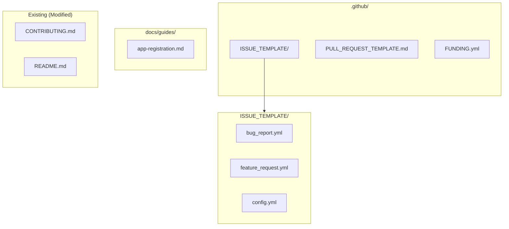
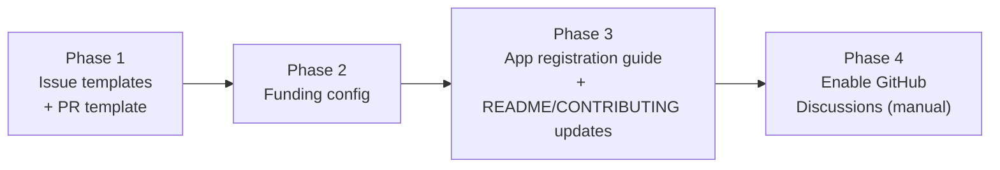

# Open Source Community Enhancements: Templates, Discussions, Sponsorship, and App Registration Guide

## Change Summary

Add GitHub issue templates (bug report, feature request), a pull request template, GitHub Discussions configuration, a `FUNDING.yml` sponsorship file, and a step-by-step Entra ID app registration guide. These items were explicitly deferred from CR-0027 (Open Source Scaffolding) and CR-0029 (MCPB Extension Packaging) as out-of-scope and are now consolidated into this single CR.

**Note:** The extension icon (`icon.png`, `icon.svg`) was deferred from CR-0029 but has already been implemented and committed to `extension/`. No further work is needed for the icon.

## Motivation and Background

CR-0027 established the foundational open source scaffolding (LICENSE, SECURITY.md, CONTRIBUTING.md, CODE_OF_CONDUCT.md, CHANGELOG.md, CODEOWNERS). CR-0029 packaged the project as an MCPB extension for Claude Desktop. Both CRs explicitly deferred several community and documentation items to future work:

**Deferred from CR-0027 (Scope Boundaries, "Out of Scope"):**
- GitHub Issue Templates (`.github/ISSUE_TEMPLATE/`)
- Pull Request Template (`.github/PULL_REQUEST_TEMPLATE.md`)
- GitHub Discussions enablement
- `FUNDING.yml` or sponsorship configuration

**Deferred from CR-0029 (Scope Boundaries, "Out of Scope"):**
- Extension icon (`icon.png`) — **already completed**
- Microsoft Azure app registration guide

The project is now public on GitHub with active users installing the extension via Claude Desktop. The absence of structured issue templates means bug reports arrive with inconsistent information, making triage slower. The lack of a PR template means contributors miss checklist items (quality gate, conventional commits). GitHub Discussions is not enabled, so users default to opening issues for questions and general discussion, cluttering the issue tracker. There is no sponsorship path for users who want to support the project. Finally, users who need browser-based authentication have no guide for creating their own Entra ID app registration — the README tells them they need one but does not explain how.

## Change Drivers

* **Issue triage efficiency:** Structured templates with required fields (reproduction steps, environment info, expected/actual behavior) reduce back-and-forth on bug reports.
* **Contributor experience:** A PR template with a checklist ensures contributors run quality checks and follow conventions before requesting review.
* **Issue tracker hygiene:** GitHub Discussions provides a dedicated space for questions, ideas, and general conversation, keeping Issues focused on actionable bugs and features.
* **Project sustainability:** `FUNDING.yml` enables GitHub Sponsors and other funding platforms, providing a visible path for financial support.
* **User onboarding:** Users who choose browser-based authentication need step-by-step instructions for creating an Entra ID app registration. Without this guide, they either abandon the attempt or open support issues.

## Current State

| Component | Status | Source |
|---|---|---|
| `.github/ISSUE_TEMPLATE/bug_report.yml` | Missing | Deferred from CR-0027 |
| `.github/ISSUE_TEMPLATE/feature_request.yml` | Missing | Deferred from CR-0027 |
| `.github/ISSUE_TEMPLATE/config.yml` | Missing | Deferred from CR-0027 |
| `.github/PULL_REQUEST_TEMPLATE.md` | Missing | Deferred from CR-0027 |
| GitHub Discussions | Not enabled | Deferred from CR-0027 |
| `.github/FUNDING.yml` | Missing | Deferred from CR-0027 |
| `extension/icon.png` | **Exists** | Deferred from CR-0029, already completed |
| `extension/icon.svg` | **Exists** | Completed alongside icon.png |
| App registration guide | Missing | Deferred from CR-0029 |

Existing community files already in place (from CR-0027): `LICENSE`, `SECURITY.md`, `CONTRIBUTING.md`, `CODE_OF_CONDUCT.md`, `CHANGELOG.md`, `.github/CODEOWNERS`.

## Proposed Change

Add six new files, enable GitHub Discussions via repository settings, and update `CONTRIBUTING.md` to reference the new templates and discussion channels. The extension icon requires no action.

### Component Inventory



| # | Component | File(s) | Action | Purpose |
|---|---|---|---|---|
| 1 | Bug report template | `.github/ISSUE_TEMPLATE/bug_report.yml` | **New** | Structured bug report with required fields |
| 2 | Feature request template | `.github/ISSUE_TEMPLATE/feature_request.yml` | **New** | Structured feature/enhancement request |
| 3 | Issue template config | `.github/ISSUE_TEMPLATE/config.yml` | **New** | Adds external links (Discussions, Security) to issue chooser |
| 4 | Pull request template | `.github/PULL_REQUEST_TEMPLATE.md` | **New** | PR checklist and description scaffold |
| 5 | Funding config | `.github/FUNDING.yml` | **New** | GitHub Sponsors and funding links |
| 6 | App registration guide | `docs/guides/app-registration.md` | **New** | Step-by-step Entra ID app registration |
| 7 | Contributing guidelines | `CONTRIBUTING.md` | **Modified** | Add references to Discussions, templates |
| 8 | README | `README.md` | **Modified** | Link to app registration guide |
| 9 | GitHub Discussions | Repository settings | **Manual** | Enable Discussions feature on repository |

## Requirements

### Functional Requirements

#### Issue Templates

1. A `.github/ISSUE_TEMPLATE/bug_report.yml` file **MUST** exist using the GitHub YAML form schema with the following required fields: title, description/reproduction steps, expected behavior, actual behavior, environment (OS, Go version, server version), and log output (optional).
2. A `.github/ISSUE_TEMPLATE/feature_request.yml` file **MUST** exist using the GitHub YAML form schema with the following required fields: title, description of the feature, use case/motivation, and proposed solution (optional).
3. Both issue templates **MUST** use the YAML form schema (`.yml`), not the legacy Markdown template format (`.md`), to enable structured input with validation.
4. A `.github/ISSUE_TEMPLATE/config.yml` file **MUST** exist with `blank_issues_enabled: false` and `contact_links` entries directing users to GitHub Discussions for questions and to SECURITY.md for vulnerability reports.

#### Pull Request Template

5. A `.github/PULL_REQUEST_TEMPLATE.md` file **MUST** exist containing:
   - A description section prompting the contributor to explain what the PR does and why.
   - A "Related issues" section for linking to GitHub Issues.
   - A checklist including: code compiles (`make build`), linter passes (`make lint`), tests pass (`make test`), commit messages follow Conventional Commits, PR title follows Conventional Commits, and documentation updated (if applicable).

#### GitHub Discussions

6. GitHub Discussions **MUST** be enabled on the repository with at least the default category set (General, Ideas, Q&A, Show and tell).
7. The `.github/ISSUE_TEMPLATE/config.yml` **MUST** include a contact link directing users to Discussions for questions and general conversation.

#### Funding Configuration

8. A `.github/FUNDING.yml` file **MUST** exist with a `github` field set to the maintainer's GitHub username (`desek`).

#### App Registration Guide

9. A `docs/guides/app-registration.md` file **MUST** exist providing a step-by-step guide for creating an Entra ID app registration with the following content:
   - Prerequisites (Microsoft account with Entra ID access).
   - Step-by-step instructions to create a new app registration in the Azure portal.
   - Setting the redirect URI to `http://localhost` for browser-based authentication.
   - Configuring the required API permissions: `Calendars.ReadWrite`, `Mail.Read`, `User.Read` (delegated permissions).
   - Copying the Application (Client) ID and (optionally) the Tenant ID.
   - Configuring the MCP server to use the custom app registration (`OUTLOOK_MCP_CLIENT_ID`, `OUTLOOK_MCP_AUTH_METHOD=browser`).
   - A note that device code flow does not require a custom app registration.

#### Updates to Existing Files

10. `CONTRIBUTING.md` **MUST** be updated to reference GitHub Discussions for questions and the issue templates for bugs and feature requests.
11. `README.md` **MUST** be updated to link to the app registration guide (`docs/guides/app-registration.md`) in the authentication/configuration section where browser auth is mentioned.

### Non-Functional Requirements

1. Issue templates **MUST** render correctly in the GitHub issue creation UI (form mode, not raw Markdown).
2. The PR template **MUST** render as a pre-filled description when a contributor opens a new pull request on GitHub.
3. The app registration guide **MUST** use numbered steps with screenshots described in alt text (actual screenshots are optional; the text instructions must be self-sufficient).
4. All new Markdown files **MUST** use consistent formatting with the existing documentation style.
5. The `FUNDING.yml` **MUST** only include funding platforms the maintainer has configured; unused platforms **MUST** be omitted (not commented out).

## Affected Components

| File | Action | Description |
|---|---|---|
| `.github/ISSUE_TEMPLATE/bug_report.yml` | **New** | Bug report issue template (YAML form) |
| `.github/ISSUE_TEMPLATE/feature_request.yml` | **New** | Feature request issue template (YAML form) |
| `.github/ISSUE_TEMPLATE/config.yml` | **New** | Issue template chooser configuration |
| `.github/PULL_REQUEST_TEMPLATE.md` | **New** | Pull request description template |
| `.github/FUNDING.yml` | **New** | GitHub Sponsors funding configuration |
| `docs/guides/app-registration.md` | **New** | Entra ID app registration guide |
| `CONTRIBUTING.md` | **Modified** | Add references to Discussions and templates |
| `README.md` | **Modified** | Link to app registration guide |
| Repository settings | **Manual** | Enable GitHub Discussions |

## Scope Boundaries

### In Scope

* Creating GitHub issue templates (bug report, feature request) using YAML form schema
* Creating issue template configuration with external contact links
* Creating a pull request template with quality checklist
* Creating `FUNDING.yml` with GitHub Sponsors
* Creating a step-by-step Entra ID app registration guide
* Enabling GitHub Discussions on the repository
* Updating `CONTRIBUTING.md` and `README.md` with cross-references

### Out of Scope ("Here, But Not Further")

* Custom GitHub Actions for issue triage or auto-labeling — deferred to a future CR
* GitHub Projects board setup — separate concern
* Discussion category customization beyond GitHub defaults — can be configured manually later
* CLA (Contributor License Agreement) automation — not needed for MIT-licensed projects
* Localization of templates or guide content
* Extension icon — already completed, no further work needed
* Azure CLI or Terraform-based app registration automation — the guide covers portal-based manual registration only

## Impact Assessment

### User Impact

Contributors gain structured templates that guide them through bug reports and feature requests with required fields, reducing incomplete submissions. The PR template ensures contributors complete the quality checklist before requesting review. Users with questions are directed to Discussions instead of opening issues. Users who want browser-based authentication gain a clear, step-by-step guide for creating their own Entra ID app registration.

### Technical Impact

- **Zero code changes.** No Go source files are modified.
- **No build impact.** All new files are documentation/metadata only.
- **No test impact.** No test modifications required.
- **GitHub UI enhancement:** Issue creation page shows structured templates, PR creation pre-fills the template, Discussions tab appears in repository navigation, and Sponsors button becomes visible.

### Business Impact

- Reduces maintainer burden by standardizing issue reports and PR submissions.
- Enables financial sustainability through GitHub Sponsors.
- Improves user onboarding for advanced authentication scenarios, reducing support issues.

## Implementation Approach

Implementation is divided into four phases. Phases 1-3 can be committed independently. Phase 4 (enabling Discussions) is a manual repository settings change.



### Phase 1: Issue Templates and Pull Request Template

#### Step 1.1: Create `.github/ISSUE_TEMPLATE/bug_report.yml`

```yaml
name: Bug Report
description: Report a bug or unexpected behavior
labels: ["bug"]
body:
  - type: markdown
    attributes:
      value: |
        Thank you for reporting a bug. Please fill out the sections below to help us investigate.
  - type: textarea
    id: description
    attributes:
      label: Description
      description: A clear description of the bug.
      placeholder: What happened?
    validations:
      required: true
  - type: textarea
    id: reproduction
    attributes:
      label: Steps to reproduce
      description: Steps to reproduce the behavior.
      placeholder: |
        1. Configure the server with...
        2. Ask Claude to...
        3. The tool returns...
    validations:
      required: true
  - type: textarea
    id: expected
    attributes:
      label: Expected behavior
      description: What you expected to happen.
    validations:
      required: true
  - type: textarea
    id: actual
    attributes:
      label: Actual behavior
      description: What actually happened.
    validations:
      required: true
  - type: input
    id: version
    attributes:
      label: Server version
      description: "Output of `outlook-local-mcp --version` or the version shown by the `status` tool."
      placeholder: "e.g., 0.2.1"
    validations:
      required: true
  - type: dropdown
    id: os
    attributes:
      label: Operating system
      options:
        - macOS (Apple Silicon)
        - macOS (Intel)
        - Windows
        - Linux
    validations:
      required: true
  - type: dropdown
    id: auth_method
    attributes:
      label: Authentication method
      options:
        - device_code (default)
        - browser
        - auth_code
    validations:
      required: true
  - type: dropdown
    id: client
    attributes:
      label: MCP client
      description: Which application are you using this MCP server with?
      options:
        - Claude Desktop
        - Claude Code (CLI)
        - Other (specify in description)
    validations:
      required: true
  - type: textarea
    id: logs
    attributes:
      label: Log output
      description: "Relevant log output (set `OUTLOOK_MCP_LOG_LEVEL=debug` for verbose logs). Redact any personal information."
      render: text
    validations:
      required: false
```

#### Step 1.2: Create `.github/ISSUE_TEMPLATE/feature_request.yml`

```yaml
name: Feature Request
description: Suggest a new feature or enhancement
labels: ["enhancement"]
body:
  - type: markdown
    attributes:
      value: |
        Thank you for suggesting an improvement. Please describe the feature and why it would be useful.
  - type: textarea
    id: description
    attributes:
      label: Feature description
      description: A clear description of the feature you'd like.
      placeholder: What do you want to be able to do?
    validations:
      required: true
  - type: textarea
    id: use_case
    attributes:
      label: Use case
      description: Why do you need this feature? What problem does it solve?
      placeholder: "I'm trying to... but currently..."
    validations:
      required: true
  - type: textarea
    id: proposed_solution
    attributes:
      label: Proposed solution
      description: If you have a specific solution in mind, describe it here.
    validations:
      required: false
  - type: textarea
    id: alternatives
    attributes:
      label: Alternatives considered
      description: Any alternative solutions or workarounds you've considered.
    validations:
      required: false
```

#### Step 1.3: Create `.github/ISSUE_TEMPLATE/config.yml`

```yaml
blank_issues_enabled: false
contact_links:
  - name: Questions & Discussion
    url: https://github.com/desek/outlook-local-mcp/discussions
    about: Ask questions, share ideas, or start a general conversation in GitHub Discussions.
  - name: Security Vulnerability
    url: https://github.com/desek/outlook-local-mcp/security/advisories/new
    about: Report a security vulnerability using GitHub's private vulnerability reporting.
```

#### Step 1.4: Create `.github/PULL_REQUEST_TEMPLATE.md`

```markdown
## Summary

<!-- What does this PR do and why? Link to relevant issues. -->

## Related issues

<!-- e.g., Closes #123, Fixes #456 -->

## Checklist

- [ ] Code compiles: `make build`
- [ ] Linter passes: `make lint`
- [ ] Tests pass: `make test`
- [ ] Commit messages follow [Conventional Commits](https://www.conventionalcommits.org/)
- [ ] PR title follows [Conventional Commits](https://www.conventionalcommits.org/)
- [ ] Documentation updated (if applicable)
```

**Verification:** Push to a branch, open a test issue and a test PR on GitHub to confirm templates render correctly.

### Phase 2: Funding Configuration

#### Step 2.1: Create `.github/FUNDING.yml`

```yaml
github: [desek]
```

**Verification:** After pushing, confirm the "Sponsor" button appears on the repository page.

### Phase 3: App Registration Guide and Cross-References

#### Step 3.1: Create `docs/guides/app-registration.md`

A step-by-step guide covering:

1. **Introduction** — explains when a custom app registration is needed (browser auth) vs. when it is not (device code flow with the default client).
2. **Prerequisites** — a Microsoft account with access to the Entra ID portal (portal.azure.com).
3. **Create the app registration:**
   - Navigate to Entra ID > App registrations > New registration.
   - Set the application name (e.g., `outlook-local-mcp`).
   - Set supported account types based on the user's scenario (personal, work/school, or both).
   - Set the redirect URI to `http://localhost` (Web platform).
   - Click Register.
4. **Copy the Application (Client) ID** from the Overview page.
5. **Configure API permissions:**
   - Navigate to API permissions > Add a permission > Microsoft Graph > Delegated permissions.
   - Add: `Calendars.ReadWrite`, `Mail.Read`, `User.Read`.
   - Note: admin consent is not required for these delegated permissions in most tenants.
6. **Enable public client flows** (required for device code fallback):
   - Navigate to Authentication > Advanced settings.
   - Set "Allow public client flows" to Yes.
7. **Configure the MCP server:**
   - Set `OUTLOOK_MCP_CLIENT_ID` to the Application (Client) ID.
   - Set `OUTLOOK_MCP_AUTH_METHOD=browser` to use browser-based authentication.
   - Optionally set `OUTLOOK_MCP_TENANT_ID` to restrict to a specific tenant.
8. **Verify** — start the MCP server and trigger a tool call; the browser should open for authentication.

#### Step 3.2: Update `README.md`

Add a link to the app registration guide in the authentication section where browser auth is mentioned. For example, after the existing mention of browser auth requiring an app registration, add:

```markdown
See [App Registration Guide](docs/guides/app-registration.md) for step-by-step instructions.
```

#### Step 3.3: Update `CONTRIBUTING.md`

Add a section or update the existing "Reporting Bugs" and "Suggesting Features" sections to reference:
- GitHub Issue templates for bugs and feature requests.
- GitHub Discussions for questions and general conversation.

**Verification:** Inspect the guide for completeness. Verify links in README.md and CONTRIBUTING.md are correct.

### Phase 4: Enable GitHub Discussions (Manual)

This step requires repository admin access and cannot be automated via a file commit.

1. Navigate to the repository Settings > General > Features.
2. Check "Discussions".
3. Confirm the default categories are created (General, Ideas, Q&A, Show and tell).

**Verification:** The "Discussions" tab appears in the repository navigation bar.

## Test Strategy

### Tests to Add

This CR introduces no code changes. Validation is performed through manual inspection:

| Verification | Method | Expected Result |
|---|---|---|
| Bug report template renders | Open new issue on GitHub | YAML form displays with all required fields |
| Feature request template renders | Open new issue on GitHub | YAML form displays with required fields |
| Blank issues blocked | Open new issue on GitHub | No "Open a blank issue" option; contact links shown |
| Contact links work | Click links in issue chooser | Discussions and security advisory pages load |
| PR template renders | Open new pull request on GitHub | Template pre-fills the PR description |
| Sponsor button visible | Visit repository page | "Sponsor" button appears with GitHub Sponsors link |
| Discussions tab visible | Visit repository page | "Discussions" tab appears in navigation |
| App registration guide complete | Read `docs/guides/app-registration.md` | All 8 steps are present and self-sufficient |
| README links to guide | Read `README.md` auth section | Link to app registration guide is present and correct |
| CONTRIBUTING references templates | Read `CONTRIBUTING.md` | References to Discussions, issue templates present |

### Tests to Modify

Not applicable. No existing tests require modification.

### Tests to Remove

Not applicable. No existing tests become redundant.

## Acceptance Criteria

### AC-1: Bug report template renders as a structured form

```gherkin
Given the file .github/ISSUE_TEMPLATE/bug_report.yml exists
When a user clicks "New Issue" on the GitHub repository
Then a "Bug Report" option appears in the issue template chooser
  And selecting it displays a structured form with required fields for description, reproduction steps, expected behavior, actual behavior, server version, OS, auth method, and MCP client
  And the form cannot be submitted without completing required fields
```

### AC-2: Feature request template renders as a structured form

```gherkin
Given the file .github/ISSUE_TEMPLATE/feature_request.yml exists
When a user clicks "New Issue" on the GitHub repository
Then a "Feature Request" option appears in the issue template chooser
  And selecting it displays a structured form with required fields for feature description and use case
```

### AC-3: Blank issues are disabled with contact links

```gherkin
Given the file .github/ISSUE_TEMPLATE/config.yml exists with blank_issues_enabled: false
When a user clicks "New Issue" on the GitHub repository
Then no "Open a blank issue" option is shown
  And contact links for "Questions & Discussion" and "Security Vulnerability" are displayed
  And the Discussions link points to the repository's Discussions page
  And the Security link points to GitHub's private vulnerability reporting
```

### AC-4: Pull request template pre-fills PR descriptions

```gherkin
Given the file .github/PULL_REQUEST_TEMPLATE.md exists
When a contributor opens a new pull request on the GitHub repository
Then the PR description is pre-filled with the template content
  And the template includes a Summary section, Related issues section, and a quality checklist
  And the checklist includes items for build, lint, test, Conventional Commits, and documentation
```

### AC-5: Funding configuration enables GitHub Sponsors

```gherkin
Given the file .github/FUNDING.yml exists with github: [desek]
When a user visits the repository page
Then a "Sponsor" button is visible
  And clicking it shows the GitHub Sponsors profile for desek
```

### AC-6: App registration guide is complete and self-sufficient

```gherkin
Given the file docs/guides/app-registration.md exists
When a user follows the guide from start to finish
Then they can create an Entra ID app registration with the correct redirect URI (http://localhost)
  And they can configure the required API permissions (Calendars.ReadWrite, Mail.Read, User.Read)
  And they can copy the Application (Client) ID
  And they can configure the MCP server with the custom client ID and browser auth method
  And the guide explains when a custom registration is NOT needed (device code flow)
```

### AC-7: README links to app registration guide

```gherkin
Given the README.md mentions browser authentication
When a user reads the authentication section
Then a link to docs/guides/app-registration.md is present
  And the link is valid and resolves to the guide
```

### AC-8: CONTRIBUTING.md references templates and Discussions

```gherkin
Given the CONTRIBUTING.md exists
When a user reads the bug reporting and feature request sections
Then it references the GitHub Issue templates
  And it mentions GitHub Discussions for questions and general conversation
```

### AC-9: GitHub Discussions is enabled

```gherkin
Given the repository settings have Discussions enabled
When a user visits the repository page
Then a "Discussions" tab is visible in the navigation
  And the default categories (General, Ideas, Q&A, Show and tell) are available
```

## Quality Standards Compliance

### Build & Compilation

- [x] Code compiles/builds without errors (no code changes — verify with `make build`)
- [x] No new compiler warnings introduced

### Linting & Code Style

- [x] All linter checks pass with zero warnings/errors (no code changes — verify with `make lint`)
- [x] YAML files are valid and well-formatted
- [x] Markdown files use consistent formatting

### Test Execution

- [x] All existing tests pass after implementation (`make test`)
- [x] No test modifications required

### Documentation

- [x] App registration guide is complete and follows the project's documentation style
- [x] README.md and CONTRIBUTING.md cross-references are correct

### Code Review

- [ ] Changes submitted via pull request
- [ ] PR title follows Conventional Commits format (e.g., `docs: add issue templates, PR template, funding config, and app registration guide`)
- [ ] Code review completed and approved
- [ ] Changes squash-merged to maintain linear history

### Verification Commands

```bash
# Build verification (confirm no regressions)
make build

# Lint verification (confirm no regressions)
make lint

# Test execution (confirm no regressions)
make test

# Verify all new files exist
test -f .github/ISSUE_TEMPLATE/bug_report.yml \
  && test -f .github/ISSUE_TEMPLATE/feature_request.yml \
  && test -f .github/ISSUE_TEMPLATE/config.yml \
  && test -f .github/PULL_REQUEST_TEMPLATE.md \
  && test -f .github/FUNDING.yml \
  && test -f docs/guides/app-registration.md \
  && echo "All files present"

# Verify YAML validity
python3 -c "import yaml; yaml.safe_load(open('.github/ISSUE_TEMPLATE/bug_report.yml'))" && echo "bug_report.yml valid"
python3 -c "import yaml; yaml.safe_load(open('.github/ISSUE_TEMPLATE/feature_request.yml'))" && echo "feature_request.yml valid"
python3 -c "import yaml; yaml.safe_load(open('.github/ISSUE_TEMPLATE/config.yml'))" && echo "config.yml valid"
python3 -c "import yaml; yaml.safe_load(open('.github/FUNDING.yml'))" && echo "FUNDING.yml valid"

# Verify FUNDING.yml references correct user
grep -q "desek" .github/FUNDING.yml && echo "Funding configured"

# Verify blank issues are disabled
python3 -c "import yaml; d=yaml.safe_load(open('.github/ISSUE_TEMPLATE/config.yml')); assert d['blank_issues_enabled'] == False" && echo "Blank issues disabled"

# Verify README links to app registration guide
grep -q "app-registration" README.md && echo "README links to guide"

# Verify CONTRIBUTING references Discussions
grep -qi "discussion" CONTRIBUTING.md && echo "CONTRIBUTING references Discussions"
```

## Risks and Mitigation

### Risk 1: YAML form schema not supported by GitHub

**Likelihood:** Very Low
**Impact:** Medium
**Mitigation:** GitHub has supported YAML-based issue forms since 2021. The templates use the stable `body` schema documented in GitHub's official documentation. Validate YAML syntax before committing.

### Risk 2: Blank issues disabled causes frustration for edge cases

**Likelihood:** Low
**Impact:** Low
**Mitigation:** The `config.yml` includes contact links to Discussions and Security reporting, providing alternative paths for issues that do not fit the templates. If users report frustration, `blank_issues_enabled` can be set to `true` in a follow-up commit.

### Risk 3: App registration guide becomes outdated as Azure portal UI changes

**Likelihood:** Medium
**Impact:** Medium
**Mitigation:** The guide focuses on concepts and field names rather than pixel-precise UI navigation. Azure portal changes are typically cosmetic; the underlying Entra ID concepts (app registrations, redirect URIs, API permissions) are stable. Include a "last verified" date at the top of the guide.

### Risk 4: GitHub Sponsors not configured for the maintainer account

**Likelihood:** Low
**Impact:** Low
**Mitigation:** The `FUNDING.yml` file only enables the "Sponsor" button on the repository; it does not create a GitHub Sponsors profile. The maintainer must separately enroll in GitHub Sponsors for the button to lead to a functional profile. If not yet enrolled, the button links to the GitHub Sponsors onboarding page.

### Risk 5: Discussions create moderation overhead

**Likelihood:** Medium
**Impact:** Low
**Mitigation:** At the project's current scale, discussion volume is expected to be low. The default categories (General, Ideas, Q&A, Show and tell) provide sufficient organization. Moderation tooling (locking, converting to issues) is built into GitHub Discussions.

## Dependencies

* **CR-0027 (Open Source Scaffolding):** Completed. The existing `CONTRIBUTING.md`, `SECURITY.md`, and `CODE_OF_CONDUCT.md` are prerequisites for the cross-references and contact links in this CR.
* **GitHub Sponsors enrollment:** The `FUNDING.yml` enables the UI button, but the maintainer must separately enroll in GitHub Sponsors for the funding link to be functional. This is a manual step outside the scope of this CR.
* **No blocking technical dependencies.** All files are new documentation/metadata. GitHub Discussions enablement requires repository admin access.

## Estimated Effort

2-4 hours. All files are documentation and YAML metadata. The app registration guide requires the most effort due to step-by-step verification against the Azure portal.

## Decision Outcome

Chosen approach: "Consolidate all deferred community items from CR-0027 and CR-0029 into a single CR", because these items are thematically related (community experience and contributor onboarding), have no code changes, and benefit from being reviewed and shipped together. The extension icon is excluded since it was already completed independently.

## Related Items

* Parent change request: CR-0027 (Open Source Scaffolding — items deferred from scope)
* Parent change request: CR-0029 (MCPB Extension Packaging — items deferred from scope)
* External reference: [GitHub Issue Forms syntax](https://docs.github.com/en/communities/using-templates-to-encourage-useful-issues-and-pull-requests/syntax-for-issue-forms)
* External reference: [GitHub FUNDING.yml](https://docs.github.com/en/repositories/managing-your-repositorys-settings-and-features/customizing-your-repository/displaying-a-sponsor-button-in-your-repository)
* External reference: [GitHub Discussions](https://docs.github.com/en/discussions)
* External reference: [Entra ID App Registrations](https://learn.microsoft.com/en-us/entra/identity-platform/quickstart-register-app)
