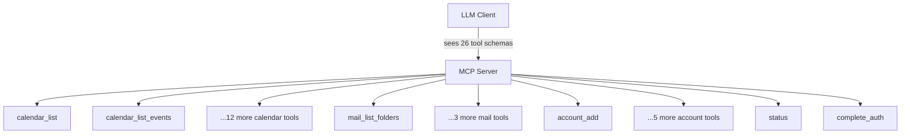
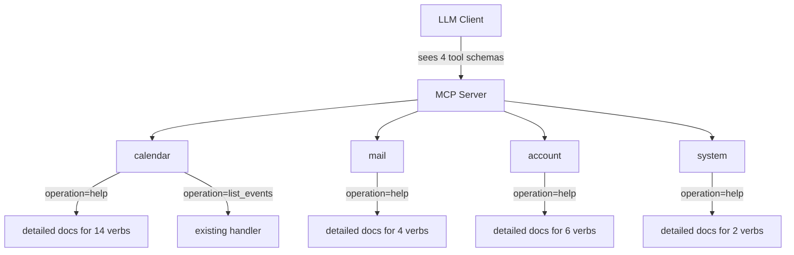
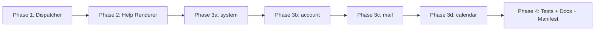

# Domain-Aggregated MCP Tools with Verb-Based Operations

## Change Summary

The server currently exposes 26 individually registered MCP tools. This CR consolidates them into four domain tools — `calendar`, `mail`, `account`, and `system` — each dispatched by a required `operation` (verb) parameter. Every domain tool **MUST** also support an `operation="help"` verb that returns detailed documentation for every operation it supports, while its top-level description lists all operations in minimal form.

## Motivation and Background

The MCP tool catalogue has grown from 14 calendar tools, 4 mail tools, 6 account tools, and 2 system tools to a 26-tool surface that pressures LLM context windows, inflates tool-picker UI lists, and fragments related operations (e.g. `calendar_create_event` vs. `calendar_create_meeting`). Each tool's full schema is loaded into the LLM's context even when unused; across 26 tools this consumes thousands of tokens before the user has asked anything. Aggregating to four domain tools with an intentionally terse top-level description and an on-demand `help` verb lets the LLM discover operations lazily, keeping cold-start tool descriptions compact while still allowing any operation to be invoked.

## Change Drivers

* Token efficiency — complements CR-0051 by reducing idle tool-schema overhead before any call is made.
* Discoverability — a single `help` verb per domain yields a self-documenting surface rather than 26 opaque names.
* Grouping — related verbs (`create`, `update`, `delete`, `list`, `search`) live together, matching how users reason about calendars/mail/accounts.
* Extensibility — adding a new operation is a new verb, not a new registered tool, manifest entry, and server wiring block.
* Directory/UI ergonomics — tool pickers in Claude Desktop and third-party clients become browsable at a glance.

## Current State

The server registers 26 distinct MCP tools in `internal/server/server.go`, each with its own file in `internal/tools/`, its own `mcp.NewTool(...)` definition, its own entry in `extension/manifest.json`, its own annotation test, and its own middleware wiring (`wrap`/`wrapWrite`, `WithObservability`, `AuditWrap`). The current tool inventory is:

* **calendar (14):** `calendar_list`, `calendar_list_events`, `calendar_get_event`, `calendar_search_events`, `calendar_create_event`, `calendar_update_event`, `calendar_delete_event`, `calendar_respond_event`, `calendar_reschedule_event`, `calendar_create_meeting`, `calendar_update_meeting`, `calendar_cancel_meeting`, `calendar_reschedule_meeting`, `calendar_get_free_busy`.
* **mail (4):** `mail_list_folders`, `mail_list_messages`, `mail_get_message`, `mail_search_messages`.
* **account (6):** `account_add`, `account_remove`, `account_list`, `account_login`, `account_logout`, `account_refresh`.
* **system (2):** `status`, `complete_auth`.

Tool naming follows CR-0050's `{domain}_{operation}[_{resource}]` convention. Annotations follow CR-0052. Response tiering follows CR-0051's `output=text|summary|raw` contract on read tools.

### Current State Diagram



## Proposed Change

Replace the 26-tool surface with four aggregate domain tools. Each domain tool **MUST** accept a required `operation` string parameter selecting a verb; all other parameters are operation-specific and validated per verb. The top-level tool description **MUST** enumerate every supported operation with a one-line (≤80 char) summary. A `help` operation **MUST** return rich, per-operation documentation (purpose, parameters, return shape, examples, output tiering notes).

### Tool Inventory (After)

| Domain Tool | Operations |
|-------------|-----------|
| `calendar` | `help`, `list_calendars`, `list_events`, `get_event`, `search_events`, `create_event`, `update_event`, `delete_event`, `respond_event`, `reschedule_event`, `create_meeting`, `update_meeting`, `cancel_meeting`, `reschedule_meeting`, `get_free_busy` |
| `mail` | `help`, `list_folders`, `list_messages`, `get_message`, `search_messages` |
| `account` | `help`, `add`, `remove`, `list`, `login`, `logout`, `refresh` |
| `system` | `help`, `status`, `complete_auth` |

Verb names **MUST** be self-explanatory English verbs (or verb phrases) that require no prefix — `create_event`, not `calendar_create_event`, because the domain is implicit in the tool name.

### Proposed State Diagram



### Tool Description Shape (Minimal, Top-Level)

Example for `calendar`:

> Calendar operations for Microsoft Graph. Required `operation`: `help` (detailed docs) · `list_calendars` (list user calendars) · `list_events` (list events in a window) · `get_event` (fetch one event) · `search_events` (query events) · `create_event` (personal event) · `update_event` (edit personal event) · `delete_event` (remove personal event) · `respond_event` (accept/decline) · `reschedule_event` (move personal event) · `create_meeting` (event with attendees) · `update_meeting` (edit meeting) · `cancel_meeting` (cancel + notify) · `reschedule_meeting` (move + notify) · `get_free_busy` (availability).

### `help` Verb Contract

`operation="help"` **MUST**:

* accept an optional `verb` parameter — when omitted, return docs for every operation; when set, return docs only for the named verb.
* return a `text` response by default (CR-0051 tier 1) and a structured JSON response when `output="raw"` or `output="summary"`.
* document for every verb: purpose, required parameters, optional parameters, return shape per `output` tier, side effects, error conditions, and at least one example invocation.
* **MUST NOT** call Microsoft Graph (open-world hint: `false` for the `help` verb dispatch path).

## Requirements

### Functional Requirements

1. The server **MUST** register exactly four MCP tools: `calendar`, `mail`, `account`, `system`.
2. Each aggregate tool **MUST** declare a required string parameter `operation` with a JSON Schema `enum` listing every supported verb, including `help`.
3. Each aggregate tool's top-level description **MUST** list every supported operation with a ≤80-character summary per verb.
4. Each aggregate tool **MUST** support `operation="help"` returning per-operation documentation as specified in the `help` Verb Contract above.
5. The `help` operation **MUST** accept an optional `verb` parameter to scope documentation to a single verb.
6. Each aggregate tool **MUST** dispatch non-`help` operations to the existing handler implementations without changing their business logic, Graph API calls, validation rules, or error semantics.
7. Every existing operation **MUST** remain reachable via its verb under the corresponding domain tool. No functionality from the 26-tool surface may be dropped.
8. Aggregate tools **MUST** preserve CR-0051 response tiering: every read verb **MUST** continue to honour `output=text|summary|raw` with `text` as default; every write verb **MUST** continue to return unconditional text confirmations.
9. Aggregate tools **MUST** preserve CR-0052 annotations at the tool level using the **most conservative** annotation across the verbs they host: `readOnlyHint=false` if any verb writes, `destructiveHint=true` if any verb is destructive, `idempotentHint=false` if any verb is non-idempotent, `openWorldHint=true` if any verb calls Graph. Per-verb semantics **MUST** be documented in the `help` output.
10. `extension/manifest.json` **MUST** be updated so that its `tools` array contains exactly the four aggregate tool entries.
11. Invalid `operation` values **MUST** return a structured error listing valid verbs and pointing the caller to `operation="help"`.
12. Unknown parameters for a given verb **MUST** be rejected with a clear error naming the offending parameter and the verb that rejected it.
13. Audit logging (CR-0052 related middleware `AuditWrap`) **MUST** record the fully qualified identity `{domain}.{operation}` (e.g., `calendar.delete_event`) rather than a generic tool name.
14. OpenTelemetry spans and metrics (`WithObservability`) **MUST** tag each invocation with both `mcp.tool=calendar` and `mcp.operation=delete_event` attributes.
15. The `docs/prompts/mcp-tool-crud-test.md` integration test script **MUST** be updated to invoke operations via the new aggregate tool + verb shape.

### Non-Functional Requirements

1. The server **MUST** start with cold-start tool-description payload at least 60 % smaller (by byte count of the registered tool schemas) than the current 26-tool surface. The reduction **MUST** be measured and recorded in the validation report.
2. Dispatch from aggregate tool to concrete handler **MUST** add no more than 1 ms of overhead at p99 under the existing benchmark harness.
3. All existing `golangci-lint`, `go vet`, `go test -race`, and vulnerability-scan checks **MUST** pass.
4. No new external dependencies **MUST** be introduced.

## Affected Components

* `internal/server/server.go` — tool registration is rewritten; 26 `RegisterTool` blocks collapse to 4 domain registrations plus a dispatch layer.
* `internal/tools/` — each existing handler is kept but exposed through a new domain dispatcher (e.g. `internal/tools/calendar/dispatch.go`). Handlers themselves **MUST** remain pure and reusable.
* `internal/tools/help/` (new) — centralised help-rendering helper: takes a verb registry and emits text / JSON docs.
* `extension/manifest.json` — shrinks from 26 entries to 4.
* `internal/tools/tool_annotations_test.go` — rewritten to cover four aggregate tools and per-verb documented semantics.
* `internal/tools/tool_description_test.go` — updated to assert that every verb appears in the top-level description.
* `docs/prompts/mcp-tool-crud-test.md` — updated per CLAUDE.md tool-testing instructions.
* `README.md` / user-facing docs — updated examples.

## Scope Boundaries

### In Scope

* Aggregating all 26 MCP tools into four domain tools with a verb-dispatched `operation` parameter.
* Implementing the `help` verb for every domain tool.
* Preserving every existing operation's business logic, parameters, validation, error handling, response tiering, audit behaviour, and observability attributes.
* Updating the manifest, annotation tests, description tests, integration test prompt, and user-facing docs.

### Out of Scope ("Here, But Not Further")

* Changing Microsoft Graph API usage, retry policy, or auth flow.
* Changing the response-tiering contract defined in CR-0051.
* Changing the annotation semantics defined in CR-0052 (only their grouping changes).
* Introducing new business operations that do not exist today.
* Introducing cross-domain verbs (e.g., a `search` verb that straddles mail + calendar).
* Backwards-compatible aliases for the old 26-tool names — this CR performs a clean cutover at `v0.6.0`. Deprecation shims are explicitly deferred.
* Localisation of the `help` output — English only for this CR.

## Alternative Approaches Considered

* **Keep 26 tools unchanged.** Rejected: token overhead is high and the tool list continues to grow.
* **Add a meta-tool `help` alongside 26 tools.** Rejected: doesn't solve cold-start schema bloat and adds a 27th tool.
* **Merge everything into a single `outlook` tool with nested `domain` + `operation`.** Rejected: one giant tool loses the natural domain grouping and complicates annotation semantics (a single tool would have to declare the union of all hints).
* **Auto-generate domain tools from handler registrations via reflection.** Rejected for this CR: desirable long-term, but adds complexity beyond the task. Deferred.

## Impact Assessment

### User Impact

LLM clients **MUST** update their invocation shape from `{tool: "calendar_delete_event", args: {...}}` to `{tool: "calendar", args: {operation: "delete_event", ...}}`. Claude Desktop users see a cleaner picker. The `help` verb gives users a discovery path that the 26-tool surface lacks.

### Technical Impact

Breaking change for any script, test, or external integration that hard-codes current tool names. Internal handlers remain call-compatible. Manifest consumers **MUST** refresh their cached tool list. Audit-log queries that filter on tool name **MUST** switch to `{domain}.{operation}`.

### Business Impact

Improves directory listing quality (aligns with CR-0052's Anthropic Software Directory goals). Lowers per-session token cost for consumers, improving perceived responsiveness and reducing model cost.

## Implementation Approach

### Phase 1 — Dispatcher scaffolding

Introduce `internal/tools/dispatch.go` with a `Verb` registry type: `{Name, Description, Handler, Annotations, Schema}`. Add `RegisterDomainTool(s *mcp.Server, domain string, verbs []Verb)` which registers one MCP tool, builds the `operation` enum, composes the top-level description, and routes calls.

### Phase 2 — Help rendering

Implement `internal/tools/help/render.go` producing (a) tier-1 text and (b) tier-3 raw JSON for a verb registry, scoped optionally to a single verb.

### Phase 3 — Domain migrations

Migrate each domain in sequence: `system` (smallest, 2 verbs) → `account` (6) → `mail` (4) → `calendar` (14). Each phase lands behind a checkpoint commit and updates the manifest incrementally.

### Phase 4 — Tests, docs, manifest finalisation

Rewrite annotation + description tests. Update `docs/prompts/mcp-tool-crud-test.md`. Update `README.md` and `extension/manifest.json`. Measure and record cold-start schema size.

### Implementation Flow



## Test Strategy

### Tests to Add

| Test File | Test Name | Description | Inputs | Expected Output |
|-----------|-----------|-------------|--------|-----------------|
| `internal/tools/dispatch_test.go` | `TestDispatch_UnknownOperation` | Unknown verb returns error listing valid verbs | `operation="bogus"` | Structured error naming `help` |
| `internal/tools/dispatch_test.go` | `TestDispatch_MissingOperation` | Missing `operation` parameter is rejected | `{}` | Validation error |
| `internal/tools/dispatch_test.go` | `TestDispatch_RoutesToHandler` | Known verb reaches the underlying handler once | stub handler + verb | Handler called exactly once |
| `internal/tools/help/render_test.go` | `TestRenderHelp_AllVerbs` | No `verb` arg renders docs for every registered verb | full registry | Text includes every verb name |
| `internal/tools/help/render_test.go` | `TestRenderHelp_SingleVerb` | `verb` arg scopes docs to one verb | registry + `verb="delete_event"` | Text only mentions `delete_event` |
| `internal/tools/help/render_test.go` | `TestRenderHelp_RawTier` | `output="raw"` returns structured JSON | full registry | JSON with `operations` array |
| `internal/tools/tool_description_test.go` | `TestTopLevelDescription_ListsAllVerbs` | Each domain tool description names every verb | registered tools | Assertion passes for 4 domains |
| `internal/tools/tool_annotations_test.go` | `TestAggregateAnnotations_Conservative` | Aggregate annotations use most conservative verb | calendar registry | `readOnlyHint=false`, `destructiveHint=true` |
| `internal/server/server_integration_test.go` | `TestServer_RegistersFourTools` | Server exposes exactly 4 tools | boot sequence | Tool count == 4 |

### Tests to Modify

| Test File | Test Name | Current Behavior | New Behavior | Reason for Change |
|-----------|-----------|------------------|--------------|-------------------|
| `internal/tools/tool_annotations_test.go` | per-tool annotation cases | Asserts annotations on 26 tools | Asserts annotations on 4 aggregate tools plus per-verb docs | Tool surface changed |
| `internal/tools/tool_description_test.go` | per-tool description cases | Asserts on 26 descriptions | Asserts on 4 aggregate descriptions | Tool surface changed |
| `internal/tools/*_test.go` (all handler tests) | Handler invocation | Called via old tool name | Called via dispatcher with `operation` | Dispatch layer introduced |
| `docs/prompts/mcp-tool-crud-test.md` | CRUD walkthrough | Invokes 26 tool names | Invokes 4 tools with `operation` verbs | Integration script must reflect new shape |

### Tests to Remove

| Test File | Test Name | Reason for Removal |
|-----------|-----------|-------------------|
| `internal/tools/tool_annotations_test.go` | Assertions tied to individual tool names like `calendar_delete_event` | Replaced by aggregate + per-verb assertions |
| `extension/manifest_test.*` (if present) per-tool entries | Individual tool manifest entries | Manifest now lists 4 tools |

## Acceptance Criteria

### AC-1: Four tools registered

```gherkin
Given the server starts with the new implementation
When an MCP client lists tools
Then exactly the tools ["calendar", "mail", "account", "system"] are returned
  And no tool named with the old "{domain}_{operation}" pattern is present
```

### AC-2: Help verb returns docs for all operations

```gherkin
Given the server is running
When the client calls tool "calendar" with {"operation": "help"}
Then the response text contains every calendar verb name
  And each verb entry includes a purpose line and a parameters list
```

### AC-3: Help verb scoped by verb argument

```gherkin
Given the server is running
When the client calls tool "mail" with {"operation": "help", "verb": "search_messages"}
Then the response documents only "search_messages"
  And it lists the required and optional parameters for that verb
```

### AC-4: Top-level description lists every operation

```gherkin
Given the server is running
When the client fetches the description of tool "account"
Then the description enumerates every account verb including "help"
  And each verb appears with a summary no longer than 80 characters
```

### AC-5: Unknown operation rejected

```gherkin
Given the server is running
When the client calls tool "system" with {"operation": "launch_missile"}
Then the response is a structured error
  And the error lists the valid operations
  And the error suggests calling operation="help"
```

### AC-6: Existing operation semantics preserved

```gherkin
Given an event exists with id "abc"
When the client calls tool "calendar" with {"operation": "delete_event", "event_id": "abc"}
Then the event is deleted via Microsoft Graph
  And the response is a text confirmation matching the CR-0051 write-tool contract
  And the audit log records {mcp.tool: "calendar", mcp.operation: "delete_event"}
```

### AC-7: Read verbs honour output tiering

```gherkin
Given the server is running
When the client calls tool "calendar" with {"operation": "list_events", "output": "summary"}
Then the response is compact JSON matching the existing summary field set
  And calling with {"operation": "list_events"} returns text (tier 1)
  And calling with {"operation": "list_events", "output": "raw"} returns full Graph JSON
```

### AC-8: Cold-start schema reduction

```gherkin
Given the server has been compiled
When the registered tool schemas are serialised to JSON
Then the total byte count is at least 60% smaller than the pre-CR baseline
  And the baseline and new size are recorded in CR-0060-validation-report.md
```

### AC-9: Manifest and tests updated

```gherkin
Given implementation is complete
When extension/manifest.json is inspected
Then its tools array has exactly 4 entries
  And docs/prompts/mcp-tool-crud-test.md uses the new invocation shape
```

## Quality Standards Compliance

### Build & Compilation

- [ ] `make build` succeeds
- [ ] No new compiler warnings

### Linting & Code Style

- [ ] `make lint` passes with zero warnings
- [ ] `make vet` passes
- [ ] `make fmt-check` passes

### Test Execution

- [ ] `make test` passes (includes `-race` and coverage)
- [ ] New dispatch + help tests pass
- [ ] Integration script in `docs/prompts/mcp-tool-crud-test.md` executes end-to-end

### Documentation

- [ ] Package-level doc comments added for new `internal/tools/help` package and dispatcher
- [ ] README updated with new invocation shape
- [ ] Every verb has a help-payload docstring
- [ ] `extension/manifest.json` synchronised

### Code Review

- [ ] Changes submitted via pull request
- [ ] PR title follows Conventional Commits (`feat(server)!: aggregate MCP tools per domain with verb dispatch`)
- [ ] Review approved
- [ ] Squash-merged

### Verification Commands

```bash
make build
make vet
make fmt-check
make lint
make test
make ci
```

## Risks and Mitigation

### Risk 1: Breaking change for external MCP clients

**Likelihood:** high
**Impact:** high
**Mitigation:** Ship as a clearly marked breaking change in `v0.6.0` with a migration note in the release notes mapping every old tool name to `{domain}.{operation}`. Communicate via README and CHANGELOG before release.

### Risk 2: Aggregate annotation semantics lose fidelity

**Likelihood:** medium
**Impact:** medium
**Mitigation:** Document per-verb annotations in the `help` output so clients that care about `destructiveHint`/`readOnlyHint` at the verb level can still introspect them. Add a test asserting aggregate annotations are computed conservatively.

### Risk 3: Dispatcher introduces latency or obscures errors

**Likelihood:** low
**Impact:** medium
**Mitigation:** Keep the dispatcher as a thin map lookup. Preserve the original handler error types; wrap only to add `{domain}.{operation}` context. Benchmark p99 dispatch overhead against the 1 ms NFR.

### Risk 4: Help payload drifts out of sync with real verb schemas

**Likelihood:** medium
**Impact:** medium
**Mitigation:** Derive help content from the same `Verb` registry used for dispatch and description composition — a single source of truth. Add a test asserting every registered verb has a non-empty help entry.

## Dependencies

* Builds on CR-0050 (tool naming), CR-0051 (response tiering), CR-0052 (annotations). Those contracts are preserved, not replaced.
* No external library upgrades required.
* Requires coordination with any downstream Claude Desktop / extension user who has cached the old manifest.

## Estimated Effort

| Phase | Effort |
|-------|--------|
| Phase 1 — Dispatcher scaffolding | 6 h |
| Phase 2 — Help renderer | 4 h |
| Phase 3 — Domain migrations (system, account, mail, calendar) | 14 h |
| Phase 4 — Tests, docs, manifest, validation report | 6 h |
| **Total** | **~30 h (≈ 4 working days)** |

## Decision Outcome

Chosen approach: "four domain tools with a required `operation` verb and a self-documenting `help` verb", because it maximises token efficiency, preserves all existing semantics, keeps annotation grouping coherent, and introduces a single dispatch point that future operations can slot into without new server wiring.

## Related Items

* CR-0050 — MCP tool naming and manifest sync
* CR-0051 — Token-efficient response defaults
* CR-0052 — MCP tool annotations
* CR-0054 — Split event/meeting tools
* CR-0058 — Complete mail management
