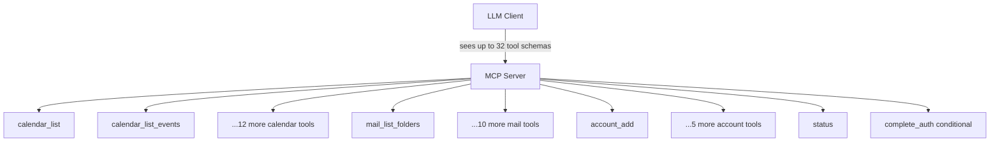
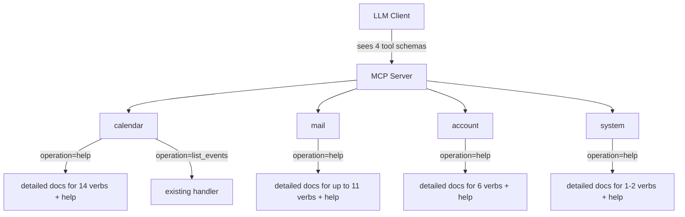
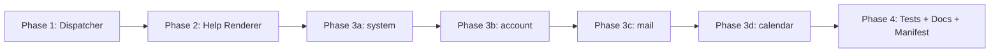

# Domain-Aggregated MCP Tools with Verb-Based Operations

## Change Summary

The server currently exposes up to 32 individually registered MCP tools (14 calendar + 11 mail + 6 account + 1 system, plus the conditional `complete_auth` system tool when `auth=auth_code`). This CR consolidates them into four domain tools (`calendar`, `mail`, `account`, and `system`), each dispatched by a required `operation` (verb) parameter. Every domain tool **MUST** also support an `operation="help"` verb that returns detailed documentation for every operation it supports, while its top-level description lists all operations in minimal form.

## Motivation and Background

The MCP tool catalogue has grown from 14 calendar tools, 11 mail tools, 6 account tools, and 1 to 2 system tools to a 32-tool surface that pressures LLM context windows, inflates tool-picker UI lists, and fragments related operations (e.g. `calendar_create_event` vs. `calendar_create_meeting`). Each tool's full schema is loaded into the LLM's context even when unused; across 32 tools this consumes thousands of tokens before the user has asked anything. Aggregating to four domain tools with an intentionally terse top-level description and an on-demand `help` verb lets the LLM discover operations lazily, keeping cold-start tool descriptions compact while still allowing any operation to be invoked.

## Change Drivers

* Token efficiency, complementing CR-0051 by reducing idle tool-schema overhead before any call is made.
* Discoverability: a single `help` verb per domain yields a self-documenting surface rather than dozens of opaque names.
* Grouping: related verbs (`create`, `update`, `delete`, `list`, `search`) live together, matching how users reason about calendars, mail, and accounts.
* Extensibility: adding a new operation is a new verb, not a new registered tool, manifest entry, and server wiring block.
* Directory and UI ergonomics: tool pickers in Claude Desktop and third-party clients become browsable at a glance.

## Current State

The server registers up to 32 distinct MCP tools in `internal/server/server.go`, each with its own file in `internal/tools/`, its own `mcp.NewTool(...)` definition, its own entry in `extension/manifest.json`, its own annotation test, and its own middleware wiring (`wrap`/`wrapWrite`, `WithObservability`, `AuditWrap`). The current tool inventory (per CR-0056 and CR-0058) is:

* **calendar (14):** `calendar_list`, `calendar_list_events`, `calendar_get_event`, `calendar_search_events`, `calendar_create_event`, `calendar_update_event`, `calendar_delete_event`, `calendar_respond_event`, `calendar_reschedule_event`, `calendar_create_meeting`, `calendar_update_meeting`, `calendar_cancel_meeting`, `calendar_reschedule_meeting`, `calendar_get_free_busy`.
* **mail (11):** read verbs `mail_list_folders`, `mail_list_messages`, `mail_get_message`, `mail_search_messages` (always registered when mail is enabled), plus `mail_get_conversation`, `mail_list_attachments`, `mail_get_attachment` (when `MailEnabled`); draft management verbs `mail_create_draft`, `mail_create_reply_draft`, `mail_create_forward_draft`, `mail_update_draft`, `mail_delete_draft` (when `MailManageEnabled`).
* **account (6):** `account_add`, `account_remove`, `account_list`, `account_login`, `account_logout`, `account_refresh`.
* **system (1, plus 1 conditional):** `status` (always); `complete_auth` (only when `auth=auth_code`).

Tool naming follows CR-0050's `{domain}_{operation}[_{resource}]` convention. Annotations follow CR-0052. Response tiering follows CR-0051's `output=text|summary|raw` contract on read tools.

### Current State Diagram



## Proposed Change

Replace the up-to-32-tool surface with four aggregate domain tools. Each domain tool **MUST** accept a required `operation` string parameter selecting a verb; all other parameters are operation-specific and validated per verb. The top-level tool description **MUST** enumerate every supported operation with a one-line (≤80 char) summary. A `help` operation **MUST** return rich, per-operation documentation (purpose, parameters, return shape, examples, output tiering notes).

### Tool Inventory (After)

| Domain Tool | Operations |
|-------------|-----------|
| `calendar` | `help`, `list_calendars`, `list_events`, `get_event`, `search_events`, `create_event`, `update_event`, `delete_event`, `respond_event`, `reschedule_event`, `create_meeting`, `update_meeting`, `cancel_meeting`, `reschedule_meeting`, `get_free_busy` |
| `mail` | `help`, `list_folders`, `list_messages`, `get_message`, `search_messages`, `get_conversation` (gated by `MailEnabled`), `list_attachments` (gated by `MailEnabled`), `get_attachment` (gated by `MailEnabled`), `create_draft` (gated by `MailManageEnabled`), `create_reply_draft` (gated by `MailManageEnabled`), `create_forward_draft` (gated by `MailManageEnabled`), `update_draft` (gated by `MailManageEnabled`), `delete_draft` (gated by `MailManageEnabled`) |
| `account` | `help`, `add`, `remove`, `list`, `login`, `logout`, `refresh` |
| `system` | `help`, `status`, `complete_auth` (only registered when `auth=auth_code`) |

Verb names **MUST** be self-explanatory English verbs (or verb phrases) that require no prefix (e.g., `create_event`, not `calendar_create_event`), because the domain is implicit in the tool name.

### Proposed State Diagram



### Tool Description Shape (Minimal, Top-Level)

Example for `calendar`:

> Calendar operations for Microsoft Graph. Required `operation`: `help` (detailed docs), `list_calendars` (list user calendars), `list_events` (list events in a window), `get_event` (fetch one event), `search_events` (query events), `create_event` (personal event), `update_event` (edit personal event), `delete_event` (remove personal event), `respond_event` (accept/decline), `reschedule_event` (move personal event), `create_meeting` (event with attendees), `update_meeting` (edit meeting), `cancel_meeting` (cancel and notify), `reschedule_meeting` (move and notify), `get_free_busy` (availability).

### `help` Verb Contract

`operation="help"` **MUST**:

* **MUST** accept an optional `verb` parameter; when omitted, the verb **MUST** return docs for every operation; when set, the verb **MUST** return docs only for the named verb and **MUST** return a structured error if the named verb is not registered for the domain.
* **MUST** honour the CR-0051 three-tier output contract: `output=text` (default) returns CLI-like text, `output=summary` returns a compact JSON object containing only `{name, summary}` per verb (the explicitly chosen summary field set), and `output=raw` returns the full structured JSON payload defined in this CR.
* **MUST** document for every verb: purpose, required parameters, optional parameters, return shape per `output` tier, side effects, error conditions, and at least one example invocation.
* **MUST NOT** call Microsoft Graph and **MUST NOT** trigger any external network I/O.

## Requirements

### Functional Requirements

1. The server **MUST** register exactly four MCP tools: `calendar`, `mail`, `account`, `system`. All four tools **MUST** be registered unconditionally; feature flags (`MailEnabled`, `MailManageEnabled`, `auth=auth_code`) gate verbs within a tool, not the tool itself.
2. Each aggregate tool **MUST** declare a required string parameter `operation` with a JSON Schema `enum` listing every verb registered for that domain at server start (after applying feature-flag gating such as `MailEnabled` and `MailManageEnabled`), including `help`. The enum **MUST NOT** include verbs whose feature flags are disabled.
3. Each aggregate tool's top-level description **MUST** list every supported operation with a ≤80-character summary per verb.
4. Each aggregate tool **MUST** support `operation="help"` returning per-operation documentation as specified in the `help` Verb Contract above.
5. The `help` operation **MUST** accept an optional `verb` parameter to scope documentation to a single verb.
6. Each aggregate tool **MUST** dispatch non-`help` operations to the existing handler implementations without changing their business logic, Graph API calls, validation rules, or error semantics.
7. Every existing operation **MUST** remain reachable via its verb under the corresponding domain tool. No functionality from the up-to-32-tool surface may be dropped.
8. Aggregate tools **MUST** preserve CR-0051 response tiering: every read verb **MUST** continue to honour `output=text|summary|raw` with `text` as default; every write verb **MUST** continue to return unconditional text confirmations.
9. Aggregate tools **MUST** preserve CR-0052 annotations at the tool level using the **most conservative** annotation across the verbs they host: `readOnlyHint=false` if any verb writes, `destructiveHint=true` if any verb is destructive, `idempotentHint=false` if any verb is non-idempotent, `openWorldHint=true` if any verb calls Graph. Per-verb semantics **MUST** be documented in the `help` output.
10. `extension/manifest.json` **MUST** be updated so that its `tools` array contains exactly the four aggregate tool entries.
11. Invalid `operation` values **MUST** return a structured error listing valid verbs and pointing the caller to `operation="help"`.
12. Unknown parameters for a given verb **MUST** be rejected with a clear error naming the offending parameter and the verb that rejected it.
13. Audit logging (CR-0052 related middleware `AuditWrap`) **MUST** record the fully qualified identity `{domain}.{operation}` (e.g., `calendar.delete_event`) rather than a generic tool name.
14. OpenTelemetry spans and metrics (`WithObservability`) **MUST** tag each invocation with both `mcp.tool=calendar` and `mcp.operation=delete_event` attributes.
15. The `docs/prompts/mcp-tool-crud-test.md` integration test script **MUST** be updated to invoke operations via the new aggregate tool + verb shape.

### Non-Functional Requirements

1. The server **MUST** start with cold-start tool-description payload at least 60 % smaller (by byte count of the registered tool schemas) than the current up-to-32-tool surface measured with all feature flags enabled. The reduction **MUST** be measured and recorded in the validation report.
2. Dispatch from aggregate tool to concrete handler **MUST** add no more than 1 ms of overhead at p99 under the existing benchmark harness.
3. All existing `golangci-lint`, `go vet`, `go test -race`, and vulnerability-scan checks **MUST** pass.
4. No new external dependencies **MUST** be introduced.

## Affected Components

* `internal/server/server.go`: tool registration is rewritten; up to 32 `RegisterTool` blocks collapse to 4 domain registrations plus a dispatch layer.
* `internal/tools/dispatch.go` (new): single dispatcher that owns the `Verb` registry type and `RegisterDomainTool` helper. Per CLAUDE.md's small-isolated-files principle, related helpers (registry type, enum builder, description composer, dispatcher) **MUST** live in their own files (e.g., `dispatch_registry.go`, `dispatch_describe.go`, `dispatch_route.go`).
* `internal/tools/`: each existing handler file is kept and exposed through the new dispatcher. Handlers themselves **MUST** remain pure and reusable and **MUST NOT** be moved into per-domain subpackages in this CR.
* `internal/tools/help/` (new): centralised help-rendering helper that takes a verb registry and emits text, summary, and raw JSON docs as separate small files (`render.go`, `render_text.go`, `render_summary.go`, `render_raw.go`).
* `extension/manifest.json`: shrinks from up to 32 entries to 4.
* `internal/tools/tool_annotations_test.go`: rewritten to cover four aggregate tools and per-verb documented semantics.
* `internal/tools/tool_description_test.go`: updated to assert that every verb appears in the top-level description.
* `docs/prompts/mcp-tool-crud-test.md`: updated per CLAUDE.md tool-testing instructions.
* `docs/cr/CR-0060-validation-report.md` (new): captures the cold-start schema-size measurement required by NFR-1 and AC-8, and the dispatch-overhead measurement required by NFR-2.
* `README.md` and user-facing docs: updated examples.

## Scope Boundaries

### In Scope

* Aggregating all up-to-32 MCP tools into four domain tools with a verb-dispatched `operation` parameter.
* Implementing the `help` verb for every domain tool.
* Preserving every existing operation's business logic, parameters, validation, error handling, response tiering, audit behaviour, and observability attributes.
* Updating the manifest, annotation tests, description tests, integration test prompt, and user-facing docs.

### Out of Scope ("Here, But Not Further")

* Changing Microsoft Graph API usage, retry policy, or auth flow.
* Changing the response-tiering contract defined in CR-0051.
* Changing the annotation semantics defined in CR-0052 (only their grouping changes).
* Introducing new business operations that do not exist today.
* Introducing cross-domain verbs (e.g., a `search` verb that straddles mail + calendar).
* Backwards-compatible aliases for the old up-to-32 tool names. This CR performs a clean cutover at `v0.6.0`, and deprecation shims are explicitly deferred.
* Localisation of the `help` output. English only is in scope for this CR.

## Alternative Approaches Considered

* **Keep 26 tools unchanged.** Rejected: token overhead is high and the tool list continues to grow.
* **Add a meta-tool `help` alongside 26 tools.** Rejected: doesn't solve cold-start schema bloat and adds a 27th tool.
* **Merge everything into a single `outlook` tool with nested `domain` + `operation`.** Rejected: one giant tool loses the natural domain grouping and complicates annotation semantics (a single tool would have to declare the union of all hints).
* **Auto-generate domain tools from handler registrations via reflection.** Rejected for this CR. The approach is desirable long-term, but adds complexity beyond the task, and is deferred.

## Impact Assessment

### User Impact

LLM clients **MUST** update their invocation shape from `{tool: "calendar_delete_event", args: {...}}` to `{tool: "calendar", args: {operation: "delete_event", ...}}`. Claude Desktop users see a cleaner picker. The `help` verb gives users a discovery path that the 26-tool surface lacks.

### Technical Impact

Breaking change for any script, test, or external integration that hard-codes current tool names. Internal handlers remain call-compatible. Manifest consumers **MUST** refresh their cached tool list. Audit-log queries that filter on tool name **MUST** switch to `{domain}.{operation}`.

### Business Impact

Improves directory listing quality (aligns with CR-0052's Anthropic Software Directory goals). Lowers per-session token cost for consumers, improving perceived responsiveness and reducing model cost.

## Implementation Approach

### Phase 1 — Dispatcher scaffolding

Introduce `internal/tools/dispatch.go` with a `Verb` registry type: `{Name, Description, Handler, Annotations, Schema}`. Add `RegisterDomainTool(s *mcp.Server, domain string, verbs []Verb)` which registers one MCP tool, builds the `operation` enum, composes the top-level description, and routes calls.

### Phase 2 — Help rendering

Implement `internal/tools/help/render.go` producing (a) tier-1 text and (b) tier-3 raw JSON for a verb registry, scoped optionally to a single verb.

### Phase 3 — Domain migrations

Migrate each domain in sequence (smallest verb count first): `system` (`help` plus `status` always, plus `complete_auth` when `auth=auth_code`), then `account` (`help` plus 6 verbs), then `mail` (`help` plus 4 always-on verbs plus up to 3 `MailEnabled` verbs plus up to 5 `MailManageEnabled` verbs), then `calendar` (`help` plus 14 verbs). Each phase lands behind a checkpoint commit and updates the manifest incrementally.

### Phase 4 — Tests, docs, manifest finalisation

Implementers **MUST**:

1. Rewrite `internal/tools/tool_annotations_test.go` and `internal/tools/tool_description_test.go` to cover the four aggregate tools.
2. Update `docs/prompts/mcp-tool-crud-test.md` so every CRUD step uses the `{tool, operation}` invocation shape and exercises every verb at least once (including `help`).
3. Update `README.md` and the user-facing docs with the new invocation shape.
4. Update `extension/manifest.json` so its `tools` array contains exactly the four aggregate entries.
5. Measure cold-start schema size for the pre- and post-CR surfaces and write `docs/cr/CR-0060-validation-report.md` recording both byte counts and the percentage reduction.

### Implementation Flow



## Test Strategy

### Tests to Add

| Test File | Test Name | Description | Inputs | Expected Output |
|-----------|-----------|-------------|--------|-----------------|
| `internal/tools/dispatch_test.go` | `TestDispatch_UnknownOperation` | Unknown verb returns error listing valid verbs | `operation="bogus"` | Structured error naming `help` |
| `internal/tools/dispatch_test.go` | `TestDispatch_MissingOperation` | Missing `operation` parameter is rejected | `{}` | Validation error |
| `internal/tools/dispatch_test.go` | `TestDispatch_RoutesToHandler` | Known verb reaches the underlying handler once | stub handler + verb | Handler called exactly once |
| `internal/tools/help/render_test.go` | `TestRenderHelp_AllVerbs` | No `verb` arg renders docs for every registered verb | full registry | Text includes every verb name |
| `internal/tools/help/render_test.go` | `TestRenderHelp_SingleVerb` | `verb` arg scopes docs to one verb | registry + `verb="delete_event"` | Text only mentions `delete_event` |
| `internal/tools/help/render_test.go` | `TestRenderHelp_RawTier` | `output="raw"` returns structured JSON | full registry | JSON with `operations` array |
| `internal/tools/tool_description_test.go` | `TestTopLevelDescription_ListsAllVerbs` | Each domain tool description names every verb | registered tools | Assertion passes for 4 domains |
| `internal/tools/tool_annotations_test.go` | `TestAggregateAnnotations_Conservative` | Aggregate annotations use most conservative verb | calendar registry | `readOnlyHint=false`, `destructiveHint=true` |
| `internal/server/server_integration_test.go` | `TestServer_RegistersFourTools` | Server exposes exactly 4 tools | boot sequence | Tool count == 4 |
| `internal/tools/dispatch_test.go` | `TestDispatch_UnknownParameter` | Unknown parameter for a known verb is rejected | known verb + extra `bogus_param` | Error names parameter and verb |
| `internal/tools/dispatch_test.go` | `TestDispatch_ObservabilityAttributes` | Each invocation tags `mcp.tool` and `mcp.operation` | recorded test exporter | Span carries both attributes |
| `internal/tools/dispatch_test.go` | `TestDispatch_AuditFullyQualifiedName` | Audit log uses `{domain}.{operation}` | stub audit sink | Recorded entry equals `calendar.delete_event` |
| `internal/tools/help/render_test.go` | `TestRenderHelp_SummaryTier` | `output="summary"` returns `{name, summary}` per verb | full registry | JSON matches summary field set |
| `internal/tools/help/render_test.go` | `TestRenderHelp_UnknownVerb` | Unknown `verb` argument errors out | registry + `verb="bogus"` | Structured error |
| `internal/tools/dispatch_bench_test.go` | `BenchmarkDispatch_Overhead` | Dispatch p99 overhead is within 1 ms (NFR-2 / AC-13) | stub handler + invocation loop | p99 added latency ≤ 1 ms, recorded in validation report |
| `internal/server/schema_size_test.go` | `TestColdStartSchemaSize_Reduction` | Cold-start schema byte count is ≥60% smaller than baseline (NFR-1 / AC-8) | serialised tool schemas before/after | Reduction recorded in validation report |

### Tests to Modify

| Test File | Test Name | Current Behavior | New Behavior | Reason for Change |
|-----------|-----------|------------------|--------------|-------------------|
| `internal/tools/tool_annotations_test.go` | per-tool annotation cases | Asserts annotations on up to 32 tools | Asserts annotations on 4 aggregate tools plus per-verb docs | Tool surface changed |
| `internal/tools/tool_description_test.go` | per-tool description cases | Asserts on up to 32 descriptions | Asserts on 4 aggregate descriptions | Tool surface changed |
| `internal/tools/*_test.go` (all handler tests) | Handler invocation | Called via old tool name | Called via dispatcher with `operation` | Dispatch layer introduced |
| `docs/prompts/mcp-tool-crud-test.md` | CRUD walkthrough | Invokes up to 32 tool names | Invokes 4 tools with `operation` verbs | Integration script must reflect new shape |

### Tests to Remove

| Test File | Test Name | Reason for Removal |
|-----------|-----------|-------------------|
| `internal/tools/tool_annotations_test.go` | Assertions tied to individual tool names like `calendar_delete_event` | Replaced by aggregate + per-verb assertions |
| `extension/manifest_test.*` (if present) per-tool entries | Individual tool manifest entries | Manifest now lists 4 tools |

## Acceptance Criteria

### AC-1: Four tools registered

```gherkin
Given the server starts with the new implementation
When an MCP client lists tools
Then exactly the tools ["calendar", "mail", "account", "system"] are returned
  And no tool named with the old "{domain}_{operation}" pattern is present
```

### AC-2: Help verb returns docs for all operations

```gherkin
Given the server is running
When the client calls tool "calendar" with {"operation": "help"}
Then the response text contains every calendar verb name
  And each verb entry includes a purpose line and a parameters list
```

### AC-3: Help verb scoped by verb argument

```gherkin
Given the server is running
When the client calls tool "mail" with {"operation": "help", "verb": "search_messages"}
Then the response documents only "search_messages"
  And it lists the required and optional parameters for that verb
```

### AC-4: Top-level description lists every operation

```gherkin
Given the server is running
When the client fetches the description of tool "account"
Then the description enumerates every account verb including "help"
  And each verb appears with a summary no longer than 80 characters
```

### AC-5: Unknown operation rejected

```gherkin
Given the server is running
When the client calls tool "system" with {"operation": "launch_missile"}
Then the response is a structured error
  And the error lists the valid operations
  And the error suggests calling operation="help"
```

### AC-6: Existing operation semantics preserved

```gherkin
Given an event exists with id "abc"
When the client calls tool "calendar" with {"operation": "delete_event", "event_id": "abc"}
Then the event is deleted via Microsoft Graph
  And the response is a text confirmation matching the CR-0051 write-tool contract
  And the audit log records {mcp.tool: "calendar", mcp.operation: "delete_event"}
```

### AC-7: Read verbs honour output tiering

```gherkin
Given the server is running
When the client calls tool "calendar" with {"operation": "list_events", "output": "summary"}
Then the response is compact JSON matching the existing summary field set
  And calling with {"operation": "list_events"} returns text (tier 1)
  And calling with {"operation": "list_events", "output": "raw"} returns full Graph JSON
```

### AC-8: Cold-start schema reduction

```gherkin
Given the server has been compiled
When the registered tool schemas are serialised to JSON
Then the total byte count is at least 60% smaller than the pre-CR baseline
  And the baseline and new size are recorded in CR-0060-validation-report.md
```

### AC-9: Aggregate annotations are conservative

```gherkin
Given the calendar domain hosts both read-only and destructive verbs
When an MCP client inspects the annotations of tool "calendar"
Then readOnlyHint is false
  And destructiveHint is true
  And idempotentHint is false
  And openWorldHint is true
  And the per-verb semantics are documented in the help output
```

### AC-10: Unknown verb parameters rejected

```gherkin
Given the server is running
When the client calls tool "calendar" with {"operation": "delete_event", "event_id": "abc", "bogus_param": 1}
Then the response is a structured error
  And the error names "bogus_param"
  And the error names the verb "delete_event"
```

### AC-11: Observability attributes recorded per verb

```gherkin
Given the server is running with OpenTelemetry enabled
When the client calls tool "mail" with {"operation": "list_messages"}
Then the emitted span carries attribute mcp.tool="mail"
  And the emitted span carries attribute mcp.operation="list_messages"
  And the metric counters are tagged with the same attributes
```

### AC-13: Dispatch overhead within budget

```gherkin
Given the benchmark harness runs against the new dispatcher
When dispatch latency from aggregate tool to concrete handler is measured
Then the added p99 overhead is no more than 1 ms
  And the measurement is recorded in CR-0060-validation-report.md
```

### AC-12: Manifest and tests updated

```gherkin
Given implementation is complete
When extension/manifest.json is inspected
Then its tools array has exactly 4 entries
  And docs/prompts/mcp-tool-crud-test.md uses the new invocation shape
```

## Quality Standards Compliance

### Build & Compilation

- [x] `make build` succeeds
- [x] No new compiler warnings

### Linting & Code Style

- [x] `make lint` passes with zero warnings
- [x] `make vet` passes
- [x] `make fmt-check` passes

### Test Execution

- [x] `make test` passes (includes `-race` and coverage)
- [x] New dispatch + help tests pass
- [ ] Integration script in `docs/prompts/mcp-tool-crud-test.md` executes end-to-end

### Documentation

- [x] Package-level doc comments added for new `internal/tools/help` package and dispatcher
- [x] README updated with new invocation shape
- [x] Every verb has a help-payload docstring
- [x] `extension/manifest.json` synchronised

### Code Review

- [ ] Changes submitted via pull request
- [ ] PR title follows Conventional Commits (`feat(server)!: aggregate MCP tools per domain with verb dispatch`)
- [ ] Review approved
- [ ] Squash-merged

### Verification Commands

```bash
make build
make vet
make fmt-check
make lint
make test
make ci
```

## Risks and Mitigation

### Risk 1: Breaking change for external MCP clients

**Likelihood:** high
**Impact:** high
**Mitigation:** Ship as a clearly marked breaking change in `v0.6.0` with a migration note in the release notes mapping every old tool name to `{domain}.{operation}`. Communicate via README and CHANGELOG before release.

### Risk 2: Aggregate annotation semantics lose fidelity

**Likelihood:** medium
**Impact:** medium
**Mitigation:** Document per-verb annotations in the `help` output so clients that care about `destructiveHint`/`readOnlyHint` at the verb level can still introspect them. Add a test asserting aggregate annotations are computed conservatively.

### Risk 3: Dispatcher introduces latency or obscures errors

**Likelihood:** low
**Impact:** medium
**Mitigation:** Keep the dispatcher as a thin map lookup. Preserve the original handler error types; wrap only to add `{domain}.{operation}` context. Benchmark p99 dispatch overhead against the 1 ms NFR.

### Risk 4: Help payload drifts out of sync with real verb schemas

**Likelihood:** medium
**Impact:** medium
**Mitigation:** Derive help content from the same `Verb` registry used for dispatch and description composition, providing a single source of truth. Add a test asserting every registered verb has a non-empty help entry.

## Dependencies

* Builds on CR-0050 (tool naming), CR-0051 (response tiering), CR-0052 (annotations). Those contracts are preserved, not replaced.
* No external library upgrades required.
* Requires coordination with any downstream Claude Desktop / extension user who has cached the old manifest.

## Estimated Effort

| Phase | Effort |
|-------|--------|
| Phase 1 — Dispatcher scaffolding | 6 h |
| Phase 2 — Help renderer | 4 h |
| Phase 3 — Domain migrations (system, account, mail, calendar) | 14 h |
| Phase 4 — Tests, docs, manifest, validation report | 6 h |
| **Total** | **~30 h (≈ 4 working days)** |

## Decision Outcome

Chosen approach: "four domain tools with a required `operation` verb and a self-documenting `help` verb", because it maximises token efficiency, preserves all existing semantics, keeps annotation grouping coherent, and introduces a single dispatch point that future operations can slot into without new server wiring.

## Related Items

* CR-0050 — MCP tool naming and manifest sync
* CR-0051 — Token-efficient response defaults
* CR-0052 — MCP tool annotations
* CR-0054 — Split event/meeting tools
* CR-0058 — Complete mail management

<!--
## CR Review Summary (2026-04-25)

Findings: 8

Fixes applied:
1. Updated stale tool inventory (26 → up to 32) in Change Summary, Motivation, Current State, mermaid diagram, and Proposed Change to align with CR-0056 + CR-0058 reality (14 calendar + 11 mail + 6 account + 1–2 system).
2. Expanded the `mail` and `system` verb tables with the missing verbs (`get_conversation`, attachments, draft management, conditional `complete_auth`) and noted feature-flag gating.
3. Tightened the help-verb contract: each bullet now uses MUST/MUST NOT, and the verb explicitly honours the CR-0051 three-tier output model with an explicit summary field set, removing ambiguity about `summary` vs `raw`.
4. Added Affected Components entries for `internal/tools/dispatch.go`, `internal/tools/help/` file split, and `docs/cr/CR-0060-validation-report.md` so AC-8's referenced artifact is in scope.
5. Reinforced the small-isolated-files principle (CLAUDE.md) by listing per-responsibility files for the dispatcher and help renderer.
6. Rewrote Phase 4 as numbered MUST steps including the explicit `mcp-tool-crud-test.md` update and validation-report generation.
7. Added missing acceptance criteria for previously uncovered functional requirements: AC-9 (FR-9 conservative annotations), AC-10 (FR-12 unknown parameter rejection), AC-11 (FR-14 observability attributes); renumbered the manifest AC to AC-12.
8. Added Test Strategy entries covering AC-10, AC-11, audit-log identity (FR-13), help summary tier, and unknown-verb arg, so every AC has at least one test.

Unresolvable items: none. All contradictions and ambiguities resolved within the CR. The pre-CR baseline byte count for AC-8 will be measured during implementation and recorded in `docs/cr/CR-0060-validation-report.md`.

## CR Review Summary (2026-04-25, second pass)

Findings: 5

Fixes applied:
1. FR-1 clarified: the four aggregate tools **MUST** be registered unconditionally; feature flags gate verbs within a tool, not the tool itself, removing ambiguity about conditional tool registration.
2. FR-2 clarified: the `operation` enum reflects only verbs registered after feature-flag gating at server start, and **MUST NOT** include disabled verbs, resolving the contradiction with conditional gating in the inventory table.
3. FR-7 stale "26-tool surface" wording updated to "up-to-32-tool surface" to align with the corrected inventory.
4. Phase 3 verb counts corrected: `system` count includes the conditional `complete_auth` verb; `mail` count enumerates the always/`MailEnabled`/`MailManageEnabled` tiers; `calendar`/`account` counts now include `help`. Removes the contradiction between Phase 3 numbers and the inventory table.
5. NFR-1 and the Tests-to-Modify rows ("26 tools/descriptions/tool names") updated to "up to 32" so the cold-start baseline and modified tests are unambiguous.

Coverage re-verified: every FR has at least one AC (FR-1→AC-1, FR-2→AC-1+AC-5, FR-3→AC-4, FR-4→AC-2, FR-5→AC-3, FR-6→AC-6, FR-7→AC-1, FR-8→AC-7, FR-9→AC-9, FR-10→AC-12, FR-11→AC-5, FR-12→AC-10, FR-13→AC-6, FR-14→AC-11, FR-15→AC-12). Every AC has at least one Test Strategy entry. Affected Components matches Implementation Approach files. Mermaid diagrams remain accurate. CLAUDE.md compliance (small-isolated files, manifest sync, doc-comments, three-tier output, annotations, CRUD test update) is preserved.

Unresolvable items: none.

## CR Review Summary (2026-04-25, third pass)

Findings: 4

Fixes applied:
1. Removed em-dashes from prose throughout the CR (Change Summary, Motivation and Background, Change Drivers, Current State mail bullet, Proposed Change verb-naming note, top-level description example, Affected Components, Scope Boundaries, Alternative Approaches, Implementation Approach Phase 3, Risk 4 mitigation), replacing them with commas, colons, parentheses, or rewrites per CLAUDE.md "No dashed-emdashes in prose". Em-dashes in section headings, table phase-name cells, and Related Items list separators are retained as typographic conventions, not prose.
2. Added AC-13 covering NFR-2 (1 ms p99 dispatch overhead). Previously NFR-2 had no acceptance criterion or test entry.
3. Added Test Strategy entry `BenchmarkDispatch_Overhead` in `internal/tools/dispatch_bench_test.go` mapped to NFR-2 / AC-13, so AC-13 has a verifying test.
4. Added Test Strategy entry `TestColdStartSchemaSize_Reduction` in `internal/server/schema_size_test.go` mapped to NFR-1 / AC-8, so the schema-size measurement has an explicit, executable verification rather than relying solely on a written validation report.

Coverage re-verified: every FR maps to at least one AC; every AC (AC-1 through AC-13) maps to at least one Test Strategy entry. Affected Components matches files referenced in Implementation Approach phases (validation report now noted as covering both NFR-1 and NFR-2). Mermaid diagrams remain accurate against the described flow. CLAUDE.md compliance preserved (tool naming convention, 5 MCP annotations conservative-aggregation, three-tier output for read verbs, manifest sync, Go doc comments for new packages, small-isolated-files split for dispatcher and help renderer, CRUD test update step in FR-15 / AC-12 / Phase 4 step 2).

Unresolvable items: none. Concrete byte counts and dispatch latency numbers remain to be measured during implementation and recorded in `docs/cr/CR-0060-validation-report.md` per AC-8 and AC-13.
-->

