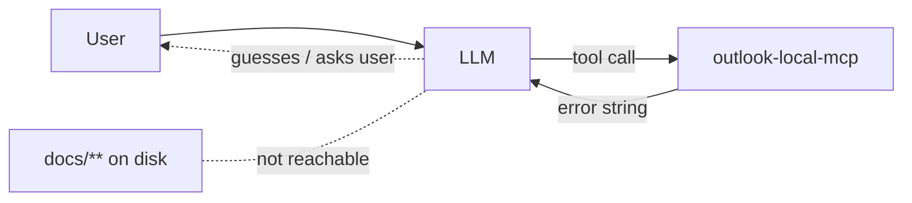
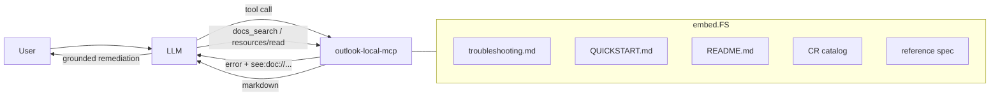
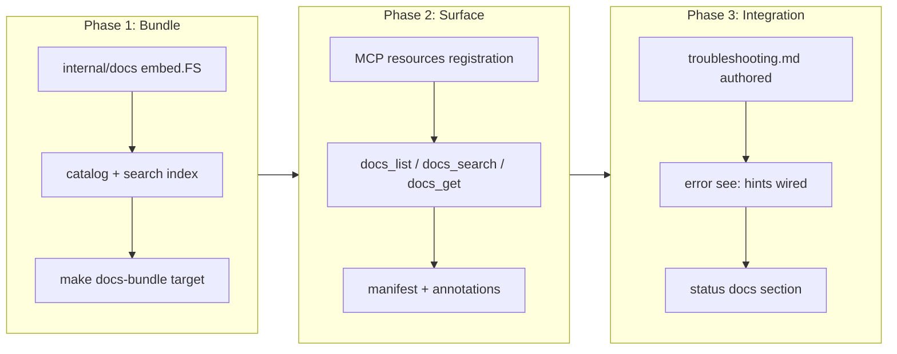

# In-Server Documentation Access for LLM Self-Troubleshooting

## Change Summary

Today the LLM driving `outlook-local-mcp` has no programmatic way to consult the project's documentation. When a tool call fails, the user asks "how do I log in?", or the server reports a configuration error, the LLM either guesses, hallucinates obsolete commands, or asks the user to paste the README. This CR adds a first-class documentation surface — exposed both as MCP **resources** and as a small `docs_*` **tool** family — that bundles curated troubleshooting content with the server binary so the LLM can retrieve authoritative answers in-session and deliver a materially better user experience when things go wrong.

## Motivation and Background

`outlook-local-mcp` runs in end-user environments (Claude Desktop, Claude Code) where the LLM is the primary interface to the user. When a Graph API call returns `InefficientFilter`, when an account's refresh token expires, when the Keychain is locked, when `MailManageEnabled=false` makes a tool invisible, or when a user types "how do I add a second account", the difference between a great and a frustrating experience is whether the LLM can cite the correct remediation *without leaving the conversation*.

Today the LLM has three bad options: (1) guess from training-data knowledge that may be months stale, (2) ask the user to paste docs, (3) surface the raw error and give up. Meanwhile, the repo already contains excellent material — `QUICKSTART.md`, `README.md`, 60+ CRs, `docs/reference/outlook-local-mcp-spec.md`, the auth research note, the prompts directory — none of which the LLM can reach at runtime.

MCP's native **resource** primitive is designed for exactly this: read-only content the client can list and fetch on demand. Pairing resources with a small discovery/search tool gives the LLM a deterministic lookup path it can invoke the moment a tool call fails.

## Change Drivers

* User feedback: failures currently produce opaque errors with no guided remediation.
* Memory note `2026-04-20-graph-inefficientfilter-mail-fixes.md` shows the LLM repeatedly rediscovering the same Graph quirks — documentation access would short-circuit this.
* CR-0058 validation revealed that mail tools have subtle enablement flags (`MailEnabled`, `MailManageEnabled`) that the LLM cannot introspect beyond the `status` tool output.
* Anthropic Software Directory review criteria reward servers that expose helpful resources.
* The project already emphasizes a great LLM experience (see CR-0037, CR-0042, CR-0051) — self-troubleshooting is the next natural step.

## Current State

* Documentation lives on disk in the source repository (`README.md`, `QUICKSTART.md`, `CHANGELOG.md`, `docs/**`, `docs/cr/**`) and is **not** shipped with the compiled binary.
* The MCP server registers 32 tools (CR-0056, CR-0058) but **zero** MCP resources.
* When a tool call fails the handler returns an error string; the LLM has no follow-up action other than apologising to the user.
* The `status` tool surfaces runtime configuration but does not link to remediation docs.
* There is no in-repo "troubleshooting guide" aggregating the common failure modes (auth expired, Keychain locked, Graph throttling, filter errors, disabled tool families).

### Current State Diagram



## Proposed Change

Introduce an **in-server documentation surface** with three coordinated pieces:

1. **Embedded documentation bundle.** A curated subset of Markdown files is embedded into the binary via Go `embed.FS`. The bundle includes a new `docs/troubleshooting.md`, the existing `QUICKSTART.md`, `README.md`, `CHANGELOG.md`, `docs/reference/outlook-local-mcp-spec.md`, `docs/research/authentication-channels.md`, and a generated index of all CRs (title + one-line summary) plus full text for a maintainer-curated shortlist of CRs tagged `llm-relevant: true` in their frontmatter.
2. **MCP Resources.** Each embedded document is exposed as an MCP resource with URI scheme `doc://outlook-local-mcp/{slug}` (e.g., `doc://outlook-local-mcp/troubleshooting`, `doc://outlook-local-mcp/quickstart`, `doc://outlook-local-mcp/cr/CR-0058`). Resources are discoverable via the standard `resources/list` method and fetchable via `resources/read`.
3. **`docs_*` tool family.** Three small tools give the LLM a deterministic search/fetch path independent of client-side resource support:
   * `docs_list` — returns the catalog of available docs (slug, title, one-line summary, tags).
   * `docs_search` — case-insensitive keyword search across the bundle; returns ranked snippets with slug + line range.
   * `docs_get` — fetches a document (or a slice) by slug, with optional `section` and `output` (`text` default, `raw` markdown) parameters honouring CR-0051 tiering.

A new **error-to-doc hint** mechanism augments existing error envelopes: when a tool handler wraps a known error class (e.g., `auth_expired`, `graph_inefficient_filter`, `mail_management_disabled`), the error payload gains a `see` field pointing at the relevant `doc://` URI so the LLM is nudged to fetch it before responding to the user.

### Proposed State Diagram



## Requirements

### Functional Requirements

1. The server **MUST** embed the curated documentation bundle into the compiled binary via `embed.FS` so no filesystem access is required at runtime.
2. The server **MUST** register each embedded document as an MCP resource with URI `doc://outlook-local-mcp/{slug}`, MIME type `text/markdown`, and a human-readable name and description.
3. The server **MUST** support the MCP `resources/list` and `resources/read` methods for all bundled documents.
4. The server **MUST** expose a `docs_list` tool returning the catalog (slug, title, summary, tags, size).
5. The server **MUST** expose a `docs_search` tool that performs case-insensitive substring and token search across the bundle and returns ranked results with slug, matched snippet (±2 lines), and 1-based line numbers.
6. The server **MUST** expose a `docs_get` tool that accepts `slug` (required), optional `section` (heading anchor), and optional `output` (`text` default, `raw`), returning the document or the requested section.
7. The `docs_*` tools **MUST** conform to project tool conventions: naming pattern `docs_{operation}`, full MCP annotations (CR-0052), text-tier default output (CR-0051), and registration in `extension/manifest.json`.
8. A new `docs/troubleshooting.md` **MUST** be authored covering at minimum: authentication failures, token refresh, Keychain locked / unavailable, multi-account resolution, Graph 429 throttling, `InefficientFilter` errors, `MailEnabled`/`MailManageEnabled` disabled-tool behaviour, `ReadOnly` mode, log file location, and the `account_*` lifecycle.
9. Known error classes returned by tool handlers **MUST** include a `see` field in the error payload pointing to the relevant `doc://` URI when one exists.
10. The CR frontmatter schema **MUST** be extended with an optional `llm-relevant: true|false` boolean; the build-time bundling step **MUST** include the full text of any CR marked `llm-relevant: true` and include all other CRs as index entries only (id, title, status, one-line summary).
11. The `status` tool output **MUST** include a `docs` section listing the base resource URI (`doc://outlook-local-mcp/`) and the slug of the troubleshooting document so the LLM can discover the surface from a single known entry point.
12. The documentation bundle **MUST** be regenerated at build time (not manually copied) via a `make docs-bundle` target that refreshes the embedded index and verifies every referenced slug resolves.

### Non-Functional Requirements

1. The added binary size from the embedded bundle **MUST** remain under 2 MiB uncompressed.
2. `docs_search` **MUST** return results in under 100 ms for the full bundle on commodity hardware.
3. The `docs_*` tools **MUST** be read-only and flagged `ReadOnlyHint=true`, `OpenWorldHint=false`, `IdempotentHint=true`, `DestructiveHint=false` (CR-0052).
4. The bundle **MUST NOT** include any file containing secrets, test credentials, or the `.env` / token cache; a lint step in `make docs-bundle` **MUST** fail the build if flagged patterns are present.
5. Documentation content **MUST** be versioned with the binary: `status` **MUST** expose a `docs.version` field equal to the build version so stale-doc drift is diagnosable.

## Affected Components

* `internal/docs/` (new package: embed FS, catalog, search index, resource provider).
* `internal/tools/docs_list.go`, `docs_search.go`, `docs_get.go` (new handlers).
* `internal/server/server.go` (register `docs_*` tools + resources).
* `internal/tools/status.go` (add `docs` section).
* `internal/graph/errors.go` (add `see` field mapping for known error classes).
* `extension/manifest.json` (register three new tools).
* `docs/troubleshooting.md` (new).
* `docs/cr/*.md` frontmatter (add optional `llm-relevant` field).
* `Makefile` (`docs-bundle` target, wired into `ci`).
* `internal/tools/tool_annotations_test.go` (annotations for three new tools).
* `docs/prompts/mcp-tool-crud-test.md` (add CRUD-style test steps for `docs_*`).

## Scope Boundaries

### In Scope

* Embedding and serving the curated documentation bundle.
* `docs_list`, `docs_search`, `docs_get` tools and corresponding MCP resources.
* Authoring `docs/troubleshooting.md`.
* Error-to-doc `see` hints for the well-defined error classes already enumerated in `internal/graph/errors.go`.
* Build-time bundle generation and size/secret linting.

### Out of Scope ("Here, But Not Further")

* Semantic/vector search over the bundle — substring + token ranking is sufficient for a ≤2 MiB corpus; vector indexing deferred to a future CR.
* Live documentation fetched from GitHub or a remote CDN — the bundle is embedded to preserve offline operation.
* Localization of documentation — English only in this CR.
* Rewriting existing CRs for LLM consumption — only the curated shortlist is included in full; the rest remain index-only.
* Interactive "wizard" remediation flows — the LLM drives remediation using the retrieved text; no new elicitation UI is added.
* Modifying the audit logging schema — `docs_*` calls are audited under the existing envelope.

## Alternative Approaches Considered

* **Resources only, no tools.** Rejected: not all MCP clients surface `resources/list` to the model reliably; explicit tools give the LLM a deterministic call path.
* **Tools only, no resources.** Rejected: resources are the idiomatic MCP primitive for read-only content and benefit clients that render them natively.
* **Ship docs as a sidecar directory next to the binary.** Rejected: breaks single-binary distribution (CR-0036 goreleaser, CR-0057 Homebrew/Scoop) and introduces a file-not-found failure mode.
* **Fetch docs from GitHub on demand.** Rejected: breaks offline use, introduces a network dependency for error recovery (the worst possible time to add one), and leaks usage telemetry.
* **Inline remediation strings into every error message.** Rejected: inflates token usage on the hot path and duplicates content across handlers.

## Impact Assessment

### User Impact

Users see dramatically better recovery when something goes wrong. Instead of "Error: failed to refresh token for account foo@bar.com", the LLM fetches `doc://outlook-local-mcp/troubleshooting#token-refresh`, explains the cause, and offers the correct `account_refresh` or `account_login` remedy. No retraining is required; the improvement is invisible to happy paths.

### Technical Impact

Binary grows by ≤2 MiB. One new `internal/docs` package. Three new tools push the registered count from 32 to 35 (the `account_*` conditional `complete_auth` rule is unchanged). No breaking changes to existing tool signatures. Error envelopes gain an optional `see` field — backwards compatible for clients that ignore unknown fields.

### Business Impact

Reduces support burden and improves Software Directory review posture by demonstrating first-class resource support. Strengthens the project's positioning as an LLM-optimised MCP server (consistent with CR-0037, CR-0042, CR-0051).

## Implementation Approach

Implement in three phases, each independently shippable.

### Implementation Flow



## Test Strategy

### Tests to Add

| Test File | Test Name | Description | Inputs | Expected Output |
|-----------|-----------|-------------|--------|-----------------|
| `internal/docs/catalog_test.go` | `TestCatalog_AllSlugsResolve` | Every catalog entry maps to a non-empty embedded file | — | No missing slugs |
| `internal/docs/search_test.go` | `TestSearch_RanksExactMatchesFirst` | Substring match ranks above token match | query `InefficientFilter` | Troubleshooting slug first |
| `internal/docs/search_test.go` | `TestSearch_ReturnsSnippetWithLineNumbers` | Snippet includes ±2 lines and 1-based line numbers | query `Keychain` | Snippet, line range |
| `internal/tools/docs_list_test.go` | `TestDocsList_Text` | Text tier lists slugs and titles | `output=text` | Formatted numbered list |
| `internal/tools/docs_get_test.go` | `TestDocsGet_Section` | Fetches a single `##` section by anchor | `slug=troubleshooting, section=token-refresh` | Section body only |
| `internal/tools/docs_search_test.go` | `TestDocsSearch_NoResults` | Empty query returns structured empty result | `query=zzzxyz` | Zero results, not error |
| `internal/tools/tool_annotations_test.go` | `TestDocsAnnotations` | Three new tools carry full annotation set | — | All 5 annotations present |
| `internal/graph/errors_test.go` | `TestErrorSeeHint_InefficientFilter` | Graph `InefficientFilter` error carries `see` URI | synthetic 400 | `see=doc://.../troubleshooting#inefficient-filter` |
| `internal/server/server_test.go` | `TestResourcesList_IncludesBundledDocs` | `resources/list` returns all bundled doc URIs | — | URIs present, MIME `text/markdown` |
| `internal/docs/bundle_size_test.go` | `TestBundleSizeUnder2MiB` | Embedded FS total byte size budget | — | <2 MiB |
| `internal/docs/bundle_secrets_test.go` | `TestBundleContainsNoSecrets` | Bundle scanned for token/secret patterns | — | No matches |

### Tests to Modify

| Test File | Test Name | Current Behavior | New Behavior | Reason for Change |
|-----------|-----------|------------------|--------------|-------------------|
| `internal/tools/status_test.go` | `TestStatus_Text` | Asserts runtime config fields | Also asserts `docs` section with base URI + troubleshooting slug | New status field |
| `internal/tools/tool_annotations_test.go` | `TestAllToolsHaveAnnotations` | Iterates 32 tools | Iterates 35 tools | Three new tools |

### Tests to Remove

Not applicable — this CR is purely additive.

## Acceptance Criteria

### AC-1: Documentation resources are listable

```gherkin
Given the server is running
When the MCP client calls `resources/list`
Then the response includes one resource per bundled document
  And each resource has URI prefix `doc://outlook-local-mcp/`
  And each resource declares MIME type `text/markdown`
```

### AC-2: The LLM can search the bundle

```gherkin
Given the server is running
When the LLM calls `docs_search` with `query="InefficientFilter"`
Then the response ranks `troubleshooting` first
  And each result includes a snippet with ±2 lines of context
  And each result includes 1-based line numbers
```

### AC-3: The LLM can fetch a document section

```gherkin
Given the troubleshooting document defines a `## Token refresh` heading
When the LLM calls `docs_get` with `slug="troubleshooting"` and `section="token-refresh"`
Then only the body of that section is returned
  And the response is plain text by default
  And `output="raw"` returns the unmodified markdown
```

### AC-4: Errors point the LLM at the right document

```gherkin
Given a tool handler wraps a Graph `InefficientFilter` error
When the handler returns its error envelope
Then the envelope includes `see="doc://outlook-local-mcp/troubleshooting#inefficient-filter"`
  And the slug in the URI resolves in the bundle
```

### AC-5: Status exposes the documentation entry point

```gherkin
Given the server has started
When the LLM calls the `status` tool
Then the response includes a `docs` section
  And the section lists `base_uri="doc://outlook-local-mcp/"` and `troubleshooting_slug="troubleshooting"`
  And `docs.version` equals the server build version
```

### AC-6: The bundle is built, not copied

```gherkin
Given a developer runs `make docs-bundle`
When the target completes successfully
Then the generated catalog file lists every embedded slug
  And every slug resolves to a non-empty file
  And the total uncompressed size is under 2 MiB
  And no bundled file matches the secret-pattern denylist
```

### AC-7: `llm-relevant` CRs are included in full

```gherkin
Given a CR's frontmatter contains `llm-relevant: true`
When the bundle is built
Then that CR's full text is embedded
  And its slug is `cr/CR-XXXX`
  And CRs without that flag appear only in the index with id, title, status, and summary
```

## Quality Standards Compliance

### Build & Compilation

- [ ] Code compiles/builds without errors
- [ ] No new compiler warnings introduced
- [ ] `make docs-bundle` succeeds and is wired into `make ci`

### Linting & Code Style

- [ ] All linter checks pass with zero warnings/errors
- [ ] Code follows project coding conventions and style guides
- [ ] Any linter exceptions are documented with justification

### Test Execution

- [ ] All existing tests pass after implementation
- [ ] All new tests pass
- [ ] Test coverage meets project requirements for changed code

### Documentation

- [ ] `docs/troubleshooting.md` authored and embedded
- [ ] `README.md` and `QUICKSTART.md` reference the new `docs_*` tools
- [ ] `extension/manifest.json` updated for three new tools
- [ ] `docs/prompts/mcp-tool-crud-test.md` updated with `docs_*` steps
- [ ] `CHANGELOG.md` entry added

### Code Review

- [ ] Changes submitted via pull request
- [ ] PR title follows Conventional Commits format (`feat(docs): in-server documentation surface for LLM self-troubleshooting`)
- [ ] Code review completed and approved
- [ ] Changes squash-merged to maintain linear history

### Verification Commands

```bash
make docs-bundle
make build
make vet
make fmt-check
make lint
make test
make ci
```

## Risks and Mitigation

### Risk 1: Bundled docs drift from the actual runtime behavior

**Likelihood:** medium
**Impact:** high — stale remediation steers the LLM wrong, eroding trust.
**Mitigation:** bundle is regenerated at build time, `docs.version` in `status` equals the build version, troubleshooting content is tied to specific error classes that are covered by tests (`TestErrorSeeHint_*`), and a lint step verifies every `see` URI in error handlers resolves to a real slug+anchor.

### Risk 2: Binary bloat from over-inclusive bundling

**Likelihood:** medium
**Impact:** medium
**Mitigation:** hard 2 MiB budget enforced by `TestBundleSizeUnder2MiB`; CRs default to index-only and require an explicit `llm-relevant: true` opt-in to include full text.

### Risk 3: Secrets or internal notes accidentally embedded

**Likelihood:** low
**Impact:** high
**Mitigation:** `TestBundleContainsNoSecrets` scans the bundle for common token patterns (`eyJ`, `sk-`, `client_secret`, `refresh_token`); `make docs-bundle` fails the build on any hit; the curated allowlist of files is explicit, not glob-based.

### Risk 4: LLM over-fetches documentation, inflating token usage

**Likelihood:** medium
**Impact:** medium
**Mitigation:** `docs_search` returns snippets (not full docs) by default; `docs_get` supports `section` slicing; tool descriptions explicitly instruct the LLM to prefer search-then-section-fetch over full-document retrieval, consistent with the body-escalation pattern already established in CLAUDE.md.

## Dependencies

* None blocking; this CR is additive.
* Benefits from (but does not require) CR-0058's error envelope work — the `see` field extends that envelope.

## Estimated Effort

* Phase 1 (bundle + catalog + search): ~1.5 days.
* Phase 2 (resources + `docs_*` tools + annotations + tests): ~1.5 days.
* Phase 3 (troubleshooting.md authoring + error hint wiring + status integration): ~1 day.
* **Total:** ~4 developer-days.

## Decision Outcome

Chosen approach: "embedded bundle + MCP resources + `docs_*` tools + error `see` hints", because it preserves single-binary distribution and offline operation, leverages the idiomatic MCP resource primitive, gives the LLM a deterministic search path that works across all MCP clients regardless of resource-rendering support, and closes the feedback loop from tool errors to authoritative remediation text.

## Related Items

* Complements CR-0051 (response tiering) — `docs_*` tools honour the same text-default discipline.
* Complements CR-0052 (tool annotations) — three new tools require full annotation coverage.
* Complements CR-0058 (mail management error envelopes) — extends the envelope with `see`.
* Informed by memory `2026-04-20-graph-inefficientfilter-mail-fixes.md`.

## More Information

Troubleshooting topics to cover in `docs/troubleshooting.md` (non-exhaustive):

* Authentication: login, token refresh, device code vs. browser vs. auth-code fallback (CR-0022, CR-0024, CR-0030, CR-0031).
* Multi-account resolution and UPN identity (CR-0056).
* Keychain unavailable / CGO fallback (CR-0038).
* Graph API: 429 throttling (CR-0010), request timeouts (CR-0011), `InefficientFilter`, missing `$orderby` constraints.
* Read-only mode and tool visibility (CR-0020).
* Mail tool enablement flags `MailEnabled` / `MailManageEnabled` (CR-0058).
* Log file locations and how to read sanitised logs (CR-0002, CR-0023).
* Audit log interpretation (CR-0015).
