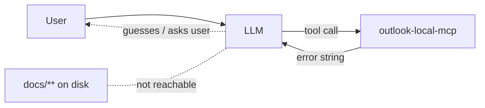
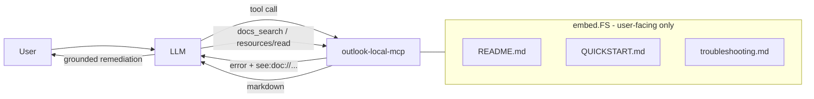
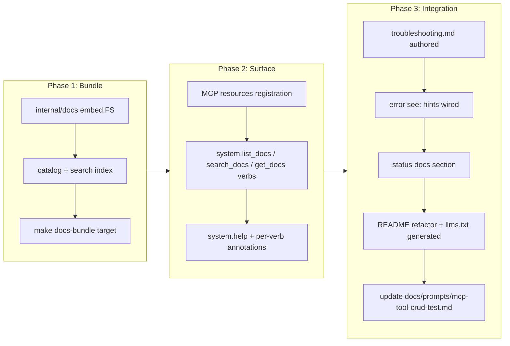

# In-Server Documentation Access for LLM Self-Troubleshooting

## Change Summary

Today the LLM driving `outlook-local-mcp` has no programmatic way to consult the project's documentation. When a tool call fails, the user asks "how do I log in?", or the server reports a configuration error, the LLM either guesses, hallucinates obsolete commands, or asks the user to paste the README. This CR adds a first-class documentation surface — exposed both as MCP **resources** and as three new verbs on the existing `system` aggregate domain tool (`list_docs`, `search_docs`, `get_docs`, per CR-0060) — that bundles curated troubleshooting content with the server binary so the LLM can retrieve authoritative answers in-session and deliver a materially better user experience when things go wrong.

## Motivation and Background

`outlook-local-mcp` runs in end-user environments (Claude Desktop, Claude Code) where the LLM is the primary interface to the user. When a Graph API call returns `InefficientFilter`, when an account's refresh token expires, when the Keychain is locked, when `MailManageEnabled=false` makes a tool invisible, or when a user types "how do I add a second account", the difference between a great and a frustrating experience is whether the LLM can cite the correct remediation *without leaving the conversation*.

Today the LLM has three bad options: (1) guess from training-data knowledge that may be months stale, (2) ask the user to paste docs, (3) surface the raw error and give up. Meanwhile, the repo already contains excellent material — `QUICKSTART.md`, `README.md`, 60+ CRs, `docs/reference/outlook-local-mcp-spec.md`, the auth research note, the prompts directory — none of which the LLM can reach at runtime.

MCP's native **resource** primitive is designed for exactly this: read-only content the client can list and fetch on demand. Pairing resources with a small discovery/search tool gives the LLM a deterministic lookup path it can invoke the moment a tool call fails.

## Change Drivers

* User feedback: failures currently produce opaque errors with no guided remediation.
* Memory note `2026-04-20-graph-inefficientfilter-mail-fixes.md` shows the LLM repeatedly rediscovering the same Graph quirks — documentation access would short-circuit this.
* CR-0058 validation revealed that mail tools have subtle enablement flags (`MailEnabled`, `MailManageEnabled`) that the LLM cannot introspect beyond the `status` tool output.
* Anthropic Software Directory review criteria reward servers that expose helpful resources.
* The project already emphasizes a great LLM experience (see CR-0037, CR-0042, CR-0051) — self-troubleshooting is the next natural step.

## Current State

* Documentation lives on disk in the source repository (`README.md`, `QUICKSTART.md`, `CHANGELOG.md`, `docs/**`, `docs/cr/**`) and is **not** shipped with the compiled binary.
* The MCP server registers **4 aggregate domain tools** (`calendar`, `mail`, `account`, `system`) dispatching ~30 verbs (CR-0060) but **zero** MCP resources.
* When a tool call fails the handler returns an error string; the LLM has no follow-up action other than apologising to the user.
* The `status` tool surfaces runtime configuration but does not link to remediation docs.
* There is no in-repo "troubleshooting guide" aggregating the common failure modes (auth expired, Keychain locked, Graph throttling, filter errors, disabled tool families).

### Current State Diagram



## Proposed Change

Introduce an **in-server documentation surface** with three coordinated pieces:

1. **Embedded documentation bundle.** A curated set of **user-facing** Markdown files is embedded into the binary via Go `embed.FS`. The bundle is intentionally limited to: `README.md`, `QUICKSTART.md`, and a new `docs/troubleshooting.md`. **Engineering documentation is explicitly excluded** from the bundle: Change Requests (`docs/cr/**`), the reference specification (`docs/reference/outlook-local-mcp-spec.md`), research notes (`docs/research/**`), and `CHANGELOG.md` are **not** embedded and are **not** exposed via the in-server surface. They remain available in the source repository for contributors and via `llms.txt` for off-repo LLM clients.
2. **MCP Resources.** Each embedded document is exposed as an MCP resource with URI scheme `doc://outlook-local-mcp/{slug}` (e.g., `doc://outlook-local-mcp/readme`, `doc://outlook-local-mcp/quickstart`, `doc://outlook-local-mcp/troubleshooting`). Resources are discoverable via the standard `resources/list` method and fetchable via `resources/read`.
3. **Three new verbs on the `system` aggregate tool.** Per CR-0060, server-level meta verbs live on `system`. These give the LLM a deterministic search/fetch path independent of client-side resource support:
   * `system.list_docs` — returns the catalog of available docs (slug, title, one-line summary, tags).
   * `system.search_docs` — case-insensitive keyword search across the bundle; returns ranked snippets with slug + line range.
   * `system.get_docs` — fetches a document (or a slice) by slug, with optional `section` and `output` (`text` default, `raw` markdown) parameters honouring CR-0051 tiering.

No new top-level MCP tool is added; the aggregate count remains 4 (`calendar`, `mail`, `account`, `system`). The new verbs are read-only and do not alter the conservative-aggregation annotations of `system` (already `ReadOnly=false` due to optional `complete_auth`, `OpenWorld=false` since every system verb is local; the docs verbs preserve both).

A new **error-to-doc hint** mechanism augments existing error envelopes: when a tool handler wraps a known error class (e.g., `auth_expired`, `graph_inefficient_filter`, `mail_management_disabled`), the error payload gains a `see` field pointing at the relevant `doc://` URI so the LLM is nudged to fetch it before responding to the user.

### Proposed State Diagram



## Requirements

### Functional Requirements

1. The server **MUST** embed the curated documentation bundle into the compiled binary via `embed.FS` so no filesystem access is required at runtime.
2. The server **MUST** register each embedded document as an MCP resource with URI `doc://outlook-local-mcp/{slug}`, MIME type `text/markdown`, and a human-readable name and description.
3. The server **MUST** support the MCP `resources/list` and `resources/read` methods for all bundled documents.
4. The `system` aggregate tool **MUST** expose a `list_docs` verb returning the catalog (slug, title, summary, tags, size).
5. The `system` aggregate tool **MUST** expose a `search_docs` verb that performs case-insensitive substring and token search across the bundle and returns ranked results with slug, matched snippet (±2 lines), and 1-based line numbers.
6. The `system` aggregate tool **MUST** expose a `get_docs` verb that accepts `slug` (required), optional `section` (heading anchor), and optional `output` (`text` default, `raw`), returning the document or the requested section.
7. The new verbs **MUST** conform to project conventions per CR-0060 and CLAUDE.md: registered in the `system` domain verb registry (`internal/tools/dispatch_registry.go` + `internal/tools/help/`), text-tier default output (CR-0051), per-verb annotation semantics documented in `system`'s `operation="help"` output, and **no** new entries in `extension/manifest.json` (the four aggregate tools already cover the surface). The conservative aggregate annotations on `system` (CR-0052/CR-0060) **MUST** remain unchanged since the new verbs are read-only, idempotent, non-destructive, and local.
8. A new `docs/troubleshooting.md` **MUST** be authored covering at minimum: authentication failures, token refresh, Keychain locked / unavailable, multi-account resolution, Graph 429 throttling, `InefficientFilter` errors, `MailEnabled`/`MailManageEnabled` disabled-tool behaviour, `ReadOnly` mode, log file location, and the `account_*` lifecycle.
9. For every error class enumerated in `internal/graph/errors.go` that has a corresponding troubleshooting section in `docs/troubleshooting.md`, the error payload returned by tool handlers **MUST** include a `see` field whose value is the `doc://outlook-local-mcp/troubleshooting#{anchor}` URI of that section. A build-time test **MUST** fail if any such mapping is missing or points to an unresolved anchor.
10. The embedded bundle **MUST** be limited to user-facing documentation (`README.md`, `QUICKSTART.md`, `docs/troubleshooting.md`). Engineering documentation — Change Requests under `docs/cr/**`, the reference spec at `docs/reference/outlook-local-mcp-spec.md`, research notes under `docs/research/**`, and `CHANGELOG.md` — **MUST NOT** be embedded, exposed as MCP resources, or returned by any `system.*_docs` verb. A test **MUST** fail the build if any path under those directories is added to the bundle.
11. The `system.status` verb output **MUST** include a `docs` section listing the base resource URI (`doc://outlook-local-mcp/`) and the slug of the troubleshooting document so the LLM can discover the surface from a single known entry point.
12. The documentation bundle **MUST** be regenerated at build time (not manually copied) via a `make docs-bundle` target that refreshes the embedded index and verifies every referenced slug resolves.
13. `README.md` **MUST** be refactored to target a human audience and **MUST** contain, at minimum, the following sections: project pitch, install/quick-start pointer, supported feature list, link to `QUICKSTART.md`, link to `llms.txt` for LLM consumers, and contributing/license sections. Deep configuration reference, troubleshooting content, and CR-derived implementation detail **MUST NOT** appear in `README.md` and **MUST** instead live in `QUICKSTART.md`, `docs/troubleshooting.md`, or `docs/reference/outlook-local-mcp-spec.md`.
14. A `/llms.txt` file **MUST** be added at the repository root following the AnswerDotAI `llms.txt` standard (https://llmstxt.org). Structure:
    * Required `# outlook-local-mcp` H1 header.
    * Blockquote summary describing the server in one sentence.
    * Short information section explaining what the LLM can do with the bundled docs and the `docs_*` tool family (cross-referencing the in-server surface from this CR).
    * H2 file list sections — at minimum **Docs** (links to `QUICKSTART.md`, `docs/troubleshooting.md`, `docs/reference/outlook-local-mcp-spec.md`, `CHANGELOG.md`), **Tools** (link to a generated tool reference or the manifest), **Change Requests** (link to the `docs/cr/` index), and an **Optional** section for deeper material (research notes, full CR catalog).
    * Links **MUST** point to absolute GitHub raw/blob URLs on the default branch so they resolve for off-repo LLM clients.
15. The `llms.txt` file **MUST** be regenerated by `make docs-bundle` from the same catalog that drives the embedded bundle so the on-disk `llms.txt` and the in-server `doc://` surface cannot drift. A test **MUST** fail the build if `llms.txt` is stale relative to the catalog.

### Non-Functional Requirements

1. The added binary size from the embedded bundle **MUST** remain under 2 MiB uncompressed.
2. `system.search_docs` **MUST** return results in under 100 ms for the full bundle on commodity hardware.
3. The new docs verbs **MUST** be read-only and per-verb-documented as `ReadOnly=true`, `OpenWorld=false`, `Idempotent=true`, `Destructive=false` in `system`'s help output (CR-0052/CR-0060). Aggregate `system` annotations are unaffected because they are already conservative across its existing verbs.
4. The bundle **MUST NOT** include any file containing secrets, test credentials, or the `.env` / token cache; a lint step in `make docs-bundle` **MUST** fail the build if flagged patterns are present.
5. Documentation content **MUST** be versioned with the binary: `status` **MUST** expose a `docs.version` field equal to the build version so stale-doc drift is diagnosable.

## Affected Components

* `internal/docs/` (new package: embed FS, catalog, search index, resource provider).
* `internal/tools/list_docs.go`, `search_docs.go`, `get_docs.go` (new verb handlers in the `system` domain).
* `internal/tools/dispatch_registry.go` (register the three new verbs in the system domain verb registry).
* `internal/tools/help/system.go` (or equivalent) — extend `system.help` output with the three verbs and their per-verb annotation semantics.
* `internal/server/server.go` (register MCP resources; no new top-level tool — aggregate tool count stays at 4).
* `internal/tools/status.go` (add `docs` section to the `system.status` verb).
* `internal/graph/errors.go` (add `see` field mapping for known error classes).
* `extension/manifest.json` (no change — the four aggregate tools are unchanged).
* `docs/troubleshooting.md` (new).
* `README.md` (refactored for a human audience; deep content moved into `QUICKSTART.md` / `docs/troubleshooting.md` / `docs/reference/outlook-local-mcp-spec.md`).
* `llms.txt` (new, repository root, generated by `make docs-bundle`).
* `internal/docs/llmstxt.go` (new generator that emits `llms.txt` from the same catalog used for the embed bundle).
* `Makefile` (`docs-bundle` target, wired into `ci`).
* `internal/tools/tool_annotations_test.go` (verify aggregate annotations on `system` remain correct after adding the verbs; add per-verb assertions where applicable).
* `docs/prompts/mcp-tool-crud-test.md` (add steps exercising `system.list_docs`, `system.search_docs`, `system.get_docs`).

## Scope Boundaries

### In Scope

* Embedding and serving the curated documentation bundle.
* `system.list_docs`, `system.search_docs`, `system.get_docs` verbs and corresponding MCP resources.
* Authoring `docs/troubleshooting.md`.
* Error-to-doc `see` hints for the well-defined error classes already enumerated in `internal/graph/errors.go`.
* Build-time bundle generation and size/secret linting.
* Refactoring `README.md` to a human-first front page and migrating deep content into the dedicated docs.
* Authoring and generating `/llms.txt` at the repository root per the AnswerDotAI `llms.txt` standard.

### Out of Scope ("Here, But Not Further")

* Semantic/vector search over the bundle — substring + token ranking is sufficient for a ≤2 MiB corpus; vector indexing deferred to a future CR.
* Live documentation fetched from GitHub or a remote CDN — the bundle is embedded to preserve offline operation.
* Localization of documentation — English only in this CR.
* Embedding any engineering documentation (CRs, reference spec, research notes, changelog) — these are deliberately excluded from the in-server surface. Off-repo LLM clients can reach them through the absolute GitHub links in `llms.txt`.
* Generating `llms-ctx.txt` / `llms-ctx-full.txt` expanded context files — the standard's `llms_txt2ctx` step is deferred; downstream LLM clients can run it themselves if needed.
* Rewriting `QUICKSTART.md`, `CHANGELOG.md`, or other existing docs beyond what the README refactor displaces into them.
* Interactive "wizard" remediation flows — the LLM drives remediation using the retrieved text; no new elicitation UI is added.
* Modifying the audit logging schema — `docs_*` calls are audited under the existing envelope.

## Alternative Approaches Considered

* **Resources only, no verbs.** Rejected: not all MCP clients surface `resources/list` to the model reliably; explicit verbs give the LLM a deterministic call path.
* **Verbs only, no resources.** Rejected: resources are the idiomatic MCP primitive for read-only content and benefit clients that render them natively.
* **A new `docs` aggregate domain tool.** Rejected: per CR-0060 / CLAUDE.md, new work must add verbs to an existing domain registry rather than introduce a new top-level MCP tool. `system` is the natural home for server-level meta verbs.
* **A separate `docs_*` tool family (this CR's earlier draft).** Rejected for the same reason — superseded by CR-0060's aggregate model.
* **Ship docs as a sidecar directory next to the binary.** Rejected: breaks single-binary distribution (CR-0036 goreleaser, CR-0057 Homebrew/Scoop) and introduces a file-not-found failure mode.
* **Fetch docs from GitHub on demand.** Rejected: breaks offline use, introduces a network dependency for error recovery (the worst possible time to add one), and leaks usage telemetry.
* **Inline remediation strings into every error message.** Rejected: inflates token usage on the hot path and duplicates content across handlers.

## Impact Assessment

### User Impact

Users see dramatically better recovery when something goes wrong. Instead of "Error: failed to refresh token for account foo@bar.com", the LLM fetches `doc://outlook-local-mcp/troubleshooting#token-refresh`, explains the cause, and offers the correct `account_refresh` or `account_login` remedy. No retraining is required; the improvement is invisible to happy paths.

### Technical Impact

Binary grows by ≤2 MiB. One new `internal/docs` package. Three new verbs are added to the `system` domain registry; the aggregate MCP tool count stays at 4 (CR-0060). No breaking changes to existing tool or verb signatures. Error envelopes gain an optional `see` field — backwards compatible for clients that ignore unknown fields.

### Business Impact

Reduces support burden and improves Software Directory review posture by demonstrating first-class resource support. Strengthens the project's positioning as an LLM-optimised MCP server (consistent with CR-0037, CR-0042, CR-0051).

## Implementation Approach

Implement in three phases, each independently shippable.

### Implementation Flow



## Test Strategy

### Tests to Add

| Test File | Test Name | Description | Inputs | Expected Output |
|-----------|-----------|-------------|--------|-----------------|
| `internal/docs/catalog_test.go` | `TestCatalog_AllSlugsResolve` | Every catalog entry maps to a non-empty embedded file | — | No missing slugs |
| `internal/docs/search_test.go` | `TestSearch_RanksExactMatchesFirst` | Substring match ranks above token match | query `InefficientFilter` | Troubleshooting slug first |
| `internal/docs/search_test.go` | `TestSearch_ReturnsSnippetWithLineNumbers` | Snippet includes ±2 lines and 1-based line numbers | query `Keychain` | Snippet, line range |
| `internal/tools/list_docs_test.go` | `TestSystemListDocs_Text` | Text tier lists slugs and titles via `system.list_docs` | `output=text` | Formatted numbered list |
| `internal/tools/get_docs_test.go` | `TestSystemGetDocs_Section` | Fetches a single `##` section by anchor via `system.get_docs` | `slug=troubleshooting, section=token-refresh` | Section body only |
| `internal/tools/search_docs_test.go` | `TestSystemSearchDocs_NoResults` | Empty query returns structured empty result | `query=zzzxyz` | Zero results, not error |
| `internal/tools/dispatch_test.go` | `TestSystemHelp_ListsDocsVerbs` | `system.help` enumerates the three docs verbs with per-verb annotation semantics | — | Verbs present with correct hints |
| `internal/graph/errors_test.go` | `TestErrorSeeHint_InefficientFilter` | Graph `InefficientFilter` error carries `see` URI | synthetic 400 | `see=doc://.../troubleshooting#inefficient-filter` |
| `internal/server/server_test.go` | `TestResourcesList_IncludesBundledDocs` | `resources/list` returns all bundled doc URIs | — | URIs present, MIME `text/markdown` |
| `internal/docs/bundle_size_test.go` | `TestBundleSizeUnder2MiB` | Embedded FS total byte size budget | — | <2 MiB |
| `internal/docs/bundle_secrets_test.go` | `TestBundleContainsNoSecrets` | Bundle scanned for token/secret patterns | — | No matches |
| `internal/docs/llmstxt_test.go` | `TestLLMsTxt_MatchesCatalog` | Generated `llms.txt` matches the catalog (regen idempotent) | — | No diff vs. on-disk file |
| `internal/docs/llmstxt_test.go` | `TestLLMsTxt_StructureCompliesWithStandard` | File starts with one H1, optional blockquote, H2 list sections, items as `[title](url)` | — | Parses cleanly |
| `internal/docs/llmstxt_test.go` | `TestLLMsTxt_LinksAreAbsolute` | Every link uses absolute GitHub URL on default branch | — | No relative paths |

### Tests to Modify

| Test File | Test Name | Current Behavior | New Behavior | Reason for Change |
|-----------|-----------|------------------|--------------|-------------------|
| `internal/tools/status_test.go` | `TestStatus_Text` | Asserts runtime config fields | Also asserts `docs` section with base URI + troubleshooting slug | New status field |
| `internal/tools/tool_annotations_test.go` | `TestAggregateAnnotations` | Iterates 4 aggregate tools | Still iterates 4 aggregate tools; verifies `system` aggregates remain unchanged after adding the read-only docs verbs | Conservative-aggregation invariant per CR-0060 |

### Tests to Remove

Not applicable — this CR is purely additive.

## Acceptance Criteria

### AC-1: Documentation resources are listable

```gherkin
Given the server is running
When the MCP client calls `resources/list`
Then the response includes one resource per bundled document
  And each resource has URI prefix `doc://outlook-local-mcp/`
  And each resource declares MIME type `text/markdown`
```

### AC-2: The LLM can search the bundle

```gherkin
Given the server is running
When the LLM calls the `system` tool with `operation="search_docs"` and `query="InefficientFilter"`
Then the response ranks `troubleshooting` first
  And each result includes a snippet with ±2 lines of context
  And each result includes 1-based line numbers
```

### AC-3: The LLM can fetch a document section

```gherkin
Given the troubleshooting document defines a `## Token refresh` heading
When the LLM calls the `system` tool with `operation="get_docs"`, `slug="troubleshooting"`, and `section="token-refresh"`
Then only the body of that section is returned
  And the response is plain text by default
  And `output="raw"` returns the unmodified markdown
```

### AC-4: Errors point the LLM at the right document

```gherkin
Given a tool handler wraps a Graph `InefficientFilter` error
When the handler returns its error envelope
Then the envelope includes `see="doc://outlook-local-mcp/troubleshooting#inefficient-filter"`
  And the slug in the URI resolves in the bundle
```

### AC-5: Status exposes the documentation entry point

```gherkin
Given the server has started
When the LLM calls the `system` tool with `operation="status"`
Then the response includes a `docs` section
  And the section lists `base_uri="doc://outlook-local-mcp/"` and `troubleshooting_slug="troubleshooting"`
  And `docs.version` equals the server build version
```

### AC-6: The bundle is built, not copied

```gherkin
Given a developer runs `make docs-bundle`
When the target completes successfully
Then the generated catalog file lists every embedded slug
  And every slug resolves to a non-empty file
  And the total uncompressed size is under 2 MiB
  And no bundled file matches the secret-pattern denylist
```

### AC-7: Engineering docs are excluded from the bundle

```gherkin
Given the embedded documentation bundle
When the bundle is built
Then it contains only `readme`, `quickstart`, and `troubleshooting`
  And no path under `docs/cr/`, `docs/reference/`, or `docs/research/` is embedded
  And `CHANGELOG.md` is not embedded
  And the `system.list_docs` verb returns exactly those three slugs
  And the build fails if a test detects any engineering-doc path in the bundle
```

### AC-8: README targets humans, llms.txt targets LLMs

```gherkin
Given the refactored repository root
When a contributor opens `README.md`
Then it reads as a human-facing project front page (pitch, install pointer, feature list, links)
  And deep configuration, troubleshooting, and CR-derived content live in `QUICKSTART.md`, `docs/troubleshooting.md`, and `docs/reference/outlook-local-mcp-spec.md`
  And `README.md` links to `llms.txt` for LLM consumers
```

### AC-9: llms.txt complies with the standard and is generated, not hand-edited

```gherkin
Given the repository root contains `llms.txt`
When a contributor inspects the file
Then it begins with a single H1 `# outlook-local-mcp`
  And contains a blockquote one-sentence summary
  And contains H2 sections including `## Docs`, `## Tools`, `## Change Requests`, and `## Optional`
  And every list item is formatted `[title](url): description` with an absolute GitHub URL
  And `make docs-bundle` regenerates the file idempotently from the same catalog used for the embedded bundle
  And CI fails if the on-disk file drifts from the catalog
```

## Quality Standards Compliance

### Build & Compilation

- [x] Code compiles/builds without errors
- [x] No new compiler warnings introduced
- [x] `make docs-bundle` succeeds and is wired into `make ci`

### Linting & Code Style

- [x] All linter checks pass with zero warnings/errors
- [x] Code follows project coding conventions and style guides
- [x] Any linter exceptions are documented with justification

### Test Execution

- [x] All existing tests pass after implementation
- [x] All new tests pass
- [x] Test coverage meets project requirements for changed code

### Documentation

- [x] `docs/troubleshooting.md` authored and embedded
- [x] `README.md` refactored for a human audience and links to `llms.txt`
- [x] `QUICKSTART.md` and `docs/reference/outlook-local-mcp-spec.md` absorb the deep content displaced from `README.md`
- [x] `llms.txt` generated at repository root, structurally compliant with the standard, regenerated by `make docs-bundle`
- [x] `README.md` and `QUICKSTART.md` reference the new `system.list_docs` / `search_docs` / `get_docs` verbs
- [x] `extension/manifest.json` requires no change (aggregate tool count remains 4 per CR-0060)
- [x] `docs/prompts/mcp-tool-crud-test.md` updated with steps for the three new system verbs
- [x] `CHANGELOG.md` entry added

### Code Review

- [ ] Changes submitted via pull request
- [ ] PR title follows Conventional Commits format (`feat(docs): in-server documentation surface for LLM self-troubleshooting`)
- [ ] Code review completed and approved
- [ ] Changes squash-merged to maintain linear history

### Verification Commands

```bash
make docs-bundle
make build
make vet
make fmt-check
make lint
make test
make ci
```

## Risks and Mitigation

### Risk 1: Bundled docs drift from the actual runtime behavior

**Likelihood:** medium
**Impact:** high — stale remediation steers the LLM wrong, eroding trust.
**Mitigation:** bundle is regenerated at build time, `docs.version` in `status` equals the build version, troubleshooting content is tied to specific error classes that are covered by tests (`TestErrorSeeHint_*`), and a lint step verifies every `see` URI in error handlers resolves to a real slug+anchor.

### Risk 2: Binary bloat from over-inclusive bundling

**Likelihood:** medium
**Impact:** medium
**Mitigation:** hard 2 MiB budget enforced by `TestBundleSizeUnder2MiB`; the bundle is restricted to three user-facing files (`README.md`, `QUICKSTART.md`, `docs/troubleshooting.md`) — engineering docs (CRs, reference spec, research notes, changelog) are excluded by an explicit allowlist and a build-time test that fails if any disallowed path is added.

### Risk 3: Secrets or internal notes accidentally embedded

**Likelihood:** low
**Impact:** high
**Mitigation:** `TestBundleContainsNoSecrets` scans the bundle for common token patterns (`eyJ`, `sk-`, `client_secret`, `refresh_token`); `make docs-bundle` fails the build on any hit; the curated allowlist of files is explicit, not glob-based.

### Risk 4: LLM over-fetches documentation, inflating token usage

**Likelihood:** medium
**Impact:** medium
**Mitigation:** `system.search_docs` returns snippets (not full docs) by default; `system.get_docs` supports `section` slicing; tool descriptions explicitly instruct the LLM to prefer search-then-section-fetch over full-document retrieval, consistent with the body-escalation pattern already established in CLAUDE.md.

## Dependencies

* None blocking; this CR is additive.
* Benefits from (but does not require) CR-0058's error envelope work — the `see` field extends that envelope.

## Estimated Effort

* Phase 1 (bundle + catalog + search): ~1.5 days.
* Phase 2 (resources + `system.list_docs` / `search_docs` / `get_docs` verbs + annotations + tests): ~1.5 days.
* Phase 3 (troubleshooting.md authoring + error hint wiring + status integration + README refactor + llms.txt generator): ~1.5 days.
* **Total:** ~4.5 developer-days.

## Decision Outcome

Chosen approach: "embedded bundle + MCP resources + three new `system` verbs (`list_docs`, `search_docs`, `get_docs`) + error `see` hints", because it preserves single-binary distribution and offline operation, leverages the idiomatic MCP resource primitive, gives the LLM a deterministic verb-call path that works across all MCP clients regardless of resource-rendering support, closes the feedback loop from tool errors to authoritative remediation text, and respects CR-0060 by extending an existing aggregate tool rather than adding a new one.

## Related Items

* Complements CR-0051 (response tiering) — the new `system.list_docs` / `search_docs` / `get_docs` verbs honour the same text-default discipline.
* Complements CR-0052 (tool annotations) — three new verbs require per-verb annotation coverage on the `system` aggregate tool.
* Complements CR-0058 (mail management error envelopes) — extends the envelope with `see`.
* Builds on CR-0060 (domain-aggregated tools with verb operations) — new functionality is added as verbs on `system` rather than as new top-level tools.
* Informed by memory `2026-04-20-graph-inefficientfilter-mail-fixes.md`.
* Adopts the `llms.txt` standard from AnswerDotAI (https://github.com/AnswerDotAI/llms-txt, https://llmstxt.org).

## More Information

Troubleshooting topics to cover in `docs/troubleshooting.md` (non-exhaustive):

* Authentication: login, token refresh, device code vs. browser vs. auth-code fallback (CR-0022, CR-0024, CR-0030, CR-0031).
* Multi-account resolution and UPN identity (CR-0056).
* Keychain unavailable / CGO fallback (CR-0038).
* Graph API: 429 throttling (CR-0010), request timeouts (CR-0011), `InefficientFilter`, missing `$orderby` constraints.
* Read-only mode and tool visibility (CR-0020).
* Mail tool enablement flags `MailEnabled` / `MailManageEnabled` (CR-0058).
* Log file locations and how to read sanitised logs (CR-0002, CR-0023).
* Audit log interpretation (CR-0015).

<!--
## CR Review Summary (Agent 2)

Findings: 7
- F1: NFR-2 referenced legacy tool name `docs_search`; now `system.search_docs`.
- F2: Risk 4 referenced legacy `docs_search` / `docs_get`; now `system.search_docs` / `system.get_docs`.
- F3: Estimated Effort Phase 2 referenced `docs_*` tools; now lists `system.*_docs` verbs.
- F4: Related Items called the new verbs "tools" (contradicts CR-0060); reworded as verbs on `system`.
- F5: FR-9 was ambiguous ("when one exists"); reworded with testable allowlist + build-time test.
- F6: Implementation Approach Phase 3 omitted `docs/prompts/mcp-tool-crud-test.md`; added node C5 to Mermaid.
- F7: FR-13 contained vague filler ("where useful"); restated as a MUST-contain section list with a MUST NOT exclusion clause.

Fixes applied: 7 (all findings addressed by direct edits).
Unresolvable items: none.

CLAUDE.md compliance check:
- Tool naming convention (CR-0060 verb dispatch): OK -- adds verbs to `system`, no new top-level tool, manifest.json untouched.
- 5 MCP annotations: OK -- aggregate annotations preserved; per-verb hints documented in `system.help`.
- Three-tier output: OK -- `get_docs` honours text default + raw; `list_docs`/`search_docs` text default.
- CRUD test coverage: OK -- `docs/prompts/mcp-tool-crud-test.md` listed in Affected Components, Quality Standards checklist, and now in Implementation Approach Mermaid.
- Small-isolated-files: OK -- `internal/docs/` package + per-verb handler files.

Every Functional Requirement maps to >=1 AC; every AC maps to >=1 Test Strategy entry; Affected Components matches files referenced in Implementation Approach phases; Mermaid diagrams updated to match.
-->

