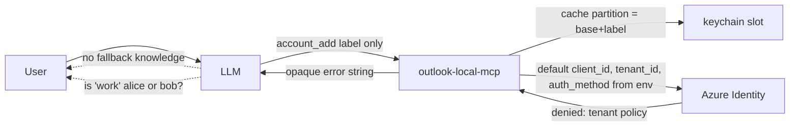
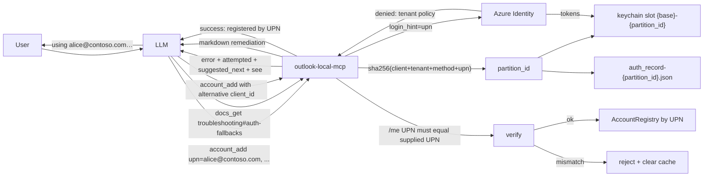

# Per-Account Auth Parameters With Environment Defaults

## Change Summary

The current account model (CR-0056) keys every surface — registry, tool parameters, persistence, keychain partition — on a caller-chosen `label`. Labels are vague (`work`, `default`), tell the user nothing about *which Microsoft identity* a tool call is using, and force a single keychain partition per label even when the underlying OAuth tuple changes. This CR promotes **UPN** to the canonical primary identifier across every account-aware surface, demotes `label` to an optional friendly-name metadata field, and replaces the label-suffixed cache partition naming with a deterministic content-addressable partition: `sha256(client_id ‖ tenant_id ‖ auth_method ‖ upn)`. It also completes the per-call identity tuple by making `upn`, `client_id`, `tenant_id`, and `auth_method` first-class parameters on `account_add` with environment-variable defaults, and wires the failure path to a recovery matrix and to the troubleshooting documentation surface introduced by CR-0061. **Token-level backwards compatibility is not preserved** — existing users will re-authenticate — but a `schema_version` field on `accounts.json` enables a **friendly auto-migration of account metadata**: on first run after upgrade, the server detects the legacy schema, copies each entry's identity tuple into the new UPN-keyed object, marks every migrated entry `needs_reauth: true`, and surfaces a clear list to the user/LLM so re-authentication is a single guided step per account rather than a from-scratch rebuild.

## Motivation and Background

CR-0056 made UPN the *display* identity but left `label` as the runtime primary key. This produces three concrete problems:

1. **Identity ambiguity at the call site.** When the LLM picks an account or asks the user to confirm one, "use account `work`" is materially less clear than "use account `alice@contoso.com`". The label is a nickname; the UPN is the thing the user recognises in a Microsoft sign-in screen.
2. **Restrictive enterprise tenants.** Conditional Access and Application Restriction policies routinely deny first-party client IDs (`outlook-desktop`, `outlook-web`, etc.) tenant-wide, or block specific auth methods. The user must override `client_id` and/or `auth_method` per account. Today they have to set environment variables and restart; the LLM has no in-band recovery path and no curated knowledge of which alternatives to try.
3. **Cache-partition collisions across tuples.** With the partition named `{base}-{label}`, two attempts to authenticate the same UPN under different client IDs (because the first one was rejected) write into the same keychain slot, contaminating each other's tokens. A label-keyed cache cannot represent the natural fact that `(client_id, tenant_id, auth_method, upn)` is the unique cache key.

CR-0061 (proposed) introduces an in-server documentation surface and an error-to-doc `see` hint mechanism. This CR builds on that foundation: `account_add` failures emit `see=doc://outlook-local-mcp/troubleshooting#auth-fallbacks` so the LLM fetches authoritative remediation text and proposes the next combination to try, instead of dead-ending.

## Change Drivers

* User feedback from enterprise testers: "the default client ID is blocked in our tenant" with no in-band recovery path.
* Operator feedback: labels do not communicate which Microsoft identity is in use; UPN does.
* `WellKnownClientIDs` (`internal/config/clientids.go`) already enumerates viable first-party client IDs to suggest as alternatives; we just need to expose this knowledge to the LLM at the right moment.
* CR-0056's UPN resolution from `/me` is already implemented and reliable, making UPN-as-primary a small step rather than a new feature.
* CR-0061 establishes the documentation surface this CR depends on for self-troubleshooting.
* Anthropic Software Directory review favours servers that recover gracefully from configuration mismatches.

## Current State

* `AccountRegistry` is keyed by `label` (`internal/auth/registry.go`); UPN is a secondary lookup via `GetByUPN`.
* `AccountConfig` (`internal/auth/accounts.go`) treats `Label` as the primary JSON key; `UPN` is a backfilled metadata field.
* Cache partition name is `{cfg.CacheName}-{label}`; per-account auth record file is `auth_record-{label}.json`.
* `account_add` requires `label`, accepts optional `client_id`/`tenant_id`/`auth_method`. There is no `upn` parameter — the UPN is discovered after authentication via `/me` and persisted as metadata.
* `account_login`, `account_refresh`, `account_logout`, `account_remove` and the universal `account` parameter on tool calls accept either label or UPN (CR-0056 dual lookup); operators in practice have to remember both.
* `setupBrowserCredential` and `setupDeviceCodeCredential` (`internal/auth/auth.go:256-302`) construct credentials without setting `LoginHint`.
* On auth failure, the tool returns an opaque error string with no suggestion for an alternative `client_id` or `auth_method`.
* No `OUTLOOK_MCP_DEFAULT_UPN` environment variable exists; there is no env-level default UPN.
* The tool description tells the LLM "Leave auth_method blank unless the user explicitly requests a specific method" — correct as a default policy, but it does not tell the LLM what to do when the default *does* fail.

### Current State Diagram



## Proposed Change

Five coordinated changes:

1. **UPN becomes the primary account identifier.** Every account-aware surface (`AccountRegistry`, `AccountConfig`, the `account` parameter on tool calls, `account_login` / `account_refresh` / `account_logout` / `account_remove`, audit log keys, status output, elicitation prompts) keys on UPN. `label` becomes an optional friendly-name metadata field used only for human display alongside the UPN.
2. **`upn` becomes a required parameter on `account_add`.** It is supplied by the caller (or sourced from `OUTLOOK_MCP_DEFAULT_UPN`), forwarded to Azure Identity as `LoginHint` (browser, device code) or `login_hint` query parameter (auth code), and used to derive the cache partition before authentication runs. After authentication, `/me` is consulted; if its UPN does not equal the supplied UPN (case-insensitive), authentication is rejected, the cache partition is cleared, and an error is returned. The supplied UPN is canonical.
3. **Cache partition is content-addressable.** The keychain partition name and per-account auth record filename derive from `partition_id = hex(sha256(canonical_input))[:16]` where `canonical_input = client_id ‖ "\x00" ‖ tenant_id ‖ "\x00" ‖ auth_method ‖ "\x00" ‖ lowercase(upn)`. The keychain partition becomes `{cfg.CacheName}-{partition_id}`; the auth record file becomes `auth_record-{partition_id}.json`. Different OAuth tuples for the same UPN yield different partitions automatically.
4. **Full identity tuple with environment defaults at call time.** `account_add` accepts `upn`, `client_id`, `tenant_id`, `auth_method`, and optional `label`. Each non-label field defaults to its environment value (`OUTLOOK_MCP_DEFAULT_UPN`, `OUTLOOK_MCP_CLIENT_ID`, `OUTLOOK_MCP_TENANT_ID`, `OUTLOOK_MCP_AUTH_METHOD`). Precedence: call-time argument > environment default > error (for `upn`) or omit (for `label`).
5. **LLM-facing fallback guidance.** The tool description states the precedence rule explicitly and points the LLM at a curated recovery matrix. On authentication failure, the structured error envelope returned by the handler includes `attempted={client_id, tenant_id, auth_method, upn}`, a `suggested_next` array of up to three alternative tuples ranked by likelihood of success, and `see="doc://outlook-local-mcp/troubleshooting#auth-fallbacks"`. A new `account_login_options` read-only tool returns the recovery matrix on demand.

**Token state is not preserved**, but **account metadata is auto-migrated** with a `schema_version` field. The new schema is `schema_version: 2` (the legacy array form is implicit `1`). On startup, the server inspects `schema_version`:

* **`schema_version` absent or `1` (legacy CR-0056 array form):** the server reads each legacy entry, copies the identity tuple (`upn`, `client_id`, `tenant_id`, `auth_method`, optional `label`) into the new UPN-keyed object, computes the new `partition_id` for each, sets `needs_reauth: true` on every migrated entry, atomically writes the new v2 file, and renames the legacy file to `accounts.json.v1.bak` for safety. Entries that lack a UPN (pre-CR-0056 records) cannot be migrated and are listed in the warning log with instructions to re-add manually.
* **`schema_version: 2`:** loaded normally.
* **`schema_version` ≥ 3 (forward):** server logs an error and refuses to load the file (downgrade is unsupported).

Migrated entries are restored into the registry with `Authenticated=false`. The existing auth middleware already handles deferred re-authentication on first tool call, and the new `account_list` / `status` surfaces include a `pending_reauth` section so the LLM can proactively offer to re-authenticate each account. Tokens cached under the legacy `{base}-{label}` keychain partition are unreachable under the new partition naming; they remain in the OS keychain as orphans until the user removes them manually (documented in troubleshooting).

### Proposed State Diagram



## Requirements

### Functional Requirements

#### Identity model

1. The `AccountRegistry` **MUST** be keyed by UPN (canonical lowercase). All `Get`/`Update`/`Remove` operations take a UPN. The legacy `GetByUPN` method is removed; `Get` performs UPN lookup directly.
2. `AccountEntry` **MUST** carry `UPN` as a required field and `Label` as an optional field. Two entries **MUST NOT** share the same UPN; `Add` returns an error on duplicate UPN. Two entries MAY share the same `Label` (it is decorative).
3. `AccountConfig` (`accounts.json`) **MUST** be persisted as a JSON object keyed by UPN: `{"accounts": {"alice@contoso.com": {client_id, tenant_id, auth_method, label?}}}`. The legacy `[{label, ...}]` array form is unsupported.
4. Every account-aware MCP tool's `account` parameter **MUST** accept a UPN value only. Label-based lookup is removed. Invalid UPN values produce a tool error listing the registered UPNs.
5. `account_login`, `account_refresh`, `account_logout`, and `account_remove` **MUST** rename their primary identifier parameter from `label` to `upn` (required). The tools' descriptions are updated accordingly.
6. The audit log entry for every account-aware tool call **MUST** record the resolved UPN as the account identifier and **MUST NOT** record `label` as the identifier (label may appear as a separate metadata field).
7. Display surfaces (status output, elicitation prompts, confirmation messages, error envelopes) **MUST** show the UPN prominently and the label parenthetically when present: `alice@contoso.com (work)` or `alice@contoso.com` if no label. UPN appears first; label is decoration.

#### Cache partition

8. The cache partition identifier **MUST** be computed as `partition_id = lowercase(hex(sha256(canonical_input)))[:16]` where `canonical_input = client_id ‖ NUL ‖ tenant_id ‖ NUL ‖ auth_method ‖ NUL ‖ lowercase(upn)` and `NUL` is the byte `0x00`. The truncation to 16 hex characters (64 bits) is sufficient for collision resistance over the expected account count and keeps partition names readable.
9. The keychain partition name **MUST** be `{cfg.CacheName}-{partition_id}`. The per-account auth record file path **MUST** be `{authRecordDir}/auth_record-{partition_id}.json`.
10. The partition computation **MUST** live in a single helper (`internal/auth/partition.go`) and **MUST** be unit-tested for stability across releases. A change to the canonical-input format is a breaking change and requires its own CR.
11. `accounts.json` **MUST** persist the `partition_id` alongside the tuple, both for diagnostics and so that `account_remove` can clear the correct keychain slot without recomputing.

#### `account_add` parameters and behaviour

12. `account_add` **MUST** accept the following parameters:
    * `upn` (string, required when `OUTLOOK_MCP_DEFAULT_UPN` is unset; otherwise optional and defaults to the env value).
    * `client_id` (string, optional; defaults to `cfg.ClientID`).
    * `tenant_id` (string, optional; defaults to `cfg.TenantID`).
    * `auth_method` (string, optional; defaults to `cfg.AuthMethod`; one of `browser`, `device_code`, `auth_code`).
    * `label` (string, optional; max 64 chars; pattern `^[a-zA-Z0-9_ -]{1,64}$` to allow human-friendly names like `Work — Tenant A`).
13. The supplied `upn` **MUST** be validated as a structurally valid email-shaped UPN (single `@`, non-empty local part, non-empty domain, length ≤ 320) and lowercased before any downstream use. Invalid input returns a tool error before any credential is constructed.
14. The supplied `upn` **MUST** be passed to Azure Identity as `LoginHint` for `InteractiveBrowserCredentialOptions` and `DeviceCodeCredentialOptions`, and as the `login_hint` query parameter for the `auth_code` authorization URL.
15. After interactive authentication completes, `account_add` **MUST** call Microsoft Graph `/me` and compare the returned UPN (case-insensitive) to the supplied UPN. On match, the supplied (lowercased) UPN is canonical. On mismatch, the handler **MUST**:
    * Delete the keychain partition and auth record file just written.
    * Return a structured error envelope reporting both UPNs and instructing the user to retry with the correct value.
    * Not register the account in the registry.
16. The precedence rule **MUST** be: call-time argument > environment default > omit. Each of `upn`, `client_id`, `tenant_id`, `auth_method` follows this rule independently. `label` has no environment default.
17. A new environment variable `OUTLOOK_MCP_DEFAULT_UPN` **MUST** be supported by `LoadConfig`, populating `Config.DefaultUPN`. When unset, `upn` is a required parameter on `account_add` and the omission produces a tool error.
18. When `OUTLOOK_MCP_DEFAULT_UPN` is set to an invalid UPN, `LoadConfig` **MUST** log a warning and treat the value as unset (not crash).

#### LLM-facing recovery

19. The `account_add` tool description **MUST** include:
    * The precedence rule stated above.
    * A directive to the LLM to use defaults unless the user has explicitly asked to override or a prior attempt has failed.
    * A pointer to `docs_get` (CR-0061) for the `troubleshooting#auth-fallbacks` section before proposing fallbacks to the user.
    * A statement that `account_login_options` returns the curated recovery matrix on demand.
    * The description **MUST** stay under 2 KB (CR-0051 token discipline). Long-form fallback guidance lives in the troubleshooting doc.
20. On any authentication failure (initial credential rejection, tenant policy denial, UPN mismatch on `/me`), the `account_add` error result **MUST** be a structured envelope containing:
    * `error`: the underlying error message.
    * `attempted`: `{client_id, tenant_id, auth_method, upn}` echoing the resolved inputs.
    * `suggested_next`: an array of up to three alternative tuples (`{client_id, auth_method, reason}`) ranked by likelihood of success, drawn from the recovery matrix.
    * `see`: `"doc://outlook-local-mcp/troubleshooting#auth-fallbacks"` (CR-0061).
21. A new MCP tool `account_login_options` **MUST** be added. It is read-only, takes no required parameters, accepts the standard `output` parameter (`text` default, `summary`, `raw` per CR-0051), and returns the recovery matrix: every well-known `client_id` (with friendly name and UUID), the `auth_method` values it supports, and a one-line note on when to choose it.
22. The recovery matrix **MUST** live in a single source of truth (`internal/config/recovery_matrix.go`) shared between the `account_add` failure envelope, the tool description rendering, and `account_login_options`.

#### Schema versioning and migration

23. The new `accounts.json` schema **MUST** include a top-level integer field `schema_version` set to `2`. The legacy CR-0056 array form is treated as implicit `schema_version: 1`.
24. `LoadAccounts` **MUST** dispatch on `schema_version`:
    * **Absent or `1`:** invoke the legacy migrator (FR-25).
    * **`2`:** parse the UPN-keyed object form and return.
    * **`≥ 3`:** return an error; the server logs an `error`-level message and starts with zero registered accounts (downgrade is not supported).
25. The legacy migrator **MUST**:
    * Read every entry from the legacy array.
    * For each entry with a non-empty `upn` field, copy the identity tuple (`upn`, `client_id`, `tenant_id`, `auth_method`, `label?`) into a new v2 entry, compute its `partition_id`, and set `needs_reauth: true`.
    * For each entry with an empty `upn` (pre-CR-0056 records), emit a `warn`-level log line listing the legacy `label` and instructing the user to re-add via `account_add`. Skip the entry.
    * Atomically write the v2 file using the existing temp-file-and-rename pattern.
    * Rename the legacy file to `accounts.json.v1.bak` (only after the v2 file is durably written). If the rename fails, leave the original file untouched and log the error.
    * Emit a `info`-level summary log line listing migrated UPNs and skipped legacy labels.
26. `AccountConfig` **MUST** carry an optional `needs_reauth` boolean field (`omitempty`). When `true`, `RestoreAccounts` registers the entry with `Authenticated=false` and skips silent token acquisition. The auth middleware's existing deferred re-auth path handles the first tool call as today.
27. `account_add` **MUST** clear `needs_reauth` when it successfully (re-)authenticates an entry whose UPN is already present from migration. In that case, the existing entry is replaced (its `partition_id` recomputed from the new tuple if any of the four inputs has changed), no duplicate-UPN error is raised, and the legacy partition is left as an orphan in the keychain (documented).
28. The `status` tool output **MUST** include a `pending_reauth` array listing the UPNs of all registered accounts whose `needs_reauth` flag is true.
29. The `account_list` tool **MUST** mark each entry's authentication state in text/summary/raw output, distinguishing fresh, authenticated, and `needs_reauth` (migrated, awaiting first interactive auth).
30. Tokens cached under legacy partition names (`{base}-{label}`) **MUST NOT** be accessed by the new partition logic. They become orphaned. The troubleshooting document explains how to clear them manually via OS keychain tools.
31. Conventions still apply: tool naming (CR-0050), full annotation set (CR-0052), tier defaults (CR-0051), `extension/manifest.json` registration, `docs/prompts/mcp-tool-crud-test.md` coverage.

### Non-Functional Requirements

1. The `partition_id` computation **MUST** be deterministic and stable across processes, platforms, and Go versions. A test (`TestPartitionID_GoldenValues`) pins ≥ 5 known-good `(client_id, tenant_id, auth_method, upn)` → `partition_id` mappings.
2. The `partition_id` truncation length **MUST** be a single named constant (`PartitionIDHexLen = 16`). Changing it is a breaking change.
3. The recovery matrix **MUST** be unit-tested and lint-checked: every entry's `client_id` must resolve via `WellKnownClientIDs` or be a UUID, and every `auth_method` must be one of `browser`, `device_code`, `auth_code`.
4. UPN validation **MUST** be a single helper (`internal/auth/upn.go`) shared by config loading and the `account_add` handler.
5. The `account_add` failure envelope's `attempted.upn` **MUST** be redacted in the audit log using the existing PII masking rules (`internal/logging`), even though the envelope itself shows the UPN to the LLM (which already has it from the call site).

## Affected Components

* `internal/config/config.go` — add `DefaultUPN` field, wire `OUTLOOK_MCP_DEFAULT_UPN`.
* `internal/config/recovery_matrix.go` (new) — single source of truth for fallback combinations.
* `internal/auth/partition.go` (new) — `PartitionID(clientID, tenantID, authMethod, upn) string`.
* `internal/auth/upn.go` (new) — `ValidateUPN`, `NormalizeUPN`.
* `internal/auth/registry.go` — re-key by UPN; `Add` enforces UPN uniqueness; `Get`/`Update`/`Remove` take UPN; `GetByUPN` removed; `Labels()` removed; new `UPNs()` helper; `AccountEntry.Label` becomes optional.
* `internal/auth/accounts.go` — schema change to UPN-keyed object; `schema_version` dispatch on load; `AddAccountConfig`/`RemoveAccountConfig`/`UpdateAccountConfig` take UPN; `AccountConfig` gains `needs_reauth` field.
* `internal/auth/migrate.go` (new) — `MigrateLegacyAccounts(raw []byte) (v2File, []SkippedEntry, error)`; pure function for unit-testability; called from `LoadAccounts` when legacy schema is detected.
* `internal/auth/restore.go` — restoration uses `partition_id` from the persisted entry; entries with `needs_reauth=true` are registered with `Authenticated=false` and skip silent token acquisition; `account_add` re-auth path clears the flag.
* `internal/auth/auth.go` — `setupBrowserCredential`/`setupDeviceCodeCredential` accept and forward `LoginHint`; cache name and auth record path derive from `partition_id`.
* `internal/auth/authcode.go` — `AuthCodeURL` includes `login_hint` when provided.
* `internal/auth/account_resolver.go` — resolves on UPN; elicitation prompts show UPN-first display.
* `internal/tools/add_account.go` — new parameter shape, UPN validation, login-hint plumbing, `/me` UPN match enforcement, structured failure envelope, `suggested_next` ranking.
* `internal/tools/login_account.go`, `refresh_account.go`, `logout_account.go`, `remove_account.go` — rename `label` parameter to `upn`, adjust descriptions and lookups.
* `internal/tools/list_accounts.go` — display UPN-first with optional label; mark `needs_reauth` entries.
* `internal/tools/status.go` — add `pending_reauth` UPN list and `accounts_schema_version` field.
* `internal/tools/account_login_options.go` (new) — read-only tool exposing the recovery matrix.
* `internal/tools/text_format.go` — add `FormatRecoveryMatrix`, `FormatAccountIdentity` (UPN+label), `FormatAddAccountFailure`.
* `internal/tools/tool_annotations_test.go` — annotation coverage for the new tool.
* `internal/server/server.go` — register `account_login_options`; update wrap/audit middleware bindings.
* `extension/manifest.json` — register `account_login_options`; update parameter shapes for renamed fields.
* `docs/troubleshooting.md` (per CR-0061) — gain `## Auth fallbacks` section and `## Migrating from label-primary accounts` note.
* `docs/prompts/mcp-tool-crud-test.md` — add CRUD-style steps covering `upn` parameter, `/me` mismatch path, label-as-metadata behaviour, failure envelope, and `account_login_options`.
* `CHANGELOG.md` — entry flagging the breaking change with migration instructions.

## Scope Boundaries

### In Scope

* UPN-primary identity model across registry, persistence, tool parameters, audit, display.
* Content-addressable cache partition derived from `sha256(client_id|tenant_id|auth_method|upn)`.
* `account_add` accepting the full identity tuple with environment-variable defaults.
* `OUTLOOK_MCP_DEFAULT_UPN` environment variable.
* Structured failure envelope with `attempted`, `suggested_next`, and `see`.
* `account_login_options` read-only tool exposing the recovery matrix.
* Tool description rewrite stating the precedence rule and pointing the LLM at fallback recovery.
* Recovery matrix as a single source of truth.
* Renaming `label` → `upn` on `account_login`, `account_refresh`, `account_logout`, `account_remove`.
* `schema_version` field on `accounts.json` and an auto-migrator that copies legacy metadata into the v2 schema, marks each migrated entry `needs_reauth: true`, and renames the legacy file to `accounts.json.v1.bak`.
* `pending_reauth` surfaces on `status` and `account_list` so the LLM can guide the user through migration.

### Out of Scope ("Here, But Not Further")

* Auto-migrating legacy keychain partitions — explicitly excluded; legacy partitions remain orphaned and are user-cleanable. Account *metadata* is auto-migrated; account *tokens* are not.
* Forward-migration from `schema_version: 2` to a future `3` — that becomes its own CR when needed.
* Preserving silent-auth ability for migrated accounts — every migrated entry deliberately requires fresh interactive auth because the cache partition has changed.
* Cross-account search (e.g., merge identical UPNs across tenants) — each `(upn, tenant_id)` row remains distinct in `accounts.json` if duplicates ever arise; the unique-UPN registry constraint applies to the in-memory model only and is enforced by the registry.
* Adding per-account auth-method selection to `account_login` / `account_refresh` — those operate on already-registered accounts whose tuple is fixed at add-time. To change the tuple, remove and re-add.
* New OAuth flows (managed identity, certificate, client credentials) — only the existing three (`browser`, `device_code`, `auth_code`) are in scope.
* Tenant discovery / suggestion heuristics — the user supplies the tenant; the server does not probe.
* UI elicitation for collecting the alternative tuple from the user — the LLM proposes alternatives conversationally and re-invokes `account_add`; no new elicitation primitive is added.
* Authoring the troubleshooting document itself — that is CR-0061's deliverable; this CR contributes the `## Auth fallbacks` and `## Migrating from label-primary accounts` section content.

## Alternative Approaches Considered

* **Keep label as primary, add UPN-only display polish.** Rejected: does not solve cache-partition collisions across tuples, does not fix the identity-ambiguity problem at the call site, and leaves the LLM with two interchangeable lookup keys.
* **Hard-reject legacy `accounts.json` and require manual re-add.** Rejected in favour of metadata auto-migration: the legacy schema already contains the full identity tuple (CR-0056 persists `client_id`, `tenant_id`, `auth_method`, `upn`), so the new `partition_id` can be computed deterministically. Migrating metadata is safe (no secrets are moved), eliminates "what was my client_id again?" friction, and lets the LLM proactively walk the user through re-auth using the `pending_reauth` surface. Tokens are not migrated because the partition's keying material differs.
* **Migrate tokens by re-encrypting under the new partition.** Rejected: requires reading every cached refresh token, decrypting under the legacy partition's keying material, re-encrypting under the new partition, and writing it back — a complex, security-sensitive operation that can subtly fail per platform (CGO vs. nocgo, Keychain vs. libsecret vs. Credential Manager vs. file backend). Re-auth is one user click and is far safer.
* **Use a string `schema_version` (`"2.0"`).** Rejected in favour of an integer: an integer compares cleanly, sorts correctly, and avoids the SemVer-vs.-string ambiguity. The schema is server-internal; minor/patch versioning is overkill.
* **Use a UUID for partition_id instead of a content hash.** Rejected: a UUID is not deterministic, so the same `(client_id, tenant_id, auth_method, upn)` tuple would produce different cache partitions on each `account_add`, leaking orphan partitions on every retry. A content hash is naturally idempotent.
* **Use the full SHA-256 hex digest (64 chars) for partition_id.** Rejected: the keychain partition becomes harder to inspect manually and the auth record filename gets unwieldy. 16 hex chars (64 bits) gives collision probability ≪ 10⁻¹² over any realistic account count.
* **Auto-retry inside the server with the next combination on failure.** Rejected: authentication is interactive — silent retries open multiple browser windows or device codes and confuse the user. Recovery must be LLM-mediated and user-visible.

## Impact Assessment

### User Impact

Users see the actual Microsoft identity in every confirmation, status line, and error message. Enterprise users on restrictive tenants gain a path to authenticate without restarting the server or editing environment variables. Failed authentications produce actionable, ranked next-step suggestions. **Existing users see a one-time guided re-auth**: their account *list* is preserved across the upgrade (auto-migrated from legacy metadata), but every entry is flagged `needs_reauth`. The status tool exposes the pending list, the LLM can offer to walk through each one, and the actual re-authentication is a single `account_login`-style flow per account. Pre-CR-0056 entries that lack a UPN are the only ones that require manual `account_add`; they are listed explicitly in the migration log.

### Technical Impact

One new tool (`account_login_options`), three new internal packages/files (`partition.go`, `upn.go`, `recovery_matrix.go`), one new env var (`OUTLOOK_MCP_DEFAULT_UPN`). Tool count rises from 32/35 (depending on CR-0061 status) to 33/36. Registry, accounts file, and several tool handlers are rewritten for the new identity model. No transition shim — strictly cleaner, smaller code surface afterwards.

### Business Impact

Removes the "first-party client ID is blocked" objection raised by enterprise evaluators. Eliminates the "which account is this?" confusion that label-only display caused. Strengthens Software Directory positioning by demonstrating graceful failure recovery and clear identity surfaces. The one-time re-auth is a reasonable cost for a model that is materially clearer afterwards.

## Implementation Approach

Implement in three phases. Phases 1 and 2 land together (both touch the registry and persistence schema and would conflict if shipped separately). Phase 3 may follow.

### Implementation Flow

```mermaid
flowchart LR
    subgraph P1[Phase 1: Identity model]
        A1[partition.go + upn.go] --> A2[registry keyed by UPN]
        A2 --> A3[accounts.json v2 schema with schema_version]
        A3 --> A4[legacy migrator + needs_reauth flag]
        A4 --> A5[pending_reauth surfaces on status, account_list]
    end
    subgraph P2[Phase 2: account_add tuple + env defaults]
        B1[Config.DefaultUPN + env var] --> B2[upn param + LoginHint plumbing]
        B2 --> B3[/me UPN match enforcement]
        B3 --> B4[label/upn param rename across account_*]
    end
    subgraph P3[Phase 3: Recovery matrix and failure envelope]
        C1[recovery_matrix.go] --> C2[account_login_options tool]
        C2 --> C3[structured failure envelope with see URI]
        C3 --> C4[tool description rewrite]
    end
    P1 --> P2 --> P3
```

## Test Strategy

### Tests to Add

| Test File | Test Name | Description | Inputs | Expected Output |
|-----------|-----------|-------------|--------|-----------------|
| `internal/auth/partition_test.go` | `TestPartitionID_GoldenValues` | Pin ≥ 5 known-good tuples to expected partition_ids | curated tuples | Match golden values |
| `internal/auth/partition_test.go` | `TestPartitionID_StableAcrossCases` | UPN case differences produce the same partition_id | `Alice@…` vs `alice@…` | Same partition_id |
| `internal/auth/partition_test.go` | `TestPartitionID_DifferentForEachField` | Changing any of the four inputs changes the partition_id | mutate each field | All four mutations differ |
| `internal/auth/upn_test.go` | `TestValidateUPN_Valid` / `_Invalid` | Structural email validation | various | Pass/fail as expected |
| `internal/config/config_test.go` | `TestLoadConfig_DefaultUPN_Set` | Env var populates `DefaultUPN` | `OUTLOOK_MCP_DEFAULT_UPN=alice@…` | Field populated |
| `internal/config/config_test.go` | `TestLoadConfig_DefaultUPN_Invalid` | Invalid value logs warning, leaves field empty | `OUTLOOK_MCP_DEFAULT_UPN=junk` | Empty + warning |
| `internal/config/recovery_matrix_test.go` | `TestRecoveryMatrix_AllClientIDsResolve` | Every entry resolves via `WellKnownClientIDs` or is a UUID | — | All resolve |
| `internal/config/recovery_matrix_test.go` | `TestRecoveryMatrix_AuthMethodsValid` | Every entry uses an allowed method | — | All in `{browser, device_code, auth_code}` |
| `internal/auth/registry_test.go` | `TestRegistry_KeyedByUPN` | `Add` rejects duplicate UPN | two adds | Second errors |
| `internal/auth/registry_test.go` | `TestRegistry_LabelDoesNotConstrainUniqueness` | Two entries may share a label | two adds same label, different UPN | Both succeed |
| `internal/auth/registry_test.go` | `TestRegistry_GetUsesUPN` | `Get(upn)` returns the entry | — | Match |
| `internal/auth/accounts_test.go` | `TestAccountsFile_RoundTrip_UPNKeyed` | Save then load round-trips UPN-keyed object including `schema_version: 2` | — | Identical |
| `internal/auth/accounts_test.go` | `TestAccountsFile_SchemaVersionFutureRejected` | `schema_version: 3` returns error | future JSON | Error logged, no entries loaded |
| `internal/auth/migrate_test.go` | `TestMigrate_LegacyArray_HappyPath` | Legacy array with full UPN tuples migrates to v2 with `needs_reauth=true` | legacy JSON | v2 file, all entries flagged |
| `internal/auth/migrate_test.go` | `TestMigrate_LegacyArray_SkipsEmptyUPN` | Pre-CR-0056 entries without UPN are skipped with warning | legacy JSON missing upn fields | Skipped list populated, no v2 entry |
| `internal/auth/migrate_test.go` | `TestMigrate_PartitionIDComputed` | Migrator computes new partition_id from each tuple | curated tuple | partition_id matches `PartitionID(...)` |
| `internal/auth/migrate_test.go` | `TestMigrate_BackupRenameOnSuccess` | Legacy file is renamed to `accounts.json.v1.bak` only after v2 write | — | Backup exists, original gone |
| `internal/auth/migrate_test.go` | `TestMigrate_BackupNotRenamedIfWriteFails` | Failed v2 write leaves legacy file in place | injected write error | Original untouched, no backup |
| `internal/auth/migrate_test.go` | `TestMigrate_Idempotent` | Running migrator twice on already-migrated v2 file is a no-op | v2 JSON | No file changes |
| `internal/auth/restore_test.go` | `TestRestore_NeedsReauthSkipsSilentAuth` | Migrated entries with `needs_reauth=true` register with `Authenticated=false` and skip silent auth | — | No GetToken call, entry registered |
| `internal/tools/add_account_test.go` | `TestAddAccount_ClearsNeedsReauthOnSuccess` | Authenticating a migrated account flips `needs_reauth=false` and replaces the entry | pre-existing migrated entry | Flag cleared, entry replaced |
| `internal/tools/status_test.go` | `TestStatus_PendingReauthListed` | `status` output includes UPNs whose `needs_reauth` is true | two migrated, one fresh | Two UPNs listed |
| `internal/tools/status_test.go` | `TestStatus_AccountsSchemaVersion` | `status` reports `accounts_schema_version: 2` | — | Field present |
| `internal/tools/list_accounts_test.go` | `TestListAccounts_MarksNeedsReauth` | Text output marks migrated entries pending re-auth | — | "needs re-auth" indicator |
| `internal/auth/auth_test.go` | `TestSetupBrowserCredential_LoginHint` | LoginHint passed to options | `upn=alice@…` | Options carry LoginHint |
| `internal/auth/auth_test.go` | `TestSetupDeviceCodeCredential_LoginHint` | LoginHint passed to options | `upn=alice@…` | Options carry LoginHint |
| `internal/auth/authcode_test.go` | `TestAuthCodeURL_LoginHintQueryParam` | URL contains login_hint | `upn=alice@…` | URL has `login_hint=alice%40…` |
| `internal/tools/add_account_test.go` | `TestAddAccount_UPNRequiredWhenNoEnvDefault` | Missing upn errors when env unset | `upn=""`, `cfg.DefaultUPN=""` | Tool error |
| `internal/tools/add_account_test.go` | `TestAddAccount_UPNFromEnvDefault` | `cfg.DefaultUPN` is used when call-time omitted | `upn=""`, `cfg.DefaultUPN=alice@…` | LoginHint=alice@… |
| `internal/tools/add_account_test.go` | `TestAddAccount_CallTimeUPNOverridesEnv` | Call-time wins | both set | LoginHint=call-time value |
| `internal/tools/add_account_test.go` | `TestAddAccount_InvalidUPNRejected` | Invalid UPN errors pre-credential | `upn=junk` | Tool error, no credential |
| `internal/tools/add_account_test.go` | `TestAddAccount_MeUPNMismatch_RejectsAndCleansCache` | `/me` UPN ≠ supplied UPN deletes cache, errors | mismatch | Cache deleted, registry empty, error envelope |
| `internal/tools/add_account_test.go` | `TestAddAccount_LabelOptional_AccountStillRegistered` | Account registers with no label | label omitted | Entry has empty Label |
| `internal/tools/add_account_test.go` | `TestAddAccount_FailureEnvelope_Shape` | Envelope carries attempted, suggested_next, see | forced failure | All four fields present |
| `internal/tools/add_account_test.go` | `TestAddAccount_FailureEnvelope_SeeURI` | `see` matches CR-0061 slug | forced failure | `see=="doc://outlook-local-mcp/troubleshooting#auth-fallbacks"` |
| `internal/tools/login_account_test.go` | `TestLoginAccount_UPNParameter` | Parameter renamed to `upn` | — | Resolves by UPN |
| `internal/tools/refresh_account_test.go` | `TestRefreshAccount_UPNParameter` | Parameter renamed to `upn` | — | Resolves by UPN |
| `internal/tools/logout_account_test.go` | `TestLogoutAccount_UPNParameter` | Parameter renamed to `upn` | — | Resolves by UPN |
| `internal/tools/remove_account_test.go` | `TestRemoveAccount_UPNParameter` | Parameter renamed to `upn`; clears partition by stored partition_id | — | Cache slot deleted |
| `internal/tools/list_accounts_test.go` | `TestListAccounts_DisplaysUPNFirst` | Text tier renders UPN with optional label suffix | — | `alice@… (work)` shape |
| `internal/tools/account_login_options_test.go` | `TestAccountLoginOptions_Text/Summary/Raw` | Three tiers | each | Correct shape per tier |
| `internal/tools/tool_annotations_test.go` | `TestAccountLoginOptionsAnnotations` | All five annotations present | — | Present |
| `internal/audit/audit_test.go` | `TestAudit_AccountToolsKeyByUPN` | Audit records UPN as identifier | — | UPN field, no label-as-id |

### Tests to Modify

| Test File | Test Name | Current Behavior | New Behavior | Reason for Change |
|-----------|-----------|------------------|--------------|-------------------|
| `internal/auth/registry_test.go` | All existing | Asserts label-as-key | Asserts UPN-as-key, label-as-metadata | Identity model change |
| `internal/auth/accounts_test.go` | All existing | Asserts array schema | Asserts UPN-keyed object schema | Persistence schema change |
| `internal/auth/account_resolver_test.go` | All existing | Resolves by label-or-UPN | Resolves by UPN only | Lookup unification |
| `internal/tools/*_account_test.go` | Parameter assertions | `label` parameter | `upn` parameter | Parameter rename |
| `internal/tools/tool_annotations_test.go` | `TestAllToolsHaveAnnotations` | Iterates current count | Iterates +1 for `account_login_options` | New tool |
| `internal/server/server_test.go` | `TestRegisterTools_CountsByMode` | Asserts current counts | Updates expected counts | New tool |

### Tests to Remove

| Test File | Test Name | Reason |
|-----------|-----------|--------|
| `internal/auth/registry_test.go` | `TestRegistry_GetByUPN_*` | `GetByUPN` is removed; `Get(upn)` is the only path |
| `internal/auth/account_resolver_test.go` | Tests asserting label fallback when UPN fails | Label is no longer a lookup key |

## Acceptance Criteria

### AC-1: UPN is the primary identifier across surfaces

```gherkin
Given an account is registered with upn "alice@contoso.com" and label "work"
When any account-aware tool surfaces the account in text or audit output
Then the UPN appears as the primary identifier
  And the label appears only as parenthetical decoration when present
  And the registry lookup, audit key, and `account` parameter all accept UPN exclusively
```

### AC-2: `account_add` accepts the full identity tuple with environment defaults

```gherkin
Given OUTLOOK_MCP_DEFAULT_UPN, OUTLOOK_MCP_CLIENT_ID, OUTLOOK_MCP_TENANT_ID, and OUTLOOK_MCP_AUTH_METHOD are set
When the LLM calls account_add with no parameters
Then authentication uses each environment default
  And LoginHint equals the env-configured UPN
  And the cache partition is sha256-derived from the resolved tuple
```

### AC-3: Call-time arguments override environment defaults

```gherkin
Given the server's environment defaults are set
When the LLM calls account_add with `upn="bob@contoso.com"`, `client_id="outlook-web"`, `auth_method="device_code"`
Then the credential is constructed for client_id "outlook-web"
  And device code flow is used
  And LoginHint equals "bob@contoso.com"
  And tenant_id is the env default
```

### AC-4: UPN is required when no env default is set

```gherkin
Given OUTLOOK_MCP_DEFAULT_UPN is unset
When the LLM calls account_add without `upn`
Then the tool returns an error stating that upn is required
  And no credential is constructed
```

### AC-5: `/me` UPN mismatch rejects authentication and cleans state

```gherkin
Given account_add is called with `upn="alice@contoso.com"`
And the post-auth /me endpoint returns "real-user@contoso.com"
When the handler validates the resolved UPN
Then the keychain partition for the supplied tuple is deleted
  And the auth record file is deleted
  And the account is not registered
  And the tool returns an error envelope reporting both the supplied and resolved UPNs
```

### AC-6: Cache partition is content-addressable

```gherkin
Given two account_add calls with identical (client_id, tenant_id, auth_method, upn) tuples
When the partition_id is computed for each
Then both calls compute the same partition_id
  And changing any one of the four inputs changes the partition_id
  And case-only differences in the UPN do not change the partition_id
```

### AC-7: Authentication failures emit a structured recovery envelope

```gherkin
Given account_add is invoked and the credential's authentication fails
When the handler returns its error result
Then the result body includes the original error message
  And it includes an `attempted` block with client_id, tenant_id, auth_method, upn
  And it includes a `suggested_next` array with at least one alternative tuple drawn from the recovery matrix
  And it includes `see="doc://outlook-local-mcp/troubleshooting#auth-fallbacks"`
```

### AC-8: Recovery matrix is exposed via account_login_options

```gherkin
Given the server is running
When the LLM calls account_login_options with `output="text"`
Then the response lists every well-known client_id with friendly name, supported auth methods, and a one-line note
  And the matrix is identical to the one used to populate `suggested_next` in failure envelopes
```

### AC-9: Tool description guides the LLM toward defaults and recovery

```gherkin
Given the account_add tool definition
When an MCP client retrieves the tool description
Then it states the precedence rule (call-time argument > environment default)
  And it instructs the LLM to leave parameters unset unless the user has explicitly overridden them or a prior attempt failed
  And it points the LLM at docs_get for "troubleshooting#auth-fallbacks" and at account_login_options before proposing alternatives
  And the description stays under 2 KB
```

### AC-10: Legacy `accounts.json` is auto-migrated with `needs_reauth` flagging

```gherkin
Given an `accounts.json` exists in the legacy CR-0056 array form
And every entry carries a non-empty UPN
When the server starts
Then the file is rewritten with `schema_version: 2` and a UPN-keyed object
  And every migrated entry has `needs_reauth: true`
  And every migrated entry has a freshly computed `partition_id`
  And the original file is renamed to `accounts.json.v1.bak`
  And the registry contains an entry per migrated account with `Authenticated=false`
  And the server starts successfully
```

### AC-11: Pre-CR-0056 entries without UPN are skipped with guidance

```gherkin
Given a legacy `accounts.json` contains an entry whose `upn` field is empty
When the migrator runs
Then a `warn`-level log line lists the entry's legacy `label` and instructs the user to re-add via account_add
  And no v2 entry is created for that label
  And other entries with valid UPNs migrate successfully
```

### AC-12: Forward-incompatible `schema_version` is refused

```gherkin
Given an `accounts.json` declares `schema_version: 3`
When the server starts
Then it logs an `error`-level message stating that the schema version is unsupported
  And no entries are loaded into the registry
  And the file is not modified
  And the server starts successfully with zero registered accounts
```

### AC-13: `pending_reauth` surfaces guide the user

```gherkin
Given the server has restored migrated accounts with `needs_reauth=true`
When the LLM calls the status tool
Then the response includes `pending_reauth` listing those UPNs
  And `accounts_schema_version` equals 2
  And the account_list tool marks each migrated entry as pending re-auth in text/summary/raw output
```

### AC-14: Re-authenticating a migrated account clears the flag

```gherkin
Given an account was migrated with `needs_reauth=true`
When `account_add` succeeds for the same UPN (with possibly updated tuple)
Then the entry is replaced in `accounts.json`
  And `needs_reauth` is no longer set
  And the registry entry is `Authenticated=true`
  And the legacy keychain partition is left untouched as an orphan
```

## Quality Standards Compliance

### Build & Compilation

- [ ] Code compiles/builds without errors
- [ ] No new compiler warnings introduced
- [ ] `make build` succeeds

### Linting & Code Style

- [ ] All linter checks pass with zero warnings/errors
- [ ] Code follows project coding conventions and style guides
- [ ] Any linter exceptions are documented with justification

### Test Execution

- [ ] All existing tests pass after implementation (with the modifications enumerated above)
- [ ] All new tests pass
- [ ] Test coverage meets project requirements for changed code

### Documentation

- [ ] `internal/auth/partition.go` documented with package doc and stability guarantee
- [ ] `internal/config/recovery_matrix.go` documented with per-entry rationale
- [ ] `account_add` tool description rewritten with precedence rule and fallback pointer
- [ ] `account_login_options` tool documented and registered
- [ ] `extension/manifest.json` updated for new tool and renamed parameters
- [ ] `docs/troubleshooting.md` (or its CR-0061 placeholder) gains `## Auth fallbacks`, `## Migrating from label-primary accounts`, and `## accounts.json schema_version` sections
- [ ] `docs/prompts/mcp-tool-crud-test.md` updated with `upn` parameter steps, `/me` mismatch path, label-as-metadata behaviour, failure-envelope assertions, and migrator/`needs_reauth` assertions
- [ ] `CHANGELOG.md` entry flags the breaking change, describes the metadata auto-migration, and explains the per-account re-auth requirement

### Code Review

- [ ] Changes submitted via pull request
- [ ] PR title follows Conventional Commits format with breaking-change marker (`feat(auth)!: UPN-primary identity and per-account auth tuple`)
- [ ] Code review completed and approved
- [ ] Changes squash-merged to maintain linear history

### Verification Commands

```bash
make build
make vet
make fmt-check
make lint
make test
make ci
```

## Risks and Mitigation

### Risk 1: Existing users surprised by forced re-authentication

**Likelihood:** high
**Impact:** low — the metadata auto-migrator preserves the account list; the user is guided through one re-auth per account by the LLM via `pending_reauth`.
**Mitigation:** `CHANGELOG.md`, the migration log line, the `pending_reauth` field on `status`, and the troubleshooting `## Migrating from label-primary accounts` section all surface the requirement clearly. The re-auth itself is a single LLM-driven flow per account.

### Risk 1b: Migrator corrupts `accounts.json`

**Likelihood:** low
**Impact:** high — losing the account list disrupts the user's workflow.
**Mitigation:** the migrator writes the v2 file via the existing atomic temp-file-and-rename pattern *before* renaming the legacy file, so a crash mid-migration leaves the legacy file recoverable. `TestMigrate_BackupNotRenamedIfWriteFails` asserts this. The `accounts.json.v1.bak` rename is the final step and is logged.

### Risk 2: `/me` UPN mismatch is mistaken by users for a server bug

**Likelihood:** medium
**Impact:** medium
**Mitigation:** the mismatch error envelope explicitly reports both the supplied UPN and the `/me`-resolved UPN, and instructs the user to retry with the resolved value. Tests cover the message wording.

### Risk 3: Recovery matrix drifts from `WellKnownClientIDs`

**Likelihood:** medium
**Impact:** low
**Mitigation:** `TestRecoveryMatrix_AllClientIDsResolve` ensures every matrix entry resolves via the existing well-known map or is a valid UUID, failing the build on drift.

### Risk 4: LLM over-eagerly overrides defaults instead of using them

**Likelihood:** medium
**Impact:** medium
**Mitigation:** the tool description states the precedence rule explicitly and instructs the LLM to omit parameters unless the user has overridden or a prior attempt has failed. The eval test suite (CR-0047) gains a check that, on a happy-path prompt with no override request, the LLM calls `account_add` with `upn` only (or no parameters at all if `OUTLOOK_MCP_DEFAULT_UPN` is set).

### Risk 5: Orphaned legacy keychain partitions accumulate

**Likelihood:** medium
**Impact:** low
**Mitigation:** the troubleshooting section documents how users can manually remove `{base}-{label}` slots via OS keychain tools. No automatic cleanup — touching keychain entries the server did not write is out of scope.

### Risk 6: Truncated SHA-256 collision

**Likelihood:** very low (≪ 10⁻¹² over realistic account counts)
**Impact:** medium if it ever happened (two accounts share a partition)
**Mitigation:** at registration time, if a different `(client_id, tenant_id, auth_method, upn)` tuple maps to a partition_id already present in `accounts.json`, return an error and refuse the add. The user can supply a different value or report the collision.

## Dependencies

* **Supersedes parts of CR-0056 (implemented).** The label-as-primary model from CR-0056 is replaced; UPN-as-primary is the new contract. The `/me` resolution from CR-0056 remains the source of UPN truth post-auth.
* **CR-0061 (proposed, not yet implemented)** provides the documentation surface and `see` URI hint mechanism this CR's failure envelope references. This CR can ship the failure envelope's `see` field as a forward-compatible literal even before CR-0061 lands; the URI simply does not resolve until CR-0061 is implemented.
* **CR-0050 (implemented)** establishes the `account_*` naming convention `account_login_options` follows.
* **CR-0051 (implemented)** establishes the text/summary/raw tiering `account_login_options` honours.
* **CR-0052 (implemented)** establishes the annotation matrix the new tool joins.

## Estimated Effort

* Phase 1 (partition.go + upn.go + registry rekey + accounts.json v2 schema + legacy migrator + needs_reauth surfaces): ~2.5 days.
* Phase 2 (Config.DefaultUPN + env var + upn param + LoginHint plumbing + /me match + label/upn rename across account_*): ~1.5 days.
* Phase 3 (recovery matrix + account_login_options + structured failure envelope + tool description rewrite + troubleshooting sections): ~1.5 days.
* **Total:** ~5.5 developer-days.

## Decision Outcome

Chosen approach: "UPN-primary identity, label as optional metadata, content-addressable cache partition, full identity tuple at call time with env defaults, structured failure envelope with see-URI to CR-0061", because it eliminates identity ambiguity at every surface, removes the cache-partition collision class entirely, gives the LLM a deterministic in-band fallback path, and reuses the existing well-known client ID registry rather than introducing parallel state. The breaking change is acceptable because the new contract is materially clearer and the migration cost is a single re-auth per account.

## Related Items

* Supersedes parts of CR-0056 (UPN-based account identity and lifecycle).
* Depends on CR-0061 (in-server documentation surface) for the `see` URI target and the human-readable troubleshooting prose. CR-0061 SHOULD land first; this CR is shippable beforehand with the `see` URI as a forward-compatible literal.
* Complements CR-0050 (tool naming) and CR-0052 (annotations) for the new `account_login_options` tool.
* Honours CR-0051 (response tiering) for `account_login_options`.
* Informs the auth-fallback content recommended in CR-0061's troubleshooting outline.

## More Information

### `partition_id` canonical computation

```text
canonical_input = client_id ‖ NUL ‖ tenant_id ‖ NUL ‖ auth_method ‖ NUL ‖ lowercase(upn)
partition_id    = lowercase(hex(sha256(canonical_input)))[:16]
```

* `client_id` is the resolved UUID (post-`ResolveClientID`), not the friendly name.
* `tenant_id` is the value as supplied or defaulted (`common`, `organizations`, a GUID, or a domain).
* `auth_method` is one of `browser`, `device_code`, `auth_code`.
* `upn` is RFC-5322-light-validated and lowercased.
* `NUL` is the byte `0x00`.

Pinned golden values (illustrative, finalised in implementation):

| client_id (UUID) | tenant_id | auth_method | upn | partition_id |
|------------------|-----------|-------------|-----|--------------|
| d3590ed6-52b3-4102-aeff-aad2292ab01c | common | browser | alice@contoso.com | (computed at impl time) |

Test `TestPartitionID_GoldenValues` pins these values; any change is a breaking change requiring its own CR.

### Initial recovery matrix entries (illustrative)

| Friendly name | Client ID (UUID) | Supported methods | When to choose |
|---------------|------------------|-------------------|----------------|
| `outlook-desktop` | `d3590ed6-…` | browser, device_code | Default; broadest tenant support for personal and small-business |
| `outlook-web` | `bc59ab01-…` | browser | When tenants restrict desktop client family but allow web |
| `m365-mobile` | `d3590ed6-…` | device_code | Headless or kiosk environments without a browser |
| `m365-desktop` | `0ec893e0-…` | browser | Some tenants allow M365 family but not Outlook family |
| `teams-desktop` | `1fec8e78-…` | browser, device_code | When neither Outlook nor M365 first-party IDs are allowed |
| custom UUID | (user-supplied) | browser, auth_code | Tenants that mandate a customer-registered app — supply via `client_id` |

The matrix MUST be reviewed each time `WellKnownClientIDs` changes, with a unit test enforcing the structural invariants.

### `accounts.json` schemas

**Legacy (CR-0056, treated as `schema_version: 1`):**

```json
{
  "accounts": [
    {
      "label": "work",
      "client_id": "d3590ed6-52b3-4102-aeff-aad2292ab01c",
      "tenant_id": "common",
      "auth_method": "browser",
      "upn": "alice@contoso.com"
    }
  ]
}
```

**New (`schema_version: 2`):**

```json
{
  "schema_version": 2,
  "accounts": {
    "alice@contoso.com": {
      "client_id": "d3590ed6-52b3-4102-aeff-aad2292ab01c",
      "tenant_id": "common",
      "auth_method": "browser",
      "label": "work",
      "partition_id": "a1b2c3d4e5f60718",
      "needs_reauth": true
    }
  }
}
```

A migrated v2 file is written verbatim to disk; subsequent successful `account_add` calls clear `needs_reauth` and may update `partition_id` if the underlying tuple changed.
