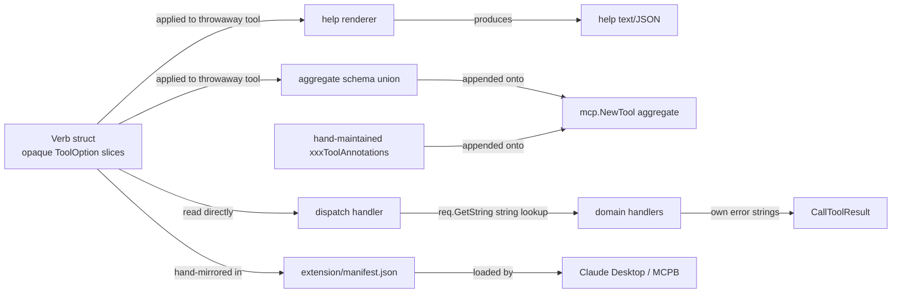

# Typed Verbs and Self-Describing Tool Registry

## Change Summary

CR-0060 reduced the MCP surface to four domain aggregate tools dispatched by a required `operation` verb, with a `help` verb per domain that introspects an opaque `[]mcp.ToolOption` slice via a throwaway `mcp.NewTool` to surface parameter metadata. The follow-up parameter-passthrough fix (`internal/tools/dispatch_aggregate_schema.go`) closed an immediate bug — clients were stripping every per-verb argument because the aggregate tool only declared `operation` — but it also exposed a structural problem: **schemas live as opaque function values, handlers re-parse arguments by string lookup, and three downstream surfaces (help, aggregate union, manifest) all rebuild the same metadata from scratch**. This CR replaces that opaque schema with a single declarative `ParamSchema` struct on `tools.Verb`, introduces typed argument structs bound to handlers at compile time, derives the aggregate MCPB manifest and aggregate annotations from the registry, and lands the two parameter-discoverability options deferred from CR-0060 (per-verb schema as an MCP resource; inline `oneOf` discriminated schema on the aggregate tool). The result is one source of truth per verb, with the runtime, help renderer, manifest generator, and tests all reading the same data.

## Motivation and Background

CR-0060 deliberately deferred the deeper schema work to keep the consolidation change reviewable. Three months of follow-up work and one production bug have made the cost of the workarounds visible:

1. **Opaque schemas force introspection workarounds.** `Verb.Schema` is `[]mcp.ToolOption` — closures that mutate a `*mcp.Tool` when applied. Every consumer (`internal/tools/help/params.go`, `internal/tools/dispatch_aggregate_schema.go`, future manifest generators) instantiates a throwaway `mcp.NewTool` and reads `InputSchema.Properties`. This is an anti-pattern: it pretends a function is a data structure, and any new consumer pays the same cost.
2. **No compile-time link between declared parameters and handler args.** Handlers call `req.GetString("label", "")` / `req.RequireString("message_id")` / `req.GetBoolMap("provenance")` directly, with their own ad-hoc validation. The Schema slice and the handler's parsing drift independently; the only safety net is integration tests. Renaming a parameter requires editing two files in lockstep with no compiler help.
3. **Aggregate annotations are hand-maintained.** Each domain has an `xxxToolAnnotations()` function in `internal/server/*_verbs.go` that hard-codes the conservative aggregate. CR-0060 already requires those values to be the most-conservative across all verbs in the domain — a property a function over the registry could compute and a test could assert, instead of relying on reviewer discipline.
4. **`extension/manifest.json` is hand-maintained.** Adding or renaming a verb requires manually editing the manifest; CI catches drift only via `tool_annotations_test.go` indirectly. The manifest is structurally derivable from the four domain registries.
5. **Parameter discoverability still has known gaps.** CR-0060's "Deferred Items" section explicitly lists Option 2 (per-verb JSON Schema as MCP resource) and Option 3 (inline `oneOf` discriminated schema on the aggregate tool) as unfinished. With Option 1 shipped (help renders parameters in text/summary/raw) and the parameter-passthrough fix in, the remaining options are no longer optional refinements — they are required for clients that consume the tool's `inputSchema` directly without first calling `help`.
6. **The 25 April 2026 CRUD test report Finding #5** documented the parameter-passthrough bug and the broader observation that the registry is "schema-as-functions, not schema-as-data". The interim fix unblocks runtime calls but does not address the underlying drift risk.

## Change Drivers

* Reduce contributor friction for "add a verb" — a single declarative struct should drive runtime dispatch, help output, manifest, and tests.
* Eliminate the class of bug where `Verb.Schema` and the handler disagree on parameter names or types (caught only at runtime, often only in integration tests).
* Bring CR-0060's parameter discoverability story to completion so MCP clients that read `inputSchema` directly (without calling `help`) get the same per-verb fidelity that `help` produces.
* Remove the hand-maintained `extension/manifest.json` and the hand-maintained `xxxToolAnnotations()` functions as drift sources flagged in code review.
* Anthropic Software Directory and third-party MCP clients increasingly consume `tools/list` schemas directly; richer per-verb schemas improve the directory listing without changing runtime behaviour.

## Current State

* `internal/tools/dispatch_registry.go:46` defines `Verb{Name, Summary, Handler, Annotations []mcp.ToolOption, Schema []mcp.ToolOption}`. Both annotation and schema fields are slices of opaque function values.
* `internal/tools/help/params.go:44` reconstructs parameter metadata by applying `Verb.Schema` to a throwaway `mcp.NewTool("_introspect", ...)` and reading `tool.InputSchema.Properties` plus `Required`.
* `internal/tools/dispatch_aggregate_schema.go` (added 2026-04-25) repeats the same introspection to compute the union of per-verb properties and append them as optional arguments on the aggregate `mcp.NewTool` so MCP clients forward them. Per-verb required-ness is dropped because each parameter is required only for some verbs.
* Each handler under `internal/tools/{verb}.go` opens `req.RequireString(...)` / `req.GetString(...)` calls and produces its own `missing required parameter: X` errors. Parameter parsing logic is duplicated across ~30 handlers.
* `internal/server/{calendar,mail,account,system}_verbs.go` each contain an `xxxToolAnnotations()` function that hard-codes the conservative aggregate. Reviewers must verify by hand that adding a destructive verb flips `destructiveHint` to `true` on the aggregate.
* `extension/manifest.json` lists the four aggregate tools verbatim with their descriptions and the `operation` enum. Adding a verb requires touching this file by hand even though every input is already in `internal/server/*_verbs.go`.
* CR-0060 deferred Options 2 and 3 (per-verb resource and inline `oneOf` schema) remain unimplemented.
* Tests under `internal/tools/tool_annotations_test.go` and `internal/tools/help/render_test.go` validate per-verb annotations and help rendering but do not validate the aggregate-vs-verb consistency or the manifest.

### Current State Diagram



## Goals

1. Replace `Verb.Schema []mcp.ToolOption` with a typed `ParamSchema` data structure read directly by all consumers (no introspection).
2. Bind verb parameters to handler arguments at compile time via a typed args struct + generic dispatch shim.
3. Auto-derive the aggregate annotations and `extension/manifest.json` from the verb registries.
4. Land CR-0060 Option 2 (per-verb JSON Schema as MCP resource) and Option 3 (inline `oneOf` discriminated schema on the aggregate tool).
5. Add tests that fail when (a) a handler's typed args struct does not match its declared schema, (b) aggregate annotations drift from the conservative-aggregate rule, or (c) the manifest drifts from the registry.

## Non-Goals

* Reverting CR-0060's aggregate-tool consolidation or reintroducing per-verb top-level MCP tools.
* Replacing `mark3labs/mcp-go` with a different MCP server implementation.
* Changing the three-tier output model (`text`/`summary`/`raw`) defined in CR-0051.
* Changing the `{domain}.{operation}` audit identity established by CR-0060.
* Generating handler code or domain logic; only the parameter-binding boilerplate is in scope for codegen.

## Functional Requirements

### FR-1 Declarative Parameter Schema

Define a typed `ParamSchema` struct that captures every property today derived by introspection. Replace `Verb.Schema []mcp.ToolOption` with `Verb.Params []ParamSchema`.

```go
// ParamSchema describes a single verb parameter.
type ParamSchema struct {
    Name        string
    Type        ParamType   // String | Number | Integer | Boolean | Array | Object
    Required    bool
    Description string
    Enum        []string    // optional; only valid for String
    Default     any         // optional
    Items       *ParamSchema // optional; only valid for Array
}
```

`ParamSchema` MUST be the single source of truth. The runtime conversion to `[]mcp.ToolOption` MUST happen in one place (`internal/tools/dispatch_schema_compile.go`).

### FR-2 Typed Verb Args and Generic Dispatch Shim

Introduce a generic typed-handler wrapper:

```go
type TypedHandler[A any] func(ctx context.Context, args A) (*mcp.CallToolResult, error)

func Bind[A any](params []ParamSchema, h TypedHandler[A]) Handler { ... }
```

`Bind` MUST:

* Validate at registration time that every required field in `A` (struct tag `mcp:"name,required"`) appears in `params` with matching type, and reject mismatches with a clear error at server start.
* At call time, decode `req.GetArguments()` into `A` (using `json.Unmarshal` over the request map), produce structured `missing required parameter: X` / `invalid type for parameter X` errors uniformly, and call the typed handler.

Existing handlers MAY be migrated incrementally; both `Verb.Handler` (untyped) and `Bind`-produced handlers MUST coexist during the transition.

### FR-3 Auto-Derived Aggregate Annotations

Replace `accountToolAnnotations()`, `calendarToolAnnotations()`, etc. with a single `AggregateAnnotations(verbs []Verb) []mcp.ToolOption` helper that computes the conservative aggregate:

* `readOnlyHint = AND of per-verb`
* `destructiveHint = OR of per-verb`
* `idempotentHint = AND of per-verb`
* `openWorldHint = OR of per-verb`
* `title` is the domain name capitalised, overridable by an optional `DomainToolConfig.Title`.

A test in `internal/tools/aggregate_annotations_test.go` MUST assert the helper output equals the values currently hard-coded for each domain.

### FR-4 Auto-Generated MCPB Manifest

Add a `make manifest` target that regenerates `extension/manifest.json` from the four registries. CI MUST run `make manifest && git diff --exit-code extension/manifest.json` to fail when the checked-in manifest drifts from the registry. The hand-edit workflow is removed; `CLAUDE.md` and `AGENTS.md` are updated to point at `make manifest`.

### FR-5 Per-Verb Schema as MCP Resource (CR-0060 Option 2)

Each domain tool MUST register one MCP resource per verb at URI `mcp+verb://{domain}/{verb}` whose body is the JSON Schema for that verb's arguments (compiled from `ParamSchema`). Resource listing MUST include all registered verb resources with `name = "{domain}.{verb} schema"` and `mimeType = "application/schema+json"`. Clients that prefer resources over tool descriptions get full per-verb fidelity without calling `help`.

### FR-6 Inline `oneOf` Discriminated Schema (CR-0060 Option 3)

The aggregate tool's `inputSchema` MUST be a JSON Schema using `oneOf` over per-verb discriminated branches keyed by `operation`. Each branch declares the per-verb required fields. Clients that validate against `inputSchema` get per-verb required-ness without losing the union-of-properties forwarding established in the parameter-passthrough fix. Generation MUST happen in `internal/tools/dispatch_oneof.go` from the same `ParamSchema` data.

The legacy union schema (current behaviour from `dispatch_aggregate_schema.go`) MAY be kept as a fallback behind an `OUTLOOK_MCP_SCHEMA_FORMAT=union|oneof` config knob during transition; default is `oneof` once FR-6 ships.

### FR-7 Help Renderer Reads ParamSchema Directly

`internal/tools/help/params.go` is replaced by a thin adapter from `ParamSchema` to the existing `paramSpec` rendered by text/summary/raw tiers. The throwaway-`mcp.NewTool` introspection is deleted. Tests that previously exercised introspection MUST be updated to feed `[]ParamSchema` directly.

### FR-8 Unified Argument Error Messages

All argument errors emitted by `Bind` MUST share the format:

```
{domain}.{operation}: parameter {name} {kind}
```

where `{kind}` is one of `is required`, `must be a {type}`, `must be one of [a, b, c]`, `is unknown`. CR-0060 FR-12's "unknown parameter" rejection moves into `Bind` and gains the same shape. Tests in `internal/tools/dispatch_typed_test.go` MUST cover each case.

### FR-9 Migration Guide and Codemod

Provide:
* `docs/dev/adding-a-verb.md` — the canonical "how to add a verb" guide rewritten for the typed API.
* A simple codemod script `scripts/migrate_verb_to_typed.go` that takes a verb file, parses its `mcp.WithString`/`mcp.WithNumber`/etc. calls, and emits the equivalent `[]ParamSchema` literal plus a typed args struct skeleton. The codemod is best-effort; manual review is expected.

## Acceptance Criteria

* **AC-1** `Verb.Schema []mcp.ToolOption` is removed; `Verb.Params []ParamSchema` is the only schema field. `go vet ./...` and `go build ./...` pass.
* **AC-2** Every existing verb under `internal/server/*_verbs.go` is migrated to `[]ParamSchema`. No call site applies a `mcp.ToolOption` slice to a throwaway `mcp.NewTool` outside `internal/tools/dispatch_schema_compile.go`.
* **AC-3** At least one verb per domain (chosen for representative coverage of types: string/number/boolean/array/enum) is migrated to the typed-args pattern via `Bind[A]`.
* **AC-4** `aggregateSchemaOptions` is replaced (or wraps) the `oneOf` generator; the aggregate tool's `inputSchema` validates per-verb required fields.
* **AC-5** `make manifest` regenerates `extension/manifest.json` from the registries; CI fails on drift.
* **AC-6** `tools/list` returns one resource per verb at `mcp+verb://{domain}/{verb}`.
* **AC-7** `internal/tools/aggregate_annotations_test.go` asserts the conservative-aggregate rule by computing the expected annotations from the registry and comparing against the registered aggregate.
* **AC-8** `internal/tools/dispatch_typed_test.go` covers: (a) a registered handler whose typed args struct is missing a required schema field fails registration with a clear error; (b) `Bind` rejects calls missing a required parameter, calls with the wrong type, calls with an unknown parameter, and calls with an out-of-enum value; each error matches the FR-8 format.
* **AC-9** `internal/tools/help/render_test.go` continues to pass after `params.go` is replaced with the `ParamSchema` adapter.
* **AC-10** The CR-0060 follow-up CRUD test (`docs/prompts/mcp-tool-crud-test.md` Steps 30d, 32-36) runs to completion against the new schema; the resulting test report shows zero `BLOCKED` entries due to parameter passthrough.
* **AC-11** Documentation updated: `CLAUDE.md` (Tool Naming Convention + Tool Annotations sections), `AGENTS.md`, `docs/dev/adding-a-verb.md`, the CR-0060 "Deferred Items" section is closed and links here.

## Implementation Plan

### Phase 1 — `ParamSchema` and the compiler shim

* Add `internal/tools/param_schema.go` with the `ParamSchema` struct, `ParamType` enum, and validators.
* Add `internal/tools/dispatch_schema_compile.go` with `compileToToolOptions(params []ParamSchema) []mcp.ToolOption` (used by per-verb resource generation and the legacy union path) and `compileToJSONSchema(params []ParamSchema) json.RawMessage` (used by the `oneOf` aggregate and per-verb resources).
* Migrate `Verb.Schema` to `Verb.Params` and update `RegisterDomainTool` to call the compiler.
* Update `internal/tools/help/params.go` to read `ParamSchema` directly; delete the throwaway-tool introspection.

### Phase 2 — Migrate existing verbs

* Convert every `[]mcp.ToolOption` schema in `internal/server/*_verbs.go` to `[]ParamSchema`. Mechanical change; one PR per domain to keep diffs reviewable.
* Run the existing test suite and the CRUD prompt at the end of each domain migration.

### Phase 3 — Typed args and `Bind`

* Add `internal/tools/dispatch_typed.go` with `TypedHandler[A]`, `Bind[A]`, and the registration-time struct/schema consistency check.
* Pick a representative verb per domain (`account.add`, `mail.delete_draft`, `calendar.create_event`, `system.help`) and convert to the typed pattern.
* Add `internal/tools/dispatch_typed_test.go` covering FR-2 and FR-8.

### Phase 4 — Aggregate annotations + `oneOf` schema + per-verb resources

* Replace `accountToolAnnotations` / `calendarToolAnnotations` / `mailToolAnnotations` / `systemToolAnnotations` with calls to `AggregateAnnotations(verbs)`.
* Add `internal/tools/dispatch_oneof.go` and switch the aggregate tool's `inputSchema` to `oneOf` (default; legacy union behind `OUTLOOK_MCP_SCHEMA_FORMAT`).
* Add `internal/tools/dispatch_resources.go` and register per-verb schema resources at server start.

### Phase 5 — Manifest generator

* Add `cmd/manifest-gen/main.go` and a `make manifest` target.
* Regenerate `extension/manifest.json`. Add CI step.

### Phase 6 — Documentation, validation, and CR-0060 closure

* Update `CLAUDE.md`, `AGENTS.md`, `docs/dev/adding-a-verb.md`.
* Close the CR-0060 "Deferred Items" section by editing it to point at this CR.
* Run the full CRUD test prompt against a fresh build; attach the report as `CR-0063-validation-report.md`.

## Risks and Mitigations

* **Risk: `oneOf` schema confuses some MCP clients.** *Mitigation:* keep the union-of-properties path behind `OUTLOOK_MCP_SCHEMA_FORMAT=union` for at least one minor release; document client-compatibility findings in the validation report.
* **Risk: Generic `Bind[A]` adds Go-version constraints.** *Mitigation:* the project already requires Go 1.25+ (per `go.mod`), which fully supports generics; no constraint change needed.
* **Risk: Migration churn touches every verb file.** *Mitigation:* phases 2 and 3 are mechanical and split per-domain; the codemod (FR-9) reduces hand-edits.
* **Risk: Manifest auto-generation diverges from MCPB expectations.** *Mitigation:* generator output is byte-identical to the current manifest for the four aggregate tools; CI compares with `git diff --exit-code` so any regression surfaces immediately.
* **Risk: Per-verb resources balloon the resource list.** *Mitigation:* ~32 resources is small; the URI scheme `mcp+verb://{domain}/{verb}` keeps them discoverable without polluting other resource namespaces.

## Dependencies and Related CRs

* **Depends on:** CR-0060 (completed) — establishes the verb registry and aggregate-tool model this CR refactors.
* **Closes deferred items in:** CR-0060 (Options 2 and 3).
* **Compatible with:** CR-0061 (in-server documentation surface) — per-verb schema resources and `doc://` resources coexist under the same MCP resources subsystem.
* **Compatible with:** CR-0062 (per-account auth parameters) — `account.add`'s expanded parameter list becomes one of the typed-args migration targets in Phase 3.

## Out of Scope / Deferred

* Generating verb handler bodies. Only the parameter-binding boilerplate is in scope.
* Replacing `slog`-based audit emission with structured per-verb audit schemas.
* Exposing `ParamSchema` over a public Go API for third-party plugins; the type stays internal until plugin support is a goal.

## Open Questions

* Should `ParamType` include `Date` / `DateTime` as first-class types, or remain `String` with a `Format` field? Current verbs use ISO-8601 strings via `mcp.WithString` + description.
* Should the `oneOf` schema include a top-level `$defs` section to keep per-verb branches DRY when many verbs share a `output` enum, or is duplication acceptable for clarity?
* Codemod scope: full automatic conversion vs. emit-skeleton-and-flag-TODOs. Leaning towards skeleton + TODOs to keep reviewer involvement.

## References

* CR-0051 — Three-tier output model.
* CR-0052 — MCP annotation requirements (`title`, `readOnly`, `destructive`, `idempotent`, `openWorld`).
* CR-0060 — Domain-aggregated tools with verb operations (this CR closes its deferred items).
* `TEST-REPORT-2026-04-25T14-31-17.md` Finding #5 — the parameter-passthrough bug that motivated the interim `dispatch_aggregate_schema.go` and surfaced the deeper schema-as-functions issue.
* `internal/tools/dispatch_aggregate_schema.go` — interim union-of-properties fix this CR replaces with `oneOf`.
* `internal/tools/help/params.go` — current introspection workaround this CR retires.
