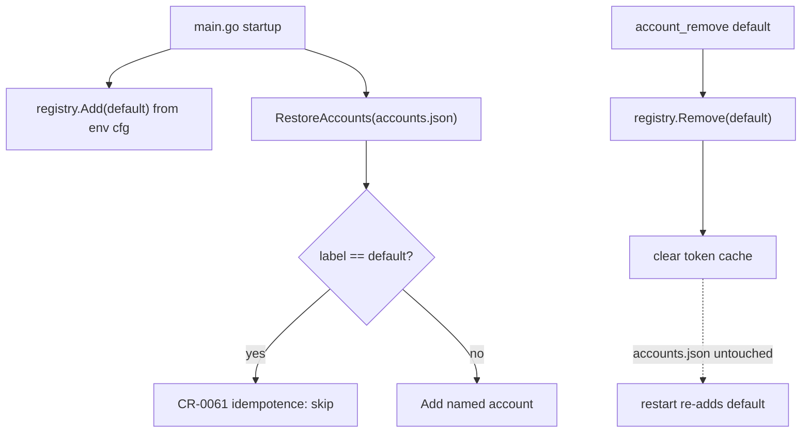
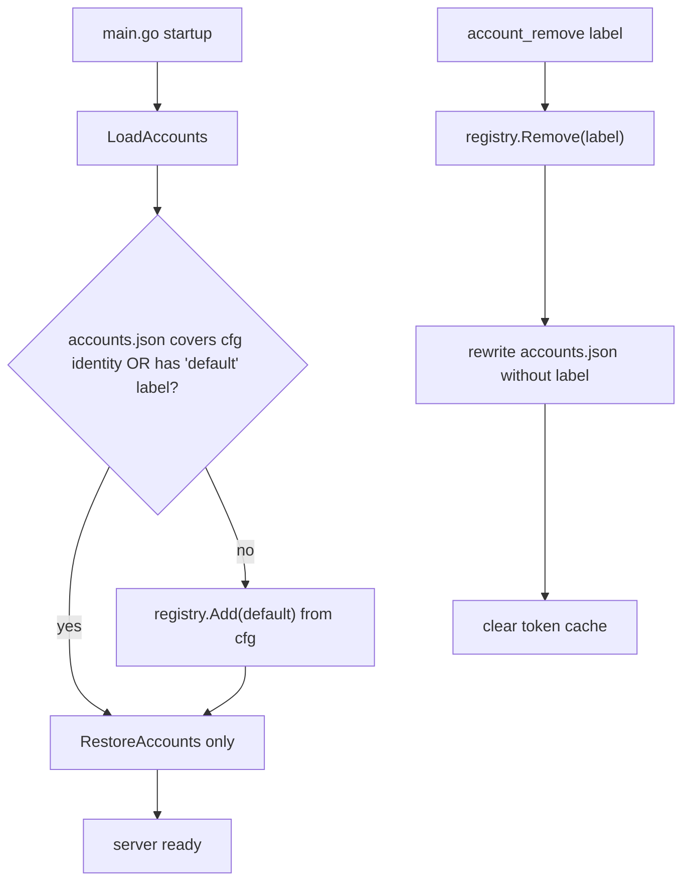
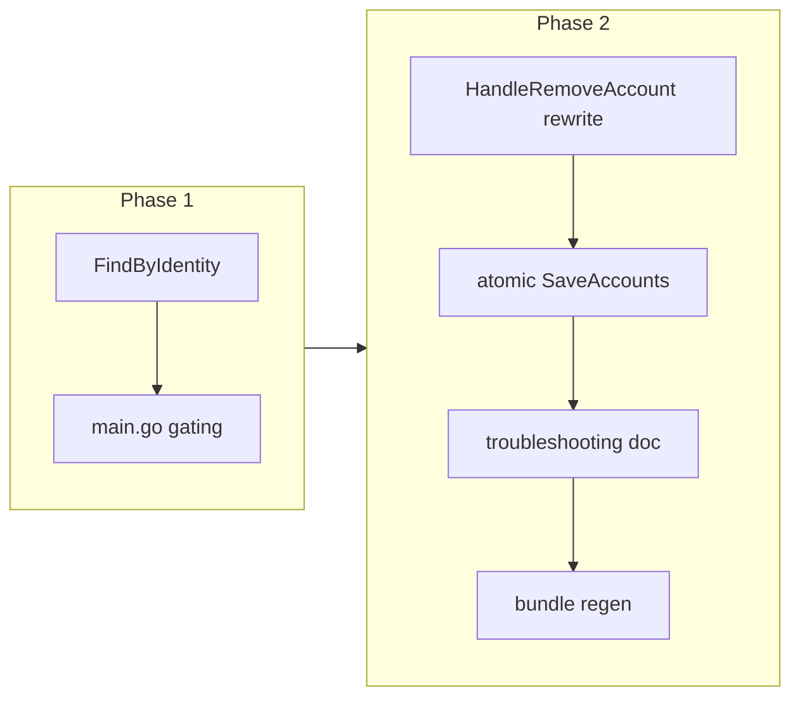

# Conditional Implicit Default Account Registration

## Change Summary

Today `cmd/outlook-local-mcp/main.go` unconditionally registers an in-memory "default" `AccountEntry` from the top-level env config (`OUTLOOK_MCP_CLIENT_ID`, `OUTLOOK_MCP_TENANT_ID`, `OUTLOOK_MCP_AUTH_METHOD`) on every server start, regardless of whether `accounts.json` already covers that identity. This makes `account_remove "default"` non-persistent (the entry reappears at next start), creates an unauthenticated ghost entry that prompts for device-code on first tool call, and duplicates state when an `accounts.json` entry would already produce the same credential. This CR makes the implicit default conditional on `accounts.json` contents and persists `account_remove` to `accounts.json`. There is no feature toggle: the new behavior is the only behavior, and backwards compatibility with the unconditional-registration path is explicitly dropped.

## Motivation and Background

The current behavior dates to the single-account era of the server (CR-0021 through CR-0030), when every install had exactly one Microsoft account and "default" was a convenient hand-off from env-only configuration to in-memory registry. Multi-account support (CR-0056) and per-account auth parameters (CR-0062) made `accounts.json` the source of truth for account identity, but `main.go` was never updated to reflect that — it still creates a "default" entry up front and lets `RestoreAccounts` add the rest. CR-0061 added `restoreOne` idempotence so the "already registered" warning is suppressed, but that masks the underlying confusion rather than fixing it.

Three concrete failures observed in 2026-04-25 testing on branch `dev/cr-0061`:

1. **`account_remove default` is not durable.** A user who runs `account_remove default` to consolidate to a single named account sees the entry return at the next start. Re-removal requires editing `accounts.json` by hand, which the tool surface explicitly hides from the LLM.
2. **Ghost entry prompts unwanted device-code flow.** When `accounts.json` lists only `aipdev` (an authenticated account) and the user has cleared the keychain/file cache for the env-cfg identity, `account_list` still shows a disconnected `default` entry. The first tool call routed to "default" (e.g., a CRUD test that omits `account=`) triggers a device-code prompt for an account the user did not intend to use.
3. **Duplicate state when cfg matches accounts.json.** If the user's `accounts.json` contains an entry whose `client_id`/`tenant_id` equals the env defaults, `main.go` and `RestoreAccounts` produce two entries for the same Microsoft identity — one labelled "default" and one labelled (e.g.) "primary". CR-0061's idempotence check only suppresses the log warning when labels collide, not when identities collide under different labels.

## Change Drivers

* User-observed `account_remove "default"` non-persistence on `dev/cr-0061`, 2026-04-25.
* Ghost-default device-code prompt blocked the CRUD test (`docs/prompts/mcp-tool-crud-test.md`) on a fresh build with file-based token storage.
* Multi-account configurations require `accounts.json` to be the single source of truth (consistent with CR-0056 and CR-0062).

## Current State

* `cmd/outlook-local-mcp/main.go` lines 104-119 unconditionally call `registry.Add(&auth.AccountEntry{Label: "default", ...})` using values from the top-level `cfg`.
* `internal/auth/restore.go::restoreOne` skips labels that already exist in the registry (CR-0061 idempotence) but does not detect identity duplication across different labels.
* `internal/tools/remove_account.go::HandleRemoveAccount` calls `registry.Remove(label)` and clears the per-account token cache, but does not modify `accounts.json`. Removal of an `accounts.json`-backed entry is therefore lost at next restart, and removal of the implicit "default" is also not persisted because there is no record on disk to remove.
* `internal/auth/accounts.go` defines `LoadAccounts` and `SaveAccounts` for `accounts.json` I/O but `SaveAccounts` is only called on add/login, never on remove.

### Current State Diagram



## Proposed Change

Make implicit default registration conditional and make `account_remove` persistent. No env opt-out; the new gating is unconditional.

1. **Default registration is conditional.** `main.go` registers the implicit "default" `AccountEntry` only when **both** of these hold:
   * `accounts.json` is empty, missing, or contains no entry whose `(client_id, tenant_id)` tuple matches the resolved cfg identity.
   * No `accounts.json` entry has the literal label `"default"`.
   When either is false, `main.go` skips the implicit registration and lets `RestoreAccounts` populate the registry from `accounts.json` only.
2. **Identity-collision detection.** `internal/auth/accounts.go` gains a helper `FindByIdentity(accounts []Account, clientID, tenantID string) (Account, bool)` used by `main.go` to detect whether the env cfg identity is already covered by a named entry.
3. **Persistent removal.** `internal/tools/remove_account.go::HandleRemoveAccount` is extended to rewrite `accounts.json` on success: load, filter out the removed label, and save. When the removed label is "default" and no `accounts.json` entry existed for it, the file is left untouched (there is nothing to remove on disk) but the in-memory removal still succeeds. Because the implicit default is no longer added when `accounts.json` covers the cfg identity, removing a named account that matches cfg identity will cause "default" to reappear at next start. Users who want "default" suppressed permanently keep an `accounts.json` entry that covers the cfg identity.

### Proposed State Diagram



## Requirements

### Functional Requirements

1. `main.go` **MUST** register the implicit "default" `AccountEntry` only when `accounts.json` contains no entry with label `"default"` AND no entry whose `(client_id, tenant_id)` tuple matches the resolved cfg identity.
2. When either condition above is false, `main.go` **MUST NOT** register an implicit "default" `AccountEntry`.
3. `internal/auth/accounts.go` **MUST** export `FindByIdentity(accounts []Account, clientID, tenantID string) (Account, bool)` returning the first matching entry and a presence flag. Empty `clientID` or `tenantID` arguments **MUST** return `(Account{}, false)`.
4. `HandleRemoveAccount` **MUST** rewrite `accounts.json` on successful removal: load the existing file, filter out the removed label, and save. When the file does not exist or contains no matching entry, removal **MUST** still succeed and **MUST NOT** create an empty file.
5. Documentation in `docs/troubleshooting.md` **MUST** describe the ghost-default scenario and the new persistent-removal behavior under a heading whose anchor is `auto-default-account`.

### Non-Functional Requirements

1. `accounts.json` rewrites **MUST** be atomic (temp-file + rename) to avoid partial writes on crash.
2. `FindByIdentity` **MUST** run in O(n) over a small (<100) account set; no indexing required.

## Affected Components

* `cmd/outlook-local-mcp/main.go` — gate the implicit `registry.Add("default", ...)` on the new conditions.
* `internal/auth/accounts.go` — add `FindByIdentity`. Ensure `SaveAccounts` writes atomically.
* `internal/tools/remove_account.go` — call `LoadAccounts` + filter + `SaveAccounts` on successful removal; pass `cfg.AccountsPath` through the handler constructor.
* `internal/server/account_verbs.go` — thread `cfg.AccountsPath` (already available) into `HandleRemoveAccount` if not already done.
* `docs/troubleshooting.md` — add `## Auto-default account` section with anchor `auto-default-account`.
* `internal/docs/files/troubleshooting.md` — regenerated by `make docs-bundle`.
* `docs/prompts/mcp-tool-crud-test.md` — extend the `account` lifecycle steps to assert that `account_remove` is durable across restart (per CLAUDE.md "MCP Tool Testing Instructions").
* Tests across `cmd/outlook-local-mcp`, `internal/auth`, `internal/tools`.

## Scope Boundaries

### In Scope

* Conditional implicit default registration in `main.go`.
* Persistent removal via `accounts.json` rewrite in `HandleRemoveAccount`.
* `FindByIdentity` helper.
* Troubleshooting doc.

### Out of Scope ("Here, But Not Further")

* Renaming or removing the "default" label semantics across the codebase — the label remains the conventional fallback for env-cfg accounts.
* Changing the per-account auth parameter resolution from CR-0062.
* Migrating existing keychain entries to file storage — covered by user action, not by this CR.
* Multi-account selection UX or elicitation flows — unchanged from CR-0056.
* `account_add` behavior — unchanged.
* Feature-toggle / env opt-out for the new gating. Backwards compatibility with the prior unconditional-registration path is explicitly dropped.

## Alternative Approaches Considered

* **Always treat env cfg as a "default" entry in accounts.json.** Rejected: creates surprise writes to the user's accounts.json on first start, conflates env config with persisted state, and breaks read-only deployments.
* **Make `account_remove "default"` a no-op when implicit.** Rejected: silently ignoring a tool call is worse than the current behavior; the user explicitly asked to remove and the call should either succeed durably or refuse with a clear error.
* **Drop implicit default entirely.** Rejected: breaks single-account UX where the user expects env-only configuration to "just work" without authoring an accounts.json.
* **Identity-coalescing on add (re-link existing entry).** Rejected: too invasive for this CR; `FindByIdentity` is sufficient for detection without restructuring the add flow.
* **Add an `OUTLOOK_MCP_AUTO_DEFAULT_ACCOUNT` env opt-out.** Rejected per maintainer direction: a toggle adds a permanent configuration surface for what should be a single, well-defined behavior. The accounts.json contents already provide all the gating signal needed.

## Impact Assessment

### User Impact

Users running multi-account setups stop seeing the ghost "default" entry as soon as their `accounts.json` covers the cfg identity. `account_remove "default"` becomes durable provided the user's `accounts.json` covers the cfg identity (otherwise "default" returns at next start, by design — single-account env-only UX is preserved). Single-account users who rely on env-only configuration with no `accounts.json` see no change.

### Technical Impact

`main.go` startup gains a small accounts-load + identity-check before registering "default". `HandleRemoveAccount` gains a file-rewrite step. No breaking change to the MCP tool surface; no change to `extension/manifest.json`.

### Business Impact

Removes a friction point that blocked the CR-0061 CRUD test in multi-account configurations. Aligns the project with the principle that `accounts.json` is the persisted source of truth for account identity (consistent with CR-0056, CR-0062).

## Implementation Approach

Implement in two phases.

### Phase 1: Conditional registration

* Add `FindByIdentity` to `internal/auth/accounts.go`.
* Update `main.go` to call `LoadAccounts(cfg.AccountsPath)` early, then gate the implicit default registration on `!FindByIdentity(...) && !labelExists("default")`.

### Phase 2: Persistent removal

* Extend `HandleRemoveAccount` constructor to accept `cfg.AccountsPath`. After `registry.Remove` succeeds, call `LoadAccounts`, filter out the label, call `SaveAccounts` (atomic write).
* Author `## Auto-default account` section in `docs/troubleshooting.md`. Run `make docs-bundle`.
* Update `docs/prompts/mcp-tool-crud-test.md` to add a step that runs `account_remove`, restarts the server, and asserts that the removed label does not return when `accounts.json` covers the cfg identity (and that "default" returns when it does not, by design).
* Add tests per the Test Strategy table.

### Implementation Flow



## Test Strategy

### Tests to Add

| Test File | Test Name | Description | Inputs | Expected Output |
|-----------|-----------|-------------|--------|-----------------|
| `internal/auth/accounts_test.go` | `TestFindByIdentity_Match` | Returns matching entry | accounts with cid+tid | (entry, true) |
| `internal/auth/accounts_test.go` | `TestFindByIdentity_NoMatch` | Returns false when no match | accounts without cid+tid | (zero, false) |
| `internal/auth/accounts_test.go` | `TestFindByIdentity_EmptyArgs` | Empty cid or tid returns false | empty cid | (zero, false) |
| `cmd/outlook-local-mcp/main_test.go` | `TestStartup_SkipsImplicitDefault_WhenAccountsJsonCoversCfg` | accounts.json has cfg identity under different label; default not added | populated accounts.json | registry has only the named account |
| `cmd/outlook-local-mcp/main_test.go` | `TestStartup_SkipsImplicitDefault_WhenDefaultLabelInAccountsJson` | accounts.json has explicit "default" entry | populated accounts.json | registry has only the accounts.json default |
| `cmd/outlook-local-mcp/main_test.go` | `TestStartup_AddsImplicitDefault_WhenAccountsJsonEmpty` | Empty accounts.json adds default | empty file | registry has `default` |
| `internal/tools/remove_account_test.go` | `TestRemoveAccount_RewritesAccountsJson` | accounts.json updated on removal | label=foo present | file no longer contains foo |
| `internal/tools/remove_account_test.go` | `TestRemoveAccount_ImplicitDefault_NoFileWrite` | Removing implicit default when accounts.json has no default entry leaves file untouched | label=default not in file | file unchanged |
| `internal/tools/remove_account_test.go` | `TestRemoveAccount_AtomicWrite_NoPartialFileOnError` | Simulated write error leaves original file intact | injected fs error | original content preserved |
| `internal/docs/search_test.go` | `TestSearchDocs_AutoDefaultAnchor` | `search_docs` query "auto-default" returns the troubleshooting heading whose anchor is `auto-default-account` | query string | result entry with anchor `auto-default-account` |

### Tests to Modify

| Test File | Test Name | Current Behavior | New Behavior | Reason for Change |
|-----------|-----------|------------------|--------------|-------------------|
| `cmd/outlook-local-mcp/main_test.go` | existing startup tests | Assert `default` present after startup | Assert `default` present only when conditions met | Default is now conditional |
| `internal/tools/remove_account_test.go` | existing remove tests | Stop at registry mutation | Also assert accounts.json contents after | Persistent removal |

### Tests to Remove

Not applicable — this CR is purely additive at the public API level.

## Acceptance Criteria

### AC-1: implicit default is skipped when accounts.json covers cfg identity

```gherkin
Given accounts.json contains an entry whose client_id and tenant_id equal the env cfg
When the server starts
Then account_list does not include "default"
  And account_list includes the named account from accounts.json
```

### AC-2: implicit default is skipped when accounts.json contains a "default" label

```gherkin
Given accounts.json contains an entry with label "default"
When the server starts
Then the registry contains exactly the accounts.json default entry
  And the implicit env-cfg default is not added on top
```

### AC-3: implicit default is added when accounts.json is empty

```gherkin
Given accounts.json does not exist or contains no entries
When the server starts
Then account_list includes "default"
  And the default entry uses the env cfg client_id and tenant_id
```

### AC-4: account_remove rewrites accounts.json

```gherkin
Given accounts.json contains entries for "default" and "aipdev"
  And the server is running
When the user runs account_remove with label "aipdev"
Then accounts.json no longer contains an entry for "aipdev"
  And the server does not re-add "aipdev" on restart
```

### AC-5: removing a named account that covers cfg identity reinstates default

```gherkin
Given accounts.json contains a single entry whose client_id and tenant_id equal env cfg
When the user runs account_remove for that entry
  And the server is restarted
Then account_list includes "default"
  And accounts.json no longer contains the removed entry
```

### AC-6: troubleshooting doc covers the new behavior

```gherkin
Given the embedded troubleshooting document
When the LLM calls system.search_docs with query "auto-default"
Then the result includes a heading whose anchor is "auto-default-account"
  And the section explains the persistent-removal semantics and the accounts.json gating rule
```

## Quality Standards Compliance

### Build & Compilation

- [x] Code compiles/builds without errors
- [x] No new compiler warnings introduced
- [x] `make docs-bundle` succeeds

### Linting & Code Style

- [x] All linter checks pass with zero warnings/errors
- [x] Code follows project coding conventions and style guides

### Test Execution

- [x] All existing tests pass after implementation
- [x] All new tests pass
- [x] Test coverage meets project requirements for changed code

### Documentation

- [x] `docs/troubleshooting.md` updated with `## Auto-default account` section
- [x] `internal/docs/files/troubleshooting.md` regenerated via `make docs-bundle`
- [x] `extension/manifest.json` requires no change

### Code Review

- [ ] Changes submitted via pull request
- [ ] PR title follows Conventional Commits format (`feat(auth): conditional implicit default account registration`)
- [ ] Code review completed and approved
- [ ] Changes squash-merged to maintain linear history

### Verification Commands

```bash
make docs-bundle
make build
make vet
make fmt-check
make lint
make test
make ci
```

## Risks and Mitigation

### Risk 1: accounts.json rewrite races with concurrent add

**Likelihood:** low
**Impact:** medium
**Mitigation:** atomic write via temp file + rename in `SaveAccounts`. The MCP server is single-instance per user; cross-instance contention is out of scope.

### Risk 2: Identity comparison treats empty cfg fields as a match

**Likelihood:** medium
**Impact:** high
**Mitigation:** `FindByIdentity` returns `(Account{}, false)` when either argument is empty. Test `TestFindByIdentity_EmptyArgs` enforces this. `main.go` additionally guards on `cfg.ClientID != ""` before invoking the helper.

### Risk 3: Single-user account_remove of a cfg-identity-covering entry causes "default" to reappear

**Likelihood:** medium
**Impact:** low
**Mitigation:** documented behavior in `docs/troubleshooting.md` under the `auto-default-account` anchor. This is a deliberate consequence of preserving env-only single-account UX, not a bug.

## Dependencies

* None blocking. Builds on CR-0056 (multi-account), CR-0061 (idempotent restore), CR-0062 (per-account auth params).

## Estimated Effort

* Phase 1 (FindByIdentity + main.go gating): ~0.25 day.
* Phase 2 (persistent removal + atomic write + troubleshooting doc + tests): ~0.75 day.
* **Total:** ~1 developer-day.

## Decision Outcome

Chosen approach: "conditional implicit default + persistent removal, no feature toggle". The accounts.json contents are sufficient signal to gate the implicit registration; an additional env var would add a permanent configuration surface for what is effectively a single, deterministic policy. Backwards compatibility with the prior unconditional-registration path is dropped.

## Related Items

* Builds on CR-0056 (multi-account), CR-0061 (in-server documentation + idempotent restore), CR-0062 (per-account auth parameters).
* Observed during 2026-04-25 CRUD test run on branch `dev/cr-0061`.

## More Information

The "default" label remains the conventional fallback for env-cfg-derived accounts when `accounts.json` does not cover that identity. Users who want a fully accounts.json-driven setup ensure `accounts.json` contains an entry whose `client_id` and `tenant_id` match the env cfg (or contains an explicit `"default"` label). Users who continue to rely on env-only configuration with no `accounts.json` see no behavioral change.

<!--
CR-0064 Review Summary (Agent 2)
- Findings: 2
  1. AC-6 (troubleshooting doc anchor) lacked a Test Strategy row.
  2. CLAUDE.md "MCP Tool Testing Instructions" requires updating docs/prompts/mcp-tool-crud-test.md when an MCP tool's behavior changes; account.remove behavior changes here, but the CR omitted both an Affected Components entry and an Implementation Approach step for it.
- Fixes Applied: 3
  1. Added Test Strategy row covering AC-6 via internal/docs/search_test.go::TestSearchDocs_AutoDefaultAnchor.
  2. Added docs/prompts/mcp-tool-crud-test.md to Affected Components.
  3. Added Phase 2 Implementation Approach step updating the CRUD test prompt for durable account_remove across restart.
- Unresolvable Items: none.
- Notes: Tool naming convention compliant (no new MCP tool; account.remove verb behavior change only). Manifest unchanged (correctly noted in CR). No emdashes added in fixes.
-->

