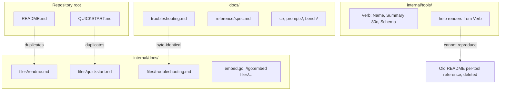
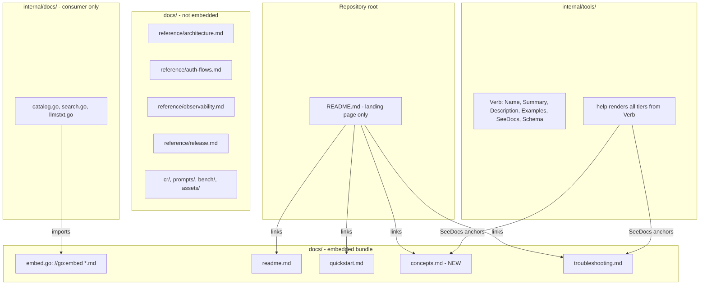
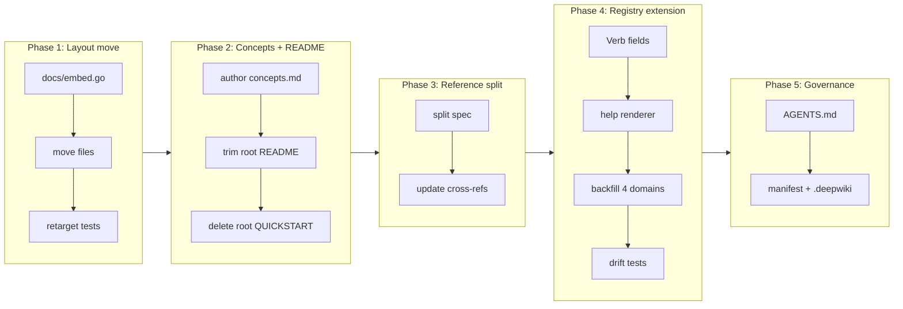

# User documentation architecture and registry-driven tool reference

## Change Summary

The repository's user-facing documentation is currently fragmented across three locations with overlapping content: a heavily trimmed root `README.md`, a top-level `docs/` directory with both user and contributor markdown, and an embedded bundle hidden under `internal/docs/files/` whose troubleshooting file is byte-identical to its `docs/` counterpart. At the same time, per-tool reference documentation that previously lived in the root `README.md` (≈600 lines) has been removed without a replacement: the in-code `Verb` registry only carries an ≤80-character `Summary`, so `system.help` cannot reproduce the depth of the old README, and the new embedded bundle never received a per-verb reference document. This CR refactors the documentation surface end to end: the canonical user-facing markdown moves to `docs/*.md` and is embedded directly from there, the `Verb` struct is extended with `Description`, `Examples`, and `SeeDocs` so the registry becomes the single source of truth for per-tool reference rendered by `help`, a new `concepts.md` collects the orphaned narrative content from the old README, and a set of drift-prevention tests ensures the structure compounds correctly with future development.

## Motivation and Background

The current state has three concrete problems that compound with every new verb or doc page:

1. **Duplication.** `docs/troubleshooting.md` and `internal/docs/files/troubleshooting.md` are identical. `internal/docs/files/readme.md` and `internal/docs/files/quickstart.md` shadow the root `README.md` and `QUICKSTART.md`. Any future doc edit must be made twice or it silently drifts.
2. **Discoverability.** The bytes that the LLM consumes via `system.get_docs` live under `internal/`, which by Go convention is private to the module. A contributor browsing the repository on GitHub does not see the LLM-facing documentation.
3. **Lost reference depth.** The old root `README.md` documented every verb's purpose, parameters, return shape, and examples (~600 lines under `## Tools Reference`). The new `README.md` is 99 lines and points at `system.help`, but `Verb.Summary` is capped at 80 characters and there is no `Description` or `Examples` field on the struct, so `help` has nothing to render. The information has been deleted from one source without being added to another.

In addition, narrative content from the old `README.md` (output tiering, well-known client IDs, MCP elicitation requirements, headless authentication, observability knobs, the three mail/auth/read-only gating modes) is currently orphaned: it is not in the embedded bundle, not in `QUICKSTART.md`, and only partially in the spec.

These problems are caused by an absent architecture. There is no documented rule about what content belongs in code versus markdown, what is embedded versus repo-only, or how the registry and bundle relate. Without that rule, every CR that adds a verb or a feature reintroduces the duplication and orphaning. This CR establishes the rule and the structural changes that enforce it, so subsequent CRs can compound on a stable foundation.

## Change Drivers

* Regression in user-facing reference depth between the v0.5.x README and the post-CR-0060 README that has not been replaced.
* Concrete byte-level duplication between `docs/` and `internal/docs/files/` that will silently drift on the next edit.
* Hidden embedded bundle (`internal/`) that contributors and external readers cannot find on GitHub.
* Absence of governance rules describing where new content belongs, leading to ad-hoc placement decisions in every CR that touches docs.
* Pending follow-up work (CR-0061's bug F-2 on `{#anchor}` heading resolution, future verb additions) needs a stable doc target before it lands.

## Current State

User-facing documentation is split across the following locations on `main` and on `dev/cr-0061` (commit `1f0ce48`):

| Location | Files | Audience | Embedded? |
|---|---|---|---|
| Repository root | `README.md` (99 lines), `QUICKSTART.md` (180 lines) | Humans on GitHub | No |
| `docs/` (top level) | `troubleshooting.md` (304 lines, byte-identical to embedded copy), `claude-prompting-best-practices.md` | Humans | No |
| `docs/cr/` | Change Requests | Contributors | No |
| `docs/reference/` | `outlook-local-mcp-spec.md` (1000+ lines, mixed audience) | Contributors | No |
| `docs/prompts/`, `docs/bench/`, `docs/assets/` | Test prompts, CSV benchmarks, images | Contributors | No |
| `internal/docs/files/` | `readme.md`, `quickstart.md`, `troubleshooting.md` | LLM via `get_docs` | Yes (`//go:embed files/readme.md files/quickstart.md files/troubleshooting.md`) |

The `Verb` struct in `internal/tools/dispatch_registry.go` carries:

```go
type Verb struct {
    Name        string
    Summary     string                  // ≤80 char one-liner
    Handler     Handler
    Annotations []mcp.ToolOption
    Schema      []mcp.ToolOption
    middleware  func(...) ...
}
```

`help` is rendered from this struct alone. There is no field for a longer description, no field for examples, and no field linking a verb to a documentation slug or anchor. The old `README.md` per-verb sections are not present anywhere in the codebase: they were removed in commit `1af716e` (`checkpoint(CR-0061): align documentation surface with CR-0060 aggregate tools`) and not migrated.

### Current State Diagram



## Proposed Change

The proposed structure has four pillars:

1. **`docs/` becomes both the human-facing documentation directory and the Go embed package.** A new `docs/embed.go` declares `package docs` and uses `//go:embed *.md` to embed the user-facing markdown directly. `*.md` is non-recursive, so subdirectories (`docs/cr/`, `docs/reference/`, `docs/prompts/`, `docs/bench/`) remain visible to humans on GitHub but are never embedded into the binary.
2. **Canonical user-facing markdown lives at `docs/{readme,quickstart,concepts,troubleshooting}.md`.** A new `docs/concepts.md` collects the narrative content that was orphaned when the old `README.md` was trimmed. The repository-root `README.md` shrinks to a landing page (~60 lines) whose sole job is install instructions, the four-domain tool invocation shape, and a link grid into `docs/`.
3. **The `Verb` struct is extended with `Description`, `Examples`, and `SeeDocs`** so that `system.help` (and per-domain `help`) renders per-tool reference at the depth the old `README.md` carried, sourced from the registry rather than from prose. Markdown in the embedded bundle never enumerates verbs as its own headings.
4. **A documentation governance section is added to `AGENTS.md`** that records the source-of-truth rules established by this CR, so future CRs route content correctly without re-litigating the question.

### Proposed State Diagram



## Requirements

### Functional Requirements

1. The repository **MUST** expose a single canonical copy of each user-facing document at `docs/{readme,quickstart,concepts,troubleshooting}.md`.
2. The Go embed package for the documentation bundle **MUST** be declared at `docs/embed.go` with `package docs` and an embed directive that captures only the files listed in requirement 1.
3. The embedded bundle **MUST NOT** include any subdirectory of `docs/` (specifically `docs/cr/`, `docs/reference/`, `docs/prompts/`, `docs/bench/`, `docs/assets/`).
4. The `internal/docs` package **MUST** consume `docs.Bundle` rather than declaring its own embed; `internal/docs/files/` **MUST** be deleted.
5. The repository-root `README.md` **MUST** contain a hyperlink to each of the four embedded slugs (`docs/readme.md`, `docs/quickstart.md`, `docs/concepts.md`, `docs/troubleshooting.md`).
6. The repository-root `QUICKSTART.md` **MUST** be reduced to a pointer file containing only a single heading and a hyperlink to `docs/quickstart.md`; it **MUST NOT** contain any duplicated first-run content. The canonical first-run guide is `docs/quickstart.md`.
7. A new `docs/concepts.md` **MUST** exist and **MUST** cover, at minimum, the following sections, each anchored for `SeeDocs` references: output tiers (`text`/`summary`/`raw`), multi-account model and UPN identity, auto-default account semantics (CR-0064), MCP elicitation requirement, read-only mode, mail gating (`MAIL_ENABLED` vs `MAIL_MANAGE_ENABLED`), headless and non-interactive authentication, OAuth scopes used per feature, well-known client IDs, in-server documentation surface, and observability at a glance.
8. The `Verb` struct in `internal/tools/dispatch_registry.go` **MUST** be extended with three new exported fields: `Description string`, `Examples []Example`, and `SeeDocs []string`.
9. Every registered verb across all four domain registries (`calendar`, `mail`, `account`, `system`) **MUST** populate `Summary` and `Description` with non-empty content; `Examples` and `SeeDocs` remain optional per verb but **MUST** be backfilled from the old root `README.md` Tools Reference section where that content existed.
10. The `help` renderer **MUST** include `Description`, `Examples`, and `SeeDocs` in its `text`, `summary`, and `raw` output tiers, in addition to the existing `Name`, `Summary`, and `Schema` content.
11. Every entry in any `Verb.SeeDocs` slice **MUST** resolve to a slug or slug-with-anchor that exists in the embedded bundle.
12. The contributor-facing `outlook-local-mcp-spec.md` **MUST** be split into focused files under `docs/reference/` (`architecture.md`, `auth-flows.md`, `observability.md`, `release.md`); the original file **MUST** be removed once cross-references are updated.
13. The `AGENTS.md` file **MUST** gain a new section titled "Documentation governance" that records the source-of-truth rules established by this CR, including the four canonical embedded slugs, the registry-as-reference rule, and the placement decision tree.

### Non-Functional Requirements

1. The migration **MUST NOT** lose any information that exists on `main` or on `dev/cr-0061`; the audit performed in this CR's "More Information" section enumerates every section of the old `README.md` and assigns each one a destination in the new structure.
2. The embedded bundle size **MUST** remain below the existing cap enforced by `internal/docs/bundle_size_test.go`.
3. The CRUD test harness (`make crud-test`) **MUST** continue to pass against the new structure, with the test prompt updated only where verb names or slug paths changed.
4. The build, vet, format, lint, test, and SBOM targets in the `Makefile` **MUST** all pass after the migration without weakening any existing assertion.

## Affected Components

* `docs/` directory layout, including a new `embed.go`, four canonical user-facing markdown files, a new `reference/` subtree, and the deletion of one duplicate file.
* `internal/docs/` package: `embed.go` deleted, `files/` directory deleted, `catalog.go`, `search.go`, and `llmstxt.go` updated to operate on `docs.Bundle`.
* `internal/tools/dispatch_registry.go`: `Verb` struct extended with three new fields and a new `Example` type.
* `internal/tools/help/` package: `render_text.go`, `render_summary.go`, and `render_raw.go` updated to emit the new fields.
* All four domain registry construction sites (`internal/tools/calendar/...`, `internal/tools/mail/...`, `internal/tools/account/...`, `internal/tools/system/...`) updated to populate `Description`, and `Examples`/`SeeDocs` where applicable.
* `internal/tools/dispatch_route.go`: top-level description builder may use `Description` rather than `Summary` for richer per-domain descriptions.
* Repository-root `README.md`: trimmed to landing page form.
* Repository-root `QUICKSTART.md`: reduced to a single-link pointer to `docs/quickstart.md` (preserves root-level discoverability for humans and convention-driven tools while keeping the canonical bytes in the embedded bundle).
* `AGENTS.md`: new "Documentation governance" section.
* `extension/manifest.json`: tool descriptions reviewed for alignment with the registry's new `Description` field.
* `.deepwiki`: any path references updated.
* `docs/bench/crud-runs.csv`: header unchanged; new run rows accepted.
* `docs/prompts/mcp-tool-crud-test.md`: any `{slug}` references updated to the new top-level paths (`readme`, `quickstart`, `concepts`, `troubleshooting`).

## Scope Boundaries

### In Scope

* Reorganising the documentation directory structure and the embed package location.
* Creating `docs/concepts.md` and migrating the orphaned narrative content from the old `README.md`.
* Extending the `Verb` struct with `Description`, `Examples`, and `SeeDocs`, and backfilling these fields for every existing verb.
* Updating the `help` renderer (all three tiers) to consume the new fields.
* Splitting `docs/reference/outlook-local-mcp-spec.md` into the four focused reference files listed in requirement 12.
* Adding a "Documentation governance" section to `AGENTS.md`.
* Adding the drift-prevention tests enumerated in the Test Strategy section.
* Updating CRUD test prompts and any other path-sensitive contributor docs.

### Out of Scope ("Here, But Not Further")

* Resolving CR-0061's open bug F-2 (`{#anchor}` heading resolution in `get_docs` section slicer); this CR adds the anchors but does not change the slicer behaviour.
* Generating documentation from the registry into markdown (a hypothetical "verb-driven docs" approach); the chosen direction is registry-as-reference rendered by `help`, with markdown reserved for narrative concepts.
* Changing the `system.list_docs` / `system.search_docs` / `system.get_docs` verb signatures beyond updating their internal data source.
* Rewriting `docs/troubleshooting.md` content; this CR moves the existing canonical file but does not rework its content.
* Rewriting `docs/quickstart.md` content beyond what is needed to reflect the new doc layout.
* Adding a `docs/tools.md` reference page; the registry plus `help` is the per-tool reference, by design.
* Modifying the four-domain MCP tool surface, verb names, or annotations.
* Changing the manifest's tool list, only descriptions where they need to align with the registry.

## Alternative Approaches Considered

* **Keep `internal/docs/files/` and add a sync target to `Makefile`.** Rejected: any sync target requires a CI drift check and creates a continuous maintenance tax. Promoting `docs/` to be the embed package eliminates the sync entirely.
* **Move embed into a top-level `embeddocs/` package.** Rejected: this introduces a third location separate from both the human-facing `docs/` and the runtime consumer `internal/docs/`. Making `docs/` itself the embed package keeps everything in one tree.
* **Add a generated `docs/tools.md` derived from the registry.** Rejected: codegen creates a build dependency that is brittle for `go install` users and duplicates the responsibility of `system.help`. The registry is already structured data; rendering it via `help` is sufficient.
* **Keep per-tool reference in `README.md` and accept the bloat.** Rejected: a 1000-line README is hostile to humans skimming on GitHub, and the per-tool detail drifts from the schema each time a parameter changes. The registry is the source of truth.
* **Split `Verb` into `Verb` and a separate `VerbDoc` struct.** Rejected: an unnecessary abstraction; per-verb documentation belongs alongside the per-verb dispatch metadata, not in a parallel structure.

## Impact Assessment

### User Impact

End users (humans browsing the repository) gain a single discoverable entry point at `docs/` with four canonical user-facing files, no duplication, and a landing-page `README.md` that routes them. LLM consumers gain a `system.help` surface with the depth the old `README.md` provided, plus stable `SeeDocs` anchors that connect verbs to narrative concepts. No runtime behaviour changes; no MCP tool name, verb name, schema, or annotation changes.

### Technical Impact

Internal package layout changes: `internal/docs/` becomes a pure consumer of `docs.Bundle`. The `Verb` struct gains three exported fields, all backwards-compatible (zero-value `Description` is permitted by tests only during migration; the final state requires non-empty `Description` per requirement 9). The embed declaration moves from `internal/docs/embed.go` to `docs/embed.go`. The build graph is unchanged: `cmd/outlook-local-mcp/main.go` does not import the docs package directly. Test coverage increases by approximately ten new assertions across the new drift-prevention tests.

### Business Impact

The documentation surface is the primary discovery channel for the project. Eliminating duplication and orphaned content reduces the cost of every future doc edit. Establishing the source-of-truth rules in `AGENTS.md` reduces review friction on every CR that touches docs going forward. The registry-as-reference rule eliminates the recurring decision about where to put per-tool details, which has historically produced inconsistent answers across CR-0052, CR-0058, CR-0060, and CR-0061.

## Implementation Approach

The implementation is sequenced in five phases. Each phase is independently mergeable so review can proceed incrementally; the phases are designed so that intermediate states are valid (the build passes, tests pass, the bundle is well-formed).

### Phase 1: Layout move (mechanical)

* Create `docs/embed.go` with `package docs`, `import "embed"`, and `//go:embed readme.md quickstart.md concepts.md troubleshooting.md` (explicit file list, mirroring the current allowlist style for build-time safety).
* Move `internal/docs/files/readme.md` to `docs/readme.md`.
* Move `internal/docs/files/quickstart.md` to `docs/quickstart.md`.
* Delete the duplicate `internal/docs/files/troubleshooting.md`; the canonical `docs/troubleshooting.md` remains.
* Update `internal/docs/embed.go` to re-export `docs.Bundle`, or update `catalog.go`, `search.go`, and `llmstxt.go` to import `docs` directly and delete `internal/docs/embed.go`.
* Retarget existing tests (`bundle_allowlist_test.go`, `bundle_secrets_test.go`, `bundle_size_test.go`) to the new bundle.
* Verify `make ci` passes; verify `system.list_docs` returns the same four slugs.

### Phase 2: Concepts authoring and root README slim-down

* Create `docs/concepts.md` containing the sections enumerated in requirement 7, with stable anchors. Source content from the historical `README.md` on `main` (commit `eb1377e` and earlier).
* Add `concepts` to the embed directive in `docs/embed.go` and to the allowlist in `bundle_allowlist_test.go`.
* Trim repository-root `README.md` to the landing-page form: install, four-domain tool invocation example, link grid, license. Reduce repository-root `QUICKSTART.md` to a single-link pointer to `docs/quickstart.md`.

### Phase 3: Reference split

* Split `docs/reference/outlook-local-mcp-spec.md` into `architecture.md`, `auth-flows.md`, `observability.md`, and `release.md`.
* Update cross-references from `concepts.md` and elsewhere.
* Delete the original spec file.

### Phase 4: Verb registry extension

* Define an `Example` type in `internal/tools/dispatch_registry.go` (fields: `Args` map or struct, `Comment` string).
* Add `Description string`, `Examples []Example`, and `SeeDocs []string` fields to `Verb`.
* Update `internal/tools/help/render_text.go`, `render_summary.go`, `render_raw.go` to emit the new fields.
* Add the new tests listed in the Test Strategy section.
* Backfill `Description`, `Examples`, and `SeeDocs` per verb in four sub-PRs by domain (`calendar`, `mail`, `account`, `system`) sourced from the historical `README.md`.

### Phase 5: Governance documentation

* Add a "Documentation governance" section to `AGENTS.md` that records the source-of-truth rules: which content lives in code, which in markdown, which is embedded, which is repo-only, and the placement decision tree for new content.
* Update `extension/manifest.json` tool descriptions to align with the new registry `Description` values where they differ.
* Update `.deepwiki` and any other path references.

### Implementation Flow



## Test Strategy

### Tests to Add

| Test File | Test Name | Description | Inputs | Expected Output |
|-----------|-----------|-------------|--------|-----------------|
| `internal/tools/verb_metadata_test.go` | `TestEveryVerbHasDescription` | Asserts every verb in every domain registry has non-empty `Description`. | All registries built from `RegisterTools`. | Test fails if any verb has empty `Description`. |
| `internal/tools/verb_metadata_test.go` | `TestEveryVerbHasSummary` | Asserts every verb has non-empty `Summary` ≤80 chars. | All registries. | Test fails if any verb's `Summary` is empty or >80 chars. |
| `internal/tools/verb_metadata_test.go` | `TestSeeDocsAnchorsResolve` | For each verb's `SeeDocs` entry, asserts the slug exists in `docs.Bundle` and any anchor exists in the file's headings. | All registries plus `docs.Bundle`. | Test fails if any `SeeDocs` slug or anchor cannot be resolved. |
| `docs/embed_test.go` | `TestRootReadmeLinksIntoDocs` | Reads repository-root `README.md` and asserts it contains a hyperlink to each embedded slug (`docs/readme.md`, `docs/quickstart.md`, `docs/concepts.md`, `docs/troubleshooting.md`). | `README.md`, `docs.Bundle`. | Test fails if any embedded slug is not linked from the root README. |
| `docs/embed_test.go` | `TestRootQuickstartIsPointerOnly` | Reads repository-root `QUICKSTART.md` and asserts it is a pointer file: at most 5 non-blank lines, contains a hyperlink to `docs/quickstart.md`, and does not duplicate any heading from `docs/quickstart.md` beyond the top-level title. | `QUICKSTART.md`, `docs/quickstart.md`. | Test fails if the file contains content beyond the pointer or drifts to duplicate canonical content. |
| `docs/embed_test.go` | `TestNoVerbNamesInEmbeddedHeadings` | Scans every embedded markdown file for headings that match the pattern `## verb_name` for a known verb. | `docs.Bundle`, all registries. | Test fails if any embedded heading enumerates a verb name (the registry, not markdown, is the per-verb reference). |
| `internal/tools/help/render_test.go` | `TestRenderTextIncludesDescription` | Calls help renderer for each domain with output=`text` and asserts the output contains each verb's `Description`. | All registries. | Test fails if `Description` is missing from text output. |
| `internal/tools/help/render_test.go` | `TestRenderRawIncludesExamplesAndSeeDocs` | Calls help renderer with output=`raw` and asserts JSON contains `examples` and `see_docs` arrays per verb. | All registries. | Test fails if either field is absent from raw output. |
| `docs/embed_test.go` | `TestEmbeddedFilesArePresent` | Asserts `docs.Bundle` contains exactly four entries: `readme.md`, `quickstart.md`, `concepts.md`, `troubleshooting.md`. | `docs.Bundle`. | Test fails if the set differs. |

### Tests to Modify

| Test File | Test Name | Current Behavior | New Behavior | Reason for Change |
|-----------|-----------|------------------|--------------|-------------------|
| `internal/docs/bundle_allowlist_test.go` | `TestBundleAllowlist` | Iterates `internal/docs.Bundle`; allowlist contains three slugs at `files/{slug}.md`. | Iterate `docs.Bundle`; allowlist contains four slugs at `{slug}.md` (no `files/` prefix); `concepts` added. | Bundle moved to top-level `docs/` package; new `concepts` slug added per requirement 7. |
| `internal/docs/bundle_secrets_test.go` | `TestBundleNoSecrets` | Reads `internal/docs.Bundle`. | Reads `docs.Bundle`. | Bundle relocation. |
| `internal/docs/bundle_size_test.go` | `TestBundleSize` | Reads `internal/docs.Bundle`; asserts size cap. | Reads `docs.Bundle`; asserts same cap. | Bundle relocation. |
| `internal/docs/catalog_test.go` | All | Asserts catalog over three slugs. | Asserts catalog over four slugs. | New `concepts` slug. |
| `internal/docs/search_test.go` | All | Search over three slugs. | Search over four slugs, with at least one assertion targeting `concepts.md` content. | New slug. |
| `internal/docs/llmstxt_test.go` | All | Generates llms.txt for three slugs. | Generates llms.txt for four slugs. | New slug. |
| `internal/tools/tool_description_test.go` | `TestHelpVerb_ReturnsDocForEveryVerb` | Asserts help output for every verb is non-empty. | Asserts help output contains `Description` (not just `Summary`) for every verb. | Help now sources richer per-verb content. |
| `internal/tools/tool_annotations_test.go` | `TestHelpAnnotationDocumentation` | Asserts help documents annotations. | Same, plus asserts `SeeDocs` anchors resolve. | Per requirement 11. |
| `docs/prompts/mcp-tool-crud-test.md` | Step 0a3, 0a4, 0a5, 0a6 | References slug paths under `files/`. | References slug paths at top level (`readme`, `quickstart`, `concepts`, `troubleshooting`). | Bundle relocation. |

### Tests to Remove

| Test File | Test Name | Reason for Removal |
|-----------|-----------|-------------------|
| `internal/docs/embed.go` (file) | n/a | File deleted; embed declaration moves to `docs/embed.go`. The `Bundle` symbol may be re-exported from `internal/docs` for one release cycle if migration cost demands, but is preferred to be removed in this CR. |
| `internal/docs/files/` (directory) | n/a | Directory deleted; canonical files live at `docs/`. |

## Acceptance Criteria

### AC-1: Embedded bundle exposes four canonical slugs from top-level `docs/`

```gherkin
Given the repository is built from this CR's branch
When the binary is started and an MCP client calls system.list_docs
Then the response lists exactly four slugs: readme, quickstart, concepts, troubleshooting
  And each slug resolves via system.get_docs to the bytes of docs/{slug}.md
  And the directory internal/docs/files/ does not exist in the repository
```

### AC-2: Repository-root README routes to all embedded slugs

```gherkin
Given the repository-root README.md
When TestRootReadmeLinksIntoDocs runs
Then the test passes if and only if README.md contains a hyperlink to each of docs/readme.md, docs/quickstart.md, docs/concepts.md, docs/troubleshooting.md
  And the repository-root QUICKSTART.md exists as a pointer file linking to docs/quickstart.md
  And TestRootQuickstartIsPointerOnly passes against that file
```

### AC-3: Concepts document covers all orphaned narrative content

```gherkin
Given the file docs/concepts.md
When the document is read
Then it contains anchored sections for output tiers, multi-account model, auto-default account, MCP elicitation, read-only mode, mail gating, headless authentication, OAuth scopes, well-known client IDs, in-server documentation surface, and observability
  And every anchor referenced by any verb's SeeDocs slice resolves within this document or another embedded slug
```

### AC-4: Verb struct extended and every verb has Description

```gherkin
Given the Verb struct in internal/tools/dispatch_registry.go
When TestEveryVerbHasDescription runs against all four domain registries
Then every verb has a non-empty Description field of at least one sentence
  And TestEveryVerbHasSummary continues to pass with the existing 80-character cap
```

### AC-5: Help renderer emits new fields in all three tiers

```gherkin
Given a populated verb registry
When the help renderer is invoked with output=text, output=summary, and output=raw
Then the text output includes each verb's Description
  And the summary output includes Description, Examples, and SeeDocs as JSON fields
  And the raw output includes the same fields plus the full Schema serialisation
```

### AC-6: SeeDocs anchors are validated by tests

```gherkin
Given any verb whose SeeDocs slice is non-empty
When TestSeeDocsAnchorsResolve runs
Then every SeeDocs entry of the form "slug" or "slug#anchor" resolves to a slug in docs.Bundle
  And any anchor portion matches a heading in that slug's markdown
```

### AC-7: No verb names appear as headings in embedded markdown

```gherkin
Given the four embedded markdown files
When TestNoVerbNamesInEmbeddedHeadings runs
Then no embedded markdown heading matches a verb Name from any domain registry
  And verb names appear in embedded markdown only inside fenced code blocks as illustrative examples
```

### AC-8: Reference spec is split

```gherkin
Given the contributor-facing reference documentation
When the docs/reference/ directory is listed
Then it contains architecture.md, auth-flows.md, observability.md, and release.md
  And it does not contain outlook-local-mcp-spec.md
  And every cross-reference in concepts.md, troubleshooting.md, and AGENTS.md points at the correct new file
```

### AC-9: AGENTS.md documents the governance rules

```gherkin
Given the AGENTS.md file
When the file is read
Then it contains a section titled "Documentation governance"
  And the section enumerates the four canonical embedded slugs
  And the section states the registry-is-canonical rule for per-tool reference
  And the section provides a placement decision tree for new content (code vs markdown vs reference vs governance)
```

### AC-10: Bundle size and security gates remain green

```gherkin
Given the embedded bundle in docs.Bundle
When TestBundleSize, TestBundleNoSecrets, and TestBundleAllowlist run
Then all three tests pass with the new layout
  And the bundle remains within the existing size cap
  And no secret pattern appears in any embedded byte
```

### AC-11: CRUD test harness passes against new structure

```gherkin
Given the updated docs/prompts/mcp-tool-crud-test.md
When make crud-test runs to completion against a fresh build
Then every step passes including the docs intent step (0a6)
  And the new mcp_system tool-call count column reflects calls against the new slug paths
```

## Quality Standards Compliance

### Build & Compilation

- [ ] Code compiles without errors (`make build`)
- [ ] No new compiler warnings introduced
- [ ] `go vet` passes (`make vet`)
- [ ] Modules are tidy (`make tidy`)

### Linting & Code Style

- [ ] `golangci-lint` passes with zero warnings (`make lint`)
- [ ] Code is formatted (`make fmt-check`)
- [ ] Any linter exceptions are documented with `//nolint` and a justification

### Test Execution

- [ ] All existing tests pass (`make test`)
- [ ] All new tests listed in the Test Strategy section pass
- [ ] `make crud-test` completes successfully against the new layout

### Documentation

- [ ] Inline Go doc comments updated for the new `Verb` fields and `Example` type
- [ ] `AGENTS.md` Documentation governance section added
- [ ] `extension/manifest.json` tool descriptions reviewed for alignment
- [ ] `.deepwiki` updated for any path changes
- [ ] `docs/cr/CR-0061-validation-report.md` and `docs/cr/CR-0064-validation-report.md` cross-references updated if they reference moved files

### Code Review

- [ ] Each phase submitted as a separate pull request
- [ ] Each PR title follows Conventional Commits format (`refactor(docs): ...`, `feat(tools): ...`)
- [ ] Code review approved before merge
- [ ] Squash-merged to maintain linear history

### Verification Commands

```bash
# Full quality gate
make ci

# Targeted verification
make build
make vet
make fmt-check
make tidy
make lint
make test
make sbom
make vuln-scan
make license-check

# Headless integration
make crud-test
```

## Risks and Mitigation

### Risk 1: Information loss during the README cull is repeated

**Likelihood:** medium
**Impact:** high
**Mitigation:** This CR's "More Information" section enumerates every section of the historical `README.md` and assigns each a destination. Phase 2 begins with that audit and the test `TestRootReadmeLinksIntoDocs` ensures the four embedded slugs are reachable. No phase merges until its slice of the audit is complete.

### Risk 2: Verb backfill drifts from the historical README content

**Likelihood:** medium
**Impact:** medium
**Mitigation:** Phase 4 backfills `Description`, `Examples`, and `SeeDocs` directly from the historical `README.md` on `main` (commit `eb1377e` and earlier). One PR per domain limits review surface. `TestEveryVerbHasDescription` blocks any verb from being merged without the field populated.

### Risk 3: `docs/` as a Go package surprises tooling that assumes it is documentation-only

**Likelihood:** low
**Impact:** low
**Mitigation:** A `package docs` declaration at the top of `docs/embed.go` is idiomatic Go; many projects do this. The directory remains GitHub-render-friendly because `*.md` files are unchanged and there is no `internal/` shadowing them. The `.deepwiki` configuration is updated to point at the new location.

### Risk 4: Tests added in this CR slow the test suite materially

**Likelihood:** low
**Impact:** low
**Mitigation:** The new tests are constant-time scans over a small bundle and a small registry (~30 verbs). Combined runtime is expected to be under 50 ms. If a new test exceeds 100 ms it is reviewed for inefficiency before merge.

### Risk 5: The `concepts.md` document grows unbounded as future CRs add narrative content

**Likelihood:** medium
**Impact:** low
**Mitigation:** The Documentation governance section in `AGENTS.md` records a soft size guideline (≤500 lines) and a rule that new narrative sections must include an anchor. When `concepts.md` exceeds the guideline, it is split into focused embedded files via a future CR; the embed directive's explicit file list makes such a split a controlled change.

### Risk 6: Bug F-2 (CR-0061's `{#anchor}` heading resolution) is exposed more broadly by the new SeeDocs links

**Likelihood:** high
**Impact:** medium
**Mitigation:** Phase 2 uses only standard `## Heading` style anchors (slug-derived), not inline `{#anchor}` syntax, until F-2 is fixed in a follow-up CR. `TestSeeDocsAnchorsResolve` validates resolution against the actual slicer behaviour, so any unresolvable anchor fails CI before it ships.

## Dependencies

* No blocking external dependencies. This CR builds on the embedded bundle established by CR-0061 and the multi-account semantics finalized by CR-0064.
* The bug F-2 follow-up (inline `{#anchor}` heading resolution in the `get_docs` slicer) is tracked separately and is intentionally not blocking.

## Estimated Effort

* Phase 1 (Layout move): 2 person-hours.
* Phase 2 (Concepts + root README): 4 person-hours including content authoring and the orphaned-content audit.
* Phase 3 (Reference split): 3 person-hours.
* Phase 4 (Registry extension + backfill): 8 person-hours total, 2 per domain.
* Phase 5 (Governance + manifest + .deepwiki): 1.5 person-hours.
* Total: approximately 18.5 person-hours.

## Decision Outcome

Chosen approach: "promote `docs/` to be the embed package, extend the `Verb` registry to be the canonical per-tool reference, add a `concepts.md` for orphaned narrative content, split the contributor spec, and record the source-of-truth rules in `AGENTS.md`", because it eliminates duplication at the layout level, eliminates orphaning at the content level, keeps GitHub conventions intact, and produces a structure that compounds correctly with future CRs through documented placement rules and drift-prevention tests.

## Implementation Status

* **Started:** TBD
* **Completed:** TBD
* **Deployed to Production:** TBD
* **Notes:** Phased implementation; each phase is independently mergeable.

## Related Items

* CR-0021 — Project layout adoption (Go standard).
* CR-0052 — MCP tool annotations.
* CR-0058 — Tool descriptions and CR-0060 aggregate consolidation.
* CR-0060 — Four-domain aggregate tool surface.
* CR-0061 — In-server documentation access for LLM self-troubleshooting.
* CR-0064 — Conditional implicit default account registration (auto-default account semantics referenced from `concepts.md`).
* Open follow-up: bug F-2 (`{#anchor}` heading resolution in `get_docs` section slicer), surfaced by CR-0061's intent test.

## More Information

### Audit of the historical README.md (commit eb1377e and earlier)

This audit assigns every section of the pre-trim `README.md` to a destination in the new structure. The intent is to make information loss impossible to overlook during implementation.

| Old section | Destination | Notes |
|---|---|---|
| Project intro paragraph | `docs/readme.md` (full) and root `README.md` (one sentence) | |
| Quick Start (Go binary, MCPB extension) | Root `README.md` (install) and `docs/quickstart.md` (full) | |
| Tool Invocation Shape (v0.6.0+) | Root `README.md` (example block) and `docs/readme.md` (full discussion) | |
| Features list | `docs/readme.md` | |
| Project Structure | `AGENTS.md` (already present) | |
| Prerequisites | `docs/quickstart.md` | |
| Installation (`go install`, build from source, version injection, Docker, MCPB) | `docs/quickstart.md` and `docs/reference/release.md` | Build internals to reference; user-facing install to quickstart. |
| Authentication: First tool call | `docs/quickstart.md` | |
| Authentication: Subsequent runs | `docs/concepts.md` § headless auth | |
| Authentication: Headless environments | `docs/concepts.md` § headless auth | |
| Authentication: Scopes | `docs/concepts.md` § scopes (one-paragraph summary listing the scopes used per feature so the LLM can answer "why does mail need a different consent") and `docs/reference/auth-flows.md` (full table and rationale) | Split: actionable knowledge embedded, deep dive contributor-only. |
| Authentication: Middleware chain | `docs/reference/architecture.md` | |
| Multi-Account: identity (UPN) | `docs/concepts.md` § multi-account model | |
| Multi-Account: management tools | Verb `Description` for `account.*` | |
| Multi-Account: account selection | `docs/concepts.md` § multi-account model | |
| Multi-Account: MCP Elicitation requirement | `docs/concepts.md` § MCP elicitation | |
| Multi-Account: per-account isolation | `docs/concepts.md` § multi-account model | |
| Configuration env-var table | `docs/concepts.md` (table) and root `README.md` (key vars only) | Full reference remains in `docs/reference/architecture.md`. |
| Usage: running directly | `docs/quickstart.md` | |
| Usage: Claude Desktop config | `docs/quickstart.md` | |
| Usage: Claude Code config | `docs/quickstart.md` | |
| Tools Reference: every per-verb subsection | Verb `Description` and `Examples` for the matching verb | This is the bulk of the migration; one PR per domain. |
| Read-Only Mode | `docs/concepts.md` § read-only mode | |
| Response Filtering (text/summary/raw) | `docs/concepts.md` § output tiers | |
| Well-Known Client IDs | `docs/concepts.md` § well-known client IDs | |
| Observability: Logging | `docs/concepts.md` (overview) and `docs/reference/observability.md` (full) | |
| Observability: Audit Logging | `docs/concepts.md` (overview) and `docs/reference/observability.md` (full) | |
| Observability: OpenTelemetry | `docs/concepts.md` (overview) and `docs/reference/observability.md` (full) | |
| Development: Build/Test/Lint/Quality | `AGENTS.md` (already present) | |
| Development: GoReleaser, snapshot, release artifacts | `docs/reference/release.md` | |
| Attendee quality advisory | Verb `Description` for the meeting verbs | |
| License | Root `README.md` | |

### Documentation governance section to add to AGENTS.md (proposed text)

The following text is the proposed body of the new "Documentation governance" section in `AGENTS.md`. It is included here so reviewers can debate it as part of CR approval rather than during implementation:

> **Documentation governance**
>
> User-facing documentation has a single source of truth per concern. Future CRs that add or change documentation **MUST** route content according to the rules below.
>
> 1. **Per-tool reference** (verb name, parameters, return shape, examples) is owned by the `Verb` registry in `internal/tools/dispatch_registry.go`. Each verb populates `Summary`, `Description`, and where applicable `Examples` and `SeeDocs`. The `system.help` verb renders the registry; do not duplicate this content in markdown.
> 2. **Narrative concepts** (output tiers, multi-account model, gating modes, authentication flows, OAuth scopes summary, observability overview, well-known client IDs, in-server documentation surface, MCP elicitation) live in `docs/concepts.md`. New concepts are added as new anchored sections; verbs reference them via `SeeDocs`. Detailed contributor-level material (sequence diagrams, token cache schema, middleware chain, OTel attribute lists) does NOT belong here; it lives in `docs/reference/` and is not embedded.
> 3. **First-run workflow** lives in `docs/quickstart.md`. Configuration steps, integration setup, and end-to-end verification go here.
> 4. **Failure modes and recovery** live in `docs/troubleshooting.md`. Each entry has a stable anchor for `SeeDocs` references.
> 5. **Architecture and internals** live in `docs/reference/{architecture,auth-flows,observability,release}.md`. These files are not embedded into the binary. The boundary rule: if an LLM helping a user mid-session needs the content to use or troubleshoot the server, it belongs in an embedded file (`concepts.md` or `troubleshooting.md`); if only a contributor modifying the code needs it, it belongs in `docs/reference/`.
> 6. **Governance** (CRs and ADRs) lives in `docs/cr/` and `docs/adr/`. Not embedded.
> 7. The repository-root `README.md` is a landing page only. It contains install, the four-domain tool invocation example, a link grid into `docs/`, and the licence. It **MUST NOT** contain per-tool reference, full configuration tables, or narrative concepts.
> 8. The embedded bundle is exactly four files: `docs/{readme,quickstart,concepts,troubleshooting}.md`. Adding a fifth requires updating `docs/embed.go`, the allowlist test, and this section.
> 9. **Placement decision tree for new content:**
>    - Is it 1:1 with a verb? → registry (`Description`, `Examples`).
>    - Does it span verbs and explain a concept? → `docs/concepts.md`.
>    - Is it a step-by-step setup workflow? → `docs/quickstart.md`.
>    - Is it a failure mode and how to recover? → `docs/troubleshooting.md`.
>    - Is it architecture, internals, or a build/release detail? → `docs/reference/`.
>    - Is it a decision or scope change? → CR or ADR under `docs/cr/` or `docs/adr/`.

### Why the registry, not markdown, owns per-tool reference

Per-tool reference is structured data: a name, a list of parameters with types and constraints, a return shape, and a small set of example invocations. The schema portion is already structured (used for dispatch validation in `internal/tools/dispatch_route.go`). Storing the prose portion next to the schema keeps both fields under the same review whenever a verb changes; storing it in markdown re-introduces the drift class that the old `README.md` exhibited. The `help` renderer's three-tier output already maps cleanly onto the structured representation: `text` for humans and LLMs, `summary` for programmatic consumers, `raw` for full inspection.

### Why `docs/` is the embed package

Go's `//go:embed` directive can only reach files in or below the package directory. Three options exist for keeping the canonical files visible to humans on GitHub: (a) put markdown at the repo root, (b) generate a copy from `docs/` into a hidden directory, or (c) make `docs/` itself a package. Option (a) clutters the root with files that compete with `README.md`; option (b) requires a generator and a drift check; option (c) is the most idiomatic and is the pattern used by several established Go projects (for example `kubernetes/website` exposes both human-facing and machine-readable views of the same markdown). Option (c) is therefore chosen.
