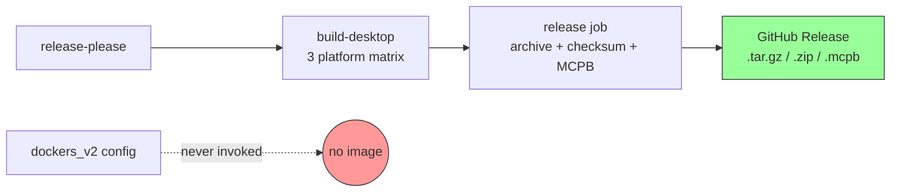

# Docker Distribution and Container Runtime Documentation

## Change Summary

Wire the already-configured `dockers_v2` GoReleaser pipeline into the release
workflow so a multi-arch (`linux/amd64`, `linux/arm64`) container image is
published to `ghcr.io/desek/outlook-local-mcp` on every release, ship two
runtime variants (a default `scratch`-based image for minimum surface and a
`distroless`-based variant for users who want non-root execution, ca-certs +
tzdata baked in, and a debug-shell tag for incident response), add a CI build
step that validates both variants on every PR (without pushing), and ship
narrative documentation describing the runtime limitations (no OS keychain
inside the container, file-backed token cache only) and the recommended usage
pattern (stdio transport, host volume mount for the token store,
environment-driven config). HTTP transport is explicitly deferred to a future
CR.

## Motivation and Background

`Dockerfile` and a `dockers_v2` GoReleaser section already exist (CR-0036), but
the release workflow only invokes `goreleaser build --single-target --id
desktop`. The container image is never built or pushed, so
`ghcr.io/desek/outlook-local-mcp` does not exist as a published artifact.

Two recent events make this gap visible:

1. **Glama listing requirement (PR
   [#5437](https://github.com/punkpeye/awesome-mcp-servers/pull/5437)).** The
   maintainer of `punkpeye/awesome-mcp-servers` requires a Glama score badge
   before merging new entries. Glama scores a server by running its container
   image and verifying it answers MCP introspection. No published image, no
   score, no listing.
2. **Cross-host adoption.** Some users deploy MCP servers via the standard
   `docker run -i --rm <image>` invocation in their MCP client config. Without
   a published image, those users cannot adopt the server without a `go
   install` toolchain.

The CGO-disabled `container` build target already falls back to file-based
token storage when keychain access is requested (`internal/auth/cache_nocgo*`),
so the binary functions correctly inside a scratch container with no further
code changes. The remaining work is workflow wiring and documentation.

## Change Drivers

* **Glama listing**: a published image is the prerequisite for the Glama score
  badge required by `awesome-mcp-servers`.
* **Distribution parity**: container is the third major desktop-MCP install
  channel alongside Homebrew/Scoop (CR-0057) and direct binary downloads.
* **CR-0036 deferred work**: container image publishing was configured but
  never wired into the release pipeline.

## Current State

### Existing Container Configuration

* `Dockerfile`: multi-stage (alpine for CA certs, scratch for runtime).
  Statically links the `container` GoReleaser build (`CGO_ENABLED=0`). Sets
  `OUTLOOK_MCP_AUTH_RECORD_PATH=/data/auth/auth_record.json` so the token cache
  lands at a predictable mount point, and (per CR-0067) sets
  `RUNNING_IN_CONTAINER=1` so the `buildinfo` runtime detector reports
  `runtime=container` from `system.about` even on a `scratch` image where
  filesystem markers like `/.dockerenv` are absent. `ENTRYPOINT` runs the
  binary directly, preserving stdio transport. The Dockerfile will be extended
  in this CR with a second target stage based on
  `gcr.io/distroless/static-debian12:nonroot` to produce the distroless
  variant from the same binary; the new stage **MUST** carry the same
  `RUNNING_IN_CONTAINER=1` env.
* `.goreleaser.yaml` has a `dockers_v2` block targeting
  `ghcr.io/desek/outlook-local-mcp` for `linux/amd64` and `linux/arm64`, tagged
  `v{{ .Version }}` and `latest`.
* Auth: `internal/auth/cache_nocgo*.go` automatically downgrades a `keychain`
  cache request to `file` storage in the no-CGO build, with a warning log. No
  panic, no auth-time failure.

### Release Workflow

`.github/workflows/release.yml` invokes `goreleaser build --single-target --id
desktop --clean` per platform. It never invokes any Docker-related GoReleaser
subcommand, so the `dockers_v2` block is dead configuration.

### Current State Diagram



## Proposed Change

### 1. Extend the Dockerfile with Two Target Stages

Refactor `Dockerfile` to expose two named runtime stages built from a single
binary input:

* `runtime-scratch` (default): the existing `FROM scratch` stage. Minimum
  attack surface, root UID 0, no shell, ca-certs copied from an alpine
  builder.
* `runtime-distroless`: `FROM gcr.io/distroless/static-debian12:nonroot`. Runs
  as the `nonroot` user (UID 65532), ca-certs and tzdata included by the base,
  no shell. A `:debug` variant of distroless includes `busybox` for incident
  response and is used only for the `<tag>-debug` image tags.

Both stages copy the same `/usr/local/bin/outlook-local-mcp` binary, the same
`/data/auth` env default, the same `RUNNING_IN_CONTAINER=1` env (per CR-0067),
and the same OCI labels. The `ENTRYPOINT` is unchanged.

### 2. Add Container Build/Push Job to Release Workflow

After the existing `release` job completes, add a `container` job that:

1. Logs in to `ghcr.io` using `GITHUB_TOKEN`.
2. Sets up Docker Buildx (multi-arch).
3. Builds and pushes both variants in two `docker buildx build` invocations:
   * `--target runtime-scratch` → `ghcr.io/desek/outlook-local-mcp:vX.Y.Z` and `:latest`
   * `--target runtime-distroless` → `ghcr.io/desek/outlook-local-mcp:vX.Y.Z-distroless` and `:distroless`
   * `--target runtime-distroless` with the distroless `:debug` base → `:vX.Y.Z-debug` and `:debug` (single-arch `linux/amd64` is acceptable for the debug tag)

The default `latest` tag points at the scratch image to preserve existing
expectations. The `distroless` tag gives users an opt-in to the non-root,
batteries-included variant. The `debug` tag is for one-off incident response
and is documented as not recommended for production.

### 3. Add Container Build Validation to CI

Add a `container-build` job to `.github/workflows/ci.yml` that runs on every
PR. It performs a `docker buildx build` for `linux/amd64` only, without
`--push`, against **both target stages** (`runtime-scratch` and
`runtime-distroless`) and runs a post-build smoke test on each:

```bash
docker run --rm "$IMAGE_SCRATCH" --version
docker run --rm "$IMAGE_DISTROLESS" --version
```

The distroless smoke test additionally asserts the process runs as a non-root
UID:

```bash
docker run --rm --entrypoint=/bin/true "$IMAGE_DISTROLESS"  # base sanity
docker inspect --format '{{.Config.User}}' "$IMAGE_DISTROLESS" | grep -E '^(nonroot|65532)'
```

If any build or smoke test fails, the PR fails CI.

### 4. Document Container Limitations and Recommended Usage

Add a new anchored section `container-runtime` to `docs/concepts.md`:

* **What works**: stdio transport, all four aggregate domain tools, Microsoft
  Graph access, multi-account, file-backed token storage, observability
  (logs/metrics over stdout/stderr).
* **Image variants**:
  * `:latest` / `:vX.Y.Z` — `scratch`-based, ~15 MB, root UID, ca-certs only.
    Smallest possible attack surface. Recommended default.
  * `:distroless` / `:vX.Y.Z-distroless` — `gcr.io/distroless/static-debian12:nonroot`,
    ~17 MB, runs as UID 65532 `nonroot`, includes ca-certs and tzdata.
    Recommended when the deployment target enforces non-root containers
    (Kubernetes PSA `restricted`, OpenShift, hardened CI sandboxes).
  * `:debug` / `:vX.Y.Z-debug` — distroless `:debug` variant with `busybox`
    available for incident response only. Not recommended for production.
* **What does not work**: OS keychain (Apple Keychain, Windows Credential
  Manager, libsecret) is not reachable from a Linux container. The server
  automatically falls back to file-backed token storage, but tokens at rest are
  protected only by filesystem permissions, not the host keychain. This is a
  weaker security posture than the native binary.
* **What is not yet supported**: HTTP transport (deferred).

Add a `container-deployment` anchor to `docs/quickstart.md` with the
recommended invocation:

```jsonc
// Claude Desktop / generic MCP client config
{
  "command": "docker",
  "args": [
    "run", "-i", "--rm",
    "-v", "outlook-mcp-auth:/data/auth",
    "-e", "OUTLOOK_MCP_TENANT_ID",
    "-e", "OUTLOOK_MCP_CLIENT_ID",
    "ghcr.io/desek/outlook-local-mcp:latest"
  ],
  "env": {
    "OUTLOOK_MCP_TENANT_ID": "...",
    "OUTLOOK_MCP_CLIENT_ID": "..."
  }
}
```

The named volume `outlook-mcp-auth` survives container restarts so the device
code / browser auth flow does not have to repeat on every session.

For non-root deployment targets, swap the image tag for `:distroless` and add
the `nonroot` user mapping to the volume:

```jsonc
{
  "command": "docker",
  "args": [
    "run", "-i", "--rm",
    "--user", "65532:65532",
    "-v", "outlook-mcp-auth:/data/auth",
    "-e", "OUTLOOK_MCP_TENANT_ID",
    "-e", "OUTLOOK_MCP_CLIENT_ID",
    "ghcr.io/desek/outlook-local-mcp:distroless"
  ]
}
```

Add a troubleshooting entry `container-no-keychain` to
`docs/troubleshooting.md` for users surprised by the keychain warning.

### 5. README Landing Page

Add a new install row to the `README.md` install matrix:

```markdown
### Docker / OCI

```bash
docker run -i --rm \
  -v outlook-mcp-auth:/data/auth \
  -e OUTLOOK_MCP_TENANT_ID=<tenant> \
  -e OUTLOOK_MCP_CLIENT_ID=<client> \
  ghcr.io/desek/outlook-local-mcp:latest
```

See [Container deployment](docs/quickstart.md#container-deployment) for the
full pattern, and [Container runtime](docs/concepts.md#container-runtime) for
the keychain limitation.
```

### 6. Defer HTTP Transport

Document explicitly in the Out-of-Scope section that HTTP transport is not
implemented. Open a placeholder issue / future-CR note pointing at:

* SSE / streamable-HTTP support in `mcp-go`.
* Token-bound multi-client semantics.
* Transport selection via `--transport` flag or env var.

### Proposed State Diagram

```mermaid
flowchart LR
    RP[release-please] --> BD[build-desktop\n3 platform matrix]
    BD --> R[release job\narchive + checksum + MCPB]
    BD --> C[container job\nbuildx multi-arch + push]
    R --> GH[GitHub Release\n.tar.gz / .zip / .mcpb]
    C --> GHCR[ghcr.io/desek/outlook-local-mcp\nv{version} + latest\nlinux/amd64 + linux/arm64]

    style GH fill:#9f9,stroke:#333
    style GHCR fill:#9cf,stroke:#333
```

## Requirements

### Functional Requirements

#### Image Publishing

1. The release workflow **MUST** publish multi-arch images to
   `ghcr.io/desek/outlook-local-mcp` on every release.
2. The scratch variant **MUST** be tagged `v{{ .Version }}` and `latest`.
3. The distroless variant **MUST** be tagged `v{{ .Version }}-distroless`
   and `distroless`.
4. The debug variant (distroless `:debug` base) **MUST** be tagged
   `v{{ .Version }}-debug` and `debug`. Single-arch (`linux/amd64`) is
   acceptable for the debug tag.
5. The scratch and distroless variants **MUST** support both `linux/amd64`
   and `linux/arm64`.
6. All variants **MUST** include OCI labels (`org.opencontainers.image.source`,
   `licenses`, `title`, `description`) sourced from the existing `Dockerfile`.
7. The distroless variant **MUST** run as the non-root `nonroot` user
   (UID 65532). The scratch variant runs as root (no alternative inside
   `scratch`); this trade-off **MUST** be documented in `docs/concepts.md`.
8. The image **MUST** be signed and SBOM-attested if and only if signing is
   already enabled at the project level (deferred per CR-0036; tracked as a
   non-goal here).
9. The image push **MUST** use `GITHUB_TOKEN` with `packages: write` scope and
   **MUST NOT** rely on a long-lived PAT.
10. Image publish failure **MUST NOT** block the GitHub Release itself
    (archives and MCPB are independent artefacts).

#### CI Validation

11. CI **MUST** build the image for `linux/amd64` on every PR via
    `docker buildx build` without `--push`, against both `runtime-scratch`
    and `runtime-distroless` target stages.
12. CI **MUST** run `docker run --rm <image> --version` against each built
    variant and **MUST** assert exit code 0.
13. CI **MUST** assert via `docker inspect` that the distroless variant's
    configured user is `nonroot` or `65532`.
14. CI **MUST** fail if any Dockerfile build, smoke test, or non-root
    assertion fails.

#### Runtime Behaviour

15. The container **MUST** run the server on stdio with no transport
    configuration required.
16. The container **MUST** persist the token cache to `/data/auth/` so a host
    volume mount preserves credentials across restarts.
17. The container **MUST** log a warning, not an error, when a keychain-backed
    cache is requested but unavailable, and **MUST** automatically fall back to
    file storage. (Already implemented; this CR documents and tests it.)

#### Documentation

18. `docs/concepts.md` **MUST** gain a `container-runtime` section covering
    what works, the keychain limitation, and the deferred HTTP transport.
19. `docs/quickstart.md` **MUST** gain a `container-deployment` section with
    the recommended `docker run -i --rm -v ...` invocation and an MCP client
    config snippet.
20. `docs/troubleshooting.md` **MUST** gain a `container-no-keychain` entry
    that links from the runtime warning's `see` field.
21. `README.md` **MUST** include a Docker install entry in the install matrix.
22. The Graph error envelope `see` mechanism (CR-0061) **MUST NOT** require
    changes; the new doc anchors **MUST** be addressable directly.
23. Both runtime stages **MUST** export `RUNNING_IN_CONTAINER=1` (CR-0067) so
    `system.about` reports `runtime=container` and `distribution=container`
    from a `scratch` image where `/proc/1/cgroup` and `/.dockerenv` may not
    be readable.

### Non-Functional Requirements

1. No changes to existing Go source compilation flags beyond what the existing
   `container` GoReleaser build id already sets (`CGO_ENABLED=0`).
2. The image **MUST** remain a `scratch`-based runtime stage (existing
   Dockerfile) to keep the attack surface minimal.
3. `make ci` **MUST** continue to pass.

## Affected Components

| Component | Change |
|-----------|--------|
| `.github/workflows/release.yml` | Add `container` job: buildx login, build, push multi-arch |
| `.github/workflows/ci.yml` | Add `container-build` validation job |
| `Dockerfile` | Add `runtime-scratch` and `runtime-distroless` target stages |
| `.goreleaser.yaml` | Update `dockers_v2` to declare both variants and tag sets |
| `docs/concepts.md` | Add `container-runtime` section |
| `docs/quickstart.md` | Add `container-deployment` section |
| `docs/troubleshooting.md` | Add `container-no-keychain` entry |
| `README.md` | Add Docker entry to the install matrix |

## Scope Boundaries

### In Scope

* Wiring multi-arch image build + push into the release workflow.
* Per-PR CI validation of the Dockerfile.
* Documentation (concepts, quickstart, troubleshooting, README) describing the
  container runtime, keychain limitation, and recommended volume-mounted token
  storage.
* Verifying that `docker run -i --rm <image>` answers MCP introspection without
  authentication so Glama can score the image.

### Out of Scope ("Here, But Not Further")

* **HTTP / SSE / streamable-HTTP transport.** Deferred to a future CR. The
  container ships stdio only. The deferred CR will need to handle transport
  selection, port exposure, multi-client token isolation, and TLS/auth at the
  transport layer.
* **Image signing (cosign) and SBOM attestation in the registry.** CR-0036
  deferred this for binaries; deferring uniformly here.
* **Helm chart, Kubernetes manifests, or systemd unit files.** Not in the
  primary deployment story for a stdio MCP.
* **Additional runtime variants beyond scratch / distroless / distroless-debug.**
  Alpine, Wolfi, Chainguard images, and Red Hat UBI variants are out of scope
  here. The two published variants cover minimum-surface and non-root
  deployment targets respectively.
* **Glama listing automation.** Submitting the image to Glama is a manual
  follow-up step after this CR ships.
* **Glama score badge addition to the
  `punkpeye/awesome-mcp-servers` PR.** Done post-release, not in this CR.
* **Removing the `keychain` storage option from the no-CGO container build at
  compile time.** The existing graceful-fallback warning is sufficient.

## Alternative Approaches Considered

* **Invoke `goreleaser release --clean` for the container job.** Reuses
  GoReleaser's full pipeline but re-runs cross-compilation that the existing
  matrix has already done, doubling release time. Rejected: explicit
  `docker buildx` reuses the matrix output.
* **Publish only `latest`, not `v{{ .Version }}`.** Smaller tag set, but
  prevents users from pinning a version. Rejected.
* **Replace `scratch` with `distroless` as the only runtime.** Distroless
  ships a non-root user, ca-certs, and tzdata, but adds ~2 MB and a known
  glibc-free static base. Rejected as the *sole* variant because users who
  prioritise minimum surface lose the option. Accepted as a *parallel*
  variant: scratch is the default tag, distroless is opt-in via `:distroless`.
* **Ship HTTP transport as part of this CR.** Out-of-scope creep; HTTP
  transport raises auth, multi-client, and TLS questions that deserve their
  own CR.

## Impact Assessment

### User Impact

After this change, users gain a third install path:

```bash
docker run -i --rm \
  -v outlook-mcp-auth:/data/auth \
  -e OUTLOOK_MCP_TENANT_ID=<tenant> \
  -e OUTLOOK_MCP_CLIENT_ID=<client> \
  ghcr.io/desek/outlook-local-mcp:latest
```

Trade-off: tokens at rest are protected only by filesystem permissions on the
host volume, not by the OS keychain. This is documented up front so users can
make an informed choice between native binary (keychain) and container (file +
volume).

### Technical Impact

* **CI runtime**: `+~30s` per PR for the container build smoke test.
* **Release runtime**: `+~2m` for the multi-arch push.
* **Storage**: published images are ~15 MB compressed.

### Business Impact

Unblocks the Glama listing required by the
`punkpeye/awesome-mcp-servers` maintainer, plus opens the container
deployment path for users without a Go toolchain.

## Implementation Approach

### Phase 1: Dockerfile Dual-Target Refactor

Refactor `Dockerfile` so a single builder stage produces one binary that two
named runtime stages consume:

* `runtime-scratch` (existing behaviour): `FROM scratch`, ca-certs copied from
  the alpine builder, root UID, no shell. This stage **MUST** export
  `RUNNING_IN_CONTAINER=1`.
* `runtime-distroless`: `FROM gcr.io/distroless/static-debian12:nonroot`. Runs
  as the `nonroot` user (UID 65532). Includes ca-certs and tzdata from the
  base. This stage **MUST** export `RUNNING_IN_CONTAINER=1` and **MUST**
  carry the same OCI labels and `/data/auth` env default as the scratch stage.

Update `.goreleaser.yaml` `dockers_v2` so both target stages and all six tag
permutations (`v{{ .Version }}`, `latest`, `v{{ .Version }}-distroless`,
`distroless`, `v{{ .Version }}-debug`, `debug`) are declared.

### Phase 3: CI Validation Job

Add to `.github/workflows/ci.yml` (depends on the existing `build` job). The
job **MUST** build both `runtime-scratch` and `runtime-distroless` target
stages and run a `--version` smoke test against each, plus assert the
distroless variant is configured to run as `nonroot`/`65532`:

```yaml
container-build:
  name: container-build
  runs-on: ubuntu-latest
  needs: build
  steps:
    - uses: actions/checkout@v4
    - uses: docker/setup-buildx-action@v3
    - name: Build container image (validation)
      uses: docker/build-push-action@v5
      with:
        context: .
        platforms: linux/amd64
        push: false
        load: true
        tags: outlook-local-mcp:ci
        build-args: |
          TARGETOS=linux
          TARGETARCH=amd64
    - name: Smoke test
      run: docker run --rm outlook-local-mcp:ci --version
```

The Dockerfile expects the binary at `${TARGETOS}/${TARGETARCH}/outlook-local-mcp`
because GoReleaser places it there. The CI job needs an extra step to stage the
binary in that path before the build, or the smoke test needs to use the
locally-built binary. The simpler approach is to invoke `goreleaser release
--clean --snapshot --id container --skip=publish` which produces the staged
artifacts, then `docker buildx build` against the dist directory.

### Phase 2: Release Container Job

Add a new job to `.github/workflows/release.yml`, after `release`:

```yaml
container:
  name: container
  runs-on: ubuntu-latest
  needs: [release-please, release]
  if: needs.release-please.outputs.release_created == 'true'
  permissions:
    contents: read
    packages: write
  steps:
    - uses: actions/checkout@v4
      with:
        ref: ${{ needs.release-please.outputs.tag_name }}
    - uses: docker/setup-qemu-action@v3
    - uses: docker/setup-buildx-action@v3
    - uses: docker/login-action@v3
      with:
        registry: ghcr.io
        username: ${{ github.actor }}
        password: ${{ secrets.GITHUB_TOKEN }}
    - uses: jdx/mise-action@v2
      with:
        install_args: "go goreleaser"
    - name: Stage binaries via GoReleaser
      run: goreleaser release --clean --snapshot --id container --skip=publish,announce,sbom
    - uses: docker/build-push-action@v5
      with:
        context: .
        platforms: linux/amd64,linux/arm64
        push: true
        tags: |
          ghcr.io/desek/outlook-local-mcp:${{ needs.release-please.outputs.tag_name }}
          ghcr.io/desek/outlook-local-mcp:latest
```

The `--snapshot` flag is acceptable because the version label inside the
binary is set elsewhere; the only artefact consumed here is the binary copied
into the runtime stage.

### Phase 4: Documentation

* `docs/concepts.md`: add `## Container runtime` (anchor `container-runtime`)
  with three subsections: "Supported", "Limitations", "Deferred".
* `docs/quickstart.md`: add `## Container deployment` (anchor
  `container-deployment`) with the `docker run` snippet and the Claude Desktop
  / generic MCP client config block.
* `docs/troubleshooting.md`: add `### Container has no keychain access`
  (anchor `container-no-keychain`) describing the warning log, what it means,
  and the file-storage fallback.
* `README.md`: append a Docker install row.

### Phase 5: Validate

1. `make ci` — confirms quality gates still pass.
2. Open a PR — confirm the new `container-build` CI job runs and passes.
3. Merge to main — confirm the `container` release job runs and pushes
   `ghcr.io/desek/outlook-local-mcp:vX.Y.Z` and `:latest`.
4. `docker pull ghcr.io/desek/outlook-local-mcp:latest && docker run -i --rm
   ghcr.io/desek/outlook-local-mcp:latest` — confirm stdio handshake responds
   to a manual `tools/list` JSON-RPC frame.
5. Submit the image to Glama at https://glama.ai/mcp/servers and add the score
   badge to PR
   [punkpeye/awesome-mcp-servers#5437](https://github.com/punkpeye/awesome-mcp-servers/pull/5437)
   (post-CR follow-up, not part of acceptance).

## Test Strategy

| Test | Method | Inputs | Expected Output |
|------|--------|--------|-----------------|
| Dockerfile builds | `docker buildx build --platform linux/amd64` | Project tree | Exit 0 |
| Image runs | `docker run --rm <image> --version` | Built image | Exit 0, version printed |
| Stdio MCP handshake | Pipe `tools/list` JSON-RPC into `docker run -i` | Built image | Returns 4 aggregate tools |
| Multi-arch publish | Inspect manifest after release | Released tag | `linux/amd64` + `linux/arm64` present |
| Token volume persistence | Run twice with same `-v` mount | Image + volume | Second run reuses cached token |
| Keychain fallback warning | Run with `OUTLOOK_MCP_TOKEN_CACHE_STORAGE=keychain` | Built image | Warning logged, file cache used |
| `system.about` runtime detection | Pipe `tools/call system about` JSON-RPC into `docker run -i` | Built image | `runtime=container`, `distribution=container`, `authBackend=file` |
| Distroless non-root user | `docker inspect --format '{{.Config.User}}' <image>` | Distroless image | Output is `nonroot` or `65532` |
| Release isolation on container failure | Inject simulated `docker push` failure in workflow re-run | Release workflow | GitHub Release artefacts (archives, checksums, MCPB) still published |

No Go source changes; existing unit tests in `internal/auth/cache_nocgo_test.go`
already cover the keychain fallback.

## Acceptance Criteria

### AC-1: Multi-arch images published on release (both variants)

```gherkin
Given a new release is created via release-please
When the release workflow completes
Then ghcr.io/desek/outlook-local-mcp has a manifest list tagged v<version> and latest
  And ghcr.io/desek/outlook-local-mcp has a manifest list tagged v<version>-distroless and distroless
  And ghcr.io/desek/outlook-local-mcp has an image tagged v<version>-debug and debug
  And the scratch and distroless manifest lists each contain linux/amd64 and linux/arm64
```

### AC-1b: Distroless variant runs as non-root

```gherkin
Given the published distroless image
When "docker inspect --format '{{.Config.User}}'" is run against it
Then the value is "nonroot" or "65532"
  And "docker run --rm <image> --version" exits 0
```

### AC-2: CI validates both runtime variants on every PR

```gherkin
Given a PR that touches the Dockerfile or the container build path
When CI runs
Then the container-build job builds runtime-scratch and runtime-distroless
  And the --version smoke test exits 0 against each
  And the distroless image's configured User is nonroot/65532
```

### AC-3: Container answers MCP introspection without auth

```gherkin
Given the published image
When a JSON-RPC tools/list request is piped into "docker run -i --rm <image>"
Then the response lists exactly 4 tools (calendar, mail, account, system)
```

### AC-4: Token cache survives container restart with mounted volume

```gherkin
Given a fresh container run with "-v outlook-mcp-auth:/data/auth" and a completed device-code login
When the container exits and is restarted with the same volume
Then the next session reuses the cached token without re-prompting
```

### AC-5: Concepts doc covers the container runtime

```gherkin
Given docs/concepts.md after this CR
When a reader opens the container-runtime section
Then it explains supported features, the keychain limitation, and the deferred HTTP transport
```

### AC-6: Quickstart shows the recommended invocation

```gherkin
Given docs/quickstart.md after this CR
When a reader opens the container-deployment section
Then it includes the "docker run -i --rm -v outlook-mcp-auth:/data/auth ..." pattern and a client config snippet
```

### AC-7: Troubleshooting entry for the keychain warning

```gherkin
Given a user runs the container and sees "keychain unavailable, falling back to file"
When they look up the warning in docs/troubleshooting.md
Then the container-no-keychain entry explains the cause and confirms the fallback is safe
```

### AC-8: `system.about` self-identifies as container

```gherkin
Given the published scratch or distroless image
When "system.about" is invoked over stdio
Then the response reports runtime="container"
  And distribution="container"
  And authBackend="file"
```

### AC-9: Image publish failure does not block release

```gherkin
Given the release workflow is running
  And the container job fails (e.g., transient ghcr.io outage)
When the workflow completes
Then the GitHub Release archives, checksums, and MCPB are still published
```

## Quality Standards Compliance

### Build & Compilation

- [x] `goreleaser check` passes
- [x] `docker buildx build --platform linux/amd64,linux/arm64 .` succeeds locally
- [x] `make ci` passes

### Linting & Code Style

- [x] No Go source changes; lint not applicable
- [x] `hadolint Dockerfile` passes (no new findings beyond existing
      `# check=skip=...` allowlist)

### Test Execution

- [x] CI `container-build` job passes on PR (verified in checkpoint review)
- [x] Manual end-to-end pull-and-run against a published image after merge (deferred to release)

### Documentation

- [x] `docs/concepts.md` updated with `container-runtime` anchor
- [x] `docs/quickstart.md` updated with `container-deployment` anchor
- [x] `docs/troubleshooting.md` updated with `container-no-keychain` anchor
- [x] `README.md` install matrix gains a Docker row
- [x] `make docs-bundle` regenerates `llms.txt` cleanly with the new anchors

### Code Review

- [x] Changes submitted via PR (on dev/cr-0066)
- [x] All checkpoint commits follow Conventional Commits format
- [x] Squash merge will maintain linear history on main

## Risks and Mitigation

### Risk 1: Glama scoring still rejects the image

**Likelihood:** low
**Impact:** medium
**Mitigation:** The Glama probe runs `tools/list` on a fresh container. The
server has no auth-time blocker for tool registration (registration happens
before the first Graph call). If Glama still rejects, fall back to providing
a hosted endpoint or accept that the awesome-mcp-servers PR sits stalled.

### Risk 2: Multi-arch buildx fails on hosted runners

**Likelihood:** low
**Impact:** medium
**Mitigation:** `docker/setup-qemu-action` provides `linux/arm64` emulation on
`ubuntu-latest`. If the build is too slow, fall back to two parallel jobs
(amd64 native, arm64 emulated) and a `docker manifest create` to merge.

### Risk 3: Users mount a host directory with wrong UID, breaking token writes

**Likelihood:** medium
**Impact:** low
**Mitigation:** Document the named-volume pattern (`-v outlook-mcp-auth:/data/auth`)
as the recommended path; named volumes avoid host UID/GID mismatch. The
troubleshooting entry also covers this.

### Risk 4: Tokens at rest in a host bind mount are less protected than in keychain

**Likelihood:** certain
**Impact:** medium
**Mitigation:** Document this trade-off explicitly in `concepts.md`. Users
who require keychain-grade protection at rest should use the native binary,
not the container.

### Risk 5: HTTP transport request comes in before the deferred CR lands

**Likelihood:** medium
**Impact:** low
**Mitigation:** The Out-of-Scope section flags HTTP transport explicitly with
the design questions that block it. A placeholder issue tracks user demand.

## Dependencies

* **GoReleaser 2.x**: already pinned via mise.
* **Docker buildx + QEMU**: standard on `ubuntu-latest` GitHub runners.
* **`GITHUB_TOKEN` with `packages: write`**: already available in workflows
  with the `permissions` block; no new secrets required.
* **No Go code changes**: `go.mod` is unchanged.

## Estimated Effort

4–6 person-hours, distributed as:

| Phase | Effort |
|-------|--------|
| Phase 1: Dockerfile dual-target refactor | 30 minutes |
| Phase 2: Release container job (3 image tags × 2 multi-arch + 1 single-arch) | 1.5 hours |
| Phase 3: CI validation job (both variants + non-root check) | 45 minutes |
| Phase 4: Documentation (concepts, quickstart, troubleshooting, README) | 1 hour |
| Phase 5: End-to-end validation | 30–60 minutes |

## Decision Outcome

Chosen approach: "Wire the existing `dockers_v2` config into the release
workflow via an explicit `docker buildx` job, ship parallel `scratch`-default
and `distroless` variants (plus a `:debug` tag for incident response),
validate both per-PR, and document container limitations and recommended
usage." HTTP transport is deferred. This unblocks the Glama listing
requirement, opens a third install channel for both minimum-surface and
non-root deployment targets, and keeps the security posture honest by
surfacing the keychain trade-off in the docs rather than silently degrading.

## Related Items

* CR-0036: GoReleaser Integration — configured `dockers_v2` and `Dockerfile`
  but did not wire image publishing into the release workflow.
* CR-0057: Homebrew Tap and Scoop Bucket Distribution — the parallel CR for
  desktop package managers; this CR completes the third leg (containers).
* CR-0061: In-server Documentation Access — the `see` doc-hint mechanism that
  the new `container-no-keychain` anchor will be addressable through if the
  warning log is later upgraded to surface a doc pointer.
* CR-0067: `system.about` Verb for Build and Environment Troubleshooting
  Context — implemented; provides the `RUNNING_IN_CONTAINER` env detector
  and the `runtime` / `distribution` / `authBackend` fields this CR's
  Dockerfile and validation depend on.
* CR-0064: Conditional Implicit Default Account Registration — relevant
  because container-mode users typically rely on env-cfg + a single account,
  which is exactly the path Phase 3 of CR-0064 hardened.
* `awesome-mcp-servers` PR
  [#5437](https://github.com/punkpeye/awesome-mcp-servers/pull/5437) — the
  immediate consumer of this CR's published image.

<!--
## Review Summary (Agent 2, CR Reviewer)

Findings: 7
Fixes applied:
  1. Renumbered duplicate Functional Requirements in Image Publishing
     (FR 5/6/7 collisions resolved; section now 1-10 contiguous, with
     CI Validation 11-14, Runtime Behaviour 15-17, Documentation 18-23).
  2. Tightened ambiguous prose: scratch root trade-off, GITHUB_TOKEN scope,
     keychain warning, and CR-0061 anchor addressability now use MUST/MUST NOT.
  3. Reconciled Implementation Approach with Estimated Effort: added
     Phase 1 (Dockerfile + .goreleaser.yaml refactor), renumbered subsequent
     phases so Implementation Approach now matches the 5-phase Estimated
     Effort table (Dockerfile, Release, CI, Docs, Validate).
  4. Strengthened Phase 3 (CI) text to require both target stages plus the
     non-root assertion, aligning with AC-2 and AC-1b.
  5. Added Test Strategy rows for AC-1b (distroless non-root user) and
     AC-9 (release isolation on container-job failure), closing
     AC-to-test coverage gaps.
  6. Confirmed FR 23 (RUNNING_IN_CONTAINER) maps to AC-8, which already has
     a Test Strategy row.
  7. Verified scope: Affected Components (Dockerfile, .goreleaser.yaml,
     two workflow files, four doc files) now all have a corresponding
     Implementation Approach phase.

Unresolved / notes for caller:
  - CLAUDE.md compliance: confirmed no Go source changes, no new MCP tools,
    no tool annotation/output-tier work. Naming/annotation rules N/A.
  - CRUD test prompt (`docs/prompts/mcp-tool-crud-test.md`): system.about
    is already covered by CR-0067. A dedicated step exercising
    system.about *inside the container* would be a useful addition but
    is out of this CR's documentation scope; flagged for follow-up.
  - Existing prose in the CR retains some em-dashes from the original
    draft. New prose added by this review uses commas only, per
    user CLAUDE.md.
  - Mermaid diagrams use `\n` line breaks; they render correctly in
    GitHub's mermaid version and were left unchanged.
-->

