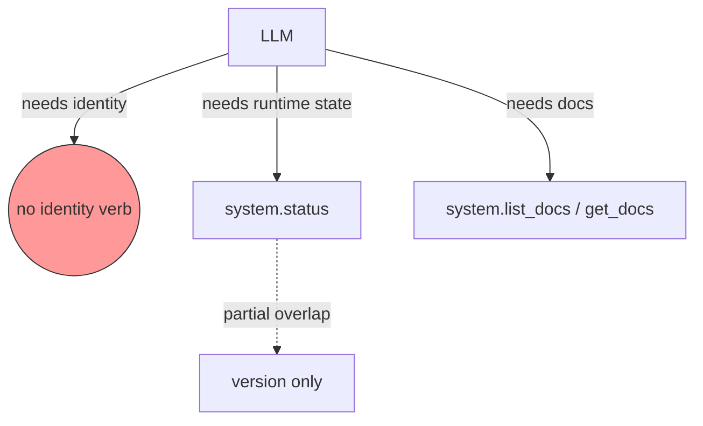
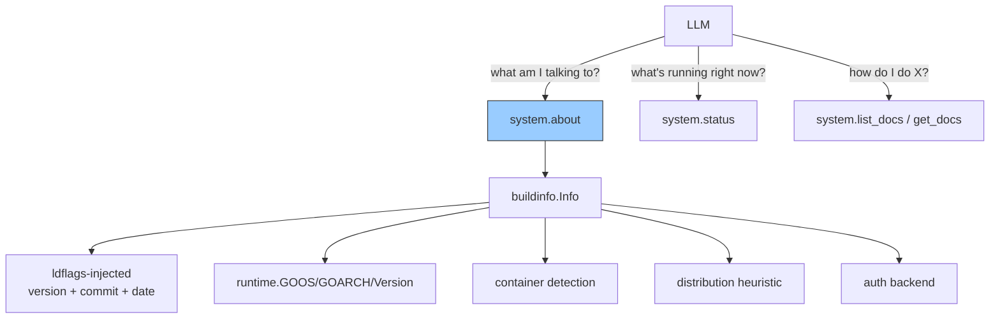

# `system.about` Verb for Build and Environment Troubleshooting Context

## Change Summary

Add a new `about` verb to the `system` aggregate tool that returns a stable,
read-only snapshot of build identity and host environment metadata: version,
commit SHA, build date, Go runtime version, OS, architecture, runtime
classification (native binary on macOS / Linux / Windows vs container vs
unknown), distribution-channel hint (homebrew / scoop / binary / container /
go-install / unknown), token cache backend in use (keychain / file), and
project URLs (homepage, issues, docs base). Extend the build-time `-ldflags`
wiring so commit SHA and build date are injected by GoReleaser and the
`Makefile`. Position `system.about` as the canonical "what am I talking to?"
verb so the LLM can self-orient when helping users troubleshoot, while
`system.status` remains the canonical "what's the current runtime state?"
verb.

## Motivation and Background

CR-0061 added the in-server documentation surface so the LLM can self-serve
docs when users hit problems. That surface is descriptive (concepts,
quickstart, troubleshooting). The remaining gap is *identity* — the LLM has no
way to learn which version, commit, OS, or distribution it is currently
serving from. As a result:

* When a user reports a bug, the LLM cannot include "I'm running v0.6.1 on
  darwin/arm64 from Homebrew" in the issue draft, so users post incomplete
  reports.
* When a user follows a `troubleshooting.md` step that depends on the OS
  (e.g., "if you're on Windows, do X"), the LLM has to ask the user, even
  though the server already knows.
* When a user runs the container variant (CR-0066) and hits the keychain
  warning, the LLM cannot proactively explain the file-fallback — it has to
  be prompted.
* When the user asks "is this the latest version?", the LLM cannot answer
  without external lookup against the GitHub releases.

`system.status` already returns the version string but mixes it with runtime
state (accounts, uptime, config) and lacks build identity (commit, date) and
host environment (OS, container detection, auth backend). Splitting identity
out into a stable `about` verb gives the LLM a small, cacheable, read-only
surface to consult whenever it needs to ground its help in the user's actual
deployment.

## Change Drivers

* **CR-0061 self-troubleshooting**: identity completes the trio of (docs,
  state, identity) needed for the LLM to give grounded help.
* **CR-0066 container distribution**: with multiple runtime variants
  (scratch, distroless, native) the LLM must be able to detect which one is
  serving traffic before recommending a fix.
* **Issue-report quality**: users who paste `system.about` output into a
  GitHub issue give maintainers everything they need on the first round.
* **Distribution channel diagnostics**: Homebrew vs Scoop vs container vs
  `go install` users hit different categories of bug; knowing the channel
  speeds triage.

## Current State

### Build-time Identity

`cmd/outlook-local-mcp/main.go:30` declares `var version = "dev"`, set via
`-ldflags="-X main.version=<value>"`. GoReleaser injects this in
`.goreleaser.yaml:27-28` and `:42-43`. There is no commit-SHA injection and
no build-date injection.

### Runtime Identity

`runtime.GOOS`, `runtime.GOARCH`, `runtime.Version()` are all available
unconditionally from the Go runtime; nothing surfaces them.

### Container Detection

No container detection logic exists. Reliable heuristics:

* `/.dockerenv` exists → Docker container.
* `/run/.containerenv` exists → Podman container.
* `KUBERNETES_SERVICE_HOST` env set → running under Kubernetes.
* `/proc/1/cgroup` contains `docker`, `containerd`, or `kubepods` → container.

The combined heuristic "any of the above is true" is sufficient for an
informational hint; this is not a security boundary.

### Distribution Channel Hint

No tracking exists. Best-effort heuristics:

* `os.Executable()` path contains `/Cellar/` or `/homebrew/` → Homebrew.
* `os.Executable()` path contains `\\scoop\\` (Windows) → Scoop.
* `/.dockerenv` exists → Container.
* Binary lives under `$GOPATH/bin/` or `$GOBIN/` → `go install`.
* Otherwise → `binary` (downloaded archive).

This is a hint, not a guarantee. The output documents it as such.

### Auth Backend Surface

`internal/auth/cache_*.go` selects keychain vs file at startup based on
config and CGO availability. The selected backend is logged at startup
(`slog.Info`) but not surfaced to MCP consumers.

### Existing `status` Verb

`internal/server/system_verbs.go:80-90` and `internal/tools/status.go`. Returns:

* version string
* registered accounts and connection state
* uptime
* config flags (ReadOnly, MailEnabled, MailManageEnabled, AuthMethod)
* docs base URI

`status` mixes static identity (version) with runtime state. This CR **does
not remove** the version field from `status` to preserve backward
compatibility, but treats `about` as the canonical identity source going
forward.

### Current State Diagram



## Proposed Change

### 1. Extend Build-time Identity Injection

Update `cmd/outlook-local-mcp/main.go` to add two new package-level vars:

```go
var (
    version   = "dev"
    commit    = "unknown"
    buildDate = "unknown"
)
```

Update `.goreleaser.yaml` ldflags for both build IDs:

```yaml
ldflags:
  - -s -w
  - -X main.version={{.Version}}
  - -X main.commit={{.ShortCommit}}
  - -X main.buildDate={{.Date}}
```

Update `Makefile` `build` target to inject the same values from `git rev-parse
--short HEAD` and `date -u +%Y-%m-%dT%H:%M:%SZ` for local builds.

### 2. Add `internal/buildinfo/` Package

Small read-only helper package exposing build/runtime identity. Single file,
single function `Snapshot(version, commit, buildDate, authBackend string) Info`. Returns:

```go
type Info struct {
    Version       string
    Commit        string
    BuildDate     string
    GoVersion     string
    OS            string
    Arch          string
    Runtime       string  // "macos" | "linux" | "windows" | "container" | "unknown"
    Distribution  string  // "homebrew" | "scoop" | "container" | "go-install" | "binary" | "unknown"
    AuthBackend   string  // "keychain" | "file"
    Homepage      string
    IssueTracker  string
    DocsBase      string
}
```

`Runtime` is derived by checking container heuristics first; if container,
return `"container"`. Otherwise return `runtime.GOOS` mapped to friendly name.

`Distribution` is derived from `os.Executable()` and `/.dockerenv`; documented
as best-effort.

`AuthBackend` is passed in by the caller (the auth subsystem already knows
its selected backend at init time).

### 3. Add `system.about` Verb

In `internal/server/system_verbs.go`, alongside `statusVerb`, register an
`aboutVerb`:

```go
aboutVerb := tools.Verb{
    Name:        "about",
    Summary:     "return build identity and host environment metadata for troubleshooting",
    Description: "Returns a stable, read-only snapshot of build identity (version, commit, build date, Go runtime) and host environment (OS, architecture, container detection, distribution channel hint, auth backend in use) plus project URLs (homepage, issue tracker, docs base). Use this verb when grounding troubleshooting advice or drafting issue reports — it answers \"what am I talking to?\" without making any Graph call.",
    Examples: []tools.Example{
        {Description: "Get build and environment metadata",
         Args: map[string]any{"operation": "about"}},
    },
    SeeDocs: []string{"concepts.md#container-runtime", "troubleshooting.md"},
    Handler: tools.Handler(aboutHandler),
}
```

Handler is read-only, makes no Graph call, and is safe to call without
authentication. Audit-wrapped as `system.about`/`read`.

### 4. Output Tiering

`about` follows the standard three-tier output model (`text`/`summary`/`raw`):

* **text** (default): a labelled, single-screen rendering suitable for the
  LLM to read once and remember.

  ```
  outlook-local-mcp v0.6.1
    commit: daf5a23
    built:  2026-04-26T19:22:10Z
    go:     go1.23.4
  Host
    os/arch:      darwin/arm64
    runtime:      macos
    distribution: homebrew
    auth backend: keychain
  Links
    homepage: https://github.com/desek/outlook-local-mcp
    issues:   https://github.com/desek/outlook-local-mcp/issues
    docs:     doc://outlook-local-mcp/
  ```

* **summary**: compact JSON with the same fields, suitable for the LLM to
  embed in an issue draft or pass to another tool.

* **raw**: full `buildinfo.Info` JSON.

### 5. Update `system.help` Reference

Add a "Where to start" pointer in the rendered `help` output that suggests
calling `system.about` first when troubleshooting. The Verb registry already
carries `Description` and `Examples`; the `help` formatter just needs to
mention `about` in its overview line.

### 6. Update Documentation

* `docs/concepts.md`: cross-reference `system.about` from the existing
  documentation surface section.
* `docs/troubleshooting.md`: prepend a short "Before you file an issue" entry
  pointing at `system.about` and showing the recommended issue-template
  paste.
* `docs/quickstart.md`: add `system.about` to the verification step.
* `README.md`: no change needed; the verb is discoverable via `help`.

### Proposed State Diagram



## Requirements

### Functional Requirements

#### Build-time Identity Injection

1. The release pipeline **MUST** inject version, short commit SHA, and build
   date (RFC3339, UTC) into the binary via `-ldflags`.
2. Local `make build` **MUST** inject the same fields from `git` and `date`.
3. Default values when ldflags are absent **MUST** be `"dev"`, `"unknown"`,
   `"unknown"` respectively (so a `go run` does not panic).

#### `system.about` Verb

4. A new `about` verb **MUST** be registered on the `system` aggregate tool.
5. The verb **MUST** be read-only and **MUST NOT** call Microsoft Graph.
6. The verb **MUST** be safe to call without authentication.
7. The verb **MUST** be audit-wrapped under the identity `system.about`.
8. The verb **MUST** support the three-tier output model
   (`text`/`summary`/`raw`).
9. The default (`text`) output **MUST** be under 24 lines and **MUST**
   render every field on a labelled line.
10. The verb **MUST** include the following fields: `version`, `commit`,
    `buildDate`, `goVersion`, `os`, `arch`, `runtime`, `distribution`,
    `authBackend`, `homepage`, `issueTracker`, `docsBase`.

#### Container and Distribution Detection

11. `runtime` **MUST** be `"container"` when any of `/.dockerenv`,
    `/run/.containerenv`, `KUBERNETES_SERVICE_HOST` env, or
    `/proc/1/cgroup` containing a known container marker is true.
12. `runtime` **MUST** be `"macos"` / `"linux"` / `"windows"` when not in
    a container, mapped from `runtime.GOOS`.
13. `distribution` **MUST** be one of `"homebrew"`, `"scoop"`,
    `"container"`, `"go-install"`, `"binary"`, `"unknown"` based on the
    documented heuristics.
14. Distribution detection **MUST NOT** panic, error, or block on any
    filesystem access; failures degrade to `"unknown"`.

#### Auth Backend Surface

15. The `authBackend` field **MUST** reflect the currently active token
    cache backend (`"keychain"` or `"file"`).
16. The auth subsystem **MUST** expose its selected backend through an
    exported function or field that the about handler **MUST** read at
    request time.

#### Documentation

17. `system.help` overview **MUST** reference `system.about` as the
    starting point for troubleshooting.
18. `docs/troubleshooting.md` **MUST** include a "Before you file an issue"
    entry that recommends calling `system.about` and pasting the output.
19. The Verb registry's `SeeDocs` for `about` **MUST** point at relevant
    troubleshooting anchors.

#### Tool Annotation Conservatism (CR-0060)

20. Adding `about` to the `system` tool **MUST NOT** change the aggregate
    tool's annotations; `about` is read-only, idempotent, local, and
    non-destructive — strictly less restrictive than verbs already hosted.
21. The `tool_annotations_test.go` **MUST** be updated with an assertion
    for the new verb.

### Non-Functional Requirements

1. The implementation **MUST** add fewer than 200 LoC across all files
   (handler, formatter, buildinfo package, registration, tests).
2. `make ci` **MUST** pass.
3. The about handler **MUST** complete in under 5ms (no I/O beyond the
   filesystem checks for container detection, which are cached after first
   call).
4. No new Go module dependencies.

## Affected Components

| Component | Change |
|-----------|--------|
| `cmd/outlook-local-mcp/main.go` | Add `commit`, `buildDate` package vars; pass into config / build info |
| `.goreleaser.yaml` | Extend ldflags for both build IDs with `commit` and `buildDate` |
| `Makefile` | Extend `build` target ldflags with `commit` and `buildDate` |
| `internal/buildinfo/` (new) | New package: `Info` struct, `Snapshot` function, container/distribution heuristics |
| `internal/auth/` | Expose currently-active backend through a getter |
| `internal/tools/about.go` (new) | About handler, three-tier serializers |
| `internal/tools/text_format.go` | Add `FormatAboutText` formatter |
| `internal/server/system_verbs.go` | Register `aboutVerb`; mention in help overview |
| `internal/tools/tool_annotations_test.go` | Add assertion for `system.about` |
| `internal/tools/about_test.go` (new) | Unit tests for handler and detection helpers |
| `docs/concepts.md` | Cross-reference about verb |
| `docs/quickstart.md` | Add to verification step |
| `docs/troubleshooting.md` | "Before you file an issue" entry |
| `extension/manifest.json` | No change (aggregate tool count stays at 4) |

## Scope Boundaries

### In Scope

* New `system.about` verb with three output tiers.
* Build-time injection of commit and build date.
* Container and distribution heuristics, documented as best-effort.
* Auth backend surface through the existing auth package.
* Help/troubleshooting docs cross-references.

### Out of Scope ("Here, But Not Further")

* **Removing the `version` field from `system.status`.** Backward
  compatibility — keep both. About is canonical going forward.
* **Telemetry / phone-home of `about` data.** This is a local read-only
  verb; it does not transmit anything. A future CR could add an opt-in
  metric, but not here.
* **Update-checking against GitHub releases.** Out of scope; would require
  network egress and changes its semantic class. A separate
  `system.check_updates` verb could host that later.
* **License and dependency manifest in `about`.** SBOM lives in the
  release artifacts already; not duplicating in `about`.
* **PII or tenant-id surfacing.** `about` is build identity, not account
  identity; tenant/client values stay out.
* **Multi-language localisation of the text tier.** English only.
* **Adding a `mcp-go` library version to the output.** The Go module
  version is implied by the build; not surfacing it would be cleaner unless
  a real troubleshooting case demands it.

## Alternative Approaches Considered

* **Extend `system.status` instead of adding `about`.** Mixes static
  identity with runtime state and bloats every `status` call. Rejected:
  identity is read-once, status is read-often.
* **Expose identity only through MCP `serverInfo`.** The MCP `serverInfo`
  field carries name/version. It does not carry commit, build date, OS, or
  runtime classification, and it is delivered once at handshake time, not
  on demand. Rejected: insufficient surface and not addressable from the
  LLM mid-session.
* **Auto-include identity in every error envelope.** Pollutes errors with
  static metadata. Rejected: keep errors lean, identity is an explicit
  query.
* **Use `runtime/debug.ReadBuildInfo()` instead of ldflags for commit.**
  `ReadBuildInfo` returns the VCS info embedded by Go 1.18+, which works
  out of the box for `go install` users. Rejected as the *only* source
  because the GoReleaser-built binaries explicitly disable VCS embedding;
  but accepted as a *fallback* — when ldflags say `"unknown"` and
  `ReadBuildInfo` has VCS data, prefer the latter.

## Impact Assessment

### User Impact

After this change, the LLM gains a single-call, read-only verb to ground
its help. Users see better-targeted troubleshooting and richer issue
reports. No breaking change.

### Technical Impact

* **Binary**: ~+1 KB from new code paths.
* **Build pipeline**: GoReleaser already exposes `{{.ShortCommit}}` and
  `{{.Date}}`; just two new ldflag entries.
* **Tests**: ~3 new test files, all unit-level.

### Business Impact

Reduces issue-triage time by giving maintainers complete environment
context on the first round.

## Implementation Approach

### Phase 1: Build-time Wiring

1. Add `commit` and `buildDate` package vars in `main.go`.
2. Extend `.goreleaser.yaml` ldflags.
3. Extend `Makefile` `build` target with `git`/`date` interpolation.
4. Verify a snapshot build prints non-`unknown` values.

### Phase 2: `internal/buildinfo/` Package

1. Create the package with the `Info` struct.
2. Implement container detection (single function, OR'd checks).
3. Implement distribution heuristic.
4. Add `Snapshot(version, commit, buildDate, authBackend string) Info`.
5. Unit tests for each detection helper.

### Phase 3: Auth Backend Getter

Expose the currently-selected backend ("keychain" or "file") from
`internal/auth/`. A simple `func ActiveBackend() string` reading the
package-level state set during `InitCache`.

### Phase 4: About Handler and Formatter

1. Create `internal/tools/about.go` with the handler and three-tier
   serializers.
2. Add `FormatAboutText` to `text_format.go`.
3. Wire into `internal/server/system_verbs.go` as `aboutVerb`.
4. Update `system.help` overview to mention `about`.

### Phase 5: Tests

1. Unit tests for handler, formatter, detection helpers.
2. Update `tool_annotations_test.go`.
3. Update CRUD prompt (`docs/prompts/mcp-tool-crud-test.md`) to include
   an `operation: about` step under the system domain.

### Phase 6: Documentation

1. `docs/concepts.md`: anchor + cross-reference.
2. `docs/quickstart.md`: verification step.
3. `docs/troubleshooting.md`: "Before you file an issue" entry.
4. Regenerate `llms.txt` via `make docs-bundle`.

## Test Strategy

| Test | Method | Inputs | Expected Output |
|------|--------|--------|-----------------|
| `Snapshot` returns all fields | unit | known build vars | non-empty struct |
| Container detection — `/.dockerenv` | unit, fake fs | mocked file presence | runtime="container" |
| Container detection — KUBERNETES env | unit, env | env set | runtime="container" |
| Container detection — none | unit | clean fs/env | runtime=GOOS friendly name |
| Distribution heuristic — homebrew path | unit | exec path with `/Cellar/` | distribution="homebrew" |
| Distribution heuristic — scoop path | unit | exec path with `\\scoop\\` | distribution="scoop" |
| Distribution heuristic — go install | unit | exec path under `$GOBIN` | distribution="go-install" |
| About handler — text default | integration | empty args | renders 12-field text block |
| About handler — summary | integration | output=summary | compact JSON |
| About handler — raw | integration | output=raw | full Info JSON |
| Tool annotations | unit | new verb registered | aggregate annotations unchanged |
| Auth backend reflected | unit | InitCache with storage="file" | authBackend="file" |
| Help overview references about | unit | render system.help | overview text mentions `system.about` |
| Default ldflags absent | unit | `go run` (no ldflags) | version="dev", commit="unknown", buildDate="unknown" |
| Distribution detection failure | unit | unreadable executable path | distribution="unknown", no panic |
| About handler latency | unit | benchmark | completes in under 5ms |
| `make ci` | full | full tree | passes |

## Acceptance Criteria

### AC-1: `system.about` returns build identity

```gherkin
Given a binary built with ldflags injection
When the LLM calls system with operation="about"
Then the response contains version, commit, and buildDate matching the build
  And the response contains goVersion, os, arch, runtime, distribution, authBackend
  And the response contains homepage, issueTracker, docsBase URLs
```

### AC-2: Container runtime is detected

```gherkin
Given the binary is running inside a Docker container
When system.about is called
Then the runtime field is "container"
  And the distribution field is "container"
```

### AC-3: Auth backend reflects actual selection

```gherkin
Given the server started with token cache storage "file"
When system.about is called
Then the authBackend field is "file"
```

### AC-4: Default output is readable in one screen

```gherkin
Given system.about is called with default output mode
When the response is rendered
Then it is plain text under 24 lines
  And every field has a labelled line
```

### AC-5: Verb does not call Graph

```gherkin
Given the server has no signed-in account
When system.about is called
Then the response is returned without authentication errors
  And no Microsoft Graph request is made
```

### AC-6: Help references about

```gherkin
Given the system.help output
When the overview section is rendered
Then it suggests calling system.about as the starting point for troubleshooting
```

### AC-7: Aggregate tool annotations unchanged

```gherkin
Given the new about verb is registered on the system tool
When tool_annotations_test runs
Then the system tool annotations match the values prior to this CR
  And the about verb is asserted as read-only, idempotent, local, non-destructive
```

### AC-8: Build pipeline injects commit and date

```gherkin
Given a GoReleaser snapshot build
When the binary is run with operation="about"
Then commit is a 7-character short SHA
  And buildDate is an RFC3339 UTC timestamp
  And neither equals "unknown"
```

## Quality Standards Compliance

### Build & Compilation

- [ ] `goreleaser check` passes after ldflags update
- [ ] `make build` (local) injects `commit` and `buildDate`
- [ ] `make ci` passes

### Linting & Code Style

- [ ] `make lint` clean
- [ ] `make fmt-check` clean

### Test Execution

- [ ] New unit tests pass with `-race`
- [ ] `tool_annotations_test.go` updated and passing
- [ ] CRUD prompt updated with `system.about` step

### Documentation

- [ ] `docs/concepts.md` cross-reference
- [ ] `docs/quickstart.md` verification step
- [ ] `docs/troubleshooting.md` "Before you file an issue" entry
- [ ] `make docs-bundle` regenerates `llms.txt` cleanly
- [ ] Verb `Description`, `Examples`, and `SeeDocs` populated in registry

### Code Review

- [ ] Changes submitted via PR
- [ ] PR title follows Conventional Commits format
- [ ] Squash merged for linear history

## Risks and Mitigation

### Risk 1: Container detection false positives

**Likelihood:** low
**Impact:** low
**Mitigation:** Heuristics are documented as such. Output of `runtime` is
informational, not security-relevant. A misclassified "container" on a host
that happens to have a `kubepods` cgroup string is benign.

### Risk 2: Distribution heuristic misclassifies

**Likelihood:** medium
**Impact:** low
**Mitigation:** Default to `"unknown"` rather than guessing wrong; the LLM
can still ask the user when it matters. Users running unusual install
methods (custom scripts, vendored builds) get `"unknown"` and that's fine.

### Risk 3: ldflags drift between Makefile and GoReleaser

**Likelihood:** medium
**Impact:** low
**Mitigation:** Keep the var names identical (`main.commit`,
`main.buildDate`); add a unit test that fails if either is empty in the
test binary.

### Risk 4: `runtime/debug.ReadBuildInfo` differs from ldflags

**Likelihood:** low
**Impact:** low
**Mitigation:** Documented preference order: ldflags first, ReadBuildInfo
fallback when ldflags say `"unknown"`. Test covers both paths.

### Risk 5: About output drifts from documented schema

**Likelihood:** low
**Impact:** medium
**Mitigation:** Field set is asserted in tests. Adding new fields is a
non-breaking change; renaming or removing them is breaking and triggers a
new CR.

## Dependencies

* No new Go module dependencies.
* `runtime/debug.ReadBuildInfo` is in stdlib (Go 1.18+).
* GoReleaser template variables `{{.ShortCommit}}` and `{{.Date}}` already
  exist.

## Estimated Effort

3–4 person-hours, distributed as:

| Phase | Effort |
|-------|--------|
| Phase 1: Build-time wiring (main.go, goreleaser, Makefile) | 30 minutes |
| Phase 2: `internal/buildinfo/` package + tests | 1 hour |
| Phase 3: Auth backend getter | 15 minutes |
| Phase 4: About handler, formatter, registration | 1 hour |
| Phase 5: Tests (unit, annotations, CRUD prompt) | 30 minutes |
| Phase 6: Documentation | 30 minutes |

## Decision Outcome

Chosen approach: "Add a dedicated `system.about` verb that returns
build-time identity (version, commit, build date, Go runtime) plus host
environment (OS, arch, container detection, distribution hint, auth
backend) plus project URLs, separate from `system.status` (runtime state).
Inject commit and build date via ldflags. Document the verb as the
starting point for troubleshooting." This gives the LLM a small,
predictable, read-only surface to ground its help and to draft
issue-quality reports without duplicating runtime state.

## Related Items

* CR-0060: Domain Aggregate Tools — defines the verb dispatch and
  conservative-annotation rules `about` plugs into.
* CR-0061: In-server Documentation Access — the docs surface this CR
  cross-references; together they form the (docs, state, identity) trio.
* CR-0063: Typed Verbs and Self-describing Tool Registry — provides the
  `Verb.Description`, `Examples`, `SeeDocs` fields used here.
* CR-0066: Docker Distribution and Container Runtime Documentation —
  the runtime-detection categories `about` returns are the same set
  documented in `docs/concepts.md#container-runtime`.

<!--
## CR Review Summary (Agent 2)

Findings: 5
Fixes applied:
1. Resolved `Snapshot` signature contradiction between Section 2 and Phase 2
   (now consistently takes `version, commit, buildDate, authBackend`).
2. Tightened FR-9 from vague "~24 lines" to MUST under 24 lines with labelled
   field lines, aligning with AC-4.
3. Replaced vague wording in FR-16 ("method or field that the about handler
   can read") with MUST-form requirement on both auth subsystem and handler.
4. Added Test Strategy rows for AC-3 (auth backend) and AC-6 (help overview),
   previously uncovered.
5. Added Test Strategy rows for FR-3 (ldflags-absent defaults), FR-14
   (distribution detection no-panic fallback), and NFR-3 (under-5ms latency)
   to close requirement-to-test coverage gaps.

Unresolved items: none.

CLAUDE.md compliance verified:
- Aggregate-tool verb dispatch (CR-0060): `about` added as a verb under the
  existing `system` aggregate tool — not a new top-level tool. OK.
- 5 MCP annotations: aggregate annotations unchanged (FR-20, AC-7); new verb
  is read-only/idempotent/local/non-destructive, strictly less restrictive.
- Three-tier output (text/summary/raw): all three implemented (FR-8, Section 4).
- `extension/manifest.json`: aggregate count unchanged, no manifest update
  needed — explicitly noted in Affected Components.
- Go doc comments and small isolated files: new `internal/buildinfo/` and
  `internal/tools/about.go` files keep LoC small per project convention.
- CRUD test coverage: Phase 5 explicitly updates
  `docs/prompts/mcp-tool-crud-test.md`. OK.
-->

