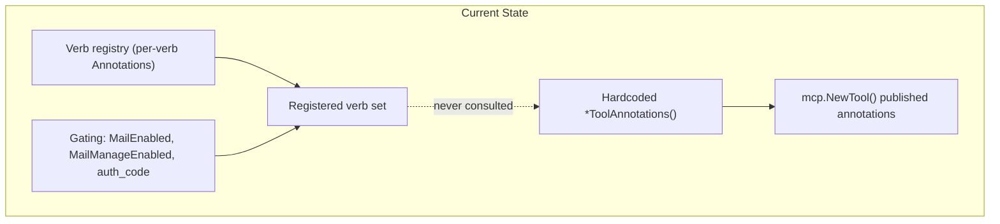
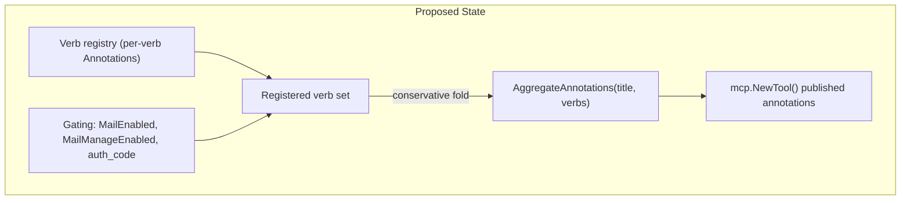
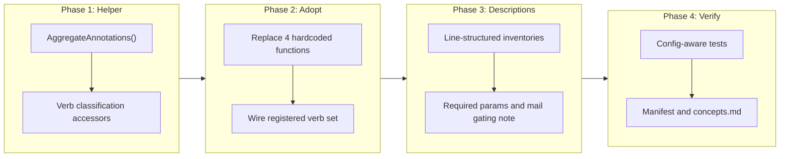

# Tool definition quality and annotation accuracy

## Change Summary

The four aggregate domain tools (`calendar`, `mail`, `account`, `system`) currently
publish MCP annotations as hardcoded constants that describe the *maximum possible*
verb surface rather than the verbs actually registered in the running configuration.
In the default gated configuration this makes the published `tools/list` payload
factually wrong: `mail` advertises `readOnlyHint: false, destructiveHint: true`
while exposing only read verbs.

This change makes aggregate annotations a computed property of the registered verb
set, and raises the descriptive quality of the tool definitions so an LLM consumer
can select a verb and construct its arguments from `tools/list` alone.

## Motivation and Background

Two independent motivations converge on the same set of defects.

**Correctness.** MCP annotations are behavioural contracts. A client that respects
`destructiveHint` will gate `mail` reads behind a user confirmation that serves no
purpose, because every registered `mail` verb in the default configuration is
read-only. `system` advertises `openWorldHint: true` while all six registered verbs
are local and issue no Graph call. Publishing a hint that does not match observable
behaviour is a defect regardless of who is reading it.

**Directory listing.** The Glama MCP directory renders a quality score badge whose
methodology is public: the overall score is 70% Tool Definition Quality plus 30%
Server Coherence. Tool Definition Quality scores each tool 1-5 across Purpose
Clarity (25%), Usage Guidelines (20%), Behavioral Transparency (20%), Parameter
Semantics (15%), Conciseness and Structure (10%), and Contextual Completeness
(10%). The server-level aggregation is 60% mean plus 40% minimum, so with only four
tools the weakest description carries roughly 40% of the Tool Definition Quality
term. Inaccurate annotations attack the Behavioral Transparency dimension directly.

An audit of the live `tools/list` payload (captured from the container image built
at `3ec5c17`) produced four observations, recorded here as OBS-1 through OBS-4.

### Audit baseline

| Tool | Description chars | Parameters | Verbs in enum | Params lacking a description |
|------|------------------:|-----------:|--------------:|-----------------------------:|
| `account` | 660 | 6 | 7 | 0 |
| `calendar` | 1479 | 33 | 15 | 0 |
| `mail` | 545 | 18 | 5 | 0 |
| `system` | 755 | 5 | 6 | 0 |

## Change Drivers

* Published MCP annotations do not match the behaviour of the registered verb set.
* The `Verb` registry already carries per-verb `Annotations`, and its own docstring
  states they exist so the dispatcher "can compute conservative aggregate
  annotations across all verbs in a domain". That mechanism was never wired up.
* Gated configurations (`MailEnabled`, `MailManageEnabled`, `auth_code`) change the
  registered verb set at runtime, so any static annotation is wrong in at least one
  supported configuration.
* An agent reading `tools/list` cannot determine which of `calendar`'s 33 flat
  parameters apply to which of its 15 verbs without a second `help` round-trip.

## Current State

Each domain contributes a `*ToolAnnotations()` function returning five hardcoded
`mcp.ToolOption` values. `internal/server/server.go` passes the result to
`mcp.NewTool()` at registration time. The functions take no arguments and therefore
cannot observe which verbs were registered.

Observed in `internal/server/mail_verbs.go:617` and
`internal/server/system_verbs.go:300`:

```go
func mailToolAnnotations() []mcp.ToolOption {
    return []mcp.ToolOption{
        mcp.WithTitleAnnotation("Mail"),
        mcp.WithReadOnlyHintAnnotation(false),
        mcp.WithDestructiveHintAnnotation(true),
        mcp.WithIdempotentHintAnnotation(false),
        mcp.WithOpenWorldHintAnnotation(true),
    }
}
```

The `Verb` struct in `internal/tools/dispatch_registry.go` already carries an
`Annotations []mcp.ToolOption` field per verb. Nothing reads it when building the
aggregate.

### Current State Diagram



### Observations

**OBS-1 (Behavioral Transparency, correctness).** Aggregate annotations are static
and contradict the registered verb set. In default configuration `mail` registers
`help`, `list_folders`, `list_messages`, `get_message`, `search_messages` -- all
read-only -- yet publishes `readOnlyHint: false` and `destructiveHint: true`.
`system` registers six local verbs yet publishes `openWorldHint: true`.

**OBS-2 (Parameter Semantics, Contextual Completeness).** Every domain declares a
flat parameter object with `operation` as the sole required field. `calendar`
exposes 33 parameters with no machine-readable or prose association between a verb
and the parameters it accepts or requires.

**OBS-3 (Completeness).** The `mail` description does not mention that write verbs
exist behind `MailEnabled` and `MailManageEnabled`. A reader comparing `mail`
(read-only) against `calendar` (full read and write) sees an apparent gap in the
tool surface rather than a deliberate gating decision.

**OBS-4 (Conciseness and Structure).** Verb inventories are rendered as a single
run-on paragraph of backtick-delimited, comma-separated entries. The `calendar`
description is 1479 characters in one unbroken block.

## Proposed Change

Aggregate annotations become a pure function of the registered verb set, computed
by a single shared helper rather than four hardcoded functions. Tool descriptions
gain a structured verb inventory, a parameter-applicability statement, and, for
`mail`, an explicit note about gated verbs.

### Proposed State Diagram



The fold is conservative in the sense already defined in AGENTS.md: `readOnlyHint`
is true only when every registered verb is read-only; `destructiveHint`,
`idempotentHint` and `openWorldHint` each take the most cautious value present
across the registered verbs.

## Requirements

### Functional Requirements

1. The system **MUST** compute each aggregate tool's five MCP annotations from the
   set of verbs actually registered for that domain in the running configuration.
2. The system **MUST** expose a single shared helper that performs the conservative
   fold, and all four domains **MUST** use it rather than domain-local hardcoded
   values.
3. The system **MUST** set `readOnlyHint` to true when every registered verb in the
   domain is read-only, and false otherwise.
4. The system **MUST** set `destructiveHint` to true when at least one registered
   verb is destructive, and false otherwise.
5. The system **MUST** set `idempotentHint` to false when at least one registered
   verb is non-idempotent, and true otherwise.
6. The system **MUST** set `openWorldHint` to true when at least one registered verb
   calls Microsoft Graph, and false otherwise.
7. The system **MUST** produce `readOnlyHint: true`, `destructiveHint: false` and
   `openWorldHint: true` for the `mail` tool when neither `MailEnabled` nor
   `MailManageEnabled` is set.
8. The system **MUST** produce `openWorldHint: false` for the `system` tool when the
   `auth_code` verb `complete_auth` is not registered.
9. The system **MUST** state, for every verb in every domain tool description, which
   parameters that verb requires.
10. The system **MUST** render each verb inventory entry on its own line rather than
    as a single run-on paragraph.
11. The system **MUST** state in the `mail` tool description that additional write
    verbs are registered when `MailEnabled` or `MailManageEnabled` is configured,
    and name the configuration keys that control them.
12. The system **MUST** keep every parameter's `description` field non-empty, as is
    already the case for all 62 parameters across the four tools.
13. The system **MUST** derive each verb's read-only, destructive, idempotent and
    open-world classification from that verb's registry `Annotations` entry, so a
    new verb cannot be added without declaring its classification.

### Non-Functional Requirements

1. The system **MUST NOT** change any verb name, parameter name, parameter type, or
   handler behaviour.
2. The system **MUST** keep the aggregate annotation computation free of I/O so that
   tool registration remains synchronous and side-effect free.
3. The system **MUST** keep each tool description under 4000 characters so that
   `tools/list` payload growth stays bounded.

## Affected Components

* `internal/tools/aggregate_annotations.go` -- new file: shared conservative-fold
  helper and verb classification accessors (kept separate from
  `dispatch_registry.go` per the small-single-purpose-file convention in AGENTS.md).
* `internal/tools/dispatch_registry.go` -- reused unchanged as the source of the
  per-verb `Annotations` field consumed by the helper.
* `internal/server/mail_verbs.go` -- remove hardcoded annotations, adopt helper,
  extend description with the gating note.
* `internal/server/calendar_verbs.go` -- remove hardcoded annotations, adopt helper,
  restructure the verb inventory.
* `internal/server/account_verbs.go` -- remove hardcoded annotations, adopt helper.
* `internal/server/system_verbs.go` -- remove hardcoded annotations, adopt helper.
* `internal/server/server.go` -- pass the registered verb set into the helper.
* `internal/tools/tool_annotations_test.go` -- existing `TestAggregateAnnotations_*`
  assertions become configuration-aware.
* `internal/tools/aggregate_annotations_test.go` -- new file: unit tests for the fold.
* `internal/tools/description_quality_test.go` -- new file: description structure and
  bound checks.
* `internal/tools/verb_metadata_test.go` -- add the per-verb classification-presence
  assertion (alongside the existing `TestEveryVerbHasDescription`).
* `extension/manifest.json` -- tool entries kept in sync per AGENTS.md.
* `docs/concepts.md` -- annotation semantics under gated configurations.

## Scope Boundaries

### In Scope

* Deriving the five aggregate annotations from the registered verb set.
* A shared conservative-fold helper used by all four domains.
* Per-verb required-parameter statements in the four tool descriptions.
* Line-structured verb inventories in the four tool descriptions.
* The `mail` gated-write-verbs note.
* Tests covering gated and ungated configurations.

### Out of Scope ("Here, But Not Further")

* Per-verb annotations in the `tools/list` payload. The MCP specification defines
  annotations at tool granularity only; expressing them per verb would require a
  spec extension and is not attempted.
* Splitting the aggregate tools back into per-verb MCP tools. The four-tool surface
  established by CR-0060 is retained.
* JSON Schema `oneOf`/`allOf` conditional parameter validation keyed on
  `operation`. Requirement 9 is satisfied in prose; encoding it in the schema is
  deferred pending evidence that MCP clients honour conditional subschemas.
* Any change to `system.help`, `docs/`, or the registry `Description`, `Examples`
  and `SeeDocs` fields beyond what requirements 9 to 11 demand.
* Submission to the Glama directory and the awesome-mcp-servers pull request. Those
  are downstream actions, not code changes.

## Alternative Approaches Considered

* **Keep hardcoded annotations, document the imprecision.** Rejected: the published
  hint would remain factually wrong in the default configuration, and the defect is
  a correctness issue independent of any directory listing.
* **Compute annotations at call time rather than registration time.** Rejected:
  `tools/list` is served from the registration-time tool definition, so a call-time
  computation would never reach the client.
* **Encode parameter applicability as JSON Schema `oneOf` branches keyed on
  `operation`.** Rejected for this change: client support for conditional
  subschemas is inconsistent, and a malformed schema degrades every consumer.
  Recorded above as out of scope.
* **Widen the default configuration so the static annotations become true.**
  Rejected: this would enable mail write verbs by default, a security regression.

## Impact Assessment

### User Impact

Clients that honour `destructiveHint` will stop prompting for confirmation on
read-only `mail` operations. Clients that honour `openWorldHint` will correctly
treat `system` as local in configurations without `complete_auth`. No verb, name,
or argument changes, so existing prompts and scripts continue to work.

### Technical Impact

No breaking API change. The published annotation values change for `mail` and
`system` in gated configurations, which is the intended correction. Four hardcoded
functions are replaced by one shared helper, removing duplicated logic. Tool
description length grows; requirement NFR-3 bounds it.

### Business Impact

Removes a correctness defect in the published MCP contract and addresses the two
Behavioral Transparency and Completeness observations that most plausibly suppress
the Glama quality score, which gates the awesome-mcp-servers listing.

## Implementation Approach

Four sequential phases, each independently verifiable.

* **Phase 1 -- Shared fold helper.** Add `AggregateAnnotations(title string, verbs
  []Verb) []mcp.ToolOption` in a new `internal/tools/aggregate_annotations.go`, plus
  accessors that read a verb's classification from its registry `Annotations`.
  Because `Annotations` is a `[]mcp.ToolOption` of opaque functional options, the
  accessors **MUST** materialise each verb's annotation values (for example by
  applying the options to a throwaway `mcp.Tool` and reading the resulting
  `Annotations` struct) rather than attempting to inspect the closures directly.
  Unit-test the fold in isolation.
* **Phase 2 -- Adopt the helper.** Replace the four `*ToolAnnotations()` functions
  with calls to the helper, passing the registered verb slice. Delete the hardcoded
  values.
* **Phase 3 -- Description quality.** Restructure the four verb inventories onto
  separate lines, add per-verb required-parameter statements, and add the `mail`
  gating note.
* **Phase 4 -- Tests, manifest, docs.** Extend `tool_annotations_test.go` for gated
  and ungated configurations, sync `extension/manifest.json`, and document the
  gating-dependent annotation semantics in `docs/concepts.md`.

### Implementation Flow



## Test Strategy

### Tests to Add

| Test File | Test Name | Description | Inputs | Expected Output |
|-----------|-----------|-------------|--------|-----------------|
| `internal/tools/aggregate_annotations_test.go` | `TestAggregateAnnotationsAllReadOnly` | Fold over read-only verbs only | 3 read-only verbs | `readOnlyHint: true`, `destructiveHint: false` |
| `internal/tools/aggregate_annotations_test.go` | `TestAggregateAnnotationsOneDestructive` | One destructive verb dominates | 2 read-only, 1 destructive | `destructiveHint: true`, `readOnlyHint: false` |
| `internal/tools/aggregate_annotations_test.go` | `TestAggregateAnnotationsAllLocal` | No Graph verb yields closed world | 3 local verbs | `openWorldHint: false` |
| `internal/tools/aggregate_annotations_test.go` | `TestAggregateAnnotationsOneNonIdempotent` | One non-idempotent verb dominates (AC-11, FR-5) | 2 idempotent, 1 non-idempotent | `idempotentHint: false` |
| `internal/tools/aggregate_annotations_test.go` | `TestAggregateAnnotationsEmptyVerbSet` | Degenerate empty registry | empty slice | Deterministic conservative default, no panic |
| `internal/tools/tool_annotations_test.go` | `TestMailAnnotationsGatedReadOnly` | Default config exposes read verbs only | `MailEnabled=false` | `readOnlyHint: true`, `destructiveHint: false` |
| `internal/tools/tool_annotations_test.go` | `TestMailAnnotationsManageEnabled` | Full mail surface | `MailManageEnabled=true` | `readOnlyHint: false`, `destructiveHint: true` |
| `internal/tools/tool_annotations_test.go` | `TestSystemAnnotationsClosedWorld` | No `complete_auth` registered | `auth_code` unset | `openWorldHint: false` |
| `internal/tools/tool_annotations_test.go` | `TestSystemAnnotationsOpenWorldWithAuthCode` | `complete_auth` registered | `auth_code` set | `openWorldHint: true` |
| `internal/tools/description_quality_test.go` | `TestDescriptionsListVerbsOnSeparateLines` | Structural check for OBS-4 | 4 tool descriptions | Each verb entry on its own line |
| `internal/tools/description_quality_test.go` | `TestMailDescriptionMentionsGatedVerbs` | OBS-3 coverage | `mail` description | Names `MailEnabled` and `MailManageEnabled` |
| `internal/tools/description_quality_test.go` | `TestEveryVerbStatesRequiredParameters` | OBS-2 coverage | all registered verbs | Each verb names its required parameters |
| `internal/tools/description_quality_test.go` | `TestDescriptionLengthBounded` | NFR-3 coverage | 4 tool descriptions | Each under 4000 characters |
| `internal/tools/description_quality_test.go` | `TestEveryParameterHasDescription` | AC-12, FR-12 regression guard | all parameters of all 4 tools | Every parameter description field non-empty |
| `internal/tools/verb_metadata_test.go` | `TestEveryVerbHasClassification` | AC-9, FR-13 coverage; mirrors existing `TestEveryVerbHasDescription` | all registered verbs | Each verb has a non-empty `Annotations` entry, else the test fails naming the verb |

### Tests to Modify

| Test File | Test Name | Current Behavior | New Behavior | Reason for Change |
|-----------|-----------|------------------|--------------|-------------------|
| `internal/tools/tool_annotations_test.go` | `TestAggregateAnnotations_Mail` | Asserts the hardcoded aggregate under `MailEnabled=true, MailManageEnabled=true` (`destructiveHint: true`) | Asserts the same full-surface values now produced by `AggregateAnnotations` over the registered verb set; the gated-config case is added separately as `TestMailAnnotationsGatedReadOnly` | The hardcoded `mailToolAnnotations()` it exercised no longer exists |
| `internal/tools/tool_annotations_test.go` | `TestAggregateAnnotations_System` | Asserts `openWorldHint: true` under `AuthMethod: browser` (no `complete_auth`) | Asserts the derived value: `openWorldHint: false` when `complete_auth` is not registered, `true` when `auth_code` is active | Encodes the `system` defect in OBS-1; the browser config must now yield closed-world |
| `internal/tools/tool_annotations_test.go` | `TestAggregateAnnotations_Calendar` and `TestAggregateAnnotations_Account` | Assert hardcoded per-domain aggregates via the `assertAggregateAnnotations` helper | Assert the same expected values now produced by `AggregateAnnotations` over the registered verb set | The hardcoded `*ToolAnnotations()` functions they exercised no longer exist |

### Tests to Remove

| Test File | Test Name | Reason for Removal |
|-----------|-----------|-------------------|
| _None_ | _None_ | No test becomes redundant; the three listed above are modified rather than deleted, because their coverage intent (five annotations present, per-domain values correct) survives the change. |

## Acceptance Criteria

### AC-1: Gated mail advertises read-only

```gherkin
Given the server is configured with MailEnabled unset and MailManageEnabled unset
When an MCP client issues a tools/list request
Then the mail tool reports readOnlyHint true
  And the mail tool reports destructiveHint false
  And the mail tool reports openWorldHint true
```

### AC-2: Enabled mail management advertises write and destructive

```gherkin
Given the server is configured with MailManageEnabled set
When an MCP client issues a tools/list request
Then the mail tool reports readOnlyHint false
  And the mail tool reports destructiveHint true
```

### AC-3: System is closed-world without complete_auth

```gherkin
Given the server is configured without the auth_code authentication method
When an MCP client issues a tools/list request
Then the system tool reports openWorldHint false
```

### AC-4: System is open-world with complete_auth

```gherkin
Given the server is configured with the auth_code authentication method
  And the complete_auth verb is registered
When an MCP client issues a tools/list request
Then the system tool reports openWorldHint true
```

### AC-5: A single destructive verb dominates the aggregate

```gherkin
Given a domain registers the destructive verb delete_event alongside read-only verbs
When the aggregate annotations are computed for that domain
Then destructiveHint is true
  And readOnlyHint is false
```

### AC-6: Verb inventories are line-structured

```gherkin
Given the four aggregate tool descriptions
When an MCP client issues a tools/list request
Then each verb inventory entry appears on its own line
  And no description exceeds 4000 characters
```

### AC-7: Required parameters are discoverable without a help round-trip

```gherkin
Given the calendar tool exposes 15 verbs and 33 parameters
When an MCP client reads the calendar tool description from tools/list
Then the description states which parameters each verb requires
```

### AC-8: Gated mail verbs are disclosed

```gherkin
Given the server is configured with MailEnabled unset
When an MCP client reads the mail tool description
Then the description states that additional write verbs are registered when MailEnabled or MailManageEnabled is configured
```

### AC-9: New verbs cannot omit a classification

```gherkin
Given a contributor adds a verb to a domain registry without an Annotations entry
When the test suite runs
Then a test fails identifying the verb missing its classification
```

### AC-10: No behavioural regression

```gherkin
Given the full test suite and the container smoke tests
When make ci and the container-build jobs run
Then every verb name, parameter name, and handler behaviour is unchanged
  And all four aggregate tools remain present in tools/list
```

### AC-11: A single non-idempotent verb dominates the aggregate

```gherkin
Given a domain registers a non-idempotent verb alongside idempotent verbs
When the aggregate annotations are computed for that domain
Then idempotentHint is false
```

### AC-12: Every parameter carries a non-empty description

```gherkin
Given the four aggregate tools registered in any configuration
When an MCP client issues a tools/list request
Then every parameter of every tool has a non-empty description field
```

## Quality Standards Compliance

### Build & Compilation

- [x] Code compiles/builds without errors
- [x] No new compiler warnings introduced

### Linting & Code Style

- [x] All linter checks pass with zero warnings/errors
- [x] Code follows project coding conventions and style guides
- [x] Any linter exceptions are documented with justification

### Test Execution

- [x] All existing tests pass after implementation
- [x] All new tests pass
- [x] Test coverage meets project requirements for changed code

### Documentation

- [x] Inline code documentation updated where applicable
- [x] `docs/concepts.md` documents gating-dependent annotation semantics
- [x] `extension/manifest.json` kept in sync with the registered tool surface

### Code Review

- [ ] Changes submitted via pull request
- [ ] PR title follows Conventional Commits format
- [ ] Code review completed and approved
- [ ] Changes squash-merged to maintain linear history

### Verification Commands

```bash
# Full quality pipeline
make ci

# Targeted annotation and description tests
go test ./internal/tools/ -run 'Annotation|Description' -v

# Verify the published payload in a built container
./scripts/smoke-test-image.sh outlook-local-mcp:ci-standalone
```

## Risks and Mitigation

### Risk 1: A client caches the previous annotation values

**Likelihood:** low
**Impact:** low
**Mitigation:** Annotations are read from `tools/list` at session start; no client is
known to persist them across sessions. The change ships in a tagged release so the
version reported by `system.about` identifies which semantics are in effect.

### Risk 2: Description growth inflates the cold-start token cost

**Likelihood:** medium
**Impact:** medium
**Mitigation:** NFR-3 caps each description at 4000 characters and
`TestDescriptionLengthBounded` enforces it. The CR-0060 token bench is re-run after
Phase 3 so the regression is measured rather than assumed.

### Risk 3: The conservative fold is wrong for a verb whose classification is mis-declared

**Likelihood:** medium
**Impact:** high
**Mitigation:** Requirement 13 makes the classification a mandatory registry field,
and AC-9 fails the build when it is absent. The existing per-verb annotation
assertions continue to pin each verb's declared values.

### Risk 4: Relaxing readOnlyHint to true weakens a client-side guard

**Likelihood:** low
**Impact:** medium
**Mitigation:** `readOnlyHint: true` is emitted only when every registered verb is
read-only, which is verified per configuration by AC-1 and AC-2. `ReadOnlyGuard`
middleware remains the server-side enforcement point and is unchanged.

## Dependencies

* Depends on the verb registry introduced by CR-0060.
* Depends on the registry-driven reference content from CR-0065.
* Depends on `system.about` from CR-0067 for reporting the active configuration.
* No external or third-party dependency.

## Estimated Effort

Approximately 10 to 14 person-hours: 3 for the helper and its unit tests, 2 for
adoption across four domains, 4 to 6 for description restructuring across 33
verbs, and 2 to 3 for configuration-aware tests, manifest and documentation.

## Decision Outcome

Chosen approach: "compute aggregate annotations from the registered verb set via a
shared conservative fold, and raise description quality in the same change",
because the annotation defect and three of the four observations share a single
root cause -- tool metadata that is authored statically instead of derived from the
registry that already holds the facts. Fixing them together avoids touching the
same four files twice, and the registry field required to make the fold correct is
the same field that makes the per-verb documentation complete.

## Related Items

* Builds on: CR-0060 (four aggregate domain tools, conservative aggregation rule)
* Builds on: CR-0065 (registry-driven tool reference)
* Builds on: CR-0067 (`system.about` build and configuration reporting)
* Related: CR-0066 (container distribution; the audited payload was captured from
  the container image built on that branch)
* External: punkpeye/awesome-mcp-servers pull request #5437 (closed 2026-05-27,
  pending resubmission)

## More Information

The Glama scoring methodology cited in Motivation is published on each server's
score page, for example <https://glama.ai/mcp/servers/jbr/cargo-mcp/score>. The
audit baseline table was produced by capturing `tools/list` from the container
image built at commit `3ec5c17` and measuring description length, parameter count,
enum size, and parameter description coverage per tool.

<!-- review-summary -->
## Review Summary (cr-reviewer, 2026-07-29)

Reviewed against the code at branch `dev/cr-0066` (tip `bc1f849`). Core premises
were verified against the source and hold: the `Verb` struct in
`internal/tools/dispatch_registry.go:108` carries an unread `Annotations
[]mcp.ToolOption` field; all four `*ToolAnnotations()` functions in
`internal/server/{account,calendar,mail,system}_verbs.go` return hardcoded
constants (`mailToolAnnotations` at `mail_verbs.go:617`, `systemToolAnnotations`
at `system_verbs.go:300`); the mail tool is registered unconditionally with only
five read-only verbs in the default gated configuration
(`buildMailVerbs`, `mail_verbs.go:111-138`) while publishing `readOnlyHint:false,
destructiveHint:true`. Cited paths, line numbers, the `3ec5c17` source commit, the
`scripts/smoke-test-image.sh` command, and the `outlook-local-mcp:ci-standalone`
image tag all resolve.

### Findings by category

- **Drift: 2**
  - `target-version: v0.5.0` is impossible: the repo has already released v0.4.0
    (latest tag) and the CR depends on CR-0060 (v0.6.0) and CR-0067 (0.7.0).
    Corrected to `"0.7.0"` to match the sibling CRs (CR-0066, CR-0067) riding the
    same `dev/cr-0066` release train, and quoted for format consistency with them.
  - The "Tests to Modify" table named three tests that do not exist
    (`TestMailToolAnnotations`, `TestSystemToolAnnotations`,
    `TestAllToolsHaveFiveAnnotations`). The test file has been refactored to
    `TestAggregateAnnotations_{Calendar,Mail,Account,System}` (via the
    `assertAggregateAnnotations` helper). Table rewritten to the real test names
    and their actual current assertions.
- **Requirement/AC coverage gaps: 4**
  - FR-5 (idempotentHint fold) had no AC and no test. Added AC-11 and
    `TestAggregateAnnotationsOneNonIdempotent`.
  - FR-7 required `openWorldHint:true` for default mail but AC-1 asserted only
    readOnly and destructive. Added the openWorldHint line to AC-1.
  - FR-12 (non-empty parameter descriptions) had no AC and no test. Added AC-12 and
    `TestEveryParameterHasDescription`.
  - AC-9 (missing classification fails the build) had no Test Strategy entry. Added
    `TestEveryVerbHasClassification` in `verb_metadata_test.go`, mirroring the
    existing `TestEveryVerbHasDescription` pattern.
- **Scope consistency: 2**
  - The two new test files (`aggregate_annotations_test.go`,
    `description_quality_test.go`) and `verb_metadata_test.go` were absent from
    Affected Components. Added.
  - Helper file location was inconsistent: Affected Components placed the helper in
    `dispatch_registry.go`, but the test filename and the small-single-purpose-file
    convention imply a new `aggregate_annotations.go`. Reconciled to a new file and
    Phase 1 updated to match; also flagged that `Annotations` is a slice of opaque
    functional options, so the classification accessors MUST materialise the values.

### Fixes applied: 10

frontmatter target-version; AC-1 openWorldHint; AC-11 (new); AC-12 (new); three
Tests-to-Add rows; Tests-to-Modify table rewrite; Affected Components (helper file,
three test files); Phase 1 accessor note.

### Convention checks passed

RFC 2119: all Functional and Non-Functional requirements use MUST/MUST NOT only; no
should/may/appropriate/as-needed language in the requirement or AC sections. ACs are
Gherkin. Mermaid flowchart labels containing parentheses are double-quoted per the
project's diagram rules; no `Note` blocks. No dashed em-dash characters in prose
(the CR uses `--` as a spaced separator, which is acceptable). Internal counts are
consistent: audit table parameters (6+33+18+5) equal the 62 referenced in FR-12.

### Unresolved (human decision): 1

- **Exact target version.** `v0.5.0` was objectively wrong and was set to `"0.7.0"`
  to match the sibling CRs on this branch. If CR-0068 is intended to ship in a later
  release than CR-0066/CR-0067 rather than alongside them, the maintainer should
  bump this to `"0.8.0"`. Low confidence on the exact number, high confidence the
  original value was invalid.
<!-- /review-summary -->

Note on requirement 12: all 62 parameters across the four tools already carry a
non-empty description, so the requirement is a regression guard rather than new
work. The single weak entry observed during the audit was `calendar.subject`
("Event title."), which is accurate but carries no additional signal.
