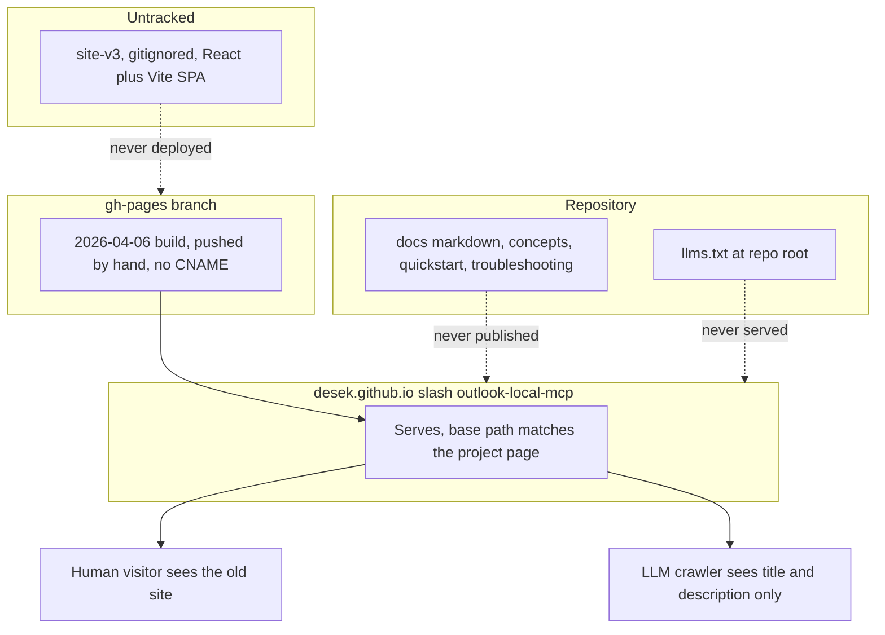
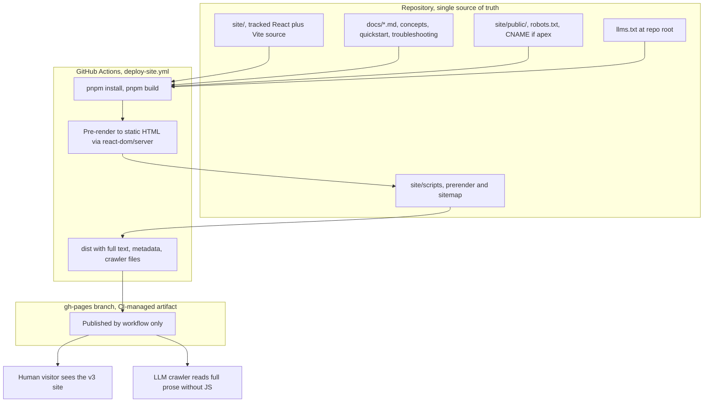
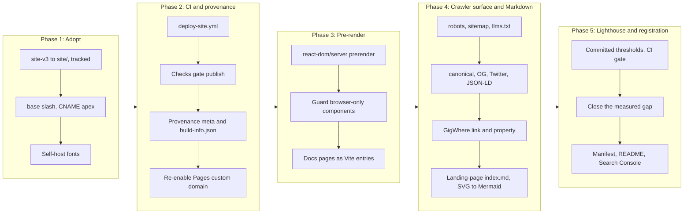
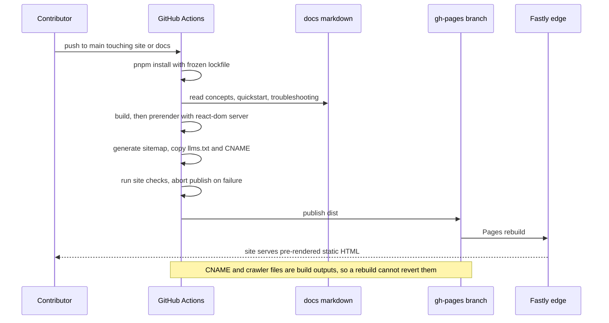

# Site v3 Adoption: SEO and GEO Foundation, Markdown Representation, Build Provenance, Lighthouse Budget, and CI Deployment to gh-pages

## Change Summary

The project website is a client-rendered single-page application whose source has
never been in version control. A separately developed v3 of the design now exists
and is judged materially better than what the repository can produce, so it becomes
the site. This change request brings that source under version control, adds a
GitHub Actions workflow that builds and publishes it to the `gh-pages` branch,
pre-renders it so its content exists without JavaScript, adds the SEO and GEO
foundation, emits a static Markdown representation of the landing page with its
diagrams as Mermaid, enforces a Lighthouse budget in CI, stamps build provenance into
the artifact, and adds a visible acknowledgement backlink to
`https://gigwhere.com`.

This CR is deliberately scoped to **foundation, not wording**. Correcting the site's
factual copy is deferred to a follow-up CR; see "Deferred to a follow-up CR" below
for what that leaves knowingly wrong on the live site and why that trade is
acceptable.

The dominant technical problem is that the v3 build emits a document whose body is
`<div id="root"></div>` and nothing else: **zero characters of text without
JavaScript**. Every SEO and GEO requirement in this CR depends on fixing that
first.

## Motivation and Background

Discovery is this project's distribution channel. It is a local, single-binary MCP
server with no hosted component, so it is found in exactly two ways: a human
searching for a way to connect Claude to Outlook without an Entra ID app
registration, and a generative engine answering "which MCP server should I use for
Outlook?". The second matters disproportionately, because an MCP server is a tool
an LLM recommends, and that recommendation is increasingly produced by a model
synthesising retrieved pages. Being cited by an assistant *is* the funnel.

The v3 design is a strong starting point. It ships a 1,003-line `ARCHITECTURE.md`
that maps thirteen sections intent-first, a full design-token translation, named
easing curves, a ten-asset inventory, and ten numbered non-negotiable design rules,
several of which encode hard-won GSAP practice. What it does not ship is any of the
machinery that makes a page findable.

Three specific gaps motivate this change:

* **The content does not exist without JavaScript.** The built `index.html` body is
  an empty root div. Most LLM retrieval pipelines fetch and parse rather than
  render, so today they would see a title and a meta description and nothing else.
  This is the highest-impact item in the CR and everything else is secondary to it.
* **There is no crawler-facing surface at all.** No canonical tag, no Open Graph,
  no Twitter card, no JSON-LD, no `robots.txt`, no `sitemap.xml`, no served
  `llms.txt`.
* **Deployment is manual and the source is untracked.** Every Pages build to date
  was a direct push by the repository owner; the last content build was
  `ae9d427` on 2026-04-06. Nothing about the live site is reproducible or
  reviewable, which is the governance defect this CR closes by vendoring the source
  and moving deployment into CI.

A fourth driver is specific to how models consume pages. HTML is a lossy carrier for
a retrieval pipeline: the parser has to strip presentation to recover meaning, and
diagrams drawn as SVG carry no meaning at all once flattened. Serving a Markdown
representation of each page, with the SVG diagrams re-expressed as Mermaid, hands a
model the content in the form it would otherwise have to reconstruct, and Mermaid in
particular turns a decorative diagram into something a model can read, quote, and
reason about. That is a structural advantage no amount of metadata provides.

Provenance is the last gap. Nothing currently identifies which commit produced the
live site. That matters most exactly when it is hardest to get: a user reporting that
the site is wrong, or a contributor asking whether a deploy landed. Stamping the
commit, the build time, and the workflow run into the artifact makes the answer
observable rather than inferred.

## Change Drivers

* The site's content is invisible to the retrieval pipelines that drive the
  project's most important discovery channel.
* No crawler-facing artifacts exist: no canonical, no structured data, no
  `robots.txt`, no `sitemap.xml`, no served `llms.txt`.
* The website source is not under version control, so the live site cannot be
  reviewed or reproduced.
* Deployment is a manual push from a developer machine, with no CI path.
* Nothing identifies which commit produced the live site, so a deploy cannot be
  confirmed and a report about the site cannot be tied to an artifact.
* HTML is a lossy carrier for retrieval, and the site's diagrams are SVG, which
  carries no meaning to a model once flattened.
* There is no Lighthouse budget, so performance, accessibility, and SEO regressions
  would ship unnoticed.
* An acknowledgement backlink to `https://gigwhere.com` is owed for the time and
  testing support GigWhere contributed. No goods or payment were involved: the domain
  was bought by the change owner. This matters for two decisions below, the
  structured-data property in FR-43 and the dofollow requirement in FR-48.

## Current State

### The v3 source, verified 2026-07-30

Vendored at `site-v3/` and currently **gitignored**, so none of it is under version
control yet.

| Property | Value |
|---|---|
| Stack | React 19.2.8, Vite 8.1.5, TypeScript 7.0.2, Tailwind 4.3.3 |
| Package manager | pnpm 11.18.0, pinned in `.mise.toml` and `packageManager` |
| Motion | GSAP 3.12.7 with `@gsap/react`, ScrollTrigger, and Lenis smooth scroll |
| Components | 15 top-level sections plus 7 asset components (1 canvas, 5 SVG, 1 particle canvas) |
| Router | **None.** Single page, no routes |
| Tests | **None** |
| Build output | `index.html` 1.17 KB, JS 448 KB (gzip 137 KB), CSS 70 KB (gzip 12.9 KB) |
| Text without JavaScript | **0 characters** |

Its `index.html` head carries a title, a meta description containing the stale "23
MCP tools" claim, two icon links, and four render-blocking requests to
`fonts.googleapis.com` and `fonts.gstatic.com`. It has no canonical link, no Open
Graph, no Twitter card, and no JSON-LD.

### Corrections already applied in the working copy

These were made while evaluating the vendored copy and are **not yet under version
control**, because `site-v3/` is ignored. Adopting the source carries them forward.

* **Mock Service Worker removed entirely.** `main.tsx` wrapped the render in an
  async bootstrap that awaited `worker.start()` before `createRoot().render()`, so
  a worker that failed to register meant React never mounted and the page stayed
  blank. MSW earned no keep independently of that: no component fetches anything,
  it served one `/api/tools` endpoint nothing consumed, its mock data still
  described the retired flat tool naming (`account_add`, `calendar_list_events`, a
  `diagnostics` category), and it added roughly 250 KB to a static marketing build.
  `src/mocks/` and `public/mockServiceWorker.js` were deleted and `main.tsx` now
  renders synchronously.
* **pnpm settings moved to `pnpm-workspace.yaml`.** pnpm 11 no longer reads a
  `pnpm` field from `package.json` and warns when one is present.
* **Toolchain bumped** to the latest release in each requested major.

### Deployment target: apex domain, temporarily disabled

The custom domain is currently **not configured**, but only because it was disabled
temporarily so the previous site could be inspected. The Cloudflare configuration was
never changed. Verified 2026-07-30:

| Item | State |
|---|---|
| `gh-pages` `CNAME` file | Absent. Removed by commit `c12b6c5` "Delete CNAME" |
| Pages API `cname` | `null` |
| `https://outlook-local-mcp.com/` | `404` |
| `https://desek.github.io/outlook-local-mcp/` | `200`, serving the 2026-04-06 build |
| Pages source | `gh-pages` branch, path `/`, `build_type: legacy` |
| `https_enforced` | `true` |

DNS is intact and still points at GitHub Pages: the apex A records resolve to all
four `185.199.{108,109,110,111}.153`, `www` CNAMEs to `desek.github.io`, and requests
reach GitHub directly (`Server: GitHub.com`, no `cf-ray`), so the zone remains
DNS-only. Re-enabling the Pages custom domain is therefore the only infrastructure
step, and no DNS change is required.

The base path still matters and is worth stating explicitly, because it is the defect
that took the site down once already. The 2026-04-06 build works at github.io only
because its `base: '/outlook-local-mcp/'` happens to match the project-page subpath
that GitHub serves the branch root at. Under the apex domain the site moves to `/`
and that prefix stops resolving. FR-1 fixes `base` at `/` accordingly.

### Why content negotiation is deferred

GitHub Pages is a static host with no request-time logic: it sets
`Vary: Accept-Encoding` and nothing else, and cannot branch on an `Accept` header.
Verified against the live project page 2026-07-30.

That splits the Markdown representation from the mechanism that would serve it from
the same URL. Emitting `/index.md` as a build output (FR-31 to FR-35) needs no
infrastructure and works on plain Pages today, which is the whole of what this CR
requires. Negotiating on `Accept` needs edge code, and the practical option is a
Cloudflare Worker, which requires switching the zone back from DNS-only to proxied
and reintroduces the SSL-mode, managed `robots.txt`, and bot-protection concerns
recorded under "Deferred to a follow-up CR". Keeping it out leaves this CR with no
blocking dependency and nothing to change outside the repository.

### Current State Diagram



## Proposed Change

Adopt v3 as the tracked site, pre-render it, give it a full crawler-facing surface,
and deploy it from CI.

1. **Adopt and track.** `site-v3/` becomes `site/` under version control, with the
   working-copy corrections carried forward. The `/site-v3/` ignore entry is
   removed.
2. **Settle the deployment target,** because it determines the base path and cannot
   be deferred.
3. **Pre-render.** The built document must contain the page's full text without
   JavaScript. Because the site is a single page with no router, this is a
   `react-dom/server` render at build time injected into `index.html`, not a
   routing framework and not a headless browser.
4. **Publish the narrative documentation** as additional crawlable pages, generated
   from `docs/*.md` at build time as separate Vite entries. The Markdown remains
   the single source of truth and is not duplicated into `site/`.
5. **Add the SEO and GEO surface.** Canonical, Open Graph, Twitter card, JSON-LD,
   `robots.txt`, `sitemap.xml`, served `llms.txt`, answer-shaped headings, and
   accurate facts.
6. **Add the GigWhere backlink.**
7. **Deploy from CI** to `gh-pages`, making the branch a generated artifact.

### Proposed State Diagram



## Requirements

### Functional Requirements

**Deployment target and adoption**

1. The site **MUST** be served from the apex custom domain
   `https://outlook-local-mcp.com`. This is settled, not open: the custom domain was
   disabled only temporarily so the previous site could be inspected, and the
   Cloudflare configuration was never changed. Verified 2026-07-30: the apex A
   records still resolve to all four `185.199.{108,109,110,111}.153`, `www` still
   CNAMEs to `desek.github.io`, and requests reach GitHub directly
   (`Server: GitHub.com`, no `cf-ray`), so the zone remains DNS-only. Consequently:
   * `base` **MUST** be `/`.
   * `site/public/CNAME` **MUST** contain `outlook-local-mcp.com`.
   * Every absolute URL **MUST** use the apex origin.
   * The only infrastructure step is re-enabling the Pages custom domain, which was
     removed by `gh-pages` commit `c12b6c5`. No DNS change is required.
2. The repository **MUST** contain the website source at `site/` under version
   control, and the `/site-v3/` entry **MUST** be removed from `.gitignore`.
3. The build **MUST** use pnpm with a committed `pnpm-lock.yaml`, and the pnpm
   version **MUST** remain pinned in `.mise.toml`.
4. `site/node_modules` and `site/dist` **MUST** be gitignored.
5. The `data/` rule in `.gitignore` **MUST** be anchored to `/data/` before anything
   is added under `site/`. Unanchored it matches at any depth, so
   `git check-ignore site/src/data/foo.ts` currently resolves to `.gitignore:32`,
   meaning a `site/**/data/` directory would be silently excluded from commits. This
   defect occurred on CR-0069 and was found only when a later phase discovered an
   earlier phase's modules had never been committed.
6. Mock Service Worker **MUST NOT** be a dependency of the site, and rendering
   **MUST NOT** be gated on any awaited runtime call.
7. The deployed output **MUST NOT** contain a base path that disagrees with the
   FR-1 decision. Absolute `github.com/desek/outlook-local-mcp/...` URLs are
   permitted and are not base paths.

**Pre-rendering**

8. The built document **MUST** contain the page's full textual content with
   JavaScript disabled.
9. Pre-rendering **MUST** be performed at build time by `react-dom/server` without
   requiring a headless browser, so the build needs no network access beyond the
   package registry.
10. Every pre-rendered page **MUST** contain exactly one `<h1>`.
11. Components that touch browser-only APIs (`window`, `document`, canvas, GSAP,
    Lenis, `IntersectionObserver`) **MUST** be guarded so the server render
    succeeds, and **MUST NOT** be rendered in a way that leaves content hidden if
    hydration never happens.
12. Rendering **MUST** fail the build loudly rather than emit a document with an
    empty root.

**Documentation publication**

13. The site **MUST** publish `docs/concepts.md`, `docs/quickstart.md`, and
    `docs/troubleshooting.md` as crawlable HTML pages at stable URLs.
14. Those pages **MUST** be generated from the Markdown at build time. The Markdown
    **MUST** remain the single source of truth and **MUST NOT** be duplicated into
    `site/`.
15. Heading anchors referenced by verb `SeeDocs` values **MUST** resolve in the
    published HTML, so deep links from `system.help` output work. The anchor slugs
    **MUST** be generated with the repository's own algorithm, the production
    `headingToAnchor` in `internal/tools/get_docs.go` (lowercase, keep `a-z`, `0-9`,
    and `-`, map spaces to hyphens, drop everything else; a byte-identical mirror
    exists in `internal/tools/verb_metadata_test.go`), and **MUST** honour explicit `{#anchor}`
    overrides. A Markdown renderer's default slugger **MUST NOT** be relied on: it
    will not necessarily agree, and a disagreement breaks every deep link silently.
    This was a real defect during CR-0069 and had to be fixed by matching the
    algorithm explicitly.
16. The build **MUST** fail, naming the missing file, if a consumed documentation
    file is renamed or removed.

**Crawler-facing files**

17. `robots.txt` **MUST** be served at the site root, allowing full crawl and
    declaring the sitemap URL.
18. `robots.txt` **MUST NOT** disallow the agents that retrieve a page in order to cite
    it while answering a user: `ChatGPT-User` and `OAI-SearchBot` (OpenAI), `Claude-User`
    and `Claude-SearchBot` (Anthropic), `PerplexityBot` and `Perplexity-User`
    (Perplexity), and `Applebot` (Apple).

    An earlier draft of this requirement named `GPTBot`, `ClaudeBot` and
    `Google-Extended` instead. Those are **training-consent** tokens: they govern whether
    content may be used to train a model, and have no bearing on whether this project is
    cited today. Naming them as the citation lever was the error, and it omitted every
    agent that actually performs retrieval. Whether to admit the training tokens is a
    separate decision, and this CR takes no position on it; nothing is disallowed today.
    `robots.txt` **MUST** document the two classes distinctly, so a future Disallow is
    added knowingly rather than by analogy.
19. `sitemap.xml` **MUST** be served at the site root, generated by the build from
    the actual page list, with absolute URLs matching the FR-1 origin and a
    `lastmod` value.
20. The repository-root `llms.txt` **MUST** be served at the site root, copied at
    build time so the two cannot diverge.

**SEO metadata**

21. Every page **MUST** contain a `<link rel="canonical">` with its absolute URL.
22. Every page **MUST** contain Open Graph metadata: `og:title`, `og:description`,
    `og:type`, `og:url`, `og:image`, and `og:site_name`.
23. Every page **MUST** contain Twitter card metadata: `twitter:card` set to
    `summary_large_image`, `twitter:title`, `twitter:description`, and
    `twitter:image`.
24. Every image **MUST** carry descriptive `alt` text.
25. Web fonts **MUST** be self-hosted. The current build makes four requests to
    Google-hosted fonts, which both blocks rendering and transmits the visitor's IP
    address to a third party.

**Build provenance**

26. Every published page **MUST** carry build provenance in the pre-rendered HTML,
    identifying at minimum the commit SHA the site was built from, the build
    timestamp in UTC, and the workflow run that produced it.
27. Provenance **MUST** be machine-readable, not only a rendered string: it **MUST**
    appear as `<meta>` tags in the head so a crawler or a support conversation can
    read it without executing JavaScript.
28. The build **MUST** emit `/build-info.json` at the site root containing the same
    provenance fields, so it can be fetched directly.
29. Provenance values **MUST** be injected by the build from the CI environment and
    **MUST NOT** be committed to the repository as literals, so they cannot drift
    from the artifact they describe.
30. A local build with no CI environment **MUST** still succeed, marking provenance
    explicitly as a local build rather than fabricating a commit or run identifier.

**Markdown representation**

31. The build **MUST** emit a Markdown representation of the landing page at
    `/index.md`. Only the landing page is in scope; extending this to the
    documentation and other pages is deferred.
32. `/index.md` **MUST** be generated from the same source as the landing page HTML,
    so the two cannot describe different content. It **MUST NOT** be hand-authored.
33. Diagrams that exist as SVG components on the landing page **MUST** be rendered as
    Mermaid fenced code blocks in `/index.md`, not as image references and not
    omitted. This applies to the five capability and privacy diagrams.
34. `/index.md` **MUST** be reachable as a static file at the apex origin. The
    response `Content-Type` is whatever GitHub Pages' MIME mapping assigns to `.md`,
    which cannot be overridden: Pages permits no custom response headers. The
    implementation **MUST** verify the served value after the first deploy and record
    it, because it is currently unverified. `text/plain` is an acceptable outcome for
    this CR, since the content is still consumable; guaranteeing `text/markdown`
    requires the edge layer and is deferred with content negotiation.
35. `robots.txt` and `llms.txt` **MUST** both advertise `/index.md`, so a client that
    cannot negotiate can still discover it.

**Lighthouse and Core Web Vitals**

36. A Lighthouse run against the built site, on mobile emulation, **MUST** score 100 in
    Accessibility, Best Practices and SEO on every page, and 100 in Performance on the
    three documentation pages.

    Every page **MUST** hold Cumulative Layout Shift at or below 0.010. Largest
    Contentful Paint **MUST** be at or below 1,700 ms on the documentation pages and at
    or below 2,700 ms on the landing page. The documentation pages **MUST** hold Total
    Blocking Time at or below 50 ms.

    The landing page's Performance category and Total Blocking Time are deliberately
    **not** asserted, for reasons given below: on CI they measure the runner rather than
    the site.

    **Why the landing page is held to a different Performance figure.** This began as a
    flat "at least 95 in Performance", which the landing page failed at 0.93. The
    accessibility and validity work raised it to 0.97, and the remaining 0.03 was traced
    to a hard limit rather than to anything left undone.

    Under Lighthouse's simulated mobile throttling the landing page's Largest Contentful
    Paint is a function of the bytes on the critical path, and of nothing else that is
    available to change. Three measurements establish it, all with identical markup and
    scheduling:

    | critical-path bytes changed | LCP | Performance |
    |---|---|---|
    | none — as shipped | 2,553 ms | 0.97 |
    | client bundle replaced by a 20-byte stub | 1,803 ms | 0.99 |
    | client bundle absent entirely | 1,803 ms | 1.00 |
    | all five web fonts removed, real bundle | 1,952 ms | 0.99 |
    | fonts subset to the site's own 111 glyphs (94 KB to 43 KB), real bundle | 2,406 ms | 0.97 |

    The 750 ms difference is the bundle's transfer time at the emulated 1,475 Kbps, to
    within a few milliseconds. Scheduling does not move it: deferring the module's
    *evaluation*, giving the tag `fetchpriority="low"`, and injecting the script only
    after the browser reports its Largest Contentful Paint entry each left LCP within
    10 ms of 2,555. Halving the DOM did not move it either. Lighthouse's Lantern model
    charges every byte fetched before the observed paint, and on a local server the whole
    document is fetched inside 90 ms, so only the byte count is left.

    Two consequences follow, and both are stated rather than worked around:

    * **1,700 ms is unreachable on the landing page at any bundle size.** With no
      JavaScript at all it is 1,803 ms, and the remainder is the five above-the-fold web
      fonts (94 KB) and the icon (16 KB). The 1,700 ms figure holds for the documentation
      pages, which meet it at 1,502 to 1,652 ms, and it is retained for them.
    * **100 in Performance requires shipping roughly 20 KB of client JavaScript.** The
      landing page's motion design — the pinned crossfade, the scrubbed reveals, the
      smooth scroller — is the reason CR-0070 adopted v3 rather than rebuilding, and it
      is what the 137 KB buys. Reaching 100 means removing that design, which is a
      change-owner decision about the product, not a performance defect to fix.

      The font measurements close off the obvious alternative. Deleting every web font
      outright, which is far past anything acceptable, still leaves the page at 0.99;
      subsetting them properly to the 111 glyphs the site actually uses buys 148 ms and
      leaves the score unmoved at 0.97. So no font strategy reaches 100 either.

      **The floor was then measured directly rather than inferred.** A build whose entry
      imports React, ReactDOM, GSAP, ScrollTrigger and Lenis and hydrates a component
      returning a single empty `<div>` — no site, no components, no content — is
      **108.79 KB gzipped**, which is 590 ms of transfer at the emulated throughput. The
      five capability diagrams, the largest single piece of application markup, account
      for only 9.3 KB of the shipped 137.6 KB; all of the site's own code is 29 KB.

      That gives an exact model, and it reproduces the measurements to within a
      millisecond: LCP is 1,803 ms of page floor plus 4.34 ms per KB of bundle. 108.79 KB
      of libraries alone therefore puts the landing page at 2,393 ms before a single line
      of this site's code or content is added, and 100 needs 1,803 ms. Deleting every web
      font *and* every line of application code together lands at 1,792 ms — the boundary,
      for a page with no content and no typography.

      The conclusion is not that the application is heavy. It is 29 KB. The libraries that
      render the motion design are 108.79 KB, and that alone is more than the budget for
      100. Nothing short of replacing them changes it.

      **And replacing them is not sufficient either.** The last measurement settles what
      100 would actually cost. With *no script element at all*, the landing page's audit
      scores are FCP 1.00, Speed Index 1.00, TBT 1.00, CLS 1.00 — and **LCP 0.98**, at
      1,803 ms. The weighted category is 0.995, which reaches 100 only by rounding. Put a
      script back, of any size — a 20-byte stub and a 4.5 KB vanilla-JavaScript layer were
      both measured, each with LCP unchanged at 1,803 ms — and the category rounds to 0.99.

      So 100 on the landing page does not require a lighter framework. It requires the page
      to ship **no JavaScript whatsoever**: no tabs, no accordions, no copy-to-clipboard, no
      mobile navigation, no motion. And even then it holds 100 only on the rounding
      boundary, with the LCP audit itself at 0.98. A requirement that can be met only by an
      inert page, and only by rounding, is not describing a defect in this one; that is why
      the landing page is held at 96 with metric budgets rather than to a figure the site
      cannot occupy while remaining a site.

    The metric budgets above make the underlying numbers assertable in their own right, so
    a regression in LCP or CLS fails the gate even if a rounded category score does not
    move.

    **The landing page's Performance category and Total Blocking Time are not asserted at
    all, because on CI they do not measure the site.** A 96 floor was set first, one point
    below the local 0.97. The first CI runs then showed the landing page swinging between
    0.66 and 0.97 on *identical commits*, driven by Total Blocking Time ranging from
    193 ms to 1,675 ms where the same build measures 8 to 12 ms locally.

    | run | index Performance | index TBT | index LCP | benchmarkIndex |
    |---|---|---|---|---|
    | first | 0.66 / 0.89 / 0.89 | 1,675 / 447 / 421 ms | 2,108 / 1,658 / 1,661 ms | 2,115 / 2,515 / 2,498 |
    | second | 0.71 / 0.97 / 0.83 | 1,197 / 193 / 689 ms | 1,814 / 1,660 / 1,663 ms | 2,198 / 2,522 / 2,461 |

    Two effects, neither of which a visitor experiences. The first of each three runs is
    systematically the worst on every metric, a cold-start the median only partly absorbs.
    And even discounting it, CI Total Blocking Time is 421 to 689 ms against 8 to 12 ms
    locally — a fiftyfold gap on hardware only 15% slower by `benchmarkIndex`, which
    points at software rendering: a headless runner has no GPU, so this page's canvas and
    compositing work lands on the main thread in a way it does not for a real browser.

    A gate that varies eightfold on unchanged input cannot discriminate a regression, and
    keeping it would have meant a permanently flaky check that teams learn to re-run until
    green. What is asserted for the landing page is what is stable and meaningful there:
    Accessibility, Best Practices and SEO at 100 — 1.00 on every CI run — plus LCP and
    CLS. The three documentation pages keep the full category assertion at 100, which they
    hold on every run with Total Blocking Time at zero.

    The landing page's Performance score remains a measured number, recorded above and
    reproducible locally; it is simply not a CI gate. `largest-contentful-paint` stays at
    2,700 ms because that is the local ceiling, which is the stricter of the two
    environments: CI measures 1,660 ms, since the deferred bundle falls outside the LCP
    graph there.
37. Lighthouse **MUST** run in CI against the built output, and the workflow **MUST**
    fail if any category falls below its threshold. It **MUST** run on the pull request
    as well as on the deploy.

    The deploy gate alone is not sufficient, and the reason is the failure this CR exists
    to fix. `deploy-site.yml` fires on push to `main`, so a threshold breach surfaces only
    *after* merge, as a failed deploy — and a failed deploy leaves the apex serving the
    previously published build. That is precisely the state the CR opened in. A
    pull-request run turns the same breach into a review-time signal, while the deploy
    keeps its own gate, which is what AC-19 requires and the last check before the live
    site.

    The two are split by path so neither the site nor the application pays for the other's
    build: `site.yml` runs on `site/**` and `docs/**`, and `ci.yml` ignores site-only
    paths. `docs/**` triggers both, because those Markdown files are embedded into the
    binary *and* generate the documentation pages.
38. The thresholds **MUST** be recorded in a committed configuration file rather than
    passed as ad-hoc command arguments, so a regression is visible as a diff.

**GEO**

39. Every page **MUST** contain JSON-LD structured data valid under schema.org,
    present in the pre-rendered head.
40. The landing page **MUST** include a `SoftwareApplication` entity with `name`,
    `description`, `applicationCategory`, `operatingSystem`, `license`,
    `codeRepository`, `programmingLanguage`, `downloadUrl`, and `softwareVersion`.
41. The landing page **MUST** include a `FAQPage` entity covering at minimum: what
    the project is, whether an Entra ID app registration is required, whether data
    leaves the user's machine, which Outlook features are supported, and how to
    connect it to Claude Desktop.
42. The quickstart page **MUST** include a `HowTo` entity mirroring
    `docs/quickstart.md`.

    FR-41 and FR-42 are retained on a **speculative rationale only**, and the CR states
    it plainly rather than implying eligibility it does not have. Google deprecated
    `FAQPage` rich results (notice 2026-05-07, tooling support removed June 2026) and
    retired `HowTo` in 2023, so neither entity can produce a rich result. They are kept
    on the untested bet that a question-and-answer structure is cheaper for a language
    model to parse than the equivalent prose. Both are already shipped and cost nothing
    to retain; neither should be cited as a search-visibility mechanism.
43. An `Organization` entity **MUST** express the GigWhere acknowledgement as a real
    property, not only as footer text. It **MUST** be `contributor` rather than
    `sponsor`: GigWhere contributed time and testing support, not money or goods, and
    schema.org `sponsor` denotes support "through a pledge, promise, or financial
    contribution". Structured data is read by generative engines as fact, so an
    inaccurate property is worse here than in prose.
44. The page structure **MUST** support question-form headings with answer-first
    section openings, meaning each section owns its own heading element and its lead
    paragraph is addressable. Writing that copy is deferred (see "Deferred to a
    follow-up CR"); this CR delivers the structure it needs, not the wording.
45. Every page **MUST** display a last-updated date, with a matching JSON-LD
    `dateModified`.

**GigWhere backlink**

46. The site footer **MUST** contain a link to `https://gigwhere.com` present as a
    literal `<a href>` in the pre-rendered HTML, not injected by JavaScript.
47. The acknowledgement **MUST** thank GigWhere for support and testing and **MUST**
    end with a heart emoji, for example "Support and testing by GigWhere ❤️".
48. That link **MUST NOT** carry `rel="nofollow"` or `rel="sponsored"`. This is
    sound rather than merely convenient: search-engine guidance reserves those for
    links given in exchange for payment or goods, and nothing was exchanged here. The
    acknowledgement is editorial gratitude for contributed time, so a plain editorial
    link is the accurate signal. The anchor
    text **MUST** be the GigWhere name so the link text carries the brand rather than
    the emoji. The heart **MUST** sit outside the anchor and **MUST** be marked
    `aria-hidden`, since it is decorative and a screen reader announcing "red heart"
    adds nothing to the acknowledgement.
49. `README.md` **MUST** carry the same acknowledgement, with wording and emoji
    matching the footer.

**CI deployment**

50. A GitHub Actions workflow **MUST** build `site/` and publish the output to the
    `gh-pages` branch on push to `main` when files under `site/` or `docs/` change.
51. The workflow **MUST** be the only mechanism that writes to `gh-pages`, and the
    branch **MUST NOT** be hand-edited.
52. The workflow **MUST NOT** require any secret beyond the default `GITHUB_TOKEN`.
53. The workflow **MUST** run the site's checks before publishing, and **MUST NOT**
    publish if any fail.
54. `CNAME`, `robots.txt`, `sitemap.xml`, and `llms.txt` **MUST** be build outputs
    rather than files placed on `gh-pages` by hand, so a rebuild cannot revert them.
55. `extension/manifest.json` `homepage` **MUST** be `https://outlook-local-mcp.com`.

### Non-Functional Requirements

1. The site **MUST** achieve Largest Contentful Paint under 2.5 seconds, Cumulative
   Layout Shift under 0.1, and Interaction to Next Paint under 200 milliseconds,
   measured on mobile. These are the field thresholds behind the Lighthouse
   Performance score required by FR-36 and are stated separately because a passing
   category score does not by itself guarantee each metric is within budget.
2. The build **MUST** complete with no network access beyond the package registry.
3. The site **MUST NOT** load third-party analytics, trackers, or any third-party
   resource that transmits visitor data, consistent with `PRIVACY.md`.
4. Animation **MUST** honour `prefers-reduced-motion`.
5. The production bundle **MUST NOT** include development-only tooling.

## Affected Components

* `site/` (new, promoted from the ignored `site-v3/`).
* `.github/workflows/deploy-site.yml` (new): builds and publishes on push to `main`.
* `.github/workflows/site.yml` (new): the same build and Lighthouse gate on the pull
  request, so a regression is caught before merge rather than as a failed deploy.
* `.github/workflows/ci.yml`: scoped away from site-only paths, so a website change no
  longer triggers the Go pipeline, a GoReleaser dry-run and four container builds.
* `gh-pages` branch: becomes a CI-managed artifact.
* `docs/concepts.md`, `docs/quickstart.md`, `docs/troubleshooting.md`: consumed at
  build time, not modified.
* `README.md`: GigWhere acknowledgement, and the site URL if it changes.
* `llms.txt`: copied into the build.
* `extension/manifest.json`: `homepage`.
* `.gitignore`: remove `/site-v3/`, add `site/node_modules` and `site/dist`.
* `.mise.toml`: pnpm pin (already present).
* `docs/reference/architecture.md`: document the site build and its coupling to
  `docs/*.md`.
* `CONTRIBUTING.md`: Node and pnpm toolchain, site commands, `gh-pages` rule.
* GitHub repository settings and DNS, if FR-1 selects the apex domain.

## Deferred to a follow-up CR

Copy correction is explicitly out of this CR. The change owner scoped this one to
foundation: pre-rendering, the crawler surface, the Markdown representation,
provenance, Lighthouse, and CI deployment. Wording comes next.

What that leaves knowingly wrong on the live site, recorded here so it is not
rediscovered as a surprise:

* The meta description claims **"23 MCP tools"**.
* `ToolsReferenceSection` is built around a **"23 TOOLS"** accordion grouped into
  Account, **Diagnostics**, Calendar, and Mail. There is no Diagnostics domain.
* `ConfigReferenceSection` advertises **"15 CONFIGURATION VARIABLES"**, a figure
  nobody has verified against `internal/config`.
* Section copy is not answer-shaped and headings are not question-form.
* Security phrasing inherited from the earlier site includes absolute claims that do
  not survive checking, such as no listening ports and credentials never leaving the
  machine. Interactive browser sign-in binds a loopback port, and enabling
  OpenTelemetry adds an outbound OTLP connection.

Two structural items are also deferred, distinct from the copy work above:

* **Content negotiation.** Serving Markdown from the same URL as the HTML when a
  client sends `Accept: text/markdown`, with `Vary: Accept`. GitHub Pages cannot do
  this: it is a static host with no request-time logic and sets only
  `Vary: Accept-Encoding`, verified 2026-07-30. It needs edge code, and the practical
  option is a Cloudflare Worker, which requires switching the zone from DNS-only back
  to proxied. That reintroduces the concerns that made DNS-only correct in the first
  place: SSL/TLS must be Full (strict) rather than Flexible, Cloudflare's managed
  Content Signals file must not be allowed to occupy `/robots.txt`, and Bot Fight
  Mode must not challenge the AI crawlers FR-18 deliberately admits. Deferring it
  keeps this CR entirely on plain Pages with no Cloudflare change and no blocking
  dependency.
* **Markdown for the documentation and comparison pages.** This CR emits `/index.md`
  only. Extending it is mechanical once the generator exists, and the documentation
  pages are a special case worth thinking about separately, since their content
  already originates as Markdown in `docs/` and round-tripping it through HTML to get
  Markdown back would be a strange path.

The accurate figures, for the follow-up CR to use: four aggregate domain tools
(`calendar`, `mail`, `account`, `system`) and 42 registered verbs, 33 in the default
gated configuration, with per-domain counts of calendar 15, mail 13, account 7, and
system 7, each including that domain's `help` verb.

**The cost of deferring is real and worth naming.** This CR's entire thesis is that
generative engines quote page claims verbatim, and it makes the site substantially
easier to retrieve: pre-rendered, negotiable as Markdown, structured with JSON-LD.
That amplifies whatever the page says, including the parts that are wrong. Deferral
is a sequencing choice the change owner is entitled to make, and the foundation is
genuinely the harder half, but the follow-up should land close behind rather than
drift, because the window in which the wrong numbers are being indexed opens the day
this ships.

## Scope Boundaries

### In Scope

* Promoting the v3 source to a tracked `site/`.
* Pre-rendering the single page and the documentation pages.
* Crawler files, canonical and social metadata, JSON-LD.
* Self-hosting the fonts.
* Build provenance in the HTML head and at `/build-info.json`.
* A static `/index.md` for the landing page, with the SVG diagrams as Mermaid,
  advertised in `robots.txt` and `llms.txt`.
* A Lighthouse budget enforced in CI.
* Re-enabling the Pages custom domain.
* The structural groundwork question-form headings need, without writing them.
* The GigWhere backlink, in the footer and `README.md`.
* The CI build-and-deploy workflow.
* A test suite covering the build-output guarantees.
* Search Console and Bing registration, sitemap submission, and, if FR-1 selects
  the apex, the Change of Address filing.

### Out of Scope ("Here, But Not Further")

* **Redesign.** The v3 design is adopted as authored. Layout, typography, and colour
  changes are deferred **except where a measured accessibility or validity threshold
  requires one, and then only by the smallest adjustment that reaches the threshold.**

  **Reconciled during implementation, having been written too broadly.** As first
  drafted this bullet deferred colour changes outright, which FR-36's Accessibility floor
  made impossible to honour: the landing page shipped 40 text elements below WCAG AA,
  including the brand lime `#abff02` on white at 1.23:1 against a 4.5:1 requirement.
  Meeting one requirement meant breaching the other, and the finalizer correctly refused
  rather than choosing silently between them.

  The boundary that actually holds is narrower than "no colour changes" and is stated
  above. Everything changed under it, with the measured ratio it reached:

  | change | reason | result |
  |---|---|---|
  | `--color-gray-400` `#6f6f6f` to `#6d6d6d` | 4.41:1 on the `#f0f0f0` section background | 4.54:1 on `#f0f0f0`, 5.17:1 on white |
  | the three step numbers from `text-brand-lime` to `text-lime-dark` | 1.23:1 on white | 5.57:1, using a token the design system already defined for light backgrounds |
  | `text-white/30` to `/50`, `text-white/40` to `/60` | 2.63:1 to 3.81:1 on the dark sections | 5.02:1 to 7.24:1, preserving the three-step visual hierarchy |

  No colour was changed for aesthetic reasons, no palette token was added, and the two
  brand colours are untouched. Markup corrected for validity or assistive technology —
  `<div>` to `<span>` inside the accordion triggers, per-instance SVG ids, the tab and
  panel id pairing — is likewise in scope under FR-36 and was held to the "no visual
  regression" test, which it passed at 0 of 135 screenshot tiles.
* **All copy correction**, including the tool counts, the Diagnostics category, the
  configuration-variable count, answer-shaped section openings, question-form
  heading wording, and the inherited absolute security claims. See "Deferred to a
  follow-up CR".
* **Deciding the fate of `ToolsReferenceSection` and `ConfigReferenceSection`.**
  Whether a per-verb reference belongs on the site at all is a governance question,
  since that content is owned by the verb registry and rendered by `system.help`,
  and answering it means rewriting the sections. Both are carried across unchanged
  and both are pre-rendered like every other section; correcting or removing them
  belongs to the copy CR.
* **Three.js.** `ARCHITECTURE.md` Asset 10 specifies `@react-three/fiber` for the
  brand-reveal particles. What was built is a canvas implementation and neither
  Three.js package is a dependency. The canvas implementation stands; adopting
  Three.js is not in scope.
* **Publishing `docs/reference/`.** Contributor-facing internals stay
  repository-only.
* **A fifth embedded documentation file.** The embedded bundle remains exactly
  `docs/{readme,quickstart,concepts,troubleshooting}.md`.
* **Migrating Pages to `build_type: workflow`.** The branch-based source continues
  to work and the workflow writes to `gh-pages`.
* **Content negotiation on `Accept`,** and the edge layer it requires. See "Deferred
  to a follow-up CR".
* **Markdown representations beyond `/index.md`.**
* **Client-side routing.** The site stays a set of pre-rendered pages built as
  separate Vite entries; no router is introduced.
* **A documentation search index, internationalization, or a blog.**
* **Any change to MCP tool behaviour, verb registration, or Go source** beyond URL
  strings and the manifest `homepage`.

## Alternative Approaches Considered

* **Keep the existing site and iterate on it.** Rejected, and already attempted:
  CR-0069 rebuilt the site and its iteration session was abandoned because the
  feature gap to v3 was judged too large to close incrementally. That branch and
  its ledger remain as the record.
* **Ship v3 as a client-rendered SPA and skip pre-rendering.** Rejected. It is the
  cheapest option and it forfeits the entire reason for the CR: the crawlers that
  matter most here do not execute JavaScript, so the site would remain invisible to
  them while looking finished to us.
* **Pre-render with a headless browser** (`puppeteer`-based prerender plugins).
  Rejected. It would work, but it violates NFR-2 by requiring a browser download at
  build time, and it is a heavyweight dependency for a single page that
  `react-dom/server` can render directly.
* **Adopt a routing framework** (`vite-react-ssg`, Vike, Astro) for pre-rendering.
  Rejected for this CR. The site is one page plus three generated documentation
  pages, which separate Vite entries handle without introducing a router. It is also
  worth recording that `vite-react-ssg` pins `react-router-dom` to 6.x, and React
  Router 7 breaks its build outright, so that route would have imported a dependency
  conflict along with two moderate advisories that cannot be patched.
* **Serve the documentation as raw Markdown only.** Rejected as a replacement for
  HTML: no structured data, no canonical, no heading semantics, and weak retrieval
  relative to semantic HTML. Serving Markdown *alongside* HTML is a different
  proposition and is what FR-31 to FR-35 require.

### How to serve the Markdown representation

GitHub Pages cannot branch on an `Accept` header. The options were weighed as
follows; the first is what this CR adopts.

* **Parallel `.md` paths with no negotiation.** Emit `/index.md` and
  advertise it in `robots.txt` and `llms.txt`. Zero infrastructure, works on plain
  Pages, and satisfies FR-31 to FR-35. A client sending `Accept: text/markdown` to `/` still
  receives HTML, which is the limitation this CR accepts. This is what FR-31 to FR-35
  require and it is all that is in scope here.
* **Cloudflare Worker in front of Pages (deferred).** A Worker inspects
  `Accept`, rewrites to the `.md` variant when Markdown is preferred, and sets
  `Vary: Accept`. It is the only option that serves Markdown from the same URL as the HTML. The cost is
  that the zone must move from DNS-only back to proxied, which reintroduces exactly
  the concerns that made DNS-only correct before: SSL/TLS mode must be Full (strict)
  and not Flexible, Cloudflare's managed Content Signals `robots.txt` must not be
  allowed to occupy `/robots.txt`, and Bot Fight Mode must not challenge the AI
  crawlers FR-18 deliberately admits. Note the v3 source arrived with a `.wrangler`
  directory, so a Worker was evidently once contemplated for this project.
* **Move hosting off Pages entirely** (Cloudflare Pages, or any host with
  request-time logic). Rejected for this CR. It would make negotiation trivial, but
  it discards a working, free, already-configured deployment target and turns a
  scoped change into a migration.

## Impact Assessment

### User Impact

Visitors get the v3 design, and its content becomes indexable and citable. Someone
evaluating whether to install the server can have their assistant retrieve the
published concepts, quickstart, and troubleshooting pages, which today exist only
inside the binary and in the repository. No behaviour of the MCP server changes.

### Technical Impact

* The repository gains a pnpm-managed Node toolchain alongside the Go one, and CI
  gains a second build path. Contributors touching `site/` need Node and pnpm;
  contributors touching Go do not.
* `gh-pages` changes character from a hand-managed branch to a generated artifact.
  Anyone holding the old mental model may hand-edit it and have the change reverted.
* Pre-rendering imposes a real constraint on the component tree: anything reaching
  for `window`, `document`, canvas, GSAP, or Lenis at module scope or during the
  first render will break the server render. The v3 source was written without that
  constraint, so this is where the implementation risk concentrates.
* The site build acquires a hard dependency on `docs/*.md` paths and heading
  anchors. This coupling is deliberate, since it is what prevents duplicating
  content, but it means a documentation rename can break the site build.
* No Go behaviour changes. The embedded bundle changes content only if a URL
  changes, and `docs/embed_test.go` continues to guard membership.

### Business Impact

Cost is contributor time; hosting stays free on GitHub Pages. The opportunity cost
of inaction is the larger figure: the live site is a build from 2026-04-06 that
advertises a tool count that has been wrong for several releases, and every crawl
records that.

## Implementation Approach

Five phases, ordered so the site is tracked and deployable before discovery work is
layered on.

**Phase 1: Adopt and track.** Anchor the `data/` rule in `.gitignore` to `/data/`
FIRST, before adding anything under `site/`: unanchored it matches at any depth and
would silently ignore `site/**/data/` (FR-5). Then move
`site-v3/` to `site/`, remove the `/site-v3/` ignore entry, add `site/node_modules`
and `site/dist`, and confirm with `git status` that every intended file is actually
staged. Set `base` to `/` and emit
`site/public/CNAME` containing the apex. Self-host the Inter and Geist Mono fonts and
remove the Google-hosted links. Confirm MSW is absent and that nothing is awaited
before the first render. Build and verify locally.

**Phase 2: CI deployment and provenance.** Add
`.github/workflows/deploy-site.yml` building `site/` with pnpm and publishing to
`gh-pages` on push to `main` affecting `site/` or `docs/`, using only
`GITHUB_TOKEN`. Wire the site's checks in as a pre-publish gate. Inject build
provenance from the CI environment into the head and `/build-info.json`, with a
local-build fallback. Re-enable the Pages custom domain. Record in
`CONTRIBUTING.md` that `gh-pages` is CI-managed.

**Phase 3: Pre-rendering and documentation pages.** Add a `react-dom/server`
pre-render step that renders the app to HTML at build time and injects it into
`index.html`, failing the build if the result would leave an empty root. Guard the
browser-only components. Add a Markdown-to-HTML pipeline reading the three
narrative docs and emitting one page each as separate Vite entries, preserving
heading anchors. Verify full text without JavaScript and exactly one `<h1>` per
page.

**Phase 4: Crawler surface, metadata, and the Markdown representation.** Add
`robots.txt`, the `llms.txt` copy step, and a sitemap generator driven by the emitted
page list. Add canonical, Open Graph, Twitter card, and JSON-LD
(`SoftwareApplication`, `FAQPage`, `HowTo`, `Organization`). Add last-updated dates
and `dateModified`. Add the GigWhere footer link and its JSON-LD property. Emit
`/index.md` from the same source as the landing page HTML, converting the five SVG
diagrams to Mermaid fences, and advertise it in `robots.txt` and `llms.txt`. Content
negotiation is not part of this phase.

**Phase 5: Lighthouse budget, references, and registration.** Add the committed
Lighthouse threshold configuration and wire Lighthouse into the workflow as a
failing gate. Close whatever gap the first run exposes, which is where the
performance work actually lands. Add the `README.md` acknowledgement. Set
`extension/manifest.json` `homepage` and the repository `homepageUrl` to the apex.
Register in Search Console and Bing, submit the sitemap, and file the Change of
Address from the `desek.github.io` property. Copy correction is not part of this
phase; see "Deferred to a follow-up CR".

### Implementation Flow



### Deployment Sequence



## Test Strategy

The site is not covered by the Go suite. Verification is a vitest suite over built
output plus a post-deploy live check.

### Tests to Add

| Test File | Test Name | Description | Inputs | Expected Output |
|-----------|-----------|-------------|--------|-----------------|
| `site/tests/build-output.test.ts` | `basePathMatchesTarget` | Asserts asset references match the FR-1 base, with repo URLs excluded | `dist` tree | All match |
| `site/tests/build-output.test.ts` | `noServiceWorker` | Asserts no `msw` or service worker reference in output | `dist` | Zero matches |
| `site/tests/build-output.test.ts` | `noMswProductionDependency` | Asserts `msw` is absent from the dependency tree, not merely from the output (carried from CR-0069) | `site/package.json`, lockfile | Absent |
| `site/tests/prerender.test.ts` | `noRenderGatingAwait` | Asserts nothing is awaited before the first render, the defect v3 currently ships (carried from CR-0069) | `site/src/main.tsx` | No await before render |
| `site/tests/build-output.test.ts` | `crawlerFilesPresent` | Asserts `robots.txt`, `sitemap.xml`, `llms.txt` exist | `dist` | All present |
| `site/tests/build-output.test.ts` | `llmsTxtMatchesRepoRoot` | Asserts served `llms.txt` is byte-identical to the repo-root file | Both files | Identical |
| `site/tests/build-output.test.ts` | `robotsAllowsAiCrawlers` | Asserts no `Disallow` for the five named agents | `robots.txt` | None |
| `site/tests/build-output.test.ts` | `cnameMatchesTarget` | Asserts `CNAME` presence and content match the FR-1 decision | `dist` | Correct |
| `site/tests/prerender.test.ts` | `everyPageHasProseWithoutJs` | Asserts body text length above a threshold with scripts stripped | All `dist/**/*.html` | Above threshold |
| `site/tests/prerender.test.ts` | `rootIsNotEmpty` | Asserts the root element contains rendered markup | All pages | Non-empty |
| `site/tests/prerender.test.ts` | `everyPageHasSingleH1` | Asserts exactly one `<h1>` per page | All pages | 1 each |
| `site/tests/metadata.test.ts` | `canonicalPresent` | Asserts a canonical link with the correct absolute URL | All pages | Present |
| `site/tests/metadata.test.ts` | `openGraphComplete` | Asserts the six OG properties | All pages | All present |
| `site/tests/metadata.test.ts` | `twitterCardComplete` | Asserts the four Twitter properties | All pages | All present |
| `site/tests/metadata.test.ts` | `jsonLdValid` | Asserts every JSON-LD block parses with a recognised `@type` | All pages | Valid |
| `site/tests/metadata.test.ts` | `requiredEntitiesPresent` | Asserts `SoftwareApplication`, `FAQPage`, `Organization` on the landing page and `HowTo` on quickstart | `dist` | Present |
| `site/tests/metadata.test.ts` | `everyImageHasAltText` | Asserts no `` without `alt` | All pages | None |
| `site/tests/metadata.test.ts` | `noThirdPartyResourceHosts` | Asserts no third-party resource requests, fonts included | All pages | None |
| `site/tests/content.test.ts` | `gigwhereBacklinkDofollow` | Asserts a literal pre-rendered `<a href="https://gigwhere.com">` without nofollow or sponsored, with the GigWhere name as anchor text | `dist/index.html` | Present |
| `site/tests/content.test.ts` | `gigwhereAcknowledgementWording` | Asserts the acknowledgement thanks GigWhere for support and testing and ends with a heart emoji marked aria-hidden outside the anchor | `dist/index.html` | Matches |
| `site/tests/provenance.test.ts` | `provenanceMetaPresent` | Asserts commit, build time, and run meta tags in every pre-rendered head | All pages | Present |
| `site/tests/provenance.test.ts` | `buildInfoMatchesMeta` | Asserts `/build-info.json` agrees with the meta tags | `dist` | Equal |
| `site/tests/provenance.test.ts` | `localBuildIsLabelled` | Asserts a build with no CI env marks provenance local rather than fabricating values | Built without CI env | Labelled local |
| `site/tests/markdown.test.ts` | `indexMarkdownEmitted` | Asserts `dist/index.md` exists and is non-empty | `dist` | Present |
| `site/tests/markdown.test.ts` | `markdownMatchesHtmlContent` | Asserts `index.md` carries the same headings and body text as `index.html` | Both representations | Equivalent |
| `site/tests/markdown.test.ts` | `svgDiagramsBecomeMermaid` | Asserts each of the five SVG diagrams appears as a Mermaid fence, not an image or omission | `dist/index.md` | Mermaid fences |
| `site/tests/markdown.test.ts` | `markdownPathAdvertised` | Asserts `robots.txt` and `llms.txt` both reference `/index.md` | `dist` | Present |
| `site/tests/lighthouse.test.ts` | `thresholdsConfigCommitted` | Asserts the Lighthouse threshold config exists and declares all four categories | Config file | Present |
| `site/tests/content.test.ts` | `lastUpdatedMatchesJsonLd` | Asserts the visible date equals JSON-LD `dateModified` | All pages | Equal |
| `site/tests/sitemap.test.ts` | `sitemapCoversAllPages` | Asserts set equality between emitted HTML pages and sitemap entries | `dist`, `sitemap.xml` | Equal |
| `site/tests/sitemap.test.ts` | `sitemapUsesTargetOrigin` | Asserts every `<loc>` uses the FR-1 origin | `sitemap.xml` | All match |
| `site/tests/docs-pages.test.ts` | `docsAnchorsPreserved` | Asserts every registry `SeeDocs` anchor resolves in published HTML | Registry values, `dist` | All resolve |
| `site/tests/docs-pages.test.ts` | `docsProseNotDuplicated` | Asserts `site/` contains no copy of the narrative Markdown prose | `site/` tree | Absent |
| `site/tests/build-failure.test.ts` | `missingDocFailsBuild` | Asserts the build exits non-zero naming a renamed doc file | Renamed fixture | Non-zero, named |
| `.agents/scripts/verify-site-deploy.sh` | n/a | Post-deploy live check of status codes, redirects, crawler files, provenance, and `/index.md` reachability with its served Content-Type recorded | Live site | All pass |
| CI (Lighthouse) | n/a | Runs Lighthouse on mobile emulation against the built site and fails below threshold | `dist` | Performance, Accessibility, Best Practices at least 95; SEO 100 |

The test runner **MUST** build before asserting, and **MUST NOT** assert against a
pre-existing `dist`. The reason is worth stating because the failure is invisible:
CR-0069's harness initially built only when `dist` was **absent**, so the realistic
sequence of editing a source file and running the tests asserted against the previous
build and reported everything green. It was caught only by injecting a known-bad
string into the source, running the tests alone, and observing that they still passed.
A suite that can pass against stale output is worse than no suite, because it is
trusted.

`.agents/scripts/verify-site-deploy.sh` already exists on the abandoned `dev/cr-0069`
branch and **MUST** be adapted rather than rewritten. Its design is the part worth
keeping: **local** checks that need no network and therefore run in CI (for example
asserting `extension/manifest.json` `homepage` is the apex while `support` stays a
GitHub URL), split from **live** checks behind a `--live` flag that only make sense
post-deploy (the apex serves 200 with no project-page base path in the body, `www`
redirects to the apex, and each crawler file serves 200). Extend the live side to
cover `/index.md`, recording its served `Content-Type` per FR-34, and the provenance
endpoint.

Three of the assertions below are carried from CR-0069 by name because they target
defects the v3 source actually contains or traps it walked into: `noRenderGatingAwait`,
`noMswProductionDependency`, and `docsAnchorsPreserved`.

Verification that cannot run in CI **MUST** be labelled rather than left ambiguous,
using the three buckets CR-0069's validation settled on: **fixed**, **justified as
non-CI-gatable** (live measurement or human judgement), and **owner action** (requires
console access nobody in CI has). In this CR, NFR-1 and the Lighthouse live
measurement, AC-21, AC-22, and AC-24 fall into the latter two. Labelling them stops a
live-only or human-only check from either reading as an unmet requirement or being
quietly dropped.

### Tests to Modify

| Test File | Test Name | Current Behavior | New Behavior | Reason for Change |
|-----------|-----------|------------------|--------------|-------------------|
| `docs/embed_test.go` | existing allowlist test | Asserts the embedded bundle is exactly the four permitted files | Unchanged assertions, must keep passing after any URL edits | Guards against accidental bundle additions during the reference sweep |

### Tests to Remove

Not applicable. The v3 source ships no tests, so there is nothing to retire.

## Acceptance Criteria

### AC-1: The apex origin is applied consistently

```gherkin
Given the apex domain is the deployment target per FR-1
When the site is built
Then base is / and no asset reference carries a project-page prefix
  And CNAME contains outlook-local-mcp.com
  And every absolute URL uses the apex origin
```

### AC-2: Content exists without JavaScript

```gherkin
Given the site has been built
When any published page is fetched and its script tags are stripped
Then the remaining body text exceeds the configured minimum length
  And the root element contains rendered markup rather than being empty
```

### AC-3: A failed pre-render fails the build

```gherkin
Given the pre-render step cannot render the application
When the build runs
Then the build exits non-zero
  And no output containing an empty root element is published
```

### AC-4: Crawler files are served

```gherkin
Given the site has been built
When robots.txt, sitemap.xml, and llms.txt are requested
Then each is present in the output
  And robots.txt declares the sitemap URL
  And robots.txt contains no Disallow for ChatGPT-User, OAI-SearchBot, Claude-User, Claude-SearchBot, PerplexityBot, Perplexity-User, or Applebot
  And robots.txt documents the retrieval-for-citation and training-consent agent classes separately
```

### AC-5: llms.txt cannot diverge

```gherkin
Given the repository-root llms.txt is modified
When the site is rebuilt
Then the served llms.txt is byte-identical to the repository-root file
```

### AC-6: Documentation is published and not duplicated

```gherkin
Given docs/concepts.md, docs/quickstart.md, and docs/troubleshooting.md exist
When the site is built
Then each is published as an HTML page at a stable URL
  And each appears in sitemap.xml
  And every verb SeeDocs anchor resolves on the published page
  And site/ contains no copy of their prose
```

### AC-7: A renamed documentation file fails the build

```gherkin
Given a documentation file consumed by the site build is renamed
When the build runs
Then it fails with an error naming the missing file
  And no partial output is published
```

### AC-8: Metadata is present and valid

```gherkin
Given the site has been built
When any page's pre-rendered head is inspected
Then it contains a canonical link, six Open Graph properties, and four Twitter card properties
  And every JSON-LD block parses and declares a recognised schema.org type
```

This criterion deliberately asserts *validity*, not rich-result eligibility. An earlier
draft required the Google Rich Results Test to report no errors, which no build of this
site can satisfy: `FAQPage` rich results are deprecated and `HowTo` retired, and
`SoftwareApplication` qualifies only with an `aggregateRating` or `review`, which this
project will not self-publish because Google's own policy forbids self-serving reviews.
The remaining assertions are checkable by the build, which is what a gate needs.

### AC-9: Required structured-data entities exist

```gherkin
Given the site has been built
When the landing page is inspected
Then SoftwareApplication, FAQPage, and Organization entities are present
  And the Organization entity expresses the GigWhere acknowledgement as a contributor property
And when the quickstart page is inspected
Then a HowTo entity is present
```

### AC-10: Build provenance is present and machine-readable

```gherkin
Given the site has been built in CI
When any published page's pre-rendered head is inspected
Then it contains meta tags naming the commit SHA, the UTC build timestamp, and the workflow run
And when /build-info.json is fetched
Then it returns the same values as the meta tags
```

### AC-11: A local build declares itself as local

```gherkin
Given no CI environment variables are present
When the site is built locally
Then the build succeeds
  And the provenance values identify the build as local rather than naming a commit or run
```

### AC-12: The GigWhere backlink is crawlable, dofollow, and correctly worded

```gherkin
Given the site has been built
When the pre-rendered landing page HTML is inspected without executing JavaScript
Then it contains an anchor with href https://gigwhere.com
  And the anchor text is the GigWhere name
  And the surrounding acknowledgement thanks GigWhere for support and testing
  And the acknowledgement ends with a heart emoji
  And the heart sits outside the anchor and is marked aria-hidden
  And the anchor carries neither rel=nofollow nor rel=sponsored
  And README.md contains the same wording and emoji
```

### AC-13: No third-party resource is loaded

```gherkin
Given the site has been built
When every page's resource references are inspected
Then no reference targets a host other than the site's own origin
  And the Inter and Geist Mono fonts are served from the site
```

### AC-14: The landing page has a Markdown representation

```gherkin
Given the site has been built
When the output is inspected
Then /index.md exists and is non-empty
  And its headings and body text match the landing page HTML
  And it was generated by the build rather than committed by hand
```

### AC-15: SVG diagrams appear as Mermaid in the Markdown

```gherkin
Given the landing page contains the five SVG capability and privacy diagrams
When /index.md is inspected
Then each diagram appears as a Mermaid fenced code block
  And none appears as an image reference
  And none is omitted
```

### AC-16: The Markdown path is advertised and reachable

```gherkin
Given the site is live
When robots.txt and llms.txt are inspected
Then both reference /index.md
And when /index.md is requested
Then it returns 200
  And the served Content-Type is recorded, whatever Pages assigns to .md
```

### AC-17: Lighthouse thresholds are enforced in CI

```gherkin
Given the Lighthouse thresholds are recorded in a committed configuration file
When the deploy workflow runs Lighthouse against the built site on mobile emulation
Then Performance, Accessibility, and Best Practices each score at least 95
  And SEO scores 100
  And the workflow fails if any category falls below its threshold
```

### AC-18: CI is the only path to gh-pages

```gherkin
Given a contributor changes a file under site/ and merges to main
When the deploy workflow completes
Then gh-pages reflects the new build
  And no manual step was required
  And the workflow used no secret beyond GITHUB_TOKEN
```

### AC-19: Failing checks block publication

```gherkin
Given a site check fails
When the deploy workflow runs
Then the workflow fails
  And gh-pages is not updated
```

### AC-20: Build outputs cannot be reverted by a rebuild

```gherkin
Given CNAME, robots.txt, sitemap.xml, and llms.txt are emitted by the build
When the workflow rebuilds and republishes
Then all four are present in gh-pages with their intended content
```

### AC-21: The site is reachable at the decided target

```gherkin
Given the workflow has published, the Pages custom domain is re-enabled, and Pages has rebuilt
When https://outlook-local-mcp.com/ is requested
Then it returns 200 over HTTPS
  And every referenced asset returns 200
```

### AC-22: Core Web Vitals thresholds are met

```gherkin
Given the site is live
When PageSpeed Insights is run against it on mobile
Then Largest Contentful Paint is under 2.5 seconds
  And Cumulative Layout Shift is under 0.1
  And Interaction to Next Paint is under 200 milliseconds
```

### AC-23: Reduced motion is honoured

```gherkin
Given a visitor has prefers-reduced-motion set to reduce
When any page is loaded
Then scroll-driven and looping animation does not run
  And all content remains visible and legible
```

### AC-24: Search engines are notified

```gherkin
Given the site is live and the sitemap is served
When Google Search Console and Bing Webmaster Tools are configured
Then the property is verified in both
  And sitemap.xml is submitted to both
  And a Change of Address is filed from the desek.github.io property
```

## Quality Standards Compliance

### Build & Compilation

- [ ] `make ci` exits 0; the Go binary is unaffected
- [ ] `pnpm --dir site install --frozen-lockfile` succeeds
- [ ] `pnpm --dir site run build` succeeds, including the pre-render step
- [ ] No new compiler or bundler warnings

### Linting & Code Style

- [ ] `make lint` and `make fmt-check` pass
- [ ] The site source passes its own linter and formatter
- [ ] Any linter exception carries an explanatory comment

### Test Execution

- [ ] `make test` passes, including `docs/embed_test.go`
- [ ] `pnpm --dir site test` passes, having rebuilt output first
- [ ] `.agents/scripts/verify-site-deploy.sh` passes against the live site

### Documentation

- [ ] Every new tracked file under `site/` carries a top docstring with an
      `@agents-index` annotation
- [ ] `docs/reference/architecture.md` documents the site build, the pre-render
      step, and the coupling to `docs/*.md`
- [ ] `CONTRIBUTING.md` documents the pnpm toolchain, the site commands, and the
      `gh-pages` no-hand-edit rule
- [ ] `README.md` carries the GigWhere acknowledgement
- [ ] `.gitignore` is accurate: `/site-v3/` removed, `site/node_modules` and
      `site/dist` added

### Code Review

- [ ] Changes submitted via pull request
- [ ] PR title follows Conventional Commits
- [ ] Review completed and approved
- [ ] Squash-merged to maintain linear history

### Verification Commands

```bash
# Go side, unaffected by this CR
make ci

# Site
pnpm --dir site install --frozen-lockfile
pnpm --dir site run build
pnpm --dir site test

# Assert content exists without JavaScript
node -e "const h=require('fs').readFileSync('site/dist/index.html','utf8'); \
  const b=h.slice(h.indexOf('</head>')).replace(/<script[\s\S]*?<\/script>/g,'').replace(/<[^>]+>/g,' '); \
  const n=b.split(/\s+/).filter(Boolean).length; \
  if (n < 200) { console.error('pre-render produced only '+n+' words'); process.exit(1); } \
  console.log('ok: '+n+' words without JS');"

# Post-deploy live verification
.agents/scripts/verify-site-deploy.sh
```

## Risks and Mitigation

### Risk 1: The component tree resists server rendering

**Likelihood:** high
**Impact:** high
**Mitigation:** this is where the work will actually be spent. The v3 source was
written for the browser: it uses GSAP with `useGSAP`, Lenis smooth scroll, a canvas
hero background, a particle canvas, and `IntersectionObserver`. Any of these
touching `window` or `document` at module scope or during first render breaks
`react-dom/server`. Mitigation is to render the content tree on the server and load
the motion and canvas layers only on the client, so the server render never
executes browser code. Content must never be hidden pending hydration: the
pre-rendered markup is the source of truth for what a crawler sees, and CSS or
script that hides it until hydration defeats the whole CR. AC-2 and AC-3 exist to
catch exactly that.

One concrete mechanism has already caused this failure on this project and v3 drives
its motion the same way. `gsap.from` applies its hidden start state the instant it is
called and restores it only when its trigger fires. Called on an element with no
scroll distance to travel, for example anything above the fold or any element when the
viewport is taller than the document, the trigger never fires and the element stays
invisible permanently. CR-0069's iteration session hit exactly this: the hero headline
was hidden and still hidden after a 45 second settle. Two mitigations came out of it
and both apply here: restrict hidden-start animations to elements genuinely below the
fold, and add a safety sweep that clears opacity and transform on anything still
transparent after a short delay. Under pre-rendering the stakes are higher than they
were then, because hidden content defeats the pre-rendering this CR exists to
deliver.

### Risk 2: Pre-rendered markup diverges from hydrated markup

**Likelihood:** medium
**Impact:** medium
**Mitigation:** React logs hydration mismatches and may discard server markup,
producing a visible flash. Keep the server and client trees identical and derive
any environment-dependent value (dates, random seeds, viewport checks) from props
rather than computing it during render.

### Risk 3: The base path is set for the wrong target

**Likelihood:** medium
**Impact:** high
**Mitigation:** this defect has already occurred once on this project and took the
live site down; it is also the reason the current 2026-04-06 build works at
github.io. FR-1 fixes `base` at `/` for the apex and AC-1 asserts consistency across
the base path, the `CNAME`, and every absolute URL. The infrastructure step is small
because DNS was never changed: only the Pages custom domain deleted by `c12b6c5`
needs re-enabling. The sequencing risk is the reverse of last time, though. Deploying
`base: '/'` while the custom domain is still disabled would serve a broken site at
github.io, so the custom domain must be re-enabled as part of the same change rather
than after it.

### Risk 4: The site build breaks on a documentation change

**Likelihood:** medium
**Impact:** medium
**Mitigation:** the build reads `docs/*.md` by path and depends on heading anchors
for `SeeDocs` links. AC-7 requires a loud failure on a missing file, and
`docsAnchorsPreserved` cross-checks every registry anchor, so an anchor rename
fails CI rather than shipping dead deep links.

### Risk 5: The Markdown representation drifts from the HTML

**Likelihood:** medium
**Impact:** medium
**Mitigation:** two representations of the same page is two things to keep in step,
and the failure is silent: a model reading the Markdown would be told something the
HTML no longer says. FR-32 requires both to be generated from one source rather than
maintained in parallel, and `markdownMatchesHtmlContent` asserts equivalence of
headings and body text on every build. Hand-authoring the Markdown is the specific
thing to avoid.

### Risk 6: The served Content-Type for `/index.md` is not what a client expects

**Likelihood:** medium
**Impact:** low
**Mitigation:** GitHub Pages permits no custom response headers, so the
`Content-Type` on `/index.md` is whatever its MIME mapping assigns to `.md`. That
value is currently unverified, and could not be verified while authoring: no `.md`
file is reachable on the existing deployment, because Pages excludes dot-prefixed
paths and nothing else on `gh-pages` qualifies. A client filtering strictly on
`text/markdown` may therefore reject it. FR-34 requires the value be verified and
recorded after the first deploy rather than assumed, and accepts `text/plain` for this
CR since the content is still consumable. Guaranteeing the header needs the edge
layer, which is deferred.

### Risk 7: Deferred copy is amplified rather than merely postponed

**Likelihood:** high
**Impact:** medium
**Mitigation:** this CR makes the site markedly easier to retrieve and quote while
leaving known-wrong facts in place, so the effect of deferral is not neutral. The
wrong figures are enumerated under "Deferred to a follow-up CR" together with the
correct ones, so the follow-up starts from a list rather than a rediscovery, and the
recommendation is that it lands close behind this CR rather than drifting.

### Risk 8: Fonts remain third-party

**Likelihood:** low
**Impact:** medium
**Mitigation:** the four Google Fonts requests both block rendering and transmit
visitor IPs, which contradicts `PRIVACY.md`. `noThirdPartyResourceHosts` asserts
their absence so a reintroduction fails CI.

### Risk 9: gh-pages is hand-edited after the workflow exists

**Likelihood:** medium
**Impact:** low
**Mitigation:** this has happened repeatedly on this repository, including the
`CNAME` create-and-delete churn visible in the branch history. Making `CNAME` and
the crawler files build outputs removes the incentive for the most likely edits, and
`CONTRIBUTING.md` states the rule.

### Risk 10: Bundle weight blocks the Lighthouse budget

**Likelihood:** medium
**Impact:** medium
**Mitigation:** the current build is 448 KB of JavaScript (137 KB gzipped) plus
70 KB of CSS (12.9 KB gzipped), and GSAP, Lenis, and several canvas components are
all client-side. Pre-rendering improves perceived load but does not reduce bundle
size, and FR-36 sets a hard Performance floor of 95 that a 448 KB bundle may not
clear on mobile emulation. Code-split the motion layer off the critical path, and
treat the first Lighthouse run as a measurement rather than a formality: it is the
step most likely to expose real work, which is why it has its own phase.

## Dependencies

* Requires GitHub Pages settings access to re-enable the custom domain deleted by
  `c12b6c5`. No DNS change is required: the zone was never modified.
* No blocking dependency remains. Content negotiation was the only one and is
  deferred, so every requirement here is satisfiable on plain GitHub Pages with no
  Cloudflare change.
* Reuses artifacts from the abandoned `dev/cr-0069`: `.agents/scripts/verify-site-deploy.sh`
  is adapted rather than rewritten, and three of its test assertions are carried by
  name. See the Test Strategy.
* A follow-up CR **MUST** correct the deferred copy. This CR should not be considered
  finished work on the site's content, only on its foundation.
* Depends on CR-0065 for the documentation governance rules that decide what is
  published to the web and what stays repository-only.
* Depends on CR-0060 and CR-0068 for the accurate description of the tool surface.
* Requires GitHub Pages to remain on branch-based deployment from `gh-pages`.
* Requires a Google account with Search Console access for AC-24.
* Supersedes CR-0069, which was abandoned. That CR and its iteration ledger remain
  on branch `dev/cr-0069`; nothing from it is merged.

## Estimated Effort

| Phase | Effort | Notes |
|-------|--------|-------|
| Phase 1: Adopt and track | 3 to 5 hours | Font self-hosting is most of it |
| Phase 2: CI deployment and provenance | 3 to 5 hours | Includes re-enabling the custom domain |
| Phase 3: Pre-render and docs pages | 10 to 18 hours | Widest variance; depends entirely on how the motion and canvas layers tolerate server rendering |
| Phase 4: Crawler surface, metadata, Markdown | 6 to 9 hours | The SVG to Mermaid conversion is the new weight; negotiation is deferred |
| Phase 5: Lighthouse budget and registration | 4 to 10 hours | Range is wide because the first Lighthouse run decides how much performance work the 448 KB bundle needs |
| **Total** | **26 to 47 hours** | Copy correction and content negotiation are excluded and deferred |

## Decision Outcome

Chosen approach: "adopt v3 as the tracked site, pre-render it with
`react-dom/server`, and deploy it from CI", because the design question is already
settled and the remaining gap is entirely machinery. Pre-rendering is treated as
the load-bearing requirement rather than one item among many: without it the site
is invisible to the retrieval pipelines that justify the CR, and every other SEO
and GEO requirement decorates a document no crawler can read.

`react-dom/server` is chosen over a routing framework or a headless-browser
prerenderer because the site is one page plus three generated documentation pages.
Separate Vite entries cover that without introducing a router, a browser download
at build time, or the dependency conflict that `vite-react-ssg` would import along
with its React Router 6 pin.

Phasing puts adoption and CI first so the site is tracked, reviewable, and
deployable before the highest-uncertainty work begins, and so the pre-rendering
risk cannot block getting the source under version control.

Copy correction is deferred at the change owner's direction, which makes this CR a
foundation change rather than a finished site. That is a coherent split: the
foundation is the harder and more structural half, and it is what every later content
change depends on. The trade it accepts is that the site becomes easier to retrieve
and quote before its facts are right, which is why the wrong figures are enumerated
rather than left to be rediscovered, and why Risk 7 recommends the follow-up land
close behind.

The Markdown representation is treated as a first-class output rather than a
convenience. HTML forces a retrieval pipeline to reconstruct meaning from
presentation, and an SVG diagram carries none at all once flattened; emitting Mermaid
turns those diagrams into something a model can quote and reason about.

Scoping it to a single static `/index.md` is deliberate. The representation and the
mechanism that serves it are separable, and only the mechanism needs infrastructure:
a static file advertised in `robots.txt` and `llms.txt` is discoverable today on plain
Pages, whereas negotiating on `Accept` requires edge code and a return to a proxied
Cloudflare zone. Deferring the mechanism leaves this CR with no blocking dependency
and nothing to change outside the repository, while still delivering the thing that
carries the value, which is the content in a form a model can read.

## Related Items

* Supersedes: CR-0069 (abandoned). Branch `dev/cr-0069` retains that CR, its
  validation report, its iteration ledger, and two scripts under `.agents/scripts/`.
  Its detail is folded into the requirements, phases, risks, and Test Strategy here
  rather than kept as an appendix, and the branch is worth reading before starting
  Phase 3. One artifact is deliberately not carried:
  `capture-legacy-site-reference.sh`, which reconstructed the pre-migration page
  because CR-0069 required 1:1 fidelity to a page that could no longer be viewed.
  This CR adopts v3 as authored and has no such requirement. The technique,
  reconstructing a reference and measuring against it numerically, would be the
  starting point if visual regression testing is ever wanted.
* Related change requests: CR-0060 (domain-aggregated tools), CR-0065
  (documentation architecture), CR-0068 (tool definition quality)
* Issue: [#26](https://github.com/desek/outlook-local-mcp/issues/26)
* Documentation: `docs/concepts.md`, `docs/quickstart.md`,
  `docs/troubleshooting.md`, `docs/reference/architecture.md`
* Vendored design documentation: `site/ARCHITECTURE.md` and `site/CONTENT.md`,
  carried across with the source

## More Information

### Why pre-rendering is the load-bearing requirement

Conventional SEO optimises for a ranked list a human chooses from. Generative
engines retrieve passages and synthesise an answer, so success is a quotable,
attributable claim rather than a ranking position. For a developer tool whose
adoption decision is frequently made inside an LLM conversation, that second channel
dominates.

Three properties drive retrieval, and the first is a precondition for the others:

1. **The content must exist without JavaScript.** Most retrieval pipelines fetch and
   parse rather than render. The v3 build currently emits zero characters of body
   text without JavaScript, so today it has nothing to retrieve. FR-8.
2. **Claims must be self-contained and specific.** "Four aggregate MCP tools
   dispatching 42 verbs across calendar, mail, account, and system, 33 of them
   registered in the default gated configuration" survives extraction. "Powerful
   Outlook integration" does not. Deferred to the copy CR; this one delivers the
   pre-rendered surface those claims will sit in.
3. **Structure must match the question.** Question-form headings with answer-first
   sentences align the retrievable unit with the query. FR-44 delivers the structure;
   the wording is deferred.
4. **Diagrams must carry meaning, not pixels.** An SVG flattens to nothing a model can
   use. FR-33 re-expresses the five capability and privacy diagrams as Mermaid in
   `/index.md`, which is the one place this CR improves what a model can quote rather
   than only how easily it can reach it.

### On not blocking AI crawlers

Any managed `robots.txt` that restricts AI training and grounding is reasonable for
a publisher monetising page views and actively harmful here, because this project's
users arrive through exactly the assistants such a file would restrict. FR-18 makes
the choice explicit so a future infrastructure change does not silently reintroduce
it. This is not hypothetical: while the site was proxied through Cloudflare, its
managed Content Signals `robots.txt` occupied that path.

### Inherited design documentation

The v3 source ships `ARCHITECTURE.md` (1,003 lines) and `CONTENT.md` (296 lines),
and both are carried across with it. They are a genuine asset: the architecture
document encodes ten numbered design rules, several of which are hard-won GSAP
practice (use `gsap.matchMedia()` rather than `window.innerWidth` checks inside
`useGSAP`; use `useGSAP` rather than raw `useEffect`; drive progress indicators with
direct DOM manipulation rather than `setState`; use `height: 100vh` rather than
`minHeight` on pinned triggers).

Two caveats travel with them. Their tool-surface content is the retired model, which
is enumerated under "Deferred to a follow-up CR", and Asset 10 specifies a Three.js
particle field via `@react-three/fiber`
while what was actually built is a canvas implementation and neither package is a
dependency. Where the documents and the code disagree, the code is correct and the
documents should be corrected to match as they are adopted.

### Why CR-0069's number is not reused

CR-0069 exists as a committed document on `dev/cr-0069` and will not be merged.
Reusing the identifier would put two different documents under one ID in the same
repository's history, so this CR takes 0070 and the gap is intentional.

<!-- review-summary -->
## Review Summary (CR Reviewer)

Reviewed 2026-07-30 against branch `dev/site-v3`. 55 Functional Requirements, 5
Non-Functional Requirements, 24 Acceptance Criteria, 10 Risks.

### Findings by category

* **Cross-reference defects: 1.** Dependencies cited "Search Console access for
  AC-20"; AC-20 governs build outputs not being reverted by a rebuild, while the
  Search Console criterion is AC-24. All other `FR-n`, `AC-n`, `NFR-n`, and `Risk n`
  cross-references were re-verified end to end and point at the requirement they
  name (the renumbering to 1-55 / 1-24 is internally consistent).
* **Contradiction / scope defects: 2.** (a) The Implementation Flow diagram Phase 4
  contained a `D5 "Accept negotiation layer"` node, contradicting the deferral of
  content negotiation and Phase 4's own statement that "Content negotiation is not
  part of this phase." (b) The adopted "Parallel `.md` paths" option in Alternative
  Approaches said "Emit `/index.md` and `/docs/*.md`", overstating scope past
  FR-31's landing-page-only mandate and the "Markdown representations beyond
  `/index.md`" Out-of-Scope entry.
* **Drift: 1.** FR-15 cited the anchor algorithm as `headingToAnchor` in
  `internal/tools/verb_metadata_test.go` (a test helper). The authoritative
  production implementation is `internal/tools/get_docs.go:headingToAnchor`, which
  governs the embedded-docs anchors the site must match; the test file holds a
  byte-identical mirror. Repointed the citation to the production function.
* **Ambiguity: 0.** All 55 FRs, 5 NFRs, and 24 ACs use RFC-2119 MUST / MUST NOT;
  no weak "should / may / appropriate / as needed" language in any requirement or AC.
* **Convention compliance: pass.** No dashed em-dashes in prose. Both flowchart
  diagrams quote punctuated node labels; the sequence-diagram Note text is plain
  ASCII. All cited paths verified present: `docs/{concepts,quickstart,
  troubleshooting}.md`, `docs/reference/architecture.md`, `docs/embed_test.go`,
  `llms.txt`, `PRIVACY.md`, `CONTRIBUTING.md`, `.mise.toml` (pnpm 11.18.0),
  `extension/manifest.json` (`homepage` currently the GitHub URL, `support` the
  issues URL, matching the Test Strategy). CR-0060/0065/0068/0069 all exist.
  FR-5's `.gitignore:32` `data/` claim confirmed by `git check-ignore`.

### Fixes applied

1. AC-20 → AC-24 in the Dependencies Search Console line.
2. Removed the `Accept negotiation layer` node from the Phase 4 flowchart and
   relabelled `D4` to "Landing-page index.md, SVG to Mermaid".
3. Alternative Approaches: "Emit `/index.md` and `/docs/*.md` and advertise them" →
   "Emit `/index.md` and advertise it".
4. FR-15 anchor-algorithm citation repointed to `internal/tools/get_docs.go`, noting
   the test-file mirror.

### Unresolved (human decision)

None.
<!-- /review-summary -->
