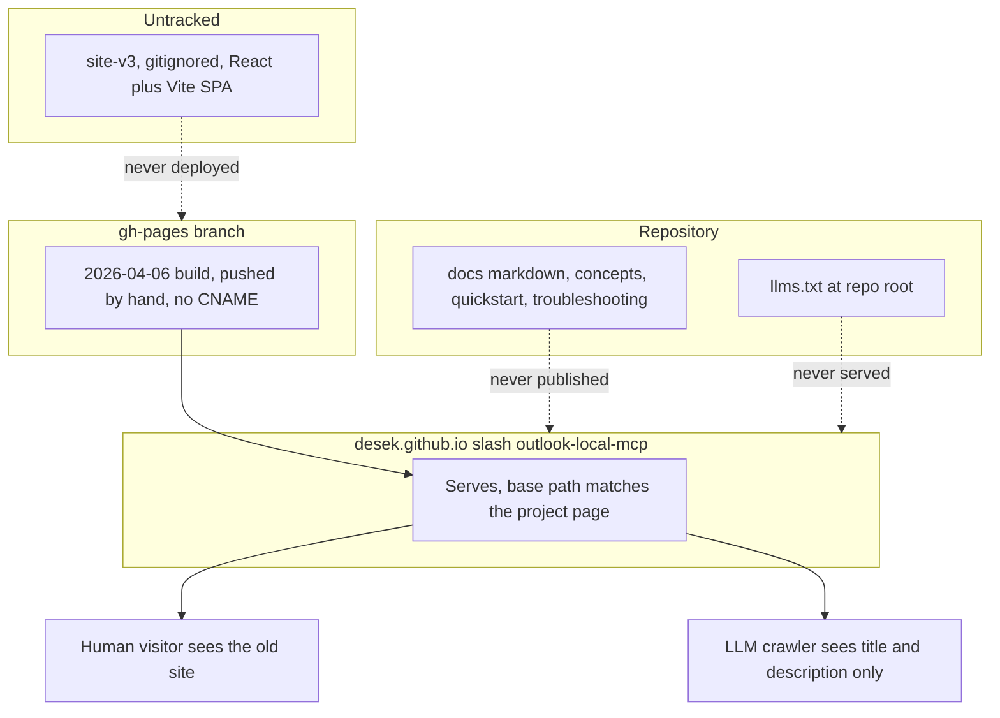
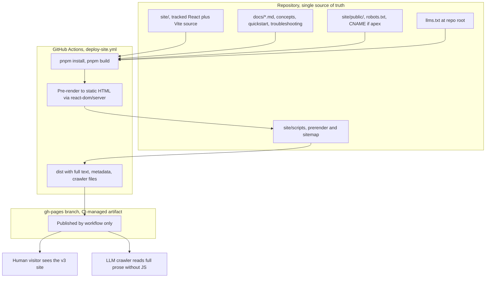
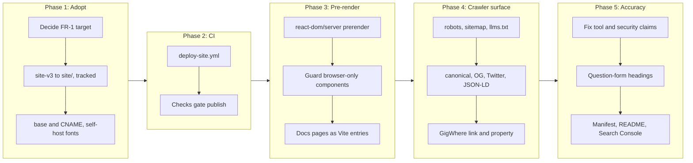
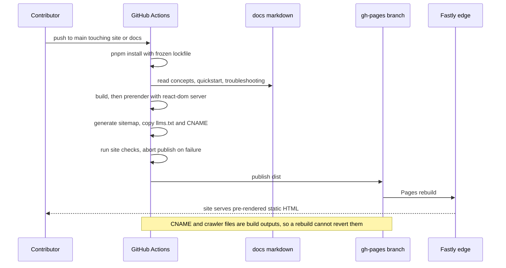

# Site v3 Adoption with SEO and GEO Optimization, GigWhere Backlink, and CI Deployment to gh-pages

## Change Summary

The project website is a client-rendered single-page application whose source has
never been in version control. A separately developed v3 of the design now exists
and is judged materially better than what the repository can produce, so it becomes
the site. This change request brings that source under version control, adds a
GitHub Actions workflow that builds and publishes it to the `gh-pages` branch,
pre-renders it so its content exists without JavaScript, adds the full SEO and GEO
surface, and adds a visible acknowledgement backlink to `https://gigwhere.com`.

The dominant technical problem is that the v3 build emits a document whose body is
`<div id="root"></div>` and nothing else: **zero characters of text without
JavaScript**. Every SEO and GEO requirement in this CR depends on fixing that
first.

## Motivation and Background

Discovery is this project's distribution channel. It is a local, single-binary MCP
server with no hosted component, so it is found in exactly two ways: a human
searching for a way to connect Claude to Outlook without an Entra ID app
registration, and a generative engine answering "which MCP server should I use for
Outlook?". The second matters disproportionately, because an MCP server is a tool
an LLM recommends, and that recommendation is increasingly produced by a model
synthesising retrieved pages. Being cited by an assistant *is* the funnel.

The v3 design is a strong starting point. It ships a 1,003-line `ARCHITECTURE.md`
that maps thirteen sections intent-first, a full design-token translation, named
easing curves, a ten-asset inventory, and ten numbered non-negotiable design rules,
several of which encode hard-won GSAP practice. What it does not ship is any of the
machinery that makes a page findable.

Three specific gaps motivate this change:

* **The content does not exist without JavaScript.** The built `index.html` body is
  an empty root div. Most LLM retrieval pipelines fetch and parse rather than
  render, so today they would see a title and a meta description and nothing else.
  This is the highest-impact item in the CR and everything else is secondary to it.
* **There is no crawler-facing surface at all.** No canonical tag, no Open Graph,
  no Twitter card, no JSON-LD, no `robots.txt`, no `sitemap.xml`, no served
  `llms.txt`.
* **Deployment is manual and the source is untracked.** Every Pages build to date
  was a direct push by the repository owner; the last content build was
  `ae9d427` on 2026-04-06. Nothing about the live site is reproducible or
  reviewable, which is the governance defect this CR closes by vendoring the source
  and moving deployment into CI.

The v3 source also carries factual errors that must not ship. Its meta description
claims "23 MCP tools", and `ARCHITECTURE.md` sections 9 and 10 are built around a
"23 TOOLS" accordion grouped into Account, Diagnostics, Calendar, and Mail. There
is no Diagnostics domain. Since CR-0060 the surface has been four aggregate domain
tools; the registry currently defines 42 verbs (calendar 15, mail 13, account 7,
system 7, each count including that domain's `help` verb), of which 33 are
registered in the default gated configuration. A wrong number on a page a
generative engine quotes verbatim is worse than a vague one, because the error then
propagates into answers this project cannot correct.

## Change Drivers

* The site's content is invisible to the retrieval pipelines that drive the
  project's most important discovery channel.
* No crawler-facing artifacts exist: no canonical, no structured data, no
  `robots.txt`, no `sitemap.xml`, no served `llms.txt`.
* The website source is not under version control, so the live site cannot be
  reviewed or reproduced.
* Deployment is a manual push from a developer machine, with no CI path.
* The published tool count and category model are factually wrong.
* An acknowledgement backlink to `https://gigwhere.com` is owed for testing support
  and for providing the domain.

## Current State

### The v3 source, verified 2026-07-30

Vendored at `site-v3/` and currently **gitignored**, so none of it is under version
control yet.

| Property | Value |
|---|---|
| Stack | React 19.2.8, Vite 8.1.5, TypeScript 7.0.2, Tailwind 4.3.3 |
| Package manager | pnpm 11.18.0, pinned in `.mise.toml` and `packageManager` |
| Motion | GSAP 3.12.7 with `@gsap/react`, ScrollTrigger, and Lenis smooth scroll |
| Components | 15 top-level sections plus 7 asset components (1 canvas, 5 SVG, 1 particle canvas) |
| Router | **None.** Single page, no routes |
| Tests | **None** |
| Build output | `index.html` 1.17 KB, JS 448 KB (gzip 137 KB), CSS 70 KB (gzip 12.9 KB) |
| Text without JavaScript | **0 characters** |

Its `index.html` head carries a title, a meta description containing the stale "23
MCP tools" claim, two icon links, and four render-blocking requests to
`fonts.googleapis.com` and `fonts.gstatic.com`. It has no canonical link, no Open
Graph, no Twitter card, and no JSON-LD.

### Corrections already applied in the working copy

These were made while evaluating the vendored copy and are **not yet under version
control**, because `site-v3/` is ignored. Adopting the source carries them forward.

* **Mock Service Worker removed entirely.** `main.tsx` wrapped the render in an
  async bootstrap that awaited `worker.start()` before `createRoot().render()`, so
  a worker that failed to register meant React never mounted and the page stayed
  blank. MSW earned no keep independently of that: no component fetches anything,
  it served one `/api/tools` endpoint nothing consumed, its mock data still
  described the retired flat tool naming (`account_add`, `calendar_list_events`, a
  `diagnostics` category), and it added roughly 250 KB to a static marketing build.
  `src/mocks/` and `public/mockServiceWorker.js` were deleted and `main.tsx` now
  renders synchronously.
* **pnpm settings moved to `pnpm-workspace.yaml`.** pnpm 11 no longer reads a
  `pnpm` field from `package.json` and warns when one is present.
* **Toolchain bumped** to the latest release in each requested major.

### Deployment target: the state changed under us

The custom domain has been **removed** since CR-0069 was abandoned. Verified
2026-07-30:

| Item | State |
|---|---|
| `gh-pages` `CNAME` file | Absent. Removed by commit `c12b6c5` "Delete CNAME" |
| Pages API `cname` | `null` |
| `https://outlook-local-mcp.com/` | `404` |
| `https://desek.github.io/outlook-local-mcp/` | `200`, serving the 2026-04-06 build |
| Pages source | `gh-pages` branch, path `/`, `build_type: legacy` |
| `https_enforced` | `true` |

The consequence is load-bearing. The site is currently served from a GitHub Pages
**project page**, where GitHub maps the branch root to the `/outlook-local-mcp/`
subpath. The v3 source shipped `base: '/outlook-local-mcp/'`, which is correct for
exactly that arrangement and wrong for an apex domain. The working copy was changed
to `base: '/'` with a `public/CNAME` while the apex was still configured; that
change now mismatches reality and must be reconciled by the decision in FR-1.

### Current State Diagram



## Proposed Change

Adopt v3 as the tracked site, pre-render it, give it a full crawler-facing surface,
and deploy it from CI.

1. **Adopt and track.** `site-v3/` becomes `site/` under version control, with the
   working-copy corrections carried forward. The `/site-v3/` ignore entry is
   removed.
2. **Settle the deployment target,** because it determines the base path and cannot
   be deferred.
3. **Pre-render.** The built document must contain the page's full text without
   JavaScript. Because the site is a single page with no router, this is a
   `react-dom/server` render at build time injected into `index.html`, not a
   routing framework and not a headless browser.
4. **Publish the narrative documentation** as additional crawlable pages, generated
   from `docs/*.md` at build time as separate Vite entries. The Markdown remains
   the single source of truth and is not duplicated into `site/`.
5. **Add the SEO and GEO surface.** Canonical, Open Graph, Twitter card, JSON-LD,
   `robots.txt`, `sitemap.xml`, served `llms.txt`, answer-shaped headings, and
   accurate facts.
6. **Add the GigWhere backlink.**
7. **Deploy from CI** to `gh-pages`, making the branch a generated artifact.

### Proposed State Diagram



## Requirements

### Functional Requirements

**Deployment target and adoption**

1. The change owner **MUST** decide the deployment target before implementation
   starts, and the decision **MUST** be recorded in this CR. The two options are
   mutually exclusive and each fixes several downstream values:
   * **Apex custom domain** `outlook-local-mcp.com`: `base` is `/`,
     `site/public/CNAME` contains the apex, the Pages custom domain is
     reconfigured, and DNS is re-pointed. All absolute URLs use the apex.
   * **GitHub Pages project page** `desek.github.io/outlook-local-mcp/`: `base` is
     `/outlook-local-mcp/`, no `CNAME` is emitted, and all absolute URLs use the
     project-page origin.
2. The repository **MUST** contain the website source at `site/` under version
   control, and the `/site-v3/` entry **MUST** be removed from `.gitignore`.
3. The build **MUST** use pnpm with a committed `pnpm-lock.yaml`, and the pnpm
   version **MUST** remain pinned in `.mise.toml`.
4. `site/node_modules` and `site/dist` **MUST** be gitignored.
5. Mock Service Worker **MUST NOT** be a dependency of the site, and rendering
   **MUST NOT** be gated on any awaited runtime call.
6. The deployed output **MUST NOT** contain a base path that disagrees with the
   FR-1 decision. Absolute `github.com/desek/outlook-local-mcp/...` URLs are
   permitted and are not base paths.

**Pre-rendering**

7. The built document **MUST** contain the page's full textual content with
   JavaScript disabled.
8. Pre-rendering **MUST** be performed at build time by `react-dom/server` without
   requiring a headless browser, so the build needs no network access beyond the
   package registry.
9. Every pre-rendered page **MUST** contain exactly one `<h1>`.
10. Components that touch browser-only APIs (`window`, `document`, canvas, GSAP,
    Lenis, `IntersectionObserver`) **MUST** be guarded so the server render
    succeeds, and **MUST NOT** be rendered in a way that leaves content hidden if
    hydration never happens.
11. Rendering **MUST** fail the build loudly rather than emit a document with an
    empty root.

**Documentation publication**

12. The site **MUST** publish `docs/concepts.md`, `docs/quickstart.md`, and
    `docs/troubleshooting.md` as crawlable HTML pages at stable URLs.
13. Those pages **MUST** be generated from the Markdown at build time. The Markdown
    **MUST** remain the single source of truth and **MUST NOT** be duplicated into
    `site/`.
14. Heading anchors referenced by verb `SeeDocs` values **MUST** resolve in the
    published HTML, so deep links from `system.help` output work.
15. The build **MUST** fail, naming the missing file, if a consumed documentation
    file is renamed or removed.

**Crawler-facing files**

16. `robots.txt` **MUST** be served at the site root, allowing full crawl and
    declaring the sitemap URL.
17. `robots.txt` **MUST NOT** disallow `GPTBot`, `ClaudeBot`, `PerplexityBot`,
    `Google-Extended`, or `OAI-SearchBot`.
18. `sitemap.xml` **MUST** be served at the site root, generated by the build from
    the actual page list, with absolute URLs matching the FR-1 origin and a
    `lastmod` value.
19. The repository-root `llms.txt` **MUST** be served at the site root, copied at
    build time so the two cannot diverge.

**SEO metadata**

20. Every page **MUST** contain a `<link rel="canonical">` with its absolute URL.
21. Every page **MUST** contain Open Graph metadata: `og:title`, `og:description`,
    `og:type`, `og:url`, `og:image`, and `og:site_name`.
22. Every page **MUST** contain Twitter card metadata: `twitter:card` set to
    `summary_large_image`, `twitter:title`, `twitter:description`, and
    `twitter:image`.
23. Every image **MUST** carry descriptive `alt` text.
24. Web fonts **MUST** be self-hosted. The current build makes four requests to
    Google-hosted fonts, which both blocks rendering and transmits the visitor's IP
    address to a third party.

**Factual accuracy**

25. No published page **MUST** contain the strings "23 MCP tools", "23 tools", or
    "23 MCP TOOLS", nor describe a "Diagnostics" tool domain.
26. Published tool facts **MUST** state four aggregate domain tools (`calendar`,
    `mail`, `account`, `system`) and the current verb counts: 42 registered in
    total, 33 in the default gated configuration, with per-domain counts of
    calendar 15, mail 13, account 7, and system 7.
27. Where a per-domain count reflects a fully-enabled configuration, the page
    **MUST** state the gating alongside it.
28. Every numeric or capability claim on the site **MUST** be verifiable against the
    code or the published documentation, and any claim that cannot be substantiated
    **MUST** be removed rather than softened into ambiguity.
29. No page **MUST** contain an absolute or unfalsifiable security claim. Concretely,
    the server exposes no network-reachable service and runs no persistent listener,
    but interactive browser sign-in briefly binds a loopback-only port to receive
    the OAuth redirect, and enabling OpenTelemetry adds an outbound OTLP connection.
    Claims in this area **MUST** reflect that.

**GEO**

30. Every page **MUST** contain JSON-LD structured data valid under schema.org,
    present in the pre-rendered head.
31. The landing page **MUST** include a `SoftwareApplication` entity with `name`,
    `description`, `applicationCategory`, `operatingSystem`, `license`,
    `codeRepository`, `programmingLanguage`, `downloadUrl`, and `softwareVersion`.
32. The landing page **MUST** include a `FAQPage` entity covering at minimum: what
    the project is, whether an Entra ID app registration is required, whether data
    leaves the user's machine, which Outlook features are supported, and how to
    connect it to Claude Desktop.
33. The quickstart page **MUST** include a `HowTo` entity mirroring
    `docs/quickstart.md`.
34. An `Organization` entity **MUST** express the GigWhere acknowledgement as a real
    property (`sponsor` or `contributor`), not only as footer text.
35. Section headings **MUST** be phrased as questions where the section answers one,
    and each section **MUST** open with a self-contained declarative sentence before
    elaborating.
36. Every page **MUST** display a last-updated date, with a matching JSON-LD
    `dateModified`.

**GigWhere backlink**

37. The site footer **MUST** contain a link to `https://gigwhere.com` present as a
    literal `<a href>` in the pre-rendered HTML, not injected by JavaScript.
38. That link **MUST NOT** carry `rel="nofollow"` or `rel="sponsored"`.
39. `README.md` **MUST** carry the same acknowledgement, with wording matching the
    footer.

**CI deployment**

40. A GitHub Actions workflow **MUST** build `site/` and publish the output to the
    `gh-pages` branch on push to `main` when files under `site/` or `docs/` change.
41. The workflow **MUST** be the only mechanism that writes to `gh-pages`, and the
    branch **MUST NOT** be hand-edited.
42. The workflow **MUST NOT** require any secret beyond the default `GITHUB_TOKEN`.
43. The workflow **MUST** run the site's checks before publishing, and **MUST NOT**
    publish if any fail.
44. `CNAME`, `robots.txt`, `sitemap.xml`, and `llms.txt` **MUST** be build outputs
    rather than files placed on `gh-pages` by hand, so a rebuild cannot revert them.
45. `extension/manifest.json` `homepage` **MUST** point at the FR-1 origin.

### Non-Functional Requirements

1. The site **MUST** achieve Largest Contentful Paint under 2.5 seconds, Cumulative
   Layout Shift under 0.1, and Interaction to Next Paint under 200 milliseconds,
   measured by PageSpeed Insights on mobile.
2. The build **MUST** complete with no network access beyond the package registry.
3. The site **MUST NOT** load third-party analytics, trackers, or any third-party
   resource that transmits visitor data, consistent with `PRIVACY.md`.
4. Animation **MUST** honour `prefers-reduced-motion`.
5. The production bundle **MUST NOT** include development-only tooling.

## Affected Components

* `site/` (new, promoted from the ignored `site-v3/`).
* `.github/workflows/deploy-site.yml` (new).
* `gh-pages` branch: becomes a CI-managed artifact.
* `docs/concepts.md`, `docs/quickstart.md`, `docs/troubleshooting.md`: consumed at
  build time, not modified.
* `README.md`: GigWhere acknowledgement, and the site URL if it changes.
* `llms.txt`: copied into the build.
* `extension/manifest.json`: `homepage`.
* `.gitignore`: remove `/site-v3/`, add `site/node_modules` and `site/dist`.
* `.mise.toml`: pnpm pin (already present).
* `docs/reference/architecture.md`: document the site build and its coupling to
  `docs/*.md`.
* `CONTRIBUTING.md`: Node and pnpm toolchain, site commands, `gh-pages` rule.
* GitHub repository settings and DNS, if FR-1 selects the apex domain.

## Scope Boundaries

### In Scope

* Promoting the v3 source to a tracked `site/`.
* Pre-rendering the single page and the documentation pages.
* Crawler files, canonical and social metadata, JSON-LD.
* Self-hosting the fonts.
* Correcting the stale tool facts and the security claims.
* Question-form headings and answer-first section copy.
* The GigWhere backlink, in the footer and `README.md`.
* The CI build-and-deploy workflow.
* A test suite covering the build-output guarantees.
* Search Console and Bing registration, sitemap submission, and, if FR-1 selects
  the apex, the Change of Address filing.

### Out of Scope ("Here, But Not Further")

* **Redesign.** The v3 design is adopted as authored. Layout, typography, and colour
  changes are deferred.
* **Reproducing `ARCHITECTURE.md` sections 9 and 10 as authored.** Those are the
  "23 TOOLS" and "15 CONFIGURATION VARIABLES" accordions. Their content model is
  wrong (FR-25) and per-verb reference is owned by the verb registry and rendered
  by `system.help`, so publishing a second copy to the web would create a competing
  source of truth. Whether to publish a registry-generated equivalent is a separate
  decision under its own CR. The existing `ToolsReferenceSection` and
  `ConfigReferenceSection` components **MUST** either be corrected to the accurate
  model or removed; they **MUST NOT** ship as authored.
* **Three.js.** `ARCHITECTURE.md` Asset 10 specifies `@react-three/fiber` for the
  brand-reveal particles. What was built is a canvas implementation and neither
  Three.js package is a dependency. The canvas implementation stands; adopting
  Three.js is not in scope.
* **Publishing `docs/reference/`.** Contributor-facing internals stay
  repository-only.
* **A fifth embedded documentation file.** The embedded bundle remains exactly
  `docs/{readme,quickstart,concepts,troubleshooting}.md`.
* **Migrating Pages to `build_type: workflow`.** The branch-based source continues
  to work and the workflow writes to `gh-pages`.
* **Client-side routing.** The site stays a set of pre-rendered pages built as
  separate Vite entries; no router is introduced.
* **A documentation search index, internationalization, or a blog.**
* **Any change to MCP tool behaviour, verb registration, or Go source** beyond URL
  strings and the manifest `homepage`.

## Alternative Approaches Considered

* **Keep the existing site and iterate on it.** Rejected, and already attempted:
  CR-0069 rebuilt the site and its iteration session was abandoned because the
  feature gap to v3 was judged too large to close incrementally. That branch and
  its ledger remain as the record.
* **Ship v3 as a client-rendered SPA and skip pre-rendering.** Rejected. It is the
  cheapest option and it forfeits the entire reason for the CR: the crawlers that
  matter most here do not execute JavaScript, so the site would remain invisible to
  them while looking finished to us.
* **Pre-render with a headless browser** (`puppeteer`-based prerender plugins).
  Rejected. It would work, but it violates NFR-2 by requiring a browser download at
  build time, and it is a heavyweight dependency for a single page that
  `react-dom/server` can render directly.
* **Adopt a routing framework** (`vite-react-ssg`, Vike, Astro) for pre-rendering.
  Rejected for this CR. The site is one page plus three generated documentation
  pages, which separate Vite entries handle without introducing a router. It is also
  worth recording that `vite-react-ssg` pins `react-router-dom` to 6.x, and React
  Router 7 breaks its build outright, so that route would have imported a dependency
  conflict along with two moderate advisories that cannot be patched.
* **Serve the documentation as raw Markdown.** Rejected. No structured data, no
  canonical, no heading semantics, and weak retrieval relative to semantic HTML.

## Impact Assessment

### User Impact

Visitors get the v3 design, and its content becomes indexable and citable. Someone
evaluating whether to install the server can have their assistant retrieve the
published concepts, quickstart, and troubleshooting pages, which today exist only
inside the binary and in the repository. No behaviour of the MCP server changes.

### Technical Impact

* The repository gains a pnpm-managed Node toolchain alongside the Go one, and CI
  gains a second build path. Contributors touching `site/` need Node and pnpm;
  contributors touching Go do not.
* `gh-pages` changes character from a hand-managed branch to a generated artifact.
  Anyone holding the old mental model may hand-edit it and have the change reverted.
* Pre-rendering imposes a real constraint on the component tree: anything reaching
  for `window`, `document`, canvas, GSAP, or Lenis at module scope or during the
  first render will break the server render. The v3 source was written without that
  constraint, so this is where the implementation risk concentrates.
* The site build acquires a hard dependency on `docs/*.md` paths and heading
  anchors. This coupling is deliberate, since it is what prevents duplicating
  content, but it means a documentation rename can break the site build.
* No Go behaviour changes. The embedded bundle changes content only if a URL
  changes, and `docs/embed_test.go` continues to guard membership.

### Business Impact

Cost is contributor time; hosting stays free on GitHub Pages. The opportunity cost
of inaction is the larger figure: the live site is a build from 2026-04-06 that
advertises a tool count that has been wrong for several releases, and every crawl
records that.

## Implementation Approach

Five phases, ordered so the site is tracked and deployable before discovery work is
layered on.

**Phase 1: Adopt, track, and settle the target.** Record the FR-1 decision. Move
`site-v3/` to `site/`, remove the `/site-v3/` ignore entry, add `site/node_modules`
and `site/dist`. Set `base` to match the FR-1 decision and emit `CNAME` only if the
apex was chosen. Self-host the Inter and Geist Mono fonts and remove the
Google-hosted links. Confirm MSW is absent and that nothing is awaited before the
first render. Build and verify locally.

**Phase 2: CI deployment.** Add `.github/workflows/deploy-site.yml` building `site/`
with pnpm and publishing to `gh-pages` on push to `main` affecting `site/` or
`docs/`, using only `GITHUB_TOKEN`. Wire the site's checks in as a pre-publish gate.
Record in `CONTRIBUTING.md` that `gh-pages` is CI-managed.

**Phase 3: Pre-rendering and documentation pages.** Add a `react-dom/server`
pre-render step that renders the app to HTML at build time and injects it into
`index.html`, failing the build if the result would leave an empty root. Guard the
browser-only components. Add a Markdown-to-HTML pipeline reading the three
narrative docs and emitting one page each as separate Vite entries, preserving
heading anchors. Verify full text without JavaScript and exactly one `<h1>` per
page.

**Phase 4: Crawler surface and metadata.** Add `robots.txt`, the `llms.txt` copy
step, and a sitemap generator driven by the emitted page list. Add canonical, Open
Graph, Twitter card, and JSON-LD (`SoftwareApplication`, `FAQPage`, `HowTo`,
`Organization`). Add last-updated dates and `dateModified`. Add the GigWhere footer
link and its JSON-LD property.

**Phase 5: Content accuracy, references, and registration.** Correct every stale
tool fact and security claim. Decide and act on `ToolsReferenceSection` and
`ConfigReferenceSection`. Rewrite headings into question form with answer-first
openings. Add the `README.md` acknowledgement. Set `extension/manifest.json`
`homepage` and the repository `homepageUrl`. Register in Search Console and Bing,
submit the sitemap, and file the Change of Address if the apex was chosen.

### Implementation Flow



### Deployment Sequence



## Test Strategy

The site is not covered by the Go suite. Verification is a vitest suite over built
output plus a post-deploy live check.

### Tests to Add

| Test File | Test Name | Description | Inputs | Expected Output |
|-----------|-----------|-------------|--------|-----------------|
| `site/tests/build-output.test.ts` | `basePathMatchesTarget` | Asserts asset references match the FR-1 base, with repo URLs excluded | `dist` tree | All match |
| `site/tests/build-output.test.ts` | `noServiceWorker` | Asserts no `msw` or service worker reference in output | `dist` | Zero matches |
| `site/tests/build-output.test.ts` | `crawlerFilesPresent` | Asserts `robots.txt`, `sitemap.xml`, `llms.txt` exist | `dist` | All present |
| `site/tests/build-output.test.ts` | `llmsTxtMatchesRepoRoot` | Asserts served `llms.txt` is byte-identical to the repo-root file | Both files | Identical |
| `site/tests/build-output.test.ts` | `robotsAllowsAiCrawlers` | Asserts no `Disallow` for the five named agents | `robots.txt` | None |
| `site/tests/build-output.test.ts` | `cnameMatchesTarget` | Asserts `CNAME` presence and content match the FR-1 decision | `dist` | Correct |
| `site/tests/prerender.test.ts` | `everyPageHasProseWithoutJs` | Asserts body text length above a threshold with scripts stripped | All `dist/**/*.html` | Above threshold |
| `site/tests/prerender.test.ts` | `rootIsNotEmpty` | Asserts the root element contains rendered markup | All pages | Non-empty |
| `site/tests/prerender.test.ts` | `everyPageHasSingleH1` | Asserts exactly one `<h1>` per page | All pages | 1 each |
| `site/tests/metadata.test.ts` | `canonicalPresent` | Asserts a canonical link with the correct absolute URL | All pages | Present |
| `site/tests/metadata.test.ts` | `openGraphComplete` | Asserts the six OG properties | All pages | All present |
| `site/tests/metadata.test.ts` | `twitterCardComplete` | Asserts the four Twitter properties | All pages | All present |
| `site/tests/metadata.test.ts` | `jsonLdValid` | Asserts every JSON-LD block parses with a recognised `@type` | All pages | Valid |
| `site/tests/metadata.test.ts` | `requiredEntitiesPresent` | Asserts `SoftwareApplication`, `FAQPage`, `Organization` on the landing page and `HowTo` on quickstart | `dist` | Present |
| `site/tests/metadata.test.ts` | `everyImageHasAltText` | Asserts no `` without `alt` | All pages | None |
| `site/tests/metadata.test.ts` | `noThirdPartyResourceHosts` | Asserts no third-party resource requests, fonts included | All pages | None |
| `site/tests/content.test.ts` | `noStaleToolClaims` | Asserts absence of `23 MCP tools`, `23 tools`, `5 domains`, `Diagnostics` as a domain | `dist` | Zero matches |
| `site/tests/content.test.ts` | `noAbsoluteSecurityClaim` | Asserts absence of unfalsifiable security phrasing | `dist` | Zero matches |
| `site/tests/content.test.ts` | `gigwhereBacklinkDofollow` | Asserts a literal pre-rendered `<a href="https://gigwhere.com">` without nofollow or sponsored | `dist/index.html` | Present |
| `site/tests/content.test.ts` | `lastUpdatedMatchesJsonLd` | Asserts the visible date equals JSON-LD `dateModified` | All pages | Equal |
| `site/tests/sitemap.test.ts` | `sitemapCoversAllPages` | Asserts set equality between emitted HTML pages and sitemap entries | `dist`, `sitemap.xml` | Equal |
| `site/tests/sitemap.test.ts` | `sitemapUsesTargetOrigin` | Asserts every `<loc>` uses the FR-1 origin | `sitemap.xml` | All match |
| `site/tests/docs-pages.test.ts` | `docsAnchorsPreserved` | Asserts every registry `SeeDocs` anchor resolves in published HTML | Registry values, `dist` | All resolve |
| `site/tests/docs-pages.test.ts` | `docsProseNotDuplicated` | Asserts `site/` contains no copy of the narrative Markdown prose | `site/` tree | Absent |
| `site/tests/build-failure.test.ts` | `missingDocFailsBuild` | Asserts the build exits non-zero naming a renamed doc file | Renamed fixture | Non-zero, named |
| `.agents/scripts/verify-site-deploy.sh` | n/a | Post-deploy live check of status codes, redirects, and crawler files | Live site | All pass |

The test runner **MUST** build before asserting, and **MUST NOT** assert against a
pre-existing `dist`. A suite that can pass against stale output is worse than no
suite, because it is trusted.

### Tests to Modify

| Test File | Test Name | Current Behavior | New Behavior | Reason for Change |
|-----------|-----------|------------------|--------------|-------------------|
| `docs/embed_test.go` | existing allowlist test | Asserts the embedded bundle is exactly the four permitted files | Unchanged assertions, must keep passing after any URL edits | Guards against accidental bundle additions during the reference sweep |

### Tests to Remove

Not applicable. The v3 source ships no tests, so there is nothing to retire.

## Acceptance Criteria

### AC-1: The deployment target is decided and consistent

```gherkin
Given the FR-1 decision is recorded in this CR
When the site is built
Then the base path, the CNAME presence, and every absolute URL match that decision
  And no artifact references the other option's origin
```

### AC-2: Content exists without JavaScript

```gherkin
Given the site has been built
When any published page is fetched and its script tags are stripped
Then the remaining body text exceeds the configured minimum length
  And the root element contains rendered markup rather than being empty
```

### AC-3: A failed pre-render fails the build

```gherkin
Given the pre-render step cannot render the application
When the build runs
Then the build exits non-zero
  And no output containing an empty root element is published
```

### AC-4: Crawler files are served

```gherkin
Given the site has been built
When robots.txt, sitemap.xml, and llms.txt are requested
Then each is present in the output
  And robots.txt declares the sitemap URL
  And robots.txt contains no Disallow for GPTBot, ClaudeBot, PerplexityBot, Google-Extended, or OAI-SearchBot
```

### AC-5: llms.txt cannot diverge

```gherkin
Given the repository-root llms.txt is modified
When the site is rebuilt
Then the served llms.txt is byte-identical to the repository-root file
```

### AC-6: Documentation is published and not duplicated

```gherkin
Given docs/concepts.md, docs/quickstart.md, and docs/troubleshooting.md exist
When the site is built
Then each is published as an HTML page at a stable URL
  And each appears in sitemap.xml
  And every verb SeeDocs anchor resolves on the published page
  And site/ contains no copy of their prose
```

### AC-7: A renamed documentation file fails the build

```gherkin
Given a documentation file consumed by the site build is renamed
When the build runs
Then it fails with an error naming the missing file
  And no partial output is published
```

### AC-8: Metadata is present and valid

```gherkin
Given the site has been built
When any page's pre-rendered head is inspected
Then it contains a canonical link, six Open Graph properties, and four Twitter card properties
  And every JSON-LD block parses and declares a recognised schema.org type
And when the landing page is submitted to the Google Rich Results Test
Then the test reports no errors
```

### AC-9: Required structured-data entities exist

```gherkin
Given the site has been built
When the landing page is inspected
Then SoftwareApplication, FAQPage, and Organization entities are present
  And the Organization entity expresses the GigWhere acknowledgement as a property
And when the quickstart page is inspected
Then a HowTo entity is present
```

### AC-10: Published facts are accurate

```gherkin
Given the MCP surface is four aggregate domain tools with 42 registered verbs, 33 in the default gated configuration
When any published page is inspected
Then the strings "23 MCP tools", "23 tools", and "5 domains" appear nowhere
  And no page describes a Diagnostics tool domain
  And any per-domain count that reflects a fully-enabled configuration states its gating
```

### AC-11: No unfalsifiable security claim is published

```gherkin
Given the server binds a loopback port during interactive browser sign-in
  And enabling OpenTelemetry adds an outbound OTLP connection
When any published page is inspected
Then no page claims the server has no attack surface, no listening ports, or that credentials never leave the machine
  And network claims state their qualifications
```

### AC-12: The GigWhere backlink is crawlable and dofollow

```gherkin
Given the site has been built
When the pre-rendered landing page HTML is inspected without executing JavaScript
Then it contains an anchor with href https://gigwhere.com
  And that anchor carries neither rel=nofollow nor rel=sponsored
  And README.md contains the same acknowledgement wording
```

### AC-13: No third-party resource is loaded

```gherkin
Given the site has been built
When every page's resource references are inspected
Then no reference targets a host other than the site's own origin
  And the Inter and Geist Mono fonts are served from the site
```

### AC-14: CI is the only path to gh-pages

```gherkin
Given a contributor changes a file under site/ and merges to main
When the deploy workflow completes
Then gh-pages reflects the new build
  And no manual step was required
  And the workflow used no secret beyond GITHUB_TOKEN
```

### AC-15: Failing checks block publication

```gherkin
Given a site check fails
When the deploy workflow runs
Then the workflow fails
  And gh-pages is not updated
```

### AC-16: Build outputs cannot be reverted by a rebuild

```gherkin
Given CNAME, robots.txt, sitemap.xml, and llms.txt are emitted by the build
When the workflow rebuilds and republishes
Then all four are present in gh-pages with their intended content
```

### AC-17: The site is reachable at the decided target

```gherkin
Given the workflow has published and Pages has rebuilt
When the FR-1 target URL is requested
Then it returns 200 over HTTPS
  And every referenced asset returns 200
```

### AC-18: Core Web Vitals thresholds are met

```gherkin
Given the site is live
When PageSpeed Insights is run against it on mobile
Then Largest Contentful Paint is under 2.5 seconds
  And Cumulative Layout Shift is under 0.1
  And Interaction to Next Paint is under 200 milliseconds
```

### AC-19: Reduced motion is honoured

```gherkin
Given a visitor has prefers-reduced-motion set to reduce
When any page is loaded
Then scroll-driven and looping animation does not run
  And all content remains visible and legible
```

### AC-20: Search engines are notified

```gherkin
Given the site is live and the sitemap is served
When Google Search Console and Bing Webmaster Tools are configured
Then the property is verified in both
  And sitemap.xml is submitted to both
  And if the apex domain was chosen, a Change of Address is filed from the project-page property
```

## Quality Standards Compliance

### Build & Compilation

- [ ] `make ci` exits 0; the Go binary is unaffected
- [ ] `pnpm --dir site install --frozen-lockfile` succeeds
- [ ] `pnpm --dir site run build` succeeds, including the pre-render step
- [ ] No new compiler or bundler warnings

### Linting & Code Style

- [ ] `make lint` and `make fmt-check` pass
- [ ] The site source passes its own linter and formatter
- [ ] Any linter exception carries an explanatory comment

### Test Execution

- [ ] `make test` passes, including `docs/embed_test.go`
- [ ] `pnpm --dir site test` passes, having rebuilt output first
- [ ] `.agents/scripts/verify-site-deploy.sh` passes against the live site

### Documentation

- [ ] Every new tracked file under `site/` carries a top docstring with an
      `@agents-index` annotation
- [ ] `docs/reference/architecture.md` documents the site build, the pre-render
      step, and the coupling to `docs/*.md`
- [ ] `CONTRIBUTING.md` documents the pnpm toolchain, the site commands, and the
      `gh-pages` no-hand-edit rule
- [ ] `README.md` carries the GigWhere acknowledgement
- [ ] `.gitignore` is accurate: `/site-v3/` removed, `site/node_modules` and
      `site/dist` added

### Code Review

- [ ] Changes submitted via pull request
- [ ] PR title follows Conventional Commits
- [ ] Review completed and approved
- [ ] Squash-merged to maintain linear history

### Verification Commands

```bash
# Go side, unaffected by this CR
make ci

# Site
pnpm --dir site install --frozen-lockfile
pnpm --dir site run build
pnpm --dir site test

# Assert content exists without JavaScript
node -e "const h=require('fs').readFileSync('site/dist/index.html','utf8'); \
  const b=h.slice(h.indexOf('</head>')).replace(/<script[\s\S]*?<\/script>/g,'').replace(/<[^>]+>/g,' '); \
  const n=b.split(/\s+/).filter(Boolean).length; \
  if (n < 200) { console.error('pre-render produced only '+n+' words'); process.exit(1); } \
  console.log('ok: '+n+' words without JS');"

# Post-deploy live verification
.agents/scripts/verify-site-deploy.sh
```

## Risks and Mitigation

### Risk 1: The component tree resists server rendering

**Likelihood:** high
**Impact:** high
**Mitigation:** this is where the work will actually be spent. The v3 source was
written for the browser: it uses GSAP with `useGSAP`, Lenis smooth scroll, a canvas
hero background, a particle canvas, and `IntersectionObserver`. Any of these
touching `window` or `document` at module scope or during first render breaks
`react-dom/server`. Mitigation is to render the content tree on the server and load
the motion and canvas layers only on the client, so the server render never
executes browser code. Content must never be hidden pending hydration: the
pre-rendered markup is the source of truth for what a crawler sees, and CSS or
script that hides it until hydration defeats the whole CR. AC-2 and AC-3 exist to
catch exactly that.

### Risk 2: Pre-rendered markup diverges from hydrated markup

**Likelihood:** medium
**Impact:** medium
**Mitigation:** React logs hydration mismatches and may discard server markup,
producing a visible flash. Keep the server and client trees identical and derive
any environment-dependent value (dates, random seeds, viewport checks) from props
rather than computing it during render.

### Risk 3: The base path is set for the wrong target

**Likelihood:** medium
**Impact:** high
**Mitigation:** this defect has already occurred once on this project and took the
live site down; it is also the reason the current 2026-04-06 build works at
github.io. FR-1 forces the decision up front and AC-1 asserts internal consistency
across the base path, the `CNAME`, and every absolute URL. Note the direction of
travel matters: moving to the apex requires reconfiguring the Pages custom domain
and DNS, since `CNAME` was deleted by `c12b6c5`.

### Risk 4: The site build breaks on a documentation change

**Likelihood:** medium
**Impact:** medium
**Mitigation:** the build reads `docs/*.md` by path and depends on heading anchors
for `SeeDocs` links. AC-7 requires a loud failure on a missing file, and
`docsAnchorsPreserved` cross-checks every registry anchor, so an anchor rename
fails CI rather than shipping dead deep links.

### Risk 5: The stale content model is reproduced rather than corrected

**Likelihood:** medium
**Impact:** high
**Mitigation:** the wrong facts are not incidental, they are structural: whole
sections are built around a "23 TOOLS" accordion and a Diagnostics category.
`ToolsReferenceSection` and `ConfigReferenceSection` are named explicitly in Scope
Boundaries as must-correct-or-remove, and `noStaleToolClaims` fails the build
output if any of the strings survive.

### Risk 6: Fonts remain third-party

**Likelihood:** low
**Impact:** medium
**Mitigation:** the four Google Fonts requests both block rendering and transmit
visitor IPs, which contradicts `PRIVACY.md`. `noThirdPartyResourceHosts` asserts
their absence so a reintroduction fails CI.

### Risk 7: gh-pages is hand-edited after the workflow exists

**Likelihood:** medium
**Impact:** low
**Mitigation:** this has happened repeatedly on this repository, including the
`CNAME` create-and-delete churn visible in the branch history. Making `CNAME` and
the crawler files build outputs removes the incentive for the most likely edits, and
`CONTRIBUTING.md` states the rule.

### Risk 8: Bundle weight regresses Core Web Vitals

**Likelihood:** medium
**Impact:** medium
**Mitigation:** the current build is 448 KB of JavaScript (137 KB gzipped) plus
70 KB of CSS (12.9 KB gzipped), and GSAP, Lenis, and several canvas components are
all client-side. Pre-rendering improves perceived load but does not reduce bundle
size. Code-split the motion layer so it is not on the critical path, and measure
against NFR-1 rather than assuming.

## Dependencies

* **Blocking:** the FR-1 deployment-target decision. It fixes the base path, the
  `CNAME`, and every absolute URL, and cannot be deferred past Phase 1.
* If the apex is chosen, requires access to the Cloudflare DNS zone and the GitHub
  Pages settings to reconfigure the custom domain deleted by `c12b6c5`.
* Depends on CR-0065 for the documentation governance rules that decide what is
  published to the web and what stays repository-only.
* Depends on CR-0060 and CR-0068 for the accurate description of the tool surface.
* Requires GitHub Pages to remain on branch-based deployment from `gh-pages`.
* Requires a Google account with Search Console access for AC-20.
* Supersedes CR-0069, which was abandoned. That CR and its iteration ledger remain
  on branch `dev/cr-0069`; nothing from it is merged.

## Estimated Effort

| Phase | Effort | Notes |
|-------|--------|-------|
| Phase 1: Adopt, track, settle target | 3 to 5 hours | Font self-hosting is most of it |
| Phase 2: CI deployment | 2 to 3 hours | |
| Phase 3: Pre-render and docs pages | 10 to 18 hours | Widest variance; depends entirely on how the motion and canvas layers tolerate server rendering |
| Phase 4: Crawler surface and metadata | 5 to 7 hours | |
| Phase 5: Content accuracy and registration | 6 to 9 hours | Copy rewriting and the reference-section decision dominate |
| **Total** | **26 to 42 hours** | |

## Decision Outcome

Chosen approach: "adopt v3 as the tracked site, pre-render it with
`react-dom/server`, and deploy it from CI", because the design question is already
settled and the remaining gap is entirely machinery. Pre-rendering is treated as
the load-bearing requirement rather than one item among many: without it the site
is invisible to the retrieval pipelines that justify the CR, and every other SEO
and GEO requirement decorates a document no crawler can read.

`react-dom/server` is chosen over a routing framework or a headless-browser
prerenderer because the site is one page plus three generated documentation pages.
Separate Vite entries cover that without introducing a router, a browser download
at build time, or the dependency conflict that `vite-react-ssg` would import along
with its React Router 6 pin.

Phasing puts adoption and CI first so the site is tracked, reviewable, and
deployable before the highest-uncertainty work begins, and so the pre-rendering
risk cannot block getting the source under version control.

## Related Items

* Supersedes: CR-0069 (abandoned; branch `dev/cr-0069` retains the CR, its
  validation report, and the iteration ledger)
* Related change requests: CR-0060 (domain-aggregated tools), CR-0065
  (documentation architecture), CR-0068 (tool definition quality)
* Issue: [#26](https://github.com/desek/outlook-local-mcp/issues/26)
* Documentation: `docs/concepts.md`, `docs/quickstart.md`,
  `docs/troubleshooting.md`, `docs/reference/architecture.md`
* Vendored design documentation: `site/ARCHITECTURE.md` and `site/CONTENT.md`,
  carried across with the source

## More Information

### Why pre-rendering is the load-bearing requirement

Conventional SEO optimises for a ranked list a human chooses from. Generative
engines retrieve passages and synthesise an answer, so success is a quotable,
attributable claim rather than a ranking position. For a developer tool whose
adoption decision is frequently made inside an LLM conversation, that second channel
dominates.

Three properties drive retrieval, and the first is a precondition for the others:

1. **The content must exist without JavaScript.** Most retrieval pipelines fetch and
   parse rather than render. The v3 build currently emits zero characters of body
   text without JavaScript, so today it has nothing to retrieve. FR-7.
2. **Claims must be self-contained and specific.** "Four aggregate MCP tools
   dispatching 42 verbs across calendar, mail, account, and system, 33 of them
   registered in the default gated configuration" survives extraction. "Powerful
   Outlook integration" does not. FR-26 and FR-35.
3. **Structure must match the question.** Question-form headings with answer-first
   sentences align the retrievable unit with the query. FR-35.

### On not blocking AI crawlers

Any managed `robots.txt` that restricts AI training and grounding is reasonable for
a publisher monetising page views and actively harmful here, because this project's
users arrive through exactly the assistants such a file would restrict. FR-17 makes
the choice explicit so a future infrastructure change does not silently reintroduce
it. This is not hypothetical: while the site was proxied through Cloudflare, its
managed Content Signals `robots.txt` occupied that path.

### Inherited design documentation

The v3 source ships `ARCHITECTURE.md` (1,003 lines) and `CONTENT.md` (296 lines),
and both are carried across with it. They are a genuine asset: the architecture
document encodes ten numbered design rules, several of which are hard-won GSAP
practice (use `gsap.matchMedia()` rather than `window.innerWidth` checks inside
`useGSAP`; use `useGSAP` rather than raw `useEffect`; drive progress indicators with
direct DOM manipulation rather than `setState`; use `height: 100vh` rather than
`minHeight` on pinned triggers).

Two caveats travel with them. Their tool-surface content is the retired model
(FR-25), and Asset 10 specifies a Three.js particle field via `@react-three/fiber`
while what was actually built is a canvas implementation and neither package is a
dependency. Where the documents and the code disagree, the code is correct and the
documents should be corrected to match as they are adopted.

### Why CR-0069's number is not reused

CR-0069 exists as a committed document on `dev/cr-0069` and will not be merged.
Reusing the identifier would put two different documents under one ID in the same
repository's history, so this CR takes 0070 and the gap is intentional.
