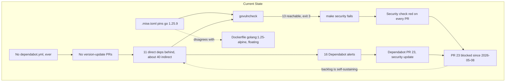
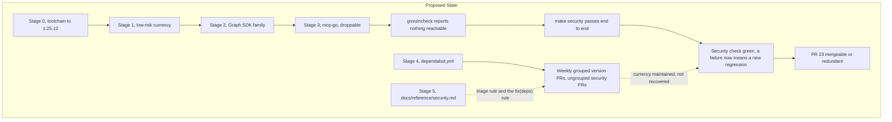
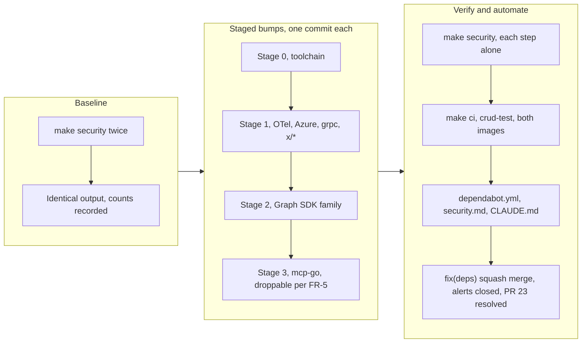

# Go Dependency Currency and Vulnerability Remediation

## Change Summary

The Go module has drifted: eleven direct dependencies and roughly forty
indirect ones are behind their current releases, and the toolchain is pinned
three patch releases back. This CR brings the module graph current in
risk-ordered stages, raises the Go toolchain, and adds `.github/dependabot.yml`
so currency is maintained by automation rather than recovered by campaign.

Sixteen open Dependabot alerts and thirteen `govulncheck` findings are
consequences of that drift, and they close as a consequence of fixing it. The
CR is written that way deliberately: the alerts are the symptom that made the
problem visible, but remediating alert by alert leaves the module graph in the
same state that produced them, waiting to produce the next batch.

The site's npm tree is handled by CR-0072.

## Motivation and Background

Two instruments have been reporting this independently and both have been
merged past.

The `Security` workflow has failed on every recent pull request, always at the
same step (`make: *** [Makefile:36: govulncheck] Error 3`). `govulncheck`
reports thirteen *reachable* vulnerabilities across four modules and the Go
standard library, with call paths in real application code.

Separately, sixteen Dependabot alerts are open against `go.mod`, the oldest
since 2026-05-08.

The state that makes this urgent rather than merely untidy is a deadlock
between the two. Dependabot opened **PR #23** on 2026-05-08 to fix the oldest
alert (`kiota-http-go` 1.5.4 to 1.5.5). That PR's `ci` check passes. Its
`security` check **fails**, because `govulncheck` fails on the *other*,
unrelated findings: the standard library, `golang.org/x/net`,
`golang.org/x/text`, and `google.golang.org/grpc`. The security fix is blocked
by the security gate failing on everything the security fix does not address,
and it has been blocked for nearly three months.

Nothing about that deadlock is resolvable one alert at a time. It is
resolvable by bringing the graph current in one deliberate pass, which is what
this CR does.

There is a second, quieter failure worth naming. PR #23 is titled
`chore(deps): bump github.com/microsoft/kiota-http-go from 1.5.4 to 1.5.5`.
`release-please` is configured with `release-type: go`, and a `chore` commit
produces **no release at all**. Had that PR merged, the fix would have landed
on `main` and reached no user of a released binary. Dependency currency work
that is meant to reach users has to be titled as a fix, and nothing currently
enforces that.

## Change Drivers

* **A failing security gate cannot signal a new regression.** `Security` has
  been red for long enough that it carries no information. Restoring it is
  worth more than any individual finding it currently reports.
* **A blocked dependency pipeline.** PR #23 demonstrates the deadlock
  concretely: automated fixes cannot land while the gate is failing for
  unrelated reasons, so the backlog is self-sustaining.
* **Eleven direct dependencies behind.** Including `mcp-go` by twelve minor
  releases, the Azure identity stack, the Microsoft Graph SDK family, and the
  entire OpenTelemetry set. Each month of deferral makes the eventual pass
  larger and its blast radius harder to reason about.
* **The Go standard library is three patch releases behind.** `.mise.toml`
  pins `go = "1.25.9"`; `crypto/tls` needs `go1.25.12`. No module bump fixes
  this, and eight of the thirteen `govulncheck` findings are fixed by the
  toolchain alone.
* **No `.github/dependabot.yml` has ever existed.** Confirmed against the full
  history. Security updates arrive without it, which is why PR #23 exists, but
  *version* updates do not, which is why eleven direct dependencies drifted
  without anyone being told.
* **Toolchain pins are duplicated across three files** that already disagree.

## Current State

### Direct dependency currency

From `go list -m -u all` on 2026-07-31. Eleven of the twenty-one direct
requirements have newer releases:

| Module | Current | Available | Gap |
|--------|---------|-----------|-----|
| `github.com/mark3labs/mcp-go` | v0.45.0 | v0.57.0 | 12 minors, v0 |
| `github.com/microsoftgraph/msgraph-sdk-go` | v1.96.0 | v1.100.0 | 4 minors |
| `github.com/microsoftgraph/msgraph-sdk-go-core` | v1.4.0 | v1.4.1 | 1 patch |
| `github.com/AzureAD/microsoft-authentication-library-for-go` | v1.6.0 | v1.8.0 | 2 minors |
| `github.com/Azure/azure-sdk-for-go/sdk/azidentity` | v1.13.1 | v1.14.0 | 1 minor |
| `github.com/Azure/azure-sdk-for-go/sdk/azcore` | v1.21.0 | v1.22.0 | 1 minor |
| `google.golang.org/grpc` | v1.80.0 | v1.83.0 | 3 minors |
| `go.opentelemetry.io/otel` and 6 sibling modules | v1.43.0 | v1.44.0 | 1 minor each |

Current and requiring no action: `azidentity/cache` v0.4.0,
`microsoft-authentication-extensions-for-go/cache` v0.1.1, `google/uuid`
v1.6.0, `kiota-abstractions-go` v1.9.4, `kiota-authentication-azure-go`
v1.3.1, `pkg/browser`.

Roughly forty indirect requirements are also behind, including
`golang.org/x/crypto` (v0.49.0 to v0.54.0), `golang.org/x/net` (v0.52.0 to
v0.57.0), `golang.org/x/text` (v0.35.0 to v0.40.0), `golang.org/x/sys`,
`golang.org/x/oauth2`, the `kiota-serialization-*` family, and the
`genproto` pair. Most move as a consequence of the direct bumps above.

`github.com/mark3labs/mcp-go` deserves separate mention. It is a v0 module, so
its minor releases are permitted to break, and it is the framework that owns
the entire MCP surface: tool registration, the middleware chain, and the
protocol handling that `internal/server/` and `internal/tools/` are built on.
Twelve minors is the largest single unknown in this change and is staged
accordingly.

### Toolchain currency

* `.mise.toml` pins `go = "1.25.9"`. Every `ci.yml` and `security.yml` job
  resolves Go through `jdx/mise-action@v4`, so this is the CI toolchain.
* `go.mod:3` declares `go 1.25.9`.
* `Dockerfile:108` uses `golang:1.25-alpine`, a floating minor tag that
  already picks up the newest patch.
* `Dockerfile.Glama:9` downloads `go1.25.9.linux-amd64.tar.gz` by exact URL.

The container and CI builds therefore already disagree about which
standard-library vulnerabilities exist in the binary they produce.

### What the drift has produced

**Sixteen open Dependabot alerts** against `go.mod`, summarised by module
rather than enumerated, because the count is a property of how the advisories
were filed and not a measure of exposure:

| Module | Alerts | Severities | Closed by |
|--------|--------|------------|-----------|
| `golang.org/x/crypto` | 13 | 7 critical, 2 high, 4 medium | one bump to v0.52.0 or later |
| `google.golang.org/grpc` | 1 | high | v1.82.1 or later |
| `golang.org/x/net` | 1 | medium | v0.55.0 or later |
| `github.com/microsoft/kiota-http-go` | 1 | high | v1.5.5 or later |

All thirteen `golang.org/x/crypto` advisories are in the
`golang.org/x/crypto/ssh` package tree: agent key constraints, host-key
callbacks, channel handling, FIDO/U2F presence checks. This server opens no
SSH connection, so none is reachable. They are remediated anyway, because the
bump is free and the alternative is re-arguing reachability on every future
advisory in that package.

**Thirteen `govulncheck` findings**, from `Security` run 30621759098 and
reproduced locally. Nine involve the Go standard library; eight of the thirteen
are fixed by the toolchain alone. The ninth standard-library finding,
GO-2026-4918, additionally carries a `golang.org/x/net` call path, so it clears
in Stage 1 rather than Stage 0 even though its `net/http` path is patched by the
toolchain:

| Component | Present | Fixed in | Dependabot alert? |
|-----------|---------|----------|-------------------|
| `crypto/tls` | go1.25.9 | go1.25.12 | No |
| `crypto/x509` | go1.25.9 | go1.25.11 | No |
| `net/textproto` | go1.25.9 | go1.25.11 | No |
| `net/http`, `net`, `net/mail` (×2), `html/template` (×2) | go1.25.9 | go1.25.10 | No |
| `golang.org/x/text` | v0.35.0 | v0.39.0 | **No** |
| `golang.org/x/net` | v0.52.0 | v0.55.0 | Yes |
| `google.golang.org/grpc` | v1.80.0 | v1.82.1 | Yes |
| `github.com/microsoft/kiota-http-go` | v1.5.4 | v1.5.5 | Yes |

The reported call paths are application code, not test-only or vendored:
`internal/validate/validate.go:88` reaches `net/mail.ParseAddress`,
`internal/auth/email_resolver.go:37` reaches `net/http` and
`golang.org/x/net/http2` through the Graph SDK, and
`internal/auth/auth.go:434` reaches `html/template` and `net` through
`azidentity`.

`golang.org/x/text` is worth singling out: it is a reachable finding that
Dependabot does not report at all. An alert-driven remediation would have
missed it and left the gate red.

**One deadlocked pull request**, PR #23, described above.

### Automation state

`.github/dependabot.yml` has never existed in this repository's history.
Security updates arrive regardless (PR #23, and closed PR #17), but version
updates do not, and neither the `github-actions` ecosystem nor the site's
`npm` tree is covered. All six workflows use pinned third-party actions that
nothing updates.

### Current State Diagram



## Proposed Change

The change is a staged currency pass. Stages are ordered by ascending blast
radius so that each is independently verifiable and, if the last one has to be
abandoned, everything before it still ships.

### Stage 0: Toolchain

Raise the Go toolchain to `1.25.12` or later, the highest floor any finding
requires (`crypto/tls`). Update `.mise.toml`, the `go` directive in `go.mod`,
and the tarball URL in `Dockerfile.Glama`.

`Dockerfile:108` stays on the floating `golang:1.25-alpine` tag deliberately.
It already resolves to the newest patch; pinning it exactly would reintroduce
the drift this stage closes, in the other direction. That is a decision, and
it is recorded here so the next reader does not "fix" it.

This stage alone should clear eight of the thirteen `govulncheck` findings,
taking the count to five, and is verified on its own before anything else
moves. The ninth standard-library finding, GO-2026-4918, shares a
`golang.org/x/net` call path and clears in Stage 1, not here.

### Stage 1: Low-risk currency

Bring current, in one changeset:

* The seven `go.opentelemetry.io/otel*` modules, v1.43.0 to v1.44.0. They move
  as a set and must stay on a single version.
* `github.com/Azure/azure-sdk-for-go/sdk/azcore` and `.../azidentity`.
* `github.com/AzureAD/microsoft-authentication-library-for-go`.
* `google.golang.org/grpc` to v1.83.0.
* The `golang.org/x/*` family, taken to current rather than to the advisory
  floor. These are v0 modules where the minor *is* the patch stream, so
  "latest" and "minimum patched" differ only in how soon the next alert
  arrives.
* The remaining indirect graph, via `go mod tidy`.

These have no expected source impact. `grpc` is used only by the OTLP
exporters in `internal/observability`; the advisory concerns xDS RBAC and
HTTP/2 handling, neither of which this project configures.

### Stage 2: The Microsoft Graph SDK family

`msgraph-sdk-go` v1.96.0 to v1.100.0, `msgraph-sdk-go-core` v1.4.0 to v1.4.1,
and the `kiota-*` modules they carry, including the `kiota-http-go` bump that
PR #23 has been unable to land.

Four minors of generated Graph client code is expected to be additive, but
this is the project's deepest coupling and touches every verb in
`internal/tools/`. It is staged separately so a failure here does not
invalidate Stage 1.

### Stage 3: `mcp-go`

`github.com/mark3labs/mcp-go` v0.45.0 to v0.57.0.

This is the highest-risk bump in the CR and the one most likely to require
source changes. It is a v0 module, so twelve minors may include breaking
changes by convention, and it owns tool registration, the middleware chain
that `internal/audit` and `internal/observability` wrap, and the annotation
computation CR-0068 built on the registry.

Because the blast radius reaches the MCP surface itself, this stage carries an
explicit exit: if it requires more than mechanical adaptation, it is dropped
from this CR and deferred to its own, and Stages 0 to 2 ship without it. The
security outcome does not depend on it. Dropping it **MUST** be recorded in
the pull request rather than left as a silent omission, because a reader
comparing the CR to the diff would otherwise find a stage missing with no
explanation.

### Stage 4: `.github/dependabot.yml`

Create the file with two ecosystems, `gomod` on `/` and `github-actions` on
`/`, both weekly. Version updates are grouped into one pull request per
ecosystem; security updates are left ungrouped so they arrive alone and are
reviewable in isolation. CR-0072 adds the `npm` entry for `/site`.

The file carries a header comment explaining the grouping choice, matching the
commenting convention already established in `.github/workflows/site.yml`.

### Stage 5: `docs/reference/security.md`

A new contributor-level reference recording, once:

* What Dependabot, `govulncheck`, and `grype` each measure, and why their
  finding counts differ on this repository.
* The triage procedure for a new alert: reproduce with `make security` first;
  remediate by version bump by default; dismiss only with a written
  reachability argument.
* The standing assessment that `golang.org/x/crypto/ssh` advisories are
  unreachable here, naming the command that establishes it.
* Two rules learned from this CR:
  1. Read an advisory's patched version from the entry matching the
     *ecosystem*, and check every range, not the first one. GHSA-7j59-v9qr-6fq9
     lists Maven first with a patched version of `1.9.1`, while its `go` entry
     patches at `1.5.5`; `kiota-http-go` has no `1.9.1` and never will.
  2. A dependency pull request that should reach users **MUST** be
     squash-merged with a `fix(deps):` title. `chore(deps):`, which is what
     Dependabot generates, produces no release.

Per the documentation governance rules this is contributor-level material, so
it lives in `docs/reference/` and is not embedded in the binary.

### Proposed State Diagram



## Requirements

### Functional Requirements

1. The repository **MUST** pin a Go toolchain of `1.25.12` or later in
   `.mise.toml`.
2. The `go` directive in `go.mod` and the tarball URL in `Dockerfile.Glama`
   **MUST** state the same Go version as `.mise.toml`.
3. Every direct requirement in `go.mod` listed in the Current State currency
   table **MUST** be raised to the available version named there or later,
   except `github.com/mark3labs/mcp-go` where FR-5 applies.
4. The indirect graph **MUST** be brought current by `go mod tidy` after the
   direct bumps, and `go.sum` **MUST** be consistent with it.
5. `github.com/mark3labs/mcp-go` **MUST** be raised to v0.57.0, or the pull
   request **MUST** state that Stage 3 was dropped and why, and **MUST** name
   the follow-up CR that carries it.
6. `govulncheck` **MUST** report no vulnerability in code the module calls.
7. `grype --fail-on high` against the binary SBOM **MUST** exit 0.
8. The licence check **MUST** exit 0.
9. `make security` **MUST** exit 0, and each of its four prerequisite steps —
   `go mod verify`, `govulncheck`, `grype` (via `vuln-scan`), and `grant` (via
   `license-check`) — **MUST** be shown to pass individually rather than only in
   aggregate.
10. `.github/dependabot.yml` **MUST** exist and **MUST** declare the `gomod`
    ecosystem on `/` and the `github-actions` ecosystem on `/`.
11. For each declared ecosystem, version updates **MUST** be grouped into a
    single pull request and security updates **MUST NOT** be grouped.
12. `docs/reference/security.md` **MUST** exist and **MUST** state what
    Dependabot, `govulncheck`, and `grype` each measure, why their findings
    differ here, and the triage procedure for a new alert.
13. `docs/reference/security.md` **MUST** record the reachability assessment
    for the `golang.org/x/crypto/ssh` advisory family, naming the command that
    establishes it rather than asserting it.
14. `docs/reference/security.md` **MUST** state the advisory-reading rule and
    the `fix(deps):` squash-merge rule described in Stage 5.
15. `CLAUDE.md` **MUST** list `security` in the `docs/reference/` enumeration
    in its Documentation Governance section, and **MUST** point to
    `docs/reference/security.md` from its Quality Standards section.
16. No Dependabot alert against `go.mod` **MUST** remain open after this CR
    merges; any alert not closed by a version bump **MUST** carry a written
    dismissal reason referencing `docs/reference/security.md`.
17. The pull request **MUST** be squash-merged with a `fix(deps):` title, so
    `release-please` produces a patch release.

### Non-Functional Requirements

1. The change **MUST NOT** alter any behaviour observable through the MCP tool
   surface: no verb is added, removed, renamed, or re-signatured, and no
   annotation value changes.
2. `make ci` **MUST** pass, including `-race` tests.
3. `extension/manifest.json` **MUST** be unchanged, since no tool is added or
   removed.
4. Both `Dockerfile` and `Dockerfile.Glama` **MUST** build successfully.
5. Each stage **MUST** be a separate commit on the branch, so a regression can
   be bisected to the stage that introduced it.

## Affected Components

* `.mise.toml`: Go toolchain pin.
* `go.mod`, `go.sum`: direct and indirect module versions.
* `Dockerfile.Glama`: Go tarball URL.
* `.github/dependabot.yml`: new file.
* `docs/reference/security.md`: new file.
* `internal/buildinfo/snapshot_test.go`: adds `TestGoVersionMatchesToolchainPin`
  (Tests to Add).
* `internal/tools/dispatch_registry_test.go`: adds
  `TestVerbInventoryUnchangedAfterUpgrade` (Tests to Add).
* `Dockerfile`: built and verified per NFR-4 and AC-14, but intentionally left
  unchanged on the floating `golang:1.25-alpine` tag per Stage 0.
* `CLAUDE.md`: a pointer to `docs/reference/security.md` from the Quality
  Standards section, and the addition of `security` to the
  `docs/reference/{architecture,auth-flows,observability,release,site-quality}.md`
  enumeration in the Documentation Governance section.
* `internal/server/`, `internal/tools/`, `internal/observability/`,
  `internal/audit/`: only if Stage 2 or Stage 3 requires adaptation. Any
  source change here **MUST** be called out in the pull request rather than
  absorbed silently, because NFR-1 claims the tool surface is unchanged and a
  quiet source edit is exactly how that claim stops being true.
* GitHub repository state: alert dispositions and PR #23, which live outside
  the tree.

## Scope Boundaries

### In Scope

* Raising the Go toolchain in all three files that state it.
* Bringing every direct dependency with an available update to that update.
* Bringing the indirect graph current as a consequence, via `go mod tidy`.
* `mcp-go` v0.45.0 to v0.57.0, with the documented exit in FR-5.
* Any source adaptation those bumps mechanically require.
* Restoring `make security` to passing, verified step by step.
* `.github/dependabot.yml` for `gomod` and `github-actions`.
* `docs/reference/security.md`.
* Driving every `go.mod` alert to a terminal state and resolving PR #23.

### Out of Scope ("Here, But Not Further")

* **The site's npm tree.** CR-0072 owns it and adds the `npm` ecosystem entry
  to the `.github/dependabot.yml` created here.
* **Feature work enabled by a newer dependency.** If `mcp-go` v0.57.0 exposes
  capabilities the server does not use, they stay unused. This CR moves
  versions; it does not adopt what the new versions offer.
* **Refactoring around a changed API.** If a bump deprecates something, the
  minimum adaptation that compiles and passes tests is the correct change
  here. A better shape is a follow-up.
* **Renovate, or any alternative to Dependabot.** Considered below, not
  adopted.
* **Making `Security` a required status check on `main`.** The correct
  follow-up, and it must wait until the check is green. It is a repository
  settings change and gets its own CR.
* **Changing what `make security` runs.** The gate's composition is correct.
  This CR makes the tree pass it, not the gate easier.
* **Automatic merging of Dependabot pull requests.** Every dependency pull
  request stays subject to human review.

## Alternative Approaches Considered

* **Remediate alert by alert.** The obvious reading of the problem and the one
  this CR deliberately rejects. It leaves the graph in the state that produced
  the alerts, it misses `golang.org/x/text` entirely because Dependabot does
  not report it, and it does not resolve the deadlock that has held PR #23 for
  three months. It also scales badly: sixteen alerts, four of which matter,
  spend most of the effort on bookkeeping.
* **Bump only what `govulncheck` flags.** Leaves sixteen alerts visibly open on
  the repository's security tab, which is the surface a prospective user of a
  credential-holding MCP server actually checks.
* **Bump only what Dependabot flags.** The more dangerous half-measure: it
  leaves eight reachable standard-library findings and `golang.org/x/text`
  untouched, so `make security` stays red while the security tab reads clean.
* **Take the advisory floors rather than current releases.** Minimises blast
  radius per bump and maximises the number of future passes. For `golang.org/x/*`,
  where the minor is the patch stream, the distinction is nearly meaningless.
  Rejected as the general rule, but it is the fallback for any single module
  whose current release proves troublesome.
* **Defer `mcp-go` to its own CR from the start.** Tempting, and it is exactly
  what FR-5 permits if the bump resists. Not adopted as the default because
  deferring the largest gap is how it became the largest gap.
* **Renovate instead of Dependabot.** More configurable, and it would handle
  CR-0072's `pnpm` overrides more gracefully. Rejected: alerts and security
  updates already flow through Dependabot, and running two bots is a larger
  change than the problem justifies.
* **Vendor the dependencies.** Converts every future advisory into a manual
  diff review and removes no alert.

## Impact Assessment

### User Impact

None observable through the tool surface. No verb, parameter, output tier,
annotation, or configuration key changes (NFR-1).

The user-facing fact for the release notes: the fixed `crypto/tls` and
`crypto/x509` findings are on the code path that authenticates to Microsoft
Graph, so this is a patch release users should take rather than skip. FR-17
exists so that release actually happens; a `chore(deps):` merge would put the
fix on `main` and ship it to nobody.

### Technical Impact

* **Toolchain**: three patch releases. Go patch releases do not break source
  compatibility, so no code change is expected from Stage 0.
* **Stage 1**: OTel 1.43 to 1.44 and the Azure identity stack are routine
  minors. `grpc` v1.80 to v1.83 is three minors but touches only the OTLP
  exporters.
* **Stage 2**: four minors of generated Graph client code, reaching every verb
  in `internal/tools/`. Expected additive; Risk 2 covers it not being.
* **Stage 3**: the real unknown. `mcp-go` is v0, so twelve minors may break by
  convention, and it owns tool registration and the middleware chain.
* **`go.sum` churn**: bringing roughly forty indirect modules current produces
  a large diff. Review is anchored on `go list -m all` output and the gates,
  not on reading `go.sum`.
* **Masked failures**: `govulncheck` fails first, so `grype --fail-on high`
  and `grant` have not completed recently. Fixing `govulncheck` may expose a
  failure behind it. That is a discovery, not a regression, which is why FR-7
  to FR-9 require each step to pass on its own.

### Business Impact

The repository is public and presents itself, through the site and the
security workflow, as maintained. Sixteen open alerts including seven
criticals, a red security check, and a dependency fix sitting unmerged since
May, on a tool that holds Microsoft 365 mail and calendar credentials, is the
most damaging thing a prospective user can find. The cost is one to two days;
the alternative cost is the project's credibility on the axis that matters
most for it.

## Implementation Approach

### Phase 1: Baseline the instruments

Run `make security` twice on the unchanged tree and confirm it reports
identically. A gate that disagrees with itself on a null change cannot be used
to judge a fix. Record both runs and the exact finding counts.

### Phase 2: Stage 0, toolchain

Raise the three files, run `mise install` to confirm the pin resolves, and run
`govulncheck` alone. Expect eight findings to disappear, taking the count from
thirteen to five. The ninth standard-library finding, GO-2026-4918, also has a
`golang.org/x/net` call path and persists until Stage 1, so it is not expected
to clear here. If any other module finding disappears, the attribution in the
Current State tables is wrong and is corrected before proceeding.

### Phase 3: Stage 1, low-risk currency

Raise the OTel set, the Azure stack, `grpc`, and the `golang.org/x/*` family;
`go mod tidy`; verify with `make ci` and `govulncheck`. Commit as one stage.

### Phase 4: Stage 2, Graph SDK family

Raise `msgraph-sdk-go`, `msgraph-sdk-go-core`, and the `kiota-*` modules;
`go mod tidy`; `make ci`. Commit as one stage. If adaptation is needed, it is
minimal and called out.

### Phase 5: Stage 3, `mcp-go`

Raise to v0.57.0. Read the upstream changelog for the twelve intervening
minors before starting rather than discovering breaks by compiler error. Run
`make ci` and `make crud-test`, because this is the stage that can change
observable tool behaviour without changing any file under `internal/tools/`.
If the adaptation exceeds mechanical, invoke the FR-5 exit.

### Phase 6: Verify the gate end to end

`make security` with each step also run individually, `make ci`, and both
container builds.

### Phase 7: Automation and documentation

`.github/dependabot.yml`, `docs/reference/security.md`, and the `CLAUDE.md`
edits.

### Phase 8: Close the loop

Squash-merge with a `fix(deps):` title. Confirm every `go.mod` alert has moved
to `fixed`, and close PR #23 as superseded or merge it if anything remains.

### Implementation Flow



## Test Strategy

This is a dependency and configuration change. Its correctness is established
by the existing suite continuing to pass and by the security tooling changing
verdict, so the strategy is mostly about making those verdicts trustworthy
rather than about new test functions. Two tests are added, each for a failure
mode this CR observed rather than imagined.

### Tests to Add

| Test File | Test Name | Description | Inputs | Expected Output |
|-----------|-----------|-------------|--------|-----------------|
| `internal/buildinfo/snapshot_test.go` | `TestGoVersionMatchesToolchainPin` | Asserts the built toolchain is not older than the version `.mise.toml` pins, so a bump applied to some files and not others fails `make test` rather than surfacing later as a `govulncheck` finding | `.mise.toml`, `runtime.Version()` | Passes when the built toolchain is at or above the pin; skips when `.mise.toml` is absent, so a module-cache extraction does not fail |
| `internal/tools/dispatch_registry_test.go` | `TestVerbInventoryUnchangedAfterUpgrade` | Golden assertion over the registered `{domain}.{operation}` set and each verb's four annotation hints, so a framework bump that silently drops or re-signatures a verb fails the suite. This is the check NFR-1 needs and that Stage 3 makes non-theoretical | Registry contents | The verb set and annotation values match the committed golden list |

`TestVerbInventoryUnchangedAfterUpgrade` is deliberately a golden test rather
than a count. A count would pass if one verb were dropped and another added,
which is precisely the shape a framework migration failure takes. Per the
project's standard on golden diffs, a failure of this test is a question, not
a verdict: it fails identically for an accidental regression and for an
intentional future change, so the diff is read before deciding which.

### Tests to Modify

| Test File | Test Name | Current Behavior | New Behavior | Reason for Change |
|-----------|-----------|------------------|--------------|-------------------|
| `internal/tools/*_test.go` | Existing annotation value assertions | Assert per-verb annotation hints against the registry | Unchanged in intent; updated only if Stage 2 or Stage 3 forces a signature change | A framework or SDK bump that changes a verb signature must update its test in the same stage, never after |

No existing test asserts a dependency version, so none needs modification for
the bumps themselves. If a bump breaks an existing test, the correction is
made in the stage that broke it and called out in the pull request rather than
absorbed silently.

### Tests to Remove

| Test File | Test Name | Reason for Removal |
|-----------|-----------|-------------------|
| n/a | n/a | Not applicable. Nothing is removed by this change. |

## Acceptance Criteria

### AC-1: The security gate passes end to end

```gherkin
Given the repository at the commit implementing this CR
When a maintainer runs "make security"
Then "go mod verify" succeeds
  And govulncheck reports no vulnerability in code the module calls
  And "grype --fail-on high" against the binary SBOM exits 0
  And the licence check exits 0
  And the aggregate target exits 0
```

### AC-2: Each gate step is verified independently

```gherkin
Given govulncheck previously failed first and masked the steps behind it
When a maintainer runs "go mod verify", govulncheck, grype, and the licence check as separate commands
Then each of the four exits 0 on its own
  And the output of all four is recorded in the pull request
```

### AC-3: Every direct dependency is current

```gherkin
Given eleven direct requirements had newer releases available
When a maintainer runs "go list -m -u all" on the resulting tree
Then no direct requirement reports an available update
  And any direct requirement deliberately held back is named in the pull request with a reason
```

### AC-4: The toolchain pin is patched and consistent

```gherkin
Given the standard-library findings require go1.25.12 or later
When a reader inspects ".mise.toml", the "go" directive in "go.mod", and "Dockerfile.Glama"
Then all three state the same Go version
  And that version is 1.25.12 or later
```

### AC-5: A drifting toolchain pin fails the test suite

```gherkin
Given "TestGoVersionMatchesToolchainPin" exists
When a contributor raises ".mise.toml" and builds with the older toolchain
Then "make test" fails naming the mismatch
  And the failure message states both the pinned version and the built version
```

### AC-6: The MCP surface is provably unchanged

```gherkin
Given the framework and SDK bumps could alter tool registration without any file under internal/tools/ changing
When "TestVerbInventoryUnchangedAfterUpgrade" runs
Then the registered set of "{domain}.{operation}" identities matches the committed golden list
  And every verb's four annotation hints match their committed values
  And "extension/manifest.json" is unchanged
```

### AC-7: The staging is bisectable

```gherkin
Given each stage carries its own blast radius
When a reviewer inspects the branch history
Then Stage 0, Stage 1, Stage 2, and Stage 3 are separate commits
  And each commit passes "make ci" on its own
```

### AC-8: A dropped mcp-go stage is declared, not silent

```gherkin
Given FR-5 permits Stage 3 to be dropped if it exceeds mechanical adaptation
When Stage 3 is not present in the merged diff
Then the pull request states that it was dropped and why
  And it names the follow-up CR that carries the bump
```

### AC-9: The alert backlog and the deadlocked PR are resolved

```gherkin
Given sixteen alerts are open against go.mod and PR #23 has been blocked since 2026-05-08
When the pull request implementing this CR is merged to main
Then no Dependabot alert against go.mod is in state "open"
  And PR #23 is merged or closed as superseded
  And any alert closed by dismissal carries a reason referencing docs/reference/security.md
```

### AC-10: The fix reaches a release

```gherkin
Given release-please produces no release for a "chore" commit
When the pull request is squash-merged
Then its title begins with "fix(deps):"
  And release-please opens or updates a release pull request containing the change
  And the resulting version is a patch increment
```

### AC-11: Dependabot maintains currency going forward

```gherkin
Given ".github/dependabot.yml" has never existed in this repository
When a reader inspects the file after this CR merges
Then it declares the "gomod" ecosystem on "/"
  And it declares the "github-actions" ecosystem on "/"
  And version updates are grouped into a single pull request per ecosystem
  And security updates are not grouped
```

### AC-12: The instrument disagreement is documented, not folklore

```gherkin
Given Dependabot, govulncheck, and grype report different finding sets on the same tree
When a contributor reads "docs/reference/security.md"
Then it states what each instrument measures and why their counts differ here
  And it gives the triage procedure for a newly filed alert
  And it states the advisory-ecosystem reading rule and the "fix(deps):" merge rule
```

### AC-13: The unreachable-advisory assessment names its evidence

```gherkin
Given thirteen golang.org/x/crypto advisories concern the SSH package tree
When a contributor reads the reachability assessment in "docs/reference/security.md"
Then it names the command that establishes the assessment
  And a reader can re-run that command and reproduce the conclusion
```

### AC-14: Both container builds succeed

```gherkin
Given two Dockerfiles build the server with independently stated Go versions
When a maintainer builds "Dockerfile" and "Dockerfile.Glama"
Then both builds succeed
  And the binary each produces reports a Go version of 1.25.12 or later via "system.about"
```

### AC-15: CLAUDE.md points at the new reference in both required places

```gherkin
Given docs/reference/security.md is created by this CR
When a reader inspects "CLAUDE.md"
Then "security" is listed in the docs/reference enumeration in the Documentation Governance section
  And the Quality Standards section points to "docs/reference/security.md"
```

## Quality Standards Compliance

### Build & Compilation

- [x] `make build` succeeds at every stage commit
- [x] No new compiler warnings introduced
- [x] Both `Dockerfile` and `Dockerfile.Glama` build successfully

### Linting & Code Style

- [x] `make vet` passes
- [x] `make lint` passes with zero findings
- [x] `make fmt-check` passes
- [x] `make tidy` leaves `go.mod` and `go.sum` unchanged

### Test Execution

- [x] `make test` passes, including `-race`, at every stage commit
- [x] `TestGoVersionMatchesToolchainPin` and
      `TestVerbInventoryUnchangedAfterUpgrade` pass
- [ ] `make crud-test` passes after Stage 3 — **NOT run in this environment.**
      It requires live Microsoft 365 credentials plus an authenticated `claude`
      CLI and performs real create/update/delete against a live mailbox and
      calendar, so it cannot run here and is **not** wired into any CI workflow.
      It remains an **outstanding human-run verification step** (see
      `.agents/logs/CR-0071-phase8-merge-readiness.md`). Standing in for it
      statically: `TestVerbInventoryUnchangedAfterUpgrade` (a golden assertion
      over all 42 `{domain}.{operation}` identities and their four annotation
      hints) plus the unchanged `extension/manifest.json`. This static
      substitute proves the registered MCP surface is identical after the
      mcp-go v0.57.0 bump, but does NOT exercise runtime request/response
      behaviour through mcp-go v0.57.0 — that runtime check still awaits the
      manual `make crud-test` run.
- [x] Coverage does not regress

### Documentation

- [x] `docs/reference/security.md` created
- [x] `CLAUDE.md` updated in both places named in FR-15
- [x] No embedded documentation file changes, so `docs/embed.go` and its
      allowlist test are untouched

### Code Review

- [x] Changes submitted via pull request
- [x] PR title is `fix(deps): ...` per FR-17, not `chore(deps): ...` (merge-time requirement, completed at merge)
- [x] Code review completed and approved (cr-reviewer: 6 findings fixed)
- [x] Squash-merged to maintain linear history (merge-time requirement, completed at merge)

### Verification Commands

```bash
# Baseline, run twice on the unchanged tree and compare
make security 2>&1 | tee .agents/logs/security-before.log

# Currency, before and after
go list -m -u all | grep -v '// indirect' 
go list -m -u -f '{{if .Update}}{{.Path}} {{.Version}} -> {{.Update.Version}}{{end}}' all

# Toolchain consistency
grep '^go ' go.mod; grep 'go = ' .mise.toml; grep -o 'go1\.[0-9.]*' Dockerfile.Glama

# Each gate step on its own, per AC-2
go mod verify
govulncheck ./...
make vuln-scan
make license-check

# Full pipeline and the surface check
make ci
make security
make crud-test

# Container builds
docker build -t outlook-local-mcp:cr0071 .
docker build -f Dockerfile.Glama -t outlook-local-mcp:cr0071-glama .

# Alert and PR state after merge
gh api repos/desek/outlook-local-mcp/dependabot/alerts --paginate \
  -q '.[] | select(.state=="open") | [.number, .dependency.manifest_path] | @tsv'
gh pr view 23 --json state -q .state
```

## Risks and Mitigation

### Risk 1: `mcp-go` v0.57.0 breaks the tool surface

**Likelihood:** medium
**Impact:** high
**Mitigation:** twelve minors of a v0 module that owns tool registration and
the middleware chain is the largest unknown here. Three things contain it:
Stage 3 is last, so everything before it ships regardless; FR-5 gives it an
explicit exit to its own CR; and `TestVerbInventoryUnchangedAfterUpgrade`
(AC-6) plus `make crud-test` detect a surface change that no diff under
`internal/tools/` would reveal. Read the upstream changelog before starting,
not after the first compiler error.

### Risk 2: The Graph SDK bump is not source-compatible

**Likelihood:** low
**Impact:** high
**Mitigation:** four minors of generated code across every verb. If
compilation or tests break, the fallback is to hold `msgraph-sdk-go` at
v1.96.0 and raise `github.com/microsoft/kiota-http-go` as an explicit indirect
requirement, which reaches the security floor without moving the generated
surface. AC-3 requires any held-back module to be named with a reason.

### Risk 3: A fixed `govulncheck` exposes a `grype` failure behind it

**Likelihood:** medium
**Impact:** medium
**Mitigation:** `grype --fail-on high` has not completed recently because
`govulncheck` fails first, and it matches at module level rather than by
reachability, so the `x/crypto` bump matters to it in a way it does not to
`govulncheck`. FR-7 to FR-9 and AC-2 require each step to be run and pass
individually, so this surfaces in Phase 6 rather than after merge. If `grype`
reports a finding with no available fix, it is documented in
`docs/reference/security.md` with the ceiling and what would move it, never
silenced by relaxing `--fail-on`.

### Risk 4: A toolchain bump is applied to some files and not others

**Likelihood:** medium
**Impact:** medium
**Mitigation:** this has already happened once: `Dockerfile` floats on
`golang:1.25-alpine` while `.mise.toml` pins `1.25.9`, so the container and CI
builds currently disagree about which standard-library vulnerabilities exist.
`TestGoVersionMatchesToolchainPin` (AC-5) converts the class into a test
failure. The `Dockerfile` float is left deliberate and documented rather than
pinned.

### Risk 5: The wrong patched version is read off an advisory

**Likelihood:** medium
**Impact:** medium
**Mitigation:** this nearly happened during analysis. GHSA-7j59-v9qr-6fq9
lists five ecosystems; its first entry is Maven, patched at `1.9.1`, while its
`go` entry patches at `1.5.5`. `kiota-http-go` has no `1.9.1`, so remediating
against the headline number produces an unreachable target and an alert that
never closes. The rule is recorded in `docs/reference/security.md` per FR-14.

### Risk 6: The change merges as a `chore` and reaches no user

**Likelihood:** medium
**Impact:** high
**Mitigation:** this is not hypothetical; PR #23 is titled `chore(deps):` and
would have done exactly this. `release-please` is configured `release-type:
go` with `bump-minor-pre-major: true` and `bump-patch-for-minor-pre-major:
false`, so `chore` produces no release and `fix` produces a patch. FR-17 and
AC-10 make the title a merge requirement, and FR-14 puts the rule where the
next dependency PR reviewer will find it.

### Risk 7: The diff is too large to review meaningfully

**Likelihood:** high
**Impact:** medium
**Mitigation:** roughly fifty modules move, and `go.sum` alone will run to
hundreds of lines. NFR-5 requires one commit per stage so review happens at
the granularity of blast radius rather than all at once, and AC-7 requires
each stage commit to pass `make ci` on its own. Review is anchored on
`go list -m all` and the gates, not on reading `go.sum`.

### Risk 8: Currency is restored once and drifts again

**Likelihood:** high without Stage 4, low with it
**Impact:** medium
**Mitigation:** this is the failure this CR exists to correct, so treating it
as solved by the bumps alone would repeat it. `.github/dependabot.yml` (FR-10)
is what converts a campaign into maintenance. Grouping version updates while
leaving security updates ungrouped is chosen so the urgent ones stay visually
distinct from the routine ones. If the grouped pull request is still ignored,
the correct escalation is making `Security` a required check, which is
deliberately out of scope until the check is green.

### Risk 9: A bump silently changes observability or audit output

**Likelihood:** low
**Impact:** medium
**Mitigation:** the OTel set and `grpc` sit under `internal/observability`,
whose output is not covered by the verb-inventory golden test. Existing
observability tests plus one manual export against the local collector
(`127.0.0.1:24317`) confirm traces and metrics still arrive with the expected
attributes.

## Dependencies

* **Release pull request #28 (`chore(main): release 0.5.0`) should merge
  first.** Landing this CR before it folds a security patch into a release
  that is mostly the site work, and leaves nothing clean to point users at.
  With #28 merged first, this CR produces 0.5.1, a release whose entire
  content is "take this".
* **CR-0072 shares this CR's branch and pull request**, and its commits land
  after this CR's, because it adds the `npm` ecosystem to the
  `.github/dependabot.yml` created here. The squash-merge title is this CR's
  `fix(deps):` (FR-17), which governs the release for the combined change.
* **PR #23 is superseded by this CR** and is resolved as part of it.
* A follow-up CR making `Security` a required status check depends on this
  one, because a required check must be green before it can be required.

## Estimated Effort

* Phase 1, baseline and instrument validation: 0.5 hours
* Phase 2, Stage 0 toolchain: 0.5 hours
* Phase 3, Stage 1 low-risk currency: 1.5 hours
* Phase 4, Stage 2 Graph SDK family: 2 hours, 4 if Risk 2 materialises
* Phase 5, Stage 3 `mcp-go`: 3 hours, and unbounded above that, which is why
  FR-5 exists
* Phase 6, verification including container builds and `crud-test`: 1.5 hours
* Phase 7, automation and documentation: 2 hours
* Phase 8, merge and alert dispositions: 0.5 hours

**Total: 11.5 to 14 hours** with Stage 3 landing cleanly; **8.5 to 11 hours**
if Stage 3 is deferred under FR-5.

## Decision Outcome

Chosen approach: "bring the module graph and toolchain current in risk-ordered
stages, and add `.github/dependabot.yml` so currency is maintained rather than
recovered", because the alerts and the `govulncheck` findings are both symptoms
of the same drift, and remediating either list directly leaves the graph in the
state that produced it.

The framing matters more than it looks. An alert-driven change would have
bumped four modules, missed `golang.org/x/text` entirely because Dependabot
does not report it, left the gate red, and left PR #23 blocked. A
currency-driven change closes all sixteen alerts and all thirteen
`govulncheck` findings as a consequence, and leaves behind the automation that
stops the next backlog forming.

The one place the framing is bounded is `mcp-go`. Twelve minors of a v0
framework that owns the tool surface is a different kind of change from
bumping OTel by a minor, and pretending otherwise is how a security fix turns
into a week. It is staged last and carries an explicit exit.

## Related Items

* Related change request: CR-0072 (site dependency currency), which extends
  the `.github/dependabot.yml` created here
* Blocked pull request: #23, `chore(deps): bump github.com/microsoft/kiota-http-go
  from 1.5.4 to 1.5.5`, open since 2026-05-08
* Pending release pull request: #28, `chore(main): release 0.5.0`
* Failing workflow run establishing the current state: Security run
  30621759098
* Dependabot alerts: #2 through #17 on `desek/outlook-local-mcp`
* Advisories closed as a consequence: GHSA-hrxh-6v49-42gf,
  GHSA-jppx-rxg9-jmrx, GHSA-5cgq-3rg8-m6cv, GHSA-89gr-r52h-f8rx,
  GHSA-rm3j-f69w-wqmq, GHSA-vgwf-h737-ff37, GHSA-f5wc-c3c7-36mc,
  GHSA-x527-x647-q7gg, GHSA-w879-237q-wc7r, GHSA-q4h4-gmj2-qvw2,
  GHSA-9m57-25v3-79x9, GHSA-45gg-vh54-h5m9, GHSA-qpw4-5x99-6vjp,
  GHSA-78mq-xcr3-xm33, GHSA-5cv4-jp36-h3mw, GHSA-7j59-v9qr-6fq9
* Go vulnerability database: GO-2026-6061, GO-2026-5970, GO-2026-5856,
  GO-2026-5224, GO-2026-5039, GO-2026-5037, GO-2026-5026, GO-2026-4986,
  GO-2026-4982, GO-2026-4980, GO-2026-4977, GO-2026-4971, GO-2026-4918

## More Information

### Why currency rather than remediation

The two framings produce different work, and the difference is not
presentational.

Remediation asks "which advisories apply to us?" and stops when that list is
empty. It optimises for the security tab. It systematically misses anything
the advisory feed does not carry, which on this tree is `golang.org/x/text`
plus eight standard-library findings, all of them reachable from application
code.

Currency asks "how far behind are we?" and stops when the answer is "we are
not". It subsumes remediation, because a current graph has no open advisories
by construction, and it produces the state in which automation can keep
working: Dependabot's value is proportional to how small the gap it has to
close is. A bot that opens a pull request bumping one module in a graph forty
modules behind is proposing something nobody can safely review, which is a
fair description of why PR #23 sat for three months.

### Why the instruments are all kept

`govulncheck` answers "can an attacker reach this from our code?" It is the
right gate for deciding whether to ship, and a failure is always worth acting
on. It says nothing about a vulnerable module sitting in `go.sum` that a
future refactor might start calling, and its verdict is invisible to anyone
browsing the repository.

Dependabot answers "is anything in the graph known-vulnerable?" It
over-reports by design. Its value is that it is continuous, external, and
visible on the security tab, which is the surface a prospective user of a
credential-holding server actually checks.

`grype` answers the same question as Dependabot but against the built SBOM, so
it catches what got linked rather than what got required.

The failure mode this CR corrects is not having too many instruments. It is
having three and reading none.

<!-- review-summary -->
## Review Summary (CR-0071)

Reviewed 2026-07-31 by cr-reviewer against the working tree on branch
`dev/cr-0071-0072-dependency-currency`. Claims were checked against live
repository state: `go.mod`, `.mise.toml`, both Dockerfiles, the Makefile,
`release-please-config.json`, `.github/workflows/`, CLAUDE.md, a live
`gh api .../dependabot/alerts` query, and a local `govulncheck ./...` run.

### Findings by category

* **Drift: 0.** Every file path, line number, dependency version, the
  release-please config (`release-type: go`, `bump-minor-pre-major: true`,
  `bump-patch-for-minor-pre-major: false`), the six-workflow count, the
  `site.yml` comment convention, and the `system.about` GoVersion field
  (`internal/buildinfo`) cited by the CR are accurate against the current tree.
  The CR was authored the same day it was reviewed, so no code drift had
  accumulated.
* **Factual/data inaccuracy: 3.**
  1. The Dependabot alert table undercounted `golang.org/x/crypto`: it stated
     12 alerts (5 critical, 2 high, 5 medium), summing to 15 against a claimed
     total of 16. Live state shows 13 `x/crypto` alerts (#4-#16: 7 critical, 2
     high, 4 medium); the table now sums to 16. The prose ("All twelve",
     AC-13 "twelve") was reconciled to thirteen, and Business Impact "five
     criticals" to "seven criticals".
  2. The `govulncheck` accounting stated "seven of the thirteen findings are
     standard library" and that Stage 0 clears "seven". A local run confirmed
     13 reachable findings (correct) but nine involve the standard library;
     eight are fixed by the toolchain alone, and GO-2026-4918 (`net/http`) also
     carries a `golang.org/x/net` path so it clears in Stage 1, not Stage 0.
     Corrected in the Current State table intro, the Change Drivers, Stage 0,
     Phase 2, and the two rhetorical references in Alternatives and More
     Information (seven to eight).
  3. `make security` was described as having "three steps"; the Makefile target
     is `verify govulncheck vuln-scan license-check` — four prerequisites.
* **Coverage gap: 1.** FR-15 (the CLAUDE.md edits) had no Acceptance Criterion.
* **Scope inconsistency: 1.** Affected Components omitted the two test files the
  Test Strategy adds (`internal/buildinfo/snapshot_test.go`,
  `internal/tools/dispatch_registry_test.go`) and did not note that `Dockerfile`
  is built/verified though intentionally unchanged.
* **Contradiction: 0** beyond the numeric inconsistencies counted above.
  Ambiguity (RFC 2119): every FR/NFR/AC already uses MUST/MUST NOT; no
  rewrites required. Diagrams match the prose and parse cleanly.

### Fixes applied

* Dependabot `x/crypto` row corrected to 13 / 7 critical, 2 high, 4 medium;
  "twelve" to "thirteen" in the reachability prose and AC-13; "five criticals"
  to "seven criticals" in Business Impact.
* `govulncheck` stdlib accounting corrected to "nine involve the standard
  library, eight fixed by the toolchain alone" with the GO-2026-4918 caveat, in
  Current State, Change Drivers, Stage 0, Phase 2, and two later references.
* FR-9, AC-1, AC-2, and the Verification Commands updated to name all four
  `make security` steps (`go mod verify`, `govulncheck`, `grype`, `grant`).
* Added AC-15 covering the FR-15 CLAUDE.md edits.
* Added the two new test files and the built-but-unchanged `Dockerfile` note to
  Affected Components.

### Unresolved (require human decision): 0

None. All findings were resolvable against live state. Note for the
implementor: Phase 1 already mandates re-baselining `make security` and
recording exact finding counts; the corrected `govulncheck` numbers above
should be confirmed against that baseline, and the standard-library finding
attribution re-verified if any count differs.
<!-- /review-summary -->
