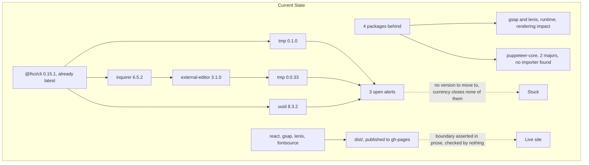
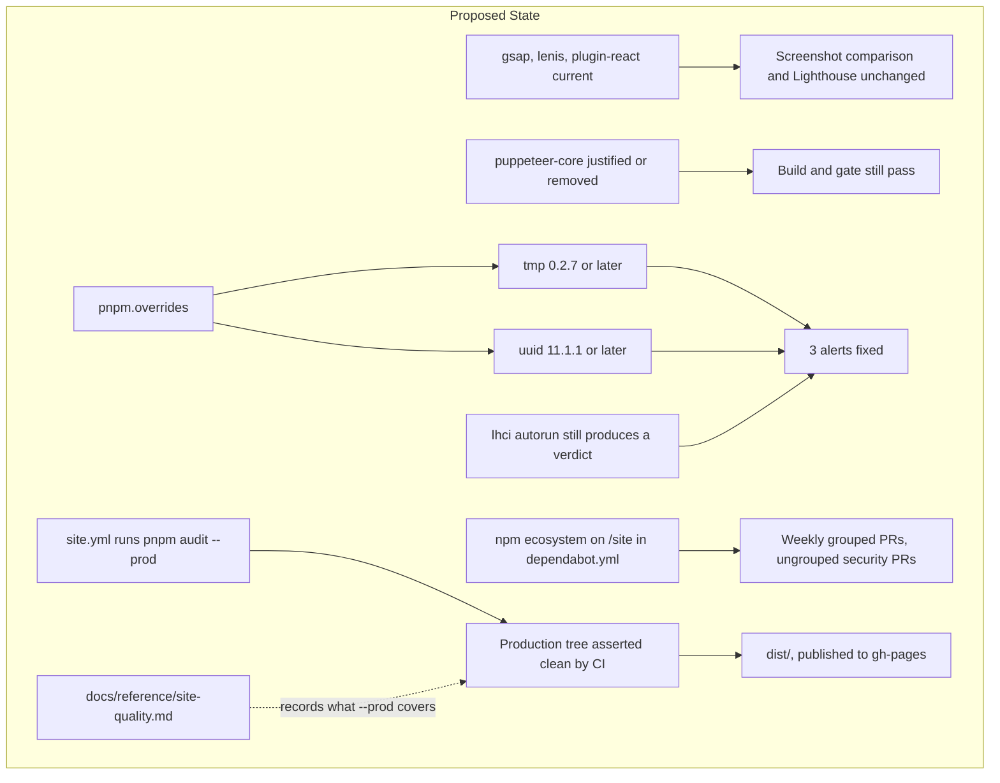
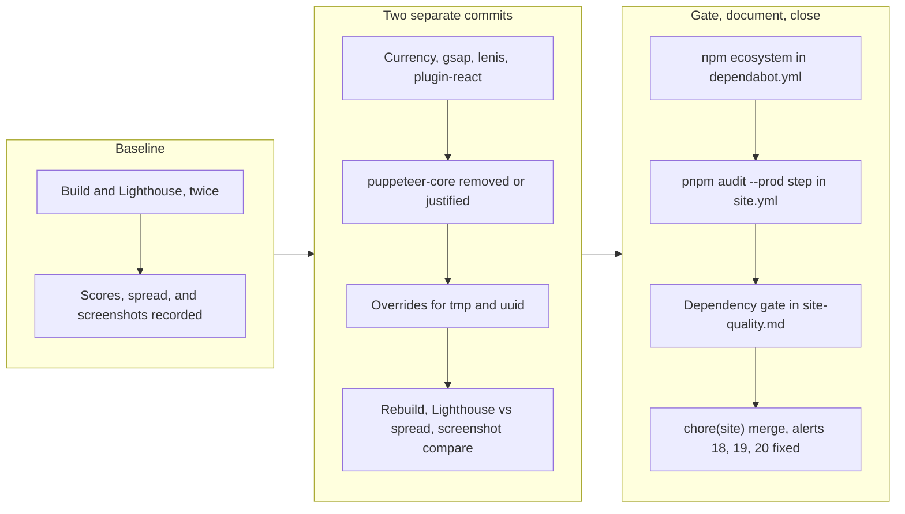

# Site Dependency Currency and Vulnerability Remediation

## Change Summary

The site's npm tree is close to current: four packages have newer releases,
two of them runtime dependencies that affect rendering and two of them
build-time. Three Dependabot alerts are open against `site/pnpm-lock.yaml`,
and none of them is closed by bringing packages current, because all three
resolve to transitive dependencies of `@lhci/cli`, which is already at its
latest published version.

This CR does both halves: it brings the four outdated packages current, and it
closes the three alerts with `pnpm` overrides, which is the only mechanism
available when upstream has no fix to offer. It adds the `npm` ecosystem to
the `.github/dependabot.yml` that CR-0071 creates, and it adds a
production-tree audit to `site.yml` so the claim this CR rests on, that the
alerts do not reach visitors, is checked by CI rather than asserted in a
document.

## Motivation and Background

CR-0070 adopted the v3 site, pre-rendered it, and put a Lighthouse budget in
front of both the pull request and the deploy. It also, unavoidably, brought
in `@lhci/cli`, a large build-time CLI whose transitive tree has since
accumulated three advisories. Those alerts landed on 2026-07-31, the day the
site work merged, which is the expected consequence of adding a toolchain
rather than a sign of a bad choice.

Two things make this worth a CR rather than a lockfile edit.

The first is that **the usual fix is unavailable**. `@lhci/cli` is at
`0.15.1`, which is both the installed version and the newest published one.
There is no version to move to, so the choice is between reaching into a
transitive tree upstream is not maintaining, and accepting the alerts. Both
are defensible and both need justifying.

The second is that **the site's currency story is genuinely different from the
server's**. CR-0071 addresses eleven direct Go dependencies behind, some by
twelve minor releases. The site has four, and two of those are animation
libraries used across ten components, where `site/AGENTS.md` requires
screenshot verification for any change claiming to leave rendering untouched.
The site's problem is not drift; it is that its small tree contains one
package that cannot be fixed by moving forward.

## Change Drivers

* **Three open alerts on a public repository.** Severity is not the driver,
  visibility is. A security tab does not distinguish "high severity,
  unreachable, build-time only" from "high severity, exploitable", and neither
  does a prospective user.
* **No upstream remedy exists.** `@lhci/cli@0.15.1` is current, so waiting is
  not a strategy and neither is a routine bump.
* **Four packages behind, including a major.** `puppeteer-core` is two majors
  back and pinned exactly. `gsap` and `lenis` are runtime and touch rendering.
* **The dev/prod boundary is currently only an assertion.** Nothing in CI
  checks that the shipped tree is clean, and this CR's central claim depends
  on it being so.
* **CR-0071 creates the automation this needs.** The `npm` ecosystem entry
  belongs in the same `.github/dependabot.yml`, so the two are sequenced.

## Current State

### Package currency

From `pnpm outdated` in `site/` on 2026-07-31:

| Package | Current | Latest | Kind | Rendering impact |
|---------|---------|--------|------|------------------|
| `gsap` | 3.14.2 | 3.15.0 | runtime | Yes, used across 10 components |
| `lenis` | 1.3.21 | 1.3.25 | runtime | Yes, smooth-scroll behaviour |
| `puppeteer-core` | 24.43.1 | 25.4.0 | dev, exact pin | None found, see below |
| `@vitejs/plugin-react` | 6.0.4 | 6.0.5 | dev | Build only |

Everything else is current, including `react` and `react-dom` at 19.2.x,
`tailwindcss` and `@tailwindcss/vite` at 4.3.3, `vite` at 8.1.5, `typescript`
at 7.0.2, `marked` at 18.0.7, and `@lhci/cli` at 0.15.1.

`gsap` and `lenis` are imported by `src/App.tsx`, `src/main.tsx`,
`src/safety.sweep.ts`, and at least six section components including
`HeroSection`, `BrandRevealSection`, and `CapabilitiesSection`. Any change to
them is a rendering change until a screenshot says otherwise.

`puppeteer-core` is the odd entry. It is pinned exactly, with no caret, and a
search of `site/build/`, `site/src/`, `scripts/`, `.github/workflows/`, and
`site/lighthouserc.json` finds no importer or configuration referencing it.
It appears to exist so that Lighthouse or a screenshot workflow has a known
Chrome, but nothing in the tree states that. A dependency with no discoverable
consumer should be justified or removed, not bumped two majors on faith.

### Open alerts against `site/pnpm-lock.yaml`

All three were filed at `2026-07-31T09:45:37Z`:

| # | Sev | Package | Advisory | Vulnerable range | Patched | Installed |
|---|-----|---------|----------|------------------|---------|-----------|
| 20 | high | `tmp` | GHSA-ph9p-34f9-6g65 | `< 0.2.6` | 0.2.6 | 0.0.33 and 0.1.0 |
| 19 | medium | `uuid` | GHSA-w5hq-g745-h8pq | `< 11.1.1`; `>=12.0.0 <12.0.1`; `>=13.0.0 <13.0.1` | 11.1.1 | 8.3.2 |
| 18 | low | `tmp` | GHSA-52f5-9888-hmc6 | `<= 0.2.3` | 0.2.4 | 0.0.33 and 0.1.0 |

Alert #19 deserves a second look before it gets waved away. GitHub's listing
surfaces the `>= 12.0.0, < 12.0.1` range first, which does not match the
installed `uuid@8.3.2` and reads like a false positive. The advisory has three
ranges and the third is `< 11.1.1`. The installed version is affected.

### Why currency does not close these

Every path terminates at `@lhci/cli`, which is already current:

```
tmp@0.0.33
└─┬ external-editor@3.1.0
  └─┬ inquirer@6.5.2
    └─┬ @lhci/cli@0.15.1
      └── outlook-local-mcp-v3@0.0.0 (devDependencies)

tmp@0.1.0
└─┬ @lhci/cli@0.15.1
  └── outlook-local-mcp-v3@0.0.0 (devDependencies)

uuid@8.3.2
└─┬ @lhci/cli@0.15.1
  └── outlook-local-mcp-v3@0.0.0 (devDependencies)
```

This is the structural difference from CR-0071. There, bringing dependencies
current closes every alert as a consequence. Here, bringing everything current
closes none of them, because the tree is already current and the vulnerable
versions are what the current version pins.

### Where the vulnerable code runs

* `tmp` is required at `@lhci/cli/src/open/open.js:9`, which implements
  `lhci open`. The build and both workflows invoke `lhci autorun`, never
  `lhci open`. The second copy, `tmp@0.0.33`, arrives through `inquirer` for
  interactive prompts a non-TTY CI run does not reach.
* `uuid` is used as `uuid.v4` via a CommonJS `require('uuid')`.

Neither advisory describes a condition CI reaches: GHSA-ph9p-34f9-6g65 needs
attacker-controlled `prefix` or `postfix` values, GHSA-52f5-9888-hmc6 needs a
symlinked `dir`, and GHSA-w5hq-g745-h8pq needs a caller-supplied `buf`. That
is context for the risk assessment, not a reason to skip the fix.

Two reproducible facts establish that none of this reaches the published site:

* `pnpm audit --prod --audit-level=moderate` in `site/` reports **"No known
  vulnerabilities found"** as of 2026-07-31.
* The site is a static pre-render. `pnpm --dir site run build` runs `tsc -b`,
  two `vite build` invocations, and `build/prerender.mjs`. `@lhci/cli` runs
  after the build, against its output, and contributes nothing to it.

### Automation and gating state

* `.github/dependabot.yml` has never existed. CR-0071 creates it with the
  `gomod` and `github-actions` ecosystems; the `npm` entry for `/site` is this
  CR's.
* `site.yml` installs with `--frozen-lockfile`, builds, runs tests if present,
  runs the Lighthouse gate, and uploads reports. It performs no dependency
  audit.
* `deploy-site.yml` runs the same gate before publishing to `gh-pages`.
* `site/package.json` has no `pnpm.overrides` block.

### Current State Diagram



## Proposed Change

### 1. Bring the four outdated packages current

* `@vitejs/plugin-react` 6.0.4 to 6.0.5. Patch, build-only, no verification
  beyond the build succeeding.
* `gsap` 3.14.2 to 3.15.0 and `lenis` 1.3.21 to 1.3.25. Runtime and
  rendering-affecting, so both require the screenshot comparison
  `site/AGENTS.md` mandates, and both must clear the Lighthouse budget
  unchanged.
* `puppeteer-core` is **not** bumped. It has no discoverable consumer, and
  moving an unexplained exact pin across two majors is a change with unknown
  effect and no observable benefit. Instead this CR requires the pin to be
  either justified with a comment naming its consumer, or removed. Whichever
  is chosen, the build and the Lighthouse gate must still pass, which is what
  tells us which was correct.

### 2. Override `tmp` and `uuid`

Add a `pnpm.overrides` block to `site/package.json`:

* `tmp` to `^0.2.7`, above the `< 0.2.6` floor of the high-severity advisory
  and above the `<= 0.2.3` floor of the low-severity one, so one override
  closes both alerts.
* `uuid` to `^11.1.1`, the lowest patched range in the advisory. Deliberately
  not `^12` or `^13`: those majors have their own entries in the same advisory
  (`< 12.0.1`, `< 13.0.1`), so a higher major buys a larger API jump and a
  narrower safety margin at once.

Each override records the condition under which it can be removed, because an
override with no recorded reason is indistinguishable from cargo cult in six
months.

### 3. Verify the overrides do not break the gate

The overrides force versions upstream never tested against: `tmp` across two
minor series, `uuid` across three majors. Whether `lhci autorun` still works
is a question with an experiment attached, so the experiment is required, not
assumed.

The check that matters is not "does it install" but "does the gate still
produce a verdict". A Lighthouse run that silently produces no report is a
failure mode CR-0070 already hit once, which is why `site.yml` sets
`if-no-files-found: error` on its artifact upload. That guard stays and is
part of the evidence here.

### 4. Add the `npm` ecosystem to `.github/dependabot.yml`

Extend the file CR-0071 creates with an `npm` entry for `/site`, weekly,
version updates grouped and security updates ungrouped, matching the
convention set for `gomod`.

### 5. Gate the production tree in `site.yml`

Add a step running `pnpm --dir site audit --prod --audit-level=moderate`
before the build. This asserts the boundary the whole CR rests on: findings in
the build-time tree are accepted as non-shipping, findings in the production
tree are not.

The gate is deliberately `--prod`. Auditing the full tree would fail today for
reasons no visitor is affected by, and a gate that fails for reasons nobody
will act on acquires `continue-on-error` within a month. The narrower gate is
one this project can keep green, which is the only kind worth adding.

### 6. Record the boundary in `docs/reference/site-quality.md`

That file already records what the site's gates measure and which
optimisations move nothing. Add a section covering the dependency gate: what
`--prod` includes and excludes, why the build-time tree is left to Dependabot,
and the standing rule that a package moving from `devDependencies` to
`dependencies` brings its advisories into the gated set.

### Proposed State Diagram



## Requirements

### Functional Requirements

1. `gsap`, `lenis`, and `@vitejs/plugin-react` **MUST** be raised to the
   versions named in the currency table or later.
2. `puppeteer-core` **MUST** be either removed from `site/package.json`, or
   retained with a comment in the pull request naming the consumer that
   requires it and the reason its version is pinned exactly.
3. `site/package.json` **MUST** declare a `pnpm.overrides` entry resolving
   `tmp` to 0.2.6 or later.
4. `site/package.json` **MUST** declare a `pnpm.overrides` entry resolving
   `uuid` to a patched version within the `11.x` major series.
5. `site/pnpm-lock.yaml` **MUST** contain no `tmp` version below 0.2.6 and no
   `uuid` version in any range the advisory marks vulnerable.
6. `pnpm --dir site install --frozen-lockfile` **MUST** succeed against the
   committed lockfile.
7. `pnpm --dir site run build` **MUST** succeed, including `tsc -b` and the
   pre-render step.
8. `pnpm --dir site run lighthouse` **MUST** complete and **MUST** pass every
   assertion in `site/lighthouserc.json`, with those thresholds unmodified.
9. `.github/dependabot.yml` **MUST** declare the `npm` ecosystem on `/site`,
   with version updates grouped and security updates ungrouped.
10. `.github/workflows/site.yml` **MUST** run
    `pnpm --dir site audit --prod --audit-level=moderate` and **MUST** fail the
    job when that command reports a finding.
11. The production-tree audit step **MUST** run before the build step, so a
    compromised runtime dependency fails the job before it is executed.
12. `docs/reference/site-quality.md` **MUST** state what the `--prod` audit
    covers, what it excludes, and why the build-time tree is audited by
    Dependabot rather than by CI.
13. `docs/reference/site-quality.md` **MUST** state that a package moved from
    `devDependencies` to `dependencies` enters the gated set, so the exclusion
    cannot silently outlive its justification.
14. Dependabot alerts 18, 19, and 20 **MUST** be in state `fixed` after this
    CR merges.
15. The pull request **MUST** record, for each override, the condition under
    which it can be removed.
16. This CR's commits **MUST** carry `chore(site):` subjects, so that if they
    are ever released independently `release-please` produces no release for a
    change that does not affect the distributed binary. This CR shares a branch
    and pull request with CR-0071, whose FR-17 sets the squash-merge title to
    `fix(deps):`; that title governs the merged commit, because the combined
    change does affect the distributed binary via CR-0071's Go bumps.

### Non-Functional Requirements

1. The published site **MUST** render identically apart from build provenance
   fields. A screenshot comparison per `site/AGENTS.md` **MUST** confirm it,
   because `gsap` and `lenis` are rendering-affecting and FR-1 moves both.
2. Lighthouse scores **MUST NOT** regress beyond the run-to-run spread
   measured at baseline, against unmodified thresholds.
3. No commit belonging to this CR **MUST** change a Go source file, `go.mod`,
   `go.sum`, or an embedded documentation file. The branch as a whole does
   change those, because CR-0071 shares it; conformance is therefore assessed
   against this CR's commits, not against the branch diff.
4. The runtime bumps and the overrides **MUST** be separate commits, so a
   rendering or gate regression can be bisected to the one that caused it.

## Affected Components

* `site/package.json`: three version bumps, one removal or justification, and
  a new `pnpm.overrides` block.
* `site/pnpm-lock.yaml`: regenerated.
* `.github/dependabot.yml`: extended with the `npm` ecosystem (file created by
  CR-0071).
* `.github/workflows/site.yml`: new audit step.
* `docs/reference/site-quality.md`: new section on the dependency gate.
* GitHub repository state: alert dispositions for #18, #19, #20.

Not affected: everything under `site/src/`, `site/build/`, and
`site/lighthouserc.json`. If a bump or override forces a change to any of
those, it is doing more than intended and Risk 1 or Risk 2 applies.

## Scope Boundaries

### In Scope

* Bringing `gsap`, `lenis`, and `@vitejs/plugin-react` current.
* Resolving the `puppeteer-core` pin, by removal or by justification.
* `pnpm` overrides for `tmp` and `uuid`, and the regenerated lockfile.
* Verifying `lhci autorun` still produces a Lighthouse verdict.
* The `npm` ecosystem entry in `.github/dependabot.yml`.
* A production-tree audit step in `site.yml`.
* The dependency-gate section in `docs/reference/site-quality.md`.
* Driving alerts 18, 19, and 20 to `fixed`.

### Out of Scope ("Here, But Not Further")

* **The Go module.** CR-0071 owns it and creates `.github/dependabot.yml`.
* **Replacing `@lhci/cli` with the Lighthouse CI GitHub Action.** A real
  alternative that removes the vulnerable tree entirely; considered below and
  rejected for this change because it moves the thresholds out of the
  committed `lighthouserc.json` path CR-0070 deliberately chose.
* **Adopting anything new in `gsap` 3.15.** The bump moves the version; it
  does not adopt what the version offers.
* **Auditing the full build-time tree in CI.** Deliberately excluded; the
  reasoning is under Proposed Change 5.
* **Adding an SBOM for the site.** The Go binary has one via `make sbom`.
  Doing the same for the site is reasonable and is a separate CR.
* **Changing the Lighthouse thresholds.** They are CR-0070's, and this change
  must pass them unmodified. Moving a threshold to accommodate a dependency
  change would destroy the evidence that the change was safe.
* **Automatic merging of Dependabot pull requests.** Same position as CR-0071.

## Alternative Approaches Considered

* **Dismiss all three alerts as build-time only.** Rejected on process grounds
  rather than impact grounds. The impact assessment is almost certainly right,
  `pnpm audit --prod` is clean and the vulnerable call sites are not on the
  `autorun` path. But a dismissal is a claim with no expiry and no check, and
  it must be re-argued for every future `@lhci/cli` advisory. The overrides
  cost an hour and remove the class.
* **Drop `@lhci/cli` for `treosh/lighthouse-ci-action`.** Removes all three
  packages from the lockfile outright, which is strictly better on alert
  count. Rejected because CR-0070 chose to keep thresholds in a committed
  `site/lighthouserc.json` so a threshold change shows up as a reviewable diff
  (FR-38), and because `site.yml` and `deploy-site.yml` deliberately run the
  identical command so a gate cannot pass on the pull request and fail on the
  deploy. Moving to an action puts both properties at risk to fix three
  non-shipping advisories. Worth revisiting if `@lhci/cli` keeps accruing
  them.
* **Override `uuid` to `^13`.** Rejected. `13.0.0` is itself in the advisory's
  vulnerable set, so it offers no more headroom than `^11.1.1` while crossing
  two additional majors for a package used only as `uuid.v4`.
* **Bump `puppeteer-core` to 25.4.0 along with everything else.** Rejected.
  Bumping a dependency whose consumer cannot be found is how an unexplained
  pin becomes an unexplained pin two majors later. Finding out why it is there
  is the cheaper and more durable move.
* **Remove the Lighthouse gate.** Rejected without much deliberation. The gate
  is why CR-0070's performance work stays true; deleting a working quality
  gate to close three build-time advisories is a trade nobody should take.

## Impact Assessment

### User Impact

For users of the MCP server, none: no Go code, no `go.mod`, and no embedded
documentation changes, which is why FR-16 requires a `chore(site):` merge that
produces no release.

For site visitors, the intended impact is none. `gsap` and `lenis` are patch
and minor bumps of animation libraries, and NFR-1 requires a screenshot
comparison to confirm that rather than assume it. The alerts themselves reach
no visitor either way.

### Technical Impact

* **`gsap` 3.14.2 to 3.15.0** is a minor of a library driving animation in ten
  components. Minor for `gsap` historically means additive, but "historically
  additive" is a prior, not evidence, and the screenshot is the evidence.
* **`lenis` 1.3.21 to 1.3.25** is four patches of the smooth-scroll layer.
  Interacts with the reduced-motion handling CR-0070 established in AC-23.
* **`tmp` 0.0.33 and 0.1.0 to 0.2.7** crosses the `0.1` to `0.2` boundary,
  where `tmp` changed cleanup and callback handling. The affected call site is
  `lhci open`, which nothing here invokes, plus `inquirer` prompts a non-TTY
  run does not reach. Low exposure, but that is a prediction and FR-8 tests
  it.
* **`uuid` 8.3.2 to 11.x** crosses three majors. `@lhci/cli` uses
  `require('uuid')` and calls `uuid.v4`; `uuid@11` still exposes a CommonJS
  entry and still exports `v4`, and CI runs Node 22, above its floor. This is
  the override most likely to break, and it breaks loudly at require time.
* **Lockfile churn**: forcing transitive versions re-deduplicates the tree, so
  the diff will be far larger than the change.
* **New CI step**: `pnpm audit --prod` adds a few seconds and one advisory
  database call per `site.yml` run.
* **Long-term**: overrides are a maintenance liability, which FR-15 addresses
  by requiring a recorded removal condition.

### Business Impact

Small and one-directional. Three fewer open alerts on a public repository, a
site toolchain that is current, and a gate that keeps the shipped tree honest.
Engineering cost is half a day; ongoing cost is one grouped Dependabot pull
request a week.

## Implementation Approach

### Phase 1: Baseline the gate

Run `pnpm --dir site install --frozen-lockfile`, `run build`, and
`run lighthouse` on the unchanged tree, **twice**, and record the scores from
both. Two runs, because the Phase 3 comparison is only meaningful if the noise
floor is known: a score that moves by more than the run-to-run spread is a
signal, one that moves by less is not. Capture baseline screenshots in the
same phase.

### Phase 2: Currency

Bump `gsap`, `lenis`, and `@vitejs/plugin-react`. Resolve `puppeteer-core` by
removal or justification. Rebuild, re-run Lighthouse, compare screenshots.
Commit as its own change per NFR-4.

### Phase 3: Overrides

Add the `pnpm.overrides` block, reinstall, and confirm the lockfile satisfies
FR-5 by grepping the resolved `tmp` and `uuid` entries. Rebuild and re-run
Lighthouse, comparing against the Phase 1 baseline using the spread measured
there. Confirm `pnpm audit --prod --audit-level=moderate` still reports
nothing. Commit separately.

### Phase 4: Automation and gating

Add the `npm` entry to `.github/dependabot.yml` and the audit step to
`site.yml`, positioned before the build per FR-11.

### Phase 5: Document

Write the dependency-gate section in `docs/reference/site-quality.md`.

### Phase 6: Close the loop

Squash-merge with a `chore(site):` title. Confirm alerts 18, 19, and 20 are
`fixed`.

### Implementation Flow



## Test Strategy

This is a dependency and CI-configuration change with no application source
change, so verification is the existing gates continuing to hold plus one new
gate. The site has no unit-test suite: `site.yml` runs
`pnpm run --if-present test` and no `test` script exists in
`site/package.json`. Adding one is out of scope and would not test anything
this CR changes.

### Tests to Add

| Test File | Test Name | Description | Inputs | Expected Output |
|-----------|-----------|-------------|--------|-----------------|
| `.github/workflows/site.yml` | "Audit production dependencies" step | Asserts the shipped tree carries no advisory at moderate or above, which is the claim this CR rests on | `site/package.json`, `site/pnpm-lock.yaml`, advisory database | Exits 0 today; fails the job if a runtime dependency becomes vulnerable |
| `site/lighthouserc.json` (existing config, unchanged) | Lighthouse assertions under overrides and bumps | Confirms `lhci autorun` still produces a verdict with `tmp` and `uuid` forced and `gsap`/`lenis` moved | Built `dist/` | All assertions pass, `.lighthouseci` artifacts uploaded |
| Manual, recorded in the pull request | Screenshot comparison | Confirms the two rendering-affecting runtime bumps changed nothing visible, per `site/AGENTS.md` | Baseline and post-change builds | Renders identically |

### Tests to Modify

| Test File | Test Name | Current Behavior | New Behavior | Reason for Change |
|-----------|-----------|------------------|--------------|-------------------|
| `.github/workflows/site.yml` | "Install site dependencies" | Installs with `--frozen-lockfile`, then builds | Unchanged in behaviour, but now followed by the production audit before the build | FR-11 requires the audit to run before any dependency code is executed |

### Tests to Remove

| Test File | Test Name | Reason for Removal |
|-----------|-----------|-------------------|
| n/a | n/a | Not applicable. The Lighthouse gate and the frozen-lockfile install both remain load-bearing. |

## Acceptance Criteria

### AC-1: The site tree is current

```gherkin
Given four packages had newer releases available
When a maintainer runs "pnpm outdated" in "site/" on the resulting tree
Then gsap, lenis, and @vitejs/plugin-react report no available update
  And puppeteer-core is either absent from site/package.json or accompanied by a stated justification
```

### AC-2: The lockfile contains no vulnerable version

```gherkin
Given the pnpm overrides are applied and the lockfile regenerated
When a reader inspects "site/pnpm-lock.yaml"
Then no "tmp" entry resolves below 0.2.6
  And no "uuid" entry resolves to a version the advisory marks vulnerable
  And the lockfile installs cleanly with "--frozen-lockfile"
```

### AC-3: The Lighthouse gate still produces a verdict

```gherkin
Given tmp and uuid are forced to versions upstream never tested against
When CI runs "pnpm --dir site run lighthouse"
Then the command completes without a module resolution error
  And every assertion in "site/lighthouserc.json" passes against unmodified thresholds
  And the ".lighthouseci" artifact upload finds files to upload
```

### AC-4: Scores do not regress beyond the measured noise floor

```gherkin
Given baseline Lighthouse scores were recorded from two runs on the parent commit
When the same gate runs on the branch implementing this CR
Then each category score is within the run-to-run spread measured at baseline, or higher
  And both the baseline and its spread appear in the pull request
```

### AC-5: The rendering is unchanged despite two runtime bumps

```gherkin
Given gsap and lenis are imported by ten components and drive animation
When a maintainer compares screenshots of the built site before and after, per site/AGENTS.md
Then the rendering is identical
  And the reduced-motion behaviour CR-0070 established still holds
  And the only differences in the built output are build provenance fields
```

### AC-6: The production tree is gated by CI

```gherkin
Given "site.yml" previously performed no dependency audit
When the workflow runs on a pull request
Then it runs "pnpm --dir site audit --prod --audit-level=moderate"
  And that step runs before the build step
  And the job fails if the command reports any finding
```

### AC-7: The gate catches a runtime dependency becoming vulnerable

```gherkin
Given the production audit gate exists
When a package with a known moderate-or-higher advisory is added to "dependencies" in site/package.json
Then the "site" workflow fails at the audit step
  And it fails before the build step runs
```

### AC-8: Currency and overrides are separately bisectable

```gherkin
Given a regression could come from a runtime bump or from a forced transitive version
When a reviewer inspects the branch history
Then the currency bumps and the pnpm overrides are separate commits
  And each passes the site build and the Lighthouse gate on its own
```

### AC-9: Dependabot covers the site

```gherkin
Given ".github/dependabot.yml" is created by CR-0071 with the gomod and github-actions ecosystems
When a reader inspects the file after this CR merges
Then it additionally declares the "npm" ecosystem on "/site"
  And version updates are grouped into a single pull request
  And security updates are not grouped
```

### AC-10: The site alerts reach a terminal state

```gherkin
Given Dependabot alerts 18, 19, and 20 are open against "site/pnpm-lock.yaml"
When the pull request implementing this CR is merged to main
Then all three alerts are in state "fixed"
  And none of the three is closed by dismissal
```

### AC-11: The dev/prod boundary is documented and bounded

```gherkin
Given CI audits only the production dependency tree
When a contributor reads the dependency-gate section of "docs/reference/site-quality.md"
Then it states what "--prod" covers and what it excludes
  And it explains why the build-time tree is left to Dependabot
  And it states that moving a package into "dependencies" brings it into the gated set
```

### AC-12: This CR's commits touch nothing outside the site

```gherkin
Given this CR shares a branch and pull request with CR-0071
When a reviewer inspects the commits belonging to this CR alone
Then each carries a "chore(site):" subject
  And none modifies a file under "internal/", "cmd/", "go.mod", "go.sum", or "docs/" other than docs/reference/site-quality.md
  And the squash-merge title is CR-0071's "fix(deps):", which governs the release
```

## Quality Standards Compliance

### Build & Compilation

- [ ] `pnpm --dir site install --frozen-lockfile` succeeds
- [ ] `pnpm --dir site run build` succeeds, including `tsc -b` and the
      pre-render step
- [ ] `make build` on the Go side is unaffected and still succeeds

### Linting & Code Style

- [ ] `tsc -b` reports no type errors (it runs inside the build script)
- [ ] `site/package.json` remains valid JSON with the overrides block placed
      per `pnpm` conventions

### Test Execution

- [ ] `pnpm --dir site run lighthouse` passes every committed assertion
- [ ] `pnpm --dir site audit --prod --audit-level=moderate` reports nothing
- [ ] Screenshot comparison recorded and clean
- [ ] `make test` on the Go side still passes, unaffected

### Documentation

- [ ] `docs/reference/site-quality.md` gains the dependency-gate section
- [ ] No embedded documentation file changes, so `docs/embed.go` and its
      allowlist test are untouched
- [ ] The `site/AGENTS.md` screenshot requirement is satisfied and the
      evidence attached to the pull request

### Code Review

- [ ] Changes submitted via pull request
- [ ] PR title is `chore(site): ...` per FR-16
- [ ] Code review completed and approved
- [ ] Squash-merged to maintain linear history

### Verification Commands

```bash
# Baseline, twice, before any change
pnpm --dir site install --frozen-lockfile
pnpm --dir site run build && pnpm --dir site run lighthouse

# Currency, before and after
pnpm --dir site outdated

# Where an unexplained pin comes from
grep -rn "puppeteer" site/build site/src scripts .github/workflows site/lighthouserc.json

# After the overrides
pnpm --dir site install
grep -n '  tmp@\|  uuid@' site/pnpm-lock.yaml

# The claim this CR rests on
pnpm --dir site audit --prod --audit-level=moderate

# The gate still produces a verdict
pnpm --dir site run build && pnpm --dir site run lighthouse

# Alert dispositions after merge
gh api repos/desek/outlook-local-mcp/dependabot/alerts --paginate \
  -q '.[] | select(.state=="open" and .dependency.manifest_path=="site/pnpm-lock.yaml") | .number'
```

## Risks and Mitigation

### Risk 1: A runtime bump changes rendering

**Likelihood:** low
**Impact:** medium
**Mitigation:** `gsap` and `lenis` are imported by ten components and drive
the animation and smooth-scroll behaviour the site is built around. A patch or
minor of an animation library is *usually* invisible, and `site/AGENTS.md`
exists precisely because "usually" is not a standard this project accepts.
NFR-1 and AC-5 require a screenshot comparison, and NFR-4 puts the bumps in
their own commit so a visual regression bisects to them rather than to the
overrides.

### Risk 2: An override breaks `lhci autorun`

**Likelihood:** medium
**Impact:** medium
**Mitigation:** `uuid` crosses three majors and `tmp` crosses a minor series
that changed cleanup semantics, against a package upstream never tested them
with. Both failures are loud: a missing export or changed callback signature
throws at require or call time, not silently. FR-8 and AC-3 make a completed
Lighthouse run with passing assertions a merge requirement. If an override
cannot be made to work, the fallback is the rejected alternative, moving the
gate to `treosh/lighthouse-ci-action`, which would be its own CR rather than a
silent substitution inside this one.

### Risk 3: The overrides become permanent and forgotten

**Likelihood:** high
**Impact:** low
**Mitigation:** this is the default outcome for override blocks, so it is
treated as expected rather than hypothetical. FR-15 requires a recorded
removal condition per override, and the `npm` Dependabot entry means a future
`@lhci/cli` release arrives as a pull request where that condition can
actually be checked.

### Risk 4: `puppeteer-core` turns out to be load-bearing

**Likelihood:** low
**Impact:** medium
**Mitigation:** no importer was found across `site/build/`, `site/src/`,
`scripts/`, `.github/workflows/`, and `site/lighthouserc.json`, but "not found
by grep" is weaker evidence than "confirmed absent". FR-2 accepts either
outcome, and removal is validated by the build and the Lighthouse gate still
passing rather than by the search alone. If either fails, the pin is
load-bearing, it gets the comment FR-2 also permits, and the search that
missed it is worth recording.

### Risk 5: The production audit gate becomes noisy and gets disabled

**Likelihood:** low
**Impact:** medium
**Mitigation:** the `--prod` scope exists to prevent this. The production tree
is seven packages, changes rarely, and is clean today. A gate that fires once
a year on something that genuinely ships is one people act on; the full-tree
version would fire on `@lhci/cli` transitives nobody will fix and would be
neutered within a month. If it does become noisy, the response is to narrow
the tree or raise the threshold with the reason recorded in
`docs/reference/site-quality.md`, never to add `continue-on-error`.

### Risk 6: The lockfile diff is too large to review

**Likelihood:** high
**Impact:** low
**Mitigation:** forcing two transitive versions causes `pnpm` to
re-deduplicate, so the diff will be far larger than the change. Review is
anchored on the grep in AC-2 and on the gates passing, not on reading the
lockfile. The pull request states this up front so a reviewer does not spend
an hour on mechanical churn.

### Risk 7: The dev/prod boundary silently stops holding

**Likelihood:** low
**Impact:** high
**Mitigation:** the entire impact assessment depends on the vulnerable
packages being confined to `devDependencies`, and nothing in `package.json`
enforces that; moving one line makes the claim false. The `--prod` audit gate
(FR-10) is the enforcement, and FR-13 requires that consequence to be written
where the next person will look.

### Risk 8: Lighthouse scores shift and are misattributed

**Likelihood:** medium
**Impact:** low
**Mitigation:** Lighthouse scores vary run to run, and this change touches
both the animation libraries and the measurement toolchain, which is exactly
the situation where variance gets misread as a result. Phase 1 requires two
baseline runs so the spread is known, and AC-4 judges post-change scores
against that spread rather than against a single number. A shift inside the
spread is "not measured", neither "unchanged" nor "regressed".

### Risk 9: Alert #19 is dismissed as a false positive

**Likelihood:** medium
**Impact:** medium
**Mitigation:** this nearly happened during analysis. The listing shows
`>= 12.0.0, < 12.0.1` against an installed `uuid@8.3.2`, which reads as an
obvious mismatch; the advisory's third range, `< 11.1.1`, is what applies. The
Current State table records all three ranges, and CR-0071's
`docs/reference/security.md` carries the general rule: check every range, not
the first one.

## Dependencies

* **CR-0071's commits must land first on the shared branch.** The two CRs share
  one branch and one pull request. CR-0071 creates `.github/dependabot.yml`;
  this CR adds the `npm` ecosystem to it, so implementing this CR first would
  reverse which CR creates the file and break both CRs' descriptions of it.
* CR-0070, already merged, which introduced `@lhci/cli`, `site.yml`, the
  committed Lighthouse thresholds, and `docs/reference/site-quality.md`.
* No external dependency. `tmp@0.2.7`, `uuid@11.1.1`, `gsap@3.15.0`, and
  `lenis@1.3.25` are all published.

## Estimated Effort

* Phase 1, baseline with two runs and screenshots: 1 hour
* Phase 2, currency bumps and the `puppeteer-core` question: 1 hour
* Phase 3, overrides and verification: 1.5 hours, more if Risk 2 materialises
* Phase 4, `dependabot.yml` entry and the `site.yml` audit step: 0.5 hours
* Phase 5, documentation: 1 hour
* Phase 6, merge and alert dispositions: 0.25 hours

**Total: 5 to 6 hours**, with the Risk 2 fallback adding roughly a day if the
overrides prove unworkable.

## Decision Outcome

Chosen approach: "bring the four outdated packages current, force patched
`tmp` and `uuid` through `pnpm` overrides, and gate the production tree in
CI", because the site's two problems are genuinely different and only one of
them is a currency problem.

Three of the four bumps are routine. The alerts are not: they sit under a
package that is already current, so no amount of moving forward reaches them,
and the override is the only mechanism left. That asymmetry is why this CR
reads differently from CR-0071, where currency closes every alert as a
consequence.

The part that will still be earning its keep in a year is the gate. The
overrides close three specific advisories; `pnpm audit --prod` converts "these
findings do not reach visitors" from a claim in a document into a condition CI
checks on every pull request. Its narrow scope is deliberate, and the
reasoning is recorded in `docs/reference/site-quality.md` so a future
contributor who wants to widen it knows what was traded.

## Related Items

* Related change request: CR-0071 (Go dependency currency), which creates
  `.github/dependabot.yml` and must merge first
* Related change request: CR-0070 (site v3 adoption), which introduced
  `@lhci/cli`, `site.yml`, and the committed Lighthouse thresholds
* Dependabot alerts: #18, #19, #20 on `desek/outlook-local-mcp`
* Advisories: GHSA-ph9p-34f9-6g65 (`tmp`, high), GHSA-52f5-9888-hmc6 (`tmp`,
  low), GHSA-w5hq-g745-h8pq (`uuid`, medium)
* Documentation: `site/AGENTS.md`, `docs/reference/site-quality.md`

## More Information

### Why a build-time finding is still worth fixing

The strongest argument against the override half of this CR is that it spends
hours on packages no visitor will ever execute. It is a good argument, and it
is answered by the fact that the build-time tree is not a sandbox. `lhci
autorun` runs in CI on a runner with the repository checked out, in a
workflow whose sibling publishes to `gh-pages`. A path traversal in a
temporary-file library is uninteresting on a laptop and considerably less
uninteresting in that context.

That is not a claim these three advisories are exploitable here; the call
sites are not reached and the preconditions are not met. It is the reason the
category is not automatically dismissible, and the reason the boundary this CR
draws is drawn at "does CI execute it" rather than at "does a visitor download
it".

### Why the audit gate is `--prod` and the Dependabot coverage is not

The two instruments are given deliberately different scopes, and the asymmetry
is the point.

`pnpm audit --prod` in CI is a *blocking* gate, so it must have a near-zero
false-alarm rate or it will be removed by whoever is trying to ship on a
Friday. Restricting it to the seven runtime dependencies gives it that
property.

Dependabot on the full tree is a *notification*, so lower precision is
acceptable: the cost of an over-report is a pull request someone closes, not a
blocked deploy. Giving the noisy instrument the wide scope and the blocking
instrument the narrow one is what keeps both alive.
