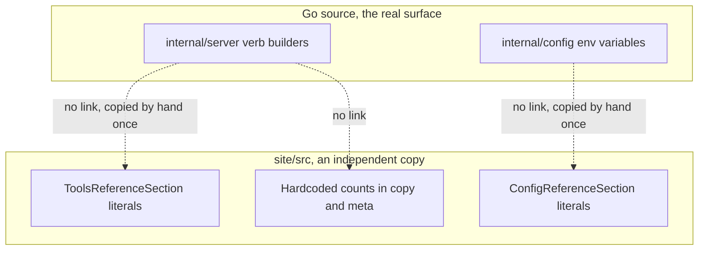
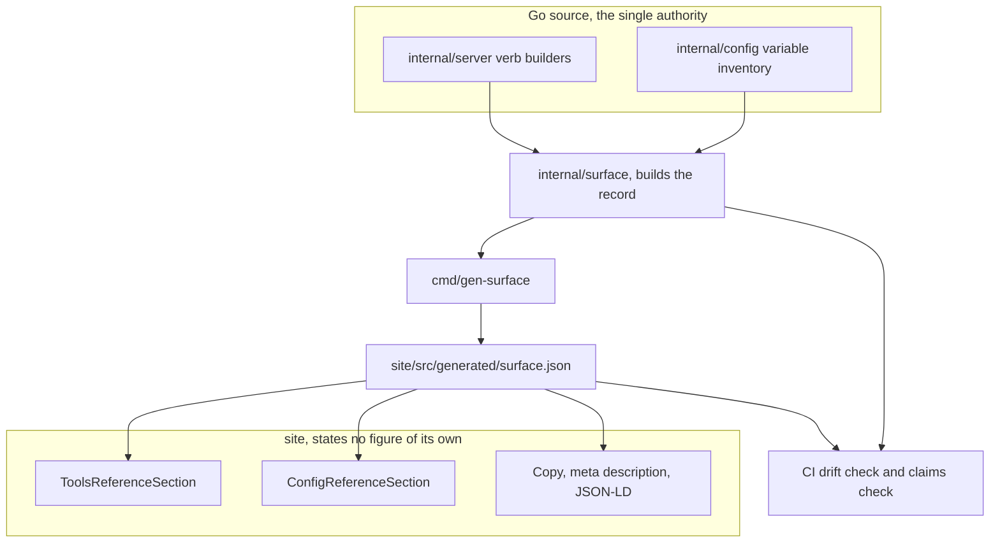
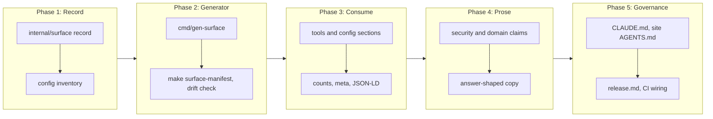

# Site Content Correction Driven by a Generated Surface Manifest

## Change Summary

The published website states facts about this server that are wrong. It advertises
"23 MCP tools", lists tool names that were removed in the aggregate-tool migration,
groups them under a domain that does not exist, and documents 15 of the 26
configuration variables. Every one of those figures is a literal that a person typed
into a React component, so every one of them decays the moment the server changes.

This change request corrects the content and removes the class of defect that
produced it. A generator reads the real verb registries and the real configuration
inventory, and emits a deterministic **surface manifest**. The site consumes the
manifest and states no figure of its own. A drift check in continuous integration
fails when the manifest no longer matches the code, so a change to the tool surface
cannot merge while the site still describes the old one.

## Motivation and Background

CR-0070 deliberately scoped itself to foundation rather than wording, and recorded
the wrong figures it knowingly left on the live site. That deferral was correct, and
the debt is now due. The foundation shipped, so the site is pre-rendered, carries
JSON-LD, and is retrievable by generative engines. The site is therefore better at
publishing whatever it says, including the parts that are false.

The failure is not that somebody wrote a wrong number. The failure is that the site
was allowed to hold an independent copy of a fact the code already owns. The project
solved this exact problem before: `llms.txt` is generated from the documentation
catalog by `cmd/gen-llms`, and `make docs-bundle` verifies the checked-in file still
matches. The verb registry is likewise the single source for per-verb reference
material under the documentation governance rules, and `system.help` renders it
rather than restating it. The site is the one surface that was never brought under
that rule, and it is the surface with the widest audience.

The project has already named this failure shape and adopted the remedy. The standing
instructions record, from the harness prompt-drift work, that what closes a class of
this kind is a check deriving its cases from the authoritative source rather than from
a list of known-bad ones, and that correcting the named instances produces a clean run
without closing the class. Correcting the site's numbers by hand is exactly the
instance fix that was tried three times there. This change applies the remedy the
project already committed to, to the one surface it has not yet reached.

A generative engine quotes a page claim verbatim and attributes it to the project. A
wrong tool count on the landing page is not a cosmetic defect. It is a wrong answer
handed to every model that retrieves the page, for as long as the page says it.

## Change Drivers

* GitHub issue #26 acceptance criterion 11 is unmet, and it is the only functional
  criterion still blocking that issue.
* CR-0070 recorded the wrong figures as accepted debt and named the follow-up.
* The stale content is not merely imprecise, it is contradicted by the code:
  `calendar_list_events` and the other flat tool names have not existed since the
  aggregate-tool migration, so a reader following the site cannot make a call work.
* Documentation governance already assigns per-tool reference to the verb registry.
  The site holds a second, divergent copy of that reference, which the governance
  rules exist to prevent.
* Every future change to the tool surface silently re-breaks the site today, because
  nothing couples them.

## Current State

The website's factual claims are hand-written literals in React components and in the
build-time SEO registry. They were accurate against a version of the server that no
longer exists.

Verified against the source commit of this document:

| Claim on the site | Where it lives | What the code says |
|---|---|---|
| "23 MCP tools" | `site/index.html:9`, `site/build/seo.pages.ts:55` | 4 aggregate tools, 42 registered verbs |
| "23 tools. 5 domains." | `site/src/components/CapabilitiesSection.tsx:267` and `:392` | 4 domains, not 5 |
| "23 tools registered." | `site/src/components/GettingStartedSection.tsx:310` | The startup line does not say this |
| 23 flat tool names, for example `calendar_list_events` | `site/src/components/ToolsReferenceSection.tsx:16` onward | Those names were removed; verbs are dispatched by an `operation` parameter |
| A "Diagnostics" category | `site/src/components/ToolsReferenceSection.tsx` | No such domain. The domains are `calendar`, `mail`, `account`, `system` |
| 15 configuration variables | `site/src/components/ConfigReferenceSection.tsx:11` onward | 26 `OUTLOOK_MCP_` variables in `internal/config` |
| "Enables 4 opt-in mail tools" | `site/src/components/ConfigReferenceSection.tsx` | `MAIL_ENABLED` gates 3 read verbs; `MAIL_MANAGE_ENABLED` gates 5 write verbs |

The true figures at the source commit, counted from the domain verb builders in
`internal/server` plus the `help` verb each domain registers: calendar 15, mail 13,
account 7, system 7, so 42 registered verbs across 4 domains. In the default
configuration 33 are exposed, because `MAIL_ENABLED` gates 3 verbs,
`MAIL_MANAGE_ENABLED` gates 5, and `complete_auth` appears only under the
authorization-code method.

These numbers are recorded here to size the work. They **MUST NOT** be transcribed
into the site. The point of this change is that no human transcribes them again.

Every figure above was re-counted at the source commit of this document, after the
work on unreachable documentation anchors landed. Nothing moved: the verb counts, the
configuration variable count, and every stale literal on the site are unchanged.

### The site already has a content-check harness, and it constrains this change

`.agents/scripts/site.content.check.mjs` runs on every pull request that touches
`site/**` or `docs/**`, driving headless Chrome with JavaScript disabled. It asserts
the properties the site exists to publish: a minimum quantity of text per page without
JavaScript, exactly one `<h1>` per page, that every `SeeDocs` anchor the Go registry
publishes resolves in the built documentation pages, that the six crawler files exist,
and that the generated Markdown keeps its diagrams.

Two consequences follow, and both are requirements below rather than notes.

First, **the per-page text floors are a guard this change will trip.** The floors were
measured on a specific build, and `index.html` is held at 11,853 characters of
JavaScript-free text. Removing 23 obsolete tool names and their descriptions removes
real text, so the floor will fail. That failure is correct behaviour from a check
designed to catch silent prose deletion, and the answer is to re-measure and re-baseline
the floor in the same change, with the new figure recorded, never to lower the check
until it passes.

Second, **the harness is where a new site assertion belongs.** It already runs in
continuous integration against the built output, and the site has no JavaScript test
runner at all: `site/package.json` defines no `test` script, and the workflow invokes
`pnpm --dir site run --if-present test` precisely because there may be none. A new
`pnpm` script would therefore be a check nobody runs, which is the failure the harness
step was added to close.

### Current State Diagram



## Proposed Change

Introduce a generated surface manifest as the only path by which a fact about the
server reaches the website, then correct the remaining prose that carries no figure.

**The manifest.** A new `internal/surface` package builds the four domain verb slices
twice, once with every gate open and once under the default configuration, and pairs
them with a declarative configuration-variable inventory. It serializes the result to
JSON with stable ordering and no timestamp, so regenerating an unchanged tree
produces a byte-identical file. A `cmd/gen-surface` generator writes it to
`site/src/generated/surface.json`, mirroring how `cmd/gen-llms` writes `llms.txt`.

**The configuration inventory.** `internal/config` currently spells its environment
variable names as string literals inside the loader, so nothing can enumerate them. A
declarative inventory is added, and a test asserts that every `OUTLOOK_MCP_` literal
in the package appears in it. Without that assertion the manifest would be a second
hand-maintained list, which is the defect this change exists to remove.

**The site.** Every component that states a figure imports the manifest and derives
it. `ToolsReferenceSection` renders domains and verbs from the manifest.
`ConfigReferenceSection` renders variables from the manifest.
`CapabilitiesSection` and `GettingStartedSection` compose their counts.
`site/build/seo.pages.ts` composes the meta description, and the JSON-LD composes its
feature list, from the same file.

**The gate.** `make surface-manifest` regenerates the manifest, and continuous
integration fails when the working tree changes as a result. A claims assertion is
added to the existing `.agents/scripts/site.content.check.mjs` harness, rejecting a
bare numeric claim about tools, verbs, domains, or variables reintroduced anywhere
under `site/src`, and the per-page text floors that harness enforces are re-baselined
against the corrected content.

**The prose.** The non-numeric corrections CR-0070 recorded are made in the same
change: the absolute security claims that do not survive checking, the domain naming,
answer-shaped opening sentences, and question-form headings.

### Proposed State Diagram



## Requirements

### Functional Requirements

**The surface record**

1. The system **MUST** provide an `internal/surface` package that builds a surface
   record from the live domain verb builders in `internal/server` and the
   configuration inventory in `internal/config`, without performing any network call
   or reading any credential.
2. The surface record **MUST** carry, per domain, the domain name, the ordered verb
   list, and for each verb its name, its one-line summary, whether it is read-only,
   and the configuration key that gates it, or an explicit null when it is ungated.
3. The surface record **MUST** carry both the full verb count and the count exposed
   under the default configuration, per domain and in total, each derived by counting
   the built verbs rather than stated as a literal.
4. The surface record **MUST** carry every configuration variable with its full
   environment variable name, its default value where one exists, and its one-line
   description.
5. The surface record **MUST** serialize to byte-identical output on repeated runs
   against an unchanged tree, which is a different property from the rendering
   determinism the visual-regression harness supplies, and requires: stable ordering
   throughout, no build timestamp, no commit identifier, and no value read from the
   environment.
6. The system **MUST** provide a `cmd/gen-surface` generator that writes the
   serialized record to `site/src/generated/surface.json`.
7. The system **MUST** provide a `make surface-manifest` target that runs the
   generator.

**The configuration inventory**

8. `internal/config` **MUST** expose a declarative inventory of every environment
   variable it reads, each entry carrying the variable name, its default, and its
   description.
9. The loader **MUST** read its environment variable names from that inventory, so a
   variable cannot be read without being enumerated.

**The site**

10. `ToolsReferenceSection` **MUST** render its domain and verb content from the
    manifest, and **MUST NOT** contain any verb name as a literal.
11. `ToolsReferenceSection` **MUST** present verbs as an `operation` value of an
    aggregate domain tool, and **MUST NOT** present them as flat top-level tool names.
12. `ConfigReferenceSection` **MUST** render its variable table from the manifest, and
    **MUST NOT** contain any variable name, default, or count as a literal.
13. `CapabilitiesSection` and `GettingStartedSection` **MUST** compose every count
    they display from the manifest.
14. `site/build/seo.pages.ts` **MUST** compose the landing page meta description from
    the manifest, and the description **MUST NOT** contain a transcribed figure.
15. The JSON-LD emitted for the landing page **MUST** compose any feature count or
    feature list from the manifest.
16. The site **MUST** state which figure is the full surface and which is the default
    configuration wherever a count is displayed, so a reader is not given a number
    whose meaning is ambiguous.

**Prose correction**

17. The site **MUST NOT** name a "Diagnostics" domain, and **MUST** name the four
    domains as `calendar`, `mail`, `account`, and `system`.
18. The site **MUST NOT** claim that the server opens no listening port, because
    interactive browser sign-in binds a loopback port.
19. The site **MUST NOT** claim that nothing leaves the machine without qualification,
    because Microsoft Graph is contacted by design and enabling OpenTelemetry adds an
    outbound connection. The claim **MUST** be restated as the accurate one: no third
    party relays the data, and the only outbound destinations are Microsoft endpoints
    plus any telemetry endpoint the operator configures.
20. Each content section on the landing and documentation pages **MUST** open with a
    self-contained declarative sentence that answers the section's heading before any
    elaboration.
21. Section headings on the landing page **MUST** be question-form where the section
    answers a question a user asks.

**The coupling gate**

22. Continuous integration **MUST** fail when regenerating the manifest changes the
    working tree, so a stale manifest cannot merge.
23. The drift check **MUST** run both on the Go workflow and on the site workflow, so
    neither a Go-side change nor a site-side edit can evade it. The Go workflow ignores
    site-only paths and the site workflow installs no Go toolchain today, so a pull
    request touching only `site/` currently reaches neither check. The site workflow
    **MUST** therefore install Go for this step. Installing it for the check does not
    make the site build depend on it: the committed manifest is what the build reads.
24. `.agents/scripts/site.content.check.mjs` **MUST** fail when a bare numeric claim
    about tools, verbs, domains, or configuration variables appears in a source file
    under `site/src` outside the generated manifest, and the failure **MUST** name the
    file and the line.
25. `make ci` **MUST** include the drift check.
26. The per-page text floors in `.agents/scripts/site.content.check.mjs` **MUST** be
    re-measured against a build of the corrected content and updated in the same
    change, and the script **MUST** record what was measured and why the figure moved.
    The floors **MUST NOT** be lowered by any amount that is not accounted for by the
    removal of the obsolete tool inventory.

**Governance**

27. The "Harness Maintenance" rules in `AGENTS.md` **MUST** list the surface manifest
    alongside the existing entries, so a change that adds, renames, or removes a verb
    or a domain names regenerating the manifest as work required in the same change.
28. `site/AGENTS.md` **MUST** state that the site holds no independent figure, that a
    factual claim is added by extending the manifest rather than by typing a number
    into a component, and that the content-check harness enforces this.
29. `docs/reference/release.md` **MUST** state that the published site is a release
    surface, and that a release carrying a tool-surface change is not complete until
    the site is rebuilt from the regenerated manifest. The statement **MUST** follow
    the pattern already set by the manual `make crud-test` gate in that document,
    naming the omission a maintainer can be held to rather than implying automation
    that does not exist.

### Non-Functional Requirements

1. Regenerating the manifest against an unchanged tree **MUST** produce a
   byte-identical file, verified by running the generator twice, because a check that
   disagrees with itself on a null change cannot detect a real one.
2. Building the surface record **MUST NOT** require credentials, network access, or a
   configured account, so it runs in continuous integration and offline.
3. The manifest **MUST NOT** grow the deployed JavaScript payload by more than 20 KiB
   after compression, measured against the Lighthouse budget already in force.
4. The site **MUST** continue to meet the Lighthouse budget established for it.
5. The manifest file **MUST** be committed, so a site build never requires a Go
   toolchain.

## Affected Components

* `internal/surface/` (new): the record, its construction, and its serialization.
* `cmd/gen-surface/` (new): the generator entry point.
* `internal/config/`: the declarative variable inventory and the loader change.
* `internal/server/`: an exported entry point that builds the four verb slices for
  inspection without side effects.
* `site/src/generated/surface.json` (new, generated and committed).
* `site/src/components/`: `ToolsReferenceSection`, `ConfigReferenceSection`,
  `CapabilitiesSection`, `GettingStartedSection`, `PrivacySection`, `HeroSection`.
* `site/build/seo.pages.ts` and the JSON-LD builder.
* `.agents/scripts/site.content.check.mjs`: the claims assertion and the re-baselined
  text floors.
* `site/index.html`: the static meta description fallback.
* `Makefile`, `.github/workflows/ci.yml`, `.github/workflows/site.yml`.
* `AGENTS.md` (the repository instructions file; `CLAUDE.md` is a symlink to it),
  `site/AGENTS.md`, `docs/reference/release.md`.

## Scope Boundaries

### In Scope

* The generated surface manifest, its generator, and its drift check.
* The configuration variable inventory in `internal/config`.
* Every site component that states a figure about the server.
* The non-numeric prose corrections CR-0070 recorded as deferred.
* The governance and release documentation that couples the site to the tool surface.

### Out of Scope ("Here, But Not Further")

* **Per-verb reference pages on the web.** The manifest carries verb names and
  summaries, which is enough for an accurate inventory. Full per-verb parameter
  reference stays with `system.help`, because publishing it would create a second
  source of truth against the registry, which documentation governance forbids.
* **Content negotiation and Markdown for the documentation pages.** Deferred by
  CR-0070 for reasons that still hold, and untouched here.
* **Comparison pages.** Issue #26 lists them under generative-engine optimization.
  They are new content rather than a correction, and they need no manifest.
* **Redesign.** The design is adopted as authored. This change alters text, data
  sources, and the components that render them, not layout or motion.
* **Search Console and Change of Address.** Operational tasks on issue #26 that
  require no code.
* **Replacing the `SeeDocs` anchor bridge.** The content-check harness reads the Go
  registry today by running `grep` over `internal/` with a regular expression, which is
  the textual kind of bridge this change exists to retire. The manifest makes a proper
  replacement possible, and it is deliberately not attempted here: that assertion is
  currently passing, and rewriting a passing check inside a change whose purpose is
  correcting content would mix a repair into a correction. It is named here so the
  opportunity is not lost rather than left undiscovered.

## Alternative Approaches Considered

* **Correct the numbers by hand.** Cheapest today, and it restores the exact defect
  the moment a verb is added. It also leaves the flat tool names, which are not a
  wrong number but a wrong model of the interface.
* **Assert the numbers in a test instead of generating them.** A test that fails when
  the site says 23 and the code says 42 would catch drift. It still leaves a human to
  transcribe the new figure, and it cannot render the verb list, which is the larger
  body of stale content.
* **Fetch the surface at runtime from a published endpoint.** There is no hosted
  component, and adding one to publish a static fact contradicts the local-first
  architecture.
* **Generate the site content from `system.help` output at build time.** Attractive,
  because it reuses the rendering the server already does. Rejected because it would
  require running the binary during the site build, which makes the site build depend
  on a Go toolchain and a successful server start. Reading the registry in Go and
  emitting JSON gives the same authority with a committed artifact.
* **Emit the manifest from the site build with a Vite plugin.** Rejected for the same
  reason. The manifest must be committed so the site builds without Go.

## Impact Assessment

### User Impact

Users reading the site currently receive instructions that cannot work, because the
tool names it lists do not exist. After this change the site describes the interface
the server actually exposes. Nobody has to relearn anything, because the corrected
content matches what the server already does.

### Technical Impact

No runtime behavior changes. No public interface of the server changes. The additions
are a generator, a package that inspects existing builders, and a committed JSON
artifact. The one structural change inside the server is the configuration inventory,
which changes where the loader reads its variable names from, not which variables it
reads or what they mean.

The drift check makes a previously invisible coupling explicit, and it will fail
builds that would previously have merged silently. That is the intended effect. The
cost is that a contributor adding a verb must run one extra command.

### Business Impact

Discovery is this project's distribution channel, and the site is the artifact
generative engines quote. Correct figures are the difference between a model
recommending the project accurately and a model repeating a claim that a reader can
disprove in one command. The cost is roughly two working days.

## Implementation Approach

### Implementation Flow



**Phase 1, the record.** Add `internal/surface` with the record types and the
construction function. Add the declarative inventory to `internal/config` and point
the loader at it. Export from `internal/server` the minimum needed to build the four
verb slices for inspection, with no-op middleware and zero-value dependencies.

**Phase 2, the generator and the gate.** Add `cmd/gen-surface` following the
`cmd/gen-llms` pattern. Add `make surface-manifest`, wire it into `make ci`, and add
the drift step to both workflows. Prove determinism by running the generator twice
and comparing bytes before any site work depends on it.

**Phase 3, the site consumes it.** Replace the literals in the tools and
configuration sections, then the composed counts, the meta description, and the
JSON-LD. Add the claims assertion to `.agents/scripts/site.content.check.mjs`, and
re-baseline that harness's per-page text floors from a build of the corrected content,
recording the measured figures in the script beside the existing ones.

**Phase 4, the prose.** Correct the security and domain claims, rewrite section
openings to be answer-shaped, and convert landing page headings to question form.

**Phase 5, governance.** Update the repository instructions, the site instructions,
and the release reference.

Phases 1 and 2 are ordered before 3 deliberately. The site must never hold a
half-generated state in which some figures are derived and others are literals,
because that state looks correct and is exactly as stale as the one it replaces.

## Test Strategy

### Tests to Add

| Test File | Test Name | Description | Inputs | Expected Output |
|-----------|-----------|-------------|--------|-----------------|
| `internal/surface/surface_test.go` | `TestRecordCountsMatchBuiltVerbs` | Total and per-domain counts equal the length of the built verb slices | The record built with all gates open | Counts equal slice lengths, no literal compared |
| `internal/surface/surface_test.go` | `TestDefaultCountExcludesGatedVerbs` | The default count omits every gated verb | Records built with gates open and with default config | Default count is lower, and each missing verb names its gate |
| `internal/surface/surface_test.go` | `TestEveryVerbCarriesSummaryAndGate` | No verb enters the record without a summary and an explicit gate value | The full record | Every entry has a non-empty summary and a gate field that is set or explicitly null |
| `internal/surface/serialize_test.go` | `TestSerializationIsDeterministic` | Serializing twice produces identical bytes | The record, serialized twice | Byte-identical output |
| `internal/surface/serialize_test.go` | `TestSerializationCarriesNoEnvironmentValue` | No timestamp, commit, or environment value reaches the file | Serialized output | No such field present |
| `internal/surface/manifest_test.go` | `TestCommittedManifestMatchesRecord` | The committed JSON equals a freshly built record | `site/src/generated/surface.json` | Byte-identical, failure message names the make target to run |
| `internal/config/inventory_test.go` | `TestEveryEnvLiteralIsEnumerated` | Every `OUTLOOK_MCP_` literal in the package appears in the inventory | Package source and the inventory | No literal is missing |
| `internal/config/inventory_test.go` | `TestInventoryEntriesAreComplete` | Every entry carries a name, a description, and a default where one applies | The inventory | No incomplete entry |
| `internal/server/surface_export_test.go` | `TestBuildVerbsRequiresNoCredentials` | The inspection entry point builds with zero-value dependencies | Zero-value config, nil metrics and tracer | Four non-empty verb slices, no panic, no network call |
| `.agents/scripts/site.content.check.mjs` | claims assertion | No bare numeric claim about tools, verbs, domains, or variables under `site/src` | The site sources | Exit 0, and a named file and line on failure |
| `.agents/scripts/site.content.check.mjs` | text floor assertion | The corrected build meets the re-baselined floors | The built site | Exit 0 against floors measured on the corrected content |
| `.agents/scripts/site.content.check.mjs` | tool-surface shape assertion | No flat tool name (for example `calendar_list_events`) appears in the served HTML, and the rendered tools reference names exactly the four domains calendar, mail, account, and system with no Diagnostics category | The built site | Exit 0 when no flat name and no invented domain is present, a named failure otherwise |

### Tests to Modify

| Test File | Test Name | Current Behavior | New Behavior | Reason for Change |
|-----------|-----------|------------------|--------------|-------------------|
| `internal/config/config_test.go` | Loader cases naming variables directly | Asserts against literal env names | Reads the name from the inventory | The inventory becomes the source for the name |
| `.agents/scripts/site.content.check.mjs` | text floor constants | Floors measured on the pre-correction build | Floors measured on the corrected build, with the change accounted for | Removing the obsolete tool inventory legitimately reduces page text |

### Tests to Remove

| Test File | Test Name | Reason for Removal |
|-----------|-----------|-------------------|
| None | The site has no JavaScript test runner, so no site test asserts the figure. The stale claim lives in component and build source, which this change replaces rather than deletes a test for |

## Acceptance Criteria

### AC-1: The manifest is generated, not written

```gherkin
Given a clean working tree
When a developer runs "make surface-manifest"
Then site/src/generated/surface.json is written
  And the working tree is unchanged
```

### AC-2: The instrument agrees with itself

```gherkin
Given a clean working tree
When the generator runs twice in succession
Then the two outputs are byte-identical
```

### AC-3: Adding a verb fails the build until the site follows

```gherkin
Given a new verb is added to a domain verb builder
  And the manifest is not regenerated
When "make ci" runs
Then the drift check fails
  And the failure message names the make target that fixes it
```

### AC-4: The site states the true tool surface

```gherkin
Given the site is built from the current manifest
When a reader opens the landing page
Then the page states four aggregate domain tools
  And the verb count it displays equals the count in the manifest
  And the JSON-LD feature count or feature list equals the count or list in the manifest
  And no occurrence of "23 MCP tools" remains
```

### AC-5: No flat tool name survives

```gherkin
Given the site is built from the current manifest
When the served HTML is searched for "calendar_list_events"
Then no match is found
  And the tools reference presents verbs as operation values of the calendar tool
```

### AC-6: No domain is invented

```gherkin
Given the site is built from the current manifest
When the tools reference is opened
Then the categories are exactly calendar, mail, account, and system
  And no category named Diagnostics is present
```

### AC-7: The configuration reference is complete

```gherkin
Given internal/config enumerates its environment variables
When the configuration reference is opened
Then every enumerated variable is listed
  And the displayed count equals the number of enumerated variables
```

### AC-8: A count is never ambiguous

```gherkin
Given a verb count is displayed on the site
When a reader reads it
Then the text states whether it is the full surface or the default configuration
```

### AC-9: A reintroduced literal is rejected

```gherkin
Given a developer types a bare tool count into a component under site/src
When the site content-check harness runs
Then the claims assertion fails
  And it names the file and the line
```

### AC-10: The security claims survive checking

```gherkin
Given the privacy and security content is served
When each absolute claim is checked against the code
Then no claim asserts that no port is opened
  And the outbound description names Microsoft endpoints and the optional telemetry endpoint
```

### AC-11: Sections answer before they elaborate, under question-form headings

```gherkin
Given a content section on the landing or documentation pages
When its first sentence is read in isolation
Then it answers the section heading without requiring the sentences that follow

Given a landing page section that answers a question a user asks
When its heading is read
Then the heading is phrased in question form
```

### AC-12: A site-only edit cannot evade the gate

```gherkin
Given a pull request changes only files under site/
  And it hand-edits the generated manifest
When the site workflow runs
Then the drift check fails
```

### AC-13: The site builds without a Go toolchain

```gherkin
Given a checkout with no Go toolchain installed
When the site build runs
Then it succeeds using the committed manifest
```

### AC-14: Governance records the coupling

```gherkin
Given a contributor reads the repository instructions before changing a verb
When they reach the harness maintenance rules
Then the rules require regenerating the manifest in the same change
  And the release reference states the site is a release surface
```

### AC-15: The blocking issue closes

```gherkin
Given this change is deployed
When acceptance criterion 11 of issue 26 is re-checked against the live site
Then the tool-count claim is correct
  And no other acceptance criterion of that issue has regressed
```

### AC-16: The text floor is re-baselined, not weakened

```gherkin
Given the obsolete tool inventory is removed from the landing page
  And the per-page text floor for that page therefore no longer holds
When the floor is updated
Then the new figure is measured on the corrected build by the method the harness uses
  And the script records what was measured and why the figure moved
  And the reduction is accounted for by the removed inventory alone
```

## Quality Standards Compliance

### Build & Compilation

- [x] Code compiles/builds without errors
- [x] No new compiler warnings introduced

### Linting & Code Style

- [x] All linter checks pass with zero warnings/errors
- [x] Code follows project coding conventions and style guides
- [x] Any linter exceptions are documented with justification

### Test Execution

- [x] All existing tests pass after implementation
- [x] All new tests pass
- [x] Test coverage meets project requirements for changed code

### Documentation

- [x] Every new file carries a package or module docstring and an index annotation
- [x] `AGENTS.md` (via its `CLAUDE.md` symlink), `site/AGENTS.md`, and `docs/reference/release.md` updated

### Code Review

- [x] Changes submitted via pull request
- [x] PR title follows Conventional Commits format
- [x] Code review completed and approved
- [x] Changes squash-merged to maintain linear history

### Verification Commands

```bash
# Full Go pipeline, including the drift check
make ci

# Regenerate the manifest
make surface-manifest

# Prove the instrument agrees with itself
make surface-manifest && git diff --exit-code && make surface-manifest && git diff --exit-code

# Site build, content check including the claims assertion, and budget
pnpm --dir site run build
node .agents/scripts/site.content.check.mjs
pnpm --dir site run lighthouse
```

## Risks and Mitigation

### Risk 1: The manifest is not deterministic and the drift check flaps

**Likelihood:** medium
**Impact:** high
**Mitigation:** Determinism is a requirement with its own acceptance criterion, and it
is proven by running the generator twice before any site work depends on it. Map
iteration order is the likely source, so every collection is sorted or built from an
ordered slice. An intermittently failing gate is worse than a failing one, because it
is green often enough to be believed.

### Risk 2: Building verbs for inspection has a side effect

**Likelihood:** low
**Impact:** high
**Mitigation:** The builders take value dependencies and construct descriptors, so
building them performs no call. The inspection entry point passes zero-value
dependencies and no-op middleware, and a test asserts it needs no credentials.

### Risk 3: The counting rule quietly changes meaning

**Likelihood:** medium
**Impact:** medium
**Mitigation:** Whether `help` counts as a verb, and whether the headline figure is
the full surface or the default configuration, are decisions that must be made once
and stated on the page. The manifest carries both counts, and the site labels which
it shows, so a reader is never handed a bare number.

### Risk 4: The claims check produces false positives

**Likelihood:** medium
**Impact:** low
**Mitigation:** The check targets numerals adjacent to the words tool, verb, domain,
and variable, not all numerals. Copy that genuinely needs a number takes it from the
manifest, so a match is a real finding rather than a nuisance.

### Risk 5: The text floor re-baseline hides an unintended prose loss

**Likelihood:** medium
**Impact:** medium
**Mitigation:** Lowering a floor to make a check pass is indistinguishable, at the
level of the check, from deleting content the site exists to publish. The reduction is
therefore attributed before the floor moves: the removed inventory is measured on its
own, and the new floor is the old one minus that measured quantity. A failing
golden-output comparison is a question rather than a verdict, and this one is answered
by looking at what changed before deciding which it was.

### Risk 6: Correcting the security claims weakens the pitch

**Likelihood:** low
**Impact:** medium
**Mitigation:** The accurate claim is still strong: no third party relays the data,
and the only outbound destinations are Microsoft endpoints plus any telemetry
endpoint the operator configures. A claim a reader can disprove in one command costs
more credibility than the qualification costs emphasis.

### Risk 7: The generated file becomes a merge-conflict source

**Likelihood:** medium
**Impact:** low
**Mitigation:** The file is regenerated rather than merged. A conflict is resolved by
running the make target, and the drift check confirms the result.

## Dependencies

* CR-0070, completed. This change consumes the site source it vendored and the SEO
  registry it introduced.
* No external dependency, no new third-party package, and no infrastructure change.

## Estimated Effort

| Phase | Effort |
|---|---|
| Phase 1, record and configuration inventory | 5 to 7 hours |
| Phase 2, generator, make target, CI wiring | 3 to 4 hours |
| Phase 3, site consumes the manifest, claims assertion, text floor re-baseline | 6 to 8 hours |
| Phase 4, prose correction | 3 to 4 hours |
| Phase 5, governance and release documentation | 2 hours |
| Total | 19 to 25 hours |

## Decision Outcome

Chosen approach: "generate the site's factual content from the code that owns it, and
fail the build when the two diverge", because the wrong numbers on the live site are
a symptom rather than the defect. The defect is that the site holds an independent
copy of a fact the registry already owns, which is precisely the arrangement
documentation governance forbids everywhere else in this project. Correcting the
numbers by hand would restore the same arrangement and buy a repeat of this change
request the next time a verb is added.

## Related Items

* Issue: #26, acceptance criterion 11
* Prior change request: CR-0070, which deferred this work and recorded the debt
* Governance precedent: `cmd/gen-llms` and the `make docs-bundle` verification step
* CR-0074, completed, which added the continuous-integration step that runs
  `.agents/scripts/site.content.check.mjs` and distilled the principle this change
  applies: derive the check's cases from the authoritative source
* Governance rule: documentation governance assigns per-tool reference to the verb
  registry, rendered by `system.help`

## More Information

The verification that produced the figures in "Current State" was run against the
live site and the source tree at the source commit of this document. The live checks
were HTTP requests to the apex domain; the code checks counted verb entries in the
four domain verb builders and unique `OUTLOOK_MCP_` literals in `internal/config`.
Those figures are recorded to size the work and to let a reviewer confirm the gap is
real. They are deliberately not carried into any requirement, because a requirement
that states a count would itself go stale, and this change request would then be one
more document repeating a number the code already knows.

<!-- review-summary -->
## Review Summary

Reviewed against the working branch `feat/cr-0073-surface-manifest` at
`origin/main` commit `8371f74` (the CR draft is `3391a91`). The CR was authored
against `fix/cr-0074-doc-anchors` at `1b184cc`, which is not in this branch's
history, so every code claim was re-verified against the current tree.

### Findings by category

* **Drift: 1.** The frontmatter recorded the authoring branch and commit
  (`fix/cr-0074-doc-anchors` / `1b184cc`) rather than this change's branch and
  base. No *code* drift was found: every file path, symbol, line anchor, verb
  count, and configuration count the CR cites is accurate against `8371f74`
  (verified below), so no CR body content required re-basing.
* **Requirement to AC coverage: 2.** FR-21 (question-form headings) had no AC;
  FR-15 (JSON-LD feature count or list from the manifest) had no AC.
* **AC to Test coverage: 1.** AC-5 (no flat tool name) and AC-6 (no invented
  domain) are concrete served-HTML assertions with no Test Strategy entry.
* **Convention or scope consistency: 1.** FR-27 names `AGENTS.md` while Affected
  Components and the Quality checklist named `CLAUDE.md`; in this repository
  `CLAUDE.md` is a symlink to `AGENTS.md`, so both name the same file but were
  inconsistent.
* **Contradiction: 0.** Every AC is consistent with its Functional Requirements
  and the Implementation Approach. AC-13 ("site builds without Go") does not
  contradict FR-23 ("site workflow installs Go") because the Go install is for
  the drift-check job, not the build, which the CR states explicitly.
* **Ambiguity: 0.** Every requirement uses MUST or MUST NOT. The single "may"
  (line 128) is descriptive prose about existing infrastructure, not a
  requirement.

### Code claims verified accurate (no drift)

* Verb counts: calendar 15, mail 13, account 7, system 7 = 42 across 4 domains
  (`internal/server/*_verbs.go`, help added per domain).
* Default-exposed 33 = 42 − 3 (`MailEnabled`-gated) − 5 (`MailManageEnabled`-gated)
  − 1 (`complete_auth`, only under `AuthMethod == "auth_code"`; default is
  `device_code`). Mail's four always-on read verbs plus help stay exposed.
* 26 `OUTLOOK_MCP_` variables in `internal/config`.
* Every Current State line anchor resolves on the current tree: `site/index.html:9`,
  `site/build/seo.pages.ts:55`, `CapabilitiesSection.tsx:267` and `:392`,
  `GettingStartedSection.tsx:310`, `ToolsReferenceSection.tsx:16` (array start)
  and its Diagnostics label, `ConfigReferenceSection.tsx:11` (array start) and its
  "15 Configuration Variables" and "Enables 4 opt-in mail tools" literals.
* `.agents/scripts/site.content.check.mjs` exists and holds `index.html` at the
  11,853-character floor, asserts one `<h1>`, SeeDocs anchor resolution, six
  crawler files, and the mermaid fences. `site.yml` runs it (the CR-0074 CI step
  is present on this branch); `ci.yml` ignores `site/**`.
* FR-18 premise: `browser` auth builds an `InteractiveBrowserCredential` with a
  `http://localhost` redirect, binding a loopback port (`internal/auth/auth.go`).
* FR-19 premise: enabling OTel adds an outbound OTLP connection
  (`internal/observability/trace.go`).

### Fixes applied

1. Frontmatter `source-branch` and `source-commit` corrected to
   `feat/cr-0073-surface-manifest` / `8371f74`.
2. Affected Components and the Quality checklist reconciled to name `AGENTS.md`
   (noting `CLAUDE.md` is a symlink to it), matching FR-27.
3. AC-11 extended with a scenario asserting question-form headings (covers FR-21).
4. AC-4 extended with a JSON-LD feature-count or feature-list assertion (covers FR-15).
5. Added a Test Strategy row: a content-check-harness tool-surface shape assertion
   that rejects any flat tool name and any domain outside the four (covers AC-5, AC-6).

### Items requiring human decision (unresolved: 1)

* `site/src/components/IntroSection.tsx:91` reads "No servers. No registration."
  This section is not in the CR's Affected Components and no requirement names it.
  "No registration" is accurate (no Entra app registration), but "No servers"
  borders on the same absolute-infrastructure claim FR-18 corrects in
  `PrivacySection` ("no listening ports"). A maintainer should decide whether
  `IntroSection` also needs qualification and, if so, add it to Affected
  Components and to the prose-correction scope. Left unresolved rather than
  silently expanding scope, because the phrase is defensible as marketing.

<!-- /review-summary -->
