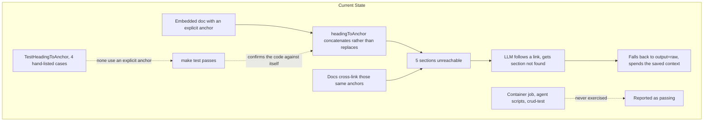
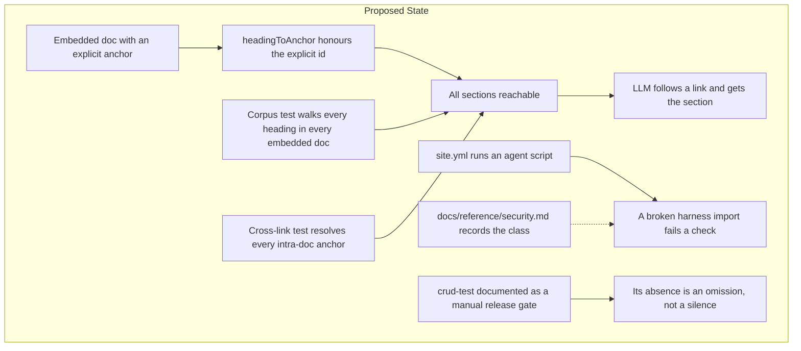
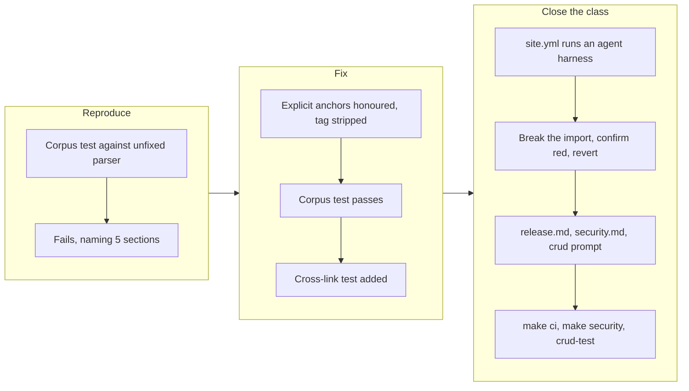

# Unreachable Documentation Anchors and Unexercised Verification Paths

## Change Summary

The `get_docs` verb cannot reach any section whose heading carries an explicit
`{#anchor}` tag. Five sections across three of the four embedded documents are
affected, including one that no parameter value can reach at all, and the
embedded documents cross-link those exact anchors. Fix the anchor derivation,
and replace the hand-listed unit test that let the defect through with a check
that every heading in every embedded document is reachable.

Separately, record and close the verification gap the 0.5.1 release exposed
three times in two days: code that is never exercised reports as code that
passes. The container publish job, the `.agents/scripts/` harnesses, and
`make crud-test` all sit outside any check that runs, and two of the three
produced a green signal over a broken state within the last week.

Also correct four documentation defects in `docs/prompts/mcp-tool-crud-test.md`
where the harness prompt names parameters the registry does not have.

## Motivation and Background

CR-0071 and CR-0072 shipped as 0.5.1. The `make crud-test` run against that
release passed every executable step, and in doing so surfaced a defect that
no automated check covers, in the surface CR-0061 built specifically so an LLM
could help a user out of trouble without leaving the session.

The pattern joining every item in this CR is the same, and it is worth naming
before the individual fixes:

**A thing that is never run reports as a thing that passes.**

* CR-0066 shipped container distribution in April. Its publish job was
  `skipped` in every release until 2026-07-31, when it ran for the first time
  and failed immediately on a 403. Four months of green releases, and the
  documented procedure in `docs/reference/release.md` described something that
  had never worked once.
* The `puppeteer-core` 24 to 25 bump (Dependabot PR #34) passed every check
  while breaking all three `.agents/scripts/` harnesses at import, including
  the visual-regression harness `site/AGENTS.md` mandates. CI cannot observe
  those scripts, so nothing went red. Caught only because the bump was run by
  hand during triage.
* `TestHeadingToAnchor` passes with four hand-listed cases, none of which uses
  an explicit `{#...}` anchor. The test asserts precisely the inputs the
  implementation already handles, so it confirms the implementation against
  itself rather than against the documents it must parse.

Each was individually reasonable. Together they describe a project whose green
signals are weaker than they look, which is the actual finding.

## Change Drivers

* **A documented troubleshooting path returns an error.** `concepts.md` links
  to `#container-no-keychain`; following that link through `get_docs` fails.
* **The defect is invisible to the test suite.** `make test` passes on the
  broken behaviour, and will keep passing after any fix that only adds cases.
* **`make crud-test` is the only thing that found it**, and it is not wired
  into any workflow, runs only by hand, and needs live credentials.
* **Two silent-failure incidents inside one week** is a rate, not a
  coincidence.
* **The harness prompt has drifted from the registry**, so the test agent must
  reconcile documentation against `help` output on every run.

## Current State

### The `get_docs` anchor defect

`internal/tools/get_docs.go:115` derives a section anchor from heading text:

```go
func headingToAnchor(heading string) string {
	heading = strings.ToLower(strings.TrimSpace(heading))
	var b strings.Builder
	for _, r := range heading {
		switch {
		case r >= 'a' && r <= 'z', r >= '0' && r <= '9', r == '-':
			b.WriteRune(r)
		case r == ' ':
			b.WriteRune('-')
		}
	}
	return b.String()
}
```

The `{`, `#`, and `}` characters are dropped, but the letters between them are
kept. An explicit anchor is therefore concatenated onto the derived one rather
than replacing it:

| Heading | Computed anchor | Intended anchor |
|---------|-----------------|-----------------|
| `## Auto-default account {#auto-default-account}` | `auto-default-account-auto-default-account` | `auto-default-account` |
| `## Before you file an issue {#before-you-file-an-issue}` | `before-you-file-an-issue-before-you-file-an-issue` | `before-you-file-an-issue` |
| `## Container has no keychain access {#container-no-keychain}` | `container-has-no-keychain-access-container-no-keychain` | `container-no-keychain` |
| `## Container deployment {#container-deployment}` | `container-deployment-container-deployment` | `container-deployment` |
| `## Container runtime {#container-runtime}` | `container-runtime-container-runtime` | `container-runtime` |

All five are unreachable. `container-no-keychain` is the worst case: its
explicit anchor deliberately differs from its heading text, so no value of
`section` reaches it, not even the derived form.

The affected sections span three of the four embedded documents
(`troubleshooting.md`, `quickstart.md`, `concepts.md`), and the documents
cross-link those anchors:

* `docs/concepts.md:183` links `#container-no-keychain`
* `docs/concepts.md:149` links `#before-you-file-an-issue`
* `docs/quickstart.md:83` links `#before-you-file-an-issue`
* `docs/quickstart.md:251` links `#container-runtime`
* `docs/troubleshooting.md:284` links `#auto-default-account`

An LLM that reads one document, follows a cross-link, and calls `get_docs`
with that anchor receives `section "..." not found`. The workaround is
`output=raw`, which returns the whole document and spends the context the
section parameter exists to save.

`SeeDocs` is populated for exactly one verb today — `system.help` points at
`concepts#in-server-documentation-surface` (`internal/tools/help/verb.go:43`),
a text-derived anchor that resolves. No verb's `SeeDocs` points at any of the
five broken explicit anchors, so the failure surfaces only through the
documents' own cross-links, which is what an LLM follows.

Note that `SeeDocs` anchors are already guarded by `TestSeeDocsAnchorsResolve`
(`internal/tools/verb_metadata_test.go:227`), but that test resolves anchors
against its own `buildHeadingIndex` helper rather than through the production
`get_docs` path — see "Why the test suite does not catch it" below for why that
gap is load-bearing here.

### Why the test suite does not catch it

`internal/tools/get_docs_test.go:102` tests four headings, none with an
explicit anchor:

```go
{"Token Refresh", "token-refresh"},
{"Keychain Locked / Unavailable", "keychain-locked--unavailable"},
{"Graph 429 Throttling", "graph-429-throttling"},
{"Authentication Failures", "authentication-failures"},
```

`TestSystemGetDocs_Section` exercises one section that has no explicit anchor.
The suite therefore describes the implementation rather than the corpus, and
would keep passing if a sixth explicit anchor were added tomorrow.

There is a second, more dangerous copy of the parser. `internal/tools/verb_metadata_test.go`
(package `tools_test`) carries its **own** `headingToAnchor` (line 313) and a
`buildHeadingIndex` helper (line ~285) that `TestSeeDocsAnchorsResolve` uses.
That helper strips `{#...}` and registers **both** the explicit anchor **and**
the text-derived anchor for each heading. Two consequences follow, and both
must be handled by this CR:

* The heading-index copy is **more correct than production**: it already
  registers `container-no-keychain` as a valid anchor, so a verb whose
  `SeeDocs` pointed at an explicit anchor would pass `TestSeeDocsAnchorsResolve`
  while `get_docs` returned `section not found`. The test's notion of a
  reachable anchor already diverges from what the production path can retrieve —
  a latent instance of the exact class this CR names.
* After the parser fix makes the derived form stop resolving (FR-3),
  `buildHeadingIndex` will still register that derived form, so it will accept
  anchors `get_docs` can no longer reach. `buildHeadingIndex` and its duplicate
  `headingToAnchor` **MUST** be reconciled with the production parser in the
  same change, or the new corpus test built on it will contradict FR-3.

### Unexercised verification paths

| Path | Runs in CI? | Evidence of the gap |
|------|-------------|---------------------|
| `release.yml` container job | Only on release | `skipped` in every run from CR-0066 until 2026-07-31, then failed 403 on first execution |
| `.agents/scripts/*.mjs` harnesses | Never | Dependabot PR #34 passed all checks while breaking all three at import |
| `make crud-test` | Never | Found this CR's defect; not referenced by any workflow |

`grep -l crud-test .github/workflows/*.yml` returns nothing.

### Harness prompt drift

`docs/prompts/mcp-tool-crud-test.md` names parameters the registry does not
have. The test agent reconciles these against `help` output on every run,
which works but means each run silently absorbs an error the prompt should not
contain:

| Prompt says | Registry has | Step(s) |
|-------------|--------------|---------|
| `get_message` with `id` | `message_id` | 32, 34 |
| `get_conversation` with `id` | `conversation_id` (the value passed is a conversation ID, not a message ID) | 35 |
| `list_messages` with `folder` | `folder_id` | 30b–30e, 33, 35, 36 |
| "match by event ID in the text" | `search_events` text output has no event ID | 5, 6 |

### The `grype` instrument caveat

The 0.5.1 `security` run emitted:

> go binary packages were found but none carry function symbols; go
> vulnerability matching falls back to module granularity and may report false
> positives

The release build strips symbols (`-s -w`), so `grype` matches at module
granularity rather than by reachability. Its passing verdict is coarser than
it appears. This did not affect the 0.5.1 result and is not a defect, but it
is exactly the sort of instrument caveat `docs/reference/security.md` exists
to carry.

### Current State Diagram



## Proposed Change

### 1. Honour explicit anchors in `headingToAnchor`

When a heading ends with a `{#custom-id}` tag, use that identifier verbatim as
the anchor and ignore the heading text. Otherwise derive as today. The
displayed heading text returned by `extractSection` **MUST** have the tag
stripped, so the LLM never sees the raw `{#...}` markup.

The derived form **MUST NOT** also be accepted for a heading that carries an
explicit anchor. Accepting both would mean `container-has-no-keychain-access`
and `container-no-keychain` resolve to the same section, and the document
author's explicit choice would stop being authoritative.

### 2. Replace the hand-listed test with a corpus check

Add a test that walks **every** H2 heading in **every** embedded document,
computes its anchor, and asserts `get_docs` with that `section` returns
non-empty content. This is the durable form: it fails for any future heading
the parser cannot reach, including anchor styles nobody has thought of yet.

Keep `TestHeadingToAnchor` for the derivation rules themselves and extend it
with explicit-anchor cases, including the case where the explicit anchor
differs from the derived one.

Add a second test asserting that every section cross-link in an embedded
document resolves to a real section. The test **MUST** cover both forms the
corpus actually uses: intra-document links (`](#anchor)`, resolving in the same
document) and inter-document links (`](slug#anchor)`, resolving in the target
document). This matters because four of the five cross-links this CR names are
inter-document — for example `concepts.md` links `troubleshooting#container-no-keychain`,
the very link the first Change Driver cites — so a test restricted to the
`](#anchor)` form would guard only one of the five. That is what turns a broken
cross-reference into a build failure rather than a runtime disappointment.
`TestSeeDocsAnchorsResolve` already parses the `slug#anchor` form, so the
resolution helper this needs already exists in the test package.

### 3. Close the unexercised-path gap where it is cheap

* Add a `site-harness` job to `site.yml` that runs
  `.agents/scripts/site.content.check.mjs` against the built site. This
  executes the puppeteer import path in CI, so a future bump that breaks it
  fails a check. It reuses the build the workflow already produces.
* Add a step to `ci.yml` that runs `go test` for the docs corpus check
  introduced above. It is a plain unit test and needs no credentials.
* `make crud-test` **MUST NOT** be wired into CI. It needs live Microsoft 365
  credentials and mutates a real mailbox. Instead, document it in
  `docs/reference/release.md` as a required manual gate before a release is
  cut, so its absence is a visible omission rather than a silent one.

### 4. Record the class, not just the instances

Add a section to `docs/reference/site-quality.md`'s security sibling,
`docs/reference/security.md`, stating the rule this CR exists to encode:

> A job that is skipped, a script that CI never invokes, and a test whose
> cases are drawn from the implementation all report success without
> evidence. Before trusting a green signal, confirm the thing it names
> actually ran.

Include the three concrete incidents as worked examples, and the `grype`
symbol-stripping caveat with what would change it (SBOM generation with symbol
capture enabled).

### 5. Correct the harness prompt

Fix the three parameter and verification errors in
`docs/prompts/mcp-tool-crud-test.md`, and record Finding 5 (a 27,214-message
unread count against a default `max_results` of 25) as an expected scale
artifact so future runs do not re-investigate it.

### Proposed State Diagram



## Requirements

### Functional Requirements

1. `headingToAnchor` **MUST** return the identifier from a trailing
   `{#custom-id}` tag verbatim when one is present, ignoring the heading text.
2. `headingToAnchor` **MUST** derive the anchor from the heading text, as it
   does today, when no explicit tag is present.
3. A heading carrying an explicit anchor **MUST NOT** additionally resolve
   under its text-derived anchor.
4. The heading text returned by `extractSection` **MUST NOT** contain the
   `{#...}` tag.
5. All five currently unreachable sections **MUST** resolve via `get_docs`
   with their documented anchors: `before-you-file-an-issue`,
   `auto-default-account`, `container-no-keychain`, `container-deployment`,
   `container-runtime`.
6. A test **MUST** walk every H2 heading in every embedded document and assert
   that `get_docs` with the computed anchor returns non-empty content.
7. A test **MUST** assert that every section cross-link in an embedded document
   resolves to a real section, covering both the intra-document form
   (`](#anchor)`, resolving in the same document) and the inter-document form
   (`](slug#anchor)`, resolving in the target document).
8. `TestHeadingToAnchor` **MUST** include a case where the explicit anchor
   differs from the text-derived anchor.
9. `.github/workflows/site.yml` **MUST** run at least one `.agents/scripts/`
   harness against the built site, so the puppeteer import path is exercised
   by CI.
10. `docs/reference/release.md` **MUST** state that `make crud-test` is a
    required manual gate before cutting a release, and **MUST** state why it
    cannot run in CI.
11. `docs/reference/security.md` **MUST** record the unexercised-path rule and
    the three incidents that motivated it.
12. `docs/reference/security.md` **MUST** record the `grype` symbol-stripping
    caveat, stating that the release build strips symbols, that matching
    therefore falls back to module granularity, and what would restore
    reachability-precision.
13. `docs/prompts/mcp-tool-crud-test.md` **MUST** name each mail parameter by
    its registry name: `message_id` (not `id`) for `get_message` at Steps 32
    and 34; `conversation_id` (not `id`) for `get_conversation` at Step 35,
    because the value passed there is a conversation ID; and `folder_id` (not
    `folder`) for `list_messages` at Steps 30b–30e, 33, 35, and 36.
14. `docs/prompts/mcp-tool-crud-test.md` **MUST NOT** instruct the agent to
    match a provenance search by event ID in text output at Steps 5 and 6,
    because `search_events` text output does not contain an event ID.
15. `docs/prompts/mcp-tool-crud-test.md` **MUST** record that a mail list
    capped at `max_results` is expected on large mailboxes and is not a
    finding.

### Non-Functional Requirements

1. The change **MUST NOT** add, remove, rename, or re-signature any verb; it is
   a defect fix behind existing signatures.
2. The embedded bundle **MUST** remain exactly four files.
3. `make ci` **MUST** pass, including `-race`.
4. The `site.yml` harness job **MUST NOT** add a dependency on live
   credentials or network services beyond what the workflow already uses.
5. The new corpus test **MUST** fail if any embedded document gains an
   unreachable heading, without that test being edited.

## Affected Components

* `internal/tools/get_docs.go`: `headingToAnchor` and `extractSection`.
* `internal/tools/get_docs_test.go`: extended derivation cases, new corpus and
  cross-link tests.
* `internal/tools/verb_metadata_test.go`: the duplicate `headingToAnchor` (line
  313) and `buildHeadingIndex` (line ~285) helper. Both **MUST** be reconciled
  with the fixed production parser so the heading index no longer accepts the
  text-derived anchor of an explicit-anchor heading, keeping
  `TestSeeDocsAnchorsResolve` consistent with FR-3 and with the production
  `get_docs` path.
* `.github/workflows/site.yml`: new harness job.
* `docs/reference/release.md`: `make crud-test` as a manual release gate.
* `docs/reference/security.md`: the unexercised-path rule, the three
  incidents, the `grype` caveat.
* `docs/prompts/mcp-tool-crud-test.md`: parameter and verification
  corrections.

Not affected: the four embedded documents themselves. Their anchors are
correct as authored; the parser is what is wrong. Changing the documents to
suit the parser would be fixing the evidence rather than the defect.

## Scope Boundaries

### In Scope

* The `get_docs` explicit-anchor defect and its test coverage.
* A corpus-level reachability test and a cross-link resolution test.
* Exercising one agent harness in `site.yml`.
* Documenting `make crud-test` as a manual release gate.
* Recording the unexercised-path rule and the `grype` caveat.
* Correcting the four CRUD prompt defects.

### Out of Scope ("Here, But Not Further")

* **Wiring `make crud-test` into CI.** It needs live credentials and mutates a
  real mailbox. Documented as manual instead.
* **A dedicated test tenant.** The right long-term answer to the line above,
  and a larger piece of work with its own cost and access questions.
* **Populating `SeeDocs` across the registry.** The anchors will work after
  this CR, which is the precondition; using them is separate work.
* **Rewriting the container release path.** CR-0066's job now works. Its
  history is recorded here as evidence for the rule, not reopened.
* **Regenerating SBOMs with symbol capture** to sharpen `grype`. Recorded as a
  ceiling with what would move it; acting on it is its own change.
* **Changing `max_results` defaults.** Finding 5 is a scale artifact, not a
  defect.
* **Running the remaining harnesses in CI.** One is enough to exercise the
  import path; adding all three buys little for the runtime cost.

## Alternative Approaches Considered

* **Remove the `{#...}` tags from the documents.** Makes the parser correct by
  deleting the input it fails on. Rejected: `container-no-keychain` is
  deliberately shorter than its heading, external links may already use these
  anchors, and it treats the evidence as the problem.
* **Accept both the explicit and derived anchors.** More forgiving, and
  rejected because it makes two names valid for one section and quietly
  removes the author's ability to choose one.
* **Add the five missing cases to `TestHeadingToAnchor`.** The minimal fix,
  and the one that would let the sixth explicit anchor fail exactly as the
  first five did. The corpus test is barely larger and does not decay.
* **Add a `crud-test` job gated on a secret.** Runs when credentials exist,
  skips otherwise. Rejected precisely because "skips otherwise" is the failure
  mode this CR exists to name.
* **Do nothing about the unexercised paths and just fix the bug.** The bug is
  an hour; the class produced three incidents in a week.

## Impact Assessment

### User Impact

Positive and narrow. An LLM helping a user troubleshoot can reach five
sections it currently cannot, including the container keychain guidance a
container user is most likely to need. No verb signature changes, so nothing
an integrator has built against moves.

The fallback today is `output=raw`, which works but returns a whole document
where a section was asked for, so the practical effect is fewer tokens and a
more targeted answer rather than newly possible behaviour.

### Technical Impact

* `headingToAnchor` gains a branch and a trailing-tag parse. Contained,
  covered by tests, no call-site changes.
* The corpus test couples the test suite to the embedded documents by design,
  which is the point: a document change that breaks retrieval should fail the
  build.
* `site.yml` gains a job running a Node script against the built site,
  reusing the existing build. Adds roughly a minute.
* Documentation changes are confined to `docs/reference/` and
  `docs/prompts/`, neither embedded, so `docs/embed.go` and its allowlist test
  are untouched.

### Business Impact

Small and mostly reputational in the right direction. The in-server
documentation surface is a differentiator for this server, and a
differentiator that returns "section not found" on its own cross-links is
worse than one that does not exist. The verification rule is cheap insurance
against the more expensive version of the same mistake, which is a broken
release path nobody notices for four months.

## Implementation Approach

### Phase 1: Reproduce

Write the corpus test first, against the unfixed parser, and confirm it fails
naming all five sections. A test that does not fail before the fix is not
evidence the fix worked.

### Phase 2: Fix the parser

Implement explicit-anchor handling and tag stripping. Confirm the corpus test
passes, the five sections resolve, and the derived-anchor cases still pass.

### Phase 3: Cross-link test

Add the intra-document cross-link resolution test. Confirm it passes on the
fixed parser and would fail on the unfixed one.

### Phase 4: Exercise a harness in CI

Add the `site.yml` job. Verify on the pull request that it runs the script and
that the job fails if the import is broken, by temporarily pointing the import
at a bad path and confirming red, then reverting.

### Phase 5: Documentation

`docs/reference/release.md`, `docs/reference/security.md`, and
`docs/prompts/mcp-tool-crud-test.md`.

### Phase 6: Verify

`make ci`, `make security`, and a `make crud-test` run confirming the five
sections resolve through the real server.

### Implementation Flow



## Test Strategy

### Tests to Add

| Test File | Test Name | Description | Inputs | Expected Output |
|-----------|-----------|-------------|--------|-----------------|
| `internal/tools/get_docs_test.go` | `TestGetDocs_EveryHeadingReachable` | Walks every H2 heading in all four embedded documents, computes its anchor, and asserts `get_docs` returns non-empty content for it. Fails for any future unreachable heading without being edited | The embedded bundle | Every heading resolves; failure names the document and heading |
| `internal/tools/get_docs_test.go` | `TestGetDocs_CrossLinksResolve` | Extracts every section cross-link from each embedded document — both intra-document `](#anchor)` and inter-document `](slug#anchor)` — and asserts each resolves to a section in the correct document | The embedded bundle | Every cross-link resolves; failure names the link and source line |
| `internal/tools/get_docs_test.go` | `TestGetDocs_ExplicitAnchorSections` | Asserts the five specific sections resolve by their documented anchors | `before-you-file-an-issue`, `auto-default-account`, `container-no-keychain`, `container-deployment`, `container-runtime` | All five return their own content, no cross-section bleed |

### Tests to Modify

| Test File | Test Name | Current Behavior | New Behavior | Reason for Change |
|-----------|-----------|------------------|--------------|-------------------|
| `internal/tools/get_docs_test.go` | `TestHeadingToAnchor` | Four cases, none with an explicit anchor | Adds explicit-anchor cases, including one where the explicit anchor differs from the derived form, and one asserting the derived form does **not** resolve for such a heading | FR-1, FR-3, FR-8. The current cases describe the implementation rather than the corpus, which is why the defect survived |
| `internal/tools/verb_metadata_test.go` | `buildHeadingIndex` (helper for `TestSeeDocsAnchorsResolve`) | Registers both the explicit anchor and the text-derived anchor for a `{#...}` heading, via a duplicate `headingToAnchor` | Register only the anchor the fixed `get_docs` can retrieve, so its derivation matches the production parser (the file is `package tools_test` and cannot call the unexported production helper, so the derivation must be kept behaviourally identical rather than literally shared) | FR-3. Otherwise the index accepts anchors `get_docs` cannot resolve, silently permitting the same class of defect through `SeeDocs` |

### Tests to Remove

| Test File | Test Name | Reason for Removal |
|-----------|-----------|-------------------|
| n/a | n/a | Not applicable. `TestSystemGetDocs_Section`, `_UnknownSlug`, `_UnknownSection` and `_Raw` all remain valid and are unaffected by the anchor change. |

## Acceptance Criteria

### AC-1: Explicit anchors resolve

```gherkin
Given the troubleshooting document contains "## Container has no keychain access {#container-no-keychain}"
When an LLM calls get_docs with slug "troubleshooting" and section "container-no-keychain"
Then the section content is returned
  And it does not contain content from any adjacent section
```

### AC-2: All five affected sections resolve

```gherkin
Given five embedded sections carry explicit anchor tags
When each is requested by its documented anchor
Then all five return their own non-empty content
  And none returns a "section not found" error
```

### AC-3: The derived form does not also resolve

```gherkin
Given a heading carries an explicit anchor that differs from its text-derived form
When get_docs is called with the text-derived form
Then it returns a "section not found" error
  And only the explicit anchor resolves
```

### AC-4: The anchor tag never reaches the caller

```gherkin
Given a section heading carries a "{#custom-id}" tag
When that section is returned by get_docs
Then the heading text in the output does not contain "{#" or "}"
```

### AC-5: The corpus test fails before the fix

```gherkin
Given the corpus reachability test is written against the unfixed parser
When it is run before the parser change
Then it fails
  And the failure names each unreachable heading and its document
```

### AC-6: A future unreachable heading fails the build

```gherkin
Given the corpus reachability test exists
When a contributor adds an embedded heading the parser cannot reach
Then "make test" fails without the test being edited
  And the failure names the offending heading
```

### AC-7: Broken cross-links fail the build

```gherkin
Given the embedded documents cross-link section anchors
When a cross-link points at an anchor no section provides
Then "make test" fails naming the link and its source document
```

### AC-8: CI exercises an agent harness

```gherkin
Given the .agents/scripts harnesses import puppeteer-core and run only locally
When the site workflow runs on a pull request
Then it executes at least one of those harnesses against the built site
  And the job fails if the import cannot be resolved
```

### AC-9: The harness job actually detects a broken import

```gherkin
Given the new harness job exists
When the puppeteer import is temporarily pointed at a non-existent path
Then the site workflow fails at the harness step
  And the failure names the module resolution error
```

### AC-10: crud-test is a visible manual gate

```gherkin
Given make crud-test cannot run in CI because it needs live credentials and mutates a real mailbox
When a maintainer reads docs/reference/release.md
Then it states that make crud-test is required before cutting a release
  And it states why it cannot be automated
```

### AC-11: The unexercised-path rule is recorded with evidence

```gherkin
Given three incidents in one week involved code that reported success without running
When a contributor reads docs/reference/security.md
Then it states the rule that an unexercised path reports as a passing path
  And it cites the container job, the agent harnesses, and the anchor test as worked examples
```

### AC-12: The grype caveat is published with its ceiling

```gherkin
Given the release build strips symbols so grype matches at module granularity
When a contributor reads docs/reference/security.md
Then it states that the passing verdict is coarser than it appears
  And it states what would restore reachability-precision
```

### AC-13: The harness prompt matches the registry

```gherkin
Given the CRUD prompt named parameters the registry does not have
When a maintainer compares docs/prompts/mcp-tool-crud-test.md against the domain help output
Then the prompt names message_id for get_message, conversation_id for get_conversation, and folder_id for list_messages
  And it does not instruct matching a provenance search by event ID in text output at Steps 5 and 6
  And it records that a max_results-capped mail list is expected on large mailboxes
```

### AC-14: The tool surface is unchanged

```gherkin
Given this CR fixes a defect behind existing signatures
When the verb inventory golden test runs
Then the registered verb set and every annotation hint are unchanged
  And extension/manifest.json is unchanged
```

## Quality Standards Compliance

### Build & Compilation

- [x] `make build` succeeds
- [x] No new compiler warnings

### Linting & Code Style

- [x] `make vet`, `make lint`, `make fmt-check` pass
- [x] `make tidy` leaves `go.mod` and `go.sum` unchanged

### Test Execution

- [x] `make test` passes, including `-race`
- [x] The corpus test is confirmed to fail before the fix (AC-5)
- [ ] `make crud-test` re-run confirms the five sections resolve live (deliberately not run per CR scope; live-server verification in Phase 6 substitutes the evidence per checkpoint(CR-0074): phase 6: Verify)

### Documentation

- [x] `docs/reference/release.md` and `docs/reference/security.md` updated
- [x] `docs/prompts/mcp-tool-crud-test.md` corrected
- [x] Embedded bundle unchanged; `docs/embed.go` and its allowlist test untouched

### Code Review

- [ ] Changes submitted via pull request
- [ ] PR title `fix(docs): honour explicit section anchors in get_docs`
- [ ] Squash-merged to maintain linear history

### Verification Commands

```bash
# Reproduce first
go test ./internal/tools/ -run TestGetDocs_EveryHeadingReachable -v

# The five sections, live
make build && ./bin/outlook-local-mcp   # then call get_docs per section

# Full pipeline
make ci
make security

# The manual gate
make crud-test
```

## Risks and Mitigation

### Risk 1: The corpus test couples tests to documentation churn

**Likelihood:** high
**Impact:** low
**Mitigation:** every heading edit now has the power to fail the build, which
is the intended behaviour rather than a side effect: a heading change that
breaks retrieval is a defect, and the alternative is finding out from a user.
The failure message names the document and heading, so the fix is mechanical.

### Risk 2: Explicit-anchor parsing is too narrow or too greedy

**Likelihood:** medium
**Impact:** medium
**Mitigation:** the tag is matched only as a trailing `{#...}` on an H2 line,
not anywhere in the text, so a heading legitimately containing braces is
unaffected. `TestHeadingToAnchor` covers both shapes, and the corpus test
covers whatever the documents actually contain, which is the case that matters.

### Risk 3: The new site.yml job is itself never verified

**Likelihood:** medium
**Impact:** medium
**Mitigation:** this is the exact failure this CR exists to correct, so
asserting the job works is not optional. AC-9 requires deliberately breaking
the import, observing the job fail, and reverting. A gate not proven to fail
is not proven to be a gate.

### Risk 4: Fixing the anchors changes which content a section returns

**Likelihood:** low
**Impact:** medium
**Mitigation:** four of the five explicit anchors match their derived form
apart from the duplication, so behaviour moves from error to correct content.
`container-no-keychain` is the one whose explicit anchor differs materially,
and AC-1 asserts its content specifically, including the absence of
cross-section bleed.

### Risk 5: crud-test remains unrun despite being documented

**Likelihood:** medium
**Impact:** medium
**Mitigation:** documenting a manual gate is weaker than automating one, and
this CR says so rather than implying otherwise. The honest position is that
the gate is visible and its omission is recordable; a dedicated test tenant is
the real fix and is named as out of scope with that reasoning.

## Dependencies

* None blocking. Implementable against `main` at `dcfbadd`.
* CR-0061 established the in-server documentation surface this repairs.
* CR-0071 created `docs/reference/security.md`, which this extends.
* CR-0066's container history is cited as evidence; nothing in it is reopened.

## Estimated Effort

* Phase 1, reproduce with the corpus test: 1 hour
* Phase 2, parser fix: 1 hour
* Phase 3, cross-link test: 1 hour
* Phase 4, site.yml harness job including the deliberate-break check: 1.5 hours
* Phase 5, documentation: 2 hours
* Phase 6, verification including a crud-test run: 1 hour

**Total: 7.5 hours.**

## Decision Outcome

Chosen approach: "honour explicit anchors, and replace the hand-listed test
with a corpus check", because the defect and the reason it survived are the
same story told twice. The parser was wrong, and the test was written from the
parser rather than from the documents, so it agreed with the bug.

Fixing only the parser would leave the second half in place, which is what
makes the corpus test the more important half of this change. It is barely
larger than adding five cases and it does not decay.

The verification items travel with it deliberately. Three incidents in one
week, all of the form "this never ran, so it looked fine", is a pattern worth
writing down while the examples are fresh and specific rather than
reconstructed later from memory.

## Related Items

* Source: `TEST-REPORT-2026-08-01T11-55-17.md`, findings 1 to 5
* CR-0061: in-server documentation surface this repairs
* CR-0066: container distribution whose publish path had never executed
* CR-0071: created `docs/reference/security.md`
* CR-0072: recorded the `puppeteer-core` pin as load-bearing
* Pull requests: #34 (would have broken the harnesses silently), #36 (fixed
  the import), #38 (release-only actions no PR can exercise)
* Bench row: `docs/bench/crud-runs.csv`, run `2026-08-01T11-55-17`

## More Information

### Why the test agreed with the bug

`TestHeadingToAnchor` was almost certainly written by reading
`headingToAnchor` and choosing inputs that exercise its branches. That is the
natural way to write a unit test and it produces high coverage of the code as
written, which is precisely the problem: it cannot discover an input shape the
implementation never considered. The five explicit anchors were in the
repository before the test, and the test never looked at them.

The corpus test inverts the direction. It derives its cases from the documents
the parser must handle rather than from the parser, so it can fail for a
reason the implementer did not anticipate. That property, not the extra
coverage, is why it is worth the coupling to documentation churn that Risk 1
describes.

### On counting three incidents as a pattern

Two of the three were found by hand during unrelated work, and the third by a
test harness that runs only when someone remembers to run it. None was found
by CI, because in all three cases CI was structurally incapable of finding
them: it never executed the code in question.

The uncomfortable implication is that the sample is not three. It is three
*found*, with no way to know the denominator. That is the argument for writing
the rule down and for the AC-9 requirement that a new gate be proven to fail
before it is trusted, rather than for treating the three as fixed and moving
on.

<!-- review-summary -->
## Review Summary (cr-reviewer, 2026-08-01)

Reviewed against the live tree at branch `docs/cr-0073` / source commit
`dcfbadd` (confirmed `chore(main): release 0.5.1`).

### Verified accurate (no change)

* The central defect: `internal/tools/get_docs.go:115` `headingToAnchor` drops
  `{`, `#`, `}` but keeps the letters, concatenating the explicit anchor onto
  the derived one. Confirmed by reading the source.
* All five explicit anchors exist verbatim at the cited headings:
  `troubleshooting.md:7` (before-you-file-an-issue), `troubleshooting.md:288`
  (auto-default-account), `troubleshooting.md:319` (container-no-keychain),
  `quickstart.md:186` (container-deployment), `concepts.md:155`
  (container-runtime). Distribution across three of four embedded docs is
  correct.
* All five cross-link line numbers are exact: `concepts.md:183`,
  `concepts.md:149`, `quickstart.md:83`, `quickstart.md:251`,
  `troubleshooting.md:284`.
* `TestHeadingToAnchor` has exactly four hand-listed cases, none with an
  explicit anchor. `TestSystemGetDocs_Section` uses a derived anchor. Confirmed.
* No workflow references `crud-test` (grep of `.github/workflows/` empty).
* The `-s -w` symbol-stripping build flags are present (`.goreleaser.yaml:28,43`)
  and the specific grype "no function symbols" caveat is **not** yet in
  `docs/reference/security.md`, so FR-12 is a genuine addition, not drift.

### Findings by category

**Drift (3):**

1. **SeeDocs claim false.** The CR stated "`SeeDocs` is not currently populated
   in the registry." It **is** populated for `system.help`
   (`internal/tools/help/verb.go:43` → `concepts#in-server-documentation-surface`),
   and `TestSeeDocsAnchorsResolve` already guards SeeDocs anchors. The true
   point (no verb targets the five broken anchors) survives. **Fixed:** Current
   State rewritten.
2. **Duplicate parser and heading-index helper unmentioned.**
   `internal/tools/verb_metadata_test.go` (package `tools_test`) carries its own
   `headingToAnchor` (line 313) and `buildHeadingIndex` (line ~285), which
   registers **both** the explicit and the text-derived anchor. This (a) is a
   latent instance of the same bug — a `SeeDocs` pointing at an explicit anchor
   passes the metadata test while `get_docs` fails — and (b) directly conflicts
   with FR-3 once the fix lands. **Fixed:** added to Current State, Affected
   Components, and a Tests-to-Modify row requiring reconciliation.
3. **Harness-prompt drift table inaccurate.** Verified against the live prompt
   and registry: the bare-`id` defect is at Steps 32/34 (`get_message` →
   `message_id`) and Step 35 (`get_conversation` → **`conversation_id`**, not
   `message_id` as the CR claimed — the value is a conversation ID); the
   `folder` → `folder_id` defect (`list_messages`) is at Steps 30b–30e, 33, 35,
   36; and "match by event ID in the text" is at Steps 5 and 6 (not "5, 16").
   The CR's cited "Step 33" for `id` is wrong — Step 33 already uses
   `message_id`. **Fixed:** Current State table, FR-13, FR-14, and AC-13
   corrected.

**Requirement/AC coverage (1):**

4. **Cross-link test scoped too narrowly.** FR-7 and `TestGetDocs_CrossLinksResolve`
   covered only intra-document `](#anchor)` links, but four of the five cited
   cross-links — including the primary Change Driver
   (`concepts.md` → `troubleshooting#container-no-keychain`) — are
   inter-document `](slug#anchor)`. As scoped, the test would guard only one of
   the five. AC-7 was already general, so FR-7 was narrower than its own AC.
   **Fixed:** Proposed Change #2, FR-7, and the Test Strategy row broadened to
   both forms.

**Ambiguity (1):**

5. **NFR-1 RFC-2119 construction.** "No verb **MUST** be added, removed…" reads
   as "it is not required that a verb be added," the opposite of the intended
   prohibition. **Fixed:** rewritten to "The change **MUST NOT** add, remove,
   rename, or re-signature any verb."

### Fixes applied

Current State (SeeDocs, duplicate-parser subsection, harness-prompt table);
Affected Components (added `verb_metadata_test.go`); FR-7, FR-13, FR-14, NFR-1;
AC-13; Proposed Change #2; Test Strategy (cross-link row broadened, new
`buildHeadingIndex` modify-row). Path/symbol updates from drift reconciliation:
`internal/tools/help/verb.go:43`, `internal/tools/verb_metadata_test.go:227/285/313`.

### Not changed (deliberate)

* `make crud-test` not wired into CI, and the embedded documents not edited —
  both reasoned in Scope Boundaries; left intact per author intent.
* Em-dash usage left as-is: the repo's docs and CRs use em-dashes throughout, so
  this is not enforced as a project convention here.
* Change Summary/Decision Outcome use "replace" while Proposed Change #2 keeps
  `TestHeadingToAnchor` and adds the corpus test. The FRs (FR-6 add, FR-8 keep
  and extend) are unambiguous, so this is framing, not a requirement conflict;
  left as-is.

### Unresolvable items requiring human decision

None. The `buildHeadingIndex`/duplicate-parser reconciliation is specified as an
implementable scope addition rather than left open.
<!-- /review-summary -->
