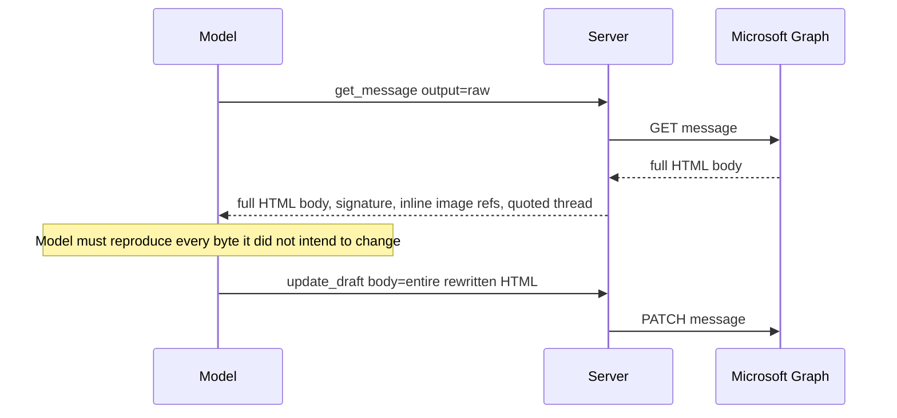
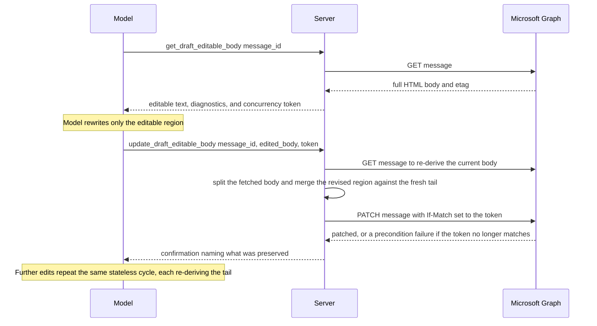
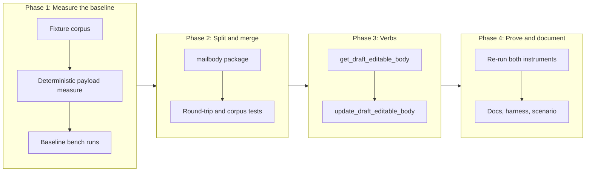

# Draft Revision Over an Editable Region, Without Server State

## Change Summary

Revising an Outlook draft through this server today requires handing the model the
entire HTML body, because `mail.get_message` with `output=raw` is the only way to read
a body and `mail.update_draft` replaces it wholesale. An Outlook reply body is mostly
signature, inline image references, and quoted history, so the model pays for tens of
kilobytes of markup to change a paragraph, and it can damage every part it was never
meant to touch.

This change adds two mail verbs that hand the model only the part it is meant to edit.
`get_draft_editable_body` splits a draft into an **editable region** and a **preserved
tail**, returns the editable text with diagnostics and an opaque concurrency token, and
discloses no part of the tail. `update_draft_editable_body` re-fetches the draft,
re-derives the tail by the same deterministic split, merges the revised text back
against it, verifies the tail and the inline image references survived, and patches the
draft, sending the concurrency token as an `If-Match` header so a competing edit is
rejected by Graph. The server holds no state between the two calls: every edit
re-derives the tail from the current body, and a process restart loses nothing Graph
cannot return.

The improvement is measured rather than asserted, on two separate instruments: a
deterministic measure of the body payload the model receives, and a stochastic
end-to-end bench recording tokens, wall time, and cost per run with its noise band
stated.

## Motivation and Background

Issue #25 reports a real workflow that the current tool surface makes expensive. The
reporter drafts a reply in Outlook with the signature and quoted history already in
place, writes rough notes, and asks a locally-hosted model to turn the notes into
prose. Every step of that is well served by this project's design, except the one that
matters: the model must ingest the whole body to edit one part of it.

Three costs follow, and they compound.

**Token cost.** The body is the largest single payload in the exchange, and it crosses
the boundary twice: once into the model and once back out, because the model must
re-emit the entire body for `update_draft` to write it. A locally-hosted model on
consumer hardware feels this most, which is exactly the reporter's setting.

**Fidelity risk.** Asking a model to reproduce tens of kilobytes of Outlook markup
verbatim except for one region is asking it to do the thing models are least reliable
at. A dropped `cid:` reference silently breaks an inline image. A mangled quote block
silently rewrites correspondence history.

**Exposure.** The reporter runs a local model for privacy, and the current flow still
discloses the full quoted thread to it. Narrowing what the model sees is a privacy
improvement independent of the token saving.

The reporter prototyped three verbs in a fork and asked six design questions. This
change request answers all six, adopts two of the three verbs, and rejects the
file-backed artifact store the reporter proposed. It also holds no server-side state at
all, because a draft revision can be reconstructed on demand from the draft Graph
already stores in full, so any local copy of the tail is a second copy of data the
server already has in hand at the moment it needs it.

## Change Drivers

* Issue #25, a user-generated feature request with a working prototype and a reported
  successful use.
* The full-body round trip is the dominant token cost in any draft revision, and the
  project's users increasingly run local models where that cost is felt as latency.
* A model that rewrites a whole body can damage a signature, an inline image, or a
  quoted thread, and nothing in the current surface prevents that.
* Reducing what the model sees is aligned with the project's stated position that
  nothing is relayed through a third party.

## Current State

Two verbs exist and neither is shaped for this task.

| Verb | Gating | What it does | Why it does not serve the workflow |
|---|---|---|---|
| `mail.get_message` | `MAIL_ENABLED` | Returns `bodyPreview` by default; the full HTML body only under `output=raw` | `raw` is all-or-nothing. There is no way to read part of a body |
| `mail.update_draft` | `MAIL_MANAGE_ENABLED` | PATCHes a draft; `body` replaces the entire body | The model must re-emit every byte it did not intend to change |

`mail.list_messages` already accepts `folder_id`, so listing draft candidates needs no
new verb. The reporter's third proposed verb is therefore not adopted, and the
capability is documented against the existing one instead.

There is no in-process store of any kind for message content today, and no
configuration variable governing one. This change preserves that property: it adds no
store and no configuration variable.

### Current State Diagram



## Proposed Change

### Two verbs over one draft, no server state

`get_draft_editable_body` verifies the message is a draft, fetches the body, splits it
at the first marker that matches the precedence order below, and returns the editable
region as text plus diagnostics, together with the message's `@odata.etag` as an opaque
concurrency token. The original HTML never appears in a tool result, and the server
keeps nothing between the two calls.

`update_draft_editable_body` takes the same draft identifier, the revised text, and the
concurrency token. It re-fetches the message, splits the freshly fetched body with the
same deterministic function, merges the revised region against the freshly derived tail,
runs the fidelity checks, and PATCHes the draft with the token sent as an `If-Match`
header so Graph rejects a write that would clobber an edit made elsewhere. It never
sends the message, in line with the project's standing position that `Mail.Send` is not
requested under any configuration.

The model carries no cache identifier because there is no cache: it names the draft it
is already working on and hands back the concurrency token it was given. A second read
of the same draft simply produces a fresh token; there is no entry to accumulate.

Why no server state. The splitter is a pure function over the body (non-functional
requirement 3), and the update verb already re-fetches the message before it patches
(functional requirement 12). The verb therefore holds the current body at merge time
and can split it again to derive the tail. A stored tail, original body, marker, inline
image count, and content type would each be a second copy of data the verb already has
in hand, so keeping them buys nothing. The one capability a store would buy, detecting
an edit made by another client between the read and the write, is kept statelessly by
the ETag: Graph itself rejects the conflicting PATCH on the `If-Match` precondition, so
there is no change key to track and no false conflict from this server's own preceding
patch.

### The split, and what happens when it fails

The split is a pure function over the body, in a package with no Graph dependency, so
it is testable against fixtures without a network or an account. Markers are tried in
a fixed precedence order, and the first match wins:

1. `<div id="appendonsend">`, the point Outlook appends to on send.
2. `<div id="divRplyFwdMsg">`, the reply and forward header Outlook inserts.
3. `<div id="Signature">`, or an element carrying the signature class Outlook emits.
4. `<hr id="stopSpelling">`, an older Outlook separator still present in long threads.
5. `<blockquote>` opening a quoted thread, including the Gmail quote container, for
   drafts replying to a message composed elsewhere.
6. A plain-text separator line, for a draft whose content type is text rather than
   HTML.

When no marker matches, the verb **MUST NOT** guess. It returns the whole body as
non-editable with a diagnostic naming the failure, and the caller falls back to the
existing `get_message` and `update_draft` pair. A wrong split is worse than no split,
because it silently moves the boundary between what the model may rewrite and what it
must not touch.

### Proposed State Diagram



## Requirements

### Functional Requirements

**The split and merge**

1. The system **MUST** provide a package that splits a message body into an editable
   region and a preserved tail, and merges a revised region back against that tail,
   with no dependency on Microsoft Graph or on any network call.
2. The splitter **MUST** try markers in a fixed, documented precedence order and use
   the first match.
3. The splitter **MUST**, when no marker matches, report the body as non-editable with
   a diagnostic naming the reason, and **MUST NOT** infer a boundary.
4. Merging an unmodified editable region back against its tail **MUST** reproduce the
   original body byte for byte.
5. The merge **MUST** preserve the tail byte for byte, and **MUST** reject the update
   when it would not.
6. The splitter **MUST** handle a body whose content type is text rather than HTML.

**The verbs**

7. The system **MUST** register a `get_draft_editable_body` verb in the mail domain,
   gated by `MAIL_ENABLED`, requiring a message identifier.
8. `get_draft_editable_body` **MUST** verify the target message is a draft and reject
   a sent or received message.
9. `get_draft_editable_body` **MUST** return the subject, the editable region, the
   marker that matched, the inline image reference count, whether a signature marker
   was found, an opaque concurrency token derived from the message ETag, and any
   warnings. It **MUST NOT** return a cache identifier, because there is no cache. The
   concurrency token it returns identifies a version of the draft, not a server-side
   entry, and the update verb requires it back.
10. No output mode of `get_draft_editable_body` **MUST** return the original body, the
    preserved tail, or any part of the quoted thread. The `raw` tier **MUST** return
    the structured record of the editable region and its diagnostics, not the source
    document. This is stated because the project's tiering rule requires read verbs to
    offer three tiers, and the obvious reading of `raw` would reintroduce the exact
    disclosure this change exists to remove.
11. The system **MUST** register an `update_draft_editable_body` verb in the mail
    domain, gated by `MAIL_MANAGE_ENABLED`, requiring a message identifier, the revised
    region, and the concurrency token returned by the read verb.
12. `update_draft_editable_body` **MUST** re-fetch the message before patching, **MUST**
    reject the update when the message is no longer a draft, and **MUST** send the
    concurrency token as an `If-Match` header on the patch so Microsoft Graph rejects
    the write with a precondition failure when the draft has changed since it was read.
13. `update_draft_editable_body` **MUST** verify, before patching, that the merged body
    preserves every inline image reference present in the freshly fetched body, and
    **MUST** reject the update naming the specific check that failed. Because the tail
    is re-derived from the freshly fetched body by the same deterministic split, the
    merged body reproduces that tail by construction; the verb **MUST** assert this
    structural property holds rather than comparing against a separately stored tail.
14. `update_draft_editable_body` **MUST NOT** send the message.
15. `update_draft_editable_body` **MUST** return a confirmation naming the draft, the
    subject, the number of characters replaced, and what was preserved, namely the tail
    and the inline image references.
16. Both verbs **MUST** declare the four annotation hints, and both **MUST** appear in
    the mail domain's help output with their gating stated.

**Measurement**

17. The system **MUST** provide a deterministic measurement that reports, per fixture,
    the size of the body payload a caller receives under the existing flow and under
    the new flow, in both characters and tokens, with no model in the loop.
18. The system **MUST** provide an end-to-end bench that drives a headless agent
    through the same revision goal under both flows, recording wall time, turn count,
    input tokens, output tokens, cache tokens, and cost per run, in the manner the
    existing lifecycle harness already records them.
19. The bench **MUST** record, per run, whether the resulting draft preserved the
    signature, preserved every inline image reference, and left the quoted tail
    unchanged, because a cheaper flow that damages the draft is not an improvement.
20. The bench **MUST** run each arm at least five times and report the mean and the
    spread, and the report **MUST** state the noise band next to any threshold it is
    compared against.
21. The bench results **MUST** be committed as a comma-separated file under
    `docs/bench/`, with a header matching the script's output.

**Documentation and coupling**

22. `docs/concepts.md` **MUST** gain an anchored section describing the editable
    region, the preserved tail, the stateless re-derivation of the tail on each edit,
    the ETag concurrency token sent as an `If-Match` header, and the failure mode when
    no marker matches, and both verbs **MUST** reference it.
23. `docs/prompts/mcp-tool-crud-test.md` and `scripts/crud-test.sh` **MUST** be
    updated in the same change, per the standing harness-maintenance rule, because two
    verbs are added to the mail domain.
24. `docs/troubleshooting.md` **MUST** gain an entry for a draft that cannot be split.

### Non-Functional Requirements

1. The body payload a caller receives for a draft revision **MUST** fall by at least
   80 percent, measured on the fixture corpus by the deterministic instrument.
2. The end-to-end bench **MUST NOT** show a regression in wall time or cost outside
   the measured noise band.
3. The splitter and merger **MUST** be deterministic: the same input produces the same
   output on every run, so the fixture comparison is a real assertion and the tail
   re-derived on an edit is identical to the tail produced by the preceding read.
4. The preserved tail, the original body, and the revised region **MUST NOT** appear in
   any log line, audit record, or telemetry attribute in a form that carries body
   content. The concurrency token is the message ETag, which discloses nothing the
   exchange did not already carry.

An earlier draft of this change carried a further non-functional requirement that a
revision read the draft body from Graph exactly once across several edits. It is
deliberately dropped. It meters server-side Graph fetches rather than the model-facing
payload, which is the wrong instrument: the primary claim rests on instrument A, the
model-facing body payload, and instrument A is unaffected by how many times the server
fetches the body. The stateless design re-reads the body on each edit by design, and
the accepted cost of that is recorded in Technical Impact.

## Affected Components

* `internal/mailbody/` (new): the splitter, the merger, the marker precedence, and the
  fixture corpus.
* `internal/tools/`: the two verb handlers, their annotations, and their text
  formatters.
* `internal/server/mail_verbs.go`: registration and gating.
* `docs/concepts.md`, `docs/troubleshooting.md`, `docs/prompts/mcp-tool-crud-test.md`.
* `scripts/crud-test.sh`, `.agents/scripts/` (the two measurement instruments),
  `docs/bench/`.
* `.agents/scenarios/`: the persisted user scenario.

## Scope Boundaries

### In Scope

* The two verbs, the splitter, and the merger, with the tail re-derived statelessly on
  each edit.
* The marker precedence order and the explicit non-editable outcome.
* The ETag concurrency token and its use as an `If-Match` header on the patch.
* Both measurement instruments, their fixtures, and their committed results.
* The concepts section, the troubleshooting entry, and the harness updates.

### Out of Scope ("Here, But Not Further")

* **A `list_draft_candidates` verb.** `mail.list_messages` already scopes to a folder,
  so the capability exists. The documentation names it instead.
* **Sending mail.** `Mail.Send` is not requested under any configuration, and this
  change does not alter that.
* **Editing anything other than the editable region.** Changing a signature, a quoted
  thread, or an inline image is deliberately impossible through these verbs.
* **Rich structural editing of the region.** The region is handed over and taken back
  as text. Returning a document model the model can manipulate node by node is a
  different feature with a different risk profile.
* **Storing any part of a revision, in memory or on disk.** Named here because the
  reporter proposed a file-backed artifact store and this change deliberately rejects
  any store at all. The tail is re-derived from the draft on each edit, so there is
  nothing to persist and nothing lost across a restart.
* **Changing `get_message` or `update_draft`.** They stay exactly as they are, and
  they are the documented fallback when a body cannot be split.

## Alternative Approaches Considered

* **Return the body with the quoted tail truncated, and keep nothing.** Simple, and it
  removes the tail from the model. It also removes any way to reassemble the draft
  faithfully from the model's output alone, so the tail must be re-fetched and
  re-derived on write. That is exactly what the chosen design does, but this variant
  needlessly shows the truncated body to the model, which still costs tokens and still
  invites the model to edit what it should not.
* **Keep the preserved tail in an in-memory cache keyed by the draft.** An earlier draft
  of this change did exactly this, with a sliding time-to-live, a bounded entry count,
  and eviction on completion or on observing the message was no longer a draft. It is
  rejected because the update verb re-fetches the body before patching and the splitter
  is deterministic, so the tail is re-derived at merge time and the cache would only
  ever hold a second copy of data already in hand. Its one real capability, conflict
  detection across clients, is provided statelessly by the ETag. A cache whose miss,
  expiry, and eviction all cost nothing is not load-bearing state, and it added a
  mutex-guarded map, an injected clock, two configuration variables, and an eviction
  lifecycle for no durable benefit.
* **Store the tail on disk, as the reporter prototyped.** Survives a restart, and buys
  a cleanup obligation, a privacy regression against the project's stated position, and
  a stale artifact that can be merged into a draft that has since changed.
* **Return the tail to the model with an instruction not to modify it.** Costs the
  tokens this change exists to save, and relies on the model obeying an instruction
  rather than on the server making the damage impossible.
* **Have the model emit a patch against the body.** Fewer output tokens than a full
  rewrite, and it still requires the model to read the whole body, which is the
  dominant cost. It also fails whenever the patch does not apply cleanly.
* **Round-trip through Markdown.** Attractive for a model, and lossy in both
  directions against Outlook's markup. Verifying that the tail survived would become
  impossible, because it would no longer be byte-comparable.

## Impact Assessment

### User Impact

The reporter's workflow becomes three compact calls with no full-body exchange, and
the parts they care about protecting cannot be damaged, because the server never gives
the model the ability to change them. Users who do not use the new verbs see no
change: both existing verbs behave exactly as before.

### Technical Impact

No breaking change. Two verbs are added, so the mail domain grows from 13 to 15
registered verbs and the default configuration is unaffected, since both new verbs are
gated. The change adds no server state: the server holds nothing for message content
between calls, and each edit re-derives the preserved tail from the freshly fetched
body. The one accepted cost is one extra Graph GET per edit, roughly 100 to 300
milliseconds, which is negligible against the time a model spends rewriting a paragraph.
Concurrency with another client is handled by the ETag: the read verb returns the
message's `@odata.etag` and the update verb sends it back as an `If-Match` header, so
Graph rejects a conflicting write without the server tracking any change key.

### Business Impact

This is a user-requested capability with a working prototype and a reported successful
use, at moderate cost. It also produces the project's first measured statement about
token cost per task, which is directly useful for the comparison content the site
work wants.

## Implementation Approach

### Implementation Flow



**Phase 1 measures before anything is built.** The baseline must be recorded against
the current server, because a baseline measured after the feature exists is measured
against the author's hypothesis. This phase also validates each instrument by running
it twice on unchanged input, since an instrument that disagrees with itself on a null
change cannot detect a real one.

**Phase 2** builds the splitter and merger against the fixture corpus, with the
round-trip property as the first test written.

**Phase 3** adds the two verbs, their annotations, their gating, their formatters, the
ETag concurrency token, and the `If-Match` conflict check on the patch.

**Phase 4** re-runs both instruments, writes the concepts section and the
troubleshooting entry, updates the lifecycle harness, and persists the user scenario.

## Test Scenario

The scenario source is issue #25, a user-generated feature request. The goal, the
success condition, and the fixtures are stated before the first run.

**Goal.** A person has an Outlook reply draft containing rough notes, their signature
with inline images, and the quoted thread. They ask the model to rewrite the notes into
prose. They expect the prose to change and everything else to be exactly as it was.

**Success condition, graded on end state.** After the run, the draft in Outlook has a
rewritten editable region, a byte-identical tail, the same number of inline image
references, and it has not been sent. The condition is a property of the resulting
draft, never of the transcript or the number of turns.

**The fixture corpus.** Each case is a triple: a source body, the expected editable
region, and the expected merged body for one fixed replacement text. The corpus is
committed beside the splitter.

| Case | Source body | What it proves |
|---|---|---|
| 1 | Outlook reply: notes, signature div, `divRplyFwdMsg`, quoted thread | The common case, and marker precedence between signature and reply header |
| 2 | As case 1, with six `cid:` inline image references inside the signature | Inline image references survive, and the count is reported |
| 3 | New draft: notes and signature, no quoted history | A split with no reply header present |
| 4 | Plain-text draft, content type text | The non-HTML path |
| 5 | Draft with no recognisable marker | The refusal path: reported non-editable, no boundary inferred |
| 6 | Draft with an `appendonsend` container | Highest-precedence marker wins over a signature that follows it |
| 7 | Reply to a message composed in another client, Gmail quote container | The non-Outlook quoted thread |

**Runs.** The scenario is non-deterministic where a model drives it, so it is run
repeatedly and the artifact records how many attempts of how many met the success
condition. The persisted artifact lives under `.agents/scenarios/`, and it doubles as
the regression scenario for later changes.

## Measures and Evidence of Improvement

Two instruments, because the two questions have different error characteristics and
combining them would hide the reliable answer inside the noisy one.

### Instrument A: body payload, deterministic

No model in the loop. For each fixture, the instrument reports the payload a caller
receives under the existing flow (`get_message` at `output=raw`) and under the new flow
(`get_draft_editable_body`), in characters and in tokens.

| Column | Meaning |
|---|---|
| `fixture` | Corpus case identifier |
| `flow` | `baseline` or `editable_region` |
| `body_chars` | Characters of body content in the tool result |
| `body_tokens` | Tokens of the same, by a fixed named tokenizer |
| `reduction_pct` | Against the baseline for the same fixture |

This instrument is exact and repeatable, so it carries the primary claim. The
acceptance threshold is stated against it.

### Instrument B: end-to-end task, stochastic

A headless agent is given the revision goal and the built server, once per arm, in the
manner the existing lifecycle harness already drives one. It records, per run:

| Column | Meaning |
|---|---|
| `run_ts`, `sha`, `model`, `arm` | Identity of the run and which flow it used |
| `wall_s`, `duration_ms`, `num_turns` | Time and interaction cost |
| `input_tokens`, `output_tokens`, `cache_creation_input_tokens`, `cache_read_input_tokens` | Token cost |
| `total_cost_usd` | Cost |
| `signature_preserved`, `cid_refs_delta`, `tail_identical` | Fidelity of the resulting draft |

At least five runs per arm. The report states the mean and the spread for every column,
and any comparison names the noise band beside the threshold. A difference inside the
band is reported as not measured, never as unchanged and never as an improvement.

### What counts as success

* **Primary, on instrument A:** at least an 80 percent reduction in body payload
  tokens on every fixture that splits, with the measured figure recorded per fixture.
* **Fidelity, on instrument B:** every run preserves the signature, preserves every
  inline image reference, and leaves the tail byte-identical.
* **Secondary, on instrument B:** no regression in wall time or cost outside the noise
  band. A cost improvement is expected to follow from the payload reduction, and it is
  reported as measured rather than promised, because agent runs vary for reasons this
  change does not control.

## Test Strategy

### Tests to Add

| Test File | Test Name | Description | Inputs | Expected Output |
|-----------|-----------|-------------|--------|-----------------|
| `internal/mailbody/split_test.go` | `TestSplitMatchesCorpus` | Every fixture splits to its expected editable region | The corpus source bodies | The committed expected regions |
| `internal/mailbody/split_test.go` | `TestMarkerPrecedenceIsOrdered` | The highest-precedence marker wins when several are present | Case 6 | Split at the append-on-send container |
| `internal/mailbody/split_test.go` | `TestUnsplittableBodyIsReportedNotGuessed` | A body with no marker yields non-editable and a reason | Case 5 | Non-editable, diagnostic set, no boundary |
| `internal/mailbody/merge_test.go` | `TestUnmodifiedRoundTripIsByteIdentical` | Split then merge with no edit reproduces the source | Every fixture | Byte-identical output |
| `internal/mailbody/merge_test.go` | `TestMergeMatchesTargetFixture` | Merging the fixed replacement text yields the expected body | Corpus sources and replacements | The committed target bodies |
| `internal/mailbody/merge_test.go` | `TestMergeRejectsTailDamage` | A merge that would alter the tail is refused | A tampered tail | Error naming the failed check |
| `internal/tools/get_draft_editable_body_test.go` | `TestNoTierReturnsOriginalBody` | No output tier discloses the source document | All three tiers over every fixture | No tier contains tail or quoted content |
| `internal/tools/get_draft_editable_body_test.go` | `TestNonDraftIsRejected` | A sent message is refused | A message with the draft flag false | Error naming the constraint |
| `internal/tools/get_draft_editable_body_test.go` | `TestConcurrencyTokenIsReturned` | The read verb returns the message ETag as an opaque token | A draft with a known ETag | The token in the result matches the message ETag |
| `internal/tools/update_draft_editable_body_test.go` | `TestChangedDraftIsRejected` | A draft modified elsewhere since the read is not patched | A stale concurrency token, so the PATCH `If-Match` precondition fails | Graph returns a precondition failure and the update is rejected naming the conflict |
| `internal/tools/update_draft_editable_body_test.go` | `TestSuccessiveEditsEachReDeriveTail` | Iterating a revision re-derives the tail on every edit | Three edits against one draft, each with the current token | Each edit re-fetches, re-splits, and succeeds |
| `internal/tools/update_draft_editable_body_test.go` | `TestInlineImageReferencesArePreserved` | A merge losing a reference is refused | A replacement dropping a reference | Error naming the failed check |
| `internal/tools/aggregate_annotations_test.go` | Value assertions for both verbs | Both verbs declare all four hints | The registry | Declared values match |

### Tests to Modify

| Test File | Test Name | Current Behavior | New Behavior | Reason for Change |
|-----------|-----------|------------------|--------------|-------------------|
| `internal/tools/verb_metadata_test.go` | Registry-wide metadata assertions | Covers the current mail verbs | Covers the two new verbs | The registry grows |
| `internal/server` mail gating tests | Assert the gated verb sets | Include the new verbs in the correct tier | Read verb under mail read, write verb under mail manage | Gating must be asserted, not assumed |
| `docs/prompts/mcp-tool-crud-test.md` | Lifecycle prompt steps | No draft revision step | A revision step exercising both verbs | Standing harness-maintenance rule |

### Tests to Remove

| Test File | Test Name | Reason for Removal |
|-----------|-----------|-------------------|
| None | Nothing is superseded. Both existing verbs keep their behaviour and their coverage |

## Acceptance Criteria

### AC-1: The model never receives the source body

```gherkin
Given a draft whose body contains a signature and a quoted thread
When get_draft_editable_body is called in any output mode
Then the result contains the editable region and its diagnostics
  And the result contains no part of the signature, the quoted thread, or the source markup
```

### AC-2: An unmodified round trip changes nothing

```gherkin
Given any fixture in the corpus
When the body is split and merged with the editable region unmodified
Then the merged body is byte-identical to the source body
```

### AC-3: An unsplittable body is refused, not guessed

```gherkin
Given a draft body with no recognisable marker
When get_draft_editable_body is called
Then the body is reported as non-editable
  And a diagnostic names the reason
  And no editable region is returned
```

### AC-4: The tail cannot be damaged

```gherkin
Given a draft whose freshly fetched body splits into an editable region and a tail
When an update is attempted whose merged body would alter that tail
Then the update is rejected
  And the error names the check that failed
  And the draft in Outlook is unchanged
```

### AC-5: Inline image references survive

```gherkin
Given a draft whose signature carries six inline image references
When the editable region is revised and the draft is updated
Then the resulting body carries the same six references
```

### AC-6: A draft changed elsewhere cannot be merged

```gherkin
Given a draft read through get_draft_editable_body, yielding a concurrency token
  And the draft has since been modified by another client
When update_draft_editable_body is called with the now-stale token
Then Microsoft Graph rejects the patch on the If-Match precondition
  And the update is rejected naming the conflict
  And the caller is told to read the draft again
```

### AC-7: Gating is in the right tier

```gherkin
Given mail read is enabled and mail manage is not
When the mail domain help is requested
Then get_draft_editable_body is registered
  And update_draft_editable_body is not
```

### AC-8: The draft is never sent

```gherkin
Given a successful update
When the mailbox is examined
Then the message is still a draft
  And no message was sent
```

### AC-9: The payload reduction is measured, per fixture

```gherkin
Given the deterministic instrument runs over the corpus
When the report is produced
Then every fixture that splits records a body payload token reduction of at least 80 percent
  And the measured figure is recorded for each fixture
```

### AC-10: The instruments agree with themselves

```gherkin
Given unchanged input
When each instrument runs twice
Then the deterministic instrument produces identical output
  And the stochastic bench reports its spread across repeated runs
```

### AC-11: The end-to-end result is reported with its noise band

```gherkin
Given at least five runs of each arm
When the comparison is written
Then every figure is reported with its mean and spread
  And any difference inside the noise band is reported as not measured
```

### AC-12: The scenario passes from the user's seat

```gherkin
Given the scenario derived from issue 25
When it is run against the real server through the MCP surface
Then the draft's editable region is rewritten
  And the tail is byte-identical
  And the run count and outcome are recorded in the persisted artifact
```

### AC-13: The surface documentation follows the surface

```gherkin
Given two verbs are added to the mail domain
When the change is reviewed
Then the concepts document carries an anchored section both verbs reference
  And the troubleshooting document carries an entry for an unsplittable draft
  And the lifecycle prompt and its script exercise the new verbs
```

## Quality Standards Compliance

### Build & Compilation

- [ ] Code compiles/builds without errors
- [ ] No new compiler warnings introduced

### Linting & Code Style

- [ ] All linter checks pass with zero warnings/errors
- [ ] Code follows project coding conventions and style guides
- [ ] Any linter exceptions are documented with justification

### Test Execution

- [ ] All existing tests pass after implementation
- [ ] All new tests pass, including under the race detector
- [ ] Test coverage meets project requirements for changed code

### Documentation

- [ ] Every new package carries a package docstring and an index annotation
- [ ] Both verbs carry a description, examples, and a documentation reference
- [ ] Concepts and troubleshooting updated

### Code Review

- [ ] Changes submitted via pull request
- [ ] PR title follows Conventional Commits format
- [ ] Code review completed and approved
- [ ] Changes squash-merged to maintain linear history

### Verification Commands

```bash
# Full pipeline
make ci

# Split and merge against the corpus, under the race detector
go test -race ./internal/mailbody/...

# Deterministic payload measurement over the corpus
.agents/scripts/draft-payload-measure.sh

# End-to-end bench, both arms
.agents/scripts/draft-revision-bench.sh --runs 5

# Lifecycle harness, after rebuilding the binary the harness drives
make crud-test
```

## Risks and Mitigation

### Risk 1: The marker set does not cover a real mailbox

**Likelihood:** high
**Impact:** medium
**Mitigation:** Outlook emits several markup shapes across versions and clients, and no
fixture corpus enumerates them all. This is why an unmatched body is a first-class
outcome rather than an error: the verb reports non-editable, the caller falls back to
the existing pair, and nothing is damaged. A new shape is a fixture to add, not an
incident.

### Risk 2: A wrong split damages the draft silently

**Likelihood:** low
**Impact:** high
**Mitigation:** The merge is checked before the patch, not after: the tail must be
byte-identical and every inline image reference must survive, or the update is refused.
The round-trip property is the first test written, so a splitter that cannot reassemble
its own output never reaches a mailbox.

### Risk 3: The measured improvement is inside the noise

**Likelihood:** medium
**Impact:** medium
**Mitigation:** The primary claim rests on the deterministic instrument, which has no
noise. The stochastic bench is a regression guard and corroboration, reported with its
spread. If the end-to-end difference falls inside the band, that is published as not
measured rather than reframed as a win.

### Risk 4: The baseline is measured against the hypothesis

**Likelihood:** medium
**Impact:** high
**Mitigation:** Phase 1 records the baseline before the feature exists. A baseline
taken afterwards is written against what the author expects to find.

## Dependencies

* No external dependency and no new third-party package. The `If-Match` header is set
  through the message PATCH request configuration the installed Microsoft Graph SDK
  already exposes.
* Independent of the site content work. This change adds no configuration variable, so
  the two changes do not interact and neither needs to pick anything up from the other.

## Estimated Effort

| Phase | Effort |
|---|---|
| Phase 1, fixtures, deterministic instrument, baseline runs | 4 to 6 hours |
| Phase 2, splitter and merger with the corpus | 6 to 8 hours |
| Phase 3, the two verbs, gating, formatters, annotations, ETag conflict check | 5 to 7 hours |
| Phase 4, re-measure, documentation, harness, scenario | 5 to 6 hours |
| Total | 20 to 27 hours |

## Decision Outcome

Chosen approach: "split the draft, keep no server state, and let the model see only the
region it is meant to change", because it is the only option that makes damage
impossible rather than merely discouraged while holding nothing between calls. The
splitter is a pure function and the update verb re-fetches the body before every patch,
so it re-derives the preserved tail on each edit rather than reading it from a store.
Every alternative either keeps the full body in front of the model, which is the cost
being removed, or relies on the model following an instruction to leave something alone.

Derivable state was deliberately not stored. An in-memory cache of the tail, the
original body, the marker, the inline image count, and the content type would each be a
second copy of data the update verb already holds at merge time, and a cache whose miss,
expiry, and eviction all cost nothing is not load-bearing. The one capability such a
cache bought, detecting an edit made by another client between the read and the write,
is kept statelessly through the ETag: the read verb returns the message's `@odata.etag`
and the update verb sends it back as an `If-Match` header, so Graph itself rejects a
conflicting write with no server-side change-key tracking and no false conflict from
this server's own preceding patch.

### Answers to the reporter's open questions

| Question | Answer |
|---|---|
| Are these verbs a good fit for the mail domain? | Yes. They operate on mail messages and are dispatched as mail verbs |
| Are the verb names appropriate? | Two of the three are adopted as named. `list_draft_candidates` is not, because `list_messages` already scopes to a folder |
| Should this use the normal output tiers, or avoid raw? | It uses all three tiers, and `raw` is redefined for these verbs as the structured record rather than the source document. Read verbs must offer three tiers, and no tier may return the body |
| Should artifact storage have a time-to-live and cleanup? | There is no artifact storage. A revision keeps no server state; each edit re-derives the preserved tail from the freshly fetched body, so there is nothing to expire or clean up |
| Should storage be documented and configurable? | No storage exists, so there is no directory, no time-to-live, and no configuration variable. Concurrency with another client is handled by the message ETag, returned by the read verb and sent as an `If-Match` header on the patch |
| Should this sit behind mail manage, or should the read part sit behind mail read? | Split as the reporter suggested: reading and splitting under mail read, patching under mail manage. That matches the existing scope tiers exactly |

## Related Items

* Issue: #25, with the reporter's prototype and their six open questions
* Existing verbs this change does not alter: `mail.get_message`, `mail.update_draft`
* Measurement precedent: the lifecycle harness and its committed run records under
  `docs/bench/`
* Governance: the standing harness-maintenance rule, the output-tier rule, and the
  annotation rule, each of which this change is bound by

## More Information

The reporter is not a Go developer and said so, and their prototype nonetheless
identified the right decomposition: read and split, revise, merge and patch. The
substantive design changes here are the stateless design in place of a file-backed
artifact, re-deriving the preserved tail on each edit rather than storing it, using the
message ETag as an `If-Match` concurrency token so a competing edit is rejected by
Graph, the refusal to infer a boundary when no marker matches, the pre-patch fidelity
checks, and the explicit statement that no output tier may return the source document.
The verb names they proposed are adopted for the two verbs that survive.

The measurement design deserves one note. It would be simpler to report a single
end-to-end token saving, and that number would be the one most likely to be quoted. It
is also the noisiest thing being measured, because an agent's turn count varies for
reasons unrelated to this change. Splitting the claim in two keeps the reliable
statement, the payload reduction, separable from the corroborating one, and stops a
noisy run from either overstating or masking the improvement.
