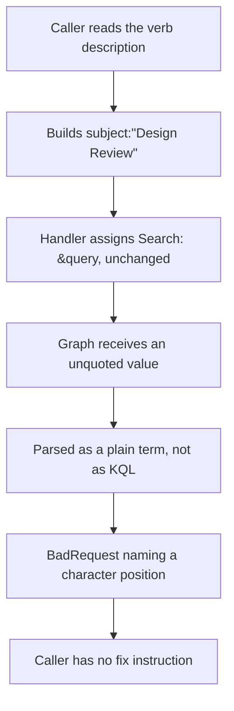
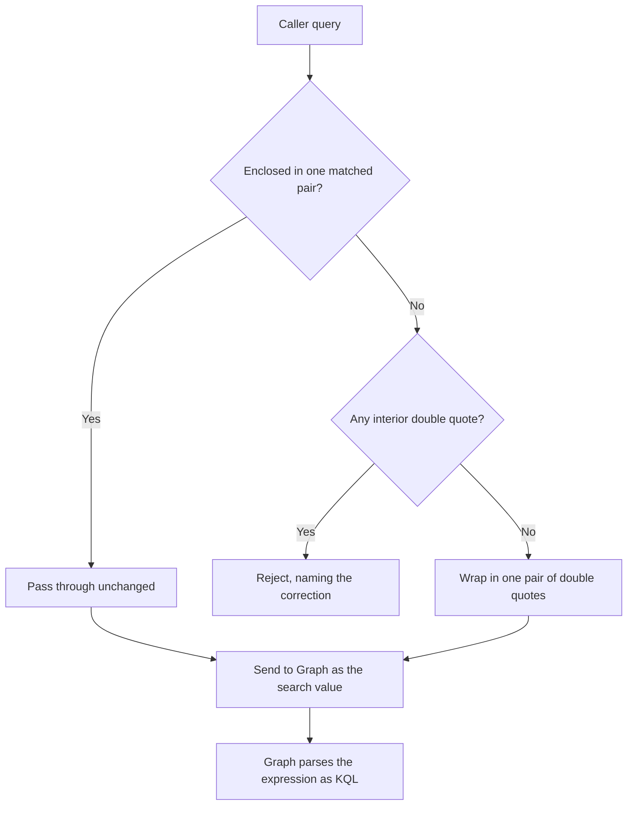
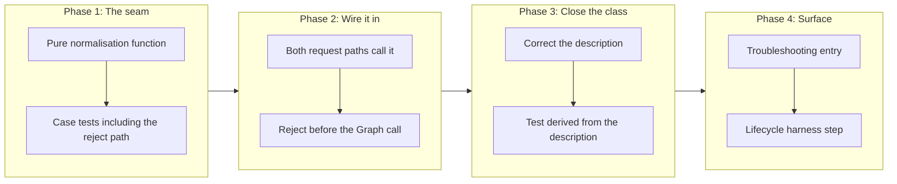

# Correct the KQL Quoting of `mail.search_messages`, and Make the Documented Syntax Executable

## Change Summary

Every property-restricted query documented by `mail.search_messages` fails. The verb
passes the caller's query string to Microsoft Graph without the enclosing double quotes
that Graph requires for a `$search` value, so Graph parses the string as a plain search
term and rejects the first colon it meets. Only bare full-text terms work today.

This change normalises the query before it reaches Graph, corrects the syntax reference
in the verb description, and adds a test that derives its cases from the description
itself, so a documented example that Graph would reject fails the build rather than
reaching a user.

## Motivation and Background

The verb description carries a 25-line syntax reference: nine property keywords, three
boolean operators, phrase matching, and date comparison. None of it works. A caller who
follows the documentation receives a Graph parse error naming a character position, which
does not name the cause and offers no fix.

The failure is worse than a plain defect because the server teaches the broken syntax. An
LLM reads the description, builds `subject:"Design Review"`, and gets a `BadRequest`. The
description is the authority the caller has, and the authority is wrong.

The defect was found while sampling a live mailbox for unrelated work. It has been present
since the verb was written, and no test catches it, because no test asserts what is sent to
Graph.

## Change Drivers

* Every documented property keyword of a registered verb is non-functional.
* The failure surfaces as a character-position parse error, which names neither the cause
  nor the correction.
* The verb description is the caller's only syntax reference, and it teaches a syntax the
  API rejects.
* Nothing in the test suite binds the documented examples to the behaviour, so the defect
  survived every run.

## Current State

`internal/tools/search_messages.go` assigns the caller's query straight to the Graph query
parameter, at line 204 for the folder-scoped path and line 224 for the mailbox-wide path:

```go
Search: &query,
```

Microsoft Graph requires a `$search` value on messages to be enclosed in double quotes.
Without them Graph treats the value as a plain term, in which a colon is not a legal
character.

### Measured behaviour

Four queries were sent through the running server against a live mailbox. The evidence is
observed, not inferred.

| Query value sent | Outcome |
|---|---|
| `subject:Sandvik` | `BadRequest`: character `':'` is not valid at position 7 |
| `"subject:Sandvik"` | Succeeds, returns subject matches |
| `"subject:Sandvik FinOps"` | Succeeds, a multi-word value needs no inner quotes |
| `"subject:"Sandvik FinOps""` | `BadRequest`: character `'"'` is not valid at position 24 |

Two conclusions follow, and the second is the one that shapes the fix.

**The expression needs exactly one enclosing pair of double quotes.** Position 7 in
`subject:Sandvik` is the colon, which confirms Graph never parsed the string as KQL.

**Inner quotes are rejected.** The description advertises `subject:"Design Review"` for
phrase matching. Wrapping that naively yields the fourth row above, which Graph also
rejects. So correcting the quoting alone would leave the documented phrase syntax broken,
and would convert one error into a different one.

A multi-word value is delimited by the enclosing quotes alone, as the third row shows.

### Current State Diagram



## Proposed Change

Introduce a pure normalisation function that converts a caller's query into a value Graph
accepts, and reject the queries it cannot convert with an error that names the correction.

The function is pure, has no Graph dependency, and lives in its own file, so its cases are
testable without a network or an account.

Three behaviours, in order:

1. **Already enclosed.** A query that begins and ends with a double quote and contains no
   interior double quote is passed through unchanged. This keeps working any caller who
   discovered the workaround.
2. **Not enclosed.** A query with no double quote at all is wrapped in one pair.
3. **Interior quote.** A query carrying a double quote anywhere other than as a matched
   enclosing pair is rejected before the call, with an error naming the correction:
   remove the inner quotes, because the enclosing pair already delimits a multi-word value.

The verb description is corrected in the same change. The phrase-matching guidance is
replaced with what Graph accepts, and the examples are rewritten so that every one of them
is a query the normalisation accepts and Graph parses.

### Proposed State Diagram



## Requirements

### Functional Requirements

1. The system **MUST** provide a pure function that normalises a search query into a value
   Microsoft Graph accepts as a `$search` value, with no dependency on Graph and no
   network call.
2. The function **MUST** wrap a query that carries no double quote in exactly one pair of
   double quotes.
3. The function **MUST** pass through unchanged a query that is already enclosed in one
   matched pair of double quotes and carries no interior double quote.
4. The function **MUST** reject a query carrying a double quote in any other position, and
   the error **MUST** name the correction, which is to remove the inner quotes because the
   enclosing pair delimits a multi-word value.
5. The system **MUST** apply the normalisation on both request paths of the verb, the
   folder-scoped path and the mailbox-wide path, so the two cannot diverge.
6. The system **MUST** reject an unconvertible query before the Graph call is made, so a
   caller receives the actionable error rather than a character-position parse error.
7. The verb description **MUST** state the phrase-matching rule that Graph enforces, which
   is that a multi-word value is delimited by the enclosing quotes and **MUST NOT** carry
   inner quotes.
8. Every syntax example in the verb description **MUST** be a query that the normalisation
   accepts.
9. The system **MUST** keep bare full-text terms working exactly as they work today, so no
   caller relying on the only currently functional path is broken.

### Non-Functional Requirements

1. The normalisation **MUST** be deterministic: the same input produces the same output on
   every run.
2. The normalisation **MUST NOT** add a third-party dependency.
3. The error raised for an unconvertible query **MUST** reach both the tool result and the
   log record, so a headless caller that cannot read an interactive surface still receives
   the fix instruction.
4. The change **MUST NOT** alter the result shape, the output tiers, or the annotations of
   the verb.

## Affected Components

* `internal/tools/search_messages.go`: both query parameter constructions, and the verb
  description.
* `internal/tools/search_messages_query.go` (new): the normalisation function.
* `internal/tools/search_messages_query_test.go` (new): its cases, including the cases
  derived from the description.
* `internal/tools/search_messages_test.go`: the existing tests, which assert pass-through.
* `docs/troubleshooting.md`: an entry for a rejected search query.
* `docs/prompts/mcp-tool-crud-test.md` and `scripts/crud-test.sh`: a lifecycle step that
  exercises a property-restricted search, per the standing harness-maintenance rule.

## Scope Boundaries

### In Scope

* The quoting defect on `mail.search_messages`, on both request paths.
* The syntax reference in the verb description, corrected to what Graph accepts.
* A test that derives its cases from the description rather than from a hand-written list.
* The troubleshooting entry and the lifecycle harness step.

### Out of Scope ("Here, But Not Further")

* **`calendar.search_events`.** It builds `$filter` parameters rather than a `$search`
  value, so it does not carry this defect. Confirmed by reading the handler.
* **Validating KQL semantics.** The change makes a syntactically valid expression reach
  Graph. Whether a property keyword is meaningful for messages stays Graph's judgment, and
  Graph's error stays the answer.
* **Adding a query length check.** The verb does not validate query length today, unlike
  `search_events`. That is a separate inconsistency and is not corrected here.
* **Changing the result shape, the output tiers, or the annotations.** None of them is
  implicated.
* **A structured query parameter set.** Replacing the free-text KQL string with typed
  parameters such as `subject` and `from` would remove the quoting question entirely. It is
  a larger surface change and belongs in its own change request.

## Alternative Approaches Considered

* **Document the workaround and change no code.** Tell callers to quote the expression
  themselves. Cheapest, and it leaves the server teaching a syntax that fails, which is the
  actual defect. It also leaves the inner-quote trap in place.
* **Wrap unconditionally, without rejecting inner quotes.** One line, and it converts the
  documented phrase syntax from one Graph error into a different Graph error. The fourth
  probe measures exactly this outcome.
* **Strip inner quotes silently and wrap.** Always produces a valid expression, and changes
  the caller's meaning without telling them. A silently rewritten query returns results the
  caller did not ask for, which is worse than a refusal.
* **Replace the free-text query with typed parameters.** Removes the class rather than the
  instance, and is a breaking surface change to a registered verb. Recorded as out of scope
  rather than rejected.

## Impact Assessment

### User Impact

Every documented property keyword starts working. A caller who followed the documentation
and received a parse error now receives results. A caller who carried inner quotes receives
an error naming the correction instead of a character position.

No caller is broken. Bare terms, the only path that works today, are unaffected, and a
caller who already applies the enclosing quotes by hand keeps working through the
pass-through rule.

### Technical Impact

No breaking change and no new dependency. One new file holding a pure function, two call
sites changed, and one description rewritten. The verb count, the gating, the annotations,
and the output tiers are all untouched.

The new testable seam is the point of the design: the quoting decision moves out of a
handler that cannot be unit-tested without Graph and into a function that can.

### Business Impact

Low cost and high value against a defect that makes a registered verb's documented surface
non-functional. It also removes a failure that reads as a Graph problem and is not, which
is the kind that consumes disproportionate diagnosis time.

## Implementation Approach

### Implementation Flow



**Phase 1** writes the function and its cases first, including the four measured probes as
fixtures, so the reject path exists before anything depends on it.

**Phase 2** wires both request paths through it. Both, in one change, because a fix applied
to one path is a defect waiting on the other.

**Phase 3** corrects the description and adds the test that derives its cases from it. This
is the part that closes the class rather than the instance: a future edit that adds an
example Graph would reject fails the build.

**Phase 4** adds the troubleshooting entry and the lifecycle harness step.

## Test Strategy

### Tests to Add

| Test File | Test Name | Description | Inputs | Expected Output |
|-----------|-----------|-------------|--------|-----------------|
| `internal/tools/search_messages_query_test.go` | `TestUnquotedQueryIsWrapped` | A query with no double quote gains one enclosing pair | `subject:Sandvik` | `"subject:Sandvik"` |
| `internal/tools/search_messages_query_test.go` | `TestMultiWordValueNeedsNoInnerQuotes` | A multi-word value is delimited by the enclosing pair | `subject:Sandvik FinOps` | `"subject:Sandvik FinOps"` |
| `internal/tools/search_messages_query_test.go` | `TestAlreadyEnclosedQueryPassesThrough` | An enclosed query is unchanged | `"subject:Sandvik"` | `"subject:Sandvik"` |
| `internal/tools/search_messages_query_test.go` | `TestInteriorQuoteIsRejected` | The documented phrase syntax is refused with a correction | `subject:"Design Review"` | Error naming the removal of the inner quotes |
| `internal/tools/search_messages_query_test.go` | `TestBareTermIsUnaffectedInMeaning` | The only currently working path keeps working | `quarterly report` | `"quarterly report"` |
| `internal/tools/search_messages_query_test.go` | `TestBooleanExpressionIsWrappedOnce` | A compound expression gains one pair, not one per clause | `subject:Sprint AND from:alice@contoso.com` | One enclosing pair |
| `internal/tools/search_messages_query_test.go` | `TestNormalisationIsIdempotent` | Normalising twice equals normalising once | Every case above | Identical output |
| `internal/tools/search_messages_query_test.go` | `TestEveryDocumentedExampleNormalises` | Each example parsed out of the verb description is accepted | The description text | No example rejected |
| `internal/tools/search_messages_test.go` | `TestBothRequestPathsNormalise` | The folder path and the mailbox path agree | One query, both paths | Identical search value |
| `internal/tools/search_messages_test.go` | `TestUnconvertibleQueryIsRejectedBeforeTheCall` | No Graph call is made for a refused query | A query with an interior quote | Error returned, no request issued |

### Tests to Modify

| Test File | Test Name | Current Behavior | New Behavior | Reason for Change |
|-----------|-----------|------------------|--------------|-------------------|
| `internal/tools/search_messages_test.go` | `TestSearchMessages_BasicQuery` | Exercises the handler without asserting the value sent to Graph | Asserts the normalised value | The unasserted wire form is why the defect survived |
| `internal/tools/search_messages_test.go` | `TestSearchMessages_WithFolderId` | Same, on the folder path | Asserts the normalised value on that path | Both paths must be pinned |
| `docs/prompts/mcp-tool-crud-test.md` | Lifecycle prompt steps | Search is exercised with a bare term only | A property-restricted search step | Only the bare-term path is covered today |

### Tests to Remove

| Test File | Test Name | Reason for Removal |
|-----------|-----------|-------------------|
| None | Nothing is superseded. The existing tests are extended rather than replaced |

## Acceptance Criteria

### AC-1: A documented property keyword returns results

```gherkin
Given the verb description documents the subject property keyword
When a caller searches with that keyword against a mailbox holding a matching message
Then the matching message is returned
  And no parse error is raised
```

### AC-2: The expression is enclosed exactly once

```gherkin
Given a query carrying no double quote
When the query is normalised
Then the result is the query enclosed in one pair of double quotes
  And no inner quote is added
```

### AC-3: A caller who already quotes is not broken

```gherkin
Given a query already enclosed in one matched pair of double quotes
When the query is normalised
Then the result is byte-identical to the input
```

### AC-4: An interior quote is refused with a correction

```gherkin
Given a query carrying a double quote inside the expression
When the verb is called
Then the call is rejected before any request is sent to Microsoft Graph
  And the error names the correction, which is to remove the inner quotes
```

### AC-5: Both request paths agree

```gherkin
Given the same query
When it is sent once with a folder identifier and once without
Then the value reaching Microsoft Graph is identical on both paths
```

### AC-6: Bare terms are unaffected

```gherkin
Given a bare full-text term, the only syntax that works before this change
When the verb is called with it
Then results are returned as they were before the change
```

### AC-7: The documentation cannot drift from the behaviour

```gherkin
Given the syntax examples written in the verb description
When the test suite runs
Then every example is extracted from the description and normalised
  And an example that the normalisation rejects fails the build
```

### AC-8: The failure is legible without an interactive surface

```gherkin
Given a rejected query
When the tool result and the log record are examined
Then both carry the correction, not only a character position
```

## Quality Standards Compliance

### Build & Compilation

- [ ] Code compiles/builds without errors
- [ ] No new compiler warnings introduced

### Linting & Code Style

- [ ] All linter checks pass with zero warnings/errors
- [ ] Code follows project coding conventions and style guides
- [ ] Any linter exceptions are documented with justification

### Test Execution

- [ ] All existing tests pass after implementation
- [ ] All new tests pass, including under the race detector
- [ ] Test coverage meets project requirements for changed code

### Documentation

- [ ] The new file carries a package-consistent docstring and an index annotation
- [ ] The verb description states the phrase rule Graph enforces
- [ ] The troubleshooting entry carries a stable anchor

### Code Review

- [ ] Changes submitted via pull request
- [ ] PR title follows Conventional Commits format
- [ ] Code review completed and approved
- [ ] Changes squash-merged to maintain linear history

### Verification Commands

```bash
# Full pipeline
make ci

# The normalisation cases, under the race detector
go test -race ./internal/tools/ -run 'SearchMessages|Normalis'

# Lifecycle harness, after rebuilding the binary the harness drives
make crud-test
```

Verification against the live API is part of acceptance and cannot be done by the test
suite, because the suite issues no Graph call. Re-run the four measured probes through the
built server and confirm the first row now succeeds through the documented syntax.

## Risks and Mitigation

### Risk 1: The compound-expression case is unverified

**Likelihood:** medium
**Impact:** medium
**Mitigation:** A query combining a multi-word value with a boolean operator, such as a
subject phrase joined to a sender clause, has not been measured. Inner quotes normally
resolve that ambiguity and Graph rejects them, so the delimiting behaviour is unknown.
Phase 1 **MUST** probe this case against the live API and record the observed result before
the description states a rule about it. The description **MUST NOT** document a compound
form that has not been observed to work.

### Risk 2: The correction breaks an undiscovered caller

**Likelihood:** low
**Impact:** low
**Mitigation:** Only two input classes work today, bare terms and hand-quoted expressions,
and both are preserved by rule 2 and rule 3 of the normalisation. Everything else currently
returns an error, so no working behaviour can regress.

### Risk 3: The description drifts again

**Likelihood:** medium
**Impact:** medium
**Mitigation:** This is the same class the project already documents for the harness prompt:
correcting named instances produces a clean run and does not close the class. The
description-derived test is the class-level check, because it takes its cases from the
authoritative text rather than from a list of known-bad examples.

### Risk 4: The rejection message is treated as the fix

**Likelihood:** low
**Impact:** medium
**Mitigation:** Refusing an inner-quote query is correct but is not the feature. The feature
is that the documented syntax works. AC-1 grades the working case, and AC-4 grades the
refusal, so a change that only adds the refusal does not satisfy the criteria.

## Dependencies

* No external dependency and no new third-party package.
* Behaviour confirmed against `github.com/microsoftgraph/msgraph-sdk-go v1.100.0` and
  `github.com/microsoft/kiota-abstractions-go v1.9.4`, as pinned in `go.mod`. The SDK
  passes the search value through verbatim, so the quoting is the caller's responsibility
  and not something a version change is expected to alter.
* Independent of all open change requests.

## Estimated Effort

| Phase | Effort |
|---|---|
| Phase 1, the normalisation function and its cases | 1 to 2 hours |
| Phase 2, both request paths and the pre-call rejection | 1 hour |
| Phase 3, the description and the derived test | 1 to 2 hours |
| Phase 4, troubleshooting entry and harness step | 1 hour |
| Total | 4 to 6 hours |

## Decision Outcome

Chosen approach: "normalise the query into one enclosing pair, refuse what cannot be
normalised, and bind the documentation to the behaviour with a derived test", because it is
the only option that fixes the defect the caller actually meets.

The defect is not the missing quotes alone. Wrapping unconditionally was measured and it
converts the documented phrase syntax into a different Graph error, so a one-line fix would
close the report and leave the documented surface broken. The description is the caller's
authority, so correcting the behaviour without correcting the description leaves the same
class open.

Silently stripping inner quotes was rejected because it changes the caller's meaning without
telling them, and a query that quietly searches for something else is worse than one that
refuses.

## Related Items

* Number `CR-0075` is deliberately skipped. It was allocated to a draft editable-region
  change request that was withdrawn, and two commits in history reference it. Reusing the
  number would make a search of the commit log return two unrelated topics.
* Existing verb this change corrects: `mail.search_messages`
* Verb confirmed unaffected: `calendar.search_events`, which builds `$filter` rather than
  `$search`
* Governance: the standing harness-maintenance rule, and the project's rule that an error
  carries a fix instruction rather than a diagnosis alone

## More Information

The defect was found while sampling a live mailbox for unrelated work, not by a test and not
by a report. That is the part worth recording. Ten tests cover this verb. They assert its
registration, its parameters, its handler construction, its clamping, and its empty-query
error. None asserts the value that reaches Graph, so all ten pass against a verb whose entire
documented syntax is non-functional.

The measurement discipline that found it is the one the project already writes down: the
hypothesis was that the enclosing quotes were missing, and it was tested by substitution at
the extreme rather than reasoned about. The fourth probe is the one that mattered, because it
falsified the obvious fix. Reasoning alone would have produced the one-line wrap and a
following report from a user who quoted a phrase.
