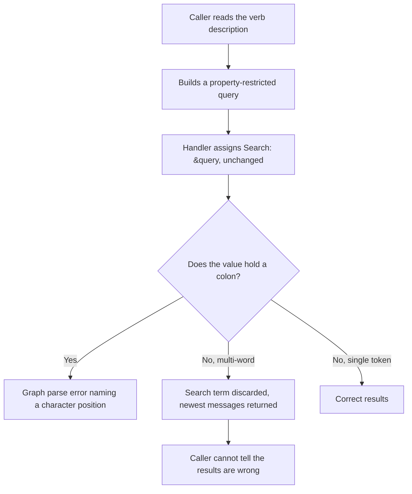
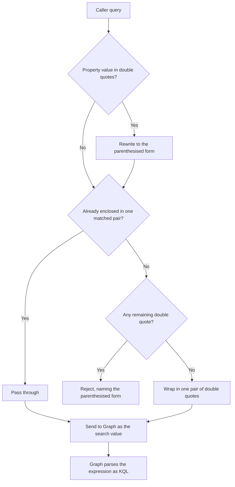
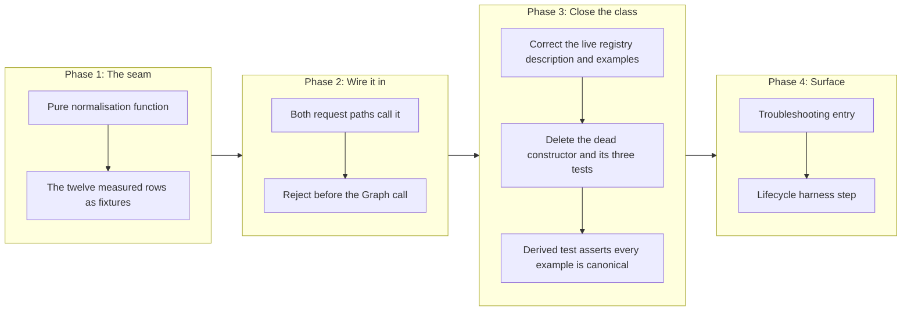

# Correct the KQL Quoting of `mail.search_messages`, and Make the Documented Syntax Executable

## Change Summary

Every property-restricted query documented by `mail.search_messages` fails, and one
undocumented case is worse than a failure: an unquoted multi-word query returns the
mailbox's most recent messages rather than matches, with no error. The verb passes the
caller's query to Microsoft Graph without the enclosing double quotes that Graph requires
for a `$search` value.

This change normalises the query before it reaches Graph, translates the documented phrase
syntax into the form Graph actually accepts, corrects the syntax reference in the verb
description, and adds a test deriving its cases from that description, so a documented
example Graph would reject fails the build.

The behaviour below is measured against a live mailbox, not inferred. The measurement
falsified two designs on the way, including this change request's own first draft.

## Motivation and Background

The caller-facing description of the registered verb `mail.search_messages` lives in
`buildSearchMessagesVerb` (`internal/server/mail_verbs.go`): three sentences plus two
structured `Examples`, per the project's Documentation Governance rule that the verb
registry owns per-tool reference. Every one of its three shipping example forms is the
double-quoted phrase form that measured row 6 shows Graph rejects: `subject:"meeting"` in
the `Description`, `subject:"quarterly review"` in the `Examples`, and `subject:"Design
Review"` in the `query` parameter description. The live surface is therefore not merely
thin, it is wrong: it teaches a syntax the API rejects.

An LLM reads the description, builds `subject:"Design Review"`, and receives a Graph parse
error naming a character position, which names neither the cause nor the fix.

A second, superseded copy of the syntax reference still ships in the source tree. The
unregistered top-level constructor `NewSearchMessagesTool` in
`internal/tools/search_messages.go` carries a 25-line reference documenting eight property
keywords, but it is wired into no registration path and is referenced only by its own
tests. A dead description that lies is the exact drift trap this change request exists to
close, and it already cost this change request one wrongly-targeted draft. It is deleted
here, along with the three tests that exist only to exercise it.

The silent case is the more serious one. A caller searching two bare words receives the
newest messages in the mailbox, presented as results. Nothing signals that the search term
was discarded.

The defect was found while sampling a live mailbox for unrelated work. It has been present
since the verb was written. Ten tests cover this verb and none catches the defect, because
none asserts the value that reaches Graph, and three of the ten in fact exercise the dead
constructor rather than the registered verb at all.

## Change Drivers

* Every example form the registered verb documents is the double-quoted phrase form Graph
  rejects, so the caller-facing surface is not merely incomplete, it is wrong.
* An unquoted multi-word query returns wrong results silently, which is the failure mode a
  caller cannot detect.
* Correcting the quoting alone would replace one error with another, because the documented
  phrase form is itself rejected by Graph.
* The verb description teaches the broken syntax, so the class stays open until the
  description is bound to the behaviour by a check that holds documented examples to their
  canonical form.
* A dead, unregistered copy of the syntax reference still ships in the source tree and must
  be removed, because a lying description that no check governs is the drift this change
  exists to close.

## Current State

`internal/tools/search_messages.go` assigns the caller's query straight to the Graph query
parameter, at line 204 for the folder-scoped path and line 224 for the mailbox-wide path:

```go
Search: &query,
```

Microsoft Graph requires a `$search` value on messages to be enclosed in double quotes.
Without them Graph parses the value as a plain term, in which a colon is not legal.

### Measured behaviour

Every row below was sent through the running server against a live mailbox and the outcome
observed. Nothing here is inferred from documentation.

| # | Value reaching Graph | Outcome |
|---|---|---|
| 1 | `subject:Contoso` | Error: character `':'` is not valid at position 7 |
| 2 | `"subject:Contoso"` | Accepted, correct matches |
| 3 | `Zzzqqxx` | Accepted, zero results, correct |
| 4 | `Zzzqqxx Wwwyyzz` | Accepted, returns the newest unrelated messages. **Silently wrong** |
| 5 | `"Zzzqqxx Wwwyyzz"` | Accepted, zero results, correct |
| 6 | `"subject:"Contoso Quarterly""` | Error: character `'"'` is not valid at position 24 |
| 7 | `"subject:'Contoso Teams'"` | Accepted, three results, no subject holds "Teams". Single quotes do not scope |
| 8 | `"subject:(Contoso Teams)"` | Accepted, zero results. **Parentheses scope** |
| 9 | `"subject:(Contoso Quarterly)"` | Accepted, three correct matches |
| 10 | `"subject:(daily Contoso)"` | Accepted, same three. A token AND, not an ordered phrase |
| 11 | `"subject:Contoso Teams"` | Accepted, three results, no subject holds "Teams" |
| 12 | `"subject:Contoso Zzzqqxx"` | Accepted, zero results |

Every property keyword was exercised wrapped, and all are accepted and filter correctly:
`from`, `to`, `cc`, `subject`, `body`, `participants`, `hasAttachments`, and `received`
with both `>=` and `<=`. Uppercase `AND`, uppercase `OR`, and parenthesised grouping all
work. Lowercase `and` is not treated as an operator, which confirms the case-sensitivity
claim the description already makes.

### What the rows establish

**The expression needs exactly one enclosing pair.** Position 7 in row 1 is the colon, so
Graph never parsed the string as KQL.

**An unquoted multi-word query is discarded, not rejected.** Rows 3, 4, and 5 isolate this.
A single nonsense token filters correctly. Two nonsense tokens return recent mail. The same
two tokens quoted return nothing. The quoting is what makes the term apply at all.

**Only the first token binds to a property.** Rows 11 and 12 read together: "Teams" appears
in the body of those messages and not in any subject, so the trailing token became a
free-text term ANDed over the whole message rather than a subject constraint.

**Parentheses are the working phrase form, and single quotes are not.** Row 8 returns
nothing because no subject holds both tokens, while row 7 leaks exactly as row 11 does. Row
10 shows the parenthesised form is an unordered AND of tokens within the property.

**The documented phrase form is rejected.** Row 6. So `subject:"Design Review"` cannot be
passed through, and it must not be repaired by deleting the quotes either, because row 11
shows that changes the meaning rather than preserving it.

### Current State Diagram



## Proposed Change

Introduce a pure normalisation function that converts a caller's query into a value Graph
accepts, preserving the caller's intent rather than merely producing something legal. The
function has no Graph dependency and lives in its own file, so its cases are testable
without a network or an account.

Four behaviours, in order:

1. **Translate a property phrase.** A property value delimited by double quotes, the form
   the description documents, is rewritten to the parenthesised form: `subject:"Design
   Review"` becomes `subject:(Design Review)`. Row 8 shows this scopes correctly and row 6
   shows the original does not survive.
2. **Pass through an enclosed query.** A query already enclosed in one matched pair with no
   remaining interior double quote is unchanged, so a caller who found the workaround keeps
   working.
3. **Wrap an unenclosed query.** A query with no double quote gains exactly one pair. This
   is what repairs the silent case in row 4.
4. **Reject what cannot be translated.** A double quote that does not delimit a property
   value is refused before the Graph call, with an error naming the correction and pointing
   at the parenthesised form.

Deleting inner quotes is deliberately not one of the behaviours. It always yields a legal
expression and it silently narrows the caller's constraint to the first token, which returns
results the caller did not ask for.

The verb description is corrected in the same change: the phrase rule becomes the
parenthesised form, the single-token binding rule is stated because callers cannot guess it,
and every example is one the normalisation accepts.

### Proposed State Diagram



## Requirements

### Functional Requirements

1. The system **MUST** provide a pure function that normalises a search query into a value
   Microsoft Graph accepts as a `$search` value, with no dependency on Graph and no network
   call.
2. The function **MUST** rewrite a property value delimited by double quotes into the
   parenthesised form, so that the phrase syntax the description documents scopes to the
   property it names.
3. The function **MUST NOT** repair a quoted property value by deleting its quotes, because
   an unparenthesised multi-word value binds only its first token to the property and turns
   the rest into free-text terms.
4. The function **MUST** wrap a query carrying no double quote in exactly one pair of double
   quotes, so that a multi-word query filters rather than being discarded.
5. The function **MUST** pass through unchanged a query already enclosed in one matched pair
   of double quotes and carrying no interior double quote.
6. The function **MUST** reject a double quote that neither delimits a property value nor
   forms the single enclosing pair permitted by requirement 5, and the error **MUST** name
   the parenthesised form as the correction. (The enclosing-pair check of requirement 5 is
   applied first, as the Proposed State Diagram shows, so an already-enclosed query such as
   `"subject:Contoso"` passes through rather than being rejected here.)
7. The system **MUST** apply the normalisation on both request paths of the verb, the
   folder-scoped path and the mailbox-wide path, so the two cannot diverge.
8. The system **MUST** reject an unconvertible query before the Graph call is made, so a
   caller receives the actionable error rather than a character-position parse error.
9. The verb registry description **MUST** state that a multi-word property value is written
   in parentheses, and **MUST NOT** document the double-quoted form that Graph rejects.
   Documentation is deliberately held to a stricter standard than caller input: requirement
   2 still accepts and translates the double-quoted form at runtime, but a documented
   example **MUST** already be in the canonical parenthesised form. The two are not in
   conflict, and a later reader **MUST** read the asymmetry as intentional.
10. The verb registry description **MUST** state that an unparenthesised multi-word property
    value binds only its first token, because a caller cannot infer that and the result
    looks plausible.
11. Every syntax example in the verb registry description **MUST** normalise without error,
    and normalising it **MUST** return it unchanged (`normalise(example)` equals
    `example`), so a documented example is required to already be in its canonical form. A
    re-introduced double-quoted example rewrites to the parenthesised form and therefore
    fails that equality, failing the build.
12. The system **MUST** keep a single bare term working exactly as it works today.

### Non-Functional Requirements

1. The normalisation **MUST** be deterministic: the same input produces the same output on
   every run.
2. The normalisation **MUST** be idempotent: normalising an already-normalised query
   **MUST** return it unchanged.
3. The normalisation **MUST NOT** add a third-party dependency.
4. The error raised for an unconvertible query **MUST** reach both the tool result and the
   log record, so a headless caller that cannot read an interactive surface still receives
   the fix instruction.
5. The change **MUST NOT** alter the result shape, the output tiers, or the annotations of
   the verb.

## Affected Components

* `internal/tools/search_messages.go`: the two query parameter constructions in the live
  handler `NewHandleSearchMessages` (the `Search: &query` sites on lines 204 and 224) are
  routed through the normalisation function, and the dead, unregistered
  `NewSearchMessagesTool` constructor is deleted from this file.
* `internal/server/mail_verbs.go` (`buildSearchMessagesVerb`): the caller-facing verb
  `Description`, its structured `Examples`, and the `query` parameter description an LLM
  reads via `system.help` are rewritten to the parenthesised phrase form and the first-token
  rule. Per Documentation Governance rule 1 the verb registry owns per-tool reference, so
  the description work of requirements 9 through 11 lands here, not on `NewSearchMessagesTool`.
* `internal/tools/search_messages_query.go` (new): the normalisation function.
* `internal/tools/search_messages_query_test.go` (new): its cases, including the twelve
  measured rows.
* `internal/server/mail_verbs_test.go` (new): the description-derived test. It lives in the
  `internal/server` package because the examples it reads are owned by `mail_verbs.go`, and
  `internal/server` imports `internal/tools` (not the reverse), so it can call the
  tools-package normalisation function while a tools-package test could not read the verb
  registry.
* `internal/tools/search_messages_test.go`: the two handler tests are extended to assert the
  normalised value on each path, and the three tests that exercise only the deleted
  `NewSearchMessagesTool` are removed.
* `docs/troubleshooting.md`: an entry for a rejected search query.
* `docs/prompts/mcp-tool-crud-test.md` and `scripts/crud-test.sh`: a lifecycle step that
  exercises a property-restricted search, per the standing harness-maintenance rule.

## Scope Boundaries

### In Scope

* The quoting defect on `mail.search_messages`, on both request paths.
* The translation of the documented phrase form into the form Graph accepts.
* The silent-discard case for an unquoted multi-word query.
* The syntax reference in the verb registry description (`buildSearchMessagesVerb`),
  corrected to the measured behaviour.
* Deletion of the dead, unregistered `NewSearchMessagesTool` constructor and the three tests
  that exercise only it.
* A test deriving its cases from the registry description and asserting each documented
  example is already canonical, rather than checking a hand-written list.
* The troubleshooting entry and the lifecycle harness step.

### Out of Scope ("Here, But Not Further")

* **`calendar.search_events`.** It builds `$filter` parameters rather than a `$search`
  value, so it does not carry this defect. Confirmed by reading the handler.
* **Ordered phrase matching.** Row 10 shows the parenthesised form is an unordered token
  AND. Whether Graph offers an ordered phrase operator was not established, and this change
  does not claim one.
* **Validating KQL semantics.** The change makes a syntactically valid expression reach
  Graph. Whether a property keyword is meaningful stays Graph's judgment.
* **Adding a query length check.** The verb does not validate query length, unlike
  `search_events`. A separate inconsistency, not corrected here.
* **Changing the result shape, the output tiers, or the annotations.**
* **A structured query parameter set.** Replacing the free-text KQL string with typed
  parameters would remove the quoting question entirely. It is a breaking surface change and
  belongs in its own change request.

## Alternative Approaches Considered

* **Document the workaround and change no code.** Leaves the server teaching a syntax that
  fails, and leaves the silent-discard case in place.
* **Wrap unconditionally, nothing else.** One line. Row 6 measures the outcome: the
  documented phrase form becomes a different Graph error. This was this change request's
  first draft and the measurement falsified it.
* **Wrap, and reject inner quotes with an instruction to remove them.** This was the second
  draft. Rows 7 and 11 falsified it: removing the quotes produces a legal query with a
  different meaning, so the instruction would have taught callers to narrow their own
  search without knowing it.
* **Strip inner quotes silently.** Same defect as above, without even telling the caller.
* **Replace the free-text query with typed parameters.** Removes the class rather than the
  instance, and is a breaking change. Recorded as out of scope rather than rejected.

## Impact Assessment

### User Impact

Every documented property keyword starts working. The documented phrase syntax starts
working, by translation rather than by refusal. A multi-word search stops returning the
newest messages dressed as matches.

No caller is broken. A single bare term and a hand-quoted expression, the two inputs that
work today, are preserved by requirements 5 and 12.

### Technical Impact

No breaking change and no new dependency. One new file holding a pure function, two call
sites changed, one description rewritten. The verb count, the gating, the annotations, and
the output tiers are untouched.

The new testable seam is the point of the design: the quoting decision moves out of a
handler that cannot be unit-tested without Graph and into a function that can.

### Business Impact

Low cost against a defect that makes a registered verb's entire documented surface
non-functional, and that returns wrong answers silently in one case. It also removes a
failure that reads as a Graph problem and is not.

## Implementation Approach

### Implementation Flow



**Phase 1** writes the function with the twelve measured rows as its fixtures, so the
translation and reject paths exist before anything depends on them.

**Phase 2** wires both request paths through it. Both in one change, because a fix applied
to one path is a defect waiting on the other.

**Phase 3** corrects the live caller-facing surface. It rewrites the `Description` and
`Examples` of `buildSearchMessagesVerb` in `internal/server/mail_verbs.go` to the
parenthesised phrase form and the first-token rule, deletes the dead `NewSearchMessagesTool`
from `internal/tools/search_messages.go` along with the three tests that exist only to
exercise it, and adds the description-derived test in the `internal/server` package where
the examples now live. This closes the class rather than the instance: the derived test
asserts every documented example is already canonical (`normalise(example)` equals
`example`), so a future edit documenting a rejected double-quoted form fails the build.

**Phase 4** adds the troubleshooting entry and the lifecycle harness step.

## Test Strategy

### Tests to Add

| Test File | Test Name | Description | Inputs | Expected Output |
|-----------|-----------|-------------|--------|-----------------|
| `internal/tools/search_messages_query_test.go` | `TestUnquotedQueryIsWrapped` | A query with no double quote gains one enclosing pair | `subject:Contoso` | `"subject:Contoso"` |
| `internal/tools/search_messages_query_test.go` | `TestMultiWordBareQueryIsWrapped` | The silent-discard case is repaired | `Zzzqqxx Wwwyyzz` | `"Zzzqqxx Wwwyyzz"` |
| `internal/tools/search_messages_query_test.go` | `TestQuotedPropertyValueBecomesParenthesised` | The documented phrase form is translated | `subject:"Design Review"` | `"subject:(Design Review)"` |
| `internal/tools/search_messages_query_test.go` | `TestQuotedPropertyValueIsNotUnquotedInPlace` | Translation never degrades to quote deletion | `subject:"Design Review"` | Output holds parentheses, not a bare two-token value |
| `internal/tools/search_messages_query_test.go` | `TestAlreadyEnclosedQueryPassesThrough` | An enclosed query is unchanged | `"subject:Contoso"` | Byte-identical |
| `internal/tools/search_messages_query_test.go` | `TestStrayQuoteIsRejected` | A quote that delimits nothing is refused | `subject:Design" Review` | Error naming the parenthesised form |
| `internal/tools/search_messages_query_test.go` | `TestBooleanExpressionIsWrappedOnce` | A compound expression gains one pair, not one per clause | `subject:Sprint AND from:alice@contoso.com` | One enclosing pair |
| `internal/tools/search_messages_query_test.go` | `TestNormalisationIsIdempotent` | Normalising twice equals normalising once | Every case above | Identical output |
| `internal/server/mail_verbs_test.go` | `TestDocumentedExamplesAreCanonical` | Each example in the verb registry `Description` and `Examples` normalises without error and is unchanged by normalisation | The `buildSearchMessagesVerb` description and examples | Every example accepted, and `normalise(example)` equals `example` for each |
| `internal/tools/search_messages_test.go` | `TestBothRequestPathsNormalise` | The folder path and the mailbox path agree | One query, both paths | Identical search value |
| `internal/tools/search_messages_test.go` | `TestUnconvertibleQueryIsRejectedBeforeTheCall` | No Graph call is made for a refused query | A query with a stray quote | Error returned, no request issued |

### Tests to Modify

| Test File | Test Name | Current Behavior | New Behavior | Reason for Change |
|-----------|-----------|------------------|--------------|-------------------|
| `internal/tools/search_messages_test.go` | `TestSearchMessages_BasicQuery` | Exercises the handler without asserting the value sent to Graph | Asserts the normalised value | The unasserted wire form is why the defect survived |
| `internal/tools/search_messages_test.go` | `TestSearchMessages_WithFolderId` | Same, on the folder path | Asserts the normalised value on that path | Both paths must be pinned |
| `docs/prompts/mcp-tool-crud-test.md` | Lifecycle prompt steps | Search is exercised with a bare term only | A property-restricted search step and a phrase step | Neither path is covered today |

### Tests to Remove

| Test File | Test Name | Reason for Removal |
|-----------|-----------|-------------------|
| `internal/tools/search_messages_test.go` | `TestSearchMessagesTool_Registration` | Exercises only the dead `NewSearchMessagesTool`, deleted in Phase 3 |
| `internal/tools/search_messages_test.go` | `TestSearchMessagesTool_HasParameters` | Exercises only the dead `NewSearchMessagesTool`, deleted in Phase 3 |
| `internal/tools/search_messages_test.go` | `TestSearchMessagesToolCanBeAddedToServer` | Registers only the dead `NewSearchMessagesTool` on a server; deleted with it |

## Acceptance Criteria

### AC-1: A documented property keyword returns results

```gherkin
Given the verb description documents the subject property keyword
When a caller searches with that keyword against a mailbox holding a matching message
Then the matching message is returned
  And no parse error is raised
```

### AC-2: A multi-word query filters instead of being discarded

```gherkin
Given a query of two words that appear in no message
When the verb is called with it
Then zero messages are returned
  And the newest messages in the mailbox are not returned
```

### AC-3: The documented phrase form scopes to its property

```gherkin
Given a query naming a property whose value is two words in double quotes
When the verb is called with it
Then only messages whose named property holds both words are returned
  And a message holding the second word elsewhere is not returned
```

### AC-4: A quoted property value is never repaired by deleting its quotes

```gherkin
Given a query naming a property whose value is two words in double quotes
When the query is normalised
Then the value is enclosed in parentheses
  And the normalised query is not one where only the first word binds to the property
```

### AC-5: A caller who already quotes is not broken

```gherkin
Given a query already enclosed in one matched pair of double quotes with no interior quote
When the query is normalised
Then the result is byte-identical to the input
```

### AC-6: A stray quote is refused with a correction

```gherkin
Given a query carrying a double quote that delimits no property value
When the verb is called
Then the call is rejected before any request is sent to Microsoft Graph
  And the error names the parenthesised form as the correction
```

### AC-7: Both request paths agree

```gherkin
Given the same query
When it is sent once with a folder identifier and once without
Then the value reaching Microsoft Graph is identical on both paths
```

### AC-8: A single bare term is unaffected

```gherkin
Given a single bare term, one of the two syntaxes that work before this change
When the verb is called with it
Then results are returned as they were before the change
```

### AC-9: A documented example must already be canonical

```gherkin
Given the syntax examples in the verb registry description and its Examples
When the test suite runs
Then every example is extracted and normalised without error
  And normalise(example) equals example for every one
  And a re-introduced double-quoted example, which normalisation rewrites to the parenthesised form, fails that equality and fails the build
```

### AC-10: The failure is legible without an interactive surface

```gherkin
Given a rejected query
When the tool result and the log record are examined
Then both carry the correction, not only a character position
```

### AC-11: The description teaches the corrected rules

```gherkin
Given the verb registry description after this change
When it is read
Then it states that a multi-word property value is written in parentheses
  And it states that an unparenthesised multi-word property value binds only its first token
  And it documents no double-quoted property phrase
```

### AC-12: Normalisation is deterministic and idempotent

```gherkin
Given any query
When it is normalised twice
Then both runs produce identical output
  And normalising an already-normalised query returns it unchanged
```

### AC-13: The change adds no dependency and preserves the response contract

```gherkin
Given the implemented change
When go.mod and the verb definition are inspected
Then no third-party dependency has been added
  And the result shape, the output tiers, and the annotations of the verb are unchanged
```

## Quality Standards Compliance

### Build & Compilation

- [x] Code compiles/builds without errors
- [x] No new compiler warnings introduced

### Linting & Code Style

- [x] All linter checks pass with zero warnings/errors
- [x] Code follows project coding conventions and style guides
- [x] Any linter exceptions are documented with justification

### Test Execution

- [x] All existing tests pass after implementation
- [x] All new tests pass, including under the race detector
- [x] Test coverage meets project requirements for changed code

### Documentation

- [x] The new file carries a package-consistent docstring and an index annotation
- [x] The verb description states the parenthesised phrase rule and the first-token rule
- [x] The troubleshooting entry carries a stable anchor

### Code Review

- [x] Changes submitted via pull request
- [x] PR title follows Conventional Commits format
- [ ] Code review completed and approved
- [ ] Changes squash-merged to maintain linear history

### Verification Commands

```bash
# Full pipeline
make ci

# The normalisation cases and the derived-example test, under the race detector
go test -race ./internal/tools/ ./internal/server/ -run 'SearchMessages|Normalis|DocumentedExamples'

# Lifecycle harness, after rebuilding the binary the harness drives
make crud-test
```

The test suite issues no Graph call, so it cannot confirm the live behaviour. Re-run the
twelve measured rows through the built server as part of acceptance, and confirm rows 1, 4,
6, 7, and 11 now produce the corrected outcome.

## Risks and Mitigation

### Risk 1: The translation mis-parses a query it should have passed through

**Likelihood:** medium
**Impact:** medium
**Mitigation:** Rewriting a caller's query is the one thing in this change that can produce
a wrong answer rather than an error. The translation is therefore narrow: it fires only on a
double quote immediately following a property keyword and its colon, and anything else is
refused rather than guessed. The idempotence requirement gives a cheap invariant to test
against, and the twelve measured rows are the fixture corpus.

### Risk 2: The parenthesised form is an unordered AND, not a phrase

**Likelihood:** high
**Impact:** low
**Mitigation:** Row 10 measured this: reversing the token order returns the same messages.
A caller expecting adjacency will not get it. The description **MUST** state that the
parenthesised form matches all the tokens in any order, so the limitation is disclosed
rather than discovered. Finding an ordered-phrase operator is out of scope.

### Risk 3: The description drifts again

**Likelihood:** medium
**Impact:** medium
**Mitigation:** This is the class the project already documents for the harness prompt:
correcting named instances produces a clean run without closing the class. The
description-derived test is the class-level check, because it takes its cases from the
authoritative text rather than from a list of known-bad examples.

### Risk 4: The correction breaks an undiscovered caller

**Likelihood:** low
**Impact:** low
**Mitigation:** Only two input classes work today, a single bare term and a hand-quoted
expression, and both are preserved. Everything else currently errors or returns wrong
results, so no correct behaviour can regress.

## Dependencies

* No external dependency and no new third-party package.
* Behaviour measured against `github.com/microsoftgraph/msgraph-sdk-go v1.100.0` and
  `github.com/microsoft/kiota-abstractions-go v1.9.4`, as pinned in `go.mod`. The SDK passes
  the search value through verbatim, so the quoting is the caller's responsibility and is
  not expected to change with an SDK version.
* Independent of all open change requests.

## Estimated Effort

| Phase | Effort |
|---|---|
| Phase 1, the normalisation function and its cases | 2 to 3 hours |
| Phase 2, both request paths and the pre-call rejection | 1 hour |
| Phase 3, the live description, the dead-code deletion, and the derived test | 2 hours |
| Phase 4, troubleshooting entry and harness step | 1 hour |
| Total | 6 to 7 hours |

## Decision Outcome

Chosen approach: "normalise the query into one enclosing pair, translate the documented
phrase form into the parenthesised form Graph accepts, refuse what cannot be translated, and
bind the documentation to the behaviour with a derived test", because it is the only option
measured to preserve the caller's intent.

Two simpler designs were tried and falsified by measurement rather than by argument. Wrapping
unconditionally turns the documented phrase form into a different Graph error. Wrapping and
telling the caller to delete their inner quotes produces a legal query that silently searches
for something narrower, because an unparenthesised multi-word value binds only its first
token.

That second falsification is the reason this change request exists in its current shape. The
instruction it would have shipped was plausible, would have passed review, and would have
taught every caller to narrow their own searches without knowing it.

## Related Items

* Number `CR-0075` is deliberately skipped. It was allocated to a draft editable-region
  change request that was withdrawn, and two commits in history reference it. Reusing the
  number would make a search of the commit log return two unrelated topics.
* Existing verb this change corrects: `mail.search_messages`
* Verb confirmed unaffected: `calendar.search_events`, which builds `$filter` rather than
  `$search`
* Governance: the standing harness-maintenance rule, and the project's rule that an error
  carries a fix instruction rather than a diagnosis alone

## More Information

Ten tests cover this verb. They assert its registration, its parameters, its handler
construction, its clamping, and its empty-query error. None asserts the value that reaches
Graph, so all ten pass against a verb whose entire documented syntax is non-functional and
which returns wrong answers for one common input. Three of the ten, moreover, exercise the
dead `NewSearchMessagesTool` rather than the registered verb, and are removed here rather
than repaired.

The measurement discipline the project already writes down is what produced every correction
here. The first hypothesis, missing enclosing quotes, was right but incomplete. The obvious
fix was falsified by substitution at the extreme. The second fix was falsified by a control
using a nonsense token, which separated "accepted and matched nothing" from "accepted and
silently matched everything recent". Reasoning alone would have shipped either one.

<!-- review-summary -->
## Review Summary (cr-reviewer, 2026-08-02)

Reviewed against the current codebase at branch `feat/cr-0073-surface-manifest`. The twelve
measured rows were treated as authoritative and left untouched, per instruction.

### Findings by category

- **Drift: 2**
- **Contradiction: 1**
- **Coverage (orphan requirements): 6**
- **Factual inaccuracy: 1**

Verified with no drift: the handler `NewHandleSearchMessages` and its two `Search: &query`
sites are live at lines 204 (folder-scoped) and 224 (mailbox-wide), exactly as cited; the
verb identity `mail.search_messages` (dot form) is correct (`internal/server/mail_verbs.go:287`);
`calendar.search_events` is confirmed unaffected (`internal/tools/search_events.go` builds an
OData `$filter` via `strings.Join(filters, " and ")` with client-side subject matching and no
`$search`); the length-validation asymmetry is real (`search_events` calls
`validate.ValidateStringLength(..., validate.MaxQueryLen)`, `search_messages` does not); the
"ten tests" claim is exact (`search_messages_test.go` has exactly ten); both tests named in
"Tests to Modify" exist and currently do not assert the wire value; no commit since the CR's
authoring date touches either handler; all three Mermaid diagrams parse under the project's
rules (every node label with a colon, comma, or `&` is double-quoted); CR-0075 is correctly
left skipped.

### Fixes applied

1. **Contradiction (Requirement 5 vs 6).** Requirement 6, as worded, rejected "a double
   quote that does not delimit a property value", which literally captured the single
   enclosing pair that Requirement 5 says to pass through (row 2, `"subject:Contoso"`).
   Rewrote Requirement 6 to exclude the enclosing pair and to state that the Requirement 5
   check runs first, matching the Proposed State Diagram (which was already correct).
2. **Drift (description location).** Reconciled Affected Components to name
   `internal/server/mail_verbs.go` (`buildSearchMessagesVerb`) as the caller-facing
   description, examples, and `query` parameter description, and annotated that
   `NewSearchMessagesTool` in `search_messages.go` is a superseded, unregistered constructor.
   Added the consequence that `TestEveryDocumentedExampleNormalises` must live in the
   `internal/server` package, not `internal/tools/`, given the import direction.
3. **Factual inaccuracy.** Motivation said "nine property keywords"; the syntax reference
   lists eight (`from`, `to`, `cc`, `subject`, `body`, `participants`, `hasAttachments`,
   `received`). Corrected to eight.

### Orphan requirements (now resolved by added acceptance criteria)

Every acceptance criterion traces to a requirement, and after this second pass every
requirement is graded:

- **Req 9** and **Req 10** (description content) — now graded by **AC-11**; the canonical-form
  prohibition of Req 9 is additionally enforced by **AC-9**.
- **NFR-1** (deterministic) and **NFR-2** (idempotent) — now graded by **AC-12**.
- **NFR-3** (no new dependency) and **NFR-5** (no shape, tier, or annotation change) — now
  graded by **AC-13**. NFR-4 remains graded by AC-10.

### Human decisions received and applied (both prior UNRESOLVED items closed)

- **UNRESOLVED-1 — RESOLVED: delete the dead code, fix the live surface.**
  `NewSearchMessagesTool` and the three tests that exercise only it
  (`TestSearchMessagesTool_Registration`, `TestSearchMessagesTool_HasParameters`,
  `TestSearchMessagesToolCanBeAddedToServer`) are deleted; `NewHandleSearchMessages` stays.
  The corrected KQL reference goes into `buildSearchMessagesVerb`'s `Description` and
  `Examples` in `internal/server/mail_verbs.go`, whose three shipping example forms
  (`subject:"meeting"`, `subject:"quarterly review"`, `subject:"Design Review"`) are all the
  double-quoted form row 6 shows Graph rejects. The derived-example test moves to the
  `internal/server` package. Motivation, Change Drivers, Affected Components, requirements 9
  through 11, Phase 3 (and its diagram), the Test Strategy tables (add, remove), and
  Estimated Effort were rewritten accordingly, and the "25-line reference" framing was
  corrected to the actual live description (three sentences plus two structured examples).
- **UNRESOLVED-2 — RESOLVED: assert documented examples are already canonical.** The
  class-closing check is now two assertions: every documented example normalises without
  error, and `normalise(example)` equals `example`. A re-introduced `subject:"..."` example
  rewrites to the parenthesised form, so the equality fails and the build fails. Requirement
  2 is unaffected, because normalisation still accepts and translates the double-quoted form
  for callers at runtime; documentation is deliberately held to the stricter standard, and
  requirement 9, AC-9, and the renamed test (`TestDocumentedExamplesAreCanonical`) now state
  that asymmetry explicitly.

No UNRESOLVED items remain.
<!-- /review-summary -->
