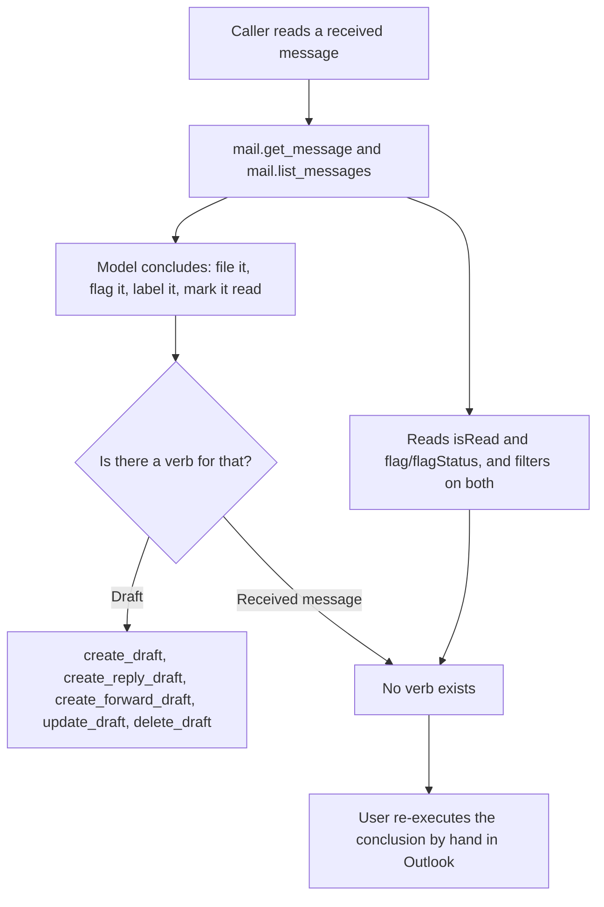
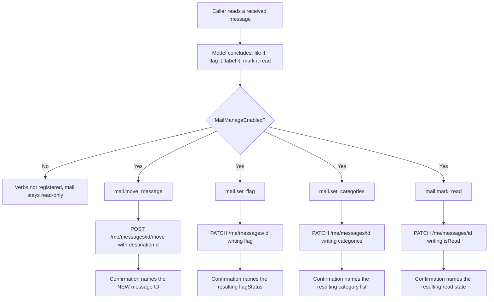
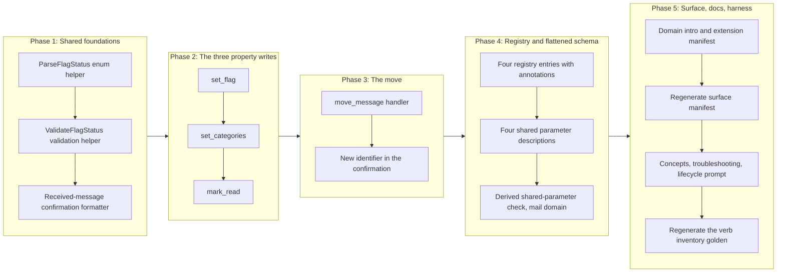

# Email Management Write Verbs for Received Mail

## Change Summary

The `mail` domain can read a received message and it can create, update, and delete a
draft. It cannot act on a message it has read. A caller that has just triaged an inbox
cannot file the message, flag it for follow-up, label it, or mark it read, so every
triage conclusion the model reaches has to be re-executed by hand in Outlook.

This change adds exactly four write verbs to the existing `mail` domain registry:
`move_message`, `set_flag`, `set_categories`, and `mark_read`. Each operates on an
existing message by ID. No new top-level MCP tool is added; the aggregate tool count
stays at four.

## Motivation and Background

The mail surface was built in two passes. CR-0043 added four read-only verbs. CR-0058
added conversation and attachment reads plus draft creation, update, and deletion, and
deferred the rest explicitly. Two of its deferred entries are this change request:

> * **Metadata management** — `mail_update_message`, `mail_list_categories`,
>   `mail_create_category`, `mail_delete_category`. Deferred to a future CR.
> * **Message move** — moving messages between folders (`/me/messages/{id}/move`).
>   Deferred.

The consequence of the deferral is an asymmetry that a caller experiences as a dead end.
`mail.list_messages` already filters on `isRead` and on `flag/flagStatus`
(`internal/tools/list_messages.go:466` and `:478`), and `internal/graph/mail_serialize.go:82`
already serialises the follow-up flag onto every message the server returns. The server
therefore reads and reasons about exactly the three properties it cannot write. A model
can answer "which messages are flagged and unread" and cannot then act on its own answer.

The OAuth cost of closing the gap is zero. `MAIL_MANAGE_ENABLED` already requests
`Mail.ReadWrite` (`internal/auth/auth.go:34` and `:56-65`), which is the scope all four
verbs need. No new consent prompt, no new scope, no new dependency.

The blast radius is small by construction. None of the four sends mail, and none deletes
a message. `Mail.Send` stays unrequested, which is the standing safety property CR-0058
established and this change preserves.

## Change Drivers

* The server reads `isRead` and `flag/flagStatus` and filters on both, and cannot write
  either, so its own read surface advertises a capability the write surface does not have.
* CR-0058 deferred message move and message metadata management by name, and the deferral
  has no remaining blocker: the scope, the gating flag, the middleware chain, and the
  registry are all already in place.
* Triage is the mail workflow the model is actually good at, and it currently terminates
  in a recommendation the user must re-execute by hand.
* The `move` action returns a message with a **new** identifier, so a caller that does not
  receive that identifier back has silently lost its handle on the message. This is a
  property the confirmation must carry, not an implementation detail.
* The four aggregate domain tools are a fixed surface, so growth belongs in a domain's
  verb registry rather than in a fifth tool.

## Current State

The mail domain registers thirteen verbs in three gated tiers, built in
`internal/server/mail_verbs.go` (`buildMailVerbs`, line 95):

| Tier | Gate | Verbs |
|---|---|---|
| Always-on | none | `help`, `list_folders`, `list_messages`, `get_message`, `search_messages` |
| Read, gated | `MailEnabled` | `get_conversation`, `list_attachments`, `get_attachment` |
| Write, gated | `MailManageEnabled` | `create_draft`, `create_reply_draft`, `create_forward_draft`, `update_draft`, `delete_draft` |

Every write verb in the third tier operates on a **draft**. Two of them,
`update_draft` and `delete_draft`, actively refuse anything else: `verifyIsDraft`
(`internal/tools/update_draft.go:218`) fetches the message and returns
`"message is not a draft: this tool only operates on messages with isDraft=true"`
when `isDraft` is false. There is no verb in the domain that writes to a received message.

Measured facts about the surface as it stands, all read from the repository at
`2cce019` rather than assumed:

* `site/src/generated/surface.json` records mail at `fullCount` 13, `defaultCount` 5;
  totals across the four domains are 42 full and 33 default.
* The composed `mail` tool description measures **2 209 characters** against the
  4 000-character bound asserted by `TestDescriptionLengthBounded`
  (`internal/tools/description_quality_test.go:147`). The figure is the length of the
  registered `mail` tool's `Description` under the maximal configuration, read from the
  registry rather than estimated. The measurement is deterministic: the description is
  composed from static registry strings, so it has no noise floor and repeats exactly.
* Cold-start schema for all four tools is 16 753 bytes, a 77% reduction against the
  74 000-byte pre-aggregation baseline, where the gate requires at least 60%
  (`internal/server/schema_size_test.go`, run at `2cce019`).
* `extension/manifest.json` currently enumerates every registered verb of every domain
  in its four tool descriptions, with no verb missing.

### Current State Diagram



## Proposed Change

Four verbs are added to the `MailManageEnabled` tier of `buildMailVerbs`. Each is a
single Graph call against an existing message, each returns an unconditional text
confirmation, and each lives in its own handler file under `internal/tools/`.

### Verb inventory

| Verb | Graph call | Required parameters | Confirmation carries |
|---|---|---|---|
| `move_message` | `POST /me/messages/{id}/move` with `destinationId` | `message_id`, `destination_folder_id` | subject, original ID, destination folder ID, **new message ID** |
| `set_flag` | `PATCH /me/messages/{id}` writing `flag` | `message_id`, `flag_status` | subject, message ID, resulting `flagStatus` |
| `set_categories` | `PATCH /me/messages/{id}` writing `categories` | `message_id`, `categories` | subject, message ID, **resulting category list** |
| `mark_read` | `PATCH /me/messages/{id}` writing `isRead` | `message_id`, `is_read` | subject, message ID, resulting read state |

The Graph SDK surfaces confirmed against the pinned `msgraph-sdk-go v1.100.0` in the
module cache, not from documentation:

* `users.ItemMessagesItemMoveRequestBuilder.Post` returns `models.Messageable`, and
  `ItemMessagesItemMovePostRequestBody.SetDestinationId` supplies the body. The returned
  message is the **new** one in the destination folder, which is why the new identifier
  is a confirmation requirement rather than a nicety.
* `models.Message.SetFlag(FollowupFlagable)` and `models.ParseFollowupFlagStatus`, whose
  accepted values are exactly `notFlagged`, `complete`, and `flagged`.
* `models.OutlookItem.SetCategories([]string)`, inherited by `Message`.
* `models.Message.SetIsRead(*bool)`.

### Annotation matrix

Each verb declares all four hints explicitly, per the project rule that a verb cannot be
registered without its own classification and that the aggregate is computed from the
registry (CR-0052, CR-0060, CR-0068).

| Verb | `readOnlyHint` | `destructiveHint` | `idempotentHint` | `openWorldHint` |
|---|---|---|---|---|
| `move_message` | `false` | `true` | `false` | `true` |
| `set_flag` | `false` | `false` | `true` | `true` |
| `set_categories` | `false` | `false` | `true` | `true` |
| `mark_read` | `false` | `false` | `true` | `true` |

Justification, hint by hint, because an unjustified hint is the defect CR-0068 exists to
prevent:

* **`readOnlyHint: false` for all four.** Each writes mailbox state.
* **`destructiveHint: true` for `move_message` only.** The move does not delete the
  message, but it does two things a non-destructive update does not. It removes the
  message from its source folder, which is a non-additive update, and it destroys the
  identifier the caller was holding: the old ID does not resolve after the move and is
  not recoverable from the response. A destination of Deleted Items is, at this layer,
  indistinguishable from a deletion. A client that gates destructive calls behind a
  confirmation prompt is right to prompt here.
* **`destructiveHint: false` for the other three.** Each replaces a property value in
  place, which is the same shape as `update_draft` and `update_event`, both classified
  `false` today. Nothing is removed and nothing becomes unaddressable.
* **`idempotentHint: false` for `move_message`.** A second call with the original
  `message_id` fails because that ID no longer resolves, and a second call with the new
  ID against the same destination is a different request than the first. The operation
  mints a new identifier on every successful call, so it cannot be idempotent.
* **`idempotentHint: true` for the other three.** Each is a state set, not a delta:
  repeating the same call leaves the same end state and returns the same confirmation.
* **`openWorldHint: true` for all four.** Every one calls Microsoft Graph.

The aggregate fold is unchanged by these values. Under `MailManageEnabled` the `mail`
tool already publishes `destructiveHint: true` and `idempotentHint: false` because
`delete_draft` and `create_draft` respectively force them, so the published
configuration-dependent table in `docs/concepts.md#tool-annotation-semantics` stays
correct as written. Under the default and `MailEnabled`-only configurations none of the
four verbs is registered, so `readOnlyHint: true` is preserved there.

### The flattened aggregate schema, and why two parameter names are reused deliberately

`aggregateSchemaOptions` (`internal/tools/dispatch_aggregate_schema.go:25`) publishes the
**union** of every registered verb's parameters on the domain tool, and merges duplicate
names with first-occurrence-wins for type, description, and enum. `list_messages` is
registered before any write verb, and it already declares:

* `flag_status`, string, enum `notFlagged | flagged | complete`, described as
  "Filter by follow-up flag status."
* `is_read`, boolean, described as "Filter by read/unread state. Omit to include both."

Those are exactly the name, type, and value space `set_flag` and `mark_read` need. Two
options exist and only one of them is honest.

Inventing `new_flag_status` and `new_is_read` would give each write verb its own
description in the flattened schema, at the cost of two names for one concept in one
domain, which is the ambiguity the project's own vocabulary rule exists to prevent.

Reusing `flag_status` and `is_read` keeps one concept to one name, and moves the problem
to the merged description: the flattened schema would tell an LLM that `flag_status` is a
filter, while `set_flag` requires it as the value to write. The description, not the name,
is what must change. This change therefore reuses the names and rewrites the shared
descriptions so each names both senses and the verbs they belong to, and adds a check that
derives its cases from the registry rather than from a list of known instances.

**The class already has two instances this change did not create.** The mail domain's
declarations were enumerated from `internal/server/mail_verbs.go` at `2cce019` rather than
assumed, and three parameters other than `account` are already declared by both a
read-only and a write verb of the domain:

| Parameter | Published description (first occurrence wins) | Write verbs that also declare it |
|---|---|---|
| `message_id` | `get_message`: "The unique identifier of the message to retrieve." | `create_reply_draft`, `create_forward_draft`, `update_draft`, `delete_draft` |
| `importance` | `list_messages`: "Filter by message importance." | `create_draft`, `update_draft` |
| `account` | `list_folders`: "Account label or UPN to use. Omit to auto-select the default account." | every write verb of every domain |

`message_id` and `importance` are the same defect as `flag_status` and `is_read`: the
published text describes only the read sense of a parameter a write verb consumes. A check
that derives its cases from the registry therefore fails on arrival unless those two are
rewritten as well, which is why this change rewrites **four** shared descriptions and not
two. Correcting only the two instances this change introduces is exactly the
instance-level remedy the project has already recorded as failing to close a class.

`account` is exempt and the exemption is stated in the requirement rather than left to the
check's author. It is the account-selection parameter, declared with identical text by
every verb of every domain, carries no read or write sense, and naming its fourteen
declaring write verbs would inflate the published schema for no gain.

The check is scoped to the `mail` domain. The same enumeration over
`internal/server/calendar_verbs.go` finds ten shared parameters (`account`, `calendar_id`,
`categories`, `end_datetime`, `event_id`, `importance`, `is_all_day`, `sensitivity`,
`show_as`, `start_datetime`), which would make the calendar description rewrites larger
than this entire change. Extending the check to every domain is recorded as follow-on work
rather than absorbed here.

`destination_folder_id` is deliberately **not** merged into the existing `folder_id`.
`folder_id` scopes a read to a folder; the move destination is a different concept in the
same domain, and conflating them in the flattened schema is exactly the confusion the
paragraph above is avoiding. `categories` is new to the mail domain and collides with
nothing, since the union is computed per domain.

### Proposed State Diagram



## Requirements

### Functional Requirements

1. The system **MUST** register exactly four new verbs in the `mail` domain verb registry,
   named `move_message`, `set_flag`, `set_categories`, and `mark_read`, and **MUST NOT**
   register any new top-level MCP tool; the registered tool count **MUST** remain four.
2. All four verbs **MUST** be registered only when `MailManageEnabled` is configured, and
   **MUST NOT** appear in the operation enum under the default or `MailEnabled`-only
   configurations.
3. `move_message` **MUST** require `message_id` and `destination_folder_id` and **MUST**
   issue `POST /me/messages/{id}/move` with the destination supplied as the request
   body's destination identifier.
4. The `move_message` confirmation **MUST** name the identifier of the message Graph
   returns from the move, alongside the original identifier and the destination folder
   identifier, because the move mints a new identifier that the caller cannot otherwise
   observe and the original identifier stops resolving.
5. `set_flag` **MUST** require `message_id` and `flag_status`, **MUST** restrict
   `flag_status` to `notFlagged`, `flagged`, and `complete`, and **MUST** write the
   follow-up flag property via `PATCH /me/messages/{id}`.
6. `set_categories` **MUST** require `message_id` and `categories`, **MUST** write the
   full categories array via `PATCH /me/messages/{id}`, replacing rather than appending
   to the existing set, and its confirmation **MUST** state the resulting category list.
7. `set_categories` **MUST** validate the supplied `categories` string with
   `validate.ValidateStringLength` against `validate.MaxCategoriesLen`, the same bound
   `create_event` (`internal/tools/create_event.go:219`) and `update_event`
   (`internal/tools/update_event.go:195`) already apply and the only two call sites of
   that bound at `2cce019`; no draft verb declares a `categories` parameter. It **MUST**
   split the value on commas with surrounding whitespace trimmed and empty entries
   dropped.
8. `set_categories` **MUST** treat an empty or whitespace-only `categories` value as an
   instruction to clear every category, and its confirmation **MUST** state that the
   message now carries no categories rather than printing an empty list.
9. `mark_read` **MUST** require `message_id` and a boolean `is_read`, and **MUST** write
   the read state via `PATCH /me/messages/{id}`.
10. Every one of the four verbs **MUST** validate `message_id` with
    `validate.ValidateResourceID` and **MUST** reject an invalid identifier before any
    Graph request is issued.
11. Every one of the four verbs **MUST NOT** reject a message on the basis of its draft
    state: they operate on received messages, and the `isDraft` guard that `update_draft`
    and `delete_draft` apply (`verifyIsDraft`, `internal/tools/update_draft.go:218`)
    **MUST NOT** be applied here.
12. Every one of the four verbs **MUST** return a text confirmation unconditionally and
    **MUST NOT** declare an `output` parameter, per the project's write-verb tiering rule.
13. Every confirmation **MUST** be constructed from the message Graph returns in the
    response, not from the request arguments, so a value the service coerced or rejected
    is visible to the caller rather than echoed back as if it had been applied.
14. Every one of the four verbs **MUST** declare all four annotation hints explicitly,
    with the values given in the annotation matrix above.
15. Every one of the four verbs **MUST** be wrapped by the write middleware chain
    (authentication, account resolution, observability, read-only guard, audit) under the
    identity `mail.<verb>`, so the audit record and the OpenTelemetry attributes carry the
    same `{domain}.{operation}` identity as every other verb.
16. For every parameter name declared by both a read-only verb and a write verb of the
    **`mail`** domain, excluding the account-selection parameter `account`, the
    description published on the aggregate tool **MUST** name at least one declaring write
    verb, so the flattened schema cannot describe a shared parameter in only its read
    sense. At `2cce019` this predicate selects exactly four parameters once this change
    lands: `flag_status` and `is_read`, newly shared by `set_flag` and `mark_read`, and
    `message_id` and `importance`, already shared before this change and already published
    in their read sense only. All four descriptions **MUST** be rewritten. `account` is
    exempt because it is declared with identical text by every verb of every domain and
    carries no read or write sense.
17. `move_message` **MUST** name its destination parameter `destination_folder_id` and
    **MUST NOT** reuse `folder_id`, which scopes a read rather than naming a destination.
18. Every one of the four verbs **MUST** carry a non-empty `Summary` of at most eighty
    characters, a non-empty `Description` stating its parameters and its annotation
    semantics, at least one `Examples` entry, and at least one `SeeDocs` reference that
    resolves to an existing heading in the embedded documentation bundle.
19. The `mail` domain introduction registered in `internal/server/server.go` **MUST** name
    the four new verbs in its enumeration of `MailManageEnabled`-gated write verbs.
20. The `mail` entry of `extension/manifest.json` **MUST** enumerate the four new verbs,
    and the manifest's `tools` array **MUST** remain exactly four entries, because no new
    top-level tool is added.
21. The generated surface manifest `site/src/generated/surface.json` **MUST** be
    regenerated with `make surface-manifest` and committed in the same change, so the
    published website states the surface that exists.
22. `docs/prompts/mcp-tool-crud-test.md` **MUST** gain a lifecycle step exercising each of
    the four verbs, and its gated skip instruction **MUST** be widened to cover the new
    steps, so a run with mail management disabled records them as skipped rather than
    failing.
23. The committed verb inventory golden in `internal/tools/dispatch_registry_test.go`
    **MUST** be regenerated to include the four new identities with their hints.
24. The mail gating table in `docs/concepts.md` **MUST** state that
    `MAIL_MANAGE_ENABLED` enables received-message management as well as draft management,
    because its current wording says "including draft management" and would otherwise be
    read as exhaustive.
25. The change **MUST NOT** alter the OAuth scope set requested in any configuration:
    `Mail.ReadWrite` already covers all four verbs and `Mail.Send` stays unrequested.
26. The change **MUST NOT** alter the default verb surface: the mail domain's
    `defaultCount` in the surface manifest **MUST** remain 5.

### Non-Functional Requirements

1. Each verb's handler **MUST** live in its own file under `internal/tools/`, named for
   the verb, mirroring the existing one-file-per-verb layout of the mail domain.
2. The composed `mail` tool description **MUST** stay below 4 000 characters. It measures
   2 209 characters at `2cce019` with thirteen verbs, so four additional inventory lines
   and a longer introduction leave substantial headroom, but the bound is asserted by
   `TestDescriptionLengthBounded` rather than assumed.
3. The cold-start schema reduction **MUST** stay at or above 60% against the documented
   74 000-byte baseline. It measures 77% at `2cce019` (16 753 bytes for four tools).
4. Every error raised by the four verbs **MUST** carry a fix instruction naming what to
   supply or correct, and **MUST** reach both the tool result and the log record, so a
   headless caller that cannot read an interactive surface still receives the correction.
5. The change **MUST NOT** add a third-party dependency.
6. Each verb **MUST** issue exactly one Graph request on the success path: one `POST` for
   `move_message` and one `PATCH` for each of the other three. Every one of the four verbs
   **MUST NOT** perform a read-modify-write round trip, since each writes a property whose
   new value is supplied in full by the caller.
7. Every handler **MUST** route its Graph call through `graph.RetryGraphCall` and
   `graph.WithTimeout`, and **MUST** redact Graph errors with the existing helpers, so
   retry, timeout, and redaction behaviour is identical to the verbs already registered.
8. `set_flag`, `set_categories`, and `mark_read` **MUST** be deterministic and idempotent:
   repeating a call with identical arguments **MUST** leave the same end state and produce
   the same confirmation text.

## Affected Components

* `internal/tools/move_message.go` (new): the `move_message` handler constructor.
* `internal/tools/set_flag.go` (new): the `set_flag` handler constructor.
* `internal/tools/set_categories.go` (new): the `set_categories` handler constructor,
  including the comma-splitting and clearing semantics of FR-7 and FR-8.
* `internal/tools/mark_read.go` (new): the `mark_read` handler constructor.
* `internal/tools/mail_write_confirmation.go` (new): the confirmation formatter shared by
  the four verbs. It is separate from `FormatDraftConfirmation`
  (`internal/tools/draft_helpers.go:84`) because the draft formatter closes with the
  draft-specific sentence about the Drafts folder, which is false for these verbs.
  The project convention names `internal/tools/text_format.go` as the home for text
  formatters; this file follows the existing exception rather than inventing one, since
  `FormatDraftConfirmation` already lives in `draft_helpers.go` alongside the verbs it
  serves, and the new formatter is used by exactly the four handlers of this change.
* `internal/validate/validate.go`: a `ValidateFlagStatus` helper alongside the existing
  `ValidateImportance` (line 137) and `ValidateContentType` (line 218), returning an error
  that names the three accepted values (Phase 1, NFR-4).
* `internal/server/mail_verbs.go`: four new `build*Verb` constructors appended to the
  `MailManageEnabled` block of `buildMailVerbs` (line 130), carrying `Summary`,
  `Description`, `Examples`, `SeeDocs`, `Annotations`, and `Schema` per FR-14 and FR-18;
  plus the four shared-parameter description rewrites required by FR-16, on
  `buildListMessagesVerb` (`flag_status`, `is_read`, `importance`) and
  `buildGetMessageVerb` (`message_id`).
* `internal/server/mail_verbs_test.go`: the registry-derived shared-parameter check and
  the destination-versus-scope assertion (Phase 4).
* `internal/server/server.go`: the `mail` domain `Intro` string (line 174), which
  enumerates the `MailManageEnabled` write verbs by name and is currently exhaustive.
* `internal/graph/enums.go`: a `ParseFlagStatus` helper alongside the existing
  `ParseImportance` and `ParseShowAs`, so the enum translation lives where the domain's
  other enum translations live.
* `extension/manifest.json`: the `mail` tool description (line 60). The `tools` array
  itself is **unchanged at four entries**.
* `site/src/generated/surface.json`: regenerated, not hand-edited. Mail moves from 13 to
  17 `fullCount`, `defaultCount` stays 5, totals move from 42 to 46 full with 33 default
  unchanged. Gate attribution is derived by probe
  (`internal/surface/build.go:58-70`), so no mapping needs maintaining.
* `docs/concepts.md`: the mail gating table row for `MAIL_MANAGE_ENABLED` (FR-24). The
  OAuth scopes table and the annotation-semantics table are **unchanged**, and the CR
  asserts that rather than leaving it to inference.
* `docs/troubleshooting.md`: an entry for a move whose destination folder identifier does
  not resolve, which is the one new failure mode a caller cannot diagnose from the Graph
  error alone.
* `docs/prompts/mcp-tool-crud-test.md`: four new lifecycle steps and the widened skip
  range (FR-22).
* `internal/tools/dispatch_registry_test.go`: the `verbInventoryGolden` list (FR-23).
* `internal/server/manifest_sync_test.go` (new): the derived check asserting each domain's
  `extension/manifest.json` description names every verb the registry registers for that
  domain (Phase 5).
* `scripts/crud-test.sh`: **no change required.** Its per-domain accounting keys on the
  MCP tool name `mcp__outlook-local-mcp__mail`, not on the operation verb
  (`scripts/crud-test.sh:115`), so additional mail verbs raise the existing `mcp_mail`
  counter. The script's own maintenance comment (`:100-109`) requires edits only for a new
  top-level domain, and this change adds none.
* `docs/bench/crud-runs.csv`: **no column change.** The 23-column header is per-domain,
  not per-verb; new runs will simply record a higher `mcp_mail` value and more turns.

## Scope Boundaries

### In Scope

* Exactly four new mail verbs: `move_message`, `set_flag`, `set_categories`, `mark_read`.
* Their handlers, registry entries, annotations, schemas, and unit tests.
* The shared write-confirmation formatter for received-message writes.
* The `ParseFlagStatus` enum helper.
* The four shared-parameter description rewrites required by the flattened aggregate
  schema (`flag_status`, `is_read`, and `importance` on `list_messages`, and `message_id`
  on `get_message`), and the registry-derived check, scoped to the `mail` domain, that
  closes that class there. Two of the four are pre-existing instances the check surfaces;
  they are in scope because a check that derives its cases from the registry fails on
  arrival without them, and correcting only the instances this change introduces is the
  instance-level remedy the project has already recorded as failing to close a class.
* The domain introduction, the extension manifest mail description, and the regenerated
  surface manifest.
* A derived check asserting the extension manifest's per-domain descriptions name every
  registered verb of that domain. The manifest is in full sync at `2cce019` (verified by
  comparing every domain's description against the generated surface manifest), so the
  check passes on arrival and closes a drift class that nothing currently governs.
* The concepts gating row, one troubleshooting entry, and the lifecycle harness steps.

### Out of Scope ("Here, But Not Further")

* **Deleting a received message.** `DELETE /me/messages/{id}` is a genuinely destructive
  operation on mail the user received, and it belongs in its own change request with its
  own confirmation design. Moving to Deleted Items via `move_message` is the reversible
  path this change offers instead.
* **Sending, replying, or forwarding.** `Mail.Send` stays unrequested. The draft-centric
  safety property CR-0058 established is preserved without qualification.
* **Category management.** Creating, listing, and deleting the mailbox's master category
  list (`/me/outlook/masterCategories`) is a separate resource. `set_categories` writes
  the categories on one message and does not create master categories.
* **Folder CRUD.** Creating, renaming, or deleting mail folders stays deferred, as
  CR-0058 left it. `move_message` requires a destination folder that already exists.
* **Batch or bulk operations.** Each verb acts on one message. A caller that wants to file
  twenty messages issues twenty calls, which keeps the audit record one row per action.
* **A `folder` name-to-ID resolution convenience.** `destination_folder_id` takes an
  identifier, as `folder_id` does today; `list_folders` is the way to obtain one.
  Accepting well-known names is a separate ergonomic change across every folder parameter.
* **Undo or move-back.** The confirmation carries the new identifier, which is what a
  caller needs to move the message back. The server stores no move history.
* **`importance` and `inferenceClassification` writes.** Both are single-property PATCH
  writes of the same shape and would be natural companions, and both are excluded so the
  scope stays exactly the four verbs named.
* **The stale scope sentence in `extension/manifest.json`.** Its `long_description`
  (line 7) ends "Delegated permissions only: Calendars.ReadWrite, Mail.Read, User.Read",
  which has been wrong since CR-0058 introduced `Mail.ReadWrite`. It is recorded here as a
  discovered pre-existing defect so it is not silently absorbed into this change, and it
  is not corrected by it.
* **Changing the four-tool aggregate surface, the output tiers, or the gating model.**

## Alternative Approaches Considered

* **One `update_message` verb taking optional `flag_status`, `categories`, and `is_read`.**
  Fewer verbs, and it is what CR-0058 named in its deferral. Rejected: a single verb
  cannot carry one honest annotation classification, because the move is non-idempotent
  and the property writes are idempotent, and it cannot state one required-parameter list
  in the description an LLM reads. The `help` output would have to explain which
  combinations are legal, which is the ambiguity separate verbs remove for free.
* **Folding the move into `update_message` as well.** Rejected more firmly: the move is a
  different Graph operation with a different HTTP verb, a different failure mode, and a
  return value the other writes do not have.
* **Naming the write parameters `new_flag_status` and `new_is_read` to avoid the merged
  description.** Rejected: two names for one concept inside one domain, to work around a
  description that can simply be written correctly. See the flattened-schema section.
* **Adding a read-modify-write round trip so the confirmation can show the previous
  value.** Rejected: it doubles the Graph calls and the latency for every write, and the
  previous value is available to a caller that read the message first, which any triage
  workflow already did.
* **Deferring `move_message` and shipping the three PATCH verbs only.** Rejected: filing
  is the triage action users most want and the one this change was requested for, and it
  is the only one of the four with a non-obvious contract worth specifying carefully.

## Impact Assessment

### User Impact

A user who has enabled `MAIL_MANAGE_ENABLED` gains the ability to have the model act on
its own triage conclusions: file a message, flag it, label it, mark it read. Nothing
changes for a user who has not enabled it, and nothing changes about sending.

The one behaviour a user must understand is that a moved message has a new identifier.
The confirmation states it, and the verb description states it, so it is disclosed rather
than discovered.

### Technical Impact

No breaking change, no schema migration, no new dependency, and no new OAuth scope. The
default configuration's published tool surface is byte-identical, because all four verbs
are gated.

Under `MailManageEnabled` the published `mail` tool grows by four operation-enum entries,
four inventory lines in the description, and exactly two new flattened parameters,
`destination_folder_id` and `categories`. `flag_status` and `is_read` add no entry,
because they merge into the declarations `list_messages` already publishes, and
`message_id` and `account` are already published. Both measured gates keep large margins:
description length 2 209 of 4 000 characters, cold-start schema 16 753 bytes against a
ceiling of roughly 29 600.

The one place this change touches existing behaviour is four shared parameter
descriptions: `flag_status`, `is_read`, and `importance` on `list_messages`, and
`message_id` on `get_message`, each rewritten to cover both senses. No filter semantics
change and no parameter is renamed; only the text an LLM reads. Two of the four,
`importance` and `message_id`, were already published in their read sense only before this
change, and are corrected here because the registry-derived check of FR-16 selects them.

### Business Impact

Low cost against the mail gap CR-0058 named and deferred. The work is four handlers of
the same shape as handlers that already exist, and the risk concentrates in one verb
(`move_message`) whose contract this document pins.

## Implementation Approach

### Implementation Flow



### Phase 1: Shared foundations

Build the three pieces both later phases depend on, so no handler invents its own.

1. Add `ParseFlagStatus(s string) models.FollowupFlagStatus` to `internal/graph/enums.go`,
   mirroring `ParseImportance` (`internal/graph/enums.go:38`). Accept exactly
   `notFlagged`, `flagged`, and `complete`, the three values the pinned SDK's
   `models.FollowupFlagStatus` defines. The parser **MUST NOT** return an error, matching
   the existing helpers' shape, and **MUST** default an unrecognised value to
   `NOTFLAGGED_FOLLOWUPFLAGSTATUS`. Because that default *clears* a flag rather than
   leaving it unchanged, `validate.ValidateFlagStatus` **MUST** be called before the
   parser on every path, and the verb's schema **MUST** carry the three-value enum, so an
   unrecognised value is refused before it can reach the parser at all. The doc comment
   states the default explicitly for the same reason.
2. Add a `validate.ValidateFlagStatus` helper alongside the existing
   `ValidateImportance` (`internal/validate/validate.go:137`) and `ValidateContentType`
   (`:218`), returning an error that names the three accepted values (NFR-4).
3. Add `internal/tools/mail_write_confirmation.go` with a formatter that renders the
   action, the subject (falling back to `(No subject)`), the message identifier, the
   changed field and its resulting value, and an optional extra line for the consequence
   a caller cannot otherwise see. It follows the established shape used by
   `FormatDraftConfirmation` and `FormatWriteConfirmation`, without the Drafts sentence.

**Affected components:** `internal/graph/enums.go`, `internal/validate/validate.go`,
`internal/tools/mail_write_confirmation.go` (new), and their test files.

### Phase 2: The three property writes

Each of the three is one file, one handler constructor, one `PATCH`, and one confirmation.
They are built together because they share a shape and must not diverge.

1. `internal/tools/set_flag.go`: `NewHandleSetFlag(retryCfg, timeout)`. Resolve the Graph
   client, require and validate `message_id`, require and validate `flag_status`, build a
   `models.Message` carrying only a `models.FollowupFlag` with the parsed status, `PATCH`,
   and format the confirmation from the returned message's flag status (FR-13).
2. `internal/tools/set_categories.go`: `NewHandleSetCategories(retryCfg, timeout)`.
   Require `categories`, apply `validate.ValidateStringLength` against
   `validate.MaxCategoriesLen`, split on commas with trimming and empty-entry removal,
   call `SetCategories` with the resulting slice (an empty slice when the input was empty
   or whitespace-only, per FR-8), `PATCH`, and render the resulting list from the response,
   or the explicit no-categories sentence.
3. `internal/tools/mark_read.go`: `NewHandleMarkRead(retryCfg, timeout)`. Require a
   boolean `is_read`, reject a missing or non-boolean value with a message naming the
   parameter, `SetIsRead`, `PATCH`, and confirm the resulting state from the response.
4. None of the three fetches the message first. There is no `verifyIsDraft` call and no
   read-modify-write (FR-11, NFR-6).
5. Every Graph call goes through `graph.RetryGraphCall` inside `graph.WithTimeout`, with
   `graph.IsTimeoutError`, `graph.TimeoutErrorMessage`, and `graph.RedactGraphError`
   handled exactly as `NewHandleUpdateDraft` handles them (NFR-7).

**Affected components:** `internal/tools/set_flag.go`, `internal/tools/set_categories.go`,
`internal/tools/mark_read.go` (all new), and their test files.

### Phase 3: The move

1. `internal/tools/move_message.go`: `NewHandleMoveMessage(retryCfg, timeout)`. Require
   and validate both `message_id` and `destination_folder_id`, build
   `users.NewItemMessagesItemMovePostRequestBody()`, call `SetDestinationId`, and `POST`
   via `client.Me().Messages().ByMessageId(id).Move().Post(...)`.
2. Read the identifier and the subject from the returned `models.Messageable`, which is
   the message in its new folder, and render a confirmation naming the original
   identifier, the destination folder identifier, and the new identifier, with an explicit
   sentence stating that the original identifier no longer resolves (FR-4, NFR-4).
3. A move whose destination does not resolve returns a redacted Graph error accompanied by
   the instruction to obtain a destination identifier from `list_folders` (NFR-4).

**Affected components:** `internal/tools/move_message.go` (new) and its test file, plus
`internal/tools/mail_write_verbs_test.go` (new), which holds the assertions that span all
four handlers and can only be written once the fourth handler exists.

### Phase 4: Registry entries and the flattened schema

1. Add four `build*Verb` constructors to `internal/server/mail_verbs.go` and append them
   to the `MailManageEnabled` block of `buildMailVerbs`, each wrapped with `wrapWrite`
   under the identity `mail.<verb>` and the audit operation `write` (FR-15).
2. Populate `Summary`, `Description`, `Examples`, and `SeeDocs` for each. The description
   states the parameters, the gating requirement, and the verb's annotation semantics, per
   the project rule that per-verb reference is owned by the registry rather than by
   markdown. `SeeDocs` points at `concepts#mail-gating`, and at
   `concepts#tool-annotation-semantics` for `move_message`, whose destructive and
   non-idempotent classification is the one a caller most needs explained.
3. Declare all four annotation hints explicitly on each verb, per the matrix (FR-14).
4. Declare each verb's `Schema`, marking `message_id` and the verb's value parameter as
   required, and declaring **no** `output` parameter (FR-12).
5. Rewrite four shared parameter descriptions so each names both its read sense and at
   least one write verb that consumes it, since first-occurrence-wins merging publishes
   those strings on the aggregate tool (FR-16). Three are on `buildListMessagesVerb`
   (`flag_status`, `is_read`, `importance`) and one is on `buildGetMessageVerb`
   (`message_id`). `importance` and `message_id` are pre-existing instances of the same
   defect and are corrected here because the derived check in step 6 selects them; the
   filter semantics of `list_messages` are unchanged, and only the published text moves.
6. Add the derived check in `internal/server/mail_verbs_test.go`: build the `mail` domain's
   verb set under the maximal configuration, collect every parameter name declared by more
   than one verb, partition the declaring verbs by their `readOnlyHint`, and assert that
   where both partitions are non-empty the published description names at least one
   declaring write verb. The check takes its cases from the registry, so a future shared
   mail parameter is covered without anyone adding it to a list. `account` is the single
   exempted name, exempted in the check with the reason stated inline: it is declared with
   identical text by every verb of every domain and carries no read or write sense.
   The check is scoped to the `mail` domain; extending it to `calendar`, where the same
   enumeration finds ten shared parameters, is follow-on work and is out of scope here.

**Affected components:** `internal/server/mail_verbs.go`,
`internal/server/mail_verbs_test.go`.

### Phase 5: Surface, documentation, and harness

1. Extend the `mail` domain `Intro` in `internal/server/server.go` to name the four new
   verbs among the `MailManageEnabled`-gated writes (FR-19).
2. Extend the `mail` tool description in `extension/manifest.json` with the four verbs and
   their gating suffix, leaving the `tools` array at four entries (FR-20).
3. Add the derived manifest check asserting each domain's manifest description names every
   verb the registry registers for that domain, so this class of drift fails the build
   rather than reaching a published extension.
4. Run `make surface-manifest` and commit `site/src/generated/surface.json` (FR-21).
   `make ci` fails on a stale manifest via `surface-check`, and `make test` fails via
   `TestCommittedManifestMatchesRecord`, so this step is not optional.
5. Update the `MAIL_MANAGE_ENABLED` row of the mail gating table in `docs/concepts.md`
   (FR-24), and add the troubleshooting entry for an unresolvable destination folder with
   a stable anchor.
6. Add four lifecycle steps to `docs/prompts/mcp-tool-crud-test.md`, and widen the gated
   skip instruction that currently reads "skip Steps 31 through 35" to cover them (FR-22).
7. Regenerate `verbInventoryGolden` in `internal/tools/dispatch_registry_test.go` from the
   failing test's own output and review the delta, which must be exactly four added lines
   (FR-23).

**Affected components:** `internal/server/server.go`, `extension/manifest.json`,
`site/src/generated/surface.json`, `docs/concepts.md`, `docs/troubleshooting.md`,
`docs/prompts/mcp-tool-crud-test.md`, `internal/tools/dispatch_registry_test.go`,
`internal/server/manifest_sync_test.go` (new).

## Test Strategy

Handler tests follow the established mail write-verb pattern: an `httptest` server
returning canned Graph JSON behind a real SDK client built by `newTestGraphClient`
(`internal/tools/test_helpers_test.go:30`), the client injected with
`auth.WithGraphClient`, the handler constructor called directly, and assertions made as
substring checks on the returned text and on `result.IsError`. No test issues a network
call.

### Tests to Add

| Test File | Test Name | Description | Inputs | Expected Output |
|-----------|-----------|-------------|--------|-----------------|
| `internal/tools/move_message_test.go` | `TestMoveMessage_Success` | The move posts the destination and confirms | `message_id`, `destination_folder_id` | Confirmation naming subject and destination; one POST observed |
| `internal/tools/move_message_test.go` | `TestMoveMessage_ConfirmationNamesNewID` | The new identifier from the response is surfaced | Canned response with an ID differing from the request | Confirmation contains the new ID, the original ID, and the statement that the original no longer resolves |
| `internal/tools/move_message_test.go` | `TestMoveMessage_RequiresDestination` | A missing destination is refused before the call | `message_id` only | Error naming `destination_folder_id`; no request issued |
| `internal/tools/move_message_test.go` | `TestMoveMessage_InvalidMessageIDRejectedBeforeCall` | Identifier validation precedes Graph | Malformed `message_id` | Error returned, no request issued |
| `internal/tools/mail_write_verbs_test.go` | `TestInvalidMessageIDRejectedByEveryWriteVerb` | Identifier validation applies to all four, not only the one it was written for | Malformed `message_id` against each of the four handlers | Every call errors, and no request reaches the test server |
| `internal/tools/mail_write_verbs_test.go` | `TestNoDraftGuardOnReceivedMessageWrites` | None of the four applies the draft guard | Canned message with `isDraft` false, each of the four handlers | Every call succeeds, and none returns the not-a-draft refusal |
| `internal/tools/mail_write_verbs_test.go` | `TestWriteVerbsHonourTimeoutAndRedaction` | Timeout reporting and Graph error redaction are the shared behaviour, not per-handler improvisation | A test server that hangs, and one that returns a Graph error carrying a token-like string | Timeout message names the configured seconds; the error text is redacted and carries a fix instruction |
| `internal/tools/move_message_test.go` | `TestMoveMessage_UnresolvableDestinationCarriesFix` | The error names the correction on both channels | Canned Graph 404 for the destination, with the handler's logger bound to a capture buffer | Tool result text names `list_folders` as the way to obtain a destination ID, and the captured log record carries the same correction (AC-24) |
| `internal/tools/set_flag_test.go` | `TestSetFlag_Success` | The follow-up flag is written | `flag_status` of `flagged` | PATCH body carries the flag; confirmation states `flagged` |
| `internal/tools/set_flag_test.go` | `TestSetFlag_RejectsUnknownStatus` | Only the three statuses are accepted | `flag_status` of `urgent` | Error naming `notFlagged`, `flagged`, `complete`; no request issued |
| `internal/tools/set_flag_test.go` | `TestSetFlag_AcceptsNonDraftMessage` | No draft guard is applied | Canned message with `isDraft` false | Success, not the "not a draft" refusal |
| `internal/tools/set_categories_test.go` | `TestSetCategories_ReplacesFullSet` | The array is replaced, not appended | `categories` of `Project, Urgent` | PATCH body carries exactly two entries |
| `internal/tools/set_categories_test.go` | `TestSetCategories_ConfirmationListsResult` | The resulting list is stated | Response listing `Project` and `Urgent` | Confirmation names both, read from the response |
| `internal/tools/set_categories_test.go` | `TestSetCategories_EmptyValueClears` | Empty input clears every category | `categories` of `"   "` | PATCH body carries an empty array; confirmation states no categories |
| `internal/tools/set_categories_test.go` | `TestSetCategories_OverLengthRejected` | The shared length bound applies | A string longer than `MaxCategoriesLen` | Error naming `categories`; no request issued |
| `internal/tools/mark_read_test.go` | `TestMarkRead_SetsRead` | The read state is written | `is_read` true | PATCH body sets `isRead` true; confirmation states read |
| `internal/tools/mark_read_test.go` | `TestMarkRead_SetsUnread` | The inverse is written | `is_read` false | PATCH body sets `isRead` false; confirmation states unread |
| `internal/tools/mark_read_test.go` | `TestMarkRead_RequiresIsRead` | The boolean is required | `message_id` only | Error naming `is_read`; no request issued |
| `internal/tools/mail_write_confirmation_test.go` | `TestFormatMailWriteConfirmationFields` | The shared formatter renders every required field and the no-subject fallback | Action, subject (present and empty), message ID, changed field and value, optional consequence line | The rendered text names the action, the subject or `(No subject)`, the ID, and the resulting value |
| `internal/tools/mail_write_verbs_test.go` | `TestConfirmationsUseGraphResponseNotArguments` | Confirmations echo the service, not the request | Canned response whose values differ from the request arguments, against each of the four handlers | Every confirmation reports the response values |
| `internal/tools/mail_write_verbs_test.go` | `TestStateSetVerbsAreIdempotent` | Repeating a call leaves the same end state | Two identical calls to each of the three property writes | Identical PATCH body and identical confirmation text both times |
| `internal/tools/mail_write_verbs_test.go` | `TestSingleGraphRequestPerWrite` | No read-modify-write round trip | One call per verb | Exactly one request observed per verb |
| `internal/tools/tool_annotations_test.go` | `TestMailManagementVerbAnnotations` | Each new verb's four hints match the matrix | The registry under `MailManageEnabled` | `move_message` non-read-only, destructive, non-idempotent, open-world; the other three non-destructive and idempotent |
| `internal/tools/verb_metadata_test.go` | `TestWriteVerbsDeclareNoOutputParameter` | Write verbs take no output tier, derived across every domain | Every registered verb whose `readOnlyHint` is false | No verb declares an `output` parameter |
| `internal/server/mail_verbs_test.go` | `TestSharedParametersNameTheirWriteVerbs` | A shared parameter's published description covers its write sense, with the cases taken from the registry rather than from a list | Every parameter declared by both a read-only and a write verb of the `mail` domain under the maximal configuration, excluding `account` | The published description names at least one declaring write verb, for `flag_status`, `is_read`, `importance`, and `message_id` alike |
| `internal/server/mail_verbs_test.go` | `TestDestinationFolderIDIsNotFolderID` | Scoping and destination stay distinct | The mail aggregate schema | Both `folder_id` and `destination_folder_id` are published, with distinct descriptions |
| `internal/server/manifest_sync_test.go` | `TestManifestDescribesEveryRegisteredVerb` | The extension manifest names every verb of every domain | `extension/manifest.json` and the registry under the maximal configuration | Every verb name appears in its domain's description; the `tools` array holds exactly four entries |
| `internal/server/server_test.go` | `TestRegisterTools_MailManage_RegistersManagementVerbs` | The four verbs register only when gated on | `MailManageEnabled` true | All four present in the operation enum; tool count 4 |
| `internal/server/readonly_test.go` | `TestReadOnlyBlocksMailManagementVerbs` | Read-only mode blocks all four | Read-only server, each verb invoked | Each returns the read-only refusal naming `mail.<verb>` |
| `internal/server/mail_verbs_test.go` | `TestMailManagementVerbsCarryDotIdentity` | The audit and telemetry identity is the same `mail.<verb>` string the refusal names | Each of the four verbs invoked against a server with audit capture enabled | The emitted audit record's tool field reads `mail.<verb>`, matching the identity passed to `wrapWrite` and to `WithObservability` (AC-12) |
| `internal/docs/catalog_test.go` | `TestMailGatingRowNamesMessageManagement` | The embedded gating table stops reading as exhaustive | The embedded `concepts.md` bundle entry | The mail management row names received-message management alongside draft management |

### Tests to Modify

| Test File | Test Name | Current Behavior | New Behavior | Reason for Change |
|-----------|-----------|------------------|--------------|-------------------|
| `internal/tools/dispatch_registry_test.go` | `TestVerbInventoryUnchangedAfterUpgrade` | Golden holds 42 identities, 13 of them mail | Golden holds 46, 17 of them mail, adding `mail.mark_read ro=false de=false id=true ow=true`, `mail.move_message ro=false de=true id=false ow=true`, `mail.set_categories ro=false de=false id=true ow=true`, `mail.set_flag ro=false de=false id=true ow=true` | The verb surface changes intentionally; the golden is the record of that intent |
| `internal/server/server_test.go` | `TestRegisterTools_MailEnabled` | Asserts the `MailEnabled` verb set | Additionally asserts none of the four management verbs is present | The default-surface guarantee of FR-2 and FR-26 needs a negative assertion, not only a positive one |
| `internal/tools/tool_annotations_test.go` | `TestMailAnnotationsManageEnabled` | Asserts the folded mail annotations under `MailManageEnabled` | Unchanged expectations, re-asserted against the larger verb set | The fold must not shift; `delete_draft` and `create_draft` already force destructive and non-idempotent |
| `internal/tools/tool_annotations_test.go` | `TestMailAnnotationsGatedReadOnly` | Asserts `readOnlyHint` true under `MailEnabled` only | Unchanged expectation, re-asserted | Confirms the new verbs are gated behind the manage flag and not the read flag |
| `docs/prompts/mcp-tool-crud-test.md` | Lifecycle prompt steps | Mail management ends at draft deletion, with a skip range covering Steps 31 through 35 | Four steps exercising the new verbs, and a skip range covering them | The harness must exercise the verbs it now has, and must skip them coherently when the gate is off |

### Tests to Remove

Not applicable. No functionality is removed or superseded by this change, so no existing
test becomes obsolete or redundant. The two draft verbs that guard on `isDraft` keep that
guard and keep their tests.

### Existing Tests That Gate This Change Without Modification

These already exist and already derive their cases from the registry or the configuration,
so they grade several acceptance criteria without being touched. They are listed because a
criterion whose gate is invisible reads as ungraded.

| Test File | Test Name | Criterion it grades |
|-----------|-----------|---------------------|
| `internal/tools/verb_metadata_test.go` | `TestEveryVerbHasDescription`, `TestEveryVerbHasSummary`, `TestEveryVerbHasClassification`, `TestSeeDocsAnchorsResolve` | AC-15: registry metadata completeness and anchor resolution for each new verb |
| `internal/tools/description_quality_test.go` | `TestDescriptionsListVerbsOnSeparateLines`, `TestMailDescriptionMentionsGatedVerbs`, `TestEveryVerbStatesRequiredParameters`, `TestEveryParameterHasDescription` | AC-16 (domain introduction half) and the derived required-parameter lines for the new verbs |
| `internal/tools/description_quality_test.go` | `TestDescriptionLengthBounded` | AC-22: the composed mail description stays below 4 000 characters |
| `internal/server/schema_size_test.go` | `TestColdStartSchemaSize_Reduction` | AC-22: the cold-start schema reduction stays at or above 60% |
| `internal/surface/manifest_test.go` | `TestCommittedManifestMatchesRecord` | AC-17: the committed surface manifest matches the registry |
| `internal/surface/surface_test.go` | `TestRecordCountsMatchBuiltVerbs`, `TestDefaultCountExcludesGatedVerbs`, `TestEveryVerbCarriesSummaryAndGate` | AC-17: derived counts and gate attribution for the four new verbs |
| `internal/auth/auth_test.go` | `TestScopes_CalendarOnly`, `TestScopes_WithMail`, `TestScopes_MailManage`, `TestScopes_MailManageImpliesRead`, `TestScopes_NoMailSend` | AC-21: the requested scope set is unchanged and `Mail.Send` stays unrequested |
| `internal/tools/dispatch_test.go` | the registry-size assertion at `:267` | AC-1: every registered verb is routable, with no gap between the slice and the map |

One clause of AC-22, "no third-party dependency has been added", is not graded by a Go test
and is graded instead by `make tidy` inside `make ci` together with an empty `go.mod` and
`go.sum` diff on the branch. It is recorded here so the criterion does not read as
ungraded. Likewise, AC-18's "the lifecycle prompt contains a step exercising each of the
four verbs" is graded by review of the prompt diff, since nothing in the repository binds
the prompt's prose to the registry, which is the open drift class the project already
documents.

## Acceptance Criteria

### AC-1: The four verbs register, and only behind the manage gate

```gherkin
Given a server configured with mail management enabled
When the registered tools are listed
Then the mail tool's operation enum contains move_message, set_flag, set_categories, and mark_read
  And exactly four top-level tools are registered
Given instead a server configured with mail read enabled but not mail management
When the registered tools are listed
Then none of those four verbs appears in the operation enum
```

### AC-2: A move surfaces the identifier the caller cannot otherwise see

```gherkin
Given a message in one folder and a destination folder identifier
When move_message is called with both
Then a move request is issued carrying the destination identifier
  And the confirmation names the subject, the original identifier, the destination folder identifier, and the new identifier returned by the service
  And the confirmation states that the original identifier no longer resolves
```

### AC-3: The follow-up flag is written, and only with an accepted status

```gherkin
Given a received message
When set_flag is called with a flag status of flagged
Then the message is patched with that follow-up flag status
  And the confirmation states the resulting status read from the response
Given instead a flag status that is not notFlagged, flagged, or complete
When set_flag is called
Then the call is rejected before any request is sent
  And the error names the three accepted values
```

### AC-4: Categories are replaced as a set, and the result is stated

```gherkin
Given a received message carrying one category
When set_categories is called with two category names
Then the message is patched with exactly those two categories and not three
  And the confirmation lists the resulting categories read from the response
Given instead a categories value longer than the shared category length bound
When set_categories is called
Then the call is rejected before any request is sent
  And the error names the categories parameter
```

### AC-5: An empty categories value clears every category

```gherkin
Given a received message carrying categories
When set_categories is called with an empty or whitespace-only value
Then the message is patched with an empty category array
  And the confirmation states that the message now carries no categories
```

### AC-6: The read state is written in both directions

```gherkin
Given a received message
When mark_read is called with a read state of true
Then the message is patched with that read state
  And the confirmation states the resulting state read from the response
Given instead mark_read is called without a read state
When the call is made
Then it is rejected before any request is sent
  And the error names the is_read parameter
```

### AC-7: An invalid message identifier never reaches Microsoft Graph

```gherkin
Given a malformed message identifier
When any of the four verbs is called with it
Then the call is rejected by identifier validation
  And no request is sent to Microsoft Graph
```

### AC-8: A received message is not refused for being a non-draft

```gherkin
Given a message whose draft state is false
When any of the four verbs is called on it
Then the operation succeeds
  And the not-a-draft refusal used by the draft verbs is not returned
```

### AC-9: Each verb is a write verb by the project's tiering rule

```gherkin
Given the registered verb set of every domain
When each verb whose read-only hint is false is inspected
Then it declares no output parameter
  And each of the four new verbs returns a text confirmation on every successful call
```

### AC-10: Confirmations report the service, not the request

```gherkin
Given a Graph response whose field values differ from the values the caller supplied
When any of the four verbs formats its confirmation
Then the confirmation reports the values from the response
  And it does not echo the request arguments as though they had been applied
```

### AC-11: Every hint is declared, and matches the matrix

```gherkin
Given the mail registry under mail management enabled
When each new verb's four annotation hints are read
Then move_message is not read-only, is destructive, is not idempotent, and is open-world
  And set_flag, set_categories, and mark_read are not read-only, are not destructive, are idempotent, and are open-world
  And the folded mail tool annotations are unchanged from their values before this change
```

### AC-12: Read-only mode blocks all four, and the identity is consistent

```gherkin
Given a server started in read-only mode with mail management enabled
When each of the four verbs is invoked
Then each returns the read-only refusal naming its mail dot verb identity
Given instead a server with mail management enabled and audit capture on
When each of the four verbs is invoked
Then the emitted audit record names the same mail dot verb identity, which is the string passed to both the observability wrapper and the audit wrapper
```

### AC-13: A shared parameter's published description covers its write sense

```gherkin
Given a parameter name other than account declared by both a read-only verb and a write verb of the mail domain
When the description published on the aggregate tool is read
Then it names at least one declaring write verb
  And this holds for message_id and importance, which were already shared before this change, as well as for flag_status and is_read
  And a future shared mail parameter is covered by the same check without being added to a list
```

### AC-14: Scoping and destination stay distinct

```gherkin
Given the mail aggregate tool schema
When its parameters are read
Then folder_id and destination_folder_id are both published as separate parameters
  And their descriptions distinguish scoping a read from naming a move destination
```

### AC-15: Registry metadata is complete for every new verb

```gherkin
Given each of the four new verbs
When its registry entry is inspected
Then it carries a non-empty summary of at most eighty characters
  And a non-empty description stating its parameters and its annotation semantics
  And at least one example
  And at least one documentation reference resolving to an existing heading in the embedded bundle
```

### AC-16: The domain introduction and the extension manifest name the new verbs

```gherkin
Given the mail domain introduction and the extension manifest
When each is read
Then both enumerate move_message, set_flag, set_categories, and mark_read among the gated write verbs
  And the manifest tools array still holds exactly four entries
  And every verb registered for a domain appears in that domain's manifest description
```

### AC-17: The generated surface manifest is regenerated and committed

```gherkin
Given the implemented change
When make ci is run
Then the surface drift check passes without modifying the working tree
  And the manifest records the mail domain at seventeen full verbs and five default verbs
  And the totals record forty-six full verbs and thirty-three default verbs
```

### AC-18: The lifecycle harness exercises and gates the new verbs

```gherkin
Given the lifecycle prompt after this change
When it is read
Then it contains a step exercising each of the four verbs
  And its gated skip instruction covers those steps
  And the per-domain call accounting of the harness script is unchanged, because no top-level domain was added
```

### AC-19: The verb inventory golden records exactly the intended delta

```gherkin
Given the committed verb inventory golden
When it is compared against the registry under the maximal configuration
Then they match
  And the delta introduced by this change is exactly four added lines, one per new verb
```

### AC-20: The gating documentation stops reading as exhaustive

```gherkin
Given the mail gating table in the concepts document
When the mail management row is read
Then it states that the flag enables received-message management as well as draft management
```

### AC-21: The consent surface is unchanged

```gherkin
Given the implemented change
When the requested OAuth scope set is computed for every supported configuration
Then it is identical to the set requested before this change
  And Mail.Send is not requested in any configuration
```

### AC-22: The measured surface gates keep their margins

```gherkin
Given the implemented change
When the composed mail description and the cold-start schema are measured
Then the description is below four thousand characters
  And the cold-start schema reduction is at least sixty percent against the documented baseline
  And no third-party dependency has been added
  And each verb issues exactly one Graph request on its success path
```

### AC-23: The three property writes are idempotent

```gherkin
Given identical arguments
When set_flag, set_categories, or mark_read is called twice
Then the second call produces the same request body as the first
  And the same confirmation text
```

### AC-24: A failure carries its correction on both channels

```gherkin
Given a move whose destination folder identifier does not resolve
When the verb is called
Then the tool result names the correction, including how to obtain a destination identifier
  And the log record carries the same correction
```

### AC-25: The implementation follows the project's file and helper conventions

```gherkin
Given the implemented change
When a Graph call from any of the four verbs times out or returns an error
Then the timeout message names the configured timeout in seconds
  And the error text is redacted by the shared helper and carries a fix instruction
Given the same change
When the source tree is reviewed
Then each new verb's handler lives in its own file under the tools package, named for the verb
```

## Quality Standards Compliance

### Build & Compilation

- [x] Code compiles/builds without errors
- [x] No new compiler warnings introduced

### Linting & Code Style

- [x] All linter checks pass with zero warnings/errors
- [x] Code follows project coding conventions and style guides
- [x] Any linter exceptions are documented with justification

### Test Execution

- [x] All existing tests pass after implementation
- [x] All new tests pass, including under the race detector
- [x] Test coverage meets project requirements for changed code

### Documentation

- [x] Every new file carries a package-consistent doc comment and a single index annotation
- [x] Every new verb's parameters and annotation semantics are documented in the registry, not in markdown
- [x] The troubleshooting entry carries a stable anchor
- [x] No governance identifier appears in source, test names, or user-facing documentation

### Code Review

- [ ] Changes submitted via pull request
- [ ] PR title follows Conventional Commits format
- [ ] Code review completed and approved
- [ ] Changes squash-merged to maintain linear history

### Verification Commands

```bash
# Full pipeline, including the surface drift check and the extension manifest validation
make ci

# The new handlers and the registry checks, under the race detector
go test -race ./internal/tools/ ./internal/server/ ./internal/graph/ ./internal/validate/ \
  -run 'MoveMessage|SetFlag|SetCategories|MarkRead|Confirmation|SharedParameters|Manifest|VerbInventory'

# Regenerate the published surface manifest after the registry changes
make surface-manifest

# Rebuild the binary the harness drives, then run the lifecycle harness
go build -ldflags="-X main.commit=$(git rev-parse --short HEAD) -X main.buildDate=$(date -u +%Y-%m-%dT%H:%M:%SZ)" \
  -o ./outlook-local-mcp ./cmd/outlook-local-mcp
make crud-test
```

The unit suite issues no Graph call, so it cannot confirm live behaviour. Acceptance
additionally requires a user scenario driving the built server against a live mailbox:
flag a message, label it, mark it read, move it, then confirm through `get_message` that
the new identifier resolves and the original does not. Persist the scenario under
`.agents/scenarios/` per the project's scenario rule, and read the harness report's own
server version line against `git rev-parse --short HEAD` before trusting any row of it.

## Risks and Mitigation

### Risk 1: A caller loses the message because the new identifier is not read

**Likelihood:** medium
**Impact:** high
**Mitigation:** This is the failure the confirmation exists to prevent, and it is the
reason `move_message` gets a dedicated requirement rather than being folded into a general
update verb. The confirmation names the new identifier and states in words that the
original no longer resolves; the verb description repeats it; the annotation declares the
verb non-idempotent so a client does not retry it blindly. AC-2 grades all three.

### Risk 2: The flattened schema teaches the read sense of a shared parameter

**Likelihood:** high without the mitigation
**Impact:** medium
**Mitigation:** First-occurrence-wins merging is a measured property of
`aggregateSchemaOptions`, not a hypothesis, and `list_messages` wins both `flag_status`
and `is_read` by registration order. Four descriptions are rewritten to cover both senses,
and the check that grades it derives its cases from the registry rather than naming the
instances this change happens to introduce, which is what closes the class rather than the
instance. That the derived check finds two instances (`message_id` and `importance`) which
predate this change is itself the evidence that an instance list would have been the wrong
remedy: they had been published in their read sense only since the mail domain was built,
and nothing surfaced them until a check took its cases from the registry.

### Risk 3: `destructiveHint: true` on a move is over-cautious

**Likelihood:** medium
**Impact:** low
**Mitigation:** The cost of the choice is bounded: the mail aggregate already publishes
`destructiveHint: true` whenever mail management is enabled, because `delete_draft` forces
it, so no client behaviour changes at tool granularity. The per-verb hint is read by
clients that inspect the registry, and there the caution is warranted: the operation is a
non-additive update that destroys the caller's handle and can target Deleted Items. The
reasoning is recorded in the annotation matrix so a reviewer can dissent on the record
rather than rediscovering the question.

### Risk 4: `set_categories` silently discards categories the caller meant to keep

**Likelihood:** medium
**Impact:** medium
**Mitigation:** Replacement is Graph's semantics for the property, not a choice this
change makes, and the danger is that a caller reads the verb as additive. Three things
address it: the verb name says "set", the description states that the supplied list
replaces the existing one in full, and the confirmation states the resulting list so a
caller who guessed wrong sees the outcome immediately rather than later. An additive
variant is deliberately not offered, because two verbs differing only in merge semantics
is the ambiguity separate verbs are supposed to remove.

### Risk 5: The extension manifest drifts from the registry again

**Likelihood:** medium
**Impact:** low
**Mitigation:** Nothing binds the manifest description to the registry today; `mcpb
validate` checks the schema, not the content. The manifest is in full sync at `2cce019`,
so the derived check proposed in Phase 5 passes on arrival and fails on the next
divergence. This follows the project's own finding that correcting named instances
produces a clean run without closing the class.

### Risk 6: The lifecycle prompt drifts from the new parameter names

**Likelihood:** medium
**Impact:** low
**Mitigation:** This is the open class the project already documents: the harness prompt
names parameters in prose and nothing binds the two together, and three rounds of
instance-level correction did not close it. This change does not claim to close it either.
It adds four steps written against the registry as implemented, and records that a clean
harness run afterwards is evidence about those four steps and not about the class.

## Dependencies

* No new third-party dependency. All four verbs use surfaces already present in the pinned
  `github.com/microsoftgraph/msgraph-sdk-go v1.100.0`, confirmed by reading the module
  cache rather than the vendor's documentation.
* No new OAuth scope. `Mail.ReadWrite` is already requested whenever
  `MailManageEnabled` is set (`internal/auth/auth.go:56-65`).
* Depends on the verb registry and conservative annotation fold established by CR-0060 and
  CR-0068, both completed.
* Picks up two items CR-0058 deferred by name; CR-0058 is completed and nothing in it
  needs reopening.
* No functional dependency on any open change request. There is, however, an **ordering
  dependency on the absolute surface figures**. CR-0079 through CR-0083 were authored
  after this one on the same branch, are all still `draft`, and each states its own
  absolute surface counts against a baseline of 42 full verbs: CR-0079 adds a mail write
  verb, CR-0080 and CR-0081 add calendar verbs, and CR-0082 and CR-0083 each add a new
  top-level domain tool. The figures this change request states, mail at 17 `fullCount`
  and 5 `defaultCount` with totals of 46 full and 33 default (FR-21, FR-26, AC-17), hold
  only if this change lands **before** those five. If any of them lands first, the
  regenerated `site/src/generated/surface.json` is still authoritative and this document's
  numbers are amended to match it rather than the reverse; `make surface-manifest` and
  `TestCommittedManifestMatchesRecord` decide the question, not this paragraph.
  FR-1's "the registered tool count **MUST** remain four" is a statement about this change
  in isolation and is not violated by a later change request that adds a fifth domain.

## Estimated Effort

| Phase | Effort |
|---|---|
| Phase 1, enum helper, validation helper, confirmation formatter | 2 hours |
| Phase 2, the three property writes and their tests | 4 to 5 hours |
| Phase 3, the move and its tests | 2 to 3 hours |
| Phase 4, registry entries, shared descriptions, derived check | 3 hours |
| Phase 5, surface, documentation, harness, golden regeneration | 3 hours |
| Total | 14 to 16 hours |

## Decision Outcome

Chosen approach: "four separate, narrowly specified verbs in the existing mail domain
registry, each one Graph call with an unconditional confirmation read from the response",
because it is the only option in which every verb can state one honest annotation
classification and one required-parameter list.

The alternative that looks cheaper, a single `update_message` accepting optional flag,
category, and read-state parameters, was rejected on that ground rather than on taste. It
would have to publish one `idempotentHint` for a set of operations that are not uniformly
idempotent, and one description explaining which parameter combinations are legal, which
is precisely the information separate verbs convey for free through their required lists.

The move is separated further still. It is a different HTTP operation with a different
failure mode and a return value the others do not have, and its contract, that the caller's
identifier is destroyed and replaced, is the single most important thing this change
request specifies.

## Open Questions

Each item below records an assumption made so the change request could be written without
blocking. Each is the smallest reasonable choice, and each is stated here so a reviewer can
overturn it rather than discover it in the diff.

1. **`destructiveHint: true` on `move_message`.** Assumed, on the reasoning in the
   annotation matrix. The counter-position, that a move relocates rather than destroys and
   should be `false` like `update_draft`, is coherent. The choice does not change the
   folded aggregate annotation in any configuration, so the cost of being wrong is limited
   to clients that read per-verb hints.
2. **`categories` as a comma-separated string rather than an array.** Assumed for symmetry
   with `create_event` and `update_event`, which take a comma-separated string today. An
   array would be the better JSON Schema and would make a category containing a comma
   expressible. Changing it here would leave one convention inside the codebase and one
   outside it, so the existing convention was followed.
3. **Empty `categories` means "clear all".** Assumed, because the alternative is an
   explicit `clear` flag or a fifth verb, both heavier than the operation warrants. The
   requirement makes the semantics explicit and the confirmation states the outcome.
4. **The derived extension-manifest check is in scope.** Assumed. It is a small test rather
   than a feature, it passes on arrival because the manifest is currently in sync, and it
   closes a drift class for the exact surface this change edits. A reviewer who reads it as
   scope creep can strike it without affecting any other requirement.
5. **Audit operation string `write` for all four.** Assumed, matching the draft write
   verbs. `delete_draft` uses `delete`; no verb here deletes, and a `move` audit category
   was not introduced for one verb.
6. **Target version 0.10.0.** Assumed from the most recent change request's target of
   0.9.0. The released version at `2cce019` is 0.6.0, so the target is a placeholder to be
   reconciled at release-planning time rather than a commitment.
7. **The shared-parameter check is scoped to the `mail` domain, and `account` is exempt.**
   Assumed. The registry was enumerated rather than reasoned about: a domain-agnostic
   check selects three further mail parameters (`message_id`, `importance`, `account`) and
   ten calendar parameters, so the domain-agnostic reading turns a four-verb change into a
   cross-domain description rewrite. Two of the three extra mail parameters are corrected
   here because the check would otherwise fail on arrival; `account` is exempt because it
   has no read or write sense to disambiguate. A reviewer who wants the check
   domain-agnostic should expect the calendar rewrites as a separate change request rather
   than folded into this one.
8. **`message_id` and `importance` description rewrites are in scope.** Assumed, on the
   ground above: they are pre-existing instances of the class this change closes, they
   cost two lines, and excluding them would force the check to carry an exclusion list,
   which is the instance-level remedy the project has recorded as not closing a class.
   A reviewer who reads them as unrelated defects can move them to their own change
   request, at the cost of the check no longer passing on arrival.

## Related Items

* Supersedes two deferrals in CR-0058: "Metadata management" and "Message move".
* Builds on the verb registry and dispatch model of CR-0060, the registry-owned
  documentation rule of CR-0065, and the computed annotation fold of CR-0068.
* Uses the generated surface manifest and its drift check from CR-0073.
* Follows the annotation matrix presentation established by CR-0052.
* Discovered but deliberately not corrected: the stale delegated-permissions sentence in
  `extension/manifest.json`, which names `Mail.Read` where `Mail.ReadWrite` has been
  requested since CR-0058.

## More Information

The asymmetry this change closes is visible in one file. `internal/tools/list_messages.go`
builds OData filters on `isRead` at line 466 and on `flag/flagStatus` at line 478, and
`internal/graph/mail_serialize.go:82` serialises the follow-up flag onto every returned
message. The server has therefore been able to read, filter, and report exactly the three
properties it could not write, for as long as the mail domain has existed.

The move is the part worth reading twice. Microsoft Graph's move action is not an update
in place: it returns a new message resource in the destination folder, with a new
identifier, and the original identifier stops resolving. That is confirmed by the pinned
SDK's own signature, where
`users.ItemMessagesItemMoveRequestBuilder.Post` returns a `Messageable` rather than the
empty result an in-place update would return. A confirmation that omitted the new
identifier would leave the caller holding a handle to nothing, having been told the
operation succeeded, which is the specific class of failure this project's error and
confirmation rules exist to prevent.

<!-- review-summary -->
Reviewed 2026-09-01 against working tree `4367f74` on branch
`docs/cr-implementation-set-0079-0083`. Every cited path, line number, symbol, test name,
SDK signature, and measured figure was checked against the repository or the pinned module
cache rather than accepted from the document.

FINDINGS: 16 (drift 3, contradiction 6, ambiguity 4, scope/convention 3).
FIXES APPLIED: 15. UNRESOLVED: 0.

DRIFT (3)

1. No source drift. The CR's `source-commit` `2cce019` and current `HEAD` `4367f74` differ
   only by documentation: `git diff --stat 2cce019..HEAD` touches one explore-cache entry
   and six CR files, no Go source, no manifest, no generated surface. Every cited location
   still resolves with the cited shape: `internal/tools/list_messages.go:466` and `:478`,
   `internal/graph/mail_serialize.go:82`, `internal/auth/auth.go:34` and `:56-65`,
   `internal/tools/update_draft.go:218`, `internal/server/mail_verbs.go:95` and `:130`,
   `internal/tools/dispatch_aggregate_schema.go:25`, `internal/tools/draft_helpers.go:84`,
   `internal/server/server.go:174`, `internal/tools/description_quality_test.go:147`,
   `internal/surface/build.go:58`, `internal/tools/test_helpers_test.go:30`,
   `internal/tools/dispatch_test.go:267`, `extension/manifest.json:7` and `:60`. Every
   named test file and test function exists. The pinned SDK surfaces were read from
   `msgraph-sdk-go@v1.100.0` in the module cache: `ItemMessagesItemMoveRequestBuilder.Post`
   returns `Messageable`, `ItemMessagesItemMovePostRequestBody.SetDestinationId` exists,
   `ItemMessagesMessageItemRequestBuilder.Patch` returns `Messageable`,
   `Message.SetFlag`, `Message.SetIsRead`, `OutlookItem.SetCategories`, and
   `models.FollowupFlagStatus` whose three values are exactly `notFlagged`, `complete`,
   `flagged`.
2. Line-number drift in two harness citations. `scripts/crud-test.sh:114` is the *calendar*
   accounting line; the `mcp__outlook-local-mcp__mail` pattern is at `:115`. The
   maintenance comment spans `:100-109`, not `:100-108`. FIXED: both corrected in Affected
   Components.
3. Sibling-CR overlap. CR-0079 through CR-0083 were authored after this CR on the same
   branch and are all still `draft`. Each states absolute surface counts against the same
   42-verb baseline; CR-0079 adds a mail write verb, CR-0080 and CR-0081 add calendar
   verbs, CR-0082 and CR-0083 each add a new top-level domain tool. This CR's figures
   (mail 17 full, 5 default; totals 46 full, 33 default) are landing-order dependent.
   FIXED: an ordering-dependency bullet added to Dependencies, naming the generated
   manifest and `TestCommittedManifestMatchesRecord` as the authority over the document.

CONTRADICTIONS (6)

4. FR-16 contradicted In Scope, Technical Impact, and Phase 4 step 5. FR-16 was written
   domain-agnostically ("both a read-only verb and a write verb of the same domain") while
   every other section committed to exactly two `list_messages` rewrites. The registry was
   enumerated rather than reasoned about: a domain-agnostic check selects `message_id`,
   `importance`, and `account` in the mail domain and ten parameters in the calendar
   domain, so the registry-derived check of Phase 4 step 6 would have failed on arrival.
   FIXED: FR-16 scoped to the `mail` domain with `account` exempted and the assertion
   relaxed from "each declaring write verb" to "at least one"; the rewrite count raised
   from two to four (`flag_status`, `is_read`, `importance` on `list_messages`,
   `message_id` on `get_message`); In Scope, Technical Impact, Affected Components,
   Phase 4 steps 5 and 6, AC-13, Risk 2, and the flattened-schema section all reconciled;
   a measured table of the pre-existing instances added; Open Questions 7 and 8 record the
   scoping decision so a reviewer can overturn it.
5. FR-7 claimed `validate.MaxCategoriesLen` is a bound "the calendar and draft verbs
   already apply". Measured: its only two call sites are `internal/tools/create_event.go:219`
   and `internal/tools/update_event.go:195`; no draft verb declares a `categories`
   parameter at all. FIXED: both call sites named, the draft claim withdrawn.
6. AC-12 asserted the `mail.<verb>` identity reaches the audit record and the telemetry
   attributes, but its only test entry graded the read-only refusal text. FIXED: AC-12
   split into two Given clauses and a `TestMailManagementVerbsCarryDotIdentity` row added.
7. AC-24 asserted the correction reaches "the log record", but its test entry graded only
   the tool result. FIXED: the test row now binds the handler's logger to a capture buffer
   and asserts both channels.
8. The Current State diagram named three draft verbs where the Current State table and the
   registry name five. FIXED: all five named.
9. Three cross-verb behavioural tests were filed in `mail_write_confirmation_test.go`, the
   unit-test file for the formatter, while the equivalent cross-verb tests were filed in
   `mail_write_verbs_test.go`. FIXED: retargeted to `mail_write_verbs_test.go`, and a
   genuine formatter unit test added in its place.

AMBIGUITY (4)

10. FR-11 read "None of the four verbs **MUST** reject a message on the basis of its draft
    state", which under RFC 2119 states no prohibition at all. FIXED: rewritten as
    "Every one of the four verbs **MUST NOT** reject".
11. NFR-6 read "No verb **MUST** perform a read-modify-write round trip", the same
    defect. FIXED: rewritten as "Every one of the four verbs **MUST NOT** perform".
12. The composed mail description was stated three times as "approximately 2 200
    characters" inside a list headed "measured facts". Measured: **2 209** characters, and
    the cold-start schema confirmed at **16 753** bytes and 77% reduction, both read from
    the registry via a throwaway test that was deleted, leaving the tree clean. FIXED: all
    three sites state the measured figure, and NFR-2 names the asserting test.
13. Phase 1 left the unknown-value behaviour of `ParseFlagStatus` unstated. The helper it
    mirrors silently defaults, and for a flag the silent default (`notFlagged`) *clears*
    the flag rather than leaving it unchanged. FIXED: the default is stated, validation
    before parsing is made mandatory, and the schema enum is named as the second gate.

SCOPE AND CONVENTION (3)

14. `internal/validate/validate.go` is edited by Phase 1 step 2 but was absent from
    Affected Components. FIXED: added, with the neighbouring helpers' line numbers.
15. `internal/server/mail_verbs_test.go`, `internal/server/manifest_sync_test.go` (new),
    and `internal/tools/mail_write_verbs_test.go` (new) appeared in phase-level lists or
    the test strategy but not in Affected Components. FIXED: added.
16. `CLAUDE.md` states text formatters live in `internal/tools/text_format.go`, while the
    CR places the new formatter in `internal/tools/mail_write_confirmation.go`. There is
    precedent (`FormatDraftConfirmation` in `draft_helpers.go:84`) but the CR did not say
    so, leaving the deviation reading as unconsidered. FIXED: the precedent is now stated
    in Affected Components.

VERIFIED, NO FIX REQUIRED

* The extension manifest is in full sync at `2cce019`, checked mechanically rather than
  read: all 42 registered verb names appear in their domain's manifest description, so the
  derived check proposed in Phase 5 passes on arrival as the CR claims.
* `TestWriteVerbsDeclareNoOutputParameter` passes on arrival: no existing verb whose
  `readOnlyHint` is false declares an `output` parameter, across all four domains.
* The annotation fold claim holds: `delete_draft` declares `destructiveHint: true` and
  `create_draft` declares `idempotentHint: false`, so the folded mail annotation is
  unchanged by the four new verbs, and the configuration-dependent table in
  `docs/concepts.md#tool-annotation-semantics` stays correct as written.
* The quoted skip instruction is verbatim: `docs/prompts/mcp-tool-crud-test.md:583` reads
  "**skip** Steps 31 through 35".
* `docs/concepts.md:65` reads "including draft management", so FR-24's premise holds.
* Both `SeeDocs` anchors resolve: `## Mail gating` and `## Tool annotation semantics`.
* `docs/bench/crud-runs.csv` has exactly 23 columns, per-domain, as the CR states.
* Requirement-to-criterion coverage is complete: all 26 functional and 8 non-functional
  requirements are exercised by at least one of the 25 acceptance criteria, and every
  criterion now has at least one test entry or a named non-test gate.

UNRESOLVED: none. Two items that would ordinarily go to the author, the FR-16 scoping and
the inclusion of the two pre-existing description rewrites, were decided on the most
conservative reading consistent with the registry as it stands and are recorded in
`docs/backlog/cr-0078-0083.md` and in Open Questions 7 and 8, where a reviewer can overturn
them on the record.
<!-- /review-summary -->
