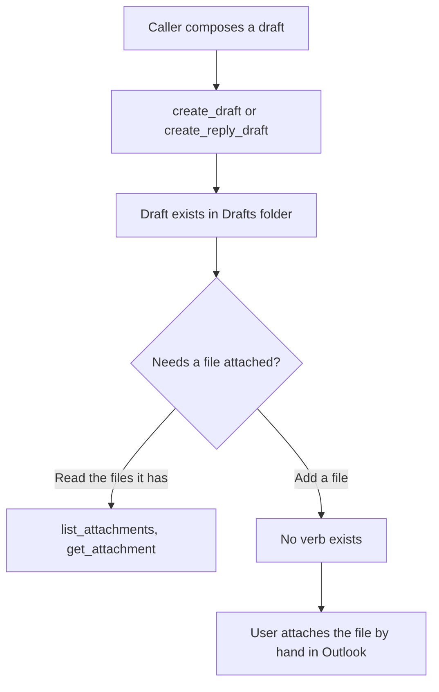
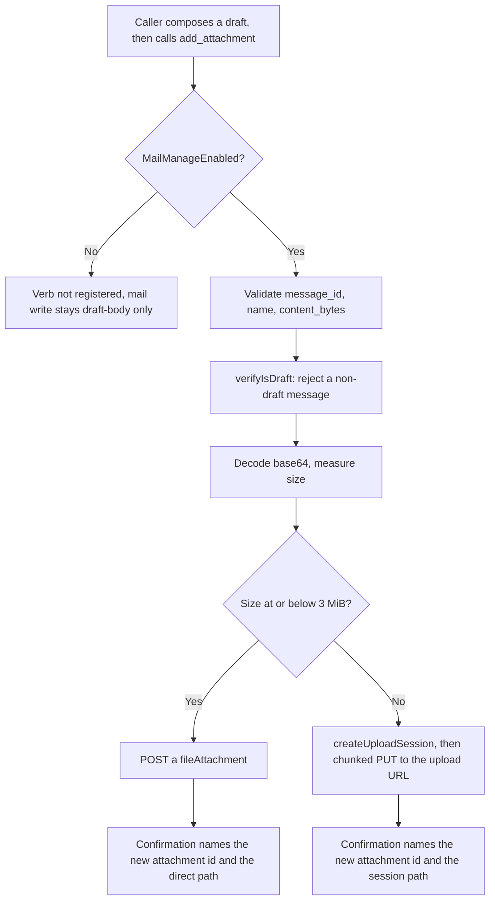
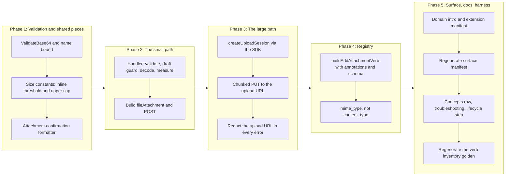

# Mail Draft Attachments

## Change Summary

The `mail` domain can create, update, and delete a draft, and it can read the
attachments already on a message. It cannot add an attachment. A caller that has
assembled a draft through `create_draft` or `create_reply_draft` has no way to
put a file on it, so any draft that needs a document must be finished by hand in
Outlook, which is the same dead end for composition that CR-0078 closed for
triage.

This change adds exactly one write verb to the existing `mail` domain registry:
`add_attachment`. It takes a draft `message_id`, the file bytes as base64, a
`name`, and an optional MIME type, and it internally chooses the transfer path:
a direct `POST /me/messages/{id}/attachments` for a small file, and a chunked
`createUploadSession` upload for a file above the Graph inline limit. No new
top-level MCP tool is added; the aggregate tool count stays at four.

This CR **follows CR-0078 in the implementation sequence**. It is written against
the mail surface CR-0078 leaves behind: the same `MailManageEnabled` gate, the
same write middleware chain, and the same `verifyIsDraft` draft guard the draft
verbs already apply. Where this document states a verb count or a totals figure,
it is stated relative to the post-CR-0078 surface, and the generated surface
manifest is the authority rather than any number written here.

## Motivation and Background

The feature-gap matrix places two mail rows in scope for this cycle and assigns
both to a Change Request:

> * **add attachment** — create_draft/update_draft take no attachment parameter
>   (SDK attachments POST confirmed); drafts cannot carry files. `4`.
> * **large attachment upload session** — no chunked upload-session verb (SDK
>   item_messages_item_attachments_create_upload_session confirmed); large
>   attachments unsupported (moot while attach is absent). `4`.

The second row is explicitly gated on the first: a chunked upload session is
"moot while attach is absent". The two are therefore one verb with two internal
paths, not two verbs. A caller does not choose the transfer mechanism; the size
of the file chooses it. Splitting the rows into two verbs would put the choice
of a byte threshold in the hands of the LLM, which is exactly the decision the
verb should make for it.

The OAuth cost of closing both rows is zero. `MAIL_MANAGE_ENABLED` already
requests `Mail.ReadWrite`, which is the scope both the direct POST and the upload
session need. No new consent prompt, no new scope, no new dependency.

The blast radius is small and draft-scoped by construction. The verb attaches to
a **draft** and refuses anything else, mirroring `update_draft` and
`delete_draft`, which fetch the target and reject a non-draft message. Attaching
to received mail is out of scope in the matrix, and the draft guard is what keeps
this change inside that boundary. Nothing sends: `Mail.Send` stays unrequested,
preserving the drafts-only safety property.

## Change Drivers

* The matrix marks "add attachment" in scope and assigns it to a CR; the draft
  composition path is a dead end without it.
* The "large attachment upload session" row is in scope but only as the large-file
  path of the same capability, so it belongs inside the one verb rather than in a
  verb of its own.
* Microsoft Graph splits attachment upload at a size threshold: a file at or below
  the inline limit is a single `POST`, and a larger file requires a
  `createUploadSession` followed by chunked transfer. This is a property of the
  service the verb must absorb, not surface.
* The attachment id the caller needs to later remove or reference the file is
  minted by the service and is not otherwise observable, so it is a confirmation
  requirement rather than a nicety.
* The four aggregate domain tools are a fixed surface, so growth belongs in a
  domain's verb registry rather than in a fifth tool.

## Current State

After CR-0078 the mail domain registers its write verbs in the
`MailManageEnabled` tier of `buildMailVerbs` (`internal/server/mail_verbs.go`,
line 130). Every one of them operates on a message the caller already has, and
the two draft-mutating verbs refuse a non-draft: `verifyIsDraft`
(`internal/tools/update_draft.go:218`) fetches the message with a narrow
`$select` and returns `"message is not a draft: this tool only operates on
messages with isDraft=true"` when `isDraft` is false.

The read side already reaches attachments. `list_attachments`
(`internal/tools/list_attachments.go`) enumerates attachment metadata via
`GET /me/messages/{id}/attachments`, and `get_attachment`
(`internal/tools/get_attachment.go`) downloads one attachment's bytes and is
bounded by `MaxAttachmentSizeBytes` to protect server memory. The server can
therefore list and read attachments, and cannot create one: a draft the model
composed cannot be given the document it was composed to send.

Measured facts about the surface, read from the repository rather than assumed:

* The mail write tier is gated by `MailManageEnabled`, which requests
  `Mail.ReadWrite` (`docs/concepts.md:112`). `Mail.Send` is not requested in any
  configuration.
* Draft mutations already pay one `GET` for the `verifyIsDraft` guard before their
  write, so a guarded draft write issuing more than one Graph request is the
  established shape, not a new cost this verb introduces.
* `get_attachment` already carries a size ceiling and an actionable oversize error
  naming the environment variable that raises it
  (`internal/tools/get_attachment.go:128`), so a bounded-size write error has a
  pattern to follow.

### Current State Diagram



## Proposed Change

One verb, `add_attachment`, is added to the `MailManageEnabled` tier of
`buildMailVerbs`. It requires a draft `message_id`, a `name`, and the file bytes
as base64 `content_bytes`, accepts an optional `mime_type`, verifies the target
is a draft, chooses the transfer path from the decoded size, and returns an
unconditional text confirmation naming the new attachment id.

### Verb inventory

| Verb | Graph call (small path) | Graph call (large path) | Required parameters | Confirmation carries |
|---|---|---|---|---|
| `add_attachment` | `POST /me/messages/{id}/attachments` with a `fileAttachment` | `POST /me/messages/{id}/attachments/createUploadSession`, then chunked `PUT` to the returned upload URL | `message_id`, `name`, `content_bytes` | draft subject, message id, attachment name, size in bytes, **attachment id**, and which transfer path was used |

The Graph SDK surfaces are confirmed against the pinned `msgraph-sdk-go v1.100.0`
in the module cache, not from documentation. Both endpoints live under the
`users/` package of the v1.0 GA module (`module
github.com/microsoftgraph/msgraph-sdk-go`), not the beta SDK, so both are v1.0 GA:

* **Small path.** `client.Me().Messages().ByMessageId(id).Attachments().Post(ctx,
  Attachmentable, cfg)` returns `models.Attachmentable`
  (`users/item_messages_item_attachments_request_builder.go:110`). The body is a
  `models.FileAttachment` built by `models.NewFileAttachment()`, which stamps the
  `@odata.type` of `#microsoft.graph.fileAttachment`
  (`models/file_attachment.go:14`). It carries `SetContentBytes([]byte)`
  (`models/file_attachment.go:126`) and inherits `SetName(*string)`,
  `SetContentType(*string)`, and `SetSize(*int32)` from the embedded `Attachment`
  base (`models/attachment.go:224`, `:203`, `:231`). The returned attachment
  carries the service-assigned id.
* **Large path.**
  `client.Me().Messages().ByMessageId(id).Attachments().CreateUploadSession().Post(ctx,
  body, cfg)` returns `models.UploadSessionable`
  (`users/item_messages_item_attachments_create_upload_session_request_builder.go:43`;
  accessor at `users/item_messages_item_attachments_request_builder.go:84`). The
  body is `users.NewItemMessagesItemAttachmentsCreateUploadSessionPostRequestBody()`
  with `SetAttachmentItem(AttachmentItemable)`
  (`users/item_messages_item_attachments_create_upload_session_post_request_body.go:99`).
  The `AttachmentItem` (`models.NewAttachmentItem()`) carries
  `SetAttachmentType(*AttachmentType)` set to `models.FILE_ATTACHMENTTYPE`
  (`models/attachment_type.go:8`), `SetName`, `SetContentType`, and
  `SetSize(*int64)` (`models/attachment_item.go:267`, `:299`, `:285`, `:313`). The
  returned `UploadSession` exposes `GetUploadUrl()`, `GetExpirationDateTime()`,
  and `GetNextExpectedRanges()` (`models/upload_session.go:137`, `:49`, `:113`).

The SDK returns the upload session but does not transfer the chunks: the file
bytes are written by `PUT` requests to the pre-authenticated upload URL, which is
raw HTTP outside the request-builder chain. That boundary is a deliberate design
point, addressed in the implementation approach and in the non-functional
requirements below.

### The inline threshold

Microsoft Graph accepts a single `POST` of a `fileAttachment` for a file at or
below its inline limit and requires an upload session above it. The limit is
3 MiB, taken here as `3 * 1024 * 1024 = 3145728` bytes. The verb decodes
`content_bytes`, measures the byte length, and routes: at or below the threshold,
the direct `POST`; above it, the upload session. The threshold is an internal
constant, not a parameter, so the caller never chooses the mechanism.

### Annotation matrix

The verb declares all four hints explicitly, per the project rule that a verb
cannot be registered without its own classification and that the aggregate is
computed from the registry.

| Verb | `readOnlyHint` | `destructiveHint` | `idempotentHint` | `openWorldHint` |
|---|---|---|---|---|
| `add_attachment` | `false` | `false` | `false` | `true` |

Justification, hint by hint, because an unjustified hint is the defect the
computed-annotation rule exists to prevent:

* **`readOnlyHint: false`.** The verb writes mailbox state: it adds an attachment
  to a draft.
* **`destructiveHint: false`.** The operation is purely additive. It removes
  nothing and it makes nothing unaddressable: the draft and its existing
  attachments are untouched, and a new attachment appears alongside them. This is
  the same shape as `create_draft`, classified `false` today.
* **`idempotentHint: false`.** A second call with identical arguments adds a
  second identical attachment with a distinct id, rather than leaving the same
  end state. The operation mints a new attachment id on every successful call, so
  it cannot be idempotent. This matches `create_draft`, also `false`.
* **`openWorldHint: true`.** The verb calls Microsoft Graph.

The aggregate fold is unchanged by these values. Under `MailManageEnabled` the
`mail` tool already publishes `destructiveHint: true` (forced by `delete_draft`)
and `idempotentHint: false` (forced by `create_draft`), so the published
configuration-dependent annotation table in
`docs/concepts.md#tool-annotation-semantics` stays correct as written. Under the
default and `MailEnabled`-only configurations the verb is not registered, so
`readOnlyHint: true` is preserved there.

### The flattened aggregate schema, and why the MIME parameter is not `content_type`

`aggregateSchemaOptions` publishes the union of every registered verb's
parameters on the domain tool and merges duplicate names with
first-occurrence-wins for type, description, and enum. The mail domain already
declares a `content_type` parameter on `create_draft` and `update_draft`, and it
is a **body** content type restricted by an enum to `text` and `html`
(`internal/server/mail_verbs.go:452`). An attachment's content type is a MIME
type such as `application/pdf`, which that enum would reject and that description
would misdescribe.

Reusing `content_type` for the attachment MIME type is therefore not honest:
first-occurrence-wins keeps the draft verbs' `text | html` enum, so the flattened
schema would tell an LLM that the attachment's content type must be `text` or
`html`. This CR names the parameter `mime_type` instead, one concept to one name,
following the precedent CR-0078 set with `destination_folder_id` rather than
`folder_id`: two genuinely different concepts in one domain get two names, and the
distinct name is what keeps the merged schema correct.

`name` and `content_bytes` are new to the mail domain and collide with nothing.
`message_id` and `account` are already published domain-wide. This CR introduces
**no** filter-versus-write dual-sense parameter of the kind that required the
shared-parameter description rewrite in CR-0078, so the derived shared-parameter
check that CR-0078 adds continues to pass unchanged.

### Proposed State Diagram



## Requirements

### Functional Requirements

1. The system **MUST** register exactly one new verb in the `mail` domain verb
   registry, named `add_attachment`, and **MUST NOT** register any new top-level
   MCP tool; the registered tool count **MUST** remain four.
2. The verb **MUST** be registered only when `MailManageEnabled` is configured, and
   **MUST NOT** appear in the operation enum under the default or
   `MailEnabled`-only configurations.
3. The verb **MUST** require `message_id`, `name`, and `content_bytes`, and **MUST**
   accept an optional `mime_type`.
4. The verb **MUST** validate `message_id` with `validate.ValidateResourceID`,
   **MUST** reject an empty `name` and validate its length with
   `validate.ValidateStringLength` against an attachment-name bound, and **MUST**
   reject a `content_bytes` value that is empty or is not valid base64, in every
   case before any Graph request is issued.
5. The verb **MUST** verify the target is a draft with the same guard the draft
   verbs apply (the `verifyIsDraft` fetch), and **MUST** reject a non-draft message
   with the established not-a-draft refusal, because attaching to received mail is
   out of scope.
6. The verb **MUST** decode `content_bytes` from base64, measure the decoded byte
   length, and choose the transfer path from that length: at or below the inline
   threshold of `3 * 1024 * 1024` bytes it **MUST** issue a single
   `POST /me/messages/{id}/attachments` carrying a `fileAttachment`; above the
   threshold it **MUST** create an upload session and transfer the bytes in chunks.
7. On the small path the `fileAttachment` **MUST** carry the decoded content bytes,
   the supplied `name`, and the content type from `mime_type` defaulting to
   `application/octet-stream` when omitted, with the `@odata.type` of
   `#microsoft.graph.fileAttachment` that `models.NewFileAttachment` stamps.
8. On the large path the verb **MUST** create the upload session with an
   `attachmentItem` whose attachment type is `file` and whose `name`,
   `contentType`, and `size` match the request, and **MUST** transfer the bytes by
   `PUT` to the upload URL the session returns, in chunks whose size is a multiple
   of 320 KiB except the final chunk, each carrying the correct `Content-Range`.
9. The verb **MUST** name its attachment MIME-type parameter `mime_type` and
   **MUST NOT** reuse `content_type`, whose mail-domain declaration is a body
   content type restricted to `text` and `html`.
10. The confirmation **MUST** name the draft subject, the message id, the
    attachment name, the attachment size in bytes, the attachment id the service
    returns, and which transfer path was used, and **MUST** construct the
    attachment id from the Graph response rather than from the request arguments.
11. The verb **MUST** return a text confirmation unconditionally and **MUST NOT**
    declare an `output` parameter, per the project's write-verb tiering rule.
12. The verb **MUST** declare all four annotation hints explicitly, with the values
    given in the annotation matrix above.
13. The verb **MUST** be wrapped by the write middleware chain (authentication,
    account resolution, observability, read-only guard, audit) under the identity
    `mail.add_attachment` and the audit operation `write`, so the audit record and
    the OpenTelemetry attributes carry the same `{domain}.{operation}` identity as
    every other verb.
14. The verb **MUST** enforce an upper bound on the decoded attachment size before
    any upload begins, and **MUST** reject an oversize attachment with an actionable
    error that names the bound and how to raise it, mirroring the oversize error
    `get_attachment` already emits on the read side.
15. Every error the verb raises **MUST** carry a fix instruction naming what to
    supply or correct, and **MUST** reach both the tool result and the log record.
    An error arising from a chunk `PUT` **MUST** be redacted so the pre-authenticated
    upload URL, which carries an access token, never appears in the result or the
    log.
16. The verb **MUST** carry a non-empty `Summary` of at most eighty characters, a
    non-empty `Description` stating its parameters, its gating requirement, and its
    annotation semantics, at least one `Examples` entry, and at least one `SeeDocs`
    reference that resolves to an existing heading in the embedded documentation
    bundle.
17. The `mail` domain introduction registered in `internal/server/server.go`
    **MUST** name `add_attachment` in its enumeration of `MailManageEnabled`-gated
    write verbs.
18. The `mail` entry of `extension/manifest.json` **MUST** enumerate
    `add_attachment`, and the manifest's `tools` array **MUST** remain exactly four
    entries, because no new top-level tool is added.
19. The generated surface manifest `site/src/generated/surface.json` **MUST** be
    regenerated with `make surface-manifest` and committed in the same change, so
    the published website states the surface that exists.
20. `docs/prompts/mcp-tool-crud-test.md` **MUST** gain a lifecycle step exercising
    `add_attachment`, and its gated skip instruction **MUST** be widened to cover
    the new step, so a run with mail management disabled records it as skipped
    rather than failing.
21. The committed verb inventory golden in
    `internal/tools/dispatch_registry_test.go` **MUST** be regenerated to include
    the identity `mail.add_attachment ro=false de=false id=false ow=true`.
22. The change **MUST NOT** alter the OAuth scope set requested in any
    configuration: `Mail.ReadWrite` already covers the verb and `Mail.Send` stays
    unrequested.
23. The change **MUST NOT** alter the default verb surface: the mail domain's
    `defaultCount` in the surface manifest **MUST** remain 5.

### Non-Functional Requirements

1. The verb's handler **MUST** live in its own file under `internal/tools/`, named
   for the verb, and the chunked upload-session transfer **MUST** live in its own
   file, so neither file carries the other's concern and each stays small.
2. The composed `mail` tool description **MUST** stay below 4 000 characters, and
   the cold-start schema reduction **MUST** stay at or above 60% against the
   documented baseline. Both bounds are asserted by existing gates rather than
   assumed here; adding one verb with three new parameters leaves the margins those
   gates measured after CR-0078 substantially intact.
3. The change **MUST NOT** add a third-party dependency. The chunked `PUT` transfer
   **MUST** use the standard library HTTP client, not a new upload library.
4. The verb's Graph SDK calls (the `verifyIsDraft` `GET`, the small-path `POST`,
   and the `createUploadSession` `POST`) **MUST** route through
   `graph.RetryGraphCall` inside `graph.WithTimeout`, and **MUST** redact Graph
   errors with the existing helpers, so retry, timeout, and redaction behaviour is
   identical to the verbs already registered.
5. The chunked `PUT` transfer **MUST** be bounded by a per-chunk timeout and
   **MUST** surface a transfer failure as an actionable, redacted error rather than
   a partial success. A partially uploaded attachment that the service discards on
   session expiry **MUST NOT** be reported as attached.
6. The whole attachment is delivered to the verb as base64 in one argument and is
   therefore held in memory in full; the chunked path bounds the Graph transfer,
   not the memory footprint. The upper size bound of FR-14 is what keeps the memory
   footprint bounded, and its default **MUST** be set with that in mind rather than
   at the service's 150 MB ceiling.
7. The small path **MUST** issue exactly the `verifyIsDraft` `GET` and one `POST`
   on its success path. The large path **MUST** issue the `verifyIsDraft` `GET`,
   one `createUploadSession` `POST`, and the minimum number of chunk `PUT`s the
   file size requires, and **MUST NOT** re-read the draft after the upload.
8. The attachment-name and size bounds **MUST** be defined once as named constants
   or configuration, not inlined as magic numbers at the call site, so the inline
   threshold and the upper bound each have a single source of truth.

## Affected Components

* `internal/tools/add_attachment.go` (new): the `add_attachment` handler
  constructor `NewHandleAddAttachment`. Validates parameters, runs the draft guard,
  decodes and measures the bytes, dispatches to the small or large path, and formats
  the confirmation.
* `internal/tools/attachment_upload_session.go` (new): the chunked upload-session
  transfer. Creates the session via the SDK, then `PUT`s the bytes to the upload URL
  in 320 KiB-multiple chunks with `Content-Range`, and returns the created
  attachment id. Isolated from the handler so the raw-HTTP transfer concern does not
  bloat the handler file.
* `internal/tools/attachment_confirmation.go` (new): the confirmation formatter for
  an added attachment. It is separate from `FormatDraftConfirmation`
  (`internal/tools/draft_helpers.go:84`) because that formatter closes with the
  draft-specific Drafts-folder sentence and names a draft, not an attachment.
* `internal/validate/validate.go`: a `ValidateBase64` helper and an attachment-name
  length bound alongside the existing bounds, returning errors that name the
  parameter and the correction (NFR-8).
* `internal/config`: an upper attachment-upload size bound (FR-14, NFR-6), read from
  an environment variable with a documented default, distinct from the download-side
  `MaxAttachmentSizeBytes`. Whether that bound is a distinct
  `OUTLOOK_MCP_MAX_ATTACHMENT_UPLOAD_BYTES` or a reuse of `MaxAttachmentSizeBytes` is
  recorded as an open question rather than settled here.
* `internal/server/mail_verbs.go`: a new `buildAddAttachmentVerb` constructor
  appended to the `MailManageEnabled` block of `buildMailVerbs` (line 130), carrying
  `Summary`, `Description`, `Examples`, `SeeDocs`, `Annotations`, and `Schema` per
  FR-12 and FR-16.
* `internal/server/server.go`: the `mail` domain `Intro` string, which enumerates
  the `MailManageEnabled` write verbs by name (FR-17).
* `extension/manifest.json`: the `mail` tool description. The `tools` array itself is
  **unchanged at four entries** (FR-18).
* `site/src/generated/surface.json`: regenerated, not hand-edited. The mail domain's
  full verb count rises by one and its default count stays 5; the totals rise by one
  full verb with default unchanged. Gate attribution is derived by probe, so no
  mapping needs maintaining (FR-19).
* `docs/concepts.md`: the mail gating table row for `MAIL_MANAGE_ENABLED`, so its
  "including draft management" wording names draft attachments as well and does not
  read as exhaustive. The OAuth scopes table and the annotation-semantics table are
  **unchanged**, and this CR asserts that rather than leaving it to inference.
* `docs/troubleshooting.md`: two entries with stable anchors, one for an attempt to
  attach to a non-draft message and one for an upload-session transfer failure or
  expiry, which are the two failure modes a caller cannot diagnose from the Graph
  error alone.
* `docs/prompts/mcp-tool-crud-test.md`: one new lifecycle step and the widened skip
  range (FR-20).
* `internal/tools/dispatch_registry_test.go`: the `verbInventoryGolden` list (FR-21).
* `scripts/crud-test.sh`: **no change required.** Its per-domain accounting keys on
  the MCP tool name `mcp__outlook-local-mcp__mail`, not on the operation verb, so an
  additional mail verb raises the existing `mcp_mail` counter without a script edit.
* `docs/bench/crud-runs.csv`: **no column change.** The header is per-domain, not
  per-verb; new runs record a higher `mcp_mail` value and more turns.

## Scope Boundaries

### In Scope

* Exactly one new mail verb: `add_attachment`, covering both the direct-POST small
  path and the chunked upload-session large path.
* Its handler, the chunked-transfer helper, the confirmation formatter, the registry
  entry, annotations, schema, and unit tests.
* The base64 and attachment-name validation helpers and the two size bounds (the
  inline threshold and the upper cap).
* The domain introduction, the extension manifest mail description, and the
  regenerated surface manifest.
* The concepts gating-row wording, two troubleshooting entries, and the lifecycle
  harness step.

### Out of Scope ("Here, But Not Further")

* **Attaching to a received message.** The verb attaches to a **draft** and refuses
  anything else, mirroring the draft guard the draft verbs apply. The matrix places
  received-mail writes outside this cycle's scope, and the draft guard is the
  boundary.
* **Removing an attachment.** `DELETE /me/messages/{id}/attachments/{id}` is the
  matrix's "delete attachment" row, marked destructive and out of scope (Manage=3).
  It belongs in its own change request. This verb only adds.
* **Sending, replying, or forwarding.** `Mail.Send` stays unrequested. The
  drafts-only safety property is preserved without qualification.
* **Item and reference attachments.** This verb creates a `fileAttachment` (file
  bytes). Attaching an Outlook item (`itemAttachment`) or a link to a cloud file
  (`referenceAttachment`) is a different body shape and is not added here.
* **Inline attachments.** Setting `isInline` and a `contentId` to embed an image in
  an HTML body is a separate compositional concern and is not exposed; every
  attachment this verb adds is a regular file attachment.
* **Streaming from disk or a URL.** The bytes arrive as base64 in the tool argument.
  The verb does not read a local path or fetch a remote URL, which would be a
  separate ingestion design.
* **Attaching to calendar events.** The matrix's calendar attachment rows
  (add, get, list, upload session) are a separate domain and a separate CR. This
  change touches the mail domain only.
* **Resuming an interrupted upload session.** The upload session's
  `nextExpectedRanges` supports resumption; this verb performs a single forward
  transfer and reports a failure rather than resuming a prior session. Resumption is
  a larger reliability feature deferred to its own change.

## Alternative Approaches Considered

* **Two verbs, one for small files and one for large.** Rejected: the matrix marks
  the large-upload row "moot while attach is absent", so it is the same capability
  at a different size. Two verbs would force the LLM to choose a byte threshold it
  cannot see, which is precisely the decision the verb should make internally.
* **A single `content_type` parameter shared with the draft body content type.**
  Rejected: the mail domain's `content_type` is a body type restricted to `text` and
  `html`, and first-occurrence-wins merging would publish that enum on the attachment
  parameter, misdescribing a MIME type. `mime_type` keeps one concept to one name.
* **Adding an optional attachment parameter to `create_draft` and `update_draft`
  instead of a new verb.** Rejected: it would spread one honest annotation
  classification across verbs whose other operations are pure body edits, and it
  would put file bytes into every draft-edit schema. A dedicated verb keeps the
  attachment concern, and its non-idempotent additive semantics, in one place.
* **Using a large-file upload task abstraction from a third-party or kiota upload
  library.** Rejected on the no-new-dependency rule: the standard library HTTP client
  performs the chunked `PUT` against the pre-authenticated upload URL, which is all
  the large path needs.
* **Reporting a partially uploaded attachment as success.** Rejected: a transfer that
  fails partway leaves a session the service discards on expiry, so reporting success
  would name an attachment id that does not resolve. A partial transfer is a failure,
  redacted and actionable.

## Impact Assessment

### User Impact

A user who has enabled `MAIL_MANAGE_ENABLED` gains the ability to have the model
attach a file to a draft it composed, closing the composition path that otherwise
ends in Outlook. Nothing changes for a user who has not enabled it, and nothing
changes about sending. The one behaviour a user must understand is that attaching
the same file twice produces two attachments, which the non-idempotent
classification and the description both disclose.

### Technical Impact

No breaking change, no schema migration, no new dependency, and no new OAuth scope.
The default configuration's published tool surface is byte-identical, because the
verb is gated. Under `MailManageEnabled` the published `mail` tool grows by one
operation-enum entry, one inventory line, and three new flattened parameters
(`name`, `content_bytes`, `mime_type`); `message_id` and `account` are already
published. The large path introduces the one architectural novelty in this change,
a raw-HTTP chunked `PUT` outside the SDK request-builder chain, which is isolated to
its own file and bounded by a per-chunk timeout and the upper size cap.

### Business Impact

Low cost against a matrix row assigned to a CR. The work is one handler plus one
transfer helper, and the risk concentrates in the large path, whose contract this
document pins: chunk sizing, error redaction of the upload URL, and no partial
success.

## Implementation Approach

### Implementation Flow



### Phase 1: Validation and shared pieces

1. Add `validate.ValidateBase64(value, paramName string) ([]byte, error)` to
   `internal/validate/validate.go`, decoding the standard base64 encoding and
   returning an error naming the parameter when the value is empty or malformed.
   Add an attachment-name length bound alongside the existing bounds.
2. Define the inline threshold (`3 * 1024 * 1024`) and the upper upload cap as named
   constants or configuration (NFR-8), the cap set well below the service's 150 MB
   ceiling because the bytes are held in memory (NFR-6).
3. Add `internal/tools/attachment_confirmation.go` with a formatter that renders the
   action, the draft subject (falling back to `(No subject)`), the message id, the
   attachment name, the size in bytes, the attachment id, and which transfer path was
   used. It follows the shape of `FormatDraftConfirmation` without the Drafts-folder
   sentence.

### Phase 2: The small path

1. `internal/tools/add_attachment.go`: `NewHandleAddAttachment(retryCfg, timeout,
   maxUploadBytes)`. Resolve the Graph client, require and validate `message_id`,
   `name`, and `content_bytes`, decode the bytes, and reject an oversize attachment
   against the upper cap before any Graph request (FR-4, FR-14).
2. Run the draft guard: reuse the `verifyIsDraft` fetch, widened to also `$select`
   the subject so the confirmation can name the draft (FR-5, FR-10). A non-draft
   returns the established refusal.
3. At or below the inline threshold, build a `models.FileAttachment` with the name,
   the MIME type (`mime_type` defaulting to `application/octet-stream`), and the
   decoded bytes, and `POST` via
   `client.Me().Messages().ByMessageId(id).Attachments().Post(...)` through
   `graph.RetryGraphCall` inside `graph.WithTimeout` (FR-6, FR-7, NFR-4).
4. Read the attachment id from the returned `Attachmentable` and format the
   confirmation naming the direct path.

### Phase 3: The large path

1. `internal/tools/attachment_upload_session.go`: create the session with
   `users.NewItemMessagesItemAttachmentsCreateUploadSessionPostRequestBody()`, an
   `attachmentItem` of type `file` carrying the name, MIME type, and size, and `POST`
   it through the retry and timeout wrappers (FR-8, NFR-4).
2. Transfer the decoded bytes by `PUT` to `UploadSession.GetUploadUrl()` in chunks
   whose size is a multiple of 320 KiB except the last, each with a
   `Content-Range: bytes {start}-{end}/{total}` header, using the standard library
   HTTP client with a per-chunk timeout (FR-8, NFR-3, NFR-5).
3. Read the created attachment id from the final chunk's response. Redact the upload
   URL in every error so its access token never reaches the result or the log
   (FR-15). A transfer that does not complete is a failure, not a partial success
   (NFR-5).

### Phase 4: Registry entry

1. Add `buildAddAttachmentVerb` to `internal/server/mail_verbs.go` and append it to
   the `MailManageEnabled` block of `buildMailVerbs`, wrapped with `wrapWrite` under
   the identity `mail.add_attachment` and the audit operation `write` (FR-13).
2. Populate `Summary`, `Description`, `Examples`, and `SeeDocs`. The description
   states the parameters, the gating requirement, the annotation semantics, and that
   the file bytes are supplied as base64 in `content_bytes`. `SeeDocs` points at
   `concepts#mail-gating`.
3. Declare all four annotation hints explicitly per the matrix (FR-12), and declare
   the schema with `message_id`, `name`, and `content_bytes` required, `mime_type`
   and `account` optional, and **no** `output` parameter (FR-9, FR-11).

### Phase 5: Surface, documentation, and harness

1. Extend the `mail` domain `Intro` in `internal/server/server.go` to name
   `add_attachment` among the `MailManageEnabled`-gated writes (FR-17).
2. Extend the `mail` tool description in `extension/manifest.json` with the verb,
   leaving the `tools` array at four entries (FR-18).
3. Run `make surface-manifest` and commit `site/src/generated/surface.json` (FR-19).
   `make ci` fails on a stale manifest, so this step is not optional.
4. Update the `MAIL_MANAGE_ENABLED` row of the mail gating table in
   `docs/concepts.md`, and add the two troubleshooting entries with stable anchors.
5. Add the lifecycle step to `docs/prompts/mcp-tool-crud-test.md` and widen the gated
   skip instruction to cover it (FR-20).
6. Regenerate `verbInventoryGolden` in `internal/tools/dispatch_registry_test.go`
   from the failing test's own output and review the delta, which must be exactly one
   added line (FR-21).

## Test Strategy

Handler tests follow the established mail write-verb pattern: an `httptest` server
returning canned Graph JSON behind a real SDK client built by `newTestGraphClient`,
the client injected with `auth.WithGraphClient`, the handler constructor called
directly, and assertions made as substring checks on the returned text and on
`result.IsError`. For the large path, the test server also serves the upload URL so
the chunk `PUT`s are observed without leaving the process.

### Tests to Add

| Test File | Test Name | Description | Inputs | Expected Output |
|-----------|-----------|-------------|--------|-----------------|
| `internal/tools/add_attachment_test.go` | `TestAddAttachment_SmallFileUsesDirectPost` | A sub-threshold file takes the single POST | `message_id`, `name`, small `content_bytes` | One POST to /attachments observed; no upload session created; confirmation names the direct path |
| `internal/tools/add_attachment_test.go` | `TestAddAttachment_ConfirmationNamesAttachmentID` | The new attachment id from the response is surfaced | Canned POST response carrying an attachment id | Confirmation contains the attachment id, the name, and the size, read from the response |
| `internal/tools/add_attachment_test.go` | `TestAddAttachment_RejectsNonDraft` | The draft guard refuses received mail | Canned message with `isDraft` false | The not-a-draft refusal is returned; no attachment request is issued |
| `internal/tools/add_attachment_test.go` | `TestAddAttachment_RequiresNameAndBytes` | Required parameters are enforced before the call | `message_id` only, then missing `content_bytes` | Error naming the missing parameter; no request issued |
| `internal/tools/add_attachment_test.go` | `TestAddAttachment_RejectsInvalidBase64` | Malformed content bytes are refused before the call | `content_bytes` that is not valid base64 | Error naming `content_bytes`; no request issued |
| `internal/tools/add_attachment_test.go` | `TestAddAttachment_InvalidMessageIDRejectedBeforeCall` | Identifier validation precedes Graph | Malformed `message_id` | Error returned; no request issued |
| `internal/tools/add_attachment_test.go` | `TestAddAttachment_DefaultsMimeType` | An omitted MIME type defaults | Small file, no `mime_type` | The fileAttachment content type is `application/octet-stream` |
| `internal/tools/add_attachment_test.go` | `TestAddAttachment_OversizeRejectedBeforeUpload` | The upper cap is enforced before any transfer | Decoded size above the cap | Error naming the bound and how to raise it; no session created |
| `internal/tools/add_attachment_test.go` | `TestAddAttachment_NoOutputParameter` | The write verb declares no output tier | The registered verb schema | No `output` parameter is present |
| `internal/tools/attachment_upload_session_test.go` | `TestUploadSession_LargeFileChunks` | A file above the threshold takes the session path | `content_bytes` larger than 3 MiB | A createUploadSession POST, then chunk PUTs whose sizes are 320 KiB multiples except the last, with correct Content-Range |
| `internal/tools/attachment_upload_session_test.go` | `TestUploadSession_TransferFailureIsNotPartialSuccess` | A failed chunk is a failure | A test upload URL that rejects a chunk | Error returned; the confirmation is not produced |
| `internal/tools/attachment_upload_session_test.go` | `TestUploadSession_ErrorRedactsUploadURL` | The token-bearing URL is never leaked | A chunk PUT that returns an error carrying the URL | The error text does not contain the upload URL |
| `internal/tools/attachment_confirmation_test.go` | `TestAttachmentConfirmationUsesResponseNotArguments` | The confirmation echoes the service | Canned response whose id differs from any argument | The confirmation reports the response id |
| `internal/tools/tool_annotations_test.go` | `TestAddAttachmentAnnotations` | The four hints match the matrix | The registry under `MailManageEnabled` | `add_attachment` is not read-only, not destructive, not idempotent, and open-world |
| `internal/server/mail_verbs_test.go` | `TestMimeTypeIsNotBodyContentType` | The MIME parameter is distinct from the body content type | The mail aggregate schema | `content_type` keeps its text/html enum; `mime_type` is a separate free-string parameter |
| `internal/server/server_test.go` | `TestRegisterTools_MailManage_RegistersAddAttachment` | The verb registers only when gated on | `MailManageEnabled` true | `add_attachment` present in the operation enum; tool count 4 |
| `internal/server/readonly_test.go` | `TestReadOnlyBlocksAddAttachment` | Read-only mode blocks the verb | Read-only server, verb invoked | The read-only refusal naming `mail.add_attachment` |

### Tests to Modify

| Test File | Test Name | Current Behavior | New Behavior | Reason for Change |
|-----------|-----------|------------------|--------------|-------------------|
| `internal/tools/dispatch_registry_test.go` | `TestVerbInventoryUnchangedAfterUpgrade` | Golden holds the post-CR-0078 identities | Golden adds `mail.add_attachment ro=false de=false id=false ow=true` | The verb surface changes intentionally; the golden records that intent |
| `internal/server/server_test.go` | `TestRegisterTools_MailEnabled` | Asserts the `MailEnabled` verb set | Additionally asserts `add_attachment` is absent | The default-surface guarantee of FR-2 and FR-23 needs a negative assertion, not only a positive one |
| `internal/tools/tool_annotations_test.go` | `TestMailAnnotationsManageEnabled` | Asserts the folded mail annotations under `MailManageEnabled` | Unchanged expectations, re-asserted against the larger verb set | The fold must not shift; `delete_draft` and `create_draft` already force destructive and non-idempotent |
| `docs/prompts/mcp-tool-crud-test.md` | Lifecycle prompt steps | Mail management ends at the CR-0078 verbs | One step exercising `add_attachment`, with the skip range covering it | The harness must exercise the verb it now has, and skip it coherently when the gate is off |

### Tests to Remove

Not applicable. No functionality is removed or superseded, so no existing test
becomes obsolete. The draft verbs keep their `isDraft` guard and their tests, and
`add_attachment` reuses that guard rather than replacing it.

### Existing Tests That Gate This Change Without Modification

These already derive their cases from the registry or the configuration, so they
grade several acceptance criteria without being touched. They are listed because a
criterion whose gate is invisible reads as ungraded.

| Test File | Test Name | Criterion it grades |
|-----------|-----------|---------------------|
| `internal/tools/verb_metadata_test.go` | `TestEveryVerbHasDescription`, `TestEveryVerbHasSummary`, `TestEveryVerbHasClassification`, `TestSeeDocsAnchorsResolve` | AC-9: registry metadata completeness and anchor resolution for the new verb |
| `internal/tools/verb_metadata_test.go` | `TestWriteVerbsDeclareNoOutputParameter` | AC-6: the write verb declares no output tier, derived across every domain |
| `internal/tools/description_quality_test.go` | `TestDescriptionLengthBounded`, `TestMailDescriptionMentionsGatedVerbs`, `TestEveryVerbStatesRequiredParameters` | AC-10 and AC-12: the composed mail description stays under 4 000 characters and states the new verb's required parameters |
| `internal/server/schema_size_test.go` | `TestColdStartSchemaSize_Reduction` | AC-12: the cold-start schema reduction stays at or above 60% |
| `internal/surface/manifest_test.go` | `TestCommittedManifestMatchesRecord` | AC-11: the committed surface manifest matches the registry |
| `internal/auth/auth_test.go` | `TestScopes_MailManage`, `TestScopes_NoMailSend` | AC-13: the requested scope set is unchanged and `Mail.Send` stays unrequested |

## Acceptance Criteria

### AC-1: The verb registers, and only behind the manage gate

```gherkin
Given a server configured with mail management enabled
When the registered tools are listed
Then the mail tool's operation enum contains add_attachment
  And exactly four top-level tools are registered
Given instead a server configured with mail read enabled but not mail management
When the registered tools are listed
Then add_attachment does not appear in the operation enum
```

### AC-2: A small file is attached with a single direct POST

```gherkin
Given a draft message and a file whose decoded size is at or below three mebibytes
When add_attachment is called with the message id, a name, and the base64 bytes
Then a single POST to the message's attachments collection is issued carrying a file attachment
  And no upload session is created
  And the confirmation names the draft subject, the message id, the attachment name, the size, the new attachment id, and the direct path
```

### AC-3: A large file is attached through a chunked upload session

```gherkin
Given a draft message and a file whose decoded size is above three mebibytes
When add_attachment is called
Then an upload session is created for the attachment
  And the bytes are transferred by PUT to the session's upload URL in chunks that are multiples of 320 kibibytes except the last, each with a correct Content-Range
  And the confirmation names the new attachment id and the session path
```

### AC-4: The attachment id comes from the service, not the request

```gherkin
Given a Graph response whose attachment id was assigned by the service
When add_attachment formats its confirmation
Then the confirmation reports the id from the response
  And it does not echo a request argument as the id
```

### AC-5: A non-draft message is refused

```gherkin
Given a message whose draft state is false
When add_attachment is called on it
Then the not-a-draft refusal used by the draft verbs is returned
  And no attachment request is sent to Microsoft Graph
```

### AC-6: Required and well-formed inputs are enforced before any call

```gherkin
Given add_attachment called without a name, or without content bytes, or with content bytes that are not valid base64, or with a malformed message id
When the call is made
Then it is rejected before any request is sent
  And the error names the parameter to supply or correct
Given the registered verb schema
When it is inspected
Then it declares no output parameter
```

### AC-7: An oversize attachment is refused before any upload

```gherkin
Given a file whose decoded size exceeds the upper upload bound
When add_attachment is called
Then the call is rejected before any session is created or any byte is transferred
  And the error names the bound and how to raise it
```

### AC-8: A transfer failure is a failure, and never leaks the upload URL

```gherkin
Given an upload session whose chunk transfer fails or whose session expires
When add_attachment reports the outcome
Then it returns an error rather than a success confirmation
  And neither the tool result nor the log record contains the pre-authenticated upload URL
```

### AC-9: Registry metadata is complete for the new verb

```gherkin
Given the add_attachment verb
When its registry entry is inspected
Then it carries a non-empty summary of at most eighty characters
  And a non-empty description stating its parameters, its gating requirement, and its annotation semantics
  And at least one example
  And at least one documentation reference resolving to an existing heading in the embedded bundle
```

### AC-10: The confirmation and the description name the base64 contract

```gherkin
Given the add_attachment description and a successful call
When each is read
Then the description states that the file bytes are supplied as base64 in content_bytes
  And the confirmation names the attachment name, the size in bytes, and which transfer path was used
```

### AC-11: The surface manifest and the extension manifest are regenerated

```gherkin
Given the implemented change
When make ci is run
Then the surface drift check passes without modifying the working tree
  And the mail domain's full verb count has risen by one while its default count is five
  And every verb registered for the mail domain appears in the mail entry of the extension manifest
  And the manifest tools array still holds exactly four entries
```

### AC-12: The measured surface gates keep their margins

```gherkin
Given the implemented change
When the composed mail description and the cold-start schema are measured
Then the description is below four thousand characters
  And the cold-start schema reduction is at least sixty percent against the documented baseline
  And no third-party dependency has been added
```

### AC-13: The consent surface is unchanged

```gherkin
Given the implemented change
When the requested OAuth scope set is computed for every supported configuration
Then it is identical to the set requested before this change
  And Mail.Send is not requested in any configuration
```

### AC-14: The MIME parameter is distinct from the body content type

```gherkin
Given the mail aggregate tool schema
When its parameters are read
Then content_type keeps its text and html enum for the draft body
  And mime_type is published as a separate parameter for the attachment content type
```

### AC-15: The annotation hints are declared and match the matrix

```gherkin
Given the mail registry under mail management enabled
When add_attachment's four annotation hints are read
Then it is not read-only, is not destructive, is not idempotent, and is open-world
  And the folded mail tool annotations are unchanged from their values before this change
```

### AC-16: Read-only mode blocks the verb, and the identity is consistent

```gherkin
Given a server started in read-only mode with mail management enabled
When add_attachment is invoked
Then it returns the read-only refusal naming its mail dot verb identity
  And that same identity is the one recorded in the audit record and the telemetry attributes
```

### AC-17: The implementation follows the project's file and helper conventions

```gherkin
Given the implemented change
When a Graph SDK call from the verb times out or returns an error
Then the timeout message names the configured timeout in seconds
  And the error text is redacted by the shared helper and carries a fix instruction
Given the same change
When the source tree is reviewed
Then the handler and the chunked-transfer helper live in separate files under the tools package, each named for its concern
```

## Quality Standards Compliance

### Build & Compilation

- [ ] Code compiles/builds without errors
- [ ] No new compiler warnings introduced

### Linting & Code Style

- [ ] All linter checks pass with zero warnings/errors
- [ ] Code follows project coding conventions and style guides
- [ ] Any linter exceptions are documented with justification

### Test Execution

- [ ] All existing tests pass after implementation
- [ ] All new tests pass, including under the race detector
- [ ] Test coverage meets project requirements for changed code

### Documentation

- [ ] Every new file carries a package-consistent doc comment and a single index annotation
- [ ] The new verb's parameters and annotation semantics are documented in the registry, not in markdown
- [ ] Both troubleshooting entries carry stable anchors
- [ ] No governance identifier appears in source, test names, or user-facing documentation

### Code Review

- [ ] Changes submitted via pull request
- [ ] PR title follows Conventional Commits format
- [ ] Code review completed and approved
- [ ] Changes squash-merged to maintain linear history

### Verification Commands

```bash
# Full pipeline, including the surface drift check and the extension manifest validation
make ci

# The new handler, the transfer helper, and the registry checks, under the race detector
go test -race ./internal/tools/ ./internal/server/ ./internal/validate/ \
  -run 'AddAttachment|UploadSession|AttachmentConfirmation|MimeType|VerbInventory'

# Regenerate the published surface manifest after the registry changes
make surface-manifest

# Rebuild the binary the harness drives, then run the lifecycle harness
go build -ldflags="-X main.commit=$(git rev-parse --short HEAD) -X main.buildDate=$(date -u +%Y-%m-%dT%H:%M:%SZ)" \
  -o ./outlook-local-mcp ./cmd/outlook-local-mcp
make crud-test
```

The unit suite issues no Graph call and serves the upload URL from an in-process
`httptest` server, so it cannot confirm live chunked transfer. Acceptance additionally
requires a user scenario driving the built server against a live mailbox: create a draft,
attach a small file through the direct path and a larger file through the session path,
then confirm through `list_attachments` that both attachment ids resolve on the draft.
Persist the scenario under `.agents/scenarios/` per the project's scenario rule, and read
the harness report's own server version line against `git rev-parse --short HEAD` before
trusting any row of it.

## Risks and Mitigation

### Risk 1: A partial chunked upload is reported as a success

**Likelihood:** medium
**Impact:** high
**Mitigation:** This is the failure the large path is specified to prevent. A transfer
that fails partway leaves an upload session the service discards on expiry, so a success
confirmation would name an attachment id that never resolves, which is exactly the
handle-to-nothing failure the move contract in CR-0078 was written to avoid. NFR-5 forbids
reporting a partial transfer as attached; the handler reads the created attachment id only
from a completed final chunk, and a transfer that does not complete returns an actionable,
redacted error rather than a confirmation. AC-8 and
`TestUploadSession_TransferFailureIsNotPartialSuccess` grade it.

### Risk 2: The token-bearing upload URL leaks into an error or a log

**Likelihood:** high without the mitigation
**Impact:** high
**Mitigation:** The `createUploadSession` response returns a pre-authenticated upload URL
that carries an access token, and the chunk `PUT`s are raw HTTP outside the SDK
request-builder chain, so the standard Graph error redaction does not cover them by
default. FR-15 requires every error arising from a chunk `PUT` to be redacted so the
upload URL never appears in the tool result or the log record, on either channel. The
transfer helper is isolated in its own file precisely so this redaction has a single
enforced site rather than being re-implemented per call. AC-8 and
`TestUploadSession_ErrorRedactsUploadURL` grade it.

### Risk 3: The full base64 payload sits in memory and exhausts it

**Likelihood:** medium
**Impact:** medium
**Mitigation:** The attachment arrives as base64 in one tool argument and is decoded in
full, so the whole file, and transiently its base64 encoding, is resident in memory; the
chunked path bounds the Graph transfer, not the footprint. NFR-6 makes the upper size
bound of FR-14 the control that keeps the footprint bounded, and requires its default to
be set with the in-memory cost in mind rather than at the service's 150 MB ceiling. The
oversize check runs before any session is created or any byte is transferred, so an
over-cap request is refused rather than buffered. AC-7 and
`TestAddAttachment_OversizeRejectedBeforeUpload` grade it.

### Risk 4: The attachment MIME type is misdescribed by the flattened schema

**Likelihood:** high without the mitigation
**Impact:** medium
**Mitigation:** The mail domain already declares `content_type` as a body content type
restricted by an enum to `text` and `html`, and `aggregateSchemaOptions` merges duplicate
parameter names with first-occurrence-wins, so reusing that name for the attachment MIME
type would publish the `text | html` enum on it and tell an LLM an attachment must be
`text` or `html`. The verb names its parameter `mime_type` instead, one concept to one
name, following the `destination_folder_id` precedent CR-0078 set. AC-14 and
`TestMimeTypeIsNotBodyContentType` grade it.

### Risk 5: A caller reads `add_attachment` as idempotent and retries it

**Likelihood:** medium
**Impact:** low
**Mitigation:** A second call with identical arguments mints a second identical
attachment with a distinct id rather than leaving the same end state, so the verb is
declared `idempotentHint: false`. The classification, the description, and the user-impact
note all disclose that attaching the same file twice produces two attachments, so a client
that gates retries on the hint does not silently duplicate. AC-15 grades the hint.

### Risk 6: The lifecycle prompt drifts from the new parameter names

**Likelihood:** medium
**Impact:** low
**Mitigation:** This is the open class the project already documents: the harness prompt
names parameters in prose and nothing binds the two together, and instance-level
correction has not closed it. This change does not claim to close it. It adds one step
written against the registry as implemented, and records that a clean harness run
afterwards is evidence about that step and not about the class.

## Dependencies

* No new third-party dependency. The small path uses surfaces already present in the
  pinned `github.com/microsoftgraph/msgraph-sdk-go v1.100.0`, confirmed by reading the
  module cache rather than the vendor's documentation, and the large path's chunk `PUT`s
  use the standard library HTTP client rather than an upload library (NFR-3).
* No new OAuth scope. `Mail.ReadWrite` is already requested whenever `MailManageEnabled`
  is set, and it covers both the direct `POST` and the `createUploadSession` upload.
  `Mail.Send` stays unrequested.
* Depends on the mail write surface CR-0078 leaves behind: the `MailManageEnabled` gate,
  the write middleware chain, and the `verifyIsDraft` draft guard. This CR **follows
  CR-0078 in the implementation sequence** and is written against that post-CR-0078
  surface.
* Depends on the verb registry and conservative annotation fold of CR-0060 and CR-0068,
  and the generated surface manifest and its drift check of CR-0073, all completed.
* Picks up two feature-gap-matrix rows assigned to a CR: "add attachment" and "large
  attachment upload session", the second gated on the first.

## Estimated Effort

| Phase | Effort |
|---|---|
| Phase 1, validation helper, size constants, confirmation formatter | 2 hours |
| Phase 2, the small path handler and its tests | 3 hours |
| Phase 3, the chunked upload session, redaction, and its tests | 4 to 5 hours |
| Phase 4, registry entry, annotations, schema | 2 hours |
| Phase 5, surface, documentation, harness, golden regeneration | 3 hours |
| Total | 14 to 16 hours |

The effort concentrates in Phase 3, the one architectural novelty in this change: a
raw-HTTP chunked `PUT` outside the SDK request-builder chain, with the redaction and the
no-partial-success contract both carried in that phase.

## Decision Outcome

Chosen approach: "one `add_attachment` verb with two internal transfer paths selected by
the decoded byte size, returning an unconditional confirmation read from the response",
because the feature-gap matrix marks the large-upload row "moot while attach is absent",
which makes it the same capability at a different size rather than a second verb.

The alternative that looks tidier, two verbs split at the size boundary, was rejected on
that ground rather than on taste. It would force the LLM to choose a byte threshold it
cannot see, which is precisely the decision the verb should make internally from the
decoded size.

The large path is the part specified most carefully. It is raw HTTP outside the SDK, it
carries a token-bearing URL that must never leak, and a transfer that fails partway must
be a failure rather than a success naming an id that does not resolve. Those three
properties, chunk sizing, redaction, and no partial success, are the contract this change
request pins.

## Open Questions

Each item below records an assumption made so the change request could be written without
blocking. Each is the smallest reasonable choice, and each is stated here so a reviewer can
overturn it rather than discover it in the diff.

1. **A distinct upload bound versus reuse of `MaxAttachmentSizeBytes`.** The CR proposes a
   distinct `OUTLOOK_MCP_MAX_ATTACHMENT_UPLOAD_BYTES` because upload and download memory
   pressures differ: the download side streams to the caller, while the upload side holds
   the whole decoded payload in memory (NFR-6). Reusing `MaxAttachmentSizeBytes` as a
   symmetric bound is a defensible smaller change. The choice affects one config field and
   its default, not the verb contract, so a reviewer can pick reuse without touching any
   requirement other than FR-14's naming.
2. **The default upload cap value.** Assumed to be set well below the service's 150 MB
   ceiling because the bytes are memory-resident (NFR-6), but the exact default is left to
   the reviewer. A conservative default trades the ability to attach a very large file for
   a bounded footprint, and it can be raised by the caller through the environment
   variable FR-14 requires the error to name.
3. **`mime_type` defaulting to `application/octet-stream`.** Assumed when the caller omits
   it (FR-7), which is the safe generic type Graph accepts for arbitrary bytes. The
   alternative, requiring `mime_type`, was rejected as friction for the common case where
   the caller does not know or care about the precise type.
4. **The 3 MiB inline threshold as `3 * 1024 * 1024`.** Assumed from Graph's documented
   single-`POST` limit for a `fileAttachment`. It is an internal constant, not a parameter,
   so a change to the service limit is a one-line edit rather than a contract change.
5. **Audit operation string `write`.** Assumed, matching the draft write verbs. The verb
   only adds, so no `attach` audit category was introduced for one verb.
6. **Target version 0.11.0.** Assumed from CR-0078's target of 0.10.0, since this CR
   follows it in sequence. The released version at `78a3bb3` is earlier, so the target is
   a placeholder to be reconciled at release-planning time rather than a commitment.

## Related Items

* Follows CR-0078 in the implementation sequence and is written against the mail write
  surface it leaves behind: the same `MailManageEnabled` gate, write middleware chain, and
  `verifyIsDraft` draft guard.
* Closes two feature-gap-matrix rows assigned to a CR: "add attachment" and "large
  attachment upload session", the second gated on the first.
* Builds on the verb registry and dispatch model of CR-0060, the registry-owned
  documentation rule of CR-0065, and the computed annotation fold of CR-0068.
* Uses the generated surface manifest and its drift check from CR-0073.
* Follows the annotation matrix presentation established by CR-0052, and the
  distinct-parameter-name precedent (`destination_folder_id`, here `mime_type`) set by
  CR-0078.
* Deliberately deferred to their own change requests: removing an attachment
  (`DELETE /me/messages/{id}/attachments/{id}`, the matrix's "delete attachment" row),
  attaching to a received message, item and reference attachments, inline attachments,
  resuming an interrupted upload session, and the calendar attachment rows.

## More Information

The capability this change closes is one the read side already reaches. `list_attachments`
enumerates attachment metadata via `GET /me/messages/{id}/attachments` and `get_attachment`
downloads one attachment's bytes bounded by `MaxAttachmentSizeBytes`, so the server can
list and read attachments on a message it has, and cannot create one. A draft the model
composed to carry a document has, until this change, no way to be given that document
except by hand in Outlook.

The large path is the part worth reading twice. Microsoft Graph does not transfer the file
through the SDK for a file above its inline limit: `createUploadSession` returns a
pre-authenticated upload URL, and the bytes are written by `PUT` requests to that URL
outside the request-builder chain. The pinned SDK's own signatures confirm this, where
`Attachments().CreateUploadSession().Post` returns a `models.UploadSessionable` exposing
`GetUploadUrl()` and `GetNextExpectedRanges()` rather than a created attachment. That URL
carries an access token, which is why its redaction in every error is a requirement rather
than a nicety, and why the transfer is isolated in its own file so the redaction has one
enforced site.
