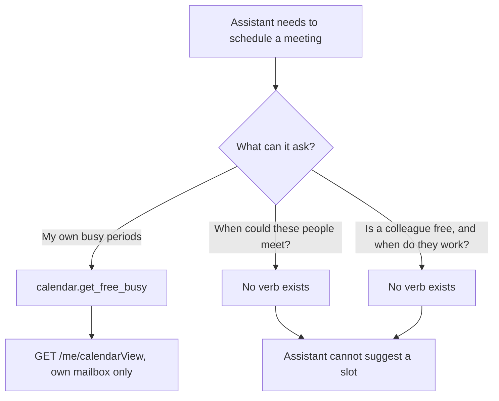
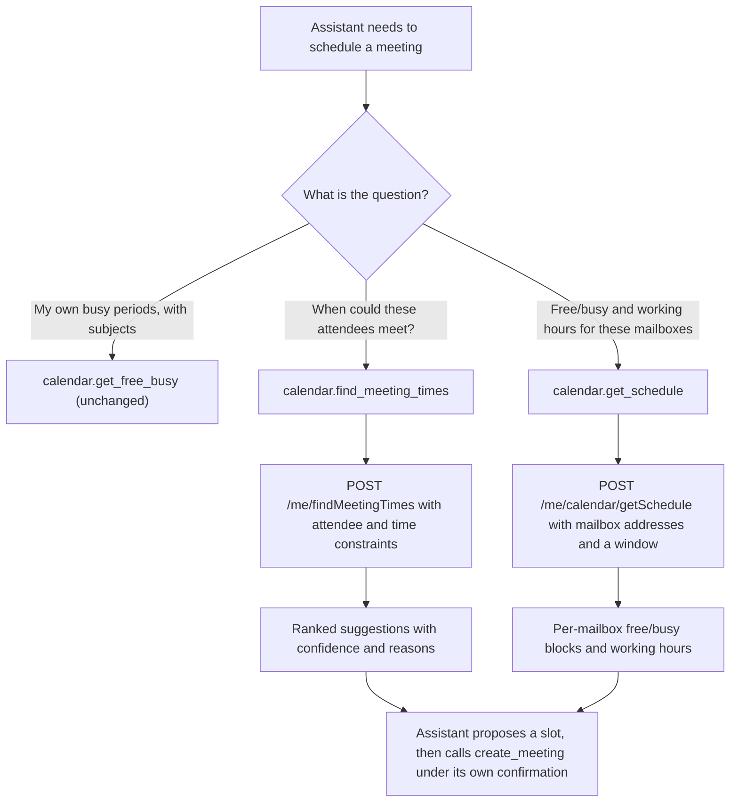
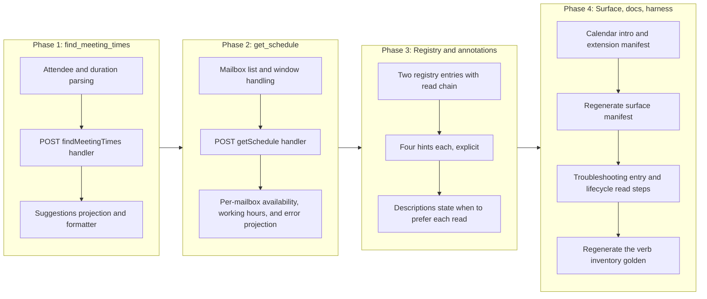

# Calendar Scheduling Reads

## Change Summary

The calendar domain can read one mailbox's own busy periods, but it cannot reason about
scheduling across people. It has no way to ask Microsoft Graph "when could these attendees
all meet?" and no way to read another mailbox's free/busy or working hours. Both are
Graph-native scheduling reads the assistant needs before proposing a meeting time.

This change adds exactly two read verbs to the always-on calendar domain registry:
`find_meeting_times`, backed by `POST /me/findMeetingTimes`, and `get_schedule`, backed by
`POST /me/calendar/getSchedule`. Both are pure reads. Neither writes, sends, or deletes.
No new top-level MCP tool is added; the aggregate tool count stays at four.

This CR follows CR-0079 in the implementation sequence. It depends on nothing CR-0079
introduces and touches no file CR-0079 is expected to change, but it is authored and
scheduled to land after it.

## Motivation and Background

The scheduling gap is the highest-severity open item in the calendar column of the
feature-gap matrix. Two rows name it directly, both marked `4` (needs a CR):

> * **Find meeting times** — No findMeetingTimes verb; the assistant cannot suggest
>   candidate meeting slots from attendee constraints, a headline scheduling-assistant
>   capability. goSdk=yes confirmed (users/item_find_meeting_times_request_builder.go).
> * **Get schedule (free/busy)** — get_free_busy derives busy periods from the signed-in
>   user's own CalendarView (get_free_busy.go:226), not Graph getSchedule; other mailboxes'
>   availability and working hours cannot be queried, so cross-person scheduling is
>   unsupported. goSdk=yes for real getSchedule confirmed
>   (users/item_calendar_get_schedule_request_builder.go).

The existing `get_free_busy` verb is the reason the second row is `partial` rather than
`no`. It calls `client.Me().CalendarView().Get(...)`
(`internal/tools/get_free_busy.go:226`), filters out events whose `showAs` is `free`, and
returns the remainder as busy periods carrying their subjects. That is a single-mailbox,
subject-bearing view of the signed-in user's own calendar. It has no parameter for another
mailbox, no concept of working hours, and it never touches the Graph `getSchedule` action.
A model asked "is my colleague free Thursday afternoon?" cannot answer it, and a model
asked "find a 30-minute slot next week for these four people" has no verb to call.

Both new verbs are reads within scopes the product already holds. `getSchedule` and
`findMeetingTimes` are delegated calls under `Calendars.Read`, which
`Calendars.ReadWrite` (already requested in every configuration) subsumes. The OAuth cost
of closing this gap is zero: no new consent prompt, no new scope, no new dependency.

The blast radius is small by construction. Neither verb writes mailbox state, sends an
invitation, or creates an event. They inform the scheduling decision; the decision is still
executed by the existing `create_meeting` verb under its own confirmation and elicitation
rules.

## Change Drivers

* Cross-person scheduling is the one headline scheduling-assistant capability the calendar
  domain lacks, and both halves of it (suggest slots, read availability) are named and
  deferred in the feature-gap matrix as `4` (needs a CR).
* `get_free_busy` reads only the signed-in user's own `CalendarView` and structurally
  cannot answer a question about another mailbox, so the product advertises a "free/busy"
  capability that stops at the account boundary.
* The Graph `findMeetingTimes` and `getSchedule` actions are v1.0 GA, exposed by request
  builders in the pinned SDK, and require no scope the product does not already request.
* The four aggregate domain tools are a fixed surface, so scheduling reads belong in the
  calendar verb registry rather than in a new top-level tool.
* A read path must expose reads only: these verbs inform a scheduling choice and must not
  acquire the ability to write, send, or delete as they grow.

## Current State

The calendar domain registers fifteen verbs, all always-on with no feature-flag gating,
built in `internal/server/calendar_verbs.go` (`buildCalendarVerbs`, line 80):

| Registration | Verbs |
|---|---|
| Always-on (no gate) | `help`, `list_calendars`, `list_events`, `get_event`, `search_events`, `create_event`, `update_event`, `delete_event`, `respond_event`, `reschedule_event`, `create_meeting`, `update_meeting`, `cancel_meeting`, `reschedule_meeting`, `get_free_busy` |

The only availability read is `get_free_busy` (`buildGetFreeBusyVerb`,
`internal/server/calendar_verbs.go:775`). Its handler, `NewHandleGetFreeBusy`
(`internal/tools/get_free_busy.go:131`), issues one Graph request,
`GET /me/calendarView` (line 226), against the signed-in user's own calendar, and returns
`FreeBusyResponse` (line 76) as busy periods. There is no parameter that names a different
mailbox, and there is no working-hours field. Cross-person scheduling is unrepresented.

Measured facts about the surface as it stands, read from the repository at `78a3bb3`
rather than assumed:

* `site/src/generated/surface.json` records calendar at `fullCount` 15, `defaultCount` 15
  (the calendar domain is ungated, so every verb counts as default); totals across the
  four domains are 42 full and 33 default.
* The calendar domain is registered with `Intro` "Calendar operations for Microsoft
  Outlook via Microsoft Graph." (`internal/server/server.go:88`).
* `extension/manifest.json` enumerates the calendar verbs in its calendar tool
  description, with no verb missing.

### Current State Diagram



## Proposed Change

Two verbs are added to the always-on tier of `buildCalendarVerbs`. Each is a single Graph
call, each is read-only, and each implements the three output tiers via the `output`
parameter exactly as `get_free_busy` does. Each lives in its own handler file under
`internal/tools/`.

### Verb inventory

| Verb | Graph call | Required parameters | Returns |
|---|---|---|---|
| `find_meeting_times` | `POST /me/findMeetingTimes` | `attendees` | ranked candidate meeting-time suggestions with confidence and, on request, the reason each was suggested |
| `get_schedule` | `POST /me/calendar/getSchedule` | `schedules`, and a resolved start and end (explicit datetimes or the `date` shorthand) | per-mailbox free/busy blocks and working hours for one or more mailboxes |

The Graph SDK surfaces confirmed against the pinned `msgraph-sdk-go v1.100.0` in the module
cache, not from documentation. Both request builders live under `users/`, which is the
v1.0 GA module (`msgraph-beta-sdk-go` is a separate module, not this one):

* **`find_meeting_times`.**
  `users.ItemFindMeetingTimesRequestBuilder.Post`
  (`users/item_find_meeting_times_request_builder.go:43`) returns
  `models.MeetingTimeSuggestionsResultable`. The body is
  `users.NewItemFindMeetingTimesPostRequestBody()`, whose setters
  (`users/item_find_meeting_times_post_request_body.go`) include
  `SetAttendees([]models.AttendeeBaseable)` (line 311),
  `SetTimeConstraint(models.TimeConstraintable)` (line 364),
  `SetMeetingDuration(*ISODuration)` (line 343),
  `SetMaxCandidates(*int32)` (line 336),
  `SetIsOrganizerOptional(*bool)` (line 322),
  `SetMinimumAttendeePercentage(*float64)` (line 350), and
  `SetReturnSuggestionReasons(*bool)` (line 357). The result exposes
  `GetMeetingTimeSuggestions()` and `GetEmptySuggestionsReason()`
  (`models/meeting_time_suggestions_result.go:102` and `:48`); each suggestion exposes
  `GetMeetingTimeSlot()`, `GetConfidence()`, `GetOrder()`, `GetSuggestionReason()`, and
  `GetOrganizerAvailability()` (`models/meeting_time_suggestion.go`).
* **`get_schedule`.**
  `users.ItemCalendarGetScheduleRequestBuilder.PostAsGetSchedulePostResponse`
  (`users/item_calendar_get_schedule_request_builder.go:66`) returns a response whose
  `GetValue()` is `[]models.ScheduleInformationable`
  (`users/item_calendar_get_schedule_post_response.go:50`). The body is
  `users.NewItemCalendarGetSchedulePostRequestBody()`, with
  `SetSchedules([]string)` (line 207),
  `SetStartTime(models.DateTimeTimeZoneable)` (line 214),
  `SetEndTime(models.DateTimeTimeZoneable)` (line 200), and
  `SetAvailabilityViewInterval(*int32)` (line 189). Each `ScheduleInformation` exposes
  `GetScheduleId()`, `GetAvailabilityView()`, `GetScheduleItems()`, `GetWorkingHours()`,
  and `GetError()` (`models/schedule_information.go`); each `ScheduleItem` exposes
  `GetStart()`, `GetEnd()`, `GetStatus()`, `GetSubject()`, and `GetLocation()`
  (`models/schedule_item.go`).

### Reconciliation with get_free_busy: complement, do not supersede

`get_schedule` **complements** `get_free_busy`; it does not replace it, and this change
does not deprecate or remove `get_free_busy`. The two answer different questions from
different Graph endpoints, and neither subsumes the other:

* `get_free_busy` reads the signed-in user's **own** `CalendarView`, so it can and does
  return the **subject** of each busy period (`internal/tools/get_free_busy.go:273`). That
  subject-bearing, own-calendar view is what a user relies on when the model says "you are
  busy 2 to 3 with the budget review." `getSchedule` does not reliably return subjects for
  a mailbox other than the caller's, by design, because that would leak another person's
  calendar detail.
* `get_schedule` reads **any** mailbox the caller is permitted to see, returns an
  `availabilityView` string and **working hours** that `get_free_busy` has no concept of,
  and accepts **multiple** mailboxes in one call. `get_free_busy` cannot name a second
  mailbox at all.

Superseding `get_free_busy` with `get_schedule` was considered and rejected (see
Alternative Approaches): it would be a breaking removal of a shipped verb, it would lose
the own-calendar subject view, and it would break the tests and the lifecycle harness that
already exercise `get_free_busy`. The two verbs are kept distinct, and each verb's
description states when to prefer it over the other so the model does not treat them as
interchangeable.

### Annotation matrix

Each verb declares all four hints explicitly, per the project rule that a verb cannot be
registered without its own classification and that the aggregate is computed from the
registry.

| Verb | `readOnlyHint` | `destructiveHint` | `idempotentHint` | `openWorldHint` |
|---|---|---|---|---|
| `find_meeting_times` | `true` | `false` | `true` | `true` |
| `get_schedule` | `true` | `false` | `true` | `true` |

Justification, hint by hint, because an unjustified hint is the defect the annotation
accuracy rule exists to prevent:

* **`readOnlyHint: true` for both.** Neither writes mailbox state, creates an event, sends
  an invitation, or deletes anything. Each issues one read against Microsoft Graph and
  returns a projection of the response. This matches `get_free_busy`, the existing
  availability read, which is classified `readOnlyHint: true`
  (`internal/server/calendar_verbs.go:785`).
* **`destructiveHint: false` for both.** A read removes nothing and makes nothing
  unaddressable. `findMeetingTimes` and `getSchedule` are POST-with-a-body reads (the
  request body carries the query, not a mutation), which is a Graph convention for reads
  whose input is too large for a query string; the HTTP verb does not make them writes.
* **`idempotentHint: true` for both.** Repeating either call with identical arguments over
  an unchanged mailbox returns the same result. Suggestions and availability can shift as
  calendars change, but that is a property of the data, not of the operation; the call
  itself carries no side effect and no sequence dependence, which is the same basis on
  which `get_free_busy` is classified idempotent.
* **`openWorldHint: true` for both.** Each calls Microsoft Graph.

The aggregate fold is unchanged by these values. The calendar tool already publishes
`readOnlyHint: false`, `destructiveHint: true`, and `idempotentHint: false` because the
write verbs force them (`create_event` forces non-read-only and non-idempotent,
`delete_event` forces destructive). Adding two read-only, non-destructive, idempotent verbs
cannot move any of those folded values, so the published annotation table stays correct as
written.

### Schema notes

`find_meeting_times` parameters:

* `attendees` (**required**): a JSON array of `{"email":"...","type":"required|optional|resource"}`
  objects, parsed into `[]models.AttendeeBaseable`. Each email is validated with
  `validate.ValidateEmail` and each type with `validate.ValidateAttendeeType`, reusing the
  helpers `create_meeting` already applies (`internal/validate/validate.go:87` and `:234`).
* `meeting_duration`: an ISO 8601 duration such as `PT30M`, parsed into the Kiota
  `ISODuration` type and passed to `SetMeetingDuration`. Defaults to `PT30M` when omitted.
* `start_datetime` and `end_datetime`: the bounds of the search window, mapped to a single
  `TimeSlot` inside a `TimeConstraint`. Optional; when omitted the handler applies a
  documented default window, and when supplied each is validated with
  `validate.ValidateDatetime`.
* `max_candidates`: maximum suggestions to return, passed to `SetMaxCandidates`; a
  documented default and ceiling apply.
* `minimum_attendee_percentage`: the minimum fraction of attendees that must be free for a
  slot to be suggested, passed to `SetMinimumAttendeePercentage`.
* `is_organizer_optional`: whether the organizer's own availability constrains the search,
  passed to `SetIsOrganizerOptional`.
* `timezone`, `account`, and `output` follow the shapes `get_free_busy` already publishes.

`get_schedule` parameters:

* `schedules` (**required**): the SMTP addresses of the mailboxes to query, as a
  comma-separated list, split and trimmed, each validated with `validate.ValidateEmail`,
  and passed to `SetSchedules`. A documented ceiling on the number of mailboxes per call is
  enforced before the request.
* `start_datetime` and `end_datetime`, or the `date` shorthand, resolved to a start and end
  the same way `get_free_busy` resolves them, mapped to `DateTimeTimeZone` values and passed
  to `SetStartTime` and `SetEndTime`.
* `availability_view_interval`: the granularity in minutes of the returned
  `availabilityView` string, passed to `SetAvailabilityViewInterval`; a documented default
  and bounds apply.
* `timezone`, `account`, and `output` follow the shapes `get_free_busy` already publishes.

Neither verb declares any parameter, in any form, that writes, sends, replies, forwards, or
deletes. Their only outputs are projections of the Graph read response.

### Proposed State Diagram



## Requirements

### Functional Requirements

1. The system **MUST** register exactly two new verbs in the calendar domain verb registry,
   named `find_meeting_times` and `get_schedule`, and **MUST NOT** register any new
   top-level MCP tool; the registered tool count **MUST** remain four.
2. Both verbs **MUST** be registered unconditionally, consistent with the calendar domain
   having no feature-flag gating, and **MUST** appear in the calendar tool's operation enum
   in every configuration.
3. `find_meeting_times` **MUST** require an `attendees` parameter, **MUST** parse it into
   `[]models.AttendeeBaseable`, and **MUST** issue exactly one `POST /me/findMeetingTimes`
   request carrying the parsed attendees.
4. `find_meeting_times` **MUST** validate every attendee email with `validate.ValidateEmail`
   and every attendee type with `validate.ValidateAttendeeType`, and **MUST** reject an
   invalid attendee before any Graph request is issued.
5. `find_meeting_times` **MUST** accept an optional `meeting_duration` as an ISO 8601
   duration, **MUST** apply a documented default when it is omitted, and **MUST** reject a
   value it cannot parse as a duration before any Graph request is issued.
6. `find_meeting_times` **MUST** map supplied `start_datetime` and `end_datetime` bounds to
   a Graph time constraint, and **MUST** validate each with `validate.ValidateDatetime`
   before any Graph request is issued.
7. `get_schedule` **MUST** require a `schedules` parameter naming one or more mailbox SMTP
   addresses, **MUST** validate each with `validate.ValidateEmail`, **MUST** enforce a
   documented ceiling on the number of mailboxes per call, and **MUST** issue exactly one
   `POST /me/calendar/getSchedule` request carrying the addresses.
8. `get_schedule` **MUST** require a resolved start and end, accepting either explicit
   `start_datetime` and `end_datetime` or the `date` shorthand, resolving them the way
   `get_free_busy` resolves its window, and **MUST** reject a request that resolves to no
   window before any Graph request is issued.
9. `get_schedule` **MUST** return, for each queried mailbox, its free/busy blocks and its
   working hours, and **MUST** attribute each block to the mailbox it belongs to so a
   caller can tell whose availability it is reading.
10. `get_schedule` **MUST** surface a per-mailbox error returned by Graph (for example a
    mailbox the caller may not view) as a stated error for that mailbox, rather than
    silently omitting the mailbox or failing the whole call.
11. Both verbs **MUST** be read-only: neither **MUST** write mailbox state, create or update
    an event, send or forward an invitation, or delete anything, and neither **MUST**
    declare any parameter that does so.
12. Both verbs **MUST** implement all three output tiers via an `output` parameter accepting
    `text`, `summary`, and `raw`, consistent with the read-verb tiering rule and with
    `get_free_busy`, and **MUST NOT** return a write confirmation.
13. Both verbs **MUST** declare all four annotation hints explicitly, with the values given
    in the annotation matrix above.
14. Both verbs **MUST** be wrapped by the read middleware chain (authentication, account
    resolution, observability, audit) under the identity `calendar.<verb>`, so the audit
    record and the OpenTelemetry attributes carry the same `{domain}.{operation}` identity
    as every other verb, and **MUST NOT** be wrapped by the read-only guard, because a read
    is not blocked in read-only mode.
15. Both verbs **MUST** route their Graph call through `graph.RetryGraphCall` and
    `graph.WithTimeout`, **MUST** report a timeout with `graph.TimeoutErrorMessage`, and
    **MUST** redact Graph errors with the existing helpers, so retry, timeout, and redaction
    behaviour is identical to the calendar reads already registered.
16. The change **MUST NOT** alter, deprecate, or remove `get_free_busy`; that verb keeps its
    own-calendar, subject-bearing behaviour unchanged.
17. Each new verb's `Description` **MUST** state when to prefer it over `get_free_busy` (and,
    for `find_meeting_times`, over `get_schedule`), so the model does not treat the three
    availability reads as interchangeable.
18. Both verbs **MUST** carry a non-empty `Summary` of at most eighty characters, a
    non-empty `Description` stating their parameters and their annotation semantics, at
    least one `Examples` entry, and at least one `SeeDocs` reference that resolves to an
    existing heading in the embedded documentation bundle.
19. The calendar domain introduction registered in `internal/server/server.go` **MUST**
    remain accurate; if it enumerates verbs, it **MUST** name the two new verbs.
20. The calendar entry of `extension/manifest.json` **MUST** enumerate the two new verbs,
    and the manifest's `tools` array **MUST** remain exactly four entries, because no new
    top-level tool is added.
21. The generated surface manifest `site/src/generated/surface.json` **MUST** be regenerated
    with `make surface-manifest` and committed in the same change, so the published website
    states the surface that exists.
22. `docs/prompts/mcp-tool-crud-test.md` **MUST** gain a lifecycle step exercising each of
    the two verbs, exercising them as reads with no cleanup step, because neither creates a
    resource to delete.
23. The committed verb inventory golden in `internal/tools/dispatch_registry_test.go`
    **MUST** be regenerated to include the two new identities with their hints.
24. The change **MUST NOT** alter the OAuth scope set requested in any configuration:
    `Calendars.ReadWrite` already covers both verbs, and no send scope is introduced.

### Non-Functional Requirements

1. Each verb's handler **MUST** live in its own file under `internal/tools/`, named for the
   verb, mirroring the existing one-file-per-verb layout of the calendar domain.
2. Each verb **MUST** issue exactly one Graph request on the success path, with no
   read-modify-write round trip and no per-mailbox fan-out (`getSchedule` accepts all
   mailboxes in a single request).
3. The composed calendar tool description **MUST** stay below the 4 000-character bound
   asserted by the description-length test, which two additional inventory lines leave
   ample headroom against.
4. The cold-start schema reduction **MUST** stay at or above the 60% floor asserted by the
   schema-size test.
5. Every error raised by either verb **MUST** carry a fix instruction naming what to supply
   or correct, and **MUST** reach both the tool result and the log record, so a headless
   caller that cannot read an interactive surface still receives the correction.
6. The change **MUST NOT** add a third-party dependency.
7. Both verbs **MUST** be deterministic in their projection: given identical Graph
   responses, each **MUST** produce identical output text.

## Affected Components

* `internal/tools/find_meeting_times.go` (new): the `find_meeting_times` handler
  constructor, the attendee and duration parsing, and the suggestions projection.
* `internal/tools/get_schedule.go` (new): the `get_schedule` handler constructor, the
  mailbox and window handling, and the per-mailbox availability and working-hours
  projection, including the per-mailbox error surfacing of FR-10.
* `internal/tools/scheduling_text_format.go` (new): the text formatters for the two verbs,
  following the established patterns in `internal/tools/text_format.go` (numbered lists for
  collections, labeled fields for details, a total count at the end).
* `internal/server/calendar_verbs.go`: two new `build*Verb` constructors appended to the
  always-on slice returned by `buildCalendarVerbs` (line 99), carrying `Summary`,
  `Description`, `Examples`, `SeeDocs`, `Annotations`, and `Schema` per FR-13 and FR-18,
  each wrapped with the read chain (`wrap`) under the identity `calendar.<verb>`.
* `internal/server/server.go`: the calendar domain `Intro` (line 88), kept accurate per
  FR-19.
* `extension/manifest.json`: the calendar tool description. The `tools` array itself is
  **unchanged at four entries**.
* `site/src/generated/surface.json`: regenerated, not hand-edited. Calendar moves from 15
  to 17 `fullCount` and from 15 to 17 `defaultCount` (the domain is ungated); totals move
  from 42 to 44 full and from 33 to 35 default. Gate attribution is derived by probe, so no
  mapping needs maintaining.
* `docs/concepts.md`: no new concept is required; the output-tier and multi-account
  sections already cover the shape of these reads. The CR asserts this rather than leaving
  it to inference.
* `docs/troubleshooting.md`: an entry for `get_schedule` returning a per-mailbox error for a
  mailbox the caller may not view, which is the one new failure mode a caller cannot
  diagnose from the raw Graph response alone.
* `docs/prompts/mcp-tool-crud-test.md`: two new lifecycle read steps (FR-22).
* `internal/tools/dispatch_registry_test.go`: the verb inventory golden (FR-23).
* `scripts/crud-test.sh`: **no change required.** Its per-domain accounting keys on the MCP
  tool name `mcp__outlook-local-mcp__calendar`, not on the operation verb, so additional
  calendar verbs raise the existing calendar counter without a schema change.
* `docs/bench/crud-runs.csv`: **no column change.** The header is per-domain, not per-verb;
  new runs record a higher calendar call count and more turns.

## Scope Boundaries

### In Scope

* Exactly two new calendar read verbs: `find_meeting_times` and `get_schedule`.
* Their handlers, registry entries, annotations, schemas, text formatters, and unit tests.
* The per-mailbox error surfacing that `getSchedule` requires.
* The calendar domain introduction, the extension manifest calendar description, and the
  regenerated surface manifest.
* One troubleshooting entry and the two lifecycle harness read steps.

### Out of Scope ("Here, But Not Further")

* **Any write, send, or delete.** Neither verb writes, and this CR adds no capability to
  create a meeting from a suggested slot, forward an event, or respond to an invitation.
  Acting on a suggestion is the existing `create_meeting` verb's job, under its own
  confirmation and elicitation rules.
* **Replacing or deprecating `get_free_busy`.** It stays as the own-calendar,
  subject-bearing availability read (FR-16). A future consolidation of the three
  availability reads, if it is ever wanted, is a separate change with its own migration
  design.
* **Event attachments.** Adding, getting, and listing event attachments are separate
  matrix rows (each `4`, needs its own CR) and are not touched here.
* **Reminder view, dismiss reminder, snooze reminder.** All marked `3` (out of scope) in
  the matrix; not added.
* **Forwarding an event.** `POST /me/events/{id}/forward` is a sending capability, marked
  `3` in the matrix's sending section; not added.
* **Calendar sharing, permissions, and calendar-group management.** All marked `3` in the
  matrix; not touched.
* **Meeting-time suggestions as an automatic booking loop.** `find_meeting_times` returns
  suggestions for a human-in-the-loop decision. It does not chain into a booking call, and
  it must not.
* **Adding a `getSchedule`-backed path to `get_free_busy`.** Bolting cross-mailbox support
  onto the existing CalendarView handler is rejected in favour of a distinct verb; see
  Alternative Approaches.

## Alternative Approaches Considered

* **Supersede `get_free_busy` with `get_schedule`.** Fewer verbs, one availability read
  instead of two. Rejected: it is a breaking removal of a shipped verb, it loses the
  own-calendar subject view that `get_free_busy` uniquely provides (getSchedule does not
  return subjects for other mailboxes by design), and it breaks the tests and the lifecycle
  harness that already exercise `get_free_busy`. The two verbs answer different questions
  and are kept distinct.
* **One combined `availability` verb dispatching between findMeetingTimes and getSchedule
  on a mode flag.** Rejected: they are different Graph operations with different required
  inputs (attendee constraints versus a mailbox list plus a window) and different output
  shapes (ranked suggestions versus per-mailbox free/busy plus working hours). One verb
  could not carry one honest required-parameter list in the description an LLM reads, which
  is the same reason the mail write verbs were kept separate rather than folded into one.
* **Extend `get_free_busy` to accept other mailboxes.** Rejected: `get_free_busy` is
  CalendarView-based and single-mailbox by construction; cross-mailbox availability comes
  from a different endpoint (`getSchedule`) with a different response, so the handler would
  fork into two unrelated code paths behind one verb, which is exactly the ambiguity
  separate verbs remove.
* **Fan `getSchedule` out to one request per mailbox.** Rejected: `getSchedule` accepts all
  mailboxes in a single request, so per-mailbox fan-out would multiply Graph calls and
  latency for no benefit and lose the single-request idempotence NFR-2 requires.

## Impact Assessment

### User Impact

A user gains two scheduling reads the assistant has never had: "find a time these people
can all meet" and "show me these mailboxes' free/busy and working hours." Nothing changes
for the own-calendar view the user already relies on, because `get_free_busy` is untouched.
No write, send, or delete capability is added, so the change cannot surprise a user by
acting on their calendar or on anyone else's.

The one behaviour a user must understand is that `get_schedule` reads only mailboxes the
signed-in account is permitted to see, and reports a per-mailbox error for one it may not.
The troubleshooting entry states this so it is disclosed rather than discovered.

### Technical Impact

No breaking change, no schema migration, no new dependency, and no new OAuth scope. The
calendar tool grows by two operation-enum entries and two inventory lines; both measured
gates (description length and cold-start schema reduction) keep large margins. Because the
calendar domain is ungated, the two verbs appear in every configuration, so the default and
full surface counts both rise by two.

### Business Impact

Low cost against the highest-severity open calendar gap. The work is two read handlers of
the same shape as `get_free_busy`, plus their formatters and tests. The risk concentrates
in the two projections (mapping the Graph suggestion and schedule shapes into readable
output), which the test strategy pins.

## Implementation Approach

### Implementation Flow



### Phase 1: find_meeting_times

1. `internal/tools/find_meeting_times.go`: `NewHandleFindMeetingTimes(retryCfg, timeout,
   defaultTimezone)`. Resolve the Graph client, require and parse `attendees` into
   `[]models.AttendeeBaseable` validating each email and type, parse the optional
   `meeting_duration` (default `PT30M`), map optional `start_datetime` and `end_datetime`
   to a `TimeConstraint`, set `max_candidates`, `minimum_attendee_percentage`, and
   `is_organizer_optional` when supplied, and `POST` via
   `client.Me().FindMeetingTimes().Post(...)`.
2. Project `GetMeetingTimeSuggestions()` into a result carrying, per suggestion, the time
   slot, the confidence, the organizer availability, and, when Graph returns it, the
   suggestion reason; carry `GetEmptySuggestionsReason()` when the list is empty so a caller
   learns why no slot was offered.
3. Add the text formatter for the suggestions to
   `internal/tools/scheduling_text_format.go`, and honour `output=summary` and `output=raw`
   the way `get_free_busy` does.

**Affected components:** `internal/tools/find_meeting_times.go` (new),
`internal/tools/scheduling_text_format.go` (new), and their test files.

### Phase 2: get_schedule

1. `internal/tools/get_schedule.go`: `NewHandleGetSchedule(retryCfg, timeout,
   defaultTimezone)`. Require and split `schedules`, validate each email, enforce the
   mailbox ceiling, resolve the window from explicit datetimes or the `date` shorthand,
   set `availability_view_interval` when supplied, and `POST` via
   `client.Me().Calendar().GetSchedule().PostAsGetSchedulePostResponse(...)`, reading
   `GetValue()`.
2. Project each `ScheduleInformation` into a per-mailbox record carrying the schedule id,
   the free/busy blocks (from `GetScheduleItems()` start, end, and status), and the working
   hours; when `GetError()` is non-nil for a mailbox, record that mailbox's error instead of
   its blocks (FR-10).
3. Add the text formatter for the schedule to `internal/tools/scheduling_text_format.go`,
   and honour `output=summary` and `output=raw`.

**Affected components:** `internal/tools/get_schedule.go` (new),
`internal/tools/scheduling_text_format.go`, and their test files.

### Phase 3: Registry entries and annotations

1. Add two `build*Verb` constructors to `internal/server/calendar_verbs.go` and append them
   to the slice returned by `buildCalendarVerbs`, each wrapped with `wrap` under the
   identity `calendar.<verb>` and the audit operation `read` (FR-14).
2. Populate `Summary`, `Description`, `Examples`, and `SeeDocs` for each. The description
   states the parameters, the annotation semantics, and when to prefer the verb over the
   other availability reads (FR-17). `SeeDocs` points at `concepts#output-tiers`.
3. Declare all four annotation hints explicitly on each verb, per the matrix (FR-13).
4. Declare each verb's `Schema`, marking the required parameters (`attendees` for
   `find_meeting_times`; `schedules` plus a resolvable window for `get_schedule`) and the
   `output` tier parameter (FR-12).

**Affected components:** `internal/server/calendar_verbs.go`,
`internal/server/calendar_verbs_test.go`.

### Phase 4: Surface, documentation, and harness

1. Keep the calendar domain `Intro` in `internal/server/server.go` accurate (FR-19).
2. Extend the calendar tool description in `extension/manifest.json` with the two verbs,
   leaving the `tools` array at four entries (FR-20).
3. Run `make surface-manifest` and commit `site/src/generated/surface.json` (FR-21).
   `make ci` fails on a stale manifest via the surface drift check, and `make test` fails
   via the committed-manifest test, so this step is not optional.
4. Add the troubleshooting entry for a per-mailbox `getSchedule` error with a stable anchor.
5. Add two read lifecycle steps to `docs/prompts/mcp-tool-crud-test.md` (FR-22).
6. Regenerate the verb inventory golden in `internal/tools/dispatch_registry_test.go` from
   the failing test's own output and review the delta, which must be exactly two added lines
   (FR-23).

**Affected components:** `internal/server/server.go`, `extension/manifest.json`,
`site/src/generated/surface.json`, `docs/troubleshooting.md`,
`docs/prompts/mcp-tool-crud-test.md`, `internal/tools/dispatch_registry_test.go`.

## Test Strategy

Handler tests follow the established calendar read pattern: an `httptest` server returning
canned Graph JSON behind a real SDK client, the client injected into the request context,
the handler constructor called directly, and assertions made as substring checks on the
returned text and on `result.IsError`. No test issues a network call.

### Tests to Add

| Test File | Test Name | Description | Inputs | Expected Output |
|-----------|-----------|-------------|--------|-----------------|
| `internal/tools/find_meeting_times_test.go` | `TestFindMeetingTimes_Success` | The post carries attendees and returns ranked suggestions | `attendees` with two entries | One POST observed; text lists suggestions with confidence |
| `internal/tools/find_meeting_times_test.go` | `TestFindMeetingTimes_RequiresAttendees` | Missing attendees is refused before the call | no `attendees` | Error naming `attendees`; no request issued |
| `internal/tools/find_meeting_times_test.go` | `TestFindMeetingTimes_RejectsInvalidAttendeeEmail` | Each attendee email is validated | `attendees` with a malformed email | Error naming the invalid email; no request issued |
| `internal/tools/find_meeting_times_test.go` | `TestFindMeetingTimes_RejectsUnparseableDuration` | A bad duration is refused before the call | `meeting_duration` of `30m` | Error naming `meeting_duration`; no request issued |
| `internal/tools/find_meeting_times_test.go` | `TestFindMeetingTimes_EmptySuggestionsReasonSurfaced` | An empty result explains itself | Canned empty suggestions with a reason | Text names the empty-suggestions reason |
| `internal/tools/find_meeting_times_test.go` | `TestFindMeetingTimes_SummaryAndRawTiers` | The three output tiers are honoured | `output=summary` then `output=raw` | Summary is compact JSON; raw carries full Graph fields |
| `internal/tools/get_schedule_test.go` | `TestGetSchedule_Success` | The post carries the mailboxes and window and returns per-mailbox availability | `schedules` with two addresses, a window | One POST observed; text attributes blocks to each mailbox |
| `internal/tools/get_schedule_test.go` | `TestGetSchedule_ReturnsWorkingHours` | Working hours are surfaced, which get_free_busy lacks | Canned response carrying working hours | Text states each mailbox's working hours |
| `internal/tools/get_schedule_test.go` | `TestGetSchedule_RequiresSchedules` | Missing schedules is refused before the call | no `schedules` | Error naming `schedules`; no request issued |
| `internal/tools/get_schedule_test.go` | `TestGetSchedule_RejectsInvalidAddress` | Each address is validated | `schedules` with a malformed address | Error naming the invalid address; no request issued |
| `internal/tools/get_schedule_test.go` | `TestGetSchedule_RequiresWindow` | A request with no resolvable window is refused | `schedules` only, no datetimes and no date | Error naming the window parameters; no request issued |
| `internal/tools/get_schedule_test.go` | `TestGetSchedule_EnforcesMailboxCeiling` | The documented mailbox cap is enforced | `schedules` with more than the ceiling | Error naming the ceiling; no request issued |
| `internal/tools/get_schedule_test.go` | `TestGetSchedule_PerMailboxErrorSurfaced` | A mailbox the caller may not view is reported, not dropped | Canned response with an error on one mailbox | Text reports that mailbox's error and the other mailbox's blocks |
| `internal/tools/get_schedule_test.go` | `TestGetSchedule_DateShorthandResolvesWindow` | The date shorthand resolves like get_free_busy | `date=tomorrow` | The resolved window is posted; text lists availability |
| `internal/tools/get_schedule_test.go` | `TestGetSchedule_SummaryAndRawTiers` | The three output tiers are honoured | `output=summary` then `output=raw` | Summary is compact JSON; raw carries full Graph fields |
| `internal/tools/scheduling_read_verbs_test.go` | `TestSchedulingReadsHonourTimeoutAndRedaction` | Timeout reporting and Graph error redaction are the shared behaviour, not per-handler improvisation | A test server that hangs, and one that returns a Graph error carrying a token-like string, against each of the two handlers | The timeout message names the configured seconds on both the tool result and the log record; the error text is redacted and carries a fix instruction |
| `internal/tools/scheduling_text_format_test.go` | `TestSchedulingFormattersDeterministic` | Identical responses format identically | The same canned response twice per verb | Byte-identical text both times |
| `internal/tools/tool_annotations_test.go` | `TestSchedulingReadVerbAnnotations` | Each new verb's four hints match the matrix | The calendar registry | Both verbs read-only, non-destructive, idempotent, open-world |
| `internal/server/calendar_verbs_test.go` | `TestSchedulingReadsRegisteredAndReadOnly` | Both verbs register and are not behind the read-only guard | The calendar verb slice | Both present; neither wrapped by ReadOnlyGuard |
| `internal/server/server_test.go` | `TestRegisterTools_CalendarSchedulingReads` | The two verbs appear in the calendar operation enum | The registered calendar tool | Both present; tool count 4 |

### Tests to Modify

| Test File | Test Name | Current Behavior | New Behavior | Reason for Change |
|-----------|-----------|------------------|--------------|-------------------|
| `internal/tools/dispatch_registry_test.go` | `TestVerbInventoryUnchangedAfterUpgrade` | Golden holds the current identities, 15 of them calendar | Golden adds `calendar.find_meeting_times ro=true de=false id=true ow=true` and `calendar.get_schedule ro=true de=false id=true ow=true`, 17 calendar total | The verb surface changes intentionally; the golden records that intent |
| `internal/tools/tool_annotations_test.go` | the folded calendar annotation assertion | Asserts the folded calendar annotations | Unchanged expectations, re-asserted against the larger verb set | The fold must not shift; the write verbs already force the folded values, and two read-only verbs cannot move them |
| `docs/prompts/mcp-tool-crud-test.md` | Lifecycle prompt steps | Calendar reads end at get_free_busy | Two read steps exercising find_meeting_times and get_schedule, with no cleanup step | The harness must exercise the reads it now has; neither creates a resource to delete |

### Tests to Remove

Not applicable. No functionality is removed or superseded by this change. `get_free_busy`
keeps its behaviour and keeps its tests (FR-16), so no existing test becomes obsolete.

### Existing Tests That Gate This Change Without Modification

These already derive their cases from the registry or the configuration, so they grade
several acceptance criteria without being touched. They are listed because a criterion whose
gate is invisible reads as ungraded.

| Test File | Test Name | Criterion it grades |
|-----------|-----------|---------------------|
| `internal/tools/verb_metadata_test.go` | the description, summary, classification, and SeeDocs-anchor completeness tests | AC-16: registry metadata completeness and anchor resolution for each new verb |
| `internal/tools/description_quality_test.go` | the description-length bound test | AC-17: the composed calendar description stays below 4 000 characters |
| `internal/server/schema_size_test.go` | the cold-start schema reduction test | AC-17: the cold-start schema reduction stays at or above 60% |
| `internal/surface/manifest_test.go` | the committed-manifest match test | AC-11: the committed surface manifest matches the registry |
| `internal/auth/auth_test.go` | the scope-set tests | AC-9: the requested scope set is unchanged and no send scope is introduced |

## Acceptance Criteria

### AC-1: Both verbs register, in every configuration

```gherkin
Given a server started in any supported configuration
When the registered tools are listed
Then the calendar tool's operation enum contains find_meeting_times and get_schedule
  And exactly four top-level tools are registered
```

### AC-2: find_meeting_times suggests slots from attendee constraints

```gherkin
Given a set of attendees with valid email addresses
When find_meeting_times is called with them
Then one findMeetingTimes request is issued carrying the parsed attendees
  And the response lists the suggested time slots with their confidence
Given instead find_meeting_times is called with no attendees
When the call is made
Then it is rejected before any request is sent
  And the error names the attendees parameter
```

### AC-3: find_meeting_times validates its inputs before calling Graph

```gherkin
Given an attendee list containing a malformed email address
When find_meeting_times is called
Then the call is rejected before any request is sent
  And the error names the invalid address
Given instead a meeting_duration that is not a valid ISO 8601 duration
When find_meeting_times is called
Then the call is rejected before any request is sent
  And the error names the meeting_duration parameter
```

### AC-4: get_schedule reads cross-mailbox free/busy and working hours

```gherkin
Given the SMTP addresses of two mailboxes and a time window
When get_schedule is called with them
Then one getSchedule request is issued carrying both addresses and the window
  And the response attributes free/busy blocks to each named mailbox
  And it states each mailbox's working hours
```

### AC-5: get_schedule reports a per-mailbox error rather than dropping the mailbox

```gherkin
Given a getSchedule response carrying an error for one of the named mailboxes
When get_schedule formats its result
Then the result reports that mailbox's error
  And it still reports the availability of the other named mailbox
```

### AC-6: get_schedule requires both mailboxes and a resolvable window

```gherkin
Given a get_schedule call naming no mailboxes
When the call is made
Then it is rejected before any request is sent
  And the error names the schedules parameter
Given instead a get_schedule call naming mailboxes but no datetimes and no date shorthand
When the call is made
Then it is rejected before any request is sent
  And the error names the window parameters
```

### AC-7: Both verbs are reads that expose no write, send, or delete

```gherkin
Given the registered schedule of the two new verbs
When each verb's parameters and annotation hints are inspected
Then each declares read-only true, destructive false, idempotent true, and open-world true
  And neither declares any parameter that writes, sends, replies, forwards, or deletes
  And neither is wrapped by the read-only guard, because a read is not blocked in read-only mode
```

### AC-8: get_free_busy is unchanged

```gherkin
Given the calendar registry after this change
When get_free_busy is inspected
Then it is still registered
  And it still reads the signed-in user's own calendar and returns busy periods with subjects
  And its behaviour, annotations, and tests are unchanged by this change
```

### AC-9: The consent surface is unchanged

```gherkin
Given the implemented change
When the requested OAuth scope set is computed for every supported configuration
Then it is identical to the set requested before this change
  And no send scope is requested in any configuration
```

### AC-10: Both verbs implement the three output tiers

```gherkin
Given either new verb and a canned Graph response
When it is called with output text, then summary, then raw
Then text returns a readable listing
  And summary returns compact JSON
  And raw returns the full Graph fields
  And no call returns a write confirmation
```

### AC-11: The surface manifest is regenerated and committed

```gherkin
Given the implemented change
When make ci is run
Then the surface drift check passes without modifying the working tree
  And the manifest records the calendar domain at seventeen full verbs and seventeen default verbs
  And the totals record forty-four full verbs and thirty-five default verbs
```

### AC-12: The verb inventory golden records exactly the intended delta

```gherkin
Given the committed verb inventory golden
When it is compared against the registry
Then they match
  And the delta introduced by this change is exactly two added lines, one per new verb
```

### AC-13: The extension manifest names the new verbs and stays at four tools

```gherkin
Given the extension manifest after this change
When its calendar tool description is read
Then it enumerates find_meeting_times and get_schedule
  And the manifest tools array still holds exactly four entries
```

### AC-14: A failure carries its correction on both channels

```gherkin
Given a scheduling read whose Graph call times out
When the verb is called
Then the tool result names the configured timeout in seconds
  And the log record carries the same timeout report
Given instead a Graph error carrying a sensitive token-like string
When the verb is called
Then the returned error text is redacted by the shared helper and carries a fix instruction
```

### AC-15: The implementation follows the project's file and helper conventions

```gherkin
Given the implemented change
When the source tree is reviewed
Then each new verb's handler lives in its own file under the tools package, named for the verb
  And each verb issues exactly one Graph request on its success path
  And no third-party dependency has been added
```

### AC-16: Registry metadata is complete for each new verb

```gherkin
Given each of the two new verbs
When its registry entry is inspected
Then it carries a non-empty summary of at most eighty characters
  And a non-empty description stating its parameters and its annotation semantics
  And at least one example
  And at least one documentation reference resolving to an existing heading in the embedded bundle
```

### AC-17: The measured surface gates keep their margins

```gherkin
Given the implemented change
When the composed calendar description and the cold-start schema are measured
Then the description is below four thousand characters
  And the cold-start schema reduction is at least sixty percent against the documented baseline
  And no third-party dependency has been added
  And each verb issues exactly one Graph request on its success path
```

## Quality Standards Compliance

### Build & Compilation

- [ ] Code compiles/builds without errors
- [ ] No new compiler warnings introduced

### Linting & Code Style

- [ ] All linter checks pass with zero warnings/errors
- [ ] Code follows project coding conventions and style guides
- [ ] Any linter exceptions are documented with justification

### Test Execution

- [ ] All existing tests pass after implementation
- [ ] All new tests pass, including under the race detector
- [ ] Test coverage meets project requirements for changed code

### Documentation

- [ ] Every new file carries a package-consistent doc comment and a single index annotation
- [ ] Every new verb's parameters and annotation semantics are documented in the registry, not in markdown
- [ ] The troubleshooting entry carries a stable anchor
- [ ] No governance identifier appears in source, test names, or user-facing documentation

### Code Review

- [ ] Changes submitted via pull request
- [ ] PR title follows Conventional Commits format
- [ ] Code review completed and approved
- [ ] Changes squash-merged to maintain linear history

### Verification Commands

```bash
# Full pipeline, including the surface drift check and the committed-manifest test
make ci

# The new handlers and the registry checks, under the race detector
go test -race ./internal/tools/ ./internal/server/ ./internal/graph/ ./internal/validate/ \
  -run 'FindMeetingTimes|GetSchedule|SchedulingReads|SchedulingFormatters|SchedulingReadVerbAnnotations|VerbInventory'

# Regenerate the published surface manifest after the registry changes
make surface-manifest

# Rebuild the binary the harness drives, then run the lifecycle harness
go build -ldflags="-X main.commit=$(git rev-parse --short HEAD) -X main.buildDate=$(date -u +%Y-%m-%dT%H:%M:%SZ)" \
  -o ./outlook-local-mcp ./cmd/outlook-local-mcp
make crud-test
```

The unit suite issues no Graph call, so it cannot confirm live behaviour. Acceptance
additionally requires a user scenario driving the built server against a live mailbox:
call `find_meeting_times` for a set of attendees and confirm the suggested slots, then call
`get_schedule` for two mailboxes and confirm the per-mailbox free/busy and working hours,
then confirm `get_free_busy` still returns the own-calendar subject view unchanged. Persist
the scenario under `.agents/scenarios/` per the project's scenario rule, and read the
harness report's own server version line against `git rev-parse --short HEAD` before
trusting any row of it.

## Risks and Mitigation

### Risk 1: get_schedule is read as replacing get_free_busy

**Likelihood:** medium
**Impact:** medium
**Mitigation:** The two verbs answer different questions from different Graph endpoints, and
this change deliberately keeps both (FR-16). `get_free_busy` reads the signed-in user's own
`CalendarView` and returns subjects; `get_schedule` reads any permitted mailbox, returns an
`availabilityView` string and working hours, and takes multiple mailboxes. Each verb's
description states when to prefer it over the other (FR-17), and AC-8 grades that
`get_free_busy` is untouched. Superseding one with the other was considered and rejected on
the record (see Alternative Approaches).

### Risk 2: A get_schedule mailbox the caller may not view is silently dropped

**Likelihood:** medium
**Impact:** medium
**Mitigation:** Graph returns a per-mailbox error inside the response rather than failing the
whole call, so a handler that reads only the availability blocks would omit the mailbox
without saying why. FR-10 requires surfacing the per-mailbox error as a stated error for
that mailbox, AC-5 grades it, and the troubleshooting entry discloses the failure mode so a
caller can diagnose it from the raw Graph response.

### Risk 3: find_meeting_times returns no suggestions and the caller cannot tell why

**Likelihood:** medium
**Impact:** low
**Mitigation:** Graph carries the reason an empty result is empty in
`GetEmptySuggestionsReason()`. The handler projects it so a caller learns why no slot was
offered rather than reading an unexplained empty list, and
`TestFindMeetingTimes_EmptySuggestionsReasonSurfaced` grades it.

### Risk 4: A read verb grows a write capability as it is extended

**Likelihood:** low
**Impact:** high
**Mitigation:** Both verbs are POST-with-a-body reads, and the POST verb can read as a
licence to add a mutating parameter later. FR-11 forbids any parameter that writes, sends,
replies, forwards, or deletes; the annotation matrix declares both `readOnlyHint: true`; and
AC-7 grades that neither verb declares such a parameter and that neither is wrapped by the
read-only guard, because a read is not blocked in read-only mode.

### Risk 5: The lifecycle prompt drifts from the new parameter names

**Likelihood:** medium
**Impact:** low
**Mitigation:** This is the open class the project already documents: the harness prompt
names parameters in prose and nothing binds the two together, and instance-level correction
has not closed it. This change does not claim to close it. It adds two read steps written
against the registry as implemented, and records that a clean harness run afterwards is
evidence about those two steps and not about the class.

## Dependencies

* No new third-party dependency. Both verbs use surfaces already present in the pinned
  `github.com/microsoftgraph/msgraph-sdk-go v1.100.0`, confirmed by reading the module
  cache rather than the vendor's documentation (the request builders under `users/`).
* No new OAuth scope. `Calendars.ReadWrite` is already requested in every configuration and
  subsumes the `Calendars.Read` these delegated reads require; no send scope is introduced.
* Depends on the verb registry and conservative annotation fold established by CR-0060 and
  CR-0068, both completed.
* Depends on the generated surface manifest and its drift check from CR-0073, completed.
* Sequenced after CR-0079: authored and scheduled to land after it, but depends on nothing
  CR-0079 introduces and touches no file CR-0079 is expected to change.

## Estimated Effort

| Phase | Effort |
|---|---|
| Phase 1, find_meeting_times handler, attendee and duration parsing, suggestions projection and formatter | 3 to 4 hours |
| Phase 2, get_schedule handler, mailbox and window handling, per-mailbox availability, working hours, and error projection | 4 to 5 hours |
| Phase 3, registry entries, annotations, descriptions that state when to prefer each read | 2 hours |
| Phase 4, surface, documentation, harness, golden regeneration | 3 hours |
| Total | 12 to 14 hours |

## Decision Outcome

Chosen approach: add two distinct read verbs, `find_meeting_times` and `get_schedule`, to
the always-on calendar domain, and keep `get_free_busy` unchanged, because the three
availability reads answer three different questions from different Graph endpoints
(own-calendar busy periods with subjects; ranked cross-attendee suggestions; cross-mailbox
free/busy plus working hours), and folding them into one verb or superseding one with
another would cost an honest required-parameter list, the own-calendar subject view, or the
existing tests and harness, for no reduction in the real surface an LLM must understand.

## Open Questions

Each item below records an assumption made so the change request could be written without
blocking. Each is the smallest reasonable choice, and each is stated here so a reviewer can
overturn it rather than discover it in the diff.

1. **The default search window for `find_meeting_times`.** Assumed: when `start_datetime`
   and `end_datetime` are omitted the handler applies a documented default window rather than
   requiring the caller to supply one, matching the ergonomics of `get_free_busy`'s
   `date` shorthand. The window length is a placeholder to be fixed in implementation; a
   reviewer who wants the bounds mandatory can strike the default.
2. **The mailbox ceiling for `get_schedule`.** Assumed: a documented cap on the number of
   mailboxes per call, enforced before the request (FR-7), rather than passing an unbounded
   list straight to Graph. The exact number is a placeholder; Graph's own limit is the
   ceiling to reconcile against at implementation time.
3. **`meeting_duration` as an ISO 8601 string defaulting to `PT30M`.** Assumed for symmetry
   with the Graph body's own `ISODuration` type. A plain minutes integer would be friendlier
   to an LLM but would leave one duration convention inside the verb and another at the SDK
   boundary, so the SDK's convention was followed.
4. **`SeeDocs` points at `concepts#output-tiers`.** Assumed, because the output-tier section
   already covers the shape of these reads and no new concept is required. A reviewer who
   wants a scheduling-specific concept section can add one, but this change asserts none is
   needed.
5. **Audit operation string `read` for both verbs.** Assumed, matching `get_free_busy` and
   the other calendar reads. Neither verb writes, so no `write` audit category applies.
6. **Target version 0.12.0.** Assumed from the sequence position after CR-0079. The released
   version at `78a3bb3` is earlier, so the target is a placeholder to be reconciled at
   release-planning time rather than a commitment.

## Related Items

* Scope source: `feature-gap-matrix.md`, calendar rows "Find meeting times" and
  "Get schedule (free/busy)".
* Sequenced after: CR-0079.
* Related verb kept unchanged: `get_free_busy` (`internal/tools/get_free_busy.go`).
* Builds on the verb registry and dispatch model of CR-0060 and the computed annotation fold
  of CR-0068.
* Uses the generated surface manifest and its drift check from CR-0073.
* Follows the annotation matrix presentation established by CR-0052.

## More Information

The scheduling gap is visible in one handler. `internal/tools/get_free_busy.go` calls
`client.Me().CalendarView().Get(...)` at line 226, against the signed-in user's own
calendar, and returns the busy periods with their subjects. It has no parameter that names
another mailbox and no concept of working hours, so a question about anyone else's
availability, or about when a set of people could all meet, has no verb to answer it.

The two new reads come from different Graph actions and are worth distinguishing. `POST
/me/findMeetingTimes` takes attendee and time constraints and returns *ranked suggestions*
with a confidence and, on request, the reason each was suggested; it answers "when could
these people meet?". `POST /me/calendar/getSchedule` takes a list of mailbox addresses and a
window and returns *per-mailbox* free/busy blocks plus working hours; it answers "what does
each of these mailboxes' availability look like?". Neither returns the other's shape, which
is why they are two verbs rather than one, and why neither supersedes `get_free_busy`'s
own-calendar, subject-bearing view. Each surface was confirmed against the pinned
`msgraph-sdk-go v1.100.0` request builders under `users/`, the v1.0 GA module, rather than
from documentation.
