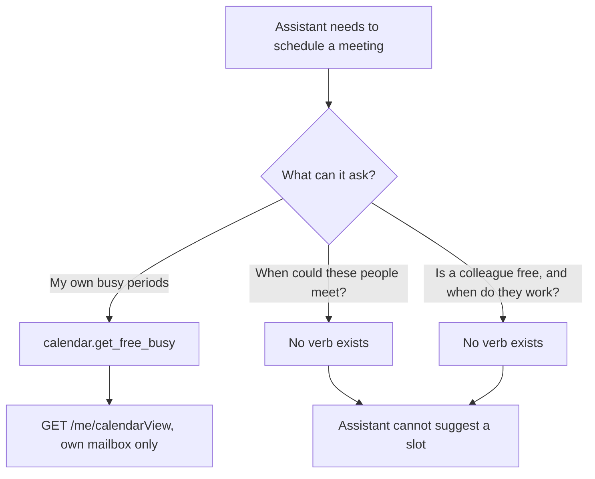
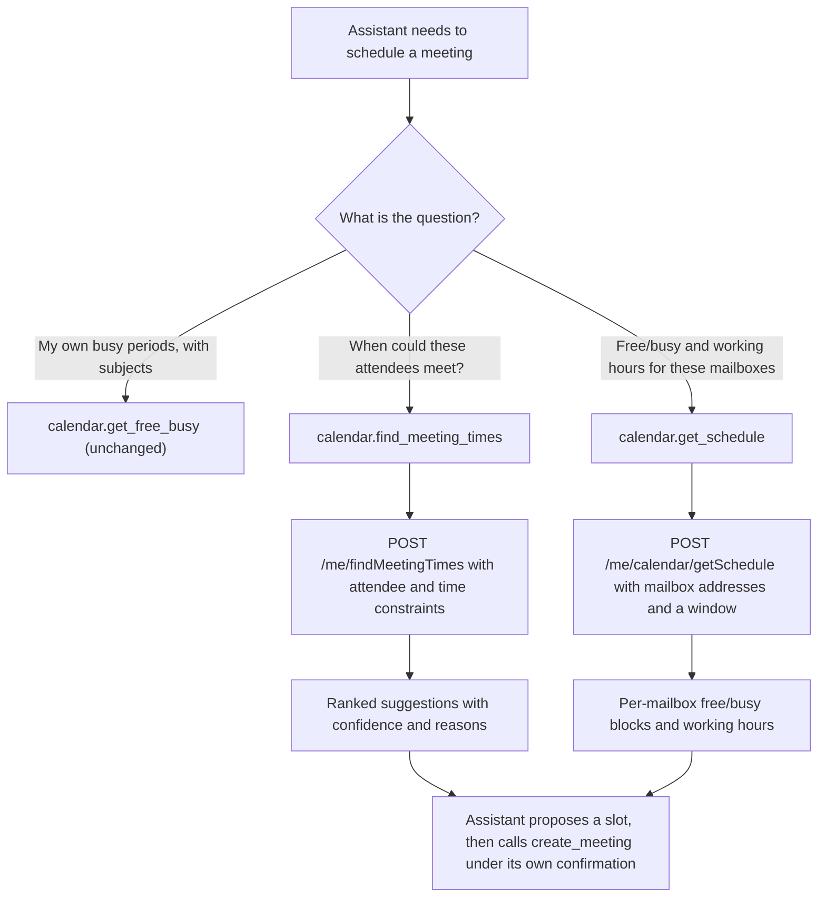
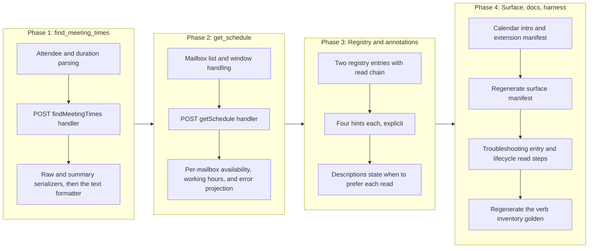

# Calendar Scheduling Reads

## Change Summary

The calendar domain can read one mailbox's own busy periods, but it cannot reason about
scheduling across people. It has no way to ask Microsoft Graph "when could these attendees
all meet?" and no way to read another mailbox's free/busy or working hours. Both are
Graph-native scheduling reads the assistant needs before proposing a meeting time.

This change adds exactly two read verbs to the always-on calendar domain registry:
`find_meeting_times`, backed by `POST /me/findMeetingTimes`, and `get_schedule`, backed by
`POST /me/calendar/getSchedule`. Both are pure reads. Neither writes, sends, or deletes.
No new top-level MCP tool is added; the aggregate tool count stays at four.

This CR follows CR-0078 and CR-0079 in the implementation sequence. Both have landed on
this branch at `caebec3`. This change depends on nothing either introduces and touches no
file either changed, with one exception recorded in Affected Components: the mail work
moved the line numbers in `internal/validate/validate.go`, and this CR's citations were
re-verified against the tree at `caebec3`.

## Motivation and Background

The scheduling gap is the highest-severity open item in the calendar column of the
feature-gap matrix. Two rows name it directly, both marked `4` (needs a CR):

> * **Find meeting times** — No findMeetingTimes verb; the assistant cannot suggest
>   candidate meeting slots from attendee constraints, a headline scheduling-assistant
>   capability. goSdk=yes confirmed (users/item_find_meeting_times_request_builder.go).
> * **Get schedule (free/busy)** — get_free_busy derives busy periods from the signed-in
>   user's own CalendarView (get_free_busy.go:226), not Graph getSchedule; other mailboxes'
>   availability and working hours cannot be queried, so cross-person scheduling is
>   unsupported. goSdk=yes for real getSchedule confirmed
>   (users/item_calendar_get_schedule_request_builder.go).

The existing `get_free_busy` verb is the reason the second row is `partial` rather than
`no`. It calls `client.Me().CalendarView().Get(...)`
(`internal/tools/get_free_busy.go:226`), filters out events whose `showAs` is `free`, and
returns the remainder as busy periods carrying their subjects. That is a single-mailbox,
subject-bearing view of the signed-in user's own calendar. It has no parameter for another
mailbox, no concept of working hours, and it never touches the Graph `getSchedule` action.
A model asked "is my colleague free Thursday afternoon?" cannot answer it, and a model
asked "find a 30-minute slot next week for these four people" has no verb to call.

Both new verbs are reads within scopes the product already holds. `getSchedule` and
`findMeetingTimes` are delegated calls under `Calendars.Read`, which
`Calendars.ReadWrite` (already requested in every configuration) subsumes. The OAuth cost
of closing this gap is zero: no new consent prompt, no new scope, no new dependency.

The blast radius is small by construction. Neither verb writes mailbox state, sends an
invitation, or creates an event. They inform the scheduling decision; the decision is still
executed by the existing `create_meeting` verb under its own confirmation and elicitation
rules.

## Change Drivers

* Cross-person scheduling is the one headline scheduling-assistant capability the calendar
  domain lacks, and both halves of it (suggest slots, read availability) are named and
  deferred in the feature-gap matrix as `4` (needs a CR).
* `get_free_busy` reads only the signed-in user's own `CalendarView` and structurally
  cannot answer a question about another mailbox, so the product advertises a "free/busy"
  capability that stops at the account boundary.
* The Graph `findMeetingTimes` and `getSchedule` actions are v1.0 GA, exposed by request
  builders in the pinned SDK, and require no scope the product does not already request.
* The four aggregate domain tools are a fixed surface, so scheduling reads belong in the
  calendar verb registry rather than in a new top-level tool.
* A read path must expose reads only: these verbs inform a scheduling choice and must not
  acquire the ability to write, send, or delete as they grow.

## Current State

The calendar domain registers fifteen verbs, all always-on with no feature-flag gating,
built in `internal/server/calendar_verbs.go` (`buildCalendarVerbs`, line 80):

| Registration | Verbs |
|---|---|
| Always-on (no gate) | `help`, `list_calendars`, `list_events`, `get_event`, `search_events`, `create_event`, `update_event`, `delete_event`, `respond_event`, `reschedule_event`, `create_meeting`, `update_meeting`, `cancel_meeting`, `reschedule_meeting`, `get_free_busy` |

The only availability read is `get_free_busy` (`buildGetFreeBusyVerb`,
`internal/server/calendar_verbs.go:775`). Its handler, `NewHandleGetFreeBusy`
(`internal/tools/get_free_busy.go:131`), issues one Graph request,
`GET /me/calendarView` (line 226), against the signed-in user's own calendar, and returns
`FreeBusyResponse` (line 76) as busy periods. There is no parameter that names a different
mailbox, and there is no working-hours field. Cross-person scheduling is unrepresented.

Measured facts about the surface as it stands, read from the repository at `caebec3`
rather than assumed:

* `site/src/generated/surface.json` records calendar at `fullCount` 15, `defaultCount` 15
  (the calendar domain is ungated, so every verb counts as default). Totals across the four
  domains are **47 full and 33 default** (calendar 15/15, mail 18/5, account 7/7,
  system 7/6). The five verbs CR-0078 and CR-0079 added to the mail domain are all
  `MailManageEnabled`-gated, which is why the full total rose from 42 to 47 while the
  default total stayed at 33.
* The calendar domain is registered with `Intro` "Calendar operations for Microsoft
  Outlook via Microsoft Graph." (`internal/server/server.go:88`). That introduction
  enumerates no verbs, so it is unaffected by a verb being added.
* `extension/manifest.json` enumerates the calendar verbs in its calendar tool
  description, with no verb missing. Since CR-0078 this is enforced rather than assumed:
  `TestManifestDescribesEveryRegisteredVerb`
  (`internal/server/manifest_sync_test.go:84`) derives its cases from the registry under
  the maximal configuration and fails on any registered verb the manifest description does
  not name, and asserts the `tools` array holds exactly four entries.
* The date shorthand every calendar read publishes is resolved by the package-level helper
  `expandDateParam` (`internal/tools/list_events.go:357`), which `get_free_busy` calls at
  `internal/tools/get_free_busy.go:155`. It is not private to `get_free_busy`.
* `get_free_busy` publishes the three-tier `output` parameter but returns the **same**
  projection for `summary` and for `raw` (`internal/tools/get_free_busy.go:312` onwards).
  The verb that implements the documented three-tier contract is `list_events`, which
  branches on the mode at `internal/tools/list_events.go:299`.

### Current State Diagram



## Proposed Change

Two verbs are added to the always-on tier of `buildCalendarVerbs`. Each is a single Graph
call, each is read-only, and each implements the three output tiers via the `output`
parameter, following `list_events` rather than `get_free_busy` for the summary and raw
distinction (see "Output tiers" below). Each lives in its own handler file under
`internal/tools/`.

### Verb inventory

| Verb | Graph call | Required parameters | Returns |
|---|---|---|---|
| `find_meeting_times` | `POST /me/findMeetingTimes` | `attendees` | ranked candidate meeting-time suggestions with confidence and, on request, the reason each was suggested |
| `get_schedule` | `POST /me/calendar/getSchedule` | `schedules`, and a resolved start and end (explicit datetimes or the `date` shorthand) | per-mailbox free/busy blocks and working hours for one or more mailboxes |

The Graph SDK surfaces confirmed against the pinned `msgraph-sdk-go v1.100.0` in the module
cache, not from documentation, and re-verified line by line at `caebec3`. Both request
builders live under `users/`, which is the v1.0 GA module (`msgraph-beta-sdk-go` is a
separate module, not this one). The builder chain is reachable from the client the handlers
already resolve: `Me()` returns `*users.UserItemRequestBuilder`, which exposes
`FindMeetingTimes()` (`users/user_item_request_builder.go:231`) and `Calendar()`
(`:79`), and `*users.ItemCalendarRequestBuilder` exposes `GetSchedule()`
(`users/item_calendar_request_builder.go:95`):

* **`find_meeting_times`.**
  `users.ItemFindMeetingTimesRequestBuilder.Post`
  (`users/item_find_meeting_times_request_builder.go:43`) returns
  `models.MeetingTimeSuggestionsResultable`. The body is
  `users.NewItemFindMeetingTimesPostRequestBody()`, whose setters
  (`users/item_find_meeting_times_post_request_body.go`) include
  `SetAttendees([]models.AttendeeBaseable)` (line 311),
  `SetTimeConstraint(models.TimeConstraintable)` (line 364),
  `SetMeetingDuration(*ISODuration)` (line 343),
  `SetMaxCandidates(*int32)` (line 336),
  `SetIsOrganizerOptional(*bool)` (line 322),
  `SetMinimumAttendeePercentage(*float64)` (line 350), and
  `SetReturnSuggestionReasons(*bool)` (line 357). The result exposes
  `GetMeetingTimeSuggestions()` and `GetEmptySuggestionsReason()`
  (`models/meeting_time_suggestions_result.go:102` and `:48`); each suggestion exposes
  `GetMeetingTimeSlot()` (`models/meeting_time_suggestion.go:182`), `GetConfidence()`
  (`:60`), `GetOrder()` (`:206`), `GetSuggestionReason()` (`:230`),
  `GetOrganizerAvailability()` (`:218`), and `GetAttendeeAvailability()` (`:43`).

  Two SDK naming details the implementation must not guess. `SetMeetingDuration` takes
  `*serialization.ISODuration` from `github.com/microsoft/kiota-abstractions-go`, parsed
  with `serialization.ParseISODuration` (`serialization/iso_duration.go:83`), not a
  `time.Duration`. And `models.AttendeeBase` (`models/attendee_base.go:14`) embeds
  `Recipient`, so the address is set through `SetEmailAddress`
  (`models/recipient.go:150`) and the attendee type through `SetTypeEscaped`
  (`models/attendee_base.go:89`), not `SetType`; this is the same Kiota escaping the
  existing `parseAttendees` already works around at `internal/tools/create_event.go:466`.
* **`get_schedule`.**
  `users.ItemCalendarGetScheduleRequestBuilder.PostAsGetSchedulePostResponse`
  (`users/item_calendar_get_schedule_request_builder.go:66`) returns a response whose
  `GetValue()` is `[]models.ScheduleInformationable`
  (`users/item_calendar_get_schedule_post_response.go:50`). The body is
  `users.NewItemCalendarGetSchedulePostRequestBody()`, with
  `SetSchedules([]string)` (line 207),
  `SetStartTime(models.DateTimeTimeZoneable)` (line 214),
  `SetEndTime(models.DateTimeTimeZoneable)` (line 200), and
  `SetAvailabilityViewInterval(*int32)` (line 189). Each `ScheduleInformation` exposes
  `GetScheduleId()` (`models/schedule_information.go:156`), `GetAvailabilityView()`
  (`:43`), `GetScheduleItems()` (`:168`), `GetWorkingHours()` (`:180`), and `GetError()`
  (`:60`); each `ScheduleItem` exposes `GetStart()` (`models/schedule_item.go:172`),
  `GetEnd()` (`:48`), `GetStatus()` (`:184`), `GetSubject()` (`:196`), and `GetLocation()`
  (`:148`). The per-mailbox error FR-10 requires is `models.FreeBusyErrorable`, whose
  readable content is `GetMessage()` (`models/free_busy_error.go:84`) and
  `GetResponseCode()` (`:108`). `GetWorkingHours()` returns `models.WorkingHoursable`,
  exposing `GetDaysOfWeek()` (`models/working_hours.go:48`), `GetStartTime()` (`:146`),
  `GetEndTime()` (`:60`), and `GetTimeZone()` (`:158`); the two time fields are
  `*serialization.TimeOnly`, not strings.

### Reconciliation with get_free_busy: complement, do not supersede

`get_schedule` **complements** `get_free_busy`; it does not replace it, and this change
does not deprecate or remove `get_free_busy`. The two answer different questions from
different Graph endpoints, and neither subsumes the other:

* `get_free_busy` reads the signed-in user's **own** `CalendarView`, so it can and does
  return the **subject** of each busy period (`internal/tools/get_free_busy.go:273`). That
  subject-bearing, own-calendar view is what a user relies on when the model says "you are
  busy 2 to 3 with the budget review." `getSchedule` does not reliably return subjects for
  a mailbox other than the caller's, by design, because that would leak another person's
  calendar detail.
* `get_schedule` reads **any** mailbox the caller is permitted to see, returns an
  `availabilityView` string and **working hours** that `get_free_busy` has no concept of,
  and accepts **multiple** mailboxes in one call. `get_free_busy` cannot name a second
  mailbox at all.

Superseding `get_free_busy` with `get_schedule` was considered and rejected (see
Alternative Approaches): it would be a breaking removal of a shipped verb, it would lose
the own-calendar subject view, and it would break the tests and the lifecycle harness that
already exercise `get_free_busy`. The two verbs are kept distinct, and each verb's
description states when to prefer it over the other so the model does not treat them as
interchangeable.

### Annotation matrix

Each verb declares all four hints explicitly, per the project rule that a verb cannot be
registered without its own classification and that the aggregate is computed from the
registry.

| Verb | `readOnlyHint` | `destructiveHint` | `idempotentHint` | `openWorldHint` |
|---|---|---|---|---|
| `find_meeting_times` | `true` | `false` | `true` | `true` |
| `get_schedule` | `true` | `false` | `true` | `true` |

Justification, hint by hint, because an unjustified hint is the defect the annotation
accuracy rule exists to prevent:

* **`readOnlyHint: true` for both.** Neither writes mailbox state, creates an event, sends
  an invitation, or deletes anything. Each issues one read against Microsoft Graph and
  returns a projection of the response. This matches `get_free_busy`, the existing
  availability read, which is classified `readOnlyHint: true`
  (`internal/server/calendar_verbs.go:785`).
* **`destructiveHint: false` for both.** A read removes nothing and makes nothing
  unaddressable. `findMeetingTimes` and `getSchedule` are POST-with-a-body reads (the
  request body carries the query, not a mutation), which is a Graph convention for reads
  whose input is too large for a query string; the HTTP verb does not make them writes.
* **`idempotentHint: true` for both.** Repeating either call with identical arguments over
  an unchanged mailbox returns the same result. Suggestions and availability can shift as
  calendars change, but that is a property of the data, not of the operation; the call
  itself carries no side effect and no sequence dependence, which is the same basis on
  which `get_free_busy` is classified idempotent.
* **`openWorldHint: true` for both.** Each calls Microsoft Graph.

The aggregate fold is unchanged by these values. The calendar tool already publishes
`readOnlyHint: false`, `destructiveHint: true`, and `idempotentHint: false` because the
write verbs force them (`create_event` forces non-read-only and non-idempotent,
`delete_event` forces destructive). Adding two read-only, non-destructive, idempotent verbs
cannot move any of those folded values, so the published annotation table stays correct as
written.

### Schema notes

Every default and bound below is a literal value, not a placeholder. Where a value is a
Microsoft Graph service-side limit it is marked as such, because the pinned SDK does not
encode service limits and the figure therefore rests on Microsoft's published
documentation rather than on a tier 1 reading; a limit the service rejects surfaces through
the existing redaction path with Graph's own message.

`find_meeting_times` parameters:

* `attendees` (**required**): a JSON array of
  `{"email":"...","name":"...","type":"required|optional|resource"}` objects, the same shape
  `create_meeting` already publishes (`internal/server/calendar_verbs.go:593`), parsed into
  `[]models.AttendeeBaseable`. `name` is accepted and ignored so a caller can pass one
  attendee list to both verbs. Each email is validated with `validate.ValidateEmail`
  (`internal/validate/validate.go:95`) and each non-empty type with
  `validate.ValidateAttendeeType` (`:288`), converted with `graph.ParseAttendeeType`
  (`internal/graph/enums.go:17`), matching what `parseAttendees` does at
  `internal/tools/create_event.go:435`. The list is capped at the same `maxAttendees` = 500
  the calendar domain already enforces (`internal/tools/create_event.go:28`).
* `meeting_duration`: an ISO 8601 duration such as `PT30M`, parsed with
  `serialization.ParseISODuration` and passed to `SetMeetingDuration`. The handler applies
  `PT30M` when the parameter is omitted, so the request body always carries a duration.
* `start_datetime` and `end_datetime`: the bounds of the search window, mapped to a single
  `TimeSlot` inside a `TimeConstraint`. Both are optional, and they are supplied together
  or not at all: when both are present each is validated with `validate.ValidateDatetime`
  (`internal/validate/validate.go:63`) and the constraint is set; when both are absent the
  handler omits `TimeConstraint` entirely and Graph applies its own default window; when
  exactly one is present the call is refused, because a half-open window has no honest
  reading. No `date` shorthand is published on this verb.
* `max_candidates`: maximum suggestions to return, passed to `SetMaxCandidates`. The
  handler applies 20 when omitted, and the schema declares `mcp.Min(1)` and `mcp.Max(100)`,
  mirroring the `max_results` bound the calendar domain already publishes
  (`internal/server/calendar_verbs.go:176`).
* `minimum_attendee_percentage`: the minimum percentage of attendees that must be free for
  a slot to be suggested, passed to `SetMinimumAttendeePercentage`. Graph's units are
  percent, so the schema declares `mcp.Min(0)` and `mcp.Max(100)`. Omitted from the request
  body when the caller does not supply it, leaving Graph's own default in force.
* `is_organizer_optional`: whether the organizer's own availability constrains the search,
  passed to `SetIsOrganizerOptional`. Omitted from the body when not supplied.
* `timezone`, `account`, and `output` follow the shapes `get_free_busy` already publishes
  (`internal/server/calendar_verbs.go:800` onwards), including the `output` enum
  `text`, `summary`, `raw`.

`get_schedule` parameters:

* `schedules` (**required**): the SMTP addresses of the mailboxes to query, as a
  comma-separated list, split and trimmed, each validated with `validate.ValidateEmail`,
  and passed to `SetSchedules`. The ceiling is **20 mailboxes per call**, which is Graph's
  own documented `getSchedule` limit, enforced before the request so the refusal names the
  ceiling instead of surfacing a service error.
* `start_datetime` and `end_datetime`, or the `date` shorthand, resolved by calling the
  package-level `expandDateParam` (`internal/tools/list_events.go:357`) exactly as
  `get_free_busy` does at `internal/tools/get_free_busy.go:155`, with explicit datetimes
  taking precedence over `date`. The resolved bounds are mapped to `DateTimeTimeZone`
  values and passed to `SetStartTime` and `SetEndTime`.
* `availability_view_interval`: the granularity in minutes of the returned
  `availabilityView` string, passed to `SetAvailabilityViewInterval`. The handler applies
  30 when omitted, and the schema declares `mcp.Min(5)` and `mcp.Max(1440)`, which are
  Graph's own documented bounds for this field.
* `timezone`, `account`, and `output` follow the shapes `get_free_busy` already publishes.

Neither verb declares any parameter, in any form, that writes, sends, replies, forwards, or
deletes. Their only outputs are projections of the Graph read response.

### Output tiers: the precedent is list_events, not get_free_busy

`get_free_busy` publishes the three-tier `output` parameter but returns the same
`FreeBusyResponse` projection for both `summary` and `raw`
(`internal/tools/get_free_busy.go:312` onwards). That is a pre-existing deviation from the
documented contract, which states that `raw` returns "the full, unmodified Graph API
serialisation including empty values" (`docs/concepts.md`, Output tiers), and from the
project rule that a summary field set is chosen deliberately per verb via a dedicated
serialization function rather than derived from raw. This change does not inherit the
deviation and does not fix it either; fixing `get_free_busy` would violate FR-16.

The two new verbs follow `list_events` instead, which branches on the mode at
`internal/tools/list_events.go:299`: `raw` serialises the full Graph object, `summary`
calls a dedicated summary serializer, and `text` formats the summary projection. Four new
serializers in `internal/graph/scheduling_serialize.go` carry that, named after the
existing pair `SerializeEvent` / `SerializeSummaryEvent`
(`internal/graph/serialize.go:203`):

| Function | Tier | Input |
|---|---|---|
| `SerializeMeetingTimeSuggestion` | raw | `models.MeetingTimeSuggestionable` |
| `SerializeSummaryMeetingTimeSuggestion` | summary and text | `models.MeetingTimeSuggestionable` |
| `SerializeScheduleInformation` | raw | `models.ScheduleInformationable` |
| `SerializeSummaryScheduleInformation` | summary and text | `models.ScheduleInformationable` |

### Proposed State Diagram



## Requirements

### Functional Requirements

1. The system **MUST** register exactly two new verbs in the calendar domain verb registry,
   named `find_meeting_times` and `get_schedule`, and **MUST NOT** register any new
   top-level MCP tool; the registered tool count **MUST** remain four.
2. Both verbs **MUST** be registered unconditionally, consistent with the calendar domain
   having no feature-flag gating, and **MUST** appear in the calendar tool's operation enum
   in every configuration.
3. `find_meeting_times` **MUST** require an `attendees` parameter, **MUST** parse it into
   `[]models.AttendeeBaseable`, and **MUST** issue exactly one `POST /me/findMeetingTimes`
   request carrying the parsed attendees.
4. `find_meeting_times` **MUST** validate every attendee email with `validate.ValidateEmail`
   and every attendee type with `validate.ValidateAttendeeType`, and **MUST** reject an
   invalid attendee before any Graph request is issued.
5. `find_meeting_times` **MUST** accept an optional `meeting_duration` as an ISO 8601
   duration, **MUST** apply `PT30M` when it is omitted, and **MUST** reject a value
   `serialization.ParseISODuration` cannot parse before any Graph request is issued.
6. `find_meeting_times` **MUST** map `start_datetime` and `end_datetime` to a Graph
   `TimeConstraint` when both are supplied, **MUST** validate each with
   `validate.ValidateDatetime` before any Graph request is issued, **MUST** omit the
   `TimeConstraint` from the request body when both are absent, and **MUST** reject the
   call before any Graph request is issued when exactly one of the two is supplied.
7. `get_schedule` **MUST** require a `schedules` parameter naming one or more mailbox SMTP
   addresses, **MUST** validate each with `validate.ValidateEmail`, **MUST** reject a call
   naming more than twenty mailboxes before any Graph request is issued with an error
   naming that ceiling, and **MUST** issue exactly one `POST /me/calendar/getSchedule`
   request carrying the addresses.
8. `get_schedule` **MUST** require a resolved start and end, accepting either explicit
   `start_datetime` and `end_datetime` or the `date` shorthand, **MUST** resolve the
   shorthand by calling `expandDateParam` (`internal/tools/list_events.go:357`) with
   explicit datetimes taking precedence, and **MUST** reject a request that resolves to no
   window before any Graph request is issued.
9. `get_schedule` **MUST** return, for each queried mailbox, its free/busy blocks and its
   working hours, and **MUST** attribute each block to the mailbox it belongs to so a
   caller can tell whose availability it is reading.
10. `get_schedule` **MUST** surface a per-mailbox error returned by Graph (for example a
    mailbox the caller may not view) as a stated error for that mailbox, rather than
    silently omitting the mailbox or failing the whole call.
11. Both verbs **MUST** be read-only: each verb **MUST NOT** write mailbox state,
    **MUST NOT** create or update an event, **MUST NOT** send or forward an invitation,
    **MUST NOT** delete anything, and **MUST NOT** declare any parameter that does any of
    those.
12. Both verbs **MUST** implement all three output tiers via an `output` parameter accepting
    `text`, `summary`, and `raw`, and **MUST NOT** return a write confirmation. `raw`
    **MUST** return the full Graph serialisation of the response objects and `summary`
    **MUST** return a deliberately chosen field set produced by a dedicated summary
    serialization function, following `list_events`
    (`internal/tools/list_events.go:299`) rather than `get_free_busy`, which returns the
    same projection for both modes.
13. Both verbs **MUST** declare all four annotation hints explicitly, with the values given
    in the annotation matrix above.
14. Both verbs **MUST** be wrapped by the read middleware chain (authentication, account
    resolution, observability, audit) under the identity `calendar.<verb>`, so the audit
    record and the OpenTelemetry attributes carry the same `{domain}.{operation}` identity
    as every other verb, and **MUST NOT** be wrapped by the read-only guard, because a read
    is not blocked in read-only mode.
15. Both verbs **MUST** route their Graph call through `graph.RetryGraphCall` and
    `graph.WithTimeout`, **MUST** report a timeout with `graph.TimeoutErrorMessage`, and
    **MUST** redact Graph errors with the existing helpers, so retry, timeout, and redaction
    behaviour is identical to the calendar reads already registered.
16. The change **MUST NOT** alter, deprecate, or remove `get_free_busy`; that verb keeps its
    own-calendar, subject-bearing behaviour unchanged.
17. Each new verb's `Description` **MUST** state when to prefer it over `get_free_busy` (and,
    for `find_meeting_times`, over `get_schedule`), so the model does not treat the three
    availability reads as interchangeable.
18. Both verbs **MUST** carry a non-empty `Summary` of at most eighty characters, a
    non-empty `Description` stating their parameters and their annotation semantics, at
    least one `Examples` entry, and at least one `SeeDocs` reference that resolves to an
    existing heading in the embedded documentation bundle.
19. The calendar domain introduction registered at `internal/server/server.go:88` **MUST**
    remain accurate. It reads "Calendar operations for Microsoft Outlook via Microsoft
    Graph." and enumerates no verb, so this change **MUST** leave it unchanged; a change
    that makes it enumerate verbs **MUST** name both new verbs.
20. The calendar entry of `extension/manifest.json` **MUST** enumerate the two new verbs,
    and the manifest's `tools` array **MUST** remain exactly four entries, because no new
    top-level tool is added. Both halves are already enforced by
    `TestManifestDescribesEveryRegisteredVerb`
    (`internal/server/manifest_sync_test.go:84`), which derives its cases from the registry,
    so the manifest edit **MUST** land in the same change as the registry entries.
21. The generated surface manifest `site/src/generated/surface.json` **MUST** be regenerated
    with `make surface-manifest` and committed in the same change, so the published website
    states the surface that exists.
22. `docs/prompts/mcp-tool-crud-test.md` **MUST** gain one lifecycle step per verb,
    appended as Step 42 (`find_meeting_times`) and Step 43 (`get_schedule`) after the
    existing Step 41, each a read with no cleanup step because neither creates a resource
    to delete. The change **MUST NOT** renumber any existing step, because
    `docs/bench/crud-runs.csv` carries historical rows that reference step numbers, and
    **MUST NOT** add either step to a skip range, because the calendar domain is ungated.
23. The committed verb inventory golden `verbInventoryGolden`
    (`internal/tools/dispatch_registry_test.go:39`) **MUST** be regenerated to include the
    two new identities with their hints, in the canonical form
    `"domain.operation ro=%t de=%t id=%t ow=%t"`, sorted.
24. The change **MUST NOT** alter the OAuth scope set requested in any configuration:
    `Calendars.ReadWrite` already covers both verbs, and no send scope is introduced.
25. Every numeric parameter either verb publishes **MUST** declare its bound in the schema
    and **MUST** reject an out-of-bound value before any Graph request is issued:
    `max_candidates` in 1 to 100 defaulting to 20, `minimum_attendee_percentage` in 0 to
    100 with no default, and `availability_view_interval` in 5 to 1440 defaulting to 30.
    A parameter with no default **MUST** be omitted from the Graph request body when the
    caller does not supply it, so the service's own default stays in force rather than
    being shadowed by one this server invents.

### Non-Functional Requirements

1. Each verb's handler **MUST** live in its own file under `internal/tools/`, named for the
   verb, mirroring the existing one-file-per-verb layout of the calendar domain. The text
   formatters **MUST** live in `internal/tools/text_format.go` alongside
   `FormatFreeBusyText` (`internal/tools/text_format.go:210`), per the project rule that
   text formatters live in that file, and the serializers **MUST** live in a new
   `internal/graph/scheduling_serialize.go`, mirroring `internal/graph/serialize.go` and
   `internal/graph/mail_serialize.go`.
2. Each verb **MUST** issue exactly one Graph request on the success path, with no
   read-modify-write round trip and no per-mailbox fan-out (`getSchedule` accepts all
   mailboxes in a single request).
3. The composed calendar tool description **MUST** stay below the 4 000-character bound
   asserted by `TestDescriptionLengthBounded`
   (`internal/tools/description_quality_test.go:147`, `const maxLen = 4000`). Measured at
   `caebec3`, the calendar description is **2 123 characters**, so the two additional
   inventory lines have 1 877 characters of headroom. The test decides, not this figure.
4. The cold-start schema reduction **MUST** stay at or above the 60% floor asserted by
   `TestColdStartSchemaSize_Reduction` (`internal/server/schema_size_test.go:39`,
   `minRequiredReductionPct = 60` at line 30). Measured at `caebec3`: 18 857 bytes against
   a documented 74 000-byte baseline, a **74% reduction** against a 60% floor.
5. Every error raised by either verb **MUST** carry a fix instruction naming what to supply
   or correct, and **MUST** reach the tool result. Where the failure path emits a log
   record, that record **MUST** carry the same report, so a headless caller that cannot
   read an interactive surface still receives the correction. This requirement does not
   oblige a validation refusal that emits no log record to start emitting one.
6. The change **MUST NOT** add a third-party dependency.
7. Both verbs **MUST** be deterministic in their projection: given identical Graph
   responses, each **MUST** produce byte-identical output in each of the three tiers,
   including the ordering of mailboxes and of suggestions.

## Affected Components

Source:

* `internal/tools/find_meeting_times.go` (new): the `find_meeting_times` handler
  constructor, the attendee and duration parsing, and the suggestions projection.
* `internal/tools/get_schedule.go` (new): the `get_schedule` handler constructor, the
  mailbox and window handling, and the per-mailbox availability and working-hours
  projection, including the per-mailbox error surfacing of FR-10.
* `internal/graph/scheduling_serialize.go` (new): the four raw and summary serializers
  named in the output-tier table, mirroring `internal/graph/serialize.go` and
  `internal/graph/mail_serialize.go`.
* `internal/tools/text_format.go`: two formatters appended, `FormatMeetingTimeSuggestionsText`
  and `FormatScheduleText`, alongside the existing `FormatFreeBusyText` (line 210). No new
  formatter file is created: `CLAUDE.md` names this file as the home for text formatters,
  and the nearest precedent, the availability formatter these two sit beside, is already
  here.
* `internal/server/calendar_verbs.go`: two new `build*Verb` constructors appended to the
  always-on slice returned by `buildCalendarVerbs` (line 99), carrying `Summary`,
  `Description`, `Examples`, `SeeDocs`, `Annotations`, and `Schema` per FR-13 and FR-18,
  each wrapped with the read chain (`wrap`, line 86) under the identity `calendar.<verb>`
  and the audit operation `read`.
* `internal/server/server.go`: the calendar domain `Intro` (line 88) is verified accurate
  and **left unchanged** per FR-19; it enumerates no verbs.
* `extension/manifest.json`: the calendar tool description. The `tools` array itself is
  **unchanged at four entries**.
* `site/src/generated/surface.json`: regenerated, not hand-edited. Calendar moves from 15
  to 17 `fullCount` and from 15 to 17 `defaultCount` (the domain is ungated); totals move
  from **47 to 49 full** and from **33 to 35 default**, measured against the tree at
  `caebec3` after CR-0078 and CR-0079 landed. Gate attribution is derived by probe, so no
  mapping needs maintaining.
* `internal/validate/validate.go`: **no change required.** Both validators the handlers
  need already exist, `ValidateEmail` at line 95 and `ValidateAttendeeType` at line 288.
  The line numbers moved from 87 and 234 when CR-0078 and CR-0079 added validators; the
  functions themselves are unchanged.

Tests:

* `internal/tools/find_meeting_times_test.go` (new): the handler tests for
  `find_meeting_times`.
* `internal/tools/get_schedule_test.go` (new): the handler tests for `get_schedule`.
* `internal/tools/scheduling_read_verbs_test.go` (new): the cross-verb assertions shared by
  both handlers (timeout reporting, redaction, formatter determinism), following the
  precedent `internal/tools/mail_write_verbs_test.go` set for CR-0078.
* `internal/graph/scheduling_serialize_test.go` (new): the raw and summary serializer
  tests.
* `internal/server/calendar_verbs_test.go` (**new file**): the registry-derived assertions
  for the calendar domain. This file does not exist today; `internal/server/mail_verbs_test.go`
  is its counterpart for the mail domain and is the pattern to follow.
* `internal/tools/tool_annotations_test.go`: one new value assertion per the project's
  annotation rule, following `TestMailManagementVerbAnnotations` (line 450).
* `internal/server/server_test.go`: one new registration assertion.
* `internal/tools/dispatch_registry_test.go`: the `verbInventoryGolden` slice (line 39),
  regenerated per FR-23.

Documentation and harness:

* `docs/concepts.md`: no new concept is required; the output-tier and multi-account
  sections already cover the shape of these reads. The CR asserts this rather than leaving
  it to inference. The file is therefore **not edited**, and no entry in
  `internal/docs/catalog_test.go` is needed.
* `docs/troubleshooting.md`: an entry for `get_schedule` returning a per-mailbox error for a
  mailbox the caller may not view, which is the one new failure mode a caller cannot
  diagnose from the raw Graph response alone. It carries a stable anchor, following the
  `{#anchor}` convention the file already uses (for example
  `## Move destination not found {#move-destination-not-found}`).
* `docs/prompts/mcp-tool-crud-test.md`: Steps 42 and 43 appended after the existing Step 41
  (FR-22).
* `scripts/crud-test.sh`: **no change required.** Its per-domain accounting keys on the MCP
  tool name `mcp__outlook-local-mcp__calendar`, not on the operation verb, so additional
  calendar verbs raise the existing calendar counter without a schema change.
* `docs/bench/crud-runs.csv`: **no column change.** The header is per-domain, not per-verb;
  new runs record a higher calendar call count and more turns.
* `README.md`, `docs/readme.md`, `llms.txt`, `internal/docs/llmstxt.go`,
  `internal/config/inventory.go`: **no change required.** No configuration variable is
  added and no gate changes, so nothing these files state about the surface becomes false.

## Scope Boundaries

### In Scope

* Exactly two new calendar read verbs: `find_meeting_times` and `get_schedule`.
* Their handlers, registry entries, annotations, schemas, raw and summary serializers, text
  formatters, and unit tests.
* The per-mailbox error surfacing that `getSchedule` requires.
* The extension manifest calendar description and the regenerated surface manifest. The
  calendar domain introduction is verified accurate and left unchanged.
* One troubleshooting entry and the two lifecycle harness read steps, appended as Steps 42
  and 43.

### Out of Scope ("Here, But Not Further")

* **Any write, send, or delete.** Neither verb writes, and this CR adds no capability to
  create a meeting from a suggested slot, forward an event, or respond to an invitation.
  Acting on a suggestion is the existing `create_meeting` verb's job, under its own
  confirmation and elicitation rules.
* **Replacing or deprecating `get_free_busy`.** It stays as the own-calendar,
  subject-bearing availability read (FR-16). A future consolidation of the three
  availability reads, if it is ever wanted, is a separate change with its own migration
  design.
* **Event attachments.** Adding, getting, and listing event attachments are separate
  matrix rows (each `4`, needs its own CR) and are not touched here.
* **Reminder view, dismiss reminder, snooze reminder.** All marked `3` (out of scope) in
  the matrix; not added.
* **Forwarding an event.** `POST /me/events/{id}/forward` is a sending capability, marked
  `3` in the matrix's sending section; not added.
* **Calendar sharing, permissions, and calendar-group management.** All marked `3` in the
  matrix; not touched.
* **Meeting-time suggestions as an automatic booking loop.** `find_meeting_times` returns
  suggestions for a human-in-the-loop decision. It does not chain into a booking call, and
  it must not.
* **Adding a `getSchedule`-backed path to `get_free_busy`.** Bolting cross-mailbox support
  onto the existing CalendarView handler is rejected in favour of a distinct verb; see
  Alternative Approaches.

## Alternative Approaches Considered

* **Supersede `get_free_busy` with `get_schedule`.** Fewer verbs, one availability read
  instead of two. Rejected: it is a breaking removal of a shipped verb, it loses the
  own-calendar subject view that `get_free_busy` uniquely provides (getSchedule does not
  return subjects for other mailboxes by design), and it breaks the tests and the lifecycle
  harness that already exercise `get_free_busy`. The two verbs answer different questions
  and are kept distinct.
* **One combined `availability` verb dispatching between findMeetingTimes and getSchedule
  on a mode flag.** Rejected: they are different Graph operations with different required
  inputs (attendee constraints versus a mailbox list plus a window) and different output
  shapes (ranked suggestions versus per-mailbox free/busy plus working hours). One verb
  could not carry one honest required-parameter list in the description an LLM reads, which
  is the same reason the mail write verbs were kept separate rather than folded into one.
* **Extend `get_free_busy` to accept other mailboxes.** Rejected: `get_free_busy` is
  CalendarView-based and single-mailbox by construction; cross-mailbox availability comes
  from a different endpoint (`getSchedule`) with a different response, so the handler would
  fork into two unrelated code paths behind one verb, which is exactly the ambiguity
  separate verbs remove.
* **Fan `getSchedule` out to one request per mailbox.** Rejected: `getSchedule` accepts all
  mailboxes in a single request, so per-mailbox fan-out would multiply Graph calls and
  latency for no benefit and lose the single-request idempotence NFR-2 requires.

## Impact Assessment

### User Impact

A user gains two scheduling reads the assistant has never had: "find a time these people
can all meet" and "show me these mailboxes' free/busy and working hours." Nothing changes
for the own-calendar view the user already relies on, because `get_free_busy` is untouched.
No write, send, or delete capability is added, so the change cannot surprise a user by
acting on their calendar or on anyone else's.

The one behaviour a user must understand is that `get_schedule` reads only mailboxes the
signed-in account is permitted to see, and reports a per-mailbox error for one it may not.
The troubleshooting entry states this so it is disclosed rather than discovered.

### Technical Impact

No breaking change, no schema migration, no new dependency, and no new OAuth scope. The
calendar tool grows by two operation-enum entries and two inventory lines. Both measured
gates keep their margins, measured at `caebec3` rather than asserted: the calendar
description is 2 123 of 4 000 characters, and the cold-start schema reduction is 74%
against a 60% floor. Because the
calendar domain is ungated, the two verbs appear in every configuration, so the default and
full surface counts both rise by two.

### Business Impact

Low cost against the highest-severity open calendar gap. The work is two read handlers of
the same shape as `get_free_busy`, plus their formatters and tests. The risk concentrates
in the two projections (mapping the Graph suggestion and schedule shapes into readable
output), which the test strategy pins.

## Implementation Approach

### Implementation Flow



### Phase 1: find_meeting_times

1. `internal/graph/scheduling_serialize.go`: add `SerializeMeetingTimeSuggestion` (raw, the
   full Graph object including empty values) and `SerializeSummaryMeetingTimeSuggestion`
   (the curated field set: the time slot start and end, the confidence, the order, the
   organizer availability, and the suggestion reason when present), following the shape of
   `SerializeEvent` and `SerializeSummaryEvent` (`internal/graph/serialize.go:203`).
2. `internal/tools/find_meeting_times.go`: `NewHandleFindMeetingTimes(retryCfg, timeout,
   defaultTimezone)`. Validate the output mode with `ValidateOutputMode`
   (`internal/tools/output.go:26`), resolve the Graph client, require and parse `attendees`
   into `[]models.AttendeeBaseable` validating each email and non-empty type and capping the
   list at `maxAttendees`, parse the optional `meeting_duration` with
   `serialization.ParseISODuration` (default `PT30M`), map `start_datetime` and
   `end_datetime` to a `TimeConstraint` under the both-or-neither rule of FR-6, apply the
   FR-25 defaults and bounds for `max_candidates`, `minimum_attendee_percentage`, and
   `is_organizer_optional`, and `POST` via `client.Me().FindMeetingTimes().Post(...)`
   through `graph.RetryGraphCall` and `graph.WithTimeout` (FR-15).
3. Project `GetMeetingTimeSuggestions()` through the serializer chosen by the output mode,
   and carry `GetEmptySuggestionsReason()` when the list is empty so a caller learns why no
   slot was offered.
4. Add `FormatMeetingTimeSuggestionsText` to `internal/tools/text_format.go`, formatting the
   summary projection as a numbered list with a total count, following `FormatEventsText`
   (line 31) and `FormatFreeBusyText` (line 210).

**Affected components:** `internal/graph/scheduling_serialize.go` (new),
`internal/graph/scheduling_serialize_test.go` (new),
`internal/tools/find_meeting_times.go` (new),
`internal/tools/find_meeting_times_test.go` (new),
`internal/tools/text_format.go`.

### Phase 2: get_schedule

1. `internal/graph/scheduling_serialize.go`: add `SerializeScheduleInformation` (raw) and
   `SerializeSummaryScheduleInformation` (the curated field set: the schedule id, the
   availability view string, the schedule items' start, end and status, the working hours'
   days, start, end and timezone, and the per-mailbox error's message and response code
   when `GetError()` is non-nil).
2. `internal/tools/get_schedule.go`: `NewHandleGetSchedule(retryCfg, timeout,
   defaultTimezone)`. Validate the output mode, require and split `schedules`, validate each
   email, enforce the twenty-mailbox ceiling (FR-7), resolve the window from explicit
   datetimes or the `date` shorthand via `expandDateParam` (FR-8), apply the FR-25 default
   and bounds for `availability_view_interval`, and `POST` via
   `client.Me().Calendar().GetSchedule().PostAsGetSchedulePostResponse(...)` through
   `graph.RetryGraphCall` and `graph.WithTimeout`, reading `GetValue()`.
3. Project each `ScheduleInformation` into a per-mailbox record; when `GetError()` is
   non-nil for a mailbox, record that mailbox's error instead of its blocks and keep the
   other mailboxes' blocks (FR-10). Preserve the order in which the caller named the
   mailboxes so the projection is deterministic (NFR-7).
4. Add `FormatScheduleText` to `internal/tools/text_format.go`, using labeled per-mailbox
   sections and a total count.

**Affected components:** `internal/graph/scheduling_serialize.go`,
`internal/graph/scheduling_serialize_test.go`, `internal/tools/get_schedule.go` (new),
`internal/tools/get_schedule_test.go` (new), `internal/tools/text_format.go`,
`internal/tools/scheduling_read_verbs_test.go` (new, the cross-verb timeout, redaction, and
determinism assertions covering both handlers).

### Phase 3: Registry entries and annotations

1. Add two `build*Verb` constructors to `internal/server/calendar_verbs.go` and append them
   to the slice returned by `buildCalendarVerbs` (line 99), each wrapped with `wrap`
   (line 86) under the identity `calendar.<verb>` and the audit operation `read` (FR-14).
2. Populate `Summary` (at most eighty characters), `Description`, `Examples`, and `SeeDocs`
   for each. The description states the parameters, the annotation semantics, and when to
   prefer the verb over the other availability reads (FR-17). `SeeDocs` points at
   `concepts#output-tiers`.
3. Declare all four annotation hints explicitly on each verb, per the matrix (FR-13).
4. Declare each verb's `Schema`, marking the required parameters (`attendees` for
   `find_meeting_times`; `schedules` plus a resolvable window for `get_schedule`), the
   FR-25 numeric bounds via `mcp.Min` and `mcp.Max`, and the `output` tier parameter with
   the enum `text`, `summary`, `raw` (FR-12).
5. Create `internal/server/calendar_verbs_test.go` and add the registry-derived assertions:
   both verbs present in the always-on slice, neither wrapped by `ReadOnlyGuard`, and each
   carrying the `calendar.<verb>` identity in its audit and telemetry wrapping (FR-14),
   following `TestMailManagementVerbsCarryDotIdentity`
   (`internal/server/mail_verbs_test.go:359`) and
   `TestReadOnlyBlocksMailManagementVerbs` (`internal/server/readonly_test.go:151`).
6. Add the annotation value assertion to `internal/tools/tool_annotations_test.go` per the
   project rule that a new verb adds one alongside the existing annotation tests.

At the end of this phase `TestVerbInventoryUnchangedAfterUpgrade`,
`TestCommittedManifestMatchesRecord`, and `TestManifestDescribesEveryRegisteredVerb` all
fail, because each compares a committed record against the live registry. That is the
checks reporting the intended change, not a defect; Phase 4 closes all three. Inspect each
delta before regenerating.

**Affected components:** `internal/server/calendar_verbs.go`,
`internal/server/calendar_verbs_test.go` (new), `internal/tools/tool_annotations_test.go`,
`internal/server/server_test.go`.

### Phase 4: Surface, documentation, and harness

1. Verify the calendar domain `Intro` at `internal/server/server.go:88` is still accurate
   and leave it unchanged (FR-19); it enumerates no verbs.
2. Extend the calendar tool description in `extension/manifest.json` with the two verbs,
   leaving the `tools` array at four entries (FR-20). `TestManifestDescribesEveryRegisteredVerb`
   matches verb names on word boundaries, so each name must appear literally.
3. Run `make surface-manifest` and commit `site/src/generated/surface.json` (FR-21).
   `make ci` fails on a stale manifest via the `surface-check` target, and `make test` fails
   via `TestCommittedManifestMatchesRecord`, so this step is not optional. Confirm the
   regenerated file records calendar at 17 full and 17 default and totals at 49 full and 35
   default.
4. Add the troubleshooting entry for a per-mailbox `getSchedule` error with a stable
   `{#anchor}`.
5. Append Steps 42 and 43 to `docs/prompts/mcp-tool-crud-test.md` (FR-22), renumbering
   nothing and adding neither to a skip range.
6. Regenerate `verbInventoryGolden` in `internal/tools/dispatch_registry_test.go` from the
   failing test's own logged output and review the delta, which must be exactly two added
   lines: `calendar.find_meeting_times ro=true de=false id=true ow=true` and
   `calendar.get_schedule ro=true de=false id=true ow=true` (FR-23).

**Affected components:** `internal/server/server.go` (verified, unchanged),
`extension/manifest.json`, `site/src/generated/surface.json`, `docs/troubleshooting.md`,
`docs/prompts/mcp-tool-crud-test.md`, `internal/tools/dispatch_registry_test.go`.

## Test Strategy

Handler tests follow the established calendar read pattern: an `httptest` server returning
canned Graph JSON behind a real SDK client, the client injected into the request context,
the handler constructor called directly, and assertions made as substring checks on the
returned text and on `result.IsError`. No test issues a network call.

### Tests to Add

| Test File | Test Name | Description | Inputs | Expected Output |
|-----------|-----------|-------------|--------|-----------------|
| `internal/tools/find_meeting_times_test.go` | `TestFindMeetingTimes_Success` | The post carries attendees and returns ranked suggestions | `attendees` with two entries | One POST observed; text lists suggestions with confidence |
| `internal/tools/find_meeting_times_test.go` | `TestFindMeetingTimes_RequiresAttendees` | Missing attendees is refused before the call | no `attendees` | Error naming `attendees`; no request issued |
| `internal/tools/find_meeting_times_test.go` | `TestFindMeetingTimes_RejectsInvalidAttendeeEmail` | Each attendee email is validated | `attendees` with a malformed email | Error naming the invalid email; no request issued |
| `internal/tools/find_meeting_times_test.go` | `TestFindMeetingTimes_RejectsUnparseableDuration` | A bad duration is refused before the call | `meeting_duration` of `30m` | Error naming `meeting_duration`; no request issued |
| `internal/tools/find_meeting_times_test.go` | `TestFindMeetingTimes_RejectsInvalidDatetime` | Each supplied bound is validated (FR-6) | `start_datetime` and `end_datetime`, one malformed | Error naming the invalid parameter; no request issued |
| `internal/tools/find_meeting_times_test.go` | `TestFindMeetingTimes_RejectsHalfOpenWindow` | Exactly one bound is refused (FR-6) | `start_datetime` only | Error naming both window parameters; no request issued |
| `internal/tools/find_meeting_times_test.go` | `TestFindMeetingTimes_OmitsTimeConstraintWhenNoBounds` | Graph's own default window is left in force (FR-6) | Neither bound supplied | The posted body carries no `timeConstraint` |
| `internal/tools/find_meeting_times_test.go` | `TestFindMeetingTimes_AppliesDurationAndCandidateDefaults` | The FR-25 defaults reach the body | No `meeting_duration`, no `max_candidates` | The posted body carries `PT30M` and `maxCandidates` 20 |
| `internal/tools/find_meeting_times_test.go` | `TestFindMeetingTimes_RejectsOutOfBoundNumerics` | The FR-25 bounds are enforced before the call | `max_candidates` 0, then `minimum_attendee_percentage` 101 | Error naming the parameter and its bound; no request issued |
| `internal/tools/find_meeting_times_test.go` | `TestFindMeetingTimes_EmptySuggestionsReasonSurfaced` | An empty result explains itself | Canned empty suggestions with a reason | Text names the empty-suggestions reason |
| `internal/tools/find_meeting_times_test.go` | `TestFindMeetingTimes_SummaryAndRawTiersDiffer` | The three tiers are honoured and summary is not raw (FR-12) | `output=text`, then `summary`, then `raw` | Text is a numbered listing; summary is the curated field set; raw carries Graph fields summary omits, and the two JSON payloads are not equal |
| `internal/tools/get_schedule_test.go` | `TestGetSchedule_Success` | The post carries the mailboxes and window and returns per-mailbox availability | `schedules` with two addresses, a window | One POST observed; text attributes blocks to each mailbox |
| `internal/tools/get_schedule_test.go` | `TestGetSchedule_ReturnsWorkingHours` | Working hours are surfaced, which get_free_busy lacks | Canned response carrying working hours | Text states each mailbox's working hours |
| `internal/tools/get_schedule_test.go` | `TestGetSchedule_RequiresSchedules` | Missing schedules is refused before the call | no `schedules` | Error naming `schedules`; no request issued |
| `internal/tools/get_schedule_test.go` | `TestGetSchedule_RejectsInvalidAddress` | Each address is validated | `schedules` with a malformed address | Error naming the invalid address; no request issued |
| `internal/tools/get_schedule_test.go` | `TestGetSchedule_RequiresWindow` | A request with no resolvable window is refused | `schedules` only, no datetimes and no date | Error naming the window parameters; no request issued |
| `internal/tools/get_schedule_test.go` | `TestGetSchedule_EnforcesMailboxCeiling` | The twenty-mailbox cap is enforced (FR-7) | `schedules` with twenty-one addresses | Error naming the ceiling of twenty; no request issued |
| `internal/tools/get_schedule_test.go` | `TestGetSchedule_RejectsOutOfBoundInterval` | The FR-25 interval bounds are enforced | `availability_view_interval` of 4, then 1441 | Error naming the parameter and its bounds; no request issued |
| `internal/tools/get_schedule_test.go` | `TestGetSchedule_AppliesIntervalDefault` | The FR-25 default reaches the body | No `availability_view_interval` | The posted body carries `availabilityViewInterval` 30 |
| `internal/tools/get_schedule_test.go` | `TestGetSchedule_PerMailboxErrorSurfaced` | A mailbox the caller may not view is reported, not dropped | Canned response with an error on one mailbox | Text reports that mailbox's error message and response code, and the other mailbox's blocks |
| `internal/tools/get_schedule_test.go` | `TestGetSchedule_DateShorthandResolvesWindow` | The date shorthand resolves via `expandDateParam` (FR-8) | `date=tomorrow` | The resolved window is posted; text lists availability |
| `internal/tools/get_schedule_test.go` | `TestGetSchedule_ExplicitDatetimesBeatDateShorthand` | The documented precedence holds (FR-8) | `date=tomorrow` plus explicit datetimes | The posted window is the explicit one |
| `internal/tools/get_schedule_test.go` | `TestGetSchedule_SummaryAndRawTiersDiffer` | The three tiers are honoured and summary is not raw (FR-12) | `output=text`, then `summary`, then `raw` | Text is a labeled per-mailbox listing; summary is the curated field set; raw carries Graph fields summary omits, and the two JSON payloads are not equal |
| `internal/graph/scheduling_serialize_test.go` | `TestSerializeScheduleTiersDifferInFieldSet` | The summary serializer is a chosen field set, not raw with empties dropped | One canned `ScheduleInformation` and one `MeetingTimeSuggestion` | Raw carries keys summary omits; summary carries no key absent from raw |
| `internal/tools/scheduling_read_verbs_test.go` | `TestSchedulingReadsHonourTimeoutAndRedaction` | Timeout reporting and Graph error redaction are the shared behaviour, not per-handler improvisation | A test server that hangs, and one that returns a Graph error carrying a token-like string, against each of the two handlers | The timeout message names the configured seconds on the tool result and, where the failure path emits a log record, on that record; the error text is redacted and carries a fix instruction |
| `internal/tools/scheduling_read_verbs_test.go` | `TestSchedulingFormattersDeterministic` | Identical responses format identically in every tier (NFR-7) | The same canned response twice per verb, per output mode | Byte-identical output both times, including mailbox and suggestion ordering |
| `internal/tools/tool_annotations_test.go` | `TestSchedulingReadVerbAnnotations` | Each new verb's four hints match the matrix | The calendar registry | Both verbs read-only, non-destructive, idempotent, open-world |
| `internal/server/calendar_verbs_test.go` | `TestSchedulingReadsRegisteredAndReadOnly` | Both verbs register unconditionally and are not behind the read-only guard | The calendar verb slice, built with `readOnly: true` | Both present; invoking each returns something other than the read-only refusal |
| `internal/server/calendar_verbs_test.go` | `TestSchedulingReadsCarryDotIdentity` | The audit and telemetry identity is `calendar.<verb>` (FR-14) | The calendar verb slice with a recording audit sink | Each invocation records the identity `calendar.find_meeting_times` or `calendar.get_schedule` |
| `internal/server/server_test.go` | `TestRegisterTools_CalendarSchedulingReads` | The two verbs appear in the calendar operation enum in every configuration | The registered calendar tool, default and maximal configurations | Both present in both; tool count 4 |

### Tests to Modify

| Test File | Test Name | Current Behavior | New Behavior | Reason for Change |
|-----------|-----------|------------------|--------------|-------------------|
| `internal/tools/dispatch_registry_test.go` | `TestVerbInventoryUnchangedAfterUpgrade` (line 148), over `verbInventoryGolden` (line 39) | Golden holds the current 47 identities, 15 of them calendar | Golden adds `calendar.find_meeting_times ro=true de=false id=true ow=true` and `calendar.get_schedule ro=true de=false id=true ow=true`, 17 calendar and 49 total | The verb surface changes intentionally; the golden records that intent |
| `internal/tools/tool_annotations_test.go` | `TestAggregateAnnotations_Calendar` (line 128) | Asserts the folded calendar annotations | Unchanged expectations, re-asserted against the larger verb set | The fold must not shift; the write verbs already force the folded values, and two read-only verbs cannot move them |
| `docs/prompts/mcp-tool-crud-test.md` | Lifecycle prompt steps | The file runs to Step 41 and its calendar reads end at Step 11, get_free_busy | Steps 42 and 43 appended, exercising find_meeting_times and get_schedule as reads with no cleanup step and in no skip range | The harness must exercise the reads it now has; neither creates a resource to delete, and renumbering would invalidate the step references in the historical rows of `docs/bench/crud-runs.csv` |

### Tests to Remove

Not applicable. No functionality is removed or superseded by this change. `get_free_busy`
keeps its behaviour and keeps its tests (FR-16), so no existing test becomes obsolete.

### Existing Tests That Gate This Change Without Modification

These already derive their cases from the registry or the configuration, so they grade
several acceptance criteria without being touched. They are listed because a criterion whose
gate is invisible reads as ungraded.

| Test File | Test Name | Criterion it grades |
|-----------|-----------|---------------------|
| `internal/tools/verb_metadata_test.go` | `TestEveryVerbHasDescription` (98), `TestEveryVerbHasClassification` (136), `TestEveryVerbHasSummary` (200, the eighty-character bound), `TestSeeDocsAnchorsResolve` (228) | AC-16: registry metadata completeness and anchor resolution for each new verb |
| `internal/tools/verb_metadata_test.go` | `TestWriteVerbsDeclareNoOutputParameter` (354) | AC-10: the tiering rule's converse, that a verb declaring `output` is not classified as a write |
| `internal/tools/description_quality_test.go` | `TestDescriptionLengthBounded` (147) | AC-17: the composed calendar description stays below 4 000 characters |
| `internal/tools/description_quality_test.go` | `TestEveryVerbStatesRequiredParameters` (125), `TestDescriptionsListVerbsOnSeparateLines` (88), `TestEveryParameterHasDescription` (161) | AC-16: each new verb's inventory line states its required parameters and every new parameter carries a description |
| `internal/server/schema_size_test.go` | `TestColdStartSchemaSize_Reduction` (39) | AC-17: the cold-start schema reduction stays at or above 60% |
| `internal/surface/manifest_test.go` | `TestCommittedManifestMatchesRecord` (21) | AC-11: the committed surface manifest matches the registry |
| `internal/surface/surface_test.go` | `TestRecordCountsMatchBuiltVerbs` (31), `TestDefaultCountExcludesGatedVerbs` (55), `TestEveryVerbCarriesSummaryAndGate` (93) | AC-11: the regenerated counts are derived from the registry rather than hand-written |
| `internal/server/manifest_sync_test.go` | `TestManifestDescribesEveryRegisteredVerb` (84) | AC-13: the extension manifest names both new verbs and holds exactly four tools. This test post-dates the CR's authoring; it derives its cases from the registry and fails until FR-20 lands |
| `internal/auth/auth_test.go` | `TestScopes_CalendarOnly` (546), `TestScopes_WithMail` (560), `TestScopes_MailManage` (577), `TestScopes_NoMailSend` (623) | AC-9: the requested scope set is unchanged and no send scope is introduced |
| `internal/tools/get_free_busy_test.go` | the whole file, unmodified | AC-8: `get_free_busy` keeps its own-calendar, subject-bearing behaviour |

## Acceptance Criteria

### AC-1: Both verbs register, in every configuration

```gherkin
Given a server started in any supported configuration
When the registered tools are listed
Then the calendar tool's operation enum contains find_meeting_times and get_schedule
  And exactly four top-level tools are registered
  And the calendar domain introduction is unchanged, because it enumerates no verbs
```

### AC-2: find_meeting_times suggests slots from attendee constraints

```gherkin
Given a set of attendees with valid email addresses
When find_meeting_times is called with them
Then one findMeetingTimes request is issued carrying the parsed attendees
  And the response lists the suggested time slots with their confidence
Given instead find_meeting_times is called with no attendees
When the call is made
Then it is rejected before any request is sent
  And the error names the attendees parameter
```

### AC-3: find_meeting_times validates its inputs before calling Graph

```gherkin
Given an attendee list containing a malformed email address
When find_meeting_times is called
Then the call is rejected before any request is sent
  And the error names the invalid address
Given instead a meeting_duration that is not a valid ISO 8601 duration
When find_meeting_times is called
Then the call is rejected before any request is sent
  And the error names the meeting_duration parameter
Given instead exactly one of start_datetime and end_datetime
When find_meeting_times is called
Then the call is rejected before any request is sent
  And the error names both window parameters
Given instead both bounds, one of them malformed
When find_meeting_times is called
Then the call is rejected before any request is sent
  And the error names the malformed parameter
Given instead a max_candidates of zero, or a minimum_attendee_percentage above one hundred
When find_meeting_times is called
Then the call is rejected before any request is sent
  And the error names the parameter and its bound
```

### AC-4: get_schedule reads cross-mailbox free/busy and working hours

```gherkin
Given the SMTP addresses of two mailboxes and a time window
When get_schedule is called with them
Then one getSchedule request is issued carrying both addresses and the window
  And the response attributes free/busy blocks to each named mailbox
  And it states each mailbox's working hours
```

### AC-5: get_schedule reports a per-mailbox error rather than dropping the mailbox

```gherkin
Given a getSchedule response carrying an error for one of the named mailboxes
When get_schedule formats its result
Then the result reports that mailbox's error
  And it still reports the availability of the other named mailbox
```

### AC-6: get_schedule requires mailboxes within the ceiling and a resolvable window

```gherkin
Given a get_schedule call naming no mailboxes
When the call is made
Then it is rejected before any request is sent
  And the error names the schedules parameter
Given instead a get_schedule call naming mailboxes but no datetimes and no date shorthand
When the call is made
Then it is rejected before any request is sent
  And the error names the window parameters
Given instead a get_schedule call naming twenty-one mailboxes
When the call is made
Then it is rejected before any request is sent
  And the error names the ceiling of twenty
Given instead an availability_view_interval outside five to one thousand four hundred and forty
When the call is made
Then it is rejected before any request is sent
  And the error names the parameter and its bounds
```

### AC-7: Both verbs are reads that expose no write, send, or delete

```gherkin
Given the registered schedule of the two new verbs
When each verb's parameters and annotation hints are inspected
Then each declares read-only true, destructive false, idempotent true, and open-world true
  And neither declares any parameter that writes, sends, replies, forwards, or deletes
  And neither is wrapped by the read-only guard, because a read is not blocked in read-only mode
  And each records the audit and telemetry identity calendar.find_meeting_times or calendar.get_schedule when invoked
```

### AC-8: get_free_busy is unchanged

```gherkin
Given the calendar registry after this change
When get_free_busy is inspected
Then it is still registered
  And it still reads the signed-in user's own calendar and returns busy periods with subjects
  And its behaviour, annotations, and tests are unchanged by this change
```

### AC-9: The consent surface is unchanged

```gherkin
Given the implemented change
When the requested OAuth scope set is computed for every supported configuration
Then it is identical to the set requested before this change
  And no send scope is requested in any configuration
```

### AC-10: Both verbs implement the three output tiers

```gherkin
Given either new verb and a canned Graph response
When it is called with output text, then summary, then raw
Then text returns a readable listing
  And summary returns compact JSON built by a dedicated summary serialization function
  And raw returns the full Graph serialisation, carrying at least one field summary omits
  And the summary and raw payloads are not equal
  And no call returns a write confirmation
Given instead the same canned response is formatted twice in each of the three modes
When the outputs are compared
Then each pair is byte identical, including the ordering of mailboxes and suggestions
```

### AC-11: The surface manifest is regenerated and committed

```gherkin
Given the implemented change
When make ci is run
Then the surface drift check passes without modifying the working tree
  And the manifest records the calendar domain at seventeen full verbs and seventeen default verbs
  And the totals record forty-nine full verbs and thirty-five default verbs
```

The starting figures are 47 full and 33 default, measured from the committed manifest at
`caebec3` after CR-0078 and CR-0079 landed. Whichever of CR-0080 through CR-0083 lands
next amends its own absolute figures against the regenerated manifest rather than the
other way round; `TestCommittedManifestMatchesRecord` is the authority.

### AC-12: The verb inventory golden records exactly the intended delta

```gherkin
Given the committed verb inventory golden
When it is compared against the registry
Then they match
  And the delta introduced by this change is exactly two added lines, one per new verb
```

### AC-13: The extension manifest names the new verbs and stays at four tools

```gherkin
Given the extension manifest after this change
When its calendar tool description is read
Then it enumerates find_meeting_times and get_schedule
  And the manifest tools array still holds exactly four entries
```

### AC-14: A failure carries its correction on both channels

```gherkin
Given a scheduling read whose Graph call times out
When the verb is called
Then the tool result names the configured timeout in seconds
  And the log record carries the same timeout report
Given instead a Graph error carrying a sensitive token-like string
When the verb is called
Then the returned error text is redacted by the shared helper and carries a fix instruction
```

### AC-15: The implementation follows the project's file and helper conventions

```gherkin
Given the implemented change
When the source tree is reviewed
Then each new verb's handler lives in its own file under the tools package, named for the verb
  And both text formatters live in internal/tools/text_format.go alongside FormatFreeBusyText
  And all four serializers live in internal/graph/scheduling_serialize.go
  And each verb issues exactly one Graph request on its success path
  And no third-party dependency has been added
```

### AC-16: Registry metadata is complete for each new verb

```gherkin
Given each of the two new verbs
When its registry entry is inspected
Then it carries a non-empty summary of at most eighty characters
  And a non-empty description stating its parameters and its annotation semantics
  And a description stating when to prefer this verb over the other availability reads
  And an inventory line stating its required parameters
  And at least one example
  And at least one documentation reference resolving to an existing heading in the embedded bundle
```

### AC-17: The measured surface gates keep their margins

```gherkin
Given the implemented change
When the composed calendar description and the cold-start schema are measured
Then the description is below four thousand characters
  And the cold-start schema reduction is at least sixty percent against the documented baseline
```

### AC-18: The lifecycle harness exercises both verbs as reads

```gherkin
Given the lifecycle prompt after this change
When its steps are read
Then Step 42 calls find_meeting_times and Step 43 calls get_schedule
  And neither step has a cleanup instruction, because neither verb creates a resource
  And neither step appears in any skip range, because the calendar domain is ungated
  And no pre-existing step has been renumbered
```

## Quality Standards Compliance

### Build & Compilation

- [ ] Code compiles/builds without errors
- [ ] No new compiler warnings introduced

### Linting & Code Style

- [ ] All linter checks pass with zero warnings/errors
- [ ] Code follows project coding conventions and style guides
- [ ] Any linter exceptions are documented with justification

### Test Execution

- [ ] All existing tests pass after implementation
- [ ] All new tests pass, including under the race detector
- [ ] Test coverage meets project requirements for changed code

### Documentation

- [ ] Every new file carries a package-consistent doc comment and a single index annotation
- [ ] Every new verb's parameters and annotation semantics are documented in the registry, not in markdown
- [ ] The troubleshooting entry carries a stable anchor
- [ ] No governance identifier appears in source, test names, or user-facing documentation

### Code Review

- [ ] Changes submitted via pull request
- [ ] PR title follows Conventional Commits format
- [ ] Code review completed and approved
- [ ] Changes squash-merged to maintain linear history

### Verification Commands

```bash
# Full pipeline, including the surface drift check and the committed-manifest test
make ci

# The new handlers and the registry checks, under the race detector
go test -race ./internal/tools/ ./internal/server/ ./internal/graph/ ./internal/surface/ \
  -run 'FindMeetingTimes|GetSchedule|SchedulingReads|SchedulingFormatters|SchedulingReadVerbAnnotations|SerializeScheduleTiers|VerbInventory|ManifestDescribesEveryRegisteredVerb|CommittedManifestMatchesRecord'

# Regenerate the published surface manifest after the registry changes
make surface-manifest

# Rebuild the binary the harness drives, then run the lifecycle harness
go build -ldflags="-X main.commit=$(git rev-parse --short HEAD) -X main.buildDate=$(date -u +%Y-%m-%dT%H:%M:%SZ)" \
  -o ./outlook-local-mcp ./cmd/outlook-local-mcp
make crud-test
```

The unit suite issues no Graph call, so it cannot confirm live behaviour. Acceptance
additionally requires a user scenario driving the built server against a live mailbox:
call `find_meeting_times` for a set of attendees and confirm the suggested slots, then call
`get_schedule` for two mailboxes and confirm the per-mailbox free/busy and working hours,
then confirm `get_free_busy` still returns the own-calendar subject view unchanged. Persist
the scenario under `.agents/scenarios/` per the project's scenario rule, and read the
harness report's own server version line against `git rev-parse --short HEAD` before
trusting any row of it.

## Risks and Mitigation

### Risk 1: get_schedule is read as replacing get_free_busy

**Likelihood:** medium
**Impact:** medium
**Mitigation:** The two verbs answer different questions from different Graph endpoints, and
this change deliberately keeps both (FR-16). `get_free_busy` reads the signed-in user's own
`CalendarView` and returns subjects; `get_schedule` reads any permitted mailbox, returns an
`availabilityView` string and working hours, and takes multiple mailboxes. Each verb's
description states when to prefer it over the other (FR-17), and AC-8 grades that
`get_free_busy` is untouched. Superseding one with the other was considered and rejected on
the record (see Alternative Approaches).

### Risk 2: A get_schedule mailbox the caller may not view is silently dropped

**Likelihood:** medium
**Impact:** medium
**Mitigation:** Graph returns a per-mailbox error inside the response rather than failing the
whole call, so a handler that reads only the availability blocks would omit the mailbox
without saying why. FR-10 requires surfacing the per-mailbox error as a stated error for
that mailbox, AC-5 grades it, and the troubleshooting entry discloses the failure mode so a
caller can diagnose it from the raw Graph response.

### Risk 3: find_meeting_times returns no suggestions and the caller cannot tell why

**Likelihood:** medium
**Impact:** low
**Mitigation:** Graph carries the reason an empty result is empty in
`GetEmptySuggestionsReason()`. The handler projects it so a caller learns why no slot was
offered rather than reading an unexplained empty list, and
`TestFindMeetingTimes_EmptySuggestionsReasonSurfaced` grades it.

### Risk 4: A read verb grows a write capability as it is extended

**Likelihood:** low
**Impact:** high
**Mitigation:** Both verbs are POST-with-a-body reads, and the POST verb can read as a
licence to add a mutating parameter later. FR-11 forbids any parameter that writes, sends,
replies, forwards, or deletes; the annotation matrix declares both `readOnlyHint: true`; and
AC-7 grades that neither verb declares such a parameter and that neither is wrapped by the
read-only guard, because a read is not blocked in read-only mode.

### Risk 5: The lifecycle prompt drifts from the new parameter names

**Likelihood:** medium
**Impact:** low
**Mitigation:** This is the open class the project already documents: the harness prompt
names parameters in prose and nothing binds the two together, and instance-level correction
has not closed it. This change does not claim to close it. It adds two read steps written
against the registry as implemented, and records that a clean harness run afterwards is
evidence about those two steps and not about the class.

## Dependencies

* No new third-party dependency. Both verbs use surfaces already present in the pinned
  `github.com/microsoftgraph/msgraph-sdk-go v1.100.0`, confirmed by reading the module
  cache rather than the vendor's documentation (the request builders under `users/`).
* No new OAuth scope. `Calendars.ReadWrite` is already requested in every configuration and
  subsumes the `Calendars.Read` these delegated reads require; no send scope is introduced.
* Depends on the verb registry and conservative annotation fold established by CR-0060 and
  CR-0068, both completed.
* Depends on the generated surface manifest and its drift check from CR-0073, completed.
* Sequenced after CR-0078 and CR-0079, both landed on this branch at `caebec3`. This change
  depends on nothing either introduces. The only overlap is that both moved the line
  numbers in `internal/validate/validate.go`; the two validators this CR uses are unchanged
  in behaviour and are now cited at their current lines.
* Depends on `TestManifestDescribesEveryRegisteredVerb`
  (`internal/server/manifest_sync_test.go:84`), added by CR-0078, which turns FR-20 from a
  checklist entry into a build failure.

## Estimated Effort

| Phase | Effort |
|---|---|
| Phase 1, find_meeting_times handler, attendee and duration parsing, the two suggestion serializers and the formatter | 3 to 4 hours |
| Phase 2, get_schedule handler, mailbox and window handling, the two schedule serializers covering availability, working hours, and the per-mailbox error, and the formatter | 4 to 5 hours |
| Phase 3, registry entries, annotations, descriptions that state when to prefer each read | 2 hours |
| Phase 4, surface, documentation, harness, golden regeneration | 3 hours |
| Total | 12 to 14 hours |

## Decision Outcome

Chosen approach: add two distinct read verbs, `find_meeting_times` and `get_schedule`, to
the always-on calendar domain, and keep `get_free_busy` unchanged, because the three
availability reads answer three different questions from different Graph endpoints
(own-calendar busy periods with subjects; ranked cross-attendee suggestions; cross-mailbox
free/busy plus working hours), and folding them into one verb or superseding one with
another would cost an honest required-parameter list, the own-calendar subject view, or the
existing tests and harness, for no reduction in the real surface an LLM must understand.

## Open Questions

Each item below records an assumption made so the change request could be written without
blocking. Each is the smallest reasonable choice, and each is stated here so a reviewer can
overturn it rather than discover it in the diff. Items 1 and 2 were settled during review;
their grounds are recorded under `## CR-0080` in `docs/backlog/cr-0078-0083.md`.

1. **Settled: the search window for `find_meeting_times`.** The CR originally assumed a
   handler-applied default window of unspecified length. That is now decided: when both
   bounds are absent the handler omits `TimeConstraint` entirely and Graph applies its own
   default, when both are present they are validated and mapped, and exactly one is refused
   (FR-6). No window length is invented, and no `date` shorthand is published on this verb.
2. **Settled: the mailbox ceiling for `get_schedule` is twenty.** That is Graph's own
   documented `getSchedule` limit, enforced before the request (FR-7) so the refusal names
   the ceiling rather than surfacing a service error. It is a service-side limit and so
   rests on Microsoft's published documentation, not on the pinned SDK, which encodes no
   service limits. The same holds for the 5 to 1440 bound on
   `availability_view_interval`; the 1 to 100 bound on `max_candidates` is this server's
   own, mirroring the existing `max_results` bound.
3. **`meeting_duration` as an ISO 8601 string defaulting to `PT30M`.** Assumed for symmetry
   with the Graph body's own `ISODuration` type. A plain minutes integer would be friendlier
   to an LLM but would leave one duration convention inside the verb and another at the SDK
   boundary, so the SDK's convention was followed.
4. **`SeeDocs` points at `concepts#output-tiers`.** Assumed, because the output-tier section
   already covers the shape of these reads and no new concept is required. A reviewer who
   wants a scheduling-specific concept section can add one, but this change asserts none is
   needed.
5. **Audit operation string `read` for both verbs.** Assumed, matching `get_free_busy`
   (`internal/server/calendar_verbs.go:783`) and the other calendar reads. Neither verb
   writes, so no `write` audit category applies.
6. **Target version 0.12.0.** Assumed from the sequence position after CR-0079. The latest
   release tag is `v0.6.0` and CR-0079 targets 0.11.0, so 0.12.0 is a placeholder to be
   reconciled at release-planning time rather than a commitment.

## Related Items

* Scope source: `.local/feature-gap-matrix.md`, calendar rows "Find meeting times" and
  "Get schedule (free/busy)". The file is local to the working copy and is not tracked in
  the repository, so it is cited by its path rather than linked.
* Sequenced after: CR-0078 and CR-0079.
* Related verb kept unchanged: `get_free_busy` (`internal/tools/get_free_busy.go`).
* Builds on the verb registry and dispatch model of CR-0060 and the computed annotation fold
  of CR-0068.
* Uses the generated surface manifest and its drift check from CR-0073.
* Follows the annotation matrix presentation established by CR-0052.

## More Information

The scheduling gap is visible in one handler. `internal/tools/get_free_busy.go` calls
`client.Me().CalendarView().Get(...)` at line 226, against the signed-in user's own
calendar, and returns the busy periods with their subjects. It has no parameter that names
another mailbox and no concept of working hours, so a question about anyone else's
availability, or about when a set of people could all meet, has no verb to answer it.

The two new reads come from different Graph actions and are worth distinguishing. `POST
/me/findMeetingTimes` takes attendee and time constraints and returns *ranked suggestions*
with a confidence and, on request, the reason each was suggested; it answers "when could
these people meet?". `POST /me/calendar/getSchedule` takes a list of mailbox addresses and a
window and returns *per-mailbox* free/busy blocks plus working hours; it answers "what does
each of these mailboxes' availability look like?". Neither returns the other's shape, which
is why they are two verbs rather than one, and why neither supersedes `get_free_busy`'s
own-calendar, subject-bearing view. Each surface was confirmed against the pinned
`msgraph-sdk-go v1.100.0` request builders under `users/`, the v1.0 GA module, rather than
from documentation.

<!-- review-summary -->
## Review summary

Reviewed against the working tree at `caebec3` on branch
`docs/cr-implementation-set-0079-0083`, after CR-0078 and CR-0079 both landed. The CR was
authored at `78a3bb3`, before that work, so the drift check ran first and its findings are
counted separately below. Every SDK claim was re-verified against the pinned
`msgraph-sdk-go@v1.100.0` in the module cache.

**Findings: 26. Drift 9, contradiction 3, ambiguity 6, coverage 5, scope 3. Fixes
applied: 26. Unresolved: 0.**

### Drift (9)

1. The surface totals moved. The CR stated 42 full and 33 default; the committed manifest
   at `caebec3` records **47 full and 33 default** (calendar 15/15, mail 18/5, account 7/7,
   system 7/6). CR-0078 and CR-0079 added five mail verbs, all `MailManageEnabled`-gated,
   which is why the full total rose while the default total did not. Current State, the
   Affected Components entry, and AC-11 now read 47 to 49 full and 33 to 35 default, and
   AC-11 records the landing-order rule that the regenerated manifest is the authority.
2. `validate.ValidateEmail` moved from line 87 to **line 95**, and
   `validate.ValidateAttendeeType` from line 234 to **line 288**, when CR-0078 and CR-0079
   added validators to the same file. Both cited at their current lines, and
   `internal/validate/validate.go` added to Affected Components as requiring no change.
3. `internal/server/calendar_verbs_test.go` **does not exist**. The CR named it in Phase 3's
   affected components and in a Test Strategy row as though it did. It is now marked as a
   new file, with `internal/server/mail_verbs_test.go` named as the pattern to follow.
4. `TestManifestDescribesEveryRegisteredVerb` (`internal/server/manifest_sync_test.go:84`)
   post-dates the CR. It derives its cases from the registry and fails until FR-20 lands, so
   it is now recorded in Current State, in FR-20, in Phase 3's expected failures, in
   Dependencies, and as the gate on AC-13.
5. `get_free_busy` does not resolve the date shorthand itself. The resolver is the
   package-level `expandDateParam` (`internal/tools/list_events.go:357`), which
   `get_free_busy` calls at `internal/tools/get_free_busy.go:155`. FR-8 and Phase 2 now name
   the helper rather than describing the behaviour of another verb.
6. `docs/prompts/mcp-tool-crud-test.md` now runs to Step 41, not to the count the CR
   assumed. FR-22 and Phase 4 now name Steps 42 and 43 explicitly and forbid renumbering.
7. `feature-gap-matrix.md` is at `.local/feature-gap-matrix.md` and is untracked. Related
   Items cites the path and says so.
8. The latest release tag is `v0.6.0` and CR-0079 targets 0.11.0. Open Question 6 restated
   against those facts rather than against "the released version at `78a3bb3`".
9. Frontmatter `source-branch: main` and `source-commit: 78a3bb3` predate the branch this CR
   will be implemented on. Updated to the reviewed baseline, `caebec3`.

Verified unchanged and left as written: `internal/server/calendar_verbs.go` lines 80, 99,
775 and 785; `internal/tools/get_free_busy.go` lines 76, 131, 226 and 273;
`internal/server/server.go:88`; every one of the sixteen `msgraph-sdk-go@v1.100.0`
module-cache line citations for the two request builders, their post-request bodies, and
their result models; and the calendar domain's fifteen-verb inventory.

### Contradictions resolved (3)

1. **The output-tier precedent was the one verb that does not implement it.** FR-12 required
   three tiers "consistent with the read-verb tiering rule and with `get_free_busy`", and a
   test row expected raw to carry "full Graph fields". `get_free_busy` returns the *same*
   projection for `summary` and `raw` (`internal/tools/get_free_busy.go:312` onwards), so
   the two halves of that requirement cannot both hold. Resolved in favour of the documented
   contract and the project rule that a summary field set comes from a dedicated
   serialization function: the two verbs follow `list_events`
   (`internal/tools/list_events.go:299`) instead. Four serializers in a new
   `internal/graph/scheduling_serialize.go` carry it, FR-12 states the distinction, and
   AC-10 plus two test rows grade that summary and raw are not equal. `get_free_busy`'s own
   deviation is named as pre-existing and left alone, because fixing it would violate FR-16.
2. **FR-11 said the opposite of what it meant.** "neither **MUST** write mailbox state"
   states that writing is not required, not that it is forbidden. Rewritten as five explicit
   **MUST NOT** clauses.
3. **A new formatter file contradicted the project's stated formatter home.** `CLAUDE.md`
   names `internal/tools/text_format.go` as where text formatters live, and the nearest
   precedent, `FormatFreeBusyText`, is already there (line 210). Resolved toward the rule and
   the precedent: `internal/tools/scheduling_text_format.go` is dropped, the two formatters
   are appended to `text_format.go`, and the determinism assertion moves into the cross-verb
   `internal/tools/scheduling_read_verbs_test.go`. Two planned files become none.

### Ambiguity fixed (6)

1. "the handler applies a documented default window" replaced by a decided rule: both bounds
   or neither, `TimeConstraint` omitted when neither is supplied so Graph's own default
   stands, and exactly one refused (FR-6).
2. "a documented ceiling on the number of mailboxes" replaced by the literal **twenty**,
   with its provenance stated as a Graph service limit rather than a tier 1 reading (FR-7).
3. "a documented default and ceiling apply" for `max_candidates` and "a documented default
   and bounds apply" for `availability_view_interval` replaced by a new FR-25 carrying every
   literal: `max_candidates` 1 to 100 defaulting to 20, `minimum_attendee_percentage` 0 to
   100 with no default, `availability_view_interval` 5 to 1440 defaulting to 30, and the
   rule that a parameter with no default is omitted from the body rather than shadowed.
4. NFR-5's "MUST reach both the tool result and the log record" scoped to failures that emit
   a record, the same amendment CR-0079 made to its FR-15, so a validation refusal is not
   required to start logging.
5. NFR-3's "ample headroom" and Technical Impact's "large margins" replaced by measured
   values: the calendar description is **2 123 of 4 000 characters** and the cold-start
   schema reduction is **74% against a 60% floor**, both read at `caebec3` by running the
   two gates rather than asserted.
6. FR-19's conditional "if it enumerates verbs" left standing but grounded: the introduction
   at `internal/server/server.go:88` enumerates no verbs, so the requirement is satisfied by
   leaving it unchanged. Stated in Current State, FR-19, Affected Components, Phase 4, and
   AC-1, so no implementor has to rediscover it.

### Coverage gaps closed (5)

1. FR-6's datetime validation had no acceptance criterion and no test. AC-3 gains two
   clauses and the Test Strategy gains `TestFindMeetingTimes_RejectsInvalidDatetime`,
   `TestFindMeetingTimes_RejectsHalfOpenWindow`, and
   `TestFindMeetingTimes_OmitsTimeConstraintWhenNoBounds`.
2. FR-7's mailbox ceiling had a test but no criterion, and the new FR-25 bounds had neither.
   AC-3 and AC-6 gain clauses, and four bound and default tests are added.
3. FR-14's middleware-identity half was ungraded; only the read-only-guard half was. AC-7
   gains a clause and `TestSchedulingReadsCarryDotIdentity` grades it, following
   `TestMailManagementVerbsCarryDotIdentity` (`internal/server/mail_verbs_test.go:359`).
4. FR-17 (each description states when to prefer the verb) and NFR-7 (determinism) had no
   criterion. AC-16 and AC-10 gain clauses.
5. FR-22 (the harness steps) had no criterion. AC-18 grades it. AC-17's duplicated
   dependency and one-request clauses, which repeated AC-15 and were graded by neither
   measured gate, were removed so AC-17 states only what its two tests measure.

### Scope consistency (3)

1. Every phase's affected-components list rewritten to name every file including tests, and
   Phase 3 gains the expected-failure note for the three registry-derived checks that fail
   until Phase 4 regenerates their records.
2. Affected Components regrouped into source, tests, and documentation, and gains the nine
   files the Test Strategy referenced but the list omitted, plus explicit "no change
   required" entries for `internal/validate/validate.go`, `docs/concepts.md`,
   `internal/server/server.go`, `scripts/crud-test.sh`, `docs/bench/crud-runs.csv`, and the
   README and `llms.txt` surface.
3. Six existing tests that gate this change were unnamed or missing from the gating table:
   the five `verb_metadata_test.go` and `description_quality_test.go` checks, the three
   `internal/surface/surface_test.go` checks, `TestManifestDescribesEveryRegisteredVerb`,
   the four named scope tests, and `internal/tools/get_free_busy_test.go` as the gate on
   AC-8. All are now named with their line numbers and the criterion each grades.

### Open questions settled

Items 1 and 2 were settled during review and are recorded with their grounds under
`## CR-0080` in `docs/backlog/cr-0078-0083.md`, together with the formatter-placement,
serializer-placement, harness-step-numbering, and service-limit-provenance decisions. Items
3, 4, 5, and 6 were already recorded assumptions rather than open choices and are left as
written, with 5 and 6 given their supporting citations.

### Requiring human decision

None.
<!-- /review-summary -->
