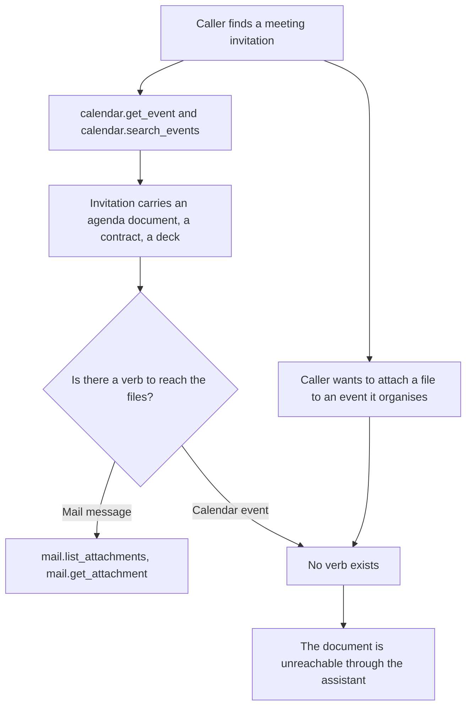
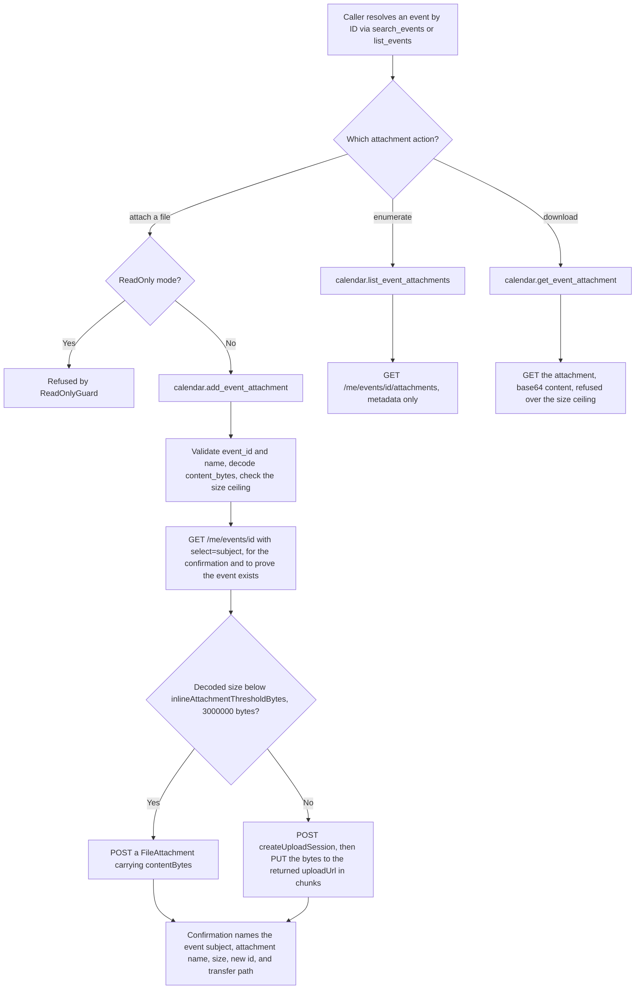
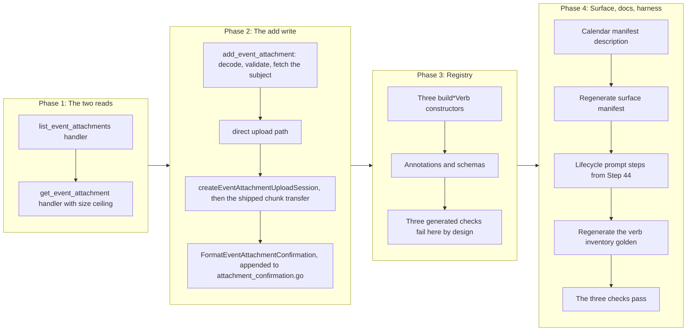

# Calendar Event Attachments

## Change Summary

The `mail` domain can enumerate a message's attachments, download one by ID, and (since
CR-0079) add a new one, small via a single POST and large via a resumable upload session.
The `calendar` domain can read and manage events but cannot touch the files attached to
them. A caller that has found a meeting invitation carrying an agenda document, a signed
contract, or a slide deck cannot list those files, cannot read their bytes, and cannot
attach a file of its own to an event it is organising. The agenda on a meeting is exactly
the artefact a productivity assistant is asked to summarise, and it is inaccessible.

This change adds exactly three verbs to the existing `calendar` domain registry:
`list_event_attachments`, `get_event_attachment`, and `add_event_attachment`. The two read
verbs differ from the mail domain's shipped `list_attachments` and `get_attachment` only in
the navigation they use, calling `Me().Events().ByEventId(id).Attachments()` where the mail
reads call `Me().Messages().ByMessageId(id).Attachments()`; every other element (the
`$select`, the serialisers, the output tiers, the size ceiling) is the shipped one, reused
rather than re-authored. The write verb applies the shape CR-0079 shipped as
`mail.add_attachment`: a single POST under the Graph inline-attachment threshold and a
`createUploadSession` plus chunked PUTs at or above it, reusing that change's chunk-transfer
machinery unchanged. No new top-level MCP tool is added; the aggregate tool count stays at
four.

**Sequence.** This change request is next in the implementation sequence after CR-0080. The
attachment write shape it mirrors comes from **CR-0079** (`mail-draft-attachments`), which
shipped `mail.add_attachment` together with the reusable chunk-transfer machinery in
`internal/tools/attachment_upload_session.go`. **CR-0080** (`calendar-scheduling-reads`)
shipped `calendar.find_meeting_times` and `calendar.get_schedule` and touched no attachment
code; this change request depends on nothing CR-0080 introduces, but it inherits the
seventeen-verb calendar domain CR-0080 leaves behind, which is the baseline every count
below is stated against.

## Motivation and Background

The feature-gap matrix names four calendar attachment rows and routes every one of them
through a change request rather than into code:

> | calendar | Add event attachment | yes | yes | no | | medium | No verb to attach a file to an event. | 4 |
> | calendar | Get event attachment | yes | yes | no | | medium | No verb to fetch an event attachment's bytes; agenda documents on meetings are inaccessible. | 4 |
> | calendar | List event attachments | yes | yes | no | | medium | No calendar-attachment verbs; attachments on invitations cannot be enumerated. (mail domain has gated attachment verbs, but not calendar.) | 4 |
> | calendar | Create attachment upload session | yes | yes | no | | low | No resumable large-attachment upload; depends on attachment support that is itself absent. goSdk=yes confirmed (create_upload_session builder present). | 4 |

The matrix note is precise about the asymmetry: "the mail domain has gated attachment
verbs, but not calendar." The mail domain proved the shape. `NewHandleListAttachments`
(`internal/tools/list_attachments.go:74`) enumerates a message's attachment metadata with a
`$select` restricted to lightweight fields and no content bytes.
`NewHandleGetAttachment` (`internal/tools/get_attachment.go:73`) downloads one attachment's
metadata and base64 content, enforcing `MaxAttachmentSizeBytes`
(`internal/config/config.go:153`, default 10 MB) so an oversized attachment is refused
rather than allocated. This change lifts that same shape onto events, where the underlying
Graph resource and Go SDK request builders are identical in structure to the mail ones.

The OAuth cost of closing the gap is zero. The calendar scope
`Calendars.ReadWrite` (`internal/auth/auth.go:22`) is requested unconditionally in every
configuration (`internal/auth/auth.go:57`), and it covers both reading an event's
attachments and adding one. No new consent prompt, no new scope, no new dependency.

The blast radius is small by construction. The two read verbs expose reads only: the
attachment-item request builder has a `Delete` method, and this change deliberately does
not wire it, because deleting an event attachment is a destructive operation the matrix
places out of scope (`Delete event attachment`, Manage=3). The write verb is additive: it
attaches a file and never removes one. Nothing here sends a meeting invitation or a
cancellation; attaching a file to an existing event does not notify attendees.

## Change Drivers

* The mail domain reads and downloads attachments and the calendar domain cannot, so the
  product's own attachment idiom stops at the mail boundary for no reason the matrix
  accepts.
* Meeting invitations routinely carry the exact document a user asks the assistant to
  read or summarise, and that document is currently unreachable through any verb.
* The scope is already granted. `Calendars.ReadWrite` is requested in every configuration,
  so the consent surface does not move.
* The Go SDK exposes the event-attachment request builders in the pinned v1.0 module, so
  no beta endpoint and no hand-rolled HTTP is required for the collection reads, the item
  read, or the upload-session creation.
* The four aggregate domain tools are a fixed surface, so growth belongs in the calendar
  verb registry rather than in a fifth tool.
* CR-0079 already established the small-POST-or-upload-session write shape on mail and left
  its chunk transfer, its threshold constant, its base64 validator, and its confirmation
  file in the same `internal/tools` package this change writes into, so applying the shape
  to calendar costs a mirror plus one event-specific session constructor rather than a
  design.

## Current State

The calendar domain registers seventeen verbs, all built in
`internal/server/calendar_verbs.go` (`buildCalendarVerbs`, line 81, whose returned slice
begins at line 100) and **all always registered**: unlike mail, the calendar domain has no
feature-flag gate. Each verb is produced by its own `build*Verb` constructor in that file.
Read verbs are wrapped by `wrap` (authentication, account resolution, observability, audit);
write verbs are wrapped by `wrapWrite`, which inserts `ReadOnlyGuard` so a write is refused
when the server runs in read-only mode.

| Kind | Wrapper | Verbs |
|---|---|---|
| Read | `wrap` | `help`, `list_calendars`, `list_events`, `get_event`, `search_events`, `get_free_busy`, `find_meeting_times`, `get_schedule` |
| Write | `wrapWrite` | `create_event`, `update_event`, `delete_event`, `respond_event`, `reschedule_event`, `create_meeting`, `update_meeting`, `cancel_meeting`, `reschedule_meeting` |

There is no verb in the domain that touches an event's attachments. A caller can
`get_event` an invitation and read its `bodyPreview`, but the files clipped to that
invitation are invisible.

Measured facts about the surface as it stands, read from the repository at `a690a94` (the
last CR-0080 commit) rather than assumed:

* `site/src/generated/surface.json` records calendar at `fullCount` 17, `defaultCount` 17,
  every verb carrying `gate: null` because the domain has no feature flag. Mail records 18
  and 5; account 7 and 7; system 7 and 6. Totals across the four domains are 49 full and
  35 default.
* The mail attachment reads already exist and are the template: `list_attachments` selects
  `id, name, contentType, size, isInline` through the package-level
  `listAttachmentsSelectFields` and downloads no bytes
  (`internal/tools/list_attachments.go:29`, handler at `:74`); `get_attachment` enforces
  `MaxAttachmentSizeBytes` before returning content
  (`internal/tools/get_attachment.go:125`, handler at `:73`). Both serialise through
  `graph.SerializeAttachment` (`internal/graph/mail_serialize.go:310`) and
  `graph.SerializeSummaryAttachment` (`:356`), and render text through
  `FormatAttachmentsText` / `FormatAttachmentText`
  (`internal/tools/text_format.go:740` and `:704`). None of these is message-specific: each
  takes a `models.Attachmentable` or a serialised map, so the calendar reads reuse them
  without change.
* The mail attachment write also already exists, shipped by CR-0079:
  `NewHandleAddAttachment` (`internal/tools/add_attachment.go:76`) validates, decodes, and
  size-checks before any Graph call, then branches on
  `inlineAttachmentThresholdBytes = 3 * 1000 * 1000` (`internal/tools/add_attachment.go:38`)
  between a single `Attachments().Post` and `uploadAttachmentSession`
  (`internal/tools/attachment_upload_session.go:88`). Of that machinery only
  `createAttachmentUploadSession` (`:111`) is message-specific; `transferAttachmentChunks`
  (`:159`), `putAttachmentChunk` (`:193`), `completedAttachmentID` (`:236`),
  `attachmentIDFromLocation` (`:255`), `redactUploadURL` (`:272`) and
  `uploadChunkSizeBytes` (`:47`) take a bare upload URL and are resource-agnostic.
* The confirmation for an added attachment is `FormatAttachmentConfirmation`
  (`internal/tools/attachment_confirmation.go:56`), which also owns the transfer labels
  `TransferDirect` and `TransferUploadSession` (`:30`, `:34`).
* `validate.ValidateBase64` (`internal/validate/validate.go:250`),
  `validate.ValidateResourceID` (`:128`), `validate.ValidateStringLength` (`:113`) and the
  bound `validate.MaxAttachmentNameLen = 255` (`:40`) all exist and are what the mail add
  verb uses.
* `extension/manifest.json` enumerates all seventeen calendar verbs in the `calendar` tool
  description (line 57), with no verb missing.
* Measured margins, so the bounds this change must stay inside are stated against a
  measurement rather than an assumption: the composed `calendar` tool description is
  **2348** characters against the 4000-character bound asserted by
  `TestDescriptionLengthBounded` (`internal/tools/description_quality_test.go:147`), and the
  cold-start schema reduction is **72%** against the 60% floor asserted by
  `TestColdStartSchemaSize_Reduction` (`internal/server/schema_size_test.go:39`). Both were
  read from the tests' own output at `a690a94`.

### Current State Diagram



## Proposed Change

Three verbs are added to `buildCalendarVerbs`. Each lives in its own handler file under
`internal/tools/`, named for the verb. The two reads are wrapped by `wrap` and appear in
every configuration alongside every other calendar read; the write is wrapped by
`wrapWrite` so read-only mode refuses it, exactly as it refuses `create_event`.

### Verb inventory

| Verb | Kind | Graph call | Required parameters | Confirmation or result carries |
|---|---|---|---|---|
| `list_event_attachments` | read | `GET /me/events/{id}/attachments` with a lightweight `$select` | `event_id` | numbered list of attachment id, name, contentType, size, isInline; total count |
| `get_event_attachment` | read | `GET /me/events/{id}/attachments/{attachmentId}` | `event_id`, `attachment_id` | attachment metadata plus base64 content, refused above the size ceiling |
| `add_event_attachment` | write | `GET /me/events/{id}` restricted to `subject`, then `POST /me/events/{id}/attachments` under the threshold or `POST /me/events/{id}/attachments/createUploadSession` plus chunked PUTs at or above it | `event_id`, `name`, `content_bytes` | event subject, attachment **name**, **size**, and the new attachment **id**, and which path (direct upload or chunked upload session) was used |

The write verb's leading `GET` is not optional bookkeeping: the confirmation must name the
event the file landed on, and the subject is not derivable from the identifier the caller
supplied. It is the same trade the shipped `mail.add_attachment` makes, where `verifyIsDraft`
(`internal/tools/update_draft.go:224`) pays one GET and hands back the subject the
confirmation renders. Here the GET additionally establishes that the event exists before any
bytes are transferred, which is worth more on the chunked path than on the direct one.

The search-first principle holds: a caller resolves the event through `search_events` or
`list_events`, then lists its attachments by `event_id`, then downloads one by
`attachment_id`, and adds one by `event_id`. Every attachment flow acts by an identifier
a read produced.

### Graph SDK surfaces, confirmed against the installed module

Confirmed by reading `github.com/microsoftgraph/msgraph-sdk-go@v1.100.0` in the module
cache (the version pinned at `go.mod:15`), not the vendor's documentation. Every line
number below was re-read at `a690a94`. Every builder cited is in the v1.0 `users` package,
not the `/beta` package, so every endpoint is v1.0 GA.

* **Navigation.** `users/item_events_event_item_request_builder.go` exposes `Attachments()`
  (line 54) and `Get` (line 119); its
  `ItemEventsEventItemRequestBuilderGetQueryParameters` carries `Select []string` (line 29),
  which is how the write verb's subject fetch is restricted to one property. This is the
  `client.Me().Events().ByEventId(id)` path, the same navigation the existing `get_event`
  and `delete_event` handlers use (`internal/tools/get_event.go:163`,
  `internal/tools/delete_event.go:97`).
* **Collection read and write.**
  `users/item_events_item_attachments_request_builder.go` exposes
  `Get` (line 90) returning `models.AttachmentCollectionResponseable`, and `Post` (line 110)
  taking `models.Attachmentable` and returning `models.Attachmentable`. Its
  `ItemEventsItemAttachmentsRequestBuilderGetQueryParameters` carries `Select []string`
  (line 30), which is what carries the lightweight field restriction. The equivalent
  through the calendar navigation property,
  `users/item_calendar_events_item_attachments_request_builder.go`, exists with the same
  `Get` (line 90) and `Post` (line 110) signatures; the handler uses the `Me().Events()`
  form to match the domain's existing event access.
* **Item read.**
  `users/item_events_item_attachments_attachment_item_request_builder.go` exposes `Get`
  (line 72) returning `models.Attachmentable`. Its `Delete` (line 55) exists and is
  **deliberately not used**: the read verbs expose reads only.
* **Upload session.**
  `users/item_events_item_attachments_create_upload_session_request_builder.go` exposes
  `Post` (line 43) returning `models.UploadSessionable`, and
  `users/item_events_item_attachments_create_upload_session_post_request_body.go` exposes
  `SetAttachmentItem` (line 99) to supply the `models.AttachmentItemable` describing the
  file to be uploaded. The constructor is
  `users.NewItemEventsItemAttachmentsCreateUploadSessionPostRequestBody()`, the event
  counterpart of the `users.NewItemMessagesItemAttachmentsCreateUploadSessionPostRequestBody()`
  the shipped mail path uses at `internal/tools/attachment_upload_session.go:126`. The SDK
  creates the session but does not transfer the bytes, which is why the shipped
  `transferAttachmentChunks` exists and is reused unchanged.
* **Models.** `models/file_attachment.go` exposes `SetContentBytes([]byte)` (line 126) for
  the direct-upload path; `models/attachment_item.go` exposes `SetAttachmentType` (line
  267), `SetContentType` (line 285), `SetName` (line 299), and `SetSize` (line 313) for the
  upload-session descriptor; and `models/attachment_type.go` defines `FILE_ATTACHMENTTYPE`
  (line 8). `models/attachment.go` also exposes `SetIsInline` (line 210), which this change
  **deliberately does not use**: see Scope Boundaries.

### Annotation matrix

Each verb declares all four hints explicitly, per the project rule that a verb cannot be
registered without its own classification and that the aggregate is computed from the
registry.

| Verb | `readOnlyHint` | `destructiveHint` | `idempotentHint` | `openWorldHint` |
|---|---|---|---|---|
| `list_event_attachments` | `true` | `false` | `true` | `true` |
| `get_event_attachment` | `true` | `false` | `true` | `true` |
| `add_event_attachment` | `false` | `false` | `false` | `true` |

Justification, hint by hint, because an unjustified hint is the defect the computed-fold
rule exists to prevent:

* **`readOnlyHint: true` for the two reads, `false` for the add.** The reads fetch and do
  not mutate, matching `list_attachments` and `get_attachment`. The add writes a new
  attachment onto the event.
* **`destructiveHint: false` for all three.** The reads change nothing. The add is purely
  additive: it appends an attachment and removes nothing, the same shape as `create_event`,
  which is classified `false`. This is the reason deletion is out of scope; wiring the
  item builder's `Delete` would have introduced the one destructive attachment operation,
  and it is left for its own change request.
* **`idempotentHint: true` for the two reads, `false` for the add.** Repeating a read
  returns the same bytes. The add is a `POST` that mints a new attachment with a new
  identifier on every successful call; a second identical call produces a second
  attachment, so it cannot be idempotent, matching `create_event`.
* **`openWorldHint: true` for all three.** Every one calls Microsoft Graph.

The aggregate fold is unchanged by these values. The calendar tool already publishes
`readOnlyHint: false` (from `create_event` and the other writes), `destructiveHint: true`
(from `delete_event` and `cancel_meeting`), `idempotentHint: false` (from `create_event`
and `create_meeting`), and `openWorldHint: true`, so the folded calendar annotation is
byte-identical before and after this change.

### Schema notes

* `list_event_attachments` declares `event_id` (required), `account`, and `output`
  (`text | summary | raw`).
* `get_event_attachment` declares `event_id` (required), `attachment_id` (required),
  `account`, and `output` (`text | summary | raw`).
* `add_event_attachment` declares `event_id` (required), `name` (required), `content_bytes`
  (required, base64-encoded file bytes), `mime_type` (optional, defaulting to
  `application/octet-stream`), and `account`. It declares **no** `output` parameter, per the
  write-verb tiering rule, and **no** `is_inline` parameter.
* The optional MIME parameter is named `mime_type`, not `content_type`, because that is the
  name the shipped `mail.add_attachment` publishes
  (`internal/server/mail_verbs.go`, `buildAddAttachmentVerb`), and its own published
  description already warns that it "is the attachment content type, not the draft body
  content_type". Introducing `content_type` for the same concept in a sibling domain would
  create exactly the synonym pair the one-concept-one-term rule forbids.
* `event_id` is new to no calendar verb by name; the calendar domain publishes it on every
  event verb already, so the flattened aggregate schema merges the new declarations into
  the existing one with no description conflict. `attachment_id`, `name`, `content_bytes`,
  and `mime_type` are new parameter names in the calendar domain: the domain's current
  parameter set, read from `internal/server/calendar_verbs.go` at `a690a94`, contains
  `account`, `attendees`, `availability_view_interval`, `body`, `calendar_id`, `categories`,
  `comment`, `created_by_mcp`, `date`, `end_datetime`, `end_timezone`, `event_id`,
  `importance`, `is_all_day`, `is_cancelled`, `is_online_meeting`, `is_organizer_optional`,
  `is_reminder_on`, `location`, `max_candidates`, `max_results`, `meeting_duration`,
  `minimum_attendee_percentage`, `new_start_datetime`, `new_start_timezone`, `output`,
  `query`, `recurrence`, `reminder_minutes`, `response`, `schedules`, `send_response`,
  `sensitivity`, `show_as`, `start_datetime`, `start_timezone`, `subject`, and `timezone`,
  none of which is one of the four. The calendar `name` parameter is introduced here for the
  first time and does not collide with the mail domain's use of the same word, because the
  flattened union is computed per domain.

### Proposed State Diagram



## Requirements

### Functional Requirements

1. The system **MUST** register exactly three new verbs in the `calendar` domain verb
   registry, named `list_event_attachments`, `get_event_attachment`, and
   `add_event_attachment`, and **MUST NOT** register any new top-level MCP tool; the
   registered tool count **MUST** remain four.
2. All three verbs **MUST** be registered in every configuration, because the calendar
   domain has no feature-flag gate. The two read verbs **MUST** be wrapped by the read
   middleware chain and the write verb **MUST** be wrapped by the write chain so that
   `ReadOnlyGuard` refuses it in read-only mode, exactly as it refuses `create_event`.
3. `list_event_attachments` **MUST** require `event_id`, **MUST** issue
   `GET /me/events/{id}/attachments` with a `$select` restricted to the lightweight fields
   `id`, `name`, `contentType`, `size`, and `isInline`, **MUST** obtain that field list from
   the existing package-level `listAttachmentsSelectFields`
   (`internal/tools/list_attachments.go:29`) rather than declaring a second copy, and
   **MUST NOT** download any attachment content bytes.
4. `get_event_attachment` **MUST** require `event_id` and `attachment_id`, **MUST** issue
   `GET /me/events/{id}/attachments/{attachmentId}`, and **MUST** return the attachment's
   metadata together with its base64-encoded content for a file attachment.
5. `get_event_attachment` **MUST** enforce the server's `MaxAttachmentSizeBytes` limit
   (`internal/config/config.go:153`, default 10485760) against the attachment's reported
   size and **MUST** refuse an attachment exceeding it with an error that names the limit
   and the environment variable `OUTLOOK_MCP_MAX_ATTACHMENT_SIZE_BYTES` that raises it,
   exactly as `get_attachment` does today (`internal/tools/get_attachment.go:128`).
6. `add_event_attachment` **MUST** require `event_id`, `name`, and a base64-encoded
   `content_bytes`, and **MUST** decode `content_bytes` with `validate.ValidateBase64` and
   reject an input that is not valid base64 before any Graph request is issued.
7. `add_event_attachment` **MUST** attach the file with a single
   `POST /me/events/{id}/attachments` of a `models.FileAttachment` carrying its bytes when
   the decoded content size is **strictly below** the existing package constant
   `inlineAttachmentThresholdBytes` (`internal/tools/add_attachment.go:38`, 3000000 bytes),
   and **MUST** create an upload session with
   `POST /me/events/{id}/attachments/createUploadSession` and upload the bytes to the
   returned upload URL when the decoded content size is at or above that constant. It
   **MUST NOT** declare a second threshold constant, and **MUST NOT** expose the choice of
   path as a parameter.
8. `add_event_attachment` **MUST** enforce an upper bound on the decoded content size equal
   to the server's `MaxAttachmentSizeBytes` limit, and **MUST** refuse a larger input with
   an error naming the limit and
   `OUTLOOK_MCP_MAX_ATTACHMENT_SIZE_BYTES`, before any Graph request is issued, so a single
   tool call cannot allocate unbounded memory.
9. `add_event_attachment` **MUST** fetch the target event with a
   `GET /me/events/{id}` whose `$select` is restricted to `subject` before it transfers any
   bytes, so the confirmation can name the event and so a non-existent event is refused
   before an upload begins. It **MUST NOT** issue any further metadata request on the
   success path.
10. The `add_event_attachment` confirmation **MUST** name the event subject, the event
    identifier, the attachment name, the attachment size in bytes measured after base64
    decoding, and the identifier of the attachment Graph returns, and **MUST** state which
    transfer path was used, using the existing labels `TransferDirect` and
    `TransferUploadSession` (`internal/tools/attachment_confirmation.go:30` and `:34`),
    because the path is a consequence the caller cannot otherwise observe. The attachment
    identifier **MUST** be read from the Graph response and **MUST NOT** be echoed from any
    request argument.
11. Every one of the three verbs **MUST** validate `event_id` with
    `validate.ValidateResourceID`, and `get_event_attachment` **MUST** additionally
    validate `attachment_id` the same way, rejecting an invalid identifier before any Graph
    request is issued.
12. `add_event_attachment` **MUST** validate `name` with `validate.ValidateStringLength`
    against `validate.MaxAttachmentNameLen` (`internal/validate/validate.go:40`, 255), the
    same bound the shipped `mail.add_attachment` applies
    (`internal/tools/add_attachment.go:99`). It **MUST NOT** introduce a new bound.
13. The two read verbs **MUST** implement all three output tiers (`text`, `summary`, `raw`)
    via the `output` parameter, selecting the mode with the existing `ValidateOutputMode`
    and serialising through `graph.SerializeAttachment` for `raw` and
    `graph.SerializeSummaryAttachment` for `summary`, matching the mail attachment reads.
    The write verb **MUST** return a text confirmation unconditionally and **MUST NOT**
    declare an `output` parameter.
14. `list_event_attachments` and `get_event_attachment` **MUST** read attachments only.
    Neither **MUST** declare any parameter that updates or deletes an attachment, and
    neither **MUST** wire the attachment-item request builder's `Delete` method
    (`users/item_events_item_attachments_attachment_item_request_builder.go:55`). The only
    HTTP method either handler issues **MUST** be `GET`.
15. Every one of the three verbs **MUST** declare all four annotation hints explicitly,
    with the values given in the annotation matrix above.
16. Every one of the three verbs **MUST** be wrapped by its middleware chain under the
    identity `calendar.<verb>`, so the audit record and the OpenTelemetry attributes carry
    the same `{domain}.{operation}` identity as every other verb. The two reads **MUST**
    use `wrap` with the audit operation `read`; the write **MUST** use `wrapWrite` with the
    audit operation `write`.
17. Every handler **MUST** route its Graph call through `graph.RetryGraphCall` inside
    `graph.WithTimeout`, **MUST** classify a timeout with `graph.IsTimeoutError` and report
    it via `graph.TimeoutErrorMessage`, **MUST** redact a Graph error reaching the tool
    result via `graph.RedactGraphError`, and **MUST** log it via `graph.FormatGraphError`,
    so retry, timeout, and redaction behaviour is identical to the verbs already registered.
18. Every error raised by the three verbs **MUST** carry a fix instruction naming what to
    supply or correct, and **MUST** reach both the tool result and the log record, so a
    headless caller that cannot read an interactive surface still receives the correction.
    Where an error originates in a shared helper whose text diagnoses without correcting,
    the verb **MUST** append its own correction, as the mail verbs do.
19. The chunked path **MUST NOT** allow the pre-authenticated upload URL to reach either the
    tool result or the log record, reusing the shipped `redactUploadURL`
    (`internal/tools/attachment_upload_session.go:272`) rather than re-implementing
    redaction.
20. Every one of the three verbs **MUST** carry a non-empty `Summary` of at most eighty
    characters, a non-empty `Description` stating its parameters and its annotation
    semantics, at least one `Examples` entry, and at least one `SeeDocs` reference that
    resolves to an existing heading in the embedded documentation bundle. The two reads
    **MUST** reference `concepts#output-tiers`; the write **MUST** reference
    `concepts#read-only-mode`. Each verb's inventory line **MUST** state its required
    parameters after `Requires:`, which `TestEveryVerbStatesRequiredParameters` asserts.
21. The `get_event_attachment` description **MUST** state that the full content is returned
    only within the size ceiling and that a larger attachment is refused, so the caller can
    decide from a prior `list_event_attachments` whether the download is warranted.
22. The `calendar` entry of `extension/manifest.json` **MUST** enumerate the three new
    verbs in its description by their literal registered names, and the manifest's `tools`
    array **MUST** remain exactly four entries, because no new top-level tool is added.
23. The generated surface manifest `site/src/generated/surface.json` **MUST** be
    regenerated with `make surface-manifest` and committed in the same change, so the
    published website states the surface that exists.
24. `docs/prompts/mcp-tool-crud-test.md` **MUST** gain lifecycle steps exercising the three
    verbs, covering the add path, the list path, and the get path against a real event.
    The steps **MUST** be numbered from Step 44, because the prompt currently ends at
    Step 43.
25. The committed verb inventory golden `verbInventoryGolden`
    (`internal/tools/dispatch_registry_test.go:39`) **MUST** be regenerated from the failing
    test's own logged output to include the three new identities with their hints, and the
    delta **MUST** be exactly three added lines.
26. The change **MUST NOT** alter the OAuth scope set requested in any configuration:
    `Calendars.ReadWrite` already covers all three verbs and is requested unconditionally.

### Non-Functional Requirements

1. Each verb's handler **MUST** live in its own file under `internal/tools/`, named for the
   verb, mirroring the one-file-per-verb layout of the calendar and mail domains. Every new
   file **MUST** carry exactly one `@agents-index` line.
2. The composed `calendar` tool description **MUST** stay below the 4000-character bound
   asserted by `TestDescriptionLengthBounded`. The measured value at `a690a94` is **2348**
   characters, so the three new inventory lines have 1652 characters of headroom; the bound
   is asserted by the test rather than assumed by this document.
3. The cold-start schema reduction **MUST** stay at or above the 60% floor asserted by
   `TestColdStartSchemaSize_Reduction`. The measured value at `a690a94` is **72%**, so the
   four new flattened parameters have 12 percentage points of headroom.
4. The two read verbs **MUST** be deterministic: repeating a read with identical arguments
   against an unchanged mailbox **MUST** return byte-identical output, with no ordering,
   timestamp, or map-iteration variation introduced by the handler.
5. `list_event_attachments` and `get_event_attachment` **MUST** each issue exactly one
   Graph request on the success path. `add_event_attachment` **MUST** issue exactly one
   subject-fetch `GET` (FR-9) followed by exactly one attachments `POST` on the direct
   path, and on the chunked path exactly one subject-fetch `GET`, one
   `createUploadSession` `POST`, and the chunk `PUT`s that session requires, with no
   further metadata round trip on either path.
6. The change **MUST NOT** add a third-party dependency, direct or indirect. The upload to
   the session's returned URL **MUST** reuse the shipped `transferAttachmentChunks`
   (`internal/tools/attachment_upload_session.go:159`), which uses the standard library
   `net/http` client; the change **MUST NOT** introduce a second chunk-transfer
   implementation and **MUST NOT** adopt the Graph core large-file upload task.
7. The change **MUST NOT** alter the behaviour, schema, annotations, or published text of
   any existing calendar or mail verb; it only appends three verbs, one formatter, one
   session constructor, and the manifest and surface records that enumerate them. The
   folded `calendar` annotation **MUST** be unchanged, which
   `TestAggregateAnnotations_Calendar` asserts.

## Affected Components

### Source

* `internal/tools/list_event_attachments.go` (new): the `list_event_attachments` handler
  constructor `NewHandleListEventAttachments`, a near-mirror of `NewHandleListAttachments`
  (`internal/tools/list_attachments.go:74`) reading events instead of messages and reusing
  `listAttachmentsSelectFields`, `graph.SerializeAttachment`,
  `graph.SerializeSummaryAttachment`, and `FormatAttachmentsText`.
* `internal/tools/get_event_attachment.go` (new): the `get_event_attachment` handler
  constructor `NewHandleGetEventAttachment`, a near-mirror of `NewHandleGetAttachment`
  (`internal/tools/get_attachment.go:73`), including the `MaxAttachmentSizeBytes` ceiling
  and its refusal text.
* `internal/tools/add_event_attachment.go` (new): the `add_event_attachment` handler
  constructor `NewHandleAddEventAttachment`, applying the write shape CR-0079 shipped for
  mail to events: base64 decoding, the size-ceiling check, the `event_id` and `name`
  validation, the subject fetch, the threshold branch, and the confirmation. It reuses
  `inlineAttachmentThresholdBytes`, `defaultAttachmentMimeType`, and
  `validate.MaxAttachmentNameLen` rather than restating any of them.
* `internal/tools/attachment_upload_session.go` (**modified**): one new
  `createEventAttachmentUploadSession` constructing
  `users.NewItemEventsItemAttachmentsCreateUploadSessionPostRequestBody()` and posting to
  `client.Me().Events().ByEventId(id).Attachments().CreateUploadSession()`. Everything
  downstream of the returned upload URL (`transferAttachmentChunks` and below) is reused
  **unchanged**; the file's existing functions **MUST NOT** be edited, only added to.
* `internal/tools/attachment_confirmation.go` (**modified**): one new
  `FormatEventAttachmentConfirmation`, appended beside `FormatAttachmentConfirmation` and
  sharing its `TransferDirect` / `TransferUploadSession` constants and line order. This is a
  sibling function in the existing file, not a new file: `CLAUDE.md` names
  `internal/tools/text_format.go` as the formatter home, and the review of CR-0080 settled
  that where the nearest existing code is in the canonical file the new formatter joins it,
  while where the nearest existing code is in an established exception the new formatter
  follows that exception. The nearest existing code here is
  `FormatAttachmentConfirmation` (`internal/tools/attachment_confirmation.go:56`), an
  established exception carrying the exact transfer vocabulary this confirmation needs, so
  the deviation is inherited rather than invented and is recorded here on the record. The
  proposed `internal/tools/event_attachment_confirmation.go` is **dropped**.
* `internal/server/calendar_verbs.go`: three new `build*Verb` constructors added to the file
  and appended to the slice `buildCalendarVerbs` returns (function at line 81, slice at line
  100), each carrying `Summary`, `Description`, `Examples`, `SeeDocs`, `Annotations`, and
  `Schema` per FR-15 and FR-20; the two reads wired with `wrap` under audit operation
  `read`, the write wired with `wrapWrite` under `write`.

### Unchanged but load-bearing

* `internal/tools/add_attachment.go`: **not edited.** It owns
  `inlineAttachmentThresholdBytes` (line 38) and `defaultAttachmentMimeType` (line 44),
  which the new handler reads directly because both live in the same `tools` package.
* `internal/validate/validate.go`: **not edited.** `ValidateBase64`, `ValidateResourceID`,
  `ValidateStringLength`, and `MaxAttachmentNameLen` all already exist.
* `internal/graph/mail_serialize.go`: **not edited.** `SerializeAttachment` and
  `SerializeSummaryAttachment` take a `models.Attachmentable` and are not message-specific.

### Published surface, documentation, and harness

* `extension/manifest.json`: the `calendar` tool description (line 57), which currently
  enumerates seventeen verbs. The `tools` array itself is **unchanged at four entries**.
* `site/src/generated/surface.json`: regenerated with `make surface-manifest`, never
  hand-edited. Calendar moves from 17 to 20 `fullCount` and from 17 to 20 `defaultCount`
  (the calendar domain has no gate, so the two counts stay equal), and the four-domain
  totals move from 49 to 52 full and from 35 to 38 default. Those totals hold if this change
  lands next in the sequence, which is the plan; the binding requirement is regeneration,
  and `make ci` fails on a stale manifest, so the committed file is correct even if the
  merge order changes.
* `docs/prompts/mcp-tool-crud-test.md`: lifecycle steps from Step 44 onward exercising the
  three verbs (FR-24). The prompt currently ends at Step 43.

### Tests

* `internal/tools/list_event_attachments_test.go` (new), `internal/tools/get_event_attachment_test.go`
  (new), `internal/tools/add_event_attachment_test.go` (new),
  `internal/tools/event_attachment_verbs_test.go` (new),
  `internal/tools/event_attachment_readonly_test.go` (new).
* `internal/tools/attachment_confirmation_test.go` (**modified**): cases for the new event
  formatter, added beside the existing mail-formatter cases rather than in a new file, for
  the same reason the formatter itself is.
* `internal/tools/tool_annotations_test.go` (**modified**): a value assertion for the three
  new verbs' hints, per the project rule that a new verb adds one alongside the existing
  annotation tests.
* `internal/server/calendar_verbs_test.go` (**modified**): registration, read-only refusal,
  and `calendar.<verb>` identity assertions, alongside the existing
  `TestSchedulingReadsRegisteredAndReadOnly` and `TestSchedulingReadsCarryDotIdentity`.
* `internal/tools/dispatch_registry_test.go` (**modified**): the `verbInventoryGolden`
  literal at line 39 (FR-25).

### Deliberately unchanged

* `scripts/crud-test.sh`: **no change required.** Its per-domain accounting keys on the MCP
  tool name `mcp__outlook-local-mcp__calendar` (line 113), not on the operation verb, so
  additional calendar verbs raise the existing calendar counter without a script edit.
* `docs/bench/crud-runs.csv`: **no column change.** The header is per-domain
  (`mcp_calendar,mcp_mail,mcp_account,mcp_system`), not per-verb; new runs record a higher
  calendar value and more turns.
* `internal/server/mail_verbs.go` and every mail handler: untouched. This change adds no
  mail verb and edits no mail text.

## Scope Boundaries

### In Scope

* Exactly three new calendar verbs: `list_event_attachments`, `get_event_attachment`, and
  `add_event_attachment`.
* Their handlers, registry entries, annotations, schemas, and unit tests.
* One new confirmation formatter appended to `internal/tools/attachment_confirmation.go`.
* One new event-specific upload-session constructor appended to
  `internal/tools/attachment_upload_session.go`.
* The direct-upload and `createUploadSession` branch of the add verb, selected by decoded
  content size against the existing `inlineAttachmentThresholdBytes`.
* The subject-fetch `GET` the add verb's confirmation requires.
* The `MaxAttachmentSizeBytes` ceiling on both the download read and the add write.
* The calendar manifest description update, the regenerated surface manifest, the
  regenerated verb inventory golden, and the lifecycle harness steps.

### Out of Scope ("Here, But Not Further")

* **Deleting an event attachment.** `DELETE /me/events/{id}/attachments/{attachmentId}` is
  a destructive operation the matrix places out of scope (`Delete event attachment`,
  Manage=3). The attachment-item request builder's `Delete` exists and is deliberately not
  wired.
* **Item and reference attachments.** This change attaches and reads file attachments. Item
  attachments (an embedded message or event) and reference attachments (a link to a cloud
  file) are separate attachment types and are not created by the add verb; the reads report
  whatever type Graph returns but the add creates a file attachment only.
* **An `is_inline` parameter on the add verb.** `models.Attachment` exposes `SetIsInline`
  (`models/attachment.go:210`) and the reads report `isInline` in their `$select`, but the
  add verb does not publish it. An inline attachment is one referenced by a `cid:` in an
  HTML body, which the caller would also have to author; the shipped
  `mail.add_attachment` publishes no such parameter either, and adding it to calendar alone
  would make the two sibling verbs diverge for a capability neither can complete. A later
  change request may add it to both.
* **Attachments on calendar-group or secondary-calendar events.** The verbs use the
  `Me().Events()` navigation, matching every existing event verb. Attaching to an event
  reached through `Me().Calendars().ByCalendarId(...)` or a calendar group is not added
  here; the equivalent request builders exist but are out of scope for this change.
* **A separate large-attachment configuration knob.** The add path reuses
  `MaxAttachmentSizeBytes` as its ceiling rather than introducing a second limit. A caller
  that needs a larger ceiling raises the one environment variable that already governs the
  download read.
* **Notifying attendees of a new attachment.** Adding a file to an event does not send an
  update to attendees, and this change does not add such a notification. Sending is outside
  the product's scope.
* **Mail attachment writes.** The mail add verb is CR-0079's subject, already shipped. This
  change does not touch the mail domain: no mail verb, handler, schema, or published text is
  edited, and the shared files it appends to keep their existing mail functions byte for
  byte.
* **Changing the four-tool aggregate surface, the output-tier model, or the read-only
  gating model.**

## Alternative Approaches Considered

* **One `manage_event_attachments` verb dispatching on an action parameter.** Fewer verbs,
  but it cannot carry one honest annotation classification, because the reads are
  read-only and idempotent while the add is neither, and it cannot state one
  required-parameter list. It would reproduce inside one verb the ambiguity that separate
  verbs remove for free, and it would diverge from the mail domain, where list, get, and
  add are three verbs.
* **Exposing delete alongside the reads to make the surface "complete".** Rejected: the
  matrix routes event-attachment deletion out of scope, and a read path exposing a delete
  is precisely the standing principle this family of change requests forbids. Deletion, if
  ever wanted, is its own change request with its own destructive confirmation design.
* **A single direct-upload path with no upload session, refusing anything over the
  threshold.** Rejected: the matrix names the upload session explicitly, the SDK builder is
  confirmed present, the chunk transfer is already shipped and tested, and a common agenda
  deck or PDF can exceed 3000000 bytes. Omitting the session would ship a verb that fails on
  ordinary inputs while leaving working code unused.
* **Generalising `FormatAttachmentConfirmation` to serve both domains.** Rejected: its
  published lines read `Message: "..."` and `Message ID: ...`, so serving events would mean
  either parameterising the labels or changing text a shipped mail verb already returns.
  NFR-7 forbids altering an existing verb's published text, and `CLAUDE.md` allows
  duplication that preserves file isolation, so a sibling function beside it is the smaller
  change.
* **Reusing the Graph core large-file upload task for the chunk transfer.** Rejected: the
  repository already owns a working chunk transfer in
  `internal/tools/attachment_upload_session.go`, whose error paths redact the
  pre-authenticated upload URL. Swapping in a different mechanism for one domain would give
  the two attachment writes two transfer implementations and two redaction stories.
* **Adding a distinct upload-size configuration value.** Rejected as premature: reusing
  `MaxAttachmentSizeBytes` keeps one knob for the whole attachment surface, and a second
  knob can be added by a later change if a real workload needs asymmetric limits.
* **Reaching events through `Me().Calendar().Events()` to match the brief's named
  builder.** Both navigations resolve to v1.0 GA builders. The `Me().Events()` form was
  chosen because it matches the domain's existing `get_event` and `delete_event` handlers,
  keeping one event-access idiom across the domain.

## Impact Assessment

### User Impact

A user gains the ability to have the assistant enumerate the files on a meeting invitation,
read one of them, and attach a file to an event the user organises. Because the calendar
domain is ungated, the reads are available in every configuration; the add is available
whenever the server is not in read-only mode, exactly like `create_event`. Nothing changes
about sending, and adding a file to an event does not notify attendees.

The one behaviour a user must understand is that a large attachment travels through an
upload session rather than a single request, and that an attachment above the configured
ceiling is refused rather than truncated. The confirmation states the path used, and the
`get_event_attachment` description states the ceiling.

### Technical Impact

No breaking change, no schema migration, no new dependency, and no new OAuth scope. Every
existing calendar and mail verb is byte-identical after the change. The published calendar
tool grows by three operation-enum entries and four new flattened parameters
(`attachment_id`, `name`, `content_bytes`, `mime_type`); `event_id`, `account`, and `output`
are already published by existing calendar verbs. The composed calendar description grows
from a measured 2348 characters by three inventory lines, against a 4000-character bound,
and the cold-start schema reduction moves from a measured 72% against a 60% floor.

The folded calendar annotation does not move: the domain already publishes non-read-only,
destructive, non-idempotent, open-world from its existing write verbs.

### Business Impact

Low cost against a medium-value gap the matrix names four times. The two read verbs are
near-mirrors of shipped mail handlers, and the write verb mirrors the mail add verb CR-0079
already shipped, reusing its threshold constant, its base64 validator, its chunk transfer,
and its confirmation file. The genuinely new code is one event-specific upload-session
constructor, one confirmation function, and the subject fetch, so the work concentrates in
wiring and tests rather than in novel design.

## Implementation Approach

### Implementation Flow



### Phase 1: The two reads

1. `internal/tools/list_event_attachments.go`:
   `NewHandleListEventAttachments(retryCfg graph.RetryConfig, timeout time.Duration)`.
   Resolve the Graph client with `GraphClient(ctx)`, select the output mode with
   `ValidateOutputMode`, require and validate `event_id` with `validate.ValidateResourceID`,
   build a `users.ItemEventsItemAttachmentsRequestBuilderGetQueryParameters` whose `Select`
   is the existing `listAttachmentsSelectFields`, call
   `client.Me().Events().ByEventId(id).Attachments().Get(...)`, and serialise through
   `graph.SerializeAttachment` (raw), `graph.SerializeSummaryAttachment` (summary and text),
   and `FormatAttachmentsText` (text). No content bytes are fetched (FR-3).
2. `internal/tools/get_event_attachment.go`:
   `NewHandleGetEventAttachment(retryCfg graph.RetryConfig, timeout time.Duration, maxSize int64)`.
   Validate `event_id` and `attachment_id`, call
   `client.Me().Events().ByEventId(id).Attachments().ByAttachmentId(aid).Get(...)`, enforce
   the `maxSize` ceiling against the reported size with the refusal text
   `get_attachment` already uses, and return metadata plus base64 content through
   `graph.SerializeAttachment` and `FormatAttachmentText` (FR-4, FR-5).
3. Both handlers route through `graph.RetryGraphCall` inside `graph.WithTimeout`, classify
   timeouts with `graph.IsTimeoutError`, report them with `graph.TimeoutErrorMessage`,
   redact with `graph.RedactGraphError`, and log with `graph.FormatGraphError` (FR-17), and
   both append their own correction where a shared helper's text only diagnoses (FR-18).

**Affected components:** `internal/tools/list_event_attachments.go` (new),
`internal/tools/get_event_attachment.go` (new),
`internal/tools/list_event_attachments_test.go` (new),
`internal/tools/get_event_attachment_test.go` (new),
`internal/tools/event_attachment_readonly_test.go` (new).

### Phase 2: The add write

1. `internal/tools/add_event_attachment.go`:
   `NewHandleAddEventAttachment(retryCfg graph.RetryConfig, timeout time.Duration, maxSize int64)`.
   Require and validate `event_id` (`validate.ValidateResourceID`) and `name`
   (`validate.ValidateStringLength` against `validate.MaxAttachmentNameLen`), decode
   `content_bytes` with `validate.ValidateBase64`, enforce the `maxSize` ceiling against the
   decoded length, and default `mime_type` to the existing `defaultAttachmentMimeType`
   (FR-6, FR-8, FR-11, FR-12).
2. Fetch the event with
   `client.Me().Events().ByEventId(id).Get(...)` under a
   `users.ItemEventsEventItemRequestBuilderGetQueryParameters` whose `Select` is
   `[]string{"subject"}`, and read the subject with `graph.SafeStr`. A failure here refuses
   the call before any bytes move (FR-9).
3. When the decoded size is strictly below `inlineAttachmentThresholdBytes`, build a
   `models.FileAttachment`, set its name and content type and `SetContentBytes`, and `POST`
   it via `client.Me().Events().ByEventId(id).Attachments().Post(...)`. Do **not** set
   `IsInline`; the verb publishes no such parameter (FR-7).
4. When the decoded size is at or above the threshold, add
   `createEventAttachmentUploadSession` to
   `internal/tools/attachment_upload_session.go`: build a `models.AttachmentItem` with
   `SetAttachmentType(models.FILE_ATTACHMENTTYPE)`, `SetName`, `SetContentType`, and
   `SetSize`, set it on `users.NewItemEventsItemAttachmentsCreateUploadSessionPostRequestBody()`
   via `SetAttachmentItem`, `POST` it to
   `client.Me().Events().ByEventId(id).Attachments().CreateUploadSession()`, and hand the
   returned upload URL to the **existing, unmodified** `transferAttachmentChunks`. The
   transport is therefore the standard library `net/http` client that function already uses,
   and no third-party dependency is added (NFR-6). The URL redaction on the error path is
   the shipped `redactUploadURL` (FR-19).
5. Append `FormatEventAttachmentConfirmation` to
   `internal/tools/attachment_confirmation.go`, beside `FormatAttachmentConfirmation`,
   sharing `TransferDirect` and `TransferUploadSession` and following the same line order,
   naming the event subject, the event identifier, the attachment name, the size, the
   returned attachment identifier, and the transfer path (FR-10).

**Affected components:** `internal/tools/add_event_attachment.go` (new),
`internal/tools/attachment_upload_session.go` (modified, one function added),
`internal/tools/attachment_confirmation.go` (modified, one function added),
`internal/tools/add_event_attachment_test.go` (new),
`internal/tools/event_attachment_verbs_test.go` (new),
`internal/tools/attachment_confirmation_test.go` (modified).

### Phase 3: Registry entries

1. Add three `build*Verb` constructors to `internal/server/calendar_verbs.go` and append
   them to the slice `buildCalendarVerbs` returns. Wire the two reads with `wrap` under
   the identities `calendar.list_event_attachments` and `calendar.get_event_attachment` and
   audit operation `read`, and the write with `wrapWrite` under
   `calendar.add_event_attachment` and audit operation `write` (FR-16).
2. Populate `Summary` (at most eighty characters), `Description`, `Examples`, and `SeeDocs`
   for each, per the rule that per-verb reference is owned by the registry. The descriptions
   state the required parameters after `Requires:`, the annotation semantics, and, for
   `get_event_attachment`, the size ceiling and the refusal above it (FR-20, FR-21).
3. Declare all four annotation hints explicitly on each verb, per the matrix (FR-15).
4. Declare each verb's `Schema`, marking the required parameters and declaring **no**
   `output` parameter on the write (FR-13).

**Three generated checks fail at the end of this phase, by design.** Each derives its cases
from the registry, so registering a verb without updating what the registry is compared
against is exactly the failure they exist to raise. They stay red until Phase 4 closes them,
and a green run here would mean the registration did not take:

* `TestVerbInventoryUnchangedAfterUpgrade`
  (`internal/tools/dispatch_registry_test.go:150`), until the golden is regenerated.
* `TestCommittedManifestMatchesRecord` (`internal/surface/manifest_test.go:21`), until
  `make surface-manifest` is run and the result committed.
* `TestManifestDescribesEveryRegisteredVerb`
  (`internal/server/manifest_sync_test.go:84`), until the `extension/manifest.json` calendar
  description names all three verbs literally.

**Affected components:** `internal/server/calendar_verbs.go`,
`internal/server/calendar_verbs_test.go` (modified),
`internal/tools/tool_annotations_test.go` (modified).

### Phase 4: Surface, documentation, and harness

1. Extend the `calendar` tool description in `extension/manifest.json` (line 57) with the
   three verbs, using their literal registered names because
   `TestManifestDescribesEveryRegisteredVerb` matches on word boundaries, and leaving the
   `tools` array at four entries (FR-22).
2. Run `make surface-manifest` and commit `site/src/generated/surface.json` (FR-23).
   `make ci` fails on a stale manifest via `make surface-check`, which diffs against the
   index, so stage the regenerated file before the final `make ci` run.
3. Add lifecycle steps from Step 44 to `docs/prompts/mcp-tool-crud-test.md` exercising add,
   list, and get against a real event (FR-24).
4. Regenerate `verbInventoryGolden` in `internal/tools/dispatch_registry_test.go` from the
   failing test's own logged output, and read the delta before accepting it: it must be
   exactly three added lines,
   `calendar.add_event_attachment ro=false de=false id=false ow=true`,
   `calendar.get_event_attachment ro=true de=false id=true ow=true`, and
   `calendar.list_event_attachments ro=true de=false id=true ow=true`, inserted in sort
   order rather than appended (FR-25).
5. Confirm the three checks named in Phase 3 now pass, and that
   `TestAggregateAnnotations_Calendar` still passes unchanged (NFR-7).

**Affected components:** `extension/manifest.json`, `site/src/generated/surface.json`,
`docs/prompts/mcp-tool-crud-test.md`, `internal/tools/dispatch_registry_test.go`.

## Test Strategy

Handler tests follow the established attachment-verb pattern: an `httptest` server
returning canned Graph JSON behind a real SDK client built by the shared test helper, the
client injected into the context, the handler constructor called directly, and assertions
made as substring checks on the returned text and on `result.IsError`. No test issues a
network call.

### Tests to Add

| Test File | Test Name | Description | Inputs | Expected Output |
|-----------|-----------|-------------|--------|-----------------|
| `internal/tools/list_event_attachments_test.go` | `TestListEventAttachments_Success` | The collection read returns metadata | `event_id` with a two-attachment canned response | Numbered list naming both attachments; one GET observed |
| `internal/tools/list_event_attachments_test.go` | `TestListEventAttachments_NoContentBytesFetched` | The read selects lightweight fields only | Canned response, request inspected | The request carries the restricted `$select` and no content bytes are requested |
| `internal/tools/list_event_attachments_test.go` | `TestListEventAttachments_InvalidEventIDRejectedBeforeCall` | Identifier validation precedes Graph | Malformed `event_id` | Error returned, no request issued |
| `internal/tools/get_event_attachment_test.go` | `TestGetEventAttachment_ReturnsContent` | The item read returns base64 content | `event_id`, `attachment_id` with a small file attachment | Metadata plus base64 content; one GET observed |
| `internal/tools/get_event_attachment_test.go` | `TestGetEventAttachment_RefusesOverSizeCeiling` | The ceiling is enforced | Canned attachment whose size exceeds the configured limit | Error naming the limit and the environment variable; no content returned |
| `internal/tools/get_event_attachment_test.go` | `TestGetEventAttachment_RequiresAttachmentID` | Both identifiers are required | `event_id` only | Error naming `attachment_id`; no request issued |
| `internal/tools/event_attachment_readonly_test.go` | `TestReadVerbsWireNoDeleteOrMutation` | The two read verbs expose reads only, beyond the annotation-hint assertion: their schemas carry no mutation parameter and their handlers issue only a GET, never a DELETE or PATCH, and the attachment-item `Delete` builder is never invoked (FR-14, AC-9) | The registered schemas of `list_event_attachments` and `get_event_attachment`, and each handler driven against a test server recording the HTTP method | Neither schema declares an update or delete parameter; the only method observed from either handler is GET; no DELETE or PATCH is ever issued |
| `internal/tools/add_event_attachment_test.go` | `TestAddEventAttachment_DirectUploadPath` | A small file uses one subject GET and one POST | `event_id`, `name`, small base64 `content_bytes` | Exactly one event GET and one attachments POST of a file attachment; confirmation names the subject, name, size, new id, and the direct-upload path |
| `internal/tools/add_event_attachment_test.go` | `TestAddEventAttachment_UploadSessionPath` | A large file uses createUploadSession | `content_bytes` decoding at or above `inlineAttachmentThresholdBytes` | One event GET, one createUploadSession POST, then chunk PUTs carrying Content-Range; confirmation names the upload-session path; no further metadata request (NFR-5) |
| `internal/tools/add_event_attachment_test.go` | `TestAddEventAttachment_SubjectFetchPrecedesTransfer` | The subject GET happens before any byte moves, and its failure refuses the call (FR-9) | A test server whose event GET returns 404, recording every request | The result is an error naming `event_id`; no POST, no createUploadSession, and no PUT is observed |
| `internal/tools/add_event_attachment_test.go` | `TestAddEventAttachment_RejectsInvalidBase64` | Bad content is refused before Graph | `content_bytes` that is not valid base64 | Error naming `content_bytes`; no request issued |
| `internal/tools/add_event_attachment_test.go` | `TestAddEventAttachment_RefusesOverSizeCeiling` | The decoded ceiling is enforced | Decoded content larger than the limit | Error naming the limit and `OUTLOOK_MCP_MAX_ATTACHMENT_SIZE_BYTES`; no request issued |
| `internal/tools/add_event_attachment_test.go` | `TestAddEventAttachment_RejectsOverLengthName` | The `name` length bound is `validate.MaxAttachmentNameLen`, applied before any Graph request (FR-12) | `event_id`, valid `content_bytes`, and a `name` of 256 characters | Error naming `name` and the 255-character limit; no request issued |
| `internal/tools/add_event_attachment_test.go` | `TestAddEventAttachment_ConfirmationUsesGraphResponse` | The new id is read from the response, not echoed (FR-10) | Canned response whose id differs from any request field | Confirmation reports the response id |
| `internal/tools/add_event_attachment_test.go` | `TestAddEventAttachment_UploadURLNeverEscapes` | The pre-authenticated upload URL reaches neither channel (FR-19) | A session whose upload URL carries a token-like query string, with the first chunk PUT failing, log output captured | Neither the tool result nor the log record contains the URL or its query string |
| `internal/tools/attachment_confirmation_test.go` | `TestFormatEventAttachmentConfirmation_NamesSubjectNameSizeIDAndPath` | The event confirmation contract is complete, added beside the existing mail-formatter cases | A canned successful add on each path | Every confirmation names the event subject, the event id, the attachment name, the size, the attachment id, and which path ran |
| `internal/tools/event_attachment_verbs_test.go` | `TestEventAttachmentVerbsHonourTimeoutAndRedaction` | Timeout reporting and Graph-error redaction are the shared behaviour of all three verbs, not per-handler improvisation (FR-17) | A test server that hangs, and one returning a Graph error carrying a token-like string, driven against each of the three handlers | The timeout message names the configured timeout in seconds; the error text is redacted by `graph.RedactGraphError` with no token-like string surviving |
| `internal/tools/event_attachment_verbs_test.go` | `TestEventAttachmentErrorsReachBothChannels` | Every error's fix instruction reaches both the tool result and the log record, so a headless caller still receives the correction (FR-18, AC-10) | A forced error against each of the three handlers with the log output captured | The tool result and the captured log record both carry the same fix instruction naming the parameter or limit at fault |
| `internal/tools/event_attachment_verbs_test.go` | `TestEventAttachmentReadsDeterministic` | The reads introduce no ordering or timestamp variation (NFR-4) | The same canned collection and item responses, each read invoked twice per tier | Both invocations return byte-identical output at every tier |
| `internal/tools/tool_annotations_test.go` | `TestCalendarAttachmentVerbAnnotations` | Each new verb's four hints match the matrix (FR-15) | The calendar registry | The two reads read-only, non-destructive, idempotent, open-world; the add non-read-only, non-destructive, non-idempotent, open-world |
| `internal/server/calendar_verbs_test.go` | `TestCalendarRegistersAttachmentVerbs` | The three verbs register unconditionally (FR-1, FR-2) | The calendar registry in any configuration, including with both mail flags off | All three present in the operation enum; exactly four top-level tools registered |
| `internal/server/calendar_verbs_test.go` | `TestReadOnlyBlocksAddEventAttachment` | Read-only mode blocks the write and not the reads (FR-2) | Read-only server, each verb invoked | The add returns the read-only refusal naming `calendar.add_event_attachment`; the two reads succeed |
| `internal/server/calendar_verbs_test.go` | `TestAttachmentVerbsCarryDotIdentity` | Each verb is wrapped under `calendar.<verb>` with the right audit operation (FR-16), following the existing `TestSchedulingReadsCarryDotIdentity` | The three registered verbs, invoked with audit capture | The audit record and telemetry attribute for each name `calendar.list_event_attachments`, `calendar.get_event_attachment`, `calendar.add_event_attachment`; the reads record `read` and the write records `write` |

### Tests to Modify

| Test File | Test Name | Current Behavior | New Behavior | Reason for Change |
|-----------|-----------|------------------|--------------|-------------------|
| `internal/tools/dispatch_registry_test.go` | `TestVerbInventoryUnchangedAfterUpgrade`, via the `verbInventoryGolden` literal at line 39 | Golden holds the post-CR-0080 identity set with 17 calendar identities and 49 in total | Golden gains `calendar.add_event_attachment ro=false de=false id=false ow=true`, `calendar.get_event_attachment ro=true de=false id=true ow=true`, and `calendar.list_event_attachments ro=true de=false id=true ow=true`, in sort order, for 20 calendar identities and 52 in total | The verb surface changes intentionally; the golden is the record of that intent |
| `internal/tools/tool_annotations_test.go` | `TestAggregateAnnotations_Calendar` | Asserts the folded calendar annotations before this change | Unchanged expectations, re-asserted against the larger verb set | The fold must not shift; the existing write verbs already force non-read-only, destructive, and non-idempotent |
| `internal/server/calendar_verbs_test.go` | the file's existing scheduling-read cases | Cover `find_meeting_times` and `get_schedule` only | Joined by the three attachment cases named above, left otherwise untouched | The attachment registrations belong in the same registry test file as the domain's other registrations |
| `docs/prompts/mcp-tool-crud-test.md` | lifecycle prompt steps | Calendar coverage ends at Step 43 without attachment steps | Steps 44 onward exercising add, list, and get against a real event | The harness must exercise the verbs it now has |

### Tests to Remove

Not applicable. No functionality is removed or superseded by this change, so no existing
test becomes obsolete or redundant.

### Existing Tests That Gate This Change Without Modification

These already derive their cases from the registry or the configuration, so they grade
several acceptance criteria without being touched.

| Test File | Test Name | Criterion it grades |
|-----------|-----------|---------------------|
| `internal/tools/verb_metadata_test.go` | `TestEveryVerbHasDescription`, `TestEveryVerbHasSummary`, `TestEveryVerbHasClassification`, `TestSeeDocsAnchorsResolve` | AC-6: registry metadata completeness, the eighty-character summary bound, and anchor resolution for each new verb (FR-20) |
| `internal/tools/verb_metadata_test.go` | `TestWriteVerbsDeclareNoOutputParameter` | AC-6: `add_event_attachment` declares no `output` parameter (FR-13) |
| `internal/tools/description_quality_test.go` | `TestDescriptionLengthBounded`, `TestEveryVerbStatesRequiredParameters`, `TestEveryParameterHasDescription`, `TestDescriptionsListVerbsOnSeparateLines` | NFR-2 and FR-20: the calendar description stays below 4000 characters (measured 2348 before this change), every new verb states its required parameters on its own line, and every new parameter carries a description |
| `internal/server/schema_size_test.go` | `TestColdStartSchemaSize_Reduction` | NFR-3: the reduction stays at or above 60% (measured 72% before this change) |
| `internal/surface/manifest_test.go` | `TestCommittedManifestMatchesRecord` | AC-7: the committed surface manifest matches the registry |
| `internal/server/manifest_sync_test.go` | `TestManifestDescribesEveryRegisteredVerb` | AC-7: the extension manifest names all three new verbs literally and holds exactly four tools (FR-22) |
| `internal/auth/auth_test.go` | the calendar-scope tests | AC-8: the requested scope set is unchanged and no new scope is added (FR-26) |

## Acceptance Criteria

### AC-1: The three verbs register, unconditionally, with the write behind read-only mode

```gherkin
Given a server in any configuration, including one with both mail flags disabled
When the registered tools are listed
Then the calendar tool's operation enum contains list_event_attachments, get_event_attachment, and add_event_attachment
  And exactly four top-level tools are registered
Given the same server
When each of the three verbs is invoked
Then the audit record and the telemetry attribute name calendar.list_event_attachments, calendar.get_event_attachment, and calendar.add_event_attachment respectively
  And the two reads record the audit operation read while the write records write
Given instead a server started in read-only mode
When add_event_attachment is invoked
Then it returns the read-only refusal naming calendar.add_event_attachment
  And list_event_attachments and get_event_attachment still succeed
```

### AC-2: The collection read enumerates metadata without downloading content

```gherkin
Given an event carrying two attachments
When list_event_attachments is called with the event identifier
Then a single request enumerates the attachments with the lightweight field selection id, name, contentType, size, isInline
  And the result names both attachments with their id, name, content type, and size
  And no attachment content bytes are downloaded
  And calling it a second time with identical arguments returns byte-identical output at every tier
Given instead a malformed event identifier
When list_event_attachments is called
Then it is refused with an error naming event_id
  And no request is sent to Microsoft Graph
```

### AC-3: The item read returns content and honours the size ceiling

```gherkin
Given an event attachment within the configured size ceiling
When get_event_attachment is called with the event and attachment identifiers
Then the result returns the attachment metadata and its base64-encoded content
Given instead an attachment whose reported size exceeds the ceiling
When get_event_attachment is called
Then the call is refused with an error naming the limit and OUTLOOK_MCP_MAX_ATTACHMENT_SIZE_BYTES
  And no content is returned
Given instead a call omitting attachment_id, or supplying a malformed one
When get_event_attachment is called
Then it is refused with an error naming attachment_id
  And no request is sent to Microsoft Graph
```

### AC-4: A small file is added with one subject fetch and a single POST

```gherkin
Given a file whose decoded size is strictly below inlineAttachmentThresholdBytes, 3000000 bytes
When add_event_attachment is called with the event identifier, a name, and the base64 content
Then exactly one event GET restricted to the subject property is issued, followed by exactly one attachments POST
  And no further metadata request is issued
  And the attachment identifier in the confirmation is the one the Graph response carries, not one echoed from the request
  And the confirmation names the event subject, the event identifier, the attachment name, the size, the new attachment identifier, and the direct-upload path
Given instead a name longer than 255 characters
When add_event_attachment is called
Then it is refused with an error naming name and the 255-character limit
  And no request is sent to Microsoft Graph
```

### AC-5: A large file is added through an upload session

```gherkin
Given a file whose decoded size is at or above inlineAttachmentThresholdBytes
When add_event_attachment is called
Then exactly one event GET restricted to the subject property is issued, then one createUploadSession POST, then the chunk PUTs that session requires
  And no further metadata round trip is issued
  And the confirmation names the upload-session path
Given instead a chunk PUT that fails
When the error is returned and logged
Then neither the tool result nor the log record contains the pre-authenticated upload URL or its query string
```

### AC-6: Registry metadata is complete for every new verb

```gherkin
Given each of the three new verbs
When its registry entry is inspected
Then it carries a non-empty summary of at most eighty characters
  And a non-empty description stating its parameters after Requires: and its annotation semantics
  And at least one example
  And at least one documentation reference resolving to an existing heading in the embedded bundle
  And all four annotation hints declared explicitly with the values in the annotation matrix
  And the two reads declare an output parameter while the add declares none
  And every parameter it declares carries a non-empty description
Given the get_event_attachment entry specifically
When its description is read
Then it states that the content is returned only within the size ceiling and that a larger attachment is refused
```

### AC-7: The manifest, the generated surface, the golden, and the harness name the new verbs

```gherkin
Given the calendar manifest description and the generated surface manifest
When each is read after make ci
Then the manifest description names list_event_attachments, get_event_attachment, and add_event_attachment literally, and the tools array holds exactly four entries
  And the surface drift check passes without modifying the working tree
  And the calendar domain records 20 full verbs and 20 default verbs, three more of each than before this change
Given the committed verb inventory golden
When it is compared against the registry
Then it differs from the pre-change golden by exactly three added lines, one per new verb, carrying the hints in the annotation matrix
  And no line for an existing verb has changed
Given the lifecycle harness prompt
When its calendar coverage is read
Then it carries steps from Step 44 exercising the add path, the list path, and the get path against a real event
```

### AC-8: The consent surface is unchanged

```gherkin
Given the implemented change
When the requested OAuth scope set is computed for every supported configuration
Then it is identical to the set requested before this change
  And no new scope is requested for reading or adding event attachments
```

### AC-9: No read verb exposes a mutation

```gherkin
Given the two read verbs list_event_attachments and get_event_attachment
When their registered schemas and handlers are inspected
Then neither declares a parameter that updates or deletes an attachment
  And the attachment-item delete request builder is not wired by this change
  And the only HTTP method either handler issues is GET, with no DELETE or PATCH observed
```

### AC-10: Errors carry their correction on both channels

```gherkin
Given an add whose content is not valid base64, or whose decoded size exceeds the ceiling
When the verb is called
Then the tool result names the correction, including the parameter or the limit at fault
  And the log record carries the same correction
  And no request is sent to Microsoft Graph
Given instead an error raised inside a shared helper whose text diagnoses without correcting
When any of the three verbs returns it
Then the verb has appended its own correction to both the tool result and the log record
```

### AC-11: The implementation follows the project's file and helper conventions

```gherkin
Given the implemented change
When a Graph call from any of the three verbs times out or returns an error
Then the timeout message names the configured timeout in seconds
  And the error text is redacted by the shared helper and carries a fix instruction
Given the same change
When the source tree is reviewed
Then each new verb's handler lives in its own file under the tools package, named for the verb, each carrying exactly one @agents-index line
  And the chunked transfer is the shipped transferAttachmentChunks, called unchanged, with no second chunk-transfer implementation
  And no new third-party dependency has been added, direct or indirect
  And no existing calendar or mail verb's behaviour, schema, annotations, or published text has changed
```

## Quality Standards Compliance

### Build & Compilation

- [ ] Code compiles/builds without errors
- [ ] No new compiler warnings introduced

### Linting & Code Style

- [ ] All linter checks pass with zero warnings/errors
- [ ] Code follows project coding conventions and style guides
- [ ] Any linter exceptions are documented with justification

### Test Execution

- [ ] All existing tests pass after implementation
- [ ] All new tests pass, including under the race detector
- [ ] Test coverage meets project requirements for changed code

### Documentation

- [ ] Every new file carries a package-consistent doc comment and a single index annotation
- [ ] Every new verb's parameters and annotation semantics are documented in the registry, not in markdown
- [ ] No governance identifier appears in source, test names, or user-facing documentation

### Code Review

- [ ] Changes submitted via pull request
- [ ] PR title follows Conventional Commits format
- [ ] Code review completed and approved
- [ ] Changes squash-merged to maintain linear history

### Verification Commands

```bash
# Full pipeline, including the surface drift check and the extension manifest validation
make ci

# The new handlers and the registry checks, under the race detector. The pattern is
# written to select every test this change adds or touches, including the ones whose
# names do not contain "EventAttachment".
go test -race ./internal/tools/ ./internal/server/ ./internal/surface/ \
  -run 'EventAttachment|AttachmentVerbs|CalendarRegistersAttachment|ReadVerbsWireNoDeleteOrMutation|VerbInventory|ManifestDescribesEveryRegisteredVerb|CommittedManifestMatches|AggregateAnnotations_Calendar'

# Regenerate the published surface manifest after the registry changes, and stage it:
# make surface-check diffs against the index, so an unstaged regeneration still fails.
make surface-manifest
git add site/src/generated/surface.json

# Rebuild the binary the harness drives, then run the lifecycle harness
go build -ldflags="-X main.commit=$(git rev-parse --short HEAD) -X main.buildDate=$(date -u +%Y-%m-%dT%H:%M:%SZ)" \
  -o ./outlook-local-mcp ./cmd/outlook-local-mcp
make crud-test
```

The unit suite issues no Graph call, so it cannot confirm live behaviour. Acceptance
additionally requires a user scenario driving the built server against a live mailbox: list
the attachments on a real invitation, download one, add a small file and confirm it appears
in a re-list, then add a file above the threshold and confirm the upload-session path
succeeds. Persist the scenario under `.agents/scenarios/` per the project's scenario rule,
and read the harness report's own server version line against `git rev-parse --short HEAD`
before trusting any row of it.

## Risks and Mitigation

### Risk 1: The upload-session path is under-exercised and fails only on large real files

**Likelihood:** low
**Impact:** medium
**Mitigation:** Lower than it looks, because the chunk transfer itself is not new: CR-0079
shipped `transferAttachmentChunks` with its own tests
(`internal/tools/attachment_upload_session_test.go`) and this change reuses it unchanged, so
the genuinely new code on that path is one session constructor. A handler test decodes
content at or above the threshold and asserts the createUploadSession POST and the chunk
PUTs, and the live user scenario adds a file above the threshold against a real mailbox. The
confirmation states which path ran, so a caller can see when the session path was taken.

### Risk 2: A read verb is quietly extended to delete

**Likelihood:** low
**Impact:** high
**Mitigation:** The standing principle is that read paths expose reads only. The
attachment-item request builder's `Delete` exists and is deliberately left unwired; a test
asserts neither read verb exposes a mutation, and deletion is recorded out of scope so a
future contributor routes it through its own change request rather than folding it in here.

### Risk 3: Reusing MaxAttachmentSizeBytes as the add ceiling surprises a caller

**Likelihood:** low
**Impact:** low
**Mitigation:** One knob governing the whole attachment surface is simpler than two, and
the download read already uses it. The add error names the limit and the environment
variable, so a caller that hits it learns how to raise it. A distinct upload knob is
recorded out of scope and can be added later without reopening this design.

### Risk 4: The surface totals drift because sibling change requests land in a different order

**Likelihood:** medium
**Impact:** low
**Mitigation:** The binding assertion is the calendar delta (three more full and three more
default verbs) plus regeneration via `make surface-manifest`, with `make surface-check` in
`make ci` as the gate. The four-domain totals stated in Affected Components (52 full, 38
default) hold if this change lands next in the sequence, which is the plan; if it does not,
the regenerated file is still correct and only those two figures in this document are stale.
The total is derived from the registry at merge time rather than pinned in code.

### Risk 5: The confirmation's subject fetch is mistaken for an unnecessary round trip

**Likelihood:** medium
**Impact:** low
**Mitigation:** NFR-5 states the exact request budget for each path, including the
subject-fetch `GET`, and `TestAddEventAttachment_SubjectFetchPrecedesTransfer` asserts both
that it happens and that its failure refuses the call before any bytes move. A later
optimisation that removes it would have to remove the event subject from the confirmation,
which FR-10 forbids, so the trade is on the record rather than rediscovered.

## Dependencies

* No new third-party dependency. All three verbs use request builders already present in
  the pinned `github.com/microsoftgraph/msgraph-sdk-go v1.100.0` (`go.mod:15`), confirmed by
  reading the module cache: `item_events_event_item_request_builder.go` (Attachments, Get),
  `item_events_item_attachments_request_builder.go` (Get, Post),
  `item_events_item_attachments_attachment_item_request_builder.go` (Get),
  `item_events_item_attachments_create_upload_session_request_builder.go` (Post), and the
  `item_events_item_attachments_create_upload_session_post_request_body.go`
  `SetAttachmentItem` setter. The chunk transfer uses the standard library `net/http`
  through code this repository already ships.
* No new OAuth scope. `Calendars.ReadWrite` (`internal/auth/auth.go:22`) is requested
  unconditionally (`internal/auth/auth.go:57`).
* **Depends on CR-0079** (`mail-draft-attachments`, completed), whose
  `internal/tools/attachment_upload_session.go`,
  `internal/tools/attachment_confirmation.go`, `inlineAttachmentThresholdBytes`,
  `defaultAttachmentMimeType`, `validate.ValidateBase64`, and
  `validate.MaxAttachmentNameLen` this change reuses directly. Without CR-0079 the write
  verb would have to re-author all of it.
* Follows CR-0080 (`calendar-scheduling-reads`, completed) in the sequence but depends on
  nothing it introduces; it inherits the seventeen-verb calendar baseline CR-0080 leaves.
* Builds on the verb registry, computed annotation fold, and generated surface manifest of
  the earlier change requests, all completed.

## Estimated Effort

| Phase | Effort |
|---|---|
| Phase 1, the two read handlers and their tests | 3 hours |
| Phase 2, the add handler, the subject fetch, the session constructor, the confirmation, and their tests | 3 to 4 hours |
| Phase 3, registry entries, annotations, schemas | 2 hours |
| Phase 4, surface, manifest, harness, golden regeneration | 2 hours |
| Total | 10 to 11 hours |

Phase 2 is estimated lower than it would otherwise be because the chunk transfer, the
threshold constant, the base64 validator, and the confirmation file all already exist; the
new code there is one session constructor, one formatter function, and the subject fetch.

## Decision Outcome

Chosen approach: "three separate calendar verbs, the two reads mirroring the shipped mail
attachment reads and the write mirroring the mail add verb CR-0079 shipped, each in its own
handler file with an honest annotation classification." It presents one attachment idiom
across the mail and calendar domains, keeps read paths read-only, and leaves deletion to its
own change request.

The single-verb alternative was rejected because it cannot state one annotation
classification for a set that mixes idempotent reads with a non-idempotent write, and it
would diverge from the mail domain's three-verb shape for no benefit.

## Open Questions

Questions 1, 3, and 4 were open when this change request was authored and are **closed by
the code as it now stands**; they are kept with their resolutions rather than deleted, so a
reader knows they were asked and how they were answered.

1. ~~**The small-attachment threshold value.**~~ **Closed.** The constant already exists:
   `inlineAttachmentThresholdBytes = 3 * 1000 * 1000` at
   `internal/tools/add_attachment.go:38`, in the same package this change writes into, with
   a strict comparison so a payload of exactly that size already takes the session path.
   FR-7 requires reuse and forbids a second constant.
2. **Reusing MaxAttachmentSizeBytes as the add ceiling.** Still a judgement, resolved for
   one-knob simplicity: the same limit governs the download read and both write paths. A
   distinct upload ceiling is the alternative, recorded out of scope, and can be added later
   without reopening this design.
3. ~~**The upload transport for session chunks.**~~ **Closed.** The shipped
   `transferAttachmentChunks` (`internal/tools/attachment_upload_session.go:159`) uses the
   standard library `net/http` client and is reused unchanged. NFR-6 makes this binding and
   forbids adopting the Graph core large-file upload task.
4. ~~**The `name` length bound.**~~ **Closed.** `validate.MaxAttachmentNameLen = 255`
   (`internal/validate/validate.go:40`) is the bound the shipped `mail.add_attachment`
   applies, and FR-12 requires the same one.
5. **Target version 0.13.0.** Assumed from the sequence position after CR-0080, whose target
   was 0.12.0 and CR-0079's 0.11.0. The latest released tag is `v0.6.0`, so every one of
   these is a forward placeholder to be reconciled at release-planning time; the sequence
   among them is what this document asserts, not the absolute number.

## Related Items

* **Depends on CR-0079** (`mail-draft-attachments`), whose attachment write shape, chunk
  transfer, threshold constant, and confirmation file this change reuses.
* Follows CR-0080 (`calendar-scheduling-reads`) in the implementation sequence, inheriting
  its seventeen-verb calendar baseline but none of its code.
* Mirrors the shipped mail attachment reads `list_attachments` and `get_attachment`.
* Closes the four calendar attachment rows the feature-gap matrix routes through a change
  request: list, get, add, and the upload session.
* Deliberately does not close the matrix's out-of-scope `Delete event attachment` row.

## More Information

The two read verbs are near-copies of code that already ships. `list_attachments`
(`internal/tools/list_attachments.go`) restricts its `$select` to `id, name, contentType,
size, isInline` and downloads no bytes, and `get_attachment`
(`internal/tools/get_attachment.go`) enforces `MaxAttachmentSizeBytes` before returning
base64 content. The calendar reads differ from these only in the navigation, calling
`Me().Events().ByEventId(id).Attachments()` where the mail reads call
`Me().Messages().ByMessageId(id).Attachments()`, and the two builders are structurally
identical in the pinned SDK. The serialisers and formatters in between take a
`models.Attachmentable` or a serialised map, so they are shared rather than copied.

The write is the part worth reading twice, and most of it is already written. Microsoft
Graph accepts a small attachment as a single `POST` of a file attachment carrying its bytes
inline, but at or above 3000000 decoded bytes it requires a resumable upload: a
`createUploadSession` call returns a pre-authenticated upload URL, and the bytes are PUT to
that URL in chunks carrying `Content-Range`, with the service reporting the created
attachment's identifier in the `Location` header of the final response. CR-0079 built all of
that for mail, in `internal/tools/attachment_upload_session.go`, including the chunk sizing,
the identifier extraction, and the redaction that keeps the token-bearing upload URL out of
both the tool result and the log. Only the session-creation call is resource-specific,
because the request body type is generated per navigation
(`ItemMessagesItemAttachmentsCreateUploadSessionPostRequestBody` against
`ItemEventsItemAttachmentsCreateUploadSessionPostRequestBody`). So the calendar write adds
one constructor to that file and reuses everything below it.

The one thing the calendar write needs that the mail write gets for free is the subject. The
mail verb already fetches its target message to prove it is a draft, and takes the subject
from the same response. There is no draft equivalent for an event, but the confirmation must
still name the event the file landed on, so the calendar verb pays one `GET` restricted to
the `subject` property. That GET also fails fast on a bad `event_id`, which matters more on
the chunked path, where the alternative is discovering the mistake after megabytes have
moved. The confirmation names the path taken so a caller can see, from the response alone,
whether the direct or the chunked mechanism carried the file.

<!-- review-summary -->
Reviewed at `a690a94` on branch `docs/cr-implementation-set-0079-0083`, after CR-0078,
CR-0079, and CR-0080 landed. Every path, symbol, line number, count, and SDK claim the
document cited was re-read against the tree and the pinned module cache rather than
carried forward. 50 findings, 50 fixes applied, 0 unresolved.

FINDINGS BY CATEGORY

drift (16)
  D1  frontmatter source-branch/source-commit stale (main, 78a3bb3)
  D2  sibling-CR misattribution: the mail attachment write shape is CR-0079
      (mail-draft-attachments), not CR-0080; CR-0080 is calendar-scheduling-reads and
      touched calendar, not mail. Ten call sites carried the wrong identity.
  D3  calendar verb count 15 -> 17; the read/write table omitted find_meeting_times and
      get_schedule
  D4  surface.json counts: calendar 15/15 -> 17/17, mail 13/5 -> 18/5, totals 42/33 -> 49/35
  D5  buildCalendarVerbs line 80 -> 81; its returned slice line 99 -> 100
  D6  FormatWriteConfirmation cited at internal/tools/create_event.go:376; it is at
      internal/tools/text_format.go:1031
  D7  extension/manifest.json line 57 correct, but the description now enumerates 17 verbs
  D8  the sibling mail add verb publishes mime_type, not content_type, and no is_inline
  D9  FormatAttachmentConfirmation and the TransferDirect/TransferUploadSession labels now
      exist in internal/tools/attachment_confirmation.go; the proposed new formatter file
      predated them
  D10 the chunk-transfer machinery now exists and is resource-agnostic below the upload URL
      (internal/tools/attachment_upload_session.go:159 and below)
  D11 inlineAttachmentThresholdBytes = 3 * 1000 * 1000 already exists in the same package
      (internal/tools/add_attachment.go:38)
  D12 validate.ValidateBase64, ValidateResourceID, ValidateStringLength, and
      MaxAttachmentNameLen = 255 all already exist
  D13 internal/server/calendar_verbs_test.go now exists, with two scheduling-read cases
  D14 gating tests named descriptively rather than by symbol;
      internal/server/manifest_sync_test.go omitted entirely
  D15 the harness prompt now ends at Step 43, so new steps start at 44
  D16 NFR-2 and NFR-3 asserted bounds with no measured floor; measured 2348/4000 chars and
      72%/60% at a690a94

contradictions (6)
  C1  FR-9 required the confirmation to name the event subject while NFR-5 and AC-5 forbade
      any request beyond the write. Resolved toward the Implementation Approach and the
      shipped mail idiom: one subject-fetch GET, now its own requirement and its own test.
  C2  the schema declared content_type and is_inline while claiming to mirror the mail add
      verb. Resolved toward the shipped sibling: mime_type, no is_inline.
  C3  the proposed event_attachment_confirmation.go was justified against the wrong
      formatter. Resolved by the precedent rule the CR-0080 review recorded: the nearest
      existing code is an established exception, so the new function joins it.
  C4  FR-13 read "No read verb MUST expose an update or a delete", a misplaced MUST for a
      MUST NOT. Rewritten.
  C5  NFR-6 required the change to state its upload transport; the document never did and
      Open Question 3 left it open. Resolved: net/http via the shipped
      transferAttachmentChunks.
  C6  Affected Components predicted calendar 15 -> 18 and declined to state a total.
      Corrected to 17 -> 20 and 49/35 -> 52/38, with regeneration still the binding gate.

ambiguity (12)
  A1  FR-12 "an appropriate bound" -> validate.MaxAttachmentNameLen (255)
  A2  FR-7 "the Graph small-attachment threshold" -> inlineAttachmentThresholdBytes,
      3000000, strict comparison
  A3  NFR-6 "a surface already available to the module" -> named
  A4  "roughly 3 MB" -> 3000000 decoded bytes
  A5  NFR-2/NFR-3 "substantial headroom" -> measured values
  A6  Phase 2 "the standard library HTTP client, or the Graph core upload task" -> decided
  A7  Affected Components "the precise total depends on merge order" -> stated with the
      caveat scoped
  A8  Test Strategy named a confirmation test file that duplicates an existing one
  A9  the gating-test table named tests by description -> named by symbol
  A10 Change Summary "byte-for-byte in shape" -> the one dimension that actually differs
  A11 FR-5/FR-8 "the environment variable that raises it" -> named literally
  A12 FR-17 named two helpers of four -> all four, including the log channel

coverage (9)
  V1  FR-11 (identifier validation) had no AC -> clauses added to AC-2 and AC-3
  V2  FR-12 (name length) had no AC -> clause added to AC-4
  V3  FR-15 (explicit hints) had no AC -> clause added to AC-6
  V4  FR-16 (calendar.<verb> identity and audit operation) had no AC -> clause added to AC-1
      and a test added
  V5  FR-21 (the ceiling stated in the description) had no AC -> clause added to AC-6
  V6  FR-24 (harness steps) had no AC -> clause added to AC-7
  V7  FR-25 (the golden) had no AC -> clause added to AC-7
  V8  NFR-4 (determinism) had no AC and no test -> clause added to AC-2 and a test added
  V9  NFR-7 (no existing verb changes) had no AC -> clause added to AC-11
  Also added FR-19 (upload-URL redaction), which the reused machinery guarantees but the
  document never required, with its AC clause and its test.

scope (5)
  S1  every phase now carries an explicit affected-components list naming test files
  S2  Phase 3 now records that TestVerbInventoryUnchangedAfterUpgrade,
      TestCommittedManifestMatchesRecord, and TestManifestDescribesEveryRegisteredVerb fail
      by design until Phase 4 closes them
  S3  Affected Components restructured into Source / Unchanged but load-bearing / Published
      surface / Tests / Deliberately unchanged, and now names the two modified shared files
  S4  five test files were referenced in the Test Strategy but absent from Affected
      Components
  S5  internal/server/manifest_sync_test.go added to the gating table

diagrams (2)
  G1  the Proposed State Diagram omitted the subject fetch FR-9 requires and named the
      threshold vaguely
  G2  the Implementation Flow omitted the deliberate red phase and mislabelled the formatter

FIXES APPLIED

Every finding above was fixed in this document. The path and symbol corrections are:
  main / 78a3bb3                      -> docs/cr-implementation-set-0079-0083 / a690a94
  CR-0080 (as write-shape source)     -> CR-0079
  internal/tools/create_event.go:376  -> internal/tools/text_format.go:1031
  buildCalendarVerbs line 80 / 99     -> line 81 / 100
  content_type                        -> mime_type
  is_inline                           -> removed, recorded out of scope
  event_attachment_confirmation.go    -> attachment_confirmation.go (function appended)
  event_attachment_confirmation_test  -> attachment_confirmation_test.go (cases appended)
  a new chunk transfer                -> transferAttachmentChunks, reused unchanged
  a new threshold constant            -> inlineAttachmentThresholdBytes
  "an appropriate bound"              -> validate.MaxAttachmentNameLen
  calendar 15 -> 18, totals unstated  -> calendar 17 -> 20, totals 49/35 -> 52/38
  the committed-manifest match test   -> TestCommittedManifestMatchesRecord
  (omitted)                           -> TestManifestDescribesEveryRegisteredVerb
  the verb inventory golden test      -> TestVerbInventoryUnchangedAfterUpgrade
  Requirements renumbered: 24 FRs -> 26 FRs (FR-9 subject fetch and FR-19 upload-URL
  redaction inserted); every cross-reference in the phases, tests, ACs, risks, and open
  questions updated to match.

UNRESOLVED

None. Five items would ordinarily have needed an author decision; each was decided on the
most conservative reading consistent with the codebase and recorded under `## CR-0081` in
docs/backlog/cr-0078-0083.md, with the chosen reading, so it can be overturned on the
record rather than rediscovered in a diff.
<!-- /review-summary -->
