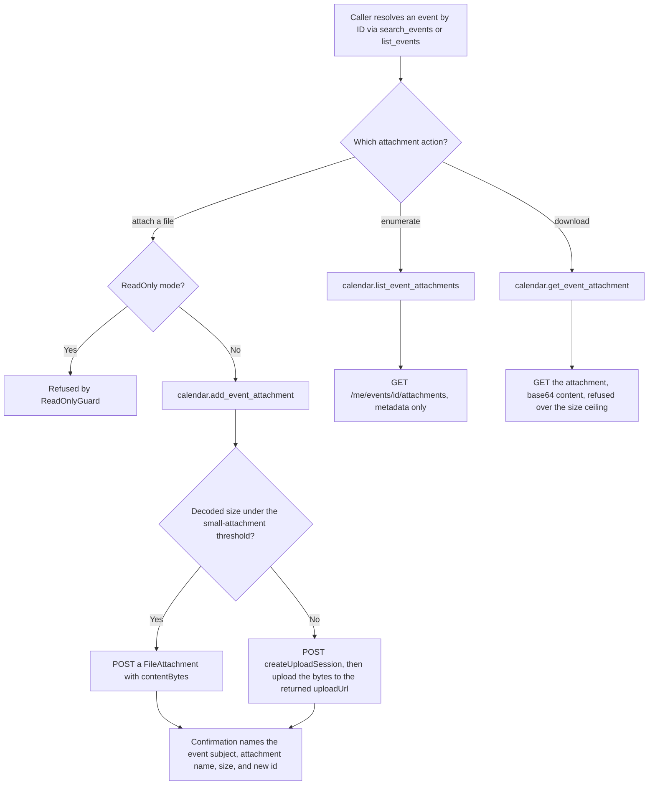
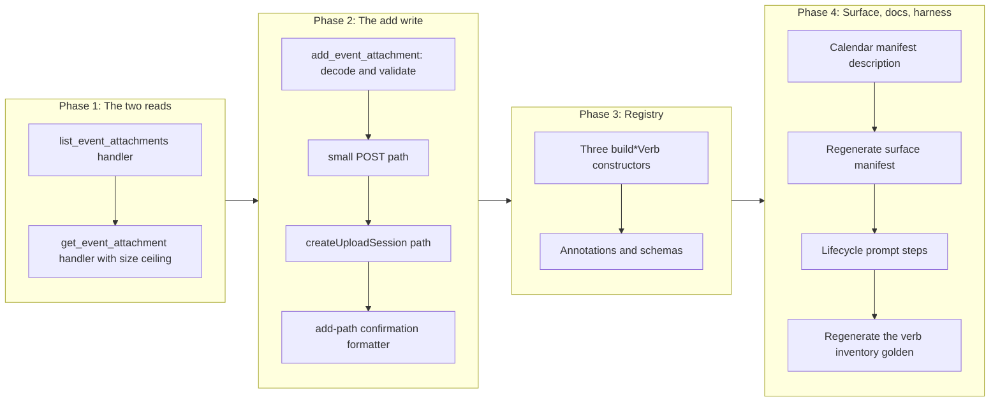

# Calendar Event Attachments

## Change Summary

The `mail` domain can enumerate a message's attachments, download one by ID, and (with
CR-0080) add a new one, small via a single POST and large via a resumable upload session.
The `calendar` domain can read and manage events but cannot touch the files attached to
them. A caller that has found a meeting invitation carrying an agenda document, a signed
contract, or a slide deck cannot list those files, cannot read their bytes, and cannot
attach a file of its own to an event it is organising. The agenda on a meeting is exactly
the artefact a productivity assistant is asked to summarise, and it is inaccessible.

This change adds exactly three verbs to the existing `calendar` domain registry:
`list_event_attachments`, `get_event_attachment`, and `add_event_attachment`. The two read
verbs mirror the mail domain's `list_attachments` and `get_attachment` byte-for-byte in
shape; the write verb mirrors CR-0080's `add_attachment`, taking a single POST under the
Graph small-attachment threshold and a `createUploadSession` above it. No new top-level MCP
tool is added; the aggregate tool count stays at four.

**Sequence.** This change request follows CR-0080 in the implementation sequence. CR-0080
lands the attachment write shape (single POST plus upload session) on the `mail` domain;
this change request applies the same shape, and the same two read verbs the mail domain
already ships, to the `calendar` domain. It depends on nothing CR-0080 introduces to the
calendar domain, because CR-0080 touches only mail, but it deliberately reuses CR-0080's
write pattern so the two domains present one attachment idiom rather than two.

## Motivation and Background

The feature-gap matrix names four calendar attachment rows and routes every one of them
through a change request rather than into code:

> | calendar | Add event attachment | yes | yes | no | | medium | No verb to attach a file to an event. | 4 |
> | calendar | Get event attachment | yes | yes | no | | medium | No verb to fetch an event attachment's bytes; agenda documents on meetings are inaccessible. | 4 |
> | calendar | List event attachments | yes | yes | no | | medium | No calendar-attachment verbs; attachments on invitations cannot be enumerated. (mail domain has gated attachment verbs, but not calendar.) | 4 |
> | calendar | Create attachment upload session | yes | yes | no | | low | No resumable large-attachment upload; depends on attachment support that is itself absent. goSdk=yes confirmed (create_upload_session builder present). | 4 |

The matrix note is precise about the asymmetry: "the mail domain has gated attachment
verbs, but not calendar." The mail domain proved the shape. `NewHandleListAttachments`
(`internal/tools/list_attachments.go:74`) enumerates a message's attachment metadata with a
`$select` restricted to lightweight fields and no content bytes.
`NewHandleGetAttachment` (`internal/tools/get_attachment.go:73`) downloads one attachment's
metadata and base64 content, enforcing `MaxAttachmentSizeBytes`
(`internal/config/config.go:153`, default 10 MB) so an oversized attachment is refused
rather than allocated. This change lifts that same shape onto events, where the underlying
Graph resource and Go SDK request builders are identical in structure to the mail ones.

The OAuth cost of closing the gap is zero. The calendar scope
`Calendars.ReadWrite` (`internal/auth/auth.go:22`) is requested unconditionally in every
configuration (`internal/auth/auth.go:57`), and it covers both reading an event's
attachments and adding one. No new consent prompt, no new scope, no new dependency.

The blast radius is small by construction. The two read verbs expose reads only: the
attachment-item request builder has a `Delete` method, and this change deliberately does
not wire it, because deleting an event attachment is a destructive operation the matrix
places out of scope (`Delete event attachment`, Manage=3). The write verb is additive: it
attaches a file and never removes one. Nothing here sends a meeting invitation or a
cancellation; attaching a file to an existing event does not notify attendees.

## Change Drivers

* The mail domain reads and downloads attachments and the calendar domain cannot, so the
  product's own attachment idiom stops at the mail boundary for no reason the matrix
  accepts.
* Meeting invitations routinely carry the exact document a user asks the assistant to
  read or summarise, and that document is currently unreachable through any verb.
* The scope is already granted. `Calendars.ReadWrite` is requested in every configuration,
  so the consent surface does not move.
* The Go SDK exposes the event-attachment request builders in the pinned v1.0 module, so
  no beta endpoint and no hand-rolled HTTP is required for the collection reads, the item
  read, or the upload-session creation.
* The four aggregate domain tools are a fixed surface, so growth belongs in the calendar
  verb registry rather than in a fifth tool.
* CR-0080 establishes the small-POST-or-upload-session write shape on mail one step
  earlier in the sequence, so applying it to calendar in the same idiom costs a mirror
  rather than a design.

## Current State

The calendar domain registers fifteen verbs, all built in
`internal/server/calendar_verbs.go` (`buildCalendarVerbs`, line 80) and **all always
registered**: unlike mail, the calendar domain has no feature-flag gate. Read verbs are
wrapped by `wrap` (authentication, account resolution, observability, audit); write verbs
are wrapped by `wrapWrite`, which inserts `ReadOnlyGuard` so a write is refused when the
server runs in read-only mode.

| Kind | Wrapper | Verbs |
|---|---|---|
| Read | `wrap` | `help`, `list_calendars`, `list_events`, `get_event`, `search_events`, `get_free_busy` |
| Write | `wrapWrite` | `create_event`, `update_event`, `delete_event`, `respond_event`, `reschedule_event`, `create_meeting`, `update_meeting`, `cancel_meeting`, `reschedule_meeting` |

There is no verb in the domain that touches an event's attachments. A caller can
`get_event` an invitation and read its `bodyPreview`, but the files clipped to that
invitation are invisible.

Measured facts about the surface as it stands, read from the repository at `78a3bb3`
rather than assumed:

* `site/src/generated/surface.json` records calendar at `fullCount` 15, `defaultCount` 15,
  every verb carrying `gate: null` because the domain has no feature flag. Mail records 13
  and 5; totals across the four domains are 42 full and 33 default.
* The mail attachment reads already exist and are the template: `list_attachments` selects
  `id, name, contentType, size, isInline` and downloads no bytes
  (`internal/tools/list_attachments.go:29`); `get_attachment` enforces
  `MaxAttachmentSizeBytes` before returning content
  (`internal/tools/get_attachment.go:125`).
* `extension/manifest.json` enumerates all fifteen calendar verbs in the `calendar` tool
  description (line 57), with no verb missing.

### Current State Diagram

```mermaid
flowchart TD
    A["Caller finds a meeting invitation"] --> B["calendar.get_event and calendar.search_events"]
    B --> C["Invitation carries an agenda document, a contract, a deck"]
    C --> D{"Is there a verb to reach the files?"}
    D -->|"Mail message"| E["mail.list_attachments, mail.get_attachment"]
    D -->|"Calendar event"| F["No verb exists"]
    F --> G["The document is unreachable through the assistant"]
    A --> H["Caller wants to attach a file to an event it organises"]
    H --> F
```



## Proposed Change

Three verbs are added to `buildCalendarVerbs`. Each lives in its own handler file under
`internal/tools/`, named for the verb. The two reads are wrapped by `wrap` and appear in
every configuration alongside every other calendar read; the write is wrapped by
`wrapWrite` so read-only mode refuses it, exactly as it refuses `create_event`.

### Verb inventory

| Verb | Kind | Graph call | Required parameters | Confirmation or result carries |
|---|---|---|---|---|
| `list_event_attachments` | read | `GET /me/events/{id}/attachments` with a lightweight `$select` | `event_id` | numbered list of attachment id, name, contentType, size, isInline; total count |
| `get_event_attachment` | read | `GET /me/events/{id}/attachments/{attachmentId}` | `event_id`, `attachment_id` | attachment metadata plus base64 content, refused above the size ceiling |
| `add_event_attachment` | write | `POST /me/events/{id}/attachments` under the threshold, `POST /me/events/{id}/attachments/createUploadSession` at or above it | `event_id`, `name`, `content_bytes` | event subject, attachment **name**, **size**, and the new attachment **id**, and which path (single POST or upload session) was used |

The search-first principle holds: a caller resolves the event through `search_events` or
`list_events`, then lists its attachments by `event_id`, then downloads one by
`attachment_id`, and adds one by `event_id`. Every attachment flow acts by an identifier
a read produced.

### Graph SDK surfaces, confirmed against the installed module

Confirmed by reading `github.com/microsoftgraph/msgraph-sdk-go@v1.100.0` in the module
cache, not the vendor's documentation. Every builder cited is in the v1.0 `users` package,
not the `/beta` package, so every endpoint is v1.0 GA.

* **Collection read and write.**
  `users/item_events_item_attachments_request_builder.go` exposes
  `Get` (line 90) returning `models.AttachmentCollectionResponseable`, and `Post` (line 110)
  taking `models.Attachmentable` and returning `models.Attachmentable`. This is the
  `client.Me().Events().ByEventId(id).Attachments()` path, the same navigation the existing
  `get_event` and `delete_event` handlers use
  (`internal/tools/get_event.go:163`, `internal/tools/delete_event.go:97`). The equivalent
  through the calendar navigation property named in the brief,
  `users/item_calendar_events_item_attachments_request_builder.go`, exists with the same
  `Get` (line 90) and `Post` (line 110) signatures; the handler uses the `Me().Events()`
  form to match the domain's existing event access.
* **Item read.**
  `users/item_events_item_attachments_attachment_item_request_builder.go` exposes `Get`
  (line 72) returning `models.Attachmentable`. Its `Delete` (line 55) exists and is
  **deliberately not used**: the read verbs expose reads only.
* **Upload session.**
  `users/item_events_item_attachments_create_upload_session_request_builder.go` exposes
  `Post` (line 43) returning `models.UploadSessionable`, and
  `users/item_events_item_attachments_create_upload_session_post_request_body.go` exposes
  `SetAttachmentItem` (line 99) to supply the `models.AttachmentItemable` describing the
  file to be uploaded.
* **Models.** `models/file_attachment.go` exposes `SetContentBytes([]byte)` (line 126) for
  the small-POST path; `models/attachment_item.go` exposes `SetName`, `SetContentType`,
  `SetSize`, and `SetAttachmentType` for the upload-session descriptor; and
  `models/attachment_type.go` defines `FILE_ATTACHMENTTYPE` (line 8).

### Annotation matrix

Each verb declares all four hints explicitly, per the project rule that a verb cannot be
registered without its own classification and that the aggregate is computed from the
registry.

| Verb | `readOnlyHint` | `destructiveHint` | `idempotentHint` | `openWorldHint` |
|---|---|---|---|---|
| `list_event_attachments` | `true` | `false` | `true` | `true` |
| `get_event_attachment` | `true` | `false` | `true` | `true` |
| `add_event_attachment` | `false` | `false` | `false` | `true` |

Justification, hint by hint, because an unjustified hint is the defect the computed-fold
rule exists to prevent:

* **`readOnlyHint: true` for the two reads, `false` for the add.** The reads fetch and do
  not mutate, matching `list_attachments` and `get_attachment`. The add writes a new
  attachment onto the event.
* **`destructiveHint: false` for all three.** The reads change nothing. The add is purely
  additive: it appends an attachment and removes nothing, the same shape as `create_event`,
  which is classified `false`. This is the reason deletion is out of scope; wiring the
  item builder's `Delete` would have introduced the one destructive attachment operation,
  and it is left for its own change request.
* **`idempotentHint: true` for the two reads, `false` for the add.** Repeating a read
  returns the same bytes. The add is a `POST` that mints a new attachment with a new
  identifier on every successful call; a second identical call produces a second
  attachment, so it cannot be idempotent, matching `create_event`.
* **`openWorldHint: true` for all three.** Every one calls Microsoft Graph.

The aggregate fold is unchanged by these values. The calendar tool already publishes
`readOnlyHint: false` (from `create_event` and the other writes), `destructiveHint: true`
(from `delete_event` and `cancel_meeting`), `idempotentHint: false` (from `create_event`
and `create_meeting`), and `openWorldHint: true`, so the folded calendar annotation is
byte-identical before and after this change.

### Schema notes

* `list_event_attachments` declares `event_id` (required), `account`, and `output`
  (`text | summary | raw`).
* `get_event_attachment` declares `event_id` (required), `attachment_id` (required),
  `account`, and `output` (`text | summary | raw`).
* `add_event_attachment` declares `event_id` (required), `name` (required), `content_bytes`
  (required, base64-encoded file bytes), `content_type` (optional MIME type),
  `is_inline` (optional boolean), and `account`. It declares **no** `output` parameter,
  per the write-verb tiering rule.
* `event_id` is new to no calendar verb by name; the calendar domain publishes it on every
  event verb already, so the flattened aggregate schema merges the new declarations into
  the existing one with no description conflict. `attachment_id`, `name`, `content_bytes`,
  `content_type`, and `is_inline` are new parameter names in the calendar domain and
  collide with nothing, since the union is computed per domain. In particular the calendar
  `name` parameter is introduced here for the first time and does not collide with the mail
  domain's use of the same word, because domains do not share a flattened schema.

### Proposed State Diagram



## Requirements

### Functional Requirements

1. The system **MUST** register exactly three new verbs in the `calendar` domain verb
   registry, named `list_event_attachments`, `get_event_attachment`, and
   `add_event_attachment`, and **MUST NOT** register any new top-level MCP tool; the
   registered tool count **MUST** remain four.
2. All three verbs **MUST** be registered in every configuration, because the calendar
   domain has no feature-flag gate. The two read verbs **MUST** be wrapped by the read
   middleware chain and the write verb **MUST** be wrapped by the write chain so that
   `ReadOnlyGuard` refuses it in read-only mode, exactly as it refuses `create_event`.
3. `list_event_attachments` **MUST** require `event_id`, **MUST** issue
   `GET /me/events/{id}/attachments` with a `$select` restricted to the lightweight fields
   `id`, `name`, `contentType`, `size`, and `isInline`, and **MUST NOT** download any
   attachment content bytes.
4. `get_event_attachment` **MUST** require `event_id` and `attachment_id`, **MUST** issue
   `GET /me/events/{id}/attachments/{attachmentId}`, and **MUST** return the attachment's
   metadata together with its base64-encoded content for a file attachment.
5. `get_event_attachment` **MUST** enforce the server's `MaxAttachmentSizeBytes` limit
   against the attachment's reported size and **MUST** refuse an attachment exceeding it
   with an error that names the limit and the environment variable that raises it, exactly
   as `get_attachment` does today.
6. `add_event_attachment` **MUST** require `event_id`, `name`, and a base64-encoded
   `content_bytes`, and **MUST** decode `content_bytes` and reject an input that is not
   valid base64 before any Graph request is issued.
7. `add_event_attachment` **MUST** attach the file with a single
   `POST /me/events/{id}/attachments` of a file attachment when the decoded content size is
   below the Graph small-attachment threshold, and **MUST** create an upload session with
   `POST /me/events/{id}/attachments/createUploadSession` and upload the bytes to the
   returned upload URL when the decoded content size is at or above that threshold.
8. `add_event_attachment` **MUST** enforce an upper bound on the decoded content size equal
   to the server's `MaxAttachmentSizeBytes` limit, and **MUST** refuse a larger input with
   an error naming the limit, so a single tool call cannot allocate unbounded memory.
9. The `add_event_attachment` confirmation **MUST** name the event subject, the attachment
   name, the attachment size in bytes, and the identifier of the attachment Graph returns,
   and **MUST** state which path was used, the single POST or the upload session, because
   the path is a consequence the caller cannot otherwise observe.
10. Every one of the three verbs **MUST** validate `event_id` with
    `validate.ValidateResourceID`, and `get_event_attachment` **MUST** additionally
    validate `attachment_id` the same way, rejecting an invalid identifier before any Graph
    request is issued.
11. `add_event_attachment` **MUST** validate `name` with `validate.ValidateStringLength`
    against an appropriate bound, mirroring the length validation the event write verbs
    apply to their string parameters.
12. The two read verbs **MUST** implement all three output tiers (`text`, `summary`, `raw`)
    via the `output` parameter, matching the mail attachment reads. The write verb
    **MUST** return a text confirmation unconditionally and **MUST NOT** declare an
    `output` parameter.
13. No read verb **MUST** expose an update or a delete: `list_event_attachments` and
    `get_event_attachment` read attachments only, and the attachment-item request builder's
    `Delete` method **MUST NOT** be wired by this change.
14. Every one of the three verbs **MUST** declare all four annotation hints explicitly,
    with the values given in the annotation matrix above.
15. Every one of the three verbs **MUST** be wrapped by its middleware chain under the
    identity `calendar.<verb>`, so the audit record and the OpenTelemetry attributes carry
    the same `{domain}.{operation}` identity as every other verb. The two reads use the
    audit operation `read`; the write uses `write`.
16. Every handler **MUST** route its Graph call through `graph.RetryGraphCall` inside
    `graph.WithTimeout`, and **MUST** report a timeout via `graph.TimeoutErrorMessage` and
    redact a Graph error via `graph.RedactGraphError`, so retry, timeout, and redaction
    behaviour is identical to the verbs already registered.
17. Every error raised by the three verbs **MUST** carry a fix instruction naming what to
    supply or correct, and **MUST** reach both the tool result and the log record, so a
    headless caller that cannot read an interactive surface still receives the correction.
18. Every one of the three verbs **MUST** carry a non-empty `Summary` of at most eighty
    characters, a non-empty `Description` stating its parameters and its annotation
    semantics, at least one `Examples` entry, and at least one `SeeDocs` reference that
    resolves to an existing heading in the embedded documentation bundle. The two reads
    reference `concepts#output-tiers`; the write references `concepts#read-only-mode`.
19. The `get_event_attachment` description **MUST** state that the full content is returned
    only within the size ceiling and that a larger attachment is refused, so the caller can
    decide from a prior `list_event_attachments` whether the download is warranted.
20. The `calendar` entry of `extension/manifest.json` **MUST** enumerate the three new
    verbs in its description, and the manifest's `tools` array **MUST** remain exactly four
    entries, because no new top-level tool is added.
21. The generated surface manifest `site/src/generated/surface.json` **MUST** be
    regenerated with `make surface-manifest` and committed in the same change, so the
    published website states the surface that exists.
22. `docs/prompts/mcp-tool-crud-test.md` **MUST** gain lifecycle steps exercising the three
    verbs, covering the add path, the list path, and the get path against a real event.
23. The committed verb inventory golden in `internal/tools/dispatch_registry_test.go`
    **MUST** be regenerated to include the three new identities with their hints.
24. The change **MUST NOT** alter the OAuth scope set requested in any configuration:
    `Calendars.ReadWrite` already covers all three verbs and is requested unconditionally.

### Non-Functional Requirements

1. Each verb's handler **MUST** live in its own file under `internal/tools/`, named for the
   verb, mirroring the one-file-per-verb layout of the calendar and mail domains.
2. The composed `calendar` tool description **MUST** stay below the 4 000-character bound
   asserted by the description-length test; the addition of three inventory lines leaves
   substantial headroom, but the bound is asserted rather than assumed.
3. The cold-start schema reduction **MUST** stay at or above the 60% floor the schema-size
   test asserts against the documented baseline.
4. The two read verbs **MUST** be deterministic and idempotent: repeating a read with
   identical arguments **MUST** return the same result.
5. `list_event_attachments` and `get_event_attachment` **MUST** each issue exactly one
   Graph request on the success path. `add_event_attachment` **MUST** issue exactly one
   `POST` on the small-attachment path, and on the large path **MUST** issue exactly one
   `createUploadSession` followed by the chunk uploads that session requires and no
   additional metadata round trip.
6. The change **MUST NOT** add a third-party dependency. The upload to the session's
   returned URL **MUST** be performed with a surface already available to the module, and
   the change **MUST** state which one it uses.
7. The change **MUST NOT** alter the behaviour, schema, or annotations of any existing
   calendar verb; it only appends three verbs and the manifest and surface records that
   enumerate them.

## Affected Components

* `internal/tools/list_event_attachments.go` (new): the `list_event_attachments` handler
  constructor, a near-mirror of `NewHandleListAttachments`
  (`internal/tools/list_attachments.go`) reading events instead of messages.
* `internal/tools/get_event_attachment.go` (new): the `get_event_attachment` handler
  constructor, a near-mirror of `NewHandleGetAttachment`
  (`internal/tools/get_attachment.go`), including the `MaxAttachmentSizeBytes` ceiling.
* `internal/tools/add_event_attachment.go` (new): the `add_event_attachment` handler
  constructor, applying CR-0080's small-POST-or-upload-session write shape to events,
  including base64 decoding, the size-ceiling check, the threshold branch, and the
  confirmation.
* `internal/tools/event_attachment_confirmation.go` (new): the confirmation formatter for
  the add path, naming the event subject, attachment name, size, id, and path used. It is
  a small dedicated formatter because the existing `FormatWriteConfirmation`
  (`internal/tools/create_event.go:376`) is shaped for events with a display time and
  location, not for an attachment.
* `internal/server/calendar_verbs.go`: three new `build*Verb` constructors appended to
  `buildCalendarVerbs` (line 99), carrying `Summary`, `Description`, `Examples`, `SeeDocs`,
  `Annotations`, and `Schema` per FR-14 and FR-18; the two reads wired with `wrap` under
  `read`, the write wired with `wrapWrite` under `write`.
* `extension/manifest.json`: the `calendar` tool description (line 57). The `tools` array
  itself is **unchanged at four entries**.
* `site/src/generated/surface.json`: regenerated, not hand-edited. Calendar moves from 15
  to 18 `fullCount` and from 15 to 18 `defaultCount` (the calendar domain has no gate, so
  the two counts stay equal). The four-domain totals move accordingly; the precise total
  depends on which sibling change requests are merged first, so the requirement is to
  regenerate rather than to assert a fixed total.
* `docs/prompts/mcp-tool-crud-test.md`: lifecycle steps exercising the three verbs
  (FR-22).
* `internal/tools/dispatch_registry_test.go`: the verb inventory golden (FR-23).
* `scripts/crud-test.sh`: **no change required.** Its per-domain accounting keys on the MCP
  tool name `mcp__outlook-local-mcp__calendar`, not on the operation verb, so additional
  calendar verbs raise the existing calendar counter without a script edit.
* `docs/bench/crud-runs.csv`: **no column change.** The header is per-domain, not per-verb;
  new runs record a higher calendar value and more turns.

## Scope Boundaries

### In Scope

* Exactly three new calendar verbs: `list_event_attachments`, `get_event_attachment`, and
  `add_event_attachment`.
* Their handlers, registry entries, annotations, schemas, and unit tests.
* The dedicated add-path confirmation formatter.
* The single-POST and `createUploadSession` branch of the add verb, selected by decoded
  content size against the Graph small-attachment threshold.
* The `MaxAttachmentSizeBytes` ceiling on both the download read and the add write.
* The calendar manifest description update, the regenerated surface manifest, and the
  lifecycle harness steps.

### Out of Scope ("Here, But Not Further")

* **Deleting an event attachment.** `DELETE /me/events/{id}/attachments/{attachmentId}` is
  a destructive operation the matrix places out of scope (`Delete event attachment`,
  Manage=3). The attachment-item request builder's `Delete` exists and is deliberately not
  wired.
* **Item and reference attachments.** This change attaches and reads file attachments. Item
  attachments (an embedded message or event) and reference attachments (a link to a cloud
  file) are separate attachment types and are not created by the add verb; the reads report
  whatever type Graph returns but the add creates a file attachment only.
* **Attachments on calendar-group or secondary-calendar events.** The verbs use the
  `Me().Events()` navigation, matching every existing event verb. Attaching to an event
  reached through `Me().Calendars().ByCalendarId(...)` or a calendar group is not added
  here; the equivalent request builders exist but are out of scope for this change.
* **A separate large-attachment configuration knob.** The add path reuses
  `MaxAttachmentSizeBytes` as its ceiling rather than introducing a second limit. A caller
  that needs a larger ceiling raises the one environment variable that already governs the
  download read.
* **Notifying attendees of a new attachment.** Adding a file to an event does not send an
  update to attendees, and this change does not add such a notification. Sending is outside
  the product's scope.
* **Mail attachment writes.** The mail add verb is CR-0080's subject, one step earlier in
  the sequence. This change does not touch the mail domain.
* **Changing the four-tool aggregate surface, the output-tier model, or the read-only
  gating model.**

## Alternative Approaches Considered

* **One `manage_event_attachments` verb dispatching on an action parameter.** Fewer verbs,
  but it cannot carry one honest annotation classification, because the reads are
  read-only and idempotent while the add is neither, and it cannot state one
  required-parameter list. It would reproduce inside one verb the ambiguity that separate
  verbs remove for free, and it would diverge from the mail domain, where list, get, and
  add are three verbs.
* **Exposing delete alongside the reads to make the surface "complete".** Rejected: the
  matrix routes event-attachment deletion out of scope, and a read path exposing a delete
  is precisely the standing principle this family of change requests forbids. Deletion, if
  ever wanted, is its own change request with its own destructive confirmation design.
* **A single small-POST path with no upload session, refusing anything over the
  threshold.** Rejected: the matrix names the upload session explicitly, the SDK builder is
  confirmed present, and a common agenda deck or PDF can exceed 3 MB. Omitting the session
  would ship a verb that fails on ordinary inputs.
* **Adding a distinct upload-size configuration value.** Rejected as premature: reusing
  `MaxAttachmentSizeBytes` keeps one knob for the whole attachment surface, and a second
  knob can be added by a later change if a real workload needs asymmetric limits.
* **Reaching events through `Me().Calendar().Events()` to match the brief's named
  builder.** Both navigations resolve to v1.0 GA builders. The `Me().Events()` form was
  chosen because it matches the domain's existing `get_event` and `delete_event` handlers,
  keeping one event-access idiom across the domain.

## Impact Assessment

### User Impact

A user gains the ability to have the assistant enumerate the files on a meeting invitation,
read one of them, and attach a file to an event the user organises. Because the calendar
domain is ungated, the reads are available in every configuration; the add is available
whenever the server is not in read-only mode, exactly like `create_event`. Nothing changes
about sending, and adding a file to an event does not notify attendees.

The one behaviour a user must understand is that a large attachment travels through an
upload session rather than a single request, and that an attachment above the configured
ceiling is refused rather than truncated. The confirmation states the path used, and the
`get_event_attachment` description states the ceiling.

### Technical Impact

No breaking change, no schema migration, no new dependency, and no new OAuth scope. Every
existing calendar verb is byte-identical after the change. The published calendar tool
grows by three operation-enum entries and a small number of new flattened parameters
(`attachment_id`, `name`, `content_bytes`, `content_type`, `is_inline`); `event_id`,
`account`, and `output` are already published by existing calendar verbs.

The folded calendar annotation does not move: the domain already publishes non-read-only,
destructive, non-idempotent, open-world from its existing write verbs.

### Business Impact

Low cost against a medium-value gap the matrix names four times. The two read verbs are
near-mirrors of shipped mail handlers, and the write verb mirrors CR-0080's mail add verb
one step earlier in the sequence, so the work concentrates in the add path's threshold
branch and its confirmation rather than in novel design.

## Implementation Approach

### Implementation Flow



### Phase 1: The two reads

1. `internal/tools/list_event_attachments.go`:
   `NewHandleListEventAttachments(retryCfg, timeout)`. Resolve the Graph client, validate
   `event_id`, build the attachments collection request with a `$select` restricted to the
   lightweight fields, call
   `client.Me().Events().ByEventId(id).Attachments().Get(...)`, and serialise the result
   through the existing attachment serialisers and text formatter used by
   `list_attachments`. No content bytes are fetched.
2. `internal/tools/get_event_attachment.go`:
   `NewHandleGetEventAttachment(retryCfg, timeout, maxSize)`. Validate `event_id` and
   `attachment_id`, call
   `client.Me().Events().ByEventId(id).Attachments().ByAttachmentId(aid).Get(...)`, enforce
   the `maxSize` ceiling against the reported size, and return metadata plus base64 content
   through the same serialisers as `get_attachment`.
3. Both handlers route through `graph.RetryGraphCall` inside `graph.WithTimeout`, and both
   report timeouts and redact Graph errors with the shared helpers (NFR consistency).

**Affected components:** `internal/tools/list_event_attachments.go`,
`internal/tools/get_event_attachment.go` (both new), and their test files.

### Phase 2: The add write

1. `internal/tools/add_event_attachment.go`:
   `NewHandleAddEventAttachment(retryCfg, timeout, maxSize)`. Validate `event_id` and
   `name`, decode `content_bytes` as base64 and reject an invalid input, and enforce the
   `maxSize` ceiling against the decoded length.
2. When the decoded size is below the Graph small-attachment threshold, build a
   `models.FileAttachment`, set its name, content type, inline flag, and `SetContentBytes`,
   and `POST` it via `client.Me().Events().ByEventId(id).Attachments().Post(...)`.
3. When the decoded size is at or above the threshold, build a
   `models.AttachmentItem` with `SetAttachmentType(FILE_ATTACHMENTTYPE)`, `SetName`,
   `SetContentType`, and `SetSize`, set it on the create-upload-session request body via
   `SetAttachmentItem`, `POST` `createUploadSession`, read the returned upload URL from the
   `models.UploadSessionable`, and upload the bytes to it in chunks. The upload uses a
   surface already available to the module (the standard library HTTP client, or the Graph
   core large-file upload task if it is already an indirect dependency); the phase states
   which, and adds no new third-party dependency (NFR-6).
4. Format the confirmation with the dedicated formatter, naming the event subject, the
   attachment name, the size, the returned attachment identifier, and the path used.

**Affected components:** `internal/tools/add_event_attachment.go`,
`internal/tools/event_attachment_confirmation.go` (both new), and their test files.

### Phase 3: Registry entries

1. Add three `build*Verb` constructors to `internal/server/calendar_verbs.go` and append
   them to the slice returned by `buildCalendarVerbs`. Wire the two reads with `wrap` under
   the identity `calendar.<verb>` and audit operation `read`, and the write with
   `wrapWrite` under `calendar.add_event_attachment` and audit operation `write`.
2. Populate `Summary`, `Description`, `Examples`, and `SeeDocs` for each, per the rule that
   per-verb reference is owned by the registry. The descriptions state the parameters, the
   annotation semantics, and, for `get_event_attachment`, the size ceiling and the refusal
   above it (FR-19).
3. Declare all four annotation hints explicitly on each verb, per the matrix (FR-14).
4. Declare each verb's `Schema`, marking the required parameters and declaring **no**
   `output` parameter on the write (FR-12).

**Affected components:** `internal/server/calendar_verbs.go`, and the calendar registry
test file.

### Phase 4: Surface, documentation, and harness

1. Extend the `calendar` tool description in `extension/manifest.json` with the three verbs,
   leaving the `tools` array at four entries (FR-20).
2. Run `make surface-manifest` and commit `site/src/generated/surface.json` (FR-21).
   `make ci` fails on a stale manifest via the surface drift check, so this step is not
   optional.
3. Add lifecycle steps to `docs/prompts/mcp-tool-crud-test.md` exercising add, list, and
   get against a real event (FR-22).
4. Regenerate the verb inventory golden in `internal/tools/dispatch_registry_test.go` from
   the failing test's own output and review the delta, which must be exactly three added
   lines (FR-23).

**Affected components:** `extension/manifest.json`, `site/src/generated/surface.json`,
`docs/prompts/mcp-tool-crud-test.md`, `internal/tools/dispatch_registry_test.go`.

## Test Strategy

Handler tests follow the established attachment-verb pattern: an `httptest` server
returning canned Graph JSON behind a real SDK client built by the shared test helper, the
client injected into the context, the handler constructor called directly, and assertions
made as substring checks on the returned text and on `result.IsError`. No test issues a
network call.

### Tests to Add

| Test File | Test Name | Description | Inputs | Expected Output |
|-----------|-----------|-------------|--------|-----------------|
| `internal/tools/list_event_attachments_test.go` | `TestListEventAttachments_Success` | The collection read returns metadata | `event_id` with a two-attachment canned response | Numbered list naming both attachments; one GET observed |
| `internal/tools/list_event_attachments_test.go` | `TestListEventAttachments_NoContentBytesFetched` | The read selects lightweight fields only | Canned response, request inspected | The request carries the restricted `$select` and no content bytes are requested |
| `internal/tools/list_event_attachments_test.go` | `TestListEventAttachments_InvalidEventIDRejectedBeforeCall` | Identifier validation precedes Graph | Malformed `event_id` | Error returned, no request issued |
| `internal/tools/get_event_attachment_test.go` | `TestGetEventAttachment_ReturnsContent` | The item read returns base64 content | `event_id`, `attachment_id` with a small file attachment | Metadata plus base64 content; one GET observed |
| `internal/tools/get_event_attachment_test.go` | `TestGetEventAttachment_RefusesOverSizeCeiling` | The ceiling is enforced | Canned attachment whose size exceeds the configured limit | Error naming the limit and the environment variable; no content returned |
| `internal/tools/get_event_attachment_test.go` | `TestGetEventAttachment_RequiresAttachmentID` | Both identifiers are required | `event_id` only | Error naming `attachment_id`; no request issued |
| `internal/tools/event_attachment_readonly_test.go` | `TestReadVerbsWireNoDeleteOrMutation` | The two read verbs expose reads only, beyond the annotation-hint assertion: their schemas carry no mutation parameter and their handlers issue only a GET, never a DELETE or PATCH, and the attachment-item `Delete` builder is never invoked (FR-13, AC-9) | The registered schemas of `list_event_attachments` and `get_event_attachment`, and each handler driven against a test server recording the HTTP method | Neither schema declares an update or delete parameter; the only method observed from either handler is GET; no DELETE or PATCH is ever issued |
| `internal/tools/add_event_attachment_test.go` | `TestAddEventAttachment_SmallPostPath` | A small file uses a single POST | `event_id`, `name`, small base64 `content_bytes` | One POST of a file attachment; confirmation names the subject, name, size, new id, and the single-POST path |
| `internal/tools/add_event_attachment_test.go` | `TestAddEventAttachment_UploadSessionPath` | A large file uses createUploadSession | `content_bytes` decoding above the threshold | A createUploadSession POST followed by chunk uploads; confirmation names the upload-session path |
| `internal/tools/add_event_attachment_test.go` | `TestAddEventAttachment_RejectsInvalidBase64` | Bad content is refused before Graph | `content_bytes` that is not valid base64 | Error naming `content_bytes`; no request issued |
| `internal/tools/add_event_attachment_test.go` | `TestAddEventAttachment_RefusesOverSizeCeiling` | The decoded ceiling is enforced | Decoded content larger than the limit | Error naming the limit; no request issued |
| `internal/tools/add_event_attachment_test.go` | `TestAddEventAttachment_RejectsOverLengthName` | The `name` length bound is enforced with `validate.ValidateStringLength`, mirroring the event write verbs, before any Graph request (FR-11) | `event_id`, valid `content_bytes`, and a `name` longer than the shared string-length bound | Error naming `name` and the length limit; no request issued |
| `internal/tools/add_event_attachment_test.go` | `TestAddEventAttachment_ConfirmationUsesGraphResponse` | The new id is read from the response, not echoed | Canned response whose id differs from any request field | Confirmation reports the response id |
| `internal/tools/event_attachment_confirmation_test.go` | `TestAddConfirmationNamesSubjectNameSizeAndPath` | The confirmation contract is complete | A canned successful add on each path | Every confirmation names subject, attachment name, size, id, and which path ran |
| `internal/tools/event_attachment_verbs_test.go` | `TestEventAttachmentVerbsHonourTimeoutAndRedaction` | Timeout reporting and Graph-error redaction are the shared behaviour of all three verbs, not per-handler improvisation (FR-16) | A test server that hangs, and one returning a Graph error carrying a token-like string, driven against each of the three handlers | The timeout message names the configured timeout in seconds; the error text is redacted by `graph.RedactGraphError` with no token-like string surviving |
| `internal/tools/event_attachment_verbs_test.go` | `TestEventAttachmentErrorsReachBothChannels` | Every error's fix instruction reaches both the tool result and the log record, so a headless caller still receives the correction (FR-17, AC-10) | A forced error against each of the three handlers with the log output captured | The tool result and the captured log record both carry the same fix instruction naming the parameter or limit at fault |
| `internal/tools/tool_annotations_test.go` | `TestCalendarAttachmentVerbAnnotations` | Each new verb's four hints match the matrix | The calendar registry | The two reads read-only, non-destructive, idempotent, open-world; the add non-read-only, non-destructive, non-idempotent, open-world |
| `internal/server/calendar_verbs_test.go` | `TestCalendarRegistersAttachmentVerbs` | The three verbs register unconditionally | The calendar registry in any configuration | All three present in the operation enum; tool count four |
| `internal/server/calendar_verbs_test.go` | `TestReadOnlyBlocksAddEventAttachment` | Read-only mode blocks the write and not the reads | Read-only server, each verb invoked | The add returns the read-only refusal naming its calendar dot verb identity; the two reads succeed |

### Tests to Modify

| Test File | Test Name | Current Behavior | New Behavior | Reason for Change |
|-----------|-----------|------------------|--------------|-------------------|
| `internal/tools/dispatch_registry_test.go` | the verb inventory golden test | Golden holds the pre-change identity set with 15 calendar identities | Golden adds `calendar.add_event_attachment ro=false de=false id=false ow=true`, `calendar.get_event_attachment ro=true de=false id=true ow=true`, and `calendar.list_event_attachments ro=true de=false id=true ow=true` | The verb surface changes intentionally; the golden is the record of that intent |
| `internal/tools/tool_annotations_test.go` | the folded calendar annotation test | Asserts the folded calendar annotations before this change | Unchanged expectations, re-asserted against the larger verb set | The fold must not shift; the existing write verbs already force non-read-only, destructive, and non-idempotent |
| `docs/prompts/mcp-tool-crud-test.md` | lifecycle prompt steps | Calendar coverage ends without attachment steps | Steps exercising add, list, and get against a real event | The harness must exercise the verbs it now has |

### Tests to Remove

Not applicable. No functionality is removed or superseded by this change, so no existing
test becomes obsolete or redundant.

### Existing Tests That Gate This Change Without Modification

These already derive their cases from the registry or the configuration, so they grade
several acceptance criteria without being touched.

| Test File | Test Name | Criterion it grades |
|-----------|-----------|---------------------|
| `internal/tools/verb_metadata_test.go` | the description, summary, classification, and SeeDocs-anchor completeness tests | AC-6: registry metadata completeness and anchor resolution for each new verb |
| `internal/tools/description_quality_test.go` | the composed-description length bound | NFR-2: the calendar description stays below 4 000 characters |
| `internal/server/schema_size_test.go` | the cold-start schema reduction test | NFR-3: the reduction stays at or above 60% |
| `internal/surface/manifest_test.go` | the committed-manifest match test | AC-7: the committed surface manifest matches the registry |
| `internal/auth/auth_test.go` | the calendar-scope tests | AC-8: the requested scope set is unchanged and no new scope is added |

## Acceptance Criteria

### AC-1: The three verbs register, unconditionally, with the write behind read-only mode

```gherkin
Given a server in any configuration
When the registered tools are listed
Then the calendar tool's operation enum contains list_event_attachments, get_event_attachment, and add_event_attachment
  And exactly four top-level tools are registered
Given instead a server started in read-only mode
When add_event_attachment is invoked
Then it returns the read-only refusal naming its calendar dot verb identity
  And list_event_attachments and get_event_attachment still succeed
```

### AC-2: The collection read enumerates metadata without downloading content

```gherkin
Given an event carrying two attachments
When list_event_attachments is called with the event identifier
Then a single request enumerates the attachments with the lightweight field selection
  And the result names both attachments with their id, name, content type, and size
  And no attachment content bytes are downloaded
```

### AC-3: The item read returns content and honours the size ceiling

```gherkin
Given an event attachment within the configured size ceiling
When get_event_attachment is called with the event and attachment identifiers
Then the result returns the attachment metadata and its base64-encoded content
Given instead an attachment whose reported size exceeds the ceiling
When get_event_attachment is called
Then the call is refused with an error naming the limit and the environment variable that raises it
  And no content is returned
```

### AC-4: A small file is added with a single POST

```gherkin
Given a file whose decoded size is below the Graph small-attachment threshold
When add_event_attachment is called with the event identifier, a name, and the base64 content
Then a single attachments POST is issued
  And the confirmation names the event subject, the attachment name, the size, the new attachment identifier, and the single-POST path
```

### AC-5: A large file is added through an upload session

```gherkin
Given a file whose decoded size is at or above the Graph small-attachment threshold
When add_event_attachment is called
Then an upload session is created and the bytes are uploaded to the returned URL
  And no additional metadata round trip is issued
  And the confirmation names the upload-session path
```

### AC-6: Registry metadata is complete for every new verb

```gherkin
Given each of the three new verbs
When its registry entry is inspected
Then it carries a non-empty summary of at most eighty characters
  And a non-empty description stating its parameters and its annotation semantics
  And at least one example
  And at least one documentation reference resolving to an existing heading in the embedded bundle
  And the two reads declare an output parameter while the add declares none
```

### AC-7: The manifest and the generated surface name the new verbs

```gherkin
Given the calendar manifest description and the generated surface manifest
When each is read after make ci
Then the manifest description enumerates the three new verbs and the tools array holds exactly four entries
  And the surface drift check passes without modifying the working tree
  And the calendar domain records three more full verbs and three more default verbs than before this change
```

### AC-8: The consent surface is unchanged

```gherkin
Given the implemented change
When the requested OAuth scope set is computed for every supported configuration
Then it is identical to the set requested before this change
  And no new scope is requested for reading or adding event attachments
```

### AC-9: No read verb exposes a mutation

```gherkin
Given the two read verbs list_event_attachments and get_event_attachment
When their registered schemas and handlers are inspected
Then neither exposes an update or a delete of an attachment
  And the attachment-item delete request builder is not wired by this change
```

### AC-10: Errors carry their correction on both channels

```gherkin
Given an add whose content is not valid base64, or whose decoded size exceeds the ceiling
When the verb is called
Then the tool result names the correction, including the parameter or the limit at fault
  And the log record carries the same correction
  And no request is sent to Microsoft Graph
```

### AC-11: The implementation follows the project's file and helper conventions

```gherkin
Given the implemented change
When a Graph call from any of the three verbs times out or returns an error
Then the timeout message names the configured timeout in seconds
  And the error text is redacted by the shared helper and carries a fix instruction
Given the same change
When the source tree is reviewed
Then each new verb's handler lives in its own file under the tools package, named for the verb
  And no new third-party dependency has been added
```

## Quality Standards Compliance

### Build & Compilation

- [ ] Code compiles/builds without errors
- [ ] No new compiler warnings introduced

### Linting & Code Style

- [ ] All linter checks pass with zero warnings/errors
- [ ] Code follows project coding conventions and style guides
- [ ] Any linter exceptions are documented with justification

### Test Execution

- [ ] All existing tests pass after implementation
- [ ] All new tests pass, including under the race detector
- [ ] Test coverage meets project requirements for changed code

### Documentation

- [ ] Every new file carries a package-consistent doc comment and a single index annotation
- [ ] Every new verb's parameters and annotation semantics are documented in the registry, not in markdown
- [ ] No governance identifier appears in source, test names, or user-facing documentation

### Code Review

- [ ] Changes submitted via pull request
- [ ] PR title follows Conventional Commits format
- [ ] Code review completed and approved
- [ ] Changes squash-merged to maintain linear history

### Verification Commands

```bash
# Full pipeline, including the surface drift check and the extension manifest validation
make ci

# The new handlers and the registry checks, under the race detector
go test -race ./internal/tools/ ./internal/server/ \
  -run 'EventAttachment|CalendarAttachment|VerbInventory'

# Regenerate the published surface manifest after the registry changes
make surface-manifest

# Rebuild the binary the harness drives, then run the lifecycle harness
go build -ldflags="-X main.commit=$(git rev-parse --short HEAD) -X main.buildDate=$(date -u +%Y-%m-%dT%H:%M:%SZ)" \
  -o ./outlook-local-mcp ./cmd/outlook-local-mcp
make crud-test
```

The unit suite issues no Graph call, so it cannot confirm live behaviour. Acceptance
additionally requires a user scenario driving the built server against a live mailbox: list
the attachments on a real invitation, download one, add a small file and confirm it appears
in a re-list, then add a file above the threshold and confirm the upload-session path
succeeds. Persist the scenario under `.agents/scenarios/` per the project's scenario rule,
and read the harness report's own server version line against `git rev-parse --short HEAD`
before trusting any row of it.

## Risks and Mitigation

### Risk 1: The upload-session path is under-exercised and fails only on large real files

**Likelihood:** medium
**Impact:** medium
**Mitigation:** The threshold branch is the one genuinely new mechanism in this change. A
handler test decodes content above the threshold and asserts the createUploadSession POST
and the chunk uploads, and the live user scenario adds a file above the threshold against a
real mailbox. The confirmation states which path ran, so a caller can see when the session
path was taken.

### Risk 2: A read verb is quietly extended to delete

**Likelihood:** low
**Impact:** high
**Mitigation:** The standing principle is that read paths expose reads only. The
attachment-item request builder's `Delete` exists and is deliberately left unwired; a test
asserts neither read verb exposes a mutation, and deletion is recorded out of scope so a
future contributor routes it through its own change request rather than folding it in here.

### Risk 3: Reusing MaxAttachmentSizeBytes as the add ceiling surprises a caller

**Likelihood:** low
**Impact:** low
**Mitigation:** One knob governing the whole attachment surface is simpler than two, and
the download read already uses it. The add error names the limit and the environment
variable, so a caller that hits it learns how to raise it. A distinct upload knob is
recorded out of scope and can be added later without reopening this design.

### Risk 4: The surface totals drift because sibling change requests land in a different order

**Likelihood:** medium
**Impact:** low
**Mitigation:** This change asserts the calendar delta (three more full and three more
default verbs) rather than a fixed four-domain total, and requires regeneration via
`make surface-manifest` with the drift check in `make ci` as the gate. The total is derived
from the registry at merge time rather than pinned in this document.

## Dependencies

* No new third-party dependency. All three verbs use request builders already present in
  the pinned `github.com/microsoftgraph/msgraph-sdk-go v1.100.0`, confirmed by reading the
  module cache: `item_events_item_attachments_request_builder.go` (Get, Post),
  `item_events_item_attachments_attachment_item_request_builder.go` (Get),
  `item_events_item_attachments_create_upload_session_request_builder.go` (Post), and the
  `create_upload_session_post_request_body.go` `SetAttachmentItem` setter.
* No new OAuth scope. `Calendars.ReadWrite` is requested unconditionally
  (`internal/auth/auth.go:57`).
* Follows CR-0080 in the implementation sequence, reusing its small-POST-or-upload-session
  write shape; depends on nothing CR-0080 changes in the calendar domain, because CR-0080
  touches only mail.
* Builds on the verb registry, computed annotation fold, and generated surface manifest of
  the earlier change requests, all completed.

## Estimated Effort

| Phase | Effort |
|---|---|
| Phase 1, the two read handlers and their tests | 3 hours |
| Phase 2, the add handler, the threshold branch, the confirmation, and their tests | 4 to 5 hours |
| Phase 3, registry entries, annotations, schemas | 2 hours |
| Phase 4, surface, manifest, harness, golden regeneration | 2 hours |
| Total | 11 to 13 hours |

## Decision Outcome

Chosen approach: "three separate calendar verbs, the two reads mirroring the shipped mail
attachment reads and the write mirroring CR-0080's mail add verb, each in its own handler
file with an honest annotation classification." It presents one attachment idiom across the
mail and calendar domains, keeps read paths read-only, and leaves deletion to its own
change request.

The single-verb alternative was rejected because it cannot state one annotation
classification for a set that mixes idempotent reads with a non-idempotent write, and it
would diverge from the mail domain's three-verb shape for no benefit.

## Open Questions

1. **The small-attachment threshold value.** Assumed to be Microsoft Graph's documented
   3 MB boundary between a single-request attachment POST and a required upload session.
   The exact constant is pinned in the handler and cited from the SDK behaviour; a reviewer
   who wants a different switch point can set it there.
2. **Reusing MaxAttachmentSizeBytes as the add ceiling.** Assumed for one-knob simplicity.
   A distinct upload ceiling is the alternative, recorded out of scope.
3. **The upload transport for session chunks.** Assumed to be a module-available surface
   (the standard library HTTP client or an existing Graph core upload helper) so no new
   dependency is added. The implementation states which it used; a reviewer can require the
   other.
4. **The `name` length bound.** Assumed to reuse an existing string-length bound consistent
   with the event write verbs rather than introducing a new constant.
5. **Target version 0.13.0.** Assumed from the sequence position after CR-0080. The
   released version at the source commit is earlier, so the target is a placeholder to be
   reconciled at release-planning time.

## Related Items

* Follows CR-0080 in the implementation sequence and reuses its attachment write shape.
* Mirrors the shipped mail attachment reads `list_attachments` and `get_attachment`.
* Closes the four calendar attachment rows the feature-gap matrix routes through a change
  request: list, get, add, and the upload session.
* Deliberately does not close the matrix's out-of-scope `Delete event attachment` row.

## More Information

The two read verbs are near-copies of code that already ships. `list_attachments`
(`internal/tools/list_attachments.go`) restricts its `$select` to `id, name, contentType,
size, isInline` and downloads no bytes, and `get_attachment`
(`internal/tools/get_attachment.go`) enforces `MaxAttachmentSizeBytes` before returning
base64 content. The calendar reads differ from these only in the navigation, calling
`Me().Events().ByEventId(id).Attachments()` where the mail reads call
`Me().Messages().ByMessageId(id).Attachments()`, and the two builders are structurally
identical in the pinned SDK.

The write is the part worth reading twice. Microsoft Graph accepts a small attachment as a
single `POST` of a file attachment carrying its bytes inline, but above roughly 3 MB it
requires a resumable upload: a `createUploadSession` call returns an upload URL, and the
bytes are streamed to that URL in chunks. The pinned SDK exposes both paths for events, the
collection `Post` for the small case and the `createUploadSession` builder returning a
`models.UploadSessionable` for the large one, so the whole flow is expressible without a
beta endpoint or a hand-rolled request. The confirmation names the path taken so a caller
can see, from the response alone, whether the small or the large mechanism carried the file.
