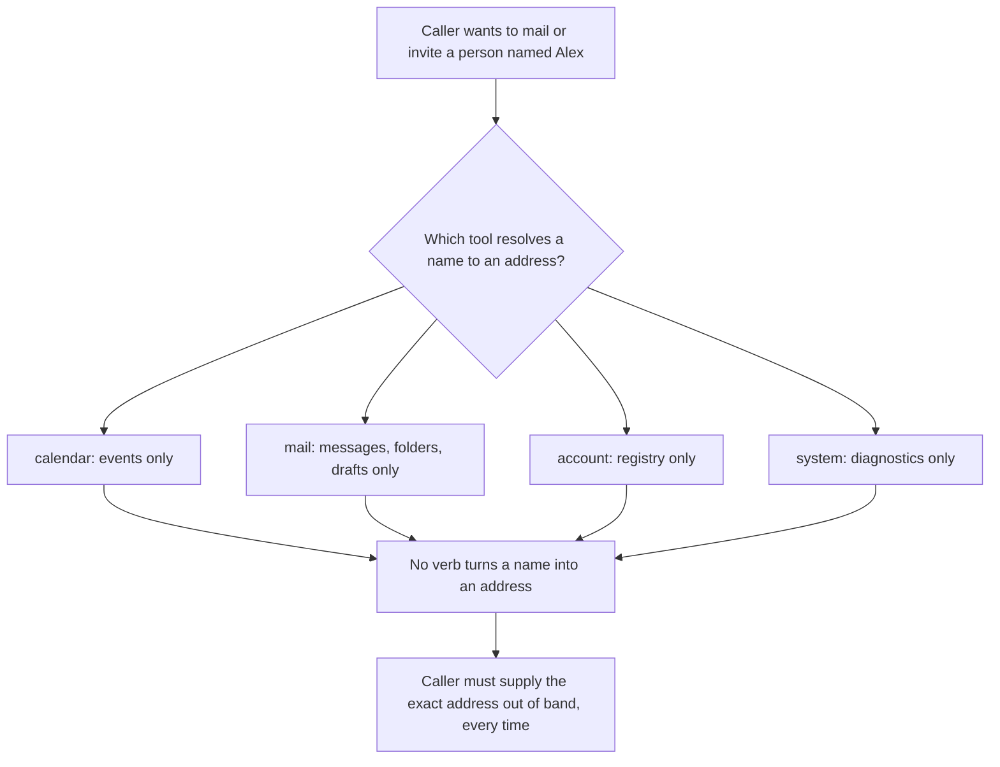
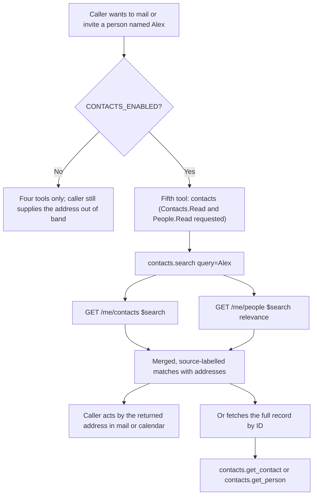
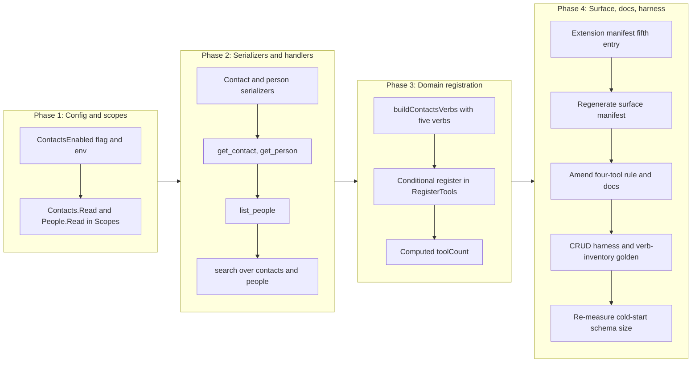

# Contacts Domain: Read and Search

## Change Summary

The server can read and manage mail and calendar, but it cannot answer the question that
precedes half of those actions: *who is "Alex", and what is their email address?* A caller
that wants to draft a message to a person, or invite them to a meeting, has no way to turn
a name into the address the mail and calendar verbs require. It must be handed the address
verbatim, every time.

This change adds a **new `contacts` aggregate domain** whose entire purpose is name-to-address
resolution. It exposes read verbs only: `search` (free-text over personal contacts and
relevance-ranked people), `get_contact`, `list_people`, `get_person`, and the mandatory
`help`. No contact write, no folder, no photo, no directory, and no sync capability is
introduced; the feature-gap matrix marks every one of those `Manage=3` (out of scope), and
this change respects that boundary without exception.

This CR follows **CR-0081** in the implementation sequence. It targets **v0.14.0**.

The central design decision is not the verbs; it is that a contacts domain is a **fifth
top-level MCP tool**. CR-0060 fixed the surface at four aggregate domain tools (`calendar`,
`mail`, `account`, `system`) and the project rule says growth belongs in a domain's verb
registry, not in a new tool. Contacts has no natural home in any of the four existing
domains, so this change deliberately raises the tool count to five and pays the governance
cost that decision carries: it justifies the fifth tool against the alternative of folding
contacts into an existing domain, keeps the **default** surface at four tools by gating the
new domain behind an opt-in flag, quantifies the cold-start schema-size impact against the
60% reduction gate, and amends every four-tool assertion, rule, and document that CR-0060
left behind.

## Motivation and Background

The product's own read paths already assume a resolved address. `mail.create_draft` takes
recipient addresses. `calendar.create_meeting` takes attendee addresses. Neither can accept
"my manager" or "Alex from finance". The feature-gap matrix names the gap directly, at
`high` severity for two of its four in-scope contacts rows:

> * **Search contacts** — "No verb to free-text search personal contacts; resolving a name
>   to an email address to compose mail is a core daily assistant action."
> * **Get contact** — "No verb to fetch a single contact's names, emails, phones, or
>   addresses when composing mail or scheduling; core to an Outlook assistant."

The matrix scopes contacts tightly: "get and search only, to resolve a name to an email
address. No contact writes, folders, photos, directory, or sync." Its four in-scope rows
are exactly the four non-help verbs of this change:

| Matrix row | Severity | Verb |
|---|---|---|
| Search contacts (`GET /me/contacts?$search`) | high | `search` (contacts half) |
| Get contact (`GET /me/contacts/{id}`) | high | `get_contact` |
| List relevance-ranked people (`GET /me/people`) | medium | `list_people` |
| Get a person (`GET /me/people/{id}`) | low | `get_person` |

The `search` verb also serves the matrix's contacts **search-first entry point** row, which
pairs `GET /me/contacts?$search` with `GET /me/people?$search` (relevance) because Microsoft
Search's `/search/query` has no `contact` entity type. Personal contacts (what the user
saved) and relevance-ranked people (whom the user actually corresponds with) are two
different answer sets for one question, so `search` queries both and labels each result by
its source.

The OAuth cost is two new delegated read scopes, `Contacts.Read` and `People.Read`, and it
is paid only by a user who opts in. The domain is gated behind a new
`OUTLOOK_MCP_CONTACTS_ENABLED` flag, mirroring how `MAIL_ENABLED` gates the mail read
surface and its `Mail.Read` scope. A user who never enables contacts sees no new scope, no
new consent prompt, and no fifth tool.

## Change Drivers

* Every mail-drafting and meeting-scheduling flow the product already offers begins with an
  address the caller must supply out of band. There is no verb to obtain it.
* The feature-gap matrix rates two contacts reads `high` and routes all four in-scope rows
  through a Change Request (`Manage=4`).
* Contacts is not a mail concept, not a calendar concept, not an account concept, and not a
  system concept. It is a fifth domain, and the four-tool surface has no verb registry it
  belongs in. This is the one case CR-0060's "add a verb, not a tool" rule did not
  anticipate: a genuinely new domain.
* Microsoft Graph exposes two distinct resources for the one question — saved contacts and
  ranked people — so resolution must span both, which the search-first entry-point row
  encodes.
* The new scopes must not reach a user who did not ask for contacts, so the domain must be
  opt-in and the four-tool default surface must be preserved.

## Current State

The server registers exactly four aggregate domain tools, unconditionally, in
`RegisterTools` (`internal/server/server.go:54`): `calendar`, `mail`, `account`, and
`system`. The count is hard-coded (`toolCount := 4`, `internal/server/server.go`) and
asserted by `TestRegisterTools_MailEnabled` (`internal/server/server_test.go:784`,
`expectedTotal = 4`). Each domain is built by a `build<Domain>Verbs` constructor and
registered with `tools.RegisterDomainTool`; `account` is the smallest and is the model this
change mirrors (`internal/server/account_verbs.go`).

There is no contacts domain, no contacts handler, and no contacts scope. `auth.Scopes`
(`internal/auth/auth.go:56`) returns only `Calendars.ReadWrite` plus, conditionally, one
mail scope; it never requests `Contacts.Read` or `People.Read`. `config.Config`
(`internal/config/config.go`) has `MailEnabled` and `MailManageEnabled` but no contacts
flag.

Measured facts about the surface as it stands, read from the repository at the source
commit rather than assumed:

* `site/src/generated/surface.json` records four domains — calendar 15, mail 13, account 7,
  system 7 verbs — for `totals.fullCount` 42 and `totals.defaultCount` 33.
* `extension/manifest.json` enumerates exactly four entries in its `tools` array:
  `calendar`, `mail`, `account`, `system`.
* `TestColdStartSchemaSize_Reduction` (`internal/server/schema_size_test.go`) serialises the
  registered tools under the **maximum** feature-flag configuration and asserts the byte
  count is at least 60% below the documented 74 000-byte pre-CR-0060 baseline
  (`minRequiredReductionPct = 60`). Its config enables `MailEnabled` and `MailManageEnabled`
  but has no contacts flag to set.
* The four-tool count is stated as a rule in `AGENTS.md` and `CLAUDE.md` (line 82, "the MCP
  surface is four aggregate domain tools"), in `docs/readme.md` (line 39), in
  `docs/concepts.md` (line 71 and line 163), and in `docs/cr/CR-0060-...md`.

The Graph SDK request builders this change needs all exist in the pinned
`msgraph-sdk-go v1.100.0` in the module cache, confirmed by reading the installed source,
not documentation, and all are v1.0 GA (their URL templates resolve under
`{+baseurl}/users/{user-id}/...` with no `/beta` segment):

| Builder file (under `msgraph-sdk-go@v1.100.0/users/`) | Method | v1.0 URL template |
|---|---|---|
| `item_contacts_request_builder.go` | `Get` (returns `ContactCollectionResponseable`); a `Search *string` query option maps to `$search` | `/users/{user-id}/contacts{?...$search...}` |
| `item_contacts_contact_item_request_builder.go` | `Get` (returns `Contactable`) | `/users/{user-id}/contacts/{contact-id}` |
| `item_people_request_builder.go` | `Get` (returns `PersonCollectionResponseable`); a `Search *string` query option maps to `$search` | `/users/{user-id}/people{?...$search...}` |
| `item_people_person_item_request_builder.go` | `Get` (returns `Personable`) | `/users/{user-id}/people/{person-id}` |

The same item-contact builder also exposes `Patch` and `Delete`, and the contacts
collection builder exposes `Post`. This change wires **none** of them; the contact write,
create, and delete rows are all `Manage=3` in the matrix.

### Current State Diagram



## Proposed Change

Add a fifth aggregate domain tool, `contacts`, built by a new `buildContactsVerbs`
constructor in `internal/server/contacts_verbs.go` and registered by `RegisterTools` **only
when `cfg.ContactsEnabled` is true**. The default configuration continues to register the
same four tools it does today. A caller that has not set `OUTLOOK_MCP_CONTACTS_ENABLED`
sees no fifth tool and is asked for no new scope.

### Verb inventory

| Verb | Graph call(s) | Required parameters | Returns |
|---|---|---|---|
| `help` | none (reads the registry) | none | Per-verb documentation for the domain |
| `search` | `GET /me/contacts?$search="..."` **and** `GET /me/people?$search="..."` | `query` | Merged, source-labelled matches (saved contacts and ranked people) with display name and addresses |
| `get_contact` | `GET /me/contacts/{id}` | `contact_id` | One personal contact: names, email addresses, phones, addresses |
| `list_people` | `GET /me/people` | none | Relevance-ranked people, most-relevant first |
| `get_person` | `GET /me/people/{id}` | `person_id` | One ranked person: display name and addresses |

`search` issues two Graph requests by design, because the one user question has two answer
sets in Graph and neither subsumes the other. It labels each result with its source so the
caller can tell a saved contact from an inferred correspondent. This is the search-first
entry point the matrix defines for the domain: resolve a name here, then act by the returned
address (in `mail`/`calendar`) or fetch the full record by ID (`get_contact`/`get_person`).

### Annotation matrix

Every verb declares all four hints explicitly, per the project rule that a verb cannot be
registered without its own classification and that the aggregate annotation is computed from
the registered verbs (CR-0052, CR-0060, CR-0068).

| Verb | `readOnlyHint` | `destructiveHint` | `idempotentHint` | `openWorldHint` |
|---|---|---|---|---|
| `help` | `true` | `false` | `true` | `false` |
| `search` | `true` | `false` | `true` | `true` |
| `get_contact` | `true` | `false` | `true` | `true` |
| `list_people` | `true` | `false` | `true` | `true` |
| `get_person` | `true` | `false` | `true` | `true` |

Justification, hint by hint, because an unjustified hint is the defect CR-0068 exists to
prevent:

* **`readOnlyHint: true` for all five.** The entire domain reads. No verb writes contact,
  people, folder, or any other state. This is the load-bearing safety property of the
  change: a read-only domain cannot mutate the mailbox, so the read-only-guard interaction
  and the conservative aggregate fold are trivially satisfied.
* **`destructiveHint: false` for all five.** Nothing is removed or made unaddressable. The
  hint is only meaningful alongside a write, and there is no write.
* **`idempotentHint: true` for all five.** A read repeated with the same arguments returns
  the same shape of answer and changes nothing. (`list_people` and `search` may return
  different ranking over time as Graph's relevance model updates; the hint concerns the
  absence of side effects, not byte-identical payloads, matching how the existing read verbs
  are classified.)
* **`openWorldHint: true` for `search`, `get_contact`, `list_people`, `get_person`.** Each
  calls Microsoft Graph. **`false` for `help`**, which reads the local registry only, exactly
  as the `help` verb of every other domain is classified.

The aggregate fold is the strongest possible: because every registered verb is read-only,
non-destructive, idempotent, and (save `help`) open-world, the `contacts` tool publishes
`readOnlyHint: true`, `destructiveHint: false`, `idempotentHint: true`, `openWorldHint: true`.
A client that gates writes behind confirmation never prompts for a contacts call.

### Output tiering

`search`, `get_contact`, `list_people`, and `get_person` are read verbs, so each **MUST**
implement all three output tiers (`text`, `summary`, `raw`) via an `output` parameter, per
the project's response-tiering rule. Each carries a dedicated summary serializer (for
example `SerializeSummaryContact`, `SerializeSummaryPerson`) that chooses a deliberate field
set — display name and the primary email address, the fields a resolution flow actually
needs — rather than filtering empties out of the raw payload. `help` renders the registry
and takes no `output` parameter, as every domain's `help` does.

### Scope delta

`auth.Scopes` gains one branch: when `cfg.ContactsEnabled` is true, it appends
`Contacts.Read` and `People.Read`. Both are delegated, read-only, v1.0 GA scopes —
`Contacts.Read` authorises `GET /me/contacts` and `GET /me/contacts/{id}`, and `People.Read`
authorises `GET /me/people` and `GET /me/people/{id}`. Neither is a write scope, and no
existing scope changes. The full delta:

| Configuration | Scopes before | Scopes after |
|---|---|---|
| `CONTACTS_ENABLED` unset (default) | unchanged | **unchanged** |
| `CONTACTS_ENABLED=true` | (as before) | (as before) **+ `Contacts.Read` + `People.Read`** |

### Proposed State Diagram



## Requirements

### Functional Requirements

1. The system **MUST** introduce a new aggregate domain tool named `contacts` and **MUST**
   register it as a top-level MCP tool **only** when `cfg.ContactsEnabled` is true. When the
   flag is unset, the registered tool count **MUST** remain four.
2. When `cfg.ContactsEnabled` is true, the registered tool count **MUST** be five, and the
   fifth tool's registered name **MUST** be `contacts`.
3. The `contacts` domain **MUST** register exactly five verbs — `help`, `search`,
   `get_contact`, `list_people`, `get_person` — and **MUST NOT** register any verb that
   writes, creates, updates, deletes, or moves a contact, person, or folder, nor any verb
   for photos, directory or organizational contacts, or delta/sync.
4. `search` **MUST** require a `query` string, **MUST** issue `GET /me/contacts` with the
   value supplied as the `$search` query option, **MUST** also issue `GET /me/people` with
   the value supplied as its `$search` query option, and **MUST** return the union of the two
   result sets with each result labelled by its source (personal contact or ranked person).
5. `get_contact` **MUST** require a `contact_id`, **MUST** issue `GET /me/contacts/{id}`, and
   **MUST** return the contact's display name and every email address on the record.
6. `list_people` **MUST** issue `GET /me/people` and **MUST** return the people in the
   relevance order Graph returns them, most relevant first, without re-sorting.
7. `get_person` **MUST** require a `person_id`, **MUST** issue `GET /me/people/{id}`, and
   **MUST** return the person's display name and addresses.
8. Every verb that accepts an identifier (`get_contact`, `get_person`) **MUST** validate it
   with `validate.ValidateResourceID` and **MUST** reject an invalid identifier before any
   Graph request is issued.
9. `search` **MUST** validate `query` for non-emptiness and length before issuing either
   Graph request, and **MUST** reject an empty or whitespace-only query with an error that
   names the `query` parameter.
10. Every read verb (`search`, `get_contact`, `list_people`, `get_person`) **MUST** implement
    all three output tiers via an `output` parameter accepting `text`, `summary`, and `raw`,
    with `text` the default. `help` **MUST NOT** declare an `output` parameter.
11. Every read verb's `summary` tier **MUST** be produced by a dedicated serialization
    function that selects its field set deliberately, and **MUST NOT** be derived by
    filtering empty values out of the raw payload.
12. Every verb **MUST** declare all four annotation hints explicitly, with the values given
    in the annotation matrix above; in particular every verb **MUST** declare
    `readOnlyHint: true` and `destructiveHint: false`.
13. Every verb **MUST** be wrapped by the read middleware chain (authentication, account
    resolution, observability, audit) under the identity `contacts.<verb>`, so the audit
    record and the OpenTelemetry attributes carry the same `{domain}.{operation}` identity as
    every other verb, and every verb's audit operation **MUST** be `read`.
14. `auth.Scopes` **MUST** append `Contacts.Read` and `People.Read` when
    `cfg.ContactsEnabled` is true, and **MUST NOT** alter the scope set in any configuration
    where `cfg.ContactsEnabled` is false.
15. `auth.Scopes` **MUST NOT** request any contact write scope (`Contacts.ReadWrite`) in any
    configuration; the contacts surface is read-only.
16. `config.Config` **MUST** gain a `ContactsEnabled` boolean, and `LoadConfig` **MUST** read
    it from `OUTLOOK_MCP_CONTACTS_ENABLED`, defaulting to false, following the exact pattern
    of `MailEnabled`.
17. Every verb **MUST** carry a non-empty `Summary` of at most eighty characters, a non-empty
    `Description` stating its parameters and its annotation semantics, at least one `Examples`
    entry, and at least one `SeeDocs` reference that resolves to an existing heading in the
    embedded documentation bundle.
18. The `contacts` domain **MUST** expose an `operation="help"` verb documenting every
    registered verb, per the domain rule.
19. `extension/manifest.json`'s `tools` array **MUST** gain a fifth entry, `contacts`,
    enumerating the five verbs, and the array **MUST** hold exactly five entries after this
    change.
20. `site/src/generated/surface.json` **MUST** be regenerated with `make surface-manifest`
    and committed in the same change. The regenerated manifest **MUST** record the `contacts`
    domain with five full verbs and zero default verbs (the whole domain is gated), so
    `totals.fullCount` **MUST** rise by exactly five (the five new gated verbs) from the
    then-current full count, and `totals.defaultCount` **MUST** be unchanged. The absolute
    figures are deliberately not pinned to a literal here: CR-0080 and CR-0081 also add
    calendar verbs ahead of this change and move the full count before it lands, so the
    +5 delta is the invariant this CR asserts. The regenerating surface-drift gate that
    fails `make ci` on any mismatch, not a number written in this document, is the real
    check that the committed manifest matches the live registry.
21. The hard-coded `toolCount` in `internal/server/server.go` **MUST** be computed as four
    plus one when `cfg.ContactsEnabled` is true, and the completion log line **MUST** report
    the actual number registered.
22. The four-tool rule text in `AGENTS.md`, `CLAUDE.md`, `docs/readme.md`, and
    `docs/concepts.md` **MUST** be amended to state that the surface is four aggregate domain
    tools by default plus an opt-in fifth (`contacts`) enabled by
    `OUTLOOK_MCP_CONTACTS_ENABLED`, and the "Tool Naming Convention" list of aggregate tools
    **MUST** add `contacts` as an opt-in domain.
23. `docs/concepts.md` **MUST** gain a contacts gating row (mirroring the mail gating table)
    and a contacts row in the OAuth-scopes-per-feature table naming `Contacts.Read` and
    `People.Read`.
24. `docs/prompts/mcp-tool-crud-test.md` and `scripts/crud-test.sh` **MUST** be lifecycled
    for the new top-level domain: the prompt gains steps exercising the five verbs, the
    script's per-domain tool-call accounting gains an `mcp_contacts` counter per its own
    comments, `docs/bench/crud-runs.csv`'s header **MUST** stay consistent with the script's
    output schema, and the new steps **MUST** be skipped when `CONTACTS_ENABLED` is off.
25. The change **MUST NOT** alter the default four-tool surface: with `cfg.ContactsEnabled`
    false, the set of registered tools and their published schemas **MUST** be byte-identical
    to the surface before this change.

### Non-Functional Requirements

1. Each verb's handler **MUST** live in its own file under `internal/tools/`, named for the
   verb (`contacts_search.go`, `contacts_get_contact.go`, `contacts_list_people.go`,
   `contacts_get_person.go`), mirroring the one-file-per-verb layout of the existing domains.
2. The cold-start schema reduction asserted by `TestColdStartSchemaSize_Reduction` **MUST**
   stay at or above 60% against the documented 74 000-byte baseline **with the contacts
   domain enabled**. The test's configuration **MUST** be extended to set
   `ContactsEnabled: true`, so it measures the true five-tool maximum rather than a
   four-tool subset.
3. Because the schema-size figure is a measured gate, the implementer **MUST** validate the
   instrument before trusting the result — run the measurement twice on unchanged input and
   confirm it agrees with itself — and **MUST** record the measured five-tool byte count and
   reduction percentage in the validation report rather than asserting an estimate. A
   contacts domain of five read verbs shaped like the account domain's read verbs is expected
   to add on the order of a few thousand bytes to a maximum schema well under 20 000 bytes,
   leaving an estimated reduction in the low-to-mid seventies of a percent; the requirement
   is the measured value, not this estimate.
4. Every error raised by the domain **MUST** carry a fix instruction naming what to supply or
   correct, and **MUST** reach both the tool result and the log record, so a headless caller
   still receives the correction.
5. The change **MUST NOT** add a third-party dependency; the four request builders already
   exist in the pinned SDK.
6. `get_contact`, `list_people`, and `get_person` **MUST** each issue exactly one Graph
   request on the success path. `search` **MUST** issue exactly two, one against `/me/contacts`
   and one against `/me/people`, and **MUST NOT** perform any additional per-result fetch.
7. Every handler **MUST** route its Graph call through `graph.RetryGraphCall` and
   `graph.WithTimeout`, and **MUST** redact Graph errors with the existing helpers, so retry,
   timeout, and redaction behaviour is identical to the verbs already registered.
8. The `contacts` tool's composed description **MUST** stay below the 4 000-character bound
   asserted by `TestDescriptionLengthBounded`; a five-verb read domain is far below it, but
   the bound is asserted, not assumed.

## Affected Components

* `internal/server/contacts_verbs.go` (new): `buildContactsVerbs`, the domain verb slice
  constructor, mirroring `internal/server/account_verbs.go`. Carries the five `Verb`
  descriptors with `Summary`, `Description`, `Examples`, `SeeDocs`, `Annotations`, and
  `Schema`, each `Handler` wrapped under the identity `contacts.<verb>` with audit op `read`.
* `internal/server/contacts_verbs_config.go` (new, or a struct in `contacts_verbs.go`): the
  `contactsVerbsConfig` dependency struct (retry config, timeout, metrics, tracer, authMW,
  accountResolverMW), following `accountVerbsConfig`.
* `internal/tools/contacts_search.go` (new): the `search` handler, issuing the two `$search`
  Graph calls and merging the results with source labels.
* `internal/tools/contacts_get_contact.go` (new): the `get_contact` handler.
* `internal/tools/contacts_list_people.go` (new): the `list_people` handler.
* `internal/tools/contacts_get_person.go` (new): the `get_person` handler.
* `internal/tools/contacts_serialize.go` (new) or `internal/graph/contacts_serialize.go`: the
  raw and summary serializers for a contact and a person, including `SerializeSummaryContact`
  and `SerializeSummaryPerson` (NFR-11).
* `internal/tools/text_format.go`: contacts text formatters following the established
  patterns (numbered lists for collections, labelled fields for a single record, a total
  count at the end).
* `internal/server/server.go`: the conditional `buildContactsVerbs` +
  `tools.RegisterDomainTool` block gated on `cfg.ContactsEnabled`, the computed `toolCount`
  (FR-21), and the domain `Intro` naming the five verbs and the gate.
* `internal/config/config.go`: the `ContactsEnabled` field, its `EnvContactsEnabled`
  constant, and the `LoadConfig` read (FR-16).
* `internal/auth/auth.go`: the `contactsReadScope` and `peopleReadScope` constants and the
  `cfg.ContactsEnabled` branch in `Scopes` (FR-14, FR-15).
* `extension/manifest.json`: a fifth `tools` entry, `contacts` (FR-19). Its
  `long_description` scope enumeration should also name the two new scopes when contacts is
  described.
* `site/src/generated/surface.json`: regenerated, not hand-edited (FR-20).
* `AGENTS.md`, `CLAUDE.md`, `docs/readme.md`, `docs/concepts.md`: the four-tool rule
  amendments and the contacts gating and scope rows (FR-22, FR-23).
* `docs/prompts/mcp-tool-crud-test.md`, `scripts/crud-test.sh`, `docs/bench/crud-runs.csv`:
  the harness lifecycle for a new top-level domain (FR-24).
* `internal/tools/dispatch_registry_test.go`: the `verbInventoryGolden` list gains five
  contacts identities.
* `internal/server/schema_size_test.go`: `ContactsEnabled: true` added to the max-config, and
  the "four aggregate tools" comment updated to five (NFR-2).
* `internal/server/server_test.go`: a new test asserting five tools under `ContactsEnabled`,
  and `TestRegisterTools_MailEnabled` re-confirmed to still assert four under the default
  (contacts-off) config.
* `internal/server/manifest_sync_test.go` (new here unless a prior change has already added
  it): the manifest-sync assertion gating FR-19, that the `extension/manifest.json` `tools`
  array holds exactly five entries and carries a `contacts` entry enumerating the five verbs.
  CR-0078 proposes a file of this name, but at the source commit that is an **unmerged CR
  draft**, so this change **MUST NOT** assume the file exists: it creates the file if absent,
  and if a prior change has landed it, extends it so the expected count under the
  contacts-enabled configuration is five rather than four.

## Scope Boundaries

### In Scope

* The `contacts` aggregate domain and its five verbs: `help`, `search`, `get_contact`,
  `list_people`, `get_person`.
* Their handlers, serializers, registry entries, annotations, schemas, output tiers, and
  unit tests.
* The `ContactsEnabled` config flag and its env binding.
* The two new read scopes and their conditional request.
* Raising the tool count to five when opted in, and preserving four by default.
* Every four-tool rule, assertion, manifest, and document amendment the fifth tool requires.
* The surface-manifest regeneration and the CRUD-harness lifecycle for the new domain.

### Out of Scope ("Here, But Not Further")

Every one of these is `Manage=3` (out of scope) in the feature-gap matrix, and this change
introduces none of them:

* **Contact writes.** Create, update, and delete contact (`POST /me/contacts`,
  `PATCH`/`DELETE /me/contacts/{id}`) are out of scope. The SDK exposes `Post`, `Patch`, and
  `Delete` on these builders; this change wires only `Get`.
* **Contact folders.** Listing, creating, renaming, deleting, or traversing contact folders,
  and folder-scoped contact reads.
* **Contact photos.** Reading or writing contact or person photo metadata or bytes.
* **Directory and organizational contacts.** The tenant `/contacts` collection, org-contact
  get/patch/delete, directory bulk utilities, and org-chart relationships
  (manager, directReports, memberOf).
* **Delta and sync.** `GET /me/contacts/delta` and any incremental-sync token flow.
* **The non-gaps.** Contact attachments and contact move/copy, which Graph does not support
  and which no product could expose.
* **Listing all personal contacts unfiltered.** `GET /me/contacts` without a `$search` is a
  `Manage=3` row ("List personal contacts"); resolution is search-first, so the collection
  read is reached only through `search`, never as a bare enumeration verb.
* **Sending, replying, forwarding.** No verb here communicates; `Mail.Send` stays
  unrequested. Contacts resolves an address; acting on it remains the draft-only mail surface
  established by earlier CRs.
* **Changing the mail, calendar, account, or system surfaces, the output-tier model, or the
  aggregate-annotation fold.**

## Alternative Approaches Considered

The fifth-tool decision is the crux of this CR, so its alternatives are weighed first and at
length.

* **Fold contacts into an existing domain — the "no fifth tool" option.** This is what the
  CR-0060 rule prefers by default: add verbs to a domain's registry, not a new tool. The
  candidate hosts are `mail` (you resolve an address to send mail) and `account` (both touch
  identity). **Rejected.** Contacts is a distinct Graph resource family (`/me/contacts`,
  `/me/people`) with its own scopes (`Contacts.Read`, `People.Read`), unrelated to mail
  messages or to the local account registry. Folding it into `mail` would mean the mail
  tool's `$search`, its gating flag, and its scope set describe two unrelated resources, and
  `mail`'s annotation fold and description would carry contacts semantics that a caller
  reading "mail" would not expect. Folding it into `account` is worse: `account` verbs manage
  the local registry and deliberately bypass account resolution and Graph entirely, while
  contacts verbs are Graph reads that require a resolved account. The one-concept-one-place
  principle that motivates the four-tool rule is the same principle that says a fifth genuine
  domain deserves its own tool. The rule optimizes against *gratuitous* tools that split one
  domain; it was never meant to force a second domain into one tool.
* **A fifth tool, registered unconditionally, with all verbs gated inside (the mail
  pattern).** Consistent with how `mail` is always registered even when its verbs are gated
  off. **Rejected** in favour of conditional registration of the whole tool, because unlike
  mail — whose always-on read verbs justify an always-registered tool — the contacts domain
  has *no* ungated verb: every verb needs a scope the default config does not request. An
  always-registered contacts tool whose every verb errors "scope not granted" is worse UX
  than an absent tool, and it would grow the default cold-start schema for users who never
  opted in. Conditional registration keeps the default surface at four tools exactly.
* **One combined `resolve` verb instead of `search` + `get_*`.** Fewer verbs. **Rejected:**
  it conflates the search-first entry point (many candidate matches) with the by-ID fetch
  (one full record), which the matrix separates into distinct rows, and it hides the
  contact-versus-person distinction that a caller needs to judge a match's trustworthiness.
* **Query only `/me/contacts` (drop `/me/people`).** Simpler `search`. **Rejected:** the
  most useful answers to "email my manager" come from relevance-ranked people the user has
  never saved as a contact. The matrix's search-first entry-point row pairs both resources
  precisely because neither alone answers the question.
* **Request `Contacts.ReadWrite` to leave room for a future write.** **Rejected:** it asks
  for consent this change does not use and the matrix forbids. The scope set must match the
  read-only surface exactly.

## Impact Assessment

### User Impact

A user who sets `OUTLOOK_MCP_CONTACTS_ENABLED=true` consents once to `Contacts.Read` and
`People.Read` and gains name-to-address resolution: the assistant can turn "email Alex" into
a drafted message to the right address, or find a manager to invite. A user who does not
enable it sees no change at all — same four tools, same scopes, same consent surface.

The one thing a user must understand is that `search` returns two kinds of match: contacts
they saved, and people Graph inferred from their correspondence. The verb labels each, so it
is disclosed rather than discovered.

### Technical Impact

No breaking change, no schema migration, no new dependency, no new write scope. The default
configuration's published tool surface is byte-identical (FR-25). Under `ContactsEnabled` the
surface grows by one tool of five read verbs and two read scopes.

The fifth tool is the first increase in top-level tool count since CR-0060 established the
four-tool surface, so it touches the four-tool assertions, rules, and documents deliberately
and in one change. The measured cold-start gate is re-established with the contacts domain
included and must be re-measured, not assumed, to remain at or above 60%.

### Business Impact

Low cost for a high-value, frequently-blocked flow. Five read handlers of a shape the codebase
already has, one config flag, one scope branch, and a bounded set of documentation and harness
edits. The risk concentrates in the governance surface (the fifth tool) rather than in the
Graph calls, and this document pins that surface.

## Implementation Approach

### Implementation Flow



### Phase 1: Config and scopes

1. Add `ContactsEnabled bool` to `config.Config` and an `EnvContactsEnabled` constant
   `"OUTLOOK_MCP_CONTACTS_ENABLED"`, read in `LoadConfig` with a `false` default, following
   `MailEnabled` exactly.
2. Add `contactsReadScope = "Contacts.Read"` and `peopleReadScope = "People.Read"` to
   `internal/auth/auth.go`, and append both in `Scopes` when `cfg.ContactsEnabled` is true.
   Document that neither is a write scope and that they are requested only on opt-in.

**Affected components:** `internal/config/config.go`, `internal/auth/auth.go`, and their tests.

### Phase 2: Serializers and handlers

1. Add contact and person serializers (raw and summary). `SerializeSummaryContact` selects
   display name and the primary email address; `SerializeSummaryPerson` the same for a
   person (NFR-11).
2. `internal/tools/contacts_get_contact.go`: resolve the Graph client, validate `contact_id`,
   `GET /me/contacts/{id}` through the retry/timeout helpers, and render the requested tier.
3. `internal/tools/contacts_get_person.go`: the same shape against `/me/people/{id}`.
4. `internal/tools/contacts_list_people.go`: `GET /me/people`, preserve relevance order,
   render the requested tier as a numbered list with a total count.
5. `internal/tools/contacts_search.go`: validate `query`, issue `GET /me/contacts` with the
   `Search` query option set and `GET /me/people` with its `Search` option set, merge the two
   result sets with a source label per result, and render the requested tier. Exactly two
   Graph requests, no per-result fetch (NFR-6).
6. Every handler goes through `graph.RetryGraphCall` inside `graph.WithTimeout`, with
   `graph.IsTimeoutError`, `graph.TimeoutErrorMessage`, and `graph.RedactGraphError` handled
   as the existing read verbs handle them (NFR-7).

**Affected components:** the four handler files, the serializer file, and `text_format.go`,
plus their tests.

### Phase 3: Domain registration

1. Add `buildContactsVerbs` in `internal/server/contacts_verbs.go`, mirroring
   `buildAccountVerbs`: an empty `VerbRegistry`, a `wrap` closure applying authMW,
   observability, and audit under `contacts.<verb>` with op `read`, and the five `Verb`
   descriptors with full metadata, annotations, and schema.
2. In `RegisterTools`, add a block that builds and registers the contacts domain **only when
   `cfg.ContactsEnabled` is true**, with an `Intro` naming the five verbs and the gate.
3. Compute `toolCount` as `4 + 1` when contacts is enabled, and log the actual count (FR-21).

**Affected components:** `internal/server/contacts_verbs.go` (new), `internal/server/server.go`.

### Phase 4: Surface, documentation, and harness

1. Add the fifth `tools` entry to `extension/manifest.json`, enumerating the five verbs.
2. Run `make surface-manifest` and commit `site/src/generated/surface.json`; confirm the
   contacts domain records five full and zero default, so the total full count rises by
   exactly five from the then-current count with the default count unchanged (FR-20). The
   absolute total is not pinned here, since CR-0080 and CR-0081 move it ahead of this change;
   `make ci` fails on a stale manifest, so the regenerated figure is the check, not a literal.
3. Amend the four-tool rule text in `AGENTS.md`, `CLAUDE.md`, `docs/readme.md`, and
   `docs/concepts.md`, and add the contacts gating and scope rows (FR-22, FR-23).
4. Add lifecycle steps to `docs/prompts/mcp-tool-crud-test.md`, add the `mcp_contacts`
   accounting to `scripts/crud-test.sh` per its own comments, keep `docs/bench/crud-runs.csv`
   consistent with the script's schema, and gate the new steps behind `CONTACTS_ENABLED`.
5. Regenerate `verbInventoryGolden` and add the five contacts identities.
6. Extend `schema_size_test.go` to set `ContactsEnabled: true`, re-measure with the
   instrument validated (twice on unchanged input), and record the five-tool byte count and
   reduction (NFR-2, NFR-3).

**Affected components:** `extension/manifest.json`, `site/src/generated/surface.json`,
`AGENTS.md`, `CLAUDE.md`, `docs/readme.md`, `docs/concepts.md`,
`docs/prompts/mcp-tool-crud-test.md`, `scripts/crud-test.sh`, `docs/bench/crud-runs.csv`,
`internal/tools/dispatch_registry_test.go`, `internal/server/schema_size_test.go`,
`internal/server/server_test.go`.

## Test Strategy

Handler tests follow the established read-verb pattern: an `httptest` server returning canned
Graph JSON behind a real SDK client built by `newTestGraphClient`, the client injected with
`auth.WithGraphClient`, the handler constructor called directly, and assertions made as
substring checks on the returned text and on `result.IsError`. No test issues a network call.

### Tests to Add

| Test File | Test Name | Description | Inputs | Expected Output |
|-----------|-----------|-------------|--------|-----------------|
| `internal/tools/contacts_search_test.go` | `TestContactsSearch_QueriesBothResources` | Search hits contacts and people | `query` of `Alex` | Two requests observed, one to `/me/contacts`, one to `/me/people`, each carrying `$search` |
| `internal/tools/contacts_search_test.go` | `TestContactsSearch_LabelsSource` | Each match is labelled by source | Canned contact and person responses | Output distinguishes saved contacts from ranked people |
| `internal/tools/contacts_search_test.go` | `TestContactsSearch_RejectsEmptyQuery` | Empty query is refused before any call | `query` of `"  "` | Error naming `query`; no request issued |
| `internal/tools/contacts_search_test.go` | `TestContactsSearch_TierSummarySelectsFields` | Summary tier is a deliberate field set | `output=summary` | Display name and primary address only, from the serializer not an empty-filter |
| `internal/tools/contacts_get_contact_test.go` | `TestGetContact_Success` | A contact is fetched by ID | `contact_id` | Display name and all email addresses returned; one GET observed |
| `internal/tools/contacts_get_contact_test.go` | `TestGetContact_InvalidIDRejectedBeforeCall` | ID validation precedes Graph | Malformed `contact_id` | Error returned, no request issued |
| `internal/tools/contacts_get_contact_test.go` | `TestGetContact_AllThreeTiers` | Text, summary, raw all render | `output` of each value | Each tier produces its expected shape |
| `internal/tools/contacts_list_people_test.go` | `TestListPeople_PreservesRelevanceOrder` | People are not re-sorted | Canned people in relevance order | Output order matches the response order |
| `internal/tools/contacts_list_people_test.go` | `TestListPeople_AllThreeTiers` | Text, summary, raw all render | `output` of each value | Each tier produces its expected shape, the summary tier coming from the dedicated serializer rather than an empty-filter |
| `internal/tools/contacts_get_person_test.go` | `TestGetPerson_Success` | A person is fetched by ID | `person_id` | Display name and addresses returned; one GET observed |
| `internal/tools/contacts_get_person_test.go` | `TestGetPerson_InvalidIDRejectedBeforeCall` | ID validation precedes Graph | Malformed `person_id` | Error returned, no request issued |
| `internal/tools/contacts_get_person_test.go` | `TestGetPerson_AllThreeTiers` | Text, summary, raw all render | `output` of each value | Each tier produces its expected shape, the summary tier coming from the dedicated serializer rather than an empty-filter |
| `internal/tools/tool_annotations_test.go` | `TestContactsVerbAnnotations` | Every verb's four hints match the matrix | The contacts registry | All verbs read-only, non-destructive, idempotent; open-world true except `help` |
| `internal/tools/tool_annotations_test.go` | `TestContactsAggregateIsReadOnly` | The folded tool annotation is read-only | The registered contacts tool | `readOnlyHint` true, `destructiveHint` false at tool granularity |
| `internal/server/contacts_verbs_test.go` | `TestContactsVerbsRegisterFive` | The domain registers exactly five verbs | `buildContactsVerbs` | `help`, `search`, `get_contact`, `list_people`, `get_person`, and nothing else |
| `internal/server/contacts_verbs_test.go` | `TestContactsExposesNoWriteVerb` | No write, folder, photo, or directory verb is present | The contacts registry | No verb whose `readOnlyHint` is false |
| `internal/server/contacts_verbs_test.go` | `TestContactsVerbsWrappedUnderDomainIdentity` | Every verb is wrapped under `contacts.<verb>` with audit operation `read` | The built contacts registry | Each verb's audit and telemetry identity is `contacts.<verb>` and its audit operation is `read`, carrying the same `{domain}.{operation}` identity every other verb carries (FR-13) |
| `internal/server/server_test.go` | `TestRegisterTools_ContactsEnabled_RegistersFifthTool` | The fifth tool appears only when enabled | `ContactsEnabled` true | `contacts` present; tool count 5 |
| `internal/server/server_test.go` | `TestRegisterTools_ContactsDisabled_StaysFourTools` | Default surface is four tools | `ContactsEnabled` false | `contacts` absent; tool count 4 |
| `internal/auth/auth_test.go` | `TestScopes_Contacts` | Contacts scopes are requested on opt-in | `ContactsEnabled` true | `Contacts.Read` and `People.Read` present |
| `internal/auth/auth_test.go` | `TestScopes_NoContactsByDefault` | No contacts scope by default | `ContactsEnabled` false | Neither contacts scope present |
| `internal/auth/auth_test.go` | `TestScopes_NoContactsWriteEver` | The read-only property holds | Every configuration | `Contacts.ReadWrite` never present |
| `internal/config/config_test.go` | `TestLoadConfig_ContactsEnabled` | The env flag binds | `OUTLOOK_MCP_CONTACTS_ENABLED=true` | `cfg.ContactsEnabled` true; default false |
| `internal/server/surface_export_test.go` | `TestContactsDomainInSurfaceManifest` | The manifest records the gated domain | The built manifest under max config | Contacts recorded five full, zero default |
| `internal/server/manifest_sync_test.go` | `TestManifestHoldsFiveToolsWithContacts` | The extension manifest gains the fifth entry and holds exactly five | `extension/manifest.json` and the registry under the contacts-enabled configuration | A `contacts` entry is present enumerating the five verbs, and the `tools` array holds exactly five entries (FR-19) |

### Tests to Modify

| Test File | Test Name | Current Behavior | New Behavior | Reason for Change |
|-----------|-----------|------------------|--------------|-------------------|
| `internal/server/schema_size_test.go` | `TestColdStartSchemaSize_Reduction` | Max config enables mail flags only, over four tools | Max config also sets `ContactsEnabled: true`, over five tools; comment updated to five | The gate must measure the true maximum, which now includes the fifth tool (NFR-2) |
| `internal/tools/dispatch_registry_test.go` | `TestVerbInventoryUnchangedAfterUpgrade` | Golden holds the then-current identities across four domains | Golden gains exactly the five contacts identities with their hints, five more than before | The verb surface changes intentionally; the golden is the record of that intent, and its absolute size moves with CR-0080 and CR-0081 landing ahead of this change, so the +5 delta is the invariant, not a fixed total |
| `internal/server/server_test.go` | `TestRegisterTools_MailEnabled` | Asserts exactly four tools with mail enabled | Unchanged assertion, re-confirmed: with contacts off the count is still four | The default-surface guarantee of FR-25 needs the four-tool count re-affirmed under contacts-off |

### Tests to Remove

Not applicable. No functionality is removed or superseded, so no existing test becomes
obsolete.

### Existing Tests That Gate This Change Without Modification

| Test File | Test Name | Criterion it grades |
|-----------|-----------|---------------------|
| `internal/tools/verb_metadata_test.go` | `TestEveryVerbHasDescription`, `TestEveryVerbHasSummary`, `TestEveryVerbHasClassification`, `TestSeeDocsAnchorsResolve` | AC-8: registry metadata completeness and anchor resolution for each new verb |
| `internal/tools/description_quality_test.go` | `TestDescriptionLengthBounded`, `TestEveryVerbStatesRequiredParameters`, `TestEveryParameterHasDescription` | AC-8: description bounds and parameter documentation for each new verb |
| `internal/surface/manifest_test.go` | `TestCommittedManifestMatchesRecord` | AC-6: the committed surface manifest matches the registry |
| `internal/surface/surface_test.go` | `TestDefaultCountExcludesGatedVerbs`, `TestEveryVerbCarriesSummaryAndGate` | AC-6: derived counts and gate attribution for the gated contacts verbs |

## Acceptance Criteria

### AC-1: The fifth tool appears only when opted in

```gherkin
Given a server configured with contacts disabled
When the registered tools are listed
Then exactly four top-level tools are registered
  And no contacts tool is present
Given instead a server configured with contacts enabled
When the registered tools are listed
Then exactly five top-level tools are registered
  And the fifth tool is named contacts
```

### AC-2: The contacts domain is read-only and has exactly five verbs

```gherkin
Given a server with contacts enabled
When the contacts tool's operation enum is read
Then it contains exactly help, search, get_contact, list_people, and get_person
  And every one of those verbs declares readOnlyHint true and destructiveHint false
  And no verb writes, creates, updates, deletes, or moves a contact, person, or folder
```

### AC-3: Search resolves a name across both resources

```gherkin
Given contacts enabled and a query naming a person
When search is called
Then one request is issued to the personal contacts collection carrying the query as a search option
  And one request is issued to the people collection carrying the query as a search option
  And the results are returned as a union, each labelled by whether it is a saved contact or a ranked person
```

### AC-4: Search refuses an empty query before any call

```gherkin
Given contacts enabled
When search is called with an empty or whitespace-only query
Then the call is rejected before any request is sent
  And the error names the query parameter
```

### AC-5: A record is fetched by identifier, and an invalid one never reaches Graph

```gherkin
Given contacts enabled and a valid contact identifier
When get_contact is called
Then a single request fetches that contact
  And the confirmation returns the display name and every email address on the record
Given instead a malformed identifier
When get_contact or get_person is called with it
Then the call is rejected by identifier validation
  And no request is sent to Microsoft Graph
```

### AC-6: The surface manifest records the gated domain and the new totals

```gherkin
Given the implemented change
When make ci is run
Then the surface drift check passes without modifying the working tree
  And the manifest records the contacts domain at five full verbs and zero default verbs
  And the total full count is exactly five higher than it was before this change, with the default count unchanged
```

### AC-7: The consent surface changes only on opt-in, and never to a write scope

```gherkin
Given contacts disabled
When the requested OAuth scope set is computed
Then it is identical to the set requested before this change
Given instead contacts enabled
When the requested OAuth scope set is computed
Then it additionally contains Contacts.Read and People.Read
  And it contains no contact write scope in any configuration
```

### AC-8: Registry metadata is complete for every new verb

```gherkin
Given each of the five contacts verbs
When its registry entry is inspected
Then it carries a non-empty summary of at most eighty characters
  And a non-empty description stating its parameters and its annotation semantics
  And, for every verb except help, at least one example and at least one documentation reference resolving to an existing heading in the embedded bundle
```

### AC-9: The read verbs implement all three output tiers

```gherkin
Given contacts enabled
When search, get_contact, list_people, or get_person is called with output set to text, summary, or raw
Then each tier renders its expected shape
  And the summary tier is produced by a dedicated serializer rather than by filtering empty values from the raw payload
  And help declares no output parameter
```

### AC-10: The cold-start schema gate is re-established over five tools

```gherkin
Given the implemented change
When the cold-start schema is measured under the maximum configuration including contacts enabled
Then the reduction against the documented baseline is at least sixty percent
  And the measured five-tool byte count and reduction are recorded, having been validated by measuring twice on unchanged input
```

### AC-11: The four-tool rule and documents are amended coherently

```gherkin
Given the project rules and user-facing documentation after this change
When the four-tool statements are read
Then each states the surface is four aggregate domain tools by default plus an opt-in fifth contacts domain enabled by OUTLOOK_MCP_CONTACTS_ENABLED
  And the extension manifest tools array holds exactly five entries
  And the concepts document names Contacts.Read and People.Read in its scopes-per-feature table
```

### AC-12: The CRUD harness lifecycles the new domain

```gherkin
Given the lifecycle prompt and harness after this change
When they are read
Then the prompt contains steps exercising each of the five contacts verbs
  And the harness script accounts for a contacts domain in its per-domain tool-call tally
  And the new steps are skipped when contacts is disabled
```

### AC-13: Each verb issues the intended number of Graph requests

```gherkin
Given contacts enabled
When get_contact, list_people, or get_person is called
Then exactly one Graph request is issued on the success path
When search is called
Then exactly two Graph requests are issued, one to contacts and one to people, with no per-result fetch
```

### AC-14: Failures carry a correction on both channels

```gherkin
Given a contacts read whose target does not resolve
When the verb is called
Then the tool result names the correction
  And the log record carries the same correction
```

### AC-15: The implementation follows the project's file and helper conventions

```gherkin
Given the implemented change
When a Graph call from any contacts verb times out or returns an error
Then the timeout message names the configured timeout in seconds
  And the error text is redacted by the shared helper and carries a fix instruction
Given the same change
When the source tree is reviewed
Then each verb's handler lives in its own file under the tools package, named for the verb
  And no third-party dependency has been added
```

## Quality Standards Compliance

### Build & Compilation

- [ ] Code compiles/builds without errors
- [ ] No new compiler warnings introduced

### Linting & Code Style

- [ ] All linter checks pass with zero warnings/errors
- [ ] Code follows project coding conventions and style guides
- [ ] Any linter exceptions are documented with justification

### Test Execution

- [ ] All existing tests pass after implementation
- [ ] All new tests pass, including under the race detector
- [ ] The cold-start schema-size gate is re-measured over five tools and stays at or above 60%
- [ ] Test coverage meets project requirements for changed code

### Documentation

- [ ] Every new file carries a package-consistent doc comment and a single index annotation
- [ ] Every new verb's parameters and annotation semantics are documented in the registry, not in markdown
- [ ] The four-tool rule and the scopes-per-feature table are amended in every place they appear
- [ ] No governance identifier appears in source, test names, or user-facing documentation

## Risks and Mitigation

### Risk 1: The fifth aggregate tool expands the governance surface the four-tool invariant fixed

**Likelihood:** high (it is the certain, intended effect of the change)
**Impact:** medium
**Mitigation:** CR-0060 fixed the surface at four aggregate domain tools and made "add a
verb, not a tool" the standing rule, so raising the count to five is the one decision in
this change with a blast radius beyond its own package. The radius is bounded by enumerating
every place the four-tool count is asserted and amending all of them in one change rather
than leaving a contradiction for a later reader to disprove: the rule text in `AGENTS.md`,
`CLAUDE.md`, `docs/readme.md`, and `docs/concepts.md` (FR-22); the `extension/manifest.json`
`tools` array (FR-19); the hard-coded `toolCount` and its completion log line
(FR-21); and the `TestRegisterTools_MailEnabled` four-tool assertion, which is re-confirmed
rather than deleted so the default surface still proves four (FR-25). Conditional
registration is what keeps the blast radius from reaching every user: the fifth tool exists
only under `OUTLOOK_MCP_CONTACTS_ENABLED`, so the default surface stays byte-identical at
four tools (FR-25), and AC-1 and AC-11 grade both the enabled and the default states. The
alternative of a genuinely new domain is the one case CR-0060's rule did not anticipate, and
that reasoning is recorded in Alternative Approaches so a reviewer can dissent on the record
rather than reopen the question in the diff.

### Risk 2: The cold-start schema-size gate is asserted over four tools and silently under-measures the five-tool maximum

**Likelihood:** high without the mitigation
**Impact:** medium
**Mitigation:** `TestColdStartSchemaSize_Reduction`
(`internal/server/schema_size_test.go`) serialises the registered tools under the maximum
feature-flag configuration and asserts at least a 60% reduction against the documented
74 000-byte baseline, but its configuration has no contacts flag to set, so as written it
would keep measuring a four-tool subset while the true maximum now includes the fifth tool.
The test's configuration is extended to set `ContactsEnabled: true` so the gate measures the
real five-tool maximum (NFR-2), and because the figure is a measured gate the implementer
validates the instrument before trusting the result, measuring twice on unchanged input and
recording the five-tool byte count and reduction rather than asserting an estimate (NFR-3,
AC-10). A five-verb read domain shaped like the account domain's reads is expected to add on
the order of a few thousand bytes to a maximum well under 20 000 bytes, leaving an estimated
reduction in the low-to-mid seventies of a percent, but the requirement is the measured
value, not this estimate, so a surprise larger than the estimate fails the gate here rather
than reaching a reader who can disprove it in one command.

### Risk 3: The two new delegated scopes add a consent prompt a user did not have before

**Likelihood:** high when a user opts in (it is the intended cost)
**Impact:** low
**Mitigation:** `Contacts.Read` and `People.Read` are delegated, read-only, v1.0 GA scopes,
and they are the minimum that authorises the four Graph reads: `Contacts.Read` covers
`GET /me/contacts` and `GET /me/contacts/{id}`, and `People.Read` covers `GET /me/people`
and `GET /me/people/{id}`. Neither is a write scope, and no contact write scope
(`Contacts.ReadWrite`) is requested in any configuration (FR-15, AC-7). The consent cost is
paid only by a user who sets `OUTLOOK_MCP_CONTACTS_ENABLED`: `auth.Scopes` appends the two
scopes only on that branch and leaves the scope set byte-identical when contacts is off
(FR-14, AC-7), mirroring exactly how `MAIL_ENABLED` gates `Mail.Read`. A user who never
enables contacts sees no new scope, no new consent prompt, and no fifth tool. The one thing
the opting-in user must understand, that `search` returns both saved contacts and people
Graph inferred from their correspondence, is disclosed by the source label on every result
rather than discovered.

### Risk 4: An always-registered fifth tool would degrade the default surface for users who never opted in

**Likelihood:** medium (the tempting "mail pattern" alternative)
**Impact:** medium
**Mitigation:** The mail domain is always registered even when its verbs are gated, because
it has always-on read verbs that justify an ever-present tool. The contacts domain has no
ungated verb: every verb needs a scope the default config does not request. Registering the
whole tool conditionally, rather than following the mail pattern, is the deliberate choice
that keeps the default cold-start schema and the default four-tool count unchanged for a user
who never opts in; an always-registered contacts tool whose every verb errors "scope not
granted" would be worse UX than an absent tool and would grow the default schema for no one's
benefit. The reasoning is recorded in Alternative Approaches, and FR-25 with AC-1 grade that
the default surface stays exactly four tools.

### Risk 5: The surface totals drift because sibling change requests land in a different order

**Likelihood:** medium
**Impact:** low
**Mitigation:** CR-0080 and CR-0081 also add verbs ahead of this change and move the full
count before it lands, so this change asserts the contacts delta (five more full verbs, zero
more default verbs) rather than a fixed four-domain total (FR-20). `site/src/generated/surface.json`
is regenerated with `make surface-manifest`, and the regenerating surface-drift gate in
`make ci` fails on any mismatch, so the committed figure is derived from the live registry at
merge time rather than pinned in this document. AC-6 grades the +5 delta and the unchanged
default count, not an absolute number.

## Dependencies

* No new third-party dependency. All four Graph reads use request builders already present
  in the pinned `github.com/microsoftgraph/msgraph-sdk-go v1.100.0`, confirmed by reading the
  module cache rather than the vendor's documentation:
  `item_contacts_request_builder.go` (Get with a `$search` option),
  `item_contacts_contact_item_request_builder.go` (Get),
  `item_people_request_builder.go` (Get with a `$search` option), and
  `item_people_person_item_request_builder.go` (Get). All four are v1.0 GA.
* Two new OAuth scopes, `Contacts.Read` and `People.Read`, requested only when
  `cfg.ContactsEnabled` is true. Both are delegated read scopes; no write scope is added.
* Follows **CR-0081** in the implementation sequence, and reuses the conditional-gating
  idiom that `MAIL_ENABLED` established for a scoped, opt-in domain.
* The "+5 full verbs" totals invariant depends on **CR-0080** and **CR-0081** landing first:
  both move the four-domain full count ahead of this change, which is why FR-20 asserts a
  delta rather than a literal and leaves the absolute figure to the regenerated manifest.
* Assumes the fifth-tool baseline: the surface is exactly four aggregate tools at the source
  commit (`site/src/generated/surface.json`, `extension/manifest.json`, and the
  `TestRegisterTools_MailEnabled` `expectedTotal = 4` assertion all confirm it), so this
  change is the first increase in top-level tool count since CR-0060.
* Builds on the verb registry and dispatch model of CR-0060, the registry-owned documentation
  rule of CR-0065, the computed annotation fold of CR-0068, and the generated surface manifest
  and its drift check from CR-0073, all completed.

## Estimated Effort

| Phase | Effort |
|---|---|
| Phase 1, the `ContactsEnabled` flag, its env binding, and the two-scope branch, with tests | 2 hours |
| Phase 2, the contact and person serializers and the four read handlers, with tests | 4 to 5 hours |
| Phase 3, `buildContactsVerbs`, conditional registration, and the computed `toolCount` | 2 to 3 hours |
| Phase 4, extension manifest, surface regeneration, four-tool rule and doc amendments, CRUD harness, verb-inventory golden, and the re-measured schema-size gate | 3 to 4 hours |
| Total | 11 to 14 hours |

## Decision Outcome

Chosen approach: "a fifth aggregate domain tool, `contacts`, registered conditionally on
`OUTLOOK_MCP_CONTACTS_ENABLED`, exposing five read-only verbs — `help`, `search`,
`get_contact`, `list_people`, `get_person` — each in its own handler file with an honest
read-only annotation classification, and every four-tool assertion, rule, and document
amended in the same change." It is the only option in which a genuinely new domain gets its
own tool without violating the one-concept-one-place principle that motivates the four-tool
rule, while keeping the default surface byte-identical at four tools and the two new scopes
paid only by a user who opts in.

The "no fifth tool" alternative, folding contacts into `mail` or `account`, was rejected
because contacts is a distinct Graph resource family with its own scopes, unrelated to mail
messages or to the local account registry; folding it in would make one tool's `$search`,
gating flag, scope set, and annotation fold describe two unrelated resources. The
always-registered fifth tool (the mail pattern) was rejected because the contacts domain has
no ungated verb, so an always-present tool would degrade the default surface for users who
never opted in. The single `resolve` verb was rejected because it conflates the search-first
entry point with the by-ID fetch and hides the contact-versus-person distinction a caller
needs to judge a match. CR-0060's "add a verb, not a tool" rule optimises against gratuitous
tools that split one domain; it was never meant to force a second genuine domain into one
tool, and this change is the case that rule did not anticipate.

## Open Questions

Each item records an assumption made so the change request could be written without blocking.
Each is the smallest reasonable choice, stated here so a reviewer can overturn it rather than
discover it in the diff.

1. **The gating flag name `OUTLOOK_MCP_CONTACTS_ENABLED`.** Assumed by analogy with
   `OUTLOOK_MCP_MAIL_ENABLED`, so the scoped opt-in domain reads consistently with the mail
   read gate. A reviewer who prefers a different spelling can set it before implementation.
2. **The low-to-mid-seventies schema-reduction estimate.** Assumed from a five-verb read
   domain shaped like the account domain's reads adding a few thousand bytes to a maximum
   well under 20 000 bytes. The requirement is the measured value recorded after validating
   the instrument twice on unchanged input (NFR-3, AC-10), not this estimate, so the estimate
   is only a sanity bound and is expected to be replaced by a measurement.
3. **`internal/server/manifest_sync_test.go` may or may not exist at implementation time.**
   CR-0078 proposes a file of that name, but at the source commit it is an unmerged CR draft,
   so this change creates the file if absent and extends it if a prior change has landed it,
   asserting five entries under the contacts-enabled configuration rather than four.
4. **Summary serializer field sets.** `SerializeSummaryContact` and `SerializeSummaryPerson`
   are assumed to select display name and the primary email address, the fields a resolution
   flow actually needs (NFR-11). A reviewer who wants phone or postal fields in the summary
   tier can widen the deliberate set; it is not derived by filtering empties.
5. **Target version 0.14.0.** Assumed from the sequence position after CR-0081. The released
   version at the source commit is earlier, so the target is a placeholder to be reconciled at
   release-planning time rather than a commitment.

## Related Items

* Follows **CR-0081** in the implementation sequence and depends on CR-0080 and CR-0081 for
  the surface-total delta it asserts.
* Closes the four in-scope contacts rows the feature-gap matrix routes through a change
  request: Search contacts, Get contact, List relevance-ranked people, and Get a person.
* Is the first increase in top-level tool count since **CR-0060** fixed the four-tool surface,
  and amends every four-tool assertion, rule, and document CR-0060 left behind.
* Builds on the registry-owned documentation rule of CR-0065, the computed annotation fold of
  CR-0068, and the generated surface manifest and its drift check from CR-0073.
* Follows the annotation matrix presentation established by CR-0052.
* Deliberately does not close the matrix's out-of-scope contacts rows: contact writes,
  folders, photos, directory and organizational contacts, delta and sync, and an unfiltered
  personal-contacts enumeration are all `Manage=3` and left to their own change requests.

## More Information

The decision worth reading twice is not the verbs; it is that a contacts domain is a fifth
top-level MCP tool. The four existing domains each answer a coherent question — `calendar`
about events, `mail` about messages, `account` about the local registry, `system` about the
server — and none of them is where a caller resolves a name to an address. Contacts is a
distinct Graph resource family (`/me/contacts`, `/me/people`) with its own delegated scopes,
so it has no natural home in any of the four, and the CR-0060 rule that growth belongs in a
domain's verb registry rather than in a new tool is precisely the rule this case does not
fit. The change pays the governance cost that decision carries in one place rather than
spreading it: it justifies the fifth tool against folding contacts into an existing domain,
keeps the default surface at four tools by gating the whole tool behind an opt-in flag,
re-establishes the cold-start schema gate over five tools by measurement, and amends every
four-tool assertion in the codebase and the documentation together.

The name-to-address question has two answer sets in Graph, and neither subsumes the other,
which is why `search` issues two requests by design. Personal contacts are what the user
saved; relevance-ranked people are whom the user actually corresponds with, and the most
useful answer to "email my manager" often comes from a ranked person the user never saved as
a contact. Microsoft Search's `/search/query` has no `contact` entity type, so the two
resources cannot be unified behind one query; `search` therefore queries both `/me/contacts`
and `/me/people` with the same `$search` value and labels each result by its source, so a
caller can tell a saved contact from an inferred correspondent before acting on the returned
address in `mail` or `calendar`, or fetching the full record by ID through `get_contact` or
`get_person`.
