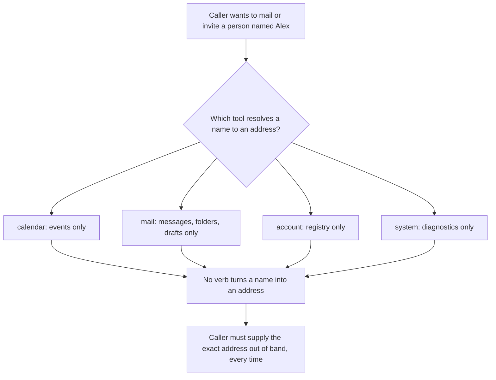
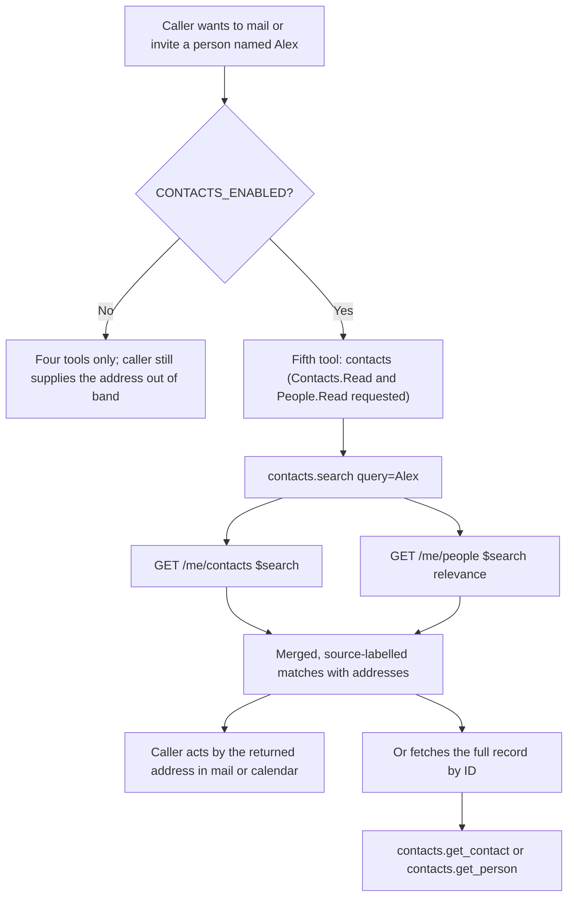
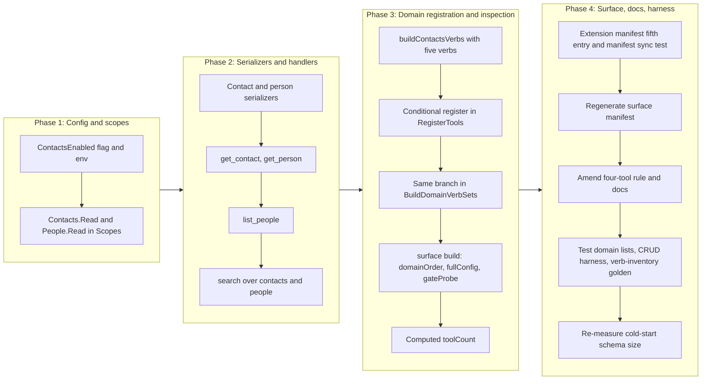

# Contacts Domain: Read and Search

## Change Summary

The server can read and manage mail and calendar, but it cannot answer the question that
precedes half of those actions: *who is "Alex", and what is their email address?* A caller
that wants to draft a message to a person, or invite them to a meeting, has no way to turn
a name into the address the mail and calendar verbs require. It must be handed the address
verbatim, every time.

This change adds a **new `contacts` aggregate domain** whose entire purpose is name-to-address
resolution. It exposes read verbs only: `search` (free-text over personal contacts and
relevance-ranked people), `get_contact`, `list_people`, `get_person`, and the mandatory
`help`. No contact write, no folder, no photo, no directory, and no sync capability is
introduced; the feature-gap matrix marks every one of those `Manage=3` (out of scope), and
this change respects that boundary without exception.

This CR follows **CR-0081** in the implementation sequence, which has landed. It targets
**v0.14.0**.

The central design decision is not the verbs; it is that a contacts domain is a **fifth
top-level MCP tool**. CR-0060 fixed the surface at four aggregate domain tools (`calendar`,
`mail`, `account`, `system`) and the project rule says growth belongs in a domain's verb
registry, not in a new tool. Contacts has no natural home in any of the four existing
domains, so this change deliberately raises the tool count to five and pays the governance
cost that decision carries: it justifies the fifth tool against the alternative of folding
contacts into an existing domain, keeps the **default** surface at four tools by gating the
new domain behind an opt-in flag, quantifies the cold-start schema-size impact against the
60% reduction gate, and amends every four-tool assertion, rule, and document that CR-0060
left behind.

## Motivation and Background

The product's own read paths already assume a resolved address. `mail.create_draft` takes
recipient addresses. `calendar.create_meeting` takes attendee addresses. Neither can accept
"my manager" or "Alex from finance". The feature-gap matrix names the gap directly, at
`high` severity for two of its four in-scope contacts rows:

> * **Search contacts** — "No verb to free-text search personal contacts; resolving a name
>   to an email address to compose mail is a core daily assistant action."
> * **Get contact** — "No verb to fetch a single contact's names, emails, phones, or
>   addresses when composing mail or scheduling; core to an Outlook assistant."

The matrix scopes contacts tightly: "get and search only, to resolve a name to an email
address. No contact writes, folders, photos, directory, or sync." Its four in-scope rows
are exactly the four non-help verbs of this change:

| Matrix row | Severity | Verb |
|---|---|---|
| Search contacts (`GET /me/contacts?$search`) | high | `search` (contacts half) |
| Get contact (`GET /me/contacts/{id}`) | high | `get_contact` |
| List relevance-ranked people (`GET /me/people`) | medium | `list_people` |
| Get a person (`GET /me/people/{id}`) | low | `get_person` |

The `search` verb also serves the matrix's contacts **search-first entry point** row, which
pairs `GET /me/contacts?$search` with `GET /me/people?$search` (relevance) because Microsoft
Search's `/search/query` has no `contact` entity type. Personal contacts (what the user
saved) and relevance-ranked people (whom the user actually corresponds with) are two
different answer sets for one question, so `search` queries both and labels each result by
its source.

The OAuth cost is two new delegated read scopes, `Contacts.Read` and `People.Read`, and it
is paid only by a user who opts in. The domain is gated behind a new
`OUTLOOK_MCP_CONTACTS_ENABLED` flag, mirroring how `MAIL_ENABLED` gates the mail read
surface and its `Mail.Read` scope. A user who never enables contacts sees no new scope, no
new consent prompt, and no fifth tool.

## Change Drivers

* Every mail-drafting and meeting-scheduling flow the product already offers begins with an
  address the caller must supply out of band. There is no verb to obtain it.
* The feature-gap matrix rates two contacts reads `high` and routes all four in-scope rows
  through a Change Request (`Manage=4`).
* Contacts is not a mail concept, not a calendar concept, not an account concept, and not a
  system concept. It is a fifth domain, and the four-tool surface has no verb registry it
  belongs in. This is the one case CR-0060's "add a verb, not a tool" rule did not
  anticipate: a genuinely new domain.
* Microsoft Graph exposes two distinct resources for the one question — saved contacts and
  ranked people — so resolution must span both, which the search-first entry-point row
  encodes.
* The new scopes must not reach a user who did not ask for contacts, so the domain must be
  opt-in and the four-tool default surface must be preserved.

## Current State

The server registers exactly four aggregate domain tools, unconditionally, in
`RegisterTools` (`internal/server/server.go:53`): `calendar`, `mail`, `account`, and
`system`. The count is hard-coded (`toolCount := 4`, `internal/server/server.go:190`) and
asserted by `TestRegisterTools_MailEnabled` (`internal/server/server_test.go:784`,
`expectedTotal = 4`). Each domain is built by a `build<Domain>Verbs` constructor and
registered with `tools.RegisterDomainTool`.

**The domain set is built in two places, not one.** `RegisterTools` builds and registers
the four domains inline, and `BuildDomainVerbSets` (`internal/server/introspect_verbs.go:47`)
builds the same four domains again for inspection, returning a hard-coded four-key map
(`"calendar"`, `"account"`, `"system"`, `"mail"`). `BuildVerbsForInspection`
(`internal/server/surface_export.go:41`) is a thin wrapper over it, and it is the entry
point `internal/surface` and `internal/server/manifest_sync_test.go` both depend on. A
domain added only to `RegisterTools` is invisible to the surface manifest and to the
manifest-sync check.

`internal/surface/build.go` additionally hard-codes the domain set three times:
`domainOrder` (line 22, four names), `fullConfig()` (no contacts flag to set), and
`gateProbes()` (three probes: `EnvMailEnabled`, `EnvMailManageEnabled`, `EnvAuthMethod`).
`BuildRecord` iterates `domainOrder`, so a domain absent from that slice is silently
omitted from `site/src/generated/surface.json` however it is registered, and a gated verb
with no matching probe gets no gate attribution, which
`TestEveryVerbCarriesSummaryAndGate` (`internal/surface/surface_test.go:93`) fails on.

There is no contacts domain, no contacts handler, and no contacts scope. `auth.Scopes`
(`internal/auth/auth.go:56`) returns only `Calendars.ReadWrite` plus, conditionally, one
mail scope; it never requests `Contacts.Read` or `People.Read`. `config.Config`
(`internal/config/config.go:136`, `:146`) has `MailEnabled` and `MailManageEnabled` but no
contacts flag, and `internal/config/inventory.go` (const block at line 42, `inventory`
slice at line 90) has no contacts environment variable.

Measured facts about the surface as it stands, read from the repository at `3ae0e2c` after
CR-0078 through CR-0081 landed, rather than assumed:

* `site/src/generated/surface.json` records four domains — calendar 20/20, mail 18/5,
  account 7/7, system 7/6 (full/default) — for `totals.fullCount` **52** and
  `totals.defaultCount` **38**.
* `extension/manifest.json` enumerates exactly four entries in its `tools` array:
  `calendar`, `mail`, `account`, `system`. Its `long_description` states "Delegated
  permissions only: Calendars.ReadWrite, Mail.Read, User.Read".
* `TestColdStartSchemaSize_Reduction` (`internal/server/schema_size_test.go`) serialises the
  registered tools under the **maximum** feature-flag configuration and asserts the byte
  count is at least 60% below the documented 74 000-byte pre-CR-0060 baseline
  (`preCRBaselineBytes = 74_000`, `minRequiredReductionPct = 60`). Its config (line 62)
  enables `MailEnabled` and `MailManageEnabled` but has no contacts flag to set.
* `internal/server/manifest_sync_test.go` **exists** at this commit; it was landed by an
  earlier change in this sequence, not left as a draft. Its
  `TestManifestDescribesEveryRegisteredVerb` (line 84) derives its cases from the registry
  under `maximalSurfaceConfig()` (line 68, mail flags and `auth_code` only) and
  `t.Fatalf`s when `len(doc.Tools) != 4` (line 88). It therefore fails the moment a fifth
  entry is added to the extension manifest, and it silently skips the contacts verbs unless
  its configuration is extended.
* **Every four-tool statement in the tree**, enumerated so none is left to contradict this
  change. Load-bearing code: `internal/server/introspect_verbs.go` (the four-key map),
  `internal/surface/build.go:22` (`domainOrder`), `internal/server/server.go:188` (comment)
  and `:190` (`toolCount := 4`). Rules and user-facing prose: `AGENTS.md:30` (project-tree
  comment "The 4 aggregate domain tools") and `AGENTS.md:82` ("the MCP surface is four
  aggregate domain tools") — note **`CLAUDE.md` is a symbolic link to `AGENTS.md`**, so
  these are one file, not two; `README.md:35`; `docs/readme.md:43`; `docs/concepts.md:71`
  (annotation semantics) and `:163` (container runtime). Generated text:
  `internal/docs/llmstxt.go:69` and `:153`. Source doc comments:
  `internal/tools/aggregate_annotations.go:6`, `internal/server/surface_export.go:25`.
  Site prose: `site/src/surface.ts` lines 37, 63, and 81 (`domainCount` itself is derived
  from `surface.domains.length` and needs no edit).
* **Test-side four-domain lists**, which are hard-coded rather than derived and would
  silently skip a fifth domain: `internal/tools/verb_metadata_test.go` lines 100, 159, 204,
  230, 377; `internal/tools/description_quality_test.go` lines 93, 130, 151, 164;
  `internal/tools/tool_description_test.go` lines 246, 265;
  `internal/tools/tool_annotations_test.go` line 389 (the list inside
  `TestAggregateAnnotations_FourToolsRegistered` is that test's own default-surface
  expectation and is excluded, see FR-29);
  `internal/server/surface_export_test.go:23`. Their server builders
  (`buildMetadataTestServer`, `buildDescriptionTestServer`, `buildTestServer`) take or set
  a config with no contacts flag.
* **Four-tool count assertions that stay at four** because their configuration leaves
  contacts off, and are therefore re-confirmed rather than amended:
  `internal/server/server_test.go` lines 784, 925, 954, and 1051, and
  `TestAggregateAnnotations_FourToolsRegistered`
  (`internal/tools/tool_annotations_test.go:313`).

The established idioms this change reuses, read from the tree rather than invented:

* **`$search` on a Graph collection**: `internal/tools/search_messages.go:148` and `:168`
  set `Search: &normalised` on the generated query-parameter struct, where `normalised`
  comes from `NormaliseSearchQuery` (`internal/tools/search_messages_query.go:62`). That
  helper is the project's one place for turning a caller's free-text query into a value
  Graph accepts as a `$search` value, and it refuses a query it cannot convert with a fix
  instruction rather than letting Graph fail on a character position. No `ConsistencyLevel`
  header is set on that path.
* **Verb-local fix-instruction constants**: `internal/tools/get_schedule.go:43-45`
  (`getScheduleTimeoutFix`, `getScheduleGraphFix`, `getScheduleAddressFix`), emitted to both
  the log record (`"fix", …`) and the tool result text.
* **Graph call wrapping**: `graph.WithTimeout` (`internal/graph/timeout.go:27`),
  `graph.RetryGraphCall` (`internal/graph/retry.go:103`), `graph.IsTimeoutError`
  (`timeout.go:42`), `graph.TimeoutErrorMessage` (`timeout.go:54`),
  `graph.RedactGraphError` (`internal/graph/errors.go:131`).
* **Identifier validation**: `validate.ValidateResourceID` (`internal/validate/validate.go:128`).
* **`SeeDocs` anchor form**: `"concepts#output-tiers"` and similar
  (`internal/server/calendar_verbs.go:168`). `TestSeeDocsAnchorsResolve` resolves an anchor
  only against an **H2** heading of one of the four embedded files, so a new anchor requires
  a new `## ` heading, not a table row.
* **`client.Me()`**: 49 call sites across `internal/tools/`; `ByUserId` appears nowhere in
  the repository. Example: `internal/tools/list_calendars.go:94`.

The Graph SDK request builders this change needs all exist in the pinned
`msgraph-sdk-go v1.100.0` in the module cache (`msgraph-sdk-go-core v1.4.1`), confirmed by
reading the installed source, not documentation, and all are v1.0 GA (no `/beta` segment
appears in any of the four files):

| Builder file (under `msgraph-sdk-go@v1.100.0/users/`) | Accessor and method | Returns | URL template |
|---|---|---|---|
| `item_contacts_request_builder.go` | `client.Me().Contacts().Get` | `models.ContactCollectionResponseable` | `{+baseurl}/users/{user%2Did}/contacts{?%24count,%24expand,%24filter,%24orderby,%24search,%24select,%24skip,%24top}` |
| `item_contacts_contact_item_request_builder.go` | `client.Me().Contacts().ByContactId(id).Get` | `models.Contactable` | `{+baseurl}/users/{user%2Did}/contacts/{contact%2Did}{?%24expand,%24select}` |
| `item_people_request_builder.go` | `client.Me().People().Get` | `models.PersonCollectionResponseable` | `{+baseurl}/users/{user%2Did}/people{?%24count,%24expand,%24filter,%24orderby,%24search,%24select,%24skip,%24top}` |
| `item_people_person_item_request_builder.go` | `client.Me().People().ByPersonId(id).Get` | `models.Personable` | `{+baseurl}/users/{user%2Did}/people/{person%2Did}{?%24expand,%24select}` |

`client.Me()` supplies `user%2Did` as `me-token-to-replace`, which
`msgraph-sdk-go-core@v1.4.1/graph_client_factory.go:9` rewrites to `/me`, so these
templates resolve to `/me/contacts`, `/me/contacts/{id}`, `/me/people`, and
`/me/people/{id}` on the wire.

Both collection builders expose `Search *string` tagged `uriparametername:"%24search"` on
their `…GetQueryParameters` struct: `ItemContactsRequestBuilderGetQueryParameters` (line 28)
and `ItemPeopleRequestBuilderGetQueryParameters`. Neither item builder has a `Search` option;
each takes only `Expand` and `Select`.

Two model facts that decide the serializer shape, because the two resources return
**unrelated** email types:

* `models.Contactable` exposes `GetDisplayName() *string` and
  `GetEmailAddresses() []models.EmailAddressable`, whose elements carry `GetAddress()` and
  `GetName()`. It also exposes `GetPrimaryEmailAddress()`, `GetSecondaryEmailAddress()`, and
  `GetTertiaryEmailAddress()`.
* `models.Personable` exposes `GetDisplayName() *string` and
  `GetScoredEmailAddresses() []models.ScoredEmailAddressable`, whose elements carry
  `GetAddress()` and `GetRelevanceScore()` but **no** `GetName()`.

The same item-contact builder also exposes `Patch` and `Delete`, and the contacts
collection builder exposes `Post`, `Count()`, and `Delta()`. The people collection builder
exposes no `Post`. This change wires **none** of them; the contact write, create, delete,
and delta rows are all `Manage=3` in the matrix.

### Current State Diagram



## Proposed Change

Add a fifth aggregate domain tool, `contacts`, built by a new `buildContactsVerbs`
constructor in `internal/server/contacts_verbs.go` and registered **only when
`cfg.ContactsEnabled` is true**. The default configuration continues to register the
same four tools it does today. A caller that has not set `OUTLOOK_MCP_CONTACTS_ENABLED`
sees no fifth tool and is asked for no new scope.

The same conditional branch is added in **two** places, because the repository builds the
domain set twice: `RegisterTools` (which serves the running server) and
`BuildDomainVerbSets` (which serves the surface generator and the manifest-sync check).
`internal/surface/build.go`'s `domainOrder`, `fullConfig()`, and `gateProbes()` are extended
alongside them. A domain added to `RegisterTools` alone passes every handler and
registration test while the published manifest keeps describing four domains, which is why
this is stated in the proposal rather than left to the implementation phase.

### Verb inventory

| Verb | Graph call(s) | Required parameters | Returns |
|---|---|---|---|
| `help` | none (reads the registry) | none | Per-verb documentation for the domain |
| `search` | `GET /me/contacts?$search="..."` **and** `GET /me/people?$search="..."` | `query` | Merged, source-labelled matches (saved contacts and ranked people) with display name and addresses |
| `get_contact` | `GET /me/contacts/{id}` | `contact_id` | One personal contact: names, email addresses, phones, addresses |
| `list_people` | `GET /me/people` | none | Relevance-ranked people, most-relevant first |
| `get_person` | `GET /me/people/{id}` | `person_id` | One ranked person: display name and addresses |

`search` issues two Graph requests by design, because the one user question has two answer
sets in Graph and neither subsumes the other. It labels each result with its source so the
caller can tell a saved contact from an inferred correspondent. This is the search-first
entry point the matrix defines for the domain: resolve a name here, then act by the returned
address (in `mail`/`calendar`) or fetch the full record by ID (`get_contact`/`get_person`).

### Annotation matrix

Every verb declares all four hints explicitly, per the project rule that a verb cannot be
registered without its own classification and that the aggregate annotation is computed from
the registered verbs (CR-0052, CR-0060, CR-0068).

| Verb | `readOnlyHint` | `destructiveHint` | `idempotentHint` | `openWorldHint` |
|---|---|---|---|---|
| `help` | `true` | `false` | `true` | `false` |
| `search` | `true` | `false` | `true` | `true` |
| `get_contact` | `true` | `false` | `true` | `true` |
| `list_people` | `true` | `false` | `true` | `true` |
| `get_person` | `true` | `false` | `true` | `true` |

Justification, hint by hint, because an unjustified hint is the defect CR-0068 exists to
prevent:

* **`readOnlyHint: true` for all five.** The entire domain reads. No verb writes contact,
  people, folder, or any other state. This is the load-bearing safety property of the
  change: a read-only domain cannot mutate the mailbox, so the read-only-guard interaction
  and the conservative aggregate fold are trivially satisfied.
* **`destructiveHint: false` for all five.** Nothing is removed or made unaddressable. The
  hint is only meaningful alongside a write, and there is no write.
* **`idempotentHint: true` for all five.** A read repeated with the same arguments returns
  the same shape of answer and changes nothing. (`list_people` and `search` may return
  different ranking over time as Graph's relevance model updates; the hint concerns the
  absence of side effects, not byte-identical payloads, matching how the existing read verbs
  are classified.)
* **`openWorldHint: true` for `search`, `get_contact`, `list_people`, `get_person`.** Each
  calls Microsoft Graph. **`false` for `help`**, which reads the local registry only, exactly
  as the `help` verb of every other domain is classified.

The aggregate fold is the strongest possible: because every registered verb is read-only,
non-destructive, idempotent, and (save `help`) open-world, the `contacts` tool publishes
`readOnlyHint: true`, `destructiveHint: false`, `idempotentHint: true`, `openWorldHint: true`.
A client that gates writes behind confirmation never prompts for a contacts call.

### Output tiering

`search`, `get_contact`, `list_people`, and `get_person` are read verbs, so each **MUST**
implement all three output tiers (`text`, `summary`, `raw`) via an `output` parameter, per
the project's response-tiering rule. Each carries a dedicated summary serializer (for
example `SerializeSummaryContact`, `SerializeSummaryPerson`) that chooses a deliberate field
set — display name and the primary email address, the fields a resolution flow actually
needs — rather than filtering empties out of the raw payload. `help` renders the registry
and takes no `output` parameter, as every domain's `help` does.

### Scope delta

`auth.Scopes` gains one branch: when `cfg.ContactsEnabled` is true, it appends
`Contacts.Read` and `People.Read`. Both are delegated, read-only, v1.0 GA scopes —
`Contacts.Read` authorises `GET /me/contacts` and `GET /me/contacts/{id}`, and `People.Read`
authorises `GET /me/people` and `GET /me/people/{id}`. Neither is a write scope, and no
existing scope changes. The full delta:

| Configuration | Scopes before | Scopes after |
|---|---|---|
| `CONTACTS_ENABLED` unset (default) | unchanged | **unchanged** |
| `CONTACTS_ENABLED=true` | (as before) | (as before) **+ `Contacts.Read` + `People.Read`** |

### Proposed State Diagram



## Requirements

### Functional Requirements

1. The system **MUST** introduce a new aggregate domain tool named `contacts` and **MUST**
   register it as a top-level MCP tool **only** when `cfg.ContactsEnabled` is true. When the
   flag is unset, the registered tool count **MUST** remain four.
2. When `cfg.ContactsEnabled` is true, the registered tool count **MUST** be five, and the
   fifth tool's registered name **MUST** be `contacts`.
3. The `contacts` domain **MUST** register exactly five verbs — `help`, `search`,
   `get_contact`, `list_people`, `get_person` — and **MUST NOT** register any verb that
   writes, creates, updates, deletes, or moves a contact, person, or folder, nor any verb
   for photos, directory or organizational contacts, or delta/sync.
4. `search` **MUST** require a `query` string, **MUST** issue `GET /me/contacts` with the
   normalised value set on `ItemContactsRequestBuilderGetQueryParameters.Search`, **MUST**
   also issue `GET /me/people` with the same normalised value set on
   `ItemPeopleRequestBuilderGetQueryParameters.Search`, and **MUST** return the union of the
   two result sets with each result labelled by its source (personal contact or ranked
   person). Both requests **MUST** carry the identical normalised value, so the two answer
   sets cannot diverge on the query.
5. `get_contact` **MUST** require a `contact_id`, **MUST** issue `GET /me/contacts/{id}` via
   `client.Me().Contacts().ByContactId(...)`, and **MUST** return the contact's
   `displayName` and every entry of its `emailAddresses` collection
   (`Contactable.GetEmailAddresses()`). It **MUST NOT** issue a further request to populate
   `primaryEmailAddress`, `secondaryEmailAddress`, or `tertiaryEmailAddress`.
6. `list_people` **MUST** issue `GET /me/people` and **MUST** return the people in the
   relevance order Graph returns them, most relevant first, without re-sorting.
7. `get_person` **MUST** require a `person_id`, **MUST** issue `GET /me/people/{id}` via
   `client.Me().People().ByPersonId(...)`, and **MUST** return the person's `displayName`
   and every entry of its `scoredEmailAddresses` collection
   (`Personable.GetScoredEmailAddresses()`). `Personable` exposes no per-address name, so
   the rendered label for an address **MUST** be the person's own display name, not a
   per-address name.
8. Every verb that accepts an identifier (`get_contact`, `get_person`) **MUST** validate it
   with `validate.ValidateResourceID` and **MUST** reject an invalid identifier before any
   Graph request is issued. `validate.ValidateResourceID` bounds emptiness and length only
   and rejects no character set, so a test exercising this requirement **MUST** use an empty
   or over-length identifier and **MUST NOT** be written as though a character-set check
   existed.
9. `search` **MUST** normalise `query` with the existing
   `tools.NormaliseSearchQuery` helper (`internal/tools/search_messages_query.go:62`) and
   **MUST NOT** introduce a second query-normalisation path. The normalisation **MUST** run
   once, before the timeout context and before either Graph request is issued, so a query it
   refuses causes no request at all. `search` **MUST** additionally reject an empty or
   whitespace-only `query` before normalisation, with an error that names the `query`
   parameter and states what to supply.
10. Every read verb (`search`, `get_contact`, `list_people`, `get_person`) **MUST** implement
    all three output tiers via an `output` parameter accepting `text`, `summary`, and `raw`,
    with `text` the default. `help` **MUST NOT** declare an `output` parameter.
11. Every read verb's `summary` tier **MUST** be produced by a dedicated serialization
    function that selects its field set deliberately, and **MUST NOT** be derived by
    filtering empty values out of the raw payload.
12. Every verb **MUST** declare all four annotation hints explicitly, with the values given
    in the annotation matrix above; in particular every verb **MUST** declare
    `readOnlyHint: true` and `destructiveHint: false`.
13. Every verb **MUST** be wrapped by the read middleware chain (authentication, account
    resolution, observability, audit) under the identity `contacts.<verb>`, so the audit
    record and the OpenTelemetry attributes carry the same `{domain}.{operation}` identity as
    every other verb, and every verb's audit operation **MUST** be `read`.
14. `auth.Scopes` **MUST** append `Contacts.Read` and `People.Read` when
    `cfg.ContactsEnabled` is true, and **MUST NOT** alter the scope set in any configuration
    where `cfg.ContactsEnabled` is false.
15. `auth.Scopes` **MUST NOT** request any contact write scope (`Contacts.ReadWrite`) in any
    configuration; the contacts surface is read-only.
16. `config.Config` **MUST** gain a `ContactsEnabled` boolean, and `LoadConfig` **MUST** read
    it from `OUTLOOK_MCP_CONTACTS_ENABLED`, defaulting to false, following the exact pattern
    of `MailEnabled`. `internal/config/inventory.go` **MUST** gain an `EnvContactsEnabled`
    constant in its const block and a matching row in its `inventory` slice, because
    `config.Inventory()` is what the surface manifest's `config` section and the site's
    configuration reference derive from; a flag absent from the inventory is invisible to
    both.
17. Every verb **MUST** carry a non-empty `Summary` of at most eighty characters and a
    non-empty `Description` stating its parameters and its annotation semantics. Every verb
    except `help` **MUST** carry at least one `Examples` entry and at least one `SeeDocs`
    reference. Every `SeeDocs` reference **MUST** resolve to an **H2** heading of one of the
    four embedded files (`readme`, `quickstart`, `concepts`, `troubleshooting`) in the
    `slug#anchor` form `TestSeeDocsAnchorsResolve` accepts, for example
    `concepts#contacts-gating`; a table row added to an existing section is not an anchor
    and does not satisfy this.
18. The `contacts` domain **MUST** expose an `operation="help"` verb documenting every
    registered verb, per the domain rule.
19. `extension/manifest.json`'s `tools` array **MUST** gain a fifth entry, `contacts`, whose
    `description` names all five verbs, and the array **MUST** hold exactly five entries
    after this change. The entry's description **MUST** name each verb as a whole word,
    because `TestManifestDescribesEveryRegisteredVerb` matches on word boundaries. The
    manifest's `long_description` **MUST** name `Contacts.Read` and `People.Read` in its
    delegated-permissions line, stating that both are requested only under
    `OUTLOOK_MCP_CONTACTS_ENABLED`.
20. `site/src/generated/surface.json` **MUST** be regenerated with `make surface-manifest`
    and committed in the same change. The regenerated manifest **MUST** record the `contacts`
    domain with five full verbs and zero default verbs (the whole domain is gated), each of
    the five carrying `OUTLOOK_MCP_CONTACTS_ENABLED` as its gate. `totals.fullCount`
    **MUST** rise from **52** to **57** and `totals.defaultCount` **MUST** remain **38**.
    CR-0080 and CR-0081 have landed, so these absolute figures are now knowable and are
    pinned rather than left as a delta; should a further change land ahead of this one, the
    binding invariant is the +5 full and +0 default delta from the then-current committed
    manifest. The regenerating surface-drift gate that fails `make ci` on any mismatch, not
    a number written in this document, remains the real check that the committed manifest
    matches the live registry.
21. The hard-coded `toolCount` in `internal/server/server.go:190` **MUST** be computed as
    four plus one when `cfg.ContactsEnabled` is true, and the completion log line at `:192`
    **MUST** report the actual number registered.
22. Every four-tool statement enumerated in Current State **MUST** be amended to state that
    the surface is four aggregate domain tools by default plus an opt-in fifth (`contacts`)
    enabled by `OUTLOOK_MCP_CONTACTS_ENABLED`. This is one edit per site across:
    `AGENTS.md` line 30 and line 82 — and **only** `AGENTS.md`, since `CLAUDE.md` is a
    symbolic link to it and editing both would be editing one file twice; `README.md:35`;
    `docs/readme.md:43`; `docs/concepts.md:71` and `:163`; `internal/docs/llmstxt.go:69` and
    `:153`; `internal/tools/aggregate_annotations.go:6`;
    `internal/server/surface_export.go:25`; and the prose comments in `site/src/surface.ts`
    at lines 37, 63, and 81. The "Tool Naming Convention" list of aggregate tools in
    `AGENTS.md` **MUST** add `contacts` as an opt-in domain. `site/src/surface.ts`'s
    `domainCount` export **MUST NOT** be changed to a literal: it derives from
    `surface.domains.length` and is already correct.
23. `docs/concepts.md` **MUST** gain a new `## Contacts gating` H2 section, mirroring the
    `## Mail gating` section's table shape, stating that the domain is off by default, that
    `OUTLOOK_MCP_CONTACTS_ENABLED=true` registers the fifth tool and requests
    `Contacts.Read` and `People.Read`, and that no contact write scope is ever requested. It
    **MUST** be an H2 so `concepts#contacts-gating` resolves as a `SeeDocs` anchor (FR-17).
    `docs/concepts.md` **MUST** additionally gain two rows in the
    "OAuth scopes used per feature" table: `OUTLOOK_MCP_CONTACTS_ENABLED=false` (default)
    naming no scope, and `OUTLOOK_MCP_CONTACTS_ENABLED=true` naming `Contacts.Read` and
    `People.Read`.
24. `docs/prompts/mcp-tool-crud-test.md`, `scripts/crud-test.sh`, and
    `docs/bench/crud-runs.csv` **MUST** be lifecycled for the new top-level domain:
    * the prompt **MUST** gain steps exercising all five verbs, numbered from **Step 47**
      (the prompt currently ends at Step 46), each marked "skip if contacts disabled" in the
      style the mail steps already use;
    * `scripts/crud-test.sh` **MUST** receive all three matching edits its own MAINTENANCE
      comment (lines 102-108) names, or the CSV rows go malformed and contacts calls are
      silently counted as `other`: (a) an `mcp_contacts` column in the CSV header emitted at
      line 97, (b) an `/^mcp__outlook-local-mcp__contacts$/` pattern and counter in the awk
      block with the counter added to its `END` `printf`, and (c) the counter added to the
      `read -r` variable list and to the `jq` `--arg`/output array;
    * `docs/bench/crud-runs.csv` **MUST** gain the matching `mcp_contacts` column in its
      header, and its historical rows **MUST** be reset rather than left short, per the
      harness-maintenance rule in `AGENTS.md`.
25. The change **MUST NOT** alter the default four-tool surface. With `cfg.ContactsEnabled`
    false: the set of registered top-level tool names **MUST** remain exactly `calendar`,
    `mail`, `account`, `system`; the regenerated `site/src/generated/surface.json`
    `totals.defaultCount` **MUST** remain 38 and no default-configuration verb entry **MUST**
    change; and the requested OAuth scope set **MUST** be unchanged (FR-14). "Byte-identical"
    is graded by these three observable properties, not asserted as prose.
26. `BuildDomainVerbSets` (`internal/server/introspect_verbs.go:47`) **MUST** build and
    return the `contacts` domain under the same `cfg.ContactsEnabled` condition
    `RegisterTools` uses, and **MUST NOT** include a `"contacts"` key when the flag is false.
    Registering the domain in `RegisterTools` alone is insufficient: `BuildVerbsForInspection`
    wraps `BuildDomainVerbSets`, and it is the only entry point `internal/surface` and
    `internal/server/manifest_sync_test.go` read, so a domain missing here is invisible to
    the surface manifest and to the manifest-sync check however it is registered.
27. `internal/surface/build.go` **MUST** be extended in all three places its four-domain
    assumption is written, or the contacts domain never reaches the generated manifest:
    `domainOrder` (line 22) **MUST** gain `"contacts"` in last position, matching the
    Tool Naming Convention order; `fullConfig()` **MUST** set `ContactsEnabled: true`; and
    `gateProbes()` **MUST** gain a fourth probe pairing `config.EnvContactsEnabled` with the
    default configuration plus `ContactsEnabled: true`, so each contacts verb is attributed
    to its gate and `TestEveryVerbCarriesSummaryAndGate` passes.
28. `internal/server/manifest_sync_test.go` **MUST** be modified, not created: it exists at
    the source commit. Its `maximalSurfaceConfig()` **MUST** set `ContactsEnabled: true` so
    the registry-derived cases cover the contacts verbs, its `len(doc.Tools) != 4` assertion
    (line 88) **MUST** become `!= 5`, and its `manifestDocument.Tools` doc comment and the
    file's package comment **MUST** be updated from four to five. No second test asserting
    the same property **MUST** be added; the existing derived check is extended rather than
    duplicated.
29. Every hard-coded four-domain list in the test suite **MUST** gain `"contacts"`, and every
    test server builder feeding those lists **MUST** be given a configuration with
    `ContactsEnabled: true`, or the registry-metadata, description-quality, and
    annotation checks silently skip the five new verbs and AC-8 is graded vacuously. The
    sites are `internal/tools/verb_metadata_test.go` (lines 100, 159, 204, 230, 377),
    `internal/tools/description_quality_test.go` (lines 93, 130, 151, 164),
    `internal/tools/tool_description_test.go` (lines 246, 265),
    `internal/tools/tool_annotations_test.go` (line 389), and
    `internal/server/surface_export_test.go` (line 23), thirteen sites in all. The list in
    `internal/tools/tool_annotations_test.go` that sits inside
    `TestAggregateAnnotations_FourToolsRegistered` is deliberately **not** among them: it is
    that test's own default-surface expectation, which the closing sentence of this
    requirement forbids changing, so extending it would contradict the same requirement and
    break the guarantee FR-25 rests on. The four-tool *count* assertions
    listed in Current State (`internal/server/server_test.go` lines 784, 925, 954, 1051 and
    `TestAggregateAnnotations_FourToolsRegistered`) **MUST NOT** be changed: their
    configurations leave contacts off, so they continue to prove the default surface is four
    tools, which is exactly what FR-25 needs.
30. Deriving the domain list from the registry rather than restating it at each of the
    thirteen sites FR-29 enumerates is **out of scope** for this change and **MUST NOT** be
    attempted here. FR-29 is an instance-level fix, and `AGENTS.md` records that instance
    fixes do not close a class; the class-closing remedy is recorded as follow-on work
    rather than silently treated as done.

### Non-Functional Requirements

1. Each verb's handler **MUST** live in its own file under `internal/tools/`, named for the
   verb (`contacts_search.go`, `contacts_get_contact.go`, `contacts_list_people.go`,
   `contacts_get_person.go`), mirroring the one-file-per-verb layout of the existing domains.
2. The cold-start schema reduction asserted by `TestColdStartSchemaSize_Reduction` **MUST**
   stay at or above 60% against the documented 74 000-byte baseline (`preCRBaselineBytes`)
   **with the contacts domain enabled**. The test's configuration (`internal/server/schema_size_test.go:62`)
   **MUST** be extended to set `ContactsEnabled: true`, so it measures the true five-tool
   maximum rather than a four-tool subset, and its "four aggregate tools" comments at lines
   33 and 36 **MUST** be updated to five.
3. Because the schema-size figure is a measured gate, the implementer **MUST** validate the
   instrument before trusting the result — run the measurement twice on unchanged input and
   confirm it agrees with itself — and **MUST** record the measured five-tool byte count and
   reduction percentage in the validation report rather than asserting an estimate. A
   contacts domain of five read verbs shaped like the account domain's read verbs is expected
   to add on the order of a few thousand bytes to a maximum schema well under 20 000 bytes,
   leaving an estimated reduction in the low-to-mid seventies of a percent; the requirement
   is the measured value, not this estimate.
4. Every error raised by the domain **MUST** carry a fix instruction naming what to supply or
   correct, and **MUST** reach both the tool result and the log record, so a headless caller
   still receives the correction. The fix instructions **MUST** be declared as verb-local
   `const` strings at the top of each handler file and referenced from both channels,
   following `internal/tools/get_schedule.go:43-45` (`getScheduleTimeoutFix`,
   `getScheduleGraphFix`, `getScheduleAddressFix`), rather than written inline at each
   emission site where the two channels can drift apart.
5. The change **MUST NOT** add a third-party dependency; the four request builders already
   exist in the pinned SDK.
6. `get_contact`, `list_people`, and `get_person` **MUST** each issue exactly one Graph
   request on the success path. `search` **MUST** issue exactly two, one against `/me/contacts`
   and one against `/me/people`, and **MUST NOT** perform any additional per-result fetch.
7. Every handler **MUST** route its Graph call through `graph.RetryGraphCall` and
   `graph.WithTimeout`, and **MUST** redact Graph errors with the existing helpers, so retry,
   timeout, and redaction behaviour is identical to the verbs already registered.
8. The `contacts` tool's composed description **MUST** stay below the 4 000-character bound
   asserted by `TestDescriptionLengthBounded` (`maxLen = 4000`,
   `internal/tools/description_quality_test.go:148`); a five-verb read domain is far below
   it, but the bound is asserted, not assumed. The measured character count **MUST** be
   recorded in the validation report alongside the bound.
9. The contact and person serializers **MUST** be two distinct functions, not one
   parameterised over a shared interface. `Contactable.GetEmailAddresses()` returns
   `[]models.EmailAddressable` and `Personable.GetScoredEmailAddresses()` returns
   `[]models.ScoredEmailAddressable`; the two element types are unrelated in the SDK and
   share no address interface, so a single serializer cannot type-check over both.

## Affected Components

### Source (new)

* `internal/server/contacts_verbs.go`: `buildContactsVerbs`, the domain verb slice
  constructor, and the `contactsVerbsConfig` dependency struct declared in the same file
  (no separate `_config.go`, matching every existing domain). Carries the five `Verb`
  descriptors with `Summary`, `Description`, `Examples`, `SeeDocs`, `Annotations`, and
  `Schema`, each `Handler` wrapped under the identity `contacts.<verb>` with audit op `read`.
  **The model is `mailVerbsConfig` / `buildMailVerbs`
  (`internal/server/mail_verbs.go`), not `accountVerbsConfig`.** `accountVerbsConfig` has
  only `registry`, `cfg`, `m`, `tracer`, and `authMW`: it carries no `retryCfg`, no
  `timeout`, and no `accountResolverMW`, because account verbs deliberately bypass account
  resolution and Graph. Contacts verbs are Graph reads that require a resolved account, so
  `contactsVerbsConfig` carries `retryCfg`, `timeout`, `m`, `tracer`, `authMW`, and
  `accountResolverMW`. This is the same distinction the Alternative Approaches section uses
  to reject folding contacts into `account`.
* `internal/tools/contacts_search.go`: the `search` handler, issuing the two `$search`
  Graph calls and merging the results with source labels.
* `internal/tools/contacts_get_contact.go`: the `get_contact` handler.
* `internal/tools/contacts_list_people.go`: the `list_people` handler.
* `internal/tools/contacts_get_person.go`: the `get_person` handler.
* `internal/tools/contacts_serialize.go`: the raw and summary serializers for a contact and
  a person, including `SerializeSummaryContact` and `SerializeSummaryPerson` (FR-11, NFR-9).
  It lives in `internal/tools/`, not `internal/graph/`, so the two serializers sit beside
  the four handlers that are their only callers.

### Source (modified)

* `internal/server/server.go`: the conditional `buildContactsVerbs` +
  `tools.RegisterDomainTool` block gated on `cfg.ContactsEnabled`, the computed `toolCount`
  (FR-21, line 190), the completion log line (line 192), the four-tool comment (line 188),
  and the domain `Intro` naming the five verbs and the gate.
* `internal/server/introspect_verbs.go`: the same conditional contacts branch in
  `BuildDomainVerbSets`, so the domain reaches the surface generator and the manifest-sync
  check (FR-26). **This is the second of two places the domain set is built; omitting it is
  the single most likely way for this change to pass its own unit tests and still ship a
  manifest with four domains.**
* `internal/surface/build.go`: `domainOrder`, `fullConfig()`, and `gateProbes()` (FR-27).
* `internal/config/config.go`: the `ContactsEnabled` field and the `LoadConfig` read (FR-16).
* `internal/config/inventory.go`: the `EnvContactsEnabled` constant and its `inventory` row
  (FR-16).
* `internal/auth/auth.go`: the `contactsReadScope` and `peopleReadScope` constants and the
  `cfg.ContactsEnabled` branch in `Scopes` (FR-14, FR-15).
* `internal/tools/text_format.go`: contacts text formatters following the established
  patterns (numbered lists for collections, labelled fields for a single record, a total
  count at the end).
* `internal/tools/aggregate_annotations.go`: the four-tool doc comment at line 6 (FR-22).
* `internal/server/surface_export.go`: the four-domain doc comment at line 25 (FR-22).
* `internal/docs/llmstxt.go`: the generated `llms.txt` text at lines 69 and 153 (FR-22).

### Unchanged but load-bearing

* `internal/tools/dispatch_registry.go`: the `Verb` registry and `RegisterDomainTool` are
  reused as-is; a fifth domain needs no dispatch change.
* `internal/tools/search_messages_query.go`: `NormaliseSearchQuery` is reused unchanged by
  `search` (FR-9).
* `internal/graph/{timeout,retry,errors}.go` and `internal/validate/validate.go`: reused
  unchanged (FR-8, NFR-7).
* `site/src/surface.ts`: `domainCount` already derives from `surface.domains.length` and
  needs no edit; only its prose comments at lines 37, 63, and 81 change (FR-22).

### Published surface and documentation

* `extension/manifest.json`: a fifth `tools` entry, `contacts`, and the two new scopes named
  in `long_description` (FR-19).
* `site/src/generated/surface.json`: regenerated with `make surface-manifest`, never
  hand-edited (FR-20). Expected `totals`: `fullCount` 52 → 57, `defaultCount` 38 unchanged.
* `AGENTS.md` (lines 30 and 82), `README.md` (line 35), `docs/readme.md` (line 43),
  `docs/concepts.md` (lines 71 and 163, plus the new `## Contacts gating` section and the
  two OAuth-scope rows): FR-22 and FR-23. `CLAUDE.md` is a symbolic link to `AGENTS.md` and
  **MUST NOT** be edited separately.
* `docs/prompts/mcp-tool-crud-test.md`, `scripts/crud-test.sh`, `docs/bench/crud-runs.csv`:
  the harness lifecycle for a new top-level domain (FR-24).

### Tests

* `internal/tools/dispatch_registry_test.go`: the `verbInventoryGolden` list (line 39) gains
  five contacts identities.
* `internal/server/schema_size_test.go`: `ContactsEnabled: true` added to the max-config at
  line 62, and the "four aggregate tools" comments at lines 33 and 36 updated to five (NFR-2).
* `internal/server/server_test.go`: two new tests asserting five tools under
  `ContactsEnabled` and four without it. The four existing `expectedTotal = 4` assertions
  (lines 784, 925, 954, 1051) are re-confirmed and **left unchanged** (FR-29).
* `internal/server/manifest_sync_test.go`: **modified, not created** — the file exists at the
  source commit. `maximalSurfaceConfig()` gains `ContactsEnabled: true`, the `!= 4` assertion
  becomes `!= 5`, and the four-tool prose in the package comment and the
  `manifestDocument.Tools` field comment is updated (FR-28).
* `internal/tools/verb_metadata_test.go`, `internal/tools/description_quality_test.go`,
  `internal/tools/tool_description_test.go`, `internal/tools/tool_annotations_test.go`,
  `internal/server/surface_export_test.go`: the hard-coded four-domain lists gain
  `"contacts"` and the test server builders gain `ContactsEnabled: true` (FR-29).
  `TestAggregateAnnotations_FourToolsRegistered`
  (`internal/tools/tool_annotations_test.go:313`) is **left unchanged**: its configuration
  sets no contacts flag, so it keeps proving the default surface is four tools.
* `internal/surface/surface_test.go`: a case asserting the contacts domain is recorded with
  five full and zero default verbs, each gated on `OUTLOOK_MCP_CONTACTS_ENABLED`.
* New test files: `internal/tools/contacts_{search,get_contact,list_people,get_person}_test.go`,
  `internal/tools/contacts_serialize_test.go`, `internal/server/contacts_verbs_test.go`,
  `internal/server/introspect_verbs_test.go` (no such file exists today), and cases appended
  to `internal/auth/auth_test.go`, `internal/config/config_test.go`, and
  `internal/surface/surface_test.go`.

### Deliberately unchanged

* `internal/server/readonly.go` and `ReadOnlyGuard`. Every contacts verb is read-only, so no
  contacts handler is wrapped by the guard, and `readOnly` is not a field of
  `contactsVerbsConfig`. This is a consequence of the read-only domain, and it is stated so a
  reviewer does not read the guard's absence as an omission.
* `docs/quickstart.md` and `docs/troubleshooting.md`: neither states a tool count nor a
  contacts failure mode this change introduces.

## Scope Boundaries

### In Scope

* The `contacts` aggregate domain and its five verbs: `help`, `search`, `get_contact`,
  `list_people`, `get_person`.
* Their handlers, serializers, registry entries, annotations, schemas, output tiers, and
  unit tests.
* The `ContactsEnabled` config flag and its env binding.
* The two new read scopes and their conditional request.
* Raising the tool count to five when opted in, and preserving four by default.
* Every four-tool rule, assertion, manifest, and document amendment the fifth tool requires.
* The surface-manifest regeneration and the CRUD-harness lifecycle for the new domain.

### Out of Scope ("Here, But Not Further")

Every one of these is `Manage=3` (out of scope) in the feature-gap matrix, and this change
introduces none of them:

* **Contact writes.** Create, update, and delete contact (`POST /me/contacts`,
  `PATCH`/`DELETE /me/contacts/{id}`) are out of scope. The SDK exposes `Post`, `Patch`, and
  `Delete` on these builders; this change wires only `Get`.
* **Contact folders.** Listing, creating, renaming, deleting, or traversing contact folders,
  and folder-scoped contact reads.
* **Contact photos.** Reading or writing contact or person photo metadata or bytes.
* **Directory and organizational contacts.** The tenant `/contacts` collection, org-contact
  get/patch/delete, directory bulk utilities, and org-chart relationships
  (manager, directReports, memberOf).
* **Delta and sync.** `GET /me/contacts/delta` and any incremental-sync token flow.
* **The non-gaps.** Contact attachments and contact move/copy, which Graph does not support
  and which no product could expose.
* **Listing all personal contacts unfiltered.** `GET /me/contacts` without a `$search` is a
  `Manage=3` row ("List personal contacts"); resolution is search-first, so the collection
  read is reached only through `search`, never as a bare enumeration verb.
* **Sending, replying, forwarding.** No verb here communicates; `Mail.Send` stays
  unrequested. Contacts resolves an address; acting on it remains the draft-only mail surface
  established by earlier CRs.
* **Changing the mail, calendar, account, or system surfaces, the output-tier model, or the
  aggregate-annotation fold.**

## Alternative Approaches Considered

The fifth-tool decision is the crux of this CR, so its alternatives are weighed first and at
length.

* **Fold contacts into an existing domain — the "no fifth tool" option.** This is what the
  CR-0060 rule prefers by default: add verbs to a domain's registry, not a new tool. The
  candidate hosts are `mail` (you resolve an address to send mail) and `account` (both touch
  identity). **Rejected.** Contacts is a distinct Graph resource family (`/me/contacts`,
  `/me/people`) with its own scopes (`Contacts.Read`, `People.Read`), unrelated to mail
  messages or to the local account registry. Folding it into `mail` would mean the mail
  tool's `$search`, its gating flag, and its scope set describe two unrelated resources, and
  `mail`'s annotation fold and description would carry contacts semantics that a caller
  reading "mail" would not expect. Folding it into `account` is worse: `account` verbs manage
  the local registry and deliberately bypass account resolution and Graph entirely, while
  contacts verbs are Graph reads that require a resolved account. The one-concept-one-place
  principle that motivates the four-tool rule is the same principle that says a fifth genuine
  domain deserves its own tool. The rule optimizes against *gratuitous* tools that split one
  domain; it was never meant to force a second domain into one tool.
* **A fifth tool, registered unconditionally, with all verbs gated inside (the mail
  pattern).** Consistent with how `mail` is always registered even when its verbs are gated
  off. **Rejected** in favour of conditional registration of the whole tool, because unlike
  mail — whose always-on read verbs justify an always-registered tool — the contacts domain
  has *no* ungated verb: every verb needs a scope the default config does not request. An
  always-registered contacts tool whose every verb errors "scope not granted" is worse UX
  than an absent tool, and it would grow the default cold-start schema for users who never
  opted in. Conditional registration keeps the default surface at four tools exactly.
* **One combined `resolve` verb instead of `search` + `get_*`.** Fewer verbs. **Rejected:**
  it conflates the search-first entry point (many candidate matches) with the by-ID fetch
  (one full record), which the matrix separates into distinct rows, and it hides the
  contact-versus-person distinction that a caller needs to judge a match's trustworthiness.
* **Query only `/me/contacts` (drop `/me/people`).** Simpler `search`. **Rejected:** the
  most useful answers to "email my manager" come from relevance-ranked people the user has
  never saved as a contact. The matrix's search-first entry-point row pairs both resources
  precisely because neither alone answers the question.
* **Request `Contacts.ReadWrite` to leave room for a future write.** **Rejected:** it asks
  for consent this change does not use and the matrix forbids. The scope set must match the
  read-only surface exactly.

## Impact Assessment

### User Impact

A user who sets `OUTLOOK_MCP_CONTACTS_ENABLED=true` consents once to `Contacts.Read` and
`People.Read` and gains name-to-address resolution: the assistant can turn "email Alex" into
a drafted message to the right address, or find a manager to invite. A user who does not
enable it sees no change at all — same four tools, same scopes, same consent surface.

The one thing a user must understand is that `search` returns two kinds of match: contacts
they saved, and people Graph inferred from their correspondence. The verb labels each, so it
is disclosed rather than discovered.

### Technical Impact

No breaking change, no schema migration, no new dependency, no new write scope. The default
configuration's published tool surface is byte-identical (FR-25). Under `ContactsEnabled` the
surface grows by one tool of five read verbs and two read scopes.

The fifth tool is the first increase in top-level tool count since CR-0060 established the
four-tool surface, so it touches the four-tool assertions, rules, and documents deliberately
and in one change. The measured cold-start gate is re-established with the contacts domain
included and must be re-measured, not assumed, to remain at or above 60%.

### Business Impact

Low cost for a high-value, frequently-blocked flow. Five read handlers of a shape the codebase
already has, one config flag, one scope branch, and a bounded set of documentation and harness
edits. The risk concentrates in the governance surface (the fifth tool) rather than in the
Graph calls, and this document pins that surface.

## Implementation Approach

### Implementation Flow



Phase 3 leaves three registry-derived checks deliberately red, and Phase 4 closes them.
This is expected and is recorded here so an implementor does not mistake a red build at the
end of Phase 3 for a defect and patch around it:

* `TestVerbInventoryUnchangedAfterUpgrade` (`internal/tools/dispatch_registry_test.go:153`)
  fails because five identities are registered that `verbInventoryGolden` does not list.
  Closed by Phase 4 step 6.
* `TestCommittedManifestMatchesRecord` (`internal/surface/manifest_test.go:21`), and with it
  `make surface-check` inside `make ci`, fails because the live registry now records a fifth
  domain that the committed `site/src/generated/surface.json` does not. Closed by Phase 4
  step 2.
* `TestManifestDescribesEveryRegisteredVerb` (`internal/server/manifest_sync_test.go:84`)
  fails because the registry registers a `contacts` domain that `extension/manifest.json`
  does not describe. Closed by Phase 4 step 1.

Run `make build`, `make vet`, and the package-scoped tests at the end of Phases 1 through 3;
`make ci` is expected to pass only at the end of Phase 4.

### Phase 1: Config and scopes

1. Add `ContactsEnabled bool` to `config.Config` (beside `MailManageEnabled`, line 146) and
   read it in `LoadConfig` (beside line 307) with a `false` default, following `MailEnabled`
   exactly. Unlike `MailManageEnabled`, it implies no other flag.
2. Add `EnvContactsEnabled = "OUTLOOK_MCP_CONTACTS_ENABLED"` to the const block in
   `internal/config/inventory.go` (after `EnvMailManageEnabled`, line 43) and a matching row
   to the `inventory` slice (after the `EnvMailManageEnabled` row, line 91), so the flag
   reaches the surface manifest's `config` section and the site's configuration reference
   (FR-16).
3. Add `contactsReadScope = "Contacts.Read"` and `peopleReadScope = "People.Read"` to
   `internal/auth/auth.go` beside `mailScope` (line 27), and append both in `Scopes` when
   `cfg.ContactsEnabled` is true. Document that neither is a write scope and that they are
   requested only on opt-in.

**Affected components:**

* `internal/config/config.go` — `ContactsEnabled` field, `LoadConfig` read.
* `internal/config/inventory.go` — `EnvContactsEnabled` const, `inventory` row.
* `internal/config/config_test.go` — `TestLoadConfig_ContactsEnabled`.
* `internal/auth/auth.go` — two scope constants, the `Scopes` branch.
* `internal/auth/auth_test.go` — `TestScopes_Contacts`, `TestScopes_NoContactsByDefault`,
  `TestScopes_NoContactsWriteEver`.

**Verification:** `make build`, `make vet`, `go test ./internal/config/... ./internal/auth/...`.

### Phase 2: Serializers and handlers

1. Add `internal/tools/contacts_serialize.go` with two independent pairs of serializers,
   because `Contactable` and `Personable` expose unrelated address types (NFR-9).
   `SerializeSummaryContact` selects `displayName` and the first entry of `emailAddresses`;
   `SerializeSummaryPerson` selects `displayName` and the first entry of
   `scoredEmailAddresses`. Both select a deliberate field set rather than filtering empties
   out of the raw payload (FR-11).
2. `internal/tools/contacts_get_contact.go`: resolve the Graph client, validate `contact_id`
   with `validate.ValidateResourceID`, call
   `client.Me().Contacts().ByContactId(id).Get(...)` through the retry/timeout helpers, and
   render the requested tier.
3. `internal/tools/contacts_get_person.go`: the same shape against
   `client.Me().People().ByPersonId(id).Get(...)`.
4. `internal/tools/contacts_list_people.go`: `client.Me().People().Get(...)`, preserve
   relevance order, render the requested tier as a numbered list with a total count.
5. `internal/tools/contacts_search.go`: reject an empty or whitespace-only `query` by name,
   normalise it once with `NormaliseSearchQuery`, then issue
   `client.Me().Contacts().Get(...)` with `ItemContactsRequestBuilderGetQueryParameters.Search`
   set and `client.Me().People().Get(...)` with
   `ItemPeopleRequestBuilderGetQueryParameters.Search` set to the same value, merge the two
   result sets with a source label per result, and render the requested tier. Exactly two
   Graph requests, no per-result fetch (NFR-6). Follow `internal/tools/search_messages.go:104-115`
   in running the normalisation before the timeout context and the retry wrapper, so a
   refused query issues no request.
6. Every handler goes through `graph.RetryGraphCall` inside `graph.WithTimeout`, with
   `graph.IsTimeoutError`, `graph.TimeoutErrorMessage`, and `graph.RedactGraphError` handled
   as `internal/tools/get_schedule.go:150-170` handles them, and with the per-verb fix
   instructions declared as file-local constants in that file's style (NFR-4, NFR-7).
7. Add the contacts text formatters to `internal/tools/text_format.go`: a numbered list with
   a total count for `search` and `list_people`, labelled fields for `get_contact` and
   `get_person`.

**Affected components:**

* `internal/tools/contacts_serialize.go` (new) and `internal/tools/contacts_serialize_test.go` (new).
* `internal/tools/contacts_get_contact.go`, `contacts_get_person.go`,
  `contacts_list_people.go`, `contacts_search.go` (all new), each with a matching
  `_test.go`.
* `internal/tools/text_format.go` — contacts formatters.
* Reused unchanged: `internal/tools/search_messages_query.go` (`NormaliseSearchQuery`),
  `internal/validate/validate.go`, `internal/graph/{timeout,retry,errors}.go`.

**Verification:** `make build`, `make vet`, `go test -race ./internal/tools/...`.

### Phase 3: Domain registration and inspection

1. Add `buildContactsVerbs` and `contactsVerbsConfig` in
   `internal/server/contacts_verbs.go`, mirroring `buildMailVerbs` **and not
   `buildAccountVerbs`**: `contactsVerbsConfig` carries `retryCfg`, `timeout`, `m`,
   `tracer`, `authMW`, and `accountResolverMW`, because contacts verbs are Graph reads that
   need a resolved account. It carries no `readOnly`, because the domain has no write verb
   for `ReadOnlyGuard` to block. Build an empty `VerbRegistry`, a `wrap` closure applying
   authMW, account resolution, observability, and audit under `contacts.<verb>` with op
   `read` (the read-verb chain of `internal/server/calendar_verbs.go`, without the
   `ReadOnlyGuard` layer that the write chain at line 100 adds), and the five `Verb`
   descriptors with full metadata, annotations, and schema.
2. In `RegisterTools` (`internal/server/server.go:53`), add a block after the mail block
   that builds and registers the contacts domain **only when `cfg.ContactsEnabled` is
   true**, with an `Intro` naming the five verbs and the gate.
3. Add the identical conditional branch to `BuildDomainVerbSets`
   (`internal/server/introspect_verbs.go:47`), adding a `"contacts"` key to the returned map
   only when the flag is true (FR-26). This is the twin of step 2; a domain registered in
   step 2 alone is invisible to the surface generator and to the manifest-sync check.
4. Extend `internal/surface/build.go` (FR-27): `domainOrder` gains `"contacts"` last,
   `fullConfig()` sets `ContactsEnabled: true`, and `gateProbes()` gains a fourth probe
   pairing `config.EnvContactsEnabled` with the default config plus `ContactsEnabled: true`.
5. Compute `toolCount` as `4 + 1` when contacts is enabled, log the actual count, and update
   the four-tool comment above it (FR-21).

At the end of this phase the three registry-derived checks listed above are red by design.

**Affected components:**

* `internal/server/contacts_verbs.go` (new) and `internal/server/contacts_verbs_test.go` (new).
* `internal/server/server.go` — the conditional registration block, `toolCount` (line 190),
  the log line (line 192), the comment (line 188).
* `internal/server/introspect_verbs.go` — the conditional `"contacts"` key.
* `internal/surface/build.go` — `domainOrder`, `fullConfig()`, `gateProbes()`.
* `internal/server/server_test.go` — `TestRegisterTools_ContactsEnabled_RegistersFifthTool`,
  `TestRegisterTools_ContactsDisabled_StaysFourTools`.
* `internal/surface/surface_test.go` — `TestContactsDomainRecordedGatedAndFull`.

**Verification:** `make build`, `make vet`,
`go test ./internal/server/... ./internal/surface/...` — expecting
`TestCommittedManifestMatchesRecord` and `TestManifestDescribesEveryRegisteredVerb` to fail
until Phase 4.

### Phase 4: Surface, documentation, and harness

1. Add the fifth `tools` entry to `extension/manifest.json`, whose `description` names all
   five verbs as whole words, and name `Contacts.Read` and `People.Read` in
   `long_description` (FR-19). In the same step, modify
   `internal/server/manifest_sync_test.go` (FR-28): `maximalSurfaceConfig()` gains
   `ContactsEnabled: true`, the `len(doc.Tools) != 4` assertion becomes `!= 5`, and the
   four-tool prose in the package comment and the `manifestDocument.Tools` field comment is
   updated. The manifest edit and the test edit must land together; either alone leaves the
   check red.
2. Run `make surface-manifest` and commit `site/src/generated/surface.json`. Confirm the
   contacts domain records five full and zero default verbs, each gated on
   `OUTLOOK_MCP_CONTACTS_ENABLED`, and that `totals.fullCount` reads 57 and
   `totals.defaultCount` reads 38 (FR-20). Confirm the new configuration variable appears in
   the manifest's `config` section, which proves the Phase 1 inventory row landed. If the
   regenerated file records four domains, the Phase 3 step 3 or step 4 edit is missing;
   re-check those before touching anything else.
3. Amend every four-tool statement enumerated in FR-22 — `AGENTS.md` (lines 30 and 82) only,
   never `CLAUDE.md` separately; `README.md:35`; `docs/readme.md:43`; `docs/concepts.md:71`
   and `:163`; `internal/docs/llmstxt.go:69` and `:153`;
   `internal/tools/aggregate_annotations.go:6`; `internal/server/surface_export.go:25`; and
   the three prose comments in `site/src/surface.ts`. Add the new `## Contacts gating`
   section and the two OAuth-scope rows to `docs/concepts.md` (FR-23).
4. Add lifecycle steps 47 onward to `docs/prompts/mcp-tool-crud-test.md`, each marked "skip
   if contacts disabled"; make all three `scripts/crud-test.sh` edits its MAINTENANCE
   comment names (CSV header, awk pattern and `END` printf, `read -r` list and `jq`
   arguments); add the `mcp_contacts` column to `docs/bench/crud-runs.csv` and reset its
   historical rows rather than leaving them short (FR-24).
5. Extend the hard-coded four-domain lists and their test server configurations (FR-29):
   `internal/tools/verb_metadata_test.go`, `internal/tools/description_quality_test.go`,
   `internal/tools/tool_description_test.go`, `internal/tools/tool_annotations_test.go`, and
   `internal/server/surface_export_test.go`. Leave
   `TestAggregateAnnotations_FourToolsRegistered` and the four `expectedTotal = 4` sites in
   `internal/server/server_test.go` unchanged.
6. Regenerate `verbInventoryGolden` and add the five contacts identities. The failing
   `TestVerbInventoryUnchangedAfterUpgrade` prints the regenerated literal
   (`internal/tools/dispatch_registry_test.go:179`); paste it rather than hand-editing.
7. Extend `internal/server/schema_size_test.go` to set `ContactsEnabled: true`, update its
   four-tool comments, re-measure with the instrument validated (run twice on unchanged
   input and confirm the two byte counts agree exactly), and record the five-tool byte count
   and reduction percentage (NFR-2, NFR-3). Record the measured `contacts` description
   length against the 4 000-character bound in the same pass (NFR-8).

**Affected components:**

* `extension/manifest.json`, `internal/server/manifest_sync_test.go`.
* `site/src/generated/surface.json` (regenerated), `site/src/surface.ts` (comments only).
* `AGENTS.md`, `README.md`, `docs/readme.md`, `docs/concepts.md`.
* `internal/docs/llmstxt.go`, `internal/tools/aggregate_annotations.go`,
  `internal/server/surface_export.go`.
* `docs/prompts/mcp-tool-crud-test.md`, `scripts/crud-test.sh`, `docs/bench/crud-runs.csv`.
* `internal/tools/dispatch_registry_test.go`, `internal/tools/verb_metadata_test.go`,
  `internal/tools/description_quality_test.go`, `internal/tools/tool_description_test.go`,
  `internal/tools/tool_annotations_test.go`, `internal/server/surface_export_test.go`,
  `internal/server/schema_size_test.go`.

**Verification:** `make ci` (which runs `make surface-check`) **MUST** exit 0 at the end of
this phase.

## Test Strategy

Handler tests follow the established read-verb pattern: an `httptest` server returning canned
Graph JSON behind a real SDK client built by `newTestGraphClient`, the client injected with
`auth.WithGraphClient`, the handler constructor called directly, and assertions made as
substring checks on the returned text and on `result.IsError`. No test issues a network call.

### Tests to Add

| Test File | Test Name | Description | Inputs | Expected Output |
|-----------|-----------|-------------|--------|-----------------|
| `internal/tools/contacts_search_test.go` | `TestContactsSearch_QueriesBothResources` | Search hits contacts and people | `query` of `Alex` | Two requests observed, one to `/me/contacts`, one to `/me/people`, each carrying `$search` |
| `internal/tools/contacts_search_test.go` | `TestContactsSearch_LabelsSource` | Each match is labelled by source | Canned contact and person responses | Output distinguishes saved contacts from ranked people |
| `internal/tools/contacts_search_test.go` | `TestContactsSearch_RejectsEmptyQuery` | Empty query is refused before any call | `query` of `"  "` | Error naming `query`; no request issued |
| `internal/tools/contacts_search_test.go` | `TestContactsSearch_SendsIdenticalNormalisedValueToBoth` | Both requests carry the same normalised value, and it is what `NormaliseSearchQuery` returns (FR-4, FR-9) | `query` of `Alex Smith` | The `$search` value on the contacts request equals the value on the people request and equals `NormaliseSearchQuery("Alex Smith")` |
| `internal/tools/contacts_search_test.go` | `TestContactsSearch_RejectsUnconvertibleQueryBeforeCall` | The reused normaliser's refusal path issues no request (FR-9) | A query `NormaliseSearchQuery` refuses | Error carrying the normaliser's fix instruction; no request issued |
| `internal/tools/contacts_search_test.go` | `TestContactsSearch_TierSummarySelectsFields` | Summary tier is a deliberate field set | `output=summary` | Display name and primary address only, from the serializer not an empty-filter |
| `internal/tools/contacts_get_contact_test.go` | `TestGetContact_Success` | A contact is fetched by ID | `contact_id` | Display name and all email addresses returned; one GET observed |
| `internal/tools/contacts_get_contact_test.go` | `TestGetContact_InvalidIDRejectedBeforeCall` | ID validation precedes Graph (FR-8) | An **over-length** `contact_id`, since `validate.ValidateResourceID` bounds emptiness and length only and rejects no character set | Error returned, no request issued; the test comment says why an over-length value is used |
| `internal/tools/contacts_get_contact_test.go` | `TestGetContact_AllThreeTiers` | Text, summary, raw all render | `output` of each value | Each tier produces its expected shape |
| `internal/tools/contacts_list_people_test.go` | `TestListPeople_PreservesRelevanceOrder` | People are not re-sorted | Canned people in relevance order | Output order matches the response order |
| `internal/tools/contacts_list_people_test.go` | `TestListPeople_AllThreeTiers` | Text, summary, raw all render | `output` of each value | Each tier produces its expected shape, the summary tier coming from the dedicated serializer rather than an empty-filter |
| `internal/tools/contacts_get_person_test.go` | `TestGetPerson_Success` | A person is fetched by ID | `person_id` | Display name and addresses returned; one GET observed |
| `internal/tools/contacts_get_person_test.go` | `TestGetPerson_InvalidIDRejectedBeforeCall` | ID validation precedes Graph (FR-8) | An over-length `person_id`, for the reason recorded on the `get_contact` row | Error returned, no request issued |
| `internal/tools/contacts_get_person_test.go` | `TestGetPerson_RendersScoredEmailAddresses` | The person path reads `scoredEmailAddresses`, not `emailAddresses` (FR-7) | A canned person carrying two scored addresses | Both addresses rendered, each labelled with the person's display name since `ScoredEmailAddressable` carries no name |
| `internal/tools/contacts_get_contact_test.go` | `TestGetContact_RendersEveryEmailAddress` | The contact path reads the `emailAddresses` collection and issues no follow-up (FR-5) | A canned contact carrying three addresses | All three rendered; exactly one GET observed |
| `internal/tools/contacts_serialize_test.go` | `TestSummarySerializersAreDistinctAndDeliberate` | The two summary serializers are separate functions selecting a named field set (FR-11, NFR-9) | A contact with empty optional fields and a person with empty optional fields | Each returns exactly its declared field set; an empty declared field is present rather than filtered away, which an empty-filter implementation could not produce |
| `internal/tools/contacts_search_test.go` | `TestContactsSearch_ErrorCarriesFixOnBothChannels` | A Graph failure yields a fix instruction in the tool result and the log record (NFR-4) | A canned Graph 403 with a captured log handler | Both the result text and the log record carry the same verb-local fix constant |
| `internal/tools/contacts_get_person_test.go` | `TestGetPerson_AllThreeTiers` | Text, summary, raw all render | `output` of each value | Each tier produces its expected shape, the summary tier coming from the dedicated serializer rather than an empty-filter |
| `internal/tools/tool_annotations_test.go` | `TestContactsVerbAnnotations` | Every verb's four hints match the matrix | The contacts registry | All verbs read-only, non-destructive, idempotent; open-world true except `help` |
| `internal/tools/tool_annotations_test.go` | `TestContactsAggregateIsReadOnly` | The folded tool annotation is read-only | The registered contacts tool | `readOnlyHint` true, `destructiveHint` false at tool granularity |
| `internal/server/contacts_verbs_test.go` | `TestContactsVerbsRegisterFive` | The domain registers exactly five verbs | `buildContactsVerbs` | `help`, `search`, `get_contact`, `list_people`, `get_person`, and nothing else |
| `internal/server/contacts_verbs_test.go` | `TestContactsExposesNoWriteVerb` | No write, folder, photo, or directory verb is present | The contacts registry | No verb whose `readOnlyHint` is false |
| `internal/server/contacts_verbs_test.go` | `TestContactsVerbsWrappedUnderDomainIdentity` | Every verb is wrapped under `contacts.<verb>` with audit operation `read` | The built contacts registry | Each verb's audit and telemetry identity is `contacts.<verb>` and its audit operation is `read`, carrying the same `{domain}.{operation}` identity every other verb carries (FR-13) |
| `internal/server/server_test.go` | `TestRegisterTools_ContactsEnabled_RegistersFifthTool` | The fifth tool appears only when enabled (FR-2) | `ContactsEnabled` true | `contacts` present; tool count 5 |
| `internal/server/server_test.go` | `TestRegisterTools_ContactsDisabled_StaysFourTools` | Default surface is four tools, by name not only by count (FR-1, FR-25) | `ContactsEnabled` false | `contacts` absent; the registered set is exactly `calendar`, `mail`, `account`, `system` |
| `internal/server/introspect_verbs_test.go` | `TestBuildDomainVerbSets_ContactsFollowsFlag` | The inspection builder gates contacts on the same flag as registration (FR-26) | `BuildDomainVerbSets` under both configurations | A `contacts` key with five verbs when enabled; no `contacts` key when disabled |
| `internal/surface/surface_test.go` | `TestContactsDomainRecordedGatedAndFull` | The built record carries the gated domain and attributes its gate (FR-20, FR-27) | `BuildRecord()` | `contacts` present in `domainOrder` position five, `FullCount` 5, `DefaultCount` 0, every verb's gate `OUTLOOK_MCP_CONTACTS_ENABLED` |
| `internal/config/config_test.go` | `TestInventoryNamesContactsFlag` | The flag reaches the surface manifest's config section (FR-16) | `config.Inventory()` | A row whose `Name` is `OUTLOOK_MCP_CONTACTS_ENABLED` with default `false` |
| `internal/auth/auth_test.go` | `TestScopes_Contacts` | Contacts scopes are requested on opt-in | `ContactsEnabled` true | `Contacts.Read` and `People.Read` present |
| `internal/auth/auth_test.go` | `TestScopes_NoContactsByDefault` | No contacts scope by default | `ContactsEnabled` false | Neither contacts scope present |
| `internal/auth/auth_test.go` | `TestScopes_NoContactsWriteEver` | The read-only property holds | Every configuration | `Contacts.ReadWrite` never present |
| `internal/config/config_test.go` | `TestLoadConfig_ContactsEnabled` | The env flag binds | `OUTLOOK_MCP_CONTACTS_ENABLED=true` | `cfg.ContactsEnabled` true; default false |

Two tests proposed at authoring time have been withdrawn as duplicates and are recorded here
so their removal is deliberate rather than an omission:

* `internal/server/surface_export_test.go` / `TestContactsDomainInSurfaceManifest`. That file
  holds only `TestBuildVerbsRequiresNoCredentials`; the surface **record** is built by
  `internal/surface`, so the assertion belongs in `internal/surface/surface_test.go` and is
  listed above as `TestContactsDomainRecordedGatedAndFull`.
* `internal/server/manifest_sync_test.go` / `TestManifestHoldsFiveToolsWithContacts`. The
  file already contains `TestManifestDescribesEveryRegisteredVerb`, which derives its cases
  from the registry and already asserts both properties. It is extended (see Tests to
  Modify) rather than joined by a second test asserting the same thing.

### Tests to Modify

| Test File | Test Name | Current Behavior | New Behavior | Reason for Change |
|-----------|-----------|------------------|--------------|-------------------|
| `internal/server/schema_size_test.go` | `TestColdStartSchemaSize_Reduction` | Max config enables mail flags only, over four tools | Max config also sets `ContactsEnabled: true`, over five tools; comment updated to five | The gate must measure the true maximum, which now includes the fifth tool (NFR-2) |
| `internal/tools/dispatch_registry_test.go` | `TestVerbInventoryUnchangedAfterUpgrade` | Golden holds the then-current identities across four domains | Golden gains exactly the five contacts identities with their hints, five more than before | The verb surface changes intentionally; the golden is the record of that intent, and its absolute size moves with CR-0080 and CR-0081 landing ahead of this change, so the +5 delta is the invariant, not a fixed total |
| `internal/server/server_test.go` | `TestRegisterTools_MailEnabled` | Asserts exactly four tools with mail enabled | Unchanged assertion, re-confirmed: with contacts off the count is still four | The default-surface guarantee of FR-25 needs the four-tool count re-affirmed under contacts-off |
| `internal/server/manifest_sync_test.go` | `TestManifestDescribesEveryRegisteredVerb` | Derives cases from the registry under `maximalSurfaceConfig()` (mail flags and `auth_code`), and `t.Fatalf`s when the manifest declares other than 4 tools | `maximalSurfaceConfig()` sets `ContactsEnabled: true`; the count assertion becomes 5; the four-tool prose in the package comment and the `Tools` field comment becomes five | FR-28. The file **exists** at the source commit; it is modified, not created. Left as-is it fails the moment the manifest gains a fifth entry, and it silently skips the contacts verbs |
| `internal/tools/verb_metadata_test.go` | `TestEveryVerbHasDescription`, `TestEveryVerbHasSummary`, `TestEveryVerbHasClassification`, `TestSeeDocsAnchorsResolve`, `TestWriteVerbsDeclareNoOutputParameter` | Iterate a hard-coded `[]string{"calendar","mail","account","system"}` (lines 100, 159, 204, 230, 377) against `buildMetadataTestServer`, whose config sets no contacts flag | `"contacts"` added to each list; `buildMetadataTestServer` sets `ContactsEnabled: true` | FR-29. Without this the checks pass while covering none of the five new verbs, which would make AC-8 vacuous |
| `internal/tools/description_quality_test.go` | `TestDescriptionsListVerbsOnSeparateLines`, `TestEveryVerbStatesRequiredParameters`, `TestDescriptionLengthBounded`, `TestEveryParameterHasDescription` | Iterate the same hard-coded four-domain list (lines 93, 130, 151, 164) | `"contacts"` added to each list; the callers' configs set `ContactsEnabled: true` | FR-29, NFR-8 |
| `internal/tools/tool_description_test.go` | The two loops at lines 246 and 265 | Iterate the same hard-coded four-domain list | `"contacts"` added; `buildDescriptionTestServer` callers set `ContactsEnabled: true` | FR-29 |
| `internal/tools/tool_annotations_test.go` | `TestPerVerbAnnotations_DocumentedInHelp` (line 389) | Iterates the same hard-coded four-domain list | `"contacts"` added, with the enabling config | FR-29, FR-12. `TestAggregateAnnotations_NoOldToolNames` has no domain list and needs no edit; the list inside `TestAggregateAnnotations_FourToolsRegistered` is excluded by FR-29 |
| `internal/server/surface_export_test.go` | `TestBuildVerbsRequiresNoCredentials` | Iterates `[]string{"calendar","account","system","mail"}` at line 23 | `"contacts"` added, exercised under the contacts-enabled configuration | FR-29, FR-26 |

### Tests to Remove

Not applicable. No functionality is removed or superseded, so no existing test becomes
obsolete.

### Existing Tests That Gate This Change Without Modification

Only tests that derive their cases from the registry or the committed artefact belong here.
A test that restates the domain list is in Tests to Modify above, because it would otherwise
pass while covering none of this change.

| Test File | Test Name | Criterion it grades |
|-----------|-----------|---------------------|
| `internal/surface/manifest_test.go` | `TestCommittedManifestMatchesRecord` | AC-6: the committed surface manifest matches the live registry. Fails from the end of Phase 3 until Phase 4 step 2 regenerates the manifest |
| `internal/surface/surface_test.go` | `TestRecordCountsMatchBuiltVerbs`, `TestDefaultCountExcludesGatedVerbs`, `TestEveryVerbCarriesSummaryAndGate` | AC-6: derived counts and gate attribution for the gated contacts verbs. `TestEveryVerbCarriesSummaryAndGate` is what fails if FR-27's `gateProbes()` entry is omitted |
| `internal/tools/dispatch_registry_test.go` | `TestVerbInventoryUnchangedAfterUpgrade` | AC-2: the registered verb identities are exactly the golden set. Fails from the end of Phase 3 until Phase 4 step 6 |
| `internal/docs/llmstxt_test.go` | `TestLLMsTxt_MatchesCatalog`, `TestLLMsTxt_StructureCompliesWithStandard`, `TestLLMsTxt_LinksAreAbsolute` | That the FR-22 edits to `internal/docs/llmstxt.go` leave the generated file structurally valid. These assert structure, catalogue agreement, and link form — **not** the four-tool prose, so they do not by themselves prove the prose was amended; AC-11's prose clause is graded by review, not by this test |

## Acceptance Criteria

### AC-1: The fifth tool appears only when opted in

```gherkin
Given a server configured with contacts disabled
When the registered tools are listed
Then exactly four top-level tools are registered
  And they are exactly calendar, mail, account, and system
  And no contacts tool is present
  And the registration completion log line reports four
Given instead a server configured with contacts enabled
When the registered tools are listed
Then exactly five top-level tools are registered
  And the fifth tool is named contacts
  And the registration completion log line reports five
Given the environment variable OUTLOOK_MCP_CONTACTS_ENABLED set to true
When the configuration is loaded
Then the contacts flag reads true, and it reads false when the variable is unset
  And the configuration inventory names the variable with a default of false
```

### AC-2: The contacts domain is read-only and has exactly five verbs

```gherkin
Given a server with contacts enabled
When the contacts tool's operation enum is read
Then it contains exactly help, search, get_contact, list_people, and get_person
  And a help verb is among them, rendering the domain's registered verbs
  And every one of those verbs declares readOnlyHint true and destructiveHint false
  And every one declares all four hints explicitly, matching the annotation matrix, with openWorldHint false only for help
  And no verb writes, creates, updates, deletes, or moves a contact, person, or folder
  And the folded tool annotation carries readOnlyHint true, destructiveHint false, idempotentHint true, and openWorldHint true
  And every verb is wrapped under the identity contacts followed by its verb name, with audit operation read, matching the identity every other verb carries
```

### AC-3: Search resolves a name across both resources

```gherkin
Given contacts enabled and a query naming a person
When search is called
Then one request is issued to the personal contacts collection carrying the query as a search option
  And one request is issued to the people collection carrying the query as a search option
  And both requests carry the identical value, produced by the shared search-query normaliser the mail search verb already uses
  And the results are returned as a union, each labelled by whether it is a saved contact or a ranked person
```

### AC-4: Search refuses an empty query before any call

```gherkin
Given contacts enabled
When search is called with an empty or whitespace-only query
Then the call is rejected before any request is sent
  And the error names the query parameter and states what to supply
Given instead a query the shared normaliser cannot convert
When search is called with it
Then the call is rejected before any request is sent
  And the error carries the normaliser's own fix instruction, not a second one written for this verb
```

### AC-5: A record is fetched by identifier, and an invalid one never reaches Graph

```gherkin
Given contacts enabled and a valid contact identifier
When get_contact is called
Then a single request fetches that contact
  And the result returns the display name and every entry of the contact's email addresses collection, with no follow-up request for the primary, secondary, or tertiary singletons
Given contacts enabled and a valid person identifier
When get_person is called
Then a single request fetches that person
  And the result returns the display name and every entry of the person's scored email addresses collection
  And each address is labelled with the person's own display name, since a scored address carries none
Given instead a malformed identifier
When get_contact or get_person is called with it
Then the call is rejected by identifier validation
  And no request is sent to Microsoft Graph
```

### AC-6: The surface manifest records the gated domain and the new totals

```gherkin
Given the implemented change
When make ci is run
Then the surface drift check passes without modifying the working tree
  And the manifest records the contacts domain at five full verbs and zero default verbs
  And each of those five verbs records OUTLOOK_MCP_CONTACTS_ENABLED as its gate
  And totals.fullCount reads 57, five higher than the 52 recorded before this change
  And totals.defaultCount reads 38, unchanged
  And the manifest config section names OUTLOOK_MCP_CONTACTS_ENABLED
```

### AC-7: The consent surface changes only on opt-in, and never to a write scope

```gherkin
Given contacts disabled
When the requested OAuth scope set is computed
Then it is identical to the set requested before this change
Given instead contacts enabled
When the requested OAuth scope set is computed
Then it additionally contains Contacts.Read and People.Read
  And it contains no contact write scope in any configuration
```

### AC-8: Registry metadata is complete for every new verb

```gherkin
Given each of the five contacts verbs
When its registry entry is inspected by the registry-metadata checks, with contacts included in their domain lists
Then it carries a non-empty summary of at most eighty characters
  And a non-empty description stating its parameters and its annotation semantics
  And, for every verb except help, at least one example and at least one documentation reference
  And every documentation reference resolves to an H2 heading of one of the four embedded files
  And the contacts tool's composed description is under four thousand characters
```

### AC-9: The read verbs implement all three output tiers

```gherkin
Given contacts enabled
When search, get_contact, list_people, or get_person is called with output set to text, summary, or raw
Then each tier renders its expected shape
  And the summary tier is produced by a dedicated serializer rather than by filtering empty values from the raw payload
  And the contact and person summary tiers come from two distinct serializers, because the two resources return unrelated address types
  And text is the tier used when output is omitted
  And list_people renders the people in the order Graph returned them, most relevant first, with no re-sorting in any tier
  And help declares no output parameter
```

### AC-10: The cold-start schema gate is re-established over five tools

```gherkin
Given the implemented change
When the cold-start schema is measured under the maximum configuration including contacts enabled
Then the reduction against the documented baseline is at least sixty percent
  And the measured five-tool byte count and reduction are recorded, having been validated by measuring twice on unchanged input
```

### AC-11: The four-tool rule and documents are amended coherently

```gherkin
Given the project rules, source comments, generated text, site prose, and user-facing documentation after this change
When every four-tool statement enumerated in the requirements is read
Then each states the surface is four aggregate domain tools by default plus an opt-in fifth contacts domain enabled by OUTLOOK_MCP_CONTACTS_ENABLED
  And a repository-wide search for the phrase four aggregate returns no statement that contradicts this
  And AGENTS.md was edited once, with CLAUDE.md left untouched because it is a symbolic link to it
  And the extension manifest tools array holds exactly five entries
  And the concepts document carries a Contacts gating H2 section
  And the concepts document names Contacts.Read and People.Read in its scopes-per-feature table
```

### AC-12: The CRUD harness lifecycles the new domain

```gherkin
Given the lifecycle prompt and harness after this change
When they are read
Then the prompt contains steps exercising each of the five contacts verbs, numbered from forty-seven
  And the harness script carries all three edits its maintenance comment requires: the CSV header column, the awk pattern and counter, and the read and jq output pair
  And the benchmark CSV header matches the schema the script emits
  And the benchmark CSV carries no historical row shorter than that header
  And the new steps are skipped when contacts is disabled
```

### AC-13: Each verb issues the intended number of Graph requests

```gherkin
Given contacts enabled
When get_contact, list_people, or get_person is called
Then exactly one Graph request is issued on the success path
When search is called
Then exactly two Graph requests are issued, one to contacts and one to people, with no per-result fetch
```

### AC-14: Failures carry a correction on both channels

```gherkin
Given a contacts read whose target does not resolve
When the verb is called
Then the tool result names the correction
  And the log record carries the same correction
```

### AC-15: The implementation follows the project's file and helper conventions

```gherkin
Given the implemented change
When a Graph call from any contacts verb times out or returns an error
Then the timeout message names the configured timeout in seconds
  And the error text is redacted by the shared helper and carries a fix instruction
Given the same change
When the source tree is reviewed
Then each verb's handler lives in its own file under the tools package, named for the verb
  And the fix instructions are declared as file-local constants and emitted to both the tool result and the log record
  And the domain verb config carries retry, timeout, and account resolution, following the mail domain rather than the account domain
  And no third-party dependency has been added
```

### AC-16: The domain reaches both builders, and the surface generator sees it

```gherkin
Given contacts enabled
When the inspection builder is asked for the domain verb sets
Then it returns a contacts entry holding the five verbs
Given instead contacts disabled
When the inspection builder is asked for the domain verb sets
Then it returns no contacts entry
Given the implemented change
When the surface record is built
Then contacts appears in the fixed domain order after system
  And every contacts verb is attributed to the OUTLOOK_MCP_CONTACTS_ENABLED gate rather than left unattributed
```

### AC-17: The registry-derived checks are extended rather than bypassed

```gherkin
Given the implemented change
When the manifest-sync check runs
Then it builds its cases from the registry under a configuration that enables contacts
  And it asserts the extension manifest declares exactly five tools
  And exactly one test in the repository asserts that property
Given the registry-metadata, description-quality, and annotation checks
When their domain lists are read
Then each names contacts alongside calendar, mail, account, and system
  And the four-tool count assertions whose configuration leaves contacts off are unchanged and still pass
```

## Quality Standards Compliance

### Build & Compilation

- [x] Code compiles/builds without errors
- [x] No new compiler warnings introduced

### Linting & Code Style

- [x] All linter checks pass with zero warnings/errors
- [x] Code follows project coding conventions and style guides
- [x] Any linter exceptions are documented with justification

### Test Execution

- [x] All existing tests pass after implementation
- [x] All new tests pass, including under the race detector
- [x] The cold-start schema-size gate is re-measured over five tools and stays at or above 60%
- [x] Test coverage meets project requirements for changed code

### Documentation

- [x] Every new file carries a package-consistent doc comment and a single index annotation
- [x] Every new verb's parameters and annotation semantics are documented in the registry, not in markdown
- [x] The four-tool rule and the scopes-per-feature table are amended in every place they appear
- [x] No governance identifier appears in source, test names, or user-facing documentation

## Risks and Mitigation

### Risk 1: The fifth aggregate tool expands the governance surface the four-tool invariant fixed

**Likelihood:** high (it is the certain, intended effect of the change)
**Impact:** medium
**Mitigation:** CR-0060 fixed the surface at four aggregate domain tools and made "add a
verb, not a tool" the standing rule, so raising the count to five is the one decision in
this change with a blast radius beyond its own package. The radius is bounded by enumerating
every place the four-tool count is asserted and amending all of them in one change rather
than leaving a contradiction for a later reader to disprove. Current State enumerates the
sites, and they are more numerous than the four documents this CR named at authoring time:
the rule text in `AGENTS.md` (lines 30 and 82; `CLAUDE.md` is a symbolic link to it and is
not edited separately), `README.md`, `docs/readme.md`, and `docs/concepts.md`; the generated
`llms.txt` text in `internal/docs/llmstxt.go`; the source doc comments in
`internal/tools/aggregate_annotations.go` and `internal/server/surface_export.go`; and the
site prose in `site/src/surface.ts` (FR-22); the `extension/manifest.json`
`tools` array (FR-19); the hard-coded `toolCount` and its completion log line
(FR-21); and the `TestRegisterTools_MailEnabled` four-tool assertion, which is re-confirmed
rather than deleted so the default surface still proves four (FR-25). Conditional
registration is what keeps the blast radius from reaching every user: the fifth tool exists
only under `OUTLOOK_MCP_CONTACTS_ENABLED`, so the default surface stays byte-identical at
four tools (FR-25), and AC-1 and AC-11 grade both the enabled and the default states. The
alternative of a genuinely new domain is the one case CR-0060's rule did not anticipate, and
that reasoning is recorded in Alternative Approaches so a reviewer can dissent on the record
rather than reopen the question in the diff.

### Risk 2: The cold-start schema-size gate is asserted over four tools and silently under-measures the five-tool maximum

**Likelihood:** high without the mitigation
**Impact:** medium
**Mitigation:** `TestColdStartSchemaSize_Reduction`
(`internal/server/schema_size_test.go`) serialises the registered tools under the maximum
feature-flag configuration and asserts at least a 60% reduction against the documented
74 000-byte baseline, but its configuration has no contacts flag to set, so as written it
would keep measuring a four-tool subset while the true maximum now includes the fifth tool.
The test's configuration is extended to set `ContactsEnabled: true` so the gate measures the
real five-tool maximum (NFR-2), and because the figure is a measured gate the implementer
validates the instrument before trusting the result, measuring twice on unchanged input and
recording the five-tool byte count and reduction rather than asserting an estimate (NFR-3,
AC-10). A five-verb read domain shaped like the account domain's reads is expected to add on
the order of a few thousand bytes to a maximum well under 20 000 bytes, leaving an estimated
reduction in the low-to-mid seventies of a percent, but the requirement is the measured
value, not this estimate, so a surprise larger than the estimate fails the gate here rather
than reaching a reader who can disprove it in one command.

### Risk 3: The two new delegated scopes add a consent prompt a user did not have before

**Likelihood:** high when a user opts in (it is the intended cost)
**Impact:** low
**Mitigation:** `Contacts.Read` and `People.Read` are delegated, read-only, v1.0 GA scopes,
and they are the minimum that authorises the four Graph reads: `Contacts.Read` covers
`GET /me/contacts` and `GET /me/contacts/{id}`, and `People.Read` covers `GET /me/people`
and `GET /me/people/{id}`. Neither is a write scope, and no contact write scope
(`Contacts.ReadWrite`) is requested in any configuration (FR-15, AC-7). The consent cost is
paid only by a user who sets `OUTLOOK_MCP_CONTACTS_ENABLED`: `auth.Scopes` appends the two
scopes only on that branch and leaves the scope set byte-identical when contacts is off
(FR-14, AC-7), mirroring exactly how `MAIL_ENABLED` gates `Mail.Read`. A user who never
enables contacts sees no new scope, no new consent prompt, and no fifth tool. The one thing
the opting-in user must understand, that `search` returns both saved contacts and people
Graph inferred from their correspondence, is disclosed by the source label on every result
rather than discovered.

### Risk 4: An always-registered fifth tool would degrade the default surface for users who never opted in

**Likelihood:** medium (the tempting "mail pattern" alternative)
**Impact:** medium
**Mitigation:** The mail domain is always registered even when its verbs are gated, because
it has always-on read verbs that justify an ever-present tool. The contacts domain has no
ungated verb: every verb needs a scope the default config does not request. Registering the
whole tool conditionally, rather than following the mail pattern, is the deliberate choice
that keeps the default cold-start schema and the default four-tool count unchanged for a user
who never opts in; an always-registered contacts tool whose every verb errors "scope not
granted" would be worse UX than an absent tool and would grow the default schema for no one's
benefit. The reasoning is recorded in Alternative Approaches, and FR-25 with AC-1 grade that
the default surface stays exactly four tools.

### Risk 5: The surface totals drift because sibling change requests land in a different order

**Likelihood:** low
**Impact:** low
**Mitigation:** CR-0080 and CR-0081 have **landed**, so the four-domain totals are settled at
52 full and 38 default and FR-20 now pins 57 and 38 rather than asserting a bare delta. The
delta (+5 full, +0 default) remains the invariant should a further change land ahead of this
one. `site/src/generated/surface.json` is regenerated with `make surface-manifest`, and the
regenerating surface-drift gate in `make ci` fails on any mismatch, so the committed figure
is derived from the live registry at merge time rather than trusted from this document. AC-6
grades both the absolute figures and the gate attribution.

### Risk 6: The domain is registered in one of the two places that build it, and the manifest silently stays at four domains

**Likelihood:** high without the mitigation
**Impact:** high
**Mitigation:** This is the sharpest failure mode in the change, because it produces a green
package test suite and a wrong published artefact. The domain set is built twice: inline in
`RegisterTools` (`internal/server/server.go:53`) and again in `BuildDomainVerbSets`
(`internal/server/introspect_verbs.go:47`), whose hard-coded four-key return map is the only
thing `internal/surface` and `internal/server/manifest_sync_test.go` read. A third and fourth
statement of the same assumption sit in `internal/surface/build.go`: `domainOrder` (which
`BuildRecord` iterates, so a domain missing from it is dropped whatever the builder returns)
and `gateProbes()` (without which the contacts verbs are gated but unattributed).
`RegisterTools` alone would satisfy AC-1, AC-2, and every handler test while
`site/src/generated/surface.json` kept recording four domains. FR-26 and FR-27 require all
four edits, Phase 3 steps 3 and 4 sequence them, AC-16 grades them directly, and
`TestCommittedManifestMatchesRecord` and `TestEveryVerbCarriesSummaryAndGate` fail if either
is skipped. Phase 4 step 2 additionally instructs the implementor to treat a four-domain
regenerated manifest as evidence of exactly this omission rather than as a generator bug.

### Risk 7: The registry-metadata checks pass while covering none of the new verbs

**Likelihood:** high without the mitigation
**Impact:** medium
**Mitigation:** Thirteen test sites restate the domain list as
`[]string{"calendar", "mail", "account", "system"}` rather than deriving it, so the summary,
description, classification, `SeeDocs`-anchor, parameter-documentation, and per-verb
annotation checks would all pass while iterating past the contacts domain entirely, making
AC-8 vacuous for exactly the verbs it exists to grade. FR-29 enumerates every site and
requires the list and the test server configuration to move together, and AC-17 grades it.
This is an instance-level fix, and `AGENTS.md` records that instance fixes do not close a
class: the class-closing remedy is a shared domain list derived from the registry, which
FR-30 places explicitly out of scope here and records as follow-on work rather than letting
a clean run be read as a closed class. The one check in this family that already derives its
cases from the registry, `TestManifestDescribesEveryRegisteredVerb`, needs only its
configuration widened, which is the difference the follow-on work would generalise.

## Dependencies

* No new third-party dependency. All four Graph reads use request builders already present
  in the pinned `github.com/microsoftgraph/msgraph-sdk-go v1.100.0`, confirmed by reading the
  module cache rather than the vendor's documentation:
  `item_contacts_request_builder.go` (Get with a `$search` option),
  `item_contacts_contact_item_request_builder.go` (Get),
  `item_people_request_builder.go` (Get with a `$search` option), and
  `item_people_person_item_request_builder.go` (Get). All four are v1.0 GA.
* Two new OAuth scopes, `Contacts.Read` and `People.Read`, requested only when
  `cfg.ContactsEnabled` is true. Both are delegated read scopes; no write scope is added.
* Follows **CR-0081** in the implementation sequence, which has landed at `3ae0e2c`, and
  reuses the conditional-gating idiom that `MAIL_ENABLED` established for a scoped, opt-in
  domain.
* **CR-0080** and **CR-0081** have both landed, settling the four-domain totals at 52 full
  and 38 default, which is why FR-20 now pins 57 and 38 rather than deferring to a delta.
* Reuses `tools.NormaliseSearchQuery` (`internal/tools/search_messages_query.go`), landed by
  the mail search work, rather than adding a second query-normalisation path (FR-9).
* Assumes the fifth-tool baseline: the surface is exactly four aggregate tools at the source
  commit (`site/src/generated/surface.json`, `extension/manifest.json`, and the
  `TestRegisterTools_MailEnabled` `expectedTotal = 4` assertion all confirm it), so this
  change is the first increase in top-level tool count since CR-0060.
* Depends on `internal/server/manifest_sync_test.go` existing, which it does at the source
  commit; FR-28 modifies it rather than creating it.
* Builds on the verb registry and dispatch model of CR-0060, the registry-owned documentation
  rule of CR-0065, the computed annotation fold of CR-0068, and the generated surface manifest
  and its drift check from CR-0073, all completed.

## Estimated Effort

| Phase | Effort |
|---|---|
| Phase 1, the `ContactsEnabled` flag, its env binding, and the two-scope branch, with tests | 2 hours |
| Phase 2, the contact and person serializers and the four read handlers, with tests | 4 to 5 hours |
| Phase 3, `buildContactsVerbs`, conditional registration in both builders, the three `internal/surface/build.go` edits, and the computed `toolCount` | 3 to 4 hours |
| Phase 4, extension manifest and manifest-sync test, surface regeneration, four-tool amendments across eleven sites, the thirteen test domain lists, CRUD harness, verb-inventory golden, and the re-measured schema-size gate | 5 to 6 hours |
| Total | 14 to 17 hours |

## Decision Outcome

Chosen approach: "a fifth aggregate domain tool, `contacts`, registered conditionally on
`OUTLOOK_MCP_CONTACTS_ENABLED`, exposing five read-only verbs — `help`, `search`,
`get_contact`, `list_people`, `get_person` — each in its own handler file with an honest
read-only annotation classification, and every four-tool assertion, rule, and document
amended in the same change." It is the only option in which a genuinely new domain gets its
own tool without violating the one-concept-one-place principle that motivates the four-tool
rule, while keeping the default surface byte-identical at four tools and the two new scopes
paid only by a user who opts in.

The "no fifth tool" alternative, folding contacts into `mail` or `account`, was rejected
because contacts is a distinct Graph resource family with its own scopes, unrelated to mail
messages or to the local account registry; folding it in would make one tool's `$search`,
gating flag, scope set, and annotation fold describe two unrelated resources. The
always-registered fifth tool (the mail pattern) was rejected because the contacts domain has
no ungated verb, so an always-present tool would degrade the default surface for users who
never opted in. The single `resolve` verb was rejected because it conflates the search-first
entry point with the by-ID fetch and hides the contact-versus-person distinction a caller
needs to judge a match. CR-0060's "add a verb, not a tool" rule optimises against gratuitous
tools that split one domain; it was never meant to force a second genuine domain into one
tool, and this change is the case that rule did not anticipate.

## Open Questions

Each item records an assumption made so the change request could be written without blocking.
Each is the smallest reasonable choice, stated here so a reviewer can overturn it rather than
discover it in the diff.

1. **The gating flag name `OUTLOOK_MCP_CONTACTS_ENABLED`.** Assumed by analogy with
   `OUTLOOK_MCP_MAIL_ENABLED`, so the scoped opt-in domain reads consistently with the mail
   read gate. A reviewer who prefers a different spelling can set it before implementation.
2. **The low-to-mid-seventies schema-reduction estimate.** Assumed from a five-verb read
   domain shaped like the account domain's reads adding a few thousand bytes to a maximum
   well under 20 000 bytes. The requirement is the measured value recorded after validating
   the instrument twice on unchanged input (NFR-3, AC-10), not this estimate, so the estimate
   is only a sanity bound and is expected to be replaced by a measurement.
3. ~~**`internal/server/manifest_sync_test.go` may or may not exist at implementation
   time.**~~ **Resolved at review.** The file exists at `3ae0e2c`, landed by an earlier
   change in this sequence. FR-28 modifies it: `maximalSurfaceConfig()` gains the contacts
   flag and the `!= 4` assertion becomes `!= 5`. No file is created, and the duplicate test
   this question anticipated has been withdrawn.
4. **Summary serializer field sets.** `SerializeSummaryContact` selects display name and the
   first entry of `emailAddresses`; `SerializeSummaryPerson` selects display name and the
   first entry of `scoredEmailAddresses` (FR-11, NFR-9). These are the fields a resolution
   flow actually needs. A reviewer who wants phone, postal, relevance-score, or job-title
   fields in the summary tier can widen the deliberate set; it is not derived by filtering
   empties.
5. **Target version 0.14.0.** Assumed from the sequence position after CR-0081. The released
   version at the source commit is earlier, so the target is a placeholder to be reconciled at
   release-planning time rather than a commitment.
6. **`$search` on `/me/contacts` is proved at the SDK layer, not at the service layer.** The
   pinned SDK exposes `Search *string` tagged `%24search` on both collection builders, so the
   value marshals into `$search` on the wire; that was confirmed by reading the module cache.
   Kiota generates that field uniformly, so its presence is not evidence that Graph v1.0
   honours `$search` for the personal-contacts collection, and `$search` on mailbox
   collections sometimes requires a `ConsistencyLevel: eventual` header that the existing
   `search_messages` path does not set. **Chosen reading:** specify `$search` as designed and
   grade it with the canned-response handler tests, which assert the outgoing request rather
   than the service's answer, exactly as `search_messages` is graded. If a live run shows
   Graph rejecting `$search` on `/me/contacts`, that is a finding to record and route to a
   follow-on change, not a licence to swap in a `$filter` fallback inside this one. Recorded
   in the review backlog.

## Related Items

* Follows **CR-0081** in the implementation sequence and depends on CR-0080 and CR-0081 for
  the surface-total delta it asserts.
* Closes the four in-scope contacts rows the feature-gap matrix routes through a change
  request: Search contacts, Get contact, List relevance-ranked people, and Get a person.
* Is the first increase in top-level tool count since **CR-0060** fixed the four-tool surface,
  and amends every four-tool assertion, rule, and document CR-0060 left behind.
* Builds on the registry-owned documentation rule of CR-0065, the computed annotation fold of
  CR-0068, and the generated surface manifest and its drift check from CR-0073.
* Follows the annotation matrix presentation established by CR-0052.
* Deliberately does not close the matrix's out-of-scope contacts rows: contact writes,
  folders, photos, directory and organizational contacts, delta and sync, and an unfiltered
  personal-contacts enumeration are all `Manage=3` and left to their own change requests.

## More Information

The decision worth reading twice is not the verbs; it is that a contacts domain is a fifth
top-level MCP tool. The four existing domains each answer a coherent question — `calendar`
about events, `mail` about messages, `account` about the local registry, `system` about the
server — and none of them is where a caller resolves a name to an address. Contacts is a
distinct Graph resource family (`/me/contacts`, `/me/people`) with its own delegated scopes,
so it has no natural home in any of the four, and the CR-0060 rule that growth belongs in a
domain's verb registry rather than in a new tool is precisely the rule this case does not
fit. The change pays the governance cost that decision carries in one place rather than
spreading it: it justifies the fifth tool against folding contacts into an existing domain,
keeps the default surface at four tools by gating the whole tool behind an opt-in flag,
re-establishes the cold-start schema gate over five tools by measurement, and amends every
four-tool assertion in the codebase and the documentation together.

The name-to-address question has two answer sets in Graph, and neither subsumes the other,
which is why `search` issues two requests by design. Personal contacts are what the user
saved; relevance-ranked people are whom the user actually corresponds with, and the most
useful answer to "email my manager" often comes from a ranked person the user never saved as
a contact. Microsoft Search's `/search/query` has no `contact` entity type, so the two
resources cannot be unified behind one query; `search` therefore queries both `/me/contacts`
and `/me/people` with the same `$search` value and labels each result by its source, so a
caller can tell a saved contact from an inferred correspondent before acting on the returned
address in `mail` or `calendar`, or fetching the full record by ID through `get_contact` or
`get_person`.

<!-- review-summary -->
Reviewed at `3ae0e2c` on branch `docs/cr-implementation-set-0079-0083`, after CR-0078,
CR-0079, CR-0080, and CR-0081 landed. Every path, symbol, line number, count, and SDK claim
the document cited was re-read against the tree and against the pinned module cache rather
than carried forward. 62 findings, 62 fixes applied, 0 unresolved.

The two findings worth reading first: the repository builds the domain set in four places,
of which the document named one; and six registry-metadata checks the document listed as
gating this change "without modification" restate the domain list rather than deriving it,
so unmodified they would pass while covering none of the five new verbs.

FINDINGS BY CATEGORY

drift (24)
  D1  frontmatter source-branch/source-commit stale (main, 78a3bb3)
  D2  surface.json counts: calendar 15 -> 20, mail 13 -> 18, totals 42/33 -> 52/38
  D3  internal/server/introspect_verbs.go BuildDomainVerbSets (line 47) returns a hard-coded
      four-key map and is the only entry point internal/surface and manifest_sync_test read.
      Absent from the document entirely
  D4  internal/surface/build.go states the four-domain assumption twice more, in domainOrder
      (line 22, iterated by BuildRecord) and gateProbes(), plus fullConfig(). Absent entirely
  D5  internal/server/manifest_sync_test.go exists at the source commit; the document treated
      it as an unmerged CR-0078 draft and proposed creating it
  D6  CLAUDE.md is a symbolic link to AGENTS.md; the document listed both as files to amend
  D7  accountVerbsConfig carries no retryCfg, timeout, or accountResolverMW, so it cannot be
      the model for a Graph-reading domain; the field list given matches mailVerbsConfig
  D8  thirteen hard-coded four-domain lists across five test files
  D9  internal/docs/llmstxt.go lines 69 and 153 carry four-tool prose; absent from the document
  D10 README.md line 35 carries four-tool prose; the document named only docs/readme.md
  D11 AGENTS.md line 30 ("The 4 aggregate domain tools") not enumerated
  D12 internal/tools/aggregate_annotations.go:6 and internal/server/surface_export.go:25
      carry four-domain doc comments; absent
  D13 site/src/surface.ts carries four-domain prose at lines 37, 63, 81; domainCount is
      already derived and must not be turned into a literal. Absent
  D14 RegisterTools cited at internal/server/server.go:54; it is at :53, and toolCount is
      at :190 with its comment at :188 and its log line at :192
  D15 docs/readme.md four-tool line cited at 39; it is at 43
  D16 internal/config/inventory.go needs the EnvContactsEnabled const and an inventory row,
      or the flag is invisible to the surface manifest and the site config reference. Absent
  D17 extension/manifest.json long_description states the delegated-permission set; the
      document mentioned it only as a "should" with no location
  D18 internal/server/surface_export_test.go holds only TestBuildVerbsRequiresNoCredentials;
      the proposed surface test belongs in internal/surface/surface_test.go
  D19 docs/prompts/mcp-tool-crud-test.md ends at Step 46, so new steps start at 47
  D20 scripts/crud-test.sh requires three matching edits per its own MAINTENANCE comment
      (lines 102-108), not "a counter"
  D21 SDK, read from msgraph-sdk-go@v1.100.0 in the module cache: Contactable exposes
      GetEmailAddresses() []EmailAddressable while Personable exposes
      GetScoredEmailAddresses() []ScoredEmailAddressable, which carries no per-address name.
      The two element types are unrelated, so one serializer cannot serve both. Accessors are
      client.Me().Contacts() / .ByContactId(), client.Me().People() / .ByPersonId(); neither
      item builder exposes a Search option; the people collection exposes no Post
  D22 tools.NormaliseSearchQuery (internal/tools/search_messages_query.go:62) is the shipped
      $search normaliser; FR-9 specified new validation beside it
  D23 four further expectedTotal = 4 sites (server_test.go 925, 954, 1051) and
      TestAggregateAnnotations_FourToolsRegistered were not enumerated; all four correctly
      stay at four and are now recorded as deliberately unchanged
  D24 TestSeeDocsAnchorsResolve resolves an anchor only against an H2 heading of the four
      embedded files, which FR-23's table row could not satisfy

contradictions (8)
  C1  FR-20 and AC-6 refused to pin totals because CR-0080 and CR-0081 were expected to move
      them. Both have landed. Resolved toward the tree: 52 -> 57 full, 38 default unchanged,
      with the +5/+0 delta kept as the fallback invariant
  C2  six checks were listed under "Existing Tests That Gate This Change Without
      Modification" while hard-coding the four-domain list, so they would pass while grading
      none of the new verbs. Resolved: moved to Tests to Modify, AC-8 rewritten to say the
      checks run with contacts in their domain lists
  C3  Affected Components and Open Question 3 both hedged on manifest_sync_test.go existing.
      Resolved toward the tree: it exists and is modified
  C4  NFR-11 was cross-referenced three times; the Non-Functional list ended at 8. Resolved
      to FR-11, with a new NFR-9 carrying the two-serializer requirement the SDK forces
  C5  Phase 3 registered the domain in RegisterTools only, which makes FR-20 and AC-6
      unreachable. Resolved toward the Implementation Approach being made correct: both
      builders plus the three internal/surface/build.go edits
  C6  contactsVerbsConfig was said to follow accountVerbsConfig while listing fields
      accountVerbsConfig does not have. Resolved toward mailVerbsConfig, which is the shape
      the CR's own rejection of folding contacts into account already implies
  C7  FR-17 required a resolvable SeeDocs anchor while FR-23 added only a table row.
      Resolved: FR-23 now requires a "## Contacts gating" H2, giving concepts#contacts-gating
  C8  the proposed TestManifestHoldsFiveToolsWithContacts duplicated the existing
      registry-derived TestManifestDescribesEveryRegisteredVerb. Withdrawn, with the
      withdrawal recorded so it is not read as an omission

ambiguity (13)
  A1  "should also name the two new scopes" -> MUST, with the field named
  A2  serializer file "internal/tools/... or internal/graph/..." -> internal/tools/
  A3  "contacts_verbs_config.go (new, or a struct in contacts_verbs.go)" -> the struct, in
      contacts_verbs.go, matching every existing domain
  A4  crud-runs.csv "stay consistent with the script's output schema" -> reset the historical
      rows, per the harness-maintenance rule in AGENTS.md
  A5  "gains an mcp_contacts counter per its own comments" -> the three edits named
  A6  FR-5 "every email address on the record" -> the emailAddresses collection, with no
      follow-up request for the three singletons
  A7  FR-7 "the person's display name and addresses" -> scoredEmailAddresses, each labelled
      with the person's own display name since the element type carries none
  A8  FR-9 "validate query for non-emptiness and length" -> reuse NormaliseSearchQuery, and
      MUST NOT introduce a second normalisation path
  A9  FR-25 "byte-identical" -> three observable properties (tool-name set, manifest default
      count and default entries, scope set)
  A10 Phase 2 "as the existing read verbs handle them" -> get_schedule.go:150-170
  A11 FR-8 "an invalid identifier" -> an over-length one, with the reason stated, because
      ValidateResourceID rejects no character set
  A12 FR-17 "an existing heading in the embedded documentation bundle" -> an H2 of the four
      embedded files, in the slug#anchor form the test accepts
  A13 NFR-4 "carry a fix instruction" -> declared as file-local constants and emitted to both
      channels, following the get_schedule pattern

coverage (9)
  V1  FR-6 (relevance order) had no AC -> clause added to AC-9
  V2  FR-7 (get_person return shape) had no AC -> two clauses added to AC-5
  V3  FR-13 (contacts.<verb> identity, audit op read) had no AC -> clause added to AC-2
  V4  FR-16 (flag binding and inventory row) had no AC -> clauses added to AC-1 and AC-6
  V5  FR-18 (the help verb) had no AC -> clause added to AC-2
  V6  FR-21 (the completion log line) had no AC -> clauses added to AC-1
  V7  NFR-4 had an AC but no test -> TestContactsSearch_ErrorCarriesFixOnBothChannels added
  V8  NFR-8 (the 4000-character bound) had no AC clause -> added to AC-8, with the measured
      value required in the validation report
  V9  new FR-26 through FR-30 and NFR-9 each carry an AC (AC-16, AC-17, AC-9, AC-15) and a
      test row; nine test rows added in all, including the two-request and normalised-value
      assertions FR-4 and FR-9 needed

scope (6)
  S1  every phase now carries an explicit affected-components list and a verification line
      naming the make targets to run
  S2  Phase 3 now records that TestVerbInventoryUnchangedAfterUpgrade,
      TestCommittedManifestMatchesRecord, and TestManifestDescribesEveryRegisteredVerb are
      red by design until Phase 4, naming the step that closes each
  S3  Affected Components restructured into Source (new) / Source (modified) / Unchanged but
      load-bearing / Published surface and documentation / Tests / Deliberately unchanged
  S4  seven files referenced by no section were added: introspect_verbs.go,
      internal/surface/build.go, config/inventory.go, docs/llmstxt.go,
      aggregate_annotations.go, README.md, site/src/surface.ts
  S5  ReadOnlyGuard's non-involvement is now stated, so its absence from the middleware chain
      is not read as an omission
  S6  estimated effort raised from 11-14 to 14-17 hours, concentrated in Phases 3 and 4

diagrams (2)
  G1  the Implementation Flow's Phase 3 showed a single registration step; it now shows both
      builders and the internal/surface/build.go edits, which is where the change's sharpest
      failure mode lives
  G2  Phase 4's first node named the extension manifest alone; it now names the manifest and
      its sync test, which must land together or the check stays red

FIXES APPLIED

Every finding above was fixed in this document. The path, symbol, and count corrections are:
  main / 78a3bb3                        -> docs/cr-implementation-set-0079-0083 / 3ae0e2c
  calendar 15, mail 13, totals 42/33    -> calendar 20, mail 18, totals 52/38
  totals after the change: unstated     -> 57 full, 38 default
  RegisterTools at server.go:54         -> :53 (toolCount :190, comment :188, log :192)
  docs/readme.md:39                     -> :43
  accountVerbsConfig / buildAccountVerbs -> mailVerbsConfig / buildMailVerbs
  (omitted)                             -> internal/server/introspect_verbs.go (FR-26)
  (omitted)                             -> internal/surface/build.go (FR-27)
  (omitted)                             -> internal/config/inventory.go (FR-16)
  (omitted)                             -> internal/docs/llmstxt.go, README.md,
                                           aggregate_annotations.go, surface_export.go,
                                           site/src/surface.ts (FR-22)
  manifest_sync_test.go "created if absent" -> modified (FR-28)
  TestManifestHoldsFiveToolsWithContacts -> withdrawn as a duplicate
  TestContactsDomainInSurfaceManifest    -> TestContactsDomainRecordedGatedAndFull, moved to
                                           internal/surface/surface_test.go
  "AGENTS.md, CLAUDE.md"                 -> AGENTS.md only (CLAUDE.md is a symlink to it)
  new query validation                   -> tools.NormaliseSearchQuery, reused
  "every email address on the record"    -> the emailAddresses collection
  "display name and addresses"           -> scoredEmailAddresses
  one serializer implied                 -> two, required by the unrelated SDK element types
  crud prompt "new steps"                -> Step 47 onward
  crud-test.sh "a counter"               -> the three edits its MAINTENANCE comment names
  NFR-11 (does not exist)                -> FR-11 and the new NFR-9
  Requirements extended: 25 FRs -> 30 FRs and 8 NFRs -> 9 NFRs; Acceptance Criteria 15 -> 17.
  Existing numbering was preserved and the new requirements appended, so every cross-
  reference already in the phases, tests, risks, and open questions stays valid.

Two risks were added rather than adjusted, because neither failure mode was represented:
Risk 6 (the domain registered in one of the four places that build it, producing a green
suite and a four-domain published manifest) and Risk 7 (the registry-metadata checks passing
while covering none of the new verbs). Risk 5 was downgraded from medium to low likelihood,
since the sibling change requests it hedged against have landed.

UNRESOLVED

None. Thirteen items would ordinarily have needed an author decision; each was decided on the
most conservative reading consistent with the codebase as it stands and recorded under
`## CR-0082` in docs/backlog/cr-0078-0083.md, with the chosen reading, so it can be
overturned on the record rather than rediscovered in a diff. The one carrying residual
technical risk is recorded as Open Question 6: the pinned SDK proves `$search` marshals onto
both collection requests, but Kiota generates that field uniformly, so it is not evidence
that Graph v1.0 honours `$search` for `/me/contacts`. The chosen reading grades the outgoing
request with canned-response tests, exactly as the shipped mail search verb is graded, and
routes a live rejection to a follow-on change rather than to an in-flight redesign.
<!-- /review-summary -->
