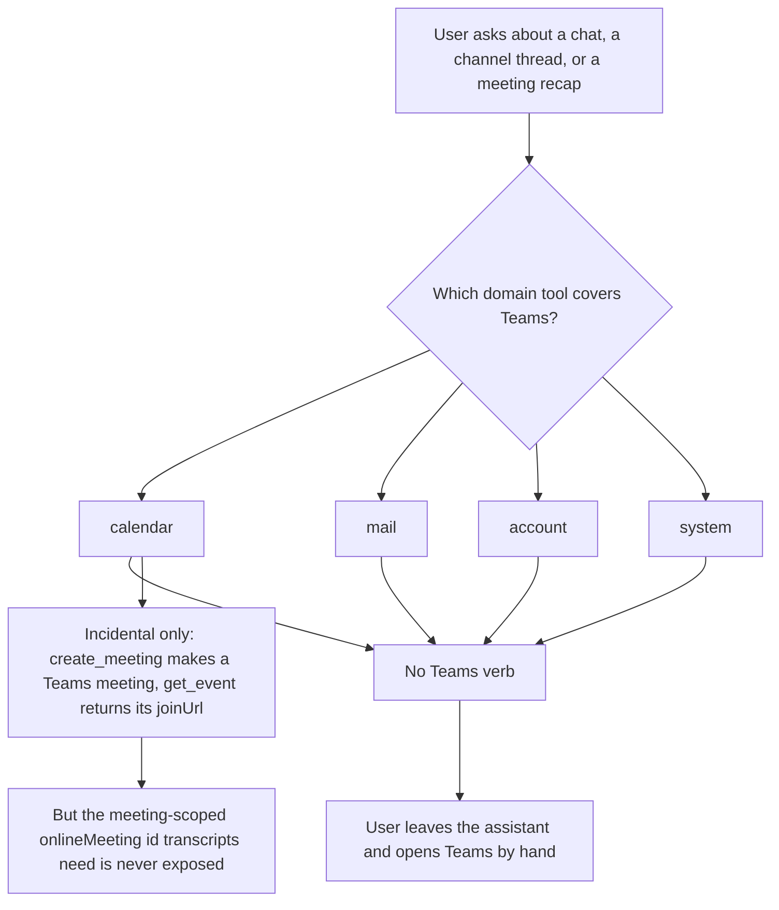
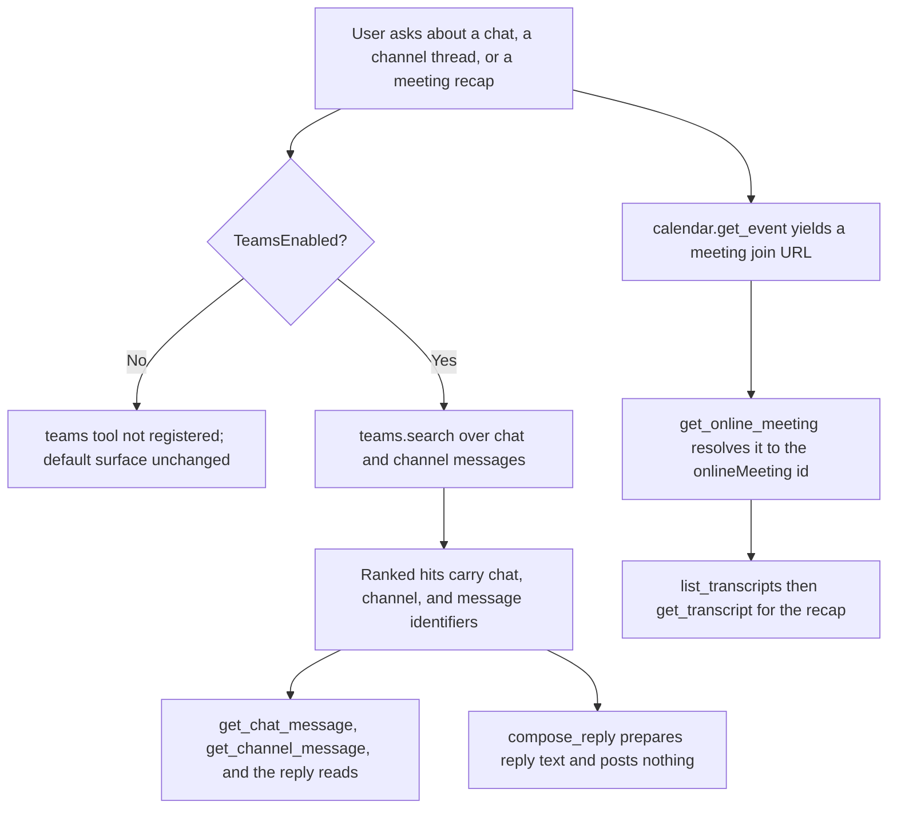
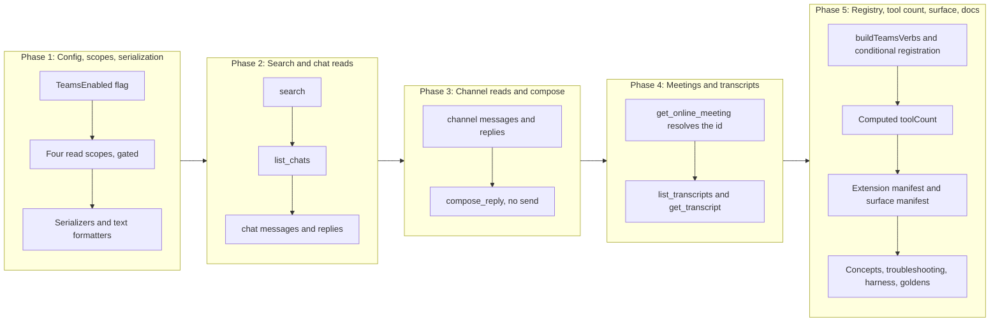

# Teams Domain: Message Read, Search, Draft Reply, and Transcripts

## Change Summary

The server exposes four aggregate domain tools: `calendar`, `mail`, `account`, and
`system`. It has no presence in Microsoft Teams at all. A user whose day spans mail,
calendar, and Teams can ask the assistant to search their mailbox and summarise their
calendar, and then must switch tools entirely to find a chat message, read a channel
thread, or recap a meeting from its transcript.

This change adds a new `teams` aggregate domain that supports reading Teams messages and
drafting answers to them, and nothing more. It is the search-first read surface for Teams
text: one Microsoft Search verb that ranks chat and channel messages together, the chat and
channel message reads that search resolves into, the reply reads that a threaded
conversation needs, one draft-only reply verb that reads the target message for context and
returns prepared reply text without ever posting it, and the online-meeting read plus
transcript reads that turn a meeting into a recap. Every verb either reads a Teams resource
or drafts reply text the user sends by hand; no verb writes, updates, deletes, or sends. The
draft-only `compose_reply` issues no write to Graph and requests no send scope, so the
domain crosses no send or destructive line.

This CR is the last in the current implementation sequence and follows CR-0082, which
adds the `contacts` domain. The two share a single governance consequence that neither
earlier mail or calendar change had to carry: they raise the aggregate tool count above
four. CR-0082 adds the fifth top-level tool (`contacts`); this CR adds the sixth
(`teams`). The tool-count baseline this CR measures against, and the cold-start schema
headroom it consumes, both depend on CR-0082 having landed first, so the ordering
dependency is stated explicitly and the schema-size gate is re-measured on the merged
baseline rather than assumed from this document's estimate. The fallback is benign: if
CR-0082 does not precede this CR, `teams` becomes the fifth tool rather than the sixth and
the manifest holds five entries rather than six, but the code is the same shape either way
because the tool count and the manifest assertion both derive from the domains actually
registered rather than a hardcoded number. The full fallback is stated under Dependencies.

## Motivation and Background

Teams is the one Microsoft 365 surface the assistant cannot see. The feature-gap matrix
records the whole Teams capability inventory at 57 rows, of which the product covers zero
and partially covers one. The matrix pre-fill rule that governs the in-scope slice reads:

> **Teams in scope**: message search, chat and channel message read and draft, text
> transcripts, and the meeting-id read they depend on.

with the standing constraint that

> Search and read paths expose reads only: a CR built from them **MUST NOT** expose
> update or delete.

The eight matrix rows in the "Teams text: read and draft" section carry `Manage=4`
(needs a CR); this is that CR. The remaining 49 Teams rows carry `Manage=3` (out of
scope), and this change introduces none of them: no presence, no recordings, no
attendance reports, no team or channel administration, no activity notifications, no
calls.

The value is concentrated in two workflows the assistant is already good at everywhere
else and cannot do here. The first is retrieval: "what did the team decide about X" is a
ranked search over chat and channel messages, exactly the shape of `mail.search_messages`
but against a store the product does not reach. The second is recap: an online meeting's
transcript is the raw material for the summary an assistant produces well, and there is no
verb to fetch it.

The safety cost is the point of the design. Microsoft Teams has no draft store: a chat or
channel message is either unsent text the caller holds or a posted message on the service,
with nothing in between. The mail domain's draft-only safety property, that the assistant
composes but a person sends, has no draft resource to hang on here, so it is preserved in
shape rather than by mechanism. This CR delivers reads plus a **draft-only** reply verb that
reads the target message for context and returns prepared reply text to the caller,
issuing no write to Graph and posting nothing. `compose_reply` is the draft half of the two
`Manage=4` reply rows, "chat message replies" and "reply to channel message"; the send half
of each stays out of scope. The send scopes stay unrequested, exactly as `Mail.Send` does
in the mail domain.

## Change Drivers

* The product has no Teams surface, so a cross-surface assistant loses the user entirely
  the moment a request touches a chat, a channel, or a meeting recap.
* Microsoft Search ranks chat and channel messages in one call
  (`POST /search/query` with `entityTypes: ["chatMessage"]`), which is the search-first
  read entry point the matrix names for Teams and the natural sibling of the mail and
  calendar search verbs.
* Meeting transcripts are the highest-leverage recap input an assistant can be handed, and
  they are keyed by the meeting-scoped `onlineMeeting` id, which the product does not
  currently expose even though `calendar.get_event` already surfaces the join URL.
* Teams has no draft store, so honouring the composes-but-does-not-send property requires a
  deliberate draft-only compose verb rather than a draft resource, and requires the send
  scopes to be left unrequested by construction.
* Adding a sixth aggregate tool crosses the cold-start schema budget that CR-0060
  established and every mail and calendar change since has stayed comfortably inside; the
  budget must be re-measured, not assumed, once a fifth and sixth tool exist.

## Current State

The server registers exactly four aggregate domain tools in `RegisterTools`
(`internal/server/server.go:53`), and hardcodes the count it logs:

```go
// Tool count: 4 aggregate domain tools (calendar, mail, account, system).
toolCount := 4
```

There is no `teams` domain, no Teams config flag, no Teams OAuth scope, and no Teams
handler anywhere under `internal/tools/`. The only adjacent coverage is incidental:
`calendar.create_meeting` provisions a Teams online meeting and `calendar.get_event`
returns its `joinUrl`, but the meeting-scoped `onlineMeeting` id that transcripts are keyed
by is never exposed (feature-gap matrix, "create online meeting" and "get / update /
delete online meeting" rows).

Measured facts about the surface as it stands, read from the repository at the source
commit rather than assumed:

* Four aggregate tools are registered, and `toolCount` is the literal `4`
  (`internal/server/server.go:188`).
* The cold-start schema for the four tools measures 16,753 bytes at the maximum feature
  configuration, a 77% reduction against the documented 74,000-byte pre-aggregation
  baseline, where the gate requires at least 60% (`internal/server/schema_size_test.go`;
  the 60% floor is `minRequiredReductionPct`, the baseline is `preCRBaselineBytes`). A 60%
  reduction corresponds to a ceiling of 29,600 bytes across all registered tools.
* `internal/auth/auth.go` requests `Calendars.ReadWrite` always, and one of `Mail.Read` or
  `Mail.ReadWrite` conditionally; it requests no Teams scope and has no branch that could.
* `extension/manifest.json` enumerates exactly four tools in its `tools` array.
* `site/src/generated/surface.json` records four domains.

### Current State Diagram



## Proposed Change

A new `teams` aggregate domain is registered when a new `TeamsEnabled` configuration flag
is set. It carries thirteen verbs: eleven read a Teams resource, one (`help`) renders the
registry, and one (`compose_reply`) drafts reply text without sending it. Every handler
lives in its own file under `internal/tools/`, mirroring the one-file-per-verb layout of
the mail domain.

The domain is registered **conditionally**: when `TeamsEnabled` is false (the default) the
tool is not registered at all, so the default cold-start surface is unchanged and no tool
appears whose every non-help verb would fail for lack of a scope. When `TeamsEnabled` is
true the tool and all thirteen verbs register, and the four Teams read scopes are requested
at authentication.

### Verb inventory

| Verb | Graph call (v1.0 GA) | Required parameters | Returns |
|---|---|---|---|
| `help` | none (registry render) | none | The domain's verb reference |
| `search` | `POST /search/query` with `entityTypes: ["chatMessage"]` | `query` | Ranked chat and channel message hits |
| `list_chats` | `GET /me/chats` | none | The signed-in user's chats |
| `list_chat_messages` | `GET /me/chats/{chat-id}/messages` | `chat_id` | Messages in a chat |
| `get_chat_message` | `GET /me/chats/{chat-id}/messages/{message-id}` | `chat_id`, `message_id` | One chat message (body preview by default) |
| `list_chat_message_replies` | `GET /me/chats/{chat-id}/messages/{message-id}/replies` | `chat_id`, `message_id` | Replies under a chat message |
| `list_channel_messages` | `GET /teams/{team-id}/channels/{channel-id}/messages` | `team_id`, `channel_id` | Top-level channel messages |
| `get_channel_message` | `GET /teams/{team-id}/channels/{channel-id}/messages/{message-id}` | `team_id`, `channel_id`, `message_id` | One channel message (body preview by default) |
| `list_channel_message_replies` | `GET /teams/{team-id}/channels/{channel-id}/messages/{message-id}/replies` | `team_id`, `channel_id`, `message_id` | Replies under a channel message |
| `compose_reply` | none written; reads the parent message only | `body`, plus the parent's identifiers | Prepared reply text; nothing is posted |
| `get_online_meeting` | `GET /me/onlineMeetings/{id}` or `GET /me/onlineMeetings?$filter=joinWebUrl eq '{url}'` | one of `meeting_id`, `join_web_url` | The online meeting, including the id transcripts are keyed by |
| `list_transcripts` | `GET /me/onlineMeetings/{meeting-id}/transcripts` | `meeting_id` | Transcript metadata for a meeting |
| `get_transcript` | `GET /me/onlineMeetings/{meeting-id}/transcripts/{transcript-id}` and its `/content` | `meeting_id`, `transcript_id` | Transcript metadata plus content (full WEBVTT under `output=raw`) |

The Graph SDK request builders behind each call, confirmed against the pinned
`github.com/microsoftgraph/msgraph-sdk-go v1.100.0` in the module cache by reading the
source, not the vendor's documentation:

* **Search**: `search.QueryRequestBuilder.Post` returns `QueryResponseable`
  (`search/query_request_builder.go:43`); the body carries a request whose
  `entityTypes` includes `models.CHATMESSAGE_ENTITYTYPE` (`models/entity_type.go`,
  constant `CHATMESSAGE_ENTITYTYPE`).
* **Chats**: `users.ItemChatsRequestBuilder.Get` returns a chat collection
  (`users/item_chats_request_builder.go:88`), which backs `list_chats`. Reading one chat's
  metadata (`users.ItemChatsChatItemRequestBuilder.Get`) is deliberately not exposed: the
  matrix marks "get / update chat" as `Manage=3`, so chat identity is resolved through
  `list_chats` rather than a single-chat read.
* **Chat messages**: `users.ItemChatsItemMessagesRequestBuilder.Get` returns a
  `ChatMessageCollectionResponseable` (`users/item_chats_item_messages_request_builder.go:90`);
  `users/item_chats_item_messages_chat_message_item_request_builder.go` reads one; and
  `users/item_chats_item_messages_item_replies_request_builder.go` reads its replies.
* **Channel messages**: `teams.ItemChannelsItemMessagesRequestBuilder.Get` returns a
  `ChatMessageCollectionResponseable`
  (`teams/item_channels_item_messages_request_builder.go:93`);
  `teams/item_channels_item_messages_chat_message_item_request_builder.go` reads one; and
  `teams/item_channels_item_messages_item_replies_request_builder.go` reads its replies.
* **Online meeting**: `users.ItemOnlineMeetingsOnlineMeetingItemRequestBuilder.Get`
  returns `OnlineMeetingable`
  (`users/item_online_meetings_online_meeting_item_request_builder.go:89`); the collection
  builder `users/item_online_meetings_request_builder.go` supports the `joinWebUrl`
  `$filter` used to resolve a meeting from its join URL.
* **Transcripts**: `users.ItemOnlineMeetingsItemTranscriptsRequestBuilder.Get` returns a
  `CallTranscriptCollectionResponseable`
  (`users/item_online_meetings_item_transcripts_request_builder.go:93`);
  `users/item_online_meetings_item_transcripts_call_transcript_item_request_builder.go`
  reads one transcript's metadata; and
  `users.ItemOnlineMeetingsItemTranscriptsItemContentRequestBuilder.Get` returns the
  content bytes (`users/item_online_meetings_item_transcripts_item_content_request_builder.go:73`).

Every endpoint above is a Microsoft Graph v1.0 GA path. None is drawn from the beta
endpoint, and the SDK builders cited are the generated v1.0 builders, not beta variants.

### Annotation matrix

Each verb declares all four hints explicitly, per the project rule that a verb cannot be
registered without its own classification and that the aggregate is computed from the
registry. Every verb in this domain is a read, so the matrix is uniform.

| Verb | `readOnlyHint` | `destructiveHint` | `idempotentHint` | `openWorldHint` |
|---|---|---|---|---|
| `help` | `true` | `false` | `true` | `false` |
| `search` | `true` | `false` | `true` | `true` |
| `list_chats` | `true` | `false` | `true` | `true` |
| `list_chat_messages` | `true` | `false` | `true` | `true` |
| `get_chat_message` | `true` | `false` | `true` | `true` |
| `list_chat_message_replies` | `true` | `false` | `true` | `true` |
| `list_channel_messages` | `true` | `false` | `true` | `true` |
| `get_channel_message` | `true` | `false` | `true` | `true` |
| `list_channel_message_replies` | `true` | `false` | `true` | `true` |
| `compose_reply` | `true` | `false` | `true` | `true` |
| `get_online_meeting` | `true` | `false` | `true` | `true` |
| `list_transcripts` | `true` | `false` | `true` | `true` |
| `get_transcript` | `true` | `false` | `true` | `true` |

Justification, hint by hint, because an unjustified hint is the defect the computed-fold
rule exists to prevent:

* **`readOnlyHint: true` for all thirteen.** Every verb either issues a Graph `GET` (or the
  `POST /search/query` retrieval, which reads and returns ranked results without mutating
  state) or, in the case of `compose_reply`, reads the parent message and returns computed
  text. No verb writes, deletes, or sends. `compose_reply` is read-only despite the word
  "reply" in its name precisely because it posts nothing: it is the draft-only substitute
  for a draft in a store that has no draft resource, and the classification is the load-
  bearing statement that it does not communicate.
* **`destructiveHint: false` for all thirteen.** A read removes nothing and makes nothing
  unaddressable. `compose_reply` produces text; it destroys nothing.
* **`idempotentHint: true` for all thirteen.** Repeating any call with identical arguments
  returns the same result and leaves the service in the same state. A ranked search may
  re-rank as the underlying corpus changes, but the call is still a side-effect-free
  retrieval, which is the property the hint reports.
* **`openWorldHint: true` for every verb except `help`.** Each contacts Microsoft Graph,
  including `compose_reply`, which reads the parent message to build a quoted reply.
  `help` renders the local registry and reaches no external system, so it is `false`, matching
  the `help` verb in every existing domain.

Because every verb is read-only, the conservative aggregate fold computed from the registry
publishes the `teams` tool as read-only, non-destructive, idempotent, and open-world. There
is no configuration under which a write verb raises the folded `destructiveHint` or lowers
the folded `readOnlyHint`, unlike the mail tool under `MailManageEnabled`.

### Output tiers and body escalation

The eleven resource-read verbs (`search`, `list_chats`, `list_chat_messages`,
`get_chat_message`, `list_chat_message_replies`, `list_channel_messages`,
`get_channel_message`, `list_channel_message_replies`, `get_online_meeting`,
`list_transcripts`, `get_transcript`) implement all three output tiers via the `output`
parameter, per the response-tiering rule, with a deliberate summary field set chosen per
verb by a dedicated serialization function rather than derived by filtering empty values.

Two verbs return potentially large content and therefore apply the body-escalation rule:

* `get_chat_message` and `get_channel_message` return a body **preview** by default, and
  their descriptions state that the full body requires `output=raw`.
* `get_transcript` returns transcript **metadata** and a short content preview by default;
  the full WEBVTT content, which can be large, is returned only under `output=raw`, and the
  description states this so the model decides from the preview whether the full fetch is
  warranted.

`compose_reply` returns prepared text unconditionally and declares **no** `output`
parameter. It is neither a Graph resource read (the tiered summary/raw serialization has no
resource to tier) nor a write (it returns text rather than a write confirmation, because it
changes nothing). It mirrors `help`, which is also read-only and tier-less. This is the one
verb whose tiering treatment a reviewer should confirm deliberately; the alternative,
giving it the three tiers over a synthetic "reply" resource, is recorded and rejected under
Alternative Approaches.

### Search-first, and how identifiers are resolved

The domain follows the search-first principle: a read flow resolves its target through
`search` and then acts by identifier. `search` returns ranked `chatMessage` hits carrying
the chat or channel and message identifiers a subsequent `get_*` verb consumes. The
transcript chain is a resolve-by-id sequence of its own: `calendar.get_event` yields a
meeting's join URL, `get_online_meeting` resolves that URL (or a supplied meeting id) to the
`onlineMeeting` and returns the meeting-scoped id, and `list_transcripts` and
`get_transcript` are keyed by that id.

Channel message reads require a `team_id` and a `channel_id`. Enumerating a user's joined
teams and a team's channels is out of scope (both carry `Manage=3` in the matrix), so those
identifiers are obtained from a `search` hit or supplied by the caller; the domain does not
add a teams-or-channels directory. This is a stated constraint, not an oversight, and it is
recorded in Scope Boundaries so a reviewer weighs it on the record.

### Proposed State Diagram



## Requirements

### Functional Requirements

1. The system **MUST** register a new aggregate domain tool named `teams`, dispatched by a
   required `operation` verb, exposing exactly the thirteen verbs named in the verb
   inventory and no others.
2. The `teams` tool **MUST** be registered only when a new `TeamsEnabled` configuration flag
   is set, and **MUST NOT** be registered at all when `TeamsEnabled` is false, so the
   default configuration's registered tool set and cold-start schema are unchanged by this
   change.
3. The system **MUST** add a `TeamsEnabled` boolean to the configuration, read from an
   environment variable, defaulting to false, following the shape of the existing
   `MailEnabled` flag.
4. When `TeamsEnabled` is true, the system **MUST** request the four delegated OAuth scopes
   `Chat.Read`, `ChannelMessage.Read.All`, `OnlineMeetings.Read`, and
   `OnlineMeetingTranscript.Read.All`, in addition to the scopes already requested, and
   **MUST NOT** request any of these when `TeamsEnabled` is false.
5. The system **MUST NOT**, in any configuration, request any Teams send or write scope,
   including `ChatMessage.Send`, `Chat.ReadWrite`, `ChannelMessage.Send`, and
   `Group.ReadWrite`. The read-only property of the domain is enforced at the scope layer,
   not only at the verb layer.
6. Every one of the thirteen verbs **MUST** declare all four annotation hints explicitly
   with the values given in the annotation matrix: `readOnlyHint` true, `destructiveHint`
   false, `idempotentHint` true, and `openWorldHint` true for every verb except `help`,
   whose `openWorldHint` is false.
7. No verb in the domain **MUST** write, update, delete, send, reply-and-send, or
   forward-and-send. `compose_reply` **MUST** read the target message for context, **MUST**
   return prepared reply text to the caller as a draft, and **MUST NOT** issue any Graph
   request that posts a message; its annotation and description **MUST** state the no-send
   property so the draft-only classification is disclosed rather than inferred.
8. `search` **MUST** issue `POST /search/query` with `entityTypes` set to `["chatMessage"]`,
   **MUST** require a non-empty `query`, and **MUST** return ranked chat and channel message
   hits carrying the identifiers a subsequent read verb consumes.
9. `list_chats`, `list_chat_messages`, `get_chat_message`, and `list_chat_message_replies`
   **MUST** read the signed-in user's chats and chat messages via the `/me/chats` request
   builders, requiring the identifiers named in the verb inventory and validating each with
   the shared resource-identifier validator before any Graph request is issued. Reading a
   single chat's metadata (`get / update chat`, `Manage=3`) **MUST NOT** be exposed; chat
   identity is resolved through `list_chats`.
10. `list_channel_messages`, `get_channel_message`, and `list_channel_message_replies`
    **MUST** read channel messages via the `/teams/{team-id}/channels/{channel-id}/messages`
    request builders, requiring `team_id` and `channel_id` (and `message_id` where the verb
    inventory states it) and validating each before any Graph request is issued.
11. `get_online_meeting` **MUST** accept either a `meeting_id` or a `join_web_url` (exactly
    one required), **MUST** resolve a supplied `join_web_url` via the `joinWebUrl` `$filter`
    on the online-meetings collection, and **MUST** return the meeting-scoped `onlineMeeting`
    identifier that `list_transcripts` and `get_transcript` are keyed by.
12. `list_transcripts` **MUST** require a `meeting_id` and return transcript metadata for
    that meeting. `get_transcript` **MUST** require a `meeting_id` and a `transcript_id`,
    return transcript metadata by default, and return the full WEBVTT content only under
    `output=raw`.
13. The eleven resource-read verbs **MUST** implement all three output tiers via the
    `output` parameter, with each summary field set chosen deliberately by a dedicated
    serialization function rather than derived by filtering empty values.
14. `get_chat_message`, `get_channel_message`, and `get_transcript` **MUST** return a
    content preview by default and **MUST** state in their descriptions that the full body
    or transcript content requires `output=raw`.
15. `compose_reply` **MUST NOT** declare an `output` parameter, **MUST** return prepared
    reply text unconditionally, and its description **MUST** state plainly that the text is
    not sent and that posting it is a manual action the user performs in Teams.
16. Every verb **MUST** be wrapped by the read middleware chain (authentication, account
    resolution, observability, audit) under the identity `teams.<verb>`, so the audit record
    and the OpenTelemetry attributes carry the same `{domain}.{operation}` identity as every
    other verb.
17. Every verb **MUST** carry a non-empty `Summary` of at most eighty characters, a
    non-empty `Description` stating its parameters and its annotation semantics, at least one
    `Examples` entry, and at least one `SeeDocs` reference resolving to an existing heading
    in the embedded documentation bundle.
18. Every error raised by a `teams` verb **MUST** carry a fix instruction naming what to
    supply or correct, and **MUST** reach both the tool result and the log record, so a
    headless caller that cannot read an interactive surface still receives the correction.
    The fix for a missing `team_id` or `channel_id` **MUST** name `teams.search` as the way
    to obtain them, and the fix for a missing `meeting_id` **MUST** name `get_online_meeting`
    resolving a `calendar.get_event` join URL.
19. The system **MUST** register the `teams` tool in `extension/manifest.json` as the sixth
    entry in the `tools` array, alongside the fifth (`contacts`) added by CR-0082,
    enumerating every registered `teams` verb in its description, so Claude Desktop discovers
    the domain. If CR-0082 has not landed, `teams` is the fifth entry instead; the manifest
    test asserts the entry count against the domains actually registered, not a fixed number.
20. The generated surface manifest `site/src/generated/surface.json` **MUST** be regenerated
    with `make surface-manifest` and committed in the same change, so the published website
    states the surface that exists, including the sixth domain and its verb and gate
    attribution.
21. The `toolCount` computed in `RegisterTools` **MUST** reflect the domains actually
    registered rather than a hardcoded literal, so the count is correct whether the `teams`
    tool is registered (`TeamsEnabled` true) or not (false), and correct alongside the
    `contacts` tool added by CR-0082.
22. The maximum-configuration cold-start schema-size gate `TestColdStartSchemaSize_Reduction`
    **MUST** be extended to set `TeamsEnabled` true, so the worst-case measurement includes
    the sixth tool, and the reduction it asserts **MUST** remain at or above 60% against the
    documented 74,000-byte baseline.
23. `docs/concepts.md` **MUST** gain a Teams gating and scope section documenting the
    `TeamsEnabled` flag, the four read scopes it requests, and the standing property that no
    Teams send scope is ever requested; the OAuth-scopes narrative **MUST** be updated to
    include the four Teams scopes as a gated addition.
24. `docs/prompts/mcp-tool-crud-test.md` **MUST** gain lifecycle steps exercising the
    `teams` read verbs, with a gated skip instruction that records them as skipped rather
    than failing when `TeamsEnabled` is off.
25. The four-tool narrative in the project's `CLAUDE.md` and in any user-facing document
    that enumerates the aggregate tools **MUST** be updated to describe the domains that now
    exist, so the documentation states five or six domains rather than four.
26. The change **MUST NOT** introduce any capability the matrix marks `Manage=3`: no send,
    no destructive delete, no automatic communication, no single-chat read or update, no
    chat creation, no folder or team or channel CRUD, no sync or delta, no interop, no
    photos, no directory, no presence, no recordings, and no attendance reports.

### Non-Functional Requirements

1. Each verb's handler **MUST** live in its own file under `internal/tools/`, named for the
   verb with a Teams-scoped hierarchical prefix, minimizing lines of code per file and
   mirroring the one-file-per-verb layout of the existing domains.
2. Every handler **MUST** route its Graph call through the shared retry and timeout helpers
   and **MUST** redact Graph errors with the existing helpers, so retry, timeout, and
   redaction behaviour is identical to the verbs already registered.
3. The maximum-configuration cold-start schema reduction **MUST** stay at or above 60%
   against the documented 74,000-byte baseline once the fifth (`contacts`) and sixth
   (`teams`) tools are both registered. This document estimates the total at roughly 24,000
   to 25,000 bytes (a reduction near 67%), but the estimate is not the gate: the assertion
   is graded by `TestColdStartSchemaSize_Reduction` measured on the merged baseline, and if
   the measured reduction falls below 60% the ceiling is published with its measurement
   chain and the governing budget is amended rather than the check quietly relaxed.
4. The `teams` tool's composed description **MUST** stay below the 4,000-character bound the
   description-length test asserts for every domain tool.
5. The change **MUST NOT** add a third-party dependency. Every request builder used is
   present in the already-pinned `github.com/microsoftgraph/msgraph-sdk-go v1.100.0`.
6. Each read verb **MUST** issue the minimum Graph requests its result requires: one request
   for a single-resource read or a collection page, and for `get_transcript` under
   `output=raw` one metadata read plus one content read. No verb **MUST** perform a read it
   does not use.
7. Every verb **MUST** be deterministic and side-effect-free at the service: repeating a
   call with identical arguments **MUST** return an equivalent result and **MUST NOT** alter
   any Teams resource.

## Affected Components

* `internal/tools/teams_search.go` (new): the `search` handler over `POST /search/query`.
* `internal/tools/teams_list_chats.go`, `teams_list_chat_messages.go`,
  `teams_get_chat_message.go`, `teams_list_chat_message_replies.go` (new): the chat reads.
* `internal/tools/teams_list_channel_messages.go`, `teams_get_channel_message.go`,
  `teams_list_channel_message_replies.go` (new): the channel reads.
* `internal/tools/teams_compose_reply.go` (new): the draft-only reply handler that reads the
  target message for context and posts nothing.
* `internal/tools/teams_get_online_meeting.go`, `teams_list_transcripts.go`,
  `teams_get_transcript.go` (new): the meeting and transcript reads.
* `internal/tools/teams_serialize.go` (new): the per-verb summary and raw serialization
  functions for chats, chat and channel messages, replies, online meetings, and transcripts.
* `internal/tools/teams_text_format.go` (new): the text formatters for the domain's read
  results and for the prepared `compose_reply` output.
* `internal/server/teams_verbs.go` (new): `buildTeamsVerbs`, constructing the ordered verb
  slice with `Summary`, `Description`, `Examples`, `SeeDocs`, `Annotations`, and `Schema`
  per the requirements, mirroring `buildMailVerbs` and living in the server package to avoid
  the import cycle the account and mail verb builders avoid the same way.
* `internal/server/server.go`: register the `teams` domain conditionally on `TeamsEnabled`,
  and compute `toolCount` from the domains actually registered rather than the literal `4`
  (FR-2, FR-21).
* `internal/config/config.go`: the `TeamsEnabled` field, its environment-variable name, and
  its default-false load logic (FR-3).
* `internal/auth/auth.go`: the four Teams read-scope constants and their conditional
  addition in `Scopes` when `TeamsEnabled` is true (FR-4), with `Mail.Send` and the Teams
  send scopes left unrequested (FR-5).
* `internal/server/schema_size_test.go`: set `TeamsEnabled` true in the maximum-config
  fixture so the sixth tool is measured (FR-22).
* `extension/manifest.json`: the sixth `tools` entry for `teams` enumerating its verbs
  (FR-19), alongside the fifth (`contacts`) from CR-0082, or the fifth entry if CR-0082 has
  not landed. The `long_description` feature list gains a Teams read line.
* `site/src/generated/surface.json`: regenerated, not hand-edited (FR-20).
* `docs/concepts.md`: the Teams gating and scope section and the OAuth-scopes update (FR-23).
* `docs/troubleshooting.md`: entries for an unresolvable meeting join URL and for a channel
  read missing its team or channel identifier, each with a stable anchor.
* `docs/prompts/mcp-tool-crud-test.md`: Teams lifecycle steps and their gated skip
  instruction (FR-24).
* `CLAUDE.md` and the README tool grid: the domain enumeration updated from four to the
  domains that now exist (FR-25).
* The committed verb-inventory and annotation golden tests in `internal/tools/`: regenerated
  to include the thirteen new `teams` identities with their hints.

## Scope Boundaries

### In Scope

* A new `teams` aggregate domain with the thirteen verbs named in the inventory: eleven
  reads, `help`, and the draft-only `compose_reply`.
* The `TeamsEnabled` config flag and the four delegated read scopes it gates.
* Conditional registration of the tool, and a `toolCount` computed from registered domains.
* The draft-only `compose_reply` verb that reads the target message for context, prepares
  reply text, and sends nothing: no `ChatMessage.Send` scope, no send scope of any kind, and
  no Graph write. It is the draft half of the `Manage=4` reply rows; the send half is out of
  scope.
* The body-escalation treatment of message bodies and transcript content.
* The extension manifest entry, the regenerated surface manifest, the concepts and
  troubleshooting documentation, the lifecycle harness steps, and the golden regenerations.

### Out of Scope ("Here, But Not Further")

* **Sending any Teams message.** The send half of the matrix rows "list / send channel
  message" and "send chat message", and the send half of "reply to channel message" and
  "chat message replies", are deferred to a future CR. Teams has no draft store, so under
  the no-send safety property this CR delivers only the read halves and the draft-only
  `compose_reply`, which is the draft half of the two reply rows and posts nothing.
  `ChatMessage.Send`, `Chat.ReadWrite`, `ChannelMessage.Send`, and `Group.ReadWrite` stay
  unrequested.
* **Creating a chat.** The "list / create chats" matrix row is implemented as its list half
  only. Creating a chat conversation is a write that this read-only domain does not perform.
* **Reading or updating a single chat.** The "get / update chat" matrix row carries
  `Manage=3` and is not exposed: there is no `get_chat` verb. A chat's identity is resolved
  through `list_chats`, and the message reads take the chat identifier from there or from a
  `search` hit. Renaming a chat's topic is the update half of the same row and is likewise
  out of scope.
* **Updating or deleting an online meeting.** The "get / update / delete online meeting" row
  is implemented as its read half only (`get_online_meeting`), to resolve the meeting id a
  transcript is keyed by. Update and delete are out of scope.
* **Enumerating teams and channels.** Listing a user's joined teams and a team's channels
  carry `Manage=3`. Channel reads require a `team_id` and `channel_id` obtained from a
  `search` hit or supplied by the caller; this domain adds no teams-or-channels directory.
* **Recordings and attendance reports.** The `onlineMeeting` recordings and attendance
  navigations exist in the SDK and are deliberately not exposed; both carry `Manage=3`.
* **Presence, activity notifications, calls, and all Teams administration.** Every one of
  the 49 `Manage=3` Teams rows is excluded, including presence, set-status, team and channel
  CRUD, app catalog, tags, shifts, and cloud-communications calls.
* **Message hosted contents and reactions.** Inline image retrieval and emoji reactions on
  chat and channel messages carry `Manage=3` and are not exposed.
* **Delta and sync.** The chat, channel, and transcript delta navigations are not exposed;
  incremental sync is an indexing concern outside an interactive assistant's scope.
* **Changing the mail, calendar, account, or system domains, the output-tier model, or the
  gating model beyond adding the `TeamsEnabled` flag.**

## Alternative Approaches Considered

* **Fold Teams verbs into the existing domains rather than add a sixth tool.** Rejected. A
  Teams chat is not a calendar or mail concept, and scattering Teams verbs across
  unrelated domains would break the `{domain}.{operation}` identity the audit and telemetry
  layers rely on and would confuse the operation enums of tools that have nothing to do with
  Teams. The aggregate-domain model exists precisely so a coherent capability becomes one
  tool.
* **Register the `teams` tool unconditionally with only `help` when `TeamsEnabled` is off**
  (the mail pattern). Rejected. Every non-help Teams verb needs a scope the base
  configuration does not request, so an always-present tool would advertise a domain whose
  every operation fails by default, and would spend default cold-start schema on a surface
  the user has not enabled. Conditional registration keeps the default surface unchanged and
  is the honest representation of a domain that is entirely opt-in.
* **Give `compose_reply` the three output tiers over a synthetic reply resource.** Rejected.
  There is no Graph resource to tier: the verb computes text. Tiering it would invent a
  fake resource shape to satisfy a rule written for real reads, and the summary and raw
  tiers would carry the same computed string. Returning text unconditionally, as `help`
  does, is the honest treatment; the classification stays read-only because the verb posts
  nothing.
* **Omit `compose_reply` and ship reads only.** Rejected. The matrix places chat and channel
  replies in scope, and the draft-only safety property the mail domain established is
  preserved here only if the assistant can compose a reply the user then sends. A pure-read
  domain would force the user to compose Teams replies with no assistant help at all, which
  is a capability gap the draft-only verb closes without crossing the no-send line.
* **Expose a `list_joined_teams` convenience so channel reads can discover their
  identifiers.** Rejected. That row is `Manage=3`, and pulling it in to make channel reads
  ergonomic would breach the matrix's out-of-scope decision. Search returns the identifiers,
  which keeps the domain search-first and inside its scope.
* **Request the broad `Chat.ReadWrite` scope now to avoid a second consent prompt when send
  ships.** Rejected outright. Requesting a write scope for a read-only domain is exactly the
  over-provisioning the no-send property forbids; the scope is requested when the capability
  that needs it ships, not before.

## Impact Assessment

### User Impact

A user who sets `TeamsEnabled` gains a Teams reading and recap surface: search across chat
and channel messages, read the threads search finds, prepare a reply the assistant drafts
and the user sends by hand, and turn a meeting into a summary from its transcript. Nothing
changes for a user who does not set it: the domain is not registered, no Teams scope is
requested, and the default tool surface is byte-identical.

The one behaviour a user must understand is that `compose_reply` does not send. Its
description and its returned text both state that posting is a manual step in Teams, so the
property is disclosed rather than discovered.

### Technical Impact

No breaking change and no schema migration. One new dependency-free config flag, four new
delegated read scopes requested only when that flag is set, and one new aggregate tool
registered only when that flag is set. The default configuration's published tool surface is
unchanged.

The consent surface changes only for a user who opts in: enabling `TeamsEnabled` adds
`Chat.Read`, `ChannelMessage.Read.All`, `OnlineMeetings.Read`, and
`OnlineMeetingTranscript.Read.All` to the requested scopes. No send or write scope is ever
requested.

The cold-start schema grows only at the maximum configuration, where the sixth tool is
measured. The reduction must stay at or above 60%; the estimate is a total near 24,000 to
25,000 bytes against a 29,600-byte ceiling, but the gate is the authority and is
re-measured on the merged CR-0082 plus CR-0083 baseline.

### Business Impact

Moderate value against a surface the product does not currently reach at all, delivered at
low risk: every verb is a read or a draft-only text producer, no verb sends or deletes,
and the send capability that carries the real risk is explicitly deferred with its scopes
unrequested.

## Implementation Approach

### Implementation Flow



### Phase 1: Config, scopes, and serialization foundations

Add the `TeamsEnabled` flag and its default-false load logic; add the four read-scope
constants and their conditional addition in `Scopes`; add the per-verb serializers and text
formatters both later phases depend on, so no handler invents its own. Assert at this phase
that no Teams send scope can be produced by `Scopes` in any configuration.

### Phase 2: Search and the chat reads

Build `search` over `POST /search/query` with `entityTypes: ["chatMessage"]`, then the five
chat reads against the `/me/chats` builders, each validating its identifiers before the
Graph call and routing through the shared retry, timeout, and redaction helpers.

### Phase 3: The channel reads and the draft-only reply

Build the three channel reads against the `/teams/{team-id}/channels/{channel-id}/messages`
builders, then `compose_reply`, which reads the parent message to build a quoted draft reply
and returns prepared text. `compose_reply` issues no posting request; a test asserts no write
request reaches the test server.

### Phase 4: The meeting and transcript reads

Build `get_online_meeting` accepting either a meeting id or a join URL (resolved via the
`joinWebUrl` `$filter`) and returning the meeting-scoped id; then `list_transcripts` and
`get_transcript`, with `get_transcript` returning metadata plus a content preview by default
and the full WEBVTT only under `output=raw`.

### Phase 5: Registry, tool count, surface, and documentation

Add `buildTeamsVerbs` and register the `teams` tool conditionally on `TeamsEnabled`; compute
`toolCount` from the registered domains; add the manifest entry (the sixth alongside the
`contacts` entry from CR-0082, or the fifth if CR-0082 has not landed); regenerate the
surface manifest; extend `schema_size_test.go` to set `TeamsEnabled`; write the concepts and
troubleshooting content and the lifecycle harness steps; update the domain enumeration in
`CLAUDE.md` and the README; and regenerate the verb-inventory and annotation goldens,
reviewing the delta, which must be exactly the thirteen added `teams` identities.

## Test Strategy

Handler tests follow the established read-verb pattern: an `httptest` server returning canned
Graph JSON behind a real SDK client, the client injected, the handler constructor called
directly, and assertions made as substring checks on the returned text and on the error
flag. No test issues a network call.

### Tests to Add

| Test File | Test Name | Description | Inputs | Expected Output |
|-----------|-----------|-------------|--------|-----------------|
| `internal/tools/teams_search_test.go` | `TestSearch_PostsChatMessageEntityType` | Search posts the chatMessage entity type | `query` | One POST observed; body carries `entityTypes: ["chatMessage"]`; hits carry identifiers |
| `internal/tools/teams_search_test.go` | `TestSearch_RequiresQuery` | An empty query is refused before the call | no `query` | Error naming `query`; no request issued |
| `internal/tools/teams_get_chat_message_test.go` | `TestGetChatMessage_BodyPreviewByDefault` | Body preview by default, full under raw | canned message with a long body | Default returns a preview and states `output=raw` for full; raw returns the full body |
| `internal/tools/teams_get_channel_message_test.go` | `TestGetChannelMessage_RequiresTeamAndChannel` | Channel reads require both identifiers | `message_id` only | Error naming `team_id` and `channel_id`, pointing at `teams.search`; no request issued |
| `internal/tools/teams_compose_reply_test.go` | `TestComposeReply_PostsNothing` | Draft-only reply issues no write | parent identifiers and `body` | Prepared text returned; no POST, PATCH, or send request reaches the server |
| `internal/tools/teams_compose_reply_test.go` | `TestComposeReply_StatesNotSent` | The output says it was not sent | valid inputs | Returned text and description both state the reply is not sent |
| `internal/tools/teams_compose_reply_test.go` | `TestComposeReply_DeclaresNoOutputParameter` | No output tier on the compose verb | the registered verb | The verb declares no `output` parameter |
| `internal/tools/teams_get_online_meeting_test.go` | `TestGetOnlineMeeting_ResolvesJoinURL` | A join URL resolves to a meeting id | `join_web_url` | The joinWebUrl filter is issued; the meeting id is returned |
| `internal/tools/teams_get_online_meeting_test.go` | `TestGetOnlineMeeting_RequiresOneIdentifier` | Exactly one identifier is required | neither id nor URL | Error naming both parameters and `calendar.get_event`; no request issued |
| `internal/tools/teams_get_transcript_test.go` | `TestGetTranscript_ContentOnlyUnderRaw` | Full WEBVTT only under raw | `output` default vs `raw` | Default returns metadata and a preview; raw fetches and returns content |
| `internal/tools/teams_read_verbs_test.go` | `TestEveryReadVerbValidatesIdentifiersBeforeCall` | Identifier validation precedes Graph across the domain | malformed identifiers against each read verb | Every call errors; no request reaches the server |
| `internal/tools/teams_read_verbs_test.go` | `TestReadVerbsHonourTimeoutAndRedaction` | Shared timeout and redaction behaviour | a hanging server and a token-bearing error | Timeout names the configured seconds; error is redacted and carries a fix |
| `internal/tools/teams_read_verbs_test.go` | `TestErrorFixReachesBothToolResultAndLog` | The fix instruction reaches both channels (FR-18, AC-11) | a channel read missing `team_id` and a transcript read missing `meeting_id`, captured with a test log handler | The tool result and the captured log record both carry the same fix, naming `teams.search` and `get_online_meeting` respectively |
| `internal/tools/teams_annotations_test.go` | `TestTeamsVerbAnnotations` | Every hint matches the uniform matrix | the teams registry | Every verb read-only, non-destructive, idempotent; open-world for all but `help` |
| `internal/tools/teams_annotations_test.go` | `TestTeamsAggregateFoldIsReadOnly` | The folded tool is read-only | the aggregate annotation | The teams tool publishes read-only, non-destructive, idempotent, open-world |
| `internal/server/teams_verbs_test.go` | `TestTeamsRegistersOnlyWhenEnabled` | Conditional registration | `TeamsEnabled` true then false | Present with thirteen verbs when true; absent when false |
| `internal/server/server_test.go` | `TestToolCount_ReflectsRegisteredDomains` | The count is computed, not literal | configs with and without teams and contacts | The logged count matches the registered domains |
| `internal/auth/auth_test.go` | `TestScopes_TeamsEnabled` | The four read scopes are requested when gated | `TeamsEnabled` true | The four Teams read scopes are present |
| `internal/auth/auth_test.go` | `TestScopes_NoTeamsSendEver` | No Teams send or write scope in any config | every configuration | None of `ChatMessage.Send`, `Chat.ReadWrite`, `ChannelMessage.Send`, `Group.ReadWrite` appears |
| `internal/config/config_test.go` | `TestLoadConfig_TeamsEnabledDefaultFalse` | The flag defaults false | unset env | `TeamsEnabled` is false |
| `internal/server/manifest_sync_test.go` | `TestManifestDescribesTeamsVerbs` | The manifest names every teams verb | the manifest and the registry | Every teams verb appears; the tools array holds one entry per registered domain (six with CR-0082 landed, five without) |

### Tests to Modify

| Test File | Test Name | Current Behavior | New Behavior | Reason for Change |
|-----------|-----------|------------------|--------------|-------------------|
| `internal/server/schema_size_test.go` | `TestColdStartSchemaSize_Reduction` | Enables mail flags only; measures four tools | Additionally enables `TeamsEnabled` (and the contacts flag from CR-0082); measures the sixth tool and asserts the reduction stays at or above 60% | The worst-case measurement must include every tool that can be registered |
| `internal/tools/dispatch_registry_test.go` | the verb-inventory golden | Holds the identities of the existing domains | Additionally holds the thirteen `teams` identities with their hints | The verb surface changes intentionally; the golden records that intent |
| `docs/prompts/mcp-tool-crud-test.md` | Lifecycle prompt steps | No Teams steps | Teams read steps with a gated skip instruction | The harness must exercise the verbs it now has and skip them coherently when the gate is off |

### Tests to Remove

Not applicable. No functionality is removed or superseded by this change.

### Existing Tests That Gate This Change Without Modification

These already exist and already derive their cases from the registry or the configuration,
so they grade several requirements without being touched. They are listed because a
requirement whose gate is invisible reads as ungraded.

| Test File | Test Name | Requirement it grades |
|-----------|-----------|-----------------------|
| `internal/tools/output_test.go` | `TestValidateOutputMode_Default`, `TestValidateOutputMode_Summary`, `TestValidateOutputMode_Raw`, `TestValidateOutputMode_Text`, `TestValidateOutputMode_Invalid` | FR-13: each of the eleven resource-read verbs honours the three output tiers through the shared `output` validator, and rejects an invalid mode |
| `internal/tools/verb_metadata_test.go` | `TestEveryVerbHasSummary`, `TestEveryVerbHasDescription`, `TestEveryVerbHasClassification`, `TestSeeDocsAnchorsResolve` | FR-17: every new `teams` verb carries a non-empty summary, a description, a four-hint classification, and a `SeeDocs` reference resolving to an existing embedded heading |
| `internal/tools/description_quality_test.go` | `TestEveryVerbStatesRequiredParameters`, `TestEveryParameterHasDescription` | FR-17: each `teams` verb's description states its required parameters and every parameter carries a description |
| `internal/tools/description_quality_test.go` | `TestDescriptionLengthBounded` | NFR-4: the composed `teams` description stays below 4,000 characters |
| `internal/surface/manifest_test.go` | `TestCommittedManifestMatchesRecord` | FR-20: the committed surface manifest matches the registry after regeneration |
| `internal/surface/surface_test.go` | `TestRecordCountsMatchBuiltVerbs`, `TestDefaultCountExcludesGatedVerbs`, `TestEveryVerbCarriesSummaryAndGate` | FR-20: the derived counts and gate attribution for the thirteen new verbs, with the whole domain excluded from the default count when `TeamsEnabled` is off |

## Acceptance Criteria

### AC-1: The teams domain registers only when enabled

```gherkin
Given a server configured with TeamsEnabled true
When the registered tools are listed
Then a teams tool is present whose operation enum contains the thirteen named verbs
Given instead a server with TeamsEnabled false
When the registered tools are listed
Then no teams tool is registered
  And the default tool set is unchanged from before this change
```

### AC-2: Search posts the chatMessage entity type and is search-first

```gherkin
Given TeamsEnabled and a non-empty query
When teams.search is called
Then a single POST to the search query endpoint is issued with entityTypes set to chatMessage
  And the ranked hits carry the chat, channel, and message identifiers a read verb consumes
Given instead an empty query
When teams.search is called
Then the call is rejected before any request is sent, naming the query parameter
```

### AC-3: Chat and channel messages read, with body escalation

```gherkin
Given a chat message with a long body
When teams.get_chat_message is called with the default output
Then a body preview is returned and the description states that the full body requires output raw
When the same verb is called with output raw
Then the full body is returned
Given a channel read missing its team or channel identifier
When the verb is called
Then it is rejected before any request, and the error names teams.search as the way to obtain the identifiers
```

### AC-4: The draft-only reply sends nothing

```gherkin
Given TeamsEnabled and a parent message with reply body text
When teams.compose_reply is called
Then prepared reply text is returned
  And no request that posts a message is issued to Microsoft Graph
  And the returned text and the verb description both state that the reply is not sent
  And the verb declares no output parameter
```

### AC-5: The transcript chain resolves by identifier

```gherkin
Given a meeting join URL from calendar.get_event
When teams.get_online_meeting is called with that join URL
Then the online meeting is resolved by its joinWebUrl and its meeting-scoped id is returned
When teams.list_transcripts is called with that meeting id
Then the meeting's transcripts are listed
When teams.get_transcript is called with the meeting id and a transcript id
Then transcript metadata and a content preview are returned by default
  And the full transcript content is returned only under output raw
```

### AC-6: Every verb is read-only, in the hints and in the scopes

```gherkin
Given the teams registry under TeamsEnabled
When each verb's four annotation hints are read
Then every verb is read-only, non-destructive, and idempotent
  And every verb except help is open-world
  And the folded teams tool is read-only, non-destructive, idempotent, and open-world
Given the requested OAuth scope set in every configuration
When it is computed
Then no Teams send or write scope is ever requested
```

### AC-7: The consent surface changes only on opt-in

```gherkin
Given a server with TeamsEnabled false
When the requested OAuth scope set is computed
Then it contains no Teams scope
Given instead TeamsEnabled true
When the scope set is computed
Then it additionally contains Chat.Read, ChannelMessage.Read.All, OnlineMeetings.Read, and OnlineMeetingTranscript.Read.All
  And it still contains no send or write scope
```

### AC-8: The tool count and the surface manifest reflect the sixth domain

```gherkin
Given the implemented change with TeamsEnabled true, alongside the contacts domain
When the tool registration completes
Then the logged tool count equals the number of domains actually registered
  And make ci regenerates and matches the committed surface manifest without modifying the working tree
  And the manifest and the extension manifest both enumerate every registered teams verb
```

### AC-9: The maximum-configuration schema gate still passes

```gherkin
Given the maximum feature configuration including TeamsEnabled and the contacts flag
When the cold-start schema is measured
Then the reduction against the documented baseline is at least sixty percent
  And no third-party dependency has been added
```

### AC-10: Registry metadata is complete for every teams verb

```gherkin
Given each of the thirteen teams verbs
When its registry entry is inspected
Then it carries a non-empty summary of at most eighty characters
  And a description stating its parameters and its annotation semantics
  And at least one example
  And at least one documentation reference resolving to an existing heading in the embedded bundle
```

### AC-11: Errors carry their correction on both channels

```gherkin
Given a channel read missing its team identifier, or a transcript read missing its meeting identifier
When the verb is called
Then the tool result names the correction, pointing at teams.search or get_online_meeting
  And the log record carries the same correction
```

### AC-12: No out-of-scope Teams capability is introduced

```gherkin
Given the implemented change
When the teams surface is reviewed against the feature-gap matrix
Then no capability marked out of scope is exposed
  And no send, delete, presence, recording, attendance, or administration verb exists
  And no get_chat verb exists, so the Manage=3 "get / update chat" capability is absent
  And no chat-creation verb exists
  And the send halves of the message rows and the update and delete of an online meeting are absent
```

## Quality Standards Compliance

### Build & Compilation

- [ ] Code compiles/builds without errors
- [ ] No new compiler warnings introduced

### Linting & Code Style

- [ ] All linter checks pass with zero warnings/errors
- [ ] Code follows project coding conventions and style guides
- [ ] Any linter exceptions are documented with justification

### Test Execution

- [ ] All existing tests pass after implementation
- [ ] All new tests pass, including under the race detector
- [ ] Test coverage meets project requirements for changed code

### Documentation

- [ ] Every new file carries a package-consistent doc comment and a single index annotation
- [ ] Every new verb's parameters and annotation semantics are documented in the registry, not in markdown
- [ ] The troubleshooting entries carry stable anchors
- [ ] The domain enumeration in CLAUDE.md and the README states the domains that now exist
- [ ] No governance identifier appears in source, test names, or user-facing documentation

## Risks and Mitigation

### Risk 1: The sixth aggregate tool pushes the cold-start schema past its budget

**Likelihood:** medium
**Impact:** medium
**Mitigation:** This change registers the sixth top-level tool, and the maximum-configuration
cold-start schema-size gate now spans six tools rather than four. The reduction must stay at
or above 60% against the documented 74,000-byte baseline, a ceiling of 29,600 bytes across
every registered tool. This document estimates the six-tool total near 24,000 to 25,000
bytes (a reduction near 67%), but the estimate is not the authority: the gate is measured,
not assumed. `TestColdStartSchemaSize_Reduction` (`internal/server/schema_size_test.go`) is
extended to set `TeamsEnabled` true (alongside the CR-0082 contacts flag) so the worst case
includes the sixth tool, and the assertion is graded on the merged baseline. If the measured
reduction falls below 60%, the ceiling is published with its measurement chain and the
governing budget is amended rather than the check quietly relaxed. AC-9 grades this.

### Risk 2: CR-0082 does not land first, so the sixth-tool baseline is wrong

**Likelihood:** medium
**Impact:** low
**Mitigation:** This CR is last in the current sequence and assumes CR-0082 has added the
`contacts` domain as the fifth tool, so `teams` is the sixth and the schema headroom is
measured against a five-tool baseline. The dependency is stated explicitly. The fallback is
benign because nothing in this change hardcodes the number six: `toolCount` is computed from
the domains actually registered (FR-21), the manifest and surface-manifest tests assert the
entry count against the registered domains rather than a literal, and the schema gate is
measured on whatever baseline is merged. If CR-0082 has not landed, `teams` becomes the
fifth tool and the manifest holds five entries rather than six; the code is the same shape
either way. The ordering dependency and its fallback are recorded under Dependencies so a
reviewer can weigh the sequence risk on the record.

### Risk 3: The draft-only `compose_reply` verb is mistaken for a send capability

**Likelihood:** medium
**Impact:** high
**Mitigation:** The word "reply" in the verb name invites the reading that it communicates,
and Teams has no draft store to make the composes-but-does-not-send property self-evident
the way the mail domain's Drafts folder does. The property is therefore enforced at two
layers rather than asserted once. At the verb layer, `compose_reply` reads the parent
message for context and returns prepared text, issuing no Graph request that posts a message;
its `readOnlyHint` is `true` and its description states plainly that the text is not sent and
that posting is a manual action the user performs in Teams (FR-7, FR-15). At the scope layer,
no send scope of any kind, and specifically `ChatMessage.Send`, is ever requested in any
configuration (FR-5), so even a defect in the handler cannot post. A handler test asserts no
POST, PATCH, or send request reaches the test server, and the annotation and scope tests
assert the read-only classification and the absence of every send scope. AC-4 and AC-6
grade this.

### Risk 4: The four new delegated read scopes surprise a user at consent

**Likelihood:** low
**Impact:** medium
**Mitigation:** Enabling `TeamsEnabled` adds four delegated read scopes to the consent
prompt: `Chat.Read`, `ChannelMessage.Read.All`, `OnlineMeetings.Read`, and
`OnlineMeetingTranscript.Read.All`. The change is opt-in and disclosed. When `TeamsEnabled`
is false (the default) none of the four is requested and the consent surface is
byte-identical to today (FR-4). The four are read scopes only; no Teams send or write scope
is ever requested, which is asserted across every configuration by
`TestScopes_NoTeamsSendEver`. The Teams gating and scope section added to `docs/concepts.md`
documents the flag, the four scopes it requests, and the standing property that no send
scope is ever requested, so a user reads the consequence before enabling the flag rather
than discovering it at the prompt. AC-7 grades the opt-in consent change.

## Dependencies

* No new third-party dependency. Every request builder is present in the already-pinned
  `github.com/microsoftgraph/msgraph-sdk-go v1.100.0`, confirmed by reading the module cache
  rather than the vendor's documentation.
* Four new delegated OAuth read scopes, requested only when `TeamsEnabled` is set.
* **Ordering dependency on CR-0082.** This CR is the last in the current sequence and follows
  CR-0082, which adds the `contacts` domain as the fifth tool. The tool-count baseline
  (`teams` as the sixth tool) and the cold-start schema headroom this change consumes both
  assume CR-0082 has landed. If this CR were to land first, `teams` would be the fifth tool
  and `toolCount` would move from four to five rather than five to six; the code change is
  the same shape either way because `toolCount` is computed from the registered domains, and
  the schema-size gate is measured on whatever baseline is merged rather than assumed here.
* Builds on the verb registry and dispatch model, the computed annotation fold, the
  registry-owned documentation rule, and the generated surface manifest and its drift check,
  all established by earlier completed change requests.

## Estimated Effort

| Phase | Effort |
|---|---|
| Phase 1, config flag, four gated read scopes, serializers, and text formatters | 3 hours |
| Phase 2, search and the five chat reads with their tests | 4 to 5 hours |
| Phase 3, the three channel reads and the draft-only compose_reply with their tests | 4 hours |
| Phase 4, get_online_meeting resolution and the two transcript reads with their tests | 3 to 4 hours |
| Phase 5, registry, computed tool count, extension and surface manifests, docs, harness, goldens | 4 hours |
| Total | 18 to 20 hours |

## Decision Outcome

Chosen approach: "a new `teams` aggregate domain of thirteen verbs, eleven reads plus
`help` plus a draft-only `compose_reply`, registered conditionally on a new `TeamsEnabled`
flag, requesting four delegated read scopes and no send scope, each verb in its own handler
file." It gives Teams a coherent capability of its own tool rather than scattering Teams
concepts across unrelated domains, keeps every path read-only in both the annotation hints
and the requested scopes, and preserves the mail domain's composes-but-does-not-send safety
property in a store that has no draft resource by making the no-send property structural: a
verb that issues no Graph write and a scope set that requests no send capability.

The alternative of folding Teams verbs into the existing domains was rejected because a
Teams chat is not a mail or calendar concept and the fold would break the
`{domain}.{operation}` audit and telemetry identity. Registering the tool unconditionally
with only `help` when disabled (the mail pattern) was rejected because every non-help Teams
verb needs a scope the base configuration does not request, so an always-present tool would
advertise a domain whose every operation fails by default and would spend default cold-start
schema on a surface the user has not enabled. Omitting `compose_reply` and shipping reads
only was rejected because it would force the user to compose Teams replies with no assistant
help at all, a gap the draft-only verb closes without crossing the no-send line. Giving
`compose_reply` the three output tiers over a synthetic reply resource was rejected because
there is no Graph resource to tier; returning text unconditionally, as `help` does, is the
honest treatment. Each rejection is recorded in full under Alternative Approaches Considered.

## Open Questions

Each item below records an assumption made so the change request could be written without
blocking. Each is the smallest reasonable choice, and each is stated here so a reviewer can
overturn it rather than discover it in the diff.

1. **Ordering after CR-0082.** Assumed that CR-0082 lands first and `teams` is the sixth
   tool. The counter-case, this CR landing first with `teams` as the fifth tool, is coherent
   and costs nothing, because `toolCount` is computed and the manifest and schema assertions
   derive from the registered domains rather than a fixed number. The fallback is recorded
   under Dependencies.
2. **The `TeamsEnabled` gate rather than reusing an existing flag.** Assumed a dedicated
   boolean mirroring `MailEnabled`, defaulting false. A reviewer who prefers gating Teams
   behind a broader capability flag can say so; the dedicated flag keeps the opt-in surface
   explicit and the default configuration byte-identical.
3. **`compose_reply` declares no `output` parameter.** Assumed, mirroring `help`, because the
   verb computes text rather than reading a Graph resource to tier. The alternative of three
   tiers over a synthetic reply resource is recorded and rejected under Alternative
   Approaches Considered.
4. **No `get_chat` verb.** Assumed, because "get / update chat" carries `Manage=3` and chat
   identity is resolved through `list_chats` or a `search` hit. The annotation matrix's
   Manage=3 boundary keeps single-chat read out of scope; a reviewer who wants it must route
   it through its own change request.
5. **The `/me/onlineMeetings` navigation for transcripts.** Assumed the user-scoped online
   meeting and transcript builders, resolving a meeting from the `joinWebUrl` a
   `calendar.get_event` already surfaces. An application-scoped or organizer-scoped path is
   the alternative and is not used here.
6. **Target version 0.15.0.** Assumed from the sequence position after CR-0082. The released
   version at the source commit is earlier, so the target is a placeholder to be reconciled
   at release-planning time rather than a commitment.

## Related Items

* Implements the eight `Manage=4` rows of the feature-gap matrix's "Teams text: read and
  draft" section, honouring every `Manage=3` decision in the matrix's Teams sections.
* Follows CR-0082 (`contacts` domain) in the implementation sequence and shares its
  tool-count and cold-start-schema governance consequence.
* Preserves the drafts-only, composes-but-does-not-send safety property that the mail domain
  established, adapting it to a store that has no draft resource via the draft-only
  `compose_reply` verb, which reads the target message for context and posts nothing.

## More Information

The retrieval half of this domain is the part that already has a proven shape. `search`
issues `POST /search/query` with `entityTypes` set to `["chatMessage"]`, which ranks chat
and channel messages together in one call, exactly the search-first entry point the mail and
calendar search verbs established. The hits carry the chat, channel, and message identifiers
a subsequent `get_*` verb consumes, so a read flow resolves its target through `search` and
then acts by identifier rather than enumerating teams and channels, both of which carry
`Manage=3` and are deliberately not added.

The two parts worth reading twice are the transcript chain and the no-send property. The
transcript chain is a resolve-by-id sequence: `calendar.get_event` already surfaces a
meeting's join URL, `get_online_meeting` resolves that URL (or a supplied meeting id) via the
`joinWebUrl` `$filter` on the online-meetings collection and returns the meeting-scoped
`onlineMeeting` id, and `list_transcripts` and `get_transcript` are keyed by that id. That id
is the one thing the product does not currently expose even though it already provisions
Teams meetings and returns their join URLs, which is why exposing the read half of the online
meeting is a prerequisite for a transcript recap rather than a convenience.

The no-send property is structural, not asserted. Microsoft Teams has no draft store: a chat
or channel message is either unsent text the caller holds or a posted message on the service,
with nothing between. The mail domain's composes-but-does-not-send safety property has no
draft resource to hang on here, so it is preserved in shape rather than by mechanism.
`compose_reply` reads the parent message for context and returns prepared reply text,
issuing no write to Graph, and the send scopes stay unrequested by construction, exactly as
`Mail.Send` does in the mail domain. The verb is the draft half of the two `Manage=4` reply
rows, "chat message replies" and "reply to channel message"; the send half of each stays out
of scope with its scopes unrequested until the capability that needs them ships.
