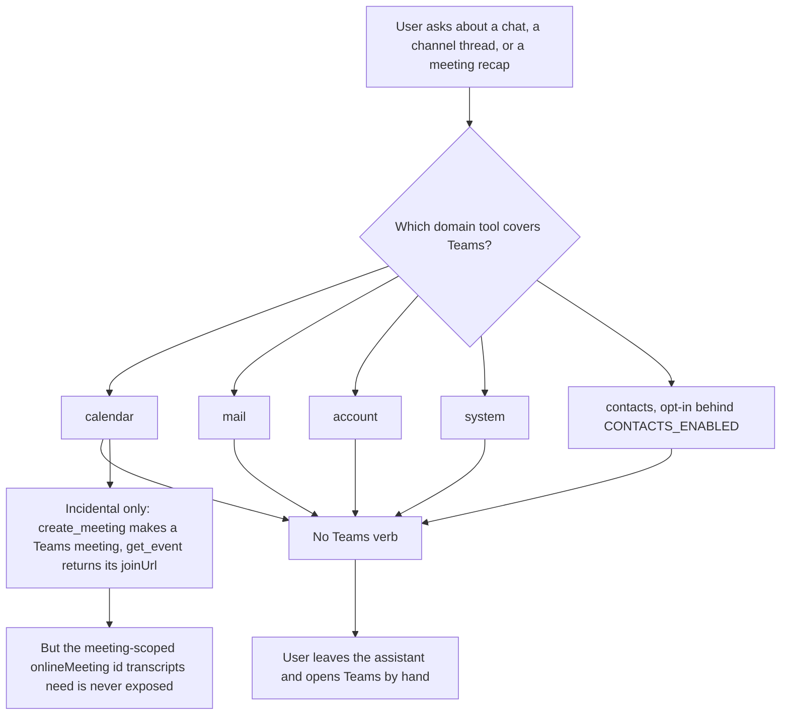
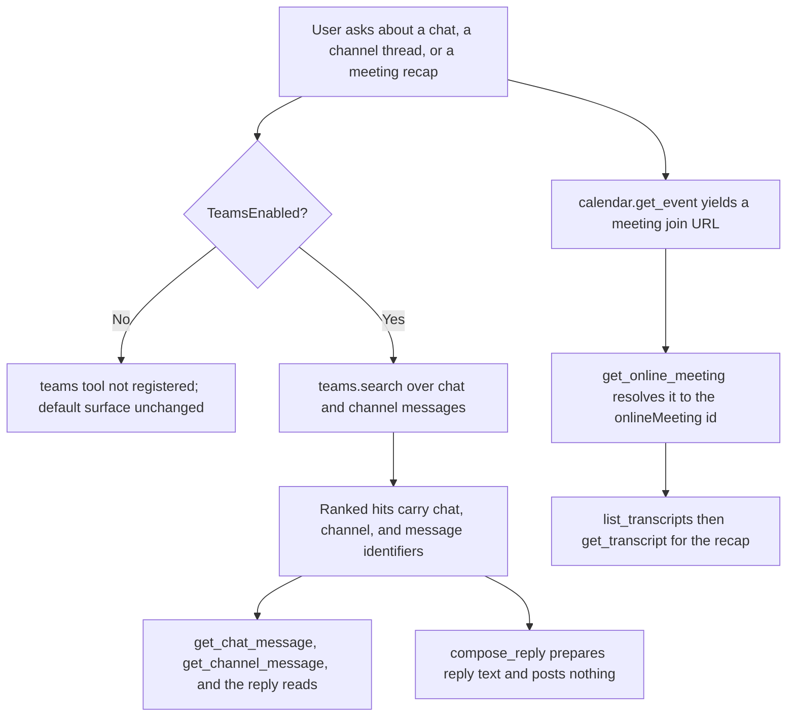
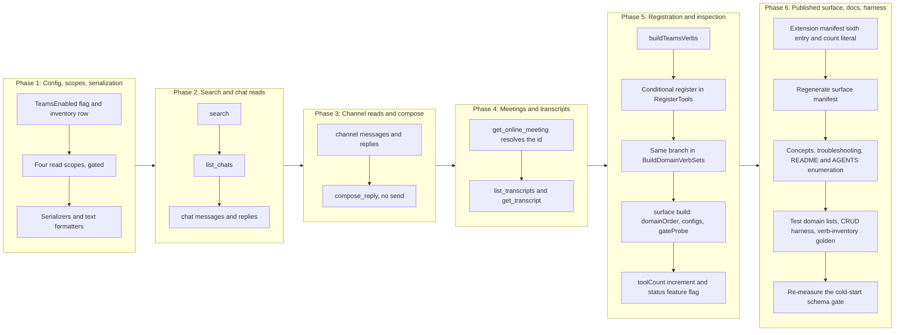

# Teams Domain: Message Read, Search, Draft Reply, and Transcripts

## Change Summary

The server exposes four aggregate domain tools by default (`calendar`, `mail`, `account`,
`system`) plus an opt-in fifth, `contacts`, registered only when
`OUTLOOK_MCP_CONTACTS_ENABLED` is set. It has no presence in Microsoft Teams at all. A user
whose day spans mail, calendar, and Teams can ask the assistant to search their mailbox and
summarise their calendar, and then must switch tools entirely to find a chat message, read a
channel thread, or recap a meeting from its transcript.

This change adds a new `teams` aggregate domain that supports reading Teams messages and
drafting answers to them, and nothing more. It is the search-first read surface for Teams
text: one Microsoft Search verb that ranks chat and channel messages together, the chat and
channel message reads that search resolves into, the reply reads that a threaded
conversation needs, one draft-only reply verb that reads the target message for context and
returns prepared reply text without ever posting it, and the online-meeting read plus
transcript reads that turn a meeting into a recap. Every verb either reads a Teams resource
or drafts reply text the user sends by hand; no verb writes, updates, deletes, or sends. The
draft-only `compose_reply` issues no write to Graph and requests no send scope, so the
domain crosses no send or destructive line.

This CR is the last in the current implementation sequence and follows CR-0082, which added
the `contacts` domain. **CR-0082 has landed** (branch `docs/cr-implementation-set-0079-0083`,
commit `85c6450`), so the ordering question this document was authored under is settled:
`contacts` is the fifth top-level tool and `teams` is unambiguously the sixth. Every
"five or six" hedge that assumed the ordering might invert has been removed; the requirements
and acceptance criteria below state six.

The two changes share a single governance consequence that neither earlier mail nor calendar
change had to carry: they raise the aggregate tool count above four, and they consume the
cold-start schema headroom that CR-0060 established. That headroom is now the binding
constraint on this change rather than a formality, and the measured numbers are in Current
State and in Risk 1.

## Motivation and Background

Teams is the one Microsoft 365 surface the assistant cannot see. The feature-gap matrix
records the whole Teams capability inventory at 57 rows, of which the product covers zero
and partially covers one. The matrix pre-fill rule that governs the in-scope slice reads:

> **Teams in scope**: message search, chat and channel message read and draft, text
> transcripts, and the meeting-id read they depend on.

with the standing constraint that

> Search and read paths expose reads only: a CR built from them **MUST NOT** expose
> update or delete.

The eight matrix rows in the "Teams text: read and draft" section carry `Manage=4`
(needs a CR); this is that CR. The remaining 49 Teams rows carry `Manage=3` (out of
scope), and this change introduces none of them: no presence, no recordings, no
attendance reports, no team or channel administration, no activity notifications, no
calls.

The value is concentrated in two workflows the assistant is already good at everywhere
else and cannot do here. The first is retrieval: "what did the team decide about X" is a
ranked search over chat and channel messages, exactly the shape of `mail.search_messages`
but against a store the product does not reach. The second is recap: an online meeting's
transcript is the raw material for the summary an assistant produces well, and there is no
verb to fetch it.

The safety cost is the point of the design. Microsoft Teams has no draft store: a chat or
channel message is either unsent text the caller holds or a posted message on the service,
with nothing in between. The mail domain's draft-only safety property, that the assistant
composes but a person sends, has no draft resource to hang on here, so it is preserved in
shape rather than by mechanism. This CR delivers reads plus a **draft-only** reply verb that
reads the target message for context and returns prepared reply text to the caller,
issuing no write to Graph and posting nothing. `compose_reply` is the draft half of the two
`Manage=4` reply rows, "chat message replies" and "reply to channel message"; the send half
of each stays out of scope. The send scopes stay unrequested, exactly as `Mail.Send` does
in the mail domain.

## Change Drivers

* The product has no Teams surface, so a cross-surface assistant loses the user entirely
  the moment a request touches a chat, a channel, or a meeting recap.
* Microsoft Search ranks chat and channel messages in one call
  (`POST /search/query` with `entityTypes: ["chatMessage"]`), which is the search-first
  read entry point the matrix names for Teams and the natural sibling of the mail and
  calendar search verbs.
* Meeting transcripts are the highest-leverage recap input an assistant can be handed, and
  they are keyed by the meeting-scoped `onlineMeeting` id, which the product does not
  currently expose even though `calendar.get_event` already surfaces the join URL.
* Teams has no draft store, so honouring the composes-but-does-not-send property requires a
  deliberate draft-only compose verb rather than a draft resource, and requires the send
  scopes to be left unrequested by construction.
* Adding a sixth aggregate tool consumes what is left of the cold-start schema budget that
  CR-0060 established. Earlier mail and calendar changes stayed comfortably inside it; at the
  current five-tool maximum configuration the measured margin is 6,139 bytes, which a
  thirteen-verb domain very nearly exhausts. The budget is therefore re-measured on the
  merged baseline rather than assumed, and the measurement is the deciding fact of this
  change, not a formality.

## Current State

`RegisterTools` (`internal/server/server.go:53`) registers four aggregate domain tools
unconditionally and a fifth, `contacts`, behind `cfg.ContactsEnabled`. The count it logs is a
base literal incremented per conditionally registered domain
(`internal/server/server.go:205`):

```go
toolCount := 4
if cfg.ContactsEnabled {
    // ... buildContactsVerbs, RegisterDomainTool ...
    toolCount++
}

slog.Info("tool registration complete", "tools", toolCount)
```

There is no `teams` domain, no Teams config flag, no Teams OAuth scope, and no Teams
handler anywhere under `internal/tools/`. The only adjacent coverage is incidental:
`calendar.create_meeting` provisions a Teams online meeting and `calendar.get_event`
returns its `joinUrl`, but the meeting-scoped `onlineMeeting` id that transcripts are keyed
by is never exposed (feature-gap matrix, "create online meeting" and "get / update /
delete online meeting" rows).

Measured facts about the surface as it stands, read from the repository at commit `85c6450`
rather than assumed:

* Five aggregate tools can be registered: `calendar`, `mail`, `account`, `system`, and the
  opt-in `contacts`. `toolCount` is the literal `4` plus one increment inside the
  `ContactsEnabled` branch (`internal/server/server.go:205`, `:225`).
* The verb surface is 57 verbs at the full configuration and 38 at the default one:
  calendar 20/20, mail 18/5, account 7/7, system 7/6, contacts 5/0
  (`site/src/generated/surface.json`).
* **The cold-start schema for the five tools measures 23,461 bytes at the maximum feature
  configuration, a 68% reduction** against the documented 74,000-byte pre-aggregation
  baseline, where the gate requires at least 60% (`internal/server/schema_size_test.go`;
  the 60% floor is `minRequiredReductionPct`, the baseline is `preCRBaselineBytes`). A 60%
  reduction corresponds to a ceiling of 29,600 bytes across all registered tools, so the
  **remaining headroom is 6,139 bytes**. Per tool at that configuration: calendar 9,156
  (20 verbs), mail 7,816 (18), system 2,257 (7), contacts 2,160 (5), account 2,072 (7).
  The marginal cost of a read verb measures 432 bytes (contacts) to 458 bytes (calendar).
* `internal/auth/auth.go` requests `Calendars.ReadWrite` always, one of `Mail.Read` or
  `Mail.ReadWrite` conditionally, and `Contacts.Read` plus `People.Read` when
  `ContactsEnabled` is set; it requests no Teams scope and has no branch that could.
* `extension/manifest.json` enumerates exactly five tools in its `tools` array, and
  `TestManifestDescribesEveryRegisteredVerb` (`internal/server/manifest_sync_test.go:87`)
  asserts that count as the **literal** `5` at line 90, not as a value derived from the
  registered domains.
* `site/src/generated/surface.json` records five domains, and `internal/surface/build.go`
  names them in a fixed `domainOrder` slice (line 22) with matching `fullConfig`,
  `defaultConfig`, and `gateProbes` entries.
* `internal/tools/` imports exactly two `msgraph-sdk-go` packages today, `models` and
  `users`. Nothing in `internal/` reaches `client.Search()`, `client.Teams()`,
  `Me().Chats()`, or `Me().OnlineMeetings()`.

### Current State Diagram



## Proposed Change

A new `teams` aggregate domain is registered when a new `TeamsEnabled` configuration flag
is set. It carries thirteen verbs: eleven read a Teams resource, one (`help`) renders the
registry, and one (`compose_reply`) drafts reply text without sending it. Every handler
lives in its own file under `internal/tools/`, mirroring the one-file-per-verb layout of
the mail domain.

The domain is registered **conditionally**: when `TeamsEnabled` is false (the default) the
tool is not registered at all, so the default cold-start surface is unchanged and no tool
appears whose every non-help verb would fail for lack of a scope. When `TeamsEnabled` is
true the tool and all thirteen verbs register, and the four Teams read scopes are requested
at authentication.

### Verb inventory

| Verb | Graph call (v1.0 GA) | Required parameters | Returns |
|---|---|---|---|
| `help` | none (registry render) | none | The domain's verb reference |
| `search` | `POST /search/query` with `entityTypes: ["chatMessage"]` | `query` | Ranked chat and channel message hits |
| `list_chats` | `GET /me/chats` | none | The signed-in user's chats |
| `list_chat_messages` | `GET /me/chats/{chat-id}/messages` | `chat_id` | Messages in a chat |
| `get_chat_message` | `GET /me/chats/{chat-id}/messages/{message-id}` | `chat_id`, `message_id` | One chat message (body preview by default) |
| `list_chat_message_replies` | `GET /me/chats/{chat-id}/messages/{message-id}/replies` | `chat_id`, `message_id` | Replies under a chat message |
| `list_channel_messages` | `GET /teams/{team-id}/channels/{channel-id}/messages` | `team_id`, `channel_id` | Top-level channel messages |
| `get_channel_message` | `GET /teams/{team-id}/channels/{channel-id}/messages/{message-id}` | `team_id`, `channel_id`, `message_id` | One channel message (body preview by default) |
| `list_channel_message_replies` | `GET /teams/{team-id}/channels/{channel-id}/messages/{message-id}/replies` | `team_id`, `channel_id`, `message_id` | Replies under a channel message |
| `compose_reply` | none written; reads the parent message only | `body`, plus the parent's identifiers | Prepared reply text; nothing is posted |
| `get_online_meeting` | `GET /me/onlineMeetings/{id}` or `GET /me/onlineMeetings?$filter=joinWebUrl eq '{url}'` | one of `meeting_id`, `join_web_url` | The online meeting, including the id transcripts are keyed by |
| `list_transcripts` | `GET /me/onlineMeetings/{meeting-id}/transcripts` | `meeting_id` | Transcript metadata for a meeting |
| `get_transcript` | `GET /me/onlineMeetings/{meeting-id}/transcripts/{transcript-id}` and its `/content` | `meeting_id`, `transcript_id` | Transcript metadata plus content (full WEBVTT under `output=raw`) |

The Graph SDK request builders behind each call, confirmed against the pinned
`github.com/microsoftgraph/msgraph-sdk-go v1.100.0` in the module cache by reading the
source, not the vendor's documentation. Every path, symbol, return type, and line number
below was re-verified at review time and is accurate:

* **Search**: `search.QueryRequestBuilder.PostAsQueryPostResponse` returns
  `QueryPostResponseable` (`search/query_request_builder.go:66`). The sibling
  `Post` (`search/query_request_builder.go:43`) posts the same body to the same endpoint but
  carries a `Deprecated` marker, so it fails `make lint` under staticcheck and is not used.
  The body type is `search.QueryPostRequestBodyable`
  (`search/query_post_request_body.go:121`), which lives in the **`search` package, not
  `models`**; the entity type it carries is `models.CHATMESSAGE_ENTITYTYPE`
  (`models/entity_type.go:17`, whose `String()` is `"chatMessage"`). The accessor chain is
  `client.Search().Query().PostAsQueryPostResponse(ctx, body, nil)`
  (`GraphBaseServiceClient.Search()` at `graph_base_service_client.go:411`,
  `SearchRequestBuilder.Query()` at `search/search_request_builder.go:110`).
* **Chats**: `users.ItemChatsRequestBuilder.Get` returns `models.ChatCollectionResponseable`
  (`users/item_chats_request_builder.go:88`), which backs `list_chats`. Reading one chat's
  metadata (`users.ItemChatsChatItemRequestBuilder.Get`,
  `users/item_chats_chat_item_request_builder.go:87`) is deliberately not exposed: the
  matrix marks "get / update chat" as `Manage=3`, so chat identity is resolved through
  `list_chats` rather than a single-chat read.
* **Chat messages**: `users.ItemChatsItemMessagesRequestBuilder.Get` returns
  `models.ChatMessageCollectionResponseable`
  (`users/item_chats_item_messages_request_builder.go:90`);
  `users/item_chats_item_messages_chat_message_item_request_builder.go:79` reads one
  (`models.ChatMessageable`); and
  `users/item_chats_item_messages_item_replies_request_builder.go:90` reads its replies
  (`models.ChatMessageCollectionResponseable`).
* **Channel messages**: `teams.ItemChannelsItemMessagesRequestBuilder.Get` returns
  `models.ChatMessageCollectionResponseable`
  (`teams/item_channels_item_messages_request_builder.go:93`);
  `teams/item_channels_item_messages_chat_message_item_request_builder.go:82` reads one; and
  `teams/item_channels_item_messages_item_replies_request_builder.go:93` reads its replies.
  The accessor chain is
  `client.Teams().ByTeamId(t).Channels().ByChannelId(c).Messages()`
  (`GraphBaseServiceClient.Teams()` at `graph_base_service_client.go:461`).
* **Online meeting**: `users.ItemOnlineMeetingsOnlineMeetingItemRequestBuilder.Get`
  returns `models.OnlineMeetingable`
  (`users/item_online_meetings_online_meeting_item_request_builder.go:89`); the collection
  builder `users/item_online_meetings_request_builder.go:90` returns
  `models.OnlineMeetingCollectionResponseable` and its query parameters expose
  `Filter *string` (`ItemOnlineMeetingsRequestBuilderGetQueryParameters`, line 24), which is
  the `joinWebUrl` `$filter` used to resolve a meeting from its join URL.
* **Transcripts**: `users.ItemOnlineMeetingsItemTranscriptsRequestBuilder.Get` returns
  `models.CallTranscriptCollectionResponseable`
  (`users/item_online_meetings_item_transcripts_request_builder.go:93`);
  `users/item_online_meetings_item_transcripts_call_transcript_item_request_builder.go:87`
  reads one transcript's metadata (`models.CallTranscriptable`); and
  `users.ItemOnlineMeetingsItemTranscriptsItemContentRequestBuilder.Get` returns `[]byte`
  (`users/item_online_meetings_item_transcripts_item_content_request_builder.go:73`).

Two consequences of the above that the implementation must plan for:

* **`client.Me()` returns `*users.UserItemRequestBuilder`** (`graph_service_client.go:65`),
  so the same `users.Item*` builders serve `/me` and `/users/{id}`; there is no separate `me`
  package. Both accessors this domain needs exist on it: `Chats()`
  (`users/user_item_request_builder.go:104`) and `OnlineMeetings()` (`:359`). The call shapes
  are `client.Me().Chats().ByChatId(id).Messages().Get(...)` and
  `client.Me().OnlineMeetings().ByOnlineMeetingId(id).Transcripts().ByCallTranscriptId(tid).Content().Get(...)`,
  which is the shape every existing handler in `internal/tools/` already uses.
* **The `/me/onlineMeetings` collection GET is only served when filtered** on `joinWebUrl` or
  `videoTeleconferenceId`. That is a Microsoft Graph service contract, not an SDK limitation,
  and it cannot be confirmed from the module cache. It means `get_online_meeting` has no
  unfiltered list path, which is consistent with FR-11 requiring exactly one of `meeting_id`
  or `join_web_url`, and it is why no `list_online_meetings` verb exists.

Every endpoint above is a Microsoft Graph v1.0 GA path. None is drawn from the beta
endpoint, and the SDK builders cited are the generated v1.0 builders, not beta variants.
The change adds no module, but it does add two new SDK **package** imports to
`internal/tools/`, `msgraph-sdk-go/search` and `msgraph-sdk-go/teams`, alongside the `models`
and `users` packages already imported.

### Annotation matrix

Each verb declares all four hints explicitly, per the project rule that a verb cannot be
registered without its own classification and that the aggregate is computed from the
registry. Every verb in this domain is a read, so the matrix is uniform.

| Verb | `readOnlyHint` | `destructiveHint` | `idempotentHint` | `openWorldHint` |
|---|---|---|---|---|
| `help` | `true` | `false` | `true` | `false` |
| `search` | `true` | `false` | `true` | `true` |
| `list_chats` | `true` | `false` | `true` | `true` |
| `list_chat_messages` | `true` | `false` | `true` | `true` |
| `get_chat_message` | `true` | `false` | `true` | `true` |
| `list_chat_message_replies` | `true` | `false` | `true` | `true` |
| `list_channel_messages` | `true` | `false` | `true` | `true` |
| `get_channel_message` | `true` | `false` | `true` | `true` |
| `list_channel_message_replies` | `true` | `false` | `true` | `true` |
| `compose_reply` | `true` | `false` | `true` | `true` |
| `get_online_meeting` | `true` | `false` | `true` | `true` |
| `list_transcripts` | `true` | `false` | `true` | `true` |
| `get_transcript` | `true` | `false` | `true` | `true` |

Justification, hint by hint, because an unjustified hint is the defect the computed-fold
rule exists to prevent:

* **`readOnlyHint: true` for all thirteen.** Every verb either issues a Graph `GET` (or the
  `POST /search/query` retrieval, which reads and returns ranked results without mutating
  state) or, in the case of `compose_reply`, reads the parent message and returns computed
  text. No verb writes, deletes, or sends. `compose_reply` is read-only despite the word
  "reply" in its name precisely because it posts nothing: it is the draft-only substitute
  for a draft in a store that has no draft resource, and the classification is the load-
  bearing statement that it does not communicate.
* **`destructiveHint: false` for all thirteen.** A read removes nothing and makes nothing
  unaddressable. `compose_reply` produces text; it destroys nothing.
* **`idempotentHint: true` for all thirteen.** Repeating any call with identical arguments
  returns the same result and leaves the service in the same state. A ranked search can
  re-rank as the underlying corpus changes, but the call is still a side-effect-free
  retrieval, which is the property the hint reports.
* **`openWorldHint: true` for every verb except `help`.** Each contacts Microsoft Graph,
  including `compose_reply`, which reads the parent message to build a quoted reply.
  `help` renders the local registry and reaches no external system, so it is `false`, matching
  the `help` verb in every existing domain.

Because every verb is read-only, the conservative aggregate fold computed from the registry
publishes the `teams` tool as read-only, non-destructive, idempotent, and open-world. There
is no configuration under which a write verb raises the folded `destructiveHint` or lowers
the folded `readOnlyHint`, unlike the mail tool under `MailManageEnabled`.

### Output tiers and body escalation

The eleven resource-read verbs (`search`, `list_chats`, `list_chat_messages`,
`get_chat_message`, `list_chat_message_replies`, `list_channel_messages`,
`get_channel_message`, `list_channel_message_replies`, `get_online_meeting`,
`list_transcripts`, `get_transcript`) implement all three output tiers via the `output`
parameter, per the response-tiering rule, with a deliberate summary field set chosen per
verb by a dedicated serialization function rather than derived by filtering empty values.

Two verbs return potentially large content and therefore apply the body-escalation rule:

* `get_chat_message` and `get_channel_message` return a body **preview** by default, and
  their descriptions state that the full body requires `output=raw`.
* `get_transcript` returns transcript **metadata** and a short content preview by default;
  the full WEBVTT content, which can be large, is returned only under `output=raw`, and the
  description states this so the model decides from the preview whether the full fetch is
  warranted.

  Unlike a mail `bodyPreview`, which Graph supplies as a field on the same response, a
  `callTranscript` carries no preview field: the preview can only be produced from the
  content bytes. `get_transcript` therefore issues the **same two requests in every mode**,
  one metadata read and one content read, and truncates the content to a preview unless
  `output=raw` is given. The escalation this verb offers is over the size of the returned
  text, not over the number of Graph requests. NFR-6 is written to match.

`compose_reply` returns prepared text unconditionally and declares **no** `output`
parameter. It is neither a Graph resource read (the tiered summary/raw serialization has no
resource to tier) nor a write (it returns text rather than a write confirmation, because it
changes nothing). It mirrors `help`, which is also read-only and tier-less. The alternative,
giving it the three tiers over a synthetic "reply" resource, is recorded and rejected under
Alternative Approaches, and this treatment was confirmed at review: it does not collide with
`TestWriteVerbsDeclareNoOutputParameter`
(`internal/tools/verb_metadata_test.go:357`), which selects only verbs whose `readOnlyHint`
is false and therefore never sees `compose_reply`. The positive half of the rule, that the
eleven resource reads each **do** declare an `output` parameter, has no existing check and is
graded by the new `TestEveryTeamsReadVerbDeclaresOutput` (FR-13).

### Search-first, and how identifiers are resolved

The domain follows the search-first principle: a read flow resolves its target through
`search` and then acts by identifier. `search` returns ranked `chatMessage` hits carrying
the chat or channel and message identifiers a subsequent `get_*` verb consumes. The
transcript chain is a resolve-by-id sequence of its own: `calendar.get_event` yields a
meeting's join URL, `get_online_meeting` resolves that URL (or a supplied meeting id) to the
`onlineMeeting` and returns the meeting-scoped id, and `list_transcripts` and
`get_transcript` are keyed by that id.

Channel message reads require a `team_id` and a `channel_id`. Enumerating a user's joined
teams and a team's channels is out of scope (both carry `Manage=3` in the matrix), so those
identifiers are obtained from a `search` hit or supplied by the caller; the domain does not
add a teams-or-channels directory. This is a stated constraint, not an oversight, and it is
recorded in Scope Boundaries so a reviewer weighs it on the record.

### Proposed State Diagram



## Requirements

### Functional Requirements

1. The system **MUST** register a new aggregate domain tool named `teams`, dispatched by a
   required `operation` verb, exposing exactly the thirteen verbs named in the verb
   inventory and no others.
2. The `teams` tool **MUST** be registered only when a new `TeamsEnabled` configuration flag
   is set, and **MUST NOT** be registered at all when `TeamsEnabled` is false, so the
   default configuration's registered tool set and cold-start schema are unchanged by this
   change. The identical condition **MUST** also gate the `teams` entry in
   `BuildDomainVerbSets` (`internal/server/introspect_verbs.go`), because a domain registered
   only in `RegisterTools` is invisible to the surface generator and to the manifest-sync
   check; that file's own doc comment states this coupling and it **MUST** be kept true.
3. The system **MUST** add a `TeamsEnabled` boolean to `config.Config`, read from the
   environment variable `OUTLOOK_MCP_TEAMS_ENABLED`, defaulting to false, following the shape
   of the existing `ContactsEnabled` flag and implying no other flag. The variable **MUST**
   also be added as an `EnvTeamsEnabled` constant and an `inventory` row in
   `internal/config/inventory.go`, so it reaches the surface manifest's `config` section and
   the site's configuration reference.
4. When `TeamsEnabled` is true, the system **MUST** request the four delegated OAuth scopes
   `Chat.Read`, `ChannelMessage.Read.All`, `OnlineMeetings.Read`, and
   `OnlineMeetingTranscript.Read.All`, in addition to the scopes already requested, and
   **MUST NOT** request any of these when `TeamsEnabled` is false.
5. The system **MUST NOT**, in any configuration, request any Teams send or write scope,
   including `ChatMessage.Send`, `Chat.ReadWrite`, `ChannelMessage.Send`, and
   `Group.ReadWrite`. The read-only property of the domain is enforced at the scope layer,
   not only at the verb layer.
6. Every one of the thirteen verbs **MUST** declare all four annotation hints explicitly
   with the values given in the annotation matrix: `readOnlyHint` true, `destructiveHint`
   false, `idempotentHint` true, and `openWorldHint` true for every verb except `help`,
   whose `openWorldHint` is false.
7. Every verb in the domain **MUST NOT** write, update, delete, send, reply-and-send, or
   forward-and-send. `compose_reply` **MUST** read the target message for context, **MUST**
   return prepared reply text to the caller as a draft, and **MUST NOT** issue any Graph
   request that posts a message; its annotation and description **MUST** state the no-send
   property so the draft-only classification is disclosed rather than inferred.
8. `search` **MUST** issue `POST /search/query` with `entityTypes` set to `["chatMessage"]`,
   **MUST** require a non-empty `query`, and **MUST** return ranked chat and channel message
   hits carrying the identifiers a subsequent read verb consumes.
9. `list_chats`, `list_chat_messages`, `get_chat_message`, and `list_chat_message_replies`
   **MUST** read the signed-in user's chats and chat messages via the `/me/chats` request
   builders, requiring the identifiers named in the verb inventory and validating each with
   the shared resource-identifier validator before any Graph request is issued. Reading a
   single chat's metadata (`get / update chat`, `Manage=3`) **MUST NOT** be exposed; chat
   identity is resolved through `list_chats`.
10. `list_channel_messages`, `get_channel_message`, and `list_channel_message_replies`
    **MUST** read channel messages via the `/teams/{team-id}/channels/{channel-id}/messages`
    request builders, requiring `team_id` and `channel_id` (and `message_id` where the verb
    inventory states it) and validating each before any Graph request is issued.
11. `get_online_meeting` **MUST** accept either a `meeting_id` or a `join_web_url`, **MUST**
    require exactly one of the two and **MUST** reject a call supplying neither or both
    before any Graph request is issued, **MUST** resolve a supplied `join_web_url` via the
    `joinWebUrl` `$filter` on the online-meetings collection, and **MUST** return the
    meeting-scoped `onlineMeeting` identifier that `list_transcripts` and `get_transcript`
    are keyed by. The verb **MUST NOT** offer an unfiltered list of online meetings, because
    the Graph service serves that collection only when filtered on `joinWebUrl` or
    `videoTeleconferenceId`.
12. `list_transcripts` **MUST** require a `meeting_id` and return transcript metadata for
    that meeting. `get_transcript` **MUST** require a `meeting_id` and a `transcript_id`, and
    **MUST** return transcript metadata plus a truncated content preview by default and the
    full WEBVTT content only under `output=raw`.
13. The eleven resource-read verbs **MUST** implement all three output tiers via the
    `output` parameter, with each summary field set chosen deliberately by a dedicated
    serialization function rather than derived by filtering empty values. Each of the eleven
    **MUST** declare an `output` parameter in its schema, and this **MUST** be asserted by a
    check that derives its cases from the registry rather than from a written list of verb
    names.
14. `get_chat_message`, `get_channel_message`, and `get_transcript` **MUST** return a
    content preview by default and **MUST** state in their descriptions that the full body
    or transcript content requires `output=raw`.
15. `compose_reply` **MUST NOT** declare an `output` parameter, **MUST** return prepared
    reply text unconditionally, and its description **MUST** state plainly that the text is
    not sent and that posting it is a manual action the user performs in Teams.
16. Every verb **MUST** be wrapped by the read middleware chain (authentication, account
    resolution, observability, audit) under the identity `teams.<verb>`, so the audit record
    and the OpenTelemetry attributes carry the same `{domain}.{operation}` identity as every
    other verb.
17. Every verb **MUST** carry a non-empty `Summary` of at most eighty characters, a
    non-empty `Description` stating its parameters and its annotation semantics, at least one
    `Examples` entry, and at least one `SeeDocs` reference resolving to an existing heading
    in the embedded documentation bundle.
18. Every error raised by a `teams` verb **MUST** carry a fix instruction naming what to
    supply or correct, and **MUST** reach both the tool result and the log record, so a
    headless caller that cannot read an interactive surface still receives the correction.
    The fix for a missing `team_id` or `channel_id` **MUST** name `teams.search` as the way
    to obtain them, and the fix for a missing `meeting_id` **MUST** name `get_online_meeting`
    resolving a `calendar.get_event` join URL.
19. The system **MUST** register the `teams` tool in `extension/manifest.json` as the sixth
    entry in the `tools` array, alongside the fifth (`contacts`) added by CR-0082,
    enumerating every registered `teams` verb in its description, so Claude Desktop discovers
    the domain. `TestManifestDescribesEveryRegisteredVerb`
    (`internal/server/manifest_sync_test.go:87`) asserts the entry count as the **literal**
    `5` at line 90; that literal **MUST** be changed to `6`, and `maximalSurfaceConfig`
    (line 68) **MUST** gain `TeamsEnabled: true`, or the check will both fail on the count
    and silently skip every `teams` verb. The `long_description` feature list **MUST** gain a
    Teams read line.
20. The generated surface manifest `site/src/generated/surface.json` **MUST** be regenerated
    with `make surface-manifest` and committed in the same change, so the published website
    states the surface that exists, including the sixth domain and its verb and gate
    attribution. For the generator to see the domain at all, `internal/surface/build.go`
    **MUST** gain `"teams"` in `domainOrder`, `TeamsEnabled: true` in `fullConfig`,
    `TeamsEnabled: false` in `defaultConfig`, and a `gateProbe` keyed on
    `config.EnvTeamsEnabled`; without the probe the thirteen verbs are recorded with no gate
    attribution.
21. The `toolCount` logged by `RegisterTools` **MUST** equal the number of tools actually
    registered in every configuration. This **MUST** be achieved by incrementing `toolCount`
    inside the `TeamsEnabled` branch, exactly as the `ContactsEnabled` branch does
    (`internal/server/server.go:225`); the base literal and the per-domain increment are the
    established pattern and **MUST NOT** be refactored into a derived count by this change,
    which does not otherwise own that code.
22. The maximum-configuration cold-start schema-size gate `TestColdStartSchemaSize_Reduction`
    (`internal/server/schema_size_test.go`) **MUST** be extended to set `TeamsEnabled` true
    in its `cfg` literal, so the worst-case measurement includes the sixth tool, and the
    reduction it asserts **MUST** remain at or above 60% against the documented 74,000-byte
    baseline. If the measured reduction falls below 60%, the implementation **MUST NOT**
    lower `minRequiredReductionPct`; NFR-3 states the required response.
23. `docs/concepts.md` **MUST** gain a Teams gating and scope section documenting the
    `TeamsEnabled` flag, the four read scopes it requests, and the standing property that no
    Teams send scope is ever requested; the "OAuth scopes used per feature" table **MUST**
    gain the two `OUTLOOK_MCP_TEAMS_ENABLED` rows; and the "Contacts gating" and "Tool
    annotation semantics" sections, which currently state "four aggregate tools" and "the
    fifth aggregate tool", **MUST** be updated so no statement of the tool set is left stale.
24. `docs/prompts/mcp-tool-crud-test.md` **MUST** gain lifecycle steps (numbered from Step 52,
    the existing prompt ending at Step 51) exercising the `teams` read verbs, with a gated
    skip instruction keyed on `config.features.teams_enabled` from Step 0c that records them
    as skipped rather than failing when `TeamsEnabled` is off, following the Step 47 contacts
    precedent. In the same change, `scripts/crud-test.sh` **MUST** gain an `mcp_teams` CSV
    column, an awk bucket, and a jq argument, and `docs/bench/crud-runs.csv` **MUST** have its
    header updated with historical rows reset, per the harness-maintenance rule in
    `AGENTS.md`.
25. Every statement of the aggregate tool set **MUST** be updated to describe the domains that
    now exist, in documentation and in the source that generates user-facing text. The files
    that carry such a statement today are `AGENTS.md:82` (to which `CLAUDE.md` is a symlink),
    `README.md:35`, `docs/readme.md:44`, `docs/quickstart.md`, `docs/concepts.md`,
    `docs/troubleshooting.md:229`, `docs/reference/architecture.md:5` and `:521`,
    `extension/README.md`, `internal/docs/llmstxt.go:69` and `:153` (which generates the
    published `llms.txt`, so a stale statement there reaches a reader as fact),
    `internal/tools/aggregate_annotations.go:6`, and the doc comment in
    `site/src/surface.ts:37`. `site/src/surface.ts`'s `domainCount` (line 82) is already
    derived from the generated manifest and **MUST NOT** be replaced by a literal.
26. The change **MUST NOT** introduce any capability the matrix marks `Manage=3`: no send,
    no destructive delete, no automatic communication, no single-chat read or update, no
    chat creation, no folder or team or channel CRUD, no sync or delta, no interop, no
    photos, no directory, no presence, no recordings, and no attendance reports.
27. `system.status` **MUST** report the flag as `config.features.teams_enabled`, by adding a
    `TeamsEnabled bool` field with that JSON tag to `statusConfigFeatures`
    (`internal/tools/status.go:221`) and populating it from `cfg.TeamsEnabled` (beside line
    334). FR-24's skip instruction has nothing to key on without it.

### Non-Functional Requirements

1. Each verb's handler **MUST** live in its own file under `internal/tools/`, named for the
   verb with a Teams-scoped hierarchical prefix, minimizing lines of code per file and
   mirroring the one-file-per-verb layout of the existing domains. The domain's text
   formatters are the one exception and **MUST** be appended to the shared
   `internal/tools/text_format.go`, per the rule in `AGENTS.md` that text formatters live in
   that file and per the contacts precedent (`FormatContactMatchesText`, `FormatPeopleText`,
   `FormatContactDetailText`, `FormatPersonDetailText`, `internal/tools/text_format.go:1056`
   onward). No `teams_text_format.go` is created.
2. Every handler **MUST** route its Graph call through the shared retry and timeout helpers
   and **MUST** redact Graph errors with the existing helpers, so retry, timeout, and
   redaction behaviour is identical to the verbs already registered.
3. The maximum-configuration cold-start schema reduction **MUST** stay at or above 60%
   against the documented 74,000-byte baseline once the fifth (`contacts`) and sixth
   (`teams`) tools are both registered, which is a ceiling of 29,600 bytes across every
   registered tool.

   **This is the binding constraint of the change, and the margin is thin.** Measured at
   commit `85c6450`, the five-tool maximum configuration is 23,461 bytes (68% reduction),
   leaving 6,139 bytes of headroom. The measured marginal cost of a read verb in this
   codebase is 432 bytes (contacts, 2,160 bytes over 5 verbs) to 458 bytes (calendar, 9,156
   over 20). Thirteen `teams` verbs therefore project to 5,600 to 6,000 bytes, a projected
   total of 29,100 to 29,500 bytes and a reduction of 60% to 61%. The projection sits inside
   the ceiling by roughly one verb's worth of schema, so a verb whose description or
   parameter set runs long can push the measurement below the floor.

   The projection is not the gate. `TestColdStartSchemaSize_Reduction` measured on the merged
   baseline is, and the implementation **MUST** treat its result as authoritative. Two
   responses are permitted when it goes red, and lowering `minRequiredReductionPct` is
   neither of them:

   1. Reduce the schema the domain contributes: shorten verb descriptions and parameter
      descriptions to the shortest wording that still satisfies FR-17, and re-measure.
   2. If the ceiling is genuinely unreachable at thirteen verbs, publish the measured ceiling
      with its full measurement chain (per-tool byte counts and the per-verb rate above),
      state what would have to change to move it, and amend the governing budget in CR-0060
      in this same change. A bare relaxation of the constant is a defect.
4. The `teams` tool's composed description **MUST** stay below the 4,000-character bound the
   description-length test asserts for every domain tool.
5. The change **MUST NOT** add a third-party dependency and **MUST NOT** change `go.mod` or
   `go.sum`. Every request builder used is present in the already-pinned
   `github.com/microsoftgraph/msgraph-sdk-go v1.100.0`. It does add two new SDK package
   imports to `internal/tools/`, `msgraph-sdk-go/search` and `msgraph-sdk-go/teams`, which is
   permitted: they are packages of a module already required.
6. Each read verb **MUST** issue the minimum Graph requests its result requires: one request
   for a single-resource read or a collection page, and for `get_transcript` one metadata
   read plus one content read in every output mode, because a `callTranscript` carries no
   Graph-supplied preview field and the default preview is a truncation of the fetched
   content. Every verb **MUST NOT** perform a read whose result it does not use.
7. Every verb **MUST** be deterministic and side-effect-free at the service: repeating a
   call with identical arguments **MUST** return an equivalent result and **MUST NOT** alter
   any Teams resource.

## Affected Components

* `internal/tools/teams_search.go` (new): the `search` handler over `POST /search/query`.
* `internal/tools/teams_list_chats.go`, `teams_list_chat_messages.go`,
  `teams_get_chat_message.go`, `teams_list_chat_message_replies.go` (new): the chat reads.
* `internal/tools/teams_list_channel_messages.go`, `teams_get_channel_message.go`,
  `teams_list_channel_message_replies.go` (new): the channel reads.
* `internal/tools/teams_compose_reply.go` (new): the draft-only reply handler that reads the
  target message for context and posts nothing.
* `internal/tools/teams_get_online_meeting.go`, `teams_list_transcripts.go`,
  `teams_get_transcript.go` (new): the meeting and transcript reads.
* `internal/tools/teams_serialize.go` (new): the per-verb summary and raw serialization
  functions for chats, chat and channel messages, replies, online meetings, and transcripts,
  mirroring `internal/tools/contacts_serialize.go`.
* `internal/tools/text_format.go`: the text formatters for the domain's read results and for
  the prepared `compose_reply` output are **appended to this existing file**, not given a new
  one (NFR-1).
* `internal/server/teams_verbs.go` (new): `buildTeamsVerbs`, constructing the ordered verb
  slice with `Summary`, `Description`, `Examples`, `SeeDocs`, `Annotations`, and `Schema`
  per the requirements, mirroring `internal/server/contacts_verbs.go` and living in the
  server package to avoid the import cycle the account and mail verb builders avoid the same
  way.
* `internal/server/server.go`: register the `teams` domain in a `if cfg.TeamsEnabled` block
  mirroring the `ContactsEnabled` block at lines 205 to 226, with `toolCount++` inside it
  (FR-2, FR-21).
* `internal/server/introspect_verbs.go`: the same `TeamsEnabled` condition in
  `BuildDomainVerbSets`, plus its doc comment naming the new domain key (FR-2). Omitting this
  makes the domain invisible to the surface generator, the manifest-sync check, and every
  registry-derived test.
* `internal/server/surface_export.go`: the doc comment at line 25 enumerating the domain keys.
* `internal/surface/build.go`: `"teams"` in `domainOrder` (line 22), `TeamsEnabled` in
  `fullConfig` and `defaultConfig`, and a `gateProbe` keyed on `config.EnvTeamsEnabled`
  (FR-20).
* `internal/config/config.go`: the `TeamsEnabled` field beside `ContactsEnabled` (line 155)
  and its default-false read in `LoadConfig` beside line 327 (FR-3).
* `internal/config/inventory.go`: `EnvTeamsEnabled` in the const block after
  `EnvContactsEnabled` (line 44) and its `inventory` row after the `EnvContactsEnabled` row
  (FR-3).
* `internal/auth/auth.go`: the four Teams read-scope constants beside `peopleReadScope`
  (line 47) and their conditional addition in `Scopes` (line 78) when `TeamsEnabled` is true
  (FR-4), with `Mail.Send` and every Teams send scope left unrequested (FR-5). The `Scopes`
  doc comment states the new branch and the standing no-send property.
* `internal/tools/status.go`: `TeamsEnabled` on `statusConfigFeatures` (line 221) and its
  population beside line 334 (FR-27).
* `extension/manifest.json`: the sixth `tools` entry for `teams` enumerating its verbs
  (FR-19), alongside the fifth (`contacts`). The `long_description` feature list gains a
  Teams read line.
* `site/src/generated/surface.json`: regenerated by `make surface-manifest`, never
  hand-edited (FR-20).
* `scripts/crud-test.sh`: the `mcp_teams` CSV column in the header emitted at line 97, the
  awk bucket beside line 117, and the jq argument beside line 129 (FR-24).
* `docs/bench/crud-runs.csv`: header updated to match, historical rows reset (FR-24).
* `docs/concepts.md`: the Teams gating and scope section, the two new rows in the "OAuth
  scopes used per feature" table, and the tool-set statements in "Contacts gating" and "Tool
  annotation semantics" (FR-23).
* `docs/troubleshooting.md`: three entries with stable anchors, `{#teams-disabled}` (the
  tool is not listed), `{#teams-meeting-unresolved}` (a join URL resolves to no meeting), and
  `{#teams-channel-identifiers}` (a channel read missing its team or channel identifier).
  These are the anchors verb `SeeDocs` entries reference, and
  `TestSeeDocsAnchorsResolve` fails on any that does not resolve to an H2 heading.
* `docs/prompts/mcp-tool-crud-test.md`: Teams lifecycle steps from Step 52 and their gated
  skip instruction (FR-24).
* `AGENTS.md` (line 82; `CLAUDE.md` is a symlink to it), `README.md` (line 35),
  `docs/readme.md` (line 44), `docs/quickstart.md`, `docs/reference/architecture.md`
  (lines 5 and 521), and `extension/README.md`: the domain enumeration and the
  requested-scope statement (FR-25).
* `internal/docs/llmstxt.go` (lines 69 and 153): the generated `llms.txt` states the
  aggregate tool set in prose. This is source, not documentation, and it is published to
  readers, so a stale statement here is a defect rather than a docs lag (FR-25).
* `internal/tools/aggregate_annotations.go` (line 6): the package doc comment enumerating
  the domain tools (FR-25).
* `site/src/surface.ts` (line 37): the `SurfaceDomain.name` doc comment listing the domain
  names. `domainCount` at line 82 is derived from the generated manifest and stays derived
  (FR-25).

Tests that carry a hardcoded domain list or a maximal-configuration literal, every one of
which **must** be extended or the new domain is silently skipped rather than failed:

* `internal/server/schema_size_test.go`: `TeamsEnabled: true` in the `cfg` literal (line 65
  block) and the "five aggregate tools" wording in the doc comment (FR-22).
* `internal/server/manifest_sync_test.go`: `maximalSurfaceConfig` (line 68) gains
  `TeamsEnabled: true`, and the `len(doc.Tools) != 5` literal (line 90) becomes `6` (FR-19).
* `internal/tools/dispatch_registry_test.go`: `TeamsEnabled: true` in the maximal `cfg`
  (lines 120 to 127) and the thirteen new lines in `verbInventoryGolden`, regenerated from
  the test's own failure output and reviewed as a delta.
* `internal/tools/verb_metadata_test.go`: `ContactsEnabled`-style config at lines 58, 158,
  376 and the domain lists at lines 101, 162, 207, 233, 381.
* `internal/tools/description_quality_test.go`: `fullSurfaceConfig` (line 34) and the domain
  lists at lines 94, 131, 152, 165.
* `internal/tools/tool_description_test.go`: configs at lines 244 and 264, domain lists at
  lines 247 and 267.
* `internal/tools/tool_annotations_test.go`: the config at line 415 and the domain list at
  line 418 (`TestPerVerbAnnotations_DocumentedInHelp`).
* `internal/server/surface_export_test.go`: the config at line 24 and the domain list at
  line 28.
* `internal/surface/surface_test.go`: a `TestTeamsDomainRecordedGatedAndFull` mirroring the
  existing `TestContactsDomainRecordedGatedAndFull` (line 121).

Two existing checks stay green **without** modification and must not be "fixed":

* `TestAggregateAnnotations_FourToolsRegistered`
  (`internal/tools/tool_annotations_test.go:341`) asserts exactly four registered tools under
  a configuration that sets both mail flags and no gated domain. `TeamsEnabled` is false
  there, so the assertion remains correct and the count stays `4`.
* `scripts/smoke-test-image.sh` (line 42) asserts that `account calendar mail system` are
  each advertised, not that they are the only tools. The container default leaves
  `TeamsEnabled` off, so it passes unchanged.

## Scope Boundaries

### In Scope

* A new `teams` aggregate domain with the thirteen verbs named in the inventory: eleven
  reads, `help`, and the draft-only `compose_reply`.
* The `TeamsEnabled` config flag and the four delegated read scopes it gates.
* Conditional registration of the tool in `RegisterTools`, the matching condition in
  `BuildDomainVerbSets`, the four `internal/surface/build.go` edits, and a `toolCount`
  increment inside the gated branch.
* The draft-only `compose_reply` verb that reads the target message for context, prepares
  reply text, and sends nothing: no `ChatMessage.Send` scope, no send scope of any kind, and
  no Graph write. It is the draft half of the `Manage=4` reply rows; the send half is out of
  scope.
* The body-escalation treatment of message bodies and transcript content.
* The extension manifest entry and its tool-count literal, the regenerated surface manifest,
  the concepts and troubleshooting documentation, the tool-set statements across the project
  and user-facing documentation, the `system.status` feature flag, the lifecycle harness steps
  with their `crud-test.sh` and `crud-runs.csv` accounting, the nine test files carrying a
  hardcoded domain list, and the verb-inventory golden regeneration.

### Out of Scope ("Here, But Not Further")

* **Sending any Teams message.** The send half of the matrix rows "list / send channel
  message" and "send chat message", and the send half of "reply to channel message" and
  "chat message replies", are deferred to a future CR. Teams has no draft store, so under
  the no-send safety property this CR delivers only the read halves and the draft-only
  `compose_reply`, which is the draft half of the two reply rows and posts nothing.
  `ChatMessage.Send`, `Chat.ReadWrite`, `ChannelMessage.Send`, and `Group.ReadWrite` stay
  unrequested.
* **Creating a chat.** The "list / create chats" matrix row is implemented as its list half
  only. Creating a chat conversation is a write that this read-only domain does not perform.
* **Reading or updating a single chat.** The "get / update chat" matrix row carries
  `Manage=3` and is not exposed: there is no `get_chat` verb. A chat's identity is resolved
  through `list_chats`, and the message reads take the chat identifier from there or from a
  `search` hit. Renaming a chat's topic is the update half of the same row and is likewise
  out of scope.
* **Updating or deleting an online meeting.** The "get / update / delete online meeting" row
  is implemented as its read half only (`get_online_meeting`), to resolve the meeting id a
  transcript is keyed by. Update and delete are out of scope.
* **Enumerating teams and channels.** Listing a user's joined teams and a team's channels
  carry `Manage=3`. Channel reads require a `team_id` and `channel_id` obtained from a
  `search` hit or supplied by the caller; this domain adds no teams-or-channels directory.
* **Recordings and attendance reports.** The `onlineMeeting` recordings and attendance
  navigations exist in the SDK and are deliberately not exposed; both carry `Manage=3`.
* **Presence, activity notifications, calls, and all Teams administration.** Every one of
  the 49 `Manage=3` Teams rows is excluded, including presence, set-status, team and channel
  CRUD, app catalog, tags, shifts, and cloud-communications calls.
* **Message hosted contents and reactions.** Inline image retrieval and emoji reactions on
  chat and channel messages carry `Manage=3` and are not exposed.
* **Delta and sync.** The chat, channel, and transcript delta navigations are not exposed;
  incremental sync is an indexing concern outside an interactive assistant's scope.
* **Changing the mail, calendar, account, or system domains, the output-tier model, or the
  gating model beyond adding the `TeamsEnabled` flag.**

## Alternative Approaches Considered

* **Fold Teams verbs into the existing domains rather than add a sixth tool.** Rejected. A
  Teams chat is not a calendar or mail concept, and scattering Teams verbs across
  unrelated domains would break the `{domain}.{operation}` identity the audit and telemetry
  layers rely on and would confuse the operation enums of tools that have nothing to do with
  Teams. The aggregate-domain model exists precisely so a coherent capability becomes one
  tool.
* **Register the `teams` tool unconditionally with only `help` when `TeamsEnabled` is off**
  (the mail pattern). Rejected. Every non-help Teams verb needs a scope the base
  configuration does not request, so an always-present tool would advertise a domain whose
  every operation fails by default, and would spend default cold-start schema on a surface
  the user has not enabled. Conditional registration keeps the default surface unchanged and
  is the honest representation of a domain that is entirely opt-in.
* **Give `compose_reply` the three output tiers over a synthetic reply resource.** Rejected.
  There is no Graph resource to tier: the verb computes text. Tiering it would invent a
  fake resource shape to satisfy a rule written for real reads, and the summary and raw
  tiers would carry the same computed string. Returning text unconditionally, as `help`
  does, is the honest treatment; the classification stays read-only because the verb posts
  nothing.
* **Omit `compose_reply` and ship reads only.** Rejected. The matrix places chat and channel
  replies in scope, and the draft-only safety property the mail domain established is
  preserved here only if the assistant can compose a reply the user then sends. A pure-read
  domain would force the user to compose Teams replies with no assistant help at all, which
  is a capability gap the draft-only verb closes without crossing the no-send line.
* **Expose a `list_joined_teams` convenience so channel reads can discover their
  identifiers.** Rejected. That row is `Manage=3`, and pulling it in to make channel reads
  ergonomic would breach the matrix's out-of-scope decision. Search returns the identifiers,
  which keeps the domain search-first and inside its scope.
* **Request the broad `Chat.ReadWrite` scope now to avoid a second consent prompt when send
  ships.** Rejected outright. Requesting a write scope for a read-only domain is exactly the
  over-provisioning the no-send property forbids; the scope is requested when the capability
  that needs it ships, not before.

## Impact Assessment

### User Impact

A user who sets `TeamsEnabled` gains a Teams reading and recap surface: search across chat
and channel messages, read the threads search finds, prepare a reply the assistant drafts
and the user sends by hand, and turn a meeting into a summary from its transcript. Nothing
changes for a user who does not set it: the domain is not registered, no Teams scope is
requested, and the default tool surface is byte-identical.

The one behaviour a user must understand is that `compose_reply` does not send. Its
description and its returned text both state that posting is a manual step in Teams, so the
property is disclosed rather than discovered.

### Technical Impact

No breaking change and no schema migration. One new dependency-free config flag, four new
delegated read scopes requested only when that flag is set, and one new aggregate tool
registered only when that flag is set. The default configuration's published tool surface is
unchanged.

The consent surface changes only for a user who opts in: enabling `TeamsEnabled` adds
`Chat.Read`, `ChannelMessage.Read.All`, `OnlineMeetings.Read`, and
`OnlineMeetingTranscript.Read.All` to the requested scopes. No send or write scope is ever
requested.

The cold-start schema grows only at the maximum configuration, where the sixth tool is
measured. The reduction must stay at or above 60%. The measured five-tool baseline is 23,461
bytes (68%), the 60% ceiling is 29,600 bytes, and the projection for six tools is 29,100 to
29,500 bytes (60% to 61%). The margin is roughly one verb's worth of schema, so the gate is
re-measured rather than assumed and Risk 1 states the response if it goes red.

Two derived checks change shape rather than merely gaining a case: the extension manifest's
tool-count literal moves from `5` to `6`, and nine test files that iterate a hardcoded domain
list must gain `"teams"` or they pass while grading nothing. Both are enumerated in Affected
Components.

### Business Impact

Moderate value against a surface the product does not currently reach at all, delivered at
low risk: every verb is a read or a draft-only text producer, no verb sends or deletes,
and the send capability that carries the real risk is explicitly deferred with its scopes
unrequested.

## Implementation Approach

### Implementation Flow



**Phase 5 leaves four registry-derived checks deliberately red, and Phase 6 closes them.**
This is expected and is recorded here so an implementor does not mistake a red build at the
end of Phase 5 for a defect and patch around it:

* `TestVerbInventoryUnchangedAfterUpgrade`
  (`internal/tools/dispatch_registry_test.go:160`) fails because thirteen identities are
  registered that `verbInventoryGolden` does not list. Closed by Phase 6 step 5.
* `TestCommittedManifestMatchesRecord` (`internal/surface/manifest_test.go:21`), and with it
  `make surface-check` inside `make ci`, fails because the live registry now records a sixth
  domain that the committed `site/src/generated/surface.json` does not. Closed by Phase 6
  step 2.
* `TestManifestDescribesEveryRegisteredVerb` (`internal/server/manifest_sync_test.go:87`)
  fails on both counts: the `len(doc.Tools) != 5` literal at line 90, and a registered
  `teams` domain that `extension/manifest.json` does not describe. Closed by Phase 6 step 1.
* `TestColdStartSchemaSize_Reduction` (`internal/server/schema_size_test.go`) does **not**
  fail at the end of Phase 5, because its `cfg` literal does not yet set `TeamsEnabled` and
  so does not measure the sixth tool. That is the trap: the gate reads green while measuring
  the wrong configuration. It becomes meaningful only at Phase 6 step 6, and NFR-3 states
  what to do if it then goes red.

Run `make build`, `make vet`, and the package-scoped tests at the end of Phases 1 through 5;
`make ci` is expected to pass only at the end of Phase 6.

### Phase 1: Config, scopes, and serialization foundations

1. Add `TeamsEnabled bool` to `config.Config` beside `ContactsEnabled` (line 155) and read it
   in `LoadConfig` beside line 327 with a `false` default, following `ContactsEnabled`
   exactly. It implies no other flag.
2. Add `EnvTeamsEnabled = "OUTLOOK_MCP_TEAMS_ENABLED"` to the const block in
   `internal/config/inventory.go` after `EnvContactsEnabled` (line 44) and a matching row to
   the `inventory` slice after the `EnvContactsEnabled` row (FR-3).
3. Add `chatReadScope = "Chat.Read"`, `channelMessageReadScope = "ChannelMessage.Read.All"`,
   `onlineMeetingsReadScope = "OnlineMeetings.Read"`, and
   `onlineMeetingTranscriptReadScope = "OnlineMeetingTranscript.Read.All"` to
   `internal/auth/auth.go` beside `peopleReadScope` (line 47), and append all four in
   `Scopes` when `cfg.TeamsEnabled` is true. Document that none is a write scope and that
   they are requested only on opt-in (FR-4, FR-5).
4. Add `internal/tools/teams_serialize.go` with a deliberate summary field set per resource
   shape (chat, chat message, channel message, reply, online meeting, transcript), mirroring
   `contacts_serialize.go`. No summary set is derived by filtering empties out of raw
   output (FR-13).
5. Append the domain's text formatters to `internal/tools/text_format.go`, following the
   numbered-list-for-collections and labelled-fields-for-details patterns already there
   (NFR-1).

**Affected components:**

* `internal/config/config.go` — `TeamsEnabled` field, `LoadConfig` read.
* `internal/config/inventory.go` — `EnvTeamsEnabled` const, `inventory` row.
* `internal/config/config_test.go` — `TestLoadConfig_TeamsEnabledDefaultFalse`.
* `internal/auth/auth.go` — four scope constants, the `Scopes` branch, the `Scopes` doc
  comment.
* `internal/auth/auth_test.go` — `TestScopes_TeamsEnabled`, `TestScopes_NoTeamsSendEver`.
* `internal/tools/teams_serialize.go` (new), `internal/tools/teams_serialize_test.go` (new).
* `internal/tools/text_format.go` — the Teams formatters appended.

**Verification:** `make build`, `make vet`,
`go test ./internal/config/... ./internal/auth/... ./internal/tools/...`.

### Phase 2: Search and the chat reads

1. `internal/tools/teams_search.go`: build a `search.QueryPostRequestBodyable` whose
   `entityTypes` is `[]models.EntityType{models.CHATMESSAGE_ENTITYTYPE}`, reject an empty
   `query` before the call, and issue `client.Search().Query().PostAsQueryPostResponse(...)` through the shared
   retry and timeout helpers with Graph errors redacted (FR-8).
2. `internal/tools/teams_list_chats.go`: `client.Me().Chats().Get(...)`.
3. `internal/tools/teams_list_chat_messages.go`,
   `internal/tools/teams_get_chat_message.go`,
   `internal/tools/teams_list_chat_message_replies.go`: the `/me/chats` message builders,
   each validating every identifier with `validate.ValidateResourceID` before any Graph
   request (FR-9).
4. `get_chat_message` returns a body preview by default and the full body under
   `output=raw` (FR-14).

**Affected components:**

* `internal/tools/teams_search.go`, `teams_list_chats.go`, `teams_list_chat_messages.go`,
  `teams_get_chat_message.go`, `teams_list_chat_message_replies.go` (all new).
* Their `_test.go` siblings (all new).
* `internal/tools/teams_serialize.go` — extended where a summary set is still missing.

**Verification:** `make build`, `make vet`, `go test ./internal/tools/...`.

### Phase 3: The channel reads and the draft-only reply

1. `internal/tools/teams_list_channel_messages.go`,
   `internal/tools/teams_get_channel_message.go`,
   `internal/tools/teams_list_channel_message_replies.go`: the
   `client.Teams().ByTeamId(t).Channels().ByChannelId(c).Messages()` chain, validating
   `team_id`, `channel_id`, and `message_id` before any Graph request (FR-10). A missing
   identifier's error names `teams.search` as the way to obtain it (FR-18).
2. `internal/tools/teams_compose_reply.go`: read the parent message for context, build a
   quoted draft reply, and return prepared text. It declares no `output` parameter (FR-15)
   and issues no request that posts a message (FR-7). A test asserts no POST, PATCH, or PUT
   other than the search retrieval reaches the test server.

**Affected components:**

* `internal/tools/teams_list_channel_messages.go`, `teams_get_channel_message.go`,
  `teams_list_channel_message_replies.go`, `teams_compose_reply.go` (all new).
* Their `_test.go` siblings (all new).
* `internal/tools/text_format.go` — the `compose_reply` prepared-text formatter.

**Verification:** `make build`, `make vet`, `go test ./internal/tools/...`.

### Phase 4: The meeting and transcript reads

1. `internal/tools/teams_get_online_meeting.go`: accept exactly one of `meeting_id` or
   `join_web_url`, reject neither-or-both before any request, resolve a URL through the
   `Filter` query parameter on `client.Me().OnlineMeetings()`, and return the meeting-scoped
   id (FR-11). The error for a missing identifier names `calendar.get_event` (FR-18).
2. `internal/tools/teams_list_transcripts.go`: transcript metadata for a meeting id.
3. `internal/tools/teams_get_transcript.go`: one metadata read plus one content read in
   every mode, truncating the content to a preview unless `output=raw` (FR-12, NFR-6).

**Affected components:**

* `internal/tools/teams_get_online_meeting.go`, `teams_list_transcripts.go`,
  `teams_get_transcript.go` (all new).
* Their `_test.go` siblings (all new).
* `internal/tools/teams_serialize.go` — meeting and transcript summary sets.

**Verification:** `make build`, `make vet`, `go test ./internal/tools/...`.

### Phase 5: Registration and inspection

1. Add `internal/server/teams_verbs.go` with `buildTeamsVerbs` and a `teamsVerbsConfig`,
   mirroring `contacts_verbs.go`: no `readOnly` field, because the domain registers no write
   verb for `ReadOnlyGuard` to block. Every verb carries `Summary` (at most eighty
   characters), `Description`, at least one `Examples` entry, at least one `SeeDocs`
   reference, all four `Annotations`, and its `Schema` (FR-17, FR-6).
2. Register the domain in `RegisterTools` inside `if cfg.TeamsEnabled { ... }`, mirroring the
   `ContactsEnabled` block at lines 205 to 226, and increment `toolCount` inside it (FR-2,
   FR-21).
3. Add the identical condition to `BuildDomainVerbSets`
   (`internal/server/introspect_verbs.go`) and update its doc comment and the
   `surface_export.go` comment to name the new domain key (FR-2).
4. Wire the domain into `internal/surface/build.go`: `"teams"` in `domainOrder`,
   `TeamsEnabled` in `fullConfig` and `defaultConfig`, and a `gateProbe` on
   `config.EnvTeamsEnabled` (FR-20).
5. Add `TeamsEnabled` to `statusConfigFeatures` and populate it (FR-27).

**Affected components:**

* `internal/server/teams_verbs.go` (new), `internal/server/teams_verbs_test.go` (new).
* `internal/server/server.go` — the conditional registration block and `toolCount++`.
* `internal/server/introspect_verbs.go` — the conditional build and its doc comment.
* `internal/server/surface_export.go` — the doc comment at line 25.
* `internal/surface/build.go` — `domainOrder`, `fullConfig`, `defaultConfig`, `gateProbes`.
* `internal/tools/status.go` — `statusConfigFeatures.TeamsEnabled` and its population.
* `internal/server/server_test.go` — `TestRegisterTools_TeamsEnabled_RegistersSixthTool` and
  `TestRegisterTools_TeamsDisabled_NoTeamsTool`, following
  `TestRegisterTools_ContactsEnabled_RegistersFifthTool` (line 1061) and
  `TestRegisterTools_ContactsDisabled_StaysFourTools` (line 1104).

**Generated checks that go red here and stay red until Phase 6:**
`TestVerbInventoryUnchangedAfterUpgrade`, `TestCommittedManifestMatchesRecord` (and
`make surface-check`), and `TestManifestDescribesEveryRegisteredVerb`. See the preamble above
for why, and note that `TestColdStartSchemaSize_Reduction` reads green here while measuring
the wrong configuration.

**Verification:** `make build`, `make vet`,
`go test ./internal/server/... ./internal/surface/...` with the three named failures expected
and no others.

### Phase 6: Published surface, documentation, and harness

1. Add the sixth `teams` entry to `extension/manifest.json` naming every registered verb,
   add the Teams read line to `long_description`, change the `len(doc.Tools)` literal in
   `manifest_sync_test.go` from `5` to `6`, and add `TeamsEnabled: true` to
   `maximalSurfaceConfig` (FR-19).
2. Run `make surface-manifest` and commit `site/src/generated/surface.json` (FR-20).
3. Write the `docs/concepts.md` Teams gating section and the two OAuth-scope rows, correct
   the stale tool-set statements there, add the three anchored `docs/troubleshooting.md`
   entries, and update the enumeration in `AGENTS.md`, `README.md`, `docs/readme.md`,
   `docs/quickstart.md`, `docs/reference/architecture.md`, and `extension/README.md`
   (FR-23, FR-25).
4. Add the Teams steps from Step 52 to `docs/prompts/mcp-tool-crud-test.md` with the
   `config.features.teams_enabled` skip instruction, and update `scripts/crud-test.sh` and
   the `docs/bench/crud-runs.csv` header (FR-24).
5. Extend every hardcoded domain list and maximal-config literal named in Affected
   Components, then regenerate `verbInventoryGolden` from the test's own failure output and
   review the delta, which must be exactly the thirteen added `teams` identities and nothing
   else.
6. Add `TeamsEnabled: true` to the `cfg` literal in `schema_size_test.go`, re-run
   `TestColdStartSchemaSize_Reduction`, and record the measured byte count and percentage.
   If it is below 60%, apply NFR-3's stated response; do not lower
   `minRequiredReductionPct`.

**Affected components:**

* `extension/manifest.json`, `extension/README.md`.
* `site/src/generated/surface.json` (regenerated).
* `scripts/crud-test.sh`, `docs/bench/crud-runs.csv`,
  `docs/prompts/mcp-tool-crud-test.md`.
* `docs/concepts.md`, `docs/troubleshooting.md`, `docs/readme.md`, `docs/quickstart.md`,
  `docs/reference/architecture.md`, `README.md`, `AGENTS.md`,
  `internal/docs/llmstxt.go`, `internal/tools/aggregate_annotations.go`,
  `site/src/surface.ts`.
* `internal/server/manifest_sync_test.go`, `internal/server/schema_size_test.go`,
  `internal/server/surface_export_test.go`, `internal/surface/surface_test.go`.
* `internal/tools/dispatch_registry_test.go`, `internal/tools/verb_metadata_test.go`,
  `internal/tools/description_quality_test.go`, `internal/tools/tool_description_test.go`,
  `internal/tools/tool_annotations_test.go`.

**Verification:** `make ci` must exit 0.

## Test Strategy

Handler tests follow the established read-verb pattern: an `httptest` server returning canned
Graph JSON behind a real SDK client, the client injected, the handler constructor called
directly, and assertions made as substring checks on the returned text and on the error
flag. No test issues a network call.

### Tests to Add

| Test File | Test Name | Description | Inputs | Expected Output |
|-----------|-----------|-------------|--------|-----------------|
| `internal/tools/teams_search_test.go` | `TestSearch_PostsChatMessageEntityType` | Search posts the chatMessage entity type | `query` | One POST observed; body carries `entityTypes: ["chatMessage"]`; hits carry identifiers |
| `internal/tools/teams_search_test.go` | `TestSearch_RequiresQuery` | An empty query is refused before the call | no `query` | Error naming `query`; no request issued |
| `internal/tools/teams_get_chat_message_test.go` | `TestGetChatMessage_BodyPreviewByDefault` | Body preview by default, full under raw | canned message with a long body | Default returns a preview and states `output=raw` for full; raw returns the full body |
| `internal/tools/teams_get_channel_message_test.go` | `TestGetChannelMessage_RequiresTeamAndChannel` | Channel reads require both identifiers | `message_id` only | Error naming `team_id` and `channel_id`, pointing at `teams.search`; no request issued |
| `internal/tools/teams_compose_reply_test.go` | `TestComposeReply_PostsNothing` | Draft-only reply issues no write | parent identifiers and `body` | Prepared text returned; no POST, PATCH, or send request reaches the server |
| `internal/tools/teams_compose_reply_test.go` | `TestComposeReply_StatesNotSent` | The output says it was not sent | valid inputs | Returned text and description both state the reply is not sent |
| `internal/tools/teams_compose_reply_test.go` | `TestComposeReply_DeclaresNoOutputParameter` | No output tier on the compose verb | the registered verb | The verb declares no `output` parameter |
| `internal/tools/teams_get_online_meeting_test.go` | `TestGetOnlineMeeting_ResolvesJoinURL` | A join URL resolves to a meeting id | `join_web_url` | The joinWebUrl filter is issued; the meeting id is returned |
| `internal/tools/teams_get_online_meeting_test.go` | `TestGetOnlineMeeting_RequiresOneIdentifier` | Exactly one identifier is required | neither id nor URL | Error naming both parameters and `calendar.get_event`; no request issued |
| `internal/tools/teams_get_transcript_test.go` | `TestGetTranscript_ContentOnlyUnderRaw` | Full WEBVTT only under raw | `output` default vs `raw` | Default returns metadata and a preview; raw fetches and returns content |
| `internal/tools/teams_read_verbs_test.go` | `TestEveryReadVerbValidatesIdentifiersBeforeCall` | Identifier validation precedes Graph across the domain | malformed identifiers against each read verb | Every call errors; no request reaches the server |
| `internal/tools/teams_read_verbs_test.go` | `TestReadVerbsHonourTimeoutAndRedaction` | Shared timeout and redaction behaviour | a hanging server and a token-bearing error | Timeout names the configured seconds; error is redacted and carries a fix |
| `internal/tools/teams_read_verbs_test.go` | `TestErrorFixReachesBothToolResultAndLog` | The fix instruction reaches both channels (FR-18, AC-11) | a channel read missing `team_id` and a transcript read missing `meeting_id`, captured with a test log handler | The tool result and the captured log record both carry the same fix, naming `teams.search` and `get_online_meeting` respectively |
| `internal/tools/tool_annotations_test.go` | `TestTeamsVerbAnnotations` | Every hint matches the uniform matrix | the teams registry | Every verb read-only, non-destructive, idempotent; open-world for all but `help` |
| `internal/tools/tool_annotations_test.go` | `TestTeamsAggregateIsReadOnly` | The folded tool is read-only | the aggregate annotation, mirroring `TestContactsAggregateIsReadOnly` (line 303) | The teams tool publishes read-only, non-destructive, idempotent, open-world |
| `internal/server/teams_verbs_test.go` | `TestBuildTeamsVerbs_ThirteenVerbsInOrder` | The builder yields exactly the inventory | the teams verbs config | Thirteen verbs, named and ordered as the inventory states |
| `internal/server/server_test.go` | `TestRegisterTools_TeamsEnabled_RegistersSixthTool` | Conditional registration, positive | `TeamsEnabled` and `ContactsEnabled` true | Six tools registered; `teams` present with the thirteen verbs in its operation enum |
| `internal/server/server_test.go` | `TestRegisterTools_TeamsDisabled_NoTeamsTool` | Conditional registration, negative | `TeamsEnabled` false | No `teams` tool is registered and the tool set is unchanged |
| `internal/tools/teams_output_test.go` | `TestEveryTeamsReadVerbDeclaresOutput` | The eleven reads declare a tier, `compose_reply` does not (FR-13, FR-15) | the teams registry under `TeamsEnabled` | Each of the eleven declares an `output` property; `compose_reply` and `help` do not; the case set is derived from the registry, not written out |
| `internal/auth/auth_test.go` | `TestScopes_TeamsEnabled` | The four read scopes are requested when gated | `TeamsEnabled` true | The four Teams read scopes are present |
| `internal/auth/auth_test.go` | `TestScopes_NoTeamsSendEver` | No Teams send or write scope in any config | every combination of the config flags | None of `ChatMessage.Send`, `Chat.ReadWrite`, `ChannelMessage.Send`, `Group.ReadWrite` appears |
| `internal/config/config_test.go` | `TestLoadConfig_TeamsEnabledDefaultFalse` | The flag defaults false and reads case-insensitively | unset env, then `true`/`TRUE`/`false` | `TeamsEnabled` is false when unset and follows the value otherwise |
| `internal/surface/surface_test.go` | `TestTeamsDomainRecordedGatedAndFull` | The generator records the domain and attributes its gate (FR-20) | the built record | `teams` has `fullCount` 13, `defaultCount` 0, and every verb's gate is `OUTLOOK_MCP_TEAMS_ENABLED`; the record's config section names `OUTLOOK_MCP_TEAMS_ENABLED` (FR-3) |
| `internal/server/teams_verbs_test.go` | `TestTeamsVerbsCarryDomainQualifiedIdentity` | Middleware identity is `teams.<verb>` (FR-16, AC-13) | the built verb slice with recording middleware | Every verb's audit and observability identity is `teams.` plus its verb name, matching the registered tool name |
| `internal/tools/status_test.go` | `TestStatus_ReportsTeamsEnabled` | The status feature block reports the flag (FR-27, AC-14) | `TeamsEnabled` true then false | `config.features.teams_enabled` is present and follows the configured value |
| `internal/server/teams_verbs_test.go` | `TestTeamsRegistryExposesNoOutOfScopeVerb` | No `Manage=3` capability leaks in (FR-26, AC-12) | the built verb slice | The verb-name set equals exactly the thirteen the inventory states; no `get_chat`, `create_chat`, `send_*`, `update_*`, `delete_*`, `list_joined_teams`, presence, recording, or attendance verb is present |

### Tests to Modify

Every row below is mandatory. The tests in the first group iterate a **hardcoded** domain
list, `[]string{"calendar", "mail", "account", "system", "contacts"}`; a new domain absent
from that list is silently skipped, so the check passes while grading nothing. Leaving any of
them unedited produces a green suite that has never seen a `teams` verb.

| Test File | Test Name | Current Behavior | New Behavior | Reason for Change |
|-----------|-----------|------------------|--------------|-------------------|
| `internal/tools/verb_metadata_test.go` | `TestEveryVerbHasSummary`, `TestEveryVerbHasDescription`, `TestEveryVerbHasClassification`, `TestSeeDocsAnchorsResolve`, `TestWriteVerbsDeclareNoOutputParameter` | Domain lists at lines 101, 162, 207, 233, 381; configs at 58, 158, 376 | `"teams"` added to each list, `TeamsEnabled: true` to each config | These are the checks that grade FR-17; hardcoded lists make them vacuous for a new domain |
| `internal/tools/description_quality_test.go` | `TestEveryVerbStatesRequiredParameters`, `TestEveryParameterHasDescription`, `TestDescriptionLengthBounded`, `TestDescriptionsListVerbsOnSeparateLines` | `fullSurfaceConfig` (line 34); domain lists at 94, 131, 152, 165 | `TeamsEnabled: true` and `"teams"` added | Grades FR-17 and NFR-4 for the new domain |
| `internal/tools/tool_description_test.go` | the description-shape checks | Configs at 244, 264; domain lists at 247, 267 | `TeamsEnabled: true` and `"teams"` added | Same silent-skip defect |
| `internal/tools/tool_annotations_test.go` | `TestPerVerbAnnotations_DocumentedInHelp` | Config at 415; domain list at 418 | `TeamsEnabled: true` and `"teams"` added | FR-6 requires per-verb annotation semantics in `help` output |
| `internal/server/surface_export_test.go` | the export shape check | Config at 24; domain list at 28 | `TeamsEnabled: true` and `"teams"` added | The export must cover the sixth domain |
| `internal/server/manifest_sync_test.go` | `TestManifestDescribesEveryRegisteredVerb` | `maximalSurfaceConfig` (line 68) omits Teams; `len(doc.Tools) != 5` literal at line 90 | `TeamsEnabled: true`; the literal becomes `6` | FR-19. The count is a literal, not derived, so it fails without this edit and skips every teams verb without the config edit |
| `internal/server/schema_size_test.go` | `TestColdStartSchemaSize_Reduction` | `cfg` sets both mail flags and `ContactsEnabled`; measures five tools at 23,461 bytes (68%) | Additionally sets `TeamsEnabled`; measures six tools and asserts the reduction stays at or above 60% | The worst-case measurement must include every tool that can be registered; NFR-3 is graded here |
| `internal/tools/dispatch_registry_test.go` | `TestVerbInventoryUnchangedAfterUpgrade` | `verbInventoryGolden` holds the existing identities; the maximal `cfg` (lines 120 to 127) omits Teams | `TeamsEnabled: true` in the config and thirteen new golden lines | The verb surface changes intentionally; the golden records that intent, and without the config edit the golden would silently not cover the domain |
| `docs/prompts/mcp-tool-crud-test.md` | Lifecycle prompt steps | Ends at Step 51 (contacts) | Teams read steps from Step 52 with a `config.features.teams_enabled` skip instruction | The harness must exercise the verbs it now has and skip them coherently when the gate is off |
| `scripts/crud-test.sh`, `docs/bench/crud-runs.csv` | per-domain accounting | Buckets `mcp_calendar` through `mcp_contacts` | An `mcp_teams` column, awk bucket, and jq argument; CSV header updated and historical rows reset | `AGENTS.md` harness-maintenance rule: a new top-level domain requires all three edits or rows go malformed |

### Tests to Remove

Not applicable. No functionality is removed or superseded by this change.

### Existing Tests That Gate This Change Without Modification

Only the checks below genuinely derive their cases from the registry or from
`internal/surface/build.go`'s `domainOrder`, so once Phase 5 wires the domain into
`build.go` they grade it without being edited. Every other registry-derived check named in
"Tests to Modify" carries a hardcoded domain list and does **not** belong here; the authored
version of this table listed four of them, which would have left the domain ungraded.

| Test File | Test Name | Requirement it grades |
|-----------|-----------|-----------------------|
| `internal/surface/manifest_test.go` | `TestCommittedManifestMatchesRecord` | FR-20: the committed surface manifest matches the registry after regeneration |
| `internal/surface/surface_test.go` | `TestRecordCountsMatchBuiltVerbs`, `TestDefaultCountExcludesGatedVerbs`, `TestEveryVerbCarriesSummaryAndGate` | FR-20: the derived counts and gate attribution for the thirteen new verbs, with the whole domain excluded from the default count when `TeamsEnabled` is off. These iterate `rec.Domains`, which follows `domainOrder`, so the Phase 5 `build.go` edit is what brings the domain into scope |

`internal/tools/output_test.go` (`TestValidateOutputMode_*`) is **not** in this table. Those
are unit tests of the `ValidateOutputMode` helper and never touch the verb registry, so they
grade no part of FR-13 for this domain. The registry-derived half of FR-13 is graded by the
new `TestEveryTeamsReadVerbDeclaresOutput` in "Tests to Add".

## Acceptance Criteria

### AC-1: The teams domain registers only when enabled

```gherkin
Given a server configured with TeamsEnabled true and ContactsEnabled true
When the registered tools are listed
Then six tools are registered
  And a teams tool is present whose operation enum contains the thirteen named verbs
Given instead a server with TeamsEnabled false
When the registered tools are listed
Then no teams tool is registered
  And the registered tool set is exactly the set registered before this change under the same configuration
```

### AC-2: Search posts the chatMessage entity type and is search-first

```gherkin
Given TeamsEnabled and a non-empty query
When teams.search is called
Then a single POST to the search query endpoint is issued with entityTypes set to chatMessage
  And the ranked hits carry the chat, channel, and message identifiers a read verb consumes
Given instead an empty query
When teams.search is called
Then the call is rejected before any request is sent, naming the query parameter
```

### AC-3: Chat and channel messages read, with body escalation

```gherkin
Given a chat message with a long body
When teams.get_chat_message is called with the default output
Then a body preview is returned and the description states that the full body requires output raw
When the same verb is called with output raw
Then the full body is returned
Given a channel read missing its team or channel identifier
When the verb is called
Then it is rejected before any request, and the error names teams.search as the way to obtain the identifiers
```

### AC-4: The draft-only reply sends nothing

```gherkin
Given TeamsEnabled and a parent message with reply body text
When teams.compose_reply is called
Then prepared reply text is returned
  And no request that posts a message is issued to Microsoft Graph
  And the returned text and the verb description both state that the reply is not sent
  And the verb declares no output parameter
```

### AC-5: The transcript chain resolves by identifier

```gherkin
Given a meeting join URL from calendar.get_event
When teams.get_online_meeting is called with that join URL
Then the online meeting is resolved by its joinWebUrl and its meeting-scoped id is returned
When teams.list_transcripts is called with that meeting id
Then the meeting's transcripts are listed
When teams.get_transcript is called with the meeting id and a transcript id
Then transcript metadata and a content preview are returned by default
  And the full transcript content is returned only under output raw
```

### AC-6: Every verb is read-only, in the hints and in the scopes

```gherkin
Given the teams registry under TeamsEnabled
When each verb's four annotation hints are read
Then every verb is read-only, non-destructive, and idempotent
  And every verb except help is open-world
  And the folded teams tool is read-only, non-destructive, idempotent, and open-world
Given the requested OAuth scope set in every configuration
When it is computed
Then no Teams send or write scope is ever requested
```

### AC-7: The consent surface changes only on opt-in

```gherkin
Given a server with TeamsEnabled false
When the requested OAuth scope set is computed
Then it contains no Teams scope
Given instead TeamsEnabled true
When the scope set is computed
Then it additionally contains Chat.Read, ChannelMessage.Read.All, OnlineMeetings.Read, and OnlineMeetingTranscript.Read.All
  And it still contains no send or write scope
```

### AC-8: The tool count and the surface manifest reflect the sixth domain

```gherkin
Given the implemented change with TeamsEnabled true, alongside the contacts domain
When the tool registration completes
Then the logged tool count is 6, equal to the number of tools actually registered
  And make ci regenerates and matches the committed surface manifest without modifying the working tree
  And extension/manifest.json holds exactly six tools entries and names every registered teams verb
  And site/src/generated/surface.json records a teams domain of thirteen verbs, none of them in the default count, each attributed to the OUTLOOK_MCP_TEAMS_ENABLED gate
```

### AC-9: The maximum-configuration schema gate still passes

```gherkin
Given the maximum feature configuration including TeamsEnabled and the contacts flag
When the cold-start schema is measured by TestColdStartSchemaSize_Reduction
Then the measured byte count and percentage are recorded in the implementation notes
  And the reduction against the documented 74000 byte baseline is at least sixty percent, that is at most 29600 bytes across all six tools
  And minRequiredReductionPct is unchanged at 60
  And go.mod and go.sum are unchanged
Given instead that the measured reduction is below sixty percent
When the result is acted on
Then the verb and parameter descriptions are shortened and the measurement is repeated
  And if the ceiling is still unreachable, the measured ceiling is published with its per tool byte counts and the governing budget in CR-0060 is amended in this same change
```

### AC-10: Registry metadata is complete for every teams verb

```gherkin
Given each of the thirteen teams verbs
When its registry entry is inspected
Then it carries a non-empty summary of at most eighty characters
  And a description stating its parameters and its annotation semantics
  And at least one example
  And at least one documentation reference resolving to an existing heading in the embedded bundle
Given the eleven resource read verbs
When each verb's own schema is inspected
Then each declares an output parameter
  And compose_reply and help declare none
```

### AC-11: Errors carry their correction on both channels

```gherkin
Given a channel read missing its team identifier, or a transcript read missing its meeting identifier
When the verb is called
Then the tool result names the correction, pointing at teams.search or get_online_meeting
  And the log record carries the same correction
```

### AC-12: No out-of-scope Teams capability is introduced

```gherkin
Given the implemented change
When the teams surface is reviewed against the feature-gap matrix
Then no capability marked out of scope is exposed
  And no send, delete, presence, recording, attendance, or administration verb exists
  And no get_chat verb exists, so the Manage=3 "get / update chat" capability is absent
  And no chat-creation verb exists
  And the send halves of the message rows and the update and delete of an online meeting are absent
  And the registered verb names are exactly the thirteen the inventory states, with no fourteenth
```

### AC-13: Every verb carries the domain-qualified middleware identity

```gherkin
Given the teams domain built under TeamsEnabled
When each verb's handler chain is inspected
Then every verb is wrapped by authentication, account resolution, observability, and audit
  And the identity each middleware records is teams followed by a dot and the verb name
  And that identity matches the name the aggregate tool is registered under
```

### AC-14: The documentation, status, and harness surfaces state the domain that now exists

```gherkin
Given the implemented change
When system.status is called with output summary
Then config.features.teams_enabled is present and reports the configured value
Given the repository after the change
When the documentation is inspected
Then docs/concepts.md carries a Teams gating and scope section and two OAuth scope rows for OUTLOOK_MCP_TEAMS_ENABLED
  And docs/troubleshooting.md carries the three anchored Teams entries
  And no file in AGENTS.md, README.md, docs/readme.md, docs/quickstart.md, docs/concepts.md, docs/troubleshooting.md, docs/reference/architecture.md, extension/README.md, internal/docs/llmstxt.go, internal/tools/aggregate_annotations.go, or site/src/surface.ts states a tool set that omits teams
  And site/src/surface.ts domainCount is still derived from the generated manifest rather than a literal
  And docs/prompts/mcp-tool-crud-test.md carries Teams steps with a skip instruction keyed on config.features.teams_enabled
  And scripts/crud-test.sh emits an mcp_teams column whose header matches docs/bench/crud-runs.csv
```

## Quality Standards Compliance

### Build & Compilation

- [x] Code compiles/builds without errors
- [x] No new compiler warnings introduced

### Linting & Code Style

- [x] All linter checks pass with zero warnings/errors
- [x] Code follows project coding conventions and style guides
- [x] Any linter exceptions are documented with justification

### Test Execution

- [x] All existing tests pass after implementation
- [x] All new tests pass, including under the race detector
- [x] Test coverage meets project requirements for changed code

### Documentation

- [x] Every new file carries a package-consistent doc comment and a single index annotation
- [x] Every new verb's parameters and annotation semantics are documented in the registry, not in markdown
- [x] The troubleshooting entries carry the stable anchors `#teams-disabled`,
      `#teams-meeting-unresolved`, and `#teams-channel-identifiers`, and every verb `SeeDocs`
      reference resolves to an existing H2 heading in the embedded bundle
- [x] The domain enumeration in `AGENTS.md`, `README.md`, `docs/readme.md`,
      `docs/quickstart.md`, `docs/concepts.md`, `docs/troubleshooting.md`,
      `docs/reference/architecture.md`, and `extension/README.md` states the domains that now
      exist
- [x] No governance identifier appears in source, test names, or user-facing documentation

### Measurement

- [x] `TestColdStartSchemaSize_Reduction` has been re-run with `TeamsEnabled` set, and its
      measured byte count and reduction percentage are recorded in the implementation notes
- [x] `minRequiredReductionPct` is unchanged at 60, or the CR-0060 budget is amended in this
      same change with the measurement chain published

## Risks and Mitigation

### Risk 1: The sixth aggregate tool pushes the cold-start schema past its budget

**Likelihood:** high
**Impact:** medium
**Mitigation:** This is the change's most likely failure and the estimate that was authored
here was wrong by roughly 5,000 bytes, so the corrected measurement is stated in full. At
commit `85c6450` the five-tool maximum configuration measures **23,461 bytes, a 68%
reduction** against the documented 74,000-byte baseline. The 60% floor corresponds to a
ceiling of **29,600 bytes**, so **6,139 bytes of headroom remain**. The measured marginal
cost of a read verb in this codebase is 432 bytes (contacts: 2,160 over 5 verbs) to 458 bytes
(calendar: 9,156 over 20). Thirteen `teams` verbs project to 5,600 to 6,000 bytes, giving a
projected six-tool total of **29,100 to 29,500 bytes, a reduction of 60% to 61%**. The
projection clears the ceiling by roughly one verb's worth of schema, which is not a
comfortable margin: a verb whose description or parameter set runs long can put the
measurement under the floor on its own.

The projection is not the authority; the gate is.
`TestColdStartSchemaSize_Reduction` (`internal/server/schema_size_test.go`) is extended to set
`TeamsEnabled` true alongside the contacts flag so the worst case includes the sixth tool,
and it is re-run and its number recorded at Phase 6 step 6. Note that the gate reads green
throughout Phases 1 to 5 while measuring a five-tool configuration, so it proves nothing
until that edit lands. If the measured reduction falls below 60%, the response is NFR-3's:
shorten descriptions and re-measure, and if the ceiling is genuinely unreachable, publish it
with its per-tool measurement chain and amend the CR-0060 budget in this same change.
Lowering `minRequiredReductionPct` is a defect, not a fix. AC-9 grades this and its failure
branch.

### Risk 2: RESOLVED. CR-0082 has landed, so the sixth-tool baseline is settled

**Likelihood:** none (resolved)
**Impact:** none (resolved)
**Mitigation:** This risk was authored against the possibility that CR-0082 might not precede
this change. It has: the `contacts` domain is registered as the fifth tool at commit
`85c6450` on branch `docs/cr-implementation-set-0079-0083`. `teams` is therefore
unambiguously the sixth tool and `extension/manifest.json` holds six entries. Every
"five or six" hedge has been removed from the requirements and acceptance criteria, because a
hedged acceptance criterion cannot be graded. The risk is retained here rather than deleted
so the record shows it was considered and closed by observation rather than dropped.

One consequence of the closure is worth carrying forward: the manifest entry count is a
**literal** in `TestManifestDescribesEveryRegisteredVerb`, not a derived value, contrary to
what the authored FR-19 claimed. It must be edited from `5` to `6` by hand (Phase 6 step 1).

### Risk 3: The draft-only `compose_reply` verb is mistaken for a send capability

**Likelihood:** medium
**Impact:** high
**Mitigation:** The word "reply" in the verb name invites the reading that it communicates,
and Teams has no draft store to make the composes-but-does-not-send property self-evident
the way the mail domain's Drafts folder does. The property is therefore enforced at two
layers rather than asserted once. At the verb layer, `compose_reply` reads the parent
message for context and returns prepared text, issuing no Graph request that posts a message;
its `readOnlyHint` is `true` and its description states plainly that the text is not sent and
that posting is a manual action the user performs in Teams (FR-7, FR-15). At the scope layer,
no send scope of any kind, and specifically `ChatMessage.Send`, is ever requested in any
configuration (FR-5), so even a defect in the handler cannot post. A handler test asserts no
POST, PATCH, or send request reaches the test server, and the annotation and scope tests
assert the read-only classification and the absence of every send scope. AC-4 and AC-6
grade this.

### Risk 4: The four new delegated read scopes surprise a user at consent

**Likelihood:** low
**Impact:** medium
**Mitigation:** Enabling `TeamsEnabled` adds four delegated read scopes to the consent
prompt: `Chat.Read`, `ChannelMessage.Read.All`, `OnlineMeetings.Read`, and
`OnlineMeetingTranscript.Read.All`. The change is opt-in and disclosed. When `TeamsEnabled`
is false (the default) none of the four is requested and the consent surface is
byte-identical to today (FR-4). The four are read scopes only; no Teams send or write scope
is ever requested, which is asserted across every configuration by
`TestScopes_NoTeamsSendEver`. The Teams gating and scope section added to `docs/concepts.md`
documents the flag, the four scopes it requests, and the standing property that no send
scope is ever requested, so a user reads the consequence before enabling the flag rather
than discovering it at the prompt. AC-7 grades the opt-in consent change.

## Dependencies

* No new third-party dependency and no change to `go.mod` or `go.sum`. Every request builder
  is present in the already-pinned `github.com/microsoftgraph/msgraph-sdk-go v1.100.0`,
  confirmed by reading the module cache rather than the vendor's documentation, and
  re-verified at review time: every cited path, symbol, return type, and line number is
  accurate. Two new SDK **packages** of that module are imported by `internal/tools/`:
  `msgraph-sdk-go/search` and `msgraph-sdk-go/teams`.
* Four new delegated OAuth read scopes, requested only when `TeamsEnabled` is set.
* **Ordering dependency on CR-0082: satisfied.** CR-0082 has landed at commit `85c6450` on
  branch `docs/cr-implementation-set-0079-0083`, so `contacts` is the fifth tool and `teams`
  is the sixth. The tool-count baseline and the cold-start schema headroom this change
  consumes are both measured against that landed five-tool surface, not assumed.
* **A Microsoft Graph service constraint, not an SDK one:** the `/me/onlineMeetings`
  collection GET is served only when filtered on `joinWebUrl` or `videoTeleconferenceId`.
  This cannot be confirmed from the module cache and is the reason `get_online_meeting`
  offers no unfiltered list path (FR-11).
* Builds on the verb registry and dispatch model, the computed annotation fold, the
  registry-owned documentation rule, and the generated surface manifest and its drift check,
  all established by earlier completed change requests.

## Estimated Effort

| Phase | Effort |
|---|---|
| Phase 1, config flag and inventory row, four gated read scopes, serializers, text formatters | 3 hours |
| Phase 2, search and the five chat reads with their tests | 4 to 5 hours |
| Phase 3, the three channel reads and the draft-only compose_reply with their tests | 4 hours |
| Phase 4, get_online_meeting resolution and the two transcript reads with their tests | 3 to 4 hours |
| Phase 5, buildTeamsVerbs, conditional registration, inspection, surface wiring, status flag | 3 hours |
| Phase 6, extension and surface manifests, docs, harness, nine test domain lists, goldens, schema re-measure | 4 to 5 hours |
| Total | 21 to 24 hours |

The Phase 6 figure is larger than the authored estimate because the review found nine test
files carrying a hardcoded domain list and three harness artefacts that the authored version
did not account for.

## Decision Outcome

Chosen approach: "a new `teams` aggregate domain of thirteen verbs, eleven reads plus
`help` plus a draft-only `compose_reply`, registered conditionally on a new `TeamsEnabled`
flag, requesting four delegated read scopes and no send scope, each verb in its own handler
file." It gives Teams a coherent capability of its own tool rather than scattering Teams
concepts across unrelated domains, keeps every path read-only in both the annotation hints
and the requested scopes, and preserves the mail domain's composes-but-does-not-send safety
property in a store that has no draft resource by making the no-send property structural: a
verb that issues no Graph write and a scope set that requests no send capability.

The alternative of folding Teams verbs into the existing domains was rejected because a
Teams chat is not a mail or calendar concept and the fold would break the
`{domain}.{operation}` audit and telemetry identity. Registering the tool unconditionally
with only `help` when disabled (the mail pattern) was rejected because every non-help Teams
verb needs a scope the base configuration does not request, so an always-present tool would
advertise a domain whose every operation fails by default and would spend default cold-start
schema on a surface the user has not enabled. Omitting `compose_reply` and shipping reads
only was rejected because it would force the user to compose Teams replies with no assistant
help at all, a gap the draft-only verb closes without crossing the no-send line. Giving
`compose_reply` the three output tiers over a synthetic reply resource was rejected because
there is no Graph resource to tier; returning text unconditionally, as `help` does, is the
honest treatment. Each rejection is recorded in full under Alternative Approaches Considered.

## Open Questions

Each item below records an assumption made so the change request could be written without
blocking. Each is the smallest reasonable choice, and each is stated here so a reviewer can
overturn it rather than discover it in the diff.

1. **Ordering after CR-0082: CLOSED by observation.** CR-0082 has landed at commit
   `85c6450`, so `teams` is the sixth tool and the question no longer needs an assumption.
   The counter-case has been removed from the requirements rather than left as a hedge,
   because an acceptance criterion that admits two answers cannot be graded.
2. **The `TeamsEnabled` gate rather than reusing an existing flag.** Assumed a dedicated
   boolean mirroring `MailEnabled`, defaulting false. A reviewer who prefers gating Teams
   behind a broader capability flag can say so; the dedicated flag keeps the opt-in surface
   explicit and the default configuration byte-identical.
3. **`compose_reply` declares no `output` parameter.** Assumed, mirroring `help`, because the
   verb computes text rather than reading a Graph resource to tier. The alternative of three
   tiers over a synthetic reply resource is recorded and rejected under Alternative
   Approaches Considered.
4. **No `get_chat` verb.** Assumed, because "get / update chat" carries `Manage=3` and chat
   identity is resolved through `list_chats` or a `search` hit. The annotation matrix's
   Manage=3 boundary keeps single-chat read out of scope; a reviewer who wants it must route
   it through its own change request.
5. **The `/me/onlineMeetings` navigation for transcripts.** Assumed the user-scoped online
   meeting and transcript builders, resolving a meeting from the `joinWebUrl` a
   `calendar.get_event` already surfaces. An application-scoped or organizer-scoped path is
   the alternative and is not used here.
6. **Target version 0.15.0.** Confirmed coherent: CR-0082 targets 0.14.0 and has landed, so
   0.15.0 is the next minor for the sixth domain. The released version at the branch point is
   still earlier, so the target remains subject to release planning rather than a commitment.
7. **`toolCount` stays a base literal plus per-domain increments.** The authored FR-21 asked
   for a count "computed from the domains actually registered rather than a hardcoded
   literal". The codebase's established pattern, set by CR-0082, is `toolCount := 4` plus
   `toolCount++` inside each conditional branch. FR-21 has been restated to that pattern,
   because refactoring the count into a derived value touches code this change does not
   otherwise own and delivers the same observable result. A reviewer who wants the derived
   form should route it through its own change request.
8. **`get_transcript` fetches content in every mode.** A `callTranscript` carries no
   Graph-supplied preview field, so the default preview can only be a truncation of the
   fetched content. The verb therefore issues two requests in both modes and the escalation
   is over returned text size, not request count. The alternative, returning metadata only by
   default with no preview at all, is cheaper but leaves the model nothing to decide from,
   which is the purpose the body-escalation rule states. NFR-6 and FR-12 are written to the
   two-request reading.

## Related Items

* Implements the eight `Manage=4` rows of the feature-gap matrix's "Teams text: read and
  draft" section, honouring every `Manage=3` decision in the matrix's Teams sections.
* Follows CR-0082 (`contacts` domain), which has landed at commit `85c6450`, and shares its
  tool-count and cold-start-schema governance consequence. CR-0082 is the precedent for every
  file a new gated domain touches, and its diff is the reference an implementor should read
  before starting: `config.ContactsEnabled` and `inventory.go`, `auth.Scopes`,
  `internal/server/contacts_verbs.go`, the conditional block in `RegisterTools`, the matching
  branch in `BuildDomainVerbSets`, the four `internal/surface/build.go` edits, the hardcoded
  test domain lists, `extension/manifest.json`, `scripts/crud-test.sh` and
  `docs/bench/crud-runs.csv`, the `docs/concepts.md` gating section,
  `statusConfigFeatures`, and the troubleshooting anchors.
* Consumes the cold-start schema budget established by CR-0060, whose
  `minRequiredReductionPct` and `preCRBaselineBytes` constants this change must leave
  unchanged unless it amends that budget explicitly.
* Preserves the drafts-only, composes-but-does-not-send safety property that the mail domain
  established, adapting it to a store that has no draft resource via the draft-only
  `compose_reply` verb, which reads the target message for context and posts nothing.

## More Information

The retrieval half of this domain is the part that already has a proven shape. `search`
issues `POST /search/query` with `entityTypes` set to `["chatMessage"]`, which ranks chat
and channel messages together in one call, exactly the search-first entry point the mail and
calendar search verbs established. The hits carry the chat, channel, and message identifiers
a subsequent `get_*` verb consumes, so a read flow resolves its target through `search` and
then acts by identifier rather than enumerating teams and channels, both of which carry
`Manage=3` and are deliberately not added.

The two parts worth reading twice are the transcript chain and the no-send property. The
transcript chain is a resolve-by-id sequence: `calendar.get_event` already surfaces a
meeting's join URL, `get_online_meeting` resolves that URL (or a supplied meeting id) via the
`joinWebUrl` `$filter` on the online-meetings collection and returns the meeting-scoped
`onlineMeeting` id, and `list_transcripts` and `get_transcript` are keyed by that id. That id
is the one thing the product does not currently expose even though it already provisions
Teams meetings and returns their join URLs, which is why exposing the read half of the online
meeting is a prerequisite for a transcript recap rather than a convenience.

The no-send property is structural, not asserted. Microsoft Teams has no draft store: a chat
or channel message is either unsent text the caller holds or a posted message on the service,
with nothing between. The mail domain's composes-but-does-not-send safety property has no
draft resource to hang on here, so it is preserved in shape rather than by mechanism.
`compose_reply` reads the parent message for context and returns prepared reply text,
issuing no write to Graph, and the send scopes stay unrequested by construction, exactly as
`Mail.Send` does in the mail domain. The verb is the draft half of the two `Manage=4` reply
rows, "chat message replies" and "reply to channel message"; the send half of each stays out
of scope with its scopes unrequested until the capability that needs them ships.

<!-- review-summary -->
Reviewed at `85c6450` on branch `docs/cr-implementation-set-0079-0083`, after CR-0078,
CR-0079, CR-0080, CR-0081, and CR-0082 landed. The document was authored against `main` at
`78a3bb3`, before any of them. Every path, symbol, line number, count, and SDK claim it cited
was re-read against the tree and against the pinned module cache rather than carried forward,
and the cold-start schema figure was re-measured rather than re-estimated.
41 findings, 41 fixes applied, 0 unresolved.

The three findings worth reading first:

1. **The schema budget is now the binding constraint, and the authored estimate was wrong by
   about 5,000 bytes.** The document claimed a four-tool baseline of 16,753 bytes (77%) and
   projected 24,000 to 25,000 bytes for six tools. Measured at `85c6450`, the five-tool
   maximum configuration is **23,461 bytes (68%)**, leaving **6,139 bytes** under the
   29,600-byte ceiling. At the measured marginal rate of 432 to 458 bytes per read verb,
   thirteen `teams` verbs project to **29,100 to 29,500 bytes, a reduction of 60% to 61%**,
   clearing the floor by roughly one verb's worth of schema. Risk 1 moved from medium to
   high, and NFR-3 now states two permitted responses when the gate goes red, neither of
   which is lowering the constant.
2. **The document named one of four places a domain must be registered, and listed four
   checks as gating this change "without modification" that in fact restate the domain list
   rather than deriving it.** `BuildDomainVerbSets`, `internal/surface/build.go`,
   `internal/config/inventory.go`, and `internal/tools/status.go` were absent entirely; nine
   test files carry a hardcoded `[]string{"calendar", "mail", "account", "system",
   "contacts"}` and would have passed while grading none of the thirteen new verbs.
3. **FR-19's claim that the manifest test derives its entry count is false.**
   `TestManifestDescribesEveryRegisteredVerb` asserts the literal `5` at
   `internal/server/manifest_sync_test.go:90`. That literal must be hand-edited to `6`, and
   `maximalSurfaceConfig` must gain `TeamsEnabled: true` or the check silently skips the
   whole domain.

Every SDK claim in the document was verified correct against
`github.com/microsoftgraph/msgraph-sdk-go v1.100.0` in the module cache: all fifteen cited
paths, symbols, return types, and line numbers are accurate. No SDK drift was found.

FINDINGS BY CATEGORY

drift (24)

  D1  frontmatter `source-branch: main` / `source-commit: 78a3bb3` stale; five CRs have
      landed since
  D2  Current State says four aggregate tools; the tree registers five, with `contacts`
      gated on `ContactsEnabled`
  D3  `toolCount := 4` cited at `internal/server/server.go:188`; the literal is at :205,
      :188 is the comment, and the block now carries a `toolCount++` at :225. The quoted Go
      snippet did not match the file
  D4  cold-start schema cited as 16,753 bytes / 77% for four tools; measured 23,461 bytes /
      68% for five. Per tool: calendar 9,156, mail 7,816, system 2,257, contacts 2,160,
      account 2,072. Headroom 6,139 bytes
  D5  `extension/manifest.json` cited as four entries; it holds five
  D6  `site/src/generated/surface.json` cited as four domains; it records five, 57 verbs full
      and 38 default (calendar 20/20, mail 18/5, account 7/7, system 7/6, contacts 5/0)
  D7  `internal/auth/auth.go` described as requesting only Calendars and Mail scopes; it also
      requests `Contacts.Read` and `People.Read` under `ContactsEnabled`
  D8  `internal/server/introspect_verbs.go` `BuildDomainVerbSets` absent from the document
      entirely. It is the only entry point `internal/surface` and `manifest_sync_test` read,
      and its own doc comment states the coupling
  D9  `internal/surface/build.go` absent entirely: `domainOrder` (line 22), `fullConfig`,
      `defaultConfig`, and `gateProbes` all need a `teams` entry or the domain is unrecorded
      and its verbs carry no gate attribution
  D10 `internal/config/inventory.go` absent: without `EnvTeamsEnabled` and its inventory row
      the flag is invisible to the surface manifest's config section
  D11 `internal/tools/status.go` `statusConfigFeatures` absent, yet FR-24's harness skip
      instruction has nothing to key on without `config.features.teams_enabled`
  D12 nine test files carry a hardcoded five-domain list:
      `verb_metadata_test.go` (101, 162, 207, 233, 381),
      `description_quality_test.go` (94, 131, 152, 165),
      `tool_description_test.go` (247, 267), `tool_annotations_test.go` (418),
      `surface_export_test.go` (28), plus their maximal-config literals
  D13 `TestManifestDescribesEveryRegisteredVerb` asserts `len(doc.Tools) != 5` as a literal
      (`manifest_sync_test.go:90`), contradicting FR-19's claim that it derives the count
  D14 `TestColdStartSchemaSize_Reduction` already sets `ContactsEnabled: true` and measures
      five tools; "Tests to Modify" said it "enables mail flags only; measures four tools"
  D15 `internal/tools/output_test.go` (`TestValidateOutputMode_*`) unit-tests the
      `ValidateOutputMode` helper and never reads the registry, so it grades no part of FR-13
      for this domain. It was listed as gating FR-13
  D16 the verb-inventory golden is `verbInventoryGolden` graded by
      `TestVerbInventoryUnchangedAfterUpgrade` (`dispatch_registry_test.go:160`), a single
      golden carrying both identity and hints. The document referred to "goldens" plural and
      to an "annotation golden" that does not exist
  D17 `scripts/crud-test.sh` and `docs/bench/crud-runs.csv` absent, though the `AGENTS.md`
      harness-maintenance rule makes a new top-level domain require three matching edits
  D18 `docs/prompts/mcp-tool-crud-test.md` ends at Step 51 (contacts); Teams steps start at 52
  D19 `CLAUDE.md` is a symlink to `AGENTS.md`; the document named `CLAUDE.md` as the file to
      amend. The statement is at `AGENTS.md:82`
  D20 `internal/docs/llmstxt.go` lines 69 and 153 state the aggregate tool set in the
      published `llms.txt`; absent from the document
  D21 `internal/tools/aggregate_annotations.go:6` and `internal/server/surface_export.go:25`
      carry domain-set doc comments; absent
  D22 `site/src/surface.ts:37` carries a domain-name doc comment; `domainCount` (line 82) is
      already derived and must not become a literal. Absent
  D23 `docs/concepts.md` "Contacts gating" and "Tool annotation semantics" both state a
      four-tool surface, and `docs/troubleshooting.md:229` states five; all go stale
  D24 the CR proposed `internal/tools/teams_text_format.go`, but `AGENTS.md` states text
      formatters live in `internal/tools/text_format.go`, where the contacts formatters were
      put (`FormatContactMatchesText` and siblings, line 1056 onward)

contradiction (7)

  C1  FR-21 required `toolCount` "computed from the domains actually registered rather than a
      hardcoded literal"; the codebase pattern set by CR-0082 is a base literal plus
      `toolCount++` per gated branch. Resolved to the codebase pattern
  C2  FR-19 asserted the manifest test derives its entry count; it is a literal (see D13)
  C3  the whole "five or six tools, depending on whether CR-0082 landed" hedge is moot:
      CR-0082 landed at `85c6450`. A hedged acceptance criterion cannot be graded
  C4  FR-12 said `get_transcript` returns "metadata by default"; FR-14 and the output-tiers
      section said "metadata and a short content preview". Resolved to preview
  C5  NFR-6 said `get_transcript` issues two requests "under `output=raw`", which contradicts
      returning a preview by default: a `callTranscript` has no Graph-supplied preview field,
      so the preview requires the content read. Resolved to two requests in every mode
  C6  AC-1's "the default tool set is unchanged from before this change" was unreadable now
      that a gated fifth domain exists. Restated against the same configuration
  C7  FR-7 read "No verb in the domain **MUST** write", which in RFC 2119 asserts the
      opposite of the intent. Same defect in NFR-6's "No verb **MUST** perform a read it does
      not use". Both restated as "Every verb **MUST NOT** ..."

ambiguity (4)

  A1  "the estimate is roughly 24,000 to 25,000 bytes" carried a projection with no measured
      basis; replaced with the measured baseline, the measured per-verb rate, and a stated
      projection interval
  A2  "a reviewer should confirm deliberately" (compose_reply tiering) replaced with the
      concrete finding: it does not collide with `TestWriteVerbsDeclareNoOutputParameter`,
      which selects only verbs whose `readOnlyHint` is false
  A3  "each with a stable anchor" for the troubleshooting entries named no anchors, yet
      `TestSeeDocsAnchorsResolve` fails on an unresolvable one. Anchors now named:
      `#teams-disabled`, `#teams-meeting-unresolved`, `#teams-channel-identifiers`
  A4  "A ranked search may re-rank" softened a justification for `idempotentHint`; restated
      as "can re-rank"

coverage (6)

  V1  FR-16 (the `teams.<verb>` middleware identity) had no acceptance criterion and no test.
      Added AC-13 and `TestTeamsVerbsCarryDomainQualifiedIdentity`
  V2  FR-13's positive half (the eleven reads each declare an `output` parameter) had no
      check at all; the only existing derived check selects write verbs. Added
      `TestEveryTeamsReadVerbDeclaresOutput` and an AC-10 clause
  V3  FR-23, FR-24, FR-25 (documentation, harness, tool-set prose) had no acceptance
      criterion. Added AC-14
  V4  FR-27 (`system.status` feature flag) was a new requirement this review added; graded by
      AC-14 and `TestStatus_ReportsTeamsEnabled`
  V5  AC-12 (no out-of-scope capability) had no test entry. Added
      `TestTeamsRegistryExposesNoOutOfScopeVerb`, deriving its case set from the registry
  V6  FR-3's inventory-row half had no gate. Folded into
      `TestTeamsDomainRecordedGatedAndFull`

FIXES APPLIED

All 41 findings were fixed in the document. The structural changes:

  * frontmatter re-baselined to `docs/cr-implementation-set-0079-0083` @ `85c6450`
  * Current State rewritten around measured five-tool facts, with the real `RegisterTools`
    snippet and per-tool byte counts
  * SDK section extended with the verified `search.QueryPostRequestBodyable` package
    location, the `client.Me()` and `client.Teams()` accessor chains, the two new SDK package
    imports, and the Graph service constraint that `/me/onlineMeetings` is served only when
    filtered on `joinWebUrl` or `videoTeleconferenceId`
  * FR-2, FR-3, FR-19, FR-20, FR-21, FR-22, FR-23, FR-24, FR-25 rewritten against current
    paths and line numbers; FR-27 added
  * NFR-1 redirected to `text_format.go`; NFR-3 rewritten with the measurement chain and the
    two permitted red-gate responses; NFR-5 extended with the package-import note; NFR-6
    corrected
  * Affected Components rewritten: 20 source and documentation entries, a nine-file test
    block, and two checks explicitly listed as staying green so an implementor does not
    "fix" them (`TestAggregateAnnotations_FourToolsRegistered`, `scripts/smoke-test-image.sh`)
  * Implementation Approach split from five phases into six, so registration (Phase 5) and
    the published surface (Phase 6) are separate. Every phase now carries a numbered step
    list, an explicit **Affected components** list, and a **Verification** command. Phase 5
    names the four generated checks that go red and stay red until Phase 6, including the
    trap that `TestColdStartSchemaSize_Reduction` reads *green* there while measuring the
    wrong configuration
  * Test Strategy: four rows moved out of "gate without modification" into "Tests to Modify"
    with their line numbers; five tests added; the surviving unmodified table reduced to the
    two `internal/surface` checks that genuinely derive from `domainOrder`
  * AC-13 and AC-14 added; AC-1, AC-8, AC-9, AC-10, AC-12 tightened to gradable statements
  * Risk 1 raised to high with the measurement chain; Risk 2 marked resolved by observation
  * Estimated effort raised from 18-20 to 21-24 hours, with the reason stated

UNRESOLVED

None. Two items would ordinarily have gone to the author; both were decided on the most
conservative reading consistent with the existing codebase and recorded under
`## CR-0083` in `docs/backlog/cr-0078-0083.md`:

  * FR-21's `toolCount` shape, resolved to the CR-0082 base-literal-plus-increment pattern
    rather than a derived count.
  * `get_transcript`'s request count, resolved to two requests in every mode so the default
    preview has content to truncate.

A third item is recorded there as a tension rather than a decision: `text_format.go` is
already 1,185 lines and thirteen more formatters will grow it further, which runs against the
small-files principle while satisfying the explicit `AGENTS.md` rule. The rule won; the
tension is on the record.
<!-- /review-summary -->
