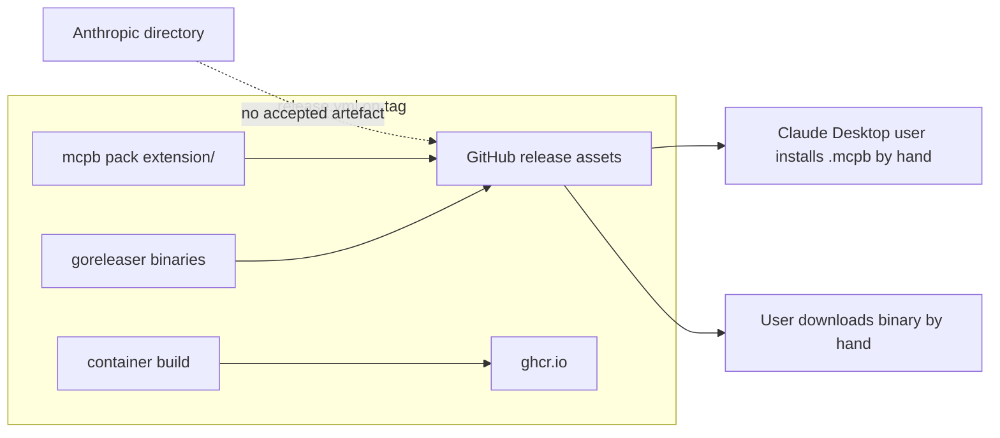
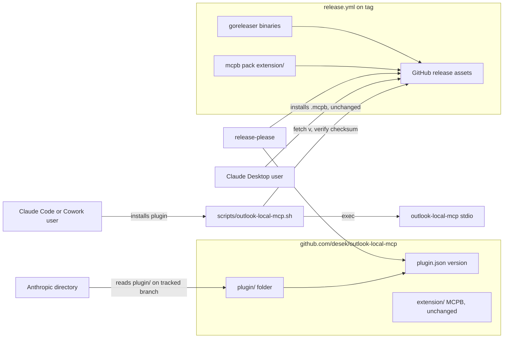
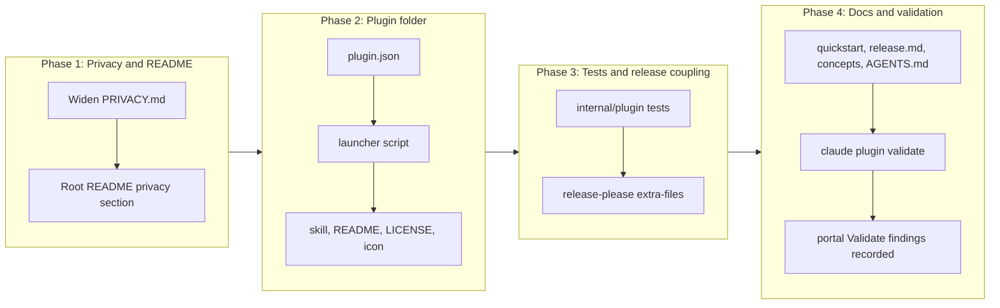

# Directory Plugin Bundle for Anthropic's Directory

## Change Summary

The project ships `v1.0.0-rc.1` as GitHub release binaries, container images, and an MCPB
desktop extension (`extension/`). None of those can be listed in Anthropic's directory:
the directory has deprecated desktop-extension listings and no longer accepts a local MCP
server packaged as an MCPB. The only accepted form for a local server is a **plugin
bundle** submitted from a public GitHub repository through the developer portal at
`claude.ai/directory/manage`.

This change adds a plugin bundle at `plugin/` that references the server as a local
stdio MCP server started by a launcher script inside the plugin folder, pairs it with one
skill that teaches Claude the domain and gate model, completes `PRIVACY.md` and adds the
README privacy section the directory requires, and wires the plugin version into
release-please so every release bumps it. The MCPB extension, its manifest, its
packaging targets, and the Claude Desktop install path **stay exactly as they are**; the
plugin is an additional distribution channel, not a replacement.

## Motivation and Background

Claude Marketplace (announced 2026-09-23) is the browsing surface; its submission path is
the directory. The directory accepts two listing kinds: an **MCP connector**, which must
be a remote `https://` server, and a **plugin bundle**, which is a folder in a GitHub
repository. A local server can only reach the directory inside a plugin bundle. Without a
plugin, this project is invisible to directory search even though it is a working,
released, OAuth-authenticated Microsoft 365 integration with 69 verbs.

A plugin whose only MCP component is a local server loads in **Claude Code** and in
**Cowork sessions that run on the user's computer**. Chat in claude.ai and the mobile apps
ignore local servers; the plugin's Connectors tab there marks it "Runs in each session".
This CR accepts that reach. Chat requires a remote server with OAuth and is out of scope
(see the passthrough-auth exploration under `.agents/explore/`).

The directory's automated validation and security scan impose constraints that shape the
design: no `.mcpb` fetched from a URL (blocks), compiled binaries in the plugin folder are
held for a reviewer and files over 256 KiB are held, package launchers must be pinned and
are still held, a top-level `bin/` makes chat and Cowork refuse the plugin, the MCP
command must be a plain file path from `${CLAUDE_PLUGIN_ROOT}`, and a local connector
without a complete privacy policy is **rejected immediately**.

## Change Drivers

* Anthropic's directory is the discovery surface inside Claude Code, Cowork, and
  claude.ai; the project has no listing there and cannot get one with its current
  artefacts.
* The directory's rules reject MCPB and local-server connector submissions outright,
  so the gap cannot be closed by metadata on the existing extension.
* The directory requires a privacy policy covering five named areas; `PRIVACY.md`
  covers three and names no contact or retention period, which is an immediate
  rejection.
* A listing gives a public install path that updates on every merge to the tracked
  branch, plus usage and error metrics the project has no other source for.

## Current State

Distribution today:

| Channel | Artefact | Where it is produced | Who can install |
| :- | :- | :- | :- |
| GitHub release | `outlook-local-mcp-{darwin-arm64,linux-amd64,windows-amd64}.{tar.gz,zip}`, `checksums.txt` | `release.yml` → goreleaser `binaries` build | Anyone, by hand |
| MCPB extension | `outlook-local-mcp.mcpb` | `release.yml` `release` job: `mcpb validate extension/manifest.json`, `mcpb pack extension/` | Claude Desktop users, double-click install |
| Container | `ghcr.io/desek/outlook-local-mcp:*` (scratch, distroless, debug) | `release.yml` `container` job | Headless and container users |
| `go install` | source build | none | Go developers |

`extension/manifest.json` (`manifest_version` 0.3) already carries `author`, `homepage`,
`documentation`, `support`, `icon`, `license`, `repository`, `keywords`, `user_config`
with four options, and `privacy_policies` pointing at `PRIVACY.md` over HTTPS. `version`
is `0.0.0` in source and set at pack time. `extension/manifest_test.go` asserts every
registered verb is named in its domain description; `TestManifestDescribesEveryRegisteredVerb`
in `internal/server/manifest_sync_test.go` derives that from the registry.

`PRIVACY.md` has sections "What Data Is Accessed" (lists calendar and account data only,
not mail, contacts, Teams, or attachments), "How Data Is Processed", "Credentials
Storage", "Third-Party Services", and "No Data Collection". It has no data-retention
statement and no contact information. The root `README.md` has no Privacy section.

The repository has 668 tracked files and a 1.77 MiB pack. There is no
`.claude-plugin/`, no `plugin/`, and no `skills/` directory. `release-please-config.json`
updates only the Go manifest; it has no `extra-files`.

### Current State Diagram



## Proposed Change

Add a plugin bundle as a subfolder, `plugin/`, of this repository. The subfolder is the
submission unit; the directory reads and scans only that folder, and the repository root
keeps its existing layout. The plugin contains:

```
plugin/
  .claude-plugin/plugin.json      manifest: identity, directory listing fields, userConfig, mcpServers
  .mcp.json                       (absent; the server is declared inline in plugin.json so one file carries the contract)
  scripts/outlook-local-mcp.sh    launcher: resolves platform, fetches the pinned release binary into ${CLAUDE_PLUGIN_DATA}, verifies checksum, execs
  skills/outlook/SKILL.md         when and how to use the six domains, the gates, the read-only and draft-only guarantees
  README.md                       listing description, ≥40 words, with a "Privacy Policy" section
  LICENSE                         copy of the root MIT licence
  icon.png                        copy of extension/icon.png
```

### The launcher, and why it is a script

The directory's checks leave exactly one shape for a Go server that is not blocked:

* A compiled binary committed into the plugin folder is a non-text file over 256 KiB
  (held for a reviewer) and three platforms would add roughly 45 MiB to a repository
  whose archive must stay under 50 MiB (validation stops).
* `mcpServers` pointing at the release `.mcpb` URL **blocks** ("bundle fetched from a URL").
* `npx`/`uvx`/`go run` are package launchers: held even when pinned, and `go run`
  requires a Go toolchain on the user's machine.
* A plain shell script named from `${CLAUDE_PLUGIN_ROOT}` with plain arguments is the
  documented form for a local server. A download it performs is "Files or downloads the
  validator couldn't inspect", which is a **reviewer hold, not a block**, and the README
  discloses it.

The launcher therefore:

1. Reads the plugin version from `${CLAUDE_PLUGIN_ROOT}/.claude-plugin/plugin.json`
   (the same string release-please bumps) and derives the release tag `v<version>`.
2. Resolves `uname -s`/`uname -m` to one of the goreleaser `binaries` names
   (`darwin-arm64`, `linux-amd64`); refuses any other platform with a fix instruction
   naming the MCPB and binary download alternatives.
3. Keeps the binary at `${CLAUDE_PLUGIN_DATA}/<version>/outlook-local-mcp`. If absent,
   downloads `https://github.com/desek/outlook-local-mcp/releases/download/v<version>/outlook-local-mcp-<platform>.tar.gz`
   and `checksums.txt`, verifies the SHA-256 with `shasum -a 256`/`sha256sum`, and
   extracts; on mismatch deletes the download and exits non-zero with a fix instruction.
4. `exec`s the binary with the environment the server config passed, so the MCP stdio
   contract is unchanged.

`${CLAUDE_PLUGIN_DATA}` survives plugin updates and is removed on uninstall, which is the
documented place for installed dependencies. Windows is not served by the plugin in this
CR; the launcher is POSIX shell and Windows users keep the MCPB and the release zip.

### Manifest

`plugin.json` carries the fields the directory and Claude Code read, derived from the
MCPB manifest so the two stay in step:

```json
{
  "name": "outlook-local-mcp",
  "displayName": "Outlook Local MCP",
  "version": "1.0.0-rc.1",
  "description": "...",
  "author": { "name": "Daniel Grenemark", "url": "https://github.com/desek" },
  "homepage": "https://outlook-local-mcp.com",
  "repository": "https://github.com/desek/outlook-local-mcp",
  "license": "MIT",
  "keywords": ["outlook", "calendar", "email", "contacts", "teams", "microsoft-graph", "microsoft-365"],
  "icon": "./icon.png",
  "documentationUrl": "https://outlook-local-mcp.com/docs/quickstart",
  "supportUrl": "https://github.com/desek/outlook-local-mcp/issues",
  "privacyPolicyUrl": "https://github.com/desek/outlook-local-mcp/blob/main/PRIVACY.md",
  "userConfig": { "client_id": {...}, "tenant_id": {...}, "auth_method": {...}, "timezone": {...},
                  "mail_enabled": {...}, "mail_manage_enabled": {...}, "contacts_enabled": {...}, "teams_enabled": {...} },
  "mcpServers": {
    "outlook": {
      "command": "${CLAUDE_PLUGIN_ROOT}/scripts/outlook-local-mcp.sh",
      "args": [],
      "env": { "OUTLOOK_MCP_CLIENT_ID": "${user_config.client_id}", "...": "..." }
    }
  }
}
```

Every `userConfig` option has a `default`, because Cowork ignores a server whose
referenced option has no default and does not prompt. The four feature gates are
`boolean` options defaulting to `false`, matching the server's defaults. No option is
`sensitive`: the client id and tenant id are not secrets, and the server never takes a
token or password through configuration.

### Skill

`skills/outlook/SKILL.md` is the part of the bundle a connector alone cannot carry: it
tells Claude to call `operation="help"` on a domain before guessing parameters, which
domains exist and which are gated, that every write verb confirms with the resource id
and that moves mint a new id, that `teams.compose_reply` returns text and sends nothing,
and that the server refuses writes in read-only mode. Its `description` is written as the
situations a user is in (reading mail, booking a meeting, finding a transcript), because
that is what Claude matches on.

### Privacy policy

`PRIVACY.md` gains the two missing required areas and widens the first to the current
surface:

* **What Data Is Accessed**: adds mail messages and attachments, mail folders, contacts
  and people, Teams chats, channel messages, online meetings and transcripts, each with
  the gate that enables it.
* **Data Retention**: tokens and auth records persist until sign-out or `account.remove`;
  the optional log file persists until the user deletes it and is PII-sanitised by
  default; the plugin launcher keeps the downloaded binary under `${CLAUDE_PLUGIN_DATA}`
  until the plugin is uninstalled; no message, event, or contact content is written to
  disk by the server.
* **Contact**: the GitHub issues URL and the security-advisory URL from `SECURITY.md`.
* **Third-Party Services**: adds `github.com` and `objects.githubusercontent.com`, which
  the plugin launcher contacts once per version to fetch the release binary.

The root `README.md` gains a `## Privacy Policy` section of two sentences linking to
`PRIVACY.md`, and `plugin/README.md` carries the same section, because the directory
reads the plugin folder's README.

### Release coupling

`release-please-config.json` gains an `extra-files` entry of type `json` for
`plugin/.claude-plugin/plugin.json` at `$.version`, so the version the launcher reads is
the version the tag carries, with no manual step. A test asserts the two agree on the
committed tree. The release workflow is otherwise unchanged; the plugin needs no build
because it fetches what the release already publishes.

### Proposed State Diagram



## Requirements

### Functional Requirements

1. The repository **MUST** contain a plugin folder at `plugin/` whose manifest is at
   `plugin/.claude-plugin/plugin.json` and whose `name` is `outlook-local-mcp`.
2. `plugin.json` **MUST** set `displayName`, `version`, `description`, `author.name`,
   `author.url`, `homepage`, `repository`, `license`, `keywords`, `icon`,
   `documentationUrl`, `supportUrl`, and `privacyPolicyUrl`, and every URL field
   **MUST** be `https://`.
3. `plugin.json` **MUST** declare the server inline under `mcpServers.outlook` with
   `command` equal to `${CLAUDE_PLUGIN_ROOT}/scripts/outlook-local-mcp.sh`, an `args`
   array, and an `env` map in which every server variable is a `${user_config.KEY}`
   reference to an option the same manifest declares.
4. `plugin.json` **MUST** declare `userConfig` options `client_id`, `tenant_id`,
   `auth_method`, `timezone`, `mail_enabled`, `mail_manage_enabled`, `contacts_enabled`,
   and `teams_enabled`, each with `type`, `title`, `description`, and a `default` equal
   to the server's own default for that variable; `auth_method` **MUST** carry `options`
   `["device_code", "browser", "auth_code"]`.
5. The plugin folder **MUST NOT** contain a top-level `bin/` directory, any compiled
   executable, any file over 256 KiB, any `.mcpb` or `.dxt` file, any package-manager
   configuration file, or any symbolic link.
6. The launcher **MUST** be a POSIX shell script at `plugin/scripts/outlook-local-mcp.sh`
   with the executable bit set, **MUST** take no arguments, and **MUST** reference no
   path other than `${CLAUDE_PLUGIN_ROOT}` and `${CLAUDE_PLUGIN_DATA}`.
7. The launcher **MUST** read the version from `plugin.json`, derive the release tag as
   `v` plus that version, and fetch the goreleaser `binaries` archive for the running
   platform from the GitHub release of that tag.
8. The launcher **MUST** verify the downloaded archive against `checksums.txt` from the
   same release before extracting it, and on mismatch **MUST** delete the download and
   exit non-zero with a fix instruction that names the expected and actual digest.
9. The launcher **MUST** store the extracted binary under `${CLAUDE_PLUGIN_DATA}/<version>/`
   and **MUST** reuse it without network access on every later start of the same version.
10. The launcher **MUST** `exec` the binary so the server process replaces the shell and
    receives the environment unchanged.
11. On a platform the release does not publish, the launcher **MUST** exit non-zero
    before any download with a fix instruction naming the MCPB extension and the release
    page as alternatives.
12. The plugin **MUST** contain one skill at `plugin/skills/outlook/SKILL.md` whose
    frontmatter has `name: outlook` and a single-string `description`, and whose body
    names the six domains, the four environment gates, `operation="help"`, the read-only
    mode, and the draft-only nature of `teams.compose_reply`.
13. `plugin/README.md` **MUST** contain at least 40 words outside code blocks, state what
    the plugin runs, fetches, and sends, name the two surfaces it loads on, and contain a
    `## Privacy Policy` section linking to `PRIVACY.md`.
14. `plugin/LICENSE` **MUST** be byte-identical to the root `LICENSE`.
15. `PRIVACY.md` **MUST** contain sections covering data collection, usage and storage,
    third-party sharing, data retention, and contact information, and its data-access
    section **MUST** name every resource class the current surface reads or writes:
    calendar events and attachments, mail messages, folders, drafts and attachments,
    free/busy and schedules, contacts and people, Teams chats, channel messages, online
    meetings and transcripts.
16. The root `README.md` **MUST** contain a `## Privacy Policy` section linking to
    `PRIVACY.md`.
17. `release-please-config.json` **MUST** list `plugin/.claude-plugin/plugin.json` as a
    JSON `extra-files` entry on `$.version`.
18. `plugin.json` `version` **MUST** equal `.release-please-manifest.json`'s `"."` value
    on every commit, and a test **MUST** assert it.
19. `extension/manifest.json`, `extension/README.md`, the `mcpb-*` Makefile targets, and
    the `release` job of `release.yml` **MUST NOT** change.
20. `claude plugin validate ./plugin` **MUST** print `Validation passed` with no warnings
    on Claude Code 2.1.288.
21. `docs/quickstart.md` **MUST** gain an install path for the plugin (Claude Code
    `/plugin` from the directory or `claude --plugin-dir ./plugin` from a checkout) beside
    the existing Claude Desktop and generic MCP client paths.
22. `docs/reference/release.md` **MUST** gain a section describing the plugin as a
    release surface: what the launcher fetches, how its version is bumped, and the
    submission and update procedure through the developer portal.

### Non-Functional Requirements

1. The launcher **MUST** complete a warm start (binary already present) without any
   network call, so an offline machine with a cached binary starts the server.
2. The launcher **MUST** write diagnostics to stderr only; stdout is the MCP stdio
   channel and **MUST** carry nothing the launcher emits.
3. Every error the launcher emits **MUST** carry what failed, the fix, and what to
   verify, in the project's actionable-error shape.
4. The plugin folder **MUST** contain fewer than 20 files, so the 512-file reviewer hold
   and the 5,000-file install limit are not approached.
5. No governance identifier **MUST** appear in `plugin/`, in `PRIVACY.md`, or in any
   test name this change adds.
6. The launcher **MUST** be covered by a test that runs it against a local HTTP server
   standing in for GitHub releases, so its download, checksum, cache, and refusal paths
   are exercised without network access.

## Affected Components

* `plugin/.claude-plugin/plugin.json` (new)
* `plugin/scripts/outlook-local-mcp.sh` (new)
* `plugin/skills/outlook/SKILL.md` (new)
* `plugin/README.md`, `plugin/LICENSE`, `plugin/icon.png` (new)
* `PRIVACY.md`, `README.md`
* `release-please-config.json`
* `internal/plugin/plugin_test.go` (new; manifest and version-sync assertions),
  `internal/plugin/launcher_test.go` (new; launcher behaviour against a local release
  server), `internal/plugin/doc.go` (new)
* `docs/quickstart.md`, `docs/reference/release.md`, `docs/concepts.md` (install surfaces
  paragraph), `docs/prompts/mcp-tool-crud-test.md` (no step changes; the harness drives
  the binary, not the plugin)
* `.gitignore` (nothing new to ignore; the launcher writes outside the repository)
* `AGENTS.md` project structure: one line for `plugin/`

## Scope Boundaries

### In Scope

* The plugin folder, its manifest, launcher, skill, README, licence copy, and icon.
* Privacy policy completion to the directory's five required areas and the current
  resource surface.
* Release-please version coupling and the version-sync test.
* Launcher tests against a local stand-in for the release host.
* Documentation of the new install path and release surface.
* Running `claude plugin validate ./plugin` and the portal's **Validate** step, and
  recording the portal's findings in the implementation notes.

### Out of Scope ("Here, But Not Further")

* **Any change to the MCPB extension.** `extension/` and its packaging stay as they are.
  The directory no longer lists it, but Claude Desktop users install it from the GitHub
  release exactly as before.
* **A remote MCP connector.** Chat in claude.ai and mobile need an `https://` server with
  OAuth. That is a hosting and multi-tenant design (see
  `.agents/explore/2026-09-01-passthrough-auth-multi-tenant-serving.md`) and its own CR.
* **Windows support in the plugin launcher.** The launcher is POSIX shell. Windows users
  keep the MCPB and the release zip. A `.cmd` launcher and the portal's treatment of it
  are a follow-on once the POSIX path is listed.
* **Submitting the listing and answering the portal's data-handling and compliance
  steps.** Those are the publisher's actions in a logged-in portal; this CR delivers the
  repository state they need and documents the steps.
* **Reviewer-hold outcomes.** The download in the launcher is a known reviewer hold. This
  CR does not try to avoid the hold, because every alternative blocks.
* **Tool-level `title` annotations for the connector checklist.** They apply to remote
  connector submissions; the aggregate tools already set titles and no verb-level change
  is made.

## Alternative Approaches Considered

* **Commit the binaries into `plugin/`.** Three platforms at roughly 15 MiB each exceed
  the 50 MiB archive ceiling, so validation stops; one platform still triggers the
  non-text and 256 KiB holds and pins users to one architecture per release. Rejected.
* **`mcpServers` pointing at the release `.mcpb`.** Claude Code supports it, and it would
  reuse the existing artefact unchanged, but the directory blocks a bundle fetched from a
  URL. Rejected for the listing; still a valid local install for Claude Code users and
  documented as such.
* **Plugin at the repository root.** Removes the subfolder-specific "scripts the
  validator couldn't follow" hold, but makes the whole 668-file repository the plugin
  (held at 512 files), ships `site/`, `docs/`, and Go source to every installer, and
  turns the root README into the listing. Rejected.
* **`go run github.com/desek/outlook-local-mcp/cmd/outlook-local-mcp@v1.0.0-rc.1`.**
  Pinned, but a package install from the network (held) that needs a Go toolchain on
  the user's machine. Rejected.
* **Rewrite the server in a language the scanner reads.** Out of proportion; the hold on a
  downloaded Go binary is the documented path for compiled servers. Rejected.

## Impact Assessment

### User Impact

Claude Code and Cowork users gain a one-click install from the directory that updates on
every release. Claude Desktop users see no change. Users of the launcher see one network
fetch per version and one incremental-consent prompt on first sign-in, as today. Windows
users of Claude Code are told, by the launcher's refusal text, to use the MCPB or the
release zip.

### Technical Impact

No Go production code changes. A new test package `internal/plugin` reads `plugin/`
and drives the launcher. `release-please-config.json` gains one entry; a mistake there
would leave `plugin.json` at the old version and the version-sync test fails the build.
The launcher adds `curl` (or `wget`), `tar`, and `shasum`/`sha256sum` as runtime
prerequisites on the user's machine; all four ship with macOS and every mainstream Linux.

### Business Impact

A directory listing is the only discovery surface inside Claude's own apps. The listing
is Community by default; Verified is Anthropic's decision and cannot be applied for.
The first submission is expected to be held for a reviewer because of the download; the
hold is a review, not a rejection, and the README disclosure is what the reviewer reads.

## Implementation Approach

### Implementation Flow



### Phase 1: Privacy and README

Affected components: `PRIVACY.md`, `README.md`.

1. Rewrite "What Data Is Accessed" to list every resource class by domain and gate.
2. Add "Data Retention" and "Contact" sections; add GitHub to "Third-Party Services" with
   the launcher as the reason.
3. Add `## Privacy Policy` to the root README, two sentences and a link.
4. Add `TestPrivacyPolicyCoversRequiredAreas` in `internal/docs/catalog_test.go`'s
   package style but reading `PRIVACY.md` from the repository root: asserts the five
   headings and that each gated resource class name appears.

### Phase 2: Plugin folder

Affected components: everything under `plugin/`.

1. Write `plugin.json` per the Manifest section; copy `userConfig` text from
   `extension/manifest.json` and add the four gate booleans with their inventory
   descriptions from `internal/config/inventory.go`.
2. Write `scripts/outlook-local-mcp.sh`: `set -eu`; read version with a `sed` over
   `plugin.json` (no `jq` dependency); platform map; cache path; download with `curl -fsSL`
   falling back to `wget -qO-`; checksum verify; `tar -xzf`; `chmod +x`; `exec`. Every
   failure path prints the actionable-error shape to stderr.
3. Write the skill, README (with the privacy section and the disclosure of what the
   launcher fetches), copy `LICENSE` and `extension/icon.png`.
4. Run `claude plugin validate ./plugin` and `claude --plugin-dir ./plugin` against a
   real session; confirm `/mcp` shows `outlook` connected and `operation="help"` answers.

### Phase 3: Tests and release coupling

Affected components: `internal/plugin/*`, `release-please-config.json`.

1. `internal/plugin/plugin_test.go`: parse `plugin.json`; assert every FR-2 field, every
   `${user_config.KEY}` in `env` resolves to a declared option, every option has a
   default, `auth_method.options` matches the server's accepted values, no file in
   `plugin/` exceeds 256 KiB or is executable except the launcher, no `bin/`, and
   `version` equals the release-please manifest.
2. `internal/plugin/launcher_test.go`: start an `httptest.Server` serving a fake release
   (a tiny shell script tarred as the binary, and a matching `checksums.txt`); run the
   launcher with `CLAUDE_PLUGIN_ROOT` pointing at a temp copy of `plugin/` whose
   `plugin.json` version is `0.0.0-test`, `CLAUDE_PLUGIN_DATA` at a temp dir, and the
   release base URL overridden through an environment variable the script honours only
   when set; assert cold start downloads and execs, warm start makes no request, bad
   checksum refuses and leaves no binary, unsupported platform refuses before any request.
3. Add the `extra-files` entry and assert in the test that the config names the file.

### Phase 4: Docs and validation

Affected components: `docs/quickstart.md`, `docs/reference/release.md`,
`docs/concepts.md`, `AGENTS.md`.

1. Quickstart: a "Claude Code and Cowork (plugin)" install subsection.
2. Release reference: "Plugin bundle" section with the portal procedure, the tracked
   branch (`main`), the webhook, and the expected reviewer hold.
3. Concepts: one paragraph in the install-surfaces area naming where each artefact loads.
4. `AGENTS.md` project structure line for `plugin/`.
5. Run the portal's **Validate** on the pushed branch and record every finding and its
   result in the CR's Implementation Status.

## Test Strategy

### Tests to Add

| Test File | Test Name | Description | Inputs | Expected Output |
|-----------|-----------|-------------|--------|-----------------|
| `internal/plugin/plugin_test.go` | `TestPluginManifestDeclaresListingFields` | Every FR-2 field present and every URL is `https://` | `plugin/.claude-plugin/plugin.json` | pass |
| `internal/plugin/plugin_test.go` | `TestPluginServerEnvReferencesDeclaredOptions` | Each `${user_config.KEY}` in `mcpServers.outlook.env` names a `userConfig` key with a default | manifest | pass; a stray key fails |
| `internal/plugin/plugin_test.go` | `TestPluginAuthMethodOptionsMatchServer` | `auth_method.options` equals the server's accepted set | manifest, `internal/config` | pass |
| `internal/plugin/plugin_test.go` | `TestPluginFolderHasNoBlockedFiles` | No `bin/`, no file over 256 KiB, no `.mcpb`/`.dxt`, launcher is the only executable, fewer than 20 files | `plugin/` tree | pass |
| `internal/plugin/plugin_test.go` | `TestPluginVersionMatchesReleaseManifest` | `plugin.json` version equals `.release-please-manifest.json` `"."` and `release-please-config.json` lists the file in `extra-files` | both files | pass |
| `internal/plugin/launcher_test.go` | `TestLauncherColdStartFetchesVerifiesAndExecs` | First start downloads archive and checksums, verifies, extracts, execs | fake release server | exactly two GETs; binary present; stub exec output on stdout |
| `internal/plugin/launcher_test.go` | `TestLauncherWarmStartMakesNoRequest` | Second start with cached binary | same temp data dir | zero GETs |
| `internal/plugin/launcher_test.go` | `TestLauncherRefusesChecksumMismatch` | Tampered archive | fake server | non-zero exit, stderr names both digests, no binary left |
| `internal/plugin/launcher_test.go` | `TestLauncherRefusesUnsupportedPlatform` | `uname` stub returns an unpublished platform | PATH-shimmed `uname` | non-zero exit before any request, stderr names MCPB and release page |
| `internal/plugin/launcher_test.go` | `TestLauncherWritesNothingToStdoutBeforeExec` | Stdout is reserved for MCP | all paths | stdout empty until exec |
| `internal/docs/privacy_test.go` | `TestPrivacyPolicyCoversRequiredAreas` | Five required headings and every gated resource class named | `PRIVACY.md` | pass |
| `internal/docs/privacy_test.go` | `TestReadmesLinkPrivacyPolicy` | Root and plugin READMEs have `## Privacy Policy` linking `PRIVACY.md` | both READMEs | pass |

### Tests to Modify

| Test File | Test Name | Current Behavior | New Behavior | Reason for Change |
|-----------|-----------|------------------|--------------|-------------------|
| none | | | | No existing test observes the plugin folder or the privacy policy, and the MCPB tests are untouched by design |

### Tests to Remove

| Test File | Test Name | Reason for Removal |
|-----------|-----------|-------------------|
| none | | Nothing is removed |

### Existing Tests That Gate This Change Without Modification

* `extension/manifest_test.go` `TestManifest_NewTools` and
  `internal/server/manifest_sync_test.go` `TestManifestDescribesEveryRegisteredVerb`
  prove the MCPB manifest is unchanged in meaning (FR-19).
* `internal/docs` bundle tests prove `docs/quickstart.md` and `docs/concepts.md` still
  embed and stay under budget after the new sections.

## Model-Based Testing

| Scenario | User Goal | User Surface | Success Condition | Criteria Proved | Scenario Record |
|----------|-----------|--------------|-------------------|-----------------|-----------------|
| Install from checkout | Use the server in Claude Code from the plugin, no manual binary handling | command line (`claude --plugin-dir ./plugin`) | `/mcp` lists `outlook` as connected; `{tool:"system", args:{operation:"status"}}` returns the version in `plugin.json`; `${CLAUDE_PLUGIN_DATA}/<version>/outlook-local-mcp` exists | AC-3, AC-4 | `.agents/scenarios/` (written at implementation) |
| Offline warm start | Start the server with no network after one successful start | command line, network disabled | server answers `status`; no process other than the cached binary ran | AC-5 | same |
| Portal validation | Get a validation report with no **Blocks** result | browser (`claude.ai/directory/manage`, Submit new, Plugin bundle, Validate) | report shows zero Blocks; any holds are the launcher download and nothing else | AC-8 | same |

## Acceptance Criteria

### AC-1: The plugin folder exists and validates locally

```gherkin
Given the repository at the implementing commit
When `claude plugin validate ./plugin` runs with Claude Code 2.1.288
Then it prints "Validation passed" and no warning
  And `plugin/.claude-plugin/plugin.json` names the plugin `outlook-local-mcp`
```

### AC-2: The manifest carries every directory listing field

```gherkin
Given `plugin/.claude-plugin/plugin.json`
When the listing fields are read
Then displayName, version, description, author, homepage, repository, license, keywords, icon, documentationUrl, supportUrl and privacyPolicyUrl are present
  And every URL field starts with "https://"
```

### AC-3: The server is declared as a plain launcher with resolvable options

```gherkin
Given `mcpServers.outlook` in the manifest
When its command, args and env are read
Then the command is "${CLAUDE_PLUGIN_ROOT}/scripts/outlook-local-mcp.sh" and args is an array
  And every env value is a "${user_config.KEY}" whose KEY is a declared userConfig option with a default
  And `auth_method` declares options device_code, browser and auth_code
```

### AC-4: A cold start fetches the pinned release, verifies it, and execs

```gherkin
Given a fake release server for version 0.0.0-test and an empty CLAUDE_PLUGIN_DATA
When the launcher starts
Then it requests the platform archive and checksums.txt once each
  And the SHA-256 matches before extraction
  And the binary runs as the launcher's process with stdout untouched before exec
```

### AC-5: A warm start is offline

```gherkin
Given CLAUDE_PLUGIN_DATA already holds the binary for the manifest version
When the launcher starts
Then no HTTP request is made
  And the cached binary runs
```

### AC-6: Integrity and platform failures refuse with a fix

```gherkin
Given a tampered archive or an unpublished platform
When the launcher starts
Then it exits non-zero before any binary runs
  And stderr states what failed, the fix, and what to verify
  And no partial binary remains under CLAUDE_PLUGIN_DATA
```

### AC-7: The privacy policy meets the directory's required coverage

```gherkin
Given PRIVACY.md and both READMEs
When the headings are read
Then PRIVACY.md covers data collection, usage and storage, third-party sharing, data retention and contact information
  And it names mail, attachments, contacts, people, Teams messages, meetings and transcripts beside calendar
  And README.md and plugin/README.md each contain a "## Privacy Policy" section linking to PRIVACY.md
```

### AC-8: The plugin folder contains nothing the directory blocks

```gherkin
Given the plugin/ tree
When its files are listed
Then there is no bin/ directory, no .mcpb or .dxt file, no file over 256 KiB, no symbolic link and no package-manager configuration file
  And the only executable is scripts/outlook-local-mcp.sh
  And the portal's Validate report shows no Blocks result
```

### AC-9: Versions are coupled through release-please

```gherkin
Given release-please-config.json and the committed tree
When the version-sync test runs
Then plugin.json version equals .release-please-manifest.json "."
  And release-please-config.json lists plugin/.claude-plugin/plugin.json as a json extra-file on $.version
```

### AC-10: The MCPB extension is unchanged

```gherkin
Given the implementing commit range
When `git diff --stat <base>..HEAD -- extension/ Makefile .github/workflows/release.yml` runs
Then extension/manifest.json, extension/README.md, the mcpb-* targets and the release job show no change
```

### AC-11: The documentation names the new install path

```gherkin
Given docs/quickstart.md, docs/reference/release.md and AGENTS.md
When they are read
Then the quickstart has a plugin install path for Claude Code and Cowork beside the Claude Desktop path
  And release.md describes the plugin as a release surface with the portal procedure
  And AGENTS.md's project structure lists plugin/
```

## Quality Standards Compliance

### Build & Compilation

- [ ] `make build` passes
- [ ] No new compiler warnings

### Linting & Code Style

- [ ] `make lint` passes with 0 issues
- [ ] `shellcheck plugin/scripts/outlook-local-mcp.sh` passes
- [ ] `claude plugin validate ./plugin` passes with no warnings

### Test Execution

- [ ] `make test` passes, including the new `internal/plugin` package
- [ ] `make ci` exits 0 with a clean tree

### Documentation

- [ ] `PRIVACY.md`, both READMEs, quickstart, release reference, concepts and `AGENTS.md` updated
- [ ] No governance identifier appears in `plugin/`, `PRIVACY.md`, or any added test name

### Code Review

- [ ] Changes submitted via pull request
- [ ] PR title follows Conventional Commits (`feat(plugin): …`)
- [ ] Code review completed and approved
- [ ] Changes squash-merged

### Verification Commands

```bash
make ci
shellcheck plugin/scripts/outlook-local-mcp.sh
claude plugin validate ./plugin
claude --plugin-dir ./plugin   # then /mcp and a system status call
git diff --stat main..HEAD -- extension/ Makefile .github/workflows/release.yml   # must be empty
```

## Risks and Mitigation

### Risk 1: The reviewer rejects the download-at-start launcher

**Likelihood:** medium
**Impact:** high
**Mitigation:** The README states exactly what is fetched, from which host, pinned to
the plugin version, and checksum-verified; the launcher refuses on mismatch. Every
alternative the directory offers for a compiled server blocks rather than holds. If the
reviewer still refuses, the fallback is a plugin that ships only the skill and documents
the MCPB and release installs, which keeps a listing while losing one-click install.

### Risk 2: Cowork ignores the server because an option lacks a default

**Likelihood:** low
**Impact:** medium
**Mitigation:** FR-4 requires a default on every option and
`TestPluginServerEnvReferencesDeclaredOptions` asserts it.

### Risk 3: Portal checks change between authoring and submission

**Likelihood:** medium
**Impact:** low
**Mitigation:** Phase 4 runs the portal's Validate on the pushed branch and records the
findings; the local checks in `internal/plugin` encode the documented rules as of
2026-10-03 and are updated when the portal disagrees.

### Risk 4: `release-please` extra-files does not bump a prerelease string

**Likelihood:** low
**Impact:** medium
**Mitigation:** `TestPluginVersionMatchesReleaseManifest` fails `make ci` on the release
PR if the bump did not land, before the tag is created.

### Risk 5: Windows Claude Code users install the plugin and get a refusal

**Likelihood:** medium
**Impact:** low
**Mitigation:** The refusal text names the MCPB and the release zip; the README states
the supported platforms in its first paragraph; a Windows launcher is the named follow-on.

## Dependencies

* `v1.0.0-rc.1` release assets exist on GitHub (they do).
* A claude.ai account on a paid plan with GitHub connected, to run the portal's Validate
  in Phase 4.
* `shellcheck` available locally or in CI for the lint box; add to `.mise.toml` if absent.

## Estimated Effort

| Phase | Hours |
| :- | :- |
| 1 Privacy and README | 1.5 |
| 2 Plugin folder | 4 |
| 3 Tests and release coupling | 4 |
| 4 Docs, local validate, portal validate | 2.5 |
| **Total** | **12** |

## Decision Outcome

Chosen approach: "a `plugin/` subfolder with a checksum-verifying POSIX launcher that
fetches the already-published release binary, one skill, and a completed privacy policy,
leaving the MCPB extension untouched", because it is the only shape the directory does
not block for a compiled local server, it reuses the release artefacts without a second
build pipeline, and it adds a distribution channel instead of replacing one.

## Related Items

* CR-0077 (site trust pages): the `documentationUrl` target.
* CR-0078 to CR-0083: the surface the privacy policy must now describe.
* `.agents/explore/2026-09-01-passthrough-auth-multi-tenant-serving.md`: the remote
  connector path this CR excludes.
* `docs/reference/release.md`: owner of the release-surface description this CR extends.

## More Information

Sources read on 2026-10-03: `claude.com/docs/connectors/building/submission`,
`claude.com/docs/plugins/submit`, `claude.com/docs/plugins/pre-submission-checklist`,
`claude.com/docs/plugins/build`, `claude.com/docs/plugins/platform-support`,
`claude.com/docs/directory/publish`, `code.claude.com/docs/en/plugins/manifest-reference`,
`claude.com/blog/claude-marketplace`. The portal at `claude.ai/directory/manage` requires
a logged-in paid account and was not read.
