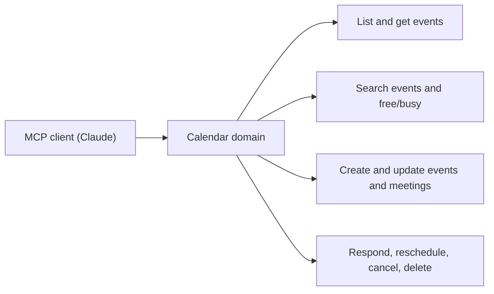
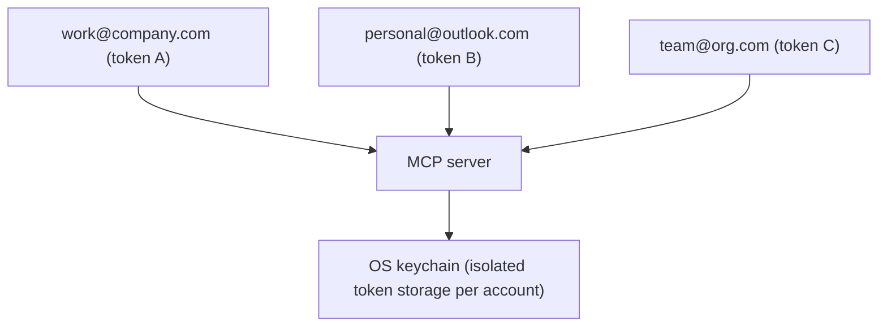
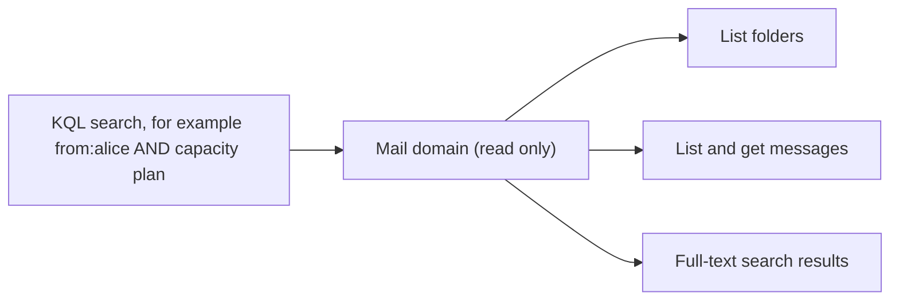
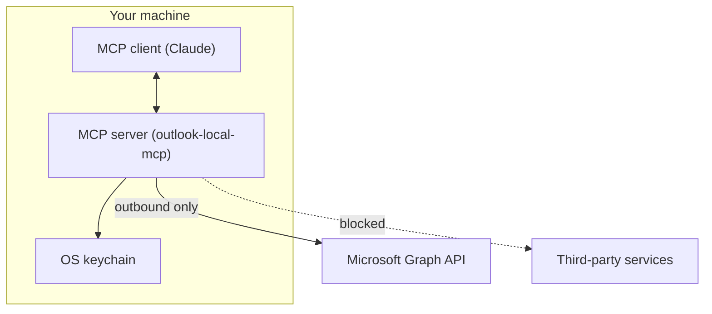
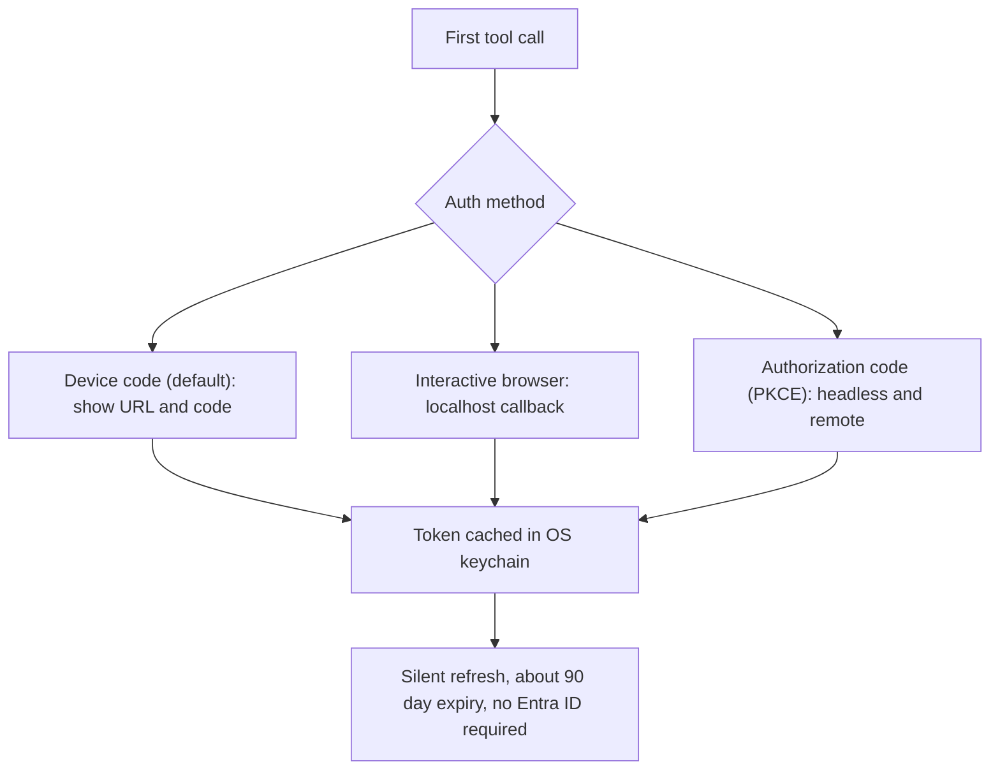

# Your AI's native interface to Outlook.

## Connect Claude to your calendar. No servers. No registration. Just your data, locally.

A Model Context Protocol server that connects Claude — or any MCP client — directly to Microsoft Calendar and Mail via the Graph API. All data stays on your machine. OAuth tokens live in your OS keychain. The server process never leaves localhost.

## 23 tools. 5 domains. Every calendar operation covered.

### Calendar Management14 tools

Read, search, create, update, and delete calendar events and meetings. Check free/busy availability across accounts.

Meeting tools include attendee confirmation guidance and extra warnings for external attendees — the LLM won't accidentally spam a meeting invite without a check.

### Multi-Account3 tools

Add, list, and remove Microsoft accounts at runtime. Each account gets isolated token storage. Accounts persist across restarts.

Lazy auth — no credentials required at startup. Authentication triggers on first tool call per account.

### Mail Access (opt-in)4 tools

Read-only access to mailbox folders, messages, and full-text search via KQL. Disabled by default; enabled with one env var.

Opt-in only. Set OUTLOOK_MCP_MAIL_ENABLED=true. Never writes to mail.

### Local Privacy & Security

No data routing through third parties. Every credential and token stays on your machine.

AES-256-GCM encrypted file fallback when OS keychain is unavailable. OData injection protection on all inputs.

- OAuth tokens in macOS Keychain / Linux libsecret / Windows DPAPI

- AES-256-GCM encrypted file fallback

- Only outbound: Graph API + Microsoft Identity Platform

- PII sanitization built into structured logging

- OData injection protection on all inputs

- Read-only mode via single env var

### Zero-Config Auth

Three auth methods, all requiring ZERO ENTRA ID app registration.

Token expiry is ~90 days. Silent refresh is automatic. First-time auth is a one-time browser action.

Displays URL + code. Works in headless environments.

Opens system browser, listens on localhost.

For fully headless/remote setups.

**Calendar management operations**

**Multi-account isolation**

**Opt-in mail access and search**

**Local privacy boundary**

**Zero-config authentication**

## Outlook Local MCP.

## Install. Configure. Done.

### Install

### Configure

### First Run

No credential setup before first use. On first tool call, a device code URL displays. Complete auth once in a browser. Tokens are cached in your OS keychain for ~90 days.

## Every credential stays on your machine.

No data routing through third parties. Verifiable, auditable, explainable to your security team. The architecture proves the claims.

### OS-Native Token Storage

OAuth tokens stored in macOS Keychain, Linux libsecret, or Windows DPAPI. Your credentials never leave your operating system's secure enclave.

### AES-256-GCM Fallback

When the OS keychain is unavailable, tokens are encrypted with AES-256-GCM in a local file. No plaintext credentials, ever.

### Outbound Only

Only two outbound connections: Microsoft Graph API and Microsoft Identity Platform. No inbound servers, no listening ports, no attack surface.

### PII Sanitization

Structured logging with PII sanitization enabled by default. Event subjects, attendee emails, and message content are stripped from logs.

### OData Injection Protection

All user inputs validated and escaped before reaching the Graph API. OData query injection is blocked at the request construction layer.

### Read-Only Mode

Set OUTLOOK_MCP_READ_ONLY=true to disable all write operations. Perfect for evaluation or security-restricted environments.

Optional OpenTelemetry export (OTLP gRPC) — zero overhead when disabled. Per-tool audit logging, structured JSON output, configurable log levels. Exponential backoff retry on transient Graph API errors. Graceful SIGINT/SIGTERM shutdown.

## Your AI assistant just got a upgraded.

A Model Context Protocol server for Microsoft Calendar & Mail. All data stays on your machine.

### Product

- Features

- Getting Started

- Tool Reference

- Config Reference

### Developer

- GitHub↗

- Report an Issue↗

- Changelog↗

### Built For

Built for Claude, works with any MCP client. Connect your AI assistant to Microsoft Calendar and Mail without leaving your local machine.
